<!-- Part 1 / 4 -->

# 2026

# 考研西医临床医学综合能力

# 历年真题精析 (下册)

武汉大学中南医院

# 贺银成

编著

正版专享

银成教育全国合作机构指定用书

读者增值服务

(详见书内封二彩页)


贺银成直播间

互动直播

经典录播

在线答疑

优质题库


<details>
<summary>text_image</summary>

特色
课程
</details>

# 真题线上训练营

# 30天带学15年西综真题 备考中期首选

√ 大师带学：贺神提分方法亲授

真题日练：真题刷题技巧讲解

√ 课后答疑：资深助教答疑解惑

√ 精准复盘：学习弱项查漏补缺


<details>
<summary>text_image</summary>

银成教育
www.jincao.com
2019NO42A鉴别胸摩擦音与心包摩擦音最关键的要点是
A. 听诊的部位不同
B. 与呼吸运动的关系
C. 与体位的关系
D. 摩擦音的性质不同 ——B
吸气
呼气
本课程仅供银成学员使用，尊重版权，源泉必究！
介绍 课程 详解
丙科学-01(57分/8)
例:6.00734, 总第1%?
丙科学-02(43分/8)
例:5.0092, 总第1%
丙科学-03(56分/8)
例:5.0063, 总第2%
丙科学-04(42分/8)
例:5.00224, 总第3%
丙科学-05(48分/8)
例:5.00156, 总第4%
本课程仅供银成学员使用，尊重版权，源泉必究！
</details>


<details>
<summary>text_image</summary>

2026西成考研西综
西综重要考点
背记材料
生理学思维导图
生化道路简图
内科重点背诵图表
中毒小鸽子
赠
西成内部资料
</details>

西综课程 在线咨询

重点资料 免费领取

一键直达


<details>
<summary>text_image</summary>

QR code with a central logo, likely linking to a digital resource or website
</details>

# 2026

# 考研西医临床医学综合能力

# 历年真题精析 (下册)

武汉大学中南医院

# 贺银成

编著

图书在版编目(CIP)数据

2026 考研西医临床医学综合能力历年真题精析：上、下册 / 贺银成编著. -- 武汉：华中科技大学出版社，2025. 3. -- ISBN 978-7-5772-1705-5

I. R4-44

中国国家版本馆 CIP 数据核字第 20252X8M64 号

2026 考研西医临床医学综合能力历年真题精析(上、下册)

贺银成 编著

2026 Kaoyan Xiyi Linchuang Yixue Zonghe Nengli Linian Zhenti Jingxi

总策划：车巍

策划编辑：莫愚彭斌

责任编辑：丁平

封面设计：MXX DESIGN STUDIO Q:1765628429 廖亚萍

责任校对：刘竣

责任监印：朱 玲

出版发行：华中科技大学出版社(中国·武汉) 电话：(027)81321913

武汉市东湖新技术开发区华工科技园 邮编：430223

录 排：华中科技大学惠友文印中心

印刷：三河市龙大印装有限公司

开 本: $787\mathrm{mm}\times 1092\mathrm{mm}$ 1/16

印 张: 57.5

字 数：1741 千字

版次：2025年3月第1版第1次印刷

定 价：149.00元

# 下册

2025 年全国硕士研究生招生考试临床医学综合能力(西医)试题答案及详细解答 …… (401)  
2024年全国硕士研究生招生考试临床医学综合能力(西医)试题答案及详细解答 …… (416)  
2023年全国硕士研究生招生考试临床医学综合能力(西医)试题答案及详细解答 …… (432)  
2022年全国硕士研究生招生考试临床医学综合能力(西医)试题答案及详细解答 …… (447)  
2021年全国硕士研究生招生考试临床医学综合能力(西医)试题答案及详细解答 …… (461)  
2020 年全国硕士研究生招生考试临床医学综合能力(西医)试题答案及详细解答 …… (478)  
2019年全国硕士研究生招生考试临床医学综合能力(西医)试题答案及详细解答 …… (493)  
2018 年全国硕士研究生招生考试临床医学综合能力(西医)试题答案及详细解答 …… (509)  
2017 年全国硕士研究生招生考试临床医学综合能力(西医)试题答案及详细解答 …… (526)  
2016 年全国硕士研究生入学统一考试西医综合试题答案及详细解答 …… (542)  
2015年全国硕士研究生入学统一考试西医综合试题答案及详细解答 …… (560)  
2014年全国硕士研究生入学统一考试西医综合试题答案及详细解答 …… (579)  
2013年全国硕士研究生入学统一考试西医综合试题答案及详细解答 …… (601)  
2012年全国硕士研究生入学统一考试西医综合试题答案及详细解答 …… (620)  
2011 年全国硕士研究生入学统一考试西医综合试题答案及详细解答 …… (637)  
2010 年全国硕士研究生入学统一考试西医综合试题答案及详细解答 …… (655)  
2009 年全国硕士研究生入学统一考试西医综合试题答案及详细解答 …… (673)  
2008 年全国硕士研究生入学统一考试西医综合试题答案及详细解答 …… (690  
2007 年全国硕士研究生入学统一考试西医综合试题答案及详细解答 …… (707  
2006 年全国硕士研究生入学统一考试西医综合试题答案及详细解答 …… (729)  
2005 年全国硕士研究生入学统一考试西医综合试题答案及详细解答 …… (746)

2004年全国硕士研究生入学统一考试西医综合试题答案及详细解答 …… (761)  
2003 年全国硕士研究生入学统一考试西医综合试题答案及详细解答 …… (775)  
2002年全国硕士研究生入学统一考试西医综合试题答案及详细解答 …… (788)  
2001 年全国硕士研究生入学统一考试西医综合试题答案及详细解答 …… (801)  
2000年全国硕士研究生入学统一考试西医综合试题答案及详细解答 …… (814)  
1999 年全国硕士研究生入学统一考试西医综合试题答案及详细解答 …… (828)  
1998 年全国硕士研究生入学统一考试西医综合试题答案及详细解答 …… (842)  
1997 年全国硕士研究生入学统一考试西医综合试题答案及详细解答 …… (854)  
1996 年全国硕士研究生入学统一考试西医综合试题答案及详细解答 …… (865)  
1995 年全国硕士研究生入学统一考试西医综合试题答案及详细解答 …… (877)  
1994 年全国硕士研究生入学统一考试西医综合试题答案及详细解答 …… (890)

# 2025年全国硕士研究生招生考试临床医学综合能力(西医)试题答案及详细解答

# (答案为绿色的选项)

1. ABCD ①人体的体液分为细胞内液和细胞外液,细胞外液是体内细胞直接接触和生存的环境,称为内环境,包括血浆、组织液、淋巴液和脑脊液等。②胃肠消化液与外环境相连通,不属于内环境的范畴。  
2. ABCD ①钙泵也称 $\mathrm{Ca}^{2+}$ -ATP 酶,广泛分布于哺乳动物细胞的细胞膜和内质网膜上。分布于细胞膜上的钙泵称为质膜钙 ATP 酶(PMCA),分布于内质网膜上的钙泵称为内质网 ATP 酶(SERCA)。这两种钙泵均具有特异性的 $\mathrm{Ca}^{2+}$ 结合位点,当胞质内 $\mathrm{Ca}^{2+}$ 浓度升高时, $\mathrm{Ca}^{2+}$ 通过与钙调蛋白的结合而刺激钙泵活动(B 错、C 对)。②PMCA 每分解 1 分子 ATP,可将其结合的 1 个 $\mathrm{Ca}^{2+}$ 由胞质内转运至胞外; SERCA 每分解 1 分子 ATP,可将 2 个 $\mathrm{Ca}^{2+}$ 从胞质转运至内质网中(A 错)。③两种钙泵的共同作用可使胞质内游离 $\mathrm{Ca}^{2+}$ 浓度保持在较低的水平,仅为细胞外液 $\mathrm{Ca}^{2+}$ 浓度的万分之一(D 错)。  
3. ABCD 静息状态下,细胞膜两侧存在内负外正的电荷分布,称为极化。将正、负两个刺激电极都置于细胞膜外侧(注意是外侧而不是内侧)时,正极下方膜的极化状态增强,产生超极化电紧张电位;负极下方产生去极化电紧张电位,相当于给细胞内注入了正电流(D对)。


<details>
<summary>natural_image</summary>

Simple diagram of a sphere with positive and negative charges, connected by a rectangular box (no text or symbols)
</details>

细胞静息电位及其所受刺激


<details>
<summary>flowchart</summary>

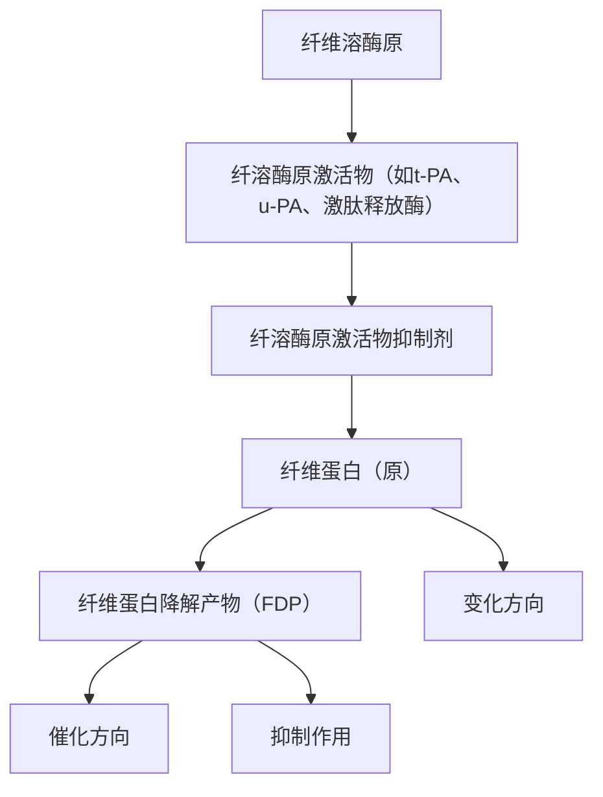
</details>

纤溶系统的激活与抑制示意图

4. ABCD ①纤维蛋白溶解(纤溶)分为纤溶酶原的激活与纤维蛋白的降解两个基本阶段。纤溶酶原在激活物的作用下发生有限水解,而激活为纤溶酶。纤溶酶原激活物主要有组织型纤溶酶原激活物(t-PA)、尿激酶型纤溶酶原激活物(u-PA)和激肽释放酶等。在纤维蛋白的存在下,t-PA、纤溶酶原结合于纤维蛋白上,t-PA 激活纤溶酶原的效应可增加 1000 倍,故答 A。②u-PA、激肽释放酶无须与纤维蛋白结合,可直接激活纤溶酶原,故不答 C、D。③凝血酶可使纤维蛋白原转变为纤维蛋白,完成凝血过程。  
5. ABCD ①在舒张期,心室充盈量包括心室舒张的抽吸作用和心房收缩射入心室的血量,其中,前者约占总充盈量的 $75\%$ ,后者约占 $25\%$ 。可见,舒张期心室充盈量主要取决于心室舒张的抽吸作用。舒张期心肌细胞胞质 $\mathrm{Ca}^{2+}$ 浓度回降加快,可使心室舒张期延长,导致心室充盈增加,故答 D。②心肌纤维化可使心肌顺应性降低、舒张功能障碍,导致舒张期心室充盈减少。直立体位时,静脉回心血量减少,舒张期心室充盈减少。心肌细胞外 $\mathrm{Na}^{+}$ 浓度增加,主要影响心室肌细胞的收缩,而不是舒张,故不答 C。  
6. ABCD ①收缩压是指一个心动周期中因心室射血而使动脉压达到的最高值,因此,收缩压不可能出现在心室舒张期,可首先排除 D。②典型的心动周期包括等容收缩期→快速射血期→减慢射血期→等容舒张期→快速充盈期→减慢充盈期→房缩期。在等容收缩期,心室内的压力快速升高,至快速射血期末达最高值。在减慢射血期,由于心室收缩强度减弱,射血速度减慢,室内压和主动脉压由峰值逐渐下降,故答 B 而不是 C。  
7. ABCD 动脉血压调节分为短期调节和长期调节。短期调节是指对短时间内发生的血压变化进行调

节,主要通过心血管反射完成。长期调节是对血压在较长时间(数小时、数天、数月或更长时间)内发生的变化进行调节,主要通过肾脏调节细胞外液量来实现。当体内细胞外液量增加时,循环血量增多,使动脉血压升高;而循环血量增多和动脉血压升高,又能直接导致肾排水和排钠增加,将过多的体液排出体外,从而使血压恢复到正常水平。参阅【2009NO122】。

8. ABCD ①呼吸运动是呼吸肌的节律性收缩和舒张所致。吸气肌主要包括膈肌、肋间外肌、斜角肌和胸锁乳突肌,呼气肌主要包括肋间内肌和腹肌。②用力吸气主要由吸气肌收缩引起。用力呼气主要由吸气肌舒张和呼气肌收缩引起,故答 B。

9. ABCD 迷走神经兴奋后,分泌不同的神经递质,发挥不同的生理作用:①释放乙酰胆碱(ACh),直接作用于壁细胞,促进胃酸分泌;②释放ACh,作用于胃泌酸区肠嗜铬样细胞,引起后者释放组胺;③释放铃蟾素(蛙皮素),作用于幽门部G细胞,引起后者分泌促胃液素;④释放ACh,抑制胃和小肠黏膜的δ细胞释放生长抑素。参阅【2014NO11】。

10. ABCD ①大肠内细菌可利用肠内较为简单的物质合成维生素 B 复合物和维生素 K, 而不是维生素 C。②大肠内细菌含有能分解食物残渣的酶, 它们对糖和脂肪的分解产物有乳酸、乙酸、CO₂、甲烷、脂肪酸、甘油、胆碱等; 对蛋白质的分解产物有氨基酸、NH₃、H₂S、组胺、吲哚等。参阅【2023NO139】。

11. ABCD 参阅【2008NO14】、【2004NO11】，原题。

12. ABCD 髓袢升支粗段是 NaCl 在髓袢重吸收的主要部位。顶端膜中的Ⅱ型 $Na^{+}-K^{+}-2Cl^{-}$ 同向转运体(NKCC2)可将小管液中 1 个 $Na^{+}$ 、1 个 $K^{+}$ 和 2 个 $Cl^{-}$ 同向转运入上皮细胞内。进入细胞内的 $Na^{+}$ 通过基底侧膜中的钠泵泵至组织间液， $Cl^{-}$ 顺浓度梯度经基底侧膜中的氯通道进入组织间液，而 $K^{+}$ 则顺浓度梯度经顶端膜返回小管液中，并使小管液呈正电位。 $K^{+}$ 返回小管内造成小管液正电位，这一电位差又使小管液中的 $Na^{+}$ 、 $K^{+}$ 和 $Ca^{2+}$ 等正离子经细胞旁途径而被动重吸收。

13. ABCD ①血浆晶体渗透压是调节抗利尿激素(ADH)分泌最重要的因素,其感受器位于下丘脑前部室周器。②颈动脉体为外周化学感受器,主要感受动脉血 $\mathrm{PO}_{2}$ 、 $\mathrm{PCO}_{2}$ 和 $\mathrm{H}^{+}$ 浓度的变化。主动脉弓为动脉压力感受器,主要感受血管壁所受到的机械牵张刺激。远由小管和集合管是醛固酮作用的靶部位。球旁器的致密斑是小管液中 NaCl 浓度的感受器。

14. ABCD ①根据感受器出现适应的快慢,其可分为快适应感受器和慢适应感受器。环层小体为皮肤触觉感受器,为快适应感受器。②皮肤梅克尔盘(10版《生理学》为墨克尔盘)、关节囊感受器、肌梭均属于慢适应感受器。参阅【2009NO155】、【1995NO27】。

15. ABCD ①传入侧支抑制也称交互抑制,其联系方式是感觉传入纤维与反射通路上的下一个神经元形成兴奋性突触,同时通过其侧支与一个抑制性中间神经元也形成兴奋性突触,这个抑制性中间神经元再与另一个中枢神经元形成抑制性突触。伸肌肌梭的传入冲动对屈肌运动神经元的抑制就是典型的传入侧支抑制,其意义在于保证伸肌和屈肌活动的协调控制。②传入侧支抑制属于突触后抑制,而不是突触前抑制。回返抑制常见于闰绍细胞对脊髓前角 $\alpha$ 运动神经元的抑制。侧向抑制常见于感觉通路中,以增强感觉系统的分辨能力。

16. ABCD ①寒冷条件下,交感神经兴奋,甲状腺激素释放增加,可增加机体产热,以维持正常体温。②甲状腺激素可增强能量代谢。在饥饿状态下,瘦素水平降低,对促甲状腺激素释放激素分泌的刺激减少,可抑制甲状腺激素的分泌,最终通过减少能量消耗,维持机体的能量平衡,故答 D。


<details>
<summary>flowchart</summary>

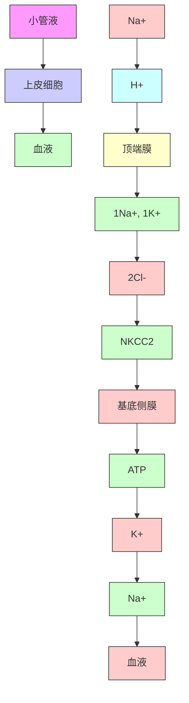
</details>

17. ABCD ①肌红蛋白是由一个亚基构成的单链蛋白质,血红蛋白是由四个亚基组成的具有四级结构的蛋白质,故不答 A。②模体是蛋白质分子中具有特定空间构象和特定功能的结构成分,属于蛋白质的超二级结构。③蛋白质的一级结构决定空间结构,而不是空间结构决定一级结构。④一个氨基酸改变可能影响蛋白质空间结构。  
18. ABCD ①葡萄糖-6-磷酸酶是糖异生的关键酶,而不是糖酵解的关键酶,其作用是促进糖异生。②能使葡萄糖磷酸化的酶是己糖激酶,催化NADPH的生成的关键酶是葡萄糖-6-磷酸脱氢酶。  
19. ABCD ①酮体是水溶性物质,而不是脂溶性物质。酮体在肝中生成,在肝外组织(心、肾、脑、肌组织)分解利用,故不答 C。②在葡萄糖供应不足或利用障碍时,酮体可通过血脑屏障,供脑组织利用,此时酮体是脑组织的主要能源物质,故答 D。  
20. ABCD ①NADH不能自由穿过线粒体内膜。在脑和肌组织中,细胞质中的NADH主要通过甘油-3-磷酸穿梭进入线粒体呼吸链进行氧化。细胞质中的NADH在甘油-3-磷酸脱氢酶催化下,将2H传递给磷酸二羟丙酮,使其还原成甘油-3-磷酸,后者通过线粒体外膜到达线粒体内膜的膜间隙侧。在线粒体膜间隙侧结合着甘油-3-磷酸脱氢酶的同工酶,含FAD辅基,接受甘油-3-磷酸的2H生成 $FADH_{2}$ 和磷酸二羟丙酮。 $FADH_{2}$ 直接将2H传递给Q进入呼吸链。可见,甘油-3-磷酸穿梭的生理意义是将胞质溶胶中2H转运至线粒体。②A、B、D均与甘油-3-磷酸穿梭无关。


<details>
<summary>flowchart</summary>

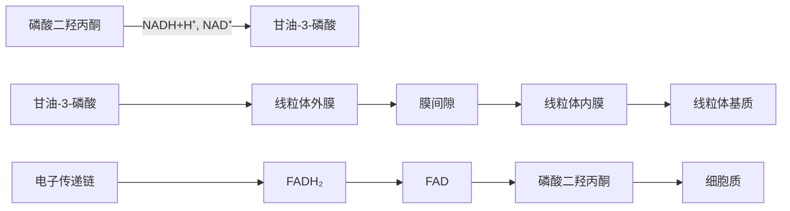
</details>

甘油-3-磷酸穿梭

21. ABCD ①甲氨蝶呤的结构与叶酸类似, 能竞争性抑制二氢叶酸还原酶, 使叶酸不能还原成二氢叶酸及四氢叶酸。因此嘌呤分子中来自一碳单位的 $\mathrm{C}_{8}$ 及 $\mathrm{C}_{2}$ 均得不到供应, 从而抑制嘌呤核苷酸的合成。甲氨蝶呤常用于白血病等的治疗。②6-巯基嘌呤的结构与次黄嘌呤相似, 氮杂丝氨酸的结构与谷氨酰胺相似, 阿糖胞苷为核苷类似物, 为嘌呤核苷酸和/或嘧啶核苷酸的抗代谢物。


<details>
<summary>chemical</summary>

Chemical structure of a compound with pyridine ring, hydroxyl group, and amino acid side chain, labeled as '叶酸'
</details>


<details>
<summary>chemical</summary>

Chemical structure of 甲氨蝶呤 (methylcyclohexylamine) showing its structural formula and functional groups
</details>

22. ABCD 参阅【2022NO24】。  
23. ABCD ①真核基因启动子是 RNA 聚合酶结合位点周围的一组转录控制组件。启动子的核心序列是 TATA 盒, 转录起始前几种转录因子先与 DNA 的 TATA 盒结合形成复合物, 然后 RNA 聚合酶也进入转录的核心区 TATA, 同时在转录因子作用下, 共同形成转录起始复合物, 并开始转录。可见, RNA 聚合酶可以识别的 DNA 位点是 TATA 盒。②蛋白质合成的起始密码子 AUG (其对应的 DNA 序列为 ATG) 在转录起始点下游, 因此翻译起始点出现于转录起始点之后, 而 TATA 盒在转录起始点之前。沉默子和增强子均属于顺式作用元件。  
24. ABCD ①在蛋白质合成过程中,肽链延长须在核糖体上重复进行进位、成肽、转位的循环过程。成肽反应后,核糖体需要向 mRNA 的 3'-端移动一个密码子的距离,方可阅读下一个密码子,此过程称为转位。核糖体的转位需要延长因子 EF-G(即转位酶)的协助,并需要 GTP 水解供能。②分子伴侣主要参与蛋白质分子的折叠。转录因子是指直接结合或间接作用于启动子、增强子等顺式作用元件,形

成具有RNA聚合酶活性的动态转录复合体的蛋白质因子。辅酶主要参与结合酶的组成。

25. ABCD ①siRNA(干扰小 RNA)是细胞内的一类双链 RNA,在特定情况下通过一定酶切机制,转变为具有特定长度(21\~23个碱基)和特定序列的小片段 RNA。siRNA 参与 RNA 诱导的沉默复合体 (RISC)的组成,与特异的靶 mRNA 完全互补结合,导致靶 mRNA 降解,阻断翻译过程。②参与多肽链合成的是 tRNA、mRNA,作为逆转录模板的是病毒 RNA,参与核糖体组成的是 rRNA。  
26. ABCD ①利用重组 DNA 技术,可以让细菌、酵母等低等生物成为制药工厂。目前上市的基因工程药物已有 100 多种(C)。②A、B、D 都不是重组 DNA 技术在医学上的实际应用。  
27. ABCD ①RAS 蛋白是由一条多肽链组成的单体蛋白,由原癌基因 ras 编码。RAS 蛋白的分子质量为 21kD,因其分子质量小于七次跨膜受体偶联的 G 蛋白,故称为小 G 蛋白。参阅 6 版《生物化学》P343, 10 版《生物化学》已删除部分知识点。②钙调蛋白(CaM)是一种钙结合蛋白,可调节钙调蛋白依赖性蛋白激酶的活性。异三聚体 G 蛋白是由 $\alpha$ 、 $\beta$ 、 $\gamma$ 三个亚基构成的蛋白质复合物,主要介导 G 蛋白偶联受体传递的信号。PKC 为蛋白激酶 C,主要参与 IP₃/DAG-PKC 途径的信号转导。  
28. ABCD PTEN 基因也称为第 10 号染色体缺失的磷酸酶及张力蛋白同源基因,为 1997 年发现的一种抑癌基因,其编码产物 PTEN 为胞膜受体,具有磷脂酰肌醇-3,4,5-三磷酸 3-磷酸酶活性,可催化水解磷脂酰肌醇-3,4,5-三磷酸(PIP₃)的 3-磷酸成为 PIP₂,而 PIP₃ 是胰岛素、表皮生长因子等细胞生长因子的信号转导分子,从而抑制 PI3K/AKT 信号通路,起到负性调节细胞生长增殖的作用。


<details>
<summary>flowchart</summary>

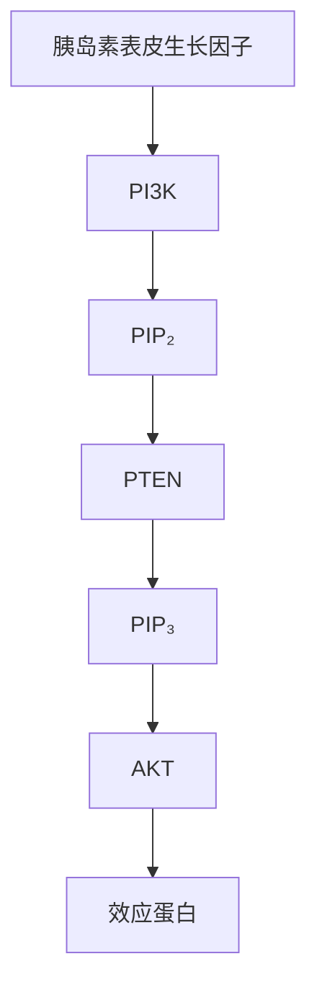
</details>

PTEN是迄今发现的第一个具有双特异磷酸酶活性的抑癌基因
PTEN具有磷脂酰肌醇-3,4,5-三磷酸3-磷酸酶活性，可催化水解 $\mathrm{PIP}_{3}$ 的3-磷酸成为 $\mathrm{PIP}_{2}$ ，从而抑制PI3K/AKT信号通路

$$
\mathrm{PIP} _ {2} \xrightarrow [ \text {PTEN(3 - 磷酸酶活性)} ]{\mathrm{PI3K}} \mathrm{PIP} _ {3} (\text {第二信使})
$$

PI3K（磷脂酰肌醇3-激酶）； $\mathrm{PIP}_2$ （磷脂酰肌醇-3,4-二磷酸） $\mathrm{PIP}_3$ （磷脂酰肌醇-3,4,5-三磷酸）；AKT（蛋白质丝/苏氨酸激酶）

PI3K/AKT信号转导通路（PTEN作用机制）

29. ABCD ①酒精性肝病时,肝细胞胞浆(胞质)中细胞中间丝前角蛋白变性,形成 Mallory 小体。②肝细胞内见大量变性的内质网和线粒体,为肝细胞水肿的特点。过氧化物酶体是一种异质性细胞器,内含依赖黄素的氧化酶和过氧化氢酶。  
30. ABCD 结核结节是肺结核具有诊断价值的病理变化,由上皮样细胞、朗汉斯巨细胞、淋巴细胞和少量成纤维细胞组成。吞噬结核分枝杆菌的巨噬细胞称为上皮样细胞,故答 D。  
31. ABCD ①类风湿小结是类风湿关节炎具有诊断意义的病变。镜下,类风湿小结中央为大量纤维蛋白样坏死,周围有呈栅栏状或放射状排列的上皮样细胞,外周为肉芽组织。②凝固性坏死常见于心、肝、肾、脾等实质器官。液化性坏死常见于肝脓肿。干酪样坏死常见于结核病。  
32. ABCD 凋亡是活体内局部组织中单个细胞程序性死亡的表现形式。凋亡细胞的特点: 细胞固缩、染色质边集、细胞膜完整, 膜可发泡成芽, 形成凋亡小体。  
33. ABCD ①在心脏和动脉(如室壁瘤、动脉瘤)内发生的血栓,常为混合血栓。②白色血栓常位于静脉血栓的头部。红色血栓常位于静脉血栓的尾部。透明血栓多位于毛细血管内,常见于 DIC。  
34. ABCD 白细胞渗出是炎症反应最重要的特征。白细胞穿过血管壁进入周围组织的过程,称为白细胞游出,通常发生在毛细血管后小静脉。  
35. ABCD ①肺小细胞癌镜下观,癌细胞小,呈圆形或卵圆形,似淋巴细胞;也可呈梭形,胞质少,似裸核,癌细胞呈弥漫分布或呈片状、条索状排列,核分裂象多。根据题干,本例应诊断为肺小细胞癌。

②浸润性腺癌分化程度不同,镜下表现各异。鳞状细胞癌镜下可见角化珠形成、细胞间桥。腺鳞癌镜下可见腺癌和鳞癌成分共存。

36. ABCD ①碎片状坏死是指肝小叶周边界板肝细胞的灶性坏死、崩解,使肝界板受到破坏,常见于慢性肝炎。②肝小叶内散在分布的单个至数个肝细胞的坏死为点状坏死,常见于急性普通型肝炎。桥接坏死是指严重的肝细胞损伤导致的相邻肝小叶的肝细胞坏死,形成肝小叶的中央静脉与门管区之间,或两个门管区之间,或两个中央静脉之间出现的相互连续的肝细胞坏死带,常见于较重的慢性肝炎。肝实质坏死在 $1/2 \sim 2/3$ 之间为亚大块坏死,常见于重型肝炎。参阅【2018NO36】。

37. ABCD A、B、C、D均属于胃癌常见类型。低黏附性癌包括印戒细胞癌和其他亚型，镜下可见癌细胞胞质内含大量黏液，将核挤向一侧，状似印戒。参阅北京大学医学出版社3版《病理学》P224。

38. ABCD ①金黄色葡萄球菌感染性脓肿为局限性化脓性炎症,其主要特征是组织发生液化性坏死,形成充满脓液的脓腔。参阅北京大学医学出版社3版《病理学》P78。②干酪样坏死常见于结核病。凝固性坏死常见于心、肾、脾等器官的缺血性坏死。湿性坏疽多发生于与外界相通的内脏,如肺、肠、子宫、阑尾及胆囊等。

39. ABCD ①淋巴细胞在分化过程中发生抗原受体基因重排,即基因在特定重组酶的作用下选择性地连接成具有转录活性的可变区、变异区、连接区连续的 DNA 片段,以确保每个分化成熟的淋巴细胞具有独一无二的抗原受体。正常免疫反应为多克隆性增生分化,而淋巴瘤为单克隆性增生分化,因为抗原受体基因重排先于淋巴细胞转化,肿瘤性祖细胞产生的所有子细胞都具有相同的抗原受体基因构型和序列,并合成相同类型的免疫球蛋白。②A、C、D 均无特异性。参阅 4 版 8 年制《病理学》P294。

40. ABCD ①绒毛膜癌肉眼观,癌结节呈单个或多个,出血、坏死明显,肿瘤质软,暗红色或紫蓝色。②镜下,癌组织由分化不良的细胞滋养层细胞和合体滋养层细胞组成,细胞异型性明显,核分裂象多见;肿瘤自身无间质血管;癌细胞不形成绒毛和水泡状结构为其特点。

41. ABCD ①主动脉瓣关闭不全可于主动脉瓣第二听诊区闻及舒张早期叹气样、递减型杂音，向胸骨左下方和心尖区传导，杂音在前倾坐位最易听清。重度反流者，可于心尖部闻及柔和、低调、舒张期杂音，系主动脉瓣关闭不全时回流血液限制二尖瓣开放所致。②主动脉瓣关闭不全时，心室充盈过度、二尖瓣位置过高，导致关闭时振幅较小，因此第一心音减弱，故答 A。参阅 10 版《诊断学》P149。

42. ABCD ①离心尿液中红细胞>3个/HPF,称为镜下血尿。尿沉渣相差显微镜检查:变形红细胞(非均一性红细胞)超过50%,为肾小球源性血尿;均一性红细胞小于50%为非肾小球源性血尿。本例尿中非均一性红细胞占98%,应考虑肾小球源性血尿,肾小球肾炎、肾结石、肾结核都是其常见病因。②肾盂肾炎为肾间质的化脓性炎症,常引起脓尿而不是血尿,故答A而不是C,但标准答案为C。

43. ABCD ①肺鳞癌常见于老年男性,与吸烟关系密切。参阅3版8年制《内科学》P138。②肺鳞癌多发生于段及段以上支气管,以中央型肺癌多见。③肺鳞癌对化疗和放疗的敏感性不如小细胞肺癌。④肺癌患者EGFR基因总突变率约 $30\%$ ,常见于非小细胞肺癌,其中以肺腺癌突变率最高(约 $50\%$ ),肺鳞癌突变率约 $10\%$ (故答D)。参阅15版《实用内科学》P1272。

44. ABCD ①肺功能检查是判断气流受限的主要方法。吸入支气管扩张剂后,第一秒用力呼气容积/用力肺活量( $FEV_{1}/FVC$ )<0.7可确定为持续气流受限,应诊断为慢性阻塞性肺疾病(COPD)。②吸入组胺可引起支气管痉挛,常用于支气管激发试验。COPD常表现为残气量/肺总量>40%。

45. ABCD ①肺癌患者突发咯血 $200 \mathrm{ml}$ , 多为支气管动脉受累所致, 介入栓塞支气管动脉, 可迅速控制出血。支气管镜下电凝、冷冻、激光治疗虽可止血, 但疗效不如介入栓塞治疗, 故答 D 而不是 C。②患者有高血压病史 30 年, 不宜给予垂体后叶素, 故不答 A。给予可待因, 可加重呼吸道梗阻, 故不答 B。

46. ABCD ①患者劳累后胸痛,持续数分钟可缓解,应考虑劳力型心绞痛。患者静态心电图正常,冠状动脉 CT 示右冠状动脉狭窄 60%,应考虑冠心病心绞痛。为决定治疗方案,首选运动负荷心电图,以了解心肌缺血程度,决定行药物治疗还是介入治疗。②冠状动脉造影为有创检查,一般不作为首选。

动态心电图、动态血压监测对本病诊断价值不大。

47. ABCD ①患者陈旧(性)心肌梗死4年,突发胸闷、呼吸困难、双肺湿罗音,应考虑急性左心衰竭。患者高血压病史15年,血压196/108mmHg,应考虑高血压急症,故本例应诊断为高血压急症合并急性左心衰竭。患者血压196/108mmHg,首选硝普钠降压治疗,而不是使用尼卡地平。②硝酸甘油常用于心绞痛的治疗。多巴酚丁胺为升压药,不宜使用。  
48. ABCD ①真菌性心内膜炎病程长,药物治疗常难以控制,需择期手术治疗。②亚急性感染性心内膜炎常并发肾动脉栓塞,尸检检出率≥50%,多无症状,无须手术治疗。参阅16版《实用内科学》P947。③主动脉瓣赘生物直径>10mm伴严重瓣膜狭窄或反流、主动脉瓣单个赘生物直径>30mm,须择期手术治疗,赘生物直径不达标者无须手术治疗。④Janeway损害为急性感染性心内膜炎常见的周围体征,并不是手术指征。参阅【2016NO169】。  
49. ABCD ①心脏骤停的初级心肺复苏,药物治疗首选静脉给药,而不是心内注射给药,心内注射给药损伤大、并发症多,临床上已弃用。②B、C、D都是心肺复苏的重要措施。  
50. ABCD ①反酸、烧心是胃食管反流病的典型症状。患者长期反酸、烧心，平卧时加重，应诊断为胃食管反流病，治疗首选质子泵抑制。②A、B、D都是胃食管反流病的治疗药物，但并不是首选治疗药物。  
51. ABCD 肠结核好发于回盲部, 占 85%, 这是因为: ① 含结核分枝杆菌的肠内容物在回盲部停留, 增加局部黏膜的感染机会; ② 回盲部富有淋巴组织, 结核分枝杆菌易侵犯淋巴组织。  
52. ABCD ①反复黏液脓血便是溃疡性结肠炎的临床特点。中年男性,间断黏液脓血便1年余,抗菌药物治疗无效,左下腹轻压痛,未发现肛周病变,应考虑溃疡性结肠炎。为明确诊断,首选检查是纤维结肠镜。②粪常规检查无特异性。粪细菌培养常用于诊断细菌性痢疾。钡剂灌肠常用于诊断肠结核。  
53. ABCD ①尿沉渣镜检红细胞>3个/HPF,提示血尿。本例尿常规沉渣镜检RBC5\~8个/HPF,应考虑血尿。为明确血尿原因,应首选相差显微镜查尿红细胞形态,以鉴别肾小球源性血尿和非肾小球源性血尿。②血肌酐主要用于了解肾功能。肾脏CT检查常用于了解肾形态学改变。肾穿刺活检为有创检查,一般不作为首选。  
54. ABCD ①患者外周血三系细胞(红细胞、粒细胞、血小板)减少,髂后骨髓细胞学检查示增生低下,应考虑再生障碍性贫血。为明确诊断,应多部位行骨髓穿刺检查,若结果提示多部位骨髓增生低下,即可明确诊断,故答 D。②外周血白细胞分类计数常用于细菌感染性疾病的诊断。血清铁和铁蛋白测定常用于缺铁性贫血的诊断。血清叶酸和维生素 B $_{12}$ 测定常用于巨幼细胞贫血的诊断。  
55. ABCD ①嗜铬细胞瘤常位于肾上腺(占 $80\% \sim 90\%$ )、腹主动脉旁(占 $10\% \sim 15\%$ )、胸内、颈部、颅内等。②肾上腺髓质的嗜铬细胞瘤可产生去甲肾上腺素和肾上腺素,以前者为主。肾上腺外的嗜铬细胞瘤,除主动脉旁嗜铬体外,只产生去甲肾上腺素,不能合成肾上腺素,因为将去甲肾上腺素转变为肾上腺素的苯乙醇胺 $N$ -甲基转移酶需要高浓度的皮质醇才能激活,只有肾上腺髓质及主动脉旁嗜铬体才具备此条件。③阵发性高血压、血压骤升是本病的特征性表现。④部分患者(往往是儿童或青年)出现直立性低血压不能排除本病。  
56. ABCD ①抗磷脂抗体是指其靶抗原为带负电荷磷脂的抗体,包括抗心磷脂抗体、抗 $\beta_{2}$ 糖蛋白 I ( $\beta_{2}$ GP I) 抗体、狼疮抗凝物,常见于抗磷脂抗体综合征。②抗 dsDNA 抗体、抗 Sm 抗体、抗 SSA 抗体均属于抗核抗体。参阅【2007NO76】。  
57. ABCD ①静息状态下,细胞内 K $^{+}$ 浓度是细胞外液的 39 倍。低钾血症患者细胞外液 K $^{+}$ 浓度降低,静息电位绝对值增大,与阈电位之间的差距增加,因此细胞兴奋性降低,导致腱反射消失、四肢乏力、胃肠道平滑肌蠕动减弱(恶心、呕吐)。②心电图 T 波高尖为高钾血症的表现。参阅【2001N079】。  
58. ABCD 全身炎症反应综合征(SIRS)的诊断标准:①体温>38℃或<36℃;②心率>90次/分;③呼吸急促(>20次/分)或过度通气, $PaCO_{2}<32.29mmHg$ ;④白细胞>12×10 $^{9}$ /L或<4×10 $^{9}$ /L,或未成熟白细胞>10%。参阅【2002NO157】。

59. ABCD 抗菌药物应用原则: ①严重感染, 如脓毒症, 可联合用药; ②轻症感染可口服给药, 宜选用口服吸收完全的药物; ③单一用药不能控制的混合感染须联合用药, 但单一用药可控制的感染不必联合用药; ④体温正常并不是停药的指征, 有些感染即使体温降至正常, 也不能停药, 如结核病的治疗。  
60. ABCD ①良性前列腺增生症的常用药物治疗方案是 $\alpha$ 受体拮抗剂加 $5\alpha$ 还原酶抑制剂。 $\alpha$ 受体拮抗剂可有效降低膀胱颈及前列腺平滑肌的张力,减小尿道阻力,改善排尿功能,常用药物有特拉唑嗪、阿夫唑嗪等。 $5\alpha$ 还原酶抑制剂可在前列腺内阻止睾酮转变为有活性的双氢睾酮,进而使前列腺体积缩小,改善排尿症状,常用药物有非那雄胺等。② $\beta$ 受体拮抗剂常用于治疗心律失常。植物类药临床上现已很少用于治疗良性前列腺增生症。  
61. ABCD 食管癌切除术是食管癌的首选治疗方法,须切除距肿瘤上、下缘 5\~8cm 以上的食管。消化道重建中最常用的食管替代物是胃,也可以根据病人个体情况选择结肠和空肠,很少采用回肠作为食管替代物。  
62. ABCD 乳房纤维腺瘤高发年龄是 $20 \sim 25$ 岁。 $75\%$ 为单发,少数为多发。肿块圆形或分叶状,表面光滑,边界清楚。月经周期对肿块大小无明显影响,月经来潮时肿块增大为乳腺囊性增生病的特点。  
63. ABCD 分化型甲状腺癌行甲状腺全切手术的适应证包括:①有颈部放射史;②已有远处转移;③双侧癌结节;④肉眼可见的甲状腺腺外侵犯;⑤肿瘤直径>4cm;⑥双侧颈部多发淋巴结转移。A、B、D为甲状腺腺叶切除的手术指征。  
64. ABCD ①腹水(腹腔积液)草绿色,透明,提示结核性腹膜炎。②腹水黄色浑浊,含胆汁,无臭味,提示胃十二指肠急性穿孔。③腹水血性,臭味重,提示绞窄性肠梗阻。④腹水稀薄脓性,略有臭味,提示急性阑尾炎穿孔。参阅10版《外科学》P365。  
65. ABCD 骨折愈合过程分为三个阶段,即血肿炎症机化期(约需2周)、原始骨痂形成期(需3\~6个月)、骨痂改造塑形期(需1\~2年)。  
66. ABCD ①尺神经腕部损伤主要表现为骨间肌、第3和第4蚓状肌、拇收肌麻痹所致的环、小指爪形手畸形,手指内收、外展障碍和Froment征,以及手部尺侧半和尺侧一个半手指感觉障碍,特别是小指感觉消失。夹纸试验:检查者将一张纸片放在病人手指间,让病人用力夹紧,如检查者能轻易地抽出纸片,即为阳性,提示尺神经损伤。根据题干,本例应诊断为尺神经损伤。②正中神经损伤常表现为拇指对掌功能障碍,手的桡侧半感觉障碍。桡神经损伤常表现为垂腕、桡侧三个半手指感觉障碍。指掌侧总神经损伤常表现为两手指相邻侧感觉障碍。  
67. ABCD ①不完全性脊髓损伤是指损伤平面以下保留某些感觉和运动功能,包括前脊髓综合征、后脊髓综合征、脊髓中央管周围综合征、脊髓半切综合征四种类型。②马尾神经损伤常表现为损伤平面以下弛缓性瘫痪,有感觉、运动障碍,因此不属于不完全性脊髓损伤。  
68. ABCD 69. ABCD 70. ABCD ①患者午后低热,为结核中毒症状。腹部 X 线平片示盆腔可见散在钙化影,提示干酪坏死钙化灶。患者腹胀、移动性浊音,提示腹腔积液。患者长期乏力、低热、消瘦、腹腔积液、全腹有轻压痛及反跳痛、盆腔钙化灶,应诊断为结核性腹膜炎。化脓性腹膜炎起病急,病程短,常表现为高热、腹膜刺激征明显,无钙化灶。自发性细菌性腹膜炎常见于肝硬化腹腔积液患者。腹腔恶性肿瘤多见于老年人,无腹腔钙化灶。②腹部触诊柔韧感是结核性腹膜炎具有诊断价值的体征,故答 A。B 无特异性。肝浊音界消失常见于胃肠道急性穿孔。腹壁静脉曲张常见于肝硬化门静脉高压症。③腺苷脱氨酶(ADA)常存在于活化的 T 淋巴细胞中,腹腔积液 ADA>45U/L 对结核性腹膜炎具有较高的诊断价值,故答 D。A、B、C 只能提示渗出性腹腔积液,并不能诊断为结核性腹膜炎。  
71. ABCD 72. ABCD ①烂苹果味是丙酮的特有气味。呼气时可闻到烂苹果味是糖尿病酮症酸中毒的特征,故答 C。A、B 不会闻到烂苹果味。急性有机磷农药中毒呼气中可闻到大蒜味。②库斯莫尔 (Kussmaul) 呼吸为深快呼吸,常见于糖尿病酮症酸中毒、尿毒症酸中毒。潮式呼吸、间停呼吸常见于脑炎、脑膜炎、颅内压增高。抑制性呼吸常见于急性胸膜炎、肋骨骨折等。10 版《诊断学》P128:库斯

莫尔呼吸是深快呼吸。10版《诊断学》P22:库斯莫尔呼吸是深慢呼吸(深长而规则的呼吸)。

73. ABCD 74. ABCD 75. ABCD ①特发性肺纤维化常表现为活动耐力下降,干咳,杵状指,胸部 CT 示病变呈网格改变伴牵拉性支气管扩张,病变以胸膜下、双肺底部为主。根据题干,本例应诊断为特发性肺纤维化。慢性阻塞性肺疾病多见于老年人,咳嗽、咳痰多年,胸部 CT 示小气道病变、肺气肿改变。支气管扩张症常表现为咳嗽、咳痰、咯血,胸部 CT 示支气管呈柱状、囊状改变,扩张的支气管呈“双轨征”或“串珠状”改变。结节病多侵犯肺上叶,肺底部相对正常,常为多系统受累,多有肺外症状。②特发性肺纤维化属于间质性肺疾病,主要表现为限制性通气功能障碍,弥散功能减低(C)。A 常见于慢性阻塞性肺疾病。B 常见于支气管哮喘。③吡非尼酮是一种多效性吡啶化合物,具有抗炎、抗纤维化、抗氧化作用,可以减慢特发性肺纤维化患者肺功能下降速度,为常用抗纤维化治疗药物。糖皮质激素仅用于特发性肺纤维化的急性加重期,故不答 A。环磷酰胺、甲氨蝶呤为免疫抑制剂,不宜使用。

76. ABCD 77. ABCD 78. ABCD ①室性早搏(室性期前收缩)频繁发作可引起意识障碍、晕厥。本例为频发多源性室性早搏,故答 D。全心衰竭、低血压很少突发意识障碍。感染中毒性脑病与题干所述无关,故不答 B。参阅 5 版《内科学》P198。②呋塞米为排钾性利尿剂,长期使用可导致低钾血症。患者肠鸣音减弱,膝反射减弱,应考虑低钾血症。低钾血症是室性早搏的常见病因。根据题干,本例频发多源性室性早搏的最可能病因是低钾血症,故答 A。B、C、D 均与题干所述不符。③为明确多源性室性早搏是否由低钾血症所致,首选检查是血钾测定,故答 B。超声心动图常用于了解心脏形态学改变。头颅 MRI 常用于了解颅内占位性病变。心肌损伤标志物测定常用于诊断急性心肌梗死。

79. ABCD 80. ABCD 81. ABCD ①中年男性,长期间断上腹痛,应考虑消化性溃疡,故可首先排除 A、C。患者黑便 2 天,粪隐血试验阳性,应考虑合并上消化道出血。患者多于进餐后 1 小时左右腹痛,应诊断为胃溃疡而不是十二指肠溃疡,因为十二指肠溃疡常表现为饥饿痛而不是餐后痛。②为明确胃溃疡的诊断,当然首选胃镜检查。上消化道造影为次选检查。 $^{13}$ C-尿素呼气试验常用于了解有无幽门螺杆菌感染。血清 CEA 测定常用于诊断消化道肿瘤。③胃溃疡的治疗首选质子泵抑制剂。题干未提及幽门螺杆菌感染,故不答 A。消化性溃疡所致上消化道出血使用普通止血药物效果不佳,故答 C 而不是 B。若上消化道出血凶猛、内科治疗无效,可行手术治疗,因此手术治疗并不是首选治疗方法。

82. ABCD 83. ABCD 84. ABCD ①中年男性,病史超过3个月,血尿、蛋白尿、水肿、高血压、肾功能受损,应考虑慢性肾小球肾炎。对明确诊断和指导治疗最有价值的检查是肾活检病理检查。24小时尿蛋白定量常用于诊断肾病综合征,而本例尿蛋白(++) ,肾病综合征可能性不大,故不答A。慢性肾小球肾炎早期双肾B超检查可能为阴性,故不答B。肾动脉造影常用于诊断肾动脉狭窄性高血压,故不答D。②慢性肾小球肾炎的治疗,应积极控制高血压,血压控制的目标值不同的教材数据并不一样。9版《内科学》P480:尿蛋白≥1g/d时,血压应小于125/75mmHg;尿蛋白<1g/d时,血压应小于130/80mmHg。10版《内科学》P265:慢性肾小球肾炎合并高血压应使收缩压<120mmHg。此为2025年试题,按9版《内科学》观点,正确答案为D。③慢性肾小球肾炎治疗目的是防止或延缓病变进展、改善临床症状、防治心脑血管并发症,不以消除尿红细胞或轻微尿蛋白为目标。

85. ABCD 86. ABCD 87. ABCD ①患者骨髓穿刺增生活跃,原始细胞>30%,应考虑急性白血病。患者骨髓细胞化学染色髓过氧化物酶(MPO)显示(-)\~(+),应考虑急性粒细胞白血病、急性单核细胞白血病。患者 PAS 染色呈弥漫性淡红色、非特异性酯酶(NSE)阳性,且可被 NaF 抑制,应诊断为急性单核细胞白血病,故答 D。②急性单核细胞白血病( $M_5$ )常表现为牙龈增生、肿胀。弥散性血管内凝血常见于急性早幼粒细胞白血病。睾丸肿大、中枢神经系统受侵犯常见于急性淋巴细胞白血病。③急性单核细胞白血病的首选化疗方案是 DA 方案[DNR(柔红霉素)+Ara-C(阿糖胞苷)]或 IA 方案[IDA(去甲氧柔红霉素)+Ara-C(阿糖胞苷)]。口服全反式维 A 酸为急性早幼粒细胞白血病的首选化疗方案。DVLP 为急性淋巴细胞白血病的首选化疗方案。骨髓移植为缓解后治疗方案。

88. ABCD 89. ABCD 90. ABCD ①年轻女性,多食、易饥、多汗、腹泻、体重下降、甲状腺肿大、双手震颤,血清 $\mathrm{FT}_{3} 、 \mathrm{FT}_{4}$ 显著升高,TSH 降低,应诊断为 Graves 病。桥本甲状腺毒症常表现为 TgAb、TPOAb 阳性,甲状腺功能低下而不是亢进。亚急性甲状腺炎患者发病前 1\~3 周常有上呼吸道感染史。多结节性毒性甲状腺肿常表现为甲状腺结节性肿大,无甲状腺功能亢进症状。②促甲状腺激素受体抗体 (TRAb) 是 Graves 病的一线诊断指标,未经治疗的 Graves 病患者,血清 TRAb 阳性率可达 $80 \% \sim$ $100 \%$ 。甲状腺 B 超对 Graves 病的诊断价值有限。OGTT、HbA1c 测定常用于诊断糖尿病。③甲巯咪唑可导致胎儿畸形,因此如有妊娠计划,应首选丙硫氧嘧啶治疗,不宜使用甲巯咪唑治疗。患者心率较快(120 次/分),对症治疗可给予普萘洛尔。若无妊娠计划,可给予 $^{131}\mathrm{I}$ 治疗。当抗甲状腺药物 (ATD) 治疗无效时,可行外科手术治疗。

91. ABCD 92. ABCD ①类风湿关节炎常表现为反复发作的双侧对称性多关节肿痛、晨僵，以腕关节、掌指关节、近端指间关节最常受累。根据题干，本例应诊断为类风湿关节炎。风湿性关节炎常累及大关节，而不是小关节。系统性红斑狼疮除关节受累外，常有其他系统受累。银屑病关节炎多于银屑病多年后发生关节受累，受累关节为非对称性，以远端指间关节受累常见。②为明确类风湿关节炎的诊断，常用检查是双手、腕关节X线片。血清抗核抗体测定常用于诊断系统性红斑狼疮。血清抗链“O”测定常用于诊断急性肾小球肾炎。血清HLA-B27测定常用于诊断强直性脊柱炎。  
93. ABCD 94. ABCD 95. ABCD ①患者2天前上腹痛,后感觉右下腹痛,此为转移性右下腹痛。患者发热,右下腹肌紧张,右下腹腔积液,应诊断为急性阑尾炎穿孔(穿孔性阑尾炎)。卵巢囊肿蒂扭转常表现为体位改变后突发下腹痛,B超提示右下腹囊性包块。上消化道穿孔起病急,发展快,常表现为剧烈腹痛,板状腹。急性机械性肠梗阻常表现为腹痛、呕吐、腹胀、肛门停止排气排便。②阑尾切除术一般采用右下腹麦氏切口,如诊断不明或腹膜炎较广泛者,应采用右下腹经腹直肌探查切口,以便术中进一步探查和清除脓液。本例为阑尾穿孔,且右下腹积液,宜选择右下腹经腹直肌切口。③阑尾切除术后第6天,体温升高,里急后重,说明直肠刺激征明显,应考虑合并盆腔脓肿。腹腔出血为阑尾切除术的并发症,常表现为心率增快,血压降低,甚至失血性休克。伤口感染常表现为发热,伤口红、肿、触痛等。肠梗阻常表现为痛、吐、胀、闭等典型症状。  
96. ABCD 97. ABCD ①患者腹痛、腹胀、肛门停止排气排便,肠鸣音亢进,腹部X线平片示小肠扩张,多发气液平面,应诊断为急性机械性肠梗阻。上消化道穿孔起病急,进展迅速,不会迁延1周。重症急性胰腺炎常表现为左上腹痛,而不是下腹痛。急性化脓性阑尾炎常表现为转移性右下腹痛,右下腹压痛、反跳痛。②对于急性机械性肠梗阻,不宜行钡剂上消化道造影,否则钡剂在体内结块,滞留肠腔内,将加重肠梗阻。A、C、D均不会加重病情,可以选用。  
98. ABCD 99. ABCD ①患者胆囊结石病史10年,出现Reynolds五联征(寒战高热、腹痛、黄疸、休克,缺乏中枢神经系统受抑制症状),应诊断为急性梗阻性化脓性胆管炎。A、B、C均不会出现Reynolds五联征。②为明确急性梗阻性化脓性胆管炎的诊断,最有价值的检查是磁共振胆胰管成像(MRCP)。腹部B超为胆道疾病的首选检查,但不是急性梗阻性化脓性胆管炎最有价值的检查,故答案为B而不是A。腹部CT的诊断价值不如MRCP。经皮肝穿刺胆管造影(PTC)常用于黄疸的鉴别诊断。  
100. ABCD 101. ABCD 102. ABCD ①腹部闭合性损伤首选检查是诊断性腹腔穿刺,次选检查是腹部B超,再次为腹部CT或MRI,腹部X线片常用于诊断上消化道穿孔,故答B。②患者1周前左下胸部外伤,1小时前突然晕倒,心率增快,血压80/60mmHg,移动性浊音阳性,应诊断为延迟性脾破裂。肝破裂者常有右上腹或右下胸部外伤史,而本例为左下胸部外伤,故肝破裂可能性不大。肠系膜血管很少发生延迟性破裂,故不答C。腹膜后血肿可有失血性休克的表现,一般不会出现全腹压痛、反跳痛。③腹部闭合性损伤行剖腹探查时,通常先探查肝、脾等实质性器官,同时探查膈肌、胆囊等有无损伤,然后探查胃肠道等空腔脏器,最后探查盆腔脏器(器官)和胰腺,故答B。  
103. ABCD 104. ABCD 105. ABCD ①骨囊肿常见于儿童和青少年,多数无明显症状。X线表现为干骺端圆形或椭圆形界限清楚的溶骨性病灶,骨皮质膨胀变薄。根据题干,本例应诊断为骨囊肿。骨

巨细胞瘤 X 线典型表现为肥皂泡样改变。骨肉瘤 X 线表现为成骨性、溶骨性和混合性骨质破坏，可见 Codman 三角或呈“日光射线”形态。骨软骨瘤 X 线表现为干骺端骨性突起。②骨囊肿为良性病变，无须放、化疗，故不答 A、C。病灶刮除植骨为单纯性骨囊肿的标准治疗。部分骨囊肿骨折后可以自愈，对于年龄小于 14 岁的患儿应慎选手术治疗。本例为 11 岁儿童，不宜手术，故答 D。③动脉瘤样骨囊肿 X 线表现为长骨干骺端气球样、透亮的膨胀性、囊状溶骨性改变，偏心，界限清晰，有骨性间隔，将囊腔分隔成蜂窝状或泡沫状。根据题干，本例应诊断为动脉瘤样骨囊肿。A、B、C 的 X 线表现与题干所述不符合。

106. ABCD 107. ABCD ①屈指出现弹响称为弹响指,是狭窄性腱鞘炎的典型表现,故答 B。A、C、D 均不会出现弹响指。②狭窄性腱鞘炎可采用保守治疗,减少运动量,必要时局部制动。可应用非甾体抗炎药止痛。局部腱鞘内注射泼尼松龙,可迅速缓解症状。当以上治疗均无效时,可行腱鞘切开减压。本例为早期病例,不宜行手术治疗。  
108. ABCD 医师十项职业责任包括: 提高业务能力的责任、对患者诚实的责任、为患者保密的责任、和患者维持适当关系的责任、提高医疗品质的责任、促进医疗享有的责任、公平分配有限医疗资源的责任、对科学知识负有责任、通过解决利益冲突而维护信任的责任、对职责负有责任。①提高业务能力的责任是指医师必须终身学习, 并且有责任不断更新保证医疗质量所必需的医学知识、临床技巧和团队精神, 是提高专业胜任力的一种承诺, 故答 C。②对患者诚实的责任是指医师必须保证在患者同意治疗前及治疗之后将病情完整而诚实地告诉他们。  
109. ABCD ①医患关系具有目的的共同性,以治疗疾病、维护健康为目的而建立的关系是医患关系的特征,医师和患者所有的交往活动都是以患者的疾病治疗、健康维护为目的。②医患关系具有信息的不对称性,医师作为医学知识的专业掌握者,拥有对患者病情、治疗方案、医疗技术等方面的深入了解和专业知识,而患者往往缺乏这些专业知识,处于信息劣势地位。③医患关系具有利益的一致性,医患双方都是为了解除病痛,保证生命安全和健康。医患关系不具有言辞一致性。  
110. ABCD 患者输液时,护士穿刺数次均未成功,护士在与患者沟通时,应尊重患者,要在平等和谐的医患关系中进行。A、B、C 都没有表现出对患者的足够尊重,只有 D 为最佳答案。  
111. ABCD ①个人隐私权是指患者在疾病诊疗过程中,不愿为他人公开或知悉的秘密。本例中,患者要求维护的是个人隐私权。②平等医疗权是指所有患者不论性别、民族、年龄、财产状况等,都一律平等地享有获得医疗卫生服务的权利。疾病知情权是指患者在接受医疗服务过程中,有权了解与自身健康状况有关的医疗信息,包括病情、治疗方案、医疗风险等。社会责任权是指个人对社会应尽的义务。  
112. ABCD ①知情同意是尊重患者自主性的具体体现,是指在临床诊疗过程中,医务人员为患者做出诊断和治疗方案后,应当向患者提供包括诊断结论、治疗决策、病情预后以及诊治费用等方面的真实、充分的信息,使患者或家属经过深思熟虑后自主地作出选择,并以相应的方式表达其接受或拒绝此种诊疗方案的意愿和承诺。知情同意权包括知情权和同意权两个方面。②知情同意的主要出发点并不是避免患者诉讼,故答 D。  
113. ABCD ①保密原则要求医师在临床诊疗过程中保护患者隐私。A、C、D都是保护患者隐私的正确措施。②如果患者的“隐私”涉及他人或社会的利益，对他人或社会具有一定的危害性，如患甲类传染病，则医务人员有疫情报告的义务，应当如实上报，无须获得患者的授权，故答B。  
114. ABCD ①临床试验中,应遵守维护受试者利益的原则。受试者的利益永远是第一位的,对于可能给受试者造成身体上或精神上严重伤害的项目,无论试验的科学价值有多大,受益有多高,都不得实施,故答 D。②A、B、C 显然是正确叙述。  
115. ABCD 《医师法》第十八条规定,医师变更执业地点、执业类别、执业范围等注册事项的,应当依照本法规定到准予注册的卫生健康主管部门办理变更注册手续。

116. ABCD 117. ABCD ①肺泡通气量=(潮气量-无效腔气量)×呼吸频率。无效腔气量为一常数,当呼吸频率加快、潮气量不变时,肺泡通气量增加,即每分钟吸入肺泡的新鲜空气量增加,会导致 $PaO_{2}$ 升高。由于呼吸频率加快,呼出气中 $CO_{2}$ 排出量增加, $PaCO_{2}$ 会降低、血液pH会升高,故答B。②糖尿病酮症酸中毒为严重的代谢性酸中毒,故血液pH降低, $PaCO_{2}$ 降低。

118. ABCD 119. ABCD ①黑质和纹状体之间有许多往返纤维联系,从黑质至纹状体的纤维是多巴胺

能系统,从纹状体至黑质的纤维是 $\gamma$ -氨基丁酸(GABA)能系统,在纹状体内部还有乙酰胆碱(ACh)能系统。多巴胺系统的作用是抑制 ACh 递质系统的功能。帕金森病是由黑质多巴胺能神经元变性所致,脑内多巴胺含量下降,对 ACh 能系统的抑制作用减弱,机体出现 ACh 递质亢进的症状,常表现为全身


<details>
<summary>flowchart</summary>

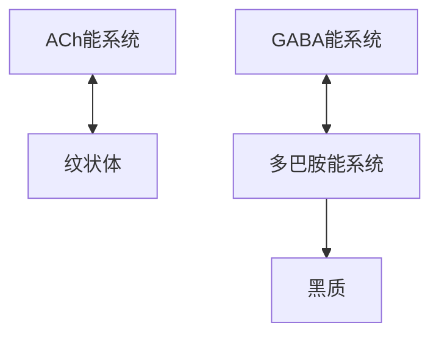
</details>

肌张力增高、肌肉强直、随意运动减少、动作迟缓、表情呆板、静止性震颤。参阅【2002NO16】。②脊髓小脑由小脑前叶和后叶的中间带区组成，主要接受脊髓（来自躯干和四肢皮肤、肌肉和关节的感觉）和三叉神经（头面部躯体感觉）的传入神经，发出的传出纤维经顶核投射到大脑皮层和脑干，控制躯干和四肢近端的肌肉运动。脊髓小脑受损后，患者不能完成精巧动作，肌肉在动作进行过程中抖动而把握不住方向，尤其在精细动作的终末出现震颤，成为意向性震颤。③脊髓前角受损常表现为四肢无力、活动受限、肢体麻木、肌肉萎缩等。纹状体受损常导致舞蹈病。

120. ABCD 121. ABCD ①可被磷酸化修饰的氨基酸残基包括酪氨酸、丝氨酸、苏氨酸, 记忆为“老是输”“老师叔”, 故答 B。②二硫键由两个半胱氨酸巯基(—SH)脱氢氧化而生成, 故答 A。


<details>
<summary>chemical</summary>

Chemical reaction diagram showing the conversion of a sulfonated amino acid to a sulfonated amino acid via hydrogen reduction, with partial derivatives labeled in Chinese.
</details>

122. ABCD 123. ABCD ①正常生理情况下,血红蛋白(Hb)的4个单体之间由盐键连接,形成紧密型(T型)血红蛋白。当Hb与O₂结合形成HbO₂时,Fe²⁺位置移动,盐键断裂,使Hb发生变构效应,成为疏松型(R型)血红蛋白。参阅10版《生理学》P151。甘油酸-2,3-二磷酸(2,3-BPG)是调节血红蛋白(Hb)运氧能力的重要物质。当红细胞内2,3-BPG浓度升高时,2,3-BPG可与Hb的β链形成盐键,促使血红蛋白由R型向T型转变,HbO₂释放O₂增加,以供组织需要。当红细胞内2,3-BPG浓度降低时,HbO₂释放O₂减少。可见,人体能通过改变红细胞内2,3-BPG浓度来调节对组织的供氧。②红细胞内戊糖磷酸途径的主要功能是产生NADPH+H⁺。NADPH是细胞内重要的还原当量,能对抗氧化剂,维持细胞内还原型谷胱甘肽(GSH)的含量,使血红蛋白处于还原状态,代谢过程如下图所示。③δ-氨基-γ-酮戊酸(ALA)是血红素合成过程的第一个化合物。MHb为高铁血红蛋白,并不能携带氧。


<details>
<summary>chemical</summary>

Chemical reaction diagram showing Hb and O2 conversion to HbO2 via oxygen red blood, with salt hydrolysis and hydrolysis steps
</details>


<details>
<summary>chemical</summary>

谷胱甘肽的氧化与还原反应示意图，展示葡萄糖-6-磷酸脱氢酶与谷胱甘肽还原酶的转化路径
</details>

124. ABCD 125. ABCD ①瘢痕组织是指肉芽组织经改建成熟形成的纤维结缔组织。纤维结缔组织老化称为玻璃样变,故瘢痕组织容易发生的变性是纤维结缔组织玻璃样变。②缓进型高血压患者肾小球入球小动脉容易发生的变性是细小动脉壁玻璃样变，恶性高血压患者肾小球入球小动脉容易发生纤维蛋白样坏死。③淀粉样变好发于霍奇金淋巴瘤、浆细胞淋巴瘤、甲状腺髓样癌等肿瘤的间质。脂肪变常见于肝细胞、心肌细胞等。

126. ABCD 127. ABCD ①局灶性节段性肾小球硬化光镜下病变呈局灶性分布,可见部分肾小球毛细血管袢玻璃样变和硬化,表现为系膜基质增多,基膜塌陷。②微小病变性肾小球病光镜下肾小球基本正常,近曲小管上皮细胞内脂质沉积(脂肪变性)且有蛋白小滴(细胞内玻璃样变)。③系膜增生性肾小球肾炎光镜下可见弥漫性系膜细胞增生和系膜基质增多。膜性肾小球病光镜下可见肾小球毛细血管壁弥漫性增厚。  
128. ABCD 129. ABCD ①肺炎链球菌肺炎是大叶性肺炎的常见致病菌,常累及几个肺段或整个肺叶。肺炎链球菌肺炎不产生毒素,不引起组织坏死,一般不形成空洞,故答 A。②肺炎支原体肺炎属于间质性肺炎,主要表现为肺泡间质水肿、增宽,而肺泡腔内渗出液较少甚至无渗出液,因此常表现为发作性干咳,少痰或无痰。持久的阵发性剧咳为肺炎支原体肺炎的特点,故答 B。③金黄色葡萄球菌肺炎的特点是严重的全身感染中毒症状和呼吸道症状不平行。病毒性肺炎的症状与肺炎支原体肺炎相似,但症状较轻,好发于病毒性疾病流行季节。  
130. ABCD 131. ABCD ①黏液脓血便是溃疡性结肠炎最重要的临床表现,可首先排除 B、C。溃疡性结肠炎常表现为左下腹或下腹隐痛,常伴里急后重,便后腹痛缓解,故答 A 而不是 D。②肠易激综合征为功能性肠病,没有结肠黏膜的脱落坏死,因此不会出现黏液脓血便、果酱样便,可排除 A、C、D,得出正确答案为 B。肠易激综合征可有黏液便,但绝无脓血。③果酱样便常见于肠阿米巴病。  
132. ABCD 133. ABCD A 为急性阑尾炎的腹痛特点, B 为右侧输尿管结石的腹痛特点, C 为十二指肠溃疡穿孔的腹痛特点, D 为急性胆囊炎的腹痛特点。  
134. ABCD 135. ABCD ①门静脉-下腔静脉分流术是指将门静脉肝端结扎, 将远端门静脉与下腔静脉作端侧吻合, 术后所有门静脉血流不经肝脏解毒, 全部经吻合口直接注入下腔静脉, 因此肝性脑病发生率较高, 达 $30\% \sim 50\%$ , 故答 A。②贲门周围血管离断术是指将贲门周围的小血管全部离断, 彻底阻断门-奇静脉间的反常血流, 保证了入肝血流, 故答 C。③远端脾-肾静脉分流术后入肝血流减少, 但减少幅度不如门静脉-下腔静脉分流术, 因此术后肝性脑病发生率没有后者高。单纯脾切除术常用于治疗脾功能亢进, 可降低门静脉压力, 延缓肝病进展。


<details>
<summary>natural_image</summary>

Anatomical line drawing of the human liver and surrounding organs (no labels or text)
</details>

门静脉-下腔静脉端侧分流术


<details>
<summary>natural_image</summary>

Anatomical line drawing of the human liver and surrounding organs (no labels or text)
</details>

远端脾-肾静脉分流术


<details>
<summary>text_image</summary>

Anatomical diagram of the human esophagus with numbered labels indicating different structures or regions.
</details>

贲门周围血管离断术


<details>
<summary>line</summary>

| 增加的初长度 (cm) | 总张力 (kg) | 主动张力 (kg) | 被动张力 (kg) |
| ---------------- | ----------- | ------------- | ------------- |
| 0                | 0           | 0             | 0             |
| 1                | ~5          | ~3            | ~1            |
| 2                | ~10         | ~6            | ~2            |
| 3                | ~18         | ~14           | ~4            |
| 4                | ~22         | ~17           | ~6            |
| 5                | ~21         | ~16           | ~7            |
</details>

肌肉等长收缩时的长度-张力关系

136. ABCD ①前负荷是指肌肉在收缩之前所承受的负荷。在前负荷的作用下肌肉所具有的长度,称为初长度。初长度可看作前负荷的同义词,前负荷越大,初长度越大(D对)。②肌肉因受到牵拉而弹性回位的张力属于被动张力。在等长收缩实验中,可测定不同初长度时肌肉主动收缩产生的张力(即主动张力),得到长度-张力关系曲线。从图中可见,在一定范围内,肌肉收缩张力(即主动张力)随前负荷(初长度)的增加而增加,但当前负荷超过最适初长度后,再增加前负荷反而使主动张力减小。A项缺乏前置条件“在一定范围内”,故不答A。③当前负荷增加时,肌肉收缩所产生的被动张力相应增加(B 对)。④总张力等于主动张力加被动张力。在前负荷小于最适初长度时,前负荷增加可导致主动张力和被动张力增加,故总张力增加;当前负荷大于最适初长度时,前负荷增加可导致主动张力下降、被动张力增加、总张力下降,故不答 C。

137. ABCD ①心肌收缩力可通过改变前负荷、后负荷以及心肌收缩能力来调节,故答 A、B。心肌收缩能力并不等于心肌收缩力。②心肌收缩能力是指心肌不依赖前负荷和后负荷,而能改变其收缩效能的肌肉内在特性。凡能影响兴奋-收缩耦联各环节的因素,都可影响心肌收缩能力,其中主要取决于兴奋-收缩耦联过程中胞质内 $\mathrm{Ca}^{2+}$ (并不是胞外 $\mathrm{Ca}^{2+}$ ) 浓度,C 项不严谨。③心肌受自主神经支配,因此心肌收缩力也受自主神经活动的影响,如交感神经兴奋释放儿茶酚胺,可提高心肌收缩力。  
138. ABCD 缩胆囊素的生理作用包括: ①促进胰液中各种胰酶的分泌; ②促进胆囊强烈收缩, 促使胆汁排出; ③对胰腺组织具有营养作用, 可促进胰腺组织蛋白质和核糖核酸的合成。参阅 10 版《生理学》P181。缩胆囊素并不能促进胆管上皮细胞分泌大量的水和 $\mathrm{HCO}_{3}^{-}$ , 能够促进胰腺导管上皮细胞分泌大量水和 $\mathrm{HCO}_{3}^{-}$ 的激素是促胰液素, 故不答 B。  
139. ABCD ①肾小球有效滤过压=(肾小球毛细血管静水压+囊内液胶体渗透压)-(血浆胶体渗透压+肾小囊内压)。肾盂积水患者,终尿排出障碍,可引起逆行性肾小囊内压升高,造成肾小球有效滤过压降低,导致肾小球滤过率降低。②高血压肾小球硬化可使肾小球毛细血管血压降低,引起肾小球滤过率降低。③早期糖尿病由于肾糖阈增高,可出现渗透性利尿。葡萄糖可自由通过肾小球滤过膜,早期糖尿病不会影响肾小球滤过率。④尿崩症患者由于缺乏抗利尿激素,集合管上皮细胞对水的通透性降低,水重吸收减少,出现多尿,对肾小球滤过率无明显影响。  
140. ABCD ①腺垂体存在生长激素细胞、催乳素细胞、促甲状腺激素细胞、促肾上腺皮质激素细胞、促性腺激素细胞,可分别分泌生长激素、催乳素、促甲状腺激素、促肾上腺皮质激素、促性腺激素(卵泡刺激素/黄体生成素)。②缩宫素不是腺垂体分泌的,而是下丘脑大细胞神经元分泌的,故不答 B。  
141. ABCD ①睾酮可提高血中低密度脂蛋白含量,降低高密度脂蛋白含量,因而男性患心血管疾病的风险高于绝经前女性。②睾酮可刺激骨生长和骨骺的闭合。③睾酮可促进蛋白质合成并抑制其分解,加速机体生长,引起正氮平衡。④睾酮可参与调节机体水和电解质平衡,导致体内水钠潴留。  
142. ABCD ①某些理化条件(温度、pH、离子强度等)可以使 DNA 双链互补碱基对之间的氢键断裂,导致一条 DNA 双链解离成为两条单链,这种现象称为 DNA 变性(B 对)。②DNA 变性时,由原来比较 “刚硬”的双螺旋结构,分裂成两条比较柔软的单股多核苷酸链,从而引起溶液黏度降低。③DNA 变性后密度增加,这是因为单链 DNA 内碱基配对组成更为紧密。参阅北京大学医学出版社 4 版《生物化学》P59。④在 DNA 解链过程中,有更多包埋在双螺旋结构内部的碱基得以暴露,因此含有 DNA 的溶液在 260nm 处的吸光度随之增加,这种现象称为 DNA 的增色效应(D 对)。  
143. ABCD ①花生四烯酸可以转变生成的生物活性物质有前列腺素、血栓素、白三烯，代谢过程如下。②泛素是一种由76个氨基酸组成的小分子蛋白质，广泛存在于真核细胞，主要参与蛋白质的降解过程，并不是由花生四烯酸转变而来。


<details>
<summary>flowchart</summary>

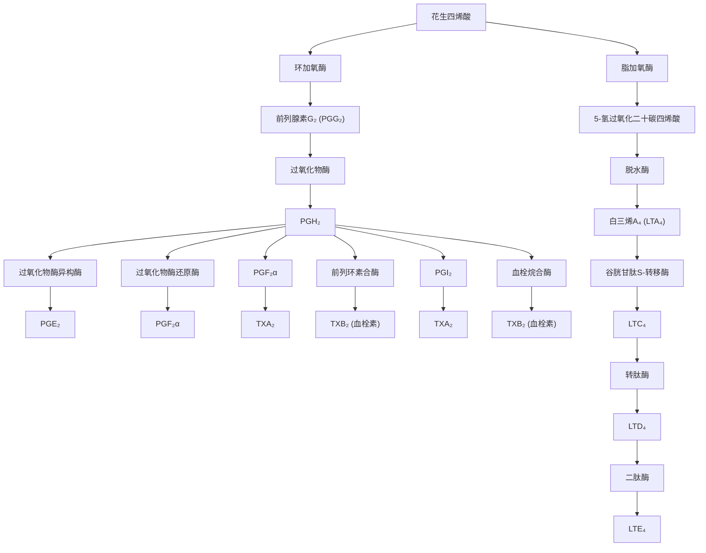
</details>

144. ABCD ①甲硫氨酸经腺苷转移酶的催化与 ATP 反应,生成 S-腺苷甲硫氨酸(SAM)。SAM 去甲基后生成S-腺苷同型半胱氨酸,后者脱去腺苷生成同型半胱氨酸。同型半胱氨酸再接受 $N^{5}-CH_{3}-FH_{4}$ 提供的甲基,重新生成甲硫氨酸,由此形成一个循环过程,称为甲硫氨酸循环。②在甲硫氨酸循环中,维生素 $B_{12}$ 是合成甲硫氨酸的 $N^{5}-CH_{3}-FH_{4}$ 转甲基酶的辅酶。可见,参与甲硫氨酸循环代谢

途径的维生素有维生素 $\mathrm{B}_{12}$ 和叶酸（其活性形式为 $\mathrm{FH}_4$ ）。③维生素D和泛酸(维生素 $\mathrm{B}_5$ )不参与甲硫氨酸循环。

145. ABCD ①染色质结构对基因表达的影响可以遗传给子代细胞,称为表观遗传。表观遗传是指在 DNA 序列不发生改变的情况下,基因的表达水平与功能发生改变,并产生可遗传的表型。这种遗传信息不是蕴藏在 DNA 序列中的,而是通过对染色质结构的影响及基因表达变化


<details>
<summary>flowchart</summary>

```mermaid
graph TD
    A["甲硫氨酸"] -->|N⁵—CH₃—FH₄转甲基酶 (维生素B₁₂)| B["S-腺苷甲硫氨酸"]
    B -->|R—CH₃| C["S-腺苷同型半胱氨酸"]
    C -->|H₂O| D["同型半胱氨酸"]
    D -->|N⁵—CH₃—FH₄转甲基酶 (维生素B₁₂)| A
    E["腺苷转移酶"] --> B
    F["甲基转移酶"] --> C
    G["腺苷"] --> C
```
</details>

甲硫氨酸循环

而实现的。表观遗传修饰包括组蛋白修饰、DNA甲基化、非编码RNA的调控等。②激酶磷酸化修饰属于酶蛋白的化学修饰。RAS棕榈酰化修饰是指RAS蛋白在棕榈酰基转移酶作用下，棕榈酰基通过硫酯键与蛋白质C端半胱氨酸的巯基共价结合的翻译后修饰。A、C均不属于表观遗传修饰。参阅10版《生物化学》P325。

146. ABCD 肝生物转化分为两相反应,第一相反应包括氧化、还原和水解反应,第二相反应主要为结合反应。参阅【2023NO143】。

147. ABCD DNA 连接酶、逆转录酶、限制性核酸内切酶均属于重组 DNA 技术中常用的工具酶。重组 DNA 技术无须 RNA 聚合酶, 故不答 C。

148. ABCD ①内分泌性萎缩是指内分泌腺功能下降引起靶器官细胞萎缩,如老年女性雌激素分泌过少,可导致乳腺萎缩;垂体缺血坏死时,可引起促肾上腺皮质激素释放减少,导致肾上腺皮质萎缩。②阿尔茨海默病患者的大脑萎缩,是大量神经元凋亡所致,属于大脑的老化。脊髓神经损伤而导致的肌肉萎缩属于去神经性萎缩。

149. ABCD ①与 Epstein-Barr 病毒感染密切相关的疾病包括 Burkitt 淋巴瘤、霍奇金淋巴瘤、鼻咽癌等。②人乳头瘤病毒(HPV6、HPV11)感染与尖锐湿疣的发病有关。参阅【2017NO148】、【2023NO126】。

150. ABCD ①永久性细胞是指不能进行再生或再生能力极弱的细胞,包括神经元、心肌细胞、骨骼肌细胞。②成骨细胞、平滑肌细胞均属于稳定细胞。参阅北京大学医学出版社3版《病理学》P27。

151. ABCD ①出血性梗死多发生于严重淤血、组织疏松的器官,如肺、肠容易发生出血性梗死。②脾、肾常发生贫血性梗死。

152. ABCD ①急性心肌梗死早期镜下观,可见心肌纤维凝固性坏死,核固缩,核碎裂、溶解消失;胞质均质红染,大量收缩带形成;心肌间质水肿,大量中性粒细胞浸润。②陈旧性心肌梗死可有肉芽组织形成,但不会出现肉芽肿。肉芽肿形成为慢性特异性炎症的特征性病理变化,故不答 D。

153. ABCD 结节性甲状腺肿肉眼观,可见甲状腺呈不对称结节状肿大,结节大小不等,有的结节边界清楚,常无完整包膜(B 错)。切面内常见出血、坏死、囊性变、钙化和瘢痕形成。光镜下,部分滤泡上皮呈柱状或乳头样增生,小滤泡形成;部分上皮复旧或萎缩,胶质贮积。

154. ABCD 根据 Light 标准, 确定渗出性胸腔积液的标准有: ① 胸腔积液蛋白/血清蛋白 >0.5; ② 胸腔积液乳酸脱氢酶 (LDH)/血清 LDH >0.6; ③ 胸腔积液 LDH 大于血清 LDH 正常值高限的 2/3。3 项中符合任意 1 项可判断为渗出液, 3 项均不满足则为漏出液。胸腔积液有核细胞数 > $500 \times 10^{6}$ /L 多为渗出液, < $100 \times 10^{6}$ /L 多为漏出液。

155. ABCD 阵发性室上性心动过速心电图特点:①心室率可达 160\~250 次/分,10 版《内科学》为 150\~

200 次/分;②QRS 波群形态一般正常,但发生室内差异性传导或束支传导阻滞时,QRS 波群形态异常;③可有逆行 P 波,但由于心率很快,P 波常与 QRS 波群重叠,故难以见到逆行 P 波。在房室传导比例不固定的情况下,R-R 间期可以不相等,故不答 B。  
156. ABCD ①急性有机磷农药中毒时,可出现毒蕈碱样(M样)症状,常表现为平滑肌痉挛(瞳孔缩小、腹痛、腹泻);括约肌松弛(大小便失禁);腺体分泌增加(大汗、流泪、流涎);气道分泌物增多(呼吸困难、双肺湿啰音)。可见A、B、C、D均属于M样症状。②阿托品为M受体拮抗药,可解除有机磷农药中毒所引起的M样症状,故答A、B、C、D。  
157. ABCD ① $1,25-(\mathrm{OH})_{2}\mathrm{D}_{3}$ 在皮肤、肝、肾内合成,慢性肾衰竭患者可有 $1,25-(\mathrm{OH})_{2}\mathrm{D}_{3}$ 合成不足。②红细胞生成素(EPO)在肾间质细胞内合成,慢性肾衰竭患者可有EPO合成减少。③甲状旁腺激素(PTH)的生理作用是升高血钙、降低血磷。慢性肾衰竭患者常合并低钙血症、高磷血症,可刺激PTH过度分泌,导致继发性甲状旁腺功能亢进,故不答C。④慢性肾衰竭患者常有糖耐量异常,与骨骼肌、外周器官摄取葡萄糖能力下降、酸中毒等有关。  
158. ABCD ①凝血酶-抗凝血酶复合物测定、FVIII：C抗体测定属于提示抗凝异常的检查项目。②D-二聚体测定属于提示纤溶异常的检查项目。凝血酶原时间测定属于提示凝血异常的检查项目。参阅10版《内科学》P617。  
159. ABCD ①磺脲类降糖药为促胰岛素分泌剂,可刺激胰岛β细胞分泌胰岛素。②双胍类主要通过抑制肝葡萄糖输出、改善外周组织对胰岛素的敏感性、抑制肠黏膜细胞摄取葡萄糖等使血糖降低。③α-葡萄糖苷酶抑制剂主要通过抑制小肠黏膜刷状缘的α-葡萄糖苷酶,延迟碳水化合物吸收,而降低餐后血糖。④胰高血糖素样肽-1(GLP-1)受体激动剂主要通过刺激胰岛素合成和分泌、减少胰高血糖素释放而降低血糖,故答A、D。  
160. ABCD ①急性胰腺炎合并腹腔大出血,若保守治疗无效,则须手术止血。②胰腺及胰周坏死组织继发感染,保守治疗很难奏效,须手术处理。③继发肠道穿孔,大量肠内容物流入腹腔,须急诊手术治疗。④由胆总管下端结石引起的胆源性胰腺炎,须早期手术解除胆胰共同通路梗阻,同时清除胰腺周围坏死组织、通畅引流。  
161. ABCD 肝内胆管结石行肝切除术的适应证:①肝内区域性结石合并纤维化、萎缩、脓肿、胆瘘;②难以取净的肝段、肝叶结石并胆管扩张;③不易手术的高位胆管狭窄伴有近端胆管结石;④局限性的结石合并胆道出血;⑤结石合并胆管癌变。弥漫性肝内胆管结石不可能作全肝切除,故不答 B。  
162. ABCD ①张力性气胸为气管、支气管或肺损伤处形成活瓣，气体随每次吸气进入胸膜腔并积累增多，导致胸膜腔压力高于大气压，又称为高压性气胸(A对)。②张力性气胸患者伤侧肺严重萎陷，纵隔显著向健侧移位，健侧肺受压，导致呼吸、循环障碍。③张力性气胸患者由于胸膜腔高压，可驱使气体经支气管、气管周围疏松结缔组织，进入纵隔或胸壁软组织，形成纵隔气肿或皮下气肿。④纵隔左右摆动是开放性气胸的特点，而不是张力性气胸的表现，故不答B。  
163. ABCD 预防腹部切口裂开的方法有: ①适当的腹部加压包扎有一定的作用; ②关腹时加用全层腹壁减张缝合; ③及时处理腹胀。注意: 延迟拆线并不能预防腹部切口裂开。  
164. ABCD ①神经根型颈椎病常表现为颈肩痛,并向上肢放射,可有手指疼痛、麻木,肩关节活动受限。②肩周炎(粘连性肩关节囊炎)常表现为肩痛,可牵涉到上臂中段(不会出现手痛),可有肩关节活动受限,故答 A、B、D。  
165. ABCD ①骨与关节结核好发于负重大、活动多、易发生损伤的部位,其中脊柱结核最常见,占 $50\%$ 以上,髋关节、膝关节结核各约占 $15\%$ 。②腕关节并不是骨与关节结核的好发部位,而是类风湿关节炎的好发部位。

# 2024年全国硕士研究生招生考试临床医学综合能力(西医)试题答案及详细解答

# (答案为绿色的选项)

1. ABCD ①人体的自动控制系统是一个闭合回路,在控制部分和受控部分之间存在双向信息联系,即控制部分发出控制信息到达受控部分,这是控制和调节的一个方面;受控部分也不断有信息送回到控制部分,来纠正和调节控制部分对受控部分的影响。来自受控部分的反映其变化情况的信息,称为反馈信息。②偏差信息是指反馈信息与参考信息(标准信息)的差值。前馈信息是指前馈控制系统中由控制部分发出的输入信息或扰动信息。指令信息是由控制部分发出的用来调整受控部分活动的信息。参阅【1994NO24】。


<details>
<summary>flowchart</summary>

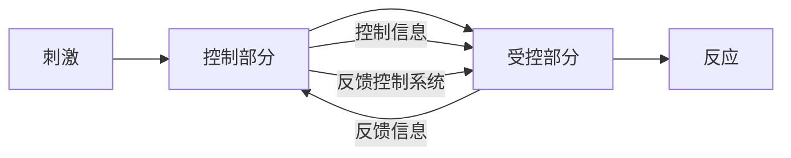
</details>

2. ABCD 可兴奋细胞发生一次兴奋后,其兴奋性的周期性变化表现为绝对不应期→相对不应期→超常期→低常期→恢复正常。在绝对不应期,细胞的兴奋性为0,不可能再次接受刺激而产生动作电位(锋电位)。在相对不应期、超常期和低常期,细胞再次接受刺激均可发生兴奋。因此,神经纤维上两个先后发生的锋电位之间的最短间隔时间应不小于绝对不应期。  
3. ABCD 后负荷是指肌肉在收缩后所承受的负荷。当后负荷为0时，肌肉缩短速度最大，肌肉不产生张力。随着后负荷逐渐增加，肌肉收缩产生的张力增大，但开始缩短的时间推迟、肌肉缩短的距离减小、缩短的速度减慢。参阅北京大学医学出版社4版《医学生理学》P42。参阅【2022NO2】。  
4. ABCD ①蛋白质 C 系统包括蛋白质 C、凝血酶调节蛋白、蛋白质 S 和蛋白质 C 的抑制物,主要通过灭活 FVIIIa 和 FVa 而发挥生理性抗凝作用。当凝血酶离开损伤部位而与正常血管内皮细胞上的凝血酶调节蛋白结合后,可激活蛋白质 C,后者可水解灭活 FVIIIa 和 FVa,抑制 FX 和凝血酶原的激活,有助于避免凝血过程向周围正常血管部位扩展。②B 为组织因子途径抑制物 (TFPI) 的抗凝血机制。C 为肝素的抗凝血机制。D 为华法林的抗凝血机制。  
5. ABCD ①微循环由微动脉、后微动脉、毛细血管前括约肌、真毛细血管、直接通路、动-静脉吻合支、微静脉等组成。微循环的开启或关闭主要由后微动脉和毛细血管前括约肌决定。毛细血管网的开放和关闭是由局部代谢产物积聚的浓度决定的，包括低氧、 $\mathrm{CO}_{2} 、 \mathrm{H}^{+}$ 、腺苷、ATP、 $\mathrm{K}^{+}$ 等。②交感神经、副交感神经、血管紧张素主要作用于大、中、小血管，而不是微循环的毛细血管前括约肌，故不答 A、B、C。参阅【2015NO153】、【2008NO7】、【2003NO5】。  
6. ABCD ①迷走神经兴奋对心脏是负性效应,如负性变力(心房肌收缩力减弱)、负性变时(心率减慢)、负性变传导(心内兴奋传导减慢)。②因心迷走神经纤维对心室肌的支配密度远低于心房肌的支配,故迷走神经兴奋引起的心室肌收缩力减弱效应比心房肌低得多,故答 A。  
7. ABCD ①2,3-二磷酸甘油酸是红细胞糖酵解的产物,红细胞糖酵解加强可造成2,3-二磷酸甘油酸浓度升高,血红蛋白对 $O_{2}$ 的亲和力降低, $P_{50}$ 增大,氧解离曲线右移。②CO中毒、血pH升高、 $PaCO_{2}$ 降低均可使氧解离曲线左移。参阅【2002NO9】、【2007NO9】。  
8. ABCD ①促胰液素由小肠上部 S 细胞分泌。当酸性食糜进入小肠后，可刺激小肠黏膜释放促胰液

素,导致胰腺导管上皮细胞分泌大量胰液,故答 A。②促胃液素、缩胆囊素虽可促进胰液分泌,但作用较弱,故不答 B、D。促胃液素的主要作用是促进胃酸分泌,缩胆囊素的主要作用是促进胆囊收缩。抑胃肽的主要作用是抑制胃酸分泌,故不答 C。

9. ABCD ①食物的氧热价是指食物氧化时,消耗1L氧所产生的热量。因此,测定一定时间内的耗氧量,根据其氧热价(忽略蛋白质氧热价),就可得出这段时间内的产热量。②该受试者的基础代谢率=非蛋白氧热价×耗氧量÷体表面积=20.2×16.7÷1.67=202[kJ/(m²·h)]。参阅【2018NO9】。

10. ABCD ①髓袢升支粗段对水不通透,髓袢降支细段对水是通透的,记忆为“水往低处流”,只要是降支,对水都是通透的,只要是升支,对水都是不通透的。②小管液65%\~70%的水在近端小管被重吸收,集合管对水的重吸收受抗利尿激素的调节。

11. ABCD ①在感觉系统中,普遍存在侧向抑制现象。由于感觉通路中存在辐散式联系,一个局部刺激常可激活多个神经元,处于中心区的投射纤维直接兴奋下一个神经元;而处于周边区的投射纤维则通过抑制性中间神经元而抑制其后续神经元。这样,与来自刺激中心区感觉神经元的信息相比,来自刺激周边区的信息则是抑制的。可见,侧向抑制能加大刺激中心区和周边区之间神经元兴奋程度的差别、增强感觉系统的分辨能力。②交互抑制(传入侧支性抑制)、突触前抑制均属于中枢抑制的形式。反馈抑制属于激素调控的机制。

12. ABCD ①肌梭是牵张反射的感受器,位于梭内肌纤维中间,主要感受肌肉长度的变化。肌梭与梭内肌呈串联关系,


<details>
<summary>text_image</summary>

反应
次级神经元
初级神经元
刺激
感觉传入通路中的侧向抑制
</details>

与梭外肌呈并联关系。当肌肉静息时, 肌梭长度处于一定水平, 肌梭有一定的传入冲动, 故不答 A。当肌肉受外力牵拉而伸长时, 肌梭传入冲动增加, 故不答 D。当梭外肌收缩而肌梭松弛时, 肌梭传入冲动减少或消失。②肌梭的传入纤维终止于脊髓前角 $\alpha$ 运动神经元, $\alpha$ 运动神经元发出 $\alpha$ 传出纤维支配梭外肌。当 $\alpha$ 传出冲动增加时, 梭外肌收缩而缩短, 因肌梭与梭外肌呈并联关系, 故肌梭也缩短, 肌梭放电减少, 肌梭传入冲动减少, 故答 B。③ $\gamma$ 运动神经元发出的 $\gamma$ 传出纤维支配梭内肌。当 $\gamma$ 传出冲动增加时, 梭内肌收缩, 其收缩强度不足以使整块肌肉缩短, 但可牵拉肌梭感受装置, 引起肌梭传入冲动增加。参阅【2000NO17】、【2020NO141】。


<details>
<summary>text_image</summary>

传入神经冲动
I a类传入纤维
肌梭
梭外肌纤维
梭内肌纤维
肌肉静息时
</details>


<details>
<summary>natural_image</summary>

Diagram of a mechanical setup with two vertical cylindrical components connected by a spring, above a circular component (no text or symbols)
</details>


<details>
<summary>text_image</summary>

γ传出冲动增加时
</details>


<details>
<summary>text_image</summary>

肌肉缩短时
</details>

肌肉拉长时  
肌梭的主要组成及在不同长度状态下传入神经纤维放电改变的示意图

13. ABCD ①下丘脑外侧区为动物的摄食中枢,刺激该区可引起动物多食。②下丘脑腹内侧核为动物的饱中枢,刺激该区可引起动物拒食。背侧丘脑前核是下丘脑和扣带回之间的中继站,主要与内脏活动有关。弓状核主要参与垂体门脉系统的组成。参阅【2008NO125、126】、【1995NO25】。  
14. ABCD ①甲状旁腺激素(PTH)可诱导肾小管上皮细胞 $1\alpha$ -羟化酶基因转录,促进肾脏活性维生素 $\mathrm{D}_3$ 的合成。②雌二醇 $(\mathrm{E}_2)$ 、生长激素(GH)、甲状腺激素(TH)都不能促进肾脏合成活性维生素 $\mathrm{D}_3$ 。  
15. ABCD 临床上,长期大剂量服用皮质醇,可反馈抑制下丘脑 CRH 神经元及腺垂体 ACTH 细胞,使 CRH 与 ACTH 的合成和分泌减少,导致患者肾上腺皮质萎缩,分泌功能减退或停止。如果此时突然停用皮质醇,可因患者体内皮质醇突然减少而出现急性肾上腺皮质功能减退,甚至危及生命。因此,应逐渐减量停药或在治疗过程中间断补充 ACTH,以防肾上腺皮质萎缩,故答 D。  
16. ABCD 育龄期妇女生殖系统周期性变化受“下丘脑(GnRH)-垂体(FSH、LH)-卵巢(E、P)-子宫轴”的调控。输卵管结扎只是阻断了卵子和精子结合,并没有影响该调控轴,因此既不会影响卵巢的排卵,也不会影响子宫内膜周期性脱落形成月经,故答C。  
17. ABCD ①模体是蛋白质分子中具有特定空间构象和特定功能的结构成分,常见的模体包括 $\alpha$ -螺旋- $\beta$ -转角- $\alpha$ -螺旋模体、链- $\beta$ -转角-链模体、链- $\beta$ -转角- $\alpha$ -螺旋- $\beta$ -转角-链模体。亮氨酸拉链是出现在DNA结合蛋白和其他蛋白质中的一种结构模体。锌指结构是由1个 $\alpha$ -螺旋和2个反平行的 $\beta$ -折叠3个肽段组成的蛋白质模体,具有结合锌离子的功能。② $\alpha$ -螺旋属于蛋白质的二级结构,并不属于模体。参阅【2012NO25】、【2021NO17】。  
18. ABCD ①长链非编码 RNA(long non-coding RNA, lncRNA) 是一类长度为 200\~100000 个核苷酸的 RNA 分子, 不编码任何蛋白质, 主要参与基因的表达调控。②tRNA 是蛋白质合成中氨基酸的载体。siRNA(干扰小 RNA)、miRNA(微 RNA) 主要参与基因表达的调控。参阅【2021NO122】。  
19. ABCD ①酰基转移酶所含的维生素是泛酸。②多种脱氢酶所含的维生素是维生素 $\mathrm{B}_{1}$ 。多种羧化酶所含的维生素是生物素。一碳单位转移酶所含的维生素是四氢叶酸(叶酸的活性形式)。  
20. ABCD 酶的调节分为快速调节和缓慢调节两种方式。快速调节是指通过改变酶活性调节酶促反应速率,如别构调节、酶磷酸化修饰调节和酶原激活。缓慢调节是指通过改变酶含量调节酶促反应速率,如酶泛素化修饰调节等。  
21. ABCD ①异柠檬酸在异柠檬酸脱氢酶催化下氧化脱羧产生 $\mathrm{CO}_{2}$ , 脱下的氢由 $\mathrm{NAD}^{+}$ 接受, 其余碳链骨架部分转变为 $\alpha$ -酮戊二酸, 这是三羧酸循环中的第一次脱羧反应。②A、B、D 均不参与脱羧反应。

$$
\text {异柠檬酸} \xrightarrow [ \mathrm{NAD} ^ {+} ]{\text {异柠檬酸脱氢酶}} \alpha - \text {酮戊二酸} + \mathrm{CO} _ {2}
$$

22. ABCD 酮体和胆固醇的合成原料都是乙酰 CoA, 但乙酰 CoA 的来源略有不同。酮体主要在长期饥饿或糖代谢紊乱时大量合成, 此时, 机体主要依靠脂肪氧化供能, 故作为酮体合成原料的乙酰 CoA 主要来自脂肪酸的 $\beta$ 氧化。胆固醇合成常见于生理状态下, 故糖、氨基酸及脂肪酸代谢产生的乙酰 CoA 均可用于胆固醇合成。  
23. ABCD ①肝细胞主要采用苹果酸-天冬氨酸穿梭机制将细胞质中的NADH转运至线粒体呼吸链。


<details>
<summary>flowchart</summary>

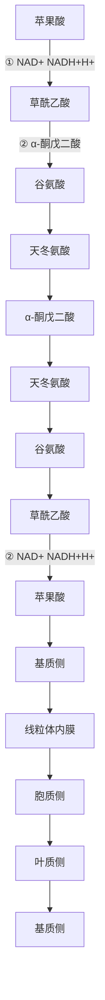
</details>

苹果酸-天冬氨酸穿梭   
①苹果酸脱氢酶   
②谷草转氨酶   
③天冬氨酸- $\alpha$ -酮戊二酸转运蛋白  
④天冬氨酸-谷氨酸转运蛋白

细胞质中的 $\mathrm{NADH} + \mathrm{H}^{+}$ 使草酰乙酸还原生成苹果酸, 苹果酸经过线粒体内膜上的苹果酸-α-酮戊二酸转运蛋白进入线粒体基质后重新生成草酰乙酸, 释放 $\mathrm{NADH} + \mathrm{H}^{+}$ 。基质中的草酰乙酸转变为天冬氨酸后经线粒体内膜上的天冬氨酸-谷氨酸转运蛋白重新回到细胞质, 进入基质的 $\mathrm{NADH} + \mathrm{H}^{+}$ 则通过 NADH 呼吸链进行生物氧化。②戊糖磷酸主要参与磷酸戊糖途径代谢。磷酸二羟丙酮主要通过 α-磷酸甘油穿梭参与 NADH 的转运。丙氨酸主要参与氨的转运。参阅【2016NO32】。

24. ABCD 苯丙氨酸在体内主要有两条代谢途径。主要代谢途径是经苯丙氨酸羟化酶催化生成酪氨酸,次要代谢途径是经苯丙氨酸转氨酶催化生成苯丙酮酸。先天性苯丙氨酸羟化酶缺陷病人,不能将苯丙氨酸羟化为酪氨酸,苯丙氨酸经转氨基作用生成大量苯丙酮酸,造成体内苯丙酮酸及其代谢产物由尿排出,称为苯丙酮尿症。


<details>
<summary>flowchart</summary>

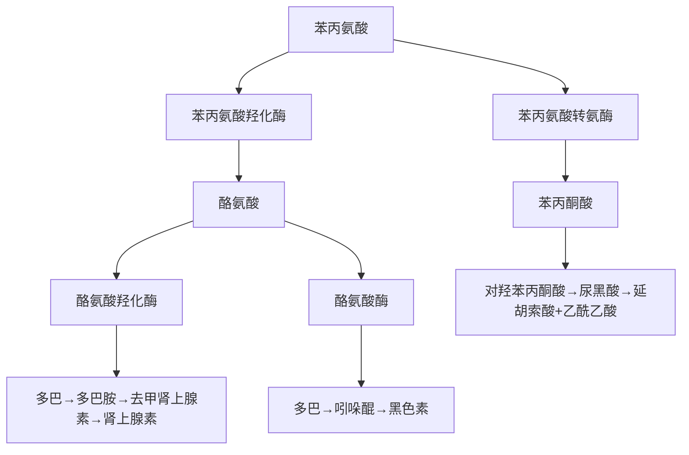
</details>

25. ABCD ①IMP(次黄嘌呤核苷酸)是嘌呤核苷酸从头合成的重要中间产物。IMP与天冬氨酸缩合生成腺苷酸代琥珀酸,后者裂解生成AMP。②XMP(黄苷一磷酸)为IMP转变生成GMP的重要中间产物。S-腺苷甲硫氨酸为活性甲基供体。


<details>
<summary>flowchart</summary>

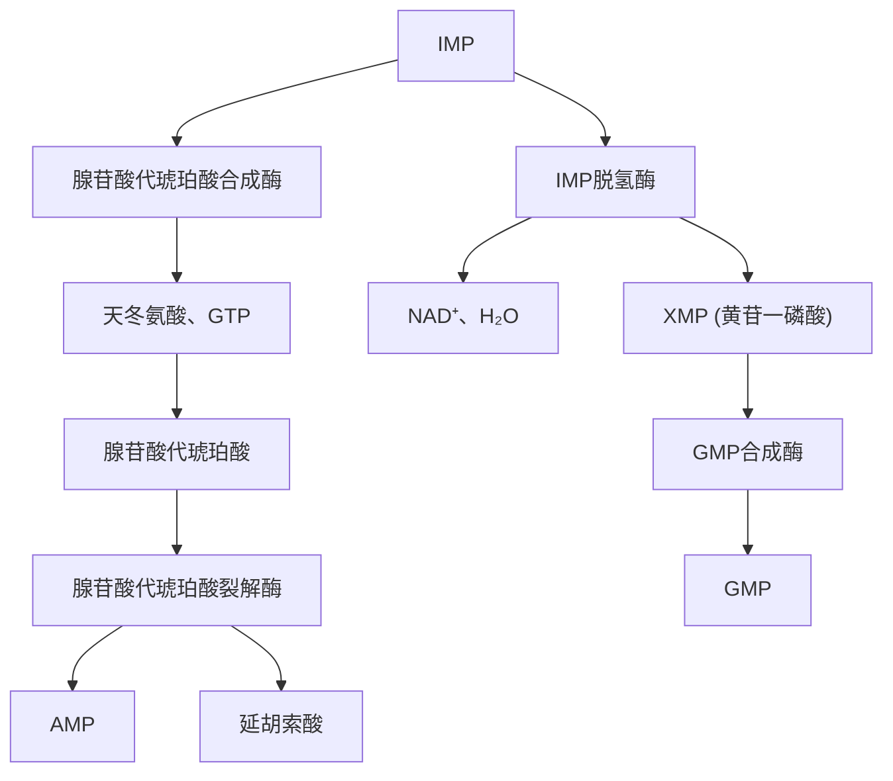
</details>

26. ABCD DNA 聚合酶 $\alpha$ 具有引物酶活性。DNA 聚合酶 $\beta$ 主要参与 DNA 修复。DNA 聚合酶 $\gamma$ 主要参与线粒体 DNA 复制。DNA 聚合酶 $\delta$ 主要参与后随链合成。参阅【2012NO34】。  
27. ABCD ①大多数前体 mRNA 分子经过转录加工后只产生一种成熟的 mRNA, 翻译成相应的一种蛋白质, 故不答 A。少数前体 mRNA 分子可剪切或 (和) 剪接加工成结构不同的 mRNA, 这一现象称为选择性剪接, 又称可变剪接, 故答 B。具有外显子 1\~4 的前体 mRNA, 通过可变剪接, 既可产生只含外显子 1 的成熟 mRNA I , 翻译出蛋白质 A; 也可产生含有外显子 1、2、4 的成熟 mRNA II , 翻译出蛋白质 B。②mRNA 编辑是指对基因的编码序列进行转录后的加工, 故不答 C。无义介导的 mRNA 降解是指 RNA 在细胞内的降解途径, 而不是转录后加工机制, 故不答 D。


<details>
<summary>flowchart</summary>

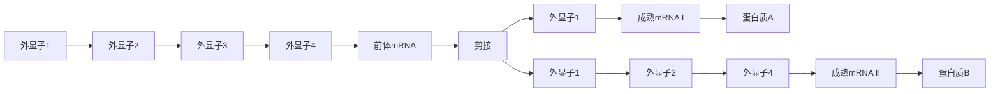
</details>

基因的选择性剪接（可变剪接）

28. ABCD ①IP $_3$ /DAG-PKC途径:配体和受体结合→G蛋白→PLC→IP $_3$ /DAG→PKC→效应蛋白质。②Smad途径:配体→TGF-β→Smad→基因表达。JAK-STAT途径:配体→JAK→STAT→DNA转录→生物学效应。NF-κB途径:TNF、IL-1→IKK→NF-κB→基因表达。可见,正确答案为C。  
29. ABCD ①萎缩是指已发育正常的细胞、组织或器官的体积缩小。萎缩细胞蛋白质合成减少、分解增加,细胞器大量退化而减少,故答 A。②光镜下可见萎缩细胞胞质内出现脂褐素沉着,电镜下可见萎缩细胞内自噬泡显著增多。萎缩的组织或器官可有实质细胞减少,而不是间质细胞减少。参阅北京大学医学出版社 3 版《病理学》P9。  
30. ABCD ①心肌脂肪变性常累及左心室内膜下和乳头肌部位,故不答 D。②肉眼观,脂肪变性的心肌

呈黄色,与正常心肌的暗红色相间,形成黄红色斑纹,称为虎斑心,故不答A。③光镜下,脂肪变性的心肌细胞内可见串珠状脂滴,常位于细胞核附近,较细小(B)。④C为心肌脂肪浸润的表现,故不答C。参阅【2020NO148】、【2012NO42】。  
31. ABCD ①慢性肺淤血时,红细胞破坏、崩解,释放出血红蛋白,后者降解为含铁血黄素颗粒,被巨噬细胞吞噬后成为心衰细胞,故答 C 而不是 B。②中性粒细胞浸润常见于急性化脓性炎症。淋巴细胞浸润常见于慢性炎症、病毒感染等。  
32. ABCD ①恶性肿瘤的分级依据是分化程度,低分化腺癌应为Ⅲ级胃癌。②肿瘤分期的主要依据是恶性肿瘤的生长范围和播散程度,如原发肿瘤的大小、浸润深度、浸润范围、淋巴结和远处转移情况等,因此,不能根据“胃镜活检病理报告诊断为低分化腺癌”确定其肿瘤分期,故答 D。  
33. ABCD ①CD4 分子是 HIV(艾滋病病毒)的主要受体,因此,当 HIV 进入人体后,主要感染 CD4 $^{+}$ T 淋巴细胞,即辅助性 T 淋巴细胞,故答 A。②CD8 $^{+}$ T 淋巴细胞活化后,分化为细胞毒性 T 淋巴细胞。B、C、D 并不是 HIV 的受体细胞,故不答 B、C、D。参阅【2002NO35】、【2007NO47】、【2016NO167】。  
34. ABCD 动脉粥样硬化的基本病理变化包括脂纹、纤维斑块、粥样斑块等。泡沫细胞聚集形成脂纹，大量胶原纤维沉积形成纤维斑块，纤维帽下大量胆固醇结晶、钙盐沉积等形成粥样斑块，因为脂纹是动脉粥样硬化肉眼可见的最早病变，故答 A。参阅【2015NO50】。  
35. ABCD ①风湿性心肌炎特征性细胞为风湿细胞(阿绍夫细胞),风湿细胞是由巨噬细胞吞噬纤维素样坏死物质后转变而来的,故答 C。②中性粒细胞浸润常见于急性化脓性炎症。浆细胞浸润常见于慢性非特异性炎症。肥大细胞可分泌多种细胞因子,主要参与免疫调节。参阅【2015NO48】。  
36. ABCD 微小病变性肾小球病光镜下肾小球结构基本正常,近曲小管上皮细胞内可见大量脂质沉积,故答 D 而不是 A、B、C。参阅【2007NO46】、【2023NO33】。  
37. ABCD R-S 细胞为霍奇金淋巴瘤的特征性细胞,起源于 B 淋巴细胞。  
38. ABCD 胃癌肉眼形态分为息肉型(蕈伞型)、溃疡型和浸润型3型。如为弥漫性浸润,可导致胃壁增厚,变硬,胃腔变小,状如皮革,称为“革囊胃”(《外科学》称“皮革胃”),故答D。参阅【2016NO148】。  
39. ABCD ①发生于黏膜的纤维素性炎,渗出的纤维素、中性粒细胞、坏死黏膜和病原菌等可在黏膜表面形成一层灰白色膜状物,称为伪膜,故又称伪膜性炎。可见,伪膜性炎的本质是纤维素性炎。②化脓性炎是指以中性粒细胞渗出为主的急性炎症。肉芽肿性炎是指以肉芽肿形成为特征的慢性炎症。增生性炎是指以细胞增生为主,变质和渗出轻微的急性炎症。参阅【2012NO47】、【2018NO151】。  
40. ABCD ①化生是指一种分化成熟的细胞类型被另一种分化成熟的细胞类型所取代的过程。化生通常只发生在同源细胞之间,即上皮细胞与上皮细胞之间,或间叶细胞与间叶细胞之间。因此,纤毛柱状上皮细胞与鳞状上皮细胞之间、鳞状上皮细胞与肠上皮细胞之间、胃上皮细胞与大肠上皮细胞之间均可发生化生,故不答 A、B、C。②肠腺上皮为上皮细胞,软骨细胞为间叶细胞,肠腺上皮细胞与软骨细胞并不同源,两者之间不可能发生化生,故答 D。参阅【2021NO29】、【2009NO163】。  
41. ABCD 二尖瓣狭窄时,可于心尖部闻及低调、隆隆样、舒张中晚期递增型杂音,局限,不传导,左侧卧位时更明显,故答 D。参阅【2013NO58】。  
42. ABCD ①昏睡是指接近于人事不省的意识状态,患者处于熟睡状态,不易唤醒。②轻度昏迷是指患者意识大部分丧失,无自主运动,对声、光刺激无反应,对疼痛刺激尚可出现痛苦表情或肢体退缩等防御反应。角膜反射、瞳孔对光反射、眼球运动、吞咽反射等均可存在。③中度昏迷是指患者对周围事物及各种刺激均无反应,对剧烈刺激可出现防御反射,角膜反射减弱,瞳孔对光反射迟钝,眼球无转动。④深度昏迷是指患者全身肌肉松弛,对各种刺激全无反应,深、浅反射均消失。  
43. ABCD ①支气管哮喘的本质是气道慢性炎症,存在于所有哮喘患者,表现为气道上皮下肥大细胞、嗜酸性粒细胞、巨噬细胞、淋巴细胞及中性粒细胞浸润,以及气道黏膜下组织水肿、微血管通透性增加、支气管平滑肌痉挛、纤毛上皮细胞脱落、杯状细胞增殖等病理改变。②A为慢性阻塞性肺疾病的

特点。B、C 为支气管哮喘的一般发病机制。

44. ABCD ①患者病程仅2天,高热,体温39.8℃,外周血白细胞计数和中性粒细胞比例显著增高,说明为急性细菌感染性疾病,可首先排除D。②急性支气管炎不会出现肺部湿啰音,可排除A。③年轻男性,受凉后急性起病,寒战、高热,咳嗽、咳痰,右上肺语颤增强,可闻及湿啰音,应诊断为肺炎链球菌肺炎。④急性肺脓肿常表现为高热,咳嗽,咳大量臭脓痰。

45. ABCD ①患者病程长达2月余,外周血白细胞计数和中性粒细胞比例不高,可首先排除B、C。②患者长期低热、盗汗为结核中毒症状,咳嗽、咳痰为肺结核的常见症状,左上肺为肺结核的好发部位,患者体型(形)消瘦。根据题干,本例应诊断为肺结核而不是肺癌。

46. ABCD ①老年患者,突发胸痛超过半小时,硝酸甘油疗效差,急诊心电图示多导联 ST 段压低超过 $0.1 \mathrm{mV}, \mathrm{T}$ 波倒置,肌钙蛋白 T 增高 (cTnT 正常值 $0.02 \sim 0.13 \mu \mathrm{g} / \mathrm{L}$ ),应考虑非 ST 段抬高型心肌梗死 (NSTEMI)。患者血压 $< 90 / 60 \mathrm{mmHg}$ ,心率增快,心音低钝,四肢末梢皮肤湿凉,应考虑休克,故本例应诊断为 NSTEMI 合并心源性休克。②为降低心源性休克的病死率,应立即置入主动脉内球囊反搏 (IABP) 进行辅助循环,同时行冠状动脉(冠脉)介入治疗,故答 C。③A 为休克的一般性治疗措施。B、D 并不适合 NSTEMI 合并心源性休克的治疗。

47. ABCD ①胸痛发作时心电图出现的 ST-T 动态改变(如 ST 抬高或压低不低于 0.1mV、T 波低平或倒置)是严重冠心病急性心肌缺血的表现。若心电图改变持续 12 小时以上,则提示心肌梗死,故答 B。
②冠状动脉造影显示血管狭窄>70%,可能是稳定型心绞痛的病理改变,并不一定造成急性心肌缺血,故不答 A。C 提示扩张型心肌病,D 提示血压不稳,故不答 C、D。

48. ABCD ①老年人阵发性短暂黑朦(应为黑朦)1年,心率仅42次/分,本次发作时心电图提示三度房室传导阻滞,应尽早植入永久心脏起搏器。②地塞米松对三度房室传导阻滞无效,故不答A。阿托品仅用于无心脏起搏条件的应急情况,故不答B。患者发病已1年,不宜使用临时心脏起搏器,而应使用永久心脏起搏器。

49. ABCD β 受体拮抗剂可抑制交感神经过度激活对心力衰竭代偿的不利作用。慢性心力衰竭患者应用 β 受体拮抗剂的主要目的不在于短时间内缓解症状,而是长期应用达到延缓疾病进展、减少复发、降低猝死率的目的。参阅 7 版《内科学》P176,10 版《内科学》已删除该知识点。

50. ABCD 溃疡性结肠炎活动期按病情严重程度,分为轻、中、重度。轻度:排便≤3次/日,便血轻或无,体温<37.8℃,脉搏<90次/分,血红蛋白>105g/L,血沉<20mm/h。重度:腹泻≥6次/日,明显血便,体温>37.8℃、脉搏>90次/分,血红蛋白<105g/L,血沉>30mm/h。中度:介于轻度与重度之间。可见,正确答案为D。

51. ABCD ①长期低热为结核中毒症状,肠结核好发于回盲部,钡剂灌肠提示回盲部跳跃征为溃疡型肠结核的典型影像学表现。根据题干,本例应诊断为肠结核。②克罗恩病、阿米巴肠炎、肠淋巴瘤都不会出现钡剂灌肠示回盲部跳跃征。

52. ABCD ①肝硬化患者无论代偿期还是失代偿期,均可有门静脉高压,均可出现脾大,故答 D。②A、B、C 均为肝硬化失代偿期的临床表现。

53. ABCD ①青年女性,尿路刺激征2天,应考虑急性尿路感染。患者无发热,无肾区叩击痛,应诊断为急性膀胱炎。急性膀胱炎不会出现白细胞管型,故答C。沉渣镜检出现白细胞管型,提示急性肾盂肾炎。②急性膀胱炎可出现A、B、D项临床表现。

54. ABCD ①患者外周血三系细胞减少,可首先排除 B、C。②尿隐血试验阳性提示尿中含有血红蛋白,常见于血管内溶血。巨幼细胞贫血为原位溶血,而不是血管内溶血,故不答 A。③阵发性睡眠性血红蛋白尿症(PNH)可出现血管内溶血,由于长期尿铁丢失,可出现血清铁、血清铁蛋白降低(正常值分别为 $10.6 \sim 36.7 \mu \mathrm{mol} / \mathrm{L}, 15 \sim 200 \mu \mathrm{g} / \mathrm{L}$ ), 故答 D。

55. ABCD ①“交感-肾素-血管紧张素-醛固酮系统”是一个调节轴,原发性醛固酮增多症(原醛症)患者由于醛固酮增多,可负反馈抑制肾素分泌,造成血浆肾素浓度降低,因此原醛症患者血浆醛固酮/血浆肾素活性 $\left[\mathrm{ng} / (\mathrm{ml} \cdot \mathrm{h})\right]$ 比值将增大。该比值 $>30$ 提示原醛症可能, $>50$ 具有诊断意义,此为原醛症的最佳检出试验。②A、C、D 为原醛症的一般临床表现,对本病的诊断价值有限。

56. ABCD ①痛风性关节炎好发部位是单侧第一跖趾关节。②远端指间关节为骨关节炎的好发部位。近端指间关节、掌指关节为类风湿关节炎的好发部位。  
57. ABCD 患者因幽门梗阻呕吐胃内容物 10 天,大量胃酸(HCl)丢失,将导致低氯、低钾性代谢性碱中毒。  
58. ABCD 利多卡因一次限量: 表面麻醉为 100mg, 局部浸润麻醉为 400mg。参阅【2005NO87】。  
59. ABCD ①破伤风的典型临床表现是阵发性肌痉挛,肌群的受累顺序为咀嚼肌、面部表情肌、颈肌、背肌、腹肌、四肢肌、膈肌。可见,最早出现强烈收缩的肌肉是咀嚼肌,而不是颈部肌肉。②多种刺激(如光、声、接触、饮水等)均可诱发全身肌肉痉挛,故不答 B。③破伤风患者肌痉挛发作时神志清楚,表情痛苦,故不答 C。④破伤风患者发作时,膀胱括约肌痉挛可引起尿潴留,故答 D。  
60. ABCD ①甲状腺髓样癌临床上少见,仅占甲状腺癌的 $7 \%$ 。②甲状腺髓样癌起源于滤泡旁降钙素分泌细胞,并不是滤泡上皮,故答B。③甲状腺髓样癌可分泌降钙素,属于APUD肿瘤。④甲状腺髓样癌恶性程度中等,可有颈淋巴结侵犯和血行转移。参阅【2021NO132】。  
61. ABCD ①中年妇女,乳头血性溢液常见于乳管内乳头状瘤,也可见于乳腺癌、乳管炎,故答 C。②乳头湿疹样癌常表现为乳头和乳晕瘙痒、皮肤粗糙、糜烂如湿疹样,很少出现乳头血性溢液。少数乳腺囊性增生症(乳腺囊性增生病)患者可有乳头溢液,多为浆液性或浆液血性液体。乳腺纤维腺瘤一般无乳头溢液。  
62. ABCD ①张力性气胸也称高压性气胸,胸膜腔压力高于大气压,是可迅速致死的危急重症,首选的急救措施是胸膜腔穿刺减压,并外接单向活瓣装置。②剖胸探查为进行性血胸的治疗方法。气管插管、气管切开为上呼吸道梗阻的治疗措施。  
63. ABCD ①中央型肺癌是指起源于肺段支气管开口以近,位置靠近肺门的肺癌。周围型肺癌是指起源于肺段支气管开口以远,位于肺周围部分的肺癌。中央型肺癌的癌肿可压迫支气管管腔,导致相应肺叶或一侧肺不张;癌肿可转移至肺门出现肺门阴影。根据题干,本例应诊断为中央型肺癌,而不是周围型肺癌。②肺结核、肺错构瘤很少导致肺不张。  
64. ABCD ① 疝内容物(盲肠等)构成疝囊壁的一部分,称为滑动性疝,故答 B。② 肠管壁疝(Richter 疝)是指腹外疝嵌顿的内容物为部分肠壁。逆行性嵌顿疝(Maydl 疝)是指嵌顿的内容物为肠袢,呈 W 形。腹内疝是指由脏器或组织进入腹腔内的间隙囊内形成的疝。  
65. ABCD 桡神经损伤的典型临床表现是垂腕、垂指，即伸腕、伸指功能丧失，故答 A。  
66. ABCD 骨样骨瘤为良性骨肿瘤,常发生于儿童和少年,好发于下肢长骨,故答 D。  
67. ABCD ①中年男性,反复腰痛、下肢放射痛,直腿抬高试验及加强试验均为阳性, $L_{4\sim5}$ 椎间隙变窄,应诊断为腰椎间盘突出症。②急性腰扭伤常表现为直腿抬高试验阳性,但加强试验阴性。梨状肌综合征多因梨状肌外伤所致,一般无腰椎间隙变窄,故不答 B。腰椎管狭窄症常表现为神经源性跛行,主诉症状多而阳性体征少。  
68. ABCD 69. ABCD 70. ABCD ①慢性阻塞性肺疾病(COPD)患者,发热、咳喘加重,双肺散在干湿啰音,应考虑COPD急性加重期。患者意识模糊,嗜睡状态,应考虑合并肺性脑病。患者半卧位,颈静脉充盈,应考虑合并慢性肺源性心脏病(慢性肺心病)右心功能衰竭,故本例应诊断为COPD急性加重期、肺性脑病、慢性肺心病、右心衰竭。COPD患者行肺部检查常可发现双侧语颤减弱、双侧胸部呼吸运动对称且减弱、双肺呼吸音减弱,不会出现双肺管状呼吸音及双肺肺泡呼吸音增强。管状呼吸音多见于大叶性肺炎实变期。②慢性肺心病患者由于长期肺动脉高压,可造成右心室肥厚、右束支传导阻滞,晚期可出现右心房增大,但不会出现左心房增大和左心室肥厚,故答C。③COPD合并慢性肺心

病、肺性脑病患者常并发Ⅱ型呼吸衰竭和呼吸性酸中毒，即 $PaO_{2}$ 降低（<60mmHg）、 $PaCO_{2}$ 增高（>50mmHg）、pH 降低，故答 D。

71. ABCD 72. ABCD ①青年女性,半年来反复上呼吸道感染,3周前出现水肿、高血压、尿量减少,应考虑肾小球肾炎。患者水肿从颜面开始而延及双下肢,应考虑肾源性水肿。心源性水肿、肝源性水肿、营养不良性水肿都是从足部开始逐渐蔓延至全身,故不答A、C、D。②肾源性水肿最主要的机制是钠、水潴留。血浆胶体渗透压降低是肝源性水肿的机制。营养障碍是营养不良性水肿的机制。淋巴回流障碍是非特异性淋巴管炎、丝虫病水肿的机制。  
73. ABCD 74. ABCD 75. ABCD ①确诊肺血栓栓塞症的首选检查是 CT 肺动脉造影 (CTPA), 但肾功能不全者慎用。本例血肌酐 $366 \mu \mathrm{mol} / \mathrm{L}$ (正常值 $88.4 \sim 176.8 \mu \mathrm{mol} / \mathrm{L}$ ), 故不答 D。参阅 16 版《实用内科学》P1166。胸部 X 线片、超声心动图对肺血栓栓塞症的诊断价值不如 CTPA。放射性核素肺通气/血流灌注显像对肺血栓栓塞症诊断的准确性达 $95 \% \sim 100\%$ , 故答 C。②肺血栓栓塞症患者多有非特异性心电图异常, 以窦性心动过速最常见。当有肺动脉及右心压力升高时, 可出现 $\mathrm{V}_{1} \sim \mathrm{V}_{2}$ 导联 T 波倒置和 ST 段异常、 $\mathrm{S}_{\mathrm{I}} \mathrm{Q}_{\mathrm{III}} \mathrm{T}_{\mathrm{III}}$ 征 (即 I 导联 S 波加深、Ⅲ导联出现 Q/q 波及 T 波倒置)、完全或不完全性右束支传导阻滞、肺型 P 波、电轴右偏及顺钟向转位等, 故答 B。③患者血压正常, 右心功能正常 (题干未提及颈静脉怒张), 应考虑低危肺血栓栓塞症, 无须溶栓治疗, 可直接行抗凝治疗, 故可排除 A、D。低分子量肝素由肾脏代谢, 当肾功能不全时, 应禁用, 本例血肌酐 $366 \mu \mathrm{mol} / \mathrm{L}$ , 不宜使用, 故答 C 而不是 B, 但医学考试中心公布的标准答案为 B。参阅北京大学医学出版社《内科学》P94。


<details>
<summary>line</summary>

| Channel | Peak Amplitude |
| ------- | -------------- |
| I       | aVR            |
| V₁      | V₁             |
| V₄      | V₄             |
| II      | aVL            |
| V₂      | V₂             |
| V₅      | V₅             |
| III     | aVF            |
| V₃      | V₃             |
| V₆      | V₆             |
| V₁      | V₁             |
</details>

$S_{I}Q_{III}T_{III}$ 征：☐导联S波加深（>1.5mV），Ⅲ导联出现Q/q波及T波倒置肺血栓栓塞症典型心电图表现

76. ABCD 77. ABCD 78. ABCD 参阅【2014NO93\~95】, 原题。  
79. ABCD 80. ABCD 81. ABCD ①老年患者,既往乙肝病史20年,饮酒20年,很可能发展为肝硬化、肝细胞肝癌。患者肝大,质硬,B超示肝内直径5cm低回声区,应诊断为原发性肝癌。酒精性肝病B超检查提示肝区近场回声弥漫性增强,远场回声逐渐衰减。肝脓肿、肝囊肿B超提示液性暗区,而不是低回声区。②为明确原发性肝癌的诊断,首选影像学检查是肝脏增强CT,增强CT是诊断和确定治疗策略的重要手段。正电子发射计算机断层成像(PET-CT)虽可用于原发性肝癌的诊断,但价格昂贵,一般不作为首选检查。腹部X线平片、放射性核素肝扫描对原发性肝癌的诊断价值不大。③对原发性肝癌最有意义的实验室检查是血清甲胎蛋白(AFP)测定。AFP>400ng/ml是诊断原发性肝癌的条件之一。A、C、D对原发性肝癌的诊断价值不大。  
82. ABCD 83. ABCD 84. ABCD ①青年男性,尿蛋白(+++),尿蛋白定量>3.5g/d,水肿,最可能的诊断是肾病综合征。急性肾小球肾炎、急进性肾小球肾炎、慢性肾小球肾炎急性发作均可出现蛋白尿,

但一般为 $(+)\sim (++)$ ，故不答 A、B、C。②诊断肾病综合征的必备条件是尿蛋白定量 $>3.5\mathrm{g/d}$ 和血清白蛋白 $<30\mathrm{g/L}$ 。题干已经交代尿蛋白定量 $>3.5\mathrm{g/d}$ ，因此，有助于明确诊断的检查是血清白蛋白测定。只要血清白蛋白 $<30\mathrm{g/L}$ ，即可确诊肾病综合征，故答 A。血肌酐测定常用于诊断急性肾损伤和慢性肾衰竭。外周血血红蛋白测定常用于诊断贫血。腹部 B 超常用于了解腹腔实质性脏器的形态改变。③引起肾病综合征的病因很多，为明确其病理类型，最有意义的检查是肾活检。B、C、D 均属于影像学检查，不能明确肾病综合征的病理类型。

85. ABCD 86. ABCD 87. ABCD ①根据异常增殖的免疫球蛋白类型,可将多发性骨髓瘤分为8种类型,即IgG、IgA、IgD、IgM、IgE型、轻链型、双克隆型、不分泌型,其中以IgG型最常见,其次为IgA型。②多发性骨髓瘤Durie-Salmon分期如下。Ⅰ期,满足下列所有4项者:A.血红蛋白>100g/L;B.血清钙≤2.65mmol/L;C.骨骼X线片示骨骼结构正常或骨型孤立性浆细胞瘤;D.血清或尿骨髓瘤蛋白产生率低,即IgG<50g/L、IgA<30g/L、尿本周蛋白<4g/24h。Ⅱ期,不符合Ⅰ期和Ⅲ期的所有患者。Ⅲ期,满足以下1个或多个条件:A.血红蛋白<85g/L;B.血清钙>2.65mmol/L;C.骨骼检查中溶骨性病变多于3处;D.血清或尿骨髓瘤蛋白产生率高,即IgG>70g/L、IgA>50g/L、尿本周蛋白>12g/24h。根据肾损害程度,Ⅲ期分为两个亚型。A亚型:血清肌酐<177μmol/L;B亚型:血清肌酐≥177μmol/L。根据此分期标准,本例应诊断为Ⅲ期A亚型。③美法仑可损害骨髓,影响干细胞动员,对准备行造血干细胞移植的患者,不宜使用,故答B。参阅北京大学医学出版社1版《内科学》P700。A、C、D均可用于准备行造血干细胞移植的患者。

88. ABCD 89. ABCD 90. ABCD ①青年女性,口干,多饮,多食,空腹血糖>7.0mmol/L,应考虑糖尿病,可首先排除D。1型糖尿病常见于青少年,“三多一少”(多尿、多饮、多食、体重减轻)症状典型,易发生糖尿病酮症酸中毒(DKA);2型糖尿病常见于中老年人,“三多一少”症状不典型,不易发生DKA。本例为成年女性,体重无变化说明“三多一少”不典型,尿酮体阴性说明并没有并发DKA,符合2型糖尿病的临床特点。②患者体重指数(BMI)=体重(kg)/[身高(m)]²=68/1.56²=27.9(kg/m²),超重。进行生活方式干预适用于所有糖尿病患者,尤其肥胖型糖尿病患者,故不答A。磺脲类、双胍类口服降糖药均可用于2型糖尿病的治疗,故不答B、C。胰岛素常用于治疗2型糖尿病晚期患者,本例为首次确诊的早期患者,不宜作为首选,故答D。③青年人中的成年发病型糖尿病(MODY)是一组高度异质性单基因遗传病,主要临床特征:A.有三代或以上家族发病史,且符合常染色体显性遗传规律;B.发病年龄小于25岁;C.无酮症倾向,至少5年内不需用胰岛素治疗。根据题干,本例应诊断为MODY。成人隐匿型自身免疫性糖尿病(LADA)属于免疫介导性1型糖尿病,本例自身抗体[谷氨酸脱羧酶抗体(GADA)]阴性,故不答A。线粒体基因突变糖尿病的临床特征:母系遗传;发病早,β细胞功能逐渐减退,自身抗体阴性;身材多消瘦;常伴神经性耳聋。脂肪萎缩型糖尿病的临床特征:全身脂肪萎缩;重度高脂血症消失;无甲亢的基础代谢亢进;酮血症不明显的胰岛素耐药性糖尿病。

91. ABCD 92. ABCD ①系统性红斑狼疮(SLE)好发于育龄期女性,可有各系统受累的表现。抗核抗体(ANA)为SLE的筛查指标。抗Sm抗体为诊断SLE的标记抗体,特异性为 $99\%$ ,故答D。A、B、C均不会出现抗Sm抗体阳性。②SLE的治疗首选糖皮质激素。对症治疗、非甾体抗炎药均为一般性治疗,故不答A、D。丙种球蛋白常用于病情危重或治疗困难的病例,故不答C。

93. ABCD 94. ABCD 95. ABCD ①青年男性,上腹部外伤2小时,为腹部闭合性损伤。为明确诊断,首选检查是诊断性腹腔穿刺术,阳性率90%以上。立位腹平片常用于诊断空腔脏器穿孔。腹部CT操作复杂,价格昂贵,一般不作为首选检查。腹腔动脉造影为有创检查,不作为首选。②患者既有腹腔内出血表现(脉搏增快、血压降低、腹部移动性浊音阳性),又有腹膜炎表现(剧烈腹痛、全腹压痛、肌紧张),应诊断为肝脾破裂。小肠破裂、胃破裂常有空腔脏器损伤的典型表现(腹膜刺激征),而没有腹腔内出血表现,故不答B、C。腹膜后血肿常表现为腹腔内出血,不会出现剧烈腹痛及腹膜刺激征,故不答D。③肝脾破裂合并失血性休克患者,在输液抗休克的同时,应行急诊剖腹探查。有些患者不经手术,无法止血,故答 B 而不是 A。肝脾破裂合并失血性休克的患者,出血量大,腹腔内积血多,不宜行介入治疗和腹腔镜手术,故不答 C、D。

96. ABCD 97. ABCD ①老年男性,进行性排尿困难,应考虑良性前列腺增生。尿频是最常见的早期症状,严重者可出现急迫性尿失禁。病程晚期,尿路梗阻加重,可继发慢性尿潴留而出现充溢性尿失禁。本例排尿不能成线,尿液不自觉流出,说明为病程晚期,故答 D 而不是 B。真性尿失禁也称持续性尿失禁,是指尿液持续地昼夜从膀胱流出,几乎没有正常的排尿。压力性尿失禁是指腹内压突然增高(咳嗽、打喷嚏、大笑、运动)时,尿液不随意地流出。②老年男性,进行性排尿困难,直肠指诊示前列腺增大,中间沟变浅,应诊断为良性前列腺增生。慢性前列腺炎常表现为尿频、尿急、尿痛、尿道口“滴白”,会阴部疼痛等。前列腺癌的临床表现与良性前列腺增生相似,但临床上少见,故答 B 而不是 C。膀胱癌常表现为无痛性肉眼血尿。  
98. ABCD 99. ABCD ①老年男性,右上腹痛伴发热,右上腹明显压痛,轻度肌紧张,B超示胆囊增大、壁增厚[胆囊正常大小(3\~5)cm×(5\~8)cm,壁厚<0.3cm],应诊断为急性胆囊炎。B超示“肝下积液”为急性胆囊炎时,渗液积聚在胆囊窝所致。急性胆囊炎可有血清淀粉酶升高,但一般不超过正常值上限的3倍。急性胰腺炎的诊断标准为血清淀粉酶升高3倍以上(正常值为35\~135U/L),故不答A。参阅8年制3版《外科学》P602。急性胆管炎常表现为Charcot三联征,即腹痛、寒战高热、黄疸。十二指肠溃疡穿孔常表现为突发上腹剧痛,逐渐扩散至右下腹,甚至全腹,板状腹,肠鸣音消失。②普通的急性胆囊炎、胆囊结石患者,治疗首选胆囊切除术。但本例高龄,且合并高血压、肺心病,难以耐受胆囊切除,可行超声引导下经皮经肝胆囊穿刺引流术(PTGD),以降低胆囊内压,待急性期过后再择期手术,故答C而不是B。经皮肝穿刺胆管引流(PTCD)主要适用于急性化脓性胆管炎的治疗,对急性胆囊炎的治疗效果差,故不答A。B超提示胆囊12cm×6cm,说明胆囊内压力很大,若不行PTGD,只行保守治疗,则疗效差,甚至发展为胆囊穿孔,故不答D。  
100. ABCD 101. ABCD 102. ABCD ①老年女性,寒战、高热3天,体温 $39.6^{\circ} \mathrm{C}$ ,外周血白细胞计数明显升高,说明为细菌感染性疾病,可首先排除 C。B 超示肝右叶低回声区,应诊断为肝脓肿,而不是急性胆囊炎和急性胆管炎。②为明确肝脓肿的诊断,首选腹部 CT 检查。肝脏穿刺为有创检查,一般不作为首选。腹平片为影像学检查,对肝脓肿的诊断价值有限。内镜逆行胰胆管造影术(ERCP)主要用于胰胆管疾病的诊断和治疗。③肝脓肿的最大危害是细菌经肝窦进入血液循环,导致脓毒症,危及生命。肝脓肿不是肝癌,不会发生转移扩散,故不答 A。肝脓肿既可破裂出血,也可造成肝功能受损,但不是最大危害,故不答 C、D。  
103. ABCD 104. ABCD 105. ABCD ①局部皮温升高,静脉怒张,为恶性骨肿瘤的典型临床表现,故答C。A、B、D均不属于恶性骨肿瘤。②骨肉瘤的典型X线表现为成骨性、溶骨性和混合性骨质破坏,骨膜反应明显,可见“日光射线”形态(Codman三角)。虫蚀样骨破坏为骨髓炎的典型X线表现。局限性骨质疏松、关节间隙变窄为骨结核的典型X线表现。③血清碱性磷酸酶可反映成骨活动,在成骨性肿瘤如骨肉瘤中常明显升高,故答C。血常规无特异性,故不答A。血沉和抗链“O”滴度测定常用于诊断风湿性关节炎。血培养常用于诊断败血症。  
106. ABCD 107. ABCD ①男孩,高热1天,左膝关节红、肿、热及压痛,应诊断为化脓性关节炎。A、B、C不会出现急性炎症的典型表现。②由于膝关节位置表浅,化脓性膝关节炎除全身性使用抗生素外,还须行膝关节穿刺及关节腔内注射抗生素治疗,直至关节积液消失,体温正常。A、D主要用于治疗关节结核。B主要用于治疗类风湿关节炎。  
108. ABCD ①“严谨求实,勇于创新”是指诚实守信,热爱学习,钻研业务,努力提高专业素养,技术革新,颠覆和超越传统。屠呦呦在青蒿素方面的研究进展正是这种精神的体现,故答 B。②“廉洁自律,恪守医德”是指弘扬高尚医德,严格自律,不索取和非法收受患者财物。“乐于奉献,热心公益”是指积极参加上级安排的指令性医疗任务和社会公益性的扶贫、义诊、助残、支农、援外等活动,主动

开展公众健康教育。“优质服务,医患和谐”是指言语文明,举止端庄,认真践行医疗服务承诺,加强与患者的交流与沟通,自觉维护行业形象。

109. ABCD ①医生不与药企合作,新药的临床试验怎么进行,故不答 A。医生兼任药企学术顾问,可促进药学事业的发展,故不答 B。作为隐私,医生无须向社会公布其所有收益,故不答 D。②当医生自身的利益与其专业判断发生冲突时,医生应公开申明其利益冲突,故答 C。  
110. ABCD ①临床诊疗工作中,应坚持知情同意原则。知情同意是指医务人员要为患者提供能帮助患者做决定所必需的足够信息,让患者在权衡利弊后,对医务人员所推荐的诊疗方案做出同意或不同意的决定。坚持知情同意是为了促进个人的自愿性,保护患者,避免强迫或欺骗,故答 C。②平等医疗权是指无论患者性别、民族、年龄、财产状况,都一律平等地享有基本医疗的权利。个人隐私权是指自然人享有的私人生活安宁和对不愿为他人知晓的私密空间、私密活动和私密信息等私生活安全利益自主进行支配和控制,不受他人侵扰的人格权。医疗监督权是指患者有权对医疗机构的就医条件与管理状态、收费标准以及医务人员的医德医风等进行监督,可以按照法定程序向有关部门反映有事实依据的有关情况。  
111. ABCD 医患沟通的基本原则包括尊重原则、自律原则和科学原则。A、B、C 显然违背了尊重原则。D 遵守了尊重原则。  
112. ABCD ①肺结核属于乙类传染病。《传染病防治法》规定,医疗机构对于传染病患者、病原携带者,应予隔离治疗。医疗机构不具备救治能力的,应当将患者及其病历记录复印件一并转至具备相应救治能力的医疗机构。根据《传染病防治法》的规定,D项正确。②题干所述与A、B、C无关。  
113. ABCD ①临床工作中,医师应遵守保密守信原则,即医务人员在对患者诊疗过程中及以后要保守患者的秘密和隐私,并遵守诚信的伦理原则。实习生将疑难病例的全部信息(包括患者姓名、工作单位、家庭住址等)展示在朋友圈中进行病例分析、医生在医院食堂内实名讨论患者病情并向医学生传授临床知识,显然违背了保密守信原则。②艾滋病属于乙类传染病。患者检测 HIV(艾滋病病毒)呈阳性,按《传染病防治法》规定须向传染病预防控制机构上报此信息。③D 显然符合保密原则。  
114. ABCD ①已上市的镇静药要想拓展使用范围,须重新进行临床试验。其招募广告显然没有向受试者介绍试验可能存在的风险,误导受试者将试验理解为常规医疗,故答 D。②结肠镜检查属于特殊检查,须患者同意后才能进行,故不答 A。镇静药扩大适应证,需行临床试验,试验前需要获得伦理审查委员会的审查同意,故不答 B。临床试验无须受试者支付任何费用,故不答 C。  
115. ABCD 医师变更执业地点、执业类别、执业范围等注册事项的,应当依照《中华人民共和国医师法》规定到准予注册的卫生健康主管部门办理变更注册手续。医师从事下列活动的,可以不办理相关变更注册手续:①参加规范化培训、进修、对口支援、会诊、突发事件医疗救援、慈善或者其他公益性医疗、义诊;②承担国家任务或者参加政府组织的重要活动等;③在医疗联合体内的医疗机构中执业。按照此规定,调动到医疗联合体外的医院执业,医师需要变更注册手续,故答 C。  
116. ABCD 117. ABCD ①阻塞性肺疾病患者常表现为阻塞性通气功能障碍,第一秒用力呼气量 $\left(\mathrm{FEV}_{1}\right)$ 的降低比用力肺活量(FVC)的降低更明显,因此 $FEV_{1}/FVC$ 比值减小,余气量增多,故答C。②限制性肺疾病患者常表现为限制性通气功能障碍, $FEV_{1}$ 和FVC成比例下降,因此 $FEV_{1}/FVC$ 基本不变,余气量减少,故答B。  
118. ABCD 119. ABCD ①肾小球有效滤过压=(肾小球毛细血管静水压+囊内液胶体渗透压)-(血浆胶体渗透压+肾小囊内压)。输尿管结石可造成输尿管阻塞,小管液或终尿不能排出,引起逆行性压力升高,最终导致囊内压升高,肾小球有效滤过压降低,尿量减少,故答A。②大量失血时,肾血浆流量减少,滤过平衡点移向入球小动脉端,即肾小球滤过总面积减少,故肾小球滤过率降低,导致尿量减少,答案为D。③滤过膜通透性不是影响肾小球滤过的主要因素,故不答B。血浆胶体渗透压升高,可造成肾小球有效滤过压降低,尿量减少。

120. ABCD 121. ABCD 葡萄糖-6-磷酸是糖酵解、糖有氧氧化、磷酸戊糖途径、糖原合成、糖原分解等多种糖代谢途径的交会点,故这两个试题的答案均为 C。参阅【2013NO157】。


<details>
<summary>flowchart</summary>

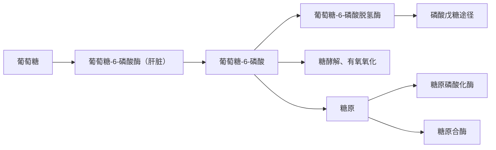
</details>

葡萄糖-6-磷酸的代谢途径

122. ABCD 123. ABCD ①脂肪酸合成的基本原料是乙酰 CoA, 此外还需 ATP、NADPH、 ${\mathrm{{HCO}}}_{3}^{ - }\left( {\mathrm{{CO}}}_{2}\right)$ 、 ${\mathrm{{Mn}}}^{2 + }$ 等。②HMG-CoA 还原酶是胆固醇合成的关键酶, 胆固醇合成产物甲羟戊酸是其别构抑制剂。③脂肪酰 CoA 主要参与甘油三酯的合成。乙酰乙酸属于酮体的主要成分之一。  
124. ABCD 125. ABCD ①股骨骨折后,长期卧床,易导致股静脉血栓形成,脱落后可造成肺动脉血栓栓塞。注意:股骨骨折后2周易发生血栓栓塞。股骨骨折1\~3天易发生脂肪栓塞。②潜水员上浮过快易发生氮气栓塞,称为沉箱病或潜水员病。人体从高气压环境迅速进入常压或低气压环境,原来溶于血液、组织液和脂肪组织的气体(包括氧气、二氧化碳和氮气)迅速游离形成气泡。氧气和二氧化碳可再溶于体液内被吸收,但氮气在体液内溶解缓慢,在血液和组织内形成很多气泡,引起气体栓塞,称为氮气栓塞。本题答案氮气栓塞比空气栓塞更恰当,故答D而不是B。  
126. ABCD 127. ABCD ①急性弥漫性增生性肾小球肾炎也称急性肾炎,为循环免疫复合物沉积所致,免疫荧光检查可见不连续的颗粒状荧光沉积,故答 B。② I 型快速进行性肾小球肾炎为原位免疫复合物沉积所致,免疫荧光检查可见线性荧光沉积,故答 C。③微小病变性肾小球病病理改变轻微,无免疫荧光沉积。急性肾盂肾炎为肾间质的化脓性炎,发病与免疫机制无关,故无免疫荧光沉积。  
128. ABCD 129. ABCD ①结节病是一种原因不明的多系统受累的肉芽肿性疾病,支气管肺泡灌洗液检查主要显示淋巴细胞增加,CD4/CD8 的比值增加。②特发性肺纤维化是一种慢性、进行性、纤维化性间质性肺炎,支气管肺泡灌洗液检查主要显示中性粒细胞和(或)嗜酸性粒细胞增加,淋巴细胞增加不明显,故答 A。③支气管肺泡灌洗液检查显示肺泡巨噬细胞比例增加,见于特发性肺含铁血黄素沉着症。  
130. ABCD 131. ABCD ①亚硝酸盐可使血液中正常携带氧的亚铁血红蛋白氧化成高铁血红蛋白,而高铁血红蛋白失去了携氧能力。亚硝酸盐中毒时,血液高铁血红蛋白含量增加,组织缺氧可出现发绀。②四氯化碳在肝细胞内可转变为有毒的·CCl₃自由基,引起肝细胞滑面内质网损伤。因此,四氯化碳中毒可损害肝脏出现黄疸。③皮肤发红见于一氧化碳中毒。皮肤苍白见于贫血。  
132. ABCD 133. ABCD ①肝的血液供应中 $25\% \sim 30\%$ 来自肝动脉, $70\% \sim 75\%$ 来自门静脉, 故答 D。②肝动脉压力大, 其血液含氧量高, 可供给肝所需氧量的 $40\% \sim 60\%$ , 故答 A。门静脉汇集来自肠道的血液, 主要供给肝的营养。③肝静脉、肝短静脉都是出肝血流, 最后汇入下腔静脉。  
134. ABCD 135. ABCD ① Charcot 三联征是指腹痛、寒战高热、黄疸，常见于急性化脓性胆管炎。② Cullen 征是指脐周青紫色瘀斑，常见于重症急性胰腺炎。③ Murphy 征常见于急性胆囊炎。Rovsing 征、Psoas 征、Obturator 征常见于急性化脓性阑尾炎。  
136. ABCD ①凝血酶对血液凝固过程的正反馈作用包括激活 FV、FⅧ和 FXI。②凝血酶可激活 FXⅢ生成 FXⅢa,该反应属于催化作用,并不属于正反馈,故不答 D。参阅 10 版《生理学》P71 图 3-10。  
137. ABCD 根据心肌细胞动作电位去极化的快慢及产生机制, 心肌细胞可分为快反应细胞和慢反应细胞两类。①快反应细胞包括心房肌细胞、心室肌细胞和浦肯野细胞, 0 期去极化由 $\mathrm{Na}^{+}$ 内流引起, 其去极化速度快。②慢反应细胞包括窦房结 P 细胞和房室结细胞, 0 期去极化由 $\mathrm{Ca}^{2+}$ 内流引起, 其去

极化速度慢,故答 A、C。

138. ABCD ①胃黏膜上皮可合成和释放大量前列腺素(如 $\mathrm{PGE}_2$ 、 $\mathrm{PGI}_2$ )和表皮生长因子(EGF), 它们能抑制胃酸和胃蛋白酶原的分泌, 对胃十二指肠黏膜具有保护作用。②生长抑素由胃肠黏膜δ细胞分泌, 对胃黏膜也具有保护作用。③降钙素基因相关肽(CGRP)由外周血管的神经末梢释放, 也具有胃黏膜保护作用, 但题干要求回答的是“胃和十二指肠黏膜合成和释放的物质”, 故不答 D。参阅 8 年制 3 版《生理学》P579。医学考试中心公布的标准答案为 A、B、C、D。  
139. ABCD A、B、C、D 都是刺激人体产热的物质。甲状腺激素的特点是起效缓慢,但持续时间长。生长激素、肾上腺素和去甲肾上腺素的特点是起效较快,但持续时间较短。参阅北京大学医学出版社 4 版《生理学》P185。  
140. ABCD ①阿托品为乙酰胆碱 M 受体阻断药, 阻断汗腺 M 受体可导致闭汗; 阻断虹膜环形肌 M 受体可导致瞳孔扩大; 阻断窦房结 M 受体可导致心率加快, 故答 A、B、C。② $N_{2}$ 受体阻断药(而不是 M 受体阻断药阿托品)可使骨骼肌松弛, 故不答 D。  
141. ABCD ①雌激素可刺激成骨细胞的活动,促进骨中钙、磷沉积,促进骨的生长。女性绝经后,雌激素水平降低,骨钙容易流失,可导致骨质疏松,故不答 A。②皮质醇可抑制成骨细胞的活动,增加破骨细胞的数量;减少肠道钙的吸收,增加尿钙排泄。因此,皮质醇分泌过多可导致骨质疏松。参阅北京大学医学出版社 4 版《生理学》P335。③甲状腺激素分泌过多,可引起骨基质蛋白质分解, $\mathrm{Ca}^{2+}$ 析出,导致骨质疏松。④甲状旁腺激素分泌过多,将造成骨质过度溶解、骨量减少、骨质疏松。  
142. ABCD ①血红素是血红蛋白的辅基,其合成过程如下图所示。参与血红素合成调节的酶包括 ALA 合酶(δ-氨基-γ-酮戊酸合酶)、ALA 脱水酶、亚铁螯合酶,其中 ALA 合酶是血红素合成的关键酶。②血红素加氧酶主要参与胆色素代谢。谷胱甘肽还原酶主要参与维持谷胱甘肽的还原状态。


<details>
<summary>flowchart</summary>

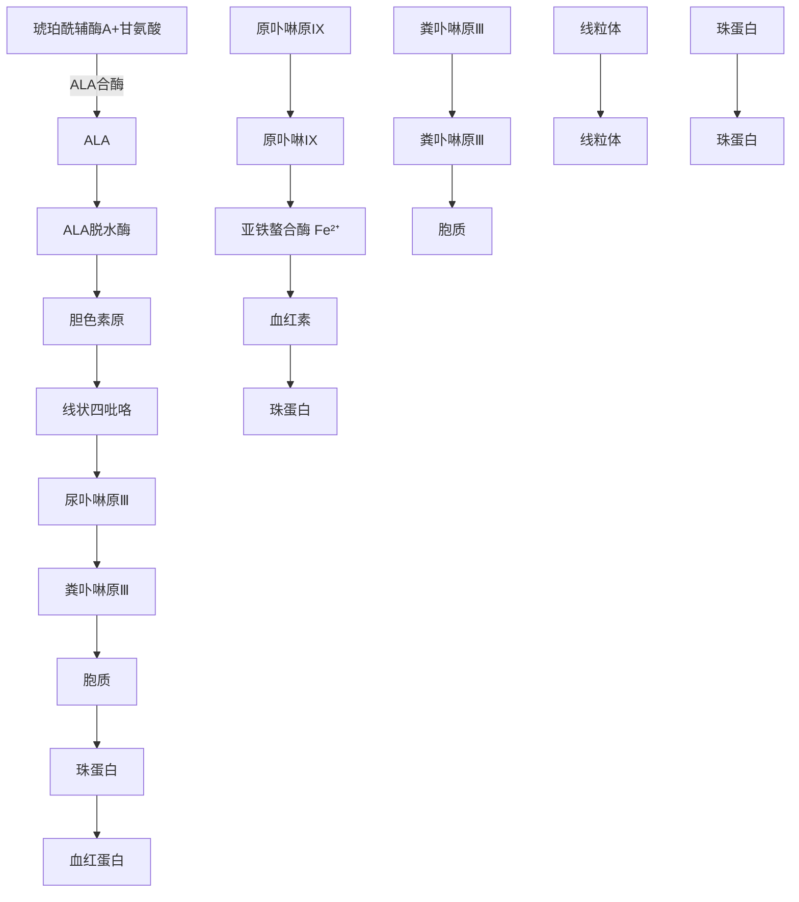
</details>


<details>
<summary>flowchart</summary>

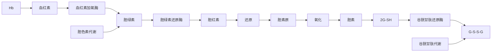
</details>

143. ABCD ①A、B、C都是研究蛋白质-蛋白质相互作用的常用技术。酵母双杂交技术的建立是基于对酵母转录激活因子GAL4的认识。GAL4分子的DNA结合区(BD)和促进转录的活性区(AD)被分开后将丧失对下游基因表达的激活作用,但是如果BD和AD分别融合了具有配对相互作用的两种蛋白质分子后,就可以依靠所融合的蛋白质分子之间的相互作用而恢复对下游基因的表达激活作用。②免疫共沉淀(Co-IP)是以抗原和抗体之间专一性作用为基础的研究技术。其基本原理:当细胞在非变性条件下被裂解时,细胞内存在许多蛋白质-蛋白质间的相互作用被保留下来。向溶液中加入抗体,与抗原形成特异免疫复合物,经过洗脱,收集免疫复合物,然后进行SDS-PAGE及Western blotting分析。Co-IP常用于测定两种目标蛋白质是否在体内存在,或确定一种特定蛋白质的新的作用伙伴。③谷胱甘肽转移酶沉降法(GST-Pull down)是用于测定两种或更多种蛋白质之间相互作用的研究方法,其原理与免疫共沉淀相似,只是使用“诱饵”蛋白质来替代抗体。诱饵蛋白质被标签标记并利用特异性识别该标记的固体支持物捕获,然后将固定化诱饵的支持物与含有推定的“猎物”

蛋白质源,如细胞裂解液一起孵育,通过蛋白质-蛋白质间的相互作用,将“猎物”蛋白质一同拉下,然后通过质谱分析、Western blotting等手段进行检测与验证。谷胱甘肽转移酶(GST)是比较常用的标签。参阅北京大学医学出版社4版《生物化学》P475。④染色质免疫沉淀(ChIP)是研究DNA-蛋白质相互作用的常用技术,故不答D。参阅【2017NO122】

144. ABCD ①启动子是RNA聚合酶识别、结合和启动转录的一段DNA序列,因此启动子结构分析主要是DNA测序。②PCR结合测序技术最简单的方法就是根据启动子序列,设计一对引物,然后以PCR法扩增启动子,测定分析启动子的序列结构。③核酸(DNA)-蛋白质相互作用技术可用于DNA测序,研究启动子。④生物信息学预测启动子。随着真核基因组测序工作的进行,目前已经累积了很多完整真核生物基因组的序列信息,可以利用启动子数据库和启动子预测算法定义启动子。参阅8年制2版《生物化学与分子生物学》P506。⑤标签蛋白质沉淀研究的是蛋白质-蛋白质的相互作用,不能进行DNA测序,故不答C。

145. ABCD ①一个正常的细胞周期为 $\mathrm{G}_0$ 期(静止期) $\rightarrow \mathrm{G}_1$ 期(合成前期) $\rightarrow \mathrm{S}$ 期(DNA合成期) $\rightarrow \mathrm{G}_2$ 期

(合成后期)→M期(细胞分裂期)→G₀期(静止期)。②RB是抑癌基因RB的表达产物,RB的表达和RB的磷酸化程度密切相关。RB有高磷酸化(无活性)和低磷酸化(有活性)两种形式。低磷酸化的RB可与转录因子E2F-1结合,使E2F-1的转录激活功能丧失,导致E2F-1依赖性相关基因不能表达,进而阻止细胞从G₁期进入S期。高磷酸化的RB不能与E2F-1结合,将导致E2F-1依赖性相关基因开放,促进细胞通过G₁-S关卡。③p53是抑癌基因TP53的表达产物,p53可与p21基因的转录调控序列结合,促进p21基因表达。p21是细胞


<details>
<summary>flowchart</summary>

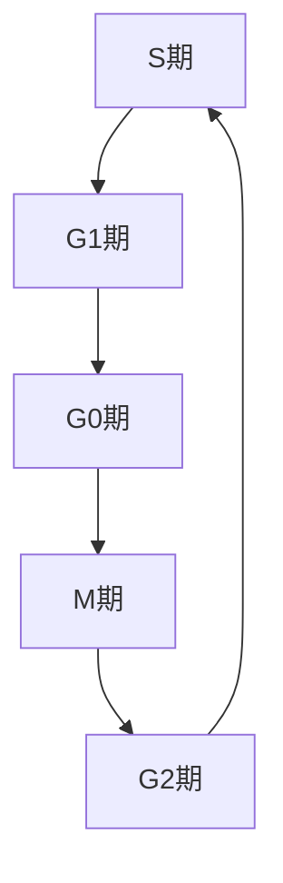
</details>

周期蛋白依赖性蛋白激酶(CDK)的抑制剂,通过与CDK结合而抑制细胞周期从 $G_{1}$ 期向S期演进,导致细胞周期停滞于 $G_{1}$ 期。④p16是抑癌基因P16的表达产物,为CDK4的抑制物,可对细胞周期检查点进行负性调节。⑤表皮生长因子(EGF)与生长因子受体结合后,可促进靶细胞的生长发育,对细胞周期并没有抑制作用,故不答D。

146. ABCD 结合反应属于肝生物转化的第二相反应,常见的结合基团有葡萄糖醛酸基(葡萄糖醛酸基)、硫酸根、乙酰基、甲基、谷胱甘肽、甘氨酰基等。  
147. ABCD ①卵磷脂(磷脂酰胆碱)、脑磷脂(磷脂酰乙醇胺)是通过甘油二酯途径合成的。胆碱和乙醇胺被活化成 CDP-胆碱和 CDP-乙醇胺后,分别与甘油二酯缩合,生成磷脂酰胆碱和磷脂酰乙醇胺。②肌醇磷脂和心磷脂(二磷脂酰甘油)是通过 CDP-甘油二酯途径合成的,故不答 C、D。


<details>
<summary>flowchart</summary>

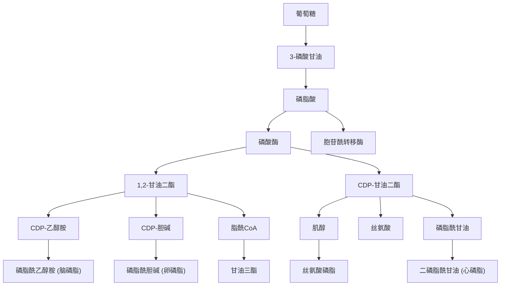
</details>

148. ABCD RAS、MYC 属于原癌基因, PTEN、RB 属于抑癌基因。  
149. ABCD ①炎性渗出液的作用有:稀释和中和毒素,减轻毒素对局部组织的损伤作用;渗出液中的白细胞吞噬和杀灭病原微生物,清除坏死组织;渗出液中的纤维素交织成网,不仅可限制病原微生物的

扩散,还有利于白细胞吞噬消灭病原体;渗出液中所含的抗体和补体有利于消灭病原体。②渗出液中的纤维素吸收不良可发生机化,例如引起肺肉质变、浆膜粘连甚至浆膜腔闭锁,故不答D。

150. ABCD ①以肉芽肿为基本病变的疾病属于肉芽肿性炎。结核病、伤寒均属于肉芽肿性炎，结核病的肉芽肿为结核结节，伤寒的肉芽肿为伤寒小结，故答 A、B。②阿米巴病属于变质性炎，细菌性痢疾属于假膜性炎，故不答 C、D。

151. ABCD ①完全性葡萄胎均为男性遗传起源。②80%以上完全性葡萄胎的染色体核型为46XX,可能在受精时,父方的单倍体精子23X在丢失了所有的母方染色体的空卵中自我复制而成纯合子46XX,两组染色体均来自父方,缺乏母方功能性DNA。其余完全性葡萄胎的染色体核型为46XY,即空卵在受精时和两个精子结合(23X和23Y)。③完全性葡萄胎缺乏卵细胞的染色体,故胚胎不能发育,不可能有胎儿存在。④镜下可见绒毛高度水肿,绒毛间质内血管消失,故不答D。


<details>
<summary>flowchart</summary>

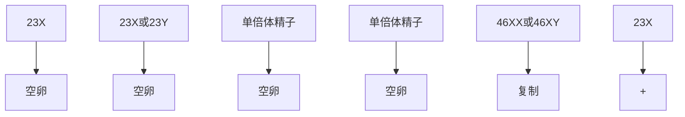
</details>

完全性葡萄胎发病机制示意图


<details>
<summary>text_image</summary>

23X
23X或23Y
单倍体精子
+
23X
卵子
→
69XXY或69XXX
46XY
二倍体精子
</details>

不完全性葡萄胎发病机制示意图

152. ABCD 弥漫性毒性甲状腺肿光镜下: ①滤泡上皮增生呈高柱状; ②滤泡腔内胶质稀薄, 滤泡周边的胶质中出现许多吸收空泡; ③间质血管丰富, 有大量淋巴细胞浸润, 故答 A、B、C。“细胞核呈毛玻璃样改变”为甲状腺乳头状癌的病理特点。

153. ABCD 甲型肝炎病毒(HAV)、丙型肝炎病毒(HCV)和戊型肝炎病毒(HEV)均属于RNA病毒。乙型肝炎病毒(HBV)属于DNA病毒。

154. ABCD ①A、B、C均属于急性呼吸窘迫综合征的常见危险因素。参阅10版《内科学》P143表2-15-1。②大量补液是心力衰竭的常见危险因素。请注意：10版《病理学》P186认为大量输液是急性呼吸窘迫综合征的常见病因。

155. ABCD ①高血压急症是指高血压患者在某些诱因作用下,血压突然明显升高,伴有进行性心、脑、肾等重要靶器官功能不全的表现。高血压亚急症是指虽然血压明显升高,但不伴进行性靶器官损害,如无眼底改变,也无心、脑、肾等脏器功能受损的症状。因此,有无靶器官损害是高血压急症与亚急症的鉴别要点,故答 B、C。②血压是否大于 $180 / 120 \mathrm{~mmHg}$ 、是否伴有明显发病诱因,都不是两者的鉴别要点,故不答 A、D。因为血压水平的高低与急性靶器官损害的程度并不成正比。

156. ABCD ①血 C 反应蛋白属于急性时相蛋白,在急性化脓性感染时常常升高,而不是降低,故不答 A。②重症急性胰腺炎时,大量胰岛 β 细胞受损,胰岛素分泌减少,空腹血糖常常升高,而不是降低,故不答 B。③急性胰腺炎时,胰腺腺泡细胞受损,细胞膜通透性增高,细胞内淀粉酶可经细胞膜释放入血,导致血清淀粉酶升高。轻症急性胰腺炎时,血清淀粉酶常常升高。重症急性胰腺炎时,若胰腺腺泡细胞完全毁损,没有淀粉酶释放入血,可造成血清淀粉酶正常,甚至降低。可见,血清淀粉酶正常或降低,提示重症急性胰腺炎。④重症急性胰腺炎时,脂肪酶被激活,可分解中性脂肪为脂肪酸,血清中的钙离子可与脂肪酸结合形成脂肪酸钙(皂化斑),导致血钙降低。当血钙<2.0mmol/L 时,常提示重症急性胰腺炎。

157. ABCD ①微小病变型肾病、膜性肾病是原发性肾病综合征的常见病因。狼疮肾炎是继发性肾病综合征的常见病因。②链球菌感染后急性肾小球肾炎常引起急性肾炎综合征，而不是肾病综合征。

158. ABCD ①血管性血友病因子(vWF)是由血管内皮细胞合成和分泌的,主要参与血小板的黏附和聚集反应,以促进凝血。②凝血酶调节蛋白(TM)表达于血管内皮细胞表面,可与循环血液中的凝血酶形成TM-凝血酶复合物,后者可以激活蛋白C,参与血管内皮细胞的抗凝过程。因此,vWF测定、TM测定均可用于诊断血管异常所致的出血性疾病。③血浆纤维蛋白(原)降解产物(FDP)测定、血浆组织型纤溶酶原激活物(t-PA)测定主要用于诊断纤溶异常所致的出血性疾病,故不答B、C。  
159. ABCD ①根据题干,本例应诊断为Graves病复发,哺乳期甲亢,可以使用药物治疗,甲巯咪唑(MMI)和丙硫氧嘧啶(PTU)均可选择。②妊娠期甲亢和哺乳期甲亢严禁放射碘治疗。③甲亢的治疗不宜急诊手术,须行充分术前准备,达标后才能择期手术治疗。④复方碘剂治疗仅适用于术前准备和甲状腺危象,故本例不宜使用。  
160. ABCD ①胃癌合并幽门梗阻、穿孔、出血等并发症,无法根治时,可行胃部分切除术,以缓解症状。②根据胃癌部位不同,可行胃远端/近端大部切除或全胃切除术。③胃体癌或胃近端癌,可行胃癌根治术或扩大根治术。④对于胃癌肝转移或胰尾转移,若转移灶可以切除,则可行胃癌根治术及联合脏器切除。  
161. ABCD ①肝硬化门静脉高压症,可造成门静脉系统内血流淤滞,导致肠系膜上静脉血栓形成。②腹腔感染可造成血管内皮细胞损伤,导致肠系膜上静脉血栓形成。③真性红细胞增多症可造成全身循环系统血流缓慢,黏度增高,容易导致肠系膜上静脉血栓形成。④脾切除术后常出现血小板增多,血液呈高凝状态,容易导致肠系膜上静脉血栓形成。  
162. ABCD 肝功能 Child-Pugh 分级的评估指标包括血清胆红素、血清白蛋白、凝血酶原(延长)时间、腹腔积液、肝性脑病,不包括血清转氨酶。  
163. ABCD ①肝脏损伤可导致创伤性胆道出血。②胆囊炎可引起胆囊黏膜糜烂,导致胆道少量出血,参阅10版《外科学》P478。③胆管结石可引起胆道感染,导致感染性胆道出血。④肝脏肿瘤可导致肿瘤性胆道出血。正确答案应为A、B、C、D,但医学考试中心公布的标准答案为A、C、D。  
164. ABCD 脊髓型颈椎病可出现上肢或下肢麻木无力、僵硬、双足踩棉花感。后期可出现二便功能障碍。检查时可有感觉平面障碍，肌力障碍，四肢腱反射活跃或亢进，浅反射减弱或消失。  
165. ABCD ①脊柱结核起病缓慢,常有低热、盗汗、消瘦、食欲缺乏等全身症状。②腰椎结核好发于成人,多为边缘型椎体结核,病变常局限于椎体的上、下缘,而不是附件。临床上脊柱附件结核少见,故不答 B。③疼痛是脊柱结核最先出现的症状,初期疼痛多较轻,痛点也不局限,随着病变进展,痛点多固定于脊柱病变平面的棘突或棘突旁。④脊柱结核晚期可有寒性脓肿,为少数患者就诊的原因。

# 2023年全国硕士研究生招生考试临床医学综合能力(西医)试题答案及详细解答

# (答案为绿色的选项)

1. ABCD ①前馈控制是指在控制部分向受控部分发出活动指令的同时或稍前,又通过另一快捷的通路向受控部分发出指令,这一提前到达的指令使受控部分的活动更具有预见性和适应性。例如,百米赛跑起跑枪声未响时(题干表述不准确),运动员已出现心率加快,心输出量增加,肺通气量增加,肾上腺素分泌增加等一系列应急反应,以提前适应赛跑时机体血供和耗氧量增加的需要,这就是典型的前馈控制。②A、C属于负反馈调节,B属于神经反射。  
2. ABCD ①甘油为脂溶性小分子物质,常以单纯扩散的方式进行跨细胞膜物质转运。②葡萄糖、氨基酸跨膜转运方式为继发性主动转运或经载体易化扩散。内分泌细胞分泌肽类激素属于出胞。  
3. ABCD 横纹肌的缩短和伸长是粗肌丝与细肌丝在肌节内相互滑行所致。粗肌丝由肌球蛋白组成, 肌球蛋白上的横桥能与细肌丝的肌动蛋白结合。细肌丝由肌动蛋白、原肌球蛋白和肌钙蛋白组成。当肌细胞上的动作电位引起胞质中 $\mathrm{Ca}^{2+}$ 浓度升高时, $\mathrm{Ca}^{2+}$ 与细肌丝上的肌钙蛋白结合, 使原肌球蛋白分子发生改变, 将细肌丝上的结合位点肌动蛋白暴露出来, 引发横桥与肌动蛋白结合, 使肌丝滑动、肌肉收缩。参阅【2012NO3】、【2015NO122】。  
4. ABCD ①医学上通常将红细胞膜上含有 D 抗原者称为 Rh 阳性,而红细胞膜上缺乏 D 抗原者称为 Rh 阴性。②红细胞膜上只含有 A 抗原者为 A 型血。红细胞膜上只含有 B 抗原者为 B 型血。O 型红细胞虽然不含 A、B 抗原,但含有 H 抗原。  
5. ABCD ①心室收缩期可分为等容收缩期、快速射血期和减慢射血期。从房室瓣关闭到主动脉瓣开启前的这段时间,心室收缩时心室容积不变,称为等容收缩期。②第一心音是由于房室瓣突然关闭引起心室内血液和室壁振动而产生的,标志着心室收缩的开始,故答 A。  
6. ABCD ①心室肌细胞静息电位主要是由 $\mathrm{K}^{+}$ 经内向整流钾通道 $(\mathrm{I}_{\mathrm{K1}}$ 通道)外流引起的 $\mathrm{K}^{+}$ 平衡电位构成, 其次, 钠背景电流 (少量 $\mathrm{Na}^{+}$ 内流) 也参与静息电位的形成。心室肌细胞动作电位平台期的形成是内向电流和外向电流共同作用的结果。内向电流主要由 L 型钙电流 $(\mathrm{I}_{\mathrm{Ca-L}})$ 形成, 外向电流主要由内向整流钾电流 $(\mathrm{I}_{\mathrm{K1}})$ 、延迟整流钾电流 $(\mathrm{I}_{\mathrm{K}})$ 形成。可见, 在心室肌细胞静息电位和动作电位平台期均发挥作用的离子流是 $\mathrm{I}_{\mathrm{K1}}$ 。② $\mathrm{I}_{\mathrm{Ca-T}}$ 主要参与窦房结 4 期自动去极化过程。  
7. ABCD ①肺泡上皮分为Ⅰ型和Ⅱ型肺泡上皮。Ⅱ型肺泡上皮细胞可合成和分泌肺表面活性物质,降低肺泡表面张力。Ⅰ型肺泡上皮细胞覆盖肺泡约95%的表面积,是进行气体交换的部位。②肺间质存在丰富的巨噬细胞和肥大细胞,前者主要参与异物吞噬,后者主要参与免疫调节。  
8. ABCD ①胃和十二指肠黏膜中含有高浓度的前列腺素(如 $\mathrm{PGE}_2$ 和 $\mathrm{PGI}_2$ ), 它们能抑制胃酸和胃蛋白酶原的分泌, 刺激黏液和碳酸氢盐的分泌, 增加胃黏膜的血流量, 有助于胃黏膜的修复和维持其完整性。② $\mathrm{HCO}_3^-$ 由胃黏膜内的非泌酸细胞分泌, 主要参与黏液-碳酸氢盐屏障的组成。缩胆囊素由小肠上部的 I 细胞分泌, 主要参与胰液、胆汁分泌的调节。组胺由肠嗜铬样细胞分泌, 主要刺激胃酸的分泌。  
9. ABCD 不感蒸发是指体内的水分从皮肤和黏膜表面不断渗出而被汽化的过程。一般情况下,人体24小时的不感蒸发量约为1000ml,其中从皮肤表面蒸发600\~800ml,通过呼吸道黏膜蒸发200\~400ml。  
10. ABCD ①尿液的浓缩和稀释主要发生在集合管,取决于集合管对小管液中水和溶质重吸收的比率,而水的重吸收较易改变,因而是其主要影响因素。水的重吸收主要与肾髓质高渗、集合管对水的通透性有关,后者主要受血液中血管升压素浓度的影响。因此,在尿液的浓缩和稀释、实现机体水平衡的

调节中起关键作用的活性物质是血管升压素。当血管升压素浓度升高时,集合管对水的通透性增加,水重吸收增多,故尿液被浓缩。反之,当血管升压素浓度降低时,集合管对水的通透性降低,水重吸收减少,尿液被稀释。②肾素、血管紧张素、醛固酮主要参与循环血量的调节。参阅【2017NO11】。

11. ABCD ①集合管的闰细胞可分泌 $\mathrm{H}^{+}$ , 这是一个逆电化学梯度进行的主动转运过程。闰细胞的管腔膜上有 $\mathrm{H}^{+}$ 泵, 可将细胞内的 $\mathrm{H}^{+}$ 泵入小管腔内, 即细胞内代谢产生的 $\mathrm{CO}_{2}$ 和 $\mathrm{H}_{2} \mathrm{O}$ 在碳酸酐酶催化下生成 $\mathrm{H}_{2} \mathrm{CO}_{3}$ , 并离解为 $\mathrm{H}^{+}$ 和 $\mathrm{HCO}_{3}^{-}$ 后, $\mathrm{H}^{+}$ 由 $\mathrm{H}^{+}$ 泵转运至小管液, $\mathrm{HCO}_{3}^{-}$ 则通过基底侧膜回到血液中, 从而调节酸碱平衡。②环加氧酶主要作用是催化花生四烯酸生成前列腺素 $\mathrm{G}_{2}$ 和 $\mathrm{H}_{2}$ 。磷酸二酯酶主要是催化 cAMP、cGMP 的降解。钠-钾 ATP 酶主要参与维持细胞膜两侧 $\mathrm{Na}^{+}$ 和 $\mathrm{K}^{+}$ 的浓度差。  
12. ABCD ①骨骼肌神经-肌接头由接头前膜、接头间隙和接头后膜(终板膜)构成。当冲动由运动神经纤维传到轴突末梢时, 可触发接头前膜 $\mathrm{Ca}^{2+}$ 依赖性突触囊泡出胞, 释放乙酰胆碱 (ACh) 至接头间隙,再由 ACh 激活终板膜上 $\mathrm{N}_{2}$ 型 ACh 受体通道, 导致 $\mathrm{Na}^{+}$ 内流, 形成终板电位, 引起肌膜的去极化。当去极化达到阈电位水平时即可爆发肌细胞动作电位。筒箭毒碱可阻断神经-肌接头终板膜上的 $\mathrm{N}_{2}$ 型 ACh 受体通道, 影响骨骼肌神经-肌接头的信息传递。因此, 临床上筒箭毒碱可作为肌松剂使用。②筒箭毒碱不能阻断神经递质 (ACh) 的释放和清除, 故不答 A、B、C。  
13. ABCD ①支配全身小汗腺的神经纤维、引起骨骼肌血管舒张的神经纤维均属于交感胆碱能纤维。引起大量稀薄唾液分泌的神经纤维属于副交感胆碱能纤维。②寒冷时使皮肤血管收缩的神经纤维属于交感肾上腺素能纤维。  
14. ABCD ①两眼注视一个由远移近的物体时,双眼球向鼻侧会聚的现象称为视轴会聚。视近物时,睫状肌收缩,悬韧带松弛,晶状体变凸。瞳孔调节反射是指看近物时,可反射性地引起双侧瞳孔缩小。可见,A、B、C均与眼视近物时的调节活动有关。②瞳孔对光反射是指瞳孔在强光照射时缩小,而光线变弱时散大的反射,与眼视近物时的调节活动无关,故答D。参阅【2018NO12】。  
15. ABCD ①甲状腺激素具有升高血糖的作用,因此甲状腺功能亢进症(甲亢)患者常表现为进食后血糖升高。②甲状腺激素可使心率增快、心肌收缩力增强、心输出量增加。甲亢患者会出现心动过速、心律失常甚至心力衰竭。③在生理情况下,甲状腺激素可促进蛋白质合成。当甲状腺激素分泌过多时,则促进蛋白质分解。甲亢患者骨基质蛋白分解, $\mathrm{Ca}^{2+}$ 析出,可导致血钙升高、骨质疏松。④甲状腺激素可增加神经细胞膜上 $\beta$ 肾上腺素能受体的数量和亲和力,提高神经细胞对儿茶酚胺的敏感性。甲亢患者常有精神亢奋的表现,如易激动、烦躁不安、喜怒无常等。  
16. ABCD ①抑制素是睾丸支持细胞分泌的一种糖蛋白激素,主要作用是抑制腺垂体 FSH 的合成和分泌,但对 LH 的分泌基本无影响。参阅北京大学医学出版社 4 版《医学生理学》P347。②睾酮可抑制 GnRH、LH 的分泌。  
17. ABCD ①分子量较大的蛋白质可折叠成多个结构较为紧密且稳定的区域,并各行其功能,此为结构域。结构域属于蛋白质的三级结构。②α-螺旋、β-折叠属于蛋白质的二级结构。参阅【2010NO25】。  
18. ABCD ①酶蛋白通过改变分子构象来改变酶活性,称为别构调节,故不答 A。②酶蛋白可通过酶促共价修饰来调节酶活性,故不答 B。③无活性的酶原在一定条件下转变为有催化活性酶的过程,称为酶原激活,故不答 C。④酶蛋白合成属于酶的迟缓调节,而不是快速调节,故答 D。酶的快速调节包括别构调节和化学修饰调节。参阅【2013NO33】。  
19. ABCD ①NAD $^{+}$ 和 NADP $^{+}$ 所含的维生素是维生素 PP(烟酰胺)。②焦磷酸硫胺素(TPP)所含的维生素是维生素 B $_{1}$ 。FMN 和 FAD 所含的维生素是维生素 B $_{2}$ 。合成凝血因子Ⅱ、Ⅶ、Ⅸ、X 的辅酶是维生素 K。  
20. ABCD ①磷酸烯醇式丙酮酸经丙酮酸激酶催化, 将高能磷酸键转移至 ADP, 生成烯醇式丙酮酸和 ATP。烯醇式丙酮酸迅速非酶促转变成为酮式丙酮酸, 故答 C。②在醛缩酶的催化下, 1 分子果糖-1,6-二磷酸可裂解为 1 分子磷酸二羟丙酮和 1 分子甘油醛-3-磷酸。在磷酸甘油酸激酶催化下, 甘

油酸-1,3-二磷酸可转变生成甘油酸-3-磷酸。在丙酮酸脱氢酶催化下，丙酮酸可转变为乙酰CoA。

$$
\mathrm{磷酸烯醇式丙酮酸} + \mathrm{ADP} \xrightarrow [ \mathrm {K^ {+} ,Mg^ {2 + }} ]{\text {丙酮酸激酶}} \mathrm{丙酮酸} + \mathrm{ATP}
$$

21. ABCD 脂肪酸 $\beta$ -氧化途径的限速酶是肉碱脂酰转移酶 I。脂酰 CoA 合成酶主要参与甘油三酯的合成。脂酰 CoA 脱氢酶、 $\beta$ -酮脂酰 CoA 硫解酶参与脂肪酸 $\beta$ -氧化过程, 但不是关键酶。参阅【2016NO31】、【2013NO127】。  
22. ABCD ①根据氧化磷酸化的化学渗透假说,呼吸链每传递1对电子,复合体Ⅰ、Ⅲ、Ⅳ分别由线粒体内膜基质侧向胞质侧泵出4、4、2个质子。当质子顺浓度梯度回流至基质时,可驱动ADP与 $H_{3}PO_{4}$ 生成ATP。由于每生成1个ATP需要4个质子通过ATP合酶返回线粒体基质,所以在复合体Ⅰ、Ⅲ、Ⅳ处通过氧化磷酸化可分别生成1、1、0.5个ATP。可见,复合体Ⅰ、Ⅲ、Ⅳ均存在氧化磷酸化偶联部位。②复合体Ⅱ也称琥珀酸脱氢酶,可催化琥珀酸的脱氢反应,使FAD转变为 $FADH_{2}$ ,后者再将电子经Fe-S传递到Q。此过程释放的自由能较小,不足以将质子泵出线粒体内膜,因此复合体Ⅱ没有质子泵功能,也就不可能进行氧化磷酸化。  
23. ABCD 尿素合成是通过尿素循环(鸟氨酸循环)进行的,其大致过程为:在氨基甲酰磷酸合成酶I的作用下,鸟氨酸与氨基甲酰磷酸反应生成瓜氨酸;在精氨酸代琥珀酸合成酶的催化下,瓜氨酸与天冬氨酸反应生成精氨酸代琥珀酸;在精氨酸代琥珀酸裂解酶的催化下,精氨酸代琥珀酸裂解为精氨酸和延胡索酸;精氨酸在精氨酸酶催化下水解生成尿素和鸟氨酸;鸟氨酸再参与下一次尿素循环。尿素合成的关键酶是氨基甲酰磷酸合成酶I和精氨酸代琥珀酸合成酶,故答B。


<details>
<summary>flowchart</summary>

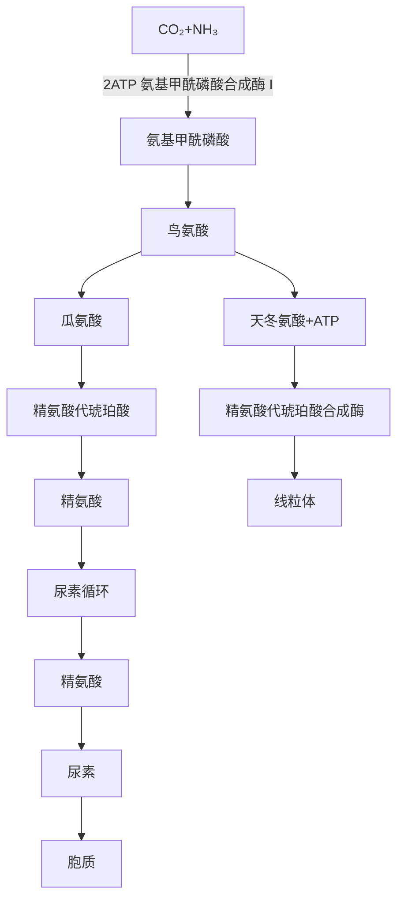
</details>


<details>
<summary>chemical</summary>

嘌呤碱合成的元素来源，展示天冬氨酸、甲酰基（一碳单位）与甘氨酸、甲酰基（一碳单位）之间的碳原子转移及生成路径
</details>

24. ABCD 谷氨酰胺、天冬氨酸、一碳单位都是嘌呤碱合成的元素来源。丝氨酸不参与嘌呤核苷酸的合成。参阅【2006NO133】、【2010NO33】。  
25. ABCD DNA 损伤的修复方式有 4 种: 直接修复、切除修复、重组修复和 SOS 修复。直接修复是指修复酶直接作用于受损的 DNA, 将之恢复为原来的结构。切除修复包括碱基错配修复、碱基切除修复、核苷酸切除修复, 可将不正常的碱基或核苷酸除去并替换掉。重组修复是指利用重组酶系, 将一段未受损伤的 DNA 转移到损伤部位, 提供正确的模板, 对断裂的 DNA 双链进行修复的过程, 故答 C。  
26. ABCD ①遗传密码的连续性是指编码蛋白质氨基酸序列的 mRNA 的密码子之间没有间隔核苷酸,从起始密码子开始,连续阅读,直至终止密码子出现。由于密码子的连续性,若开放阅读框中发生缺失或插入突变,将会引起 mRNA 阅读框发生移动,使后续的氨基酸序列大部分被改变,其编码的蛋白质彻底丧失功能,称为移码突变。②通用性是指从细菌到人类都使用同一套遗传密码。方向性是指组成密码子的核苷酸在 mRNA 中的排列具有方向性。摆动性是指密码子与反密码子之间不严格遵守 Watson-Crick 碱基配对原则的现象。参阅【2016NO38】。

27. ABCD 转录因子是 DNA 结合蛋白, 至少包括两个不同的结构域, 即 DNA 结合结构域和转录激活结构域。锌指结构、螺旋-环-螺旋、亮氨酸拉链均属于 DNA 结合结构域。富含谷氨酰胺结构域属于转录激活结构域。参阅【2020NO145】。  
28. ABCD ①凝胶迁移变动分析也称电泳迁移率变动分析,是研究 DNA 与蛋白质相互作用的经典方法,其原理为:DNA 结合蛋白与特定 DNA 探针片段的结合会增大其分子量,在凝胶中的电泳速度慢于游离探针,即表现为条带相对滞后。在实验中预先用放射性核素标记待检测的 DNA 探针,再将标记好的探针与细胞核提取物温育一定时间,使其形成 DNA-蛋白质复合物,然后将温育后的反应液进行非变性聚丙烯酰胺凝胶电泳,最后用放射自显影等技术显示出标记 DNA 探针的条带位置。②标签蛋白沉淀、酵母双杂交技术均属于蛋白质-蛋白质相互作用的研究技术。蛋白质印迹技术主要用于蛋白质检测。参阅【2017NO123】。  
29. ABCD ①含铁血黄素是巨噬细胞吞噬、降解红细胞血红蛋白所产生的铁蛋白微粒聚集体, 系 $\mathrm{Fe}^{3+}$ 与蛋白质结合而成, 故答 D。②脂褐素是细胞自噬溶酶体内未被消化的细胞器碎片残体。黑色素是黑色素细胞质中的黑褐色细颗粒, 由酪氨酸氧化经左旋多巴聚合而产生。胆红素是胆管中的主要色素, 为血液中红细胞衰老破坏后的产物。  
30. ABCD ①机化是指新生肉芽组织长入并取代坏死组织、血栓、脓液、异物等的过程,如肺脓肿的机化等。②脑梗死灶常发生溶解吸收而不是机化。参阅3版《病理学》P36。Barrett食管是指正常食管的鳞状上皮被腺上皮所取代,易演变为食管腺癌。“宫颈管鳞状上皮化生”易发生癌变。  
31. ABCD ①左心房内的血栓,由于心房的收缩和舒张,常呈球形,多为混合血栓。②红色血栓多见于静脉血栓的尾部,白色血栓多见于静脉血栓的头部,透明血栓多见于微循环的毛细血管内。  
32. ABCD ①肺癌常转移至右锁骨上淋巴结,胃癌、食管癌常经胸导管转移至左锁骨上淋巴结,故答 D。参阅 10 版《诊断学》P102。②肝癌常转移至肝门淋巴结。  
33. ABCD ①微小病变性肾小球病光镜下肾小球基本正常,可见近曲小管上皮细胞内出现大量脂滴和蛋白小滴。②A为局灶性节段性肾小球硬化的病理特点。B为系膜增生性肾小球肾炎的病理特点。C为快速进行性肾小球肾炎的病理特点。参阅【2007NO46】。  
34. ABCD ①肝功能不全患者由于肝脏合成凝血因子减少,可有出血倾向;由于胆色素代谢障碍,患者可出现肝细胞性黄疸;肝脏对雌激素灭活作用减弱,可导致体内雌激素水平增高,出现蜘蛛痣。②脾大是门脉高压症所致,与肝功能不全无关,故答 C。参阅【2021NO152】。  
35. ABCD A、B、C 均属于恶性肿瘤，D 属于良性肿瘤。考过多次。参阅【2022NO33】、【2019NO32】。  
36. ABCD ①慢性萎缩性胃炎的病理特点是病变区胃黏膜变薄,固有层腺体变小,数目减少,多伴肠上皮化生和假幽门腺化生。假幽门腺化生是指胃体、胃底部腺体的壁细胞和主细胞减少,被类似幽门腺的黏液细胞所取代的现象。②慢性浅表性胃炎镜下表现是胃黏膜充血、水肿,黏膜浅层炎症细胞浸润。慢性肥厚性胃炎镜下表现是胃黏膜腺体肥大增生,腺管延长,固有层炎症细胞浸润不明显。疣状胃炎镜下表现为病灶中心凹陷部胃黏膜上皮变性坏死并脱落。A、C、D均不会出现假幽门腺化生。参阅【2008NO135】。  
37. ABCD ①甲状腺髓样癌是由滤泡旁细胞发生的恶性肿瘤,可分泌降钙素,导致低钙血症。②A、B、D 均属于甲状腺癌的常见病理类型,但不会出现低钙血症。  
38. ABCD ①骨结核的典型病变是干酪样坏死和死骨形成,常累及周围软组织,坏死物液化后在骨旁形成结核性“脓肿”,由于局部并无红、热、痛,故称为“冷脓肿”。②骨肉瘤、骨髓瘤、骨髓炎均不会出现“冷脓肿”。  
39. ABCD 子宫颈息肉本质上属于慢性子宫颈炎,为子宫颈黏膜上皮、腺体和间质结缔组织局限性增生所致,故答 D。超纲题,大纲不要求掌握慢性子宫颈炎。  
40. ABCD 卵巢交界性浆液性囊腺瘤是起源于输卵管或卵巢皮质的上皮性肿瘤,生物学行为介于良性

与恶性之间,具有低度恶性潜能,故答 C。

41. ABCD 临床上先发热后昏迷者见于流行性乙型脑炎、流行性脑脊髓膜炎、中毒性菌痢、中暑、斑疹伤寒等；先昏迷后发热者见于脑出血、巴比妥药物中毒、有机磷农药中毒等。

42. ABCD ①支气管哮喘重度急性发作常表现为休息时气短,端坐呼吸,只能发单字表达,呼吸频率>30次/分,常有三凹征,闻及响亮、弥漫的哮鸣音,心率>120次/分,奇脉,使用支气管舒张剂后PEF占预计值比例<60%,故答A。②“日间哮喘症状>2次/周”为支气管哮喘控制水平分级的依据。C为哮喘轻度急性发作的表现,D为哮喘中度急性发作的表现。

43. ABCD ①中年女性,低热、间断咯血2个月,CT示双上肺多发结节,内有空洞,应考虑肺结核,最有助于确诊的检查是痰涂片抗酸染色阳性。②PPD试验阳性、γ-干扰素释放试验阳性对确诊成人肺结核价值不大。确诊肺结核很少进行肺穿刺活检,故答C而不是B。

44. ABCD ①肺炎支原体肺炎的治疗首选大环内酯类抗生素。对大环内酯类抗生素不敏感者可选用呼吸氟喹诺酮类抗生素，如左氧氟沙星、莫西沙星等。四环素类抗生素也可用于肺炎支原体肺炎的治疗。②肺炎支原体无细胞壁，故 $\beta$ -内酰胺类抗生素无效。

45. ABCD ①老年男性,心动过缓25年,心房颤动(房颤)3个月,治疗方案必须同时解决心动过缓和房颤。心动过缓可给予起搏器治疗,房颤可给予射频消融治疗,故答D。②服用胺碘酮只能治疗房颤,而不能治疗心动过缓,故不答A。DDD型起搏器严禁用于持续性房颤者,故不答B。患者心动过缓,出现心排血量不足症状,可应用阿托品或异丙肾上腺素治疗,不宜使用β受体拮抗剂,故不答C。

46. ABCD ①急性下壁、右室心肌梗死、收缩压低于 $90 \mathrm{~mmHg}$ 者, 不宜使用硝酸甘油, 因其可扩张外周静脉, 减少回心血量, 降低心肌前负荷, 减少心排血量, 引起严重低血压, 故不答 A。②患者双肺未闻及湿啰音, 说明无左心衰竭。急性右心室梗死多伴右心衰竭、低血压, 若无左心衰竭表现, 则宜补充血容量, 以增加心排血量和动脉压。如输液 $1 \sim 2 \mathrm{~L}$ 后低血压仍未纠正, 可使用正性肌力药物, 如多巴胺、多巴酚丁胺等, 故答 B 而不是 C。③患者心率 54 次/分, 心律整齐, 无须置入临时起搏器。参阅【2014NO169】。

47. ABCD ①急性心肌炎常有血清心肌损伤标志物(如肌钙蛋白、心肌肌酸激酶同工酶)升高,扩张型心肌病多无血清心肌损伤标志物升高,故答B。②急性心肌炎与扩张型心肌病行胸部X线片检查均可发现心影增大,行超声心动图检查均可发现心室增大、室壁运动减弱,因此A、D不能作为两者的鉴别检查。急性心肌炎与扩张型心肌病若发生心力衰竭,均可有血清脑钠肽(BNP)增高,故不答C。

48. ABCD 24 小时动态血压监测(ABPM)诊断高血压的标准:24 小时 ABPM 平均血压≥130/80mmHg,白天≥135/85mmHg,夜间≥120/70mmHg。

49. ABCD ①反酸、烧心是胃食管反流病的典型临床表现。根据题干,本例应考虑胃食管反流病,首选治疗药物是奥美拉唑,其抑酸作用强,疗效确切。②硫糖铝属于胃黏膜保护剂,可用于消化性溃疡的治疗。法莫替丁为组胺 $\mathrm{H}_{2}$ 受体拮抗剂,多潘立酮为促胃肠动力药,均可用于胃食管反流病的治疗,但不是首选药物。

50. ABCD ①血清清蛋白与腹腔积液清蛋白之差称为清蛋白梯度。腹水的清蛋白梯度(SAAG)>11g/L,见于肝硬化门静脉高压症;SAAG<11g/L,见于腹膜转移癌、结核性腹膜炎等,故答D。②腹水腺苷脱氨酶(ADA)测定常用于诊断结核性腹腔积液。腹水乳酸脱氢酶(LDH)测定、白细胞计数常用于鉴别渗出性和漏出性腹腔积液。

51. ABCD ①10版《内科学》P443:急性胰腺炎患者血清淀粉酶于起病后2\~12小时开始升高,持续3\~5天。患者饱餐后上腹痛,向腰背部放射,呕吐后腹痛不缓解,应考虑急性胰腺炎。呕吐后腹痛不缓解为急性胰腺炎的临床特点。患者起病4小时,为明确诊断,最有价值的检查是血清淀粉酶测定。②血常规、心电图、胃镜检查对确诊急性胰腺炎帮助不大。

52. ABCD A、B、C、D 均属于急性肾盂肾炎的感染途径,其中上行感染最常见,约占尿路感染的 95%;血

行感染、直接感染少见；淋巴道感染罕见。

53. ABCD ①患者骨髓细胞学检查见原始细胞>30%,应考虑急性白血病。骨髓原始细胞髓过氧化物酶(MPO)弱阳性,应考虑急性粒细胞白血病或急性单核细胞白血病。患者骨髓细胞化学染色检查见非特异性酯酶(NSE)阳性,可被氟化钠(NaF)抑制,应诊断为急性单核细胞白血病,体检可见牙龈增生、肿胀。②浅表淋巴结肿大、脾大、睾丸无痛性肿大常见于急性淋巴细胞白血病。  
54. ABCD ①小剂量地塞米松抑制试验(LDDST): 口服地塞米松 0.5mg, 每 6 小时 1 次, 连服 2 天, 第 2 天测定尿游离皮质醇(UFC)含量, 若第 2 天 UFC 可降至服药前 50% 以下, 为正常人; 若第 2 天 UFC 不能降至 50% 以下, 为库欣综合征。可见 LDDST 常用于诊断库欣综合征, 此为定性诊断, 即区分正常人和库欣综合征患者。大剂量地塞米松抑制试验(HDDST): 口服地塞米松 2mg, 每 6 小时 1 次, 连服 2 天, 第 2 天测定尿游离皮质醇(UFC)含量, 若第 2 天 UFC 可降至服药前 50% 以下, 为库欣病; 若第 2 天 UFC 不能降至 50% 以下, 为非库欣病性库欣综合征。可见 HDDST 常用于库欣综合征的病因诊断, 此为定位诊断, 即区分垂体性库欣病和非垂体性库欣综合征, 故答 C 而不是 D。②24 小时尿游离皮质醇测定、血皮质醇节律变化常用于库欣综合征的筛查。参阅【2014NO109】、【2002NO110】。  
55. ABCD A、B、C、D 均属于风湿性疾病,其分类为:银屑病关节炎属于脊柱关节炎,骨关节炎属于退行性变,风湿性关节炎属于感染相关风湿病,类风湿关节炎属于弥漫性结缔组织病。  
56. ABCD ①抗磷脂综合征(APS)可以出现在系统性红斑狼疮的活动期,常表现为动脉和(或)静脉血栓形成、反复的自发流产、血小板减少,抗磷脂抗体阳性。育龄期女性,左下肢肿胀、疼痛(可能为左下肢深静脉血栓形成所致),曾多次流产,血常规示血小板减少,应考虑抗磷脂综合征。为明确诊断,最重要的检查是血清抗磷脂抗体测定。②血清抗核抗体检测常用于系统性红斑狼疮的筛查。血清类风湿因子检测常用于诊断类风湿关节炎。骨髓细胞学检查常用于诊断血液病。  
57. ABCD ①营养不良,组织愈合能力差,可导致腹部切口裂开。②手术后剧烈咳嗽,造成腹腔内压力突然增高,可导致腹部切口裂开。③大量使用糖皮质激素可抑制细胞增生,造成切口延迟愈合,导致腹部切口裂开。参阅10版《外科学》P65。④“切口减张缝合”为腹部切口裂开的预防和治疗措施,并不是其原因,故答D。  
58. ABCD ①术前胃肠道准备包括术前 8\~12 小时开始禁食,术前 4 小时开始禁饮,以防因麻醉、术中呕吐而引起窒息或吸入性肺炎。②10 版《外科学》P126: 胃肠道择期手术病人术前禁食 6\~8 小时,禁水 2 小时。2023 年试题按 9 版《外科学》观点,正确答案为 C。  
59. ABCD ①失血性休克的液体复苏首选平衡盐溶液,因其电解质含量与血浆内含量相仿,输注体内后可快速扩充循环血量,并维持细胞渗透压的平衡。②失血性休克液体复苏时,不推荐使用 $5\%$ 葡萄糖、 $5\%$ 葡萄糖氯化钠及 $10\%$ 葡萄糖溶液,因为这些液体输注体内后会很快分布到细胞间隙。  
60. ABCD ①良性前列腺增生的手术指征: 反复尿潴留、反复血尿、反复泌尿系统感染、继发膀胱结石、继发上尿路积水。参阅10版《外科学》P556。②血清前列腺特异性抗原(PSA)轻度升高并不是良性前列腺增生的手术指征。  
61. ABCD ①患者胸部外伤2小时,胸片提示大量胸腔积液,应考虑血胸。为明确诊断,最有价值的检查是胸腔穿刺,抽出血液即可确诊。②胸部CT、B超、MRI均可用于血胸的诊断,但均属于影像学检查,对血胸的诊断价值不如胸腔穿刺,故不答A、B、D。  
62. ABCD ①甲状腺腺瘤多见于40岁以下妇女,常表现为颈前肿块,多为单发,稍硬,表面光滑,可随吞咽上下移动,一般无压痛。当发生囊内出血时,肿瘤可短期内迅速增大,局部出现压痛。根据题干,本例应诊断为甲状腺腺瘤囊内出血。②患者为颈前肿物,而不是甲状腺肿大,可排除亚急性甲状腺炎。甲状舌管囊肿多见于15岁以下儿童,表现为颈前肿块,边界清楚,光滑,无触痛,故不答B。患者肿物质韧,光滑,有触痛,可排除甲状腺癌。  
63. ABCD ①腹股沟直疝多见于老年人,其疝内容物经直疝三角突出,位于腹壁下动脉内侧。腹股沟直

疝疝囊颈宽大,不易发生嵌顿和绞窄。②腹股沟直疝的疝内容物回纳后,压住腹股沟深环,站立时疝块仍可出现,故答 C。A、B 为腹股沟斜疝的临床特点。D 为股疝的临床特点。

64. ABCD ①正常胆囊大小(5\~8)cm×(3\~4)cm,壁厚≤3mm。腹部B超示胆囊10cm×5cm,壁厚0.5cm,说明胆囊肿大。老年患者发热,右上腹痛5天,局部压痛,外周血白细胞计数增高,B超示胆囊增大、壁增厚、胆囊多发结石,应诊断为急性结石性胆囊炎,首选手术治疗。患者90岁高龄,既往有心肌梗死、脑出血病史,难以耐受急诊胆囊切除和开腹胆囊造瘘术,故不答A、B、D。②经皮经肝胆囊穿刺引流无须全麻,手术简单,创伤小,床边即可完成,可先引流胆汁,缓解症状,待情况好转后再进一步处理,故答C。参阅4版《实用外科学》P682。  
65. ABCD ①骨盆骨折合并尿道损伤及失血性休克,应优先处理失血性休克,因为失血性休克可在短时间内危及患者生命,故不答 A、B。②骨盆骨折常并发后尿道损伤,应积极处理骨盆骨折,纠正休克及电解质紊乱,待伤情稳定后再处理后尿道损伤,故答 C。参阅北京大学医学出版社 4 版《外科学》P864。  
66. ABCD 根据肱骨头脱位的方向,可将肩关节脱位分为前脱位、后脱位、上脱位及下脱位四型,以前脱位最多见,占95%以上。前脱位时,肱骨头可能位于锁骨下、喙突下、肩前方、关节盂下。


<details>
<summary>natural_image</summary>

Anatomical line drawing of human thoracic cavity showing shoulder, ribs, and spine (no labels or text)
</details>

锁骨下脱位


<details>
<summary>natural_image</summary>

Anatomical line drawing of human thoracic cavity showing shoulder, ribs, and spine (no labels or text)
</details>

喙突下脱位


<details>
<summary>natural_image</summary>

Anatomical line drawing of human thoracic cavity showing rib cage, spine, and shoulder (no labels or text)
</details>

关节盂下脱位  
肩关节前脱位的三种类型

67. ABCD ①北京大学医学出版社4版《外科学》P472:骨筋膜室综合征常表现为“5P”综合征,即pain (疼痛),pallor(苍白),pulseless(无脉搏),paresthesia(感觉异常),paralysis(麻痹)。其中,疼痛是最早、最可靠的表现。②10版《外科学》P636:骨筋膜室综合征的“5P”征,即painlessness(无痛),pulselessness(脉搏消失),pallor(皮肤苍白),paresthesia(感觉异常),paralysis(肌麻痹),为晚期表现。  
68. ABCD 69. ABCD ①患者右下肺叩诊浊音,呼吸音消失,应诊断为右侧胸腔积液。患者低热、盗汗、既往有肺结核病史,应考虑结核性胸腔积液。大量右侧胸腔积液可导致气管向左偏斜。A、B、C 可导致患肺呼吸音减弱,但不会导致呼吸音消失。②为明确胸腔积液的诊断,首选胸部 B 超检查。可在 B 超下定位胸腔穿刺点,抽取胸腔积液以缓解症状。心电图常用于诊断心律失常。胸部 CT 可用于胸腔积液的诊断,但不作为首选检查。CT 肺动脉造影(CTPA)常用于诊断肺血栓栓塞症。  
70. ABCD 71. ABCD 72. ABCD ①患者既往有肝炎病史,长期乏力、食欲下降,腹胀,蜘蛛痣,黄疸,移动性浊音阳性,应考虑肝硬化腹腔积液。患者低热,全腹有压痛及反跳痛,中性粒细胞比例增高,应考虑合并自发性细菌性腹膜炎,故答A。肝硬化并发门静脉血栓常表现为腹部胀痛加重、顽固性腹腔积液、脾大、肠坏死等。肝硬化并发结核性腹膜炎与题干所述无关。肝硬化并发肝癌常表现为血性腹腔积液,肝大,右上腹可触及质硬、不规则的肿块。②患者“T37.5℃,全腹有压痛及反跳痛,移动性浊音(+)”提示合并自发性细菌性腹膜炎,应进行腹腔穿刺做腹腔积液检查,以明确诊断、确定致病菌、合理选用抗生素,故答B。A、C、D可作为肝硬化的诊断依据,但未提示腹腔积液,不宜行腹腔穿刺检查。③腹腔积液检查如白细胞>500×10 $^{6}$ /L,多形核白细胞>250×10 $^{6}$ /L(占50%),即可诊断为自发性细菌性腹膜炎,故答C。参阅7版《内科学》P449,10版《内科学》已删除该知识点。自发性细菌性腹膜炎常引起渗出性腹腔积液,故外观混浊,蛋白质定量>30g/L。  
73. ABCD 74. ABCD 75. ABCD ①老年患者,长期咳嗽、咳痰,既往吸烟30年,桶状胸,应考虑慢性阻塞性肺疾病(COPD)。患者 $\mathrm{PaO}_2 < 60\mathrm{mmHg},\mathrm{PaCO}_2 > 50\mathrm{mmHg}$ ,应考虑Ⅱ型呼吸衰竭,故本例应诊断为

COPD 合并Ⅱ型呼吸衰竭。A、B、C 均属于Ⅱ型呼吸衰竭导致低氧血症和 $PaCO_{2}$ 升高（二氧化碳潴留）的原因。弥散功能障碍为 I 型呼吸衰竭的发病机制，多导致低氧血症而无 $PaCO_{2}$ 升高，故答 D。肺在平静呼气末处于松弛状态，此时肺泡的弹性回缩力与胸廓的向外扩张力平衡，肺泡内压与气道开口处的压力相等，呼气末肺容积等于正常功能残气量。COPD 患者存在呼气气流受限，呼气气流被迫提前终止，呼气末肺容积逐渐增加，形成动态肺过度充气，导致呼气末肺泡内压高于气道开口处的压力，此时肺泡内压即为内源性呼气末正压（PEEP）。COPD 患者广泛存在内源性 PEEP。参阅 16 版《实用内科学》P1090。②COPD 急性加重多为细菌感染诱发，常见病原体包括肺炎链球菌、流感嗜血杆菌、卡他莫拉菌、铜绿假单胞菌、耐甲氧西林金黄色葡萄球菌等，肺炎支原体少见，故答 C。参阅北京大学医学出版社 3 版《内科学》P72。③COPD 患者出现嗜睡，意识模糊，应考虑合并肺性脑病，不宜使用高流量给氧，故可首先排除 C、D。COPD 急性加重期行无创机械通气的指征为血 pH7.30\~7.35， $PaCO_{2}$ 45\~60mmHg，呼吸频率>25 次/分；行有创机械通气的指征为血 pH<7.25， $PaCO_{2}$ >70mmHg，呼吸频率>35 次/分。该患者血 pH7.24， $PaCO_{2}$ 85mmHg，应行气管插管有创机械通气，而不是无创机械通气。参阅北京大学医学出版社 3 版《内科学》P73。

76. ABCD 77. ABCD 78. ABCD ①患者有二尖瓣脱垂病史,心尖部闻及收缩期吹风样杂音,应考虑二尖瓣关闭不全,此为亚急性感染性心内膜炎的常见病因。患者长时间发热,睑结膜瘀点,脾大,贫血,血尿,外周血白细胞计数增加,血沉增快,应考虑亚急性感染性心内膜炎。患者无甲状腺肿大,但有发热、脾大、血尿,甲状腺功能亢进症的可能性不大。风湿热活动期常表现为关节炎、心脏炎、环形红斑、皮下结节等。急性肾小球肾炎常表现为血尿、蛋白尿、水肿、高血压、肾功能一过性损害。②亚急性感染性心内膜炎常出现 Osler 结节。环形红斑常见于风湿热,Janeway 损害常见于急性感染性心内膜炎,Graefe 征常见于甲状腺功能亢进症。③诊断亚急性感染性心内膜炎最重要的依据是血培养阳性,其次为超声心动图发现心瓣膜赘生物等证据,故答 D。血 C 反应蛋白增高提示疾病处于活动期。胸部 CT 检查常用于亚急性感染性心内膜炎的评估。甲状腺 B 超检查常用于诊断甲状腺功能亢进症。

79. ABCD 80. ABCD 81. ABCD ①90%的肠结核继发于肺结核,好发于回盲部。青年患者,长期低热,应考虑结核中毒症状。患者既往有肺结核病史,右下腹痛,腹泻与便秘交替,右下腹压痛性包块,血沉增快,应诊断为肠结核。右侧结肠癌常表现为右下腹包块,质硬,不规则,无压痛。克罗恩病常表现为右下腹痛,腹泻,腹部包块,肛门周围瘘管,口腔黏膜溃疡,结节性红斑,关节炎等。肠淋巴瘤很少出现长期低热、腹泻与便秘交替。②为明确肠结核的诊断,最有意义的检查是纤维结肠镜+活组织病检。A、B、D均不能确诊肠结核。③肠结核当然首选抗结核治疗,故答A。肠结核仅在有指征时,才行手术治疗。肠结核不是肿瘤,故不答C。柳氮磺吡啶常用于治疗克罗恩病。

82. ABCD 83. ABCD 84. ABCD ①青年男性,上呼吸道感染2周后出现血尿(++++)、蛋白尿(尿蛋白++)、水肿、高血压,肾功能正常,应诊断为急性肾小球肾炎(简称急性肾炎)。急性肾炎患者均有肾小球源性血尿。为确定是否肾小球源性血尿,应进行新鲜尿沉渣相差显微镜检查:变形红细胞尿为肾小球源性,均一形态正常红细胞尿为非肾小球源性。心电图、血常规检查对急性肾炎诊断价值不大。尿本周蛋白测定常用于多发性骨髓瘤的诊断。②急性肾炎的病理特点为毛细血管内增生性肾小球肾炎。A、B属于肾病综合征的病理类型,D属于急进性肾小球肾炎的病理类型。③急性肾炎常伴高血压,主要是肾小球滤过率降低、水钠潴留所致,为血容量增加引起的容量依赖性高血压,故答B。原发性高血压起病隐匿,常见于老年人,无明显症状。肾动脉狭窄为继发性高血压的常见病因。血醛固酮增高为肾素依赖性高血压的特点。

85. ABCD 86. ABCD 87. ABCD ①患者头晕、乏力,贫血貌,Hb75g/L,应考虑中度贫血。患者贫血、黄疸、脾大,应诊断为血管外溶血性贫血。缺铁性贫血、巨幼细胞贫血、再生障碍性贫血均不会出现黄疸和脾大,故不答A、B、C。②对于溶血性贫血,为了解红系代偿性增生状态,可行网织红细胞计数检查。红细胞沉降率(血沉)测定、血白细胞分类对溶血性贫血的诊断价值不大。粪常规加隐血试验常用于诊断缺铁性贫血。③溶血性贫血行骨髓细胞学检查可见红系增生旺盛,故答 D。A 为巨幼细胞贫血的表现,B 为缺铁性贫血的表现,C 为再生障碍性贫血的表现。

88. ABCD 89. ABCD 90. ABCD ①糖尿病视网膜病变分为以下6期。I期:微血管瘤、小出血点。Ⅱ期:出现硬性渗出。Ⅲ期:出现棉絮状软性渗出。IV期:新生血管形成、玻璃体积血。V期:纤维血管增殖、玻璃体机化。VI期:牵拉性视网膜脱离、失明。患者眼底检查发现视网膜有新生血管形成,应属于IV期。糖尿病患者残尿量增加、尿失禁、尿潴留等,应属于自主神经病变,而不是周围神经病变,故答C。②糖尿病合并高血压的降压治疗首选血管紧张素转换酶抑制剂(ACEI),因为ACEI具有改善胰岛素抵抗、减少尿蛋白的作用。A、B、C都没有此独特作用。③患者已出现糖尿病慢性并发症(视网膜病变及自主神经病变),不宜口服降糖药物,只能行胰岛素治疗,故可排除A、C。单用基础胰岛素不易控制餐后高血糖,故答B而不是D。

91. ABCD 92. ABCD ①贝赫切特病的基本症状为口腔溃疡、外阴溃疡、皮肤病变和眼炎。根据题干，该患者最可能的诊断是贝赫切特病。系统性红斑狼疮好发于育龄期女性，常有多系统受累的表现。赖特综合征常表现为眼结膜炎、葡萄膜炎、关节炎、皮肤黏膜病变，且眼部症状突出，系统损害少见。克罗恩病可有葡萄膜炎、皮肤红斑、黏膜溃疡等，多无外阴溃疡。②结节性红斑为贝赫切特病常见的皮损表现，见于 $70\%$ 的病人，故答C。贝赫切特病可有泌尿系统受累，多表现为血尿、蛋白尿、高血压，而不是尿道烧灼感。盘状红斑为系统性红斑狼疮的皮损表现。贝赫切特病很少累及心脏，故不答D。

93. ABCD 94. ABCD 95. ABCD ①患者表现为 Charcot 三联征,即腹痛、寒战高热、黄疸,应考虑急性胆管炎,故答 D。急性胆囊炎、急性胃肠炎、急性胰腺炎均不会出现 Charcot 三联征。②急性胆管炎患者疑有胆总管结石,为明确诊断,首选检查为磁共振胆胰管成像(MRCP),它能直观地显示胆管分支形态,对确诊本病有重要价值。内镜逆行胰胆管造影术(ERCP)、经皮肝穿刺胆管造影(PTC)均为有创检查,一般不作为首选。腹平片常用于消化道急性穿孔的诊断。③一般情况下,胆总管结石合并急性胆管炎首选胆总管切开取石术,以解除胆道梗阻。但该患者高龄,既往有心肌梗死、高血压病史,可能难以耐受胆总管探查术,可先经内镜鼻胆管引流,待病情稳定后择期行胆总管切开取石术,故答 C 而不是 D。A、B 均不能去除胆总管结石,都不是合适的治疗措施。

96. ABCD 97. ABCD ①酗酒是急性胰腺炎的常见病因。患者饮酒后上腹痛,血淀粉酶高于正常值上限3倍(正常值35\~135U/L),应诊断为急性胰腺炎。A、B、D均可引起血清淀粉酶增高,但一般不会超过250U/L。②吗啡可使Oddi括约肌痉挛,造成胰胆管共同通道梗阻,加重病情,故急性胰腺炎不能常规使用吗啡止痛,故答D。A、B、C都是急性胰腺炎的保守治疗措施。

98. ABCD 99. ABCD ①患者远端胃癌根治、毕Ⅱ式吻合术后1周出现上腹剧痛伴呕吐,呕吐物不含胆汁,应诊断为急性完全性输入袢梗阻。倾倒综合征属于胃癌根治术后远期并发症,不可能在术后1周出现,故不答A。输出袢梗阻常表现为上腹饱胀,呕吐物含有食物和胆汁。术后胃瘫常表现为上腹饱胀(不是上腹剧痛)、呕吐物为含有食物及胆汁的胃液。②急性输入袢梗阻可先行禁食、胃肠减压、温盐水洗胃、营养支持、灌肠通便等保守治疗。若保守治疗无效,再行手术治疗。本例未行保守治疗,目前不宜手术治疗,故答C。

100. ABCD 101. ABCD 102. ABCD ①先天性胆管扩张症首选磁共振胆胰管成像(MRCP)检查,它能直观地显示胆管系统的形态,对明确本病类型具有重要价值。超声内镜常用于壶腹周围癌的诊断。内镜逆行胰胆管造影术(ERCP)、经皮肝穿刺胆管造影(PTC)均为有创检查,一般不作为首选。②根据胆管扩张的部位、范围和形态,可将先天性胆管扩张症分为以下5型。Ⅰ型:胆总管呈囊状扩张。Ⅱ型:胆总管呈憩室样扩张。Ⅲ型:胆总管十二指肠开口部囊性扩张。Ⅳ型:肝内外胆管均扩张。V型(Caroli病):肝内胆管扩张,肝外胆管无扩张。患者胆总管全程呈囊状扩张,其分型应为Ⅰ型。③先天性胆管扩张症一经确诊,应尽早手术治疗,首选胆管囊肿切除,胆肠Roux-en-Y吻合术。A、C未切除胆总管囊肿,并不是最佳治疗方法。D在切除胆总管囊肿后,直接将肝管和十二指肠作吻合，术后易发生胆汁反流，导致胆道反复感染，现已弃用。


<details>
<summary>natural_image</summary>

Anatomical line drawing of a biological structure, possibly a larval or glandous organ, with no visible text or labels.
</details>

I型


<details>
<summary>natural_image</summary>

Hand-drawn anatomical sketch of a plant or organism structure (no text or labels)
</details>

Ⅱ型


<details>
<summary>natural_image</summary>

Illustration of a biological structure with a curved stem and a small green object, no text or symbols present.
</details>

Ⅲ型


<details>
<summary>natural_image</summary>

Hand-drawn sketch of a biological structure resembling a carrot or tomato, with no visible text or symbols.
</details>

IV型


<details>
<summary>natural_image</summary>

Simple line drawing of a plant with roots and leaves, no text or symbols present
</details>

V型  
先天性胆管扩张症的分型

103. ABCD 104. ABCD 105. ABCD ①患者臂丛神经牵拉试验(Eaton 试验)、压头试验(Spurling 征)阳性,应诊断为神经根型颈椎病。Eaton 试验、Spurling 征为本病具有诊断意义的体征,故答 D。A、B、C 对于本病的诊断均无特异性。②神经根型颈椎病是因颈椎退变压迫神经根所致,可出现与周围神经卡压综合征(如胸廓出口综合征)相似的症状,所以需要仔细鉴别,故答 B。脊髓空洞症、肌萎缩侧索硬化症需与脊髓型颈椎病鉴别。神经根型颈椎病与肩周炎容易鉴别,故不答 D。③患者 MRI 显示颈椎间盘突出,脊髓受压,应诊断为颈髓型颈椎病,严禁行颈部按摩和推拿治疗,否则可导致截瘫。颈椎牵引、非甾体抗炎药适用于各型颈椎病。脊髓型颈椎病首选手术治疗。


<details>
<summary>natural_image</summary>

Illustration of a person performing a neck massage or acupressure technique (no text or symbols present)
</details>

臂丛神经牵拉试验（Eaton试验）


<details>
<summary>natural_image</summary>

Line drawing of a person receiving neck massage with directional arrows indicating pressure points (no text or symbols)
</details>

压头试验（Spurling征）

106. ABCD 107. ABCD ①在肱骨干中、下 1/3 段后外侧有桡神经沟, 内有桡神经通过, 因此肱骨中、下 1/3 骨折容易损伤桡神经, 表现为伸腕、伸指功能丧失。A 为桡骨头脱位所致桡神经深支损伤的表现。拇指、示指屈曲障碍多见于正中神经损伤, 环指和小指远节指间关节屈曲障碍、屈腕障碍多见于尺神经损伤。②肱骨干骨折合并桡神经损伤应手术治疗, 可切开复位, 探查并修复桡神经, 接骨板固定。A、B 均为非手术治疗, D 未行神经探查, 均不宜采用。  
108. ABCD ①医学专业显然需要系统的训练,才能成为合格的医务工作人员,故答 A。②医学专业要求专业共同体自律,严格执行《医疗机构从业人员行为规范》。医学专业需要通过强制实施行业标准获得社会信任,也需要通过严格的准入制度以保持专业诚信,比如《中华人民共和国医师法》规定,只有通过执业医师考试的医学生才有资格成为临床医师。  
109. ABCD 显然,患者没有遵循不必要治疗的义务,故答 D。A、B、C 均是患者义务。  
110. ABCD ①医患关系是以诚信为基础的具有契约性质的信托关系。医患信托关系是指医务人员和医疗机构受患者的信任和委托,保障患者在医疗活动中的健康利益不受损害,并有所促进的一种关系。在诊疗活动中,相信医生在专业上是胜任的,会将患者的健康利益置于首位,将健康托付给医生。②A、C、D都不是正常的医患关系。参阅【2019NO109】、【2018NO109】。  
111. ABCD 《中华人民共和国民法典》第一千二百二十三条规定,因药品、消毒产品、医疗器械的缺陷,或者输入不合格的血液造成患者损害的,患者可以向药品上市许可持有人、生产者、血液提供机构请求赔偿,也可以向医疗机构请求赔偿。患者向医疗机构请求赔偿的,医疗机构赔偿后,有权向负有责

任的药品上市许可持有人、生产者、血液提供机构追偿。本案例中，因钢板存在缺陷，术后3个月钢板出现断裂，患者可以向医疗机构请求赔偿。医疗机构赔偿后，有权向钢板生产者进行追偿，故答D。A、B、C都是医疗纠纷的一般处理原则。

112. ABCD 医务人员在临床工作中,应遵守保密守信原则,A、B、C项显然违背了这一原则,D符合保密守信原则。参阅【2020NO112】、【2018NO113】。  
113. ABCD 医务人员在临床工作中,应遵守知情同意原则,知情同意体现了尊重患者的自主性原则。《中华人民共和国民法典》第一千二百一十九条规定,医务人员在诊疗活动中应当向患者说明病情和医疗措施。需要实施手术、特殊检查、特殊治疗的,医务人员应当及时向患者具体说明医疗风险、替代医疗方案等情况,并取得其明确同意;不能或者不宜向患者说明的,应当向患者的近亲属说明,并取得其明确同意。可见,知情同意不仅仅是获得患者对治疗同意的签字文件,故答 B。  
114. ABCD ①不是所有的临床试验结果都能保证受试者和社会均受益,也不能保证受试者直接受益,可能存在未知风险导致各方利益受损,因此,临床试验设计受益风险比应该合理才符合临床试验的伦理原则。②临床试验的知情同意原则要求正在参与人体试验的受试者,尽管他已经知情同意,但仍享有不需要陈述任何理由而随时退出人体试验的权利。  
115. ABCD ①《中华人民共和国医师法》第五十九条规定,非医师行医的,由县级以上人民政府卫生健康主管部门责令停止非法执业活动,没收违法所得和药品、医疗器械,并处违法所得二倍以上十倍以下的罚款,违法所得不足一万元的,按一万元计算。②《中华人民共和国刑法》第三百三十六条规定,未取得医师执业资格的人非法行医,以非法行医罪追究刑事责任,情节严重的,处三年以下有期徒刑、拘役或者管制,并处或者单处罚金;严重损害就诊人身体健康的,处三年以上十年以下有期徒刑,并处罚金;造成就诊人死亡的,处十年以上有期徒刑,并处罚金。  
116. ABCD 117. ABCD ①当血液从主动脉流向外周时,因不断克服血管对血流的阻力而消耗能量,血压也就逐渐降低,故动脉舒张压主要反映血管外周阻力的大小。外周阻力增加将导致舒张压上升。参阅【2005NO108】。②主动脉和大动脉硬化时,管壁弹性纤维减少而胶原纤维增多,导致血管可扩张性降低,大动脉的弹性储器作用减弱,对血压的缓冲作用减弱,因而收缩压增高而舒张压降低,结果脉压明显加大。参阅【2022NO117】。  
118. ABCD 119. ABCD ①甲状旁腺激素由甲状旁腺主细胞合成和分泌,主要生理功能是升高血钙、降低血磷。② $1,25-(OH)_{2}D_{3}$ 也称钙三醇,主要生理作用是升高血钙、升高血磷。③甲状腺激素、生长激素也参与钙、磷代谢的调节,但不属于调节钙、磷代谢的主要激素。  
120. ABCD 121. ABCD ①糖异生的代谢途径:糖异生原料 $\rightleftharpoons$ 丙酮酸 $\rightarrow$ 草酰乙酸 $\rightarrow$ 磷酸烯醇式丙酮酸 $\rightleftharpoons$ 甘油酸-2-磷酸 $\rightleftharpoons$ 甘油酸-3-磷酸 $\rightleftharpoons$ 甘油酸-1,3-二磷酸 $\rightleftharpoons$ 甘油醛-3-磷酸 $\rightleftharpoons$ 果糖-1,6-二磷酸 $\rightarrow$ 果糖-6-磷酸 $\rightleftharpoons$ 葡萄糖-6-磷酸 $\rightarrow$ 葡萄糖。可见,糖异生途径的重要中间产物是果糖-6-磷酸。②糖原合成起始于糖代谢中间产物葡萄糖-6-磷酸。首先,葡萄糖-6-磷酸变构生成葡萄糖-1-磷酸。后者与尿苷三磷酸(UTP)反应生成尿苷二磷酸葡萄糖(UDPG)和焦磷酸。在糖原合酶作用下,UDPG的葡萄糖基转移到糖原引物(糖原 $_n$ )的非还原性末端,形成糖原 $_{n+1}$ 。可见,糖原合成的重要中间产物是尿苷二磷酸葡萄糖。③6-磷酸葡萄糖酸、磷酸戊糖均是参与磷酸戊糖途径代谢的物质。

$$
\text {葡萄糖} \xrightarrow [ \mathrm{ATP} ]{\text {葡萄糖激酶}} \text {葡萄糖-6-磷酸} \xleftarrow {\text {变位酶}} \text {葡萄糖-1-磷酸} \xleftarrow [ \mathrm{UTP} ]{\text {UDPG焦磷酸化酶}} \text {尿苷二磷酸葡萄糖(UDPG)}
$$

122. ABCD 123. ABCD ①酮体包括乙酰乙酸、β-羟丁酸和丙酮。乙酰乙酸被分解利用时,首先在心、肾、脑、骨骼肌线粒体内由琥珀酰 CoA 转硫酶活化为乙酰乙酰 CoA。然后,乙酰乙酰 CoA 硫解生成乙酰 CoA,进入三羧酸循环,彻底氧化供能。可见,参与酮体分解的酶是琥珀酰 CoA 转硫酶。参阅【2003NO23】。②内源性胆固醇合成的关键酶是 HMG-CoA 还原酶,该知识点考过多次。HMG-CoA合酶也参与了胆固醇的合成,但并不是胆固醇合成的关键酶。参阅【2010NO29】、【2005NO30】、【1995NO3】。③HMG-CoA 合酶、HMG-CoA 裂解酶均参与酮体的合成。


<details>
<summary>flowchart</summary>

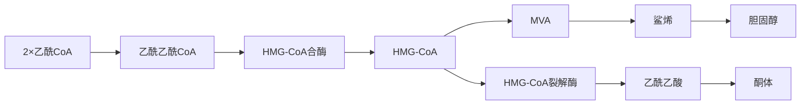
</details>

124. ABCD 125. ABCD ①单核细胞和平滑肌细胞吞噬脂质后称为泡沫细胞。泡沫细胞是动脉粥样硬化的特征性细胞,故答 D。参阅【1997NO103】。②手术缝线常在体内形成异物性肉芽肿,肉芽肿的主要细胞成分是上皮样细胞和多核巨细胞,故答 C。③Aschoff 细胞是风湿病的特征性细胞。心衰细胞常见于慢性肺淤血。  
126. ABCD 127. ABCD ①与Burkitt淋巴瘤相关的病毒是EB病毒(EBV)。地方性Burkitt淋巴瘤的发病与EBV感染密切相关。参阅【2017NO148】。②艾滋病患者容易感染巨细胞病毒(CMV)和乳头状瘤空泡病毒,导致进行性多灶性白质脑病。③乙型肝炎病毒(HBV)是乙型肝炎的病原体。子宫颈癌与人乳头瘤病毒(HPV)感染密切相关。  
128. ABCD 129. ABCD ①急性肺源性心脏病的病因包括肺动脉栓塞、急性呼吸窘迫综合征等,其中以急性肺血栓栓塞症最常见。参阅16版《实用内科学》P927。②慢性肺源性心脏病最常见的病因是慢性阻塞性肺疾病,占 $80\% \sim 90\%$ 。  
130. ABCD 131. ABCD ①肝硬化患者肝功能减退,对雌激素的灭活作用降低,导致血中雌激素增多,可出现蜘蛛痣。②腹水(腹腔积液)是肝功能减退和门静脉高压的共同结果,但门静脉高压是腹水形成的决定性因素,故答C。③肝功能减退时,可出现肝细胞性黄疸;肝合成凝血因子减少,可导致牙龈出血。  
132. ABCD 133. ABCD ①老年人结肠梗阻最常见的病因是结肠癌及粪块堵塞。②2 岁以内的小儿肠梗阻多为肠套叠,儿童肠梗阻多为蛔虫团堵塞。③粘连性肠梗阻是临床上最常见的肠梗阻。乙状结肠冗长临床上少见。  
134. ABCD 135. ABCD ①支配甲状腺的神经来自迷走神经的分支。迷走神经行走在气管、食管沟内，发出喉上神经及喉返神经支配甲状腺。喉上神经再分为内支和外支。喉上神经内支支配声门裂以上喉黏膜的感觉，损伤后喉部黏膜感觉丧失，常表现为饮水呛咳。参阅【1994N0136】。②喉返神经支配声带内收肌和声带外展肌，一侧喉返神经损伤后常表现为声音嘶哑。③喉上神经外支损伤后常表现为音调降低。颈交感干损伤后常表现为霍纳综合征。  
136. ABCD 影响静息电位水平的主要因素如下。①细胞外液 $\mathrm{K}^{+}$ 浓度: 在安静状态下, 细胞膜对 $\mathrm{K}^{+}$ 通透性较大, 改变细胞外 $\mathrm{K}^{+}$ 浓度即可影响 $\mathrm{K}^{+}$ 平衡电位和静息电位。当细胞外 $\mathrm{K}^{+}$ 浓度升高时, $\mathrm{K}^{+}$ 平衡电位减小, 静息电位也相应减小。②膜对 $\mathrm{K}^{+}$ 和 $\mathrm{Na}^{+}$ 的相对通透性: 如果细胞膜对 $\mathrm{K}^{+}$ 通透性增大, 则静息电位增大; 反之, 膜对 $\mathrm{Na}^{+}$ 通透性增大, 则静息电位减小。③钠泵活动水平: 钠泵活动增强时, 其生电效应增强, 膜发生一定程度的超极化; 反之, 钠泵活动受抑制, 则可使静息电位减小。注意: 细胞外液的 $\mathrm{Ca}^{2+}$ 浓度对静息电位的形成无明显作用。  
137. ABCD ①体内的生理性抗凝物质包括丝氨酸蛋白酶抑制物(如抗凝血酶)、蛋白质C系统(如蛋白质C)、组织因子途径抑制物三类。肝素在体内、体外均具有抗凝作用,也属于生理性抗凝物质。②纤溶酶原激活物抑制物-1为纤溶抑制物,不属于生理性抗凝物质,故不答C。  
138. ABCD ①血红蛋白(Hb)有两种构象: Hb为紧密型(T型), $HbO_{2}$ 为疏松型(R型), 两者可相互转换。当Hb与 $O_{2}$ 结合时, 盐键逐步断裂, 其分子构象逐渐由T型变为R型, 对 $O_{2}$ 的亲和力逐渐增加; 反之, 当 $HbO_{2}$ 释放 $O_{2}$ 时, Hb分子逐渐由R型变为T型, 对 $O_{2}$ 的亲和力逐渐降低。R型Hb对 $O_{2}$ 的亲和力为T型的500倍。② $H^{+}$ 浓度升高时, $H^{+}$ 与Hb多肽链某些氨基酸残基结合, 促进盐键形

成,使 Hb 分子向 T 型转变,不利于 Hb 与 O₂ 的结合。③Hb 与 O₂ 结合后形成 HbO₂,呈鲜红色。Hb 与 CO 结合后呈樱桃红色。④Hb 中的 Fe 主要为二价铁离子(Fe²⁺)而不是三价铁离子(Fe³⁺)。

139. ABCD ①大肠内的细菌可利用肠内较为简单的物质合成维生素 B 复合物及维生素 K, 这些维生素可被人体吸收利用。②大肠内细菌不能合成维生素 C 和维生素 K。参阅【2018NO8】。  
140. ABCD 利用肾清除率的原理,可以测定肾小球滤过率、肾血浆流量、肾血流量、滤过分数、推测肾小管功能、自由水清除率,不能测定肾小管重吸收钠量和肾小管泌氢能力。  
141. ABCD ①Cushing 综合征患者糖皮质激素(GC)分泌增多, GC 可增强骨髓的造血功能, 使血液中红细胞数量增多。②GC 可抑制淋巴细胞有丝分裂, 并增加淋巴细胞与嗜酸性粒细胞在脾和肺的破坏, 使循环血中淋巴细胞和嗜酸性粒细胞数量减少。③GC 可促进附着在血管壁及骨髓中的中性粒细胞进入血液循环, 增加循环血液中中性粒细胞的数量。  
142. ABCD ①成熟红细胞除质膜和胞质外,无线粒体,只能进行糖酵解、磷酸戊糖旁路等代谢过程,这两种反应均在胞质内完成。②脂肪酸 $\beta$ -氧化在线粒体内进行,尿素生成需在胞质及线粒体中进行,因此成熟红细胞不能进行这两种反应。  
143. ABCD ①肝的生物转化作用包括两相反应,第一相反应包括氧化、还原和水解反应,第二相反应主要是结合反应。细胞色素 $\mathrm{P}_{450}$ 单加氧酶主要参与异源物的氧化,醇脱氢酶可将乙醇氧化为乙酸,单胺氧化酶主要参与脂肪族和芳香族胺类的氧化。可见,A、B、C均参与第一相反应(氧化反应)。②UDP-葡(萄)糖醛酸基转移酶主要参与第二相反应(结合反应),故不答D。  
144. ABCD ①原核生物基因表达调控是以操纵子模式进行的。例如,乳糖操纵子含三个结构基因 Z、Y、A,一个操纵序列 O,一个启动子 P,一个调节基因 I 及分解(代谢)物基因激活蛋白(CAP)结合位点。其调节机制包括阻遏蛋白封闭启动子的负性调控、通过 cAMP-CAP 介导的正性调控及两者的协同调节。色氨酸操纵子主要通过转录衰减的方式调控基因表达。②RNA 编辑是指 mRNA 转录后的加工修饰,属于真核生物转录后水平的基因表达调控,故不答 D。


<details>
<summary>flowchart</summary>

```mermaid
graph TD
    A["PI"] -->|阻遏蛋白| B["I"]
    B --> C["CAP结合位点"]
    C --> D["P"]
    D --> E["O"]
    E --> F["Z"]
    F --> G["Y"]
    G --> H["A"]
    C --> I["启动序列"]
    C --> J["操纵序列"]
    I --> K["-"]
    J --> L["⊕"]
    L --> M["CAP"]
    M --> N["⊖"]
    N --> O["乙酰基转移酶"]
```
</details>

乳糖操纵子结构示意图

145. ABCD ①MAPK通路是经丝裂原激活的蛋白激酶(MAPK)级联活化的信号转导通路;JAK-STAT通路是经蛋白质酪氨酸激酶(JAK)、信号转导及转录激活蛋白(STAT)介导的信号转导通路;PI3K通路是经磷脂酰肌醇-3-激酶(PI-3K)介导的信号转导通路,可见这三种信号转导通路均有“激酶”被激活,均属于蛋白质激酶偶联受体介导的信号转导通路。②经典核受体通路是指激素直接进入细胞内,与核受体结合形成激素-受体复合物,诱导基因表达,来进行信号转导,没有蛋白激酶的参与,故不答D。  
146. ABCD 原癌基因 MYC、FOS 编码的蛋白质属于核内转录因子。原癌基因 HER-2、EGFR 编码的蛋白质属于跨膜生长因子受体。原癌基因编码的蛋白质在信号转导系统中的作用分类归纳如下图,以便理解和记忆。


<details>
<summary>flowchart</summary>

```mermaid
graph TD
    A["① SIS→PDGF<br>INT-2→FGF"] --> B["生长因子"]
    B --> C["PTK"]
    C --> D["Grb2-SOS"]
    D --> E["Ras蛋白"]
    E --> F["Raf蛋白"]
    F --> G["MAPK"]
    G --> H["效应蛋白"]
    
    I["② EGFR ←EGFR(ERB-B)<br>EGFR类似物 ←HER2<br>CSFR ←FMS<br>SCFR ←KIT<br>NGFR ←TRK"] --> J["激素"]
    K["③ 细胞内信号转导分子"] --> J
    L["④ EGFR表皮生长因子受体"] --> M["DNA转录"]
    M --> N["效应蛋白"]
    N --> O["生物学效应"]
    
    P["④ MYC ←MYC<br>JUN ←JUN<br>FOS ←FOS"] --> M
    Q["①细胞外生长因子"] --> R["细胞膜"]
    R --> S["细胞外"]
    R --> T["细胞内"]
    R --> U["细胞膜"]
```
</details>

原癌基因编码的蛋白质在信号转导系统中的作用分类

147. ABCD A、B、C、D均属于重组DNA技术中常用的工具酶。参阅10版《生物化学》P370表19-1。  
148. ABCD ①不同类型的炎症致炎因子不同,浸润的白细胞类型也不相同。嗜酸性粒细胞浸润为主的病变常见于一些过敏反应和寄生虫感染,如过敏性鼻炎、急性血吸虫感染等。②小叶性肺炎为化脓性炎,以中性粒细胞浸润为主。病毒性肝炎为病毒感染所致,以淋巴细胞浸润为主。  
149. ABCD ①化脓性炎是指以中性粒细胞渗出为主的炎症。急性肾盂肾炎是由细菌感染引起的肾盂、肾间质和肾小管的化脓性炎症。流行性脑脊髓膜炎是由脑膜炎双球菌感染引起的脑脊髓膜的急性化脓性炎症。②伤寒是由伤寒杆菌感染引起的急性增生性炎症。亚急性甲状腺炎是由病毒感染引起的肉芽肿性炎症。  
150. ABCD ①桥接坏死是指中央静脉与门管区之间、两个门管区之间或两个中央静脉之间出现的相互连接坏死带。②“肝细胞坏死占肝小叶的大部分”为亚大块坏死。  
151. ABCD 慢性肺源性心脏病的病理特点:以右心室的病变为主,右心室壁肥厚(B 错),右心室扩张(D 错),扩大的右心室占据心尖部,外观钝圆。右心室前壁肺动脉圆锥显著膨隆,右心室内乳头肌和肉柱显著增粗,室上嵴增厚。  
152. ABCD ①病毒性心肌炎早期可见心肌细胞变性、坏死和间质内中性粒细胞浸润,晚期可见淋巴细胞、巨噬细胞、浆细胞浸润以及肉芽组织形成。②主动脉粥样硬化、肺动脉瓣狭窄本身不累及心脏,不会引起心肌坏死,故不答 B、C。③扩张型心肌病镜下可见心肌细胞肥大和萎缩交错排列,心肌细胞变性、坏死伴淋巴细胞浸润,参阅北京大学医学出版社 3 版《病理学》P155、P157。  
153. ABCD ①幼年性息肉病是大肠癌的癌前病变,但幼年性息肉不是癌前病变。息肉超过100颗称为息肉病。②溃疡性结肠炎在反复发生溃疡和黏膜增生的基础上可发生大肠腺癌。③家族性腺瘤性息肉病好发于大肠,至青春期几乎100%发生癌变,为恶变率最高的癌前病变。④结肠绒毛状腺瘤恶变率约为50%,故答A、B、C、D。  
154. ABCD ①老年患者,长期咳嗽、咳痰,应考虑慢性阻塞性肺疾病(COPD)。自发性气胸为COPD常见并发症。COPD患者突感左胸疼痛,呼吸困难,左肺呼吸音明显减低,应考虑并发自发性气胸。拍摄X线胸片可明确诊断,进行心电图检查可排除心绞痛发作。②对于稳定型小量气胸,可采用保守治疗,严格卧床休息,酌情给予镇静、镇痛药物,经鼻导管或面罩吸氧,一般不进行呼吸机辅助通气,参阅10版《内科学》P135。按10版《内科学》观点,正确答案应为A、B、C,但医学考试中心公布的标准答案为A、B。

155. ABCD ①毛花苷 C 属于洋地黄类,为急性左心衰竭的常用治疗药物。②伊伐布雷定常用于治疗慢性心力衰竭,而不是急性左心衰竭,故不答 B。③奈西立肽为人重组脑钠肽,可扩张静脉和动脉,降低心脏前、后负荷,并可排钠利尿,适用于急性失代偿性心力衰竭。④左西孟旦为正性肌力药物,适用于无显著低血压的急性左心衰竭。  
156. ABCD ①有机磷杀虫药口服中毒时,可给予2%碳酸氢钠溶液洗胃,但敌百虫忌用,因为敌百虫可与碳酸氢钠反应生成毒性更强的敌敌畏。敌百虫中毒常用清水、1:5000高锰酸钾溶液洗胃。②A、C、D均可给予2%碳酸氢钠溶液洗胃。  
157. ABCD 尿频、尿急、尿痛合称尿路刺激征，常见于尿路感染。尿潴留、排尿困难不属于尿路刺激征。  
158. ABCD ①活化部分凝血活酶时间(APTT)反映内源性凝血系统的功能。APTT延长说明涉及内源性凝血途径的凝血因子(FXII、XI、IX、VIII、X、V、II、I)异常。②Ⅶ因子为外源性凝血途径的凝血因子,故不答B。③凝血酶时间(TT)反映纤维蛋白原的功能。患者TT正常,说明纤维蛋白原正常,故不答D。参阅【2017NO158】。  
159. ABCD ①糖尿病酮症酸中毒(DKA)失水量可达体重 $10\%$ 以上,补液是治疗的关键环节。补液原则是先快后慢,先盐后糖。开始输液速度宜快,应在前 $1 \sim 2$ 小时内输入 $0.9\%$ 氯化钠 $1000 \sim 2000 \mathrm{ml}$ 。当血糖降至 $13.9 \mathrm{mmol} / \mathrm{L}$ 时,根据血钠情况决定改为 $5\%$ 葡萄糖液或葡萄糖生理盐水,并按每 $2 \sim 4 \mathrm{~g}$ 葡萄糖加入 1U 胰岛素。②DKA 宜采用小剂量胰岛素疗法,即每小时给予 $0.1 \mathrm{U} / \mathrm{kg}$ 胰岛素,另加首次负荷量,静脉注射短效胰岛素 $10 \sim 20 \mathrm{U}$ 。③当血 $\mathrm{pH} < 7.1, \mathrm{HCO}_{3}^{-} < 5 \mathrm{mmol} / \mathrm{L}$ 时需要补碱治疗。  
160. ABCD ①无症状的成人胆囊结石,直径≥3cm,应行胆囊切除。因为70%的胆囊癌合并胆囊结石,胆囊癌合并胆囊结石是无结石胆囊癌的13.7倍,直径3cm结石发生胆囊癌的概率是直径1cm结石病人的10倍。②儿童胆囊结石,无症状者,原则上不手术,参阅8版《外科学》P455,10版《外科学》已删除该知识点。③胆囊息肉直径>1cm为其恶变的高危因素,应行胆囊切除。④完全钙化的“瓷性”胆囊与胆囊癌的发病密切相关,应手术切除。  
161. ABCD 急性阑尾炎可能出现的阳性体征有:①结肠充气试验(Rovsing 征)阳性提示急性阑尾炎,但阴性不能否定急性阑尾炎;②腰大肌试验(Psoas 征)阳性提示阑尾位置较深,阑尾位于腰大肌前方、盲肠后位或腹膜后位;③闭孔内肌试验(Obturator 征)阳性提示阑尾位置较低,阑尾靠近闭孔内肌。Cullen 征阳性常见于急性出血坏死性胰腺炎。  
162. ABCD ①肠系膜上动脉栓塞起病急骤,早期表现为突发剧烈的腹部绞痛,但腹部体征较轻,严重的症状与轻微的体征不相称为本病的特点。②肠系膜上动脉栓塞的栓子多来自心脏,栓塞可发生在肠系膜上动脉自然狭窄处,常见部位在结肠中动脉出口以下(并非肠系膜上动脉根部)。③选择性腹腔动脉造影有助于明确诊断。  
163. ABCD ①肛裂是齿状线下肛管皮肤层裂伤后形成的小溃疡。多见于青中年人,绝大多数肛裂位于肛管的后正中线上,也可在前正中线上(A 错)。②因肛裂、前哨痔、肛乳头肥大常同时存在,故称为肛裂“三联症”。③肛裂的典型临床表现是疼痛、便秘和出血(D 错)。  
164. ABCD ①骨巨细胞瘤的瘤组织以单核基质细胞及多核巨细胞为主要成分。②典型 X 线特征为骨端偏心位、溶骨性、囊性破坏而无骨膜反应,病灶膨胀性生长、骨皮质变薄,呈肥皂泡样改变。③主要症状为疼痛和肿胀,病变部位有压痛,病变关节活动受限。④骨巨细胞瘤以手术治疗为主。对发生于手术困难部位如脊椎者,可采用放化疗,但放疗后易肉瘤变。  
165. ABCD ①骨关节炎患者在远端指间关节出现结节称为 Heberden 结节，在近端指间关节出现结节称为 Bouchard 结节，故不答 B。②杵状指可能与肢体末端慢性缺氧、代谢障碍、中毒性损害有关，常见于慢性肺脓肿、支气管扩张症、支气管肺癌、发绀型先天性心脏病、肝硬化等。③手指向尺侧偏斜、手指呈“天鹅颈”样畸形均为类风湿关节炎的典型畸形。

# 2022年全国硕士研究生招生考试临床医学综合能力(西医)试题答案及详细解答

# (答案为绿色的选项)

1. ABCD ①被动转运的分子或离子向相反方向运动的继发性主动转运称为反向转运,其载体称为反向转运体。肾近端小管上皮细胞顶端膜存在 $\mathrm{Na}^{+}-\mathrm{H}^{+}$ 交换体,这是一种反向转运体,可将胞外即肾小管管腔内的 $\mathrm{Na}^{+}$ 顺电化学梯度重吸收进入细胞内,同时可将细胞内的 $\mathrm{H}^{+}$ 逆浓度梯度分泌到管腔中,因此属于反向转运体介导的物质跨膜转运。②甲状腺滤泡上皮细胞吸收 $\mathrm{I}^{-}$ 是经 $\mathrm{Na}^{+}-\mathrm{I}^{-}$ 同向转运体介导完成的,肾小管上皮细胞对 $\mathrm{HCO}_{3}^{-}$ 的重吸收是以 $\mathrm{CO}_{2}$ 形成经单纯扩散完成的,葡萄糖进入肠上皮细胞是经 $\mathrm{Na}^{+}$ -葡萄糖同向转运体介导完成的。

2. ABCD ①后负荷是指肌肉在收缩后所承受的负荷。通过测定不同后负荷(张力)时肌肉缩短的速度,对应作图即可得到张力-速度关系曲线。该曲线表明,随着后负荷增大,收缩张力增加,肌肉收缩的长度和缩短速度将减小。②后负荷存在时,肌肉首先通过增加张力以对抗后负荷,这时肌肉不表现缩短但张力增加,称为等长收缩。只有当张力增加到足以对抗甚至超过后负荷时,肌肉才能开始缩短,且缩短一旦开始,张力就不再继续增加,这种收缩方式称为等张收缩。可见,肌肉收缩时,先等长收缩后等张收缩,因此,当后负荷增加时,完成等长收缩的时间延长、等张收缩的时间缩短。


<details>
<summary>line</summary>

| 负荷 (张力) | 缩短速度 |
| ---------- | -------- |
| 0          | V_max    |
| P0         | 等长收缩 |
</details>

肌肉等张收缩时的张力-速度关系

3. ABCD ①通常用抗凝血静置后红细胞在第一小时末下沉的距离来

表示红细胞的沉降速度,称为红细胞沉降率(ESR)。正常情况下,红细胞膜表面的唾液酸带负电荷,红细胞相互排斥,使之分散悬浮于血浆中。纤维蛋白原带有正电荷,可以中和红细胞表面的负电荷,促使红细胞聚集而沉降,因此血浆纤维蛋白原增多将导致红细胞沉降率加快。②决定 ESR 的因素是血浆成分的改变,而非红细胞本身,因此红细胞数量增加对 ESR 影响不大。血浆球蛋白减少、血浆白蛋白增多均可使 ESR 减慢。参阅【2016NO4】。

4. ABCD ①根据红细胞膜上是否存在 A 抗原和 B 抗原, 可将血液分为 4 种 ABO 血型: 只含 A 抗原者为 A 型, 只含 B 抗原者为 B 型, 含有 A 与 B 两种抗原者为 AB 型, A 和 B 两种抗原均无者为 O 型。A 抗原、B 抗原都是在 H 抗原基础上形成的, O 型红细胞虽然不含 A 抗原和 B 抗原, 但含有 H 抗原。②D 抗原是 Rh 血型系统的分型依据之一。

5. ABCD ①如果主动脉瓣关闭,左心室不可能将血液射入主动脉中,因此,左心室射血期(快速射血期初、减慢射血期初),主动脉瓣呈开放状态,故可首先排除 B、C。②左心室在等容舒张期初主动脉瓣由开启转为关闭,故答 D。整个心房收缩期主动脉瓣始终处于关闭状态,故不答 A。参阅【2017N05】。

6. ABCD ①每搏输出量增加时,心室内剩余血量减少,心舒期室内压降低明显,从而对心房和静脉内血液的抽吸作用增强,导致静脉回心血量增加。②大失血时,有效循环血量减少,静脉回心血量减少。用力呼气时,胸膜腔负压减小,静脉回心血量降低。由平卧位突然站立,身体低垂部分的静脉因跨壁压增大而扩张,可容纳更多的血液,因而回心血量减少。参阅【2008NO153】。

7. ABCD ①呼吸过程呈周期性变化。吸气时,肺容积逐渐增大,肺内压逐渐降低,当低于大气压时,外界气体进入肺内。可见,在吸气相中期,会出现肺内压最低值。②呼气时,肺容积减小,肺内压随之升高,当高于大气压时,气体流出肺。可见,在呼气相中期会出现肺内压最高值。

8. ABCD ①辅脂酶是胰脂肪酶的辅因子,对胆盐微胶粒有较强的亲和力,可使胰脂肪酶、辅脂酶、胆盐形成三元络合物,有助于胰脂肪酶锚定于脂滴表面,发挥其分解脂肪的作用,并防止胆盐将胰脂肪酶从脂滴表面清除下去。②分解甘油三酯为胰脂肪酶的生理作用。乳化甘油三酯为胆汁的生理作用。胰脂肪酶是以活性形式分泌的,无须激活,故不答 C。参阅【2015NO12】。

9. ABCD ①肾血浆流量增加时,肾小球毛细血管中血浆渗透压上升的速度减缓,滤过平衡点向出球小动脉端移动,使有效滤过面积增大,导致肾小球滤过增加。②交感神经兴奋时,入球小动脉收缩,肾血流量和肾小球毛细血管血压降低,有效滤过压降低,肾小球滤过减少。③肾盂结石可导致囊内压升高,有效滤过压降低,肾小球滤过减少。④收缩压在70\~180mmHg范围内波动时,肾通过自身调节可保持肾血流量相对稳定,使肾小球滤过率不变。

10. ABCD 肾髓质间液高渗的建立是由于 NaCl 和尿素在小管外组织间液中积聚所致。这些物质能持续滞留在该部位而不被循环血液带走,从而维持肾髓质间液的高渗环境,这与直小血管所起的逆流交换作用密切相关。直小血管的降支和升支是并行的血管,在髓质中形成逆流系统。逆流交换过程可将髓质间液中多余的溶质和水带回循环血液,这样溶质(主要是 NaCl 和尿素)就可连续地在直小血管降支和升支之间循环,从而有利于维持肾髓质间液的高渗状态。

11. ABCD 如果一个神经元的轴突末梢(A)与第二个兴奋性神经元的轴突末梢(B)形成轴突-轴突式突触,后者(B)兴奋时释放的递质就可影响前者(A)兴奋时在其突触后的第三个神经元的胞体(C)产生的兴奋性突触后电位(EPSP)。若第二个神经元兴奋时释放的递质相对降低了第一个神经元兴奋时在第三个神经元胞体产生的EPSP,则称为突触前抑制。目前认为可能机制为:末梢B兴奋时,释放γ-氨基丁酸(GABA)作用于末梢A上的GABA $_{A}$ 受体,引起末梢A的Cl $^{-}$ 电导增加,膜发生去极化,使传到末梢A的动作电位幅度变小,时程缩短,结果使进入末梢A的Ca $^{2+}$ 减少,由此减少突触前神经元的递质释放,最终导致神经元C的EPSP减


<details>
<summary>text_image</summary>

A.第一个神经元的轴突末梢
B.第二个神经元的轴突末梢
C.第三个神经元的胞体
突触前抑制示意图
</details>

小。突触前抑制广泛存在于中枢，尤其在感觉传入通路中，对调节感觉传入活动具有重要意义。

12. ABCD ①腱反射是指快速牵拉肌腱时发生的牵张反射,如膝反射、跟腱反射等。腱反射的效应器是收缩较快的快肌纤维,产生几乎是一次同步性收缩而表现出明显的动作。完成一次腱反射的时间很短,据测算,兴奋通过中枢的传播时间仅约0.7ms,只够一次突触传递所需的时间,因此腱反射是单突触反射。②逃避反射、吸吮反射、翻正反射均属于复杂的多突触反射。

13. ABCD 受体分为膜受体和胞内受体两类。胞内受体也称为核受体,是指定位于细胞质或细胞核中的受体。类固醇激素结合的受体属于核受体。酪氨酸激酶受体、G蛋白耦联受体、鸟苷酸环化酶受体均属于膜受体。

14. ABCD ①糖皮质激素分泌过多可导致骨质疏松,作用机制包括:抑制钙在肠的吸收、促进肾对钙的排泄;促进甲状旁腺激素的分泌,增加破骨细胞的功能和骨吸收;促进骨母细胞的凋亡,导致骨细胞形成减少;抑制成骨细胞表达骨钙素,骨钙化减少。参阅人民卫生出版社4版《人体生理学》P814。②糖皮质激素可抑制肝外组织蛋白质合成,加速其分解。糖皮质激素可提高血管平滑肌对儿茶酚胺的敏感性,导致血管收缩。糖皮质激素可减少组织对糖的利用、加速肝糖异生而使血糖升高。

15. ABCD ①血中游离脂肪酸增多、抑胃肽、生长激素均可促进胰岛素的分泌。②交感神经兴奋时，释放去甲肾上腺素，作用于 $\beta$ 细胞膜上的 $\alpha$ 受体，可抑制胰岛素分泌。

16. ABCD ①题干要求回答的是“子宫内膜”的周期性变化,由于子宫不会排卵,故无排卵期,可首先排除 C、D。②按子宫内膜的周期性变化,月经周期分为增生期、分泌期、月经期三个时期,由于增生期在分泌期之前,故答 A 而不是 B。

17. ABCD ①牛核糖核酸酶 A 是具有三级结构的蛋白质分子,若用尿素和 β-巯基乙醇处理该酶溶液,分别破坏次级键和二硫键,使其二、三级结构被破坏,但肽键不受影响,一级结构仍存在,此时该酶活性丧失殆尽。当用透析方法去除尿素和 β-巯基乙醇后,松散的多肽链循其特定的氨基酸序列,卷曲折叠成天然酶的空间构象,4 对二硫键也正确配对,这时酶活性又逐渐恢复至原来水平。这说明蛋白质一级结构是空间构象的基础,只要一级结构(氨基酸序列)未被破坏,空间构象遭破坏的核糖核酸酶也可以回复到原来的三级结构,功能依然存在。②A、B、D 均说明蛋白质的功能依赖特定空间结构。  
18. ABCD ①核酸在紫外波段具有较强的吸收,其最大吸收峰在 $260 \mathrm{~nm}$ 附近。测定 $260 \mathrm{~nm}$ 处的吸光度 $(A_{260})$ , 可以判断溶液中核酸的含量。测定 $260 \mathrm{~nm}$ 与 $280 \mathrm{~nm}$ 处吸光度的比值 $(A_{260} / A_{280})$ , 可以鉴定核酸样品的纯度。DNA 纯品的 $A_{260} / A_{280}$ 值应为 1.8; 而 RNA 纯品的 $A_{260} / A_{280}$ 值应为 2.0。②解链温度 $(T_{\mathrm{m}}$ 值) 是用于判断 DNA 变性时解链难易程度的指标。DNA 变性所需时间受多种因素的影响。样品中 GC 含量是判断 $T_{\mathrm{m}}$ 值大小的指标。  
19. ABCD ①糖有氧氧化抑制无氧酵解的现象,称为巴斯德效应,故不答 A。②NADH 可抑制丙酮酸脱氢酶复合体、柠檬酸合酶、α-酮戊二酸脱氢酶复合体,从而抑制糖的有氧氧化(B 错)。③细胞内 ATP/ADP 比值可调节糖有氧氧化关键酶的活性。当 ATP/ADP 比值增高时,说明细胞内 ATP 充足,可别构抑制磷酸果糖激酶-1、丙酮酸激酶、丙酮酸脱氢酶复合体、柠檬酸合酶、异柠檬酸脱氢酶,从而抑制糖的有氧氧化。反之,当细胞内 ATP/ADP 比值降低时,可加速糖的有氧氧化。④糖异生与糖酵解底物循环的平衡主要参与糖酵解和糖异生相互协调的调节。  
20. ABCD ①花生四烯酸是合成前列腺素和白三烯的原料。前列腺素经环加氧酶途径可生成前列环素 $\left(\mathrm{PGI}_{2}\right)$ 、血栓烷；经线性脂加氧酶途径可生成线性白三烯类(LT)，如 $LTC_{4}$ 、 $LTD_{4}$ 、 $LTE_{4}$ 等。 $LTC_{4}$ 、 $LTD_{4}$ 、 $LTE_{4}$ 的混合物称为过敏反应慢反应物质，可缓慢而持久地收缩支气管平滑肌，故答D。参阅高等教育出版社4版《生物化学》下册P256。②A、B、C都不是花生四烯酸的生物学作用。


<details>
<summary>flowchart</summary>

```mermaid
graph TD
    A["亚油酸"] --> B["亚麻酸"]
    B --> C["花生四烯酸"]
    C --> D["环加氧酶"]
    D --> E["PGG₂"]
    E --> F["过氧化物酶"]
    F --> G["PGH₂"]
    G --> H["过氧化物酶异构酶"]
    H --> I["PGE₂"]
    G --> J["过氧化物酶还原酶"]
    J --> K["PGF₂α"]
    G --> L["前列环素合酶"]
    L --> M["PGI₂"]
    G --> N["血栓烷合酶"]
    N --> O["TXA₂"]
    C --> P["脂加氧酶"]
    P --> Q["5-氢过氧化二十碳四烯酸"]
    Q --> R["脱水酶"]
    R --> S["LTA₄"]
    S --> T["谷胱甘肽S-转移酶"]
    T --> U["LTC₄"]
    U --> V["转肽酶"]
    V --> W["LTD₄"]
    W --> X["二肽酶"]
    X --> Y["LTE₄"]
```
</details>

21. ABCD ①真核细胞内,蛋白质在蛋白酶体通过 ATP 依赖途径的降解需要泛素的参与。首先泛素与被选择降解的蛋白质形成共价连接,使后者得以标记,然后蛋白酶体将其降解。泛素的这种标记作用称为泛素化,是由三种酶(泛素激活酶、泛素结合酶、泛素蛋白连接酶)催化完成的。②泛素化既不参与多肽链的生物合成、蛋白质亚基的聚合,也不参与消化道蛋白质的分解。  
22. ABCD ①甲硫氨酸循环主要参与体内的转甲基反应,由 $N^{5}$ -甲基四氢叶酸提供甲基使同型半胱氨酸转变成甲硫氨酸,自身再生为四氢叶酸,此反应由甲硫氨酸合成酶催化,其辅酶是维生素 $\mathrm{B}_{12}$ ,故答 A。②参与色氨酸生成一碳单位反应的是 $N^{10}$ -甲酰四氢叶酸而不是 $N^{5}$ -甲基四氢叶酸。参与不同形式一碳单位相互转换反应的是 $N^{5}, N^{10}$ -次甲四氢叶酸、 $N^{5}, N^{10}$ -亚甲四氢叶酸等,而不是 $N^{5}$ -甲基四氢叶酸。参与二氢叶酸转变成四氢叶酸的是 $\mathrm{NADPH} + \mathrm{H}^{+}$ ,而不是 $N^{5}$ -甲基四氢叶酸,故不答 B、C、D。  
23. ABCD ①次黄嘌呤-鸟嘌呤磷酸核糖转移酶(HGPRT)是催化嘌呤核苷酸补救合成的酶,若该酶由于基因缺陷而先天性缺乏,可导致莱施-奈恩(Lesch-Nyhan)综合征,即自毁容貌征,这是一种遗传代谢病。②阿尔兹(茨)海默病为蛋白质构象疾病。帕金森病为酪氨酸代谢障碍性疾病。镰状细胞贫血

是基因点突变所致的分子病。

24. ABCD ①原核生物复制起始需要首先合成引物,引物是由引物酶催化合成的短链 RNA 分子。当母链 DNA 解成单链后,不会立即按照模板序列将 dNTP 聚合为 DNA 子链。这是因为 DNA 聚合酶不具备催化两个游离 dNTP 之间形成磷酸二酯键的能力,只能催化核酸片段的 3'-OH 末端与 dNTP 间的聚合。但 RNA 聚合酶不需要 3'-OH 末端便可催化 NTP 的聚合,而引物酶属于 RNA 聚合酶,故复制起始部位合成的短链引物 RNA 为 DNA 的合成提供 3'-OH 末端,在 DNA 聚合酶催化下逐一加入 dNTP 而形成 DNA 子链。②DNA 聚合酶主要参与 DNA 链的延长,逆转录酶主要参与逆转录病毒基因组的复制,解螺旋酶主要参与 DNA 合成的解链过程。  
25. ABCD 肽酰转移酶也称转肽酶,主要参与蛋白质生物合成的成肽反应,该酶的化学本质不是蛋白质,而是RNA,属于一种核酶,在原核生物为23S rRNA,在真核生物为28S rRNA。参阅【2021NO24】。  
26. ABCD 质粒是细菌染色体外能自主复制和稳定遗传的双链环状 DNA 分子。  
27. ABCD 细胞内受体多为转录因子, 当与相应配体结合后, 能与 DNA 顺式作用元件结合, 在转录水平调节基因表达。  
28. ABCD ①磷酸吡哆醛为维生素 $\mathrm{B}_{6}$ 的活性形式, 是血红素合成的关键酶 $\delta$ -氨基- $\gamma$ -酮戊酸(ALA)合酶的辅酶, 参与血红素的合成。②A、C、D 均参与血红素的合成, 但均无辅酶。  
29. ABCD ①弥散性血管内凝血(DIC)患者毛细血管内发生的血栓常为纤维素性血栓,只能在显微镜下观察到,故又称为微血栓或透明血栓。②混合血栓、红色血栓、白色血栓分别多见于静脉血栓的体部、尾部、头部。  
30. ABCD ①肿瘤分期是指恶性肿瘤的生长范围和播散程度。②B、C、D均属于恶性肿瘤的分级依据。参阅【2005NO43】。  
31. ABCD ①大叶性肺炎患者若肺炎病灶中中性粒细胞渗出过少,释放的蛋白酶不足以溶解渗出物中的纤维素,则大量未能被溶解吸收的纤维素可被肉芽组织取代而机化,呈褐色外观,称为肺肉质变。②小叶性肺炎(为化脓性炎)、病毒和肺炎支原体引起的间质性肺炎均不会并发肺肉质变。  
32. ABCD 前列腺癌经血道转移主要转移到骨，尤以脊椎骨最常见，其次为股骨近端、盆骨和肋骨。  
33. ABCD 母细胞瘤是指来源幼稚的一类肿瘤,大部分为恶性肿瘤,如视网膜母细胞瘤、神经母细胞瘤、髓母细胞瘤、肾母细胞瘤、肝母细胞瘤等;也有一部分是良性肿瘤,如骨母细胞瘤、软骨母细胞瘤、肌母细胞瘤、脂肪母细胞瘤等。参阅【2019NO32】、【2016NO46】。  
34. ABCD ①组织损伤后2\~3天即可出现肉芽组织,肉芽组织由新生毛细血管、成纤维细胞和炎症细胞构成。新生的毛细血管主要参与血管生成,炎症细胞可分泌多种生长因子,促进成纤维细胞的迁移、增殖,合成细胞外基质,从而完成纤维性修复过程。可见,完成纤维性修复的最重要细胞是成纤维细胞。②纤维细胞是机能不活跃的成纤维细胞,增殖能力差,故不答A。巨噬细胞是肉芽组织中主要的炎症细胞。  
35. ABCD ①中毒性细菌性痢疾的肠道病变一般为卡他性炎,有时肠壁集合和孤立淋巴小结滤泡增生肿大,可呈滤泡性肠炎改变。②假膜性肠炎为急性普通型细菌性痢疾的特征性病理改变。中毒性细菌性痢疾的特点是全身中毒症状严重,但肠道病变轻微,很少表现为溃疡性肠炎和出血性肠炎。  
36. ABCD ①多发性骨髓瘤也称浆细胞骨髓瘤,镜下可见分化不成熟的浆细胞大量增生,形成片状浸润病灶,肿瘤性浆细胞取代正常骨髓组织,故答 D。②霍奇金淋巴瘤镜下可见 R-S 细胞。滤泡性淋巴瘤镜下可见肿瘤细胞呈滤泡样生长,由中心细胞和中心母细胞组成。伯基特淋巴瘤镜下可见淋巴细胞弥漫性浸润,瘤细胞分布于反应性巨噬细胞之间,构成“满天星”图像。  
37. ABCD 高危型人乳头瘤病毒(HPV16、HPV18)与子宫颈癌的发生有关。HPV可分泌两种病毒蛋白E6和E7,E6蛋白与野生型P53结合,可加速P53蛋白的降解灭活,因而失去其抑癌功能;E7蛋白与RB基因产物结合,抑制RB的功能,导致肿瘤发生。参阅【2007NO115、116】。

38. ABCD ①甲状腺滤泡癌若分化良好,镜下很难与腺瘤区分,此时鉴别要点是看有无包膜和血管侵犯。②A、B、D都不是甲状腺滤泡癌与腺瘤的镜下鉴别要点。

39. ABCD 胃癌晚期可经胸导管转移至左锁骨上淋巴结(称为 Virchow 淋巴结), 因此 Virchow 淋巴结穿刺标本中发现癌细胞, 尤其腺癌细胞, 应首先考虑胃癌转移。

40. ABCD ①肺硅沉着病分为3期。Ⅰ期主要表现为肺门淋巴结肿大,胸膜可有硅结节形成,但增厚不明显。②B为Ⅲ期表现,C、D为Ⅱ期表现。

41. ABCD ①面颊部蝶形红斑为系统性红斑狼疮的特征性临床表现。育龄期女性,长期发热,关节痛,面颊部红斑,贫血,白细胞减少,蛋白尿,应诊断为系统性红斑狼疮。②成人 Still 病常表现为高热、一过性皮疹、关节炎、咽痛、白细胞计数增高等。结核病常表现为低热,盗汗,很少出现关节痛、头痛等。感染性心内膜炎常表现为高热、心脏杂音、败血症症状。

42. ABCD ①叹气样呼吸多表现为一段正常呼吸节律中插入一次深大呼吸,并常伴有叹息声,多见于神经衰弱、精神紧张、抑郁症等,故答 D。②巴比妥类中毒、脑膜脑炎常出现潮式呼吸、间停呼吸。胸腔积液常表现为呼吸浅快。

43. ABCD ①患者行肺功能检查,吸入支气管扩张剂后第一秒用力呼气容积/用力肺活量( $FEV_{1}/FVC$ )<0.7,可确定为持续气流受限,此为持续性阻塞性通气功能障碍的诊断标准。②吸入组胺为支气管激发试验,故不答A。C、D不是持续性阻塞性通气功能障碍的诊断标准。

44. ABCD ①截至目前,尚无诊断非小细胞肺癌(NSCLC)敏感性和特异性较高的肿瘤标志物。且肿瘤标志物主要用于肺癌的辅助诊断,对判断分期价值不大。②肺癌的临床分期主要依据肿瘤大小、侵犯范围、淋巴结和远处转移而定,B、C、D项检查均有助于明确肺癌分期。

45. ABCD ①胸腔积液(胸水)WBC>500×10 $^{6}$ /L,应考虑为渗出液。胸腔积液 WBC 以淋巴细胞为主、葡萄糖<3.3mmol/L,应考虑结核性或恶性胸腔积液。中年患者,低热 3 天,应诊断为结核性胸膜炎所致胸腔积液。恶性胸腔积液多见于老年人,多无发热。②脓胸、类肺炎性胸腔积液常表现为高热,胸腔积液 WBC>10×10 $^{9}$ /L,以中性粒细胞为主,葡萄糖明显降低。

46. ABCD ①患者血清支原体 IgM 抗体≥1:64(正常值<1:64),可确诊肺炎支原体肺炎。肺炎支原体肺炎的抗菌治疗首选大环内酯类抗生素,如阿奇霉素、红霉素等。对大环内酯类抗生素不敏感者,可选用呼吸氟喹诺酮类,如左氧氟沙星、莫西沙星等。②肺炎支原体无细胞壁,青霉素、头孢菌素等抗生素无效,故不答 A、C。

47. ABCD ①扩张型心肌病并发心力衰竭患者左室射血分数(LVEF)应低于 $50\%$ ，因LVEF<50%为左心衰竭的诊断标准。②扩张型心肌病由于左心室扩大，可造成相对性二尖瓣关闭不全，导致二尖瓣反流。③扩张型心肌病超声心动图可见室壁运动普遍减弱。左室壁节段运动减弱常见于缺血性心肌病。参阅【2015NO57】。④扩张型心肌病当然可有左心室舒张末内径增大。

48. ABCD ①患者心界向两侧扩大,应考虑心包积液、扩张型心肌病,风湿性心瓣膜病、病毒性心肌炎一般不会出现心界向两侧扩大,故可首先排除 B、D。②患者听诊心音遥远,应诊断为心包积液,而不是扩张型心肌病。

49. ABCD ①脑钠肽(BNP)主要由心室肌细胞分泌,是评估心脏功能、诊断心力衰竭的常用指标,故答C。②A、B、D都是评估心肌梗死的常用指标。

50. ABCD ①胃食管反流病的常见并发症为上消化道出血、食管狭窄、Barrett 食管。Barrett 食管是指正常食管的鳞状上皮被腺上皮所取代。Barrett 食管可恶变为食管腺癌,而普通食管癌多为鳞癌,不要误答 A。参阅【2021NO49】。②A、C、D 都不是胃食管反流病的并发症。贲门黏膜撕裂综合征(Mallory-Weiss 综合征)是指因剧烈呕吐,食管内高压导致的贲门黏膜撕裂引起的上消化道出血。

51. ABCD ①慢性胃窦胃炎也称 B 型胃炎、多灶萎缩性胃炎,最常见的病因是幽门螺杆菌感染,约占 90%。②自身免疫为 A 型胃炎(慢性胃体炎)的常见病因。C、D 是慢性胃炎的少见病因。

52. ABCD ①肝硬化患者出现意识障碍(表情淡漠、嗜睡),应首先考虑肝性脑病。对诊断肝性脑病最有意义的体征是扑翼样震颤。1\~3期均可引出扑翼样震颤。②腹壁反射消失见于肝性脑病4期,膝反射亢进、Babinski征阳性常见于肝性脑病2、3期。  
53. ABCD ①青年患者,上呼吸道感染后出现血尿(+++)、蛋白尿、水肿等,应考虑急性肾炎综合征。患者双肾增大,短期内肾功能急剧恶化(血肌酐442μmol/L),应诊断为急进性肾小球肾炎而不是急性肾小球肾炎。②本例若无急性肾功能衰竭,则诊断为急性肾小球肾炎。患者尿蛋白(++),不能凭此诊断为肾病综合征。慢性肾小球肾炎的病程至少3个月,本例病程仅半个月,故不答D。  
54. ABCD ①患者反复皮肤紫癜1年,月经量多,血小板减少,骨髓涂片检查未见产板型巨核细胞,应诊断为原发免疫性血小板减少症。骨髓穿刺检查,正常 $1.5\mathrm{cm} \times 1.5\mathrm{cm}$ 骨髓涂片可见 $20 \sim 80$ 个巨核细胞,其中产板型巨核细胞占 $20\% \sim 70\%$ ,颗粒型巨核细胞占 $10\% \sim 50\%$ ,幼稚型巨核细胞占 $0\% \sim 10\%$ 。②再生障碍性贫血常表现为外周血三系减少。过敏性紫癜血小板计数多正常。骨髓增生异常综合征常表现为外周血三系减少,但骨髓增生活跃。  
55. ABCD ①肥胖、面部痤疮、满月脸、腹部紫纹、血皮质醇增高,都是库欣综合征的典型临床表现。为明确病因,最有价值的检查是大剂量地塞米松抑制试验,可用于鉴别垂体性(库欣病)和非垂体性库欣综合征。②24小时尿游离皮质醇测定、血皮质醇节律变化常用于库欣综合征的筛查。小剂量地塞米松抑制试验常用于确诊库欣综合征(定性诊断),而不是病因诊断(定位诊断)。  
56. ABCD ①抗磷脂综合征常表现为动脉和(或)静脉血栓形成、反复自发流产、血小板减少。②面颊部红斑为系统性红斑狼疮的特征性表现。  
57. ABCD ①高渗性脱水患者由于细胞外高渗,细胞内水分外移至胞外,因此细胞内液应减少而不是增加。②高渗性脱水患者当然细胞外液减少。细胞外液高渗,可刺激抗利尿激素分泌。高渗性脱水患者由于血容量减少,可刺激醛固酮分泌。  
58. ABCD 休克代偿期由于交感神经兴奋,释放大量儿茶酚胺,可导致收缩压正常或稍高,舒张压增高,脉压缩小,心率加快。  
59. ABCD ①4版《外科学》P151:全胃肠外营养时,补充氮(克)和热量(千卡)的比例一般为 $1:(150\sim$ 200)。②7版《外科学》P138:此数据为 $1:(100\sim 150)$ ,10版《外科学》已删除此数据。  
60. ABCD ①10 版《外科学》P236:甲状腺危象的发生与术前准备不够、甲亢症状未能很好控制及手术应激有关,充分的术前准备和轻柔的手术操作是预防甲状腺危象的关键。②4 版《外科学》P306:甲亢病人,使基础代谢率降至正常范围才施行手术是预防甲状腺危象的关键。③A、B、C 均属于甲状腺危象的治疗措施,而不是预防措施。  
61. ABCD ①中年女性,双侧乳房肿块,伴与月经周期有关的胀痛,应诊断为乳腺囊性增生病。②乳腺癌常表现为单个无痛性乳房肿块,质硬,不光滑。乳房纤维腺瘤多见于青年女性,常表现为无痛性肿块,质硬,光滑。乳管内乳头状瘤多见于经产妇,常表现为反复乳头溢血。  
62. ABCD 创伤性窒息是指钝性暴力作用于胸部所致的上半身广泛皮肤、黏膜、末梢毛细血管淤血及出血性损害。当胸部与上腹部受到暴力挤压时，病人声门紧闭，胸内压骤然剧增，右心房血液经无静脉瓣的上腔静脉系统逆流，造成上半身末梢静脉、毛细血管过度充盈扩张并破裂出血，并不是小气管和肺泡破裂，故答 B。  
63. ABCD ①肺鳞癌大多起源于较大的支气管,常为中心型肺癌。通常先经淋巴转移,血行转移发生相对较晚。②肺腺癌多为周围型,生长缓慢,但有时在早期即发生血行转移,淋巴转移相对较晚。10版《外科学》P275有改动。③小细胞肺癌恶性程度高,但对放、化疗都较敏感。  
64. ABCD ①直肠指检是前列腺癌最基本的体检方法。前列腺特异性抗原(PSA)是前列腺癌重要的血清标志物。前列腺穿刺活检是病理确诊前列腺癌的主要方法。A、B、C属于诊断前列腺癌的三项基本方法。②血清癌胚抗原测定常用于结直肠癌的诊断及预后判断,并不能用于前列腺癌的诊断。

65. ABCD 腰椎管狭窄症和腰椎间盘突出症均可出现腰痛、坐骨神经痛、腰椎侧凸，但前者以神经源性间歇性跛行为主要特点，后者无神经源性间歇性跛行，此为两者的鉴别要点。参阅【2019NO104】。

66. ABCD 颈椎骨折合并高位截瘫的并发症包括呼吸衰竭、呼吸道感染、泌尿生殖道感染和结石、压疮、体温失调,不包括心力衰竭。参阅【2009NO179】。

67. ABCD ①髋关节后脱位常表现为患肢短缩, 髋关节呈屈曲、内收、内旋畸形, 故答 C。②髋关节前脱位常表现为患肢稍延长, 髋关节呈屈曲、外展、外旋畸形。股骨颈骨折常表现为患肢短缩, 外旋 $45^{\circ} \sim 60^{\circ}$ 畸形。股骨转子骨折常表现为患肢短缩, 外旋 $90^{\circ}$ 畸形。

68. ABCD 69. ABCD ①正常妊娠晚期可有轻度心悸、气短,下肢凹陷性水肿,心脏向左、上、前方移位,不要误诊为病理性心脏扩大,故答 C。该孕妇心率>100 次/分,可诊断为窦性心动过速。该孕妇血压为 140/90mmHg,可诊断为高血压 1 级。部分孕妇可闻及第三心音,参阅 10 版《妇产科学》P45。②第三心音是由于心室舒张期负荷过重,心肌张力减低与顺应性减退,以致心室舒张时,血液充盈引起室壁振动所致,参阅 10 版《诊断学》P149。

70. ABCD 71. ABCD 72. ABCD ①左肺叩诊鼓音为气胸的典型表现,练习举重突起杠铃为气胸的常见诱因,故答 B。肺栓塞、急性心肌梗死不会出现肺部叩诊鼓音。胸腔积液肺部叩诊呈浊音。②患者感左侧胸痛,左肺叩诊鼓音,应诊断为左侧气胸。体检可见气管向右侧偏移,左胸语音震颤减弱或消失,不会闻及胸膜摩擦音及湿啰音。胸膜摩擦音常见于纤维素性胸膜炎,湿啰音常见于肺部感染。③气胸量在 $30\%$ 以上时,心界叩诊可有心浊音区消失,而不是心界向左扩大,故答 C。参阅人民卫生出版社《实用诊断学》P111。大量气胸可使心脏与前胸壁距离增加,造成心尖搏动减弱或消失,参阅人民卫生出版社《实用诊断学》P332。气胸患者肺内压增高,肺循环阻力增高,可导致肺动脉瓣区第二心音增强。气胸发生后常伴窦性心动过速。

73. ABCD 74. ABCD 75. ABCD ①急性胰腺炎是急性呼吸窘迫综合征(ARDS)的常见病因。患者急性胰腺炎后出现进行性加重的呼吸困难,胸片示双肺多发斑片状阴影,应诊断为ARDS。医院获得性肺炎可出现呼吸困难,但不会进行性加重,故不答A。肺不张胸片显示不张肺组织透亮度降低,均匀性密度增高。心力衰竭常有心脏病病史,双肺底可闻及湿啰音,胸片显示蝴蝶征。②诊断ARDS的必要条件是氧合指数 $\left(\mathrm{PaO}_{2}/\mathrm{FiO}_{2}\right)\leqslant300\mathrm{mmHg}$ ,而氧合指数的计算依据是动脉血气分析结果,因此诊断ARDS最有意义的检查是动脉血气分析。痰培养常用于细菌性肺炎的诊断。胸部CT常用于肺部占位性病变的诊断。心脏超声常用于了解心脏形态学改变。③ARDS的首选治疗是氧疗、机械通气。B、C、D均属于ARDS的对症治疗措施。

76. ABCD 77. ABCD 78. ABCD ①患者胸痛发作可被硝酸甘油缓解,不可能诊断为急性心肌梗死,故可首先排除 C、D。口含硝酸甘油一般对急性心肌梗死的胸痛无效。稳定型心绞痛患者胸痛发作的程度、频率、持续时间、性质、诱发因素等在数个月内无明显变化,不稳定型心绞痛患者胸痛的程度更重,持续时间更长。根据题干,本例应诊断为不稳定型心绞痛,而不是稳定型心绞痛。②临床上,不稳定型心绞痛常进行 Braunwald 分级,稳定型心绞痛常进行 CCS 分级,故本题并不严谨。CCS 的分级标准如下。Ⅰ级:一般体力活动(如步行和登楼)不受限,仅在强、快或持续用力时发生心绞痛。Ⅱ级:一般体力活动轻度受限,快步、饭后、寒冷、刮风中、精神应激、醒后数小时内发作心绞痛,一般情况下平地步行 200m 以上或登楼一层以上受限。Ⅲ级:一般体力活动明显受限,一般情况下平地步行 200m 内,或登楼一层引起心绞痛。Ⅳ级:轻微活动或休息时即可发生心绞痛。患者上二层楼后发作心绞痛,应诊断为 CCS II 级。③不稳定心绞痛反复发作,首选经皮冠状动脉介入治疗 (PCI),可提高生活质量,增加活动耐量。不稳定型心绞痛不是急性心肌梗死,冠状动脉内没有血栓形成,无须溶栓治疗。长效硝酸甘油、β 受体拮抗剂只能改善缺血、减轻症状,不能根治本病,故不答 B、D。

79. ABCD 80. ABCD 81. ABCD ①胆囊结石为胆源性胰腺炎的常见病因。上腹痛、向腰背部放射为急性胰腺炎的常见临床表现。呕吐后腹痛不减轻为急性胰腺炎的特点。根据题干,本例应诊断为急性胰腺炎。急性胃炎常表现为上腹痛，呕吐后腹痛减轻。胃溃疡多表现为长期上腹痛，多为餐后痛。急性心肌梗死常表现为心前区持续性剧痛，无缓解。②为明确急性胰腺炎的诊断，当然首选血、尿淀粉酶测定。胃镜检查常用于诊断急性胃炎和胃溃疡。腹部B超为急性胰腺炎常规初筛影像学检查。心电图常用于急性心肌梗死的诊断。③患者血压正常，上腹轻压痛，无腹腔积液，应考虑轻症胰腺炎，基本治疗是禁食、补液、持续胃肠减压，以减少胰液分泌。A、C、D均属于支持治疗措施。

82. ABCD 83. ABCD 84. ABCD ①年轻女性,尿频、尿急、尿痛3天,脓尿(尿白细胞30\~40个/HPF),应考虑急性尿路感染。患者发热,体温38.0℃,腰痛,外周血白细胞计数和中性粒细胞比例增高,尿中可见白细胞管型,应诊断为急性肾盂肾炎。A、B、C均不会出现白细胞管型尿。②急性肾盂肾炎最常见的致病菌为大肠埃希菌,约占80%,应首选对革兰阴性杆菌有效的药物,A、B、D药物均可使用。罗红霉素为大环内酯类抗生素,对G+菌、肺炎支原体、军团菌等较敏感,对大肠埃希菌并不敏感,故答C。③急性肾盂肾炎抗生素治疗的疗程一般为10\~14天。

85. ABCD 86. ABCD 87. ABCD ①患者发热、贫血、皮肤瘀斑、颈部淋巴结肿大、外周血白细胞计数增高、原始细胞 $30\%$ ，应诊断为急性白血病。再生障碍性贫血、Evans综合征常表现为外周血三系减少，淋巴结不受累，故不答A、C。霍奇金淋巴瘤常表现为颈部淋巴结肿大，一般不会有血小板减少。②胸骨下段压痛为急性白血病的常见临床表现，故答C。睑结膜苍白为贫血的常见症状、巩膜黄染为血管外溶血性贫血的常见体征、心脏杂音为心脏瓣膜病的常见体征，对急性白血病的诊断价值不大。③为明确急性白血病的诊断，最有意义的检查是骨髓细胞学检查。骨髓活检技术复杂，目前仅用于科学研究，临床上少用。淋巴结活检主要用于诊断霍奇金淋巴瘤。抗人球蛋白试验(Coombs试验)常用于诊断温抗体型自身免疫性溶血性贫血。

88. ABCD 89. ABCD 90. ABCD ①年轻女性,易饥、多食、心悸、多汗、体重下降,甲状腺Ⅱ度肿大,血 $FT_{3}$ 、 $FT_{4}$ 升高,TSH降低,应考虑Graves病。为明确诊断,最有价值的检查是血清TSH受体抗体(TRAb)测定。TRAb已成为诊断Graves病的第一线指标,未经治疗的Graves病患者的阳性率可达98%。甲状腺过氧化物酶抗体(TPOAb)阳性、甲状腺球蛋白抗体(TgAb)阳性常用于诊断桥本甲状腺炎,故不答A、B、C。②粒细胞减少为甲巯咪唑常见的副作用,发生率约为0.7%,多表现为发热、咽痛、外周血白细胞计数降低。Graves病本身可导致粒细胞减少,但患者用药前白细胞计数正常(血常规正常),说明不是疾病本身所致粒细胞减少,故答C而不是A。患者外周血粒细胞减少,急性病毒感染的可能性不大。假性粒细胞减少是指粒细胞转移至边缘池,导致循环池粒细胞相对减少。根据题干所给条件,并不能确诊假性粒细胞减少,故不答D。③甲巯咪唑和丙硫氧嘧啶所致粒细胞减少,两者之间存在交叉反应,其中一种药物引起粒细胞减少,不能更换为另一种药物,故答A。当中性粒细胞<1.5×10 $^{9}$ /L时,应当停药,给予升白细胞药物,并严密观察粒细胞变化。

91. ABCD 92. ABCD ①中年女性,双上肢近端指间关节、掌指关节和腕关节肿痛2个月,晨僵超过1小时,前臂可扪及皮肤类风湿结节,应诊断为类风湿关节炎。风湿热常表现为关节炎、心脏炎、环形红斑、皮下结节、舞蹈病等。强直性脊柱炎最常累及骶髂关节和脊柱,而不是近端指间关节、掌指关节和腕关节。系统性红斑狼疮常表现为多系统受累。②对类风湿关节炎诊断价值最高的实验室检查是抗环状瓜氨酸(CCP)抗体测定,其敏感性约为75%,特异性为93%\~98%。血清抗Sm抗体检测常用于诊断系统性红斑狼疮。红细胞沉降率测定主要用于了解类风湿关节炎的活动性。HLA-B27检测常用于诊断强直性脊柱炎。

93. ABCD 94. ABCD ①患者有上腹痛、寒战高热、黄疸(Charcot三联征),应诊断为急性胆管炎。急性胆囊炎常表现为Murphy征阳性。血淀粉酶超过正常值上限的3倍(正常值为 $35 \sim 135 \mathrm{U} / \mathrm{L}$ )才对急性胰腺炎有诊断价值,本例为 $234 \mathrm{U} / \mathrm{L}$ ,不能诊断为急性胰腺炎,参阅3版8年制《外科学》P602。急性胃炎不会出现Charcot三联征,故不答D。②磁共振胆胰管成像(MRCP)能清晰地显示胆道树,对急性胆管炎的诊断有重要价值,故答B。腹部X线平片对急性胆管炎诊断价值不大。内镜逆行胰胆管造影术(ERCP)、经皮肝穿刺胆管造影(PTC)常用于梗阻性黄疸的诊断。

95. ABCD 96. ABCD ①肝浊音界缩小为空腔脏器穿孔的特征性表现。患者摔伤后,腹膜刺激征阳性,肝浊音界缩小,应诊断为肠破裂。脾破裂、肝破裂、胰腺损伤均属于实质性脏器损伤,不可能出现肝浊音界缩小,故不答 A、B、C。②为明确腹部闭合性损伤的诊断,首选检查是诊断性腹腔穿刺,阳性率可达 $90\%$ 以上。血淀粉酶测定常用于诊断胰腺损伤。腹部 MRI 价格昂贵,一般不作为首选检查。腹部 B 超主要用于肝、脾等实质性脏器损伤的诊断,对空腔脏器损伤,因腔内气体干扰难以判断。可见正确答案应为 D 而不是 C,但原答案为 C,值得商榷。  
97. ABCD 98. ABCD 99. ABCD ①患者行甲状腺癌根治术后10小时感呼吸困难,切口处饱满,应考虑创面血肿压迫气管所致。喉头痉挛引起的呼吸困难多发生在术后24小时左右。双侧喉返神经受损,声带麻痹引起的呼吸困难常于麻醉拔管后立即发生。甲状旁腺危象常表现为高热、大汗、呕吐、水泻、谵妄、昏迷等,不会导致呼吸困难。②创面血肿压迫气管导致呼吸困难,是危急重症,应立即行床旁抢救,及时拆开缝线,敞开切口,迅速清除血肿,解除压迫。A、B、D都不是正确的急救措施。③经上述急救,患者情况好转后,可送手术室作进一步检查、止血,并作相应处理。补钙为甲状旁腺损伤的治疗措施。吸氧、密切观察、应用糖皮质激素为甲状腺危象的治疗措施。参阅【2011NO115、116、117】。  
100. ABCD 101. ABCD 102. ABCD ①滑动疝是指疝内容物成为疝囊壁的一部分。左侧滑动疝常见疝内容物是膀胱和乙状结肠,右侧滑动疝常见疝内容物是膀胱、盲肠和阑尾。根据题干,本例应诊断为右侧滑动疝。Littre 疝是指嵌顿的疝内容物为小肠憩室。Richter 疝是指嵌顿的疝内容物为肠管壁的一部分。逆行性嵌顿疝是指嵌顿的肠管包括几个肠袢,或呈 W 形。②术中见疝囊一部分由盲肠构成,因此处理疝囊时,应特别注意不要将盲肠误认为疝囊的一部分而切开,故答 C。③老年滑动疝可行平片无张力疝修补术(Lichtenstein 法),以降低术后复发率。A、B、C 均属于传统的疝修补术,存在缝合张力大、术后手术部位有牵扯感、疼痛等缺点,现已少用。  
103. ABCD 104. ABCD 105. ABCD ①A、B、C、D均属于急性化脓性骨髓炎的临床表现，B、C、D均无特异性。急性化脓性骨髓炎的病灶位于骨髓，局限性深压痛对其诊断更有价值，故答A。②MRI检查对急性化脓性骨髓炎具有早期诊断价值。急性化脓性骨髓炎发病14天内X线检查常为阴性，不能用于早期诊断。CT检查难以发现小的骨脓肿，也不能用于早期诊断。局部脓肿分层穿刺可早期确诊本病，故正确答案应为D，但标答为B，值得商榷。③急性化脓性骨髓炎首选抗生素治疗，若抗生素治疗48\~72小时仍不能控制局部症状，应及时行钻孔引流术，以免急性骨髓炎向慢性阶段演变，故答D。  
106. ABCD 107. ABCD ①20 天男婴, 发现右颈部椭圆形肿物, 局部无红肿热痛, 头部向右偏斜, 下颌向右侧被动旋转活动受限, 应诊断为先天性肌性斜颈。颈部软组织炎症常表现为局部红肿热痛。视力性斜颈常表现为视物时出现斜颈, 无颈部活动受限。骨性斜颈为先天性颈椎发育异常所致, 可有不同程度的斜颈, 但无胸锁乳突肌挛缩。②1 岁以内的先天性斜颈患婴, 常采用非手术治疗, 如局部热敷、按摩、手法矫正、矫形帽外固定等。手术治疗适合于 1 岁以上的病儿, 故不答 A、C。肌松药物并不适合本病的治疗, 故不答 B。  
108. ABCD “医师宪章:新千年的医学专业精神”包括三项基本原则,即患者利益至上原则、患者自主原则、社会公平原则。参阅【2018NO108】。  
109. ABCD ①良好的医患沟通使医患形成共识,围绕疾病的诊断、治疗、康复、预后等达成一致,形成共同的目标。②当医患密切接触后,医患双方很容易产生情感共鸣,增进对彼此的尊重与理解。③良好的医患沟通有利于诊疗效果的提升和医患纠纷的解决,使医患利益共享。D不属于医患沟通的目的,参阅人民卫生出版社2版《医患沟通》P7。  
110. ABCD 在临床工作中,医务人员应遵守保密守信原则,因此不能将患者的遗传信息透露给其应聘单位、保险公司及全部家属。可以尊重患者本人意愿,建议患者将此信息告知其直系亲属,故答 A。

参阅【2020NO112】。

111. ABCD 医患沟通的基本原则之一是共同参与原则,诊疗活动的全过程均需要医患双方的参与,并保持良好的沟通。医务人员要耐心倾听患者的意见,让患者参与决策,通过询问患者情况作出对问题的判断与解释,并告知患者诊断结果和处理问题的计划、干预措施,患者对医生的处置和计划有不同意见时可与医生交流。A、B、C 显然是正确的做法,D 显然是错误的做法。

112. ABCD 在临床工作中,医务人员应遵守保密守信原则,未征得患者同意,显然不能将患者的隐私告知他人,故答 A 而不是 B、C、D。

113. ABCD 《纽伦堡法典》规定了进行人体试验的十项基本原则:①受试者的自愿同意绝对必要。②试验应收到对社会有利的富有成效的结果,用其他研究方法或手段是无法达到的。③试验应该立足于动物实验取得的结果。④试验进行必须力求避免在肉体上和精神上的痛苦和创伤。⑤事先就有理由相信会发生死亡或残废的试验一律不得进行。⑥试验的危险性不能超过试验所解决问题的人道主义的重要性。⑦必须作好充分准备和有足够能力保护受试者排除哪怕是微之又微的创伤、残废和死亡的可能性。⑧试验只能由在科学上合格的人进行。⑨当受试者在试验过程中,已经达到这样的肉体和精神状态,即继续进行已经不可能的时候,完全有停止试验的自由。⑩在试验过程中,主持试验的科学工作者,如果他有几分理由相信即使操作是诚心诚意的,技术是高超的,判断是审慎的,但是试验继续进行,受试者照样还要出现创伤、残废和死亡的时候,必须随时中断试验。参阅【2020NO114】。

114. ABCD ①任何临床试验均有风险,故不答 A。②任何临床试验既可能对患者有益,也可能对患者有害,故答 D 而不是 B。③临床试验必须受试者知情同意,应在受试者知情的基础上,受试者表示自愿参加并履行书面承诺手续后,才能进行临床试验,故不答 C。

115. ABCD 《中华人民共和国执业医师法》第二十二条的规定,医师在执业活动中履行下列义务:①遵守法律、法规,遵守技术操作规范;②树立敬业精神,遵守职业道德,履行医师职责,尽职尽责为患者服务;③关心、爱护、尊重患者,保护患者的隐私;④努力钻研业务,更新知识,提高专业技术水平;⑤宣传卫生保健知识,对患者进行健康教育。D属于医师在执业活动中享有的权利,而不是义务。

116. ABCD 117. ABCD ①心脏每搏量增加时,心缩期摄入主动脉的血量增加,动脉管壁所承受的压强增大,故收缩压明显升高。由于动脉血压升高,血流速度随之加快,在心舒期末存留在大动脉中的血量增加不多,舒张压的升高相对较小,故脉压增大(A)。②大动脉硬化时,管壁弹性纤维减少而胶原纤维增多,导致血管可扩张性降低,大动脉的弹性储器作用减弱,对血压的缓冲作用减弱,因而收缩压增高而舒张压降低,结果脉压明显加大(D)。

118. ABCD 119. ABCD ①从肾小球滤过的葡萄糖全部在近端小管以继发性主动转运的方式被重吸收,故答 A。②10 版《生理学》P228:髓袢降支细段对尿素中等通透,髓袢升支细段、粗段、远曲小管对尿素均不易通透,集合管内髓段对尿素高度通透。10 版《生理学》P225:近端小管可以吸收 40%\~50%肾小球滤过的尿素,说明近端小管对尿素最易通透。原答案为 D,本题不严谨。

120. ABCD 121. ABCD ①柠檬酸在柠檬酸裂解酶的作用下断裂,生成乙酰辅酶 A(乙酰 CoA)和草酰乙酸。②丙酮酸在丙酮酸脱氢酶复合体的作用下,生成乙酰辅酶 A 和 CO₂。③丙二酰辅酶 A(10 版《生物化学》P152 称为丙二酰单酰 CoA)是乙酰 CoA 经乙酰 CoA 羧化酶催化的产物。异柠檬酸是由顺乌头酸酶催化的柠檬酸的异构化产物。α-酮戊二酸是在异柠檬酸脱氢酶催化下氧化脱羧的产物。

$$
\text {   柠檬酸   } + \mathrm{ATP} + \mathrm{SH-CoA} \xrightarrow {\text {   柠檬酸裂解酶   }} \text {   草酰乙酸   } + \mathrm{ADP} + \mathrm{Pi} + \text {   乙酰CoA   }
$$

$$
\mathrm{丙酮酸} + \mathrm {NA D ^ {+}} + \mathrm{SH-CoA} \xrightarrow {\text {丙酮酸脱氢酶复合体}} \mathrm{乙酰CoA} + \mathrm {NADH} + \mathrm {H^ {+}} + \mathrm {CO_ {2}}
$$

122. ABCD 123. ABCD ①在 $\mathrm{IP}_3 / \mathrm{DAG - PKC}$ 细胞信号转导途径中，促甲状腺素释放激素、去甲肾上腺素与受体结合后可激活 G 蛋白, 活化的 G 蛋白激活下游分子磷脂酶 C(PLC)。PLC 水解膜组分磷脂酰肌醇-4,5-二磷酸(PIP₂), 生成甘油二酯(DAG)和肌醇-1,4,5-三磷酸(IP₃)。IP₃ 能与内质网 Ca²⁺ 库受体结合而促进 Ca²⁺释放, 使细胞质内的 Ca²⁺浓度升高。Ca²⁺与细胞质内的蛋白激酶 C(PKC)结合并聚集至质膜。质膜上的 DAG、磷脂酰丝氨酸与 Ca²⁺共同作用于 PKC 的调节结构域, 使 PKC 变构而暴露活性中心, 活化的 PKC 作用于效应蛋白而发挥生物学作用。可见, 能与内质网 Ca²⁺库受体结合的第二信使是 IP₃。②在 cAMP-PKA 细胞信号转导途径中, 胰高血糖素、肾上腺素等与受体结合后可激活 G 蛋白, 活化的 G 蛋白激活下游分子腺苷酸环化酶(AC), AC 催化 ATP 环化生成第二信使 cAMP, cAMP 可激活下游分子蛋白激酶 A(PKA), PKA 被激活后, 作用于效应蛋白发挥生物学作用。可见, 能激活 PKA 的第二信使是 cAMP。③能激活 PKC 的第二信使是 DAG。能激活蛋白激酶 G 的第二信使是 cGMP。

124. ABCD 125. ABCD ①病毒性肝炎时,肝细胞可发生水样变性(细胞水肿),镜下可见肝细胞明显肿大,胞质疏松呈网状,半透明。若进一步发展,则肝细胞体积更加肿大,由多角形变为圆形,胞质几乎完全透明,称为气球样变。②原发性高血压细动脉壁常发生玻璃样变,称为细动脉硬化。  
126. ABCD 127. ABCD ①急性弥漫性增生性肾小球肾炎肉眼观可见双侧肾脏轻至中度肿大,被膜紧张,肾脏表面充血,有散在粟粒大小的出血点,称为蚤咬肾。②慢性肾盂肾炎肉眼观可见一侧或双侧肾脏体积缩小,出现不规则瘢痕,称为瘢痕肾。③大白肾常见于脂性肾病、膜性肾病、膜性增生性肾炎、新月体性肾炎。原发性颗粒性固缩肾见于高血压肾病。继发性颗粒性固缩肾见于慢性肾小球肾炎。  
128. ABCD 129. ABCD ①氯吡格雷为第一代二磷酸腺苷(ADP) $P_{2}Y_{12}$ 受体拮抗剂,常用于冠心病患者的抗血小板治疗。替格瑞洛为新型 ADP $P_{2}Y_{12}$ 受体拮抗剂,与氯吡格雷相比,其抗血小板聚集作用更强、起效更快、作用更持久,可用于氯吡格雷抵抗者。参阅 15 版《实用内科学》P979。②左西孟旦通过结合于心肌细胞上的肌钙蛋白 C 而增强心肌收缩,并可通过介导腺苷三磷酸敏感的钾通道,扩张冠状动脉和外周血管,改善心肌功能,减轻缺血,纠正血流动力学紊乱,适用于冠心病合并急性左心衰竭无显著低血压的病人。参阅 10 版《内科学》P188。③伊伐布雷定可选择性抑制窦房结 $I_{f}$ 电流,减慢窦性心率,常用于慢性心力衰竭的治疗,参阅 10 版《内科学》P185。比伐卢(芦)定为凝血酶抑制剂,主要用于不稳定型心绞痛的抗凝治疗,参阅 10 版《内科学》P246。  
130. ABCD 131. ABCD ①急性有机磷中毒可出现 M 样(毒蕈碱样)症状、N 样(烟碱样)症状和中枢神经系统症状。A、B、C 均属于 M 样症状，D 属于 N 样症状。轻度有机磷中毒仅有 M 样症状，不会出现 N 样症状，故答 D。②中度有机磷中毒表现为 M 样症状加重，出现 N 样症状，故答 D。  
132. ABCD 133. ABCD ①按阻力增加的部位不同,可将门静脉高压症分为肝前型、肝内型、肝后型3型。巴德-吉亚利综合征是指肝静脉或其开口以上的下腔静脉阻塞引起的门静脉高压症,属于肝后型门静脉高压症。②肝内型门静脉高压症又细分为窦前型、窦后型和窦型。血吸虫性肝硬化常导致窦前阻塞性门静脉高压症。这里的“窦”是指“肝窦”。③肝前型门静脉高压症的常见病因为肝外门静脉血栓形成等。窦后阻塞性门静脉高压症的常见病因是肝炎肝硬化。  
134. ABCD 135. ABCD ①胰头癌常表现为黄疸进行性加重,为癌肿压迫或浸润胆总管所致,一般无腹痛。②胆总管结石常表现为间歇性和波动性黄疸,多伴剑突下或上腹阵发性疼痛。③部分慢性胰腺炎可因胰头纤维增生压迫胆总管而出现黄疸,但无临床特征。硬化性胆管炎常表现为反复发作的胆管炎,即腹痛、寒战发热、黄疸(Charcot三联征)。  
136. ABCD ①无论正反馈还是负反馈,都是由比较器、控制部分和受控部分组成的一个闭环系统。②机体各种生理活动的负反馈调节都有一个调定点,如体温的调定点设置在 $37^{\circ} \mathrm{C}$ ,体液 $\mathrm{pH}$ 的调定点设置在 7.4 等,调定点就是比较器的参考信息。③负反馈具有纠正偏差的功效,以使系统处于稳定状态。④在正常生理情况下,体内的控制系统绝大多数属于负反馈控制系统,正反馈很少。

137. ABCD ①局部电位属于等级性电位,即其幅度与刺激强度相关,而不具有“全或无”特点,“全或无”为动作电位的特点。②局部电位以电紧张的方式向周围扩布,呈衰减性传导。③局部电位没有不应期,反应可以叠加总和,包括时间总和与空间总和。参阅【2003NO129】。

138. ABCD ①胃的运动形式包括紧张性收缩、蠕动、容受性舒张，其中容受性舒张为其特有运动形式。②分节运动为小肠特有的运动形式，故不答 C。

139. ABCD ①寒战产热也称战栗产热,是指骨骼肌屈肌和伸肌同时发生不随意节律性收缩的产热方式,此时肌肉收缩活动不做外功,能量全部转化为热量(A 对 B 错)。②在寒冷环境下,机体首先出现肌紧张,或称寒战前肌紧张,此时代谢率增加,在此基础上出现寒战,导致产热量显著增加。③新生儿体温调节功能尚不完善,不能进行寒战产热,故不答 C。

140. ABCD 声波传入内耳包括气传导和骨传导两条途径。①气传导的主要途径为声波→外耳道→鼓膜振动→三块听小骨(锤骨→砧骨→镫骨)→卵圆窗膜→耳蜗;次要传导途径为声波→鼓膜振动→鼓室空气振动→圆窗膜→耳蜗。②骨传导途径是指声波直接作用于颅骨,经颅骨和耳蜗骨壁传入耳蜗。可见,A、D属于听觉骨传导的结构,B、C属于听觉气传导的结构。参阅【2016NO155】。

141. ABCD ①学习的形式有两种,即非联合型学习和联合型学习。非联合型学习是指不需要两种刺激或刺激与反应之间建立联系,只要单一刺激重复进行即可产生的学习方式。由突触可塑性改变引起的习惯化、敏感化就属于非联合型学习。习惯化是指人和动物对某一反复出现的温和性刺激的反应逐渐降低的过程。敏感化是指人或动物受到某种强烈的或伤害性的刺激后,对其他刺激的反应增强。突触可塑性是学习的生理学基础,包括习惯化、敏感化、长时程增强、长时程抑制等形式,故答A、B、D,容易误答为A、B。参阅3版8年制《生理学》P524。②条件反射属于联合型学习。

142. ABCD 化学反应中,由于底物(反应物)分子所含的能量高低不一,所含自由能较低的底物分子,很难发生化学反应。只有那些达到或超过一定能量水平的底物分子,才有可能发生相互碰撞并进入化学反应过程,这样的分子称为活化分子。若将低自由能的底物分子(基态)转变为能量较高的过渡态分子,化学反应就可能发生。酶促反应的活化能并不是指底物的自由能,而是指在一定温度下,1mol 底物从基态转变成过渡态所需要的自由能,即过渡态中间物比基态底物高出的那部分能量。


<details>
<summary>line</summary>

| 反应进程 | 能量 |
| --- | --- |
| 底物平均能量 | 0 |
| 产物平均能量 | 非催化反应活化能 |
| 产物平均能量 | 酶促反应活化能 |
| 产物平均能量 | 一般催化剂反应活化能 |
| 产物平均能量 | 酶与底物结合生成过渡态时释放的结合能 |
| 产物平均能量 | 过步能量 |
</details>

酶促反应活化能的变化

143. ABCD ①每条代谢途径均是由一系列酶促反应组成的,其反应速率和代谢方向是由其中一个或几个具有调节作用的关键酶活性决定的。活性低的关键酶催化的反应往往速度最慢,其活性可决定整个代谢途径的总速度(A 对)。②关键酶常催化单向反应,因此其活性可决定整个代谢途径的方向(D 对)。③关键酶可通过多种方式(如别构调节、化学修饰调节、酶含量调节)进行调节,以决定整

个代谢的类型、代谢部位,因此不能说受别构调节的关键酶决定整个代谢类型、被化学修饰的关键酶决定整个代谢的部位。  
144. ABCD ①羟脯氨酸没有遗传密码,它是在蛋白质合成后的加工过程中,经脯氨酸羟化修饰而来,并不是以羟脯氨酸作为原料,直接掺入多肽链中的,故不答 A。②半胱氨酸、硒代(化)半胱氨酸、甲硫氨酸都是作为蛋白质合成的原料直接掺入多肽链中的氨基酸。参阅【2019NO146】。  
145. ABCD 体内含有铁卟啉的化合物包括血红蛋白、肌红蛋白、细胞色素、过氧化物酶(包括过氧化氢酶)等,均可代谢转变为胆红素。参阅【2021NO146】。  
146. ABCD ①细胞内受体多为转录因子,与相应配体结合后,能与 DNA 的顺式作用元件结合,调节基因转录。能与该型受体结合的信号分子包括维生素 A(视黄酸)、维生素 D、类固醇激素、甲状腺激素等。②维生素 E 具有调节信号转导过程和基因表达的重要作用,可上调或下调生育酚的摄取和降解相关基因表达。参阅 3 版 8 年制《生物化学》P80\~P82。③目前尚未发现维生素 K 可以调节基因转录,故不答 D。  
147. ABCD 聚合酶链反应(PCR)技术的用途包括:①基因表达的检测,PCR 技术是 DNA 和 RNA 微量定性和定量分析的最好方法;②基因变异的分析,PCR 与其他技术结合可大大提高基因突变检测的敏感性;③基因片段的获得,PCR 技术为在重组 DNA 过程中获得目的基因片段提供了简便快速的方法;④基因序列的突变,利用 PCR 技术可以随意设计引物对目的基因片段进行插入、嵌合、缺失、点突变等改造。  
148. ABCD ①纤维素性炎好发于黏膜、浆膜和肺组织。发生于黏膜的纤维素性炎,渗出的纤维素、中性粒细胞、坏死黏膜组织、病原菌等可在黏膜表面形成一层假膜,称为假膜性炎(伪膜性炎),如急性细菌性痢疾的肠黏膜、白喉的咽喉部黏膜均为假膜性炎。②绒毛心是发生于浆膜的纤维素性炎,大叶性肺炎是发生于肺组织的纤维素性炎,均不属于假膜性炎。  
149. ABCD 免疫缺陷病分为原发性免疫缺陷病和继发性免疫缺陷病两类, A、B、C 均属于原发性免疫缺陷病, D 属于继发性免疫缺陷病。  
150. ABCD ①消化性溃疡游离性穿孔多为急性穿孔,常发生于胃或十二指肠的前壁,发生穿孔后胃肠内容物可漏入腹腔而引起急性腹膜炎。由于胃溃疡好发于胃小弯,而不是胃大弯,故答 A 而不是 C。②胃或十二指肠后壁溃疡常发生慢性穿孔,称为穿透性溃疡,穿孔后胃肠内容物可流入胰腺、小网膜囊周围而引起局限性腹膜炎,故不答 D。参阅 3 版《病理学》P280。  
151. ABCD ①B 细胞的免疫学标记包括 CD10、CD19、CD20、CD79a 等。②CD2、CD3 为 T 细胞的免疫学标记。参阅【2007NO70】、【2015NO53】、【2017NO153】、【2019NO36】。  
152. ABCD 结核结节也称结核性肉芽肿,由上皮样细胞、朗汉斯巨细胞、淋巴细胞、少量成纤维细胞构成,中央有干酪样坏死。参阅【2010NO164】。  
153. ABCD ①研究表明, HBV 和 HCV 与肝细胞癌的发生密切相关。HBV 主要通过活化原癌基因诱发肝癌, HCV 可能通过细胞毒作用和宿主介导的免疫损伤导致肝癌。②HAV、HEV 感染一般预后良好, 不引起携带状态、慢性肝炎、肝细胞癌。  
154. ABCD 阻塞性通气功能障碍是指气道开放不足或提前关闭引起的通气功能障碍,常见于支气管及其各级分支阻塞、肺弹性功能减退,A、B、C、D均可引起阻塞性通气功能障碍。  
155. ABCD 肥厚型心肌病是青年和运动员心脏性猝死最常见的病因。预测其高危风险的因素包括:曾经发生过心搏骤停、一级亲属中有1个或多个肥厚型心肌病猝死发生、左心室严重肥厚(≥30mm)、左心室流出道高压力阶差(>50mmHg)、Holter检查发现反复非持续室性心动过速、运动时出现低血压、不明原因晕厥(尤其是发生在运动时)。  
156. ABCD 食管胃底静脉曲张破裂出血的一级预防主要针对已有食管胃底静脉曲张,但尚未出血者,预防措施如下。①对因治疗;②非选择性β受体阻滞剂通过收缩内脏血管,减少内脏高动力循环,常

用药物为普萘洛尔、卡地洛尔；③内镜结扎治疗可用于中度食管静脉曲张。应用生长抑素、垂体加压素属于食管胃底静脉曲张破裂出血的治疗措施，而不是一级预防措施，故不答 B。   
157. ABCD ①慢性肾衰竭患者不采用高蛋白质饮食,以减少含氮代谢产物的生成,减轻症状,延缓病情进展,故不答 A。②慢性肾衰竭患者必须摄入足量热量,一般为 $30 \sim 50 \mathrm{kcal} / (\mathrm{kg} \cdot \mathrm{d})$ , 此外还需补充维生素及叶酸等营养素。③慢性肾衰竭患者由于肾脏排磷减少,常出现高磷血症,因此应控制磷的摄入,尽可能采用低磷饮食。  
158. ABCD 缺铁性贫血患者常表现为血清铁降低、血清铁蛋白降低、血清转铁蛋白饱和度降低、血清总铁结合力升高。  
159. ABCD ①糖尿病酮症酸中毒(DKA)常有严重失水,因此早期迅速补液是治疗的关键。②DKA宜采用小剂量胰岛素治疗,使血糖水平降至较安全的范围,故不答B。③DKA患者常有不同程度的缺钾,治疗前的血钾水平不能真实反映体内缺钾程度,应根据血钾和尿量确定补钾方案。若治疗前血钾低于正常,则应立即补钾;若血钾正常、尿量>40ml/h,也应立即补钾;若血钾正常、尿量<30ml/h,则暂缓补钾;若血钾高于正常,则暂缓补钾。④DKA一般不必补碱,因为经输液、胰岛素治疗后,酮体水平下降,酸中毒可自行纠正。但严重酸中毒时,应适量补碱,补碱指征为血pH<7.10、 $[HCO_{3}^{-}]$ <5mmol/L。  
160. ABCD ①淀粉酶是由胰腺腺泡细胞释放的。急性水肿性胰腺炎时,胰腺腺泡细胞充血、肿胀,细胞膜通透性升高,淀粉酶大量释放入血,导致血清淀粉酶升高。急性出血坏死性胰腺炎时,若胰腺广泛坏死,腺泡细胞数量减少,血清淀粉酶可正常或低于正常。可见,血清淀粉酶高低与急性胰腺炎的严重程度不成正比。因此,淀粉酶值持续升高,并不代表胰腺炎病情持续加重。②血清淀粉酶下降后又升高,说明病情有反复或出现了并发症。③急性出血坏死性胰腺炎的血清淀粉酶可升高、正常或降低,因此血清淀粉酶不高,并不能排除胰腺炎(C 错)。④血清淀粉酶超过正常值上限的 3 倍,可确诊急性胰腺炎。且血清淀粉酶值愈高,诊断正确率也愈高。参阅【2001NO131、132】。  
161. ABCD ①老年人对疼痛感觉迟钝,腹肌薄弱,防御功能减退,因此老年人急性阑尾炎主诉不强烈,体征不典型,临床表现轻而病理改变却很重。②老年人动脉硬化,阑尾动脉也会发生改变,易导致阑尾缺血坏死,因此老年人急性阑尾炎应及时手术治疗。  
162. ABCD 肝癌破裂出血的治疗: ①如技术条件具备, 可行急诊肝切除术, 止血彻底。②如出血量不大, 全身情况较好, 可以急诊放射介入行肝动脉栓塞止血。③如肿瘤巨大、范围广泛, 出血多, 术中无法控制, 可以只作纱布填塞止血, 尽快结束手术, 待患者情况稳定后再做进一步处理。若只经肝动脉化疗, 而不作肝动脉栓塞, 则无法止血, 故不答 C。参阅【2021NO161】。  
163. ABCD ①肾挫伤涉及肾集合系统时,可出现镜下血尿或肉眼血尿。②若血块阻塞尿路,可无血尿。③若血液、尿液进入肾周围组织,可出现局部肿胀,形成腰部肿块。④若血块经输尿管下行,可发生肾绞痛,但不会向会阴部放射。  
164. ABCD 脂肪栓塞、神经损伤属于骨折的早期并发症,坠积性肺炎、急性骨萎缩属于骨折的晚期并发症,不要误答 D 项。  
165. ABCD ①脊柱侧凸分非结构性、结构性两类。非结构性脊柱侧凸是指脊柱及其支持组织无内在的固有改变,针对病因治疗后,脊柱侧凸即能消除。姿势性脊柱侧凸、癔症性脊柱侧凸、神经根受刺激导致的脊柱侧凸,均无脊柱本身的结构异常,属于非结构性脊柱侧凸。②先天性脊柱侧凸为脊柱结构发育异常所致,属于结构性脊柱侧凸,故不答 D。参阅【2019NO164】。

# 2021年全国硕士研究生招生考试临床医学综合能力(西医)试题答案及详细解答

# (答案为绿色的选项)

1. ABCD ①体内各种组织细胞直接接触并赖以生存的环境称为内环境。由于体内细胞直接接触的环境是细胞外液，因此内环境是指细胞外液，而不是机体内的全部液体。②内环境的稳态是指在正常情况下，内环境的理化性质变动很小，保持相对恒定的状态。内环境稳态是生物长期进化的结果。  
2. ABCD ①静息状态下,细胞外液的 $\mathrm{Na}^{+}$ 浓度约为细胞内液 $\mathrm{Na}^{+}$ 浓度的 12 倍,而细胞内液 $\mathrm{K}^{+}$ 浓度约为细胞外液 $\mathrm{K}^{+}$ 浓度的 30 倍。细胞静息电位的大小主要取决于细胞膜对各种离子的相对通透性和这些离子各自在膜两侧的浓度差。安静状态下,神经细胞膜对 $\mathrm{K}^{+}$ 的通透性约为对 $\mathrm{Na}^{+}$ 通透性的 50\~100 倍,因此,神经细胞静息电位主要由 $\mathrm{K}^{+}$ 外流产生,故接近 $\mathrm{K}^{+}$ 平衡电位。由于安静时细胞膜对 $\mathrm{Na}^{+}$ 也有一定的通透性,少量 $\mathrm{Na}^{+}$ 内流可部分抵消 $\mathrm{K}^{+}$ 外流所形成的膜内负电位,因此,静息电位的实测值并不等于 $\mathrm{K}^{+}$ 平衡电位,而是略小于 $\mathrm{K}^{+}$ 平衡电位,故答 A。②细胞膜两侧溶液中还存在 $\mathrm{Ca}^{2+},\mathrm{Cl}^{-}$ 等离子,但它们对静息电位的形成无明显作用,故不答 B、C。钠泵的生电作用与正后电位的产生有关,故不答 D。  
3. ABCD 骨骼肌神经-肌接头由接头前膜、接头间隙、接头后膜构成,其兴奋传递过程具有电-化学-电传递特点,即由运动神经纤维传到轴突的动作电位触发接头前膜 $\mathrm{Ca}^{2+}$ 依赖性突触囊泡出胞,释放乙酰胆碱(ACh)至接头间隙,再由ACh激活终板膜中 $\mathrm{N}_{2}$ 型ACh受体阳离子通道产生膜电位变化。 $\mathrm{N}_{2}$ 型ACh受体阳离子通道可允许 $\mathrm{Na}^{+} 、 \mathrm{K}^{+} 、 \mathrm{Ca}^{2+}$ 跨膜移动,但主要是 $\mathrm{Na}^{+}$ 内流和 $\mathrm{K}^{+}$ 外流。因静息状态下 $\mathrm{Na}^{+}$ 的内向驱动力大于 $\mathrm{K}^{+}$ 外向驱动力,故以 $\mathrm{Na}^{+}$ 内流为主。 $\mathrm{Na}^{+}$ 的净内流使终板膜去极化而产生终板电位。  
4. ABCD ① von Willebrand 因子(血管性血友病因子)简称 vWF, 是血小板与血管壁结合的桥梁, 在生理性止血过程中起重要作用。若遗传性 vWF 缺陷, 则可造成血小板黏附异常, 导致出血倾向, 称为血管性血友病。② FVIII缺陷是血友 A 的发病机制。血小板因子 $4(\mathrm{PF}_{4})$ 缺乏可导致血小板活化障碍。维生素 K(VitK) 缺乏可导致凝血因子 FⅡ、FVII、FIX、FX 合成障碍, 造成凝血异常。  
5. ABCD ①在一个心动周期中,随着左心室的射血和充盈,左心室内压和容积都随时间而发生改变。以每个相对应时间点的压力和容积值绘制压力-容积曲线,可产生一个心室压力-容积环。该环可反映心肌收缩能力、前负荷、后负荷等的改变。其收缩末期压力-容积关系(ESPVR)曲线可反映心室收缩能力。ESPVR 曲线斜率增大,表示心肌收缩能力增强;ESPVR 曲线斜率减小,表示心肌收缩力减弱。如


<details>
<summary>line</summary>

| 左心室容积 (ml) | 左心室内压 (mmHg) |
| --------------- | ----------------- |
| 50              | 100               |
| 120             | 150               |
</details>


<details>
<summary>text_image</summary>

左心室内压（mmHg）
对照
增加前负荷
f=f'
搏出量
a=a'
b b'
中心室内压（mmHg）
50
120
左心室容积（ml）
</details>


<details>
<summary>text_image</summary>

增加后负荷
对照
搏出量
左心室内压（mmHg）
50
120
a
b
c = c'
e'
f'
e
f
d'
d
a'
b'
</details>


<details>
<summary>scatter</summary>

| Point | Left Diameter (ml) | Right Diameter (mmHg) |
|-------|---------------------|------------------------|
| a     | ~50                 | ~10                    |
| b     | ~60                 | ~20                    |
| c     | ~80                 | ~30                    |
| d     | ~100                | ~40                    |
| e     | ~120                | ~130                   |
| f     | ~140                | ~100                   |
| f'    | ~160                | ~90                    |
| a'    | ~180                | ~15                    |
| b'    | ~200                | ~10                    |
| c'    | ~220                | ~5                     |
| d'    | ~240                | ~3                     |
| d     | ~260                | ~2                     |
| e'    | ~280                | ~1                     |
| e'    | ~300                | ~0.5                   |
| d'    | ~320                | ~0.2                   |
| d'    | ~340                | ~0.1                   |
| c'    | ~360                | ~0.05                  |
| c     | ~380                | ~0.02                  |
| b'    | ~400                | ~0.01                  |
| b     | ~420                | ~0.005                 |
| a'    | ~440                | ~0.002                 |
| b'    | ~460                | ~0.001                 |
| c'    | ~480                | ~0.0005                |
| d'    | ~500                | ~0.0002                |
| d     | ~520                | ~0.0001                |
| d'    | ~540                | ~0.00005               |
| e     | ~560                | ~0.00002               |
| e'    | ~580                | ~0.00001               |
| f     | ~600                | ~0.000005              |
| f'    | ~620                | ~0.000002              |
| a'    | ~640                | ~0.000001              |
| b     | ~660                | ~0.0000005             |
| b'    | ~680                | ~0.0000002             |
| c'    | ~700                | ~0.0000001             |
| c     | ~720                | ~0.00000005            |
| d     | ~740                | ~0.00000002            |
| d'    | ~760                | ~0.00000001            |
| d'    | ~780                | ~-1                     |
| d'    | ~800                | -2                     |
| d'    | ~820                | -3                     |
| d'    | ~840                | -4                     |
| d'    | ~860                | -5                     |
| d'    | ~880                | -6                     |
| d'    | ~900                | -7                     |
| d'    | ~920                | -8                     |
| d'    | ~940                | -9                     |
| d'    | ~960                | -10                    |
| d'    | ~980                | -11                    |
| d'    | ~1000               | -12                    |
| d'    | ~1150               | -13                    |
| d'    | ~1350               | -14                    |
| d'    | ~1550               | -15                    |
| d'    | ~1750               | -16                    |
| d'    | ~1950               | -17                    |
| d'    | ~2150               | -18                    |
| d'    | ~2350               | -19                    |
| d'    | ~2550               | -2                      |
| d'    | ~2750               | -2                      |
| d'    | ~2950               | -2                      |
| d'    | ~3150               | -2                      |
| d'    | ~3350               | -2                      |
| d'    | ~3550               | -2                      |
| d'    | ~3750               | -2                      |
| d'    | ~3950               | -2                      |
| d'    | ~4150               | -2                      |
| d'    | ~4350               | -2                      |
| d'    | ~4550               | -2                      |
| d'    | ~4750               | -2                      |
| d'    | ~4950               | -2                      |
| d'    | ~5150               | -2                      |
| d'    | ~5350               | -2                      |
| d'    | ~5550               | -2                      |
| d'    | ~5750               | -2                      |
| d'    | ~5950               | -2                      |
| d'    | ~6150               | -2                      |
| d'    | ~6350               | -2                      |
| d'    | ~6550               | -2                      |
| d'    | ~6750               | -2                      |
| d'    | ~6950               | -2                      |
| d'    | ~7150               | -2                      |
| d'    | ~7350               | -2                      |
| d'    | ~7550               | -2                      |
| d'    | ~7750               | -2                      |
| d'    | ~7950               | -2                      |
| d'    | ~8150               | -2                      |
| d'    | ~8350               | -2                      |
| d'    | ~8550               | -2                      |
| d'    | ~8750               | -2                      |
| d'    | ~8950               | -2                      |
| d'    | ~9150               | -2                      |
| d'    | ~9350               | -2                      |
| d'    | ~9550               | -2                      |
| d'    | ~9750               | -2                      |
| d'    | ~9950               | -2                      |
| e     | 1                     | 138                    |
| e     | 2                     | 138                    |
| e     | 3                     | 138                    |
| e     | 4                     | 138                    |
| e     | 5                     | 138                    |
| e     | 6                     | 138                    |
| e     | 7                     | 138                    |
| e     | 8                     | 138                    |
| e     | 9                     | 138                    |
| e     | 1                     | 138                    |
| e     | 2                     | 138                    |
| e     | 3                     | 138                    |
| e     | 4                     | 138                    |
| e     | 5                     | 138                    |
| e     | 6                     | 138                    |
| e     | 7                     | 138                    |
|
| e     | 8                     | 138                    |
| e     | 9                     | 138                    |
|
| e     | 1                     | 138                    |
| e     | 2                     | 138                    |
|
| e     | 3                     | 138                    |
|
| e     | 4                     | 138                    |
|
| e     | 5                     | 138                    |
|
| e     | 6                     | 138                    |
|
| e     | 7                     | 138                    |
|
| e     | 8                     | 138                    |
|
| e     | 9                     | 138                    |
|
| e     | 1                     | 138                    |
|
| e     | 2                     | 138                    |
|
| e     | 3                     | 138                    |
|
| e     | 4                     | 138                    |
|
| e     | 5                     | 138                    |
|
| e     | 6                     | 138                    |
|
| e     | 7                     | 138                    |
|
| e     | 8                     | 64                     |
|
| e     | 9                     | 64                     |
|
| e     | 1                     | 64                     |
|
| e     | 2                     | 64                     |
|
| e     | 3                     | 64                     |
|
| e     | 4                     | 64                     |
|
| e     | 5                     | 64                     |
|
| e     | 6                     | 64                     |
|
| e     | 7                     | 64                     |
|
| e     | 8                     | 64                     |
|
| e     | 9                     | 64                     |
|
| e     | 1                     | 64                     |
|
| e     (with label 'e') and 'f'| are not explicitly provided in the image; the labels for 'e', 'f', 'e', 'd', 'd', 'c', 'c'| are estimated based on the chart title and the annotation '搏出量'. The diagram is divided into two sections: '搏出量' (upper section) and '顺性减小 对照' (lower section).
</details>

左心室压力-容积环

果环体未增高而出现环体左移,则提示心肌收缩力增强。如果环体未增高但环体右移,则提示心肌收缩力减弱,故答 D。②前负荷增加、后负荷增加、心室顺应性减小的心室压力-容积环见下图。

6. ABCD 体位改变可影响静脉的跨壁压,进而改变回心血量。如长期卧床的患者,由于静脉管壁的紧张性较低、可扩张性较大,同时腹壁和下肢肌肉的收缩力减弱,对静脉的挤压作用减小,因而由平卧位突然站起时,可因大量血液淤滞于下肢,静脉回心血量减少而发生昏厥,导致眼前发黑。

7. ABCD ①气体的交换效率取决于 $\dot{V}_{A}$ 和 $\dot{Q}$ 是否匹配。无论通气/血流比值( $\dot{V}_{A}/\dot{Q}$ )增大还是减小,都表明两者不匹配,气体交换的效率都会降低,导致机体缺氧和 $CO_{2}$ 潴留,尤其是缺氧。当 $\dot{V}_{A}/\dot{Q}$ 异常时,主要表现为缺氧的原因在于:A. 动脉血和静脉血之间 $PO_{2}$ 差远大于 $PCO_{2}$ 差,所以当发生动-静脉短路时,动脉血 $PO_{2}$ 下降的程度大于 $PCO_{2}$ 升高的程度;B. $CO_{2}$ 的扩散系数约为 $O_{2}$ 的20倍,所以 $CO_{2}$ 的扩散比 $O_{2}$ 快,不易潴留;C. 动脉血 $PO_{2}$ 下降和 $PCO_{2}$ 升高时,可刺激呼吸,增加肺泡通气量,有助于 $CO_{2}$ 的排出,却无助于 $O_{2}$ 的摄取,因为氧解离曲线上段平坦。②缺氧只能通过外周感受器刺激呼吸, $CO_{2}$ 潴留既可通过外周感受器,也可通过中枢感受器刺激呼吸,因此机体易发生缺氧,而不易发生 $CO_{2}$ 潴留,故答D。

8. ABCD ①胆石症病人切除胆囊后还可能发生肝内胆管或胆总管结石,故不答 A。②胆囊的主要功能是储存和浓缩胆汁,而胆汁是由肝细胞分泌的,因此胆囊切除后,虽然肝细胞分泌的胆汁量不变,但因缺乏胆囊的浓缩功能,其胆汁排出量会相应增加。③消化性溃疡的产生与胃酸分泌过多、幽门螺杆菌感染有关,而与胆囊切除无关,故不答 C。④胆囊切除后,对脂肪性食物的消化和吸收并无明显影响,因为肝胆汁可直接流入小肠。按 10 版《生理学》P183 观点,本题无正确答案可供选择,原答案为 D。

9. ABCD 物理热价是指 $1\mathrm{g}$ 某种食物在体外完全燃烧时所释放的热量, 生物热价是指 $1\mathrm{g}$ 某种食物在体内完全氧化所释放的热量。糖、脂肪的物理热价与生物热价相等, 但蛋白质的物理热价和生物热价并不相等, 这是因为蛋白质在体内并不能完全被氧化, 部分代谢产物以尿素、尿酸、肌酐等形式从尿中排出, 还有少量含氮产物从粪便中排出, 因而其物理热价大于生物热价。

10. ABCD ①一次性饮清水 $1000 \mathrm{ml}$ , 血液被稀释, 血浆晶体渗透压降低, 引起抗利尿激素分泌减少, 可导致尿量增加。②一次性饮糖水 $1000 \mathrm{ml}$ , 可造成血糖浓度升高, 而使超滤液中的葡萄糖量超过近端小管对糖的最大转运率, 导致小管液溶质浓度升高, 结果使水和 $\mathrm{NaCl}$ 的重吸收减少, 尿量增加, 称为渗透性利尿。③一次性饮生理盐水 $1000 \mathrm{ml}$ , 血浆晶体渗透压和抗利尿激素均无明显变化, 故尿量无明显改变。④一次性静脉输入生理盐水 $1000 \mathrm{ml}$ , 可造成循环血量增加, 静脉回心血量增加, 可刺激心肺感受器, 抑制抗利尿激素释放, 导致尿量增加。

11. ABCD ①经典的突触由突触前膜、突触间隙和突触后膜三部分组成。当突触前神经元的兴奋传到末梢时,突触前膜去极化。当去极化达一定程度时,膜上的电压门控钙通道开放, $\mathrm{Ca}^{2+}$ 内流,触发乙酰胆碱(ACh)囊泡破裂,释放入突触间隙,经扩散抵达突触后膜,并作用于其上的特异性受体或递质门控通道,引起突触后膜对某些离子通透性的改变,使某些带电离子进出突触后膜,导致突触后膜去极化,产生兴奋性突触后电位(EPSP)。当 EPSP 去极化达到阈电位水平时即可爆发动作电位,引起肌细胞收缩。在 ACh 释放后几毫秒内,ACh 即被突触后膜上的乙酰胆碱酯酶分解而清除。②新斯的明可抑制乙酰胆碱酯酶,阻碍 ACh 的水解,使其持续发挥作用,故可用于重症肌无力的治疗。

12. ABCD ①耳蜗的功能是将传到耳蜗的机械振动转变为听神经纤维的神经冲动。耳蜗管被前庭膜和基底膜分为三个管腔,即前庭阶、鼓阶和蜗管。在基底膜上有听觉感受器柯蒂器,柯蒂器由内、外毛细胞和支持细胞组成。前庭阶和鼓阶内充满外淋巴,蜗管内充满内淋巴,内淋巴和外淋巴不相通。外淋巴中含有较高浓度的 $\mathrm{Na}^{+}$ 和较低浓度的 $\mathrm{K}^{+}$ ,而内淋巴则正好相反。在耳蜗未受刺激时,若以外淋巴的电位为参考零电位,则内淋巴电位约为 $+80 \mathrm{mV}$ ,毛细胞的静息电位为 $-70 \sim -80 \mathrm{mV}$ 。内淋巴正电位的维持是由于血管纹通过钠泵、 $\mathrm{Na}^{+}-\mathrm{K}^{+}-2 \mathrm{Cl}^{-}$ 同向转运体将 $\mathrm{K}^{+}$ 转运入内淋巴所致。利尿剂呋塞米可抑制

$Na^{+}-K^{+}-2Cl^{-}$ 同向转运体,阻碍内淋巴中高钾的形成,导致内淋巴正电位不能维持而引起感音性耳聋。②呋塞米不会损伤内、外毛细胞,也不会阻碍听神经冲动的传导,故不答 A、B、D。


<details>
<summary>text_image</summary>

血管纹
螺旋韧带
前庭膜
蜗管
盖膜
前庭阶
基底膜
毛细胞
鼓阶
边缘细胞
中间细胞 基底细胞 纤维细胞
K+
Na+
K+
2Cl-
血管纹
间液
+80mV
+90mV
内淋巴
血浆
0mV
耳蜗管横断面示意图
血管纹在产生和维持耳蜗内淋巴高K+中的作用机制示意图
</details>

13. ABCD ①帕金森病是由于黑质受损,脑内多巴胺含量下降,对乙酰胆碱能系统的抑制作用减弱,机体出现的 ACh 递质亢进症状,常表现为肌张力增高、肌肉强直、随意运动减少、动作缓慢、面部表情呆板等。临床上,给予多巴胺的前体左旋多巴可明显缓解这些症状。②帕金森病患者还可出现静止性震颤,此症状与中缝核 5-羟色胺能系统受损有关,而与黑质受损无关,因此不能被左旋多巴缓解,而给予 5-羟色胺酸(5-羟色胺的前体)治疗,可显著改善静止性震颤症状。参阅【2014NO20】。  
14. ABCD ①生长激素既可直接激活靶细胞生长激素受体产生生理效应,也可诱导肝细胞产生胰岛素样生长因子(IGF)间接刺激靶细胞产生生理效应。IGF是一种具有促生长作用的肽类物质,因其化学结构及生理作用与胰岛素相似而得名。IGF-1的主要生理功能是促进软骨的生长发育,血液中胰岛素样生长因子-1水平明显升高常提示肢端肥大症。②幼年时生长激素分泌过少常导致侏儒症。幼年时甲状腺激素分泌过少常导致呆小症。胰岛素分泌过少常导致糖尿病。  
15. ABCD ①糖皮质激素是由肾上腺皮质分泌的。切除双侧肾上腺的动物由于缺乏糖皮质激素,可造成体内糖、蛋白质、脂肪代谢紊乱,严重降低机体对伤害刺激的耐受力,导致动物短时间内死亡。②肾上腺髓质素是由嗜铬细胞分泌的一种多肽激素,具有舒张血管、降低外周阻力、利尿、利钠等作用,因此缺乏肾上腺髓质素,将导致高血压。肾上腺髓质激素包括肾上腺素、去甲肾上腺素等,缺乏时主要影响物质代谢和应急反应。血管紧张素Ⅱ缺乏可导致血管舒张,血压降低。  
16. ABCD 由胎盘合成和分泌的雌激素主要是雌三醇(约占90%),雌二醇、雌酮、己烯雌酚较少。  
17. ABCD ①结构模体是蛋白质分子中具有特定空间构象和特定功能的结构成分。亮氨酸拉链是出现在 DNA 结合蛋白和其他蛋白质中的一种结构模体。当来自同一个或不同多肽链的两个两用性的 $\alpha$ -螺旋的疏水面(常含有亮氨酸残基)相互作用形成一个圈对圈的二聚体结构时,亮氨酸有规律地每隔 6 个氨基酸就出现一次,亮氨酸拉链常出现在真核生物 DNA 结合蛋白的 C-端。②蛋白质的一级结构是指多肽链中从 N-端至 C-端的氨基酸排列顺序。 $\beta$ -转角属于蛋白质的二级结构。结构域属于蛋白质的三级结构。  
18. ABCD ①在两个以上底物参加的反应中,底物之间必须以正确的方向相互碰撞,才有可能发生反应。酶在反应中将诸底物结合到酶的活性中心,使它们相互接近并形成有利于反应的正确定向关系,这种现象称为邻近效应。②酶与辅酶之间相互接近,结合形成全酶。酶的必需基团有的位于活性中心内,有的位于活性中心外,故不答 C。酶与抑制剂之间相互接近,表现为酶的抑制作用。  
19. ABCD ATP 合酶即线粒体内膜上的复合体 V，由 $F_{1}$ （亲水部分）和 $F_{0}$ （疏水部分）两个功能结构域组成。 $F_{1}$ 由 $\alpha_{3}\beta_{3}\gamma\delta\varepsilon$ 亚基复合体和寡霉素敏感蛋白（OSCP）组成，其功能是催化 ATP 合成。 $F_{0}$ 由疏水的 $a, b_{2}, c_{9-12}$ 亚基组成，可形成跨内膜质子通道，用于质子的回流。寡霉素对 ATP 合酶的抑制作用是

由于它结合到 ATP 合酶的 $F_{0}$ 亚基上, 从而抑制 $H^{+}$ 通过 $F_{0}$ 回流。有趣的是, 寡霉素并不是结合到寡霉素敏感蛋白上, 而是结合在 a 亚基和 c 亚基的相互作用表面上。

20. ABCD ①骨骼肌主要以丙酮酸作为氨基受体,经转氨基作用生成丙氨酸,丙氨酸进入血液后被运往肝。在肝中,丙氨酸通过联合脱氨基作用生成丙酮酸,并释放出氨。氨用于尿素合成,丙酮酸经糖异生途径生成葡萄糖。葡萄糖由血液运往肌肉,沿糖酵解途径转变成丙酮酸,后者接受氨基生成丙氨酸。丙氨酸和葡萄糖周而复始的转变,完成骨骼肌和肝之间氨的转运,这一途径称为丙氨酸-葡萄糖循环。②甲硫氨酸循环主要为体内各种生化反应提供活性甲基。三羧酸循环是糖、脂肪、蛋白质三种营养物质氧化的共同途径。乳酸循环既能回收乳酸中的能量,又可避免乳酸堆积而引起酸中毒。


<details>
<summary>flowchart</summary>

```mermaid
graph LR
    A["肌肉蛋白质"] --> B["氨基酸"]
    B --> C["NH₃"]
    C --> D["谷氨酸"]
    D --> E["α-酮戊二酸"]
    E --> F["丙酮酸"]
    F --> G["丙氨酸"]
    G --> H["丙氨酸"]
    H --> I["葡萄糖"]
    I --> J["分解"]
    J --> K["葡萄糖"]
    K --> L["血液"]
    L --> M["葡萄糖"]
    M --> N["葡萄糖"]
    N --> O["葡萄糖"]
    O --> P["葡萄糖"]
    P --> Q["葡萄糖"]
    Q --> R["肝脏"]
    R --> S["丙酮酸"]
    S --> T["丙氨酸"]
    T --> U["丙氨酸"]
    U --> V["丙氨酸"]
    V --> W["葡萄糖"]
    W --> X["葡萄糖"]
    X --> Y["葡萄糖"]
    Y --> Z["葡萄糖"]
    Z --> AA["葡萄糖"]
    AA --> AB["葡萄糖"]
    AB --> AC["葡萄糖"]
    AC --> AD["葡萄糖"]
    AD --> AE["葡萄糖"]
    AE --> AF["葡萄糖"]
    AF --> AG["葡萄糖"]
    AG --> AH["葡萄糖"]
    AH --> AI["葡萄糖"]
    AI --> AJ["葡萄糖"]
    AJ --> AK["葡萄糖"]
    AK --> AL["葡萄糖"]
    AL --> AM["葡萄糖"]
    AM --> AN["葡萄糖"]
    AN --> AO["葡萄糖"]
    AO --> AP["葡萄糖"]
    AP --> AQ["葡萄糖"]
    AQ --> AR["葡萄糖"]
    AR --> AS["葡萄糖"]
    AS --> AT["葡萄糖"]
    AT --> AU["葡萄糖"]
    AU --> AV["葡萄糖"]
    AV --> AW["葡萄糖"]
    AW --> AX["葡萄糖"]
    AX --> AY["葡萄糖"]
    AY --> AZ["葡萄糖"]
    AZ --> BA["葡萄糖"]
    BA --> BB["葡萄糖"]
    BB --> BC["葡萄糖"]
    BC --> BD["葡萄糖"]
    BD --> BE["葡萄糖"]
    BE --> BF["葡萄糖"]
    BF --> BG["葡萄糖"]
    BG --> BH["葡萄糖"]
    BH --> BI["葡萄糖"]
    BI --> BJ["葡萄糖"]
    BJ --> BK["葡萄糖"]
    BK --> BL["葡萄糖"]
    BL --> BM["葡萄糖"]
    BM --> BN["葡萄糖"]
    BN --> BO["葡萄糖"]
    BO --> BP["葡萄糖"]
    BP --> BQ["葡萄糖"]
    BQ --> BR["葡萄糖"]
    BR --> BS["葡萄糖"]
    BS --> BT["葡萄糖"]
    BT --> BU["葡萄糖"]
    BU --> BV["葡萄糖"]
    BV --> BW["葡萄糖"]
    BW --> BX["葡萄糖"]
    BX --> BY["葡萄糖"]
    BY --> BZ["葡萄糖"]
    BZ --> CA["葡萄糖"]
    CA --> CB["葡萄糖"]
    CB --> CC["葡萄糖"]
    CC --> CD["葡萄糖"]
    CD --> CE["葡萄糖"]
    CE --> CF["葡萄糖"]
    CF --> CG["葡萄糖"]
    CG --> CH["葡萄糖"]
    CH --> CI["葡萄糖"]
    CI --> CJ["葡萄糖"]
    CJ --> CK["葡萄糖"]
    CK --> CR["葡萄糖"]
    CR --> CS["葡萄糖"]
    CS --> CT["葡萄糖"]
    CT --> CU["葡萄糖"]
    CU --> CV["葡萄糖"]
    CV --> CW["葡萄糖"]
    CW --> CX["葡萄糖"]
    CX --> CY["葡萄糖"]
    CY --> CZ["葡萄糖"]
    CZ --> DA["葡萄糖"]
    DA --> DB["葡萄糖"]
    DB --> DC["葡萄糖"]
    DC --> DD["葡萄糖"]
    DD --> DE["葡萄糖"]
    DE --> DF["葡萄糖"]
    DF --> DG["葡萄糖"]
    DG --> DH["葡萄糖"]
```
</details>

丙氨酸-葡萄糖循环

21. ABCD ①脱氧胸腺嘧啶核苷酸(dTMP)是由脱氧尿嘧啶核苷酸(dUMP)经甲基化而生成的,反应由胸苷酸合酶催化。 $N^{5},N^{10}$ -亚甲四氢叶酸是一碳单位的转运形式之一,为反应提供甲基后生成的二氢叶酸又可在二氢叶酸还原酶的作用下,重新生成四氢叶酸。②除dTMP是由dUMP经甲基化生成以外,其他脱氧核苷酸,无论嘌呤脱氧核苷酸,还是嘧啶脱氧核苷酸,都是在二磷酸核苷水平上由核苷酸还原酶催化形成的,故不答A、B、D。


<details>
<summary>chemical</summary>

Chemical reaction equation showing conversion of dUMP to dTMP using N⁵/N¹⁰-亚甲四氢叶酸 and 二氢叶酸, with molecular structures labeled.
</details>

22. ABCD ①端粒酶由端粒酶 RNA、端粒酶协同蛋白 1、端粒酶逆转录酶三部分组成, 兼有提供 RNA 模板和催化逆转录的功能。在端粒合成过程中, 端粒酶以其自身携带的 RNA 为模板合成互补链, 故端粒酶可以看作一种特殊的逆转录酶。②光复活酶主要参与 DNA 损伤后嘧啶二聚体的直接修复, DNA 聚合酶 δ 主要参与真核生物 DNA 后随链的合成, RNA 聚合酶 II 主要参与真核生物的转录过程, 这些酶均无逆转录酶活性。  
23. ABCD ①单顺反子 mRNA 是指真核生物一个结构基因转录生成一条 mRNA,编码一条多肽链。②多顺反子 mRNA 是指原核生物的几个编码基因转录合成时仅产生一条 mRNA,编码多种不同的蛋白质。A 属于 DNA 复制,C 属于逆转录过程,D 项说法本身是错误的。  
24. ABCD ①蛋白质合成过程中,肽链延长是在核糖体上重复进行的进位、成肽、转位的循环过程,称为核糖体循环。成肽是指核糖体A位和P位上的tRNA所携带的氨基酸缩合成肽的过程,此反应由肽酰转移酶(转肽酶)催化,该酶的化学本质不是蛋白质,而是RNA,在原核生物为23S rRNA,在真核生物为28S rRNA。②氨基酰-tRNA合成酶主要催化氨基酸的活化。脱甲酰基酶主要在原核生物蛋白质合成过程中,催化多肽链氨基端N-甲酰甲硫氨酸的脱甲酰基反应。二硫键异构酶主要催化新生肽链的折叠。

25. ABCD ①增强子是真核生物一种能够提高转录效率的顺式作用元件。②操作子(原试题为“操作子”, 实际应为“操纵子”)、CAP 结合位点、阻遏蛋白基因都是原核生物转录调控的因素。  
26. ABCD ①转染是指将外源 DNA 直接导入真核细胞(酵母除外)的过程, 故答 B。②转化是指将外源 DNA 直接导入细菌、真菌的过程, 其方法包括化学诱导法、电穿孔法等, 故 A 属于转化。感染是指以病毒颗粒作为外源 DNA 运载体导入宿主细胞的过程, C 属于感染。③用转基因技术克隆动物为重组 DNA 技术。  
27. ABCD ①Ras/MAPK信号转导途径的大致过程为配体和受体结合→PTK→接头蛋白(Grb2)-鸟苷酸释放因子(SOS)→Ras蛋白→MAPK→效应蛋白质。可见,接头蛋白是信号转导过程中可连接上游信号分子(PTK)和下游信号分子(SOS)的特殊蛋白质,SH2、SH3、PH、PTB都是接头蛋白结合其他分子的特殊蛋白质模块。②Ras/MAPK信号转导过程中:A. 受体与配体结合后形成二聚体,激活受体的蛋白激酶活性;B. 受体自身酪氨酸残基磷酸化,形成SH2结合位点,从而能够结合含有SH2结构域的Grb2;C. Grb2的两个SH3结构域与SOS分子中的富含脯氨酸序列结合,将SOS活化;D. 活化的SOS结合Ras蛋白并使之活化;E. 活化的Ras蛋白可激活下游分子,使细胞对外来信号产生生物学应答。


<details>
<summary>text_image</summary>

SH2
识别含磷酸化酪氨酸模体
SH3
识别富含脯氨酸模体
PH
识别磷脂衍生物
PTB
识别含磷酸化酪氨酸模体
</details>

接头蛋白的结构域及其识别模体

28. ABCD ①沉默子是可抑制真核基因转录的特定 DNA 序列,当其结合一些反式作用因子时对基因转录起阻遏作用,可使基因沉默,抑制基因转录活性,导致基因转录减慢或停止。②基因上游插入外源沉默子,并没有改变 mRNA 阅读框上密码子的数量和顺序,因此既不会导致编码的肽链缩短,也不会导致终止密码提前,更不会导致点突变增加,故不答 A、B、D。


<details>
<summary>text_image</summary>

上游
增强子 沉默子 绝缘子
启动子
转录起始点
外显子
内含子
转录终止点
绝缘子
下游
</details>

真核基因的顺式作用元件

29. ABCD ①化生是一种分化成熟的细胞类型被另一种分化成熟的细胞类型所取代的过程。化生并不是由原来的成熟细胞直接转变所致,而是该处具有分裂增殖和多向分化能力的干细胞或结缔组织中的未分化间充质细胞发生转分化所致,故答 A。②呼吸道黏膜柱状上皮化生为鳞状上皮后,由于细胞层次增多变厚,可强化局部抵御外界刺激的能力。化生有多种类型,通常发生在同源性细胞之间,即上皮细胞之间或间叶细胞之间。  
30. ABCD ①纤维素样坏死旧称纤维素样变性,是细小血管壁、结缔组织常见的坏死类型,故答 D。②凝固性坏死常见于心、肝、肾、脾等实质器官。液化性坏死常见于脓肿、缺血缺氧引起的脑软化等。脂肪坏死常见于急性胰腺炎、乳房创伤等。  
31. ABCD ①幽门螺杆菌(Hp)感染与胃的黏膜相关淋巴组织(MALT)发生的MALT淋巴瘤密切相关。幽门螺杆菌产生的CagA和空泡毒素引起慢性胃炎,刺激Hp相关T细胞增殖,T细胞分泌的淋巴因子可导致B细胞多克隆性增殖,在其他基因改变的基础上持续活化NF-κB,演变成单克隆性增殖。②金黄色葡萄球菌、大肠埃希菌常导致化脓性炎。草绿色链球菌常导致亚急性感染性心内膜炎。  
32. ABCD 急性重型病毒性肝炎镜下观,以肝细胞大块坏死为特征。肝细胞坏死并不是全小叶随机分布,而是从肝小叶中央开始并迅速向四周扩展,仅肝小叶周边部残留少许变性的肝细胞。溶解坏死的肝细胞很快被清除,仅残留网状支架。中央静脉位于肝小叶中央,故不答 A。  
33. ABCD ①中年女性, 双手指关节疼痛 2 年, 伴关节僵硬, 血清类风湿因子阳性, 应诊断为类风湿关节

炎,受累关节主要表现为慢性非化脓性增生性滑膜炎。②大量嗜酸性粒细胞浸润常见于急性寄生虫感染。肉芽肿性炎为慢性特异性炎症的特点。浆液渗出性炎为急性炎症的病理类型之一。

34. ABCD ①胃癌好发于胃窦部小弯侧,约占 $50\%$ 。②胃前壁是胃溃疡急性穿孔的好发部位,胃后壁是胃溃疡慢性穿孔的好发部位。

35. ABCD ①慢性肺淤血时,肺泡壁毛细血管扩张充血,红细胞渗入肺泡腔,破裂崩解后释出血红蛋白,分解为含铁血黄素,后者被巨噬细胞吞噬。因此,镜下肺泡腔内可见大量吞噬含铁血黄素的巨噬细胞,称为心衰细胞,故答 C。②心力衰竭时不会出现特殊形态的心肌细胞,故不答 A。肺内可见吞噬炭末的巨噬细胞,常见于尘肺。动脉壁(不是肺内)镜下可见吞噬脂质的巨噬细胞,称为泡沫细胞。

36. ABCD ①透明血栓多发生于毛细血管内,主要成分是纤维蛋白。②白色血栓的主要成分是血小板,红色血栓的主要成分是红细胞,混合血栓的主要成分是血小板、红细胞及纤维蛋白。

37. ABCD ①支气管扩张症是以肺内小支气管管腔持久性扩张伴管壁纤维性增厚为特征的慢性呼吸道疾病。②虽然 A、D 都是支气管扩张症的病理变化,但 C 为特征性病理变化,故答 C 而不是 A、D。支气管扩张症的管壁腺体常有不同程度的破坏、萎缩或消失,而不是大量增生,故不答 B。

38. ABCD ①急性弥漫性增生性肾小球肾炎简称急性肾炎,电镜下可见电子密度较高的沉积物,通常呈驼峰状,多位于脏层上皮细胞和肾小球基膜之间,为本病的特征性病变。②急进性肾小球肾炎电镜下可见大量新月体形成。系膜增生性肾小球肾炎电镜下可见弥漫性系膜细胞增生和系膜基质增多。膜增生性肾小球肾炎电镜下可见系膜区和内皮下出现电子致密沉积物。

39. ABCD ①绒毛膜癌的特点是“三无产品”，即无绒毛、无间质、无间质血管，故答 A。②由于肿瘤自身无间质血管，主要依靠侵袭宿主血管获取营养，故癌组织和周围正常组织有明显出血坏死。镜下，癌组织由分化不良的似细胞滋养层和似合体细胞滋养层两种瘤细胞组成，细胞异型性明显。

40. ABCD ①A、B、C、D属于甲状腺癌的病理类型。其中，甲状腺髓样癌起源于滤泡旁细胞，可分泌降钙素，镜下可见间质内淀粉样物质沉着。②A、C、D均不分泌降钙素，故间质内无淀粉样物质沉着。

41. ABCD ①肝细胞性黄疸患者由于肝细胞严重受损,导致肝细胞对胆红素的摄取、结合能力降低,因此血中非结合胆红素增加,故不答 C。未受损的肝细胞仍可将部分非结合胆红素转变为结合胆红素,部分结合胆红素因胆栓的阻塞使胆汁排泄受阻而反流入血液循环,导致血中结合胆红素增高,故不答 D。②尿胆红素定性试验阳性,尿胆原可因肝功能障碍而增高,故答 B。

42. ABCD 慢性阻塞性肺疾病的特征是持续存在的气流受限,其诊断标准是吸入支气管扩张剂后第一秒用力呼气容积/用力肺活量( $FEV_{1}/FVC$ )<70%。

43. ABCD ①患者氧合指数=氧分压÷吸入氧浓度=氧分压÷(21+4×氧流量)%=65÷(21+4×5)%=159mmHg。呼吸衰竭的诊断标准:不吸氧时为 $\mathrm{PaO}_{2}<60\mathrm{mmHg}$ ,吸氧时为氧合指数<300mmHg(该知识点10版《内科学》改动很大)。患者吸氧时氧合指数159mmHg,应诊断为呼吸衰竭。患者 $\mathrm{PaCO}_{2}>50\mathrm{mmHg}$ ,应诊断为Ⅱ型呼吸衰竭。②青年男性,接触花粉后突发喘憋,应考虑支气管哮喘发作。患者意识模糊,pH降低,Ⅱ型呼吸衰竭,应诊断为危重支气管哮喘发作。③危重支气管哮喘发作,应持续雾化吸入支气管扩张剂,如短效 $\beta_{2}$ 受体激动剂;尽早静脉应用糖皮质激素;当pH<7.20且合并代谢性酸中毒时,应适当补碱;当 $\mathrm{PaCO}_{2}\geqslant45\mathrm{mmHg}$ 、意识改变时,应进行气管插管机械通气。④危重支气管哮喘患者体液丢失较多,应注意补液,维持水、电解质平衡,而不宜静脉应用大剂量利尿剂。

44. ABCD ①血源性肺脓肿致病菌以金黄色葡萄球菌、表皮葡萄球菌、链球菌最常见。②吸入性肺脓肿致病菌以厌氧菌最常见,约占 $90\%$ 。军团菌、铜绿假单胞菌为肺炎的常见致病菌。

45. ABCD ①患者为重度高血压伴尿蛋白(+)、血糖增高(血糖>7.0mmol/L)、血脂异常(血TC>5.2mmol/L、LDL-C>3.4mmol/L、HDL-C<1.0mmol/L)、血肌酐(Cr)轻度增高。培哚普利为血管紧张素转换酶抑制剂(ACEI)，既可降低血压，又可改善胰岛素抵抗、减少尿蛋白形成、延缓肾功能恶化，为首选降压药。本例Cr尚未超过265μmol/L，可以使用ACEI。②氨氯地平为二氢吡啶类钙通道阻滞剂，可引起反射性心率增快,适用于心率较慢的高血压患者,但本例合并血糖增高、蛋白尿,故不将氨氯地平作为首选降压药。③吲达帕胺为类噻嗪类利尿剂,适用于轻、中度原发性高血压,但本例为重度高血压,故不答 C。④比索洛尔为 β 受体拮抗剂,可使心率减慢,本例脉率仅 62 次/分,不宜使用。

46. ABCD ①老年男性,持续性胸痛2小时,心电图示Ⅱ、Ⅲ、aVF导联ST段弓背向上抬高,应诊断为急性下壁心肌梗死。②肌红蛋白于心肌梗死后2小时升高,12小时达高峰。肌钙蛋白T于心肌梗死后3\~4小时开始升高,24\~48小时达高峰。肌酸激酶同工酶CK-MB于心肌梗死后4小时内开始增高,16\~24小时达高峰。本例心肌梗死2小时,最可能异常的血液学检查是肌红蛋白增高。③谷草转氨酶对诊断急性心肌梗死的特异性及敏感性均很低,现已弃用,故不答C。

47. ABCD ①急性心肌炎很少出现心包积液，一般不会出现心脏压塞。心脏压塞常见于急性心包炎，而不是急性心肌炎。②急性心肌炎可出现心源性休克及猝死。③合并左心衰竭者可出现呼吸困难、肺部湿啰音等急性肺水肿的体征。④急性心肌炎由于心肌受损，可出现胸痛、病理性Q波、血清肌钙蛋白增高等，酷似急性心肌梗死。

48. ABCD ①患者活动后心前区疼痛,胸骨左缘第3肋间(主动脉瓣第二听诊区)闻及舒张期叹气样杂音,应诊断为主动脉瓣关闭不全。②主动脉瓣关闭不全伴重度反流者,可于心尖部闻及舒张期隆隆样杂音(Austin-Flint杂音),不要误答为二尖瓣狭窄。冠心病、高血压不会出现心脏特异性杂音,故不答A。肥厚性梗阻型心肌病可于胸骨左缘第3\~4肋间闻及粗糙的喷射性收缩期杂音,而不是舒张期杂音,故不答B。

49. ABCD 胃食管反流病的并发症:①上消化道出血:食管黏膜糜烂及溃疡,可导致呕血、黑便;②食管狭窄:食管炎反复发作引起纤维组织增生,最终导致瘢痕狭窄;③Barrett 食管:食管贲门交界处齿状线2cm以上的食管鳞状上皮被腺上皮所取代。食管憩室是食管局限性膨出所致,不属于胃食管反流病的并发症。

50. ABCD ①男性青年,长期反复上腹痛,餐后1小时发生,应考虑胃溃疡。1天来呕吐咖啡样胃内容物伴黑便,应诊断为胃溃疡出血。②十二指肠溃疡多表现为饥饿性上腹痛,常于餐后2\~4小时发生,故不答B。胃癌常表现为无规律性上腹痛,故不答C。患者无肝炎病史,故不答D。

51. ABCD ①低热为结核病的中毒症状。腹壁柔韧感为结核性腹膜炎的常见体征。结核性腹膜炎常继发于肺结核或腹腔内结核病灶,腹水征阳性。根据题干,本例应考虑结核性腹膜炎。为明确诊断,最有价值的检查是腹腔穿刺腹水检查。②腹部B超、CT都是影像学检查,不能确诊结核性腹膜炎,故不答A、B。D显然不是正确答案。

52. ABCD ①急性肾小球肾炎病前1\~3周常有上呼吸道感染史。青年男性，“上感”2周后出现血尿、蛋白尿、水肿、高血压，应诊断为急性肾小球肾炎。其水肿属于肾炎性水肿，主要是由于肾小球滤过率下降，而肾小管重吸收功能基本正常造成“球-管失衡”，水钠潴留所致，故答C。②醛固酮增高、血浆胶体渗透压降低、抗利尿激素过多均属于肾病性水肿的机制，故不答A、B、D。

53. ABCD ①患者乏力、头晕2个月，Hb65g/L，应诊断为中度贫血。患者红细胞平均体积(MCV) <80fl，平均红细胞血红蛋白浓度(MCHC) <32%，应考虑小细胞低色素性贫血，临床上以缺铁性贫血最常见。女性月经过多为缺铁性贫血最常见的病因，故本例应诊断为缺铁性贫血。②给予铁剂治疗后，首先表现为网织红细胞(Ret)计数增高，服药后5\~10天出现高峰；2周后血红蛋白(Hb)上升；红细胞计数(RBC)、MCV均在晚期才恢复正常。

54. ABCD Cushing(库欣)综合征单侧肾上腺皮质腺瘤行患侧肾上腺切除术,术后需较长时间使用糖皮质激素作替代治疗,因为长期高皮质醇血症可抑制垂体、健侧肾上腺的功能。大多数病人于6个月至1年或更久可逐渐停止替代治疗。

55. ABCD ①贝赫切特病的特异性临床表现是针刺反应阳性。它的做法是消毒皮肤后用无菌针头在前臂屈面中部刺入皮内然后退出,48小时后观察针头刺入处的皮肤反应,局部若有红丘疹或红丘疹伴有白疱疹为阳性结果。②颊部蝶形红斑为系统性红斑狼疮的特征性表现。腮腺肿大为干燥综合征的常见临床表现。腹部血管杂音为大动脉炎的常见临床表现。

56. ABCD ①抗中性粒细胞胞质抗体(ANCA)相关血管炎是一组以血清中能够检测到 ANCA 为最突出特点的系统性小血管炎,包括显微镜下多血管炎(MPA)、肉芽肿性多血管炎(GPA)、嗜酸性肉芽肿性多血管炎(EGPA)。②IgA 血管炎属于免疫复合物性小血管炎,红斑狼疮相关血管炎、类风湿关节炎相关血管炎均属于与系统性疾病相关的血管炎。

57. ABCD ①行术前准备时,高血压患者应继续服用降压药物,以避免戒断症状。如病人血压在160/100mmHg以下,可不必作特殊准备。②如果临床确定有凝血障碍,择期手术前应作相应治疗。当血小板<50×10 $^{9}$ /L时,建议输注血小板。③对于轻、中度肾功能损害者,经过适当的内科处理,都能较好地耐受手术。对于重度肾功能损害者,需在有效的透析疗法处理下,才可耐受手术,参阅5版《外科学》P155,10版《外科学》已删除该知识点。④糖尿病病人择期手术前,应将血糖控制在轻度升高状态(5.6\~11.2mmol/L),无须将血糖控制到正常才进行手术。

58. ABCD ①胆囊造瘘术是比胆囊切除术还小的手术,当然不需要使用全胃肠外营养(TPN)。②短肠综合征患者因小肠过短,吸收面积锐减,吸收不良;溃疡性结肠炎长期腹泻可导致营养吸收障碍;重症急性胰腺炎患者需长时间禁食,均需施行TPN,以保证患者的营养供给。参阅【1998NO75】。

59. ABCD 脊神经在体表的节段分布:胸骨柄上缘为 $\mathrm{T}_{2}$ , 两侧乳头连线为 $\mathrm{T}_{4}$ , 剑突下为 $\mathrm{T}_{6}$ , 季肋部肋缘为 $\mathrm{T}_{8}$ , 平脐线为 $\mathrm{T}_{10}$ , 耻骨联合上 $2 \sim 3 \mathrm{~cm}$ 为 $\mathrm{T}_{12}$ 。

60. ABCD ①间断性吞咽困难为贲门失弛缓症的主要症状,食管吞钡造影示食管末端呈“鸟嘴”状为其特征性表现。根据题干,本例应诊断为贲门失弛缓症,治疗首选食管下段贲门肌层切开术(Heller 手术)。②A、C 是食管癌的手术方式。D 是胃食管反流病的治疗方法。

61. ABCD 乳腺癌的癌细胞可经腋窝淋巴结、锁骨下淋巴结、锁骨上淋巴结，经胸导管(左)或右淋巴管侵入静脉血流。乳腺癌是一个全身性疾病，在早期即可有血运转移，癌细胞可直接侵入血液循环而致远处转移，最常见的远处转移依次为骨、肺、肝。

62. ABCD ①结肠癌应采用以手术为主的综合治疗。凡能手术切除的结肠癌,如无禁忌,都应尽量施行手术治疗。如伴有能切除的肝转移癌,应同时切除肝转移灶。本例乙状结肠癌已侵及浆膜,腹腔内未见肿大淋巴结,肝左外叶转移灶直径仅 $2 \mathrm{~cm}$ ,可以一并切除,故答 B 而不是 A。②C、D 适合于晚期乙状结肠癌不能手术的患者。参阅【2012NO82】。

63. ABCD ①老年患者无痛性黄疸,进行性加重,Courvoisier征阳性(右肋缘下可触及半球状肿物,无压痛),应诊断为胰头癌。②慢性肝炎、肝癌均可出现黄疸,但Courvoisier征阴性,故不答A、D。胆总管结石常表现为有痛性黄疸,间歇性波动,Courvoisier征阴性,故不答B。

64. ABCD ①急性肠梗阻早期出现休克、腹膜炎体征、血便，均应考虑绞窄的可能，故不答 A、C、D。②急性肠梗阻患者出现腹胀，提示低位肠梗阻，而不是绞窄性肠梗阻，故答 B。

65. ABCD ①站立前期病儿仰卧位,屈膝、屈髋各 $90^{\circ}$ ,当髋外展至一定角度后突然弹跳者为弹入试验(Ortolani试验)阳性,说明脱位的股骨头通过杠杆作用滑入髋臼,见于先天性髋关节脱位(发育性髋关节脱位)。Ortolani试验只适合3个月以内的婴儿。②A、C为先天性髋关节脱位站立期的典型表现,B为骨盆骨折的典型表现。

66. ABCD 椎间盘由纤维环、髓核和软骨终板构成。单纯腰椎间盘突出症行腰椎间盘切除术的适应证主要是纤维环完全破裂。①膨出型:纤维环部分破裂,后纵韧带完整,经保守治疗大多可缓解或治愈。②脱出型:纤维环完全破裂,髓核穿破后纵韧带,其根部在椎间隙内,应手术治疗。③经骨突出型:髓核沿椎体软骨终板和椎体之间的血管通道向前纵韧带方向突出,形成椎体前缘的游离骨块,本型无神经症状,无须手术治疗。④Schmorl 结节:髓核经上、下软骨终板的裂隙突入椎体松质骨内,本型无须手术治疗。

67. ABCD ①肾脏损伤不是骨盆骨折的常见并发症,故可首先排除 C。②骨盆骨折时,直肠损伤少见,是会阴部撕裂的后果,故不答 D,参阅 5 版《外科学》P917,10 版《外科学》已删除该知识点。③骨盆骨折并发尿道损伤远比膀胱损伤多见,耻骨支骨折移位容易引起尿道损伤,故答 A 而不是 B。

68. ABCD 69. ABCD ①男性青年,近一年来常有空腹上腹痛,应考虑十二指肠溃疡。半小时前突发上腹部剧痛,持续并加重,应考虑十二指肠溃疡急性穿孔。A、B、C、D都是其常见临床表现,但肝浊音界消失是空腔脏器穿孔的特征性体征,故答D而不是A、B、C。②本例应诊断为十二指肠溃疡急性穿孔,故答B。急性心肌梗死好发于老年人,常表现为持续性胸痛,不会有间断空腹疼痛病史,故不答A。急性肠梗阻常表现为腹痛、腹胀、呕吐、肛门停止排气排便,与题干不符。急性胰腺炎常表现为酗酒或脂肪餐后左上腹持续性疼痛,不会有空腹痛病史,故不答D。

70. ABCD 71. ABCD 72. ABCD ①患者渐进性乏力、心悸、头晕, 睑结膜苍白, 心尖部可闻及 $3 / 6$ 级收缩期吹风样杂音, 应考虑贫血。女性月经过多是缺铁性贫血最常见的病因, 皮肤干燥为组织缺铁的表现。根据题干, 本例应诊断为缺铁性贫血。急性风湿热常表现为关节炎、心脏炎、舞蹈病、皮下结节等。本例无结核中毒症状, 故不答 B。甲状腺功能减退症常表现为畏寒、乏力、嗜睡、记忆力减退、关节疼痛、体重增加、女性月经紊乱等, 与题干不符。②匙状甲为组织缺铁的典型表现, 常见于缺铁性贫血, 故答 C。杵状指常见于慢性肺脓肿、支气管扩张症、支气管肺癌等。爪形手常见于尺神经损伤。手末端指节肿大常见于骨关节炎。③缺铁性贫血患者由于病态造血, 常表现为红细胞形态大小不等。缺铁性贫血患者血小板和白细胞计数可正常或减低, 部分患者血小板计数增高。缺铁性贫血常表现为小细胞低色素性贫血, 而镰形红细胞多见于镰状细胞贫血。

73. ABCD 74. ABCD 75. ABCD ①患者胸腔积液(胸水)比重>1.018,白细胞(WBC)> $500\times10^{6}/L$ , LDH>200U/L,应考虑渗出液,A、B、C、D均属于渗出液。患者劳累后高热,中毒症状严重(多汗、纳差、体重下降),胸痛,应考虑肺炎链球菌肺炎。肺炎链球菌肺炎经抗菌药物治疗后,高热常在24小时内消退,但患者哌拉西林治疗无效,应考虑合并脓胸。患者胸水白细胞计数显著增高( $>10\times10^{9}/L$ ); LDH>500U/L(说明胸膜炎症明显);腺苷脱氨酶(ADA)升高,应诊断为脓胸。结核性胸膜炎常表现为低热、盗汗,病程较长;所致胸水白细胞计数多为轻度增高,以淋巴细胞增高为主;LDH可升高,但一般不超过1000U/L;ADA常明显增高,ADA>100U/L有诊断意义,本例ADA116U/L,该指标不典型,易误答A,但本例病程短、高热,故不答A。恶性胸腔积液、类风湿相关胸腔积液 ADA多正常(<45U/L),故不答B、D。②为明确诊断,首选检查为胸水细菌培养+药敏试验。A为确诊恶性胸腔积液的检查方法,C为结核性胸膜炎的检查方法,D为类风湿相关胸腔积液的检查方法。③脓胸的治疗首选胸腔积液引流。A为恶性胸腔积液的治疗,C为结核性胸膜炎的治疗,D为类风湿相关胸腔积液的治疗。

76. ABCD 77. ABCD 78. ABCD ①患者呼吸困难,夜间不能平卧,双肺闻及湿啰音,左室射血分数(LVEF)<50%,应考虑合并左心衰竭。患者颈静脉充盈,双下肢水肿,说明合并右心衰竭。患者脉搏短绌(心率>脉率)、心律绝对不整,说明合并心房颤动。患者全心衰竭,超声心动图示左房、左室扩大,左室壁弥漫性运动障碍(提示心肌收缩力下降),应诊断为扩张型心肌病。心室扩大、心肌弥漫性搏动减弱是扩张型心肌病的特征。左室扩大可导致相对性二尖瓣关闭不全,于心尖部可闻及收缩期吹风样杂音,不要误答A。高血压心脏病超声心动图检查常提示左室肥厚、搏动正常,而不是左室壁弥漫性运动障碍。冠心病常表现为劳累后心前区疼痛。②患者夜间不能平卧,半卧位,应诊断为心功能NYHA IV级,严禁使用β受体拮抗剂,因为β受体拮抗剂具有心肌负性作用,故答B。患者合并全心衰竭,使用利尿剂可减轻心脏负荷。患者合并心房颤动,需长期抗凝治疗。使用血管紧张素转换酶抑制剂,既可降低血压,又可治疗心力衰竭。③A、B、C都是慢性心力衰竭的常用治疗药物,D为降压药物。题干要求回答的是“心功能不全的长期治疗方案”,故答D。

79. ABCD 80. ABCD 81. ABCD ①蜘蛛痣为肝功能减退,肝对雌激素灭活障碍,导致雌激素水平增高所致。患者巩膜轻度黄染、蜘蛛痣、脾大、脾功能亢进(外周血白细胞计数、血小板计数降低),应考虑肝硬化。发热、呕吐、腹泻为肝性脑病的常见诱因。患者烦躁不安，意识障碍，应诊断为肝硬化肝性脑病。糖尿病酮症酸中毒常有糖尿病病史，血糖升高，尿糖(++++)，尿酮体强阳性，与题干不符。C显然不是正确答案。尿毒症常有慢性肾脏病史，血肌酐、尿素氮应显著增高，故不答D。②为明确肝性脑病的诊断，最有价值的检查是血氨测定。血糖测定常用于诊断糖尿病酮症酸中毒。血肌酐测定常用于诊断尿毒症。头颅CT检查常用于诊断脑血管病。③镇静催眠药可诱发或加重肝性脑病，因此当患者发生肝性脑病出现躁动时，严禁使用苯巴比妥、地西泮、水合氯醛等，可试用异丙嗪等抗组胺药。参阅10版《内科学》P425。

82. ABCD 83. ABCD 84. ABCD ①年轻女性, 尿频、尿急、尿痛, 应考虑急性尿路感染。患者有发热 (体温 $38^{\circ} \mathrm{C}$ ), 左肾区叩击痛, 应诊断为急性肾盂肾炎而不是急性膀胱炎。尿道综合征可有尿频、尿急、尿痛, 但无发热等全身症状, 故不答 C。肾结核起病隐匿, 病程迁延, 可出现尿路刺激征, 但少有高热、肾区叩击痛, 故不答 D。②尿沉渣镜检见白细胞管型, 有助于诊断急性肾盂肾炎, 而排除急性膀胱炎, 故答 D。尿蛋白 ( $\pm$ ) 对尿路感染的诊断价值不大。尿沉渣镜检红细胞 $20 \sim 25$ 个 /HPF, 有助于急性肾小球肾炎的诊断。尿沉渣镜检白细胞 $10 \sim 15$ 个 /HPF, 虽有助于急性尿路感染的诊断, 但不能区分急性肾盂肾炎和急性膀胱炎, 故不答 C。③急性肾盂肾炎的治疗首选喹诺酮类疗法, 疗程 $10 \sim 14$ 天。A 为急性膀胱炎的治疗方案, C 为肾结核的治疗方案, D 为尿路感染的对症治疗。  
85. ABCD 86. ABCD 87. ABCD ①巨脾是慢性髓系白血病最显著的体征。青年女性,乏力、腹胀、消瘦1个半月,巨脾(脾肋下7cm),外周血白细胞计数显著升高,中性粒细胞碱性磷酸酶(NAP)阴性,应诊断为慢性髓系白血病。原发性骨髓纤维化患者外周血白细胞计数多不超过 $30 \times 10^{9} / \mathrm{L}$ ,NAP多为阳性。慢性淋巴细胞白血病常表现为浅表淋巴结肿大,外周血以淋巴细胞增多为主。急性髓系白血病可有肝脾轻、中度肿大,巨脾罕见。②为明确慢性髓系白血病的诊断,应首选骨髓细胞学检查。血网织红细胞计数常用于了解骨髓增生情况。腹部B超不能确诊白血病,故不答B。食管钡剂造影常用于了解门静脉高压症食管-胃底静脉曲张情况。③慢性髓系白血病患者9号染色体上C-ABL原癌基因易位至22号染色体长臂的断裂点簇集区(BCR)形成BCR-ABL融合基因,BCR-ABL融合基因的检测有助于本病的诊断和指导治疗。JAK2V617F基因突变常见于骨髓增殖性疾病,如真性红细胞增多症、特发性血小板增多症等。IgHV基因突变常见于慢性淋巴细胞白血病。PML-RARA融合基因常见于急性早幼粒细胞白血病。  
88. ABCD 89. ABCD 90. ABCD ①青年女性,多食、易饥、心悸、多汗、大便次数增多、体重下降、弥漫性甲状腺Ⅱ度肿大、TSH受体抗体(TRAb)阳性,应诊断为Graves病。结节性毒性甲状腺肿常表现为甲状腺结节性肿大,而不是弥漫性肿大。桥本甲状腺炎可有甲状腺肿大,但不会出现甲亢症状。亚急性甲状腺炎常有病前1\~3周上呼吸道感染史,表现为甲状腺肿痛。②TRAb为Graves病特征性自身抗体,是诊断Graves病的第一线指标,未经治疗的Graves病阳性率可达 $98\%$ ,故答D。甲状腺刺激阻断性抗体(TSBAb)可阻断TSH与TSH受体结合,引起甲状腺功能减退症,故不答A。甲状腺球蛋白抗体(TgAb)、甲状腺过氧化物酶抗体(TPOAb)常用于诊断桥本甲状腺炎,故不答B、C。③准备妊娠的Graves病患者首选丙硫氧嘧啶治疗,因其致畸的危险性小于甲巯咪唑,故答C。A为Graves病的对症治疗。准备妊娠的Graves病患者严禁行 $^{131}\mathrm{I}$ 治疗。口服左甲状腺素片常用于治疗甲状腺功能减退症,而不是Graves病,故不答D。  
91. ABCD 92. ABCD ①中年女性,口干、舌面干裂、口腔黏膜溃疡、多发龋齿、多个残留黑色牙根,抗SSA抗体阳性,应诊断为干燥综合征。猖獗性龋齿为干燥综合征的特征之一,抗SSA抗体阳性对本病具有诊断价值。系统性红斑狼疮好发于育龄期女性,常表现为多系统受累,不会出现猖獗性龋齿。多发性骨髓瘤常表现为骨骼损害、贫血、肾功能损害、出血倾向等,抗SSA抗体阴性。贝赫切特病常表现为口腔溃疡、外阴溃疡、皮肤病变、眼炎、针刺反应阳性,并有多系统受累表现。②干燥综合征主要累及远端肾小管,多表现为肾小管酸中毒、周期性低钾性麻痹等。系统性红斑狼疮主要累及肾小球,故

不答 A。贝赫切特病常有消化道受累,基本病变是多发性溃疡,重者可有溃疡出血。多发性骨髓瘤常累及骨骼,导致病理性骨折。

93. ABCD 94. ABCD 95. ABCD ①患者1周前左下胸壁撞击伤,左下胸皮下瘀斑,可导致脾延迟性破裂。患者2小时前突然昏倒,脉率增快,血压降低,腹部移动性浊音阳性,应考虑腹腔内脏出血。根据题干,应诊断为脾破裂合并失血性休克。肝破裂常有右上腹外伤史,右上腹明显压痛、反跳痛,腹部移动性浊音阳性,与题干不符。胰腺破裂常有“方向盘伤”或“自行车把手伤”等病史,表现为弥漫性腹膜炎伴剧烈腹痛。肠系膜撕裂多伴系膜血管损伤,表现为急性腹腔内出血、失血性休克,甚至死亡。②为明确脾破裂的诊断,应首选腹部CT检查,次选腹部MRI。腹腔动脉造影常用于确诊腹腔大血管损伤。腹部X线平片对脾破裂的诊断价值不大。③腹部闭合性损伤,术中探查顺序是先探查肝、脾等实质性器官,接着探查胃、十二指肠第一段、空肠、回肠、大肠及其系膜,然后探查盆腔脏器,最后探查胃后壁、胰腺等。  
96. ABCD 97. ABCD ①胆囊细小结石可经胆囊颈管、胆总管、胆胰共同通道下降而阻塞胰管,导致胰管内高压,引起胆源性胰腺炎。患者持续上腹痛,上腹部压痛,肌紧张,B超示胰腺肿大、增厚,胰周积液,血淀粉酶增高,应诊断为急性胰腺炎。急性胆囊炎、急性胃炎、急性胆管炎均不会出现胰腺肿大、胰周积液,故不答A、C、D。②患者体温37.8℃,血压正常,上腹轻度肌紧张,应诊断为轻症胰腺炎,可行保守治疗,如禁食、补液、应用抗生素等。腹腔灌洗常用于治疗腹腔间隔室综合征。急诊手术引流常用于治疗重症胰腺炎。患者合并胆囊结石,无法经内镜Oddi括约肌切开取石。  
98. ABCD 99. ABCD ①Homans 征阳性为下肢深静脉血栓形成的典型体征。老年患者结肠癌根治术后 8 天,2 天来发热伴左下肢疼痛,左小腿肿胀,腓肠肌压痛,Homans 征阳性,应诊断为左下肢深静脉血栓形成。左下肢肌筋膜炎是指肌筋膜及肌组织的非特异性炎症,常表现为反复出现的慢性肌痛、下肢酸软无力等,与题干不符。左下肢丹毒常表现为畏寒、发热、左下肢皮肤红疹、色鲜红、边界清楚,腹股沟淋巴结肿大。左下肢浅静脉炎常表现为沿浅静脉分布的线状充血、肿胀。②对于下肢深静脉血栓形成患者,若在发病后 3\~5 天内,可行取栓治疗;一般处理包括卧床休息,抬高患肢;也可行抗凝治疗,以利于降低机体凝血功能,利于血栓形成的静脉再通;严禁过多活动下肢,以免下肢深静脉血栓脱落造成肺栓塞等严重后果。参阅【2011NO111、112】。  
100. ABCD 101. ABCD 102. ABCD ①患者既往有乙型肝炎病史10年,很可能发展为肝硬化,造成门静脉高压症,导致食管胃底曲张静脉破裂出血。患者脾大,移动性浊音阳性,血总胆红素增高,应考虑肝硬化门静脉高压症。患者2天来呕血、黑便,说明有上消化道出血,应诊断为门静脉高压症食管胃底曲张静脉破裂出血,故答B。十二指肠溃疡多表现为长期上腹饥饿痛,无脾大和腹水。胃癌常表现为无规律性上腹痛、黑便等,很少出现呕血。胆管结石常表现为阵发性上腹痛、黄疸、发热等。②为明确门静脉高压症食管胃底曲张静脉破裂出血,应首选纤维胃镜检查。腹部B超不能确诊本病。肠系膜上动脉造影为有创检查,且昂贵,一般不作为首选检查。上消化道出血急性期,不宜作上消化道造影检查。③患者黄疸、移动性浊音阳性,说明肝功能差(Child C级),严禁手术治疗,故答D。A、B、C均属于保守治疗措施,可以采用。  
103. ABCD 104. ABCD 105. ABCD ①老年女性,右髋部外伤,感局部疼痛,右下肢短缩,外旋50度(50°),应诊断为右股骨颈骨折。若患者右下肢外旋90度(90°),则诊断为右股骨转子间骨折。髋关节后脱位常表现为患肢缩短,髋关节屈曲、内收、内旋畸形。髋关节前脱位常表现为髋关节屈曲、外展、外旋畸形。②为明确股骨颈骨折的诊断,首选检查是X线片。MRI检查临床上少用。有条件者,可行CT检查。骨扫描常用于诊断转移性骨肿瘤。③股骨颈骨折易损伤旋股内、外侧动脉,导致股骨头缺血坏死,故答D。股骨干骨折易并发脂肪栓塞。肱骨髁上骨折易并发创伤性骨化。髋关节后脱位易并发坐骨神经损伤。  
106. ABCD 107. ABCD ①弹响指是狭窄性腱鞘炎的典型体征。中年女性, 右手中指晨僵伴疼痛, 弹

响,应诊断为狭窄性腱鞘炎。类风湿关节炎、关节内游离体、骨关节炎很少出现弹响指。②狭窄性腱鞘炎早期可行保守治疗,如限制患指(中指)的屈伸活动、夹板固定患指(而不是反复按摩患处)、短期口服非甾体抗炎药(而不是糖皮质激素)等。非手术治疗无效时,可考虑行狭窄腱鞘切开减压术。  
108. ABCD ①医学专业肯定有自己既定的职业目标,故答 B。②医学专业需要经过系统的学习训练,才能成为合格的医学专业人才,故不答 A。医学专业的定位肯定要高于自身的利益需求,故不答 C。医学专业要求行业共同体自律,遵守医学道德规范,故不答 D。  
109. ABCD 医患沟通的基本原则包括尊重原则、整体原则、科学原则。尊重原则要求医患沟通中医患双方是平等的,应相互尊重。整体原则要求医生把病人看成是身心统一的社会成员,在医患沟通时,要从整体层次进行沟通,对病人情况全面了解。A、B 显然违背了尊重原则,C 显然违背了整体原则,D 遵循了科学原则,故答 D。  
110. ABCD 医患沟通中应坚持整体原则,因为随着社会竞争的日益激烈,人们工作、学习、生活节奏不断加快,紧张程度越来越高,人们的心理社会问题、心理障碍日趋突出。月经不调不仅可能涉及生理因素,而且可能涉及心理和社会因素。因此,医生在对疾病进行诊断、治疗时,除要考虑生理因素外,还要考虑心理、社会因素的作用。不但要考虑人的自然属性,还要考虑人的社会属性,要把病人看成是身心统一的社会成员,在医患沟通时,要从整体层次进行沟通,对病人情况全面了解,故答 D。  
111. ABCD ①医患沟通中,应坚持同情原则,鼓励患者树立战胜疾病的信心。②医患沟通中,要坚持共同参与原则,诊治过程需要医患双方的全程参与和良好沟通,让病人参与决策,制订出有针对性和可行性的治疗方案,而不是粗暴地建议转院,故答 B。③医患沟通中,应坚持以人为本的原则,亲切诚恳,建立良好的医患关系。④医患沟通中,应坚持同情原则,耐心解释,帮助患者克服对治疗的恐惧。  
112. ABCD ①《母婴保健法》规定,医务人员不得实施非医学需要的性别选择(A 错)。②医务人员对要求实施人类辅助生殖技术的夫妇,要严格掌握适应证,不能受经济利益驱动而滥用人类辅助生殖技术(B 错 D 对)。③医务人员必须严格贯彻国家人口和计划生育法律法规,不得对不符合国家人口和计划生育法规和条例规定的夫妇和单身妇女实施人类辅助生殖技术。我国《人类辅助生殖技术规范》规定,医务人员不得实施胚胎赠送助孕技术(C 错)。参阅 5 版《医学伦理学》P92。  
113. ABCD 遗传咨询是指应求询者的要求,咨询医生提供给求询者有关罹患遗传病的信息和知识,以便求询者自主决定采取有关的优生措施。在遗传咨询过程中,咨询医生往往根据自己的价值观提出医学处理意见,但这种意见可能不符合求询者的价值观,在进行充分解释但无效后,咨询医生最终应该尊重求询者的价值观,不能将自己的价值观强加于对方,故答 C。参阅 5 版《医学伦理学》P88。  
114. ABCD 临床试验是以人作为研究对象所进行的科学研究,其目的在于提高疾病的诊断、治疗和预防方法,进一步了解疾病病因及其发病机制。或者通过较大人群的诊断、预防或治疗措施的对照性研究,发展和促进对诊断、预防或治疗措施的某些普遍性的知识。严禁出于经济、个人目的等非医学目的的临床试验,故不答 A、C。有些临床试验,可能使受试者在健康上受到伤害,故不答 B。  
115. ABCD 《中华人民共和国侵权责任法(医疗损害责任)》规定,因抢救生命垂危的患者等紧急情况,不能取得患者或者其近亲属意见的,经医疗机构负责人或者授权的负责人批准,可以立即实施相应的医疗措施。  
116. ABCD 117. ABCD ①红细胞内2,3-二磷酸甘油酸(2,3-DPG)浓度降低时,氧解离曲线左移,可使Hb与O₂的亲和力增加,促进Hb结合O₂,但阻碍HbO₂释放O₂,从而影响对组织供氧,故答D。参阅【2002NO9】。②CO与Hb的亲和力约为O₂的250倍,因此,CO中毒时,一方面CO可从HbO₂中取代O₂,从而阻碍Hb与O₂的结合;另一方面,当CO与Hb分子中一个血红素结合后,可增加其余3个血红素对O₂的亲和力,结果使氧解离曲线左移,阻碍Hb与O₂的解离。可见,CO中毒既阻碍Hb对O₂的结合,又阻碍HbO₂释放O₂,故答A。③根据氧解离曲线的特点,PO₂降低可促进HbO₂释放O₂,

导致 Hb 氧饱和度降低； $PCO_{2}$ 升高可使氧解离曲线右移，Hb 与 $O_{2}$ 的亲和力减低，阻碍 Hb 结合 $O_{2}$ 。


<details>
<summary>line</summary>

| PO₂ (mmHg) | Hb氧饱和度 (%) | 氧含量 (ml/100ml) |
| ---------- | -------------- | ----------------- |
| 0          | 0              | 0                 |
| 20         | ~30            | ~1.5              |
| 40         | ~60            | ~3                |
| 60         | ~80            | ~5                |
| 80         | ~90            | ~7                |
| 100        | ~95            | ~10               |
| 120        | ~98            | ~15               |
| 140        | ~99            | ~20               |
| 160        | ~100           | ~22               |
| 180        | ~100           | ~22               |
| 200        | ~100           | ~22               |
| 220        | ~100           | ~22               |
| 240        | ~100           | ~22               |
| 260        | ~100           | ~22               |
| 280        | ~100           | ~22               |
| 300        | ~100           | ~22               |
| 320        | ~100           | ~22               |
| 340        | ~100           | ~22               |
| 360        | ~100           | ~22               |
| 380        | ~100           | ~22               |
| 400        | ~100           | ~22               |
| 420        | ~100           | ~22               |
| 440        | ~100           | ~22               |
| 460        | ~100           | ~22               |
| 480        | ~100           | ~22               |
| 500        | ~100           | ~22               |
| 520        | ~100           | ~22               |
| 540        | ~100           | ~22               |
| 560        | ~100           | ~22               |
| 580        | ~100           | ~22               |
| 600        | ~100           | ~22               |
</details>

氧解离曲线


<details>
<summary>line</summary>

| PO₂ (mmHg) | HbO₂ (%) - PCO₂ | HbO₂ (%) - pH | HbO₂ (%) - 2,3-DPG |
|------------|-----------------|---------------|---------------------|
| 0          | 0               | 0             | 0                   |
| 20         | ~40             | ~50           | ~60                 |
| 40         | ~70             | ~80           | ~90                 |
| 60         | ~85             | ~95           | ~98                 |
| 80         | ~95             | ~98           | ~100                |
| 100        | 100             | 100           | 100                 |
</details>

影响氧解离曲线位置的主要因素

118. ABCD 119. ABCD ①缩胆囊素由小肠黏膜 I 细胞产生,可刺激胰腺腺泡细胞分泌胰酶。因此由缩胆囊素刺激分泌的胰液特点是胰酶含量高,而水和 $\mathrm{HCO}_{3}^{-}$ 含量较少,故答 C。②当酸性食糜进入小肠后,可刺激小肠黏膜释放促胰液素。促胰液素作用于胰腺小导管上皮细胞,使其分泌大量的水和 $\mathrm{HCO}_{3}^{-}$ ,因而使胰液的分泌量大为增加,但胰酶的含量却很低。参阅【2006NO109、110】。③胰多肽由胰岛 F 细胞分泌,主要作用是抑制胰腺分泌胰蛋白酶和 $\mathrm{HCO}_{3}^{-}$ 。胰高血糖素由胰岛 A 细胞分泌,主要作用是升高血糖。  
120. ABCD 121. ABCD ①在三羧酸循环过程中,琥珀酰 CoA 由琥珀酰 CoA 合成酶催化,生成琥珀酸,同时发生底物水平磷酸化反应,生成 GTP 或 ATP。②酮体是以 $\beta$ -氧化生成的乙酰 CoA 为原料,经羟基甲基戊二酸单酰 CoA(HMG-CoA) 在 HMG-CoA 裂解酶的催化下生成的。③HMG-CoA 还原酶为胆固醇合成的关键酶。乙酰 CoA 羧化酶为脂肪酸合成的关键酶。

$$
\text {琥珀酰CoA} + \mathrm{GDP(ADP)} + \mathrm{Pi} \xleftarrow {\text {琥珀酰CoA合成酶}} \text {琥珀酸} + \mathrm{GTP(ATP)}
$$

$$
2 \times \text {乙酰CoA} \longrightarrow \text {乙酰乙酰CoA} \xrightarrow {\mathrm{HMG-CoA合酶}} \mathrm{HMG-CoA} - \begin{array}{l l} \text {HMG-CoA还原酶} & \text {MVA} \longrightarrow \text {鲨烯} \longrightarrow \text {胆固醇} \\ \text {HMG-CoA裂解酶} & \text {乙酰乙酸} \longrightarrow \text {酮体} \end{array}
$$

122. ABCD 123. ABCD ①长非编码 RNA(lncRNA) 是一类长度为 200\~100000 个核苷酸 (nt) 的 RNA 分子, 主要调控基因表达, 一般不直接参与基因编码和蛋白质合成。tRNA 的长度为 74\~95nt。胞质小 RNA(scRNA) 的长度为 100\~300nt。微 RNA(miRNA) 的长度为 20\~24nt。②成熟 miRNA 可与其他蛋白质一起组成 RNA 诱导的沉默复合体 (RISC), 通过与其靶 mRNA 分子的 3' 端非翻译区 (3'-UTR) 互补匹配, 促使该 mRNA 分子降解或抑制其翻译。③tRNA 的主要作用是作为氨基酸的载体参与蛋白质的合成。scRNA 存在于细胞质中, 与蛋白质结合形成复合物后发挥生物学功能。  
124. ABCD 125. ABCD ①大叶性肺炎为纤维素性炎症，镜下可见肺泡腔内大量纤维蛋白渗出。②小叶性肺炎为化脓性炎症，镜下可见肺泡腔内大量中性粒细胞渗出。③支原体肺炎、病毒性肺炎均属于间质性肺炎。参阅【2002NO99、100】、【2008NO134】。  
126. ABCD 127. ABCD ①浸润型肺结核是临床上最常见的活动性、继发性肺结核。②干酪性肺炎常由浸润型肺结核恶化进展而来,此型肺结核病情危重、中毒症状明显。参阅【2015NO136】。③局灶型肺结核属于非活动性肺结核。慢性纤维空洞型肺结核为结核病常见的传染源。   
128. ABCD 129. ABCD ①检测表皮生长因子受体(EGFR)基因突变有助于识别肺癌靶向治疗的最佳用药人群。肺癌患者EGFR基因总突变率约 $30\%$ ，常见于非小细胞肺癌，其中以肺腺癌突变率最高（约 $50\%$ )，不吸烟的肺腺癌突变率可高达 $60\% \sim 70\%$ ，肺鳞癌突变率约 $10\%$ 。EGFR基因突变阳性者

可给予厄洛替尼行靶向治疗。参阅15版《实用内科学》P1272。②小细胞肺癌是引起库欣综合征的最常见肺癌类型，参阅8版《内科学》P80,10版《内科学》未明确叙述。③大细胞肺癌常引起异位促性腺激素综合征。  
130. ABCD 131. ABCD ①亚硝酸盐中毒引起高铁血红蛋白血症的有效解毒药是亚甲蓝,小剂量亚甲蓝可使高铁血红蛋白还原为正常血红蛋白。②苯二氮䓬类中毒的有效解毒药是氟马西尼。氟马西尼的化学结构与苯二氮䓬类相似,能竞争性抑制中枢的苯二氮䓬受体,而阻断苯二氮䓬类药物的中枢神经系统作用。③亚硝酸异戊酯为氰化物中毒的有效解毒药。二巯丙磺钠为汞、砷、铜、锑中毒的有效解毒药。参阅【2017NO130、131】。  
132. ABCD 133. ABCD ①甲状腺髓样癌起源于 C 细胞, 可分泌大量降钙素, 属于神经内分泌肿瘤 (APUD 瘤)。②甲状腺癌病理分型为乳头状癌(最常见、60%)、滤泡状腺癌(20%)、髓样癌(7%)和未分化癌(15%)4 类。参阅【1998NO111、112】。  
134. ABCD 135. ABCD ①胃泌素瘤又称 Zollinger-Ellison 综合征,由于胰岛 G 细胞大量分泌胃泌素,刺激壁细胞分泌胃酸,胃酸显著增高,可引起顽固性消化性溃疡。②胰岛素瘤是胰岛 B 细胞肿瘤,由于胰岛 B 细胞阵发性分泌胰岛素,因此常表现为 Whipple 三联征,即低血糖症状、发作时血糖<2.2 mmol/L、给予葡萄糖后症状缓解。③Charcot 三联征是指腹痛、寒战高热、黄疸,常见于急性胆管炎。类癌是一组发生于胃肠道嗜银细胞的恶性肿瘤,此种肿瘤能分泌 5-羟色胺、组织胺等生物活性物质,引起血管运动障碍、胃肠症状等,称为 Carcinoid(类癌)综合征。参阅【2008NO147、148】。  
136. ABCD ①内因子由胃黏膜壁细胞分泌后,可与维生素 $\mathbf{B}_{12}$ 结合,通过回肠黏膜上特异性受体的介导,促进维生素 $\mathbf{B}_{12}$ 在回肠远端的重吸收。因此,胃大部切除术后壁细胞减少,造成机体内因子缺乏,或体内产生抗内因子抗体,或回肠末端被切除后,均可因维生素 $\mathbf{B}_{12}$ 吸收障碍造成体内维生素 $\mathbf{B}_{12}$ 缺乏,而导致巨幼(红)细胞(性)贫血,故答 B、C、D。参阅 10 版《生理学》P59。②胃酸造成的酸性环境有利于小肠对铁的吸收,因此胃酸分泌不足,可造成铁的吸收障碍,导致缺铁性贫血,而不是巨幼红细胞性贫血,故不答 A,但原答案为 A、B、C、D 全选。  
137. ABCD ①当动脉血压突然升高时,压力感受器传入冲动增多,压力感受性反射增强,可引起心率减慢、心输出量减少、血管舒张、血压下降;而当动脉血压降低时,压力感受器传入冲动减少,压力感受性反射减弱,可引起心率增快、心输出量增多、外周阻力增大、血压回升(A对B错)。②压力感受性反射属于负反馈调节,其生理意义主要是调节动脉血压的短期变化,维持动脉血压的相对稳定(C对)。血压的长期调节主要依靠肾-体液控制系统。③慢性高血压患者血压持续升高,压力感受性反射的调定点可以升高,以使机体在较正常高的血压水平上保持血压相对稳定,这一现象称为压力感受性反射的重调定(D对)。  
138. ABCD ①甲状腺激素、生长激素都能促进代谢性产热。②胰岛素、糖皮质激素不参与产热活动的调节。4版《人体生理学》P1764:A、B、C、D4种激素均参与产热活动的调节。  
139. ABCD 肾小管和集合管上皮细胞通过对 $\mathrm{H}^{+}$ 、 $\mathrm{NH}_{3}$ 、 $\mathrm{NH}_{4}^{+}$ 和 $\mathrm{HCO}_{3}^{-}$ 的分泌或重吸收来调节机体酸碱平衡。①近端小管是分泌 $\mathrm{H}^{+}$ 的主要部位, 多以 $\mathrm{Na}^{+}-\mathrm{H}^{+}$ 交换方式分泌 $\mathrm{H}^{+}$ 。②远端小管和集合管主要以质子泵方式分泌 $\mathrm{H}^{+}$ 。集合管闰细胞的顶端膜上存在质子泵, 可逆浓度差将细胞内的 $\mathrm{H}^{+}$ 泵入小管液。③肾小管和集合管可分泌 $\mathrm{NH}_{3}$ 、 $\mathrm{NH}_{4}^{+}$ , 参与机体酸碱平衡的调节。④ $\mathrm{Na}^{+}-\mathrm{K}^{+}-2\mathrm{Cl}^{-}$ 同向转运多发生于髓袢升支粗段, 主要是对 NaCl 进行主动重吸收, 形成肾脏外髓部的高渗环境, 参与尿液的浓缩而不是酸碱平衡的调节, 故不答 D。  
140. ABCD ①后马托品为 M 受体阻断药,可阻断瞳孔括约肌上的 M 受体使其松弛,产生扩瞳效应,临床上常作为扩瞳药用于眼科检查。②由于睫状肌与虹膜环形肌都受副交感神经支配,后马托品在阻断虹膜环形肌收缩的同时,也阻断了睫状肌收缩,因而可阻碍晶状体变凸,不能将近物清晰地成像于

视网膜上,而造成视近物模糊。③复视是指在眼外肌瘫痪或眼球内肿瘤压迫等情况下,物像落在两眼视网膜的非对称点上,在主观上产生有一定程度互相重叠的两个物体的感觉,与后马托品的药理作用无关,故不答 B。④后马托品可造成瞳孔扩大,前房角间隙变窄,阻碍房水回流进入巩膜静脉窦,导致眼内压升高,加重青光眼病情,故临床上对青光眼患者禁用 M 受体阻断药。

141. ABCD ①睡眠可分为非快眼动睡眠和快眼动睡眠。在非快眼动睡眠阶段, 视、听、嗅、触等感觉以及骨骼肌反射、循环、呼吸、交感神经活动等均随睡眠的加深而降低, 因此非快眼动睡眠有助于体力恢复。在非快眼动睡眠期间, 腺垂体分泌生长激素明显增多, 因此非快眼动睡眠可促进儿童的生长发育。②B、D 均属于快眼动睡眠的生理意义。参阅【2015NO125、126】。  
142. ABCD ①天(门)冬氨酸-精氨酸代琥珀酸穿梭:天冬氨酸→精氨酸代琥珀酸→延胡索酸→苹果酸→草酰乙酸→天冬氨酸。在胞质中,精氨酸代琥珀酸裂解产生延胡索酸,延胡索酸可经三羧酸循环转变成为草酰乙酸,草酰乙酸与谷氨酸进行转氨基反应,再重新合成天冬氨酸,此过程称为三羧酸循环的天(门)冬氨酸-精氨酸代琥珀酸穿梭,可见其过程涉及胞质和线粒体。参阅北京大学医学出版社3版《生物化学》P212。②α-磷酸甘油穿梭在胞质和线粒体中进行,可使胞质中的NADH经此穿梭进入线粒体呼吸链进行氧化。③鸟氨酸循环也称尿素循环,在肝细胞线粒体和胞质中进行,主要用于尿素的合成。④三羧酸循环在线粒体中进行,可使乙酰CoA彻底氧化,并提供能量。


<details>
<summary>flowchart</summary>

```mermaid
graph TD
    A["CO₂+NH₃"] --> B["氨基甲酰磷酸"]
    B --> C["鸟氨酸"]
    C --> D["瓜氨酸"]
    D --> E["精氨酸代琥珀酸"]
    E --> F["延胡索酸"]
    F --> G["草酰乙酸"]
    G --> H["苹果酸"]
    H --> I["天冬氨酸"]
    I --> J["胞质"]
    J --> K["鸟氨酸循环"]
    K --> C
```
</details>


<details>
<summary>flowchart</summary>

```mermaid
graph LR
    A["磷酸二羟丙酮"] --> B["α-磷酸甘油"]
    C["NADH+H⁺"] --> D["α-磷酸甘油"]
    E["NAD⁺"] --> D
    F["细胞胞质"] --> D
    G["线粒体外膜"] --> H["α-磷酸甘油"]
    I["膜间隙"] --> J["α-磷酸甘油"]
    K["电子传递链"] --> L["FADH₂"]
    M["FAD"] --> N["线粒体内膜"]
    style A fill:#f9f,stroke:#333
    style C fill:#f9f,stroke:#333
    style E fill:#f9f,stroke:#333
    style F fill:#f9f,stroke:#333
    style G fill:#f9f,stroke:#333
    style I fill:#f9f,stroke:#333
    style K fill:#f9f,stroke:#333
    style M fill:#f9f,stroke:#333
    style N fill:#f9f,stroke:#333
```
</details>

143. ABCD 营养必需氨基酸是指体内需要而不能自身合成,必须由食物提供的氨基酸,包括苯丙氨酸、蛋氨酸(甲硫氨酸)、赖氨酸、苏氨酸、色氨酸、亮氨酸、异亮氨酸、组氨酸、缬氨酸共9种,记忆为笨蛋来宿舍晾一晾足(球)鞋(苯-蛋-赖-苏-色-亮-异亮-组-缬)。参阅【2011NO128】。  
144. ABCD ①嘌呤核苷酸从头合成是指以磷酸核糖、氨基酸(天冬氨酸、甘氨酸、谷氨酰胺)、一碳单位(四氢叶酸衍生物)、 $\mathrm{CO}_{2}$ 等简单物质为原料,经过一系列酶促反应合成嘌呤核苷酸。②嘧啶核苷酸从头合成的原料包括天冬氨酸、谷氨酰胺、 $\mathrm{CO}_{2}$ 。③甘氨酸是合成嘌呤核苷酸的原料,而不是合成嘧啶核苷酸的原料。④嘌呤核苷酸、嘧啶核苷酸的从头合成均需要磷酸核糖焦磷酸(PRPP)作为原料。参阅【2017NO22】、【2004NO25】、【2006NO133】。  
145. ABCD ①许多细胞外信号分子通过 G 蛋白偶联受体(GPCR)进行信号转导,细胞外信号分子与 GPCR 结合后,通过别构效应激活 GPCR。GPCR 激活 G 蛋白,活化的 G 蛋白刺激下游分子进行信号转导。活化的 GPCR 并没有酶催化活性。②表皮生长因子主要通过 Ras/MAPK 通路进行信号转导,表皮生长因子受体激活后具有蛋白质酪氨酸激酶活性。③核受体是基因表达的调控蛋白,与进入细胞的信号分子结合后,可以直接传递信号,即直接调控基因表达。可见,核受体并无酶催化活性。④转化生长因子主要通过 Smad 通路进行细胞信号转导,转化生长因子受体激活后具有蛋白质丝氨酸/苏氨酸激酶活性,参阅 8 版《生物化学》P397。  
146. ABCD 胆红素是铁卟啉类化合物的降解产物，体内铁卟啉类化合物包括血红蛋白、肌红蛋白、细胞

色素、过氧化物酶、过氧化氢酶等，故答 A、B、C、D。

147. ABCD ①除 $\gamma$ 球蛋白由浆细胞合成外, 其他血浆蛋白质均由肝脏合成。②除清蛋白外, 几乎所有的血浆蛋白质均为糖蛋白。③血浆蛋白质均为分泌型蛋白质, 血浆蛋白质在肝细胞内粗面内质网核糖体上合成, 分泌入血浆前经历了剪切信号肽、糖基化、磷酸化等翻译后修饰加工过程, 成为成熟蛋白质, 参阅北京大学医学出版社 3 版《生物化学》P406。④并不是所有的血浆蛋白质都是球蛋白, 还有清蛋白等形式, 故不答 D。  
148. ABCD ①化脓性炎是指以中性粒细胞渗出为主的炎症。疖是毛囊、皮脂腺及其周围组织的脓肿，属于化脓性炎。流行性脑脊髓膜炎是由脑膜炎双球菌感染引起的脑脊髓膜的急性化脓性炎。②阿米巴肝脓肿是以组织溶解液化为主的变质性炎。流行性乙型脑炎是由乙型脑炎病毒感染引起的以神经细胞变性、坏死为主的变质性炎。参阅【2018NO40】、【2002NO148】。  
149. ABCD ①肉芽肿是由巨噬细胞及其衍生细胞局部增生形成的境界清楚的结节状病灶,是肉芽肿性炎的特征性病变。结核结节为结核病的肉芽肿,风湿小体为风湿病的肉芽肿,伤寒小结为伤寒的肉芽肿,故答 B、C、D。②砂粒体为钙化小体,并不属于肉芽肿,故不答 A。砂粒体常见于卵巢浆液性癌、甲状腺乳头状癌等。参阅【2017NO150】。  
150. ABCD ①某些疾病或病变本身不是恶性肿瘤,但具有发展为恶性肿瘤的潜能,患者发生相应恶性肿瘤的风险增加,这些疾病或病变称为癌前病变。黏膜白斑为鳞状细胞癌的癌前病变。慢性溃疡性结肠炎是结肠癌的癌前病变。大肠绒毛状腺瘤是大肠癌的癌前病变。②慢性萎缩性胃炎多伴肠上皮化生,是胃癌的癌前病变。慢性非萎缩性胃炎不属于癌前病变,故不答 B。参阅【1994NO37】。  
151. ABCD ①甲状腺乳头状癌镜下可见较多乳头分支,间质内可见砂粒体,癌细胞核染色质少,常呈毛玻璃状,无核仁,有核沟,核内可见假包涵体。②患者预后较好,其预后与局部淋巴结转移无关。即使局部淋巴结转移较早,但其10年生存率仍可达80%。③甲状腺乳头状癌肿瘤间质内常见砂粒体,而不是淀粉样物质沉积。肿瘤间质内常见淀粉样物质沉积为甲状腺髓样癌的特点。参阅【2005NO48】。  
152. ABCD ①门静脉高压症可导致慢性淤血性脾大、胃底食管静脉曲张(食管胃底静脉曲张)、胃肠淤血、水肿等。②肝功能障碍时,肝对雌激素灭活作用减弱,造成体内雌激素增多,可在颈、面、上胸部出现蜘蛛状血管痣。可见,蜘蛛状血管痣为肝功能障碍的表现,故不答 C。  
153. ABCD ①Aschoff 小体也称风湿小体,是风湿病的特征性病变,不属于玻璃样变。②酒精性肝病时,肝细胞胞质中细胞中间丝前角蛋白变性,可形成 Mallory 小体。慢性炎症时,浆细胞胞质粗面内质网中免疫球蛋白蓄积,可形成 Rusell 小体。Mallory 小体、Rusell 小体均属于玻璃样变。③Apoptosis 小体也称凋亡小体,是细胞凋亡的重要形态学标志,并不属于玻璃样变。参阅【2019NO148】。  
154. ABCD ①青年男性,反复咳痰、咯血20余年,双侧中下肺闻及湿啰音,CT示支气管壁增厚,囊腔样改变,应诊断为支气管扩张症。②支气管扩张症反复感染是铜绿假单胞菌感染的高危因素,经验性治疗应选择具有抗假单胞菌活性的β-内酰胺类抗生素(如头孢他啶、头孢吡肟),碳青霉烯类(如亚胺培南、美罗培南),氨基糖苷类,喹诺酮类(如环丙沙星、左氧氟沙星),可单独或联合应用。请注意:虽然厄他培南、亚胺培南均属于碳青霉烯类抗生素,但厄他培南对铜绿假单胞菌耐药,亚胺培南对铜绿假单胞菌敏感,故不答C,参阅18版《新编药物学》P72。  
155. ABCD 房室旁路典型预激综合征的心电图特点: ①窦性心搏的 PR 间期<0.12 秒; ②某些导联 QRS 波群时限>0.12 秒, QRS 波群起始部粗钝(称为 δ 波), 终末部分正常; ③ST-T 波呈继发性改变, T 波与 QRS 主波方向相反。QT 间期长短与心率快慢相关, 心率越快, QT 间期越短, 反之越长。典型预激综合征多表现为心动过速, 故 QT 间期缩短。  
156. ABCD ①上消化道出血是指食管、胃、十二指肠、空肠上段、胆道病变引起的出血。食管憩室炎、消化性溃疡、胃癌都是上消化道出血的病因。②急性胃炎可引起上消化道出血，但慢性萎缩性胃炎很少引起上消化道出血。

157. ABCD 肾病综合征的并发症如下。①急性肾损伤:低白蛋白血症可引起水分外渗、有效血容量不足而致肾血流量下降,诱发肾前性氮质血症,少数病例可出现急性肾损伤,以微小病变型肾病多见。②肾静脉血栓:肾病综合征容易发生血栓、栓塞并发症,其中以肾静脉血栓最为常见。③蛋白质及脂肪代谢紊乱:常表现为低蛋白血症、高脂血症等。除部分局灶节段性肾小球硬化外,大多数肾病综合征患者肾小球损害较轻,一般不会出现慢性肾衰竭,故不答 B。  
158. ABCD ①血管内溶血是指红细胞在血液循环中被破坏,释放游离血红蛋白,导致血浆游离血红蛋白升高。②如果血管内溶血超过了结合珠蛋白的处理能力,游离血红蛋白可从肾小球滤过,若血红蛋白量超过了近曲小管的重吸收能力,则出现血红蛋白尿,即尿中血红蛋白阳性。③被近曲小管重吸收的血红蛋白可分解为卟啉、珠蛋白及铁,铁以含铁血黄素的形式沉积在肾小管上皮细胞中,随上皮细胞脱落由尿液排出,可形成含铁血黄素尿,表现为尿 Rous 试验阳性。④血清非结合胆红素升高提示血管外溶血,而不是血管内溶血,故不答 D。参阅【2017NO54】。  
159. ABCD ①醛固酮的主要生理作用是保水保钠排钾,原发性醛固酮增多症由于肾上腺皮质增生,醛固酮分泌增多,保水保钠增强,引起水钠潴留,可导致高血压;排钾作用增强,可导致低钾血症。②糖皮质激素的主要生理作用是保钠排钾。Addison病也称原发性慢性肾上腺皮质功能减退症,由于糖皮质激素分泌减少,患者可出现低血压、高血钾,故不答B。③Liddle(利德尔)综合征常表现为高血压、低血钾、代谢性碱中毒等,并不属于肾上腺疾病,而是遗传性肾小管上皮细胞阿米洛利敏感性钠通道基因突变所致,故不答C,但原答案为A、C、D。参阅【2013NO174】。④嗜铬细胞瘤是肾上腺髓质嗜铬细胞分泌过多儿茶酚胺所致,儿茶酚胺可收缩小动脉,导致血压升高;儿茶酚胺也可促进K+进入细胞内,导致低钾血症。  
160. ABCD ①胆石症、胆道感染、胆道蛔虫病等胆道疾病,可导致胆管炎性狭窄、胆道出血、胆源性肝脓肿、胆源性胰腺炎等并发症。②胆管结石是胆管癌的常见病因,故应答 A,容易遗漏 A。  
161. ABCD ①肝癌常并发癌结节破裂出血。若破裂口较小,往往可被大网膜粘着而自行止血(非手术治疗)。若破裂口较大而不能自行止血,可行急诊肝切除止血。若病人不能耐受肝切除,可急诊放射介入行肝动脉栓塞止血。②放射治疗仅用于肝癌肿瘤较局限、无远处广泛转移而又不适宜手术切除者,一般不用于肝癌破裂出血的治疗。  
162. ABCD ①早期胃癌是指病变局限于黏膜或黏膜下层,不论病灶大小或有无淋巴结转移者,故答 A、B。②“病变浸润达浆膜层,无淋巴结转移”属于进展期胃癌,故不答 C。③微小胃癌是指癌灶直径<5mm 的胃癌,小胃癌是指癌灶直径<10mm 的胃癌。微小胃癌和小胃癌都是早期胃癌的特殊类型,故答 D,参阅 5 版《外科学》P499,10 版《外科学》已删除该知识点。  
163. ABCD ①男性急性尿潴留的常见原因包括良性前列腺增生、前列腺肿瘤、尿道狭窄、尿道结石、尿道异物等。②急性前列腺炎常表现为尿频、尿急、尿痛，梗阻症状为排尿犹豫、尿线间断，甚至急性尿潴留。前列腺炎虽可引起急性尿潴留，但不属于常见病因，故不答 D。  
164. ABCD 椎间盘由髓核、纤维环、软骨终板构成。椎间盘的前方有前纵韧带，椎间盘的后方有后纵韧带，前纵韧带、后纵韧带均不属于椎间盘的结构。  
165. ABCD 类风湿关节炎的诊断标准有: ①晨起关节僵硬至少 1 小时 ( $\geqslant$ 6 周); ②3 个或 3 个以上关节肿胀 ( $\geqslant$ 6 周); ③腕、掌指关节或近侧指间关节肿胀 ( $\geqslant$ 6 周); ④对称性关节肿胀 ( $\geqslant$ 6 周); ⑤皮下结节; ⑥手、腕关节 X 线片有明确的骨质疏松或骨侵蚀; ⑦RF 阳性 (滴度 >1:32)。确诊本病需具备 4 条或 4 条以上标准。关节畸形为类风湿关节炎的后遗症, 并不属于诊断标准, 故不答 D。

# 2020年全国硕士研究生招生考试临床医学综合能力(西医)试题答案及详细解答

# (答案为绿色的选项)

1. ABCD ①调定点是自动控制系统中设定的工作点,可视为生理指标正常值的均数,如体温调定点设置在 $37^{\circ} \mathrm{C}$ ,体液 $\mathrm{pH}$ 的调定点设置在 7.4 等。体内负反馈调节的意义是使系统处于一种稳定状态,反馈控制系统中的比较器可将调定点作为参考值,纠正偏差信息,使某一变量值稳定在调定点所设置的一定水平。②与负反馈调控相反,正反馈调控不可能维持系统的稳态或平衡,而是打破原先的平衡状态,因此不可能将调定点作为终极目标,故答 C。  
2. ABCD ①动作电位是可兴奋细胞在静息电位基础上,离子的电-化学驱动力和细胞膜对离子通透性改变的共同结果。因此细胞发生动作电位的过程中,离子的电-化学驱动力和细胞膜对离子的通透性均可发生改变。因离子的电-化学驱动力可发生改变,故可排除 C、D。 $Na^{+}$ 电导是反映细胞膜对 $Na^{+}$ 通透性的指标,因此,发生动作电位的过程中, $Na^{+}$ 电导也可发生变化,故不答 A。② $Na^{+}$ 平衡电位是细胞的生物特性之一,不会因动作电位的产生而发生改变,故答 B。  
3. ABCD ①骨骼肌细胞中有横管和纵管两种肌管系统。横管膜上有 L 型钙通道,但并不发生通道作用,而是一种电压敏感分子,当肌细胞膜兴奋产生动作电位时,可被去极化而激活,产生构象变化。纵管也称肌质网,与横管膜相接触的末端膨大,称为终池。终池膜中嵌有雷诺丁受体(RYR)或称钙释放通道。横管膜上 L 型钙通道和终池膜上的 RYR 均向胞质内突出,两者距离很近,形成对应的互补结构,这使得终池膜上的 RYR 对横管膜上 L 型钙通道构象变化十分敏感。在安静状态下,横管膜上 L 型钙通道与终池膜上的 RYR 亚单位相接触,使 RYR(钙释放通道)处于关闭状态;当肌细胞发生兴奋时,横管膜上 L 型钙通道被激活,通过自身构象改变(通道变构),直接引起终池膜上的 RYR(钙释放通道)开放,使终池内的 Ca $^{2+}$ 大量释放到胞质中,最终导致骨骼肌收缩,故答 C。②横管膜上 L 型钙通道并不发生通道作用,不能导致 Ca $^{2+}$ 内流,故不答 A、B。横管膜上 L 型钙通道激活后可引起肌细胞收缩,而不是舒张,故不答 D。  
4. ABCD ①维生素 $\mathrm{B}_{12}$ 主要在回肠被吸收, 因此远端回肠切除后, 维生素 $\mathrm{B}_{12}$ 吸收障碍, 可导致巨幼细胞贫血。②恶性贫血主要见于慢性胃体炎, 溶血性贫血多为红细胞破坏所致, 再生障碍性贫血多为骨髓造血功能衰竭所致。  
5. ABCD ①绝大多数凝血因子在肝内合成,因此肝硬化病人由于肝功能减退,凝血因子合成减少,可导致凝血障碍。②血小板功能减退将导致出血,而不是凝血障碍。凝血因子 FⅡ、FⅦ、FIX、FX 的合成需要维生素 K 的参与,因此维生素 K 相对不足将导致 FⅡ、FⅦ、FIX、FX 的合成减少,但肝硬化并不会造成维生素 K 相对不足及 Ca $^{2+}$ 缺乏,故不答 B、D。参阅【2010NO5】。  
6. ABCD ①毛细血管有效流体静压是指毛细血管血压和组织液静水压的差值,是促进组织液生成的主要因素。组织液生成增多可导致水肿。右心衰竭可引起体循环静脉压增高,静脉回流受阻,使毛细血管后阻力增大,导致毛细血管血压增高,毛细血管有效流体静压升高,引起全身性水肿。②临床上,由组织液静水压降低导致的水肿少见。血浆胶体渗透压降低引起的水肿常见于营养不良、严重肝病、肾病综合征等。毛细血管壁通透性增大引起的水肿常见于感染、烧伤、过敏等。参阅【2017NO116】。  
7. ABCD 参阅【2015NO9】。  
8. ABCD ①胃酸是由壁细胞分泌的,其最大分泌量与壁细胞数量和功能状态直接相关。②胃酸从壁细胞分泌至胃腔与质子泵的活性有关。留在壁细胞内的 $OH^{-}$ 在碳酸酐酶的催化下与 $CO_{2}$ 可结合生成

$HCO_{3}^{-}$ 。迷走神经的活动度主要参与胃酸分泌的调节。

9. ABCD ①在小肠内,脂肪分解产物(脂肪酸、一酰甘油、胆固醇等)与胆汁中的胆盐形成混合微胶粒。水溶性的混合微胶粒可通过静水层进入肠黏膜上皮内。②在小肠上皮细胞内,长链脂肪酸和一酰甘油可合成甘油三酯,甘油三酯与载脂蛋白合成乳糜微粒。乳糜微粒以出胞方式进入细胞间液,再扩散进入淋巴循环。脂溶性维生素的吸收方式与脂肪消化产物相同,但脂溶性维生素并不能促进脂肪分解产物的吸收,故不答 D。

10. ABCD ①非寒战产热作用最强的组织是分布于肩胛下区、颈部大血管周围、腹股沟等处的褐


<details>
<summary>flowchart</summary>

```mermaid
graph TD
    A["甘油三酯"] -->|脂肪酶| B["脂肪酸+一酰甘油"]
    B -->|胆盐| C["混合微胶粒"]
    D["二酰甘油"] --> E["脂肪酸"]
    F["一酰甘油"] --> G["乙酰CoA"]
    H["脂肪酸"] --> I["脂肪酸"]
    J["甘油三酯"] --> K["蛋白质 胆固醇 磷脂"]
    L["小肠上皮细胞"] --> M["CM"]
    M --> N["淋巴"]
```
</details>

脂类在小肠内被消化和吸收的示意图

色脂肪组织。在褐色脂肪组织细胞的线粒体内膜上存在解耦联蛋白,可阻断呼吸链的耦联磷酸化,导致电-化学势能以热能的形式释放出来,而不用于合成 ATP。②脑组织是耗氧量最大的组织。肝是代谢产热最为旺盛的内脏。白色脂肪组织的主要功能是将多余的脂肪储存在体内。

11. ABCD ①球内系膜又称血管系膜,连接于肾小球毛细血管之间,主要由球内系膜细胞、系膜基质组成。一些缩血管物质(如血管升压素、血管紧张素Ⅱ等)可引起系膜细胞收缩。一些舒血管物质(如心房钠尿肽、一氧化氮等)可引起系膜细胞舒张。通过收缩或舒张系膜细胞能调节滤过膜有效滤过面积和有效通透系数,从而影响尿液的形成。②毛细血管内皮细胞、基膜、足细胞足突都是滤过膜的组成成分,其改变可影响物质通过滤过膜的能力,而不是影响有效滤过面积和滤过系数,故不答 A、B、D。  
12. ABCD ①交感-肾素-血管紧张素Ⅱ-醛固酮系统是一个调节轴,因此交感神经兴奋释放的神经递质肾上腺素可刺激肾素的释放,血管紧张素Ⅱ可负反馈抑制肾素的释放。②内皮素可抑制肾素的释放。血管升压素主要调节集合管对水的重吸收,并不能刺激肾素的分泌。参阅【2017N139】。  
13. ABCD ①中耳由鼓膜、听骨链、鼓室、咽鼓管等结构组成。咽鼓管为连接鼓室和鼻咽部的管道,其鼻咽部开口常处于闭合状态,当吞咽、打哈欠时开放,空气经咽鼓管进入鼓室,使鼓室内气压与外界大气压相等,以维持鼓膜内外两侧压力和正常位置。②外耳道是声波传导的通道。听骨链主要在声音传递过程中起作用。鼓膜张肌主要作用是降低中耳传音效能,保护内耳的感音装置。  
14. ABCD ①甲状腺激素的作用较为特殊,在生理情况下主要促进合成代谢,是促进蛋白质合成的激素,有利于生长发育。甲状腺激素分泌过多时,表现为甲状腺功能亢进,可促进分解代谢(C)。②胰岛素、生长激素都是促进合成代谢的激素。糖皮质激素生理作用复杂。  
15. ABCD ①糖皮质激素可提高血管平滑肌对儿茶酚胺(如去甲肾上腺素)的敏感性,增强儿茶酚胺的缩血管效应,增加血管紧张度,称为激素的允许作用,故答 D。②A、B、C 均无激素的允许作用。  
16. ABCD ①A、B、C、D均属于雄激素,以双氢睾酮生物活性最强。②10版《生理学》P385两处观点是矛盾的。在第9行:睾酮的分泌量最多,生物活性也最强。在第17行:睾酮可经靶细胞内 $5\alpha$ -还原酶的作用转化为活性更强的双氢睾酮。  
17. ABCD 核小体是染色质的基本组成单位,由一段双链 DNA 和 4 种碱性组蛋白共同构成。8 个组蛋白


<details>
<summary>text_image</summary>

H2A
H4
DNA双链
H1
H2B
H3
</details>

真核生物核小体的组成


<details>
<summary>text_image</summary>

连接段DNA
</details>

核小体形成的串珠状结构

分子 $(\mathrm{H}2\mathrm{A} \times 2, \mathrm{H}2\mathrm{B} \times 2, \mathrm{H}3 \times 2, \mathrm{H}4 \times 2)$ 共同形成一个八聚体的核心组蛋白。长度约146bp的DNA双链在核心组蛋白上盘绕1.75圈，形成核小体的核心颗粒。组蛋白H1并不参与核心颗粒的形成，而是结合在DNA双链的进出口处，发挥稳定核小体结构的作用。

18. ABCD ①黄素腺嘌呤二核苷酸(FAD)是维生素 $B_{2}$ 与核苷酸形成的有机化合物,可通过维生素 $B_{2}$ 中的异咯嗪环进行可逆的加氢和脱氢反应。异咯嗪环可接受1个 $H^{+}$ 和1个电子形成不稳定的FADH $^{+}$ ,再接受1个 $H^{+}$ 和1个电子转变为还原型 $FADH_{2}$ 。因此FAD作为辅酶可发挥转移氢原子的作用。②焦磷酸硫胺素(TPP)作为辅酶可以转移醛基,四氢叶酸( $FH_{4}$ )作为辅酶可以转移一碳单位,辅酶A(CoASH)可以转移酰基。

$$
\mathrm{FAD} \xrightarrow {\mathrm{H} ^ {+} + \mathrm{e}} \mathrm{FADH} ^ {*} \xrightarrow {\mathrm{H} ^ {+} + \mathrm{e}} \mathrm{FADH} _ {2}
$$

19. ABCD 磷酸果糖激酶-1是糖酵解的关键酶,受多种别构效应剂的调节。ATP、柠檬酸是此酶的别构抑制剂。AMP、ADP、果糖-1,6-二磷酸、果糖-2,6-二磷酸是此酶的别构激活剂,其中,果糖-2,6-二磷酸是此酶的最强别构激活剂。参阅【1996NO31】。

20. ABCD ①8 版《生物化学》P121: 在三羧酸循环中, 经底物水平磷酸化指第 5 步反应, 生成的高能化合物是 GTP。参阅【2002NO22】。②10 版《生物化学》P116: 琥珀酰 CoA 合成酶有两种同工酶, 分别以 GDP 或 ADP 作为辅因子, 生成 GTP 或 ATP。按 10 版《生物化学》观点, A、B 均为正确答案。

$$
\mathrm{琥珀酰CoA+GDP(ADP)} + \mathrm{Pi} \xrightarrow {\mathrm{琥珀酰CoA合成酶}} \mathrm{琥珀酸+GTP(ATP)+HSCoA}
$$

21. ABCD ①酮体包括乙酰乙酸(约占30%)、β-羟丁酸(约占70%)和丙酮(微量)。糖尿病酮症的主要脂代谢紊乱是酮体增多,故答D。②糖尿病病情加重时脂肪动员加强,脂肪酸β-氧化增加,三酰甘油合成不可能增加,故不答A、B、C。

22. ABCD ①生物体内存在两条氧化呼吸链。NADH 氧化呼吸链: NADH→复合体 I→Q→复合体 III→Cyt c→复合体 IV→O₂。琥珀酸氧化呼吸链: 琥珀酸→复合体 II→Q→复合体 III→Cyt c→复合体 IV→O₂。复合体 I、复合体 III、复合体 IV 均具有质子泵功能, 每传递 2e 分别能将 4 个 H⁺、4 个 H⁺、2 个 H⁺从线粒体基质侧泵到膜间隙侧。②复合体 II 是琥珀酸-泛醌还原酶, 即三羧酸循环中的琥珀酸脱氢酶, 可催化底物琥珀酸的脱氢反应, 使 FAD 转变为 FADH₂, 后者再将电子经 Fe-S 传递给 Q, 即琥珀酸→FAD→Fe-S→Q。此过程释放的自由能较小, 不足以将 H⁺ 泵出线粒体内膜, 因此复合体 II 没有质子泵的功能。


<details>
<summary>flowchart</summary>

```mermaid
graph LR
    A["NADH"] --> B["FMN"] --> C["Fe-S"] --> D["Q"] --> E["Cyt b"] --> F["Fe-S"] --> G["Cyt c₁"] --> H["Cyt c"] --> I["CuA"] --> J["Cyt a"] --> K["Cyt a₃-CuB"] --> L["O₂"]
    D --> M["FAD"]
    M --> N["Fe-S"]
    N --> O["复合体Ⅱ"]
    N --> P["复合体Ⅲ"]
    P --> Q["复合体Ⅳ"]
```
</details>

氧化呼吸链的组成

23. ABCD ①肌中的氨基酸经转氨基作用将氨基转给丙酮酸生成丙氨酸,丙氨酸经血液运送到肝。在肝中,丙氨酸通过联合脱氨基作用,释放出氨,用于尿素合成。转氨基后生成的丙酮酸可异生为葡萄糖。葡萄糖由血液输送到肌组织,沿糖分解途径转变成丙酮酸,后者接受氨基生成丙氨酸。此为丙氨酸-葡萄糖循环(葡萄糖-丙氨酸循环)。②乳酸循环是机体回收乳酸中能量的方式。甲硫氨酸循环主要为机体的代谢过程提供活性甲基。柠檬酸-丙酮酸循环主要是将线粒体内的乙酰 CoA 转移至胞质用于软脂酸合成。参阅【2012NO31】。

24. ABCD ①真核基因启动子是 RNA 聚合酶结合位点周围的一组转录控制组件。TATA 盒是启动子的核心序列, 其共有序列为 TATAAAA, 可控制转录起始的准确性及频率, 它是基本转录因子 (TF) II D的结合位点。②TFⅡA主要是辅助和加强TBP与DNA的结合。TFⅡB主要是结合TFⅡD,稳定TFⅡD-DNA复合物。TFⅡF主要是结合RNA聚合酶Ⅱ,并随其进入转录延长阶段,防止其与DNA接

触。参阅【2018NO24】、【2010NO131】。

25. ABCD 原核生物核蛋白体上有三个位点, 即结合氨基酰-tRNA 的氨基酰位, 称 A 位 (aminoacyl site); 结合肽酰-tRNA 的肽位, 称 P 位 (peptidyl site); 排出空载 tRNA 的排出位, 称 E 位。蛋白质生物合成过程中, 新的氨基酰-tRNA 首先进入 A 位, 形成肽链后移至 P 位。在 E 位上发生的反应是卸载 tRNA。mRNA 起始密码子 AUG 上游存在核糖体结合位点 (RBS) 的序列。参阅【2010NO36】。

26. ABCD ①乳糖操纵子含3个结构基因Z、Y、A+操纵序列O+启动序列P+调节基因I。调节基因I编码的


<details>
<summary>text_image</summary>

E位 P位 A位
mRNA 5' GGG UUU AGC 3'
CCC AAA UCG
空载tRNA
肽酰-tRNA
氨基酰tRNA
核糖体移动方向 → 核糖体在翻译中的功能部位
</details>

是一种阻遏蛋白,它与操纵序列结合,使操纵子受阻遏而处于关闭状态。②在启动序列(启动子)P上游含有一个分解(代谢)物基因激活蛋白(CAP)结合位点,可与CAP结合,刺激RNA转录。Z基因主要编码β-半乳糖苷酶。


<details>
<summary>flowchart</summary>

```mermaid
graph LR
    A["PI"] --> B["I"]
    B --> C["CAP结合位点"]
    C --> D["P"]
    D --> E["O"]
    E --> F["Z"]
    F --> G["Y"]
    G --> H["A"]
    I["阻遏蛋白"] --> J["CAP"]
    J --> K["启动序列"]
    K --> L["操纵序列"]
    L --> M["β-半乳糖苷酶"]
    M --> N["通透酶"]
    N --> O["乙酰基转移酶"]
    P["⊖"] --> Q["抑制作用"]
```
</details>

乳糖操纵子结构示意图

27. ABCD ①γ干扰素属于蛋白激酶偶联受体的配体,主要通过 JAK-STAT 途径进行信号转导。参阅 8 版《生物化学》P395,10 版《生物化学》未讲述。②乙酰胆碱属于离子通道型受体的配体。肾上腺素属于 G 蛋白偶联受体的配体。甲状腺素属于胞内受体的配体。

28. ABCD DNA 印迹技术(Southern blotting)、RNA 印迹技术(Northern blotting)、蛋白质印迹技术(Western blotting)分别用于 DNA、RNA、蛋白质的检测。PCR 常用于体外目的 DNA 的扩增。参阅【2008NO162】。

29. ABCD ①患者股骨干骨折固定6周,长期卧床不动,可导致患肢肌肉失用性萎缩而变细。②压迫性萎缩是因组织与器官长期受压,导致其缺氧、缺血所致。去神经性萎缩是因运动神经元或轴突损害引起的效应器萎缩。损伤性萎缩常见于慢性炎症等引起的萎缩。

30. ABCD 在活体的心脏和血管内血液发生凝固或血液中某些有形成分凝集形成固体质块的过程,称为血栓形成。所形成的固体质块,称为血栓。根据此定义,只有位于血管内的血凝块,才是血栓。位于关节腔、组织间、腹膜腔内的血凝块均不属于血栓,而属于异物。

31. ABCD ①贫血性梗死常发生于组织结构较致密、侧支循环不充分的实质器官,如脾、肾、心等。镜下,肾贫血性梗死灶呈凝固性坏死,可见细胞核固缩、核碎裂、核溶解等改变,但组织结构轮廓尚保存。②液化性坏死常见于脑软化、肝脓肿等。溶解性坏死常见于病毒性肝炎。纤维素样坏死好发于结缔组织、小血管壁。参阅【2009NO54】。

32. ABCD ①肿瘤分期是指恶性肿瘤的生长范围和播散程度,主要受下列因素的影响:原发肿瘤的大小、浸润深度、浸润范围、邻近器官受累情况、局部和远处淋巴结转移情况、远处转移等。②癌细胞分化程度是肿瘤分级的指标。癌细胞分泌黏液提示为黏液癌。癌细胞核分裂象明显增多提示肿瘤细胞异型性明显。参阅【2018NO152】、【2005NO43】。

33. ABCD ①急性细胞型排斥反应主要是T细胞介导的免疫应答导致血管内皮细胞和实质细胞的损伤。CD3 分子是 T 细胞的特异性免疫学标记, 故答 A。②急性血管型排斥反应主要与 B 细胞参与的体液免疫有关, CD20 为 B 细胞的特异性免疫学标记。CD30 为活化 B 细胞的免疫学标记。CD68 是巨噬细胞的免疫学标记。

34. ABCD ①急性透壁性心肌梗死多属贫血性梗死,在梗死6小时后出现肉眼可辨认的病灶,8\~9小时后成为土黄色。4天后梗死灶外围出现充血出血带。1\~2周后边缘区开始出现肉芽组织。3周后肉芽组织开始机化,逐渐形成瘢痕组织,故答C。②A、B为心肌梗死的早期表现,故不答A、B。

35. ABCD ①亚急性感染性心内膜炎主要由毒力相对较弱的草绿色链球菌引起(约占75%),肠球菌、革兰阴性杆菌、真菌等少见。②金黄色葡萄球菌、A群溶血性链球菌、肺炎链球菌等常导致急性感染性心内膜炎。参阅【2006NO118】。

36. ABCD ①鼻咽癌与 EB 病毒感染密切相关,90%鼻咽癌患者血清中有 EB 病毒核抗原、膜抗原和壳抗原等多种成分的相应抗体。②肺鳞癌与吸烟密切相关。宫颈鳞癌与高危型人乳头瘤病毒(HPV-16、HPV-18)感染密切相关。胃腺癌与幽门螺杆菌感染密切相关。参阅【2017NO148】。

37. ABCD ①慢性肾盂肾炎为肾小管和间质的慢性非特异性炎症,主要表现为肾小球囊壁纤维化,局灶性淋巴细胞、浆细胞浸润。②肾小球囊壁层新月体形成为急进性肾小球肾炎的病理特点。肾间质内出现较多的小脓肿为急性肾盂肾炎的病理变化。肾盂肾炎主要累及肾间质,不会出现肾小球毛细血管袢与囊壁粘连。参阅【2016NO53】。

38. ABCD ①子宫颈早期浸润癌是指癌细胞突破基底膜,向固有膜间质内浸润,但浸润深度不超过基底膜下5mm且浸润宽度≤7mm者。②子宫颈浸润癌是指癌组织向间质内浸润性生长,浸润深度超过基底膜下5mm或浸润宽度>7mm。子宫颈原位癌是指异型增生的细胞累及子宫颈黏膜上皮全层,但病变仍局限于上皮内,未突破基底膜。子宫颈原位癌累及腺体是指原位癌的癌细胞可由表面沿基底膜通过子宫颈腺口蔓延至子宫颈腺体内,取代部分或全部腺上皮,但仍未突破腺体的基底膜。

39. ABCD ①急性血吸虫病由虫卵引起的早期病变是急性虫卵结节,典型表现为大量嗜酸性粒细胞浸润形成的嗜酸性脓肿。②假结核结节、钙化虫卵、肝纤维化均为慢性虫卵结节的特点。参阅【1994NO46】。

40. ABCD ①B、C、D均属于甲状腺癌的常见病理类型。镜下细胞核呈毛玻璃状为乳头状癌的特点,故本例应诊断为乳头状癌,不能根据“癌细胞呈滤泡状生长”而误诊为滤泡状癌。镜下见不同分化程度的滤泡为滤泡状癌的特点。②小滤泡型腺瘤为甲状腺腺瘤的病理类型。参阅【2013NO56】。

41. ABCD ①东南亚为疟疾流行区,患者4天前东南亚旅游归来,说明有疟疾流行区生活史。患者有典型间歇热病史,应诊断为疟疾。②败血症常表现为弛张热,白细胞计数增高,与本例不符。伤寒常表现为稽留热。肾综合征出血热常表现为弛张热,头痛,腰痛,眼眶痛,皮肤出血点,蛋白尿等。

42. ABCD ①慢性心力衰竭(左心衰竭)胸部X线片主要表现为肺淤血。Kerley B线是慢性肺淤血的特征性表现,故答D。②胸部X线片示“双下肺野纹理增多”无特异性,故不答A。胸部X线片示“双上肺野片絮状影”常见于继发性肺结核。“肺门呈蝴蝶状”为急性肺水肿的典型胸部X线片表现。

43. ABCD A、B、C、D 都是慢性阻塞性肺疾病(COPD)患者发生肺动脉高压的发病机制,其中以 D 项最为重要,故答 D。COPD 患者缺氧时,收缩血管的物质(如白三烯、5-羟色胺、血管紧张素Ⅱ等)增多,使肺血管收缩,血管阻力增加,导致肺动脉高压。此外,缺氧时肺内产生多种生长因子(如多肽生长因子),可直接刺激血管平滑肌细胞、内膜弹力纤维及胶原纤维增生,导致肺血管重构。

44. ABCD ①青年男性自幼对花粉过敏,多次接触花粉后出现荨麻疹及喘息,说明患者为过敏体质。患者再次接触花粉后喘息6小时,双肺可闻及散在哮鸣音,应诊断为支气管哮喘急性发作。不宜行支气管激发试验,因为此试验要求吸入激发剂使支气管平滑肌收缩,具有一定的危险性。②支气管舒张试验是吸入支气管舒张剂,一般较为安全,临床上常用。血嗜酸(性)粒细胞计数、胸部X线片都是支气管哮喘的普通检查,可以进行。

45. ABCD ①“胸片显示右上肺斑点状阴影”为继发性肺结核的典型胸部X线片表现。患者长期低热、咳嗽、痰中带血,最可能的诊断为继发性肺结核。②肺炎多急性起病,高热,咳嗽,咳痰,病程较短。肺脓肿常表现为高热,咳嗽,咳大量臭脓痰,胸片示带有液平面的空洞伴周围浓密的炎性阴影。肺癌好发于老年人,多有长期吸烟史,表现为刺激性咳嗽,痰中带血,胸片示肺野肿块影。

46. ABCD ①患者寒战、高热、白细胞计数显著增高,说明中毒症状严重。患者咳脓痰,可排除肺炎支原体肺炎,因为肺炎支原体肺炎多表现为持久的刺激性干咳。②患者胸片示肺部空洞形成,可排除军团菌肺炎和肺炎链球菌肺炎,因为军团菌肺炎和肺炎链球菌肺炎均无肺部空洞形成。③患者胸片示双肺多发实变影伴部分空洞病变形成,为金黄色葡萄球菌肺炎的典型表现,故答 D。参阅【2001NO57】。  
47. ABCD ①老年患者突发胸部压榨性疼痛3小时,自含速效救心丸无效,心电图检查示I、aVL、 $\mathrm{V}_2 \sim \mathrm{V}_6$ 导联ST段抬高,应诊断为急性心肌梗死。患者血压 $80 / 50 \mathrm{mmHg}$ ,四肢皮肤发凉,说明合并心源性休克。对于急性心肌梗死合并心源性休克的患者,为降低病死率,应立即行主动脉内球囊反搏术,然后行冠状动脉造影及介入治疗。参阅【2006NO55】。②静脉输液扩容是急性心肌梗死合并心源性休克的一般性治疗措施,故不答A。患者若不合并室性心律失常,无须使用利多卡因,故不答B。硝酸甘油可扩张外周静脉,使回心血量降低,导致心排血量减少,因此收缩压低于 $90 \mathrm{mmHg}$ 的患者不宜使用,故不答C。  
48. ABCD 普通高血压患者的血压控制目标值应<140/90mmHg。合并糖尿病的高血压患者，血压控制目标值应<130/80mmHg。老年收缩期高血压患者，收缩压应控制于150mmHg以下。  
49. ABCD 心房颤动为二尖瓣狭窄最常见的心律失常,也是相对早期的常见并发症。二尖瓣狭窄时,左心房压力增高致左心房扩大及房壁纤维化是房颤持续存在的病理基础。参阅【2014NO140】。  
50. ABCD 胃食管反流病的临床表现分为食管症状和食管外症状。食管症状是反流物刺激食管引起的症状,如胸痛、吞咽困难、烧心等。食管外症状是反流物刺激食管以外的组织或器官引起的症状,如咳嗽、哮喘等。  
51. ABCD ①胶囊内镜是诊断小肠出血的一线检查方法,对小肠病变诊断的阳性率为 $60\% \sim 70\%$ 。②消化道X线钡剂造影有助于发现结肠憩室、较大的肿瘤等,对急性小肠出血的诊断价值不大。胃镜和结肠镜分别是诊断上消化道出血、下消化道出血的首选检查方法,但因胃镜和结肠镜难以到达小肠,故对小肠出血的诊断价值不大。腹部B超是诊断胆道出血的常用方法。  
52. ABCD ①长期反复腹泻,黏液脓血便是溃疡性结肠炎的典型临床表现。青年男性,长期黏液脓血便,左下腹压痛,粪便培养未见病原菌,应诊断为溃疡性结肠炎。②肠易激综合征为功能性肠病,不会出现脓血便,故不答 A。患者粪便培养未见病原菌,广谱抗菌药物治疗无效,可排除慢性细菌性痢疾。克罗恩病可有腹泻,但一般不会出现黏液脓血便,故不答 D。  
53. ABCD ①青年男性,上呼吸道感染2周后出现血尿、蛋白尿、水肿、高血压、抗链球菌溶血素“O”[正常值为1:(0\~200)]滴度增高、血清C3降低,应诊断为急性肾小球肾炎。急性肾小球肾炎患者可出现一过性轻、中度高血压,常与水钠潴留有关,利尿后血压可逐渐恢复正常,故答A。②B、C、D均属于降压药物,只在利尿后高血压控制仍不满意时使用。参阅6版《内科学》P500,10版《内科学》已删除。  
54. ABCD 急性髓系白血病按 FAB 分型标准分为 $M_{0} \sim M_{7}$ 八型。 $M_{1}$ 型（急性粒细胞白血病未分化型）：原粒细胞占骨髓非红系有核细胞（NEC）90%以上，其中 3% 以上细胞为髓过氧化物酶（MPO）阳性。 $M_{2}$ 型（急性粒细胞白血病部分分化型）：原粒细胞占骨髓 NEC 的 30%\~89%，其他粒细胞≥10%，单核细胞<20%。 $M_{3}$ 型（急性早幼粒细胞白血病）：早幼粒细胞≥30%。 $M_{4}$ 型（急性粒-单核细胞白血病）：骨髓中原始细胞占 NEC 的 30%以上，各阶段粒细胞≥20%，各阶段单核细胞≥20%。按此诊断标准，本例应诊断为 $M_{2}$ 型。  
55. ABCD ①A、B、C都是糖尿病患者应用胰岛素治疗后早晨空腹高血糖的常见原因。黎明现象是指夜间血糖控制良好,也无低血糖发生,仅于黎明短时间内出现高血糖。Somogyi效应是指夜间曾有低血糖,在睡眠中未被察觉,导致体内胰岛素拮抗激素分泌增加,继而发生低血糖后的反跳性高血糖。本

例夜间有低血糖发生(凌晨两点血糖 2.9mmol/L), 因此空腹血糖升高的原因应为 Somogyi 效应, 而不是黎明现象。②睡前胰岛素剂量不足常会出现夜间高血糖, 故不答 C。二甲双胍的常见不良反应是消化道症状、皮肤过敏、乳酸性酸中毒, 引起低血糖少见, 故不答 D。参阅【2009NO109】。  
56. ABCD 骨关节炎属于退行性变的风湿性疾病。银屑病关节炎、强直性脊柱炎属于脊柱关节炎。类风湿关节炎属于弥漫性结缔组织病。参阅【2007NO75】。  
57. ABCD 上消化道大出血的病因中,肝硬化食管胃底曲张静脉破裂出血所占的比例是20%\~25%。  
58. ABCD ①世界卫生组织提倡产后母乳喂养,因此哺乳不可能是乳腺癌的促发因素。②月经初潮年龄小于12岁、绝经年龄>55岁、初产年龄>35岁均是乳腺癌发病的高危因素。参阅【2015NO177】。  
59. ABCD 腹痛是急性弥漫性腹膜炎最主要的临床表现。腹膜刺激征是急性腹膜炎的典型体征。诊断急性腹膜炎最重要的依据是症状和体征。A、C、D均无特异性，只具有辅助诊断价值。  
60. ABCD 阑尾管腔阻塞是急性阑尾炎最常见的病因。阑尾管腔阻塞最常见的原因是淋巴滤泡明显增生,约占 $60\%$ ;肠石阻塞约占 $35\%$ ,粪石、寄生虫造成的阻塞少见。阑尾发育尚不健全是急性阑尾炎的少见原因。  
61. ABCD 10 版《外科学》P462: 成人每日胆汁分泌量为 800\~1200ml。10 版《外科学》P443: 每日胆汁分泌量为 800\~1000ml。  
62. ABCD ①胆囊多发息肉,直径<1cm 者,良性病变可能性大。若无临床症状,无须手术治疗,可随诊观察。②胆囊单发息肉,直径>1cm 者,恶变可能性大,应行胆囊切除。③息肉摘除后保留胆囊,易造成复发,故不答 B。④熊去氧胆酸过去曾用于胆结石的治疗,因疗效差,现已少用。熊去氧胆酸对胆囊息肉无效。  
63. ABCD ①创伤性窒息是钝性暴力作用于胸部所致的上半身广泛皮肤、黏膜、末梢毛细血管淤血及出血性损害,常采用非手术治疗。多数伤员皮肤黏膜的出血点及瘀斑于2\~3周后自行吸收消退。②进行性血胸、严重的张力性气胸及开放性气胸应行手术治疗。  
64. ABCD ①正常血浆渗透压为 $280 \sim 310 \mathrm{~m} \mathrm{O} \mathrm{sm} / \mathrm{L}$ 。 $1.4 \%$ 碳酸氢钠溶液为等渗溶液, $5 \%$ 碳酸氢钠溶液为高渗液, 其渗透压高于血浆, 参阅 10 版《外科学》P19。②林格液 (Ringer 液) 为临床上常用的等渗电解质溶液。 $5 \%$ 葡萄糖溶液为等渗非电解质溶液。 $1.87 \%$ 乳酸钠溶液为等渗碱性溶液。参阅 8 版《诸福棠实用儿科学》P393。  
65. ABCD ①骨折的特有体征包括畸形、异常活动、骨擦音或骨擦感,具有三种之一,即可诊断为骨折。有些骨折如裂缝骨折、嵌插骨折,没有典型的骨折特有体征,也不能排除骨折。②体检时发现骨折特有体征,有助于骨折的诊断,但不应有意诱发骨擦音或骨擦感,以免加重局部重要神经、血管损伤。  
66. ABCD 常发生骨转移的肿瘤依次为乳腺癌(约占2/3)、前列腺癌、肺癌、肾癌等。参阅【1998NO91】。  
67. ABCD ①胫骨中上段慢性骨髓炎患者,有窦道流脓、死骨、包壳完整,无急性发作,应手术治疗,A、B、C都是慢性骨髓炎的手术方法。②D为慢性骨髓炎急性发作时的治疗方法,故答D。参阅【1994N077】。  
68. ABCD 69. ABCD ①支气管哮喘急性发作为小支气管痉挛所致,常导致呼气性呼吸困难。吸气性呼吸困难常见于上呼吸道狭窄与堵塞。混合性呼吸困难常见于重症肺炎、重症肺结核、大面积肺梗死等。心源性呼吸困难常见于左心衰竭。②重度支气管哮喘发作患者,由于缺氧, $\mathrm{PaO}_{2}$ 下降。由于 $\mathrm{CO}_{2}$ 滞留, $\mathrm{PaCO}_{2}$ 升高。支气管哮喘急性发作早期(轻症),由于过度通气,大量 $\mathrm{CO}_{2}$ 排出,可表现为 $\mathrm{PaO}_{2}$ 下降, $\mathrm{PaCO}_{2}$ 下降。由于本例为重度支气管哮喘,故答D而不是C。  
70. ABCD 71. ABCD 72. ABCD ①青年女性,既往有反复扁桃体炎史,查体见双侧扁桃体Ⅱ度肿大,提示可能有风湿热病史。患者心尖部可闻及舒张期隆隆样杂音,左侧卧位时杂音更明显,应诊断为风湿性心脏病二尖瓣狭窄(A)。肺动脉瓣狭窄常于肺动脉瓣区闻及喷射性收缩期杂音。三尖瓣狭窄常于胸骨左缘第4肋间闻及滚筒样杂音。主动脉瓣狭窄常于胸骨右缘第1\~2肋间闻及粗糙而响亮的射流性杂音。②二尖瓣狭窄时,如瓣叶柔顺有弹性,可在心尖部闻及第一心音增强,呈拍击样。心尖

部第一心音减弱常见于二尖瓣关闭不全而不是二尖瓣狭窄,故不答 A。心底部第二心音减弱常见于肺动脉瓣狭窄、主动脉瓣狭窄而不是二尖瓣狭窄,故不答 C。二尖瓣狭窄常伴肺动脉高压,造成右心室收缩时肺动脉瓣关闭延迟,导致第二心音通常分裂而不是逆分裂,故不答 D。③心房颤动是二尖瓣狭窄最常见的心律失常。患者心律不齐,脉搏短绌(心率>脉率),应考虑心房颤动。该患者应诊断为二尖瓣狭窄合并心房颤动。二尖瓣狭窄合并心房颤动时,由于无有效的心房收缩,故心尖部舒张晚期杂音可消失。参阅 6 版《内科学》P304。10 版《内科学》已删除该知识点。

73. ABCD 74. ABCD 75. ABCD ①老年患者长期咳嗽、咳痰,桶状胸,双肺叩诊过清音,吸入支气管扩张剂后 $FEV_{1}/FVC<70\%$ ,应诊断为慢性阻塞性肺疾病(COPD)。支气管扩张症常表现为咳嗽,咳大量臭脓痰,胸部X线片示肺部囊腔或“双轨征”。支气管哮喘常表现为发作性喘息,满肺哮喘音。间质性肺疾病常表现为进行性呼吸困难,两肺底闻及Velcro啰音。②COPD的典型肺功能改变是阻塞性通气功能障碍,故可排除A。COPD可根据 $FEV_{1}$ 占预计值的百分比( $FEV_{1}\% pred$ )进行严重程度的肺功能分级。 $FEV_{1}\% pred \geqslant80\%$ 为轻度, $50\% \sim79\%$ 为中度, $30\% \sim49\%$ 为重度, $<30\%$ 为极重度。本例 $FEV_{1}\% pred$ 为52%,应诊断为中度,故答C。③患者上3层楼即感气短需要休息,应诊断为mMRC 2级。上1年无急性发作,患者综合评估分组应为B组,治疗首选长效抗胆碱能药物(LAMA)或(和)长效 $\beta_{2}$ 受体激动剂(LABA),故答A。COPD稳定期一般无须使用抗生素,故不答B。ICS+LABA为C组患者的常用治疗方案。N-乙酰半胱氨酸为祛痰药,常用于痰多不易咳出者。

76. ABCD 77. ABCD 78. ABCD ①P 波消失, 可见 f 波(心房颤动波)为心房颤动的特征性心电图表现, 故本例应诊断为阵发性心房颤动。A、B、D 的心电图检查均不会出现 f 波。②甲状腺功能亢进症是心房颤动最常见的心外病因。患者近半年来自觉消瘦、乏力、出汗, 食欲好, 睡眠差, 脉压增大, 手颤 (±), 应诊断为甲状腺功能亢进症。A、B、C 与题干所述不符。③甲状腺功能亢进症所致的心房颤动, 治疗的重点在于原发病, 原发病根治后, 心房颤动可自行缓解, 故答 C。A、B 均属于心房颤动的常用治疗措施。

79. ABCD 80. ABCD 81. ABCD ①患者乙型病毒性肝炎 10 余年,很可能已进展为肝硬化,甚至肝癌。患者右侧季肋部胀痛,肝大,质地硬,边缘及表面不规则,应首先考虑原发性肝癌。慢性重型肝炎常表现为肝脏缩小而不是增大。细菌性肝脓肿常表现为寒战、高热、肝大、质软、压痛。肝脏血管瘤常无明显临床症状。②对原发性肝癌最有诊断价值的实验室检查结果是血甲胎蛋白 (AFP) > 400ng/ml。血ALT和AST升高常见于乙型病毒性肝炎活动期。血ALT、AFP和白细胞计数基本正常多见于乙型病毒性肝炎稳定期。血白细胞计数和中性粒细胞比例升高常见于细菌性肝脓肿。③确诊原发性肝癌最有价值的检查是经皮肝穿刺病理学检查。A、B、D均属于影像学检查方法,不能确诊原发性肝癌。

82. ABCD 83. ABCD 84. ABCD ①患者大量蛋白尿[尿蛋白(++++)、血白蛋白<30g/L,应诊断为肾病综合征。A、B、D均不是最符合该患者的临床诊断。②儿童肾病综合征最常见的病因是微小病变型肾病,而不是系膜毛细血管性肾小球肾炎,故答D而不是C。毛细血管内肾小球肾炎常表现为急性肾炎综合征,新月体性肾小球肾炎常表现为急进性肾炎综合征,而不是肾病综合征,故不答A、B。③微小病变型肾病的治疗首选糖皮质激素(醋酸泼尼松口服),有效率90%。环磷酰胺为细胞毒药物,如无糖皮质激素禁忌,一般不作为首选或单独用药,故不答B。疗效差或反复发作者,可选用醋酸泼尼松联合环磷酰胺,故不答C。辛伐他汀为降脂药物,为辅助治疗药物,故不答D。

85. ABCD 86. ABCD 87. ABCD ①患者乏力、面色苍白半年,贫血貌,Hb80g/L,应诊断为中度贫血。血常规示MCV<80fl,MCH<27pg,MCHC<320g/L,应考虑小细胞低色素性贫血,以缺铁性贫血最常见。月经量过多为缺铁性贫血的常见病因。根据题干,本例应诊断为缺铁性贫血。地中海贫血为遗传性疾病,多自幼发病,故不答B。慢性病性贫血常为单纯小细胞性贫血,MCHC多正常,即320\~360g/L,但本例MCHC<320g/L,故不答C。巨幼细胞贫血常表现为MCV>100fl,MCH>34pg,MCHC320\~360g/L。②为确诊缺铁性贫血,最佳实验室检查是血清铁、铁蛋白测定。外周血网织红细胞计数常用于了解骨髓造血情况。血红蛋白电泳常用于诊断地中海贫血。血清叶酸、维生素 $B_{12}$ 测定常用于诊断巨幼细胞贫血。③月经量增多为女性缺铁性贫血最常见的病因,因此为明确贫血病因,最有意义的项目是询问详细月经情况及妇科检查。询问饮食情况及舌检查可用于了解巨幼细胞贫血的病因。询问既往患病史常用于了解慢性病性贫血的病因。询问贫血家族史常用于诊断地中海贫血。

88. ABCD 89. ABCD 90. ABCD ①胺碘酮是诱发甲状腺功能减退症(甲减)的常见药物,发生率为5%\~22%。患者有服用胺碘酮病史,多系统功能低下的表现(乏力、畏寒、食欲差、表情淡漠、跟腱反射迟钝),甲减性心脏病(胸闷、气短、颈静脉怒张、心浊音界扩大、S₁遥远、双下肢凹陷性水肿为心包积液的表现),皮肤干燥,甲状腺不大,应诊断为甲状腺功能减退症。扩张型心肌病可表现为心界扩大,结核性心包炎可有心包积液征,但均不会出现各系统功能低下的表现,故不答B、C。干燥综合征常表现为口腔干燥、干燥性角膜炎、紫癜样皮疹等,与题干所述不符,故不答D。②自身免疫性甲状腺炎是原发性甲减最常见的病因,为确定病因和明确诊断,最有价值的检查是甲状腺过氧化物酶抗体(TPOAb)检测。N-末端前脑利钠肽(NT-proBNP)测定常用于心力衰竭的诊断。γ-干扰素释放试验(T-SPOTTB试验)常用于结核病的诊断。抗ENA抗体谱测定常用于系统性红斑狼疮的诊断。③甲减的治疗首选口服左甲状腺素,需要终身服药。口服糖皮质激素常用于治疗干燥综合征。口服利尿剂常用于水肿的对症治疗。抗结核药物常用于结核性心包炎的治疗。  
91. ABCD 92. ABCD ①青年女性,口、眼干燥,四肢关节疼痛,应诊断为干燥综合征。系统性红斑狼疮可合并干燥综合征,但常有多系统受累表现,而本例除四肢关节疼痛外,无其他系统受累,故不答B。类风湿关节炎常对称性累及手足等小关节,而不是肘、膝等大关节,故不答C。糖尿病不会出现口、眼干燥,关节受累,故不答D。②为明确干燥综合征的诊断,最有价值的实验室检查是血清抗SSA、抗SSB抗体测定。抗SSA抗体是干燥综合征最常见的自身抗体,阳性率70%。抗SSB抗体是干燥综合征特异性最高的自身抗体,为其标记性抗体。血清抗Sm抗体测定常用于系统性红斑狼疮的诊断。空腹血糖测定常用于糖尿病的诊断。血清类风湿因子(RF)测定常用于类风湿关节炎的诊断。  
93. ABCD 94. ABCD ①胆总管直径正常值为 $0.6 \sim 0.8 \mathrm{~cm}$ , 直径 $>1.0 \mathrm{~cm}$ 称为胆总管扩张。患者 T 管造影示胆总管直径 $5 \mathrm{~cm}$ , 应诊断为先天性胆管扩张症, 故答 D 而不是 C。T 管造影未见胆总管残余结石,也未见肿瘤, 故不答 A、B。②先天性胆管扩张症一经确诊应尽早手术, 首选扩张胆管 (肝外胆管) 切除、胆肠 Roux-en-Y 吻合术。胆道镜取石常用于胆总管残余结石的治疗。Whipple 手术常用于壶腹癌的治疗。拔除 T 管+继续观察是 T 管造影正常的处理方案。  
95. ABCD 96. ABCD ①高血压患者血压<160/100mmHg,糖尿病患者空腹血糖在5.6\~11.2mmol/L时,择期手术前均不必作特殊术前准备,故答D。②患者腹腔镜胆囊切除术后第10天,右上腹不适,B超发现胆囊窝处4\~5cm液性暗区,穿刺抽出黄色液体,应考虑为胆瘘。由于体温不高、白细胞计数和中性粒细胞比例正常,说明无明显感染征象,无须使用抗生素,最合适的处理是在B超引导下穿刺置管引流。局部理疗效果不佳。手术引流创伤较大,目前临床上少用。  
97. ABCD 98. ABCD 99. ABCD ①甲状腺癌常表现为沙粒样(微小)钙化,甲状腺腺瘤常表现为粗大钙化,单纯性结节性甲状腺肿常表现为颗粒状、片状钙化。沙粒样钙化预测恶性的特异性较高。参阅1版《医学超声影像学》P387。患者结节性甲状腺肿突然有痛性增大,呈囊实性,囊壁片状钙化,应考虑甲状腺肿囊内出血。结节性甲状腺肿恶性变常表现为近期突然快速、无痛性增大,囊性变少见,B超示实性肿块、沙粒样钙化。患者为有痛性增大,囊壁片状钙化,故恶性变可能性不大。亚急性甲状腺炎常表现为上呼吸道感染1\~2周后突然出现甲状腺肿大,发硬,吞咽困难及疼痛。桥本甲状腺炎常表现为无痛性弥漫性甲状腺肿,对称,质硬,表面光滑,多伴甲状腺功能减退。②结节性甲状腺肿的手术指征为伴有压迫症状、胸骨后甲状腺肿、巨大甲状腺影响工作、继发甲状腺功能亢进、疑有恶变者。本例为囊内出血,大小2.6cm,良性可能性大,故暂无手术指征(A)。③患者B超发现右叶甲状腺沙粒样钙化,应考虑恶性可能大,需手术治疗,首选甲状腺右叶全切+左叶次全切除术。

100. ABCD 101. ABCD 102. ABCD ①直肠癌患者肿块距肛缘>5cm,应行低位前切除术(Dixon术)。乙状结肠造口术常用于直肠癌合并急性肠梗阻术前准备不充分者。腹会阴切除术(Miles术)适用于腹膜返折以下的直肠癌。Hartmann术适用于全身一般情况差,不能耐受Miles术或急性肠梗阻不宜行Dixon术者。②“牛眼征”是继发性肝癌的典型CT表现。直肠癌患者术后2年CT发现肝脏多发结节,应诊断为直肠癌肝转移而不是原发性肝癌。肝多发血管瘤、多发肝囊肿CT检查不会出现多发结节和“牛眼征”,故不答C、D。③直肠癌肝转移只要患者能够耐受手术,能完整切除肿瘤,均应手术治疗,最有效的治疗方法是肝切除(B)。

103. ABCD 104. ABCD 105. ABCD ①畸形是骨折的特有体征,故可首先排除 A。患者有左前臂外伤史,成角畸形,应诊断为尺、桡骨骨折。单纯的尺骨骨折或桡骨骨折,一般不会出现成角畸形,故不答 B、C。②稳定性尺、桡骨双骨折可行手法复位外固定。A、C、D 均为前臂双骨折切开复位内固定的指征。③前臂是骨筋膜室综合征的好发部位。患者手法复位、小夹板固定后感患肢剧痛,手指麻木,肿胀,应诊断为骨筋膜室综合征。神经损伤可表现为手指麻木、感觉障碍,但不会出现患肢剧痛、肿胀,故不答 A。患者术后仅 4 小时,不可能发生急性骨髓炎和缺血性骨坏死,故不答 C、D。

106. ABCD 107. ABCD ①患者右膝内下骨性突起,局部无红肿热痛,良性骨肿瘤的可能性较大,应诊断为骨软骨瘤(C)。骨样骨瘤主要症状是疼痛,本例局部不痛,故不答A。骨肉瘤为最常见的恶性骨肿瘤,X线片可见骨质破坏、Codman三角,而本例无骨质破坏及骨膜反应,故不答B。骨巨细胞瘤的典型X线特征为肥皂泡样改变,故不答D。②骨软骨瘤为良性骨肿瘤,一般不需治疗。

108. ABCD 医学人道主义是指以救治患者的苦痛与生命、尊重患者的权利和人格为中心的医德的基本原则。医生在高铁上及时救治突发心脏病的患者，体现了医学人道主义的救死扶伤精神。

109. ABCD 医患沟通的基本原则包括尊重原则、自律原则和科学原则。A、D 显然违背了尊重原则，C 显然违背了科学原则，故答 B。

110. ABCD ①临床诊疗工作应遵循知情同意原则,任何特殊检查和手术前一定要征得患者或其监护人的知情同意,并取得书面签字同意,故答 D。②A、B 显然违背了知情同意原则,故不答 A、B。临床诊疗工作中,也应遵循最优化原则。最优化原则要求医务人员做到效果最佳、痛苦最小、耗费最少、安全无害。“先缝合手术切口,待与患者家属沟通好再行囊肿切除手术”显然增加了患者痛苦,不符合最优化原则的要求,故不答 C。

111. ABCD SARS 是按甲类传染病管理的乙类传染病。根据《传染病防治法》，患者家属具有明确 SARS 接触史，理应隔离观察，故应立即报告疾控中心，并暂时隔离患者家属。

112. ABCD ①临床工作中应遵循保密守信原则,A、B、D显然违背了保密原则,故不答A、B、D。②麻疹属于《传染病防治法》规定的乙类传染病,应在诊断后24小时内通过传染病疫情监测信息系统上报。

113. ABCD 知情同意是指医务人员要为患者提供能帮助患者做决定所必需的足够信息(如病情资料、诊疗方案、预后及可能出现的不良反应、副作用等医疗风险),让患者在权衡利弊后,对医务人员所推荐的诊疗方案做出同意或不同意的决定。

114. ABCD 3 版《医学伦理学》P258《纽伦堡法典》:①受试者的自愿同意绝对必要。②试验应收到对社会有利的富有成效的结果,用其他研究方法或手段是无法达到的。③试验应该立足于动物实验取得的结果。④试验进行必须力求避免在肉体上和精神上的痛苦和创伤。⑤事先就有理由相信会发生死亡或残废的试验一律不得进行。⑥试验的危险性不能超过试验所解决问题的人道主义的重要性。⑦必须作好充分准备和有足够能力保护受试者排除哪怕是微之又微的创伤、残废和死亡的可能性。⑧试验只能由在科学上合格的人进行。⑨当受试者在试验过程中,已经达到这样的肉体和精神状态,即继续进行已经不可能的时候,完全有停止试验的自由。⑩在试验过程中,主持试验的科学工作者,如果他有几分理由相信即使操作是诚心诚意的,技术是高超的,判断是审慎的,但是试验继续进行,受试者照样还要出现创伤、残废和死亡的时候,必须随时中断试验。

115. ABCD 根据对患者人身造成的损害程度,医疗事故分为四级。一级医疗事故:造成患者死亡、重度残疾的。二级医疗事故:造成患者中度残疾、器官组织损伤导致严重功能障碍的。三级医疗事故:造成患者轻度残疾、器官组织损伤导致一般功能障碍的。四级医疗事故:造成患者明显人身损害的其他后果的。  
116. ABCD 117. ABCD 交感缩血管神经纤维在不同组织器官血管中的分布密度不同,分布密度最高的是皮肤血管,其次为骨骼肌血管、内脏血管,最低的是冠状血管和脑血管。  
118. ABCD 119. ABCD ①患者除听不懂别人说话外,其他语言认知功能均正常,听力无障碍,应为感觉失语症,其皮层损伤部位是颞上回后部。②患者除自己不会说话外,其他语言认知功能均正常,发声无障碍,应为运动失语症,其皮层损伤部位是 Broca 区。③Wernicke 区受损可引起流畅失语症。顶下小叶角回受损可引起失读症。  
120. ABCD 121. ABCD ①嘌呤核苷酸从头合成的主要调控环节是生成5-磷酸核糖-1-焦磷酸(PRPP)和5-磷酸核糖胺(PRA)的反应,这两个反应分别由PRPP合成酶、酰胺转移酶催化,均为关键酶。②在细菌中,天冬氨酸氨基甲酰基转移酶是嘧啶核苷酸从头合成的关键酶。在哺乳动物,氨基甲酰磷酸合成酶Ⅱ是嘧啶核苷酸从头合成的关键酶。③次黄嘌呤-鸟嘌呤磷酸核糖转移酶(HGPRT)是催化嘌呤核苷酸补救合成的酶。尿苷/胞苷激酶是催化嘧啶核苷酸补救合成的酶。


<details>
<summary>flowchart</summary>

```mermaid
graph LR
    A["核糖-5-磷酸"] -->|ATP, AMP, PRPP合成酶| B["5-磷酸核糖-1-焦磷酸 (PRPP)"]
    B -->|谷氨酰胺, 谷氨酸, 酰胺转移酶| C["5-磷酸核糖胺 (PRA)"]
    C --> D["...... IMP"]
    
    E["CO₂+谷氨酰胺"] -->|ATP, ADP, 氨基甲酰磷酸合成酶 II| F["氨基甲酰磷酸"]
    F -->|天冬氨酸, 天冬氨酸氨基甲酰转移酶| G["氨甲酰天冬氨酸"]
    G --> H["...... UMP"]
    
    style A fill:#f9f,stroke:#333
    style E fill:#f9f,stroke:#333
    style F fill:#f9f,stroke:#333
    style G fill:#f9f,stroke:#333
```
</details>

122. ABCD 123. ABCD ①血浆中的低密度脂蛋白(LDL)主要由极低密度脂蛋白(VLDL)转变而来,是转运内源性胆固醇的主要形式,可将肝合成的内源性胆固醇转运至全身组织利用。②高密度脂蛋白(HDL)可将肝外组织细胞的胆固醇,通过血液循环转运至肝,转化为胆汁酸排出。③乳糜微粒(CM)的主要功能是转运外源性甘油三酯及胆固醇。VLDL的主要功能是转运内源性甘油三酯及胆固醇。  
124. ABCD 125. ABCD ①急性细菌性炎症早期(24小时内)主要渗出细胞是中性粒细胞,晚期主要渗出细胞是巨噬细胞,故答A而不是D。②寄生虫感染性炎症早期主要渗出细胞是嗜酸性粒细胞。③病毒感染性炎症主要渗出细胞是淋巴细胞。  
126. ABCD 127. ABCD ①前体 B 细胞肿瘤好发于儿童,常表现为白血病,一般有广泛的骨髓受累和外周血白细胞数量增加。②儿童淋巴细胞肿瘤中,常以淋巴瘤形式发病的肿瘤是前体 T 细胞肿瘤,多表现为局部包块,常累及胸腺,50%\~70%的患者有纵隔(胸腺)肿块。③成熟 B 细胞肿瘤以弥漫性大 B 细胞淋巴瘤、滤泡性淋巴瘤多见,虽然常以淋巴瘤形式发病,但好发于中老年人。127 题题干要求回答的是“儿童淋巴细胞肿瘤”,故正确答案为 B 而不是 C。成熟 T 细胞瘤多见于成年人,参阅北京大学医学出版社 2 版《病理学》P240。  
128. ABCD 129. ABCD ①胸骨左缘第3\~4肋间闻及粗糙抓刮样音,此为心包摩擦音,是急性心包炎最具诊断价值的体征,故答A。②患者发病前10天有发热、恶心、腹泻等病毒感染前驱症状。2天前有心悸、心前区闷痛、可闻及第三心音奔马律,应诊断为急性(病毒性)心肌炎。急性感染性心内膜炎常表现为高热、心脏杂音、Janeway损害等,与本例不符。患者无Beck三联征(低血压、心音低弱、颈静脉怒张),故不答D。  
130. ABCD 131. ABCD ①硝基苯中毒时,血高铁血红蛋白含量增加,皮肤、黏膜可出现发绀(C)。②毒蕈中毒可导致肝脏受损,出现皮肤、巩膜黄染(B)。③强酸、强碱、甲醛、苯酚等腐蚀性毒物中毒时,

可导致皮肤、口腔黏膜灼伤。贫血可导致皮肤、黏膜苍白。

132. ABCD 133. ABCD ①患者乙肝肝硬化病史多年,中、重度食管胃底静脉曲张,外周血白细胞、血小板减少,说明合并脾功能亢进,应诊断为乙肝肝硬化门静脉高压症食管胃底静脉曲张合并脾功能亢进。鉴于肝炎后肝硬化患者的肝功能损害多较严重,任何一种手术对患者来说都是负担,甚至引起肝衰竭。因此,对于有食管静脉曲张,但没有出血的患者,一般不作预防性手术治疗,重点应为内科护肝治疗。参阅8版《外科学》P443,10版《外科学》已删除。②患者乙肝肝硬化门静脉高压症重度食管胃底静脉曲张合并大出血,肝功能差(Child-Pugh C级),严禁手术治疗,故不答A、B。患者三腔二囊管压迫止血无效,等待肝移植期间,应行经颈静脉肝内门体分流术(TIPS)治疗。门静脉高压症食管胃底曲张静脉破裂出血的治疗方案选择为药物治疗→内镜治疗→三腔二囊管压迫止血→TIPS→手术治疗(断流术→分流术→肝移植)。  
134. ABCD 135. ABCD ①肺上沟癌压迫颈交感神经可出现 Horner 综合征,表现为病侧上睑下垂、瞳孔缩小、眼球凹陷、面部无汗。②Mirizzi 综合征是由于胆囊管与肝总管伴行过长,胆囊管结石长期压迫肝总管引起肝总管狭窄所致,常表现为反复发作的胆囊炎、胆管炎和黄疸。③Budd-Chiari 综合征是指由肝静脉或下腔静脉阻塞引起的肝后型门静脉高压症。Peutz-Jeghers 综合征也称色素沉着息肉综合征,常表现为消化道多发性息肉,以小肠多见。  
136. ABCD ①通过激活酪氨酸激酶受体而完成细胞信号转导的配体主要是各种生长因子(如神经生长因子、表皮生长因子、血小板源生长因子)和胰岛素。②肾上腺素、乙酰胆碱是通过G蛋白耦联受体完成信号转导的配体。  
137. ABCD ①一氧化氮(NO)是血管内皮细胞生成和释放的舒血管物质。NO 可扩散至血管平滑肌细胞并激活鸟苷酸环化酶,使胞内 cGMP 水平增高,激活蛋白激酶使胞内 $\mathrm{Ca}^{2+}$ 外流,从而降低胞质内游离 $\mathrm{Ca}^{2+}$ 浓度,导致血管舒张。②NO 还可抑制血管平滑肌细胞的增殖,对维持血管的正常结构与功能具有重要意义。③NO 可抑制血小板黏附,有助于防止血栓形成。④使血管平滑肌细胞膜发生超极化的物质是内皮超极化因子(EDHF),而不是 NO,故不答 B。  
138. ABCD ①发生气胸时,胸内负压减小或消失,肺依靠其弹性而回缩,引起肺不张而不是肺气肿。肺气肿是肺弹性成分大量破坏所致,而不是气胸造成。②发生气胸时,肺萎陷而难于扩张,从而增加吸气阻力,加大吸气做功。参阅北京大学医学出版社3版《医学生理学》P124。③发生气胸时肺萎陷,不可能加大呼气阻力。④发生气胸时,胸膜腔负压减小或消失,可阻碍静脉血和淋巴液回流。  
139. ABCD ①促胃液素既能促进胃的运动,又能增强幽门括约肌的收缩,其总效应是延缓胃排空。②在十二指肠壁上存在多种感受器,当食糜进入十二指肠后,食糜中的酸、脂肪和高渗性均可刺激这些感受器,通过肠-胃反射抑制胃的运动而减缓胃排空。③食物对胃的扩张刺激可通过迷走-迷走反射和胃壁的内在神经丛局部反射引起胃运动的加强,促进胃排空。  
140. ABCD ① $NH_{4}^{+}$ 主要在近端小管分泌, 占 2/3。 $NH_{4}^{+}$ 通过顶端膜上 $Na^{+}-H^{+}$ 反向转运体 ( $NH_{4}^{+}$ 替代 $H^{+}$ ) 的继发性主动转运进入小管液。②集合管主要分泌 $NH_{3}$ , $NH_{3}$ 经扩散方式通过集合管上皮细胞进入集合管腔内。集合管上皮细胞没有转运 $NH_{4}^{+}$ 的机制, 对 $NH_{4}^{+}$ 的通透性很低。③ $NH_{3}$ 和 $NH_{4}^{+}$ 的分泌与 $H^{+}$ 的分泌密切相关。④ $NH_{3}$ 和 $NH_{4}^{+}$ 的分泌与 $HCO_{3}^{-}$ 的重吸收密切相关。集合管细胞内的 $NH_{3}$ 以扩散方式进入小管液, 与小管液中的 $H^{+}$ 结合形成 $NH_{4}^{+}$ , 并随尿排出体外。尿中每排出 1 个 $NH_{4}^{+}$ 可有 1 个 $HCO_{3}^{-}$ 被重吸收。  
141. ABCD ①肌梭是骨骼肌牵张反射的长度感受器,位于肌纤维之间。肌梭与梭外肌平行排列,两者呈并联关系。肌梭与梭内肌呈串联关系。I a 类纤维是肌梭的传入神经纤维。当骨骼肌收缩缩短时,梭外肌也缩短,由于肌梭与梭外肌呈并联关系,因而肌梭也松弛缩短,肌梭感受器所受到的刺激减少,I a 类纤维传入冲动减少。相反,骨骼肌被动拉长时,I a 类纤维传入冲动增加。②支配该肌

梭的 $\alpha$ 运动神经元兴奋, 可导致梭外肌收缩缩短, I a 类纤维传入冲动减少。③支配该肌梭的 $\gamma$ 运动神经元兴奋时, 虽然肌梭长度不变, 但肌梭敏感性增加, I a 类纤维传入冲动增加。


<details>
<summary>text_image</summary>

肌肉静息时
肌梭
梭外肌纤维
梭内肌纤维
传入神经冲动
I a类传入纤维
肌肉拉长时
γ传出增多时
肌肉缩短时
</details>

肌梭的主要组成及在不同长度状态下传入神经纤维放电改变的示意图

142. ABCD DNA 复制的主要特点包括半保留复制、半不连续复制、双向复制。D-环复制为真核生物线粒体 DNA 的复制方式。  
143. ABCD ①真核生物 mRNA 前体剪接主要是去除内含子。内含子在剪接接口处被剪除。大多数内含子都含有 5'-剪接位点(GU)、3'-剪接位点(AG)。5'-GU……AG-OH-3'称为剪接接口,也称剪接部位。②mRNA 的终止密码为 UAA、UAG、UGA,与蛋白质合成的终止有关,不可能被剪接去除,故不答 C。③前体 mRNA 在 3'端特异位点断裂,断裂点上游 10\~30nt 有 5'-AAUAA-3'信号序列,主要参与真核 mRNA3'-多聚腺苷酸化过程。


<details>
<summary>text_image</summary>

① 5'帽子 AUG GUG UAC AAA UAA 3' poly A
</details>


<details>
<summary>flowchart</summary>

```mermaid
graph LR
    A["② 5' 帽子"] --> B["AUG"]
    B --> C["GUG"]
    C --> D["UAC"]
    D --> E["AAA"]
    E --> F["UAA"]
    F --> G["3' poly A"]
    style A fill:#f9f,stroke:#333
    style G fill:#f9f,stroke:#333
    note right of C: 套索RNA
```
</details>


<details>
<summary>text_image</summary>

③ 5'帽子 AUG GU AG GUG GU AG UAC GU AG AAA GU AG UAA 3' poly A
</details>

前体mRNA的剪接

144. ABCD ①蛋白质合成后需经化学修饰才能加工成具有生物活性的蛋白质,其中常发生磷酸化的氨基酸残基有丝氨酸(Ser)、苏氨酸(Thr)、酪氨酸(Tyr)。蛋白质的磷酸化是指在蛋白质激酶作用下,来自 ATP 的 $\gamma$ -磷酸基共价结合在酶蛋白的 Ser、Thr 或 Tyr 残基的侧链羟基上。②苯丙氨酸不会发生磷酸化修饰。参阅【2012NO33】。


<details>
<summary>chemical</summary>

酶的磷酸化与去磷酸化反应示意图，展示Tyr/Ser/Thr在酶蛋白中通过蛋白质激酶和磷酸酶催化生成酪氨酸、丝氨酸和苏氨酸的磷酸链
</details>

145. ABCD ①转录因子的 DNA 结合结构域包括锌指模体、碱性螺旋-环-螺旋、碱性亮氨酸拉链。②脯氨酸富含结构域为转录因子的转录激活结构域。

146. ABCD 真核细胞基因组存在大量重复序列,占基因组长度的 50% 以上。重复序列的重复频率也不尽相同,可以分为高度重复序列、中度重复序列和低度重复序列(单拷贝序列)。短散在核元件和长散在核元件属于中度重复序列,反向重复序列和卫星 DNA 属于高度重复序列。  
147. ABCD 在肝细胞内以胆固醇为原料合成的胆汁酸称为初级胆汁酸,包括胆酸、鹅脱氧胆酸、甘氨胆酸、甘氨鹅脱氧胆酸、牛磺胆酸、牛磺鹅脱氧胆酸。参阅【2008NO160】。  
148. ABCD ①甘油三酯蓄积于非脂肪细胞的细胞质中,称为脂肪变(脂肪变性)。心肌细胞中出现脂滴属于脂肪变,但心肌细胞间出现脂肪细胞为心肌脂肪浸润,并不属于脂肪变。②肾小管上皮细胞中出现脂滴也属于脂肪变。③肝细胞水肿,内含大量红染细颗粒状物,形成 Mallory 小体,属于玻璃样变,而不是脂肪变。参阅【2012NO42】。  
149. ABCD ①肿瘤增生与机体不协调,对机体有害。②肿瘤增生是克隆性的,非肿瘤增生是多克隆性的。③肿瘤细胞生长旺盛,失去控制,具有相对自主性。④肿瘤增生不受控制,具有无限增殖的潜能。  
150. ABCD 慢性支气管炎的病理改变包括呼吸道黏液-纤毛排送系统受损,柱状上皮纤毛变性、坏死脱落(A)。支气管杯状上皮细胞增多,并发生上皮鳞状化生(B)。支气管黏膜下腺体增生肥大,部分浆液性上皮发生黏液腺化生,导致分泌黏液增多(D)。病变反复发作可使支气管管壁平滑肌断裂、萎缩,软骨变性、萎缩或骨化(C)。参阅【2007NO138】。  
151. ABCD ①亚急性重型肝炎的镜下特点为既有肝细胞的亚大块坏死,又有结节状肝细胞再生。坏死区网状纤维支架塌陷和胶原化。②“残存肝细胞出现明显异型”为肝癌的特点,故不答 C。   
152. ABCD ①早期胃癌是指癌组织浸润局限于黏膜层或黏膜下层,无论有无淋巴结转移。早期胃癌可有局部淋巴结转移,最常见于幽门下胃小弯的局部淋巴结。可见,A、B均属于早期胃癌。②胃癌晚期可经种植性转移至双侧卵巢,称为克鲁根勃(Krukenberg)瘤。③胃癌晚期也可经胸导管转移至左锁骨上淋巴结(Virchow 淋巴结)。  
153. ABCD ①颗粒型(状)免疫荧光多由循环免疫复合物沉积所致。肺出血肾炎综合征也称I型急进性肾小球肾炎,是由抗肾小球基膜抗体引起原位免疫复合物沉积所致的肾炎,免疫荧光检查表现为线性荧光,而不是颗粒状荧光。②链球菌感染后性肾炎也称急性弥漫性增生性肾小球肾炎,是循环免疫复合物沉积于肾小球所致,免疫荧光检查显示颗粒状荧光。③狼疮性肾炎多由循环免疫复合物沉积所致,免疫荧光检查可发现颗粒状荧光。参阅14版《实用内科学》P2184。④IgA肾病免疫荧光检查显示颗粒状IgA沉积于系膜区,参阅北京大学医学出版社2版《病理学》P262。  
154. ABCD 正常胸水(胸腔积液)中葡萄糖含量与血浆含量相近。脓胸,恶性胸腔积液,类风湿关节炎和系统性红斑狼疮所致胸水均为渗出液,经胸膜血管渗出的细胞消耗了胸水中大量葡萄糖,导致胸水中葡萄糖含量降低。  
155. ABCD 动态心电图监测可发现各种心律失常和心肌缺血性改变,并不能评估心功能。超声心动图可估计心脏的收缩和舒张功能。放射性核素心脏检查可计算 EF 值,了解心肌舒张功能。冠状动脉造影是诊断冠心病的“金标准”,可了解冠状动脉的狭窄程度及部位,但并不能评估心脏功能。  
156. ABCD ①内因子由胃壁细胞分泌,主要作用是促进维生素 $B_{12}$ 在回肠的吸收。自身免疫性慢性胃炎患者体内存在针对壁细胞、内因子的自身抗体,可造成壁细胞总数减少,内因子分泌减少,导致回肠吸收维生素 $B_{12}$ 减少,出现巨幼细胞贫血。②维生素 $B_{12}$ 是在回肠吸收的,并不是在胃内吸收。  
157. ABCD 急性肾损伤行透析治疗的指征: ①严重代谢性酸中毒(pH<7.2); ②血钾>6.5mmol/L; ③积极利尿治疗无效的严重肺水肿; ④严重尿毒症症状如脑病、心包炎、癫痫发作。  
158. ABCD 难治性贫血伴原始细胞增多转变型的 FAB 分型标准: ①外周血原始细胞≥5%; ②骨髓原始细胞>20%而<30%; 或幼粒细胞出现 Auer 小体。环形铁粒幼细胞≥15%为环形铁粒幼细胞性难治性贫血的分型标准之一。  
159. ABCD ①库欣(Cushing)综合征病人由于糖皮质激素分泌增多,可刺激骨髓造血,使红细胞计数、血

红蛋白增多,而不是贫血。②异位 ACTH 综合征及重度库欣病,肿瘤可分泌大量阿黑皮素,转化为促黑素,导致皮肤色素沉着。③糖皮质激素可抑制骨形成,减少肠钙吸收,降低肾小管重吸收钙,导致低钙血症。30%\~50%的库欣综合征病人可出现骨质疏松,甚至病理性骨折。④糖皮质激素可维持中枢神经系统的正常兴奋性,改变行为和认知能力。库欣综合征病人由于糖皮质激素分泌过多,可出现不同程度的神经、情绪变化,严重者可出现精神异常。参阅 16 版《实用内科学》P1898。

160. ABCD 肺癌常见的病理类型包括: ①鳞癌(最常见), 约占 $40\%$ ; ②腺癌占 $20\% \sim 30\%$ ; ③小细胞癌占 $10\% \sim 20\%$ ; ④大细胞癌约占 $9\%$ 。以上数据参阅8版《黄家驷外科学》P1866、P1867。10版《外科学》P25:腺癌已超越鳞癌成为最常见的肺癌类型, 在常见肺癌病理类型中已将大细胞癌删除。  
161. ABCD 失血时输血的原则:①一次失血量低于总血容量 10% 者,可通过机体自身代偿而无须输血。②失血量达总血容量的 10%\~20% 时,应根据有无血容量不足的临床症状及其严重程度选择治疗方案,可以输入适量晶体液、胶体液或少量血浆代用品。③失血量达总血容量 20%\~30% 时,除输入晶体液或胶体液外,还应适当输入浓缩红细胞以提高携氧能力。④失血量超过总血容量 30% 时,可输全血和浓缩红细胞各半,再配合晶体液、胶体液及血浆以补充血容量。  
162. ABCD 长期肠外营养可能产生的并发症:①肝功能损害,长期肠外营养可引起肝损害,主要表现为肝脂肪浸润和胆汁淤积。②水、电解质平衡紊乱,此为代谢性并发症。③骨质疏松,部分长期肠外营养的病人可出现骨钙丢失、骨质疏松。肠外营养不会导致肾功能损害,肾衰竭病人的营养液中,葡萄糖及脂肪乳剂的用量也不受限制,参阅5版《外科学》P167,10版《外科学》已删除该知识点。  
163. ABCD 丹毒是 $\beta$ -溶血性链球菌侵袭感染皮肤淋巴管网所致的急性非化脓性炎症。足趾皮肤损伤、足癣、口腔溃疡、鼻窦炎等是发病的常见诱因。丹毒常累及引流区域淋巴结,但局部很少发生组织坏死或化脓(C错)。如果原有的皮肤或黏膜病损依旧存在,因溶血性链球菌可常存于皮肤黏膜,故治愈后易复发。  
164. ABCD 研磨力量是产生半月板破裂的主要原因。膝关节伸直时,两侧副韧带呈紧张状态,关节稳定,无旋转动作。当膝关节半屈曲时,如足球运动员射门时的状况,股骨髁与半月板的接触面缩小,由于重力的影响,半月板的下面与胫骨平台的接触比较固定,这时膝关节猛烈的旋转所产生的研磨力量会使半月板发生破裂。因此产生半月板损伤必须有四个因素:膝半屈、内收或外展、重力挤压、旋转力量。  
165. ABCD ①粘连性肩关节囊炎多发生于50岁左右的人,软组织退行性变,对各种外力的承受能力减弱是基本病因;长期过度活动、姿势不良等所产生的慢性损伤是主要的激发因素。肩部急性挫伤是本病的病因之一,但不是主要激发因素(A错)。②粘连性肩关节囊炎可有肩盂肱关节囊炎性粘连、僵硬,导致肩关节周围疼痛和关节活动受限,尤其以外展外旋和内旋后伸活动受限为主。③颈椎病发生的肩部牵涉痛,因原发病长期不愈使肩部肌持续性痉挛、缺血而形成炎性病灶,可转变为真正的粘连性肩关节囊炎。④粘连性肩关节囊炎为自限性疾病,一般可在6\~24个月自愈,但部分病人不能恢复到正常功能水平。

# 2019年全国硕士研究生招生考试临床医学综合能力(西医)试题答案及详细解答

# (答案为绿色的选项)

1. ABCD ①内环境的稳态是指内环境的理化性质,如温度、酸碱度、渗透压等相对恒定的状态,可在一定范围内波动,并不是静止不变的固定状态。可见,A项说法范围太小,故答A。②稳态的维持是机体自我调节的结果。当内环境的理化因素发生变动时,机体可通过多个系统和器官的活动以及负反馈控制系统,使遭受干扰影响的内环境及时得到恢复。稳态的维持是保证机体正常生命活动的必要条件。

2. ABCD ①骨骼肌细胞的动作电位引发肌细胞收缩的生理过程为:肌膜上的动作电位沿T管膜传至肌细胞内部,激活肌膜中的L型钙通道,使终池内的 $Ca^{2+}$ 顺浓度差释放到胞质,导致胞质内 $Ca^{2+}$ 浓度瞬间升高百倍以上,促使 $Ca^{2+}$ 与肌钙蛋白C结合,从而触发肌肉收缩。可见,动作电位引起骨骼肌收缩的关键因素是胞质内 $Ca^{2+}$ 浓度的瞬时增高(C对)。②肌球蛋白轻链的磷酸化主要参与肌细胞收缩的调控。肌质网膜上ryanodine受体激活主要参与胞内 $Ca^{2+}$ 浓度的调节。

3. ABCD ①肝素在体内、体外均有强大的抗凝作用,主要通过增强抗凝血酶的活性而发挥间接抗凝作用。②草酸钾可与 $\mathrm{Ca}^{2+}$ 结合而去除血浆中的 $\mathrm{Ca}^{2+}$ ,从而在体外发挥抗凝作用。华法林主要通过抑制 FⅡ、FⅦ、FIX、FX 的生物合成而发挥体内抗凝作用。前列环素 $(\mathrm{PGI}_{2})$ 是血栓烷 $\mathrm{A}_{2}(\mathrm{TXA}_{2})$ 的拮抗剂,具有抗血小板聚集的作用。

4. ABCD ①血管紧张素Ⅱ可直接收缩全身微动脉而升高血压。②血管紧张素Ⅱ可刺激肾上腺皮质激素(醛固酮)的合成和分泌,并不能刺激肾上腺髓质激素的分泌。③血管紧张素Ⅱ可作用于中枢神经系统的一些神经元,降低中枢对压力感受性反射的敏感性,加强交感缩血管中枢的紧张性。④血管紧张素Ⅱ可作用于交感缩血管纤维末梢的突触前血管紧张素受体,通过突触前调制作用促进其释放去甲肾上腺素。

5. ABCD ① $CO_{2}$ 的运输是通过物理溶解、化学结合两种形式在血浆(占10%)和红细胞内(占90%)进行的。进入红细胞的一部分 $CO_{2}$ 可与血红蛋白的氨基结合,生成氨基甲酰血红蛋白( $HbCO_{2}$ ),这一反应无须酶的催化,而且迅速、可逆。调节这一反应的主要因素是氧合作用。在组织,部分 $HbO_{2}$ 解离释放出 $O_{2}$ ,变成去氧Hb,与 $CO_{2}$ 结合成 $HbCO_{2}$ ,促进反应向右进行。在肺部, $HbO_{2}$ 生成增多,促使 $HbCO_{2}$ 解离,释放 $CO_{2}$ 和 $H^{+}$ ,反应向左进行。可见,氧合作用的调节具有重要意义,虽然以 $HbCO_{2}$ 形式运输的 $CO_{2}$ 仅占 $CO_{2}$ 总运输量的7%,但占肺部 $CO_{2}$ 释放量的17.5%, $HbCO_{2}$ 是 $CO_{2}$ 在肺部排出比率最高的血液运输形式。②物理溶解的 $CO_{2}$ 、 $HCO_{3}^{-}$ 形式运输的 $CO_{2}$ 、 $HbCO_{2}$ 形式运输的 $CO_{2}$ 分别占 $CO_{2}$ 总运输量的5%、88%、7%,分别占肺部 $CO_{2}$ 释放量的7.5%、75%、17.5%,可见肺部排出的 $CO_{2}$ ,总量最高的是 $HCO_{3}^{-}$ 形式运输的 $CO_{2}$ ,比率最高是 $HbCO_{2}$ 形式运输的 $CO_{2}$ 。

$$
\mathrm{HbNHO} _ {2} + \mathrm{H} ^ {+} + \mathrm{CO} _ {2} \xrightarrow [ \text {肺部} ]{\text {组织}} \mathrm{HbCO} _ {2} + \mathrm{O} _ {2}
$$

6. ABCD ①食管下段近贲门处在解剖上并不存在括约肌, 只是一个高压区, 可阻止胃内容物逆流入食管, 起类似括约肌的作用, 故将其称为食管下括约肌, 故答 A。②当食物进入食管后, 食管蠕动波到达时, 食管下括约肌舒张, 张力下降, 允许食物进入胃内。当食物进入胃内, 食管下括约肌收缩, 其张力增高, 可防止胃内容物反流入食管。

7. ABCD ①胆汁的主要作用是促进脂肪的消化和吸收,其主要机制为:胆汁中的胆盐作为乳化剂,降低

脂肪的表面张力,使脂肪乳化成微滴分散在水溶性的肠液中,从而增加胰脂肪酶的作用面积,促进脂肪的分解消化(D对)。②胆汁不含任何酶类,脂肪酶存在于胰液中而不是胆汁中。③胆汁仅含少量 $\mathrm{HCO}_{3}^{-}$ ,含大量 $\mathrm{HCO}_{3}^{-}$ 的消化液是胰液而不是胆汁。④胆盐的肠-肝循环主要作用是促进胆汁的自身分泌,而不是促进脂肪的消化和吸收。参阅【2014NO12】。  
8. ABCD 各种能源物质在体内氧化时所释放的化学能,其总量的 $50\%$ 以上迅速转化为热能以维持体温,其余的热能以 ATP 形式供机体各种机能活动后,最终还是转变为热能。根据能量守恒定律,在体内完成的各种化学功、转运功和机械功最后都会转变为热能,参与体温的维持。如兴奋在神经纤维上的传导、细胞通过转运各种物质合成蛋白质和内、外分泌腺体的分泌活动等。当肌肉收缩对外界物体做功时,有一部分能量转移到了体外,如人提起重物时,肌肉做功的一部分转变为了重物的势能,这部分能量不转化为体热(B)。参阅【2005NO12】。  
9. ABCD ①肾小球滤过率与有效滤过压有关,肾小球有效滤过压=(肾小球毛细血管静水压+囊内液胶体渗透压)-(血浆胶体渗透压+肾小囊内压),因此,当肾小囊内静水压降低时,肾小球有效滤过压增高,肾小球滤过率增加。②血浆胶体渗透压升高,可导致有效滤过压降低,肾小球滤过率降低。有效滤过压、肾小球滤过率与血浆晶体渗透压无关,故不答B。滤过平衡点移向入球小动脉端,将导致有效滤过面积减少,肾小球滤过率降低。  
10. ABCD ①髓袢降支细段对水易通透, 对 NaCl 不易通透。②髓袢升支细段、髓袢升支粗段、远曲小管对水不易通透, 对 NaCl 易通透。  
11. ABCD ①眼震颤是指身体做正、负角加速度运动时,出现的眼球不自主的节律性运动,是半规管受刺激引起的一种特殊的前庭反应。当绕身体纵轴旋转时,两侧水平半规管受刺激,引起水平方向的眼震颤。当侧身翻转时,上半规管受刺激,引起垂直方向的眼震颤。当前、后翻滚时,后半规管受刺激,引起旋转性眼震颤。②耳蜗是听觉感受器,与眼震颤无关。球囊、椭圆囊主要感受直线加速运动,以维持姿势、保持自身平衡。  
12. ABCD 神经元分为胞体和突起,突起又分为树突和轴突两类。动作电位并不是首先发生在胞体,而是发生于运动神经元和中间神经元的轴突始段。这是因为电压门控钠通道在这些部位的质膜中密度较大,而在胞体和树突膜中则分布很少。动作电位一旦爆发便可沿轴突传向末梢而完成兴奋传导。参阅【2014NO19】。  
13. ABCD ①副交感神经(迷走神经)兴奋时,乙酰胆碱释放,与胰岛细胞 M 受体结合,促进胰岛素释放。②A、B、C 均属于交感神经兴奋时的生理效应。  
14. ABCD ①生长激素可抑制骨骼肌和脂肪组织摄取葡萄糖,减少葡萄糖消耗,而升高血糖水平。当生长激素分泌过多时,可造成垂体性糖尿。②生长激素可抑制蛋白质分解,增加蛋白质含量,导致正氮平衡。③生长激素可促进骨骼的生长发育,不可能导致低钙血症。④可影响血清胆固醇浓度的激素是甲状腺激素,而不是生长激素,故不答 D。参阅【2009NO20】。  
15. ABCD ①甲状腺激素是影响神经系统发育最重要的激素。在胚胎期,甲状腺激素可促进神经元增殖、分化,促进突起和突触形成,促进胶质细胞生长和髓鞘形成,诱导神经生长因子和某些酶的合成,促进神经元骨架的发育。②A、B、C均不能促进神经系统的生长发育。参阅【2003NO16】。  
16. ABCD ①应激反应是机体受到有害刺激时,下丘脑-腺垂体-肾上腺皮质系统的活性增强(同时交感-肾上腺髓质系统的活性也增强,但不是主要因素),以 ACTH、糖皮质激素分泌增加为主,多种激素共同参与的使机体抵抗力增强的非特异性反应。②应急反应是机体遭遇特殊紧急情况时,交感-肾上腺髓质系统即刻调动,儿茶酚胺大量分泌并作用于中枢神经系统,使机体处于反应机敏、高度警觉状态。③下丘脑-神经垂体系统的血管升压素虽与应激有关,但不是主要激素。肾素-血管紧张素-醛固酮系统主要参与心血管活动的调节。参阅【2008NO23】。  
17. ABCD ①新生多肽链不具备蛋白质的生物学活性,需要逐步折叠成正确的天然空间构象后才能成

为有功能的蛋白质。分子伴侣可以识别肽链的非天然构象,促进各功能域和整体蛋白质的正确折叠,包括热休克蛋白、伴侣蛋白等。②细胞膜上的受体主要参与细胞的信号转导,细胞内骨架蛋白主要参与维持细胞形态、组装细胞内部多种组件、协调细胞运动,组蛋白主要参与染色质的组成,这些均与蛋白质折叠无关。

18. ABCD ①酶对所催化的底物具有较严格的特异性:有的酶只能作用于特定的底物,进行特定的化学反应,称为绝对特异性。有的酶能识别底物不同的立体异构体,与特定构型的异构体作用,称为酶的立体异构特异性。有的酶特异性稍差,可作用于某一类底物,进行化学反应,称为酶的相对特异性。②离子键是通过两个或多个原子失去或获得电子而成为离子后形成,而酶催化的基团转移反应都是通过共价催化进行的,因此酶催化的底物不会针对特定的离子键,故答 D。  
19. ABCD DNA 双螺旋结构有多种表现形式,不同类型的 DNA 每一螺旋的碱基对数目不同:A 型-DNA 为 11 个碱基对,B 型-DNA 为 10.5 个碱基对,Z 型-DNA 为 12 个碱基对。  
20. ABCD ①在葡萄糖的有氧氧化过程中,胞质内的丙酮酸进入线粒体,在丙酮酸脱氢酶复合体的催化下,氧化脱羧生成乙酰 CoA。②丙酮酸为 3C 化合物,脱羧丧失 1C 后,只可能变成 2C 化合物乙酰 CoA,不可能演变成 4C 化合物草酰乙酸或延胡索酸、6C 化合物柠檬酸。

$$
\text { 丙酮酸 } + \mathrm{NAD} ^ {+} + \mathrm{HS-CoA} \xrightarrow {\text { 丙酮酸脱氢酶复合体 }} \text { 乙酰CoA } + \mathrm{NADH} + \mathrm{H} ^ {+} + \mathrm{CO} _ {2}
$$

21. ABCD 生物体内的呼吸链有两条途径, 即 NADH 氧化呼吸链和 $\mathrm{FADH}_{2}$ 氧化呼吸链, 如下图所示, 复合体 I \~ IV 均参与呼吸链的组成。由于 CoQ(Q) 为双电子传递体, 而 Cyt c 是单电子载体, 所以复合体 III 将电子从 $\mathrm{QH}_{2}$ 传递给 Cyt c 的过程是通过 Q 循环实现的。即 $\mathrm{QH}_{2}$ 结合在 $\mathrm{Q}_{\mathrm{P}}$ 位点, 分别将 $2 \mathrm{e}^{-}$ 经 Fe-S 传递给 $\mathrm{Cyt c}_{1}$ 和结合在 $\mathrm{Q}_{\mathrm{N}}$ 位点的 Q。此过程重复一次后, $\mathrm{Q}_{\mathrm{P}}$ 位点的 $\mathrm{QH}_{2}$ 将 $2 \mathrm{e}^{-}$ 经 $\mathrm{Cyt c}_{1}$ 传递给 2 分子 Cyt c, 重新释放 Q 到内膜中, 而 $\mathrm{Q}_{\mathrm{N}}$ 位点的 Q 接受 $2 \mathrm{e}^{-}$ 和基质的 $2 \mathrm{H}^{+}$ 被还原为 $\mathrm{QH}_{2}$ 。因此, 每 2 分子 $\mathrm{QH}_{2}$ 经过 Q 循环, 生成 1 分子 Q 和 1 分子 $\mathrm{QH}_{2}$ , 将 $2 \mathrm{e}^{-}$ 经 $\mathrm{Cyt c}_{1}$ 传递给 2 分子 Cyt c。


<details>
<summary>flowchart</summary>

```mermaid
graph LR
    A["NADH"] --> B["FMN"]
    B --> C["Fe-S"]
    C --> D["Q"]
    D --> E["Cyt b"]
    E --> F["Fe-S"]
    F --> G["Cyt c₁"]
    G --> H["Cyt c"]
    H --> I["CuA"]
    I --> J["Cyt a"]
    J --> K["Cyt a₃-CuB"]
    K --> L["O₂"]
    
    M["琥珀酸"] --> N["FAD"]
    N --> O["Fe-S"]
    O --> P["Q"]
    P --> Q["Cyt b"]
    Q --> R["Fe-S"]
    R --> S["Cyt c₁"]
    S --> T["Cyt c"]
    
    U["复合体Ⅰ"] --> V["Fe-S"]
    V --> W["Q"]
    W --> X["Cyt b"]
    X --> Y["Fe-S"]
    Y --> Z["Cyt c₁"]
    Z --> AA["Cyt c"]
    
    AB["复合体Ⅱ"] --> AC["Fe-S"]
    AC --> AD["Q"]
    AD --> AE["Cyt b"]
    AE --> AF["Fe-S"]
    AF --> AG["Cyt c₁"]
    AG --> AH["Cyt c"]
    
    AI["复合体Ⅳ"] --> AJ["Fe-S"]
    AJ --> AK["Cyt b"]
    AL["复合体Ⅳ"] --> AM["Fe-S"]
    AM --> AN["Cyt c₁"]
    AO["NADH氧化呼吸链和FADH₂氧化呼吸链的组成及电子传递顺序"] --> AP
```
</details>

22. ABCD ①5-氟尿嘧啶(5-FU)结构类似于胸腺嘧啶,在体内可转变为一磷酸脱氧氟尿嘧啶核苷(FdUMP)及三磷酸氟尿嘧啶核苷(FUTP)而发挥作用。FdUMP与dUMP结构类似,是胸苷酸合酶的竞争性抑制剂,可以阻止dTMP的合成。②尿苷激酶为嘧啶核苷酸补救合成酶,可催化尿苷生成尿苷酸。CPSⅡ(氨基甲酰磷酸合成酶Ⅱ)是嘧啶核苷酸从头合成的关键酶,主要受UMP的抑制。PRPP合成酶(5-磷酸核糖-1-焦磷酸合成酶)是催化嘌呤核苷酸从头合成的关键酶。


<details>
<summary>chemical</summary>

Chemical structure of a pyrimidine derivative with methyl and amino substituents
</details>

胸腺嘧啶


5-氟尿嘧啶   


<details>
<summary>chemical</summary>

代谢产物生成的化学结构式，显示一个四环戊二甲基（含F、NH、R和O）的分子结构
</details>

FdUMP

  
dUMP


<details>
<summary>chemical</summary>

Chemical reaction diagram showing acetic acid reacting with H to form a hydrogen
</details>

  
dTMP

23. ABCD ①双向复制是 DNA 复制的特征之一。原核生物基因组是环状 DNA, 只有一个复制起始点。复制从起始点开始, 向两个方向进行解链, 进行单点起始双向复制。复制中的模板 DNA 形成 2 个延伸方向相反的复制叉。②DNA 复制方向规定为 $5' \rightarrow 3'$ , 故不答 A。C 为 DNA 半保留复制的特点。D 项说法本身是错误的, 故不答 D。

24. ABCD ①剪接体是内含子剪接的场所,是一种超大分子复合体,由5种核小RNA(snRNA)和100种以上的蛋白质装配而成。②siRNA(干扰小RNA)主要功能是诱导mRNA的降解。miRNA(微RNA)可通过结合mRNA而选择性调控基因表达。snoRNA(核仁小RNA)主要功能是参与rRNA的加工修饰。参阅【2008NO36】。  
25. ABCD ①乳糖操纵子含3个结构基因Z、Y、A+操纵序列O+启动序列P+调节基因I。在启动子(启动序列)P上游含有一个分解(代谢)物基因激活蛋白(CAP)结合位点,可与CAP结合,刺激RNA转录。②与启动子结合的是RNA聚合酶,与操纵序列结合的是阻遏蛋白,与A基因结合的是乙酰基转移酶。参阅【2015NO38】。


<details>
<summary>flowchart</summary>

```mermaid
graph LR
    A["PI"] --> B["I"]
    B --> C["CAP结合位点"]
    C --> D["P"]
    D --> E["O"]
    E --> F["Z"]
    F --> G["Y"]
    G --> H["A"]
    I["阻遏蛋白"] --> J["CAP"]
    J --> K["启动序列"]
    K --> L["操纵序列"]
    L --> M["β-半乳糖苷酶"]
    M --> N["通透酶"]
    N --> O["乙酰基转移酶"]
    P["⊖"] -.-> J
```
</details>

乳糖操纵子结构示意图

26. ABCD ①质粒是 DNA 重组技术中最常用的载体,可携带目的 DNA 进入受体细胞,并在受体细胞中进行无性繁殖扩增。②质粒作为克隆载体,不能促进宿主 DNA 的复制,也不能使宿主基因发生重组,故不答 A、C。质粒携带的是目的 DNA,而不是工具酶,故不能对宿主 RNA 进行剪接。  
27. ABCD ①糖原合成的关键酶是糖原合酶,糖原分解的关键酶是糖原磷酸化酶,这两个酶的活性主要受磷酸化修饰和激素(胰高血糖素、肾上腺素等)的调节,而胰高血糖素、肾上腺素主要通过G蛋白-cAMP-PKA途径发挥作用,故答D。②Raf-MEK-ERK为生长因子的信号转导机制。JKA-STAT为干扰素的信号转导机制。G蛋白-PLC-IP₃为促甲状腺激素释放激素、去甲肾上腺素等的信号转导机制。  
28. ABCD ①生物转化分为两相反应,第一相反应包括氧化、还原、水解,第二相反应为结合反应。题干要求回答的是氧化反应,而 A、C 均属于结合反应,故可首先排除 A、C。细胞色素氧化酶也称细胞色素 c 氧化酶,即复合体IV,主要参与氧化呼吸链的组成,并不是生物转化的氧化酶,故不答 D。②羟化酶也称单加氧酶、混合功能氧化酶,是生物转化最重要的氧化酶,进入人体的外来化合物约 50% 经此系统氧化,参阅 5 版《生物化学》P369,10 版《生物化学》已删除此数据。  
29. ABCD ①核固缩为细胞坏死的形态学特征,属于不可逆病变。②线粒体肿胀、内质网扩张是细胞水肿的典型病理变化,细胞质脂滴增加为脂肪变的病理变化,均属于细胞可逆病变。  
30. ABCD ①心脏萎缩时,心肌细胞体积减小,可导致心脏质地变韧、体积均匀性缩小、外形不变、重量减轻。②因心脏变小,冠状动脉长度不变,故心脏表面冠状动脉不会绷直,而是呈蛇行状弯曲。由于C较B、D更具有特征性,故最佳答案为C而不是B、D。参阅【2018NO149】。  
31. ABCD ①休克的微循环分期包括微循环收缩期、微循环扩张期和微循环衰竭期。在微循环衰竭期易发生弥散性血管内凝血(DIC)，常表现为微循环毛细血管内透明血栓形成，故答 B。②白色血栓、混合血栓、红色血栓常见于静脉血栓的头部、体部和尾部。参阅【2013NO138】。  
32. ABCD 母细胞瘤是指来源幼稚的一类肿瘤,有良、恶性之分。其中大部分为恶性肿瘤,如视网膜母细胞瘤、神经母细胞瘤、髓母细胞瘤、肾母细胞瘤、肝母细胞瘤等。也有一部分是良性肿瘤,如肌母细胞瘤、骨母细胞瘤、软骨母细胞瘤、脂肪母细胞瘤等。参阅【2016N046】。  
33. ABCD ①早期胃癌是指癌组织浸润仅限于黏膜层或黏膜下层,未侵犯肌层,而无论有无淋巴结转移者,故答 A。②早期胃癌常无远处转移。参阅【2018NO153】。  
34. ABCD 新月体是新月体性肾小球肾炎的特征性病变,主要由增生的壁层上皮细胞、渗出的单核细胞

构成,可有中性粒细胞、淋巴细胞浸润。参阅【2009NO51】。

35. ABCD ①原发性肺结核病常表现为原发综合征,主要由肺的原发病灶、淋巴管炎、肺门淋巴结结核组成。②干酪性肺炎、浸润性肺结核、结核球均属于继发性肺结核病。

36. ABCD ①结节性淋巴细胞为主型霍奇金淋巴瘤的肿瘤细胞多为爆米花细胞, 表达 B 细胞标记, 表现为 CD20 $^{+}$ 、CD79a $^{+}$ 、CD15 $^{-}$ 。②CD3 $^{+}$ 为 T 细胞的免疫学标记, CD15 $^{+}$ 为髓样肿瘤、单核细胞的免疫学标记, CD30 $^{+}$ 为经典型霍奇金淋巴瘤的免疫学标记。

37. ABCD ①脑动脉粥样硬化多见于 Willis 环和大脑中动脉,最常累及内囊部位的大脑基底核(由尾状核、豆状核、杏仁核、屏状核等组成),故答 B。②小脑、脑干主要由椎-基底动脉供血。

38. ABCD 甲状腺癌病理分为 4 种类型: 乳头状癌(占 60%)、滤泡癌(占 20%\~25%)、髓样癌(占 5%\~10%)、未分化癌(占 5%\~10%)。参阅【1999NO36】。

39. ABCD 子宫颈癌的临床分期如下。0 期: 原位癌(CINⅢ); I 期: 癌局限于子宫颈内; II 期: 肿瘤超出子宫颈进入盆腔, 但未累及盆腔壁, 癌肿侵及阴道, 但未累及阴道的下 1/3; III 期: 癌扩展至盆腔壁及阴道下 1/3; IV 期: 癌组织已超越骨盆, 或累及膀胱黏膜或直肠。

40. ABCD 肾细胞癌的组织学分类包括透明细胞癌(占 $70\% \sim 80\%$ )、乳头状癌 $(10\% \sim 15\%)$ 、嫌色细胞癌 $(5\%)$ 、集合管癌 $(< 1\%)$ 、未分类肾癌 $(3\% \sim 5\%)$ 。参阅【2006N050】。

41. ABCD ①红细胞在骨髓发育成熟后转移到外周血被利用,其发育过程为:各系祖细胞→红系→原始红细胞→早幼红细胞→中幼红细胞→晚幼红细胞→网织红细胞→成熟红细胞。骨髓中的晚幼红细胞脱核之后成为网织红细胞,进一步发育成为外周血成熟的红细胞。因此,网织红细胞计数可间接反映骨髓红系增生程度,而不是反映骨髓整体造血功能,因为网织红细胞计数并不能反映粒系、巨核系增生情况,故不答A。②网织红细胞检测不能反映骨髓造血原料(如 $Fe^{2+}$ 、维生素 $B_{12}$ 等)的利用程度,也不能反映早期红细胞(如原始红细胞、早幼红细胞)的生成过程,故不答B、C。③网织红细胞计数可作为某些贫血患者的早期治疗效果指标,如缺铁性贫血治疗有效时,网织红细胞计数常升高,故答D。

42. ABCD ①胸膜摩擦音在前下侧胸壁最易听到,类似手背摩擦的声音,于呼吸两相均可听到。心包摩擦音在心前区或胸骨左缘第3\~4肋间听诊最响亮,音质粗糙、高音调、搔抓样,坐位前倾更明显。A、C、D都不是两者的鉴别要点。②屏气后,胸膜摩擦音消失,而心包摩擦音仍然存在,是两者的鉴别要点。

43. ABCD ①老年患者,反复咳嗽、咳痰16年,吸入支气管舒张剂后 $FEV_{1}/FVC<70\%$ ,应诊断为COPD。②患者平地行走因呼吸困难停止,症状评估应为mMRC2级。患者上一年无急性发作,患者综合评估分组应为B组,其治疗首选长效 $\beta_{2}$ 受体激动剂或(和)长效抗胆碱能药物。③短效抗胆碱能药物、短效 $\beta_{2}$ 受体激动剂为A组患者的首选治疗药物,糖皮质激素为C、D组患者的首选治疗药物。④以上为9版《内科学》观点。10版《内科学》P28:患者综合评估分组应为B组,其治疗首选长效 $\beta_{2}$ 受体激动剂和长效抗胆碱能药物,按10版《内科学》观点,无正确答案可供选择。

44. ABCD ①中年男性,呼吸困难、胸痛3天,CTPA示多发肺动脉充盈缺损,应诊断为肺动脉血栓栓塞症。②肺动脉血栓栓塞症的治疗原则如下图所示。对于血压正常、右心功能不全的中危患者,是否进行溶栓治疗尚无定论,故不答A。但无论是否行溶栓治疗,均应立即行抗凝治疗,故答B。③抗血小板药物(氯吡格雷、阿司匹林)的抗凝作用不能满足肺血栓栓塞症的抗凝要求,故不答C、D。

肺血栓栓塞症危险度分层 

<table><tr><td>分层</td><td>临床表现</td></tr><tr><td>低危病人</td><td>血压正常(&gt;90/60mmHg)、右心功能正常(无颈静脉怒张)</td></tr><tr><td>中危病人</td><td>血压正常(&gt;90/60mmHg)、右心功能不全(有颈静脉怒张)</td></tr><tr><td>高危病人</td><td>血压降低(&lt;90/60mmHg)、右心功能不全(有颈静脉怒张)</td></tr></table>

肺血栓栓塞症的治疗原则


<details>
<summary>flowchart</summary>

```mermaid
graph TD
    A["低危患者"] --> B["无须溶栓"]
    C["中危患者"] --> D["溶栓/不溶栓"]
    E["高危患者"] --> F["溶栓治疗"]
    B --> G["直接抗凝"]
    D --> H["抗凝治疗"]
    F --> I["抗凝治疗"]
    G --> J["无效"]
    H --> J
    I --> J
    J --> K["手术治疗"]
```
</details>

45. ABCD 肺癌患者肿瘤最大径 4cm, 应为 $\mathrm{T}_{2}$ ; 无纵隔、肺门淋巴结肿大, 应为 $\mathrm{N}_{0}$ ; 右侧胸腔积液, 应为 $\mathrm{M}_{1\mathrm{a}}$ , 故 TNM 分期应为 $\mathrm{T}_{2} \mathrm{~N}_{0} \mathrm{M}_{1\mathrm{a}}$ , 临床分期应为 IVA 期。参阅 10 版《内科学》P94 表 2-9-1、P95 表 2-9-2。  
46. ABCD ①青年男性,咳嗽、胸闷1个月,胸部CT示双肺散在磨玻璃影及小结节,应考虑间质性肺疾病,因为CT示肺部磨玻璃影为间质性肺疾病的典型表现。支气管肺泡灌洗液(BAL)显示淋巴细胞增高为主,且以CD8+淋巴细胞为主,应诊断为过敏性肺炎。②特发性肺纤维化BAL示中性粒细胞、嗜酸性粒细胞增加为主,淋巴细胞增加不明显。隐源性机化性肺炎BAL示淋巴细胞总数和比例增高,中性粒细胞和嗜酸性粒细胞比例增加。结节病BAL示淋巴细胞增加,且以CD4+淋巴细胞为主。  
47. ABCD ①患者心界向左下扩大,说明左心室肥大,故可首先排除 A、D,因为扩张型心肌病心界应向两侧扩大,冠心病多无心界扩大。②患者心尖部可闻及 3/6 级收缩期吹风样杂音,应考虑二尖瓣关闭不全。若为风湿性心瓣膜病所致的二尖瓣关闭不全,则超声心动图应提示瓣叶结构增厚、瓣环扩大、左心室扩大、室壁矛盾运动,但本例室壁运动正常,故不答 B。③可见,本例应为高血压心脏病引起左心室扩大,导致的相对性二尖瓣关闭不全,故答 C。  
48. ABCD ①患者有二尖瓣脱垂史,心尖部可闻及3/6级收缩期吹风样杂音,应诊断为二尖瓣关闭不全,此为感染性心内膜炎的常见病因。发热是感染性心内膜炎最常见的症状。中年女性,二尖瓣关闭不全,长期发热,痴点(球结膜下出血点),贫血,肾脏受损,外周血WBC计数增高,应诊断为亚急性感染性心内膜炎。②急性肾小球肾炎多为自限性疾病,自然病程1个月,不会长期发热,故不答A。系统性红斑狼疮常表现为多系统受累,不会出现二尖瓣关闭不全的典型体征,故不答B。风湿热可有心脏受累的表现,但不会出现肾脏受累、外周血白细胞计数增高,故不答D。  
49. ABCD 从 2010 年起, 美国心脏病学会复苏指南将心肺复苏的顺序由传统的 A-B-C (Airway-Breathing-Circulation, 开放气道-人工呼吸-胸外按压) 改为了 C-A-B (胸外按压-开放气道-人工呼吸)。  
50. ABCD ①贲门失弛缓症手术后、大量腹水、胃扩张等均可使食管下括约肌结构受损,造成抗反流屏障结构与功能异常,导致胃食管反流病。②干燥综合征患者由于唾液分泌减少,食管清除作用降低,可患胃食管反流病,故答 D。  
51. ABCD 幽门管溃疡常于餐后很快发生腹痛，易出现幽门梗阻、出血、穿孔等并发症，故答 B。  
52. ABCD ①老年男性,既往有肝炎病史15年,前胸部可见蜘蛛痣,应考虑肝炎后肝硬化。患者呕血、黑便3天,应考虑肝硬化门静脉高压症食管胃底曲张静脉破裂出血,此为肝性脑病的常见诱因。患者半天来出现神志改变,应考虑合并肝性脑病。②糖尿病酮症酸中毒常表现为呼吸深快,不会出现蜘蛛痣、上消化道出血。急性肾损伤早期一般不会出现神志改变。D项与题干所述无关。  
53. ABCD ①8版《内科学》P502:尿路感染复发是指治疗后症状消失,尿菌阴转后在6周内再出现菌尿,菌种与上次相同,故答A。9版《内科学》P491:尿路感染复发是指本次尿路感染的病原体与上次一致,多发生于停药后2周内。10版《内科学》P499:复发是因同一病原体持续存在导致的感染再次发作(无时间限制)。②8版《内科学》P501:尿路重新感染是指治疗后症状消失,尿菌阴性,但在停药6周后再次出现真性细菌尿,菌株与上次不同,故D项为重新感染。  
54. ABCD ①血管外溶血性贫血是指红细胞被脾等单核-巨噬细胞系统吞噬消化所致的贫血,因此脾切除对血管外溶血性贫血有效,对血管内溶血性贫血无效。A、C、D属于血管外溶血性贫血,B属于血管内溶血性贫血,可排除B。②脾切除对遗传性球形红细胞增多症有显著疗效,术后90%的患者贫血及黄疸症状可改善,但球形红细胞依然存在。地中海贫血主要采用对症治疗,脾切除仅用于输血量不断增加,伴脾功能亢进者。温抗体型自身免疫性溶血性贫血首选糖皮质激素治疗,脾切除为二线治疗。  
55. ABCD ①患者无高热,体温 $36.8^{\circ} \mathrm{C}$ ,可首先排除 A、C,因甲状腺危象、中毒性休克都有高热。②患者病程半年,不可能诊断为食物中毒。③青年男性,乏力半年,体重下降,尿量增多,既往曾查血糖增高,应考虑糖尿病。患者 2 天前进食后腹泻、神志改变,呼吸深快,脱水征,应诊断为糖尿病酮症酸中毒。  
56. ABCD ①类风湿关节炎患者类风湿因子(RF)阳性率约为 $80\%$ ，故RF阴性不能排除RA的诊断。

②RF 对类风湿关节炎诊断的特异性为 86%(3 版 8 年制《内科学》P1163 数据), 抗环瓜氨酸(CCP)抗体对 RA 诊断的特异性为 93%\~98%(10 版《内科学》P816 数据), 故不答 B。③抗 CCP 抗体可在 RA 早期出现, 因此抗 CCP 抗体检测有助于 RA 的早期诊断。④抗 CCP 抗体对 RA 诊断的敏感性和特异性均较高, 分别为 75%、93%\~98%, 故不答 D。

57. ABCD ①大面积烧伤后,大量体液渗出,易导致失液性休克。在现场急救、转送时,应迅速建立静脉通道,加快输液,补充血容量,以防治休克。②如急救现场不具备输液条件,则可口服烧伤饮料,以补充体液。清创并包扎创面是入院后的急救措施。注射止痛药物为对症治疗措施。  
58. ABCD ①病人血清 $\mathrm{T}_{3} 、 \mathrm{T}_{4}$ 低于正常, 可首先排除 A、D, 因为单纯性甲状腺肿、甲状腺癌的甲状腺功能大多正常。②亚急性甲状腺炎常在发病前 $1 \sim 2$ 周有上呼吸道感染史, 血清 $\mathrm{T}_{3} 、 \mathrm{T}_{4}$ 升高, 故不答 C。③慢性淋巴细胞性甲状腺炎常表现为甲状腺肿大、甲状腺功能减退, 故答 B。  
59. ABCD ①无痛性肉眼血尿为泌尿系统肿瘤的典型症状。病人1个月来有过2次无痛性血尿,应考虑泌尿系统肿瘤,故不答A、C。②肾癌病人当肾静脉有癌栓形成时,可出现同侧阴囊内精索静脉曲张。膀胱癌病人不会出现精索静脉曲张,故答B而不是D。  
60. ABCD ①与分流术相比,贲门周围血管离断术手术操作相对简单,创伤较小,对病人打击相对较小。只要术中彻底离断贲门周围血管,则止血效果较满意。由于贲门周围血管离断术对肝脏门静脉血供影响较小,因此术后肝性脑病的发生率较低。②贲门周围血管离断术毕竟是手术治疗,会加重肝脏负担,术后肝功能不可能得到改善,故答 D。  
61. ABCD ①开放性气胸病人,在呼气、吸气时,可出现两侧胸膜腔压力不均衡的周期性变化,导致纵隔在吸气时移向健侧,呼气时移向伤侧,称为纵隔扑动。②闭合性气胸、张力性气胸、进行性血胸病人的纵隔均会移向健侧,但不会出现纵隔扑动。  
62. ABCD ①无症状的胆囊结石一般不做预防性胆囊切除,可观察和随诊。②胆囊结石数量多及结石直径≥2\~3cm才需手术治疗,因为有一定的癌变率,故不答A、B。口服药物溶石疗效差,不宜采用。  
63. ABCD ①老年男性,右腹股沟包块3年,卧位可消失,应考虑腹股沟疝。病人12小时前突然不能还纳,右侧腹股沟4cm(题干漏“cm”)×3cm肿块,说明疝内容物已嵌顿。病人出现右下腹痛,包块触痛明显,右下腹压痛及肌紧张,说明嵌顿肠管已绞窄坏死,应诊断为右侧腹股沟疝嵌顿伴肠坏死。宜急诊手术,切除坏死肠管、高位结扎疝囊。绞窄疝一期只作疝囊高位结扎,不宜作疝修补术,以免因感染而致修补失败,故答B而不是A、C。②病人肠管已绞窄坏死,严禁手法复位,故不答D。  
64. ABCD ①Perthes 试验是判断深静脉是否通畅的关键检查,也是判断大隐静脉曲张能否手术的关键。Perthes 试验阴性才能行大隐静脉高位结扎,否则严禁手术治疗。②Pratt 试验也称交通静脉瓣膜功能试验,主要用于判断交通静脉是否功能不全。Trendelenburg 试验主要用于判断大隐静脉瓣膜功能。Buerger 试验主要用于判断肢体动脉供血情况。  
65. ABCD ①在平卧位,由髂前上棘向水平画垂线,再由大转子与髂前上棘的垂线画水平线,构成的三角形区域,称为 Bryant 三角。股骨颈骨折时,大转子上移,Bryant 三角底边较健侧缩短。②Cobb 角常


<details>
<summary>text_image</summary>

髂前上棘
股骨大转子
正常约5cm
Bryant 三角
</details>


<details>
<summary>text_image</summary>

30° ~ 50°
肱骨干与肱骨髁之间的前倾角
</details>

用于脊柱侧凸的诊断。Codman三角常用于恶性骨肿瘤的诊断。Pauwels角是指远端骨折线与两侧髂嵴连线的夹角，常用于判断股骨颈骨折的稳定性。

66. ABCD 肱骨干轴线与肱骨髁轴线之间有 $30^{\circ} \sim 50^{\circ}$ 的前倾角，这是容易发生肱骨髁上骨折的解剖因素。

67. ABCD ①骨关节炎好发于中老年人,常表现为关节疼痛、压痛、关节僵硬、肿胀、活动障碍,X线片示非对称性关节间隙变窄,软骨下骨硬化和囊性变,关节边缘骨质增生,骨赘形成。根据题干,本例应诊断为肩关节骨关节炎。②粘连性肩关节囊炎累及的是肩关节周围的软组织,并不是骨质,因此X线片不会出现肩关节结构异常,故不答B。③类风湿关节炎常对称性累及双侧手足等小关节,而不是单侧肩关节,故不答C。④肩袖损伤多见于60岁以上老人,常表现为肩颈痛,肩关节无力,被动活动范围基本正常,落臂征,故不答D。

68. ABCD 69. ABCD 70. ABCD ①心房颤动的心电图特点为: P 波消失, 代之以大小不等、形状各异的不规则 f 波; R-R 间期不等; 心室率极不规则; QRS 波时限、形态通常正常。②心房颤动患者心脏听诊第一心音强弱不等, 心律极不规则, 脉搏短绌。心房颤动患者若无心力衰竭, 心界多无扩大。心房颤动患者心房已失去收缩功能, 不会出现第四心音。③心房颤动最容易并发血栓栓塞, 尤其以脑栓塞最常见。栓子多来自左心房, 因心房失去收缩能力、血流淤滞所致。非瓣膜性心脏病合并心房颤动者发生脑栓塞的概率较无心房颤动者高 5\~7 倍。二尖瓣狭窄合并心房颤动者, 脑栓塞的发生率更高。心房颤动虽可发生 A、B、D 项并发症, 但少见。

71. ABCD 72. ABCD ①老年男性,无腹痛,皮肤巩膜明显黄染,右上腹触及无痛性肿块,应考虑Courvoisier征。右上腹肿物为胆总管下段阻塞后,胆囊被胆汁充盈所致,故答B。②胰头癌压迫胆总管下段,可导致胆道梗阻,黄疸进行性加深,Courvoisier征阳性,故答D。肝癌虽可出现无痛性黄疸,但不会出现胆囊无痛性肿大,即Courvoisier征阴性,故不答A。胆囊癌、肾癌一般无黄疸,故不答B、C。

73. ABCD 74. ABCD 75. ABCD ①中年男性,反复咳嗽、喘息,无咳痰,双肺可闻及散在哮鸣音,胸片示双肺透亮度增加,应诊断为咳嗽变异型哮喘。慢性阻塞性肺疾病常表现为长期反复咳嗽、咳痰,双肺底湿啰音,故不答 A。支气管扩张症多表现为反复咳嗽,咳大量臭脓痰,肺底可闻及局限性湿啰音,胸片示轨道征,故不答 B。左心衰竭常表现为呼吸困难,胸片示肺部淤血,而不是双肺透亮度增加,故不答 D。②为明确支气管哮喘的诊断,最有意义的检查是肺功能测定及支气管舒张试验。B、C、D 项检查对支气管哮喘的诊断价值不大。③糖皮质激素是控制哮喘最有效的药物。吸入型糖皮质激素局部抗炎作用强,全身不良反应少,是目前支气管哮喘治疗的首选药物。吸入长效抗胆碱能药物常用于治疗哮喘合并 COPD。B、D 均为对症治疗,不能控制哮喘,故不答 B、D。

76. ABCD 77. ABCD 78. ABCD ①急性心肌梗死后数分钟,心电图可出现相关导联高大T波、ST段抬高,可持续数小时。本例症状持续1小时不缓解,心电图示部分导联T波低平,可排除急性心肌梗死,故答B。凭题干所给资料,不能排除A、C、D。②患者目前诊断不明,尚无心肌急性缺血表现,故应对症处理,临床观察。B、C、D均为急性心肌梗死的常规治疗措施。③为明确冠心病的诊断,在静息期可行运动负荷心电图检查。超声心动图对急性心肌梗死的诊断价值不大。肺通气灌注扫描常用于肺血栓栓塞症的诊断。冠状动脉造影为有创检查,一般不作为首选。

79. ABCD 80. ABCD 81. ABCD ①钡剂灌肠检查见回盲部“纵行性溃疡”和“鹅卵石征”，为克罗恩病的特征性表现，故本例应诊断为克罗恩病。肠结核钡剂灌肠示跳跃征（激惹征）。肠淋巴瘤、结肠癌病情进展快，不会出现回盲部纵行溃疡和鹅卵石征。②为明确克罗恩病的诊断，最有意义的检查是结肠镜检+活检。PDD 检查多用于肠结核的诊断。腹部 B 超、CT 均属于影像学检查，不能确诊克罗恩病。③A、B、C、D 均属于克罗恩病的并发症，但以肠梗阻最常见。

82. ABCD 83. ABCD 84. ABCD ①IgA 肾病的临床特点是上呼吸道感染数小时至数日后出现肉眼血尿,因此对诊断最有价值的病史是有无上呼吸道感染后迅速发病。IgA 肾病可有水肿、高血压、肾功能减退,但无特异性,故不答 B、C、D。②IgA 肾病的病理变化多种多样,可涉及肾小球肾炎几乎所有的病理类型,确诊主要依赖肾活检病理学检查。尿沉渣红细胞相差显微镜检查常用于鉴别肾小球源性血尿和非肾小球源性血尿。24小时尿蛋白定量常用于诊断肾病综合征。血清IgA检查为IgA肾病的辅助检查。③过敏性紫癜肾炎常有继发性系膜IgA沉积,与IgA肾病极易混淆,应予鉴别。狼疮性肾炎、肾淀粉样变性、糖尿病肾病常表现为继发性肾病综合征,易于与IgA肾病鉴别。

85. ABCD 86. ABCD 87. ABCD ①淋巴瘤分为以下4期。I期:单个淋巴结区域(I)或局灶性单个结外器官(IE)受侵犯。II期:在膈肌同侧的两组或多组淋巴结受侵犯(II),或局灶性单个结外器官及其区域淋巴结受侵犯,伴或不伴横膈同侧其他淋巴结区域受侵犯(IE)。III期:横膈上下淋巴结同时受累(III),可伴有局灶性相关结外器官(III E)、脾受侵犯(IIIS)或两者皆有(IIIS+E)。IV期:弥漫性单个或多个结外器官受侵犯,伴或不伴相关淋巴结肿大,或孤立性结外器官受侵犯伴远处淋巴结肿大,如肝或骨髓受累。本例受累淋巴结分布于横膈上下,应属于III期。②淋巴瘤按全身症状的有无分为A、B两组。无全身症状者为A组,有全身症状者为B组。全身症状包括三个方面:不明原因发热(>38℃);盗汗;半年内体重下降10%以上。答案为C,A、B、D与淋巴瘤的分组无关。③R-S细胞为霍奇金淋巴瘤具有诊断意义的细胞,故本例应诊断为霍奇金淋巴瘤而不是非霍奇金淋巴瘤。CHOP(环磷酰胺、多柔比星、长春新碱、泼尼松)为非霍奇金淋巴瘤的化疗方案,故可首先排除B。霍奇金淋巴瘤的化疗方案包括MOPP(氮芥+长春新碱+丙卡巴肼+泼尼松)和ABVD(多柔比星+博来霉素+长春地辛+达卡巴嗪)方案,前者可影响生育能力,引起继发性肿瘤;后者对生育影响小,不引起继发肿瘤,疗效与前者相同,目前已成为所有霍奇金淋巴瘤的首选化疗方案,故答D而不是C。放射治疗主要用于晚期淋巴瘤的治疗,故不答A。


<details>
<summary>natural_image</summary>

Line drawing of a human torso and pelvic anatomy (no text or labels)
</details>

I期


<details>
<summary>natural_image</summary>

Human body diagram showing internal organs with no text or symbols
</details>

Ⅱ期


<details>
<summary>natural_image</summary>

Line drawing of a human torso and pelvic anatomy (no text or labels)
</details>

Ⅲ期


<details>
<summary>natural_image</summary>

Line drawing of human torso and lower back showing internal organs including spine, heart, and leg (no text or labels)
</details>

IV期  
淋巴瘤的临床分期

88. ABCD 89. ABCD 90. ABCD ①老年男性,慢性病程,表现为各系统功能降低(乏力、食欲下降、便秘、心率减慢、血压下降、跟腱反射减弱、嗜睡、神情淡漠)、胫前黏液性水肿(双下肢胫前非凹陷性水肿)、甲减性心脏病(活动后心悸、气短、颈静脉充盈、心界向两侧扩大、心音低、肝大为心包积液的表现),应诊断为甲状腺功能减退症。渗出性心包炎只能解释题干中心包积液的体征,不能解释其他临床表现,故不答A。患者双肺听诊无湿啰音,可排除慢性心力衰竭的诊断。题干所述与慢性肾衰竭的临床表现不符,故不答D。②为明确甲状腺功能减退症的诊断,最有价值的检查当然是血清 $T_{3}$ 、 $T_{4}$ 、TSH测定。血清NT-proBNP测定常用于心力衰竭的诊断。血清Cr、BUN测定常用于肾功能衰竭的诊断。血清 $K^{+}$ 、 $Na^{+}$ 、 $Cl^{-}$ 测定常用于电解质紊乱的诊断。③甲状腺功能减退症的治疗首选甲状腺素替代治疗,治疗目标是将血清TSH和甲状腺激素水平恢复到正常范围。B、C、D均不属于甲状腺功能减退症的治疗措施。

91. ABCD 92. ABCD ①贝赫切特病基本症状包括口腔溃疡、外阴溃疡、皮肤病变、眼炎,可有系统性损害症状,如消化道、神经系统、肺、关节等受累症状。患者反复口腔溃疡、膝关节炎、眼炎,应诊断为贝赫切特病。系统性红斑狼疮可有多系统受累症状,常有多种自身抗体阳性,但口腔溃疡少见。风湿热多表现为发热、关节炎、心脏瓣膜受累。类风湿关节炎常表现为双侧对称性小关节受累,膝关节炎少见。②结节性红斑为贝赫切特病最常见的皮肤受损表现,见于 $70\%$ 的患者,故答A。环形红斑为风湿病的皮损表现。盘状红斑为系统性红斑狼疮的皮损表现。类风湿结节为类风湿关节炎的皮损表现。

93. ABCD 94. ABCD ①心房颤动患者易发生血栓栓塞并发症,来自左心房的栓子脱落后,可经体循环运行,导致肠系膜上动脉栓塞,造成肠管缺血坏死。老年心房颤动患者,突发脐周绞痛,全腹压痛、反跳痛,应首先考虑肠系膜上动脉栓塞。急性重症胰腺炎常表现为饱餐、饮酒后突发左上腹疼痛,多为持续性胀痛而不是绞痛,且腹痛多进行性加重,不会2小时后减轻,故不答A。急性小肠扭转多见于年轻人,多于饱餐后体位改变时发病,可表现为腹部绞痛,频繁呕吐,腹膜刺激征明显。消化道穿孔多有消化性溃疡病史,常表现为突发腹部剧痛,腹膜刺激征明显(板状腹)。②为明确肠系膜上动脉栓塞的诊断,最有意义的检查是选择性腹腔动脉造影。血(清)淀粉酶测定常用于诊断急性胰腺炎。立卧位腹部平片常用于诊断消化道穿孔。腹部B超检查不能确诊肠系膜上动脉栓塞。

95. ABCD 96. ABCD 97. ABCD ①由“急性”病因所致的脱水多为等渗性脱水,患者术后第一天常发生等渗性脱水。外科患者补液量=每天生理需要量+累积损失量+前一天额外损失量。成人每天生理需要量约为2000ml水分和氯化钠4.5g(相当于0.9%NaCl500ml),参阅8版《外科学》P13,10版《外科学》已删除该数据。对于脱水患者,还需计算累积损失量,本例未交代脱水情况,累积损失量可不计入补液量。本例前一天额外损失量=胃肠减压液500ml+T管引流液450ml+腹腔引流液50ml=1000ml。因此术后第一天输液总量=每天生理需要量2500ml(水分2000ml+0.9%NaCl500ml)+累积损失量0+前一天额外损失量1000ml=3500ml。②手术当天的显性额外损失量是1000ml。③胃肠减压液、T管引流液、腹腔引流液均含有较多电解质,应以生理盐水补充,此外还需补充每天氯化钠的生理需要量(0.9%NaCl500ml)。因此术后第一天的补液中应包括生理盐水=胃肠减压500ml+T管引流450ml+腹腔引流液50ml+每天生理需要量0.9%NaCl500ml=1500ml。注意:该题与2011NO80类似,但答案有差异,计算方法的差别在于每天氯化钠需要量的处理,本例另外计算,2011NO80包含在日需水量2000ml中。可见,医学考试中心给出的答案两者是矛盾的,但2019NO95的答案更符合临床。

98. ABCD 99. ABCD ①中年女性,反复发作上腹痛,病程长达8年,不可能诊断为肝脓肿、肝癌,故可首先排除A、B。磁共振胆胰管造影(MRCP)检查见胆囊不大,左侧肝内胆管局限性扩张,其内可见多发低信号影,说明病变部位不在胆囊而在肝内胆管,故答C而不是D。②左肝内胆管结石反复并发胆管炎,肝左叶萎缩,最有效的治疗方法是病肝切除,故答D。内镜下Oddi括约肌切开术常用于治疗胆总管下端结石嵌顿。胆囊切除术常用于治疗胆囊结石。经皮肝穿刺胆管引流(PTCD)常用于术前减黄或置放胆管内支架。

100. ABCD 101. ABCD 102. ABCD ①患者直肠肿瘤手术后,左下腹旁正中切口,外侧有造瘘口,肛门已切除,说明手术方式为 Miles 手术,即腹会阴联合根治术。Dixon 手术(低位前切除术)、Hartmann 手术(经腹直肠癌切除、近端造口、远端封闭手术)、乙状结肠造瘘术,均不会切除肛门,故不答 B、C、D。②直肠癌患者术后血清 CEA 升高,提示肿瘤复发。肝脏 CT 见占位性病变,应考虑直肠癌肝转移。原发性肝癌常表现为血清 AFP 升高。肝脏 CT 所见为实性结节,故不答 B、C。③直肠癌伴肝转移的治疗原则:只要肝癌病灶可以切除,患者能够耐受手术,应争取切除肝转移癌。参阅 8 版《外科学》P408,10 版《外科学》已删除该知识点。右半肝切除术切除范围太大,射频消融常用于治疗不能切除的晚期肝癌。全身化疗局部血药浓度低,疗效差,故肝癌不宜行全身化疗。

103. ABCD 104. ABCD 105. ABCD ①中年男性,腰痛3个月, $L_{4,5}$ 水平棘突间压痛,应考虑腰椎间盘突出症。为明确诊断,应首选MRI检查。X线片不能确诊腰椎间盘突出症,肌电图对本病只有辅助诊断价值,故不答A、C。脊髓造影为有创检查,目前少用。②腰椎间盘突出症和腰椎管狭窄均有下腰痛、跛行、鞍区感觉异常,不能作为鉴别诊断依据,故不答A、B、D。腰椎管狭窄主诉症状多而阳性体征少,可作为鉴别诊断要点。③中年男性,初次发病,病程不超过半年,无马尾神经综合征,应保守治疗,严禁手术,故答C。

106. ABCD 107. ABCD ①青年男性,右前臂刀割伤,垂腕畸形,掌指关节不能主动伸直,应诊断为桡神经损伤。患者伤后半小时,应立即行清创术,术中行桡神经探查修复、肌腱及血管探查,无须行前臂骨筋膜室切开减压术,此术式为骨筋膜室综合征的治疗方法。②垂腕为桡神经损伤的典型畸形,故答D。尺神经损伤常表现为爪形手畸形。尺动脉损伤常表现为Allen试验阳性。正中神经损伤常表现为拇指对掌功能障碍和手的桡侧半感觉障碍。

108. ABCD 中国医学史上著名的“医乃仁术”充分体现了传统医学伦理道德的价值取向,强调医生仁爱救人,重义轻利。患者生命垂危,无法联系到患者近亲属和关系人,医生立即开始救治,充分体现了医生仁爱的美德。  
109. ABCD ①医患关系是以诚信为基础的具有契约性质的信托关系。医患信托关系是指医务人员和医疗机构受患者的信任和委托,保障患者在医疗活动中的健康利益不受损害,并有所促进的一种关系。在诊疗中,基于对医师的信任,患者向医师叙述身体、心灵、家庭等私人问题,将健康托付给医师。②患者在医院挂号就医后,基于医患双方法律地位的平等性和医师对专业职责的认可与承诺,双方形成了明确和既定的医患契约关系,即患者承担支付诊疗费用的义务,享有接受诊疗服务的权利;医务人员及医疗机构有收取诊疗费用的权利,承担提供诊疗服务的义务。根据题干,正确答案为D而不是C。③A、B显然不属于医患关系。  
110. ABCD 在医患沟通过程中,医生应遵循“尊重患者、适当解释”的原则,A 项的沟通方式显然没有遵守这项基本原则。B、C、D 是恰当的医患沟通方式。  
111. ABCD 医患沟通当然要包括与患者本人及其家属的沟通,尤其是未成年人,更要与其监护人沟通。  
112. ABCD 在临床诊疗、咨询过程中,应遵守保密原则,尤其在咨询过程中,常涉及患者的隐私,患者可能有许多情况不希望他人知晓,医务人员有责任满足患者的要求,不能随便泄露其隐私。因此,医生发现丈夫并非孩子的生物学父亲,丈夫对此并不知情,可将此信息和建议告知妻子,在未取得妻子同意的情况下,不能告知丈夫。  
113. ABCD 双重效应原则是一种对医疗措施和行为进行道德评价的原则。任何医疗措施都有双重效应,某一医疗措施的目的是好的,而且也可以带来明确的良好效应,这是医疗行为的直接效应,也称第一效应。同时也会伴随不可避免的技术性伤害,如药物的毒副作用、手术并发症等,这是医疗行为的间接效应,也称第二效应,但不是此行为的目的。双重效应原则认定对医疗行为的道德判断应以第一效应为主。  
114. ABCD ①1964年6月在芬兰赫尔辛基第18届世界医学协会大会上正式通过《关于人体医学研究的伦理原则》，称为《赫尔辛基宣言》，确立了医学研究的基本原则。②东京宣言：于1975年通过了《关于对拘留犯和囚犯给予折磨、虐待、非人道的对待和惩罚时医师的行为准则》。贝尔蒙报告：于1979年出台了人体研究的伦理原则，医疗与医学研究的界限等。希波克拉底誓言是古希腊医学家希波克拉底提出的有关医学道德的准则。  
115. ABCD 《医疗事故处理条例》根据对患者人身造成的损害程度,将医疗事故分为四级。①一级医疗事故:造成患者死亡、重度残疾的;②二级医疗事故:造成患者中度残疾、器官组织损伤导致严重功能障碍的;③三级医疗事故:造成患者轻度残疾、器官组织损伤导致一般功能障碍的;④四级医疗事故:造成患者明显人身损害的其他后果的。  
116. ABCD 117. ABCD ①静息状态下,细胞内液 $\mathrm{K}^{+}$ 浓度是细胞外液 $\mathrm{K}^{+}$ 浓度的 30 倍左右,细胞外液 $\mathrm{Na}^{+}$ 浓度是细胞内液 $\mathrm{Na}^{+}$ 浓度的 10 倍左右。细胞膜静息电位 $(E_{\mathrm{m}})$ 的计算公式为:

$$
E _ {\mathrm{m}} = \frac {P _ {\mathrm{K}}}{P _ {\mathrm{K}} + P _ {\mathrm{Na}}} E _ {\mathrm{K}} + \frac {P _ {\mathrm{Na}}}{P _ {\mathrm{K}} + P _ {\mathrm{Na}}} E _ {\mathrm{Na}}
$$

式中， $P_{K}$ 、 $P_{Na}$ 分别为细胞膜对 $K^{+}$ 和 $Na^{+}$ 的通透性， $E_{K}$ 、 $E_{Na}$ 分别为 $K^{+}$ 和 $Na^{+}$ 的平衡电位。

根据Nernst公式， $\mathrm{K}^+$ 平衡电位 $E_{\mathrm{K}} = 60\lg ([\mathrm{K}^{+}]_{0} / [\mathrm{K}^{+}]_{i})$ ，式中， $[\mathrm{K}^{+}]_{0}$ 和 $[\mathrm{K}^{+}]_{i}$ 分别为细胞外液、细胞内液的 $\mathbf{K}^{+}$ 浓度。因此增加细胞外液中 $\mathbf{K}^{+}$ 浓度, 将导致 $\mathbf{K}^{+}$ 平衡电位增大 (即绝对值减小)、静息电位增大 (即绝对值减小)。由于静息电位为负值, 西医综合试题中所说的静息电位增大或减小, 是就其负值而言, 与其数学值刚好相反。动作电位的幅度主要由动作电位上升支大小决定, 当静息电位负值减小时, 阈电位与静息电位的距离缩小, 动作电位幅度将减小, 故答 A。②同理, 当增加细胞外液中 $\mathrm{Na}^{+}$ 浓度时, $\mathrm{Na}^{+}$ 的平衡电位将增大, 静息电位数值增大, 即静息电位负值减小。动作电位上升支由 $\mathrm{Na}^{+}$ 内流产生, 当增加细胞外液中 $\mathrm{Na}^{+}$ 浓度时, 细胞内外 $\mathrm{Na}^{+}$ 浓度差增大, 将导致动作电位幅度增大, 故答 C。参阅【1997NO4】、【1996NO2】。

118. ABCD 119. ABCD ①从左心室射出的血液流经外周血管时,由于不断克服血管对血流的阻力而消耗能量,血压将逐渐降低。血压在各段血管中的下降幅度与该段血管对血流阻力的大小成正比。在大、中动脉,血流阻力小,血压降幅较小;在小、微动脉,血流阻力最大,血压降落也最为显著。参阅【2014NO7】。②静脉是血液回流入心脏的通道,易被扩张,容量大,故称为容量血管。安静状态下,静脉可容纳全身血量的 $60\% \sim 70\%$ 。参阅4版《人体生理学》P1056。  
120. ABCD 121. ABCD ①乙酰乙酸、β-羟丁酸、丙酮合称酮体。酮体是以乙酰 CoA 为原料，在肝线粒体由酮体合成酶系催化完成的。2 分子乙酰 CoA 缩合成乙酰乙酰 CoA，由 HMG-CoA 合酶催化，乙酰乙酰 CoA 与乙酰 CoA 缩合成羟基甲基戊二酸单酰 CoA（HMG-CoA）。HMG-CoA 由 HMG-CoA 裂解酶催化，产生乙酰乙酸。乙酰乙酸在 β-羟丁酸脱氢酶催化下，还原成 β-羟丁酸。少量乙酰乙酸可转变成为丙酮。参阅【2014NO131】。②脂肪酸是以乙酰 CoA 为原料在胞浆中合成的：乙酰 CoA 在乙酰 CoA 羧化酶的催化下活化为丙二酸单酰 CoA，然后经缩合、加氢、脱水、再加氢等加成延长碳链而成。乙酰 CoA 羧化酶是脂肪酸合成的关键酶。参阅【1996NO24】。③HMG-CoA 还原酶为胆固醇合成的关键酶。脂酰 CoA 合成酶为脂肪酸分解的非关键酶。

$$
2 \times \text {乙酰CoA} \longrightarrow \text {乙酰乙酰CoA} \xrightarrow {\mathrm{HMG-CoA合酶}} \mathrm{HMG-CoA} - \left[ \begin{array}{l l} \mathrm{HMG-CoA还原酶} & \mathrm{MVA} \longrightarrow \text {鲨烯} \longrightarrow \text {胆固醇} \\ \mathrm{HMG-CoA裂解酶} & \text {乙酰乙酸} \longrightarrow \text {酮体} \end{array} \right.
$$

122. ABCD 123. ABCD ①经分解代谢可产生一碳单位的氨基酸是丝氨酸、色氨酸、组氨酸、甘氨酸,简称分别为丝、色、组、甘,记忆为“施舍竹竿”。参阅【2013NO31】。②尿素的合成过程也称鸟氨酸循环,可分为5步:A. $\mathrm{NH}_{3} 、 \mathrm{CO}_{2}$ 和ATP缩合生成氨基甲酰磷酸;B. 氨基甲酰磷酸与鸟氨酸反应生成瓜氨酸;C. 瓜氨酸与天冬氨酸反应生成精氨酸代琥珀酸:瓜氨酸被从线粒体转运到胞质后,在精氨酸代琥珀酸合成酶的催化下,与天冬氨酸反应生成精氨酸代琥珀酸,通过这一反应,天冬氨酸为尿素合成提供第二个氨基;D. 精氨酸代琥珀酸裂解生成精氨酸与延胡索酸;E. 精氨酸水解释放尿素。可见尿素分子中的两个氨基,一个来自 $\mathrm{NH}_{3}$ ,另一个来自天冬氨酸(C)。参阅【2015NO33】。


<details>
<summary>flowchart</summary>

```mermaid
graph TD
    A["CO₂+NH₃"] --> B["2ATP"]
    B --> C["氨基甲酰磷酸合成酶 I"]
    C --> D["氨基甲酰磷酸"]
    D --> E["鸟氨酸"]
    E --> F["瓜氨酸"]
    F --> G["精氨酸代琥珀酸"]
    G --> H["精氨酸"]
    H --> I["精氨酸"]
    I --> J["尿素循环（鸟氨酸循环）"]
    J --> K["尿素"]
    K --> L["胞质"]
    L --> M["线粒体"]
    M --> N["天冬氨酸+ATP"]
    N --> O["精氨酸代琥珀酸合成酶"]
```
</details>

124. ABCD 125. ABCD ①心肌梗死的形态学变化是一个动态演变过程。光镜下,早期心肌细胞凝固性坏死,伴不同程度的中性粒细胞浸润。4天后,梗死灶外围出现充血出血带。1\~2周出现肉芽组织。3周后肉芽组织开始机化,逐渐形成瘢痕组织。②阿米巴肝脓肿镜下可见液化性坏死,脓腔内为红色无结构物质,脓腔壁有不等量尚未彻底液化坏死的组织,有少量炎症细胞浸润。③坏疽是指局部组织大块坏死,并继发腐败菌感染。脂肪坏死常见于急性胰腺炎、乳房外伤。  
126. ABCD 127. ABCD ①深度潜水快速上浮时,人体从高气压环境迅速进入低气压环境,原来溶于血液、组织液、脂肪组织的气体(包括氧气、二氧化碳、氮气)迅速游离形成气泡。氧气和二氧化碳可再溶于体液内被吸收,但氮气在体液内溶解迟缓,在血液和组织内形成很多微气泡或融合成大气泡,可导致氮气栓塞。答“空气栓塞”不严谨,故不答 C。②下肢长骨骨折后长期卧床,易发生下肢深静脉血栓形成,当起床时下肢肌挤压血栓,可使其脱落,血栓沿下肢深静脉→下腔静脉→右心房→右心室→肺动脉,造成肺动脉血栓栓塞,导致患者突然死亡。参阅【2013NO137】。股骨干骨折可导致脂肪栓塞,但一般发生于伤后 1\~3 天,而不是伤后 3 周,故不答 A。  
128. ABCD 129. ABCD ①二尖瓣狭窄时,左心房血液流入左心室受阻,大量血液淤滞在左心房,造成左心房压力升高,肺静脉、肺毛细血管血压升高,导致肺毛细血管扩张、肺淤血,即左心功能不全。50%\~70%的二尖瓣狭窄患者可发生充血性心力衰竭,参阅11版《实用内科学》P1346。②主动脉瓣狭窄患者,左心室向主动脉射血受阻,大量血液淤滞在左心室,造成左心室容量负荷增加,容易导致左心室肥厚。  
130. ABCD 131. ABCD ①乙酰胆碱为神经递质, 可在胆碱酯酶的作用下降解失效。有机磷(农药)中毒时, 胆碱酯酶受抑制, 造成大量乙酰胆碱在体内堆积。乙酰胆碱与虹膜环形肌的 M 受体结合, 可导致瞳孔缩小。②阿托品为 M 受体拮抗剂, 故阿托品中毒会导致瞳孔明显扩大。③甲醇中毒主要引起视神经炎。乙醇中毒昏迷期可有瞳孔散大, 故本题并不严谨。  
132. ABCD 133. ABCD ①谷氨酰胺是小肠黏膜的主要能源物质,可为合成代谢提供底物,促进细胞增殖。机体缺乏谷氨酰胺,可导致小肠黏膜屏障功能减退、细菌易位等。参阅7版《外科学》P137,10版《外科学》已删除。②支链氨基酸是一种以亮氨酸、异亮氨酸、缬氨酸为主的复合氨基酸,可竞争性抑制芳香族氨基酸进入大脑,减少假性神经递质的形成,对于肝功能不全的病人可预防肝性脑病的发生。③精氨酸可刺激胰岛素、生长激素的释放,从而促进蛋白质合成。核苷酸不属于营养物质。  
134. ABCD 135. ABCD ①乳腺囊性增生病的突出表现是乳房胀痛和肿块,多为月经前疼痛加重,月经来潮后减轻或消失。可见,与月经周期相关的疾病是乳腺囊性增生病。A、C、D与月经周期无关。②乳管内乳头状瘤容易出现鲜红色血性溢液。乳腺囊性增生病也可有乳头血性溢液,但并不常见,故最佳答案为C而不是B。乳腺纤维腺瘤常表现为乳房无痛性肿块,无乳头血性溢液。乳腺癌常表现为乳房肿块,偶有乳头血性溢液。  
136. ABCD ①离子通道型受体因其本身即为离子通道,当配体与受体结合时,离子通道开放,允许特定离子通过,导致细胞膜电位变化,从而完成信号转导,此过程无须第二信使介导。②G蛋白耦(或偶)联受体被配体激活后,作用于与之偶联的G蛋白,引发多种信号蛋白和第二信使的级联反应,而完成跨膜信号转导,所需的第二信使包括cAMP、DAG、IP₃、Ca²⁺等。③某些小分子脂溶性物质(如类固醇激素等)可直接进入细胞内,与核受体结合,调控基因转录过程,从而完成信号转导,此过程无须第二信使介导。④鸟苷酸环化酶受体被配体(心房钠尿肽、脑钠尿肽)激活后,可催化胞质中的GTP转变生成cGMP。cGMP作为第二信使,可进一步完成信号转导。参阅【2009N0162】。  
137. ABCD ①血管平滑肌上有 $\alpha$ 和 $\beta$ 两种受体,但在肾血管平滑肌上以 $\alpha$ 受体为主,而在骨骼肌血管平滑肌上以 $\beta$ 受体为主。因此小剂量静脉注射肾上腺素,肾上腺素与肾血管的 $\alpha_{1}$ 受体结合,使之收缩;与骨骼肌血管的 $\beta_{2}$ 受体结合,使之舒张。②心肌主要分布 $\beta$ 受体,肾上腺素与其 $\beta_{1}$ 受体结合,可导致心肌收缩力增强、心率加快。参阅【2009NO124】。

138. ABCD ①肺表面活性物质可降低肺泡表面张力,减小肺泡回缩力,减弱表面张力对肺毛细血管血浆和肺组织间液的“抽吸”作用,阻止液体渗入肺泡,从而防止肺水肿的发生。②肺气肿是肺弹性成分大量破坏所致,而与肺表面活性物质无关(B 错)。③肺表面活性物质可减小吸气阻力,减小吸气做功,使吸气变得较省力。④肺表面活性物质可维持大小不同肺泡内压力和容积的稳定。  
139. ABCD ①胃肠激素的主要生理作用是调节消化器官的功能活动。②有些胃肠激素可促进消化道黏膜的生长,如促胃液素可促进胃黏膜上皮的生长。③分泌胃肠激素的细胞广泛分布于胃、小肠、大肠、胰腺等部位,称为 APUD 细胞。④胃肠激素有多种分泌方式,如内分泌、旁分泌、神经内分泌、管腔分泌、自分泌等,参阅 3 版 8 年制《生理学》P265,10 版《生理学》未讲述。  
140. ABCD ①尿液浓缩是小管液中的水被重吸收,而溶质仍留在小管液中所致。肾脏对尿液进行浓缩的必要条件有两个:A. 肾小管特别是集合管对水的通透性,血管升压素可增加集合管上皮细胞对水的通透性,促进肾脏对水的重吸收;B. 肾髓质组织间液形成高渗透压梯度,进一步促进水的重吸收,故答 B、C。②肾交感神经兴奋,可使尿量减少,主要参与尿液生成的调节,而不是参与尿液浓缩的形成,故不答 A。③小管液中溶质浓度增高可产生渗透性利尿,而不是参与尿液浓缩,故不答 D。  
141. ABCD ①电刺激脑干网状结构的不同区域,可观察到网状结构中存在抑制或加强肌紧张的区域,分别称为抑制区和易化区。抑制区主要位于延髓网状结构的腹内侧部分,易化区分布于广大的脑干中央区。②脑其他结构中也存在调节肌紧张的区域,如刺激大脑皮层运动区、纹状体、小脑前叶蚓部,可引起肌紧张降低(抑制区);而刺激前庭核、小脑前叶两侧部和后叶中间部位,可使肌紧张增强(易化区)。参阅【2018NO141】。  
142. ABCD ①调节氧化磷酸化最重要的物质是ADP。当线粒体[ADP]/[ATP]值升高时, ADP进入线粒体后迅速用于磷酸化, 氧化磷酸化随之加速, 合成的ATP用于满足机体的能量需求, 直到[ADP]/[ATP]值下降至正常水平后, 氧化磷酸化速率随之放缓。②甲状腺素增加, 可诱导细胞膜上 $\mathrm{Na}^{+}, \mathrm{K}^{+}$ -ATP酶生成增加, 促进ATP加速分解为ADP和Pi, ADP增多可促进氧化磷酸化。③线粒体DNA突变可直接影响电子的传递过程或ADP的磷酸化, 造成ATP生成减少, 导致能量代谢紊乱。④ATP合酶抑制剂对电子传递及ADP磷酸化均有抑制作用, 从而影响氧化磷酸化。参阅【2018NO143】。  
143. ABCD 合成甘油磷脂的基本原料包括甘油、脂肪酸、磷酸盐、胆碱、丝氨酸、肌醇等，不包括谷氨酸。  
144. ABCD ①有些 DNA 损伤可直接修复,如紫外线损伤造成的嘧啶二聚体,可在光复活酶的作用下,解聚为原来的单体核苷酸形式,完成修复。②切除修复是 DNA 损伤最普遍的修复形式,包括碱基切除修复、核苷酸切除修复、碱基错配修复。③DNA 重组修复是 DNA 严重损伤时的修复方式。  
145. ABCD ①真核生物有三种 RNA pol, 分别结合在三类不同的启动子上负责转录不同的 RNA, 如 rRNA、tRNA、mRNA、microRNA (微 RNA) 等, 其中 microRNA 为调控性非编码 RNA, 故答 A、B、C。②DNA pol II 受原核启动子调控, 而不是受真核启动子调控。  
146. ABCD ①新合成的肽链需要经过翻译后加工修饰才能变成有活性的蛋白质。乙酰化、甲基化、二硫键形成都是蛋白质合成后氨基酸的化学修饰。②高等教育出版社4版《生物化学》上册P45:硒代半胱氨酸(选项中为硒化半胱氨酸)是一种稀有氨基酸,是在蛋白质合成期间掺入的,并不是合成后修饰的,故不答C。参阅【2022NO144】。  
147. ABCD ①酸性尿液中,尿胆素原可生成脂溶性分子,易被肾小管吸收,从而使尿中排出量减少。反之,碱性尿液可促进尿胆素原的排泄。②胆红素生成增加,经肝脏摄取、转化、排入肠道,转变为胆素原的量也增加,经重吸收并进入体循环,随尿排出尿胆素原的量也增加(B对)。③肝脏功能不良时,受损肝细胞不能使重吸收的胆素原有效地随胆汁排出,导致进入体循环的胆素原增多,尿中排出的尿胆原增加(C对)。④当胆道梗阻时,肝内结合胆红素不能顺利随胆汁排入肠道,导致胆素原的形成障碍,尿胆素原的量明显减少。参阅3版8年制《生物化学》P288。

148. ABCD ①肺上皮细胞内病毒包涵体常见于病毒性肺炎,包涵体为病毒感染的特征性病变,故不答A。②Mallory小体指肝细胞玻璃样变时,胞质中细胞中间丝前角蛋白变性,多见于酒精性肝病。肾小管上皮细胞重吸收原尿中的蛋白质,与溶酶体融合,形成玻璃样小滴,常见于肾病综合征。Rusell小体是指浆细胞变性时,胞质粗面内质网中免疫球蛋白的异常蓄积,常见于慢性炎症。B、C、D病变均属于细胞内玻璃样变性。参阅【2013NO43】、【2002NO45】。  
149. ABCD ①绒毛膜癌和恶性葡萄胎均属于滋养层细胞恶性肿瘤,均可有滋养层细胞大量增生,均可呈浸润性生长,故不答 A、C。②恶性葡萄胎可有出血坏死,可见水泡状绒毛;而绒毛膜癌出血坏死更明显,无绒毛结构,此为两者的鉴别要点,故答 B、D。  
150. ABCD 小胶质细胞并不是真正的胶质细胞,而属于单核巨噬细胞系统。巨噬细胞吞噬伤寒杆菌后称为伤寒细胞。巨噬细胞吞噬含铁血黄素后,称为心衰细胞。巨噬细胞吞噬结核分枝杆菌后,称为上皮样细胞。多个上皮样细胞相互融合形成 Langhans 巨细胞。可见,A、B、C、D 均来源于单核巨噬细胞系统。  
151. ABCD ①十二指肠溃疡好发于球部的前壁或后壁。发生于十二指肠升部者,称为球后溃疡,临床上少见。②胃溃疡好发于胃小弯侧幽门附近,尤其胃窦部多见。少见于胃底、大弯侧。  
152. ABCD ①甲型肝炎、戊型肝炎不会转变成慢性肝炎。②急性乙型肝炎 $5\% \sim 10\%$ 转变为慢性肝炎。急性丙型肝炎 $70\%$ 以上转变为慢性肝炎。  
153. ABCD ①不完全修复是指组织细胞受损后,由肉芽组织修复的过程,故 A 对。②肉芽组织老化时,胶原纤维会明显增加,但毛细血管会减少,故不答 B。③肉芽组织由新生的毛细血管、成纤维细胞构成,并伴有数量不等的炎症细胞,故 C、D 正确。  
154. ABCD 急性呼吸窘迫综合征(ARDS)机械通气治疗的原则包括:①应采用小潮气量,即6\~8ml/kg,可允许一定程度的CO2潴留(A错)。②适当水平的呼气末正压(PEEP)给氧,可使萎陷的小气道和肺泡开放,防止肺泡随呼吸周期反复开闭,以改善氧合(B对)。③初始上机应给予低水平的PEEP,先用5cmH2O,逐渐增加至合适水平,争取维持PaO2>60mmHg(C错)。④应将吸气平台压控制在30\~35cmH2O以下,防止肺泡过度扩张(D对)。  
155. ABCD ①Brugada 综合征为遗传性离子通道疾病,主要特征:心脏结构及功能正常;右胸导联( $V_{1} \sim V_{3}$ )ST 段抬高;反复发作致命性室性心动过速或心室颤动,可导致猝死。②肥厚型梗阻性心肌病若伴流出道梗阻,运动时交感神经兴奋,肥厚心肌收缩力加强,加重流出道梗阻,心排血量减少,可导致黑朦、晕厥,甚至猝死。③长 QT 间期综合征为心肌复极化时间延长的离子通道病,以心电图 QT 间期延长、尖端扭转型室性心动过速、晕厥、搐搦、猝死为临床特征。A、B、C 均为 35 岁前发生心脏猝死的病因。④X 综合征是指患者具有心绞痛症状,运动平板试验出现 ST 段下移,而冠状动脉造影无异常表现。其预后良好,一般不会导致心脏性猝死,故不答 D。  
156. ABCD ①慢性胃炎分为自身免疫性胃炎和多灶萎缩性胃炎。自身免疫性胃炎也称慢性胃体炎，由于胃体部壁细胞受损，内因子分泌减少，维生素 $B_{12}$ 吸收障碍，可导致血清维生素 $B_{12}$ 水平降低。自身免疫性胃炎抗壁细胞抗体阳性率约75%、内因子抗体阳性率约90%，因此测定血清维生素 $B_{12}$ 水平、抗壁细胞抗体、内因子抗体有助于自身免疫性胃炎的诊断。②90%的多灶萎缩性胃炎由幽门螺杆菌感染所致，因此幽门螺杆菌检测有助于多灶萎缩性胃炎的诊断，故不答B。  
157. ABCD ①肾炎综合征常表现为血尿、蛋白尿、水肿、高血压,根据病程可分为急性和慢性两类,故答A、C。②慢性肾衰竭综合征常表现为肾小球滤过率<60ml/(min·1.73m²)、消化系统症状、心血管并发症、贫血、肾性骨病等,故不答B。肾病综合征常表现为大量蛋白尿(>3.5g/d)、低白蛋白血症(<30g/L),常伴有水肿、高脂血症,故不答D。  
158. ABCD ①纤维蛋白溶解简称纤溶,是指凝血过程所生成的不溶性纤维蛋白在纤溶酶作用下,分解为可溶性纤维蛋白降解产物(FDP)的过程。因此测定血中纤溶产物 FDP 的含量,可以了解是否存

在纤溶异常。②血浆鱼精蛋白副凝试验简称3P试验。凝血过程中形成的纤维蛋白单体,可与FDP形成可溶性复合物。鱼精蛋白可使纤维蛋白单体从可溶性复合物中游离出来,然后聚合成不溶性的纤维蛋白丝。因此,3P试验阳性主要反映纤溶亢进。③D-二聚体为FDP的主要成分之一,因此,血浆D-二聚体测定可了解有无纤溶亢进。④血浆蛋白质C(PC)、血浆蛋白质S(PS)属于生理性抗凝物质,因此PC、PS测定可了解凝血-抗凝血的异常,而与纤溶异常无关,故不答C。

159. ABCD ①免疫介导性1型糖尿病也称1A型糖尿病,多数青少年患者起病较急,症状较明显;某些成年患者起病缓慢,早期临床表现不明显(A错)。②诊断时临床表现变化很大,可以是轻度非特异性症状、典型三多一少症状或昏迷。③多数患者起病初期需要采用胰岛素治疗。④多数患者血浆基础胰岛素水平低于正常,葡萄糖刺激后胰岛素分泌曲线低平。  
160. ABCD ①长期肠外营养可引起肝脏损害,肝功能异常,主要病理改变是肝脏脂肪浸润和胆汁淤积。②长期肠外营养,若补充不足可导致电解质紊乱,以低钾血症、低磷血症最常见,参阅7版《外科学》P142,10版《外科学》已删除该知识点。③肠外营养时,长期禁食可导致肠黏膜上皮绒毛萎缩,肠黏膜通透性增加,肠道免疫功能障碍,可导致肠道细菌易位。  
161. ABCD ①丹毒是乙型溶血性链球菌感染皮肤淋巴管网所致的急性非化脓性炎症,由于是非化脓性炎症,所以无须切开引流(A 对 D 错)。②丹毒好发于下肢和面部,常见诱因包括足趾皮肤损伤、足癣、口腔溃疡、鼻窦炎等。发病后淋巴管网分布区域的皮肤可出现炎症反应,病变蔓延较快,常累及引流区域淋巴结,局部很少有组织坏死或化脓,但全身炎症反应明显。  
162. ABCD ①20岁以下的单纯性甲状腺肿患者给予小量甲状腺素,可抑制垂体前叶TSH分泌,缓解甲状腺的增生和肿大。②慢性淋巴细胞性甲状腺炎是由于自身抗体的损害,病变甲状腺组织被大量淋巴细胞、浆细胞和纤维化所取代。因此基础代谢率和摄 $^{131}$ I率均降低,可长期服用甲状腺素片治疗。③亚急性甲状腺炎因部分滤泡破坏,可表现为基础代谢率略高,但甲状腺摄 $^{131}$ I率显著降低。若加用甲状腺素片,疗效较好。④甲状腺癌根治术后需终身服用甲状腺素片,以预防甲状腺功能减退、抑制肿瘤生长。参阅【2008NO175】。  
163. ABCD ①胆囊结石可经胆囊管进入并停留于胆总管内,成为继发性胆总管结石,引起梗阻性黄疸。②小的胆囊结石可经胆囊管进入胆总管,通过Oddi括约肌时可引起损伤或嵌顿于壶腹部导致胰腺炎,称为胆源性胰腺炎。③胆囊结石压迫胆囊壁可引起慢性穿孔,造成胆囊十二指肠瘘或胆囊结肠瘘,大的结石通过瘘管进入肠道,偶可引起肠梗阻,称为胆石性肠梗阻。④胆囊结石及炎症的长期刺激,可诱发胆囊癌。  
164. ABCD ①非结构性脊柱侧凸是指脊柱及其支持组织无内在的固有改变,针对病因治疗后脊柱侧凸即能消除。腰椎间盘突出症压迫脊神经根导致腰腿痛,腰椎侧凸是一种为减轻疼痛的姿势性代偿畸形。下肢不等长导致站立位脊柱侧凸、姿势不正性脊柱侧凸均无脊柱本身的结构异常,属于非结构性脊柱侧凸,故答A、C、D。②Marfan综合征为常染色体显性遗传病,主要表现为骨骼、眼及主动脉异常,常合并脊柱后凸畸形,为结构性脊柱侧凸,故不答B。  
165. ABCD ①无论脊柱结核还是脊柱肿瘤,均可有椎体骨质破坏,均可造成脊柱侧弯或后凸畸形,故A、C不能作为两者的鉴别诊断依据。②成人脊柱结核以边缘型多见,常累及相邻椎体的上下缘,很快侵犯椎间盘,可导致椎间隙狭窄或消失。脊柱肿瘤常先侵犯椎弓根,后侵犯椎体,很少破坏椎间盘,椎间隙高度正常。因此,椎间隙有无狭窄可作为两者的鉴别依据。③脊柱结核常有寒性脓肿,X线片示椎旁软组织阴影增宽。脊柱肿瘤无寒性脓肿,无椎旁软组织块影,D也可作为两者的鉴别依据。

# 2018年全国硕士研究生招生考试临床医学综合能力(西医)试题答案及详细解答

# (答案为绿色的选项)

1. ABCD 体内的控制系统分为反馈控制系统和前馈控制系统,反馈控制系统又细分为正反馈和负反馈。负反馈的特点是具有波动性、滞后性。前馈的特点是较迅速,并有预见性,适应性大,有可能失误。  
2. ABCD 电压门控钠通道存在串联排列的两个闸门,即靠近细胞外侧的激活门和靠近细胞内侧的失活门,各自具有不同的动力学特征,由此决定了钠通道的以下三种功能状态。①静息态:是指膜电位保持在静息电位水平时通道尚未开放的状态,此时激活门关闭,失活门开放;②激活态:是指细胞膜在迅速去极化时钠通道立即开放的状态,此时激活门、失活门均打开;③失活态:是指通道在激活态之后,对去极化刺激不再反应的状态,此时激活门打开、失活门关闭。


<details>
<summary>chemical</summary>

Diagram of sodium ion (Na⁺) adsorption on a surface, showing electron movement and ion exchange
</details>

静息态


<details>
<summary>chemical</summary>

Diagram of sodium ion (Na+) acting on a membrane structure with repeating units
</details>

激活态


<details>
<summary>chemical</summary>

Diagram of sodium ion (Na⁺) acting on a membrane structure with repeating units
</details>

失活态  
—激活门  
—失活门

电压门控钠通道的三种功能状态

3. ABCD ①血小板黏附是指血小板与非血小板表面黏着的现象。血管损伤后,由于内皮下胶原暴露,1\~2秒内即有少量血小板黏附于内皮下胶原上。这是形成止血栓的第一步。通过血小板黏附可识别损伤部位,使止血栓准确定位。②血小板聚集是指血小板与血小板之间的相互黏着。血小板释放是指血小板受刺激后,将储存在致密体、α-颗粒、溶酶体内的物质排出的现象。血小板吸附是指血小板表面可吸附血浆中多种凝血因子。  
4. ABCD ①窦房结 P 细胞动作电位由 0 期(去极化)、3 期(复极化)和 4 期(自动去极化)组成,无 1 期、2 期。由于 P 细胞缺乏 I $_{Na}$ 通道,其动作电位 0 期的产生主要依赖 I $_{Ca-L}$ 的 Ca $^{2+}$ 内流,持续时间较长(约 7 毫秒),去极化幅度为 70\~85mV。②I $_{Na}$ 主要参与心室肌细胞 0 期去极化。I $_{K}$ 主要参与窦房结 P 细胞 3 期复极化。I $_{Ca-T}$ 主要参与窦房结 4 期自动去极化。  
5. ABCD ①平静呼气末尚存留于肺内的气体量,称为功能余气量。功能余气量等于余气量与补呼气量之和。支气管哮喘患者因呼气困难而使余气量增加,导致功能余气量增加。②肺实质病变患者的功能余气量减少,肺炎、矽肺(硅肺)、肺水肿均为肺实质病变,故功能余气量减少。  
6. ABCD ①在延髓腹外侧浅表部位存在着中枢化学感受器,其生理刺激是脑脊液和局部细胞外液中的 $\mathrm{H}^{+}$ ,而不是 $\mathrm{CO}_{2}$ 。但血液中的 $\mathrm{CO}_{2}$ 能迅速透过血脑屏障,使化学感受器周围细胞外液中的 $\mathrm{H}^{+}$ 浓度升高,从而刺激中枢化学感受器,导致呼吸加深加快,肺通气量增加。由于脑脊液中碳酸酐酶含量很少, $\mathrm{CO}_{2}$ 与水的水合反应很慢,所以中枢化学感受器对 $\mathrm{PCO}_{2}$ 突然升高的调节反应较慢(A 错)。②中枢化学感受器对 $\mathrm{CO}_{2}$ 刺激较易发生适应现象。当体内 $\mathrm{CO}_{2}$ 持续增多时,在最初数小时内,呼吸兴奋反应很明显,但在随后的 1\~2 天内,呼吸兴奋反应逐渐减弱到原来的 1/5 左右。外周化学感受器不易发生适应现象(B 错)。③ $\mathrm{PCO}_{2}$ 变化既可通过中枢化学感受器,也可通过外周化学感受器被感受,但中枢化学感受器敏感性大于外周化学感受器(C 错)。④ $\mathrm{CO}_{2}$ 是调节呼吸运动最重要的生理性化学因素,一定水平的 $\mathrm{PCO}_{2}$ 对维持正常呼吸是必需的(D 对)。


<details>
<summary>text_image</summary>

呼吸有关核团
化学敏感区
H⁺ + HCO₃⁻
H₂CO₃
CO₂ + H₂O
</details>

中枢化学感受器


<details>
<summary>text_image</summary>

颈内动脉
舌咽神经
窦神经
颈动脉体
颈动脉窦
迷走神经
颈外动脉
颈总动脉
主动脉弓
主动脉体
</details>

外周化学感受器

7. ABCD ①食物由胃排入十二指肠的过程称为胃排空。促胃液素既能促进胃的运动，促进胃排空；又能增强幽门括约肌的收缩，延缓胃排空，但总效应是延缓胃排空。②食物对胃的扩张刺激，可通过迷走-迷走反射、壁内神经丛反射引起胃运动加强，促进胃排空。当食糜进入十二指肠后，食糜中的酸、脂肪、高渗性以及对肠壁的机械扩张均可刺激十二指肠感受器，通过肠-胃反射抑制胃的运动，延缓胃排空。  
8. ABCD 大肠内的细菌可利用肠内较为简单的物质合成维生素 B 复合物及维生素 K, 这些维生素可被人体吸收利用。  
9. ABCD ①食物的氧热价是指某种食物氧化时消耗 $1 \mathrm{LO}_{2}$ 所产生的热量。正常人食用混合食物时, 基础状态下非蛋白呼吸商视约为 0.82 ,与之相对应的氧热价为 $20.20 \mathrm{~kJ} / \mathrm{L}$ 。②基础代谢率 (BMR) 的测定通常采用简化的能量代谢测定法, 只需测定受试者在基础状态下一定时间内的耗氧量和体表面积, 即可计算出基础代谢率。如某受试者在基础状态下的耗氧量为 $14 \mathrm{~L} / \mathrm{h}$ , 体表面积为 $1.6 \mathrm{~m}^{2}$ , 则基础代谢率 $= 20.20 \mathrm{~kJ} / \mathrm{L} \times 14 \mathrm{~L} / \mathrm{h} \div 1.6 \mathrm{~m}^{2} = 176.75 \mathrm{~kJ} / (\mathrm{m}^{2} \cdot \mathrm{h})$ 。  
10. ABCD ①肾小球滤过膜由毛细血管内皮细胞、基膜、足细胞的足突三层构成,具有电荷屏障和机械屏障作用。由于组成滤过膜的三层结构均含有带负电荷的蛋白质,因此带负电荷的物质最不易通过滤过膜,故可首先排除 A、C。②对于同样带负电荷的右旋糖酐和无机离子,前者由于分子量大、分子有效半径大,故不易通过滤过膜,而后者较易通过滤过膜。  
11. ABCD ①醛固酮主要作用于肾远曲小管和集合管的上皮细胞,增加 $\mathrm{K}^{+}$ 的排泄和增加水、 $\mathrm{Na}^{+}$ 的重吸收。醛固酮进入远曲小管和集合管上皮细胞胞质后,与胞质内受体结合,形成激素-受体复合物。激素-受体复合物穿过核膜进入核内,通过基因调节机制,生成多种醛固酮诱导蛋白。这些诱导蛋白包括:顶端膜钠通道蛋白、线粒体中合成 ATP 的酶、基底侧膜上的钠泵,不包括管腔膜上的水孔蛋白。②水孔蛋白是血管升压素发挥生理作用的中介物质。  
12. ABCD ①视轴会聚是指双眼注视一个由远移近的物体时,两眼视轴向鼻侧会聚的现象。视近物时,睫状肌收缩,悬韧带松弛,晶状体变凸。瞳孔调节反射是指看近物时,可反射性地引起双侧瞳孔缩小。可见,A、B、D均与眼视近物时所作的调节有关。②瞳孔对光反射是指瞳孔在强光照射时缩小,而光线变弱时散大的反射,与眼视近物时所作的调节无关,故答C。  
13. ABCD ①一个经典的突触包括突触前膜、突触间隙和突触后膜。当突触前神经元兴奋后, 冲动传导至神经末梢, 使突触前膜去极化, 突触前膜 $\mathrm{Ca}^{2+}$ 通道开放, $\mathrm{Ca}^{2+}$ 进入突触前膜, 引起突触囊泡释放神经递质, 递质经突触间隙扩散至突触后膜, 造成突触后膜对某种离子的通透性改变, 导致突触后膜的去极化或超极化, 形成突触后电位, 从而产生动作电位。肉毒梭菌毒素可灭活突触传递过程中与囊泡着位有关的蛋白, 因而能抑制骨骼肌神经-肌接头处的递质释放, 导致柔软性麻痹。②α-银环蛇毒主要通过特异性阻断骨骼肌终板膜上 $\mathrm{N}_{2}$ 型 ACh 受体阳离子通道, 而使神经-肌接头的传递受阻。有机磷酸酯主要通过抑制胆碱酯酶活性, 使乙酰胆碱持续发挥作用, 而影响相应的突触传递过程。三环类抗

抑郁药主要通过抑制脑内去甲肾上腺素在突触前膜的重摄取,使递质滞留于突触间隙而持续作用于受体,从而增强突触的传递效率。

14. ABCD 甲状腺激素为胺类激素,但其作用机制与类固醇激素相似,激素进入细胞后直接与核受体结合,激活 DNA 转录过程,促进 mRNA 形成,加速蛋白质合成,因此甲状腺激素的受体为核受体。  
15. ABCD ①1,25-二羟维生素 $\mathrm{D}_3$ (钙三醇)可参与体内钙磷代谢,总效应是升高血钙、升高血磷。②甲状旁腺激素的生理作用是升高血钙、降低血磷。降钙素的生理作用是降低血钙、降低血磷。  
16. ABCD ①睾丸功能的启动和维持均依赖于内分泌调节。下丘脑分泌的促性腺激素释放激素(GnRH)可促进腺垂体卵泡刺激素(FSH)和黄体生成素(LH)的释放。FSH 可启动精子发生,调控精原细胞的分化与增殖。LH 可刺激间质细胞合成睾酮,睾酮维持精子发生的过程。8 版《生理学》P422:当血中睾酮浓度达到一定水平后,可作用于下丘脑和腺垂体,通过负反馈机制抑制 GnRH 和 LH 的分泌,但对 FSH 的分泌无影响,故答 B。10 版《生理学》P386:当血中睾酮浓度达到一定水平后,通过负反馈机制直接抑制腺垂体分泌 LH,同时也抑制下丘脑分泌 GnRH,间接抑制腺垂体 FSH 和 LH 的分泌。按 10 版《生理学》观点,无正确答案可供选择。②睾酮还可使腺垂体对 GnRH 的反应性降低,参阅 4 版《人体生理学》P881。  
17. ABCD ①肽或蛋白质多肽链中连接两个氨基酸的酰胺键称肽键(C)。②氢键、盐键、疏水键都是维系蛋白质三级结构的化学键。


<details>
<summary>chemical</summary>

Chemical reaction equation showing the addition of ammonia to glutamic acid to form a glycerol, with肽键 (alpha) as the intermediate step.
</details>

18. ABCD ①在某些理化因素作用下,DNA 双链互补碱基对之间的氢键发生断裂,使 DNA 双链解离为单链的现象,称为 DNA 变性。在解链过程中,紫外吸光度的变化( $\Delta A_{260}$ )达到最大变化值的一半所对应的温度,定义为 DNA 的融(熔)解温度。在此温度时,50%的 DNA 双链解离成为单链,CG 之间的氢键并不是全部断裂(D 对)。②在 DNA 解链过程中,由于有更多的共轭双键得以暴露,含有 DNA 的溶液在 260nm 处的吸光度随之增加。DNA 与 RNA 形成杂化双链主要与 DNA 的复性有关,故不答 B。  
19. ABCD 细菌利用尿苷三磷酸(GTP)从头合成四氢叶酸(FH $_{4}$ ),其中6-羟甲基-7,8-二氢蝶呤焦磷酸和对氨基苯甲酸生成7,8-二氢蝶酸这步反应由二氢蝶酸合酶来催化。磺胺类药物与对氨基苯甲酸的化学结构相似,可竞争性地与二氢蝶酸合酶(题干为二氢叶酸还原酶)结合,抑制FH $_{2}$ 、FH $_{4}$ 的合成,干扰一碳单位代谢,进而干扰核酸合成,使细菌的生长受到抑制。人类可直接利用食物中的叶酸,体内核酸合成不受磺胺类药物的干扰。10版《生物化学》P47:磺胺类药物的作用机制是竞争性抑制二氢蝶酸合酶。8版《生物化学》P70:磺胺类药物的作用机制是竞争性抑制二氢叶酸合成酶。


<details>
<summary>chemical</summary>

Chemical reaction pathway showing synthesis of fluorinated amino acid from 6-羟甲基-7,8-二氢蝶呤焦磷酸 and 7,8-二氢蝶酸, including glycosylation and sulfonation steps.
</details>

20. ABCD ①糖酵解最主要的生理意义在于机体缺氧时迅速提供能量,这对肌收缩更为重要。肌内ATP含量很低,只要肌收缩几秒钟即可耗尽。这时即使氧不缺乏,但因葡萄糖进行有氧氧化的反应过程较长,来不及满足需要,而通过糖酵解则可迅速得到能量。②糖酵解是将葡萄糖无氧氧化供能,而不是提供葡萄糖进入血液,也不能为糖异生提供原料。胰岛素可加快葡萄糖的氧化速率。

21. ABCD ①化学渗透假说认为,电子经呼吸链传递时释放的能量,通过复合体的质子泵功能,驱动质子( $H^{+}$ )从线粒体内膜基质侧泵出至内膜的膜间腔侧。由于质子不能自由穿过线粒体内膜返回基质,这种质子的泵出引起线粒体内膜两侧的质子浓度差和电位差,从而产生跨线粒体内膜的质子电化学梯度( $H^{+}$ 浓度梯度和跨膜电位差),储存电子传递释放的能量。当质子顺浓度梯度回流至基质时,储存的能量被 ATP 合酶利用,催化 ADP 与 Pi 生成 ATP,故答 B。②电子在呼吸链的传递过程中,氧化还原电位由低至高,氧化性增强。若物质还原速度加快,则不利于呼吸链的电子传递,ATP 合成将减少,故不答 A。③寡霉素为 ATP 合酶的抑制剂,故不答 C。④呼吸链上电子从 Cyt b 向 Cyt c $_{1}$ 的传递减慢,ATP 合成减少,故不答 D。

22. ABCD ①甘氨酸是嘌呤合成的原材料,不能用于嘧啶的合成,故可首先排除 A、D,因为二氢乳清酸、二磷酸尿苷都是嘧啶合成的中间产物。②磷酸核糖焦磷酸[5-磷酸核糖-1-焦磷酸(PRPP)]是嘌呤合成过程第一步反应的产物,PRPP 再与谷氨酰胺反应生成 5-磷酸核糖胺(PRA)。PRA 与甘氨酸反应生成甘氨酰胺核苷酸(GAR),后者经多步反应生成一磷酸腺苷(AMP),因此能直接以甘氨酸为原料合成的化合物是一磷酸腺苷,而不是磷酸核糖焦磷酸,故答 C。

核糖-5-磷酸 $\longrightarrow$ PRPP $\xrightarrow{\text{谷氨酰胺}}$ PRA $\xrightarrow{\text{甘氨酸}}$ GAR $\rightarrow$ → IMP $\rightarrow$ → 一磷酸腺苷（AMP）

23. ABCD 体内代谢调节可按速度分为快速调节和迟缓调节。快速调节是通过改变酶的分子结构来改变酶活性,进而改变酶促反应速度,在数秒或数分钟内发挥调节作用,包括酶蛋白的化学修饰、别构调节。迟缓调节是通过改变酶蛋白分子的合成或降解速度来改变细胞内酶的含量,进而改变酶促反应速度,一般需数小时甚至数天才能发挥调节作用。C为快速调节,A、B为迟缓调节。同工酶亚基的聚合是蛋白质四级结构形成的过程。

24. ABCD ①真核基因启动子是 RNA 聚合酶结合位点周围的一组转录控制组件。TATA 盒是启动子的核心序列, 其共有序列为 TATAAAA。转录起始前几种转录因子先与 DNA 的 TATA 盒结合形成复合物, 然后 RNA 聚合酶也进入转录的核心区 TATAAAA, 同时在转录因子作用下, 共同形成转录起始复合物, 并开始转录。TATA 盒可控制转录起始的准确性及频率, 它是基本转录因子 TF II D 的结合位点。②ATG 为某些细菌的起始密码子。GC 盒 (GGGCGG) 是 Sp1 的结合位点。Poly A 为真核生物 mRNA 3'端的多聚 A 尾结构, 主要参与翻译起始的调控、mRNA 稳定性的维持。

25. ABCD ①蛋白质生物合成的核糖体循环分为进位、成肽和转位三步。进位过程需要延长因子 EF-T 的参与。EF-T 是 EF-Tu 与 EF-Ts 亚基的二聚体，EF-Tu 结合 GTP 后与 EF-Ts 分离。氨基酰-tRNA 在进入核糖体 A 位之前，必须首先与 EF-Tu-GTP 结合，然后以氨基酰-tRNA-Tu-GTP 活性复合物形式进入并结合 A 位。EF-Tu 有 GTP 酶活性，能水解 GTP 释放能量，驱动 EF-Tu 和 GDP 从核糖体释放出来，重新形成 Tu-Ts 二聚体，并继续催化下一个氨基酰-tRNA 进位。②原核生物核糖体大亚基中的 23S rRNA 具有转肽酶活性。延长因子 EF-G 具有转位酶活性，可促进 mRNA-肽酰-tRNA 由 A 位移至 P 位，促进 tRNA 的卸载与释放。释放因子 RF-2 可特异性识别终止密码子 UAA、UGA，诱导转肽酶转变为酯酶。

26. ABCD ①有些基因在一个生物个体的几乎所有细胞中持续表达,不易受环境条件的影响,这些基因称为管家基因。②与管家基因不同,另有一些基因表达很容易受环境变化的影响,在特定环境信号的刺激下,相应的基因被激活,基因表达产物增加,这种基因称为可诱导基因;相反,在特定环境信号的刺激下,有些基因的表达被抑制,这种基因称为阻遏基因。突变基因是指存在突变位点的基因。

27. ABCD ①目的基因是指人们所感兴趣的特异性基因或 DNA 序列。目的基因有两类, 即 cDNA 和基因组 DNA。cDNA 是在体外经逆转录合成, 与 mRNA 互补的 DNA 序列。基因组 DNA 是指含有生物体整套遗传信息的 DNA 序列。②质粒是携带目的基因的载体, 因此降解后不可能获得目的基因。外切核酸酶(核酸外切酶)仅能水解位于核酸分子链末端的磷酸二酯键, 核酸(DNA)变性是双链解离为

单链的过程,这些生化过程均不可能获得目的基因。

28. ABCD ①第二信使是指在细胞内传递信息的小分子化合物,如 cAMP、cGMP、 $\mathrm{Ca}^{2+}$ 、 $\mathrm{IP}_{3}$ (肌醇-1,4,5-三磷酸)、DG(甘油二酯)等。②cAMP属于第二信使,但 AMP(一磷酸腺苷)并不是第二信使。腺苷酸环化酶为 cAMP 的上游分子。生长因子为配体。

29. ABCD 化生常发生于上皮组织和间叶组织, 上皮组织包括鳞状上皮、腺上皮和移行上皮。间叶组织包括结缔组织、脂肪、肌肉、脉管、骨、软骨、淋巴组织、造血组织等。神经纤维既不是上皮组织, 也不是间叶组织, 因此不发生化生。参阅【2002NO46】。

30. ABCD 纤维素样坏死是结缔组织、小血管壁常见的坏死类型,见于某些变态反应性疾病,如风湿性心肌炎(心肌间质)、新月体性肾小球肾炎(肾小球)、急进性高血压(小动脉)。骨骼肌肌纤维不会发生纤维素样坏死。

31. ABCD ①趋化作用是指炎症细胞(如白细胞)自血管内游出后,在组织内沿化学物质浓度梯度向化学刺激物作定向移动的现象。②炎性渗出是指炎症局部组织血管内的液体成分、纤维素等蛋白质和各种炎症细胞通过血管壁,进入组织间隙、体腔、体表、黏膜表面的过程。炎性浸润是指炎症细胞在炎症灶聚集的现象。阿米巴样运动是指阿米巴原虫在发育过程的某个阶段可以任意变形,并四处活动,如同白细胞一样伸出伪足的运动形式。

32. ABCD ①肉芽肿是指单核巨噬细胞在局部增生形成的境界清楚的结节状病灶,为慢性肉芽肿性炎的特征性病变。②炎性假瘤是由肉芽组织、炎症细胞、增生的实质细胞和纤维结缔组织构成的境界清楚的瘤样病变。炎性息肉是黏膜组织和肉芽组织过度增生,向黏膜表面突出形成的带蒂肿物,为黏膜组织的慢性炎症。肉芽组织由新生的毛细血管、成纤维细胞、炎症细胞构成,是组织损伤修复的主要形式。

33. ABCD ①来源于上皮组织的恶性肿瘤称为癌,来源于间叶组织的恶性肿瘤称为肉瘤。皮肤、肾上腺、甲状旁腺均属于上皮组织,发生的恶性肿瘤均称为癌。②间叶组织包括纤维结缔组织、脂肪、肌肉、脉管、骨、软骨组织、淋巴组织、造血组织、黏液组织等。可见,淋巴造血组织属于间叶组织,所发生的恶性肿瘤,称为肉瘤而不是癌。

34. ABCD ①风湿热是一种与 A 组 β 溶血性链球菌感染有关的变态反应性疾病,病变最常累及心脏、关节、血管等处,以心脏病变的后果对人体危害最严重。②约 75% 的风湿热患者在疾病的早期可出现风湿性关节炎,关节腔内有浆液及纤维蛋白渗出,急性期后,渗出物易被完全吸收,不遗留关节畸形。

35. ABCD 硅结节是硅沉着病的基本病变,最早累及的部位是肺门淋巴结,而不是肺组织。

36. ABCD ①肝细胞碎片样坏死是指肝小叶周边部界板肝细胞的灶性坏死和崩解,破坏了肝小叶的界板,常见于慢性肝炎。②核碎裂为肝细胞坏死的特点。肝小叶内肝细胞广泛的点状坏死常见于急性普通型肝炎。

37. ABCD ①膜性肾病常表现为基底膜颗粒状免疫荧光。②新月体性肾炎Ⅰ型为线状荧光，Ⅱ型为颗粒状荧光，Ⅲ型无免疫荧光，原答案为B，并不严谨。③急性弥漫增生性肾炎为基底膜、系膜区颗粒状荧光。④IgA肾病可见系膜区IgA、C3沉积。

38. ABCD ①系统性红斑狼疮是由抗核抗体为主的多种自身抗体引起的全身性自身免疫病,其组织损伤与自身抗体的存在有关。②系统性红斑狼疮的发病与 CD4 $^{+}$ T 淋巴细胞有关,而不是与 CD8 $^{+}$ T 淋巴细胞有关。苏木素小体、狼疮细胞为诊断系统性红斑狼疮的特征性病变。

39. ABCD 乳腺硬化性腺病是增生性纤维囊性变的少见类型,主要特征为小叶中央或小叶间的纤维组织增生,使小叶腺泡受压而扭曲变形,病灶周围的腺泡扩张。腺泡外层的肌上皮细胞明显可见。在偶然情况下,腺泡明显受挤压,管腔消失,成为细胞条索,与浸润性小叶癌很相似,但后者腺腔周围无肌上皮细胞,此为两者的鉴别要点。

40. ABCD ①淋病性尿道炎是由淋球菌引起的急性化脓性炎,属于性传播疾病。②大叶性肺炎为纤维

素性炎，肠伤寒为急性增生性炎，阿米巴肝脓肿为变质性炎。

41. ABCD ①巨幼细胞贫血的血片中可见红细胞大小不等、中央淡染区消失,有大椭圆形红细胞、点彩红细胞等。②球形红细胞常见于遗传性球形红细胞增多症。靶形红细胞常见于珠蛋白生成障碍性贫血、异常血红蛋白病。镰刀形红细胞常见于镰状细胞贫血。

42. ABCD ①主动脉瓣关闭不全患者反流明显时,可于心尖部闻及低调柔和的舒张期隆隆样杂音,称为Austin-Flint杂音。②动脉导管未闭可于胸骨左缘第2肋间闻及响亮的连续机器样杂音。室间隔缺损可于胸骨左缘第3\~4肋间闻及响亮的粗糙全收缩期吹风样杂音。肺动脉瓣关闭不全可于肺动脉瓣区闻及舒张早期哈气样杂音。

43. ABCD ①支气管哮喘与心源性哮喘均可有咳嗽,均可夜间发作,双肺均可闻及哮鸣音,故 A、B、D 不能作为两者的鉴别诊断依据。②支气管哮喘可有发作性呼气性呼吸困难,可自行缓解或平喘药物治疗后缓解,为其特点,可作为与心源性哮喘的鉴别要点之一。

44. ABCD 溶栓治疗主要适用于高危肺血栓栓塞症患者,是否进行溶栓治疗取决于血压和右心功能情况。若血压降低、右心衰竭、晕厥,提示为大面积栓塞的高危病例,需行溶栓治疗。若血压和右心功能均正常,提示为小面积栓塞的低危病例,不宜溶栓治疗。剧烈胸痛、低氧血症程度、咯血都不是溶栓治疗的主要参考依据。

45. ABCD ①过敏性肺炎是指易感个体反复吸入有机粉尘抗原后诱发的一种以淋巴细胞渗出为主的慢性间质性肺炎。支气管肺泡灌洗液(BALF)检查显示细胞总数增加,可达正常的3\~5倍,以淋巴细胞(尤其是 $\mathrm{CD8^{+}T}$ 细胞)增高为主, $\mathrm{CD4^{+}/CD8^{+}}<1$ 。②结节病BALF检查显示淋巴细胞增加,且以 $\mathrm{CD4^{+}T}$ 细胞增加为主, $\mathrm{CD4^{+}/CD8^{+}}>3.5$ 。特发性肺纤维化BALF检查显示中性粒细胞、嗜酸性粒细胞增加为主,淋巴细胞增加不明显。肺泡蛋白沉积症BALF检查显示牛奶状、放置后沉淀、脂蛋白含量高、PAS染色阳性。

46. ABCD ①患者有外出旅行史,发热,咳嗽,咳痰,腹泻,肺部湿啰音,双下肺斑片状阴影,头孢菌素治疗无效,应诊断为肺炎支原体肺炎,治疗首选大环内酯类抗生素阿奇霉素。②题干已说明患者使用头孢类抗生素无效,故可首先排除 B。青霉素为肺炎链球菌肺炎的首选治疗药物。亚胺培南/西司他丁为碳青霉烯类抗生素,对革兰阳性、阴性的需氧和厌氧菌均有抗菌作用,对肺炎支原体无效。

47. ABCD ①毛花苷 C 可缩短房室旁路不应期,使心室率增快,不宜用于预激综合征伴心房颤动的患者。②美托洛尔为 $\beta$ 受体拮抗药,具有心肌负性作用,不宜用于急性心力衰竭患者。③普罗帕酮为 Ic 类抗心律失常药物,本身具有致心律失常作用,不宜用于心肌梗死等有器质性心脏病的心律失常患者。④排除 A、B、C 后,得出正确答案为 D。

48. ABCD ①吲达帕胺具有利尿和钙拮抗作用,是一种长效降压药,其利尿作用比氢氯噻嗪强10倍,高剂量可导致低钾血症。②患者长期使用吲达帕胺降压,1周前患急性胃肠炎后突然出现明显乏力,频发室性期前收缩二联律,应考虑并发低钾血症。低钾血症是室性期前收缩的常见病因。③并发急性心肌炎、冠状动脉缺血、血压控制不满意,均不会出现明显乏力,故不答A、C、D。

49. ABCD ①持续性心房颤动患者有较高的栓塞发生率,应口服华法林抗凝治疗。过去有栓塞病史、心脏瓣膜病、高血压、糖尿病及老年患者、左心房扩大者发生栓塞的危险性更大。存在以上任何一种情况,均应接受长期抗凝治疗(A 错 D 对)。参阅 7 版《内科学》P189。②即使心房内径正常,但若合并糖尿病,仍应长期抗凝治疗,故不答 B。持续性心房颤动并发心力衰竭,心脏射血能力减弱,血流减慢,更易发生栓塞并发症,故不宜减少华法林的剂量。

50. ABCD ①慢性萎缩性胃炎分为多灶萎缩性胃炎和自身免疫性胃炎。前者好发于胃窦部,多由幽门螺杆菌感染引起的慢性非萎缩性胃炎发展而来。后者好发于胃体部,多由自身免疫引起的胃体胃炎发展而来。参阅7版《内科学》P383。②胆汁反流、口服非甾体抗炎药物是慢性胃炎的少见病因。

51. ABCD 球后溃疡是指发生于十二指肠降段、水平段的溃疡，症状与十二指肠球部溃疡相似(上腹痛常有节律性),但夜间痛和背部放射痛更为多见,内科治疗效果差,易并发出血(60%)。参阅4版《内科学》P353。

52. ABCD ①患者长期肝硬化病史,上消化道出血后突然出现意识障碍,应诊断为肝性脑病,为氨中毒所致。② $NH_{4}^{+}$ 不能通过血脑屏障达脑部,相对无毒。能通过血脑屏障,促发肝性脑病的神经毒素是 $NH_{3}$ 。 $NH_{3}$ 和 $NH_{4}^{+}$ 的相互转化受pH梯度改变的影响, $NH_{3}$ 在酸性环境下(pH<6.0),可与 $H^{+}$ 结合形成毒性小的 $NH_{4}^{+}$ 随粪便排出体外。在碱性环境下,如当结肠pH>6.0时, $NH_{4}^{+}$ 离解为 $NH_{3}$ 和 $H^{+},NH_{3}$ 大量弥散入血,导致肝性脑病。为清除患者肠道内积血,减少血氨形成,可采用弱酸性溶液灌肠。③肥皂水多为弱碱性溶液,会增加血氨吸收;温开水不能减少血氨形成,均不宜使用。

53. ABCD 尿毒症患者常合并代谢性酸中毒,酸中毒时游离钙增多,不会出现手足搐搦。代谢性酸中毒纠正后,游离钙明显减少,有时可发生低钙性手足搐搦。这是因为钙离子与血浆蛋白在碱性条件下可生成结合钙,使游离钙减少;而在酸性条件下,结合钙可解离为钙离子与血浆蛋白,使游离钙增多。参阅10版《病理生理学》P82。

$$
\mathrm{Ca} ^ {2 +} + \text {血浆蛋白} \xrightarrow [ \mathrm{H} ^ {+} ]{\mathrm{OH} ^ {-}} \text {结合钙}
$$

54. ABCD ①患者骨髓检查见原始粒细胞占比 $30\% \sim 89\%$ , 其他粒细胞占比 $\geqslant 10\%$ , 单核细胞占比 $<20\%$ , 应诊断为急性粒细胞白血病部分分化型 (AML- $\mathbf{M}_2$ 型), 其特异性染色体异常为 t (8; 21) (q22; q22), 故答 A。②B 为 AML- $\mathbf{M}_1$ 型的特点, C 为 AML- $\mathbf{M}_3$ 型的特点, D 为 AML- $\mathbf{M}_4$ Eo 型的特点。参阅 14 版《实用内科学》P2376。

55. ABCD 甲状腺毒症性周期性瘫痪好发于20\~40岁亚洲男性。甲状腺毒症性周期性瘫痪与甲亢疾病的严重程度并不平行,有些甲亢患者病情很重,但并不发作周期性瘫痪。高碳水化合物饮食、注射胰岛素可促进K+进入细胞内,导致血钾降低而诱发本病(C对)。甲状腺毒症性周期性瘫痪主要表现为双下肢对称性发作性软瘫,发作时血钾降低,与血清钾向细胞内急性转移有关。参阅14版《实用内科学》P1225。

56. ABCD ①类风湿关节炎活动期可出现正细胞正色素性贫血,表现为血红蛋白降低。活动期患者可有反应性血小板计数增高,答案为 B。②类风湿关节炎活动期血沉增快,类风湿因子(RF)滴度增高。

57. ABCD ①应激状态下,机体能量消耗增加,代谢率增高。②脂肪是应激患者重要的能量来源,应激时机体脂肪动员加速,脂肪分解加强。③应激时机体蛋白质分解加速,处于负氮平衡。④应激状态下机体糖代谢改变主要表现为一方面内源性糖异生作用明显(而不是葡萄糖的储存增加);另一方面组织、器官葡萄糖的氧化利用下降,外周组织对胰岛素抵抗,从而造成高血糖。

58. ABCD ①超急性排斥反应多发生于移植物再灌注后数分钟至数小时内,是受者体内预先存在针对供者特异性抗原的抗体所致的体液免疫反应,如 ABO 血型不符的输血反应。②加速性排斥反应通常发生于移植术后 1 周内,是受者体内迅速出现新的抗供者抗体所致的体液免疫反应。急性排斥反应通常发生于移植术后 3 个月内,是 T 细胞介导的免疫反应。慢性排斥反应通常发生于移植术后数周至数年,是抗体介导的排斥反应和 T 细胞介导的排斥反应反复发作所致。参阅 6 版《外科学》P239。

59. ABCD ①患者挤压伤后血钾>5.5mmol/L,应诊断为高钾血症。高钾血症有导致患者心搏骤停的危险,因此一经诊断,应积极治疗。钙与钾有对抗作用,静脉注射10%葡萄糖酸钙溶液20ml能缓解K+对心肌的毒性作用,以对抗心律失常。②A、D为降低血钾的治疗措施,不能对抗心律失常,而本例合并心律不齐,故答B而不是A、D,容易误选D。C是不规范的治疗措施。

60. ABCD ①无痛性血尿是泌尿系统肿瘤最常见的症状,故可首先排除 C。前列腺癌多无症状,常在体检时直肠指检或检测血清 PSA 升高被发现,故不答 A。②膀胱癌、肾癌均可出现无痛性血尿,但膀胱癌很少出现腰痛,肾癌患者腰痛常见,故答 D 而不是 B。

61. ABCD ①闭合性多根多处肋骨骨折,局部胸壁失去完整肋骨支撑而软化,可出现反常呼吸运动,即吸气时软化区胸壁内陷,呼气时外突。②张力性气胸由于胸膜腔压力高于大气压,伤侧肺严重受压萎缩,纵隔向健侧移位。开放性气胸可出现纵隔扑动。闭合性气胸常表现为患肺压缩。


<details>
<summary>text_image</summary>

吸气时
</details>


<details>
<summary>text_image</summary>

呼气时
</details>

多根多处肋骨骨折时胸壁软化区的反常呼吸运动（胸壁浮动）

62. ABCD ①8版《外科学》P457:T管造影发现胆总管内有结石残留,应在术后6周待纤维窦道形成后行纤维胆道镜取石。②10版《外科学》P471:此数据已更改为术后4\~8周。按10版《外科学》观点,正确答案应为B。医学考试中心公布的标准答案为C。  
63. ABCD ①十二指肠分为上部、降部、水平部和升部4部。上部和升部被腹膜包裹,位于腹腔内,破裂后肠内容物及肠腔内气体进入游离腹腔,腹部平片可见膈下游离气体。降部和水平部位于腹膜后,破裂后肠腔内气体沿腹膜后、右肾前间隙、肠系膜根部等部位扩散,腹部平片见右肾及腰大肌轮廓模糊。患者上腹部钝器伤3小时,腹部平片见右肾及腰大肌轮廓模糊,应诊断为十二指肠降部或水平部破裂。②胃、空肠均为腹腔内脏器,破裂后胃肠内容物(包括气体)只能进入游离腹腔而不能进入腹膜后,故不答A、D。脾脏为实质性脏器,破裂后常出现腹腔内出血的表现。  
64. ABCD ①支配甲状腺的神经来自迷走神经的分支。迷走神经行走在气管、食管沟内，发出喉上神经及喉返神经支配甲状腺。喉上神经分为内支和外支。喉上神经内支支配声门裂以上喉黏膜的感觉，损伤后喉部黏膜感觉丧失，常表现为进食或饮水时呛咳。喉上神经外支支配环甲肌，受损后常表现为环甲肌瘫痪，引起声带松弛、音调降低，故答 B。②喉返神经损伤常表现为声音嘶哑。甲状腺手术一般不会造成声带损伤。麻醉插管致声门水肿，不会出现饮水呛咳。  
65. ABCD 化脓性关节炎多见于儿童,早期可关节腔内注射抗生素治疗。常见致病菌为金黄色葡萄球菌,关节液镜检可见大量革兰阳性球菌。关节液可为浆液性(清亮的)、纤维蛋白性(混浊的)或脓性(黄白色)。  
66. ABCD ①抽屉试验:膝关节屈曲 $90^{\circ}$ , 检查者固定病人足部, 用双手握住胫骨上段作拉前和推后动作, 前移增加表示前交叉韧带断裂, 后移增加表示后交叉韧带断裂。可见, 前抽屉试验阳性提示前交叉韧带断裂, 故答 B。②浮髌试验阳性提示膝关节积液超过 $50 \mathrm{ml}$ 。研磨试验 (Apley 试验) 阳性、麦氏试验 (McMurray 试验) 阳性均提示半月板损伤。


<details>
<summary>natural_image</summary>

Line drawing of two hands performing a medical or anatomical procedure (no text or symbols present)
</details>

抽屉试验前拉阳性


<details>
<summary>natural_image</summary>

Line drawing of a person performing a physical maneuver or massage motion (no text or symbols)
</details>


<details>
<summary>natural_image</summary>

Line drawing of a person performing a leg raise exercise (no text or symbols)
</details>


<details>
<summary>natural_image</summary>

Line drawing of a person performing a leg raise exercise (no text or symbols)
</details>

McMurray试验（半月板旋转挤压试验）

67. ABCD 腰椎间盘突出症可有腰椎侧凸畸形,若突出髓核在神经根的肩部,则上身向健侧弯曲,腰椎

凸向患侧；若突出髓核在神经根的腋部，则上身向患侧弯曲，腰椎凸向健侧。


<details>
<summary>natural_image</summary>

Diagram of spinal vertebrae with a highlighted green structure, labeled B (no text or symbols present)
</details>


<details>
<summary>natural_image</summary>

Diagram of layered spinal vertebrae with highlighted structures (no text or labels)
</details>

A. 椎间盘突出在神经根腋部时  
B. 神经根所受压力可因脊柱凸向健侧而缓解  
C. 椎间盘突出在神经根外侧时   
D. 神经根所受压力可因脊柱凸向患侧而缓解

姿势性脊柱侧凸与缓解神经根受压的关系

68. ABCD 69. ABCD ①患者巩膜黄染,面色晦暗(肝病面容),蜘蛛痣,移动性浊音阳性,应考虑肝硬化失代偿期,常合并门静脉高压食管胃底静脉曲张。患者进食后呕吐鲜血约 $500 \mathrm{ml}$ ,应诊断为肝硬化门脉高压食管(胃底)静脉曲张破裂出血。食管贲门黏膜撕裂出血常表现为剧烈呕吐后呕出鲜血。胃溃疡出血多表现为长期周期性上腹部疼痛,黑便,呕吐咖啡色胃液,呕血量一般不大。上消化道肿瘤伴出血多表现为黑便,而不是呕吐鲜血。②A、B、C 均提示肝硬化失代偿。活动性上消化道出血,血液刺激肠蠕动加强,表现为肠鸣音活跃,故肠鸣音活跃多提示上消化道出血尚未停止。  
70. ABCD 71. ABCD 72. ABCD ①青年男性,举重时突发胸痛,进行性呼吸困难,应诊断为自发性气胸。肺气肿好发于老年人,病程迁延数年或数十年,常表现为慢性咳嗽、咳痰,故不答A。肺栓塞常表现为胸痛、咯血、呼吸困难三联征。患者病程仅2小时,不可能诊断为急性胸膜炎。②患者突发左胸痛,右侧卧位,说明病变部位在左侧。左侧气胸患者常表现为气管右偏,左肺叩诊鼓音,左肺呼吸音减弱或消失。③为明确气胸的诊断,当然首选胸部X线片。胸部B超常用于诊断胸腔积液。胸部CT常用于诊断肺部占位性病变。肺动脉造影常用于诊断肺动脉血栓栓塞。  
73. ABCD 74. ABCD 75. ABCD ①青中年患者, 长期咳嗽, 咳黄脓痰, 痰中带血, 应诊断为支气管扩张症。慢性阻塞性肺疾病好发于老年人, 常表现为慢性咳嗽、咳痰, 多为白色黏液痰、浆液性泡沫性痰, 故不答 A。肺结核常表现为咳嗽、咳痰, 低热、盗汗, 病程很少迁延 20 余年不恶化, 故不答 C。肺脓肿常表现为高热, 咳嗽, 咳脓痰, 但病程较短, 故不答 D。②为明确支气管扩张症的诊断, 首选胸部高分辨 CT(HRCT) 检查。肺功能检查常用于诊断慢性阻塞性肺疾病。胸部 X 线片常用于诊断肺结核。支气管镜常用于确诊中央型肺癌。③支气管扩张症急性发作期最重要的治疗措施是抗感染。吸氧、止血、体位引流均属于辅助或对症治疗措施。  
76. ABCD 77. ABCD 78. ABCD ①患者心界向两侧扩大,可首先排除 B、C,因为冠心病一般无心界扩大,肺源性心脏病多因右心室肥大而致心界向左扩大。患者超声心动图示左(心)房、左(心)室、右(心)室扩大,左(心)室壁变薄,应诊断为扩张型心肌病。患者心前区可闻及 3/6 级收缩期吹风样杂音,应考虑二尖瓣关闭不全。若为风心病二尖瓣关闭不全,则一般无左心室壁变薄,故本例应考虑扩张型心肌病所致相对性二尖瓣关闭不全,故答 A。②A 无特异性。B、D 提示急性左心衰竭。C 为扩张型心肌病的典型超声心动图表现,故答 C。③患者有心力衰竭病史 3 年,双肺底可闻及湿啰音,左室射血分数(LVEF)<50%,血浆脑钠肽(BNP)显著增高,应考虑左心衰竭。患者颈静脉充盈,双下肢水肿,应考虑右心衰竭。故本例应诊断为全心衰竭,严禁使用 β 受体拮抗药比索洛尔。托拉塞米为新型袢利尿药,螺内酯为保钾利尿药,单硝酸异山梨酯为扩血管药,均可使用。  
79. ABCD 80. ABCD 81. ABCD ①年轻患者,长期间断下腹痛,排便后可缓解,无脓血便,多种检查均为阴性,应考虑功能性肠病(肠易激综合征)。肠结核、克罗恩病、溃疡性结肠炎均为器质性病变,粪便常规、隐血及培养均可有阳性发现。②为明确肠易激综合征的诊断,应首选纤维结肠镜检查,若无阳性发现,有助于诊断。PPD试验多用于诊断肠结核。腹部B超对肠易激综合征的诊断价值不大。钡剂灌肠多用于克罗恩病、溃疡性结肠炎的诊断。③匹维溴铵为选择性作用于胃肠道平滑肌的钙通

道阻滞剂，可缓解腹痛。A多用于肠结核的治疗。B、D多用于溃疡性结肠炎的治疗。

82. ABCD 83. ABCD 84. ABCD ①年轻女性,尿频、尿急、尿痛3天,脓尿,亚硝酸盐还原试验阳性,应诊断为尿路感染。患者体温不高,双肾区无叩击痛,应诊断为急性膀胱炎而不是急性肾盂肾炎。少数急性膀胱炎患者可有腰痛,不要据此误诊为急性肾盂肾炎,参阅3版8年制《内科学》P666。患者病程仅3天,不可能诊断为慢性肾盂肾炎。尿道综合征可有尿频、尿急、尿痛等尿路刺激征表现,但不会出现亚硝酸盐还原试验阳性,故不答D。②A、B、D均提示急性肾盂肾炎,而不是急性膀胱炎。清洁中段尿培养有大肠埃希菌,支持急性膀胱炎的诊断。③急性膀胱炎常采用短疗程抗生素疗法,磺胺类、喹诺酮类、半合成青霉素、头孢菌素类等抗生素,任选一种,连用3天,治愈率约90%。A为对症治疗。B复发率高,现已少用。D为急性肾盂肾炎的治疗方法。  
85. ABCD 86. ABCD 87. ABCD ①糖皮质激素、免疫球蛋白都是 ITP 的一线治疗药物, 故不答 A、C。当血小板 $<20 \times 10^{9} / \mathrm{L}$ 时, 应紧急输注血小板悬液, 以防颅内出血, 故不答 D。长春新碱为 ITP 的二线治疗药物, 常用于糖皮质激素无效者, 一般不作为首选治疗药物, 故答 B。②A、B、C、D 均属于 ITP 的临床表现, 但口腔颊黏膜血疱见于严重血小板减少, 易发生颅内出血, 故答 C。参阅 16 版《实用内科学》P1611。③ITP 患者血小板破坏主要是由免疫介导所致, 故骨髓巨核细胞数量增加, 巨核细胞发育成熟障碍, 产板型减少。ITP 可表现为外周血白细胞正常, 血红蛋白减少。抗核抗体阳性, 抗磷脂抗体阳性常见于系统性红斑狼疮。ITP 患者常表现为凝血时间正常, 出血时间延长, 血块收缩不良。  
88. ABCD 89. ABCD 90. ABCD ①青年患者,持续性高血压,最高达210/110mmHg,常因情绪激动、体位改变诱发,口服多种降压药物疗效不佳,应考虑嗜铬细胞瘤。原发性高血压多见于中老年人,不会因体位改变而诱发,常规降压药物治疗多有效。原发性醛固酮增多症常表现为高血压合并低血钾。肾动脉狭窄常于左或右上腹部闻及血管杂音。②为明确嗜铬细胞瘤的诊断,应首选肾及肾上腺CT检查,90%以上的肿瘤可准确定位。超声心动图、腹部X线片对嗜铬细胞瘤的诊断价值不大。肾动脉B超常用于肾动脉狭窄的诊断。③当嗜铬细胞瘤患者骤发高血压危象时,应积极抢救,首选α受体拮抗剂酚妥拉明缓慢静脉注射或滴注。β受体拮抗剂常与α受体拮抗剂一并用于本病的术前准备。醛固酮受体拮抗剂、血管紧张素转换酶抑制剂常用于原发性醛固酮增多症的治疗。  
91. ABCD 92. ABCD ①青年女性,有多系统受累表现,如全身表现(发热)、皮肤黏膜(四肢皮肤出血点、口腔溃疡)、肌肉关节(膝关节疼痛)、肾脏(蛋白尿)、血液系统(贫血、血小板减少),应诊断为系统性红斑狼疮。再生障碍性贫血常表现为外周血红细胞、白细胞、血小板减少,不会出现关节肿痛、蛋白尿,故不答A。贝赫切特病常表现为口腔溃疡、外阴溃疡、皮肤病变、眼炎及系统性症状等。急性肾小球肾炎不会出现口腔溃疡、外周血小板减少、膝关节疼痛等症状,故不答D。②盘状红斑为系统性红斑狼疮的特征性皮肤损害,故答B。颜面部水肿、牙龈渗血无特异性,故不答A、D。结节性红斑为贝赫切特病的特征性表现,故不答C。  
93. ABCD 94. ABCD 95. ABCD ①中年女性,甲状腺结节10年,应考虑结节性甲状腺肿。近年来易出汗,心悸,脉率快,脉压大,无突眼,甲状腺Ⅲ度肿大,应考虑合并甲状腺功能亢进症(甲亢)。本例应诊断为结节性甲状腺肿继发甲亢,即继发性甲亢。原发性甲亢常表现为甲状腺肿大与甲亢症状同时出现,多有甲状腺弥漫性肿大而不是结节性肿大,常有突眼。单纯性甲状腺肿常表现为两侧甲状腺弥漫性肿大,无甲状腺结节,无甲亢症状。桥本甲状腺炎常表现为甲状腺弥漫性肿大,质硬,多伴甲状腺功能减退而不是甲亢。②为确诊继发性甲亢,应测定血清 $T_{3}$ 、 $T_{4}$ 、TSH。颈部CT、MRI、B超均为影像学检查,只能了解甲状腺肿大的情况,而不能确诊甲亢,故不答A、C、D。③继发性甲亢为甲状腺大部切除术的指征,且患者渐感呼吸困难,说明已有气管受压,更应早期手术治疗。抗甲状腺药物治疗主要用于轻、中度原发性甲亢的患者。甲状腺全切术常用于治疗中、晚期甲状腺癌。核素治疗常用于分化型甲状腺癌的患者。

96. ABCD 97. ABCD ①患者肝功能 Child C 级,说明肝功能不良,严禁施行择期手术,否则术后易发生肝性脑病。对于不能手术切除的肝癌,首选选择性肝动脉栓塞治疗。局部无水酒精注射常用于不宜手术、不需要手术治疗的肝癌患者。局部放射治疗、全身化疗临床上少用。②对于一期不宜手术切除的肝癌患者,经肝动脉栓塞治疗后,若肿瘤缩小,肝功能改善,部分患者可获得手术切除机会,故答 A。B、C、D 均属于非手术治疗。

98. ABCD 99. ABCD ①急性胰腺炎患者体温不高,外周血白细胞计数轻度升高,中上腹部轻度肌紧张,增强 CT 显示胰腺增大,胰周积液,应考虑急性水肿性胰腺炎,而不是急性出血坏死性胰腺炎,故应行全身支持保守治疗,无须手术治疗。A、B、C 均不属于保守治疗措施。②急性出血坏死性胰腺炎患者脂肪酶被激活,可分解中性脂肪为脂肪酸,血清中的钙离子可与脂肪酸结合形成脂肪酸钙(皂化斑),导致血钙降低。当血钙<1.87mmol/L 时,常提示出血坏死性胰腺炎,预后不良(选项为血清钙降至 2.0mmol/L 以下)。血清淀粉酶高低与急性胰腺炎的病情严重程度不成正比,故不答 A。无糖尿病的胰腺炎患者,若血糖>11.1mmol/L,提示出血坏死性胰腺炎,故不答 C。血清脂肪酶升高对急性胰腺炎具有辅助诊断价值,但不能作为判断胰腺炎严重程度的指标。  
100. ABCD 101. ABCD 102. ABCD ①胆总管探查后应常规放置 T 管, 拔除 T 管应在术后 2 周以后, 以便 T 管周围的大网膜、肉芽组织等形成完整的窦道, 以免拔除 T 管后胆汁经胆总管 T 管开口处漏入腹腔, 导致胆汁性腹膜炎。②T 管造影显示右肝管、胆总管显影正常, 无残余结石; 左肝管显影不良; 十二指肠内有造影剂进入, 说明胆总管下端通畅, 无壶腹部狭窄。③为明确左肝管显影不良的原因, 应行肝脏 CT 检查, 以了解有无左肝管狭窄、结石残留。因为术后 T 管造影提示左肝管显影不良, 不应常规拔除 T 管。若肝脏 CT 确诊左肝管结石残留, 可在术后 6 周 (8 版《外科学》P457 数据) 经 T 管窦道胆道镜取石, 本例为术后 4 周, 故不答 B。10 版《外科学》P471: 若 T 管造影发现有结石遗留, 应在术后 4\~8 周行胆道镜取石。按 10 版《外科学》观点, 正确答案为 B, 此题为 2018 年试题, 标答按 8 版《外科学》观点答 D。Whipple 手术常用于壶腹部癌的治疗。  
103. ABCD 104. ABCD 105. ABCD ①患者高处坠落伤,胸背部疼痛,提示受伤部位在胸背部。患者双下肢不能活动,应考虑胸椎骨折合并脊髓损伤,故答 B。脊柱损伤合并骨盆骨折或双下肢骨折、胸部损伤合并骨盆骨折,均不能以一元论解释题干所述情况。②为明确是否胸椎骨折合并脊髓损伤,最有价值的检查是 MRI,既可确诊胸椎骨折,又可了解脊髓受损情况。脊髓造影、脑脊液穿刺检查很少用于胸椎骨折合并脊髓损伤的诊断。X 线检查只能确诊有无胸骨骨折,不能显示脊髓受损情况,故不答 C。③怀疑合并脊髓损伤的脊柱骨折患者,急救时应采用担架或木板进行搬运。两人或三人用手将伤员躯干保持平直状态成一体,托至担架或木板上进行搬运。不能采用 A、B、C 项操作搬运患者,以免加重脊髓损伤。  
106. ABCD 107. ABCD ①青年患者,长期低热、盗汗,此为结核中毒症状,故答 C。A、B、D 均不会出现结核中毒症状。②为明确脊柱结核的诊断,首选 MRI 检查。MRI 在结核炎性浸润阶段即可显示异常信号,具有早期诊断价值。X 线片、CT 均无早期诊断价值。结核菌素试验对脊柱结核的诊断价值不大。  
108. ABCD 医师专业精神的三项基本原则为: 患者利益至上原则, 患者自主原则, 社会公平原则。  
109. ABCD 医患关系是以诚信为基础的具有契约性质的信托关系。由于医学服务的专业性、个体差异性和疾病发展过程的复杂性、动态性,医患之间的契约关系不同于一般民事上的契约关系,更不是普通的消费关系。某医院静脉穿刺不成功,当场退还输液费5元的做法,是将正常的医患关系,错误地理解成了简单的消费关系。  
110. ABCD 医疗机构从业人员基本行为规范要求医生在执业活动中廉洁自律、恪守医德,堂堂正正做人,清清白白行医,不以权谋私,全心全意为患者服务,因此医生不能收受患者红包,可在术前暂收红包并上交,待术后归还患者。  
111. ABCD ①从事医学研究(开展科学研究);在执业活动中,人格尊严、人身安全不受侵犯(保障自身安

全);获得与本人执业活动相当的医疗设备基本条件(使用医疗设备),都是《执业医师法》规定的医师在执业活动中具有的权利,而不是义务,故不答 A、B、C。②排除 A、B、C 后,得出正确答案为 D。

112. ABCD 基本医疗权是患者的道德权利之一,任何人在生病的情况下都有获得相应医疗服务的权利。这种权利,不因患者社会地位的高低、财富多寡而不同,这是一个患者的基本权利之一,是人人都应平等享受的权利。因此,针对重症患者,医生应当考虑的首要因素是患者的疾病状况,而不是患者的社会地位、经济条件、家属意愿。

113. ABCD 医生在临床诊疗过程中应遵守保密守信原则,但是,如果医务人员有高于保密的社会责任(如传染病报告),且有对他人或社会构成伤害的危险以及法律需要时可以解密。本例中,艾滋病为法定乙类传染病,虽然患者要求医生为其保守秘密,但医生仍应向疾控中心报告。

114. ABCD 临床试验必须遵循的基本伦理准则包括:①有利于医学进步、社会发展,具有正当的目的;②临床试验必须合理保护受试者利益。这就要求临床试验必须有利于医学科学技术水平的提高,有利于人类整体的利益。但是,我们不能因此忽视在具体的临床试验中每一位受试者的利益,特别要关注那些无能力做出同意或拒绝参加试验决定的受试者的利益,最大限度地保障受试者的安全,只有在发展医学知识与不伤害受试者之间做出最佳平衡,对受试者可能造成的风险是最低的临床试验,才可以得到伦理辩护。

115. ABCD 《执业医师法》第二十三条规定,医师实施医疗、预防、保健措施,签署有关医学证明文件,必须亲自诊查、调查,并按照规定及时填写医学文书。第三十七条规定,医师未经亲自诊查、调查,签署诊断、治疗、流行病学等证明文件的,由县级以上人民政府卫生行政部门给予警告或者责令暂停六个月以上一年以下执业活动;情节严重的,吊销其医师执业证书;构成犯罪的,依法追究刑事责任。

116. ABCD 117. ABCD ①卡托普利为血管紧张素转换酶抑制剂。②氯沙坦为血管紧张素Ⅱ受体拮抗剂。③维拉帕米为钙通道拮抗剂，美托洛尔为选择性 $\beta_{1}$ 受体拮抗剂。

118. ABCD 119. ABCD ①帕金森病是由于黑质受损,脑内多巴胺含量下降,对乙酰胆碱能系统的抑制作用减弱,机体出现的 ACh 递质亢进症状,表现为全身肌张力增高、肌肉强直、随意运动减少、动作缓慢、面部表情呆板等。临床上,给予多巴胺的前体(左旋多巴)可明显改善这些症状。②舞蹈病(亨廷顿病)是纹状体受损,体内胆碱能神经元和 γ-氨基丁酸能神经元功能减退所致。多巴胺神经元功能相对亢进,出现与帕金森病相反的症状,表现为随意运动增多,肌张力降低。利血平可耗竭多巴胺递质,改善舞蹈病症状。③哌唑嗪为 α₁ 受体阻断剂,常用于嗜铬细胞瘤的降压治疗。育亨宾为 α₂ 受体阻断剂,常用于治疗功能性阴茎勃起障碍。

120. ABCD 121. ABCD ①羟脯氨酸没有遗传密码,它是在蛋白质合成加工时,经脯氨酸羟化修饰而来。②酶蛋白肽链上某些氨基酸残基侧链可在另一酶的催化下发生可逆的磷酸化修饰,从而改变酶活性。酶蛋白分子中丝氨酸、苏氨酸、酪氨酸的羟基是磷酸化修饰的位点,在蛋白激酶催化下,由ATP提供磷酸基及能量完成磷酸化;去磷酸化是磷蛋白磷酸酶催化的水解反应。酶的磷酸化与去磷酸化反应是不可逆的,分别由蛋白激酶及磷酸酶催化。③硒代半胱氨酸存在于某些酶中,如谷胱甘肽过氧化酶、甲酸脱氢酶等,其结构类似于半胱氨酸,只是其硫原子被硒取代,其密码子为UGA。


<details>
<summary>chemical</summary>

Biochemical reaction diagram showing enzyme catalyzed conversion of threonine to phosphate via ATP/ADP and Pi/H2O enzymes
</details>

酶的磷酸化与去磷酸化

122. ABCD 123. ABCD ①热激(休克)蛋白(HSP)属于应激反应性蛋白,高温刺激可诱导其合成。在蛋白质翻译后的加工过程中,HSP 可促进需要折叠的肽链折叠为有天然空间构象的蛋白质,使无生物活性的新生肽链转变为有生物活性的蛋白质。②细胞信号转导的分子机制大致为:第一信使→上游分子→酶类→第二信使→蛋白激酶→效应蛋白→生物学效应。蛋白激酶与磷蛋白磷酸酶催化蛋白质的可逆性磷酸化修饰,对下游分子的活性进行调节。因此蛋白激酶可作为信号转导通路的分子开关。③泛素主要参与真核生物蛋白质在蛋白酶体通过 ATP 依赖途径的降解。逆转录酶主要参与 RNA 指导的 DNA 合成过程。

124. ABCD 125. ABCD ①甲状腺乳头状癌的镜下特点是癌细胞分化程度不一,核染色质少,常呈透明或毛玻璃状,无核仁,有核沟,核内有假包涵体,核重叠,具有病理诊断价值。②甲状腺滤泡状癌的镜下特点是癌细胞排列成滤泡状,滤泡分化好者与正常甲状腺组织非常相似,很难与腺瘤相鉴别,因此,需要根据包膜、血管、神经是否有侵犯来确定诊断。③甲状腺髓样癌的特点是癌细胞呈片巢状、乳头状、滤泡状排列,间质内常有淀粉样物质沉着。甲状腺肉瘤样癌的镜下特点是癌细胞大小、形态、染色深浅不一,核分裂象多。  
126. ABCD 127. ABCD ①伤寒是由伤寒杆菌引起的以巨噬细胞增生为主的急性增生性炎。增生活跃时,巨噬细胞内吞噬有伤寒杆菌、红细胞和细胞碎片,称为伤寒细胞。伤寒细胞常聚集成团,形成小结节,称为伤寒肉芽肿,此为伤寒的特征性病变,容易误答为 C。②梅毒肉芽肿称为树胶样肿,镜下结构颇似结核结节,中央为凝固性坏死,坏死灶周围肉芽组织中富含淋巴细胞和浆细胞,浆细胞恒定出现为梅毒的病变特点之一,故答 D 而不是 B。  
128. ABCD 129. ABCD ①心电图示 RR 间距相等,说明心律整齐,故不答 D,因为心房颤动的特点是心律不齐。心电图示 P 波消失,F 波出现,故答 C 而不是 A、B。②心电图各导联未见 F 波,故不答 C。心电图示 RR 间距相等,说明心律整齐,故不答 D。心电图未见明显 P 波,说明 P 波重叠于 QRS 波内,故答 B 而不是 A。  
130. ABCD 131. ABCD ①有机磷中毒时,患者的呼吸气味常为蒜臭味。②氰化物中毒时,患者的呼吸气味常为苦杏仁味。③糖尿病酮症酸中毒时,患者的呼吸气味常为烂苹果味。肝性脑病患者呼吸气味为腥臭味。  
132. ABCD 133. ABCD ①甲状腺乳头状癌恶性程度较低,预后较好,10年生存率达80%以上,参阅10版《病理学》P296。②胰腺导管腺癌治疗效果及预后极差,5年生存率小于8%,参阅9版《外科学》P463。③Dukes A、B、C期结肠癌的5年生存率分别为80%、65%、30%,参阅7版《外科学》P491。I、II、III、IV期胃癌的5年生存率分别为83%、59%、22%、1.8%,参阅5版《外科学》P504。  
134. ABCD 135. ABCD ①Hartmann术是指经腹直肠癌切除、近端造口、远端封闭手术,适用于一般情况很差,不能耐受Miles术,或因急性肠梗阻不宜行Dixon术的直肠癌。82岁的高龄直肠癌患者,因急性肠梗阻急症手术,虽然癌肿距肛缘>5cm,但不宜行Dixon术,而应行Hartmann术。②Miles术为腹会阴联合直肠癌根治术,适用于距肛缘<5cm的直肠癌,故答A。③Dixon术为经腹直肠癌切除术,适用于距齿状线5cm以上的直肠癌。Parks术是指经腹经肛门直肠癌切除吻合术,适用于肿瘤下缘距肛门4\~7cm的直肠癌。


<details>
<summary>natural_image</summary>

Anatomical illustration of the human digestive system, showing intestines, kidneys, and spine (no text labels)
</details>

Dixon术


<details>
<summary>natural_image</summary>

Anatomical illustration of the human digestive system, showing intestines and organs without any text labels or symbols.
</details>

Miles术


<details>
<summary>natural_image</summary>

Anatomical line drawing of the human digestive system, showing intestines and pelvic bones (no labels or text)
</details>

Hartmann术

136. ABCD ①在安静状态下,细胞膜两侧存在的外正内负且相对平稳的电位差,称为静息电位 $(E_{m})$ 。

$$
E _ {\mathrm{m}} = \frac {P _ {\mathrm{K}}}{P _ {\mathrm{K}} + P _ {\mathrm{Na}}} E _ {\mathrm{K}} + \frac {P _ {\mathrm{Na}}}{P _ {\mathrm{K}} + P _ {\mathrm{Na}}} E _ {\mathrm{Na}}
$$

式中， $P_{\mathrm{K}}$ 和 $P_{\mathrm{Na}}$ 分别为膜对 $\mathrm{K}^{+},\mathrm{Na}^{+}$ 的通透性， $E_{\mathrm{K}}$ 和 $E_{\mathrm{Na}}$ 分别为 $\mathrm{K}^{+},\mathrm{Na}^{+}$ 的平衡电位。

由于静息时细胞膜对 $\mathrm{K}^{+}$ 的通透性为对 $\mathrm{Na}^{+}$ 通透性的 $50\sim 100$ 倍，因此式中 $E_{\mathrm{K}}$ 的权重明显大于 $E_{\mathrm{Na}}$ 故静息电位主要取决于 $\mathrm{K}^{+}$ 平衡电位，而不是 $\mathrm{Na}^{+}$ 平衡电位，故不答C。②根据Nernst公式， $\mathbf{K}^+$ 的平衡电位取决于膜两侧 $\mathbf{K}^{+}$ 浓度差，故答B。

137. ABCD ①血友病 A、B、C 分别是先天性缺乏凝血因子Ⅷ、Ⅸ、XI所致。②维生素 K 缺乏可造成体内凝血因子Ⅱ、Ⅶ、Ⅸ、X 合成减少，引起凝血功能障碍，并不是导致血友病。

138. ABCD ①由于冠状动脉(冠脉)分支大部分深埋于心肌组织中,因此心肌收缩对冠脉血流量(CBF)影响很大。在收缩期,心肌收缩压迫冠脉,导致 CBF 减少;在舒张期,心肌对冠脉的压迫减弱或解除,CBF 增加。因此,CBF 主要取决于心室舒张期的长短和舒张压的高低。当心率加快时,由于心舒期明显缩短,故 CBF 减少。当体循环外周阻力增加时,动脉舒张压升高,CBF 将增加。②冠脉直接开口于主动脉根部,动脉血压降低将导致冠脉灌注压降低,CBF 减少。③腺苷具有强烈的舒张小动脉的作用。心肌代谢活动增强时,耗氧增加,心肌细胞中的 ATP 分解为 ADP、AMP,AMP 分解产生腺苷,冠脉舒张,CBF 增加。

139. ABCD ①体温调定点学说认为体温的调节类似于恒温器的调节,下丘脑的温度敏感神经元为调节体温于恒定状态而预设了一个温度值,也就是热敏神经元活动引起的散热速率和冷敏神经元活动引起的产热速率相等时的温度,即调定点,生理状态下为 $37^{\circ} \mathrm{C}$ 。任何原因引起调定点改变时,热敏神经元和冷敏神经元的活动便发生相应改变,机体的产热和散热活动则在新的调定点水平达到动态平衡。细菌感染时,致热原作用于下丘脑PO/AH温度敏感神经元,使热敏神经元的温度阈值升高而冷敏神经元温度阈值降低,引起体温调定点上移,此时机体通过寒战等反应增加产热,减少散热,直至体温上升到新的调定点水平。在发热恢复期,被致热原升高的体温调定点降至正常水平,继而机体出汗,通过增加散热、减少产热,最终使体温恢复到正常水平。②高热高湿环境引起的中暑,也可出现体温增高,但这种情况并非因为体温调定点上移,而是由于机体散热能力不足或体温调节中枢功能障碍所致,故不答A。

140. ABCD ①痛觉是一种与组织损伤有关的不愉快感觉和情感性体验。痛觉感受器的一个重要特征是没有适宜刺激,任何刺激只要达到伤害程度均可使其兴奋,故痛觉感受器也称为伤害性感受器。②痛觉感受器的另一个特征是不易出现适应,它属于慢适应感受器。③换能作用和编码功能是痛觉感受器的一般生理特性。参阅3版8年制《生理学》P435。

141. ABCD ①电刺激脑干网状结构的不同区域,可观察到网状结构中存在抑制或加强肌紧张的区域,分别称为抑制区和易化区。抑制区主要位于延髓网状结构的腹内侧部分,易化区分布于广大的脑干中央区。②脑其他结构中也存在调节肌紧张的区域,如刺激大脑皮层运动区、纹状体、小脑前叶蚓部,可引起肌紧张降低;而刺激前庭核、小脑前叶两侧部和后叶中间部位,可使肌紧张增强。

142. ABCD ①氨在血液中主要以丙氨酸、谷氨酰胺两种形式进行转运。骨骼肌中的氨主要通过丙氨酸-葡萄糖循环经血液循环运送至肝；脑中的氨主要通过谷氨酰胺经血液循环运送至肝或肾。②鸟氨酸主要参与尿素循环。不要因为谷氨酸参与丙氨酸-葡萄糖循环，而误选 D。

143. ABCD ①调节氧化磷酸化最重要的物质是 ADP。当[ADP]/[ATP]值升高时,ADP 进入线粒体后迅速用于磷酸化,氧化磷酸化随之加速,合成的 ATP 用于满足机体的能量需求,直到[ADP]/[ATP]值下降至正常水平后,氧化磷酸化速率随之放缓。②甲状腺素增加,可诱导细胞膜上 $\mathrm{Na}^{+},\mathrm{K}^{+}-\mathrm{ATP}$ 酶生成增加,促进 ATP 加速分解为 ADP 和 Pi,ADP 增多可促进氧化磷酸化。③线粒体 DNA 突变可直接影响电子的传递过程或 ADP 的磷酸化,造成 ATP 生成减少,导致能量代谢紊乱。④CO 与还原型 Cyt a₃ 结合,可阻断电子传递过程,抑制氧化磷酸化。

144. ABCD ①氨基酸需要与相应 tRNA 结合, 活化成各种氨基酰-tRNA, 才能用于蛋白质的合成, 此过程是消耗 ATP 的耗能过程。②此外, 在肽链合成的起始、延长阶段均需消耗 GTP, 故答 A、C。③蛋白质的生物合成无须 CTP、UTP 参与。UTP 主要参与糖原的合成。  
145. ABCD ①启动子是 RNA 聚合酶结合位点周围的一组转录控制组件, 控制转录起始的准确性及频率。②在色氨酸操纵子中, 前导序列发挥了随色氨酸浓度升高而降低转录的作用, 这段序列称为衰减子。阻遏蛋白对结构基因转录的负性调控起粗调作用, 而衰减子则起精调作用。③增强子是指真核基因转录调控区中能增强基因转录活性的一段 DNA 序列, 与启动子一起对基因转录进行正性调控。④密码子是用于指导蛋白质合成的信息模板, 不属于基因转录调控的结构。  
146. ABCD ①在非营养物质排出机体之前,机体对它们进行代谢转变,使其水溶性提高,极性增强,易于通过胆汁或尿排出的过程,称为生物转化。大部分非营养物质经生物转化后,其生物学活性降低或丧失(灭活),水溶性增加,极性增强,有毒物质毒性降低或消除,但少数非营养物质经生物转化后,其毒性增加(如烟草中没有直接致癌作用的苯并芘经生物转化后可成为直接致癌物),溶解性下降。因此,肝生物转化既可解毒也可加大毒性。②某些激素发挥生理作用后,可经生物转化而灭活。  
147. ABCD ①目前常用的研究 DNA-蛋白质相互作用的技术包括电泳迁移率变动测定和染色质免疫沉淀技术。电泳迁移率变动测定原理:DNA 结合蛋白与特定 DNA 探针片段的结合会增大其分子量,在凝胶中的电泳速度慢于游离探针。在实验中,预先用放射性核素或生物素标记待检测的 DNA 探针,再将标记好的探针与细胞核提取物温育一定时间,使其形成 DNA-蛋白质复合物,然后将温育后的反应液进行非变性聚丙烯酰胺凝胶电泳,最后用放射自显影技术显示出标记 DNA 探针的条带位置。②染色质免疫沉淀法的基本原理是在活细胞状态下,用化学交联试剂固定 DNA-蛋白质复合物,并将其随机切断为一定长度范围内的染色质小片段,然后通过免疫学方法沉淀此复合物,再利用 PCR 技术特异性地富集目的蛋白结合的 DNA 片段,从而获得蛋白质与 DNA 相互作用的信息。③酵母双杂交技术是目前研究蛋白质-蛋白质相互作用的常用技术。酶联免疫法常用于抗原或抗体的检测。  
148. ABCD 肝硬化腹腔积液(腹水)形成的机制包括:①门静脉压力升高使门静脉系统的毛细血管流体静压升高,管壁通透性增大,液体漏入腹腔。②肝内纤维组织增生,导致小叶下静脉(并不是肝静脉主干)受压,使肝窦内压升高,液体自窦壁漏出,经肝包膜漏入腹腔,故不答C。参阅1版《病理学》P246。③肝淋巴液从肝包膜中外渗至腹腔,正常情况下胸导管每天的淋巴液量仅为800\~1000ml,肝硬化时,肝淋巴液可达20L/d,大大超过了胸导管的回流能力,可导致淋巴液通过肝包膜渗滤入腹腔。参阅3版8年制《病理学》P285。④肝脏处理胆红素功能下降,将导致黄疸而不是腹水。  
149. ABCD ①心肌褐色萎缩时,心肌细胞体积减小,可导致心脏体积缩小,重量减轻,心脏表面的冠状动脉呈扭曲状。参阅【2019NO30】。②心脏底部由左心房、小部分右心房构成,是大血管出人心脏的部位。上、下腔静脉分别从上、下注入右心房;左、右肺静脉分别从两侧注入左心房。可见,心脏底部的大血管均位于心脏之外,在心脏褐色萎缩时,不会出现大血管管腔缩小,故不答 B。③心室内膜呈虎斑状为心肌脂肪变性的特点,不属于心肌萎缩,故不答 D。  
150. ABCD ①纤维素样坏死常见于变态反应性疾病,如系统性红斑狼疮、风湿性心肌炎、新月体性肾炎等。②膜性肾病的主要病理改变是肾小球毛细血管壁弥漫性增厚和基膜增厚,而无纤维素样坏死。恶性高血压常表现为肾入球小动脉纤维素样坏死,但良性高血压主要表现为细小动脉硬化而不是纤维素样坏死,故不答 D。  
151. ABCD ①发生于黏膜的纤维素性炎,渗出的纤维素、中性粒细胞、坏死黏膜组织、病原菌等可在黏膜表面形成一层灰白色膜状物,称为假膜,故又称假膜性炎,如白喉、细菌性痢疾均属于典型的假膜性炎。②大叶性肺炎属于纤维素性炎,风湿性心包炎属于浆液性炎。

152. ABCD ①肿瘤分期是指恶性肿瘤的生长范围和播散程度,主要受下列因素的影响:原发肿瘤的大小、浸润深度、浸润范围、邻近器官受累情况、局部和远处淋巴结转移情况、远处转移等。②肿瘤的分化程度是肿瘤分级的指标,故不答 D。

153. ABCD ①早期胃癌是指癌组织浸润仅限于黏膜层或黏膜下层,未侵犯肌层,而无论有无淋巴结转移,故答 B、C。②在早期胃癌中,直径<0.5cm 者称为微小癌,直径 0.6\~1.0cm 者称为小胃癌。③胃癌可经门静脉转移至肝,多属于胃癌的晚期表现,故不答 D。

154. ABCD ①异烟肼、利福平、吡嗪酰胺均属于杀菌药物，前两者可杀灭巨噬细胞内外的结核分枝杆菌，后者可杀灭巨噬细胞内的B菌群。②对氨基水杨酸为抑菌药物，不能杀灭结核分枝杆菌。

155. ABCD 短期内出现大量心包积液可引起急性心脏压塞,常表现为心浊音界向两侧扩大、心音低而遥远、心率加快、血压下降、脉压变小、静脉压明显升高。还可出现奇脉,表现为桡动脉搏动呈吸气性显著减弱或消失,呼气时恢复。

156. ABCD 有机磷中毒可导致毒蕈碱样症状、烟碱样症状和中枢神经系统症状。A、B、D 均属于毒蕈碱样症状，C 为烟碱样症状。

157. ABCD 急性肾炎综合征是以血尿、蛋白尿、水肿、高血压为特点的综合征,重症者可有肾功能不全,原答案为 A、B、C。但 2002NO147 与此题类似,所给答案为 A、B、C、D 全选。

158. ABCD ①Burkitt 淋巴瘤为 B 细胞来源的淋巴瘤, 常表现为 $\mathrm{CD20^{+}}$ 、 $\mathrm{CD22^{+}}$ 。② $\mathrm{CD3^{+}}$ 、 $\mathrm{CD5^{+}}$ 为 T 细胞肿瘤的免疫学标记, 故不答 A、B。

159. ABCD ①1型糖尿病是胰腺的胰岛β细胞破坏,胰岛素分泌过少所致。桥本甲状腺炎是自身免疫破坏甲状腺所致。Addison病也称原发性慢性肾上腺皮质功能减退症,是双侧肾上腺破坏所致。胰腺、甲状腺、肾上腺均属于内分泌腺,故A、B、C都是由内分泌腺破坏而导致功能减低的疾病。②垂体性侏儒症按发病原因不同,可分为原发性和继发性两类。原发性垂体性侏儒症病因不明,多为遗传性疾病,如生长激素不敏感综合征、生长激素基因缺陷等,不是腺垂体破坏所致。继发性垂体性侏儒症多为垂体肿瘤、外伤、颅内感染等破坏腺垂体所致,故不答D。

160. ABCD ①肝内胆管结石可造成胆汁引流不畅,导致胆管炎。②肝内胆管结石反复发作胆管炎,可导致肝功能受损、肝衰竭。③肝胆管长期受结石、炎症及胆汁中致癌物质的刺激,可发生癌变,导致胆管癌。④肝内胆管结石可引起肝胆管梗阻,长时间的梗阻可造成梗阻部位以上的肝段纤维化和萎缩,最终导致胆汁性肝硬化和门静脉高压症。

161. ABCD 引流胃的区域淋巴结分为 16 组。对于胃窦癌,第一站淋巴结包括胃小弯淋巴结、胃大弯淋巴结、幽门上淋巴结;第二站淋巴结包括贲门右淋巴结、胃左动脉旁淋巴结、肝总动脉旁淋巴结、腹腔动脉旁淋巴结(腹腔动脉周围淋巴结);第三站淋巴结包括贲门左淋巴结、脾门淋巴结、脾动脉旁淋巴结、肝十二指肠韧带内淋巴结、胰后淋巴结、肠系膜上动脉旁淋巴结。10 版《外科学》P373 改动很大。


<details>
<summary>flowchart</summary>

```mermaid
graph TD
    A["1"] --> B["2"]
    C["3"] --> D["4"]
    E["5"] --> F["6"]
    G["8"] --> H["9"]
    I["10"] --> J["11"]
    K["12"] --> L["13"]
    M["14"] --> N["15"]
    O["16"] --> P["7"]
    Q["2"] --> R["3"]
    S["4"] --> T["5"]
```
</details>

胃的淋巴结分组示意图

1.贲门右淋巴结 9.腹腔动脉旁淋巴结   
2. 贲门左淋巴结 10. 脾门淋巴结   
3. 胃小弯淋巴结 11. 脾动脉旁淋巴结   
4. 胃大弯淋巴结 12. 肝十二指肠韧带内淋巴结   
5.幽门上淋巴结 13.胰后淋巴结   
6.幽门下淋巴结 14.肠系膜上动脉旁淋巴结   
7. 胃左动脉旁淋巴结 15. 结肠中动脉旁淋巴结   
8.肝总动脉旁淋巴结 16.腹主动脉旁淋巴结

162. ABCD 胸腔闭式引流的拔管指征: 引流后肺膨胀良好, 无气体和液体排出, 待漏气停止 24 小时后 X 线检查证实肺已膨胀。按 10 版《外科学》P259 观点, 正确答案为 A、B。医学考试中心公布的标准答

案为 A、B、C。

163. ABCD ①真菌败血症常表现为突然寒战、高热,一般情况迅速恶化,出现神志淡漠、嗜睡、昏迷、血压下降、休克。少数患者可有消化道出血。②患者外周血常有类白血病反应,出现晚幼粒细胞和中幼粒细胞,白细胞计数可达 $25 \times 10^{9} / \mathrm{L}$ 。参阅5版《外科学》P187,10版《外科学》已删除。  
164. ABCD ①肱骨外科颈骨折可发生于任何年龄,但多见于中老年人,尤其骨质疏松者。②肱骨外科颈为肱骨大结节、小结节移行为肱骨干的交界部位,位于解剖颈下2\~3cm,有臂丛神经、腋血管在内侧经过,因此肱骨外科颈骨折可合并神经、血管损伤。③肱骨外科颈骨折可合并肱骨头碎裂骨折,这类骨折多发生于遭受强大暴力作用,或骨质疏松的患者。④肱骨外科颈骨折的侧方移位和成角移位主要采用手法复位、外固定治疗,而无须手术治疗。参阅7版《外科学》P746,10版《外科学》已删除。


<details>
<summary>natural_image</summary>

Line drawing of a shoulder joint (no text or labels)
</details>

无移位型


<details>
<summary>natural_image</summary>

Line drawing of a human shoulder joint (no text or labels)
</details>

外展型


<details>
<summary>natural_image</summary>

Line drawing of a shoulder joint (no text or labels)
</details>

内收型


<details>
<summary>natural_image</summary>

Line drawing of a shoulder joint (no text or labels)
</details>

粉碎型  
肱骨外科颈骨折

165. ABCD ①骨巨细胞瘤为交界性或生物学行为不确定的肿瘤,好发于20\~40岁,女性略多。②典型X线表现为骨端偏心性、溶骨性、囊性破坏,而无骨膜反应,病灶膨胀生长、骨皮质变薄,呈肥皂泡样改变。③由于是交界性肿瘤,因此应以手术治疗为主,化疗无效。对于发生于手术困难部位如脊椎者,可采用放化疗治疗。

# 2017年全国硕士研究生招生考试临床医学综合能力(西医)试题答案及详细解答

# (答案为绿色的选项)

1. ABCD ①葡萄糖在小肠黏膜上皮细胞的吸收是典型的继发性主动转运,它是由 $\mathrm{Na}^{+}$ -葡萄糖同向转运体和钠泵的耦联活动完成的。②葡萄糖从血液进入红细胞、脑细胞为经载体的易化扩散。  
2. ABCD 骨骼肌细胞有两套肌管系统,即横管(T管)和纵管(L管),纵管两端与横管相接触的末端膨大,称为连接肌质网(JSR,终池)。当肌细胞兴奋时,动作电位可经横管传入肌细胞深部,并激活肌膜和横管膜中的L型钙通道,使JSR膜中的钙释放通道开放,终池内的 $Ca^{2+}$ 顺浓度差释放到胞质,导致胞质内的 $Ca^{2+}$ 浓度迅速升高百倍以上。胞质内 $Ca^{2+}$ 浓度升高可促使 $Ca^{2+}$ 与肌钙蛋白C(TnC)亚单位结合而触发肌肉收缩。参阅【2013NO151】。  
3. ABCD ①血小板与血小板之间的相互黏着,称为血小板聚集。血小板聚集通常出现两个时相。第一聚集时相发生迅速,也能迅速解聚,为可逆性聚集。第二聚集时相发生缓慢,但不能解聚,为不可逆聚集。通常血小板的第一聚集时相由低浓度致聚剂诱导,而第二聚集时相的发生与血小板释放的生理性致聚剂ADP和血栓烷 $A_{2}(TXA_{2})$ 有关(B对)。②前列环素( $PGI_{2}$ )与 $TXA_{2}$ 的作用相反,血管内皮受损, $PGI_{2}$ 生成减少,将有利于血小板聚集的发生。血管内皮受损,内皮下胶原暴露,可使血小板活化。血小板收缩蛋白收缩与血小板的收缩性有关,故不答D。  
4. ABCD ①窦房结细胞动作电位0期的产生主要与慢钙通道(L型钙通道)开放和钙离子内流有关,因此去极化速度较慢(约10V/s),心室肌细胞去极化速度很快,为200\~400V/s。②窦房结细胞静息电位为-70mV,绝对值小于心室肌细胞(约-90mV),故答B。③由于窦房结细胞0期去极化与L型钙通道开放有关,故可被维拉帕米、 $Mn^{2+}$ 阻断;河豚毒为钠通道的特异性阻断剂。④窦房结细胞为自律细胞,4期去极化速度很快;心室肌细胞为工作细胞,4期电位稳定,无自动去极化。  
5. ABCD ①左心室射血后,心脏进入舒张期,包括等容舒张期和心室充盈期。在等容舒张期,心室开始舒张,室内压降低,主动脉内的血液向左心室反流,推动主动脉瓣使之关闭。但此时,左心室压仍高于左心房压,故二尖瓣仍处于关闭状态,心室暂时成为一个封闭的腔。②在快速射血期初,主动脉瓣开启、房室瓣关闭。在快速充盈期初,房室瓣开启、主动脉瓣关闭。在等容收缩期初,主动脉瓣关闭、房室瓣关闭。


<details>
<summary>heatmap</summary>

|        | 时间(s) | 状态   | 定位 |
| ------ | ------- | ------ | ---- |
| 心房   | 0.1     | 缩    | 舒   |
| 心房   | 0.1     | 缩    | 舒   |
| 心房   | 0.1     | 缩    | 舒   |
| 心房   | 0.1     | 缩    | 舒   |
| 心房   | 0.1     | 缩    | 舒   |
| 心房   | 0.1     | 缩, 开, 关, 关 | 舒   |
| 心房   | 0.1     | 缩, 开, 关, 关 | 舒   |
| 心房   | 0.1     | 缩, 开, 关, 关 | 舒   |
| 心房   | 0.1     | 缩, 开, 关, 关 | 舒   |
| 心房   | 0.1     | 缩, 闭, 关, 关 | 舒   |
| 心房   | 0.1     | 缩, 闭, 关, 关 | 舒   |
| 心房   | 0.1     | 缩, 闭, 关, 关 | 舒   |
| 心房   | 0.1     | 缩, 闭, 关, 关 | 舒   |
| 心房   | 0, 0.1  | 缩    | 舒   |
| 心房   | 0, 0.1  | 缩    | 舒   |
| 心房   | 0, 0.1  | 缩    | 舒   |
| 心房   | 0, 0.1  | 缩    | 舒   |
| 心房   | 0, 0.1  | 缩    | 與   |
| 心房   | 0, 0.1  | 缩    | 與   |
| 心房   | 0, 0.1  | 缩    | 與   |
| 心房   | 0, 0.1  | 缩    | 與   |
| 心房   | 0, 0.1  | 缩    | 與   |
| 中心室 | 0.1     | 缩    | 舒   |
| 中心室 | 0.1     | 缩    | 舒   |
| 中心室 | 0.1     | 缩    | 舒   |
| 中心室 | 0.1     | 缩    | 舒   |
| 中心室 | 0.1     | 缩    | 與   |
| 中心室 | 0.1     | 缩    | 與   |
| 中心室 | 0.1     | 缩    | 與   |
| 中心室 | 0.1     | 缩    | 與   |
| 中心室 | 0.1     | 缩    | 與   |
| 中心室 | 0.1     | 缩    | 舄   |
| 中心室 | 0.1     | 缩    | 舄   |
| 中心室 | 0.1     | 缩    | 舄   |
| 中心室 | 0.1     | 缩    | 舄   |
| 中心室 | 0.1     | 缩    | 舄   |
| 房室瓣       | 0.1     | 开    | 关   |
| 房室瓣       | 0.1     | 开    | 开   |
| 房室瓣       | 0.1     | 开    | 开   |
| 房室瓣       | 0.1     | 开    | 开   |
| 房室瓣       | 0.1     | 开    | 开   |
| 房室瓣       | 0.1     | 开    | 开   |
| 房室瓣       | 0.1     | 开    | 开   |
| 戽月瓣       | 0.1     | 关    | 开   |
| 戽月瓣       | 0.1     | 关    | 开   |
| 戽月瓣       | 0.1     | 关    | 开   |
| 戽月瓣       | 0.1     | 关    | 开   |
| 戽月瓣       | 0.1     | 关    | 开   |
| 戽月瓣       | 0.1     | 关    | 开   |

| 时间 (s) : X-axis: 时间 (s) : X-axis; Y-axis: 时间 (s): X-axis; Z-axis: 时间 (s): X-axis; Legend: 
| Time Point: X-axis: 时间 (s): 0, X-axis: X-axis; Y-axis: Time (s): X-axis; Legend: 
| Time Point: X-axis: Time (s): 0, X-axis: Time (s): X-axis; Y-axis: Time (s): 
| Time Point: X-axis: Time (s): 0, X-axis: Time (s): X-axis; Y-axis: Time (s): 
| Time Point: X-axis: Time (s): 0, X-axis: Time (s): X-axis; Y-axis: Time (s): 
| Time Point: X-axis: Time (s): 0, X-axis: Time (s): X-axis; Y-axis: Time (s): 
| Time      |         |        |      |
|          |         |        |      |
|          |         |        |      |
|          |         |        |      |
|          |         |        |      |
|          |         |        |      |
|          |         |        |      |
|          |         |        |      |
|          |         |        |      |
|          |         |        |      |
|          |         |        |      |
|          |         |        |      |
|          /           (Time Point) : X-axis; Time Point : X-axis; Time Point : Time (s) : X-axis; Time Point : Time (s) : X-axis; Time Point : Time (s) : X-axis; Time Point : Time (s) : X-axis; Time Point : Time (s) : X-axis; Time Point : Time (s) : X-axis; Time Point : Time (s) : X-axis; Time Point : Time (s) : X-axis; Time Point : Time (s) : X-axis; Time Point : Time (s) /           (Time Point) : X-axis; Time Point : Time (s) : X-axis; Time Point : Time (s) : X-axis; Time Point : Time (s) : X-axis; Time Point : Time (s) : X-axis; Time Point : Time (s) : X-axis; Time Point : Time (s) : X-axis; Time Point : Time (s) : X-axis; Time Point : Time (s) : X-axis; Time Point : Time (s)
</details>


<details>
<summary>pie</summary>

| 方案 | 时间 (秒) |
|---|---|
| 房室瓣关闭半月瓣开启 | 0.15 |
| 房室瓣关闭半月瓣关闭 | 0.07 |
| 房室瓣开启半月瓣关闭 | 0.11 |
| 房室瓣关闭半月瓣开启 | 0.22 |
| 房室瓣关闭半月瓣开启 | 0.1 |
| 房室瓣关闭半月瓣开启 | 0.05 |
| 房室瓣关闭半月瓣开启 | 0.15 |
| 等容收缩期 | 0.05 |
| 增慢充盈期 | 0.11 |
| 增慢充盈期 | 0.15 |
The chart displays the time duration for each combination of two conditions: '暂停' (open) and '封闭' (closed). The values are in seconds. There is no explicit numerical labels on the diagram itself.
</details>

心动周期中心房和心室活动的顺序和时间关系

6. ABCD ①肺换气是指肺泡与肺毛细血管血液之间的气体交换过程(C)。②肺与外界环境之间的气体交换过程,称为肺通气。

7. ABCD ①肥大细胞释放的组胺可使支气管平滑肌收缩。②在前列腺素中, $\mathrm{PGF}_{2\alpha}$ 可使支气管平滑肌收缩, 而 $\mathrm{PGE}_{2}$ 可使之舒张。③副交感神经兴奋, 可释放乙酰胆碱, 与支气管平滑肌 $\mathrm{M}_{3}$ 受体结合, 使之收缩。④交感神经兴奋, 可释放去甲肾上腺素, 与支气管平滑肌 $\beta_{2}$ 受体结合, 使之舒张(D)。  
8. ABCD ①在小肠内,脂肪消化产物(脂肪酸、一酰甘油、胆固醇)需与胆汁中的胆盐结合形成水溶性混

合微胶粒,才能通过覆盖于小肠黏膜细胞表面的静水层,到达上皮细胞表面。在这里,脂肪消化产物从混合微胶粒中释出,透过上皮细胞膜而进入细胞。胆盐则被回肠吸收,进行胆盐的肠肝循环(A、C错)。②长链脂肪酸进入小肠上皮细胞后,在内质网中重新合成为甘油三酯,并与载脂蛋白合成乳糜微粒(CM),经淋巴管被吸收(B对)。③中、短链脂肪酸(10版《生理学》P192已改为中、短链甘油三酯)水解产生的脂肪酸和一酰甘油,在小肠上皮细胞中不再变化,它们是水溶性的,可直接进入血液循环而不入淋巴管(D错)。


<details>
<summary>flowchart</summary>

```mermaid
graph TD
    A["甘油三酯"] -->|脂肪酶| B["脂肪酸+一酰甘油"]
    B -->|胆盐| C["混合微胶粒"]
    D["二酰甘油"] --> E["一酰甘油"]
    F["脂肪酸"] --> G["乙酰CoA"]
    H["甘油三酯"] --> I["CM"]
    I --> J["淋巴"]
    E --> K["脂肪酸"]
    G --> L["脂肪酸"]
    K --> M["蛋白质 胆固醇 磷脂"]
    L --> N["脂肪酸"]
```
</details>

脂类在小肠内被消化和吸收的示意图

9. ABCD ①食物氧热价是指某种食物氧化时消耗1升氧所产生的热量。②1克某种食物氧化时所释放的能量,称为该种食物的热价。1克某种食物在体内氧化所释放的能量,称为该种食物的生物热价。1克某种食物在体外燃烧时所释放的能量,称为该种食物的物理热价。蛋白质的氧热价为 $18.9\mathrm{kJ / L}$ , 不会随耗氧量的改变而改变。  
10. ABCD ①肾对 $\mathrm{K}^{+}$ 的排泄量受 $\mathrm{K}^{+}$ 的肾小球滤过率、肾小管和集合管的重吸收量与分泌量三个因素的影响,但主要取决于远端小管和集合管主细胞 $\mathrm{K}^{+}$ 的分泌量。②终尿中的 $\mathrm{K}^{+}$ 是由远端小管和集合管分泌的,尿中 $\mathrm{K}^{+}$ 的排泄量视 $\mathrm{K}^{+}$ 的摄入量而定,进高 $\mathrm{K}^{+}$ 食物可排出大量的 $\mathrm{K}^{+}$ ,进低 $\mathrm{K}^{+}$ 食物则尿中排 $\mathrm{K}^{+}$ 减少,使机体的 $\mathrm{K}^{+}$ 摄入量与排出量保持平衡,维持血浆 $\mathrm{K}^{+}$ 浓度的相对恒定,参阅5版《生理学》P238。  
11. ABCD ①尿液的浓缩和稀释主要发生在集合管,取决于集合管对小管液中水和溶质重吸收的比率,而水的重吸收较易改变,因而是其主要影响因素。水的重吸收主要与肾髓质高渗、集合管对水的通透性有关,后者主要受血液中血管升压素浓度的影响。因此,在尿液的浓缩和稀释调控中起关键作用的体液因子是血管升压素。当血管升压素浓度升高时,集合管对水的通透性增加,水重吸收增多,故尿液被浓缩。当血管升压素浓度降低时,集合管对水的通透性降低,水重吸收减少,尿液被稀释。②血管紧张素Ⅱ、醛固酮、心房钠尿肽主要参与循环血量的调节,而不是尿液浓缩和稀释的调节。  
12. ABCD ①瞳孔对光反射是指瞳孔在强光照射时缩小,而光线变弱时散大的反射。其反射路径:强(或弱)光线照射视网膜时产生的冲动沿视神经传导至中脑顶盖前区更换神经元,然后到达双侧动眼神经缩瞳核,再沿动眼神经中的副交感纤维传向睫状神经到达睫状体。可见瞳孔对光反射的中枢位于中脑,因此临床上可通过检查该反射是否完好,来判断麻醉深度和病情的危重程度。②枕叶皮层为视觉中枢,外侧膝状体为视觉传导的中继站。延髓为呼吸中枢。  
13. ABCD ①根据突触后膜发生去极化或超极化,可将突触后电位分为兴奋性突触后电位(EPSP)和抑制性突触后电位(IPSP)。突触前神经元释放兴奋性神经递质,递质通过突触间隙扩散并作用于突触后膜,使突触后膜去极化,导致突触后膜对 $\mathrm{Na}^{+}$ 和 $\mathrm{K}^{+}$ 的通透性增大,且 $\mathrm{Na}^{+}$ 内流大于 $\mathrm{K}^{+}$ 外流,故发生净内向电流,造成突触后膜局部去极化,出现 EPSP。②EPSP 并不是动作电位,而是局部电位,具有局部电位的生理特性,可以总和,包括时间总和和空间总和。  
14. ABCD ①牵张反射包括腱反射和肌紧张,其感受器是肌梭,反射中枢位于脊髓。肌紧张是维持自身姿势最基本的反射活动,是姿势反射的基础。②由于牵张反射的基本中枢在脊髓,因此脊髓横断后,牵张反射可不同程度地恢复,而不是永久消失。

15. ABCD ①生长激素可促进蛋白质代谢,总效应是合成大于分解,特别是促进肝外组织合成蛋白质。②生长激素可增加和维持骨骼肌和心肌内的糖原储备,而不是促进肝糖原的生成,参阅3版8年制《生理学》P549。生长激素可抑制外周组织摄取和利用葡萄糖,减少葡萄糖消耗,升高血糖水平。生长激素还可激活激素敏感的脂肪酶,促进脂肪分解,增强脂肪酸氧化。

16. ABCD ①雄激素结合蛋白由睾丸支持细胞分泌,可与雄激素结合,为生精细胞提供高浓度的雄激素环境,有利于精子生成。②睾丸间质细胞可产生雄激素,睾丸生精细胞可产生精子。

17. ABCD $\alpha$ -螺旋属于蛋白质分子的二级结构,是指蛋白质多肽链的主链围绕中心轴作有规律的螺旋式上升,螺旋的走向为顺时针方向,即右手螺旋。螺旋方向与长轴平行。氨基酸侧链伸向螺旋的外侧。每3.6个氨基酸残基螺旋上升一圈。 $\alpha$ -螺旋的每个肽键的N-H和第4个肽键的羰基氧形成氢键,主要由氢键维系 $\alpha$ -螺旋的稳定性。


<details>
<summary>chemical</summary>

Chemical structure of a polysaccharide repeating unit with R groups and amide linkages
</details>


<details>
<summary>chemical</summary>

Molecular structure diagram showing carbon, nitrogen, and hydrogen atoms with a 0.54nm thickness annotation
</details>

$\alpha$ -螺旋

18. ABCD ①糖原合酶是糖原合成的关键酶。②UDPG(尿苷二磷酸葡萄糖)焦磷酸化酶、分支酶为糖原合成的非关键酶。糖原磷酸化酶是糖原分解的关键酶。

19. ABCD ①胆固醇在体内的主要去路是转变生成胆汁酸。羟甲基戊二酸单酰 CoA(HMG-CoA) 还原酶是胆固醇合成的关键酶。②甲状腺激素的作用较为特殊: 在生理条件下, 能诱导肝细胞 HMG-CoA 还原酶的合成, 导致胆固醇合成增多; 在甲状腺功能亢进患者, 甲状腺激素能促进胆固醇在肝转变为胆汁酸, 导致血清胆固醇含量降低。③胆固醇是体内合成类固醇激素的原料。

20. ABCD 1 对电子经过呼吸链传递给 1 个氧原子生成 1 分子 $\mathrm{H}_{2} \mathrm{O}$ , 其释放的能量使 ADP 磷酸化合成 ATP, 此过程需要消耗氧和磷酸。P/O 比值是指氧化磷酸化过程中, 每消耗 $1 / 2$ 摩尔 $\mathrm{O}_{2}$ 所需磷酸的物质的量 (mol), 即所能合成 ATP 的物质的量 (mol) (或一对电子通过氧化呼吸链传递给氧所生成 ATP 的分子数)。

21. ABCD 蛋白质的营养价值是指食物蛋白质在体内的利用率,其高低取决于食物蛋白质中必需氨基酸的种类、数量和比例。含必需氨基酸种类多、比例高的蛋白质,其营养价值高;反之,营养价值低。

22. ABCD ①天冬氨酸和谷氨酰胺都是合成嘌呤碱、嘧啶碱的共同原料。天冬氨酸还可参与尿素的合成, 提供尿素分子中的第 2 个氮原子(另一氮原子由 $\mathrm{NH}_{3}$ 提供)。谷氨酰胺不参与尿素的合成, 故答 B 而不是 A。②丙氨酸、亮氨酸并不直接参与嘌呤核苷酸和嘧啶核苷酸的合成。

23. ABCD 端粒酶由三部分组成,即端粒酶 RNA、端粒酶协同蛋白 1、端粒酶逆转录酶,可见该酶兼有提供 RNA 模板和催化逆转录的功能。在端粒合成过程中,端粒酶以其自身携带的 RNA 为模板合成互补链,故端粒酶可看作一种特殊的逆转录酶(即依赖 RNA 的 DNA 聚合酶)。

24. ABCD ①真核生物主要通过顺式作用元件进行转录调控,原核生物多通过操纵子进行转录调控。②真核生物至少有3种RNA聚合酶,即RNA聚合酶Ⅰ、Ⅱ、Ⅲ,原核生物只有1种RNA聚合酶,故不答B。③无论真核生物还是原核生物,均只有模板链才能进行转录,都属于不对称转录。④原核转录产物 mRNA 无须加工修饰,而真核转录产物需要进行加工修饰,故不答 D。

25. ABCD ①热激蛋白属于应激反应性蛋白,高温刺激可诱导其合成。在蛋白质翻译后加工过程中,热激蛋白可促进需要折叠的新生多肽链折叠为有天然空间构象的蛋白质。②热激蛋白并不参与蛋白质的合成,而是参与蛋白质合成后的加工修饰。参与蛋白质靶向输送的是信号肽而不是热激蛋白。

26. ABCD ①多数Ⅱ型限制性核酸内切酶(简称限制酶)可错位切割双链DNA,产生5'或3'突出末端,称为黏性末端(简称黏端)。一个完整的DNA克隆过程包括五大步骤,即目的DNA的分离获取(分)、载体的选择与构建(选)、目的DNA与载体连接(接)、重组DNA转入受体细胞(转)、重组体的筛选与鉴定(筛)。②目的DNA与载体的连接方式可分为黏端连接与平端连接两种。黏端连接是指DNA片段和线性载体末端的互补单链之间碱基配对形成氢键,然后DNA连接酶在单链缺口处催化形成磷酸二酯键,从而将DNA片段与载体连接起来。如果目的DNA序列两端和线性化载体两端为同一限制酶切割所致,则所产生的黏端完全相同,此为单一相同黏端连接。

27. ABCD ①蛋白激酶的底物当然是蛋白质分子,而不是脂类物质。蛋白激酶和蛋白磷酸酶可催化蛋白质的可逆性磷酸化修饰,对下游分子的活性进行调节。蛋白质的磷酸化修饰既可能提高其活性,也可能降低其活性,取决于蛋白质构象变化是否有利于反应的进行。②蛋白激酶可催化 ATP 的 $\gamma$ -磷酸基转移至靶蛋白的特定氨基酸残基上,常见的有丝/苏氨酸、酪氨酸、组/赖/精氨酸等,并不包括亮氨酸残基。蛋白激酶并不属于第二信使物质。

28. ABCD ①2,3-二磷酸甘油酸(2,3-BPG)旁路的代谢产物是2,3-BPG,主要功能是调节红细胞内血红蛋白的运氧能力。红细胞内2,3-BPG增加,氧解离曲线右移,有利于 $HbO_{2}$ 释放较多的 $O_{2}$ ,改善组织的缺氧状态。红细胞内2,3-BPG减少,氧解离曲线左移,不利于氧的释放。②三羧酸循环的产物 $NADH+H^{+}$ 、 $FADH_{2}$ 主要作为还原当量经氧化呼吸链产生ATP。磷酸戊糖途径的主要产物是NADPH和磷酸核糖,前者作为供氢体参与多种代谢反应,后者为核酸的生物合成提供核糖。丙酮酸脱氢酶复合体催化的产物是乙酰CoA,主要参与三羧酸循环生成ATP。

29. ABCD ①凋亡是活体内单个细胞程序性死亡的表现形式,并不是细胞的片状死亡。凋亡常表现为细胞固缩,核染色质边集,细胞膜和细胞器膜完整,膜可发泡成芽,形成凋亡小体。凋亡不会出现周围组织炎症反应和修复再生。②A、B、C均属于细胞死亡的特点。

30. ABCD ①急性左心衰竭时左心室射血减少,左心室血液淤滞,压力增高,可阻碍肺静脉回流,造成肺淤血。肺淤血时,血液淤积于小静脉和毛细血管内,血管内流体静压升高,易于发生淤血性水肿,严重者可发生漏出性出血,故答 C。②肺小动脉、毛细血管扩张充血,甚至血管破裂出血,为动脉性充血而不是淤血,故不答 B、D。急性左心衰竭导致的肺出血不是机械性损伤所致的破裂性出血,故不答 A。

31. ABCD ①肉芽肿是由巨噬细胞及其衍生细胞局部增生构成的境界清楚的结节状病灶,分为感染性肉芽肿、异物性肉芽肿和原因不明的肉芽肿三类。②感染性肉芽肿的主要细胞成分是上皮样细胞和多核巨细胞,具有诊断意义。巨噬细胞吞噬结核分枝杆菌后称为上皮样细胞,上皮样细胞可融合成多核巨细胞,结核结节中的多核巨细胞又称为 Langhans 巨细胞,故答 C。③A、B、D 均属于异物性肉芽肿,其主要细胞成分为异物巨细胞。

32. ABCD ①血源播散性肺结核又称为肺粟粒性结核病。急性肺粟粒性结核病肉眼观,肺表面和切面可见灰黄或灰白色粟粒大小结节,隆起于切面,并显露于肺膜表面,故答 C。②小叶性肺炎一般不侵犯胸膜,故不答 A。肝癌肺转移常表现为双肺大小不等的球形结节,多见于中下肺野,可累及胸膜。栓塞性肺脓肿常表现为两肺边缘散在性较整齐的球形病灶。

33. ABCD ①急进型高血压的特征性病变是肾入球小动脉纤维素样坏死。②心肌病主要累及心肌而不是小血管,故不答 A。良性高血压常表现为细小动脉玻璃样变。肺动脉高压的典型病变是肺腺泡内小血管的构型重建,包括无肌型细动脉肌化、肌型小动脉中膜增厚、内膜下出现纵行平滑肌束等。

34. ABCD ①病毒性肺炎属于间质性肺炎,常表现为肺泡间隔水肿增宽,其内血管扩张、充血,淋巴细胞和单核细胞浸润,肺泡腔内一般无渗出物或仅有少量渗出物。②病毒性肺炎主要累及肺间质,很少累及肺泡,故不答 A。“肺泡内常有大量纤维素渗出”为大叶性肺炎的特点。“局部区域中性粒细胞浸润”为小叶性肺炎的特点。

35. ABCD 光镜下, HBsAg 携带者和慢性乙型肝炎患者的肝组织常见部分肝细胞胞质内充满嗜酸性细颗粒物质, 胞质不透明似毛玻璃样, 称为毛玻璃样肝细胞。毛玻璃样细胞为乙型肝炎的特征性病变。  
36. ABCD ①增生型肠结核以肠壁大量结核性肉芽组织形成和纤维组织增生为特征,肠壁高度肥厚,易导致肠腔狭窄,引起慢性不完全性肠梗阻。②肠伤寒、急性细菌性痢疾可导致肠穿孔、肠出血。急性阿米巴肠病可引起肠穿孔,慢性阿米巴肠病可导致肠腔狭窄,但较肠结核少见,故答 D 而不是 B。  
37. ABCD 慢性肾盂肾炎是由细菌感染引起的肾小管和肾间质的化脓性炎症。  
38. ABCD ①镜下见“单核、双核的大细胞,核仁明显且呈红色”,此为 R-S 细胞的特点,故应诊断为霍奇金淋巴瘤。②A、C、D 均不会出现 R-S 细胞。  
39. ABCD ①镜下见到绒毛,可首先排除绒毛膜上皮癌(绒癌),故不答 C。因为绒癌的镜下特点是“三无产品”,即无绒毛、无间质、无血管。②镜下见绒毛已侵犯子宫肌层,说明为浸润性肿瘤,故应诊断为侵袭(蚀)性葡萄胎,而不是葡萄胎,因为葡萄胎为良性病变,无浸润性。③绒毛状腺瘤好发于胃肠道,并不是滋养层细胞疾病的病理类型,故不答 B。  
40. ABCD 系统性红斑狼疮患者在心内膜上形成非感染性赘生物,称为疣状心内膜炎,赘生物实质为白色血栓,镜下主要由血小板和少量纤维蛋白构成。由于题干要求回答的是赘生物的“主要成分”,故答 B 而不是 D。参阅 3 版 8 年制《病理学》P66。  
41. ABCD ①肝源性水肿好发于肝硬化,多为凹陷性水肿,可首先出现踝部水肿,逐渐向上蔓延,而头面部、上肢常无水肿。②“自颜面部开始向全身发展”为肾源性水肿的特点。“常伴发颈静脉充盈”为心源性水肿的特点。“非凹陷性水肿”为黏液性水肿的特点。  
42. ABCD ①剑突下搏动多由右心室收缩期搏动、腹主动脉搏动产生。病理情况下,前者常见于肺源性心脏病右心室肥大,后者常见于腹主动脉瘤。鉴别方法为:患者深吸气后,搏动增强则为右心室搏动,搏动减弱则为腹主动脉搏动。②肝血管瘤不会出现剑突下搏动,故不答 B。左心室室壁瘤多为心肌梗死的并发症,常表现为左侧心界扩大,心脏搏动范围较广,可有收缩期杂音。   
43. ABCD 医院获得性肺炎的常见致病菌包括革兰阴性杆菌(如铜绿假单胞菌、肺炎克雷伯菌、流感嗜血杆菌、硝酸盐阴性杆菌,约占50%),肺炎球菌(约占30%),金黄色葡萄球菌(约占10%),其余为耐青霉素G的金黄色葡萄球菌、真菌等。参阅5版《内科学》P63,10版《内科学》已更改病原体种类。  
44. ABCD ①患者胸腔积液白细胞计数 $>500\times10^{6}/L$ ，应考虑渗出性胸腔积液。②LDH(乳酸脱氢酶)是反映胸膜炎症程度的指标,其值越高,表明炎症越明显。LDH>500U/L常提示恶性肿瘤或脓胸。患者发热、咳嗽、咳痰、右下肺湿啰音，胸腔积液pH<7.0，应考虑肺炎引起的脓胸而不是肺癌。③结核性胸腔积液常表现为pH<7.3、ADA>45U/L(>100U/L更有价值)、LDH>200U/L。本例不要根据“关节炎”病史,而误诊为类风湿关节炎。  
45. ABCD ①老年患者长期咳嗽、咳痰,应考虑慢性阻塞性肺疾病(COPD)。患者血气分析结果显示 $\mathrm{PaO}_2 < 60\mathrm{mmHg}, \mathrm{PaCO}_2 > 50\mathrm{mmHg}$ ,应诊断为Ⅱ型呼吸衰竭,多为肺泡通气不足所致。②通气/血流比例失调、弥散功能障碍、肺内动-静脉分流都是I型呼吸衰竭的发病机制。  
46. ABCD ①中年患者长期胸闷、咳嗽,胸部 CT 示双肺网格影、蜂窝状改变,应考虑间质性肺疾病。患者胸部 CT 示肺门、纵隔淋巴结肿大,支气管镜示支气管黏膜呈铺路石样改变,应考虑结节病。②结节病行支气管肺泡灌洗液检查的典型表现为细胞总数增加,以 T 淋巴细胞增加为主,且 CD4 $^{+}$ /CD8 $^{+}$ 比值明显增高(>3.5)。参阅 3 版 8 年制《内科学》P111。  
47. ABCD ①脑钠肽(BNP)主要由心室肌细胞分泌,血浆 BNP 水平随心室壁张力而变化,并对心室充盈压具有负反馈调节作用。心力衰竭时血浆 BNP 水平升高,其增高程度与心力衰竭的严重程度正相

关。②BNP 水平并不能反映心肌受损情况,提示心肌损伤的指标是肌钙蛋白。快速心房颤动时只要不出现急性左心衰竭,不会导致 BNP 增高,故不答 D。

48. ABCD ①56岁患者多次心前区疼痛,10分钟左右可自行缓解,应考虑心绞痛。患者有高血压病史,血压 $160 / 80 \mathrm{mmHg}$ , 应诊断为高血压合并心绞痛, 其降压治疗首选钙通道阻滞剂, 该药不仅可阻断血管平滑肌钙通道, 降低血压, 还可扩张冠状动脉, 用于心绞痛的治疗。②高血压合并急性心肌梗死的降压治疗首选血管紧张素转换酶抑制剂、血管紧张素Ⅱ受体拮抗剂。患者心率较慢, 仅为60次/分, 不宜使用 $\beta$ 受体拮抗剂。

49. ABCD ①老年患者,双肺底可闻及湿啰音,颈静脉充盈,双下肢水肿,应诊断为慢性全心衰竭。超声心动图示室壁运动不协调,说明心室收缩不同步,可致心肌收缩力降低,应行心脏再同步化治疗(CRT)。CRT通过改善房室、室间、室内收缩同步性而增加心排血量,从而改善心衰症状,提高生活质量。慢性心力衰竭患者行CRT的适应证包括左室射血分数(LVEF)<35%、心功能NYHAⅢ\~Ⅳ级,完全性左束支传导阻滞是CRT有反应的最重要指标。②醛固酮受体拮抗剂常用于慢性心力衰竭使用ACEI后出现“醛固酮逃逸现象”者,故不答A。慢性心力衰竭不推荐使用血管扩张药物,故不答B。

重度心力衰竭患者不宜使用 $\beta$ 受体拮抗剂, 故不答 C。

50. ABCD ①非甾体抗炎药(NSAID)导致消化性溃疡的机制包括局部损害作用和系统作用两个方面,但以后者为主,故可首先排除D。②NSAID致溃疡的系统作用与其抑制环氧合酶(COX)有关,COX包括COX-1和COX-2,COX-1主要存在于胃黏膜组织,COX-2主要存在于炎症组织。阿司匹林为非选择性COX抑制剂,既可抑制COX-1,使胃肠道黏膜中经COX-1途径产生的具有细胞保护作用的内源性前列腺素 $E_{s}$ 合成减少,从而削弱胃十二指肠黏膜的防御机制,导致消化性溃疡(此为药物的副作用);又可抑制COX-2,产生抗炎、解热、镇痛的作用(此为药物的治疗作用)。参阅3版8年制《内科学》P466。


<details>
<summary>flowchart</summary>

```mermaid
graph TD
    A["细胞膜磷脂"] -->|磷脂酶| B["花生四烯酸"]
    B --> C["前列腺素G₂"]
    C --> D["前列腺素H₂"]
    D --> E["COX-1"]
    D --> F["COX-2"]
    E --> G["前列腺素Eₛ"]
    F --> H["血栓烷A₂"]
    C --> I["COX抑制剂"]
    D --> J["COX抑制剂"]
```
</details>

非甾体药物导致胃黏膜损伤的机制

51. ABCD ①肝组织有丰富的血窦,肝癌细胞有向血窦生长的趋势,故极易侵犯门静脉分支,形成门静脉癌栓,导致肝内血行转移。②肝癌细胞也可通过肝静脉进入体循环转移至全身各部,肝外血行转移最常见的器官是肺。肝癌经淋巴道最常转移至肝门淋巴结。肝癌种植转移发生率较低。

52. ABCD ①肝硬化合并门静脉血栓形成常表现为剧烈腹痛、腹胀、血便、休克,脾脏迅速增大,腹水迅速增加,故答 C。参阅 7 版《内科学》P451。10 版《内科学》P421 有改动。②肝硬化合并肝癌常表现为肝脏迅速增大、肝脏肿块、持续性肝区疼痛、血性腹水等,故不答 A。病人体温正常,故不答 B。肝硬化合并肝肾综合征主要表现为少尿、无尿、氮质血症,故不答 D。

53. ABCD ①IgA 肾病好发于男性青少年,常表现为上呼吸道感染 24\~72 小时(10 版《内科学》P478 改为数小时或数日)后突发肉眼血尿,可伴轻度蛋白尿,肾功能正常或轻度异常。根据题干,本例应诊断为 IgA 肾病。②急性肾小球肾炎常表现为上呼吸道感染后 1\~3 周出现血尿、蛋白尿、水肿、高血压、肾功能一过性受损。急进性肾小球肾炎的突出表现为短期内肾功能急剧衰竭,本例血肌酐正常,故不答 B。肾病综合征常表现为尿蛋白(+++)以上、血浆白蛋白<30g/L,一般不出现血尿,故不答 D。

54. ABCD ①血管外溶血时,大量红细胞破坏,释放的血红蛋白分解为珠蛋白和血红素,血红素可进一步分解为非结合胆红素。非结合胆红素入血后经肝细胞摄取,与葡萄糖醛酸结合形成结合胆红素随胆汁排入肠道,经肠道细菌作用还原为粪胆原并随粪便排出。少量粪胆原经肠肝循环再次入肝,其中小部分粪胆原通过肾脏随尿排出,称为尿胆原。溶血性贫血患者当溶血程度超过肝脏处理胆红素的能力时,可导致血清非结合胆红素增加、尿中尿胆原排泄增多,故不答A、B。②血管内溶血时,大量红细胞破坏后释放出血红蛋白,被血浆结合珠蛋白结合后运至肝脏,血红蛋白中的血红素被代谢降解为铁和胆绿素, 胆绿素被进一步代谢降解为胆红素。溶血性贫血患者由于大量血浆结合珠蛋白被消耗, 可出现血清结合珠蛋白减少, 故答 C。③溶血性贫血时, 红细胞破坏过多可刺激骨髓造血, 导致外周血网织红细胞计数升高, 故不答 D。

55. ABCD ①1型糖尿病是胰岛β细胞破坏,导致胰岛素分泌过少所致,表现为胰岛素分泌曲线低平。2型糖尿病是胰岛素抵抗所致,胰岛素分泌并不减少,故答C。②无论1型糖尿病还是2型糖尿病均可有典型三多一少症状,均可出现酮症酸中毒,到病程晚期均需使用胰岛素控制血糖,故A、B、D均不能作为两者的鉴别要点。

56. ABCD 环孢素属于改变病情抗风湿药。阿司匹林、塞来昔布均属于非甾体抗炎药。醋酸泼尼松属于糖皮质激素。

57. ABCD 镁缺乏者常伴有钾和钙的缺乏。当补充钾及钙使低钾血症和低钙血症得到纠正之后,如果症状仍未缓解,应考虑低镁血症的存在。临床上采用这种“排除法”诊断低镁血症的原因是血清镁浓度与机体镁缺乏不一定平行,即镁缺乏时,血清镁浓度不一定降低。参阅 5 版《外科学》P28,10 版《外科学》P16 已删除。

58. ABCD ①血清癌胚抗原(CEA)是结肠癌诊断和术后监测有意义的肿瘤标志物,其含量与肿瘤分期呈正相关,I、II、III、IV期患者的血清 CEA 阳性率分别约为 25%、45%、75% 和 85%。②术前 CEA 升高的患者,若术后 CEA 未明显下降,说明可能有肿瘤残留。若术后 CEA 下降后再次升高或持续上升不降,常提示肿瘤复发。③结肠癌手术切除范围应包括肿瘤在内的足够的两端肠段,一般要求距肿瘤边缘 10cm,还应包括切除区域的全部结肠系膜。可见手术切除范围并不依赖于血清 CEA 水平,故答 D。

59. ABCD ①支配甲状腺的神经来自迷走神经的分支。迷走神经行走在气管、食管沟内,发出喉上神经及喉返神经支配甲状腺。喉上神经分为内支和外支。喉上神经内支支配声门裂以上喉黏膜的感觉,损伤后喉部黏膜感觉丧失,常表现为进食或饮水时呛咳。②喉上神经外支支配环甲肌,受损后常表现为环甲肌瘫痪,引起声带松弛、音调降低。喉返神经损伤常表现为声音嘶哑。甲状腺手术一般不会损伤交感神经。

60. ABCD 乳腺癌的 TNM 分期标准如下。本例肿块最大径 4cm, 应为 $\mathrm{T}_{2}$ ; 左腋下淋巴结肿大, 相互融合, 应为 $\mathrm{N}_{2}$ ; 无远处转移, 应为 $\mathrm{M}_{0}$ , 故答 D。

<table><tr><td>T</td><td>原发瘤</td><td>N</td><td>区域淋巴结</td></tr><tr><td>T0</td><td>原发癌瘤未查出</td><td>N0</td><td>同侧腋窝淋巴结不肿大</td></tr><tr><td>Tis</td><td>原发瘤</td><td>N1</td><td>同侧腋窝淋巴结肿大,但可推动</td></tr><tr><td>T1</td><td>癌瘤直径≤2cm</td><td>N2</td><td>同侧腋窝淋巴结融合,或与周围组织粘连</td></tr><tr><td>T2</td><td>2cm&lt;癌瘤直径≤5cm</td><td>N3</td><td>同侧胸骨旁淋巴结转移</td></tr><tr><td>T3</td><td>癌瘤直径&gt;5cm</td><td>M</td><td>远处转移</td></tr><tr><td rowspan="2">T4</td><td rowspan="2">癌瘤大小不计,但侵犯皮肤、胸壁炎性乳腺癌属于T4</td><td>M0</td><td>无远处转移</td></tr><tr><td>M1</td><td>有锁骨上淋巴结转移或远处转移</td></tr></table>

61. ABCD ①股疝是指疝囊通过股环,经股管向卵圆窝突出的腹外疝。由于股管几乎是垂直的,疝块在卵圆窝处向前转折时形成一锐角,且股环本身较小,周围又多坚韧的韧带,因此股疝容易嵌顿。在腹外疝中,股疝嵌顿者最多,高达 $60\%$ 。②腹股沟斜疝是最常见的腹外疝。

62. ABCD ①结肠癌的预后与 TNM 分期有关, I、II、III、IV 期病人的 5 年生存率分别为 $90\%$ 、 $70\%$ 、 $70\%$ 、 $8\% \sim 30\%$ , 明显优于其他胃肠道癌。②右侧结肠癌主要表现为全身症状、贫血、腹部肿块等, 左侧结肠癌主要表现为肠梗阻、便秘、腹泻、便血等 (B、C 错)。③结肠癌的转移途径包括直接浸润、淋巴转移、血行转移和种植转移, 但以淋巴转移为主 (D 错)。

63. ABCD ①患者有 Reynolds 五联征(腹痛、黄疸、高热、休克,缺乏中枢神经系统症状),白细胞总数和中性粒细胞比例增高,应诊断为急性梗阻性化脓性胆管炎(AOSC)。B超示胆囊多发结石,胆总管直径增粗(>1cm),说明为胆石症所致,应大量输液抗休克同时尽早手术,以解除胆道梗阻。②AOSC为外科危急重症,应急诊手术治疗,不宜择期手术,故不答A、B。患者血压<90/60mmHg,脉搏>100次/分,说明处于休克状态,应快速补液纠正休克而不是应用血管收缩剂。休克患者早期使用血管收缩剂,将加重组织缺氧,故不答D。

64. ABCD ①直肠癌的手术方式取决于肿瘤与肛缘的距离。腹会阴直肠癌联合切除术(Miles术)适用于腹膜返折以下的直肠癌,经腹直肠癌切除术(Dixon术)适用于距齿状线5cm以上的直肠癌。本例直肠癌肿物距肛门7cm,应行Dixon术而不是Miles术。②经腹直肠癌切除、近端造瘘、远端封闭术(Hartmann术)常用于不能耐受Miles术、急性肠梗阻不宜行Dixon术者。经肛门括约肌入路的直肠癌切除术(York-Mason术)临床上少用。

65. ABCD ①对于 65 岁以上老年人的股骨颈头下型骨折,由于股骨头的血液循环已严重破坏,股骨头缺血坏死的发生率很高,治疗宜采用人工股骨头置换术。②卧床休息、皮牵引、穿防旋转鞋均属于非手术治疗方法,主要适用于全身情况差,合并严重心、肺、肝、肾等功能障碍,不能耐受手术者。闭合复位内固定适用于年龄小于 65 岁、有移位的股骨颈骨折。

66. ABCD 儿童骨骺板附近的微小终末动脉与毛细血管弯曲成为血管襻,该处血流丰富而流动缓慢,细菌易于沉积,因此儿童长骨干骺端是急性血源性骨髓炎的好发部位,以胫骨上段、股骨下段最多见,其次为肱骨和髂骨,脊柱与其他四肢骨骼均可发病,肋骨、颅骨少见。

67. ABCD ①颈椎病分为神经根型、脊髓型、交感神经型、椎动脉型四种基本类型,其中以神经根型最常见,占 $50\% \sim 60\%$ 。此外,极少数患者椎体前方有较大而尖锐的骨赘增生,压迫食管产生吞咽不适,称为食管型颈椎病,临床上极少见。②交感神经型颈椎病可有心动过速、心律不齐、血压升高等交感神经受刺激的症状。神经根型颈椎病常表现为皮肤麻木、感觉过敏、上肢无力、手指动作不灵活等。

68. ABCD 69. ABCD ①老年患者,有心肌梗死病史,活动后心悸、气短,反复夜间憋醒,双肺底可闻及湿啰音,端坐位,第一心音低钝,应诊断为左心衰竭,心功能 NYHA IV级,故答 B。肺源性呼吸困难主要由呼吸系统疾病所致,如上呼吸道梗阻、慢性阻塞性肺疾病、重症肺炎等。神经精神性呼吸困难常见于颅内压增高、焦虑症、癔症患者。血源性呼吸困难多因红细胞携带氧减少,血氧含量降低所致,常见于重度贫血、高铁血红蛋白血症等。②左心衰竭所致呼吸困难的主要机制是肺淤血和肺泡弹性降低。肺泡张力增高虽可引起心源性呼吸困难,但不属于主要机制,故答 D 而不是 B。血氧分压降低是血源性呼吸困难的主要机制,小支气管痉挛是肺源性呼吸困难的主要机制。

70. ABCD 71. ABCD 72. ABCD ①患者乏力、头晕、心悸,面色苍白,Hb72g/L,应诊断为中度贫血。患者红细胞平均体积(MCV)>100fl、平均红细胞血红蛋白量(MCH)>34pg,平均红细胞血红蛋白浓度(MCHC)正常(正常值320\~360g/L),应诊断为大细胞性贫血,临床上以巨幼细胞贫血最多见,故答B。缺铁性贫血为小细胞低色素性贫血,再生障碍性贫血、溶血性贫血均属于正常细胞性贫血,故不答A、C、D。②巨幼细胞贫血常表现为口腔黏膜、舌乳头萎缩,舌面呈“牛肉样舌”。匙状甲为缺铁性贫血的常见表现,皮肤瘀斑为再生障碍性贫血的常见表现,脾脏肿大(脾大)为血管外溶血性贫血的常见表现。③巨幼细胞贫血患者由于叶酸缺乏,体内甲基化反应受阻,dUMP甲基化生成的dTMP、dTTP减少,导致DNA合成障碍。由于RNA合成所受影响不大,故细胞内RNA/DNA比值增大,造成细胞体积增大,胞核发育滞后于胞质,出现“核幼浆老”现象。“核老浆幼”现象常见于缺铁性贫血。浆细胞比例增高常见于多发性骨髓瘤,粒红比例倒置常见于溶血性贫血。

73. ABCD 74. ABCD 75. ABCD ①肺栓塞患者的栓塞部位肺血流量减少,肺泡无效腔增大,通气/血流比例失调,可导致肺通气功能障碍,出现低氧血症。早期代偿性过度通气,可导致低碳酸血症,故患者常表现为 $\mathrm{PaO}_{2}$ 和 $\mathrm{PaCO}_{2}$ 均降低。②溶栓治疗主要适用于高危肺血栓栓塞症患者,是否进行溶栓治疗取决于血压和右心功能情况。若血压降低、右心衰竭,提示为大面积栓塞的高危病例,需行溶栓治疗。若血压和右心功能均正常,提示为小面积栓塞的低危病例,不宜溶栓治疗。低氧血症程度、呼吸困难程度都只是溶栓治疗的参考依据,故不答 A、C。溶栓治疗的时间窗一般为 14 天以内,而本例为突发病例,故不答 D。③抗凝治疗是肺血栓栓塞症的基本治疗方法,疗程因人而异。一般病例需口服华法林至少 3 个月;对于栓子来源不明的首发病例,需至少抗凝治疗 6 个月;对复发病例,抗凝治疗应延长至 12 个月,甚至终身。

76. ABCD 77. ABCD 78. ABCD ①患者心界向两侧扩大,应考虑全心衰竭、扩张型心肌病、心包积液,可首先排除急性心肌炎。患者未闻及肺部湿啰音,说明无左心衰竭存在,故不答 A。患者脉搏随呼吸强弱不等,此为奇脉特点,常见于心脏压塞。扩张型心肌病不会出现奇脉,故答 C 而不是 B。②确诊心包积液首选超声心动图检查,故答 C。X 线胸片虽可作为大量心包积液的辅助检查,但不能指导穿刺抽液,故不是首选检查方法,故不答 A。心电图常用于心律失常的诊断。心肌损伤标志物测定常用于急性心肌梗死的诊断。③短期内大量心包积液可引起急性心脏压塞,心包穿刺抽液可迅速缓解症状,明确病因。A、B、C 都不是心包积液的合适处理措施。  
79. ABCD 80. ABCD 81. ABCD ①胃食管反流病的典型症状是餐后1小时出现反酸、烧心(胃灼热),伴胸痛,故本例应首先考虑胃食管反流病。内镜检查见食管黏膜破损融合,说明本病处于洛杉矶分级法的C\~D期。ECG未见明显异常可排除心绞痛。内镜所见可排除食管憩室炎和食管癌。②胃食管反流病常用治疗药物包括促胃肠动力药和抑酸药。抑酸治疗是本病的主要治疗措施。抑酸药包括 $\mathrm{H}_{2}$ 受体拮抗剂和质子泵抑制剂(PPI,如奥美拉唑)。在所有抑酸药物中,PPI是抑酸作用最强、疗效最好的,故答C。硝酸甘油可加重胃食管反流症状,应避免应用。本病很少行手术治疗,手术仅用于PPI疗效不佳者。③胃食管反流病具有慢性复发倾向,为减少复发,需行维持治疗。 $\mathrm{H}_{2}$ 受体拮抗剂和PPI都可用于维持治疗,但以PPI疗效更好,故答B。  
82. ABCD 83. ABCD 84. ABCD ①妊娠期妇女尿频、尿痛,尿沉渣镜检示 WBC>5 个/HPF,应考虑急性尿路感染。患者发热,体温超过 $38^{\circ} \mathrm{C}$ ,尿沉渣镜检可见白细胞管型,应诊断为急性肾盂肾炎而不是急性膀胱炎。尿道综合征可有尿频、尿急、尿痛,但不会出现真性细菌尿。肾结核常表现为慢性膀胱刺激征。②急性肾盂肾炎最常见的致病菌是大肠埃希菌,约占 $80 \%$ ,故答 B。③急性肾盂肾炎的经验治疗应首选对革兰阴性杆菌有效的药物,如喹诺酮类、半合成青霉素类、第三代头孢菌素类。多饮水及对症治疗为一般治疗措施,故不答 A。大环内酯类抗生素常用于治疗支原体、衣原体感染,故不答 B。抗结核药物常用于肾结核的治疗,故不答 C。  
85. ABCD 86. ABCD 87. ABCD ①R-S 细胞是霍奇金淋巴瘤具有诊断意义的细胞。患者发热、皮肤瘙痒、多处浅表淋巴结肿大，应诊断为霍奇金淋巴瘤。A、B、C 均不会出现 R-S 细胞，故不答 A、B、C。②确诊霍奇金淋巴瘤首选淋巴结活检加病理检查。PPD 试验常用于诊断小儿肺结核。淋巴结 B 超常用于淋巴瘤的分期诊断。骨髓活检仅用于科研，临床上少用。③患者轻度贫血貌，外周血 Hb90 g/L，应诊断为贫血。霍奇金淋巴瘤常有轻至中度贫血，多为抗人球蛋白 (Coombs) 试验阳性的自身免疫性溶血性贫血，故答 D。参阅 4 版《内科学》P589。霍奇金淋巴瘤患者骨髓被广泛浸润或发生脾功能亢进，可导致血细胞减少，易误答 B。题干未涉及慢性疾病、营养不良，故不答 A、C。  
88. ABCD 89. ABCD 90. ABCD ①青年女性,乏力、心悸、低热,甲状腺肿大,血清 $\mathrm{FT}_{3}$ 、 $\mathrm{FT}_{4}$ 明显升高,TSH明显减低,应诊断为Graves病。亚急性甲状腺炎常表现为病前1\~3周上呼吸道感染,甲状腺肿大,触痛明显。结节性甲状腺肿常表现为甲状腺结节性肿大, $FT_{3}$ 、 $FT_{4}$ 正常。自身免疫甲状腺炎常表现为甲状腺中度肿大,质地坚硬,甲状腺功能减退。②Graves病首选药物治疗,常用药物包括硫脲类(丙硫氧嘧啶)和咪唑类(甲巯咪唑),故答C。 $^{131}$ I治疗为二线治疗措施,故不答A。糖皮质激素常用于甲状腺危象的治疗。非甾体类抗炎药不宜用于Graves病的治疗。③药物治疗失败的Graves病,可行 $^{131}$ I治疗,故答A。参阅3版8年制《内科学》P993。碘剂仅用于甲亢的术前准备和甲状腺危象的急救,故不答C。β受体拮抗剂仅用于甲亢初治期的辅助治疗,故不答D。

91. ABCD 92. ABCD ①患者长期口干、眼干,哭时无泪,牙齿脱落,双膝关节疼痛,抗核抗体阳性,应考虑干燥综合征。行 Schirmer 试验可了解泪腺功能,行腮腺造影、涎腺放射性核素扫描可了解涎腺功能,均有助于干燥综合征的诊断。由于膝关节疼痛多不严重,且呈一过性,关节破坏并不是干燥综合征的特点,故双膝关节 X 线片对诊断本病价值不大。②约 25% 的干燥综合征患者有不同形态的皮疹,如紫癜样皮疹、荨麻疹样皮疹、结节性红斑等,其中紫癜样皮疹为其特征性表现。环形红斑常见于风湿病,而不是干燥综合征。  
93. ABCD 94. ABCD ①患者上腹部外伤后剧烈腹痛,有失血性休克的表现及腹膜刺激征,应考虑腹部闭合性损伤。为明确病因,应首选腹腔穿刺检查,其阳性率可达 $90 \%$ 以上。患者目前处于失血性休克状态,不宜过多搬动做腹部 CT、腹腔动脉造影、立位腹平片等检查。②患者既有腹腔内出血失血性休克的表现(神志淡漠、移动性浊音可疑阳性、脉率增快、血压 $< 90 / 60 \mathrm{~mmHg}$ ),又有腹膜刺激征(全腹有压痛、反跳痛、肌紧张),应诊断为肝脾破裂。胃穿孔、小肠破裂多表现为腹膜刺激征,一般无失血性休克的表现,故不答 A、B。腹膜后血肿常表现为腹腔内出血,而无腹膜刺激征,故不答 C。  
95. ABCD 96. ABCD ①患者突发上腹部剧痛,全腹压痛,板样腹,肠鸣音消失,既往有“胃病”史,应考虑消化性溃疡穿孔,板样腹为其典型表现。为明确诊断,首选立位腹平片检查,若发现膈下游离气体,即可确诊。腹部B超、腹腔穿刺、腹部CT均可选用,但都不是首选检查方法。②患者消化性溃疡穿孔6小时,腹膜刺激征严重,应急诊手术治疗。胃肠减压、输液、应用广谱抗生素均为保守治疗措施。患者目前病因未明,不宜采取镇痛镇静治疗。  
97. ABCD 98. ABCD 99. ABCD ①患者2天前足底被锈钉刺伤,现出现张口困难、苦笑面容、角弓反张,应考虑破伤风,其致病菌为破伤风梭菌,此为革兰染色阳性的专性厌氧芽胞梭菌,过去称为厌氧芽胞杆菌。大肠埃希菌、变形杆菌常引起非特异性感染,而不是特异性感染,故不答A、B。产气荚膜杆菌是气性坏疽的致病菌。②由于破伤风梭菌为专性厌氧菌,故伤口处理时首选3%过氧化氢溶液冲洗,以抑制破伤风梭菌的生长。破伤风的伤口处理一般不使用抗生素,故不答A。高锰酸钾溶液为氧化剂,不宜使用。无菌生理盐水只能清洗伤口,不能抑制致病菌生长,故不作为首选冲洗液。③破伤风的治疗早期宜使用大剂量破伤风抗毒素(TAT),以中和游离毒素。给予青霉素、甲硝唑可抑制破伤风梭菌的增殖。破伤风治疗时可给予破伤风人体免疫球蛋白而不是丙种球蛋白,故答B。  
100. ABCD 101. ABCD 102. ABCD ①枣核形态不规则,因此误食枣核后最严重的并发症是消化道穿孔。枣核体积一般不大,很少引起幽门梗阻、回盲瓣梗阻,故不答 A、D。误食枣核可引起消化道黏膜损伤,但不是最严重的并发症,故不答 C。②为了解有无消化道穿孔,最简单有效的方法是腹部触诊检查,若腹部压痛、反跳痛、肌紧张明显,则有消化道穿孔的可能。虽然腹部 B 超、CT、消化道造影检查均有助于诊断消化道穿孔,但都不是最简单的方法,故不答 A、B、D。③患者观察 1 天后,腹痛减轻,说明消化道穿孔的可能性不大,可口服液体石蜡,以加快异物排出体外。患者目前腹痛减轻,无腹膜刺激征,无须做胃镜、结肠镜检查及剖腹探查,以免增加患者痛苦。  
103. ABCD 104. ABCD 105. ABCD ①青年患者长期低热,说明有结核中毒症状。患者髋关节屈曲,活动受限,Thomas征阳性,血沉增快,应考虑髋关节结核。右髋部触及肿物,此为寒性脓肿。X线片检查示关节间隙变窄、关节面虫蚀样骨质破坏,此为髋关节结核的典型表现,故本例应诊断为全髋关节结核。肺癌骨转移最常累及脊柱而不是髋关节,故不答A。髋关节骨关节炎不会出现寒性脓肿,X线片常表现为非对称性关节间隙狭窄,关节边缘增生和骨赘形成。髋关节化脓性关节炎好发于儿童,常表现为寒战、高热,局部红肿热痛,X线片示关节软骨破坏,晚期可有虫蚀样骨质破坏,但一般不会出现空洞。②髋部MRI检查有助于髋关节结核的早期诊断。胸部X线片有助于明确髋关节结核的原发病灶。骨扫描有助于转移性骨肿瘤的诊断。髋部B超有助于幼儿发育性髋关节脱位的诊断。③对于早期全髋关节结核,为了挽救关节,如无禁忌证,应及时行病灶清除术。患者髋部肿物为寒性脓肿所致,故不宜行肿物切除。髋人形石膏固定常用于治疗发育性髋关节脱位。人工关节置换

术常用于结核病灶已完全控制的晚期患者。

106. ABCD 107. ABCD ①临床表现属于急性化脓性骨髓炎的诊断依据之一,包括全身中毒症状严重,寒战、高热,局部持续性剧痛,长骨干骺端疼痛剧烈,局部深压痛,故答 C。A、B、D 均可在急性化脓性骨髓炎出现,但无特异性,故不答 A、B、D。②急性化脓性骨髓炎的早期诊断首选局部脓肿分层穿刺,若抽出脓液,即可确诊。血培养常用于脓毒血症的诊断。急性化脓性骨髓炎发病 14 天内 X 线检查常为阴性,故不能用于早期诊断。血常规检查无特异性,故不答 D。  
108. ABCD 孙思邈《备急千金要方》: “凡大医治病, 必当安神定志, 无欲无求, 先发大慈恻隐之心, 誓愿普救含灵之苦”。释义: 凡是优秀的医生治病, 一定要神志专一, 心平气和, 不可有其他杂念, 首先要有慈悲同情之心, 决心解救人民的疾苦。即医者必须要有医德, 要发扬救死扶伤的人道主义精神, 此为“医乃仁术”, 是指医生应是道德高尚的人。  
109. ABCD ①医患关系是以诚信为基础的具有契约性质的信托关系。医患信托关系是指医务人员和医疗机构受患者的信任和委托,保障患者在医疗活动中的健康利益不受损害,并有所促进的一种关系。在诊疗中,基于对医师的信任,患者向医师叙述身体、心灵、家庭等私人问题,将健康托付给医师。医师则运用自己的专业知识和技能,努力维护患者的最佳利益,在患者的支持和配合下,尽最大能力医治疾病,减少痛苦,给患者尽可能多的人文关怀和帮助。②患者在医院挂号就医后,基于医患双方法律地位的平等性和医师对专业职责的认可与承诺,双方形成了明确和既定的医患契约关系,即患者承担支付诊疗费用的义务,享有接受诊疗服务的权利;医务人员及医疗机构有收取诊疗费用的权利,承担提供诊疗服务的义务;双方都有尊重与被尊重的权利和义务。根据题干,正确答案为B。③A、C显然不属于医患关系,故不答A、C。  
110. ABCD ①医患沟通形式包括言语沟通、非言语沟通和书面沟通三种形式,显然正确答案为 D。
②上行沟通、下行沟通、平行沟通为普通的人际沟通方式,并不是医患沟通,故不答 A、B、C。  
111. ABCD ①医生在临床诊疗中应遵守自主准则,即在治疗过程中,患者有询问病情、接受、拒绝或选择治疗方案的自主权。自主准则就是要求医务人员尊重患者的自主权,为患者的自主选择提供充分条件,正确对待患者的拒绝,拒绝患者的不合理要求。本例来院时血压高达200/130mmHg,存在突发脑出血的危险,理应留院观察,但患者不同意,故医师应尊重患者的自主权,但应尽力劝导患者留院观察,故答A而不是D。②医生行使干涉权的范围仅有五个方面:a. 倘若患者拒绝治疗会带来严重后果,医生有权在做好认真解释的前提下进行干涉,如对精神病患者和自杀未遂等患者;b. 进行人体实验性治疗时,虽然患者已知其不良后果,但患者出于某种目的而要求进行实验性治疗的,医生须行使特殊的干涉权以保护患者的健康利益;c. 有些患者出于某种目的而来医院就诊,如要求提供不符合事实的病情介绍和证明,医生在了解情况、全面分析的基础上,能行使干涉权;d. 在认知疾病预后时,患者有疾病认知权利,但当患者了解预后后可能对患者造成不良后果,这时,医生可行使干涉权;e. 按规定对患者行为进行控制,如对传染病患者的隔离,控制发作期间的精神病患者、有自杀意念者。显然本例不宜使用干涉权,故不答B、C。  
112. ABCD ①疾病认知权是患者的道德权利之一,是指患者对自己所患疾病的性质、严重程度、治疗情况及预后有知悉的权利,医生在不危害患者利益和不影响治疗效果的前提下,应提供有关疾病信息。②A为基本医疗权,C为知情同意权,D为免除一定的社会责任权,均属于患者的道德权利。  
113. ABCD 医生在临床诊疗中必须遵守生命至上原则和知情同意原则,但生命至上是临床工作的最基本原则,因此抢救患者生命是医生的首要考虑因素。  
114. ABCD 临床试验必须遵循的伦理原则包括医学目的原则、保护受试者利益原则、知情同意原则和随机对照原则。随机对照原则要求人体实验必须恪守严谨的学风，受试者的招募不应存在利益冲突。  
115. ABCD 医生在临床诊疗过程中应遵守保密守信原则,但是,如果医务人员有高于保密的社会责任(如传染病报告),且有对他人或社会构成伤害的危险以及法律需要时等可以解密。本例中,艾滋病

为法定乙类传染病，虽然患者要求医生为其保守秘密，但医生仍应向疾控中心报告。

116. ABCD 117. ABCD 组织液是由血浆经毛细血管壁滤过到组织间隙而形成的,其有效滤过压=(毛细血管血压+组织液胶体渗透压)-(组织液静水压+血浆胶体渗透压)。①右心衰竭可引起体循环静脉压增高,静脉回流受阻,使毛细血管后阻力增加,导致毛细血管血压升高,有效滤过压增高,组织液滤过增多而发生组织水肿。②肾病综合征患者大量蛋白质尤其是白蛋白从尿中丢失,血浆蛋白减少,可使血浆胶体渗透压降低,导致有效滤过压增高,组织液滤过增多而发生组织水肿。  
118. ABCD 119. ABCD ①缩宫素是由下丘脑视上核和室旁核分泌的肽类激素,其分泌受神经调节。乳头和乳晕含有丰富的感觉神经末梢,吸吮乳头可通过传入神经引起缩宫素的分泌。参阅4版《人体生理学》P774。②甲状旁腺激素(PTH)由甲状旁腺主细胞合成和分泌,主要生理作用是升高血钙、降低血磷,其分泌主要受血钙浓度的反馈调节。血钙降低可促进PTH分泌,血钙增高可抑制PTH的分泌。  
120. ABCD 121. ABCD ①核酶是细胞内具有催化功能的一类小分子 RNA, 能够催化特定 RNA 的降解, 在 RNA 的自身剪接修饰中具有重要作用。②mRNA 编辑是指对基因的编码序列进行转录后加工。有些基因的蛋白质产物的氨基酸序列与基因初级转录产物 (hnRNA) 的序列并不完全对应, mRNA 上的一些序列在转录后发生了改变, 称为 mRNA 编辑。③真核生物 mRNA 转录后生成的初级转录产物需要进行 5'-端加帽、3'-端加多聚 A 尾及剪接修饰后, 才能成为成熟的 mRNA, 被转运到核糖体, 指导蛋白质的合成。  
122. ABCD 123. ABCD ①酵母双杂交技术是目前研究蛋白质-蛋白质相互作用的常用技术。该技术的建立是基于对酵母转录激活因子 GAL4 的认识。GAL4 分子的 DNA 结合区(BD)和促进转录的活性区(AD)被分开后将丧失对下游基因表达的激活作用,但是如果 BD 和 AD 分别融合了具有配对相互作用的两种蛋白质分子后,就可以依靠所融合的蛋白质分子之间的相互作用而恢复对下游基因的表达激活作用。②染色质免疫沉淀法是目前研究体内 DNA 与蛋白质相互作用的主要方法。它的基本原理是在活细胞状态下,用化学交联试剂固定 DNA-蛋白质复合物,并将其随机切断为一定长度范围内的染色质小片段,然后通过免疫学方法沉淀此复合体,再利用 PCR 技术特异性地富集目的蛋白结合的 DNA 片段,从而获得蛋白质与 DNA 相互作用的信息。③DNA 链末端合成终止法常用于 DNA 序列的检测。聚合酶链反应(PCR)常用于微量目的 DNA 片段的大量扩增。  
124. ABCD 125. ABCD ①原发性高血压分为良性高血压和恶性高血压,平常所说的“高血压病”常指良性高血压,其基本病理变化是细小动脉硬化,表现为细小动脉玻璃样变性,最易累及肾入球动脉、视网膜动脉、脾中心动脉。恶性高血压的特征性病变是肾入球小动脉纤维素样坏死。②心肌梗死最常见的病因是冠状动脉粥样硬化,最常累及左冠状动脉前降支。  
126. ABCD 127. ABCD ①化脓性炎分为表面化脓和积脓、蜂窝织炎、脓肿等类型,因此急性蜂窝织炎性阑尾炎应属于化脓性炎的细分类型。②5版《病理学》P143:风湿性关节炎是浆液渗出性炎,故易吸收,不遗留关节畸形。10版《病理学》P156:风湿性关节炎关节腔内有浆液及纤维蛋白渗出,急性期渗出物易被完全吸收,不遗留关节畸形,故按10版《病理学》观点,本题答案项不严谨。  
128. ABCD 129. ABCD ①心房颤动患者合并器质性心脏病(左心房扩大),极易发生血管栓塞并发症,故应行抗凝治疗。心房颤动合并左心房扩大患者若不存在新鲜的左心房血栓栓子,则无须溶栓治疗、介入取栓治疗,故不答 A、B。②所有急性冠脉综合征患者不论是否行介入治疗 (PCI),若无禁忌,均应尽早接受抗血小板治疗,小剂量阿司匹林和氯吡格雷联合应用为常规治疗。早期保守治疗的急性心肌梗死患者,疗程至少为 1 个月;植入药物洗脱支架的急性心肌梗死患者,疗程至少 12 个月。溶栓治疗常用于未实行 PCI 的急性心肌梗死患者,本例已行 PCI,故不答 A。PCI 后抗凝治疗一般用至手术结束(肝素)或术后 3\~4 小时(比伐芦定),本例行 PCI 后已 1 周,故不答 C。  
130. ABCD 131. ABCD ①依地酸钙钠是最常用的氨羧螯合剂,可与多种金属结合形成稳定而可溶的

金属螯合物，由尿中排泄，故常用于多种金属中毒的解毒，尤其对铅中毒效果较好。②纳洛酮的化学结构与吗啡相似，但对阿片受体的亲和力比吗啡强，能阻止阿片类麻醉药与阿片受体结合，为阿片类麻醉药的解毒药，尤其对麻醉镇痛药引起的呼吸抑制有特异性拮抗作用。③二巯丙醇为砷、汞、锑中毒的解毒药，亚甲蓝常用于治疗亚硝酸盐、苯胺、硝基苯中毒引起的高铁血红蛋白血症。

132. ABCD 133. ABCD ①复方碘溶液是甲亢患者术前准备的常用药物,可减少甲状腺的血流量,使腺体充血减轻,因而缩小、变硬,有利于手术操作。②丙硫氧嘧啶通过抑制甲亢患者过氧化物酶,而减少甲状腺激素的合成。长时间服用后,由于垂体前叶的代偿作用,增加了促甲状腺激素的分泌,可导致甲状腺肿大和动脉性充血。③普萘洛尔常用于单用碘剂或合并应用丙硫氧嘧啶无效的患者,但对甲状腺大小、血流量无影响。醋酸泼尼松仅用于甲状腺危象的抢救,不用于甲亢的术前准备。

134. ABCD 135. ABCD ①膀胱结核患者早期由于含结核分枝杆菌的脓尿刺激膀胱黏膜,可出现尿频、尿急、尿痛等膀胱刺激征;之后由于膀胱黏膜充血、水肿、溃疡形成,在排尿终末膀胱收缩,可出现终末血尿,故答 B。②血尿是膀胱癌最常见、最早出现的症状,约 85% 的患者表现为间歇性无痛性全程肉眼血尿。③初始血尿常见于尿道炎,疼痛伴血尿常见于泌尿系统结石。

136. ABCD ①肝素主要由肥大细胞、嗜碱性粒细胞产生,具有较强的抗凝作用。肝素主要通过增强抗凝血酶的活性而间接发挥抗凝作用。此外,肝素还可刺激血管内皮细胞释放组织因子途径抑制物(TFPI),而TFPI是体内主要的生理性抗凝物质。②“抑制因子V的激活”为蛋白质C系统的抗凝血机制。“促进纤溶酶原的激活”为纤溶酶原激活物的作用机制,纤溶酶原激活物主要有组织型纤溶酶原激活物(t-PA)、尿激酶型纤溶酶原激活物(u-PA)。

137. ABCD ①小肠的运动形式包括紧张性收缩、分节运动、蠕动。有时在回肠末段可出现一种与蠕动方向相反的逆蠕动,其作用是防止食糜过早通过回盲瓣进入大肠,以增加食糜在小肠内的停留时间,以便对食糜进行更充分的消化和吸收。②集团蠕动是结肠的特有运动形式,故不答 C。

138. ABCD ①血液中所含的 $\mathrm{CO}_{2}$ 约 $5\%$ 以物理溶解的形式运输, 其余 $95\%$ 则以化学结合的形式运输。化学结合形式主要是碳酸氢盐 (约占 $88\%$ )、氨基甲酰血红蛋白 (约占 $7\%$ )。②进入红细胞的 $\mathrm{CO}_{2}$ 可与血红蛋白 (Hb) 的氨基结合, 生成氨基甲酰血红蛋白, 该反应无须酶的催化, 主要受氧合作用的影响 (C)。③在血浆或红细胞内, 溶解的 $\mathrm{CO}_{2}$ 与水结合可生成 $\mathrm{H}_{2} \mathrm{CO}_{3}, \mathrm{H}_{2} \mathrm{CO}_{3}$ 可解离为 $\mathrm{HCO}_{3}^{-}$ 和 $\mathrm{H}^{+}$ 。此反应快, 可逆, 但需要碳酸酐酶的催化。反应方向取决于 $\mathrm{PCO}_{2}$ 的高低, 在组织, 反应向右进行; 在肺部, 反应向左进行。因此, 碳酸酐酶在 $\mathrm{CO}_{2}$ 运输中发挥着重要作用。

$$
\mathrm{CO} _ {2} + \mathrm{H} _ {2} \mathrm{O} \xrightarrow {\text {碳酸酐酶}} \mathrm{H} _ {2} \mathrm{CO} _ {3} \rightleftharpoons \mathrm{HCO} _ {3} ^ {-} + \mathrm{H} ^ {+}
$$

139. ABCD ①交感-肾素-血管紧张素-醛固酮系统是一个调节轴,当循环血量减少、动脉血压降低时,均可使交感神经兴奋,刺激肾素释放。②致密斑可感受小管液中 $\mathrm{Na}^{+}$ 含量,当肾小球滤过 $\mathrm{Na}^{+}$ 减少时,肾素释放增加。

140. ABCD ①一个经典的突触包括突触前膜、突触间隙和突触后膜。当突触前神经元兴奋后, 冲动传导至神经末梢, 使突触前膜去极化, 突触前膜 $\mathrm{Ca}^{2+}$ 通道开放, $\mathrm{Ca}^{2+}$ 进入突触前膜, 引起突触囊泡释放神经递质, 递质经突触间隙扩散至突触后膜, 造成突触后膜对某种离子的通透性改变, 导致突触后膜的去极化或超极化, 形成突触后电位, 从而产生动作电位。从突触传递的电-化学-电传递过程可以看出, 影响突触前神经末梢递质释放量的关键因素是进入神经末梢的 $\mathrm{Ca}^{2+}$ 量。而 $\mathrm{Ca}^{2+}$ 转移量与动作电位的频率成正比。②神经冲动的传导速度和突触囊泡的大小对突触前膜递质释放量无影响。

141. ABCD 汗液中水分约占 $99\%$ ，固体成分约占 $1\%$ 。固体成分大部分为 $\mathrm{NaCl}$ ，也有少量乳酸、KCl和尿素等，汗液中不含葡萄糖和蛋白质。汗液不是简单的血浆渗出物，而是汗腺细胞主动分泌产生的。刚从汗腺分泌出来的汗液与血浆是等渗的，但在流经汗腺管腔时，在醛固酮的作用下，汗液中的 $\mathrm{Na}^{+}$ 和 $\mathrm{Cl^-}$ 被重吸收，最后排出的汗液是低渗的。

142. ABCD ①在某些理化因素(温度、pH、离子强度等)作用下,DNA双链互补碱基对之间的氢键发生断裂,使 DNA 双链解离为单链的过程,称为 DNA 变性。 $T_{\mathrm{m}}$ 是指核酸分子内双链解开 50%时的温度,也称解链温度。②GC 含量越高, $T_{\mathrm{m}}$ 值越高,这是因为 GC 配对为 3 个氢键,AT 配对是 2 个氢键, GC 配对可增加 DNA 双螺旋的横向稳定性。③溶液离子强度越高, $T_{\mathrm{m}}$ 值越高,这是因为溶液离子强度增高可增加 DNA 双螺旋的纵向稳定性。④ $T_{\mathrm{m}}$ 本身是指双链 DNA 开链 50%的溶液温度,故不答 C。⑤ $T_{\mathrm{m}}$ 与缓冲液浓度改变无关。

143. ABCD 磷酸烯醇式丙酮酸羧激酶、丙酮酸羧化酶是催化糖异生反应的关键酶,葡萄糖激酶、6-磷酸果糖激酶是催化糖酵解的关键酶。  
144. ABCD ①甲硫氨酸在腺苷转移酶的催化下与 ATP 反应,生成 S-腺苷甲硫氨酸(SAM)。SAM 含有活性甲基,是体内最重要的甲基供体,可为体内 50 多种物质的甲基化提供甲基。如由 SAM 提供甲基,可使磷脂酰乙醇胺甲基化生成磷脂酰胆碱;以甘氨酸为骨架,由精氨酸提供脒基,SAM 提供甲基可以合成肌酸;去甲肾上腺素由 SAM 供给甲基可转变为肾上腺素。②参与“各种不同形式一碳单位的转换”的物质是四氢叶酸,而不是 SAM,SAM 只参与甲硫氨酸循环中一碳单位的代谢,故不答 B。  
145. ABCD ①真核生物蛋白质的降解途径有两条,即蛋白质在溶酶体通过 ATP 非依赖途径被降解、蛋白质在蛋白酶体通过 ATP 依赖途径被降解,而后者需要泛素化,只有泛素化的蛋白质才能在蛋白酶体内降解。②氨基酸可通过脱氨基作用生成 $\alpha$ -酮酸,此为氨基酸而不是蛋白质的代谢途径,故不答 B。甲硫氨酸循环的生理意义是为体内的甲基化反应提供活性甲基,不属于蛋白质的分解代谢,故不答 C。  
146. ABCD ①真核基因启动子是 RNA 聚合酶结合位点周围的一组转录控制组件。TATA 盒是启动子的核心序列, 其共有序列为 TATAAAA。转录起始前几种转录因子先与 DNA 的 TATA 盒结合形成复合物, 然后 RNA 聚合酶也进入转录的核心区 TATAAAA, 同时在转录因子作用下, 共同形成转录起始复合物, 并开始转录。TATA 盒可控制转录起始的准确性及频率, 它是基本转录因子 TF II D 的结合位点。②拓扑异构酶主要参与 DNA 的复制, 而不是转录, 故不答 C。组蛋白主要参与染色质核小体的组成, 用于蛋白质合成, 故不答 D。  
147. ABCD ①蛋白质酪氨酸激酶(PTK)主要参与 Ras/MAPK 通路的信号转导,在细胞的生长、增殖、分化等过程中起重要调节作用。表皮生长因子受体为受体型 PTK,位于细胞质膜上,当与配体结合后可被激活,彼此可使对方的某些酪氨酸残基磷酸化。细胞内存在一些接头蛋白,它们具有 SH2 结构域,这些结构域与原癌基因 SRC 编码的蛋白质酪氨酸激酶区同源。SH2 结构域能识别磷酸化的酪氨酸残基并与之结合。磷酸化的受体通过接头蛋白可偶联其他效应蛋白,这些效应蛋白本身具有酶活性,故可逐级传递信息并将效应级联放大(C、D 对)。参阅 5 版《生物化学》P340。②Ras/MAPK 通路的信号转导可大致归纳为激素→PTK→接头蛋白→Ras 蛋白→MAPK(丝裂原激活的蛋白激酶)→效应蛋白,可见 PTK 可向下激活 MAPK,而 MAPK 不能激活 PTK,故不答 A。③G 蛋白可激活 AC、PLC、Ca $^{2+}$ ,并不能激活酪氨酸激酶,故不答 B。  
148. ABCD ①EB 病毒(EBV)与Burkitt 淋巴瘤、鼻咽癌的发生有关。EBV主要感染人类口咽部上皮细胞和B淋巴细胞。EBV能使B淋巴细胞发生多克隆性增殖,在此基础上再发生其他突变,如N-RAS突变,发展为单克隆增殖,形成淋巴瘤。②鼻咽癌在我国南方和东南亚多见,肿瘤细胞中含有EBV基因组。③EBV与肝癌、肺癌的发生无关。肝癌的发病主要与乙肝病毒、丙肝病毒有关。  
149. ABCD ①毛玻璃样肝细胞为乙型肝炎的特征性病理改变,光镜下,在乙肝表面抗原(HBsAg)携带者和慢性肝炎患者的肝组织中,可见到部分肝细胞胞质内充满嗜酸性细颗粒物质,胞质不透明似毛玻璃样。免疫组化和免疫荧光检查 HBsAg 反应阳性。电镜下,可见细胞质滑面内质网增生,内质网池内可见较多的 HBsAg 颗粒。②细胞间质内大量淀粉样蛋白质和黏多糖沉积,为淀粉样变的特点。  
150. ABCD ①肉芽肿性炎是指以肉芽肿形成为特征的慢性炎症。伤寒小结的肉芽肿为伤寒结节,子宫内膜结核的肉芽肿为结核结节,硅肺结节的肉芽肿为硅结节,故 A、B、C 均属于肉芽肿性炎。②新月

体性肾小球肾炎的特征性病变为肾小球壁层上皮细胞增生形成的新月体,无肉芽肿形成,故不属于肉芽肿性炎。

151. ABCD ①子宫颈上皮异型增生是指子宫颈上皮部分被不同程度异型性的细胞所取代。根据其病变程度不同,分为以下3级。Ⅰ级(轻度):异型细胞局限于上皮的下1/3;Ⅱ级(中度):异型细胞累及上皮层的下1/3至2/3;Ⅲ级(重度):增生的异型细胞超过上皮全层的2/3,但尚未累及上皮全层。②原位癌是指异型增生的细胞累及子宫颈黏膜上皮全层,但病变仍局限于上皮内,未突破基底膜。③新近的分类将子宫颈上皮异型增生与原位癌合称为子宫颈上皮内瘤变(CIN)。CIN I相当于Ⅰ级异型增生,CIN II相当于Ⅱ级异型增生,CIN III包括Ⅲ级异型增生和原位癌。

152. ABCD 类风湿关节炎受累关节呈慢性滑膜炎改变: ① 滑膜细胞肥大增生, 有时可形成绒毛状突起; ② 滑膜下结缔组织大量淋巴细胞、巨噬细胞、浆细胞浸润, 可见淋巴滤泡形成; ③ 大量新生血管形成; ④ 处于高度血管化、炎症细胞浸润、增生状态的滑膜覆盖于关节软骨表面形成血管翳。大量中性粒细胞浸润为急性化脓性炎的特点, 故不答 A。

153. ABCD ①t(14,18)染色体易位是滤泡性淋巴瘤的特征性细胞遗传学改变,其结果是14号染色体上的IgH基因和18号染色体上的BCL-2基因拼接,导致BCL-2基因的活化以及BCL-2蛋白的高表达,90%的患者瘤细胞表达BCL-2蛋白。②滤泡性淋巴瘤是来源于滤泡中心B细胞的淋巴瘤,故B细胞的免疫学标记CD20、CD79a常为阳性。③CD3是T淋巴细胞及其肿瘤的标记,故不答B。

154. ABCD ①慢性肺源性心脏病急性加重期的治疗原则为积极控制感染、通畅呼吸道、改善呼吸功能、纠正缺氧和二氧化碳潴留、控制呼吸衰竭和心力衰竭、防治并发症。②慢性肺源性心脏病急性加重期使用利尿剂易导致低钾、低氯性碱中毒，痰液黏稠不易排出和血液浓缩，因此不宜常规使用利尿剂，故不答 B。③慢性肺源性心脏病患者由于慢性缺氧及感染，对洋地黄的耐受性很低，易导致洋地黄中毒，出现心律失常，故不宜常规使用正性肌力药。

155. ABCD ①扩张型心肌病若有严重的左心室纤维化,则心电图检查可发现病理性 Q 波。②扩张型心肌病超声心动图检查可见心腔扩大,以左心室扩大为著;室壁运动普遍减弱,左心室射血分数显著降低;虽然二尖瓣本身无明显病变,但由于心腔显著扩大,可导致瓣膜在收缩期不能退至瓣环水平而关闭不全,因此超声心动图可显示二尖瓣反流。③扩张型心肌病核素检查可见心腔扩大、室壁运动减弱、左心室射血分数降低,部分病例可有灶性放射性稀疏或灌注缺损,放射性分布不均匀。参阅 14 版《实用内科学》P1592。④“心室造影可出现室壁矛盾运动”提示室壁瘤,故不答 D。

156. ABCD ①5%的重症溃疡性结肠炎患者可并发中毒性巨结肠。②溃疡性结肠炎病程超过20年,发生结肠癌的风险较正常人增高10\~15倍。③溃疡性结肠炎患者发生结肠大出血的概率约为3%,肠穿孔多与中毒性巨结肠有关。可见A、B、C、D均属于溃疡性结肠炎的并发症。

157. ABCD ①急性肾衰竭的透析治疗可选择腹膜透析、间歇性血液透析、连续性肾脏替代治疗(CRRT)。腹膜透析无须抗凝、很少发生心血管并发症,适用于血流动力学不稳定的患者,但其透析效率较低,且有发生腹膜炎的危险,因此重症急性肾衰竭已少采用,故不答 D。②CRRT 包括连续性动静脉血液滤过(CAVH)、连续性静静脉血液滤过(CVVH)、连续性动静脉血液透析(CAVHD)、连续

性静静脉血液透析(CVVHD)、连续性动静脉血液滤过透析(CAVHDF)、连续性静静脉血液滤过透析(CVVHDF)、缓慢连续单纯超滤(SCUF)。

158. ABCD ①凝血酶原时间(PT)是反映外源性凝血系统功能的指标,因此凝血因子Ⅲ、Ⅶ、X、V、Ⅱ(凝血酶原)、I(纤维蛋白原)缺陷均可导致PT延长。凝血酶时间(TT)是反映纤维蛋白原(F I)功能的指标,故TT正常说明纤维蛋白原正常,故不答A。②凝血因子Ⅷ缺陷可导致内源性凝血途径指标异常,如CT、APTT延长而PT正常,故不答D。

159. ABCD ①糖尿病酮症酸中毒不宜大量补碱,否则可造成 $\mathrm{K}^{+}$ 向细胞内转移,导致低钾血症。②糖尿病酮症酸中毒患者急救时，应补足血容量，采用小剂量胰岛素疗法。若使用大剂量胰岛素可促进 $\mathrm{K}^{+}$ 向细胞内转移，导致低钾血症。③糖皮质激素的生理作用为保钠排水排钾，故Graves眼病采用大剂量糖皮质激素冲击治疗，可导致排钾过多，引起低钾血症。④双胍类治疗糖尿病的不良反应包括消化道反应、皮肤过敏、乳酸性酸中毒、低血糖等，不包括低钾血症。


<details>
<summary>text_image</summary>

外源性
内源性
III
IX
CT
PT
VII
IX
VIII
APTT
X
V
II
I
TT
</details>

凝血途径简图

160. ABCD ①胰腺导管腺癌预后较差,5年生存率为 $1\% \sim 3\%$ 。②胰腺导管腺癌对化疗较敏感,首选5-氟尿嘧啶、吉西他滨治疗,两者均属于抗代谢类药物,参阅3版8年制《外科学》P612。③胰腺导管腺癌对放射治疗中度敏感,其远期疗效仍有争议,故不答C。④糖类抗原19-9(CA19-9)是肿瘤标志物,常用于胰腺癌的辅助诊断和术后随访。  
161. ABCD ①脾破裂常伴失血性休克,治疗时应一边积极补液、输血抗休克,一边准备急诊手术,以免延误病情,因为很多患者不经手术,腹腔内出血难以自止,休克难以纠正(A 错)。②对于轻度脾破裂(主要是 I、II 级损伤),可根据伤情,行脾修补术。③对于外伤性脾破裂可行自体输血,手术时将收集到的腹腔内积血,经抗凝、过滤后再回输给患者,以节约血源。④脾脏属于免疫器官,对于免疫系统尚未发育完善的婴幼儿,可在切脾后将脾组织切成薄片或小块埋入大网膜囊内进行自体脾片移植,可防止日后发生脾切除后凶险性感染(OPSI)。  
162. ABCD ①胃肠间质瘤起源于胃肠道未定向分化的间质细胞,而不是平滑肌细胞,起源于平滑肌细胞的肿瘤为胃肠平滑肌瘤或肉瘤(D 错)。②胃肠间质瘤的分子生物学特点是 C-KIT 基因突变,导致酪氨酸激酶受体持续活化,刺激肿瘤细胞持续增殖。因此 C-KIT 基因编码的 KIT 蛋白(CD117,干细胞生长因子受体)过度表达,是重要的诊断标志物。③胃肠间质瘤是具有恶性潜能的肿瘤,其恶性程度与肿瘤部位、大小及肿瘤细胞核分裂数等有关。研究表明,肿瘤长径<2.0cm、肿瘤细胞核分裂数≤5/50HPFF 常提示预后较好。  
163. ABCD ①膀胱测压>20mmHg,应考虑合并腹腔间隔室综合征(ACS),此为重症急性胰腺炎的常见并发症,需手术治疗。②胆源性胰腺炎常合并胆道梗阻,尤其胆总管下端梗阻,应早期手术解除梗阻。③急性胰腺炎保守治疗后病情急剧恶化,说明保守治疗无效,应及时手术治疗。④脓肿形成,说明急性胰腺炎病程中出现了组织坏死感染,应及时手术清创引流。参阅4版《实用外科学》P713。  
164. ABCD ①骨折的特有体征包括局部畸形、异常活动、骨擦音或骨擦感。②局部压痛、局部肿胀为骨折的一般表现，因无论骨折还是局部软组织损伤均可出现，故不属于骨折特有体征。  
165. ABCD ①肩周炎为自限性疾病,多在6\~24个月自愈,对于症状较轻的患者可行临床观察,等待自愈。②肩周炎早期给予理疗、针灸、推拿按摩等物理治疗,可改善症状。③若保守治疗无效,可在麻醉下行关节镜粘连松解术。④无论病程长短、症状轻重,均应每日进行肩关节的主动活动,而不能以三角巾悬吊固定,故不答C。

# 2016年全国硕士研究生入学统一考试西医综合试题答案及详细解答

# (答案为绿色的选项)

1. ABCD ①稳态是指内环境的理化性质(如温度、pH、渗透压、各种液体成分)的相对恒定状态。生理学中,内环境是指细胞外液而不是细胞内液,故答A。②内环境理化性质的相对恒定并非固定不变,而是一种动态平衡,即在一定范围内变动但又保持相对稳定。稳态的维持是机体自我调节的结果。负反馈调节是维持稳态的重要途径,稳态调节中都有一个调定点,被视为各生理指标正常范围的均数。

2. ABCD ①静息状态下细胞膜外 $\mathrm{Na}^{+}$ 浓度约为胞质内的 10 倍, 细胞内的 $\mathrm{K}^{+}$ 浓度约为细胞外液的 30 倍。钠泵是引起和维持细胞内外 $\mathrm{Na}^{+} 、 \mathrm{K}^{+}$ 不对等分布的离子泵。钠泵可逆浓度差将 $\mathrm{Na}^{+}$ 移出胞外, 同时将 $\mathrm{K}^{+}$ 移入胞内。②通道、载体是物质跨膜转运的途径, 膜受体是细胞膜中接收和转导信息的蛋白质。

3. ABCD 根据平衡电位的定义, 当膜电位 $(E_{\mathrm{m}})$ 等于某种离子的平衡电位 $(E_{\mathrm{x}})$ 时, 这种离子受到的电-化学驱动力等于零。因此, 离子的电-化学驱动力可用膜电位与离子平衡电位的差值 $(E_{\mathrm{m}} - E_{\mathrm{x}})$ 表示。神经细胞在安静状态下, $\mathrm{Na}^{+}$ 受到的电-化学驱动力 $= E_{\mathrm{m}} - E_{\mathrm{Na}} = -70 \mathrm{~mV} - (+60 \mathrm{~mV}) = -130 \mathrm{~mV}$ (内向)。数值前的正负号表示离子跨膜流动的方向, 正号为外向, 负号为内向。

4. ABCD ①通常用抗凝血静置后红细胞在第一小时末下沉的距离来表示红细胞的沉降速度,称为红细胞沉降率(ESR)。正常情况下,红细胞膜表面的唾液酸带负电荷,红细胞相互排斥,使之分散悬浮于血浆中。纤维蛋白原、球蛋白带有正电荷,可以中和红细胞表面的负电荷,促使红细胞聚集而沉降。因此,风湿热时由于血浆纤维蛋白原、球蛋白含量增高而导致ESR加快。②红细胞本身发生病变虽可通过红细胞叠连而影响ESR,但不是影响ESR的常见因素,故不答A。红细胞表面积/体积比增大、血浆白蛋白和卵磷脂含量增高均可使ESR减慢。参阅【2022NO3】。

5. ABCD 血小板内无血栓烷 $\mathrm{A}_{2}(\mathrm{TXA}_{2})$ 储存, 当血小板受刺激而激活时, 血小板内的磷脂酶 $\mathrm{A}_{2}(\mathrm{PLA}_{2})$ 也被激活, 进而裂解膜磷脂, 游离出的花生四烯酸在环加氧酶 (COX) 的作用下生成前列腺素 $\mathrm{G}_{2}$ 和 $\mathrm{H}_{2}(\mathrm{PGG}_{2}, \mathrm{PGH}_{2})$ 。 $\mathrm{PGG}_{2}$ 和 $\mathrm{PGH}_{2}$ 在血小板内经 $\mathrm{TXA}_{2}$ 合成酶催化生成 $\mathrm{TXA}_{2}; \mathrm{PGH}_{2}$ 在血管内皮细胞经前列环素 $(\mathrm{PGI}_{2})$ 合成酶的催化血生成 $\mathrm{PGI}_{2}$ 。 $\mathrm{TXA}_{2}$ 具有强烈的聚集血小板的作用, $\mathrm{PGI}_{2}$ 具有较强的抑制血小板聚集的作用。阿司匹林可抑制 COX, 减少 $\mathrm{TXA}_{2}$ 的生成, 从而抑制血小板聚集。


<details>
<summary>flowchart</summary>

```mermaid
graph TD
    A["细胞膜磷脂"] --> B["PLA₂"]
    B --> C["花生四烯酸"]
    C --> D["COX ←- 阿司匹林"]
    D --> E["(血小板)"]
    E --> F["TXA₂合成酶"]
    F --> G["PGG₂、PGH₂"]
    G --> H["(内皮细胞)"]
    H --> I["PGI₂合成酶"]
    I --> J["PGI₂"]
    J --> K["血小板聚集 ←-"]
    K --> L["血小板和内皮细胞中前列腺素的代谢"]
```
</details>

6. ABCD 心室肌细胞兴奋性的周期性变化为:有效不应期(从0期去极化到复极3期膜电位达-60mV)→相对不应期(膜电位-60mV\~-80mV)→超常期(膜电位-80mV\~-90mV)。在相对不应期和超常期,由于膜电位水平低于静息电位水平,而此时钠通道开放的速度和数量均低于静息电位水平,故新生动作电位的0期去极化速度和幅度均低于正常,兴奋传导速度也较慢,动作电位时程和不应期均较短。

7. ABCD ①微循环中微动脉和微静脉之间的沟通包括迂回通路、直捷通路和动-静脉短路。迂回通路是指血液从微动脉流经后微动脉、毛细血管前括约肌进入真毛细血管网，最后汇入微静脉的通路，是血液和组织液之间进行物质交换的场所。②直捷通路是指血液从微动脉经后微动脉和通血毛细血管，进入微静脉的通路，主要功能是使一部分血液经此通路快速进入静脉，以保证回心血量，故答 C。10 版《生理学》P116 认为直捷通路也参与少量物质交换，故 C 并不严谨。动-静脉短路主要参与体温调节。

---

<!-- Part 2 / 4 -->

8. ABCD 通气过程中肺的弹性阻力包括肺组织本身的弹性回缩力和肺泡表面张力。在肺气肿时,肺弹性成分大量破坏,肺回缩力减小,顺应性增大,弹性阻力减小,患者表现为呼气困难。在肺充血(肺炎、肺水肿)、肺组织纤维化、肺表面活性物质减少时,肺顺应性降低,弹性阻力增加,患者表现为吸气困难。  
9. ABCD ①CO中毒时, CO可与血红蛋白(Hb)结合形成一氧化碳血红蛋白(HbCO), 占据Hb分子中 $O_{2}$ 的结合位点, 使Hb氧饱和度和血液氧含量显著下降。②当CO与Hb分子中一个血红素结合后, 将增加其余3个血红素对 $O_{2}$ 的亲和力, 使氧解离曲线左移, 妨碍 $O_{2}$ 的解离, 所以CO中毒既可妨碍 $O_{2}$ 与Hb的结合, 又能妨碍 $O_{2}$ 与Hb的解离。③CO中毒时, 尽管血 $O_{2}$ 含量下降, 但 $O_{2}$ 分压可能是正常的, 因此机体虽然缺氧, 但并不能刺激呼吸运动而增加肺通气, 故答B。  
10. ABCD ①颈动脉体的血液供应非常丰富,每分钟血流量约为其重量的20倍, $100 \mathrm{~g}$ 该组织的血流量约为 $2000 \mathrm{ml} / \mathrm{min}$ , 单位时间内血流量为全身之冠。一般情况下, 其动、静脉 $\mathrm{PO}_{2}$ 差几乎为零, 即它们始终处于动脉血环境之中。②颈动脉体的适宜刺激是动脉血中 $\mathrm{PaO}_{2} 、 \mathrm{PaCO}_{2} 、 \mathrm{H}^{+}$ 浓度的变化, $\mathrm{PaO}_{2}$ 降低、 $\mathrm{PaCO}_{2}$ 或 $\mathrm{H}^{+}$ 浓度升高, 对颈动脉体的刺激作用有相互增强的现象, 这种协同作用的意义在于, 当机体发生循环或呼吸衰竭时, 它们可协同刺激颈动脉体, 共同促进代偿性呼吸增强反应。③颈动脉体感受器细胞为 I 型细胞, $\mathrm{PaO}_{2}$ 降低、 $\mathrm{PaCO}_{2}$ 或 $\mathrm{H}^{+}$ 浓度升高均可使之兴奋, 故答 D。  
11. ABCD ①消化道平滑肌细胞在静息电位的基础上,自发地产生周期性去极化和复极化,称为慢波(基本电节律)。慢波频率对胃肠平滑肌的收缩节律起决定性作用。②胃肠平滑肌收缩幅度取决于其动作电位频率,故不答 B。胃肠平滑肌本身的节律活动是由慢波控制的,故答案为 A 而不是 C。胃肠肌间神经丛为支配胃肠道的内在神经丛,主要功能是调节胃肠道平滑肌的活动。  
12. ABCD 胃黏膜壁细胞的主要功能是分泌胃酸和内因子,因此壁细胞完全缺乏,可导致胃酸和内因子分泌减少。①食物蛋白质主要由胰液中的胰蛋白酶分解消化,故壁细胞缺乏不会出现蛋白质消化不良。②内因子可促进维生素 $B_{12}$ 的吸收,内因子减少将导致维生素 $B_{12}$ 吸收障碍。③胃酸可杀灭随食物进入胃内的细菌,对维持胃及小肠内的无菌状态具有重要意义,故胃酸缺乏将导致肠道内细菌加速生长。④胃酸随食糜进入小肠后,可刺激小肠黏膜释放促胰液素。胃酸减少可导致促胰液素分泌减少,从而使胰腺导管上皮细胞分泌 $HCO_{3}^{-}$ 减少。  
13. ABCD ①调节胰腺分泌的体液因素主要是促胰液素和缩胆囊素。促胰液素主要作用于胰腺小导管细胞,使其分泌大量的水和 $\mathrm{HCO}_{3}^{-}$ 。缩胆囊素主要作用于胰腺腺泡细胞,使其分泌胰液中的各种消化酶,故答 D 而不是 C。②胃泌素可通过促进胃酸分泌,使促胰液素分泌增加,而间接促进胰液(而不是胰酶)的分泌,故不答 A。胰多肽的主要作用是抑制胰腺分泌消化酶,参阅 3 版 8 年制《生理学》P594。  
14. ABCD 根据体温调定点学说,当体温与调定点的水平一致时,机体的产热和散热取得平衡,这是由PO/AH温度敏感神经元的工作特性所决定的。人体发热初期,体温调节的调定点上移,先出现寒战等产热反应,直到体温升高到39℃以上时才出现散热反应。高温环境也可引起机体体温升高,是由体温调节中枢功能障碍所致。参阅【2005NO13】。  
15. ABCD 血浆中的物质经肾小球滤过及肾小管重吸收、分泌后,由肾排出。肾小球滤过率(GFR)是指单位时间内(每分钟)两肾生成超滤液的量。如某种物质(如菊粉)可自由通过肾小球滤过膜,则该物质在肾小囊超滤液中的浓度与血浆浓度相同;同时若该物质既不被肾小管分泌,也不被重吸收,则单位时间内该物质在肾小球处滤过的量应等于从尿中排出该物质的量,因此该物质的清除率就等于肾小球滤过率。参阅【2006NO16】。  
16. ABCD 近端小管对 $Na^{+}$ 和水的重吸收随肾小球滤过率的变化而改变,表现为定比重吸收,即近端小管中 $Na^{+}$ 和水的重吸收率总是占肾小球滤过率的 65%\~70%。即当肾小球滤过率增大时,近端小管对 $Na^{+}$ 和水的重吸收率也增大;而肾小球滤过率减小时,近端小管对 $Na^{+}$ 和水的重吸收率也减小。这种定比重吸收的现象,称为球-管平衡。其生理意义在于尿中排出的 $Na^{+}$ 和水不会随肾小球滤过率的增

减而出现大幅度的变化,从而保持尿量和尿钠的相对稳定。

17. ABCD ①交感-肾素-血管紧张素-醛固酮系统是一个调节轴,因此血管紧张素Ⅱ可刺激醛固酮的分泌。醛固酮的生理作用是保水保 $\mathrm{Na}^{+}$ 排 $\mathrm{K}^{+}$ ,因此血 $\mathrm{Na}^{+}$ 、血 $\mathrm{K}^{+}$ 浓度的变化可反馈调节醛固酮的分泌。②在生理情况下,促肾上腺皮质激素(ACTH)主要促进糖皮质激素的分泌,对醛固酮的分泌无明显影响。而在发生应激反应时,ACTH 可进行醛固酮的分泌。由于题干要求回答的条件是“机体安静情况下”,故答 D。

18. ABCD ①光感受器细胞分为视锥细胞和视杆细胞两类,两种细胞都通过其突触终末与双极细胞建立突触联系,双极细胞再和神经节细胞发生突触联系。视杆细胞与双极细胞的联系普遍存在会聚现象,而视锥细胞与双极细胞之间的会聚程度则低得多。特别是在中央凹处,一个视锥细胞仅与一个双极细胞联系,而该双极细胞也只同一个神经节细胞联系,呈一对一的单线联系,这就是视网膜中央凹处视敏度极高的结构基础。参阅【2011NO16】。②视网膜中央凹处的感光细胞为视锥细胞,其直径约为 $4.5 \mu \mathrm{m}$ ,较视杆细胞小。

19. ABCD 一个经典的突触由突触前膜、突触间隙和突触后膜组成。当突触前神经元的兴奋传到神经末梢时, 突触前膜去极化到一定水平时, 前膜上电压门控 $\mathrm{Ca}^{2+}$ 通道开放, 细胞外 $\mathrm{Ca}^{2+}$ 进入突触前末梢内, 与轴浆中的钙调蛋白结合为 $4\mathrm{Ca}^{2+}-\mathrm{CaM}$ 复合物, 通过激活钙调蛋白依赖的蛋白激酶 II , 使结合于突触小泡外表面的突触蛋白 I 发生磷酸化, 并从突触小泡表面解离, 从而解除突触蛋白 I 对突触小泡与前膜融合和释放递质的阻碍作用, 结果引起突触小泡内递质的量子式释放。递质的释放量与进入神经末梢内的 $\mathrm{Ca}^{2+}$ 量呈正相关, 而与 B、C、D 无关。参阅【2007NO162】、【2001NO142】。

20. ABCD 在周围神经系统中,胆碱能纤维包括所有自主神经节前纤维、少数交感节后纤维(支配骨骼肌的舒血管交感节后纤维、支配汗腺的交感节后纤维)、大多数副交感节后纤维(除少数释放肽类外)。

21. ABCD 生长激素为脂解激素,可激活对激素敏感的脂肪酶,促进脂肪分解,增强脂肪酸氧化,提供能量,最终使机体的能量来源由糖代谢向脂肪代谢转移,有助于促进生长发育和组织修复。

22. ABCD 许多胃肠激素可促进胰岛素的分泌,其中以抑胃肽(GIP)作用最强,是生理性肠促胰岛素因子。口服葡萄糖后,小肠吸收葡萄糖的同时,小肠黏膜分泌的GIP入血后可刺激胰岛素分泌,且超过由静脉注射等量葡萄糖所引起的胰岛素分泌量,故将GIP又称为葡萄糖依赖性促胰岛素多肽。

23. ABCD ①体内维生素 $\mathrm{D}_{3}$ 必须经两次羟化转化为 1,25-二羟维生素 $\mathrm{D}_{3}$ 才具有生物活性, 参与钙磷代谢的调节。首先, 维生素 $\mathrm{D}_{3}$ 在肝内 25-羟化酶催化下生成 25-羟维生素 $\mathrm{D}_{3}$ ; 然后在近端肾小管上皮细胞内 $1 \alpha$ -羟化酶的催化, 生成生物活性最高的 1,25-二羟维生素 $\mathrm{D}_{3}$ , 即钙三醇。②在紫外线照射下, 皮肤中所含的 7-脱氢胆固醇可迅速转化成维生素 $\mathrm{D}_{3}$ 。

胆固醇 $\xrightarrow{\text{脱氢}}$ 7-脱氢胆固醇 $\xrightarrow{\text{紫外线照射}}$ 维生素D₃ $\xrightarrow{\text{肝25-羟化酶}}$ 25-羟维生素D₃ $\xrightarrow{\text{肾1α-羟化酶}}$ 1,25-二羟维生素D₃

24. ABCD 生育期女性每月发育一批(3\~11个)卵泡,经过募集、选择,一般只有一个优势卵泡最终发育成熟并排卵,其他卵泡自行闭锁退化。各级卵泡的发育依赖促性腺激素(尤其FSH)的刺激。在卵泡发育早期(月经周期第5\~7天),优势卵泡分泌雌激素的能力强,其卵泡液中雌激素水平高;雌激素能在卵泡局部协同FSH,促进颗粒细胞的生长,提高卵泡对FSH的敏感性。雌激素也可负反馈抑制垂体FSH的分泌,使循环中FSH水平降低。在卵泡中期,分泌雌激素能力低的卵泡对FSH不敏感,当FSH水平下降时它们将闭锁。参阅3版《实用妇产科学》P24。

25. ABCD ①模体是蛋白质分子中具有特定空间构象和特定功能的结构成分,常见的模体有: $\alpha$ -螺旋- $\beta$ -转角(或环)- $\alpha$ -螺旋模体(见于多种 DNA 结合蛋白质)、链- $\beta$ -转角-链模体(见于反平行 $\beta$ -折叠的蛋白质)、链- $\beta$ -转角- $\alpha$ -螺旋- $\beta$ -转角-链模体(见于多种 $\alpha$ -螺旋/ $\beta$ -折叠蛋白质)。②蛋白质分子的一级结构是指氨基酸的排列顺序。三级结构是指整条肽链中全部氨基酸残基的相对空间位置,其表现形式为结构域。模体为超二级结构,在 8 版《生物化学》放在二级结构中讲述,10 版《生物化学》放在三级结

构中讲述。医学考试中心公布的标准答案为 C。

26. ABCD ①DNA 双螺旋结构模型认为: DNA 由两条多聚脱氧核苷酸链组成, 由脱氧核糖和磷酸基团构成的亲水性骨架位于双螺旋结构的外侧, 而疏水的碱基位于内侧, 故答 D。②DNA 双链的碱基严格按 A=T、G≡C 配对存在, 这种碱基配对关系称为互补碱基对, 也称 Watson-Crick 配对。碱基对平面与双螺旋结构的螺旋轴垂直。③相邻的两个碱基对平面在旋进过程中会彼此重叠, 由此产生了具有疏水性的碱基堆积力。这种碱基堆积力和互补链之间碱基对的氢键共同维系着 DNA 双螺旋结构的稳定。参阅【2003NO20】、【2004NO20】。  
27. ABCD 在蛋白质合成过程中, mRNA 上的密码子与 tRNA 上的反密子配对时, 应遵循的原则如下。①碱基互补: 即 A-U、G-C。②方向相反: 反密码子为 5'GAU3', 与之配对的密码子应为 3'CUA5'。因为密码子的阅读方向规定为 5'→3', 因此密码子应改写为 5'AUC3'。参阅【2000NO30】、【2004NO136】、【2009NO37】。  
28. ABCD ①NAD $^{+}$ 、FAD、CoQ 均参与呼吸链的组成,均属于递氢递电子体。②四氢叶酸(FH $_{4}$ )是一碳单位的转运体,不能递氢。参阅【1996NO145】。  
29. ABCD 糖有氧氧化抑制糖酵解的作用称为巴斯德(Pasteur)效应,其机制:有氧时, $\mathrm{NADH}+\mathrm{H}^{+}$ 可进入线粒体内氧化,丙酮酸就进行有氧氧化而不生成乳酸;缺氧时, $\mathrm{NADH}+\mathrm{H}^{+}$ 不能被氧化,丙酮酸就作为氢接受体而生成乳酸。参阅【2010NO28】。  
30. ABCD ①磷酸烯醇式丙酮酸羧激酶是糖异生的关键酶,该酶合成受抑制时,糖异生将受抑制,故可首先排除 D。磷酸果糖激酶-1、丙酮酸激酶都是糖酵解的关键酶,这两个酶的活性增加,则糖酵解增强,故可排除 B、C。排除 B、C、D 后,得出正确答案为 A。②胰高血糖素通过抑制 6-磷酸果糖激酶-2、激活果糖二磷酸酶-2,而减少果糖-2,6-二磷酸的合成。由于后者是磷酸果糖激酶-1 最强的别构激活剂,也是果糖二磷酸酶-1 的别构抑制剂,故糖酵解被抑制而糖异生则加速。  
31. ABCD 脂肪酸首先需在线粒体外(内质网)活化为脂酰 CoA, 然后进入线粒体内才能被氧化, 因为催化脂肪酸氧化的酶系均存在于线粒体基质。脂酰 CoA 进入线粒体是脂肪酸 β-氧化的限速步骤, 其关键酶是肉碱脂酰转移酶 I: 长链脂酰 CoA 不能直接透过线粒体内膜, 需要肉碱协助转运。线粒体外膜存在的肉碱脂酰转移酶 I 催化长链脂酰 CoA 与肉碱合成脂酰肉碱, 后者在线粒体内膜肉碱-脂酰肉碱转位酶作用下, 通过内膜进入线粒体基质, 同时将等分子肉碱转运出线粒体。进入线粒体的脂酰肉碱, 在线粒体内膜内侧肉碱脂酰转移酶 II 的作用下, 转变为脂酰 CoA 并释放出肉碱。  
32. ABCD ①苹果酸-天冬氨酸穿梭主要存在于肝、肾、心肌细胞中。胞质中的 NADH+H $^{+}$ 使草酰乙酸还原生成苹果酸,苹果酸经过线粒体内膜上的苹果酸-α-酮戊二酸转运蛋白进入线粒体基质后重新生成草酰乙酸和 NADH+H $^{+}$ 。基质中的草酰乙酸转变为天冬氨酸后经线粒体内膜上的天冬氨酸-谷氨酸转运蛋白重新回到胞质,进入基质的 NADH+H $^{+}$ 则通过 NADH 氧化呼吸链进行氧化,并产生 2.5 分子 ATP,故答 D。②A 不是两种穿梭机制的中间产物,B、C 均为参与 α-磷酸甘油穿梭的重要中间产物。


<details>
<summary>flowchart</summary>

```mermaid
graph TD
    A["苹果酸"] -->|① NAD+ NADH+H+| B["草酰乙酸"]
    B --> C["α-酮戊二酸"]
    C --> D["谷氨酸"]
    D --> E["天冬氨酸"]
    E --> F["α-酮戊二酸"]
    F --> G["天冬氨酸"]
    G --> H["谷氨酸"]
    H --> I["草酰乙酸"]
    I --> J["α-酮戊二酸"]
    J --> K["天冬氨酸"]
    K --> L["谷氨酸"]
    L --> M["基质"]
    M --> N["膜间腔"]
    N --> O["线粒体内膜"]
    O --> P["苹果酸脱氢酶"]
    P --> Q["① NAD+ NADH+H+"]
    Q --> R["② 草酰乙酸"]
    R --> S["③ α-酮戊二酸转运蛋白"]
    S --> T["④ 天冬氨酸-谷氨酸转运蛋白"]
```
</details>

苹果酸-天冬氨酸穿梭

33. ABCD 尿素合成经鸟氨酸循环在肝脏中进行,大体分为5步:① $\mathrm{NH}_{3}$ 、 $\mathrm{CO}_{2}$ 和ATP缩合生成氨基甲酰磷酸:反应由氨基甲酰磷酸合成酶I催化,此酶存在于肝细胞线粒体中,为尿素合成的关键酶之一,受N-乙酰谷氨酸(AGA)的别构激活。AGA由乙酰CoA与谷氨酸通过AGA合成酶催化而生成,精氨酸是AGA合成酶的激活剂,精氨酸浓度增高时,尿素合成增加。②氨基甲酰磷酸与鸟氨酸反应生成瓜氨酸。③瓜氨酸与天冬氨酸反应生成精氨酸代琥珀酸。④精氨酸代琥珀酸裂解生成精氨酸与延胡索酸。⑤精氨酸水解释放尿素并再生成鸟氨酸。


<details>
<summary>flowchart</summary>

```mermaid
graph TD
    A["精氨酸"] -->|⊕| B["AGA合酶"]
    B -->|乙酰CoA+谷氨酸| C["氨基甲酰磷酸合成酶I"]
    C --> D["CO2+NH3 2ATP"]
    D --> E["氨基甲酰磷酸"]
    E --> F["鸟氨酸"]
    F --> G["瓜氨酸"]
    G --> H["精氨酸代琥珀酸"]
    H --> I["精氨酸"]
    I --> J["尿素循环及其调节"]
    J --> K["尿素"]
    K --> L["胞质"]
    L --> M["线粒体"]
    M --> N["二氧化碳"]
    N --> O["天冬氨酸+ATP"]
    O --> P["精氨酸代琥珀酸合成酶"]
```
</details>

34. ABCD ①在体内,嘌呤核苷酸的合成途径有两条,即从头合成和补救合成。细胞利用现有嘌呤碱或嘌呤核苷重新合成嘌呤核苷酸,称为补救合成。腺嘌呤与磷酸核糖焦磷酸(PRPP)经腺嘌呤磷酸核糖转移酶(APRT)催化可生成AMP,故腺嘌呤是嘌呤核苷酸补救合成的底物。②甘氨酸、天冬氨酸、谷氨酰胺都是嘌呤核苷酸从头合成的底物,故不答A、B、C。  
35. ABCD ①在 DNA 复制过程中, DnaA 的作用是辨认复制起始点; DnaB (解螺旋酶) 的作用是解开 DNA 双链; DnaG (引物酶) 的作用是催化 RNA 引物的合成。②拓扑异构酶的作用是在复制中理顺 DNA 的超螺旋结构。拓扑酶可切断 DNA 双链中的一股, 使 DNA 解链旋转中不致打结, 适当时候又把切口封闭, 使 DNA 变为松弛状态。  
36. ABCD ①点突变是指 DNA 分子上的碱基错配,若发生在基因的编码区,可导致某个氨基酸的改变。如镰状红细胞性贫血就是由 HbAβ 基因 CTC 突变为 CAC,导致 Hbβ 亚基的第 6 位氨基酸由谷氨酸变异为缬氨酸所致。②缺失和插入均可导致框移突变,造成后续的氨基酸排列顺序大部分发生改变。重排是指 DNA 分子内较大片段的交换,导致翻译出来的蛋白质氨基酸排列顺序完全不同。  
37. ABCD ①ρ因子是由相同亚基组成的六聚体蛋白质,主要作用是终止转录。在原核生物依赖ρ因子终止的转录中,ρ因子可识别产物RNA上的终止信号,并与之结合,导致ρ因子和RNA pol都发生构象变化,从而使RNA pol的移动停顿,ρ因子中的解旋酶活性使DNA/RNA杂化双链拆离,RNA产物从转录复合物中释放,转录终止。②RNA pol是由5种亚基组成的六聚体蛋白质( $\alpha_{2}\beta\beta'\omega\sigma$ ),σ亚基的功能是辨认转录起始点,β亚基与转录全过程有关,α亚基决定基因转录的特异性。  
38. ABCD ①密码子的连续性是指编码蛋白质氨基酸序列的 mRNA 的密码子之间没有间隔核苷酸,从起始密码子开始,连续阅读,直至终止密码子出现。由于密码子的连续性,若开放阅读框中发生缺失或插入突变,将会引起 mRNA 阅读框发生移动,使后续的氨基酸序列大部分被改变,其编码的蛋白质彻底丧失功能,称为移码突变。②通用性是指从细菌到人类都使用同一套遗传密码。简并性是指有的氨基酸可由多个密码子编码。摇摆性(摆动性)是指密码子与反密码子之间不严格遵守

Watson-Crick 碱基配对原则的现象。

39. ABCD ①乳糖操纵子含3个结构基因Z、Y、A+操纵序列O+启动序列P+调节基因I。在启动序列P上游含有一个分解(代谢)物基因激活蛋白(CAP)结合位点,可与CAP结合,刺激RNA转录。②与启动序列结合的是RNA聚合酶,与操纵序列结合的是调节基因I编码的阻遏蛋白。编码序列主要用于指导蛋白质的合成。参阅【2008NO131】。


<details>
<summary>flowchart</summary>

```mermaid
graph LR
    A["PI"] --> B["I"]
    B --> C["CAP结合位点"]
    C --> D["P"]
    D --> E["O"]
    E --> F["Z"]
    F --> G["Y"]
    G --> H["A"]
    I["阻遏蛋白"] --> J["CAP"]
    J --> K["启动序列"]
    K --> L["操纵序列"]
    L --> M["β-半乳糖苷酶"]
    M --> N["通透酶"]
    N --> O["乙酰基转移酶"]
    P["⊖"] -.-> J
```
</details>

乳糖操纵子结构示意图

40. ABCD ①维生素 PP 体内的活性形式是 $NAD^{+}$ 和 $NADP^{+}$ ，是多种不需氧脱氢酶的辅酶，如糖酵解、柠檬酸循环中的一些脱氢酶都是以 $NAD^{+}$ 或 $NADP^{+}$ 作为辅酶的。②维生素 A 是体内捕获活性氧的抗氧化剂。维生素 K 是凝血因子Ⅱ、Ⅶ、Ⅸ、X 合成所必需的辅酶。维生素 $B_{12}$ 是甲硫氨酸合成酶的辅酶。  
41. ABCD 营养不良性萎缩首先发生于脂肪组织,其次为肌肉、肝、脾、肾等,心肌、脑发生萎缩最晚。通常相对不重要的器官先发生萎缩,一方面这些萎缩器官代谢降低可以减少能量消耗,另一方面萎缩过程中机体蛋白质分解为氨基酸等物质又可作为养料供应心、脑等生命重要器官。10版《病理学》未讲述,参阅1版《病理学》P12。  
42. ABCD ①连接两个内脏器官或从内脏器官通向体表的通道样缺损,称为瘘管。②组织坏死后形成的只开口于皮肤黏膜表面的深在性盲管,称为窦道。脓肿是指器官或组织内的局限性化脓性炎症。较深的组织缺损称为溃疡。  
43. ABCD ①蛋白质变性凝固且溶酶体酶水解作用较弱时,坏死区呈灰黄、干燥、质实状态,称为凝固性坏死。镜下特点是细胞微细结构消失,而原有组织结构轮廓仍可保存。②形成筛状软化灶是流行性乙型脑炎的特点。病灶中出现炎症细胞为炎症的特点。细胞胞膜及细胞器膜完整为凋亡的特点。  
44. ABCD ①再生是指损伤周围的同种细胞来完成修复过程。如果完全恢复了原组织的结构和功能, 则称为完全再生。骨折愈合时, 如果对位对线都达到了解剖学复位, 经骨板形成塑型期后, 可完全恢复原有的组织结构和功能, 属于完全再生(完全修复)。②一期和二期愈合的手术切口、三度烧伤的创面都不是完全再生, 因愈合后有瘢痕形成。参阅【1996NO37】、【2003NO35】。  
45. ABCD ①纤维蛋白性心包炎可有大量纤维素渗出,覆盖于心外膜表面的纤维素可因心脏的不停搏动和牵拉而形成绒毛状,称为绒毛心。②浆液性心包炎可有大量浆液渗出,多可完全吸收,不会导致绒毛心。化脓性心包炎、结核性心包炎可导致慢性缩窄性心包炎。  
46. ABCD 母细胞瘤是指来源幼稚的一类肿瘤,有良、恶性之分。其中大部分为恶性肿瘤,如视网膜母细胞瘤、神经母细胞瘤、髓母细胞瘤、肾母细胞瘤、肝母细胞瘤等。也有一部分是良性肿瘤,如肌母细胞瘤、骨母细胞瘤、软骨母细胞瘤、脂肪母细胞瘤等。参阅【2011NO46】、【2007NO137】、【2006NO41】。  
47. ABCD ①系统性红斑狼疮的基本病变是急性坏死性小动脉、细动脉炎。活动期病变以纤维素样坏死为主,慢性期血管壁纤维化明显。②血管周围大量浆细胞浸润是梅毒的基本病变。细(小)动脉管壁玻璃样变性是良性高血压的特点。小动脉内广泛血栓形成是肾移植后超急性排斥反应的病理特点。  
48. ABCD ①急性普通型病毒性肝炎的典型病变是肝细胞广泛水样变性伴点状坏死。②突破界板的灶性坏死,称为碎片状坏死,常见于慢性肝炎。桥接坏死伴小叶结构破坏常见于中、重度慢性肝炎。除丙型病毒性肝炎外,其他病毒性肝炎很少发生脂肪变性,嗜酸性粒细胞浸润常见于寄生虫感染、过敏性疾病等,故不答 C。参阅【2009NO50】、【2006NO115、116】、【2002NO101、102】。  
49. ABCD 动脉粥样硬化最常见、最危险的疾病是累及冠状动脉的冠心病。大动脉又称弹力型动脉，是

指主动脉及其一级分支。中动脉又称弹力肌型动脉，包括冠状动脉、脑动脉等，故本题正确答案为B。参阅3版8年制《病理学》P181。

50. ABCD ①急性呼吸窘迫综合征(ARDS)的主要病理改变为肺间质毛细血管扩张、充血；肺泡腔、肺泡间质内有大量含蛋白质的浆液(肺水肿)；在呼吸性细支气管、肺泡管、肺泡内表面可见透明膜形成。其中，透明膜形成为ARDS的典型病变。②肺泡壁增厚、水肿为间质性肺炎的病理改变。肺肉质变为大叶性肺炎的并发症。肺纤维化为硅肺的常见病变。

51. ABCD ①免疫组织化学、Western-blot(蛋白质印迹技术)主要用于蛋白质的定性检测,故可首先排除A、B。荧光原位杂交(FISH)是用标记的已知序列的核苷酸片段作为探针,通过原位杂交检测和定位靶DNA序列存在,可用于癌基因的检测,但不能检测原癌基因的激活,故不答C。②核酸测序通过DNA序列分析,可检测原癌基因是否被激活为癌基因。

52. ABCD ①霍奇金淋巴瘤结节硬化型好发于青年女性,预后很好,参阅6版《病理学》P238。10版《病理学》P241:随着现代放疗和化疗技术的进步,经典型霍奇金淋巴瘤各亚型的预后差别已不是很明显了。②伯基特淋巴瘤、弥漫性大B细胞淋巴瘤均属于侵袭性淋巴瘤,预后差。滤泡性淋巴瘤属于惰性淋巴瘤,病情进展缓慢,预后较好。

53. ABCD ①慢性肾盂肾炎为肾小管和间质的慢性非特异性炎症,表现为局灶性淋巴细胞、浆细胞浸润和间质纤维化。早期肾小球很少受累,肾小球囊壁可发生纤维化。②急性肾小球肾炎常表现为弥漫性毛细血管内皮细胞和系膜细胞增生,伴中性粒细胞浸润。急进性肾小球肾炎常表现为肾小球囊壁层上皮细胞增生,新月体形成。

54. ABCD 绒毛膜癌是起源于妊娠绒毛滋养层上皮的高度侵袭性恶性肿瘤。镜下，瘤组织由细胞滋养层和合体滋养层两种瘤细胞组成，细胞异型性明显。肿瘤自身无间质血管，依靠侵袭宿主血管获取营养，故癌组织和周围正常组织有明显出血坏死，可有癌细胞大片坏死。癌细胞不形成绒毛和水泡状结构。绒毛膜癌的特点记忆为“三无产品”（无绒毛、无水泡、无间质血管）。参阅【2008NO51】。

55. ABCD 增生性(10版《病理学》P356为闭塞性)动脉内膜炎和小血管周围炎是梅毒的基本病理变化。增生性动脉内膜炎是指小动脉内皮细胞、纤维细胞增生，使管壁增厚、血管腔狭窄闭塞。小动脉周围炎是指围管型单核细胞、淋巴细胞、浆细胞浸润。浆细胞恒定出现、大量浸润是本病的特点之一，故答C。注意：本题并不严谨，因为增生性动脉内膜炎并无浆细胞浸润，浆细胞大量浸润是小血管周围炎的表现。

56. ABCD ①甲状腺癌分为乳头状癌、滤泡癌、髓样癌和未分化癌4型。滤泡癌镜下可见不同分化程度的滤泡,分化好的滤泡癌与腺瘤很难鉴别,可通过是否有包膜、神经、血管侵犯加以鉴别;分化差的呈实性巢片状,肿瘤细胞异型性明显(注意试题为“异形”并不是“异型”)。可见,对于分化好的滤泡癌主要根据是否有周围组织浸润进行诊断,故答A。②“肿瘤细胞核为毛玻璃样”是乳头状癌的特点。“肿瘤分化差,形态类似胚胎期甲状腺组织”为胚胎型甲状腺腺瘤的病理特点。

57. ABCD 超纲题。真性发绀分为以下3类。①中心性发绀：为全身性发绀，受累部位的皮肤是温暖的，肺栓塞、阻塞性肺气肿均可导致中心性发绀。②周围性发绀：由周围循环血流障碍所致，发绀常出现于肢体的末端与下垂部位。③混合性发绀：是指中心性发绀与周围性发绀同时存在，可见于心力衰竭。亚硝酸盐中毒属于高铁血红蛋白血症所致的发绀，不属于真性发绀。

58. ABCD ①杵状指(趾)与肢体末端慢性缺氧、代谢障碍、中毒性损害有关。慢性缺氧时末端肢体毛细血管增生扩张,因血流丰富、软组织增生,末端膨大而出现杵状指(趾)。肝硬化晚期可并发肝肺综合征,因门静脉压增高,可造成肺内血管异常扩张,影响气体交换,导致慢性缺氧而出现杵状指(趾)。②慢性支气管炎虽有慢性缺氧,但一般不出现杵状指(趾)。肢端肥大症为成年人生长激素分泌过多所致,并不出现杵状指(趾)。缺铁性贫血可出现匙状甲,而不是杵状指(趾)。

59. ABCD ①长期肺动脉高压可致右心室肥大,出现胸骨左缘第3\~4肋间抬举性搏动,心尖搏动向左侧移位(A 错、B 对)。心尖抬举样搏动见于左心室肥大。②右心室肥大可致三尖瓣相对性关闭不全,于三尖瓣区闻及收缩期杂音,故不答 C。③肺动脉高压可造成肺动脉瓣关闭延迟,通常导致第二(2)心音分裂而不是逆分裂,故不答 D。

60. ABCD ①患者曾患心肌梗死,出现夜间阵发性呼吸困难,半卧位,双肺底湿啰音,应考虑左心衰竭。患者颈静脉充盈,肝大,双下肢水肿,应考虑右心衰竭。患者心律不齐,心音强弱不等,脉搏短绌(脉率<心率),应考虑心房颤动。故本例应诊断为全心衰竭伴心房颤动,心功能NYHA IV级。β受体拮抗剂由于心肌的负性作用,严禁用于心功能NYHA IV级的心力衰竭患者。②快速心房颤动的收缩性心力衰竭是洋地黄最佳适应证,故不答A。心房颤动患者发生栓塞的可能性较大,应常规行抗凝治疗,故不答B。早期足量使用血管紧张素转换酶抑制剂可解除慢性心力衰竭症状,延缓慢性心力衰竭进展,故不答D。  
61. ABCD 高血压急症是高血压患者在某些诱因作用下,血压突然明显升高(一般超过 $180 / 120 \mathrm{mmHg}$ ),伴有进行性心、脑、肾等重要靶器官功能不全的表现。其治疗原则包括:①及时降压:应选择适宜有效的降压药物,静脉滴注给药。若情况允许,应及早开始口服降压药物治疗。②逐步控制性降压:初始阶段(数分钟至1小时内)血压控制的目标为平均动脉压的降幅不超过治疗前水平的 $25 \%$ ;在随后的 $2 \sim 6$ 小时内将血压降至安全水平( $160 / 100 \mathrm{mmHg}$ 左右);如果可以耐受,临床情况稳定,在随后 $24 \sim 48$ 小时逐步降至正常水平,故答 C。③应合理选择降压药。  
62. ABCD 青年女性,偶发心悸,脉率正常,每小时发生房性期前收缩约4次,无明显症状,无须治疗,可临床观察,去除引起房性期前收缩的病因即可,如戒烟、戒酒、戒咖啡。药物治疗仅用于症状严重者。参阅【2012NO60】。  
63. ABCD 急性肺脓肿的抗生素疗程一般为 6\~8 周, 或直至 X 线胸片示脓腔和炎症消失, 仅有少量的残留纤维化。  
64. ABCD 老年患者进行性呼吸困难,干咳,双下肺闻及爆裂音(Velcro啰音),杵状指,胸部高分辨率CT(HRCT)示双下肺蜂窝状改变,应诊断为特发性肺纤维化。此为间质性肺疾病,肺功能检查常表现为典型的限制性通气功能障碍: $FEV_{1}/FVC$ (第一秒用力呼气容积/用力肺活量)正常或增加、TLC(肺总量)减低、RV(残气量)减低、 $DL_{CO}$ (弥散量)降低。  
65. ABCD ①沙丁胺醇为 $\beta_{2}$ 受体激动剂, 可快速舒张支气管, 缓解哮喘症状, 为治疗支气管哮喘急性发作的首选药物。②氨茶碱为茶碱类药物、异丙托溴铵为抗胆碱药, 均可用于哮喘的治疗, 但不属于首选药物, 故不答 A、B。静脉使用糖皮质激素仅用于重症哮喘发作, 故不答 D。  
66. ABCD 胃镜检查是诊断反流性食管炎(胃食管反流病)最准确的方法,并能判断病变的严重程度和有无并发症。虽然食管吞钡 X 线检查、24 小时食管 pH 监测、食管测压都对本病的诊断有帮助,但都不是最准确的检查方法。参阅【2004NO61】。  
67. ABCD ①抗幽门螺杆菌(Hp)一般采用四联治疗,即1种质子泵抑制剂(PPI)+1种铋剂+2种抗生素。奥美拉唑为PPI,枸橼酸铋钾为铋剂,呋喃唑酮(痢特灵)为抗生素,均属于抗Hp治疗的药物,故可影响Hp病原检测。②米索前列醇是胃黏膜保护剂,不会影响Hp病原检测。  
68. ABCD ①肠易激综合征为功能性肠病,无器质性病变,故粪隐血试验及细菌培养应为阴性。患者可有长期腹痛、腹泻,排便排气后腹痛缓解;可有黏液,但绝无脓血。根据题干,本例应诊断为肠易激综合征。②慢性细菌性痢疾常有脓血,粪便细菌培养常为阳性,故不答 A。克罗恩病常表现为右下腹痛而不是左下腹痛,故不答 C。溃疡性结肠炎常表现为腹痛、黏液脓血便,故不答 D。  
69. ABCD ①急性肾小管坏死维持期(少尿期)可有血尿素氮和血肌酐进行性升高,但由于血肌酐升高速度更快,故血尿素氮与肌酐的比值减低。②急性肾小管坏死可有轻、中度贫血,而不是中度以上贫血,故不答B。参阅北京大学医学出版社3版《内科学》P586。③肾脏的主要功能是保水、保钠、排钾,急性肾小管坏死时,由于肾排钾减少,可导致血钾浓度升高;由于肾保钠减少,可导致尿钠浓度升高,

故不答 C、D。

70. ABCD ①患者尿蛋白(++++)，血清白蛋白<30g/L，应诊断为肾病综合征，对诊断和治疗最有意义的检查当然是肾穿刺病理学检查。②24小时尿蛋白定量、血胆固醇测定无助于明确肾病综合征的病理类型，故不答A、C。“肝功能和HBsAg检查”有助于诊断乙型肝炎病毒相关性肾炎所致继发性肾病综合征，但临床上继发性肾病综合征少见，故不答B。

71. ABCD ①红细胞在骨髓发育成熟后转移到外周血被利用,其发育过程为各系祖细胞→红系祖细胞→原始红细胞→早幼红细胞→中幼红细胞→晚幼红细胞→网织红细胞→成熟红细胞。骨髓中的晚幼红细胞脱核之后成为网织红细胞,进一步发育成为外周血成熟的红细胞。因此,网织红细胞计数可间接反映骨髓红系增生程度。骨髓增生越活跃,网织红细胞计数越高。②血红蛋白测定和红细胞计数为诊断贫血的可靠指标。血细胞比容是指血细胞在血液中所占容积百分比,故血细胞比容测定可反映红细胞的增多或减少。参阅【2013NO173】。 外源性 内源性

72. ABCD ①患者外伤后易出血不止,说明为出血性疾病。患者深部关节肿痛,应考虑凝血障碍性疾病。患者自幼发病,说明为先天性疾病,血友病的可能性较大。②凝血酶原时间(PT)主要反映外源性凝血系统的功能,活化部分凝血活酶时间(APTT)主要反映内源性凝血系统功能,凝血酶时间(TT)和纤维蛋白原测定主要反映FI的功能。③血友病是先天性缺乏FVIII、IX、XI所致的凝血障碍性疾病,主要影响内源性凝血途径。在所给4个选项中,最可能出现的异常是APTT延长。参阅【2015NO173】、【2014NO72】、【2013NO72】。


<details>
<summary>text_image</summary>

外源性
内源性
III
IX
CT
PT
VII
IX
APTT
X
V
II
I
TT
凝血途径简图
</details>

73. ABCD ①糖尿病酮症酸中毒(DKA)血糖多为 $16.7 \sim 33.3 \mathrm{mmol} / \mathrm{L}$ , 尿酮体常为强阳性, 常有明显酸中毒; 高渗高血糖综合征血糖一般为 $33.3 \sim 66.8 \mathrm{mmol} / \mathrm{L}$ , 尿酮体常为阴性或弱阳性, 一般无明显酸中毒。因此, A、B、C 项检查有助于两者的鉴别。②DKA 患者体内总钠缺失, 但因失水血液浓缩, 就诊时血钠水平可能表现为正常、低于正常或高于正常。高渗高血糖综合征(HHS)血钠水平可正常或增高, 故血钠测定无助于 DKA 和 HHS 的鉴别。

74. ABCD ①男性青年,有全身乏力、手颤、体重下降等甲亢的典型症状,突然双下肢不能活动,血钾降低,应诊断为甲状腺毒症性周期性瘫痪。②家族性周期性麻痹常有家族史,多表现为发作性肌无力、血钾降低,但无甲亢症状,故不答 A。肾小管酸中毒常表现为高血氯性代谢性酸中毒、低钾血症、钙磷代谢异常等,而本例 HCO $_{3}^{-}$ 25.3mmol/L(正常值为 22\~27mmol/L),说明无代谢性酸中毒,故不答 C。原发性醛固酮增多症常表现为高血压、低血钾,而无手颤、体重下降等甲亢症状,故不答 D。

75. ABCD ①类风湿关节炎最常累及腕、掌指、近端指间关节,其次是足趾、膝、踝、肘等关节,故答 A。②骨关节炎主要累及膝、脊柱等负重关节。强直性脊柱炎主要侵犯骶髂关节、脊柱关节等。系统性红斑狼疮主要累及指、腕、膝关节等。

76. ABCD ①抗可提取核抗原(ENA)抗体包括抗 RNP 抗体、抗 SSA(Ro)抗体、抗 SSB(La)抗体、抗 Sm 抗体、抗 rRNP 抗体。②抗 dsDNA 抗体属于抗核抗体,是系统性红斑狼疮的标记性抗体之一,不属于抗 ENA 抗体。

77. ABCD ①无症状的静止性胆囊结石一般无须预防性手术治疗,可观察和随诊。②若胆囊结石多且结石直径≥2\~3cm、胆囊壁增厚(>3mm)即伴有慢性胆囊炎,可行胆囊切除。③保胆取石术因保留了胆囊,易造成胆囊结石复发,故不答B。④体外碎石术、药物排石效果差,细小的胆囊结石进入胆总管易诱发梗阻性黄疸、胆源性胰腺炎等,临床上少用,故不答C、D。

78. ABCD 腹腔是一个封闭的腔,与外界相对隔绝。正常情况下,腹腔内压力(IAP)为零或接近于零。腹腔间隔室综合征时,膀胱内测得的压力应>20mmHg。参阅【2013NO82】。

79. ABCD ①90%胰岛素瘤为直径1\~2cm的单发良性肿瘤。参阅3版8年制《外科学》P614。②光镜下,胰岛细胞瘤的瘤细胞酷似正常胰岛细胞,两者从细胞形态上很难鉴别,病理诊断主要取决于周围

组织、血管有无浸润，故答B。③手术是唯一根治性治疗手段，故一经确诊，应早期手术切除肿瘤。

80. ABCD ①患者乙型肝炎病史多年,食管静脉曲张,外周血白细胞和血小板计数降低,应诊断为乙肝肝硬化门静脉高压症合并脾功能亢进。对于尚未出血的门静脉高压症,目前倾向于不作预防性手术,重点应行内科保肝治疗。因为肝炎后肝硬化病人的肝功能损害多较严重,任何一种手术对病人来说都是负担,甚至引起肝功能衰竭。②病人脾大至肋缘,说明脾脏为轻度肿大,无须行脾切除术。严重脾大多见于晚期血吸虫病,行脾切除效果较好。  
81. ABCD 甲状腺癌行腺叶切除的指征:①无颈部放射史;②无甲状腺外侵犯;③无其他不良病理类型;④肿块直径<1cm。因良性病变行腺叶切除,术后病理证实为分化型甲状腺癌者,若切缘阴性、对侧正常、肿块直径<1cm,可观察;否则,须再次手术。根据此处理原则,该患者无须再次手术,可口服甲状腺素,以预防甲状腺功能减退、抑制TSH而影响甲状腺癌的生长。参阅【2014NO82】、【2013NO81】。  
82. ABCD ①幽门梗阻多伴呕吐,大量胃酸丢失,易导致低钾低氯性碱中毒,因此术前应及时纠正水电解质失衡。禁食、胃肠减压、温盐水洗胃可减轻胃壁水肿,降低术后吻合口瘘的发生率。②幽门梗阻患者无全身感染,术前准备无须应用广谱抗生素,故答 A。只有结、直肠手术的患者,术前进行肠道准备时,才常规口服抗生素。参阅【2008NO177】。  
83. ABCD 癔病(癔症)患者常有精神性呼吸困难,表现为呼吸频率快而浅。由于肺泡通气过度,体内生成的 $CO_{2}$ 排出过多,以致血 $PaCO_{2}$ 降低,最终引起呼吸性碱中毒。患者可有眩晕、口周麻木和针刺感、肌震颤、手足搐搦等。根据题干,本例应诊断为呼吸性碱中毒。  
84. ABCD 术前准备时,高血压患者应继续服用降压药,以避免戒断综合征。患者血压在 $160 / 100 \mathrm{~mmHg}$ 以下,可不作特殊准备。血压 $>180 / 100 \mathrm{~mmHg}$ ,需选用合适降压药,使血压平稳在一定水平,但不要求降至正常后才做手术。对原有高血压病史,进入手术室血压急骤升高者,应与麻醉师共同处理,根据病情和手术性质,抉择实施或延期手术。  
85. ABCD I度烧伤伤及表皮浅层,生发层健在。浅Ⅱ度烧伤伤及表皮生发层、真皮乳头层。深Ⅱ度烧伤伤及真皮乳头层以下,部分网状层存留。Ⅲ度烧伤伤及皮肤全层,甚至达到皮下、肌或骨骼。患者创面可见皮下脂肪组织,应诊断为Ⅲ度烧伤。参阅【2008NO80】、【1998NO158】。  
86. ABCD ①乳腺癌侵犯乳管使之缩短,可导致乳头凹陷。②乳晕区的慢性炎症,如浆细胞性乳腺炎,可引起乳头回缩凹陷。③乳腺 Paget 病即乳头湿疹样乳腺癌,癌细胞浸润乳头深层时,可导致乳头凹陷。④乳管内乳头状瘤常表现为乳头溢液,无乳头凹陷。  
87. ABCD ①10版《外科学》P480:胆囊单发息肉,直径>1cm,为胆囊癌的高危因素,应尽早手术,故答C。②胆囊多发息肉常为良性病变,若无症状,无须手术,故不答A。③10版《外科学》P481:70%胆囊癌的病因与胆囊结石有关,胆囊癌合并胆囊结石是无结石胆囊癌的13.7倍,直径3cm结石发生胆囊癌的比例是直径1cm结石患者的10倍,因此,“胆囊结石数量多及结石直径≥2\~3cm”为胆囊切除术的指征,故不答B、D。参阅【2013NO177】。  
88. ABCD ①缝匠肌起自髂前上棘,止于胫骨上端,主要作用是屈髋屈膝。运动员骤然跨步,可导致缝匠肌强烈收缩,造成髂前上棘撕脱骨折。②运动员骤然跨步,股四头肌猛烈收缩,可造成髌骨横形撕脱骨折。③运动员骤然跨步,小腿三头肌突然剧烈收缩可导致闭合性跟腱撕裂。④胫骨干骨折多由直接暴力损伤(如重物撞击、车轮碾轧)所致,间接暴力所致的损伤少见,故答 D。  
89. ABCD ①颈椎压缩骨折合并脱位首选颅骨牵引复位。②颌枕带牵引常用于治疗稳定型颈椎骨折轻度压缩。颈椎骨折手法复位困难,故不答 B。切开复位常用于治疗颈椎骨折合并四肢瘫痪及牵引失败者。  
90. ABCD ①脊髓型颈椎病是颈椎退变结构压迫脊髓所致,常表现为上肢或下肢麻木无力,僵硬,双足踩棉花感,手持物品经常掉落,体检可有四肢腱反射亢进,肌力减退,病理征阳性。根据题干,本例应诊断为脊髓型颈椎病。②肩周炎常表现为肩关节各方向主动、被动活动受限,肩部疼痛。交感神经型

颈椎病常表现为头痛、头晕，视物模糊，瞳孔扩大或缩小等。颈椎肿瘤罕见，故不答 D。

91. ABCD 92. ABCD ①年轻女性,3周前有上呼吸道感染史,近来水肿,高血压,尿少,应考虑急性肾小球肾炎。肾源性水肿多见于肾炎和肾病,其特点是水肿从眼睑、颜面开始而延及全身。根据题干,本例应诊断为肾源性水肿。心源性水肿、肝源性水肿和营养不良性水肿都是从下至上发展,故不答A、C、D。②肾源性水肿的主要发病机制是水钠潴留,故答A。血管通透性增高是炎症性水肿的机制。低蛋白血症为肝源性水肿的机制。静脉压增高为心源性水肿的机制。  
93. ABCD 94. ABCD 95. ABCD ①主动脉瓣狭窄常表现为呼吸困难、心绞痛、晕厥的典型三联征, 可有左心室肥厚的体征(心尖抬举样搏动、心界向左下扩大), 于胸骨右缘第 $1 \sim 2$ 肋间可闻及 $3 / 6$ 级以上收缩期吹风样杂音。根据题干, 本例应诊断为主动脉瓣狭窄。肥厚型梗阻性心肌病常表现为心脏轻度增大, 胸骨左缘第 $3 \sim 4$ 肋间闻及粗糙的收缩期杂音。不稳定型心绞痛常表现为发作性胸痛, 心尖部可闻及一过性收缩期杂音, 故不答 C。病态窦房结综合征多有心动过缓、心脑供血不足的表现, 故不答 D。②为明确主动脉瓣狭窄的诊断, 当然首选超声心动图检查。常规体表心电图、24 小时动态心电图、冠状动脉 CT 常用于诊断冠心病。③主动脉瓣狭窄患者一旦出现症状, 均需手术治疗, 首选人工瓣膜置换术。A、B、C 都是冠心病的常用治疗方法。  
96. ABCD 97. ABCD 98. ABCD ①老年患者,反复咳嗽、咳痰、喘息30年,双肺呼吸音低,少许湿啰音,应诊断为慢性阻塞性肺疾病(COPD)。慢性心力衰竭常表现为咳嗽,咳血痰,颈静脉怒张,肝脾大,腹水征,双下肢水肿等。支气管扩张症多自幼发病,常表现为反复咳嗽,咳大量臭脓痰,咯血,肺底部局限性湿啰音等。支气管哮喘常表现为发作性呼气性呼吸困难,发作时满肺哮鸣音。②诊断COPD最有意义的检查当然是肺功能测定。胸部高分辨率CT(HRCT)主要用于确诊支气管扩张症。血气分析主要用于诊断呼吸衰竭和了解酸碱失衡情况。超声心动图主要用于了解心脏的形态学改变。③COPD急性加重期的治疗应以抗感染、舒张支气管为主,故答B。糖皮质激素仅短期用于重症患者,故不答A。祛痰药物主要用于痰液黏稠的患者。COPD一般不宜使用利尿剂,以免痰液黏稠,加重呼吸道阻塞。  
99. ABCD 100. ABCD 101. ABCD ①年轻女性,长期低热、盗汗,此为结核中毒症状。患者腹痛、腹胀,腹腔积液(腹水)比重>1.018、蛋白定量>30g/L,白细胞计数> $500 \times 10^{6}$ /L,以单个核细胞为主,应考虑渗出性腹水,故本例应诊断为结核性腹膜炎。肝硬化合并自发性腹膜炎常表现为腹痛,发热,全腹压痛,腹膜刺激征,渗出性腹水,细胞分类以中性粒细胞为主。肝炎后肝硬化失代偿期多无腹痛、发热、盗汗,可出现漏出性腹水。肝癌腹膜转移多无发热、盗汗,病情进展快,腹水血性。②结核性腹膜炎时,因细胞免疫受刺激,淋巴细胞明显增多,故腹水 ADA 多高于 45U/L,其诊断结核性腹膜炎的敏感度较高。血清-腹水白蛋白梯度(SAAG)是指同日所测血清白蛋白与腹水白蛋白的差值。SAAG≥11g/L 的腹水为漏出液,多见于肝硬化、酒精性肝病、心源性腹水等;SAAG<11g/L 的腹水多为渗出液,常见于结核性腹膜炎、腹腔恶性肿瘤、胰源性腹水等。腹水病理检查见到癌细胞多提示肝癌腹膜转移。腹水培养见到来自肠道的革兰阴性菌多提示肝硬化合并自发性腹膜炎。③结核性腹膜炎当然首选抗结核治疗,故不答 A、B、D。  
102. ABCD 103. ABCD 104. ABCD ①患者2周前有上呼吸道感染史,说明β-溶血性链球菌感染可能性大。患者6天前突发血尿、蛋白尿、水肿、高血压、肾功能轻度受损,应诊断为急性肾小球肾炎。急进性肾小球肾炎的特点是短期内肾功能急剧恶化,但本例血肌酐仅156μmol/L(正常值88.4\~176.8 μmol/L),故不答B。IgA肾病常表现为上呼吸道感染数小时至数天后突发肉眼血尿,而本例上呼吸道感染8天后才出现肉眼血尿,故不答C。肾病综合征的诊断标准为尿蛋白≥(+++)、血浆白蛋白<30g/L,一般无血尿,故不答D。②急性肾小球肾炎主要累及肾小球,病理类型为毛细血管内增生性肾小球肾炎。A、B属于肾病综合征的病理类型,D也称急进性肾小球肾炎。③急性肾小球肾炎为自限性疾病,应以休息、对症治疗为主,不宜使用糖皮质激素与细胞毒药物治疗。A、B、C均属于急性肾

小球肾炎的常规治疗措施。

105. ABCD 106. ABCD 107. ABCD ①患者骨髓穿刺细胞化学染色见成堆 Auer 小体, 可首先排除 A、D。“胞浆(胞质)中有较多颗粒及 POX(髓过氧化物酶)染色强阳性的细胞”, 应诊断为急性早幼粒细胞白血病 (APL)。②APL 细胞通常表达 CD13、CD33 和 CD117, 但不表达 HLA-DR 和 CD34。③APL 细胞颗粒中含有促凝物质, 故易并发弥散性血管内凝血 (DIC), 发生率约为 $33\%$ 。高尿酸性肾病是急性白血病化疗的常见并发症。严重感染是急性白血病的常见临床表现。中枢神经系统白血病常见于急性淋巴细胞白血病化疗后缓解期。  
108. ABCD 109. ABCD 110. ABCD ①患者长期口渴、多尿,为糖尿病的典型症状。患者饮酒后出现恶心、呕吐,神志改变,血压降低,皮肤黏膜干燥,心率增快,四肢厥冷,应考虑糖尿病酮症酸中毒(DKA)。重症急性胰腺炎常于饱餐后出现持续性上腹痛,腹膜刺激征,不会出现口渴、多尿、早期神志改变,故不答A。患者病程2个月,不可能诊断为急性食物中毒,故不答C。肝性脑病可有神志改变,但不会出现长期口渴、多尿,故不答D。②确诊DKA最重要的检查是血糖、尿酮体测定。血清淀粉酶测定常用于诊断急性胰腺炎。血氨测定常用于诊断肝性脑病。血渗透压测定常用于诊断高渗高血糖综合征。③DKA患者常有严重失水、血容量减少、微循环障碍所致的低血容量性休克。患者血压85/50mmHg,心率104次/分,四肢发凉,应诊断为失液性休克,故急诊处理的关键是补液,即快速静脉输入生理盐水。在补足血容量之前,使用去甲肾上腺素将使外周小血管收缩,加重组织缺血缺氧,故不答B。DKA患者在血糖降至13.9mmol/L之前,严禁静脉输入葡萄糖,故不答C。静脉输入支链氨基酸为肝性脑病的治疗措施。  
111. ABCD 112. ABCD ①患者胆囊结石病史3年,突发持续上腹痛,向腰背部放射,上腹压痛、反跳痛,血淀粉酶>500U/L,应考虑急性胆源性胰腺炎。为明确诊断,最有效的检查是腹部增强CT扫描。由于上腹部胃肠气体的干扰,腹部B超准确性不高,故答B而不是C。腹部X线片、ERCP对急性胰腺炎的诊断价值不大。②患者体温不高,血压稳定,腹膜刺激征不重,应考虑轻症胰腺炎,尚无手术指征,可先行保守治疗。  
113. ABCD 114. ABCD 115. ABCD ①患者寒战高热、上腹压痛、黄疸, 此为 Charcot 三联征, 应考虑急性胆管炎。患者体温≥39℃, P>120 次/分, 应诊断为急性重症胆管炎。A、B、D 均不会出现典型的 Charcot 三联征。②急性重症胆管炎的治疗原则是立即解除胆道梗阻并引流, 故可首先排除 A、C。患者曾行胆总管囊肿切除、胆肠吻合术, 不存在正常的 Vater 壶腹, 故不能行 ERCP 置管引流。患者曾行胆肠吻合术, 吻合口常位于肝门, 经皮肝穿刺胆管引流 (PTCD) 对这种高位胆管梗阻的引流效果较好, 故答 D。③胆肠吻合术所致的胆管炎常反复发作, 多为胆肠吻合口狭窄造成的胆道逆行感染所致。题干所述与体质虚弱无关, 故不答 A。肝门部胆管癌可有黄疸, 但无腹痛及腹膜刺激征, 也不会出现外周血白细胞计数增高等感染征象, 故不答 C。术中输血感染肝炎一般不会出现白细胞计数增多和中性粒细胞比例增高, 故不答 D。  
116. ABCD 117. ABCD ①布洛芬属于非甾体抗炎药,可导致消化性溃疡。老年消化性溃疡可无典型症状。患者长期服用布洛芬后突发上腹痛,经保守治疗好转。1周后B超提示上腹液性病变,应考虑消化性溃疡小穿孔并发的包裹积液。患者血尿淀粉酶正常,可排除A。患者B超示胆囊壁无增厚,说明胆囊无炎性水肿,故不答C。B超示液性病变位于肝下而不是肝内,故不答D。②患者上腹包裹积液,体积巨大(直径10cm),感上腹胀满,说明有压迫症状,需行手术处理,故不答C。可首选B超引导下穿刺置管引流,该法创伤小,局部麻醉下即可完成,一般不会污染腹腔,引流效果好。开腹探查创伤大,易造成腹腔污染,为次选手术方法。B显然是错误答案。  
118. ABCD 119. ABCD 120. ABCD ①Codman三角为骨肉瘤的典型X线表现,故答C。慢性骨髓炎多表现为伤口长期不愈合,偶有小块死骨排出,X线片表现为虫蚀状骨破坏与骨质稀疏。软骨肉瘤的典型X线表现为低密度的溶骨性破坏,病灶内散在钙化斑点,云雾状改变。骨巨细胞瘤的典型X线

表现为肥皂泡样改变。②骨肉瘤最常见的转移部位是肺，其次是骨骼， $80\%$ 的患者在就诊时肺内就已存在微小转移灶，故手术前应常规行胸部X线摄片检查，参阅3版8年制《外科学》P1042。③骨肉瘤对化疗较为敏感，其经典治疗方法是术前化疗+病灶切除+术后化疗。术前化疗的目的是消灭微小转移灶。

121. ABCD 122. ABCD ①前负荷是指肌肉在收缩前所承受的负荷,相当于初长度。在等长收缩实验中,可测定不同初长度条件下肌肉主动收缩产生的张力(主动张力),对应作图即得到长度-张力关系曲线。在一定范围内肌肉收缩张力(主动张力)随初长度的增加而增加,但过度增加初长度则可使收缩张力下降。②后负荷是指肌肉在收缩后所承受的负荷。由于肌肉在等张收缩时产生的收缩力与后负荷大小相等,方向相反,故在数值上可用后负荷反映收缩力的大小。通过测定不同后负荷(张力)时肌肉缩短的速度,对应作图即可得到张力-速度关系曲线。随着后负荷增大,收缩张力增加,但肌肉开始缩短的时间推迟,肌肉缩短的程度减弱和速度减小,肌肉收缩表现为先等长收缩后等张收缩。


<details>
<summary>line</summary>

| 增加的初长度 (cm) | 总张力 (kg) | 主动张力 (kg) | 被动张力 (kg) |
| ---------------- | ----------- | ------------- | ------------- |
| 0                | 0           | 0             | 0             |
| 2                | ~10         | ~8            | 0             |
| 3                | ~22         | ~17           | ~4            |
| 4                | ~20         | ~15           | ~8            |
| 5                | ~18         | ~12           | ~10           |
</details>

肌肉等长收缩时的长度-张力关系


<details>
<summary>line</summary>

| 负荷 (张力) | 缩短速度 |
| ---------- | -------- |
| V_max      | 等张收缩 |
| P_0        | 等长收缩 |
</details>

肌肉等张收缩时的张力-速度关系

123. ABCD 124. ABCD ①肝脏合成的血管紧张素原,在肾近球细胞合成的肾素的作用下生成血管紧张素Ⅰ（AngⅠ）,后者在血管紧张素转换酶作用下生成血管紧张素Ⅱ（AngⅡ）。AngⅡ在氨基肽酶的作用下依次酶解为血管紧张素Ⅲ（AngⅢ）、血管紧张素Ⅳ（AngⅣ）。②AngⅠ一般无生理作用；AngⅡ的缩血管作用最强；AngⅢ的缩血管效应仅为 AngⅡ的 10%\~20%; AngⅣ的作用与 AngⅡ不同甚或相反。③AngⅡ和 AngⅢ均可刺激醛固酮的释放,但后者的作用较强。  
125. ABCD 126. ABCD 由于中央后回感觉投射规律为倒置分布(但头面部内部安排是正立的)和躯干四肢的感觉是交叉性投射(但头面部为双侧性投射),因此刺激右侧坐骨神经,可在大脑皮层左侧中央后回顶部引起最大幅度的诱发电位;而刺激动物右侧三叉神经(支配脸部、口腔、鼻腔的感觉),可在两侧中央后回底部引起最大幅度的诱发电位。  
127. ABCD 128. ABCD ①酮体和胆固醇合成的原料都是乙酰 CoA, 其重要中间产物都是羟甲基戊二酸单酰 CoA(HMG-CoA)。HMG-CoA 在 HMG-CoA 裂解酶的作用下, 最终生成酮体; 在 HMG-CoA 还原酶的作用下最终生成胆固醇。②脂酰 CoA 是脂肪酸进行 β-氧化的活化形式。烯(脂)酰 CoA 为脂肪酸 β-氧化的中间产物。丙二酰 CoA(丙二酸单酰 CoA) 是脂肪酸合成的中间产物。

$$
2 \times \text {乙酰CoA} \longrightarrow \text {乙酰乙酰CoA} \xrightarrow {\mathrm{HMG-CoA合酶}} \mathrm{HMG-CoA} - \left[ \begin{array}{l l} \mathrm{HMG-CoA还原酶} & \mathrm{MVA} \longrightarrow \text {鲨烯} \longrightarrow \text {胆固醇} \\ \mathrm{HMG-CoA裂解酶} & \text {乙酰乙酸} \longrightarrow \text {酮体} \end{array} \right.
$$

129. ABCD 130. ABCD ①端粒是真核染色体线性 DNA 分子末端的结构。真核生物的复制需要端粒酶的参与。端粒酶属于逆转录酶,兼有提供 RNA 模板和催化逆转录的功能。复制终止时,染色体端粒区域的 DNA 可能缩短或断裂, 端粒酶通过爬行模型的机制来维持染色体的完整。②cDNA 是以 mRNA 为模板, 利用逆转录酶合成的与 mRNA 互补的 DNA。

131. ABCD 132. ABCD ①脂肪酸合成的原料乙酰 CoA 位于线粒体内,必须通过柠檬酸-丙酮酸循环进入胞质才能进行脂肪酸合成。在此循环中,乙酰 CoA 首先在线粒体内柠檬酸合酶催化下,与草酰乙酸缩合生成柠檬酸;后者通过线粒体内膜载体转运进入胞质,被 ATP-柠檬酸裂解酶裂解,重新生成乙酰 CoA 和草酰乙酸。进入胞质内的草酰乙酸在苹果酸脱氢酶作用下还原成苹果酸,再经线粒体内膜载体转运至线粒体内。苹果酸也可在苹果酸酶作用下氧化脱羧、产生 $\mathrm{CO}_{2}$ 和丙酮酸,脱下的氢将 $\mathrm{NADP}^{+}$ 还原成 NADPH;丙酮酸可通过线粒体内膜上的载体转运至线粒体内,重新生成线粒体内草酰乙酸,然后继续与乙酰 CoA 缩合,将乙酰 CoA 转运至胞质,用于软脂酸合成。②丙氨酸-葡萄糖循环可将氨从骨骼肌转运至肝。在此循环中,骨骼肌中的氨基酸经转氨基作用将氨基转给丙酮酸生成丙氨酸,丙氨酸经血液运送到肝。在肝中,丙氨酸通过联合脱氨基作用生成丙酮酸,并释放出氨。氨用于尿素合成,丙酮酸经糖异生途径生成葡萄糖。葡萄糖由血液运往肌肉,沿糖酵解途径转变成丙酮酸,后者接受氨基生成丙氨酸。③乳酸循环是避免体内乳酸大量堆积的重要途径。鸟氨酸循环是尿素合成的途径。参阅【2014NO30】、【2012NO31】。  
133. ABCD 134. ABCD ①纤维素性炎常有大量纤维蛋白渗出。发生于黏膜的纤维素性炎,渗出的纤维蛋白、中性粒细胞、坏死黏膜组织及病原菌等可在黏膜表面形成一层灰白色膜状物,称为假膜,故又称假膜性炎症。②纤维蛋白样变性现已改称纤维素样坏死,其发生机制与血管壁受到体液免疫攻击,抗原-抗体复合物引发的血浆纤维蛋白渗出变性有关,常见于风湿病、结节性多动脉炎等。  
135. ABCD 136. ABCD ①急性风湿性心内膜炎患者二尖瓣闭锁缘上可形成白色血栓,镜下主要由血小板和少量纤维蛋白构成,因题干要求回答的是“主要成分”,故最佳答案为 A 而不是 D。②弥漫性毛细血管内凝血时,毛细血管内可形成透明血栓,镜下主要成分是纤维蛋白。  
137. ABCD 138. ABCD ①肺炎链球菌感染常引起大叶性肺炎,此为典型的纤维素性炎症。②痢疾杆菌感染常引起急性细菌性痢疾,其肠道特征性病变是假膜性炎,属于纤维素性炎症。  
139. ABCD 140. ABCD 6分钟步行试验是一项简单易行、安全方便的试验,通过评定慢性心衰患者的运动耐力评价心衰的严重程度。要求患者在平直走廊里尽快行走,测定6分钟的步行距离,若6分钟步行距离<150m为重度心衰;150\~450m为中度心衰;>450m为轻度心衰。  
141. ABCD 142. ABCD ①通气/血流比例是指每分钟肺泡通气量和每分钟肺血流量的比值,是影响肺换气的重要因素。肺栓塞患者,栓塞部位血流减少,通气/血流比例增大,肺泡通气不能被充分利用,将导致低氧血症而无 $\mathrm{CO}_{2}$ 潴留。②慢性阻塞性肺疾病(COPD)由于肺泡通气量下降,造成肺泡氧分压降低和 $\mathrm{CO}_{2}$ 分压升高,从而引起低氧血症和 $\mathrm{CO}_{2}$ 潴留,导致Ⅱ型呼吸衰竭。③弥散障碍为I型呼吸衰竭的主要发病机制。肺内动-静脉分流是通气/血流比例失调的特例,为I型呼吸衰竭的发病机制之一。  
143. ABCD 144. ABCD ①约 $70\%$ 的原发性肝癌是由肝硬化引起的,且多数是病毒性肝炎发展而成的结节性肝硬化。参阅3版8年制《内科学》P562。在欧美国家,原发性肝癌多由酒精性肝硬化引起。一般认为淤血性肝硬化、原发性胆汁性肝硬化与原发性肝癌无关。参阅4版《内科学》P411。②病毒性肝炎肝硬化患者肝脏在早期肿大,晚期坚硬缩小,肋下常不易触及。酒精性肝硬化、淤血性肝硬化、原发性胆汁性肝硬化晚期仍有肝大。参阅16版《实用内科学》P1412。  
145. ABCD 146. ABCD ①长期吸烟可导致支气管假复层纤毛柱状上皮化生为鳞状上皮,进而恶变为鳞状细胞癌。因此,中老年男性吸烟者最易发生肺鳞状细胞癌。②女性吸烟者较男性少见,易发生肺腺癌。③小细胞肺癌发病率低,多见于男性。大细胞肺癌好发于男性,与吸烟有关,但相对少见,故145题不答D。

147. ABCD 148. ABCD ①早期胃癌是指病变仅累及胃黏膜或黏膜下层,不论病灶大小、有无淋巴结转移。进展期胃癌是指癌组织浸润深度超过胃黏膜下层,B、C均属于进展期胃癌。②弥漫浸润型胃癌是指癌肿沿胃壁各层全周性浸润生长,若全胃受累,胃腔缩窄,胃壁僵硬如革囊状,称为皮革胃,恶性程度极高,发生转移早。参阅【2014NO147、148】。

149. ABCD 150. ABCD 股骨颈的长轴线与股骨干纵轴线之间形成颈干角, 正常值为 $110^{\circ} \sim 140^{\circ}$ , 平均为 $127^{\circ}$ 。若颈干角变大, 为髋外翻; 若颈干角变小, 为髋内翻。

151. ABCD ①出胞是指胞质内的大分子物质以分泌囊泡的形式排出细胞的过程,主要见于细胞的分泌活动,如外分泌腺细胞把酶原颗粒和黏液分泌到腺管的管腔中、内分泌腺细胞把激素分泌到细胞外液中、神经纤维末梢把神经递质释放到突触间隙中、肥大细胞脱颗粒释放组胺等。②肾小管上皮细胞泌 $\mathrm{H}^{+}$ 是通过闰细胞顶端膜中的两种质子泵(氢泵、 $\mathrm{H}^{+}-\mathrm{K}^{+}$ 交换体)主动分泌的,不属于出胞。


<details>
<summary>text_image</summary>

127°
</details>

股骨的颈干角

152. ABCD ①纤溶酶原在激活物的作用下发生有限水解,脱下一段肽链而激活成纤溶酶。尿激酶可直接激活纤溶酶原,将其分子中的精氨酸560-缬氨酸561间的肽键断裂而转变为纤溶酶,发生溶血栓作用。组织型纤溶酶原激活物(t-PA)、尿激酶型纤溶酶原激活物(u-PA)、凝血因子XIIa、激肽释放酶均可激活纤溶酶原。②蛋白质C为生理性抗凝物质,不能激活纤溶酶原。

153. ABCD 动脉血压的形成条件包括 4 个方面: 心血管系统有足够的血液充盈、心脏射血、外周血管阻力、主动脉和大动脉的弹性储器作用。可见动脉血压的形成条件与血流速度无关。

154. ABCD ①当人体处于安静状态下,环境温度20\~30℃时,其能量代谢较为稳定。天气寒冷时,机体出现战栗产热而使能量代谢显著增加。天气炎热时,体内化学反应加快,发汗功能增强,也可导致能量代谢增加。②人在平静思考问题时,产热量增加一般不超过4%;而当人处于精神紧张,如烦恼、焦虑、情绪激活时,能量代谢率可显著增加。③病理性饥饿时,能源物质减少,当然能量代谢率降低。

155. ABCD 声波传入内耳的途径包括气传导和骨传导, 气传导途径有二: ①声波→外耳道→鼓膜→听骨链→卵圆窗膜→耳蜗(此为主要传导途径); ②声波→鼓膜→鼓室空气→圆窗膜→耳蜗, 正常情况下此传导途径并不重要, 仅在听骨链运动障碍时才发挥一定作用。D 属于骨传导途径, B 为错误的传导途径。

156. ABCD ①帕金森病是由于黑质受损,脑内多巴胺含量下降,对乙酰胆碱能系统的抑制作用减弱,机体出现的 ACh 递质亢进症状,表现为全身肌张力增高、肌肉强直、随意运动减少、动作缓慢、面部表情呆板等。临床上,给予多巴胺的前体(左旋多巴)、乙酰胆碱 M 受体拮抗剂(东莨菪碱)可明显改善这些症状。②利血平可耗竭多巴胺递质而加重帕金森病的症状。普萘洛尔为 β 受体拮抗剂,对帕金森病无效。

157. ABCD ①hnRNA(核不均一 RNA)为 mRNA 的未成熟前体,不能降解 mRNA。②siRNA(干扰小 RNA)对靶 mRNA 的降解:A. 长度>30nt 的双链 RNA(dsRNA)在 Dicer 酶(一种核酸内切酶)的作用下,剪切成为长度为 21\~23nt 的 siRNA;B. siRNA 与多种蛋白质结合形成 RISC(RNA 诱导的沉默复合体);C. 在 ATP 的作用下,siRNA 解离成单链,形成活化的 RISC;D. siRNA 识别靶 mRNA 的特异性序列,并使靶 mRNA 降解。③miRNA(微 RNA)对靶 mRNA 的降解与 siRNA 对靶 mRNA 的降解相似:A. 长度约数百个碱基的 pri-miRNA,经过加工后成为长度 70\~90nt 的 pre-miRNA,再经过 Dicer 酶的作用,剪切成为 20\~24nt 的 miRNA;B. miRNA 与多种蛋白质结合形成 RISC;C. RISC 通过与其靶 mRNA 分子的 3'-UTR(3'-非翻译区)互补匹配,促使靶 mRNA 降解。④snoRNA(核仁小 RNA)主要参与 rRNA 的加工修饰,不能降解 mRNA。参阅【2015NO158】。


<details>
<summary>flowchart</summary>

```mermaid
graph TD
    A["dsRNA (>30nt)"] --> B["Dicer酶水解"]
    B --> C["siRNA (21~23nt)"]
    C --> D["多种其他蛋白质"]
    D --> E["ATP"]
    E --> F["siRNA解离为单链，形成活化的RISC"]
    F --> G["siRNA与靶mRNA碱基完全互补"]
    G --> H["靶mRNA降解"]
    H --> I["siRNA对靶mRNA降解"]
    I --> J["编码miRNA的基因"]
    J --> K["转录"]
    K --> L["DNA聚合酶II"]
    L --> M["加工"]
    M --> N["Dicer酶水解"]
    N --> O["多种其他蛋白质"]
    O --> P["miRNA与靶mRNA3'-UTR互补匹配（无须完全互补）"]
    P --> Q["靶mRNA降解"]
    Q --> R["miRNA的加工及对靶mRNA降解"]
```
</details>

158. ABCD ①胰高血糖素、糖皮质激素显然可升高血糖。②肾上腺素可引发肝和肌细胞内依赖 cAMP 的磷酸化级联反应,加速糖原分解而升高血糖。③雌激素可调节水钠代谢,但不能升高血糖。  
159. ABCD ①乳糜微粒(CM)主要由小肠黏膜细胞合成。低密度脂蛋白(LDL)在血浆合成。②极低密度脂蛋白(VLDL)由肝细胞合成。高密度脂蛋白(HDL)在肝细胞、肠黏膜细胞、血浆均可合成。  
160. ABCD ①参阅【2014NO39】插图。G蛋白偶联受体(GPCR)介导的信号转导通路:G蛋白→7次跨膜受体→AC(腺苷酸环化酶)→cAMP→PKA(蛋白激酶A)→效应蛋白→生物学效应,可见A、B、C均参与了GPCR信号转导。②CMP(胞苷一磷酸)未参与GPCR信号转导。参阅【2015NO160】。  
161. ABCD ①血浆胶体渗透压的大小取决于血浆蛋白(尤其清蛋白)的摩尔浓度。②正常血浆 pH 为 7.35\~7.45,蛋白质是两性电解质,血浆蛋白的等电点大部分在 pH4.0\~7.3 之间,血浆蛋白盐与相应蛋白形成缓冲对,参与维持血浆正常的 pH。③血浆蛋白分子表面分布有众多的亲脂性结合位点,脂溶性物质可与其结合而被运输。④血浆中的免疫球蛋白在体液免疫中起至关重要的作用。  
162. ABCD ①体内胆固醇的主要去路是转化为胆汁酸，因此胆汁酸浓度升高可同时抑制胆固醇和胆汁酸的生物合成。合成胆固醇和胆汁酸的关键酶分别是 HMG-CoA 还原酶和胆固醇 $7\alpha$ -羟化酶，两者

均为诱导酶,均受胆汁酸浓度升高的负反馈调节。参阅3版8年制《生物化学与分子生物学》P276。②UDP-葡萄糖醛酸基转移酶(UGT)、硫酸基转移酶(SULT)都是催化生物转化结合反应的酶,与胆汁酸的生成无关,故不答C、D。

163. ABCD ①新生肉芽组织长入并取代坏死组织、血栓、脓液、异物等的过程,称为机化。肉芽组织由新生的毛细血管(内皮细胞增生形成)、成纤维细胞、炎症细胞构成。炎症细胞常以巨噬细胞为主,也有数量不等的中性粒细胞、淋巴细胞,故答 B、C。②类上皮细胞、多核巨细胞都是构成肉芽肿的主要细胞成分,肉芽肿为肉芽肿性炎的特征性病变,故不答 A、D。  
164. ABCD ①梗死是局部组织的坏死,若含血量较多,颜色暗红,称为出血性梗死。肺出血性梗死镜下观:梗死灶呈凝固性坏死,可见肺泡轮廓,肺泡腔、小支气管腔、肺间质充满红细胞。早期(48小时内)红细胞轮廓尚保存,以后崩解释放出血红蛋白的铁蛋白,被巨噬细胞吞噬降解后形成含铁血黄素沉积,故答案为A、C、D。②肉芽肿为肉芽肿性炎的特征性病变,故不答B。  
165. ABCD 肿瘤的组织成分包括肿瘤实质和肿瘤间质两部分,肿瘤实质是肿瘤细胞的总称,是肿瘤的主要成分。肿瘤特性由肿瘤实质决定,肿瘤间质成分不具特异性。上皮来源的异形细胞为肿瘤细胞,属于肿瘤实质,故不答 C。肿瘤间质一般由纤维结缔组织、内皮细胞增生形成的血管组成,还可有数量不等的淋巴细胞浸润,这是机体对肿瘤组织的免疫反应,故答案为 A、B、D。  
166. ABCD ① TP53 属于肿瘤抑制基因, p53 蛋白具有特异的转录激活作用。在 DNA 损伤时, p53 蛋白增加, 它可诱导 P21 $^{WAF1/CIP1}$ 的转录。P21 $^{WAF1/CIP1}$ 是一个重要的细胞周期蛋白依赖性激酶抑制物, 可使细胞停滞在 G $_{1}$ 期, 阻止 DNA 合成。如果 G $_{1}$ 期停滞不能实现, 则 p53 诱导细胞凋亡, 防止损伤的 DNA 传递给子代细胞。② TP53 是抑癌基因, 当然不能活化癌基因 RAS, RAS 是由生长因子活化的。③ TP53 不能诱导 RB 磷酸化。在 G $_{1}$ 期, cdk4/6 活化后, 可使 RB 磷酸化, 诱导视网膜母细胞瘤。  
167. ABCD 参阅【2006NO140】。  
168. ABCD ①Aschoff 小体为风湿病的特征性病变,可见于风湿性心肌炎、风湿性动脉炎、皮下结节等。②环形红斑对风湿病具有诊断意义,但镜下为非特异性炎,无 Aschoff 小体形成。参阅 5 版《病理学》P143,10 版《病理学》已删除了部分知识点。  
169. ABCD ①主动脉瓣关闭不全、二尖瓣关闭不全是感染性心内膜炎的常见基础病变,若瓣膜反流严重导致心力衰竭,应急诊手术治疗,否则死亡风险高达 $70\%$ 以上。②真菌性心内膜炎,药物治疗常难以控制,常需亚急诊或择期手术治疗。③瓣膜赘生物直径 $\geqslant 10\mathrm{mm}$ ,应早期手术治疗,以防赘生物脱落造成体循环栓塞。参阅 16 版《实用内科学》P947。④感染性心内膜炎伴发急性心肌梗死,多为赘生物脱落栓塞冠状动脉所致,应急诊介入治疗,而不是接受人工瓣膜置换术,故不答 A。  
170. ABCD ①HIV/AIDS 并发肺结核的特点:临床症状和体征较多,如体重减轻、长期发热、持续咳嗽、全身淋巴结肿大;胸片经常出现肿大的肺门纵隔淋巴结团块,下叶病变多见;结核菌素试验常为阴性;治疗过程中常出现药物不良反应。②HIV/AIDS 并发肺结核患者由于严重的免疫缺陷,肺结核所致的炎症多不典型,肺部很少出现空洞、肉芽肿性病变等(C 错)。10 版《内科学》改动很大。  
171. ABCD 药物中毒时,血液透析可以清除血液中分子量较小和非脂溶性的毒物,如苯巴比妥、水杨酸类、甲醇、茶碱、乙二醇、锂等。有机磷杀虫药因具有脂溶性,一般不进行血液透析。  
172. ABCD ①中老年人继发性肾病综合征常见病因包括糖尿病肾病、肾淀粉样变性、骨髓瘤性肾病、淋巴瘤性肾病、实体肿瘤性肾病等。②过敏性紫癜肾炎、系统性红斑狼疮肾炎均属于儿童、青少年继发性肾病综合征的病因。  
173. ABCD 重型再生障碍性贫血的诊断标准: 发病急, 贫血进行性加重, 常伴严重感染和(或)出血。血象具备下述 3 项中 2 项: ①网织红细胞绝对值 $< 15 \times 10^{9} / \mathrm{L}$ ; ②中性粒细胞 $< 0.5 \times 10^{9} / \mathrm{L}$ ; ③血小板 $< 20 \times 10^{9} / \mathrm{L}$ 。  
174. ABCD 判断 Graves 病眼病是否处于活动期的指标包括: ①自发性球后疼痛; ②眼球运动时疼痛;

③眼睑充血；④结膜充血；⑤眼睑肿胀；⑥球结膜水肿；⑦泪阜肿胀；⑧突眼度增加≥2mm；⑨任一方向眼球运动减少≥8°；⑩视力下降≥1行。以上10项，每项1分，总评分≥3分提示Graves病眼病处于活动期。  
175. ABCD ①急性非结石性胆囊炎多见于男性老年患者,临床表现与急性结石性胆囊炎相似,但病情发展更迅速,易坏疽穿孔,一经诊断,应尽早手术治疗。②长期肠外营养者,因肠道缺乏食物刺激,缩胆囊素分泌减少,导致胆囊胆汁淤滞可能是发病原因。参阅3版8年制《外科学》P586。  
176. ABCD 重症急性胰腺炎的并发症如下。①胰腺脓肿:表现为胰腺内或胰周脓液积聚,外周为纤维囊壁。②胰腺假性囊肿:是有完整非上皮性包裹的液体积聚,内容物不含固体物质。③腹腔出血:胰液腐蚀胰腺周围血管可导致腹腔出血。④腹腔间隔室综合征:急性胰腺炎引起的炎性渗出和脏器体积增大,可引起腹腔内压力急性升高,导致腹腔间隔室综合征。参阅3版8年制《外科学》P602。  
177. ABCD 肝移植是治疗终末期肝病并门静脉高压、食管胃底曲张静脉破裂出血的理想方法,既替换了病肝、消除了肝硬化,又可使门静脉系统血流动力学恢复正常、门静脉压力降低、脾功能亢进解除,从而降低食管静脉破裂出血的风险。肝癌患者行肝移植不能阻止肝癌复发,故不答 D。参阅 7 版《黄家驷外科学》P1776。  
178. ABCD ①小儿急性阑尾炎病情发展较快且较重,穿孔率较高,应早期手术。②老人急性阑尾炎因阑尾动脉硬化,易发生缺血坏死,故应早期手术。③妊娠阑尾炎易导致流产、早产,妊娠后期的腹腔感染难以控制,故应早期手术。④右下腹可触到包块的阑尾炎说明已形成阑尾周围脓肿,如果病情稳定,宜保守治疗,若强行切除阑尾易导致肠瘘。  
179. ABCD 髌骨骨折的治疗原则有: ①争取解剖学复位, 恢复关节面的平整 (A 对); ②尽可能保留髌骨, 恢复其解剖关系, 以维持其原有功能 (B 对); ③在稳定固定情况下, 早期锻炼股四头肌, 练习膝关节伸屈活动, 使髌股关节恢复吻合 (C 对)。髌骨骨折应保持膝关节伸直位固定 (D 错)。参阅 7 版《黄家驷外科学》P2859。  
180. ABCD 腰肌劳损的治疗原则:①病情较重时,应适当休息,定时改变姿势,必要时可在工作中使用腰围,但休息时应解除。②疼痛部位进行物理治疗,以及手法和力度适当的推拿、按摩。③压痛点可行糖皮质激素注射封闭治疗。④腰痛明显影响工作和生活时,可服用非甾体药物治疗,但不能多种合用,否则抗炎镇痛效果不增而不良反应增加(C 错)。参阅 6 版《外科学》P853。

# 2015年全国硕士研究生入学统一考试西医综合试题答案及详细解答

# (答案为绿色的选项)

1. ABCD ①机体生理活动的调节分为神经调节、体液调节和自身调节。只有体液因素参与的调节称为体液调节。汗液是低渗液，大量出汗将导致高渗性脱水，血浆晶体渗透压增高，刺激神经垂体释放抗利尿激素，导致尿量减少，此调节过程只有体液因素（抗利尿激素）的参与，故属于体液调节。②沙尘飞入眼球引起的角膜反应、食物入口引起唾液分泌、肢体发动随意运动的调节，均属于神经调节。  
2. ABCD 可兴奋细胞去极化和复极化是由 $Na^{+}$ 内流、 $K^{+}$ 外流等引起的，而这些带电离子跨膜转运方式是经 $Na^{+}$ 通道、 $K^{+}$ 通道的易化扩散，故答 A。  
3. ABCD ①从去极化开始到复极化完毕的时间,称为动作电位时程(APD)。神经细胞动作电位呈尖峰状,由左侧的去极化和右侧的复极化部分组成,且右侧持续时间长于左侧,因此影响神经细胞APD的主要因素是复极化持续时间。去极化主要由 $Na^{+}$ 内流引起,复极化主要由 $K^{+}$ 外流引起。因此,部分阻断 $Na^{+}$ (钠)通道,主要降低动作电位0期去极化的速率;部分阻断 $K^{+}$ (钾)通道,主要延长APD,故最佳答案为A而不是D。②升高细胞膜阈电位,将使神经细胞兴奋性降低。只要刺激强度≥阈刺激,均可产生动作电位。若刺激强度减小至阈刺激以下,则不能产生动作电位。  
4. ABCD ①红细胞具有可塑变形性、悬浮稳定性和渗透脆性,这些特性均与红细胞的双凹圆碟形有关。正常的双凹圆碟形可使红细胞具有较大的表面积/体积比,使得红细胞具有较高的可塑变形性、悬浮稳定性和适度的渗透脆性。遗传性球形红细胞增多症患者的红细胞为球形,细胞膜的表面积减小,其表面积/体积比降低,故渗透脆性增高(B对)。参阅3版8年制《生理学》P97。②血浆胶体渗透压主要维持血管内外的水平衡,因此血浆胶体渗透压降低不会影响红细胞渗透脆性,故不答A。血浆晶体渗透压升高,水分由红细胞内外渗,红细胞体积缩小,将使其表面积/体积比增大,导致红细胞渗透脆性降低,故不答D。血浆中(不是红细胞膜内)卵磷脂/胆固醇比升高,将使血沉减慢。  
5. ABCD 内源性和外源性凝血途径所生成的 FXa, 在 $Ca^{2+}$ 存在的情况下, 可与 FVa 在磷脂膜表面形成 FXa-FVa- $Ca^{2+}$ -PL 复合物, 称为凝血酶原酶复合物。该复合物可激活凝血酶原。  
6. ABCD ①射血分数是指每搏输出量占心室舒张末期容积的百分比。心功能减退代偿期,由于心室腔异常扩大,虽然其每搏输出量可能与正常人无明显差异,但由于心室舒张末期容积增大,所以射血分数明显降低,故答 B 而不是 A、D。②心肌肥厚是慢性心力衰竭患者的代偿机制,以维持心输出量在正常范围。心肌肥厚主要表现为心肌细胞肥大,但其数量并不增多,故不答 C。  
7. ABCD ①血流阻力(R)是指血液流经血管时所遇到的阻力, $R=8\eta L/(\pi r^{4})$ ,其中 $\eta$ 为血液黏度、L为血管长度、r为血管半径。在同一血管床内,L与 $\eta$ 在一段时间内变化不大,因此影响血流阻力最主要的因素为血管半径r。②血流形式(层流或湍流)、血流速度(快或慢)主要影响血流量,而不是影响血流阻力。  
8. ABCD ①用力肺活量(FVC)是指一次最大吸气后,尽力尽快呼气所能呼出的最大气体量。用力呼气量(FEV)是指一次最大吸气后尽力尽快呼气,在一定时间内所能呼出的气体量,为排除背景肺容量的影响,通常以1秒FEV所占FVC的百分数( $FEV_{1}/FVC$ )来表示。 $FEV_{1}/FVC$ 是鉴别阻塞性肺疾病和限制性肺疾病的重要肺功能检查指标。②肺纤维化为限制性通气功能障碍性疾病,表现为 $FEV_{1}$ 和FVC均下降,但 $FEV_{1}/FVC$ 仍可基本正常。③A为阻塞性通气功能障碍的表现。  
9. ABCD 氧解离曲线是表示血液氧分压 $\left(\mathrm{PO}_{2}\right)$ 与血红蛋白(Hb)氧饱和度关系的曲线,呈“S”形。从氧解离曲线可知,只要吸入气的氧分压>60mmHg,Hb的氧饱和度就能维持在90%以上,血液就可携带足

够量的 $O_{2}$ ，不致引起明显的低氧血症。

10. ABCD 肺牵张反射包括肺扩张反射和肺萎陷反射。肺扩张反射是指肺扩张时抑制吸气活动的反射,其生理意义在于加速吸气向呼气的转换,使呼吸频率增加。肺扩张反射的传入神经为迷走神经,因此切断实验动物家兔双侧迷走神经后,其吸气过程将延长,吸气加深,呼吸变得深而慢。  
11. ABCD 胃容受性舒张是指进食时食物刺激口腔、咽、食管等处的感受器,可反射性引起胃底和胃体的舒张。容受性舒张是通过迷走-迷走反射实现的,在这一反射过程中,迷走神经传出纤维释放的递质不是乙酰胆碱,而是某种肽类物质(血管活性肠肽,VIP)。  
12. ABCD ①胰液中消化脂肪的酶主要是胰脂肪酶,在有胆盐和辅脂酶存在的条件下,可将三酰甘油分解为脂肪酸、一酰甘油和甘油。辅脂酶是胰脂肪酶的辅因子,对胆盐微胶粒有较强的亲和力,可使胰脂肪酶、辅脂酶、胆盐形成三元络合物,有助于胰脂肪酶锚定于脂滴表面,发挥其分解脂肪的作用;并防止胆盐将胰脂肪酶从脂滴表面清除下去。②辅脂酶不能提高胰脂肪酶对脂肪的酶解速率。促进胰腺细胞分泌大量胰脂肪酶是缩胆囊素,而不是辅脂酶,故不答C。胰脂肪酶是以活性形式而不是以酶原形式由胰腺腺泡细胞分泌的,因此D项说法本身是错误的。  
13. ABCD ①大部分维生素都是在小肠被吸收的,但维生素 $B_{12}$ 的吸收部位在回肠。维生素 $B_{12}$ 须与内因子结合成复合物后,再到回肠而被主动吸收。② $Ca^{2+}$ 在小肠各段均可被吸收。胆固醇和 $Fe^{2+}$ 主要在小肠上部被吸收。  
14. ABCD ①儿童和青少年的体温较高,老年人体温较低。②成年女性的体温平均比男性高 $0.3^{\circ} \mathrm{C}$ 。③正常育龄期女性的基础体温随月经周期而变动,其基础体温在卵泡期内较低,排卵日最低,排卵后升高 $0.3 \sim 0.6^{\circ} \mathrm{C}$ 。④正常情况下,体温可因一些内在因素而发生波动,但波动幅度一般不超过 $1^{\circ} \mathrm{C}$ 。  
15. ABCD 肾小球滤过膜主要由毛细血管内皮细胞、基膜、足细胞足突构成,三层结构的孔隙直径分别为 $70 \sim 90 \mathrm{~nm}, 2 \sim 8 \mathrm{~nm}$ 和 $4 \sim 11 \mathrm{~nm}$ , 可见内皮细胞孔径>足细胞间隙>内皮下基膜的网孔, 而对于带同等电荷的物质来说, 能否通过滤过膜主要取决于三层结构中孔隙直径最小的那层结构, 此为滤过膜的机械屏障作用, 因此滤过膜中起主要机械屏障作用的结构是毛细血管内皮下基膜。  
16. ABCD ① $NH_{3}$ 是脂溶性分子,经单纯扩散进入小管腔,与分泌至小管腔中的 $H^{+}$ 结合成 $NH_{4}^{+}$ ,后者与 $Cl^{-}$ 反应生成 $NH_{4}Cl$ ,随尿排出。可见, $NH_{3}$ 的分泌与 $H^{+}$ 的分泌密切相关,而不是相互抑制。②在近端小管前半段,上皮细胞基底侧膜中的钠泵作用,造成细胞内低 $Na^{+}$ ,小管液中的 $Na^{+}$ 和细胞内的 $H^{+}$ 由顶端膜的 $Na^{+}-H^{+}$ 交换体进行逆向转运, $H^{+}$ 被分泌到小管液中,而 $Na^{+}$ 进入上皮细胞内。可见上皮细胞


<details>
<summary>flowchart</summary>

```mermaid
graph TD
    A["小管液"] --> B["NaCl"]
    B --> C["Na+"]
    C --> D["上皮细胞"]
    D --> E["Na+"]
    E --> F["ATP"]
    F --> G["K+"]
    G --> H["H+ + HCO3"]
    H --> I["H2CO3"]
    I --> J["H2O + CO2"]
    J --> K["碳酸酐酶"]
    K --> L["CO2 + H2O"]
    L --> M["H+ + NH3"]
    M --> N["NH4Cl"]
    N --> O["随尿排出"]
    P["血液"] --> Q["肾小管分泌H+和NH3的机制示意图"]
    Q --> R["NH3 + 谷氨酸"]
    R --> S["谷氨酰胺"]
```
</details>

通过 $Na^{+}-H^{+}$ 交换分泌 $H^{+}$ 。③进入小管液的 $H^{+}$ 与 $HCO_{3}^{-}$ 结合为 $H_{2}CO_{3}, H_{2}CO_{3}$ 又很快解离成 $CO_{2}$ 和 $H_{2}O$ ，这一反应由上皮细胞顶端膜表面的碳酸酐酶催化。 $CO_{2}$ 很快以单纯扩散的方式进入上皮细胞，在细胞内， $CO_{2}$ 和 $H_{2}O$ 又在碳酸酐酶的催化下生成 $H_{2}CO_{3}$ ，后者又很快离解成 $H^{+}$ 与 $HCO_{3}^{-}$ 。 $H^{+}$ 通过顶端膜中的 $Na^{+}-H^{+}$ 交换逆向转运进入小管液。可见碳酸酐酶在泌 $H^{+}$ 中起重要作用。

17. ABCD 肾小管内外渗透压梯度是水重吸收的动力, 小管液中溶质浓度升高可减少肾小管对水的重吸收, 导致尿量增多。静脉注射少量高浓度葡萄糖, 若肾小球滤过的葡萄糖量超过了近端小管对糖的最大转运率, 可造成小管液渗透压升高, 阻碍了水和 NaCl 的重吸收, 使尿量增加。因此推注高浓度葡萄糖后出现多尿, 是由小管液葡萄糖浓度增高, 渗透性利尿所致。参阅【2005NO15】。  
18. ABCD ①眼对物体细小结构的分辨能力,称为视敏度。正常人眼的视力是有限度的,这个限度是视网膜像不小于中央凹处一个视锥细胞的平均直径(4.5μm)。如果物体在视网膜上的成像<4.5μm,一般不能产生清晰的视觉。视力表就是根据这个原理设计的(B)。②视力的量度通常以视角的倒数来表示,视角是指物体上两个点发出的光线入眼后通过节点所形成的夹角。视角的大小与视网膜像的大小成正比。在眼前5m处,两个相距1.5mm的光点所发出的光线入眼后形成的视角正好为1分角,此时的视网膜像约4.5μm,正相当于一个视锥细胞的平均直径。国际标准视力表上视力为1.0(1/1分角)的那一行正是表达了这种情况。我国普遍使用的对数视力表各行间的增减程度相等。  
19. ABCD 电突触传递的结构基础是缝隙连接。电突触传递具有双向性、低电阻性、快速性等特点。  
20. ABCD 巴宾斯基征阳性提示皮层脊髓束受损。成年人正常表现为足趾跖屈,称为巴宾斯基征阴性。婴儿因皮层脊髓束发育尚不完全,成年人在深睡或麻醉状态下,都可出现巴宾斯基征阳性。  
21. ABCD 甲状腺激素的合成过程包括:①聚碘:甲状腺在其滤泡细胞底侧膜通过钠-碘转运体主动捕获碘,即碘捕获,此过程无须甲状腺过氧化物酶(TPO)的催化。②碘化:在 $\mathrm{H}_{2} \mathrm{O}_{2}$ 存在的条件下,TPO 催化离子 I 氧化为活化碘(I⁰);同样在 TPO 催化下,活化碘取代酪氨酸残基苯环 3 位或 3 位和 5 位上的氢,生成一碘酪氨酸(MIT)残基和二碘酪氨酸(DIT)残基,从而完成碘化过程。③缩合:在 TPO 催化下,同一甲状腺球蛋白分子内的 MIT 和 DIT 分别双双耦联成 $\mathrm{T}_{4}(\mathrm{DIT}+\mathrm{DIT})$ 和 $\mathrm{T}_{3}(\mathrm{MIT}+\mathrm{DIT})$ 。


<details>
<summary>flowchart</summary>

```mermaid
graph LR
    A["I⁻"] -->|30倍 聚碘| B["I⁻"]
    B -->|TPO 活化| C["I⁰"]
    C --> D["I⁰(活化碘)"]
    E["TG"] -->|合成后以出胞方式释放| F["TG-Tyr-H"]
    G["血液"] --> H["滤泡上皮细胞"]
    H --> I["TPO 碘化"]
    I --> J["MIT"]
    J --> K["TPO 碘化"]
    K --> L["DIT"]
    L --> M["MIT+DIT"]
    M --> N["TPO 缩合"]
    L --> O["DIT+DIT"]
    O --> P["TPO 缩合"]
    style A fill:#f9f,stroke:#333
    style B fill:#f9f,stroke:#333
    style C fill:#f9f,stroke:#333
    style D fill:#f9f,stroke:#333
    style E fill:#f9f,stroke:#333
    style F fill:#f9f,stroke:#333
    style G fill:#f9f,stroke:#333
    style H fill:#f9f,stroke:#333
    style I fill:#f9f,stroke:#333
    style J fill:#f9f,stroke:#333
    style K fill:#f9f,stroke:#333
    style L fill:#f9f,stroke:#333
    style M fill:#f9f,stroke:#333
    style N fill:#f9f,stroke:#333
    style O fill:#f9f,stroke:#333
    style P fill:#f9f,stroke:#333
```
</details>

22. ABCD ①当机体遇到环境因素紧急变化时(如遭遇恐惧、愤怒、焦虑、搏斗、运动),交感神经兴奋,肾上腺髓质激素大量分泌,使机体处于一种应急状态,表现为肺通气量增加、心肌收缩力加强、心率增快、全身器官血流量重新分配、血糖升高、脂肪分解增强,以满足机体在紧急情况下急增的能量需求。这种在紧急情况下发生的交感-肾上腺髓质系统活动增强的适应性反应,称为应急反应。②请注意:应激反应启动的是下丘脑-腺垂体-肾上腺皮质系统。副交感神经的活动范围较小,常伴有胰岛素分泌,称为迷走-胰岛系统。下丘脑和神经垂体在结构和功能上的联系非常密切,称为下丘脑-神经垂体系统,如下丘脑视上核、室旁核合成的神经垂体激素(血管升压素和缩宫素),可经长轴突运输至神经垂体储存。交感-肾素-血管紧张素-醛固酮系统主要参与机体血容量的调节。  
23. ABCD ①抑胃肽、胰高血糖素的作用是促进胰岛素分泌,因此可首先排除 A、D。②旁分泌也称邻分泌,是指激素仅由组织液扩散而作用于邻近的靶细胞。可见,只有产生激素的细胞与靶细胞相邻,才可能存在旁分泌。如胰岛 D 细胞分泌的生长抑素,可通过旁分泌的方式抑制胰岛 B 细胞分泌胰岛素。③虽然肾上腺素可抑制胰岛素的分泌,但分泌肾上腺素的交感神经末梢、嗜铬组织与分泌胰岛素的胰岛 B 细胞不相近邻,故不可能通过旁分泌方式抑制胰岛素的分泌,故不答 B。

24. ABCD ①孕激素能促使处于增生期的子宫内膜进一步增厚,并转化为分泌期子宫内膜(A 对)。②孕激素能降低子宫平滑肌的兴奋性,降低子宫肌对缩宫素的敏感性,因而有利于胚胎在子宫腔内的发育。孕激素还能减少子宫颈黏液分泌,增大其稠度,使精子难以通过。

25. ABCD ①蛋白质具有两性电离的特性:若溶液 $\mathrm{pH} < \mathrm{pI}$ (等电点),蛋白质带正电荷;若溶液 $\mathrm{pH} > \mathrm{pI}$ ,蛋白质带负电荷;若溶液 $\mathrm{pH} = \mathrm{pI}$ ,为兼性离子,电荷为0。②白蛋白的 $\mathrm{pI}$ 为4.7,在 $\mathrm{pH} = 4.0$ 的溶液中带正电荷,在 $\mathrm{pH} = 5.0,6.0,7.0$ 的溶液中均带负电荷。

蛋白质分子的两性电离特性

26. ABCD ①siRNA(干扰小 RNA)对 mRNA 的降解请参阅【2016NO157】解析。②核内小 RNA(snRNA)可与多种蛋白形成复合物,主要参与真核细胞 hnRNA 内含子的加工剪接。核不均一 RNA(hnRNA)为 mRNA 的前体,经过一系列的剪接可成为成熟的 mRNA。胞质小 RNA(scRNA)主要功能是参与形成信号识别颗粒,引导含有信号肽的蛋白质进入内质网定位合成。

27. ABCD ①非竞争性抑制的酶促动力学特点为表观 $K_{\mathrm{m}}$ 值不变, $V_{\max}$ 降低。②竞争性抑制的特点是 $K_{\mathrm{m}}$ 值增大, $V_{\max}$ 不变。反竞争性抑制的特点是 $K_{\mathrm{m}}$ 值减小, $V_{\max}$ 降低。不可逆抑制表现为酶的失活。

28. ABCD ①丙酮酸脱氢酶复合体由丙酮酸脱氢酶 $E_{1}$ 、二氢硫辛酰胺转乙酰酶 $E_{2}$ 和二氢硫辛酰胺脱氢酶 $E_{3}$ 组成, 参与的辅酶有焦磷酸硫胺素 (TPP)、硫辛酸、FAD、 $\mathrm{NAD}^{+}$ 和 $\mathrm{CoA}$ 。CoA 是泛酸在体内的活性形式, 故答 D。②磷酸吡哆醛是维生素 $B_{6}$ 的活性形式, 是多种氨基酸脱羧酶、转氨酶、ALA 合酶的辅酶。生物素是多种羧化酶的辅酶。叶酸是一碳单位的辅酶。

29. ABCD ①体内提供 NADPH 的主要代谢途径是磷酸戊糖途径;另外,柠檬酸-丙酮酸循环也可产生少量 NADPH。②糖酵解途径、糖的有氧氧化产生的是 NADH+H $^{+}$ ,而不是 NADPH。糖异生过程需要 NADH+H $^{+}$ 提供氢原子。

30. ABCD 甘油磷脂的合成原料包括甘油、脂肪酸、磷酸盐、胆碱、丝氨酸、肌醇等。①磷脂酰胆碱的合成:丝氨酸脱羧生成乙醇胺,乙醇胺从S-腺苷甲硫氨酸获得3个甲基(即甲基化)生成胆碱。胆碱被CTP活化为CDP-胆碱。后者与甘油二酯缩合,生成磷脂酰胆碱。可见,磷脂酰胆碱的合成代谢需要进行甲基化。②磷脂酰乙醇胺的合成:丝氨酸脱羧生成乙醇胺,乙醇胺被CTP活化为CDP-乙醇胺。后者与甘油二酯缩合,生成磷脂酰乙醇胺。此过程无甲基化。③磷脂酰丝氨酸的合成:丝氨酸无须活化,与CDP-甘油二酯缩合,生成磷脂酰丝氨酸。④磷脂酸是合成甘油磷脂的重要中间代谢物。

31. ABCD ①血浆低密度脂蛋白(LDL)的半寿期为2\~4天,每天约 $45\%$ 的LDL被清除,其中2/3经LDL受体途径,1/3经单核-吞噬细胞系统完成。血浆LDL可被修饰成Ox-LDL(氧化修饰LDL),被清除细胞(即单核-吞噬细胞系统中的巨噬细胞、血管内皮细胞)清除,这两类细胞膜表面存在清道夫受体,可与Ox-LDL结合,而清除后者。②血浆VLDL中的甘油三酯(又称三酰甘油)主要在脂蛋白脂肪酶(LPL)作用下,水解释放出脂肪酸、甘油供肝外组织利用。CM中的甘油三酯、磷脂在LPL作用下逐步水解,产生甘油、脂肪酸、溶血磷脂。HDL主要将肝外组织产生的胆固醇转运至肝脏,转化为胆汁酸排出。

32. ABCD ①鱼藤酮为呼吸链的抑制剂,可阻断复合体 I 中从铁硫中心到 CoQ(简称 Q) 的电子传递,故阻断了 NADH 呼吸链的电子传递。②1 分子琥珀酸脱氢产生的 2H 经 FADH₂ 氧化呼吸链传递后(复合体Ⅱ→复合体Ⅲ→复合体Ⅳ)生成 1.5 分子 ATP。


<details>
<summary>flowchart</summary>

```mermaid
graph TD
    A["NADH"] --> B["FMN"]
    B --> C["Fe-S"]
    C --> D["Q"]
    E["FAD"] --> F["Fe-S"]
    F --> D
    G["Cyt b"] --> H["Fe-S"]
    H --> I["Cyt c₁"]
    J["Cyt c"] --> K["CuA"]
    K --> L["Cyt a"]
    L --> M["Cyt a₃-CuB"]
    M --> N["O₂"]
    style A fill:#f9f,stroke:#333
    style B fill:#f9f,stroke:#333
    style C fill:#f9f,stroke:#333
    style D fill:#ccf,stroke:#333
    style E fill:#ccf,stroke:#333
    style F fill:#ccf,stroke:#333
    style G fill:#ccf,stroke:#333
    style H fill:#ccf,stroke:#333
    style I fill:#ccf,stroke:#333
    style J fill:#ccf,stroke:#333
    style K fill:#ccf,stroke:#333
    style L fill:#ccf,stroke:#333
    style M fill:#ccf,stroke:#333
    style N fill:#ccf,stroke:#333
```
</details>

33. ABCD 尿素的合成过程也称鸟氨酸循环,主要在肝中进行,大体可分为以下5步。① $NH_{3}$ 、 $CO_{2}$ 和ATP缩合生成氨基甲酰磷酸,反应由氨基甲酰磷酸合成酶I催化,此酶存在于肝细胞线粒体中,为尿素合成的关键酶。②氨基甲酰磷酸与鸟氨酸反应生成瓜氨酸。③瓜氨酸与天冬氨酸反应生成精氨酸代琥珀酸:瓜氨酸被从线粒体转运到胞质后,在精氨酸代琥珀酸合成酶的催化下,与天冬氨酸反应生成精氨酸代琥珀酸,通过这一反应,天冬氨酸为尿素合成提供第二个氨基。④精氨酸代琥珀酸裂解生成精氨酸与延胡索酸。⑤精氨酸水解释放尿素。可见尿素分子中的两个氨基,一个来自 $NH_{3}$ ,另一个来自天冬氨酸。


<details>
<summary>flowchart</summary>

```mermaid
graph TD
    A["CO2+NH3"] --> B["2ATP"]
    B --> C["氨基甲酰磷酸合成酶I"]
    C --> D["氨基甲酰磷酸"]
    D --> E["鸟氨酸"]
    E --> F["瓜氨酸"]
    F --> G["精氨酸代琥珀酸"]
    G --> H["精氨酸"]
    H --> I["精氨酸"]
    I --> J["天冬氨酸+ATP"]
    J --> K["精氨酸代琥珀酸合成酶"]
    K --> L["尿素"]
    L --> M["胞质"]
    M --> N["线粒体"]
```
</details>

尿素循环（鸟氨酸循环）

34. ABCD 嘌呤核苷酸的从头合成是复杂的酶促反应,反应过程分为两个阶段:①重要中间代谢产物次黄嘌呤核苷酸(IMP)的合成:包括11步反应,合成原料核糖-5-磷酸来源于糖代谢的磷酸戊糖途径。②IMP转变为AMP和GMP:AMP和GMP在激酶作用下,经过两步磷酸化反应,分别生成ATP和GTP。可见,B、C、D项中,嘌呤核苷酸从头合成时,最先合成的中间产物是IMP。UMP为嘧啶核苷酸从头合成的重要中间产物,故可首先排除A。


<details>
<summary>flowchart</summary>

```mermaid
graph TD
    A["核糖-5-磷酸"] -->|PRPP合成酶| B["磷酸核糖焦磷酸（PRPP）"]
    B --> C["PRA"]
    C --> D["甘氨酰胺核苷酸"]
    D --> E["甲酰甘氨酰胺核苷酸"]
    E --> F["5-氨基咪唑-4-甲酰胺核苷酸"]
    F --> G["5-氨基咪唑-4-羧酸核苷酸"]
    G --> H["5-氨基咪唑核苷酸"]
    H --> I["甲酰甘氨脒核苷酸"]
    I --> J["5-甲酰胺基咪唑-4-甲酰胺核苷酸"]
    J --> K["IMP"]
    K --> L["腺苷酸代琥珀酸"]
    L --> M["AMP"]
    M --> N["ADP"]
    N --> O["ATP"]
    K --> P["XMP（黄苷酸）"]
    P --> Q["GMP"]
    Q --> R["GDP"]
    R --> S["GTP"]
```
</details>

嘌呤核苷酸的从头合成

35. ABCD ①原核生物的 DNA 聚合酶、真核生物的 DNA 聚合酶 δ 和 ε 均具有很强的 $3^{\prime} \rightarrow 5^{\prime}$ 核酸外切酶活性, 可以在复制时辨认并切除错配的碱基, 对复制错误进行校正, 以维持 DNA 复制的保真性。②A、D 项涉及的均是蛋白质的生物合成, 而不是 DNA 的复制, 故可首先排除 A、D。DNA 的 SOS 修复是指 DNA 双链发生大片段、高频率损伤时的应急修复机制, 在修复过程中可诱导产生新的 DNA 聚合酶,其活性度低,识别碱基的精确度差,一般无校对功能,因此不可能维持 DNA 的保真性复制,故不答 B。

36. ABCD ①调控序列中的启动子是 RNA 聚合酶结合模板 DNA 的部位,也是控制转录的关键部位。启动子富含 TATAAT 序列,其中心位于起始点上游的 -10bp 处,称为 -10 区。多种启动子的 -10 区序列具有高度的保守性和一致性,称为 Pribnow 盒。该区段 A-T 配对相对集中,表明其 DNA 双链容易解开成单链作为转录的模板,因为 A-T 配对只有两个氢键维系。②GC 盒 (GGGCGG) 为真核生物启动子的功能组件,是特异性转录因子 Sp1 的结合位点。UAA 为蛋白质合成的终止密码。

37. ABCD ①镰刀形红细胞贫血患者血红蛋白 $\beta$ 基因链上 CTC 转变成 CAC, 导致血红蛋白 $\beta$ 亚基的第 6 位氨基酸由正常的谷氨酸变成了缬氨酸, 即酸性氨基酸被中性氨基酸替代, 使原来水溶性的血红蛋白, 聚集成丝状, 相互黏着, 导致红细胞由双凹蝶形变成了镰刀状而极易破碎, 产生贫血。这种 DNA 链上一个碱基的置换, 可引起氨基酸的改变, 称为点突变, 不会引起移码突变。移码突变常由碱基缺失或插入引起。②需要指出的是, 由于密码子的简并性, 碱基置换并非一定发生氨基酸编码的改变。若碱基置换造成了氨基酸编码改变, 称为错义突变; 变为终止密码子, 称为无义突变; 若不改变氨基酸编码, 称为同义突变。显然, 镰刀形红细胞贫血患者血红蛋白 $\beta$ 基因链上 CTC 转变成 CAC, 属于错义突变。


<details>
<summary>flowchart</summary>

```mermaid
graph TD
    A["红细胞性状"] --> B["血红细胞"]
    B --> C["氨基酸"]
    C --> D["遗传密码"]
    D --> E["基因"]
    F["正常"] --> G["谷氨酸"]
    G --> H["GAG"]
    H --> I["CTC"]
    I --> J["GAG"]
    K["异常"] --> L["缬氨酸"]
    L --> M["GUG"]
    M --> N["CAC"]
    N --> O["GTG"]
```
</details>

镰状红细胞贫血发病机制图解

38. ABCD ①乳糖(lac)操纵子含有3个结构基因(Z、Y、A)、1个操纵序列(O)、1个启动子(P)、1个调节基因(I)及分解(代谢)物基因激活蛋白(CAP)。由P序列、O序列和CAP结合位点共同构成lac操纵子的调控区。CAP是同二聚体,为正性调节因子,在其分子内含有DNA结合区及cAMP结合位点。当培养基中缺乏葡萄糖时,cAMP浓度增高,cAMP与CAP结合,可刺激RNA转录活性,使之提高50倍;当有葡萄糖存在时,cAMP浓度降低,cAMP与CAP结合受阻,lac操纵子表达下降。②阻遏蛋白与O序列结合,介导负性调节。CAP可结合启动子邻近的DNA序列,提高RNA聚合酶与启动序列的结合能力,从而增强RNA聚合酶的转录活性,故不答B。


<details>
<summary>flowchart</summary>

```mermaid
graph LR
    A["PI"] --> B["I"]
    B --> C["CAP结合位点"]
    C --> D["P"]
    D --> E["O"]
    E --> F["Z"]
    F --> G["Y"]
    G --> H["A"]
    I["阻遏蛋白"] -.-> J["CAP"]
    J --> K["启动序列"]
    K --> L["操纵序列"]
    L --> M["β-半乳糖苷酶"]
    M --> N["通透酶"]
    N --> O["乙酰基转移酶"]
    P["⊖"] -.-> J
```
</details>

乳糖操纵子结构示意图

39. ABCD ①Ras 蛋白是由一条多肽链组成的单体蛋白,由原癌基因 RAS 编码而得名。Ras 蛋白的分子量为 $21 \mathrm{~kD}$ , 因其分子量小于 G 蛋白, 故也称为小 G 蛋白 (D)。②Ras 主要介导 Ras/MAPK(丝裂原激活的蛋白激酶)细胞信号转导通路。异三聚体 G 蛋白是由 $\alpha, \beta, \gamma$ 三个亚基组成的蛋白质复合物, 锚定在质膜内侧, 其 $\alpha$ 亚单位能与 GTP 结合, 具有 GTP 酶活性, 能使受体和腺苷酸环化酶等靶效应器偶联起来, 使胞外信号穿膜转换为胞内信号。Grb2 为一种接头蛋白。  
40. ABCD ①胆固醇在肝中转化为胆汁酸是胆固醇在体内代谢的主要去路(约占 $40\%$ )。②胆固醇不会直接排出体外,故不答 B。胆固醇在体内还可转化为类固醇激素(如雄激素、雌激素、皮质醇)、维生素 $\mathrm{D}_{3}$ 等,但不是主要代谢去路,故不答 C、D。

胆固醇  \( \xrightarrow{7\alpha \) 羟化酶} 7\alpha \) 羟胆固醇  \( \longrightarrow \)  初级游离胆汁酸  \( \xrightarrow[牛磺酸]{甘氨酸} \)  初级结合胆汁酸  \( \xrightarrow[水解脱羟]{肠菌} \)  次级游离胆汁酸

41. ABCD ①胃黏膜上皮属于不稳定细胞,可不断增殖,以替代损伤细胞,故胃黏膜腺上皮的再生能力较强。急性糜烂性胃炎造成胃黏膜损伤,经治疗痊愈后胃黏膜可完全恢复正常。②幽门腺化生、肠上皮化生为组织的适应性变化,而不是损伤后的修复方式,故可首先排除 B、D。表面腺体增厚常为增生和(或)肥大的表现,也属于适应性变化,故不答 C。

42. ABCD ①甲肝病毒(HAV)引起的甲型病毒性肝炎均表现为急性肝炎,不会引起慢性肝炎。②HBV 引起的乙型肝炎 $5\% \sim 10\%$ 转变为慢性肝炎。HCV 引起的丙型肝炎约 $70\%$ 转为慢性。HDV 为复制缺陷病毒,必须与 HBV 复合感染才能复制,若与 HBV 同时感染,则约 $5\%$ 演变为慢性 HBV/HDV 复合性慢性肝炎;若为 HBV 携带者再感染 HDV,则约 $80\%$ 转变为慢性 HBV/HDV 复合性慢性肝炎。  
43. ABCD ①严重烧伤可直接损伤血管内皮细胞,使之坏死脱落,导致血管通透性明显增加,且这种变化发生迅速,可持续几小时至几天,直至损伤血管形成血栓或内皮细胞再生修复为止。②严重烧伤虽然也可通过白细胞介导的内皮细胞损伤等机制,引起血管通透性增加,但不是主要机制,故最佳答案为 B 而不是 C。“内皮细胞穿胞作用增加”为血管内皮生长因子(VEGF)导致血管通透性增加的主要原因,故不答 A。“新生毛细血管的高通透性”为炎症修复过程中血管通透性较高的原因,故不答 D。  
44. ABCD ①坏疽是指局部组织大块坏死并继发腐败菌感染。湿性坏疽多发生于与外界相通的内脏，如肠、肺、子宫、阑尾等器官，因此肠套叠常发生湿性坏疽。②肝、脾常发生凝固性坏死，脑组织常发生液化性坏死，由于坏死组织一般不继发腐败菌感染，因此不发生坏疽。  
45. ABCD ①使用正压静脉输液时,大量空气可迅速进入血液循环,形成气泡阻塞心血管,造成空气栓塞。②脂肪栓塞常见于长骨骨折、脂肪组织严重挫伤等。肿瘤栓塞常见于晚期肿瘤。血栓栓塞是栓塞最常见的原因,多为血栓栓子脱落所致。  
46. ABCD ①原位癌是指未突破基膜的癌,突破了基膜的癌称浸润癌。乳腺导管内癌的癌细胞局限于扩张的导管内,导管基膜完整,故属于原位癌。导管内原位癌占所有乳腺癌的 $15\% \sim 30\%$ 。②A、B、D均属于早期癌,而不是原位癌。【1998NO39】原题。  
47. ABCD 胃癌(特别是胃黏液癌)的癌细胞浸润至胃浆膜表面时可脱落至腹腔,种植于腹腔及盆腔脏器的浆膜上。常在双侧卵巢形成转移性黏液癌,称为克鲁根勃(Krukenberg)瘤。  
48. ABCD ①风湿病主要累及结缔组织的胶原纤维,早期常表现为胶原纤维素样坏死。增生的巨噬细胞吞噬这些纤维素样坏死物质后,称为风湿细胞,即阿少夫细胞(10版《病理学》P155称为阿绍夫细胞),故答案为C。②风湿病属于细胞免疫性疾病,发病机制可有T细胞参与,而无B细胞参与,但这两种细胞均不会形成阿绍夫细胞。在风湿病的纤维化期,风湿小结中的坏死细胞逐渐被吸收,阿绍夫细胞可转变为成纤维细胞,使风湿小节逐渐纤维化,最后形成梭形小瘢痕。  
49. ABCD ①类风湿关节炎好发于手足等小关节,常表现为受累关节的慢性滑膜炎,如滑膜细胞肥大增生;滑膜下结缔组织大量淋巴细胞、巨噬细胞和浆细胞浸润。研究表明,滑膜病变中浸润的淋巴细胞大部分为活化的 $\mathrm{CD4^{+}T_{H}}$ 细胞, $\mathrm{CD4^{+}T_{H}}$ 细胞可分泌多种细胞因子和生长因子,激活其他免疫细胞(B细胞、其他T细胞)、巨噬细胞分泌一些炎症介质、组织降解因子,导致滑膜和关节软骨破坏。可见 $\mathrm{CD4^{+}T_{H}}$ 细胞在本病的发病中起重要作用,故最佳答案为C而不是B。②嗜酸性粒细胞常见于急性寄生虫感染,中性粒细胞常见于急性炎症,故不答A、D。  
50. ABCD ①泡沫细胞为早期动脉粥样硬化的特征性细胞。泡沫细胞由单核细胞和平滑肌细胞吞噬氧化的脂质而形成。②平滑肌细胞无特异性,故不答 A。成纤维细胞为晚期组织修复的主要细胞。尽管血管内皮细胞损伤是动脉粥样硬化发生的首要条件,但由于内皮细胞损伤无特异性,故不答 D。  
51. ABCD ①肺腺癌通常发生于较小支气管上皮,大多数为周围型肺癌。高分化肺腺癌主要表现为细支气管肺泡癌,镜下癌细胞沿肺泡壁、肺泡管壁生长;肺泡间隔大多未被破坏;肺泡轮廓较清晰。②小细胞癌、大细胞癌、鳞状细胞癌多为中央型,常发生于大支气管而不是细支气管,故不答 A、B、D。  
52. ABCD 肺泡性肺气肿的病变发生在肺腺泡内,根据发生部位和范围不同,分为以下3类。①腺泡中央型肺气肿:位于腺泡中央的呼吸性细支气管囊状扩张,而肺泡管、肺泡囊扩张不明显。②腺泡周围

型肺气肿:呼吸性细支气管基本正常,肺泡管、肺泡囊扩张。③全腺泡型肺气肿:表现为呼吸性细支气管、肺泡管、肺泡囊和肺泡均扩张,含气小囊腔布满肺腺泡内。参阅【2011NO52】。


<details>
<summary>text_image</summary>

肺泡
呼吸性细支气管
肺泡管
正常肺小叶
呼吸性
细支气管
肺泡
肺泡管
全腺泡型肺气肿
呼吸性细支气管
腺泡中央型肺气肿
肺泡
肺泡管
腺泡周围型肺气肿
</details>

肺泡性肺气肿类型模式图

53. ABCD ①NK/T 细胞淋巴瘤多表现为 NK 细胞相关抗原 CD56;少数表达部分 T 细胞分化抗原如 CD2、胞质型 CD3。②CD20、CD79 为 B 细胞及肿瘤的免疫学标记。CD65 为粒细胞的免疫学标记。  
54. ABCD 子宫内膜增生症可分为以下 3 型。①单纯性增生: 约 1% 进展为子宫内膜腺癌。②复杂性增生: 约 3% 发展为腺癌。③异型增生(原称非典型增生): 约 1/3 在 5 年内发展为腺癌。可见 A、B、D 均与子宫内膜腺癌相关, 而与增殖期子宫内膜无关。增殖期子宫内膜为雌激素作用的结果。  
55. ABCD ①原发性肺结核好发于儿童,表现为原发综合征,即肺的原发灶、淋巴管炎和肺门淋巴结结核。原发性肺结核最先出现的病变称为原发灶,常位于通气较好的肺上叶下部或下叶上部靠近胸膜处。②继发性肺结核好发于肺尖部(10版《病理学》P346),肺尖或锁骨下(9版《内科学》P64),肺上叶尖后段、下叶背段和后基底段(10版《内科学》P74)。  
56. ABCD 乳腺小管癌占乳腺浸润性癌的 $1\% \sim 2\%$ , 病理特点为三联征: 纤维化间质内有小腺管浸润, 小叶内肿瘤, 柱状上皮病变。乳腺小管癌为高分化腺癌, 恶性程度低, 预后好。参阅 3 版 8 年制《病理学》P385。  
57. ABCD ①超声心动图是诊断扩张型心肌病最常用的检查方法。疾病早期仅表现为左心室轻度扩大,后期各心腔均扩大(C、D)。扩张型心肌病超声心动图示室壁运动普遍减弱,而不是左心室节段性运动减弱。左心室节段性运动减弱主要见于缺血性心肌病(1版《医学超声影像学》P94)。②扩张型心肌病超声检查示左心室后壁厚度相对变薄(1版《医学超声影像学》P91)。  
58. ABCD ①抑制性呼吸是指胸部发生剧烈疼痛所致的吸气相突然中断,呼吸运动短暂地突然受到抑制,患者呼吸较正常浅而快。常见于急性胸膜炎、胸膜恶性肿瘤、肋骨骨折、胸部严重外伤等。②支气管哮喘常表现为呼气性呼吸困难。糖尿病酮症常表现为 Kussmaul 呼吸。充血性心力衰竭常表现为 Cheyne-Stokes 呼吸。  
59. ABCD ①患者反复出现发作性胸部压抑感,持续10分钟可自行缓解,应考虑稳定型心绞痛。为明确诊断,可行24小时动态心电图检查。冠状动脉CT为无创检查方法,可了解冠状动脉管腔狭窄情况。冠状动脉造影为有创检查方法,是诊断冠心病的“金标准”。②做心电图活动平板负荷试验时,需增加心脏负荷以诱发心绞痛发作,具有一定的危险性,近年来少用,故本例不宜进行此项检查。  
60. ABCD ①心房颤动转复窦性心律的方法包括药物复律、电复律和导管消融。药物复律主要使用 I c 类和Ⅲ类抗心律失常药物,而 $\beta$ 受体拮抗剂属于 II 类药物,故不答 B。②目前导管消融已成为心房颤动的一线治疗方法,其手术安全性和有效性增加,一次手术可使 $60\% \sim 80\%$ 的患者痊愈,其疗效优于药物治疗,故答 C。③阿司匹林主要用于心房颤动低危患者的抗凝治疗。④心房颤动必须长期综合管理,不能临床观察。  
61. ABCD ①患者活动后气短、心悸，颈静脉怒张，心界向两侧扩大，应考虑心包积液、扩张型心肌病。②患者活动后气短、心悸，夜间憋醒，双肺底可闻及湿啰音，应考虑左心衰竭；患者颈静脉怒张，肝大，

下肢水肿,应考虑右心衰竭;故本例可能为全心衰竭,冠心病所致的心衰不能排除。③器质性心脏病的收缩期杂音常在3/6级以上,本例心尖部收缩杂音仅为2/6级,故可首先排除风湿性心瓣膜病。

62. ABCD ①我国不同地区人群血压水平、高血压患病率与钠盐平均摄入量显著正相关,摄盐过多导致血压升高主要见于盐敏感人群。我国高血压人群中,盐敏感者高达 $25\% \sim 42\%$ 。每人每天氯化钠平均摄入量增加 $2\mathrm{g}$ ,收缩压和舒张压分别增高 $2.0\mathrm{mmHg}$ 和 $1.2\mathrm{mmHg}$ 。②虽然肾素-血管紧张素-醛固酮系统(RAAS)激活(即高肾素)可以升高血压,但这种效应是一种短期作用,在高血压的发病中不占主要地位,故不答 A。高血糖和高血脂只是高血压的伴发因素,故不答 B、C。

63. ABCD ①患者胸腔积液比重>1.018,蛋白定量>30g/L,白细胞计数>500×10 $^{6}$ /L,应考虑渗出性胸腔积液。②结核性胸腔积液多为草黄色渗出液,腺苷脱氨酶(ADA)>45U/L。癌性胸腔积液多为血性, ADA25\~45U/L。肺炎旁胸腔积液多为草黄色或脓性渗出液,有核细胞显著增多,可达10×10 $^{9}$ /L。本例为血性胸水, ADA25U/L,应首先考虑癌性胸腔积液。③本例病程长达1个月,肺栓塞可能性小。

64. ABCD 支气管哮喘治疗药物分为控制性药物和缓解性药物两类,前者是指需要长期使用的药物,主要用于治疗气道慢性炎症,使哮喘维持临床控制;后者是指按需使用的药物,主要通过迅速解除支气管痉挛从而缓解哮喘症状。A、B、D属于缓解性药物,C属于控制性药物。

65. ABCD ①肺炎链球菌不产生毒素,其致病力是由于荚膜对组织的侵袭作用。肺炎链球菌肺炎不引起原发性组织坏死或空洞形成,在整个病理过程中表现为肺泡内弥漫性纤维素渗出、溶解、吸收,而没有肺泡壁和其他结构破坏。②B、C、D均可导致肺实变、病变融合、组织坏死,出现肺泡壁和其他结构的破坏。

66. ABCD 成人每日消化道出血>5ml, 粪隐血试验即出现阳性; 每日出血量>50ml, 可出现黑粪。

67. ABCD 急性胰腺炎的发病主要是胰腺自身消化的结果。各种原因导致胰腺腺泡细胞破坏,释放的胰蛋白酶原首先在肠激酶的作用下,激活为胰蛋白酶。胰蛋白酶可激活磷脂酶 A、弹力纤维酶、激肽酶、糜蛋白酶、胰舒血管素等多种胰酶,对胰腺进行自身消化而发生胰腺炎。可见,胰蛋白酶原的激活是触发急性胰腺炎的“扳机点”,其活性形式胰蛋白酶是激活各种胰酶,造成胰腺组织损伤的关键。

68. ABCD 有机磷农药急性中毒的临床分级标准如下表。患者神志不清,应诊断为重度有机磷农药中毒。皮肤潮湿多汗、瞳孔缩小、双肺湿啰音为 M 样症状,面部肌肉束颤动为 N 样症状。

<table><tr><td></td><td>临床表现</td><td>胆碱酯酶活力</td></tr><tr><td>轻度中毒</td><td>仅有M样症状</td><td>50%~70%</td></tr><tr><td>中度中毒</td><td>M样症状+N样症状</td><td>30%~50%</td></tr><tr><td>重度中毒</td><td>M样+N样症状+肺水肿、抽搐、昏迷,呼吸肌麻痹和脑水肿</td><td>&lt;30%</td></tr></table>

69. ABCD ①老年人无症状细菌尿无须特殊治疗,因为治疗与否与寿命无关。②学龄前儿童无症状细菌尿需积极治疗。妊娠期无症状细菌尿需进行治疗,因为治疗可保护母亲和胎儿。肾移植后无症状细菌尿多合并尿路复杂情况,因此需积极治疗。

70. ABCD ①青年男性,上呼吸道感染3天后出现血尿、蛋白尿、水肿、高血压、肾功能轻度受损,应考虑IgA肾病。IgA肾病病理变化多种多样,可涉及肾小球肾炎几乎所有的病理类型。为明确诊断,最有价值的检查是肾活检病理检查。②A、B、D项都不能确诊IgA肾病。

71. ABCD Auer 小体也称棒状小体,为白细胞胞质中出现的红色细杆状物质,一个或数个,长 $1 \sim 6 \mu m$ 。Auer 小体在鉴别急性白血病类型时有重要价值。急性淋巴细胞白血病无此种小体,而急性粒细胞白血病、急性单核细胞白血病则有这种小体。

72. ABCD ①胆囊炎很少出现黄疸、脾大，故可首先排除 B。急性胰腺炎多表现为高热、左上腹持续性剧痛、恶心、呕吐、呕吐后腹痛不缓解，与本例不符，故可排除 C。②溶血性黄疸常表现为结合胆红素(DBil)轻度升高,未结合胆红素(IBil)明显升高(即以IBil升高为主),结合胆红素/总胆红素(DBil/TBil)<0.2。肝细胞性黄疸常表现为DBil中度升高,IBil中度升高,DBil/TBil为0.2\~0.5。患者以腰痛,脾大,黄疸为主要症状,DBil/TBil=5.2/44.2=0.12,应考虑溶血性黄疸而不是肝细胞性黄疸,故答D而不是A。DBil、IBil、TBil为过去老的叫法,现已分别更改为CB、UCB、STB。

73. ABCD ①糖尿病病程超过10年者,常合并程度不等的视网膜病变: I \~ III期为非增殖期视网膜病变(NPDR), IV \~ VI期为增殖期视网膜病变(PDR)。当出现PDR时,常合并糖尿病肾病。②严格控制血糖是防治糖尿病慢性并发症的基础;若有高血压还应严格控制血压。严格控制高血糖、高血压,可延缓视网膜病变的发生和发展。③一旦出现增殖期视网膜病变,即应考虑行视网膜激光治疗(D)。参阅16版《实用内科学》P2048。  
74. ABCD ①格列喹酮的代谢产物主要由胆汁排泄(占95%),极少由肾排泄(5%),故可在轻、中度肾功能不全的情况下使用。②格列本脲、格列吡嗪、格列美脲的代谢产物经肾脏的排泄率分别为50%、89%和60%,即大部分经肾脏排泄,故肾功能不全者应慎用或禁用。  
75. ABCD ①皮肌炎(DM)的特异性临床表现为上眼睑红肿、Gottron征、颈部呈V形充血、肌无力。②腮腺肿大,口、眼干为原发性干燥综合征(pSS)的特异性临床表现。雷诺现象为系统性硬化症(SSc)的特异性临床表现。参阅8版《内科学》P799表8-1-4,10版《内科学》P809表8-1-3有改动。  
76. ABCD 符合下列 7 项中 4 项者可诊断为类风湿关节炎(要求第①\~④项病程至少持续 6 周):①关节内或周围晨僵持续至少每天 1 小时;②至少同时有 3 个关节区软组织肿或积液;③腕、掌指、近端指间关节区中,至少 1 个关节区肿胀;④对称性关节炎;⑤有类风湿结节;⑥血清类风湿因子阳性;⑦X 线片改变(至少有骨质疏松和关节间隙狭窄)。关节畸形是晚期后遗症,不属于诊断标准。  
77. ABCD 在各种常用的腹部切口中,最常发生切口疝的是经腹直肌切口,下腹部因腹直肌后鞘不完整,切口疝更多见;其次为正中切口和旁正中切口。  
78. ABCD ①Pratt 试验也称交通静脉瓣膜功能试验:患者仰卧,抬高患肢,在大腿根部扎止血带,然后从足趾向上至腘窝缚缠第一根弹力绷带,再自止血带处向下,扎上第二根弹力绷带。让患者站立,一边向下解开第一根弹力绷带,一边向下继续缚缠第二根弹力绷带,如果在两根绷带之间的间隙内出现曲张静脉,即提示该处交通支瓣膜功能不全。②Perthes 试验阳性提示下肢深静脉血栓形成。Trendelenburg 试验阳性提示隐-股静脉瓣膜功能不全。原发性下肢深静脉瓣膜功能不全常表现为下肢浅静脉曲张,下肢静脉造影示深静脉通畅、扩张,呈直筒状。参阅【2006NO101】。


<details>
<summary>natural_image</summary>

Line drawing of a human leg with bandages and feet, no text or symbols present
</details>

Pratt试验


<details>
<summary>natural_image</summary>

Line drawing of a human leg with a rope bound to the lower foot and a dashed line indicating a secondary or dotted trajectory (no text or symbols)
</details>

Perthes试验


<details>
<summary>natural_image</summary>

Anatomical line drawing of a human leg and foot, showing muscle and tendon structures (no text or labels)
</details>

Trendelenburg试验

79. ABCD ①B型超声是原发性肝癌有较好诊断价值的非侵入性检查方法,可作为高发人群的普查工具。②选择性腹腔动脉造影为有创检查,增强CT、MRI价格昂贵,都不可能作为普查方法。  
80. ABCD ①早期胃癌是指病变仅累及黏膜或黏膜下层者,不论病灶大小、有无淋巴结转移。癌细胞突破黏膜下层则称为浸润癌。可见确定早期胃癌的主要指标是癌细胞的浸润深度是否超过黏膜下层,而与肿瘤的生长方式、是否淋巴转移无关。②确定微小胃癌和小胃癌的主要依据是肿瘤直径。  
81. ABCD ①右下腹固定压痛是急性阑尾炎最常见的重要体征,也是最有诊断价值的体征。②腰大肌

试验阳性常提示阑尾位于腰大肌前方，盲肠后位或腹膜后位。结肠充气试验阳性为急性阑尾炎的辅助诊断体征。闭孔内肌试验阳性常提示阑尾靠近闭孔内肌。

82. ABCD ①皮脂腺囊肿是皮脂腺排泄受阻所致的潴留性囊肿,多见于皮脂腺分布密集的部位,如头面及背部,表面可见皮脂腺开口的小黑点,易反复继发感染。根据题干,本例应诊断为皮脂腺囊肿。②血管瘤和淋巴结炎都不会出现皮肤小黑点,故不答 A、D。皮样囊肿好发于眉梢、颅骨骨缝处,可与颅内交通呈哑铃状,故不答 C。

83. ABCD 乳腺癌好发于乳腺的外上象限,约占50%,与该象限腺体占整个乳房腺体的份额最大有关。

84. ABCD ①胰头癌常见的首发表现是上腹部隐痛,约占 $85\%$ 。胰头癌早期因肿块压迫胰管,使胰管不同程度的梗阻、扩张、扭曲及压力增高,可出现上腹部隐痛。②脂肪泻为慢性胰腺炎的常见症状,在胰头癌少见。黄疸是胰头癌最主要的临床表现。贫血是胰头癌的晚期表现。

85. ABCD ①患者右腹股沟可复性包块,压迫内环口疝内容物不再突出,应诊断为右侧腹股沟斜疝,术中可见疝囊颈位于腹壁下动脉外侧。②“直疝三角部位腹壁薄弱”为腹股沟直疝的特点。“盲肠组成疝囊壁的一部分”为滑动疝的特点。“疝内容物常为大网膜”为难复疝的特点。

86. ABCD ①直肠指诊是诊断直肠癌最重要的体格检查, $60\% \sim 70\%$ 的直肠癌能在直肠指诊时触及,因此凡遇患者有便血、大便习惯改变、大便变形等症状,均应行直肠指诊。②直肠镜、纤维结肠镜+活检为直肠癌的确诊检查方法。钡剂灌肠对直肠癌的诊断价值不大。

87. ABCD ①正常情况下,肝脏分泌的胆汁经左右肝管→肝总管→胆总管→Oddi括约肌→进入十二指肠。胰头癌或壶腹周围癌患者,癌肿压迫胆胰管共同通道,胆总管下段受阻,导致胆汁排出障碍,胆管内胆汁淤积,胆汁沿胆囊管进入胆囊,胆囊被动充盈,多数患者可于右上腹扪及无痛性肿大的胆囊,称为Courvoisier征阳性。本例无痛性黄疸,无发热,Courvoisier征阳性,应考虑胰头癌或壶腹周围癌,故右上腹无痛性肿块为充盈肿大的胆囊。②肝脏下缘不可能呈圆形肿块,故不答A。Courvoisier征阳性者右上腹扪及的是被胆汁充盈后张力增大的胆囊,而不是胰头部肿瘤本身,故不答C。胆总管囊肿常表现为反复胆道感染,腹痛高热,与本例不符,故不答D。

88. ABCD ①腓总神经运动支主要支配小腿前外侧伸肌群,故腓总神经损伤可导致小腿前外侧伸肌麻痹,表现为足不能背伸(背屈)、不能伸踇和伸趾、足和趾不能外翻,呈足内翻下垂畸形(即马蹄内翻足)。足下垂可造成患者行走困难,行走时必须抬高下肢才能起步,称为“跨阈步态”。②腓总神经感觉支主要支配小腿前外侧和足背皮肤,故腓总神经损伤可导致小腿前外侧区感觉障碍,故答C。

89. ABCD ①慢性骨髓炎以手术治疗为主,手术目的包括清除病灶、消灭死腔、闭合伤口。②行病灶清除术时,不重要部位的慢性骨髓炎,如腓骨、肋骨、髂骨翼等处,可将病骨整段切除,一期缝合伤口。部分病例病程较久已有窦道口皮肤癌变、或足部广泛骨髓炎骨质损毁严重不可能彻底清除病灶者,可施行截肢术。③慢性骨髓炎急性发作期不宜作病灶清除术,以免感染扩散,应以抗生素治疗为主。

90. ABCD ①骨盆是松质骨,邻近又有髂内、髂外动静脉的分支,血液供应丰富,因此骨盆骨折可引起广泛性出血,出血量可达500\~5000ml,造成失血性休克。出血性休克是骨盆骨折最危险的并发症,也是导致死亡的最重要原因。骨盆骨折后的60分钟为急救的“黄金1小时”,在此1小时内的正确处理可以降低死亡率。参阅2版8年制《外科学》P980。②耻骨联合分离可导致膀胱破裂,耻骨支骨折可导致尿道外伤。坐骨神经由 $L_{4-5}$ 和 $S_{1-3}$ 组成,故骨盆(骶骨1\~3)骨折可造成坐骨神经损伤。坐骨支骨折可导致直肠损伤。虽然A、B、C都是骨盆骨折的并发症,但都不是最危险的并发症。

91. ABCD 92. ABCD ①急性心肌梗死最常见的并发症是乳头肌功能失调或断裂,可于心尖区闻及收缩中晚期喀喇音和吹风样收缩期杂音。故本例新出现的附加音最可能是喀喇音。心包摩擦音在心前区或胸骨左缘第3\~4肋间最响亮,多见于心肌梗死后综合征,常于急性心肌梗死后数周至数月出现。开瓣音又称二尖瓣开放拍击声,见于二尖瓣狭窄而瓣膜尚柔软时。第四心音常出现在心室舒张末期,本例附加音在收缩期前,故不答D。②急性心肌梗死后二尖瓣乳头肌可因缺血、坏死而发生收缩功能障碍,造成不同程度的二尖瓣脱垂并关闭不全,于心尖区出现收缩期吹风样杂音,故本例应考虑并发二尖瓣脱垂。急性心肌梗死可发生心力衰竭,但不会出现特异性心脏杂音,故不答A。渗出性心包炎常出现于急性心肌梗死后数周至数月,故不答B。心室壁瘤可见左侧心界扩大,心脏搏动范围较广,可有收缩期杂音,与本例不符,故不答D。


<details>
<summary>flowchart</summary>

```mermaid
graph TD
    A["急性心肌梗死1周内"] --> B["二尖瓣脱垂"]
    A --> C["乳头肌功能失调致二尖瓣关闭不全"]
    A --> D["二尖瓣腱索断裂"]
    A --> E["室间隔穿孔"]
    B --> F["心尖部喀喇音"]
    C --> G["心尖部收缩期吹风样杂音"]
    D --> H["心尖部海鸥鸣"]
    E --> I["胸骨左缘第3～4肋间收缩期杂音"]
    G --> J["急性心肌梗死的常见早期并发症"]
```
</details>

93. ABCD 94. ABCD 95. ABCD ①患者活动后心悸、气短,夜间不能平卧,双肺底湿啰音,心界向左下扩大,颈静脉怒张,双下肢凹陷性水肿,应诊断为全心衰竭 NYHA IV 级。对于 NYHA IV 级的心力衰竭患者不宜使用 β 受体拮抗剂,因 β 受体拮抗剂有负性肌力作用。患者有颈静脉怒张,说明容量超载,可使用噻嗪类利尿剂以减少液体潴留。慢性心力衰竭合并高血压的患者可联合使用硝酸酯类制剂。慢性心力衰竭合并心房颤动,可以使用洋地黄制剂。②患者心律不齐,脉搏短绌(脉率<心率),应考虑心房颤动。伴有快速心房颤动的收缩性心力衰竭是洋地黄的绝佳适应证,故答 D。普罗帕酮、胺碘酮均为心房颤动复律药物,本例心房颤动超过 24 小时,不宜直接使用复律药物,故不答 A、B。维拉帕米为非二氢吡啶类钙通道阻滞剂,具有心肌负性作用,心力衰竭患者不宜使用,故不答 C。③交感-肾素-血管紧张素-醛固酮系统是一个调节轴,血管紧张素转换酶抑制剂(ACEI)可减少血管紧张素Ⅱ的合成,使肾灌注压降低,导致肾小球滤过率降低,因此严重肾功能不全(7 版《内科学》P175 数据为血肌酐(Cr)>225μmol/L)者禁用 ACEI,故答 A。注意:10 版《内科学》P183 认为血肌酐>265μmol/L 时慎用 ACEI,故按 10 版《内科学》观点,本题无正确答案可供选择。医学考试中心公布的标准答案为 A。患者水肿,可使用袢利尿剂以减少水钠潴留。患者白细胞总数和中性粒细胞比例增高,说明合并感染,应加用抗生素。患者血清总胆固醇(TC)≥4.14mmol/L、低密度脂蛋白胆固醇(LDL-C)≥2.07 mmol/L,应考虑高脂血症。冠心病合并高脂血症者,降脂治疗首选他汀类。  
96. ABCD 97. ABCD 98. ABCD ①患者胸部 CT 提示双肺弥漫性网状、小结节状阴影, 双下肺呈蜂窝肺改变, 应考虑间质性肺疾病, 故不答 A。患者有肺门淋巴结肿大, 皮肤受累, 应诊断为结节病, 故答 C。特发性肺纤维化很少出现皮肤受累, 故不答 B。结缔组织病相关肺间质病少见。②结节病的确诊有赖于支气管镜+黏膜活检。肺功能检查对诊断结节病的无特异性, 故不答 A。结核菌素试验主要用于肺结核的诊断, 故不答 B。自身抗体检查常用于诊断系统性红斑狼疮, 故不答 C。③患者有典型的蜂窝肺表现, 属于结节病IV期, 应行糖皮质激素治疗, 疗程 6\~24 个月。  
99. ABCD 100. ABCD 101. ABCD ①患者有乙型肝炎病史多年,消瘦,乏力,黄疸,脾大,腹水征阳性,应考虑乙型肝炎肝硬化失代偿期。患者近5天意识障碍,应考虑合并肝性脑病。题干所述与A、C、D无关。②氨代谢紊乱是肝性脑病的重要发病机制,肝硬化肝性脑病患者多有血氨升高。为明确诊断,首选的检查是血氨测定而不是肝肾功能检查。血气分析主要用于诊断肺性脑病。头颅CT主要用于诊断脑血管意外。③肝性脑病的主要发病机制是氨中毒,因此针对发病机制的治疗措施是降低血氨。纠正水、电解质紊乱为一般性治疗。机械通气为肺性脑病的治疗措施。降低颅内压为脑血管意外的治疗措施。  
102. ABCD 103. ABCD 104. ABCD ①肾病综合征容易发生肾静脉血栓形成。患者尿蛋白(++++)，双下肢水肿提示血浆白蛋白降低，B超示双肾静脉血栓，应诊断为肾病综合征。糖尿病肾病常见于糖尿病病史10年以上者，根据题干所述，不能确诊糖尿病，故不答A。慢性肾小球肾炎急性发作常表现为血尿、蛋白尿、高血压、水肿、不同程度的肾功能受损，不会出现肾静脉栓塞，故不答B。高血压肾损害常表现为多年高血压后肾功能轻度损害，与本例不符。②中老年肾病综合征最常见的病因是膜性肾病，且膜性肾病极易发生血栓栓塞并发症，肾静脉血栓发生率高达40%\~50%。本例为中

老年男性,已并发肾静脉血栓,故最可能的病理诊断为膜性肾病。系膜毛细血管性肾炎好发于青壮年,几乎所有患者均有血尿,但本例为中老年男性,且无血尿,故不答A。结节性肾小球硬化是糖尿病肾病的特征性病变,故不答B。入球动脉玻璃样变性为高血压肾损害的常见病变,故不答C。③糖皮质激素是治疗肾病综合征的首选药物,60%\~70%的膜性肾病经糖皮质激素和细胞毒药物治疗后可达临床缓解。利尿剂主要用于利尿消肿;ACEI可降低血压,减少尿蛋白,均属于对症治疗措施,故不答A、C。胰岛素主要用于治疗糖尿病肾病,故不答D。

105. ABCD 106. ABCD 107. ABCD ①出血性疾病分为血管性疾病、血小板疾病、凝血障碍性疾病三类。皮肤及黏膜出血、紫癜常提示血管、血小板异常,深部血肿、关节出血常提示凝血障碍。患者月经量增多,皮肤出血点、少量瘀斑,牙龈渗血,血常规示血小板减少,应诊断为特发性血小板减少性紫癜(ITP)。关节肿胀、血肿多为凝血障碍所致,故不答A、B。鼻出血和口腔血疱均为黏膜出血,都是ITP的常见临床表现。口腔黏膜血疱常见于严重血小板减少,易发生颅内出血,故答D而不是C。参阅16版《实用内科学》P1611。②再生障碍性贫血常表现为外周血三系减少,网织红细胞计数降低,与本例不符。自身免疫性溶血性贫血常表现为贫血、白细胞增多,血小板大多正常,偶尔显著减少称为Evans综合征。弥散性血管内凝血(DIC)应有原发病因,病情危重,进展迅速,血小板进行性下降,3P试验常阳性,故不答D。③为确诊ITP,当然首选骨髓细胞学检查。白细胞分类为细菌感染性疾病的常用初筛检查。抗人球蛋白试验(Coombs试验)为温抗体型自身免疫性溶血性贫血的特异性检查。凝血功能检测为凝血障碍性疾病的常用检查。

108. ABCD 109. ABCD 110. ABCD ①患者入院急查随机血糖高达35.3mmol/L,可首先排除C、D,因为C、D的血糖不会如此显著增高。糖尿病酮症酸中毒(DKA)血糖多为16.7\~33.3mmol/L,常伴Kussmaul呼吸(酸中毒样大呼吸)。高血糖高渗状态(高渗高血糖综合征,HHS)血糖多≥33.3mmol/L,无Kussmaul呼吸,故答B而不是A。②HHS的特点是血糖和血浆渗透压显著增高。本例血糖已急查,为明确诊断,最有价值的检查项目当然是血浆有效渗透压测定。尿酮体测定常用于诊断DKA。血气分析、血电解质测定为一般检查项目。③HHS患者失水可达体重的10%\~15%,24小时补液量可达6000\~10000ml。目前多主张治疗开始时用等渗溶液如0.9%氯化钠溶液,因为大量输入等渗液不会引起溶血,有利于恢复血容量,纠正休克。休克患者应另给予血浆或全血。如无休克或休克已纠正,在输入生理盐水后血浆渗透压>350mOsm/L、血钠>155mmol/L,可考虑输入适量低渗盐水,故答C。HHS的降糖治疗常采用小剂量胰岛素疗法,即给予胰岛素0.1U/(kg·h)。

111. ABCD 112. ABCD 113. ABCD ①患者有腹痛、寒战高热、血压降低、神志淡漠,属于 Reynolds 五联征(缺乏黄疸),常见于急性梗阻性化脓性胆管炎(AOSC)。肝脓肿常表现为寒战、高热、肝区疼痛、肝大,不会出现 Reynolds 五联征。急性胰腺炎常表现为左上腹持续性疼痛,伴恶心、呕吐,呕吐后腹痛不缓解为其特点。急性胆囊炎常表现为右上腹阵发性绞痛,Murphy 征阳性,黄疸少见。②AOSC 最常见的病因是肝外胆管结石,首选检查为腹部 B 超。增强 CT、MRI 价格昂贵,不作为首选检查。X 线平片对 AOSC 诊断价值不大。③AOSC 治疗原则是立即解除胆道梗阻并引流,最常用的手术方法是急诊胆总管切开减压加 T 管引流。A、B、C 均不能及时解除胆道梗阻,阻止病情恶化。

114. ABCD 115. ABCD ①青年人饮酒后中上腹痛,向肩、背部放射,中上腹部压痛,白细胞总数和中性粒细胞比例增高,应考虑急性胰腺炎。急性绞窄性肠梗阻早期表现为阵发性腹痛,后为持续性腹痛,伴恶心、呕吐,肛门停止排气排便,腹膜刺激征明显。溃疡病穿孔常表现为突发上腹痛,后扩展至右下腹部,甚至全腹部,压痛以上腹部及右下腹明显。急性肠扭转常由饱餐后剧烈活动而诱发,表现为突发中腹部剧烈绞痛,呕吐频繁,腹部可扪及扩张有压痛的肠袢。②增强 CT 不仅能诊断急性胰腺炎,而且能了解胰腺组织是否坏死及坏死范围,为治疗方案的选择提供依据。血、尿淀粉酶的测定只能用于诊断,不能作为制订治疗方案的依据。而本题要求回答的是“对决定治疗”最有价值的检查是什么,因此答案为 B 而不是 D。腹部 B 超由于胃肠气体的干扰,诊断准确性不高,故不答 A。血钙

测定为急性坏死性胰腺炎的辅助检查。

116. ABCD 117. ABCD ①甲状旁腺主细胞可分泌甲状腺激素(PTH),其生理作用是升高血钙、降低血磷。当甲状旁腺损伤后,PTH分泌减少,可导致低钙血症,常表现为甲状腺手术后手足持续性痉挛、口周麻木。为明确诊断,首选的检查是血清钙、磷浓度测定。血清 $\mathrm{T}_{3} 、 \mathrm{T}_{4}$ 测定主要用于诊断甲状腺功能亢进症。颈部B超、颈部穿刺主要用于术前甲状腺肿块的诊断及病理性质的鉴别。②甲状旁腺损伤导致低钙抽搐时,首要的处理措施是静脉注射 $10 \%$ 葡萄糖酸钙或氯化钙 $10 \sim 20 \mathrm{ml}$ 。A、B、D项均为切口出血引起术后呼吸困难和窒息的处理措施。

118. ABCD 119. ABCD 120. ABCD ①颈椎病患者双下肢腱反射亢进、Babinski征阳性,应考虑脊髓型颈椎病。临床上,一般仅对神经根型颈椎病进行神经根受累的定位诊断,故本题不严谨。神经根型颈椎病可根据感觉障碍平面进行定位:颈4\~颈5(C\$\_{5}\$)受累表现为一侧颈部及肩部放射痛,三角肌处麻木,无反射改变。颈5\~颈6(C\$\_{6}\$)受累表现为拇指、示指放射痛,桡骨膜反射和肱二头肌反射减弱。颈6\~颈7(C\$\_{7}\$)受累表现为中指、示指、环指放射痛,肱三头肌反射减弱。颈7\~胸1(C\$\_{8}\$)受累表现为环指和小指放射痛,无反射改变。根据题干,本例颈椎病变应定位于颈5\~颈6。②MRI检查既可了解颈椎间盘退变情况,也可了解脊髓受压情况,是对诊断最有意义的影像学检查。X线和CT都不能明确脊髓受压情况,故不答A、B、C。③脊髓型颈椎病是由颈椎退变结构压迫脊髓所致,故确诊后应及时手术治疗,不宜推拿按摩。

121. ABCD 122. ABCD ①根据肌丝滑行理论,横纹肌的缩短和伸长是粗、细肌丝在肌节内相互滑动的结果。粗肌丝由肌球蛋白(肌凝蛋白)组成。单个肌球蛋白分子呈豆芽状,有一个杆部和两个球形的头部,上有牵引肌丝滑动的横桥。横桥具有 ATP 酶活性,能与细肌丝的肌动蛋白结合。②细肌丝由肌动蛋白、原肌球蛋白和肌钙蛋白构成。当肌细胞上的动作电位引起胞质中 $\mathrm{Ca}^{2+}$ 浓度升高时, $\mathrm{Ca}^{2+}$ 与细肌丝上的钙受体(肌钙蛋白)结合,使原肌球蛋白分子发生改变,将细肌丝上的结合位点肌动蛋白暴露出来,引发横桥与肌动蛋白结合,使肌丝滑动、肌肉收缩。

123. ABCD 124. ABCD ①交感神经兴奋分泌的神经递质主要是儿茶酚胺,包括肾上腺素、去甲肾上腺素、多巴胺。去甲肾上腺素能与血管平滑肌的 $\alpha$ 受体结合,使全身血管广泛收缩,外周阻力增加,动脉血压升高。虽然血管紧张素、血管升压素、内皮素都可收缩血管,升高血压,但都不属于交感神经递质,故不答 A、B、C。②血管升压素是由下丘脑视上核、室旁核分泌的一种九肽激素。当细胞外液量减少(如禁水、脱水、失血)时,血管升压素释放增加,可促进远曲小管和集合管对水的重吸收,使机体细胞外液量增加而升高血压,实现对动脉血压的调节作用。

125. ABCD 126. ABCD ①在慢波睡眠阶段, 视、听、嗅、触等感觉以及骨骼肌反射、循环、呼吸和交感神经活动等均随睡眠的加深而降低, 且相当稳定; 但此期腺垂体分泌生长激素明显增多, 因而慢波睡眠有利于促进生长和体力恢复。②异相睡眠也称快波睡眠、快眼动睡眠。在异相睡眠期间, 脑内蛋白质合成加快, 脑的耗氧量和血流量增多, 而生长激素分泌减少。异相睡眠与幼儿神经系统的成熟和建立新的突触联系密切相关, 因而能促进学习记忆及精力恢复。

127. ABCD 128. ABCD ①生物体内存在两条氧化呼吸链,其氧化磷酸化的偶联部位在复合体 I、Ⅲ、Ⅳ内,答案为 B。NADH 氧化呼吸链从左至右共有 3 个氧化磷酸化偶联位点,也就是 3 个产生 ATP的部位,图中标示为 abc;琥珀酸氧化呼吸链有 2 个氧化磷酸化偶联位点,图中标示为 bc。②细胞色素(Cyt)是一类以铁卟啉为辅基的催化电子传递的酶类。铁卟啉中的铁原子可进行 $Fe^{2+} \rightleftharpoons Fe^{3+} + e^{-}$ 反应传递电子,因此细胞色素是呼吸链中的单电子传递体,并不递氢。


<details>
<summary>flowchart</summary>

```mermaid
graph TD
    A["NADH"] --> B["FMN"]
    B --> C["Fe-S"]
    D["FAD"] --> E["Fe-S"]
    E --> F["Q"]
    G["复合体Ⅰ"] --> H["Fe-S"]
    I["复合体Ⅱ"] --> J["Fe-S"]
    K["复合体Ⅲ"] --> L["Cyt b"]
    M["复合体Ⅳ"] --> N["Cyt c1"]
    O["氧化呼吸链与氧化磷酸化的偶联部位"] --> P["b: ADP→ATP"]
    Q["c: ADP→ATP"] --> R["Cyt a3-CuB"]
    S["O2"] --> T["Cyt c"]
    style A fill:#f9f,stroke:#333
    style B fill:#f9f,stroke:#333
    style C fill:#f9f,stroke:#333
    style D fill:#f9f,stroke:#333
    style E fill:#f9f,stroke:#333
    style F fill:#f9f,stroke:#333
    style G fill:#f9f,stroke:#333
    style H fill:#f9f,stroke:#333
    style I fill:#f9f,stroke:#333
    style J fill:#f9f,stroke:#333
    style K fill:#f9f,stroke:#333
    style L fill:#f9f,stroke:#333
    style M fill:#f9f,stroke:#333
    style N fill:#f9f,stroke:#333
    style O fill:#f9f,stroke:#333
    style P fill:#f9f,stroke:#333
    style Q fill:#f9f,stroke:#333
    style R fill:#f9f,stroke:#333
```
</details>

129. ABCD 130. ABCD ①鸟氨酸循环又称尿素循环,其关键酶有两个,即氨基甲酰磷酸合成酶 I、精氨酸代琥珀酸合成酶。②在肌肉组织中,氨基酸主要通过嘌呤核苷酸循环脱去氨基:氨基酸首先通过连续的转氨基作用将氨基转移给草酰乙酸,生成天冬氨酸。天冬氨酸与次黄嘌呤核苷酸(IMP)在腺苷酸代琥珀酸合成酶的催化下,反应生成腺苷酸代琥珀酸,后者经裂解释放出延胡索酸,并生成腺嘌呤核苷酸(AMP)。AMP 在腺苷酸脱氨酶的催化下,脱去氨基,生成 IMP,最终完成氨基酸的脱氨基作用。IMP 可以再参加循环。


<details>
<summary>flowchart</summary>

```mermaid
graph TD
    A["氨基酸"] --> B["α-酮戊二酸"]
    C["α-酮酸"] --> B
    D["谷氨酸"] --> E["天冬氨酸"]
    F["草酰乙酸"] --> G["苹果酸"]
    H["延胡索酸"] --> G
    I["腺苷酸代琥珀酸"] --> J["腺苷酸代琥珀酸合成酶"]
    K["AMP"] --> L["NH₃ 腺苷酸脱氨酶"]
    L --> M["H₂O"]
    N["嘌呤核苷酸循环"] --> G
    O["天冬氨酸"] --> P["腺苷酸代琥珀酸合成酶"]
    Q["草酰乙酸"] --> R["苹果酸"]
    S[" IMP "] --> T["腺苷酸脱氨酶"]
```
</details>

131. ABCD 132. ABCD ①酮体包括乙酰乙酸、β-羟丁酸和丙酮。在肝中生成的酮体,可随血液循环运输到肝外组织氧化利用。乙酰乙酸被氧化利用时,应首先活化为乙酰乙酰 CoA,有两条途径:a. 在心、肾、脑、骨骼肌线粒体内,由琥珀酰 CoA 转硫酶催化生成乙酰乙酰 CoA;b. 在心、肾、脑线粒体内,由乙酰乙酸硫激酶催化,直接活化生成乙酰乙酰 CoA。然后,乙酰乙酰 CoA 硫解生成乙酰 CoA,彻底氧化供能。②胆固醇合成的关键酶是 HMG-CoA 还原酶,该知识点考过多次。③HMG-CoA 合酶是合成酮体和胆固醇共同的酶,乙酰 CoA 羧化酶为脂肪酸合成的关键酶。  
133. ABCD 134. ABCD ①大肠癌的肉眼观分为4型,即隆起型、溃疡型、浸润型和胶样型。胶样型癌是指癌细胞分泌大量黏液时,癌组织肉眼观呈半透明的胶冻状。因此胶样型癌本质上仍属于黏液癌。②浸润型癌向肠壁深层弥漫浸润,常累及肠管全周,导致局部肠壁增厚、变硬,若同时伴有肿瘤间质结缔组织明显增多,则使局部肠管周径明显缩小,形成环状狭窄,引起肠梗阻。  
135. ABCD 136. ABCD ①局灶型肺结核是继发性肺结核的早期病变。常位于肺尖下,直径0.5\~1cm。病灶境界清楚,有纤维包膜。镜下病变以增生为主,中央为干酪样坏死。病人常无自觉症状,多在体检时发现,属于非活动性肺结核。②干酪样肺炎可由浸润型肺结核恶化进展而来,也可由急、慢性空洞型肺结核经支气管播散引起,镜下主要为大片干酪样坏死灶,此型结核病病情危重。  
137. ABCD 138. ABCD ①肉芽肿性炎是以肉芽肿形成为特点的炎症。梅毒的特征性病变为树胶样肿,此为肉芽肿,故梅毒属于肉芽肿性炎。②出血性炎属于急性渗出性炎症,是指炎症病灶的血管损伤严重,渗出物中含有大量红细胞,常见于鼠疫、钩端螺旋体病、流行性出血热等。③白喉属于假膜性炎。艾滋病由于缺乏免疫力,故炎症病灶不典型。  
139. ABCD 140. ABCD ①50%\~70%的亚急性感染性心内膜炎病人可出现进行性贫血,多为轻、中度贫血,主要为感染抑制骨髓增生所致。85%的病人可闻及心脏杂音,为基础心脏病和(或)心内膜炎导致瓣膜损害所致。10%\~40%的病人可出现脾大,为菌血症以及免疫复合物长期刺激导致网状内皮细胞增殖所致。亚急性感染性心内膜炎一般不会出现环形红斑。②风湿热是A组乙型溶血性链球菌感染后反复发作的全身结缔组织炎症,30%\~60%的病人可累及心脏,出现心脏杂音。急性风湿热常出现正细胞正色素性贫血,为风湿热炎症活动所致。10%的急性风湿热可出现环形红斑,具有诊断意义。急性风湿热一般不出现脾大。参阅16版《实用内科学》P2198、P2199。  
141. ABCD 142. ABCD 结核分枝杆菌根据代谢状态,分为以下4个菌群。①A 菌群:快速繁殖,多位于巨噬细胞外、肺空洞干酪液化部分,细菌数量大,易产生耐药变异菌,抗结核药敏感性:异烟肼>链霉素>利福平>乙胺丁醇。②B 菌群:处于半静止状态,多位于巨噬细胞内、空洞壁坏死组织中,抗结核

药敏感性:吡嗪酰胺>利福平>异烟肼。③C菌群:处于半静止状态,可突然间歇性地短暂生长繁殖,抗结核药敏感性:利福平>异烟肼。④D菌群:处于休眠状态,不繁殖,不对任何药物敏感。

143. ABCD 144. ABCD ①消化性溃疡并发症的发生率分别为: 出血 $15\% \sim 25\%$ , 穿孔 $1\% \sim 5\%$ , 梗阻 $2\% \sim 4\%$ , 胃溃疡癌变率 $< 1\%$ 。出血是消化性溃疡常见的并发症。②十二指肠溃疡不发生癌变。  
145. ABCD 146. ABCD ①烧伤按三度四分法分为Ⅰ度、浅Ⅱ度、深Ⅱ度和Ⅲ度烧伤。Ⅰ度烧伤仅伤及表皮浅层,生发层健在。②深Ⅱ度烧伤伤及真皮乳头层以下,但仍残留部分网状层,可有水疱,去除水疱后创面湿润,红白相间,感觉迟钝。③浅Ⅱ度烧伤伤及表皮生发层和真皮乳头层,有大小不一的水疱形成,去除水疱后创面红润、潮湿、疼痛明显。Ⅲ度烧伤伤及皮肤全层,创面蜡白、焦黄或炭化。


<details>
<summary>text_image</summary>

表皮层
表皮浅层
生发层
乳头层
真皮层
网状层
皮下组织
筋膜
肌肉
A B C D
</details>

A: I度烧伤   
B: 浅Ⅱ烧伤  
C: 深Ⅱ烧伤  
D: III度烧伤

浅度烧伤

深度烧伤

热烧伤深度分度示意图

147. ABCD 148. ABCD ①前尿道损伤多见于骑跨伤,多为球部损伤,记忆为前骑球。②后尿道损伤多见于骨盆骨折,多为膜部损伤,记忆为后骨膜。  
149. ABCD 150. ABCD ①脊柱结核 X 线平片表现以骨质破坏、椎间隙狭窄为主。中心型脊柱结核主要表现为椎体中央骨质破坏,一般不累及椎间盘,无椎间隙狭窄。边缘型脊柱结核主要表现为相邻椎体的上、下缘骨质破坏,可累及椎间盘,造成椎间隙狭窄。②强直性脊柱炎 X 线表现为早期骶髂关节骨质疏松,中期骶髂关节完全融合,晚期脊柱的椎间盘纤维环、前纵韧带、后纵韧带发生骨化,形成典型的“竹节样”脊柱。③脊柱恶性肿瘤 X 线平片可见骨质破坏累及椎弓根,椎间隙高度正常。退行性脊柱骨关节病 X 线平片示椎间隙变窄,脊柱边缘骨质增生和骨赘形成。  
151. ABCD ①酶联型受体是指其自身就具有酶的活性或能与酶结合的膜受体,包括酪氨酸激酶受体、酪氨酸激酶结合型受体、鸟苷酸环化酶受体、丝氨酸/苏氨酸激酶受体。胰岛素为酪氨酸激酶受体介导的信号转导,心房钠尿肽为鸟苷酸环化酶受体介导的信号转导,故答 A、B。②甲状腺激素属于核受体介导的信号转导,肾上腺素属于 G 蛋白耦联受体介导的信号转导,故不答 C、D。  
152. ABCD ①叶酸或维生素 $\mathrm{B}_{12}$ 缺乏可导致细胞核脱氧核糖核酸(DNA)合成障碍,从而造成巨幼红细胞贫血。②泛酸又称维生素 $\mathrm{B}_{5}$ ,体内活性形式为 CoA 和 ACP(酰基载体蛋白),构成酰基转移酶的辅酶。生物素又称维生素 H,是体内多种羧化酶的辅基。泛酸和生物素均与巨幼红细胞贫血无关。  
153. ABCD 微循环由微动脉、后微动脉、毛细血管前括约肌、真毛细血管、直接通路、动-静脉吻合支、微静脉等组成。微循环的开启或关闭主要由后微动脉和毛细血管前括约肌决定。毛细血管网的开放和关闭是由局部代谢产物积聚的浓度决定的，包括低氧、 $\mathrm{CO}_{2} 、 \mathrm{H}^{+}$ 、腺苷、ATP、 $\mathrm{K}^{+}$ 等。  
154. ABCD ①甲状腺激素是调节非战栗产热活动最重要的体液因素,起效缓慢,但持续时间较长。肾上腺素、去甲肾上腺素、生长激素等也可刺激产热,其特点是起效较快,但维持时间较短。②糖皮质激素不能增强产热活动,故不答 C。若按 10 版《生理学》P207 观点,正确答案应为 A、B、D。医学考试中心公布的标准答案为 A、D。  
155. ABCD ①声波传入内耳的主要途径为气传导,即声波→外耳道→鼓膜振动→听骨链→卵圆窗膜→

耳蜗。因此，当听骨链受损、咽鼓管受损（可使鼓膜内陷）时，可影响声波向内耳的传导，导致传导（音）性耳聋。②螺旋器是位于耳蜗上的听觉感受器，血管纹是与耳蜗内电位产生密切相关的特殊结构，因此螺旋器和血管纹受损将导致感音性耳聋。

156. ABCD ①与交感神经系统的活动相比,副交感神经系统的活动相对局限,其意义在于保护机体、休整恢复、促进消化、积蓄能量、加强排泄和生殖功能等。②副交感神经系统的活动与效应器本身的功能状态有关,如幽门处于收缩状态时,刺激迷走神经能使之舒张;而幽门处于舒张状态时,刺激迷走神经则使之收缩。  
157. ABCD ①进行脂肪酸β-氧化时,首先须在胞质内将脂肪酸活化为脂酰CoA。催化脂肪酸氧化的酶系均存在于线粒体中,因此胞质内活化的脂酰CoA必须进入线粒体才能被氧化。长链脂酰CoA不能直接透过线粒体内膜,进入线粒体需要肉碱脂酰转移酶I和肉碱脂酰转移酶II的帮助,此步是脂肪酸β-氧化的限速步骤。其中,肉碱脂酰转移酶I是脂肪酸β-氧化的限速酶。②脂酰CoA进入线粒体后,从脂酰基的β碳原子开始,经脱氢(由脂酰CoA脱氢酶催化)、加水(由烯酰CoA水化酶催化)、再脱氢(由L-β-羟脂酰CoA脱氢酶催化)、硫解(由β-酮硫解酶催化)4步酶促反应,形成比原来少2个碳原子的脂酰CoA及1分子乙酰CoA。再照此循环,直至最后完成β-氧化。可见A、B、D均参与脂肪酸β-氧化,故答A、B、D。乙酰乙酸CoA硫激酶是参与酮体氧化的酶。  
158. ABCD ①miRNA(微 RNA)和 siRNA(干扰小 RNA)对 mRNA 的切割(降解)作用参阅【2016NO157】解析。②5.8SrRNA 参与真核生物核糖体大亚基的组成,作为蛋白质合成的场所; tRNA 为蛋白质合成过程中氨基酸的运载工具。可见,5.8S rRNA 和 tRNA 均与 mRNA 的特异性切割无关。  
159. ABCD ①参阅【2014NO39】插图。G蛋白偶联受体(GPCR)介导的信号转导通路: G蛋白→AC(腺苷酸环化酶)→cAMP→PKA(蛋白激酶A)→效应蛋白→生物学效应, 可见参与GPCR通路的分子有G蛋白、AC和cAMP。②FAD主要参与琥珀酸氧化呼吸链的组成: 琥珀酸→FAD→Fe-S→Q→Cyt b→Fe-S→Cyt c₁→Cyt c→CuA→Cyt a→Cyt a₃-CuB→O₂。  
160. ABCD ①红细胞利用葡萄糖有3条代谢途径,即经典糖酵解途径、2,3-BPG(2,3-二磷酸甘油酸)旁路和磷酸戊糖途径,三者分别占糖代谢的 $45\% \sim 81\%$ 、 $10\% \sim 45\%$ 、 $5\% \sim 10\%$ 。②成熟红细胞除质膜和胞质外,无其他细胞器(如线粒体),故不能进行脂肪酸 $\beta$ -氧化和脂肪酸的从头合成。  
161. ABCD ①ERB-B、HER-2编码的产物属于蛋白酪氨酸激酶类生长因子受体。②SIS编码产物为生长因子,而不是生长因子受体。JUN编码产物为核内转录因子。相似的常考点归纳如下图。


<details>
<summary>flowchart</summary>

```mermaid
graph TD
    A["① 细胞外"] --> B["生长因子"]
    B --> C["PTK"]
    C --> D["Grb2-SOS"]
    D --> E["Ras蛋白"]
    E --> F["Raf蛋白"]
    F --> G["MAPK"]
    G --> H["效应蛋白"]
    
    I["② 激素"] --> J["胞核受体"]
    J --> K["DNA转录"]
    K --> L["效应蛋白"]
    L --> M["生物学效应"]
    
    N["③ 细胞膜"] --> O["SRCA BL"]
    O --> P["RAS"]
    P --> Q["RAF"]
    Q --> R["效应蛋白"]
    
    S["④ EGFR表皮生长因子受体"] --> T["MYC ← MYC"]
    T --> U["JUN ← JUN"]
    U --> V["FOS ← FOS"]
    
    W["①细胞外生长因子"] --> X["EGFR ← EGFR(ERB-B)"]
    X --> Y["EGFR类似物 ← HER2"]
    Y --> Z["CSFR ← FMS"]
    Z --> AA["SCFR ← KIT"]
    AA --> AB["NGFR ← TRK"]
    
    AC["②跨膜生长因子受体"] --> AD["细胞内信号转导分子"]
    AD --> AE["核内转录因子"]
    
    AF["SIS→PDGF, INT-2→FGF"] --> AG["细胞外"]
```
</details>

原癌基因编码的蛋白质在信号转导系统中的作用分类

162. ABCD 胆色素是血红素代谢的终产物，包括胆绿素、胆红素、胆素原及胆素。

血红蛋白 $\longrightarrow$ 血红素 $\xrightarrow{血红素加氧酶}$ 胆绿素 $\xrightarrow{胆绿素还原酶}$ 胆红素 $\xrightarrow{还原}$ 胆素原 $\xrightarrow{氧化}$ 胆素

163. ABCD ①肥厚型心肌病常有心脏增大,重量增加,以左心室壁和/或右心室壁肥厚、室间隔不对称肥厚为特征。②由于收缩期二尖瓣向前移动与室间隔左侧心内膜接触,可引起二尖瓣增厚,按10版《病理学》P161观点,正确答案应为A、B、C。医学考试中心公布的标准原答案为A、B。肥厚型心肌病并无心房肌肥厚,故不答D。

164. ABCD ①Ⅱ型急进性肾小球肾炎为免疫复合物性肾炎,电镜检查除见新月体外,还可见电子致密物沉积于系膜区、毛细血管壁。几乎所有急进性肾小球肾炎均可见肾小球基底膜的缺损和断裂。②急进性肾小球肾炎的组织学特点是肾小球壁层上皮细胞增生形成新月体,而不是肾小球系膜细胞增生,故不答 B。系膜细胞增生常见于系膜增生性肾炎。脏层上皮细胞足突消失常见于微小病变性肾小球病,故不答 D。

165. ABCD ①中晚期胃癌肉眼形态分3个基本类型,即蕈伞型(息肉型)、溃疡型和浸润型。②胶样型是指癌细胞分泌大量黏液时,癌组织肉眼呈半透明的胶冻状,其肉眼形态可表现为上述三型中的任何一种。可见,D也属于肉眼类型,故不要遗漏D项。

166. ABCD ①硬性下疳、梅毒疹分别为一期和二期梅毒的特征性病变。脊髓痨为三期梅毒的一般表现。②黏液性水肿为细胞的可逆性损伤,常见于甲状腺功能低下,不属于梅毒的病理改变。

167. ABCD ①慢性萎缩性胃炎镜下可见病变区胃黏膜变薄,腺体变小,数目减少;胃黏膜固有层大量淋巴细胞、浆细胞浸润;常出现腺上皮化生,以肠上皮化生最多见。②幽门螺杆菌感染是慢性萎缩性胃炎最常见的病因。③化生通常发生于同源性细胞之间,一般是由特异性较低的细胞类型来取代特异性较高的细胞类型。胃黏膜肠上皮化生多见,但鳞状上皮化生罕见,故不答C。

168. ABCD ①支气管类癌属于低度恶性肿瘤,起源于支气管上皮的 Kulchitsky 细胞,属于神经内分泌性肿瘤,可分泌 5-羟色胺、ACTH 等。②肺小细胞癌也起源于支气管黏膜上皮的 Kulchitsky 细胞,是一种异源性神经内分泌肿瘤,66%\~99%病例的癌细胞胞质可见神经内分泌颗粒。③肺腺癌、肺鳞癌不属于神经内分泌肿瘤。

169. ABCD ①急性心肌梗死与主动脉夹层均可有持续性胸痛,故疼痛持续时间不能作为两者的鉴别依据。②急性心肌梗死可有恶心、呕吐、上腹胀痛、肠胀气等消化道症状,主动脉夹层可有腹痛、恶心、呕吐、黑便等消化道症状,故不答 B。③急性心肌梗死常有心肌坏死标志物升高,主动脉瓣区无杂音;但主动脉夹层无心肌坏死标志物升高,常因主动脉瓣关闭不全出现主动脉瓣区杂音,故答 C、D。

170. ABCD ①结核菌素试验是 T 细胞介导的迟发型变态反应,因此部分危重结核病(如结核性脑膜炎、粟粒性结核病)患者,由于机体免疫力低下可出现假阴性反应。②儿童结核病常表现为强阳性而不是阴性,故不答 B。③体质极度衰弱者,如结核病合并癌症、重度营养不良者,结核菌素试验也可出现假阴性。

171. ABCD ①根除幽门螺杆菌多采用四联治疗,即1种质子泵抑制剂(PPI)+2种抗生素+1种铋剂,疗程10\~14天。常用的PPI包括奥美拉唑、兰索拉唑、泮托拉唑、雷贝拉唑、埃索美拉唑等;常用的抗生素包括克拉霉素、阿莫西林、甲硝唑、喹诺酮类抗生素等;常用的铋剂包括枸橼酸铋钾、果胶铋等。②雷尼替丁为 $\mathrm{H}_{2}$ 受体拮抗剂、硫糖铝为胃黏膜保护剂,均不能根除幽门螺杆菌。

172. ABCD ①慢性肾衰竭出现的骨矿化和代谢异常,称为肾性骨营养不良,包括高转化性骨病(纤维囊性骨炎)、低转化性骨病(骨生成不良、骨软化症)、混合性骨病,以高转化性骨病最常见。②10版《内科学》P529未讲述肾性骨营养不良是否包括骨硬化症,但6版《内科学》P546明确指出肾性骨营养不良包括骨硬化症,因此本题正确答案应为A、B、C、D。医学考试中心公布的标准答案为A、B、C。本题【2001N0155】考过,当时医学考试中心公布的标准答案为A、B、C、D全选。

173. ABCD ① 活化部分凝血活酶时间(APTT)是指在受检血浆中加入APTT试剂(接触因子激活剂、部

分磷脂)和 $\mathrm{Ca}^{2+}$ , 观察血浆凝固所需要的时间。APTT是反映内源性凝血途径较为敏感的指标。APTT延长见于凝血因子(F)Ⅷ、IX、X、XI、XII、V、I(纤维蛋白原)、II(凝血酶原)缺陷。②FⅦ为外源性凝血途径的凝血因子, FⅦ缺陷常表现为凝血酶原时间(PT)延长, 故不答C。

174. ABCD 嗜铬细胞瘤为嗜铬细胞分泌大量儿茶酚胺引起的一系列症状，高血压为最重要症状。由于儿茶酚胺是脉冲式释放，故可表现为阵发性高血压（约占 $26.4\%$ ，典型表现）、持续性高血压（约占 $60.5\%$ ）、低血压甚至休克（少见）。参阅【2003NO145】。


<details>
<summary>text_image</summary>

外源性
内源性
III
IX
CT
PT
VII
IX
VIII
APTT
X
V
II
I
TT
</details>

凝血途径简图

175. ABCD ①右侧8、9肋骨骨折应考虑是否合并肝破裂,应行腹部B超检查以明确诊断。②镇静止痛为肋骨骨折治疗的基本原则。对于闭合性单处肋骨骨折,行胸带固定可减少肋骨断端活动,减轻疼痛。③牵引固定主要用于闭合性多根多处肋骨骨折出现反常呼吸运动的患者,故不答C。

176. ABCD ①全胃肠外营养(TPN)的适应证主要是1周以上不能进食或因胃肠道功能障碍或不能耐受肠内营养者。短肠综合征患者早期小肠吸收不良,需行TPN治疗。重症胰腺炎在病程早期,为减少胃酸、胰液分泌,也应行TPN治疗。②结肠外瘘不会影响小肠的吸收,无须TPN治疗。请注意:高位小肠外瘘需行TPN治疗。甲亢术后饮水呛咳多为喉上神经内支损伤所致,其胃肠功能完好,无须TPN治疗。

177. ABCD ①乳腺癌的发病与雌酮及雌二醇直接相关。初产年龄大于35岁者乳腺癌的发病率明显高于小于20岁者；月经初潮早于12岁，停经晚于55岁的发病率较高。②肥胖可影响乳腺组织内脂溶性雌激素的浓度，流行病学研究表明脂肪的摄取量与乳腺癌的发病率呈正相关，尤其在绝经后的妇女。③单纯性乳腺增生与乳腺癌的关系目前尚有争议，故不答D。参阅8版《黄家驷外科学》P974。

178. ABCD Calot 三角也称胆囊三角,是指由胆囊管、肝总管、肝脏下缘构成的三角形区域。胆囊动脉常于 Calot 三角内起自肝右动脉。

179. ABCD ①胸腰椎骨折患者体检可发现脊柱后凸畸形、生理弧度消失；躯干活动受限，功能障碍；局部疼痛及肿胀。②异常活动及骨擦音为骨折的特有体征，但有些骨折如裂缝骨折、嵌插骨折、脊柱骨折、骨盆骨折，没有异常活动及骨擦音，故不答 C。

180. ABCD ①椎间盘由外面的纤维环、中间的髓核和上下壁的软骨终板构成。只有纤维环破裂, 髓核从破口中逸出, 刺激神经根才会出现坐骨神经痛。因此, 腰椎间盘突出症患者只要纤维环未破裂, 其内层受到突出的髓核刺激时, 并不会产生坐骨神经痛, 故不答 A。②化学性神经根炎学说认为椎间盘变性, 纤维环破裂后, 髓核从破口中逸出, 沿椎间盘和神经根之间的通道扩散, 髓核的蛋白多糖对神经根有强烈的化学刺激作用, 可激活纤维环、后纵韧带中的伤害感受器, 导致化学性神经根炎, 故答 B。③椎间盘自身免疫学说认为椎间盘髓核组织是体内最大的、无血管的封闭组织, 与周围循环毫无接触, 因此人体髓核组织被排除在机体免疫机制之外。当椎间盘退变、髓核突出, 在修复过程中新生的血管长入髓核组织, 髓核与机体免疫机制接触, 髓核中的蛋白多糖成为抗原, 产生免疫反应, 故答 C。参阅 3 版 8 年制《外科学》P971。④机械压迫神经根是引起坐骨神经痛的主要原因, 受压的神经根易缺血、损伤, 继而发生神经根炎症、水肿, 导致神经功能障碍逐渐加重, 故答 D。

# 2014年全国硕士研究生入学统一考试西医综合试题答案及详细解答

# (答案为绿色的选项)

1. ABCD ①人体生理活动的调节方式包括神经调节、体液调节和自身调节。当肢体受到伤害性刺激时（如接近火焰），皮肤感受器可感受这种伤害性刺激，并将刺激信号经传入神经传到中枢，信号经中枢分析处理后，经传出神经到达效应器，即有关肌群，引起肌群收缩，使受到刺激的肢体产生回撤动作。在整个反射过程中，没有体液因素的参与，是完全通过神经反射完成的神经调节。②育龄期妇女月经周期主要通过雌激素、孕激素、FSH、LH等进行调节；血糖浓度稳态的维持主要通过胰岛素、胰高血糖素等激素进行调节；正常人体的生长与发育过程受生长激素等的调节，这些均属于体液调节。  
2. ABCD ①肾小管小管液中的葡萄糖是通过近端小管上皮细胞顶端膜中的 $\mathrm{Na}^{+}$ -葡萄糖同向转运体,以继发性主动转动的方式被重吸收的。②由于葡萄糖跨膜转运的动力并不是直接来自 ATP 的分解,而是来自钠泵活动建立的 $\mathrm{Na}^{+}$ 的跨膜浓度梯度,因此不属于原发性主动转运而是继发性主动转运,故不答 A。入胞是大分子物质的跨膜转运方式,而葡萄糖是小分子物质,故不答 C。肾小管对葡萄糖的重吸收是通过 $\mathrm{Na}^{+}$ -葡萄糖同向转运体(载体)完成的,不是经通道的易化扩散,故不答 D。  
3. ABCD ①静息状态下,神经细胞膜内 $\mathrm{K}^{+}$ 浓度约为膜外 30 倍,膜外 $\mathrm{Na}^{+}$ 浓度为膜内 10 倍。当神经冲动传来,细胞膜去极化达阈电位时, $\mathrm{Na}^{+}$ 内流产生动作电位上升支,动作电位幅度 = 静息电位的绝对值 + $\mathrm{Na}^{+}$ 平衡电位 ( $\mathrm{E}_{\mathrm{Na}}$ ), 而静息电位主要由 $\mathrm{K}^{+}$ 平衡电位决定,因此动作电位幅度主要与 $\mathrm{Na}^{+}$ 平衡电位有关。根据 Nernst 公式: $\mathrm{Na}^{+}$ 的平衡电位 $\mathrm{E}_{\mathrm{Na}} = 60 \lg \left( \left[ \mathrm{Na} \right]_{0} / \left[ \mathrm{Na} \right]_{i} \right)$ 。式中, $[\mathrm{Na}^{+}]_{0}$ 和 $[\mathrm{Na}^{+}]_{i}$ 分别是细胞膜外和膜内的 $\mathrm{Na}^{+}$ 浓度。可见 $\mathrm{Na}^{+}$ 的平衡电位与 $[\mathrm{Na}^{+}]_{0}$ 正相关,与 $[\mathrm{Na}^{+}]_{i}$ 负相关。因此增加细胞外液中 $\mathrm{Na}^{+}$ 浓度 ( $[\mathrm{Na}^{+}]_{0})$ , 其 $\mathrm{Na}^{+}$ 平衡 $\mathrm{E}_{\mathrm{Na}}$ 将增大,去极化时产生的动作电位幅度将增大。②刺激持续时间、刺激强度属于刺激量的参数。根据动作电位的“全或无”特性,只要刺激强度达到阈值,都可产生动作电位,且动作电位大小与刺激强度无关,因此延长刺激持续时间、增大刺激强度均不能使动作电位幅度增大,故不答 A、D。③降低细胞膜阈电位,则细胞更易兴奋,但动作电位幅度不变,故不答 B。  
4. ABCD ①正常红细胞在外力作用下具有变形的能力,称为可塑变形性。外力撤销后,变形的红细胞又可恢复其正常的双凹圆碟形。红细胞在全身血管中循环运行时,可经过变形通过口径比它小的毛细血管和血窦孔隙。红细胞的这种变形能力取决于红细胞的几何形状、红细胞内的黏度和红细胞膜的弹性,其中红细胞正常的双凹圆碟形的几何形状最为重要,故最佳答案为 D 而不是 A、C。正常的双凹圆碟形使红细胞具有较大的表面积与体积之比,使红细胞在受到外力时易于变形。②血流速度的快慢与红细胞的变形能力无关,故不答 B。  
5. ABCD 大多数凝血因子在肝脏合成,其中因子Ⅱ、因子Ⅶ、因子Ⅸ、因子X的合成需要维生素K的参与,故它们又称为依赖维生素K的凝血因子。  
6. ABCD 正常成人的最佳心率为 60\~80 次/分。当心率超过 180 次/分时,由于舒张期过短,心室充盈期缩短,心室充盈不足,所以每搏量明显减少。虽然心率增快,但是心输出量(=每搏量×心率)仍减少。  
7. ABCD 从左心室射出的血液流经外周血管时,由于不断克服血管对血流的阻力而消耗能量,血压将逐渐降低。血压在各段血管中的下降幅度与该段血管对血流阻力的大小成正比。在大、中动脉,血流阻力小,血压降幅较小;到小动脉时,血流阻力增大,血压降落的幅度也变大。在体循环中,微动脉段的血流阻力最大,血压降幅也最显著。因此本题的最佳答案应为“微动脉”,但未出现在选项中,故只能选择“小动脉”作为正确答案。

8. ABCD ①用力肺活量(FVC)是指一次最大吸气后,尽力尽快呼气所能呼出的最大气体量。用力呼气量(FEV)是指一次最大吸气后,尽力尽快呼气,在一定时间内所能呼出的气体量,通常以1秒用力呼气量( $FEV_{1}$ )所占FVC的百分数来表示。②支气管哮喘急性发作时,常表现为阻塞性通气功能障碍,即 $FEV_{1}$ 降低比FVC更明显,因而 $FEV_{1}/FVC$ 减小。C为限制性通气功能障碍的肺功能表现。  
9. ABCD 肺泡和肺毛细血管之间的气体交换过程,称为肺换气。肺换气是通过呼吸气体以单纯扩散的方式跨越呼吸膜和毛细血管壁的转运而实现的。肺泡与毛细血管之间的气体交换,取决于膜的通透性、气体的分压差及气体的理化特性等因素,其中最关键的是膜两侧气体的分压差。气体的理化特性只影响其扩散速度,而分压差则是气体跨膜扩散的动力。一种气体在膜两侧的分压差决定了该气体分子通过膜进行扩散的方向和数量,气体分子总是由压力高的一侧向压力低的一侧发生净扩散。其扩散速率受多种因素的影响:

$$
\mathrm{气体扩散速率} \propto \frac {\mathrm{气体分压差} , \mathrm{温度} , \mathrm{扩散面积} \cdot \mathrm{溶解度}}{\mathrm{扩散距离} \cdot \sqrt {\mathrm{气体分子量}}}
$$

10. ABCD 慢性肺心病常导致Ⅱ型呼吸衰竭(缺氧伴二氧化碳潴留),宜采用持续低流量给氧(氧浓度<35%,流量1\~2L/min,每日10h以上),严禁采用高浓度给氧,因此种情况下多伴高碳酸血症,呼吸中枢对 $CO_{2}$ 反应性差,呼吸的维持主要依靠低氧血症对颈动脉体、主动脉体化学感受器的兴奋作用,输入高浓度氧后可导致 $CO_{2}$ 麻醉。  
11. ABCD 迷走神经兴奋刺激头期胃液分泌存在两种机制:①迷走神经末梢释放乙酰胆碱(ACh)直接作用于壁细胞分泌胃酸;②迷走神经末梢释放促胃液素释放肽(蛙皮素、铃蟾素),刺激胃窦部G细胞释放促胃液素,后者促进壁细胞分泌胃酸,故答B。三磷酸腺苷(ATP)是一种抑制性中枢调质,主要在感觉传入中起作用。一氧化氮是一种气体类神经递质,主要以扩散方式到达邻近的细胞,产生一系列生物学效应。  
12. ABCD ①胆汁的主要作用是促进脂肪的消化和吸收,其主要机制为:胆汁中的胆盐作为乳化剂,降低脂肪的表面张力,使脂肪乳化成微滴分散在水溶性的肠液中,从而增加胰脂肪酶的作用面积,促进脂肪的分解消化(D对)。②“碳酸氢盐对胃酸的中和作用,使肠黏膜免受强酸的侵蚀”,为胰液的生理作用而不是胆汁的生理作用,故不答A。胆汁中不含任何酶类,故B项说法本身就是错误的,脂肪酶存在于胰液中而不是胆汁中。胆汁不能直接刺激小肠黏膜上皮细胞吸收脂肪,故不答C。  
13. ABCD ①被小肠黏膜上皮细胞吸收的各种氨基酸、寡肽、单糖(包括葡萄糖),经载体易化扩散的方式进入组织间液,随后入血,不进入淋巴管,故不答A、B。②含12C以上的长链脂肪酸及一酰甘油,进入小肠上皮细胞后,在内质网中大部分重新合成为三酰甘油,并与细胞中生成的载脂蛋白合成乳糜微粒(CM)。乳糜微粒形成后即进入高尔基复合体中,被质膜结构包裹而形成囊泡。当囊泡移行到细胞底侧膜时便与细胞膜融合,以出胞的方式释出其中的乳糜微粒,进入组织间隙的乳糜微粒再扩散入淋巴管。


<details>
<summary>flowchart</summary>

```mermaid
graph TD
    A["肠腔"] --> B["甘油三酯"]
    B --> C["脂肪酶"]
    C --> D["脂肪酸+一酰甘油"]
    D --> E["胆盐"]
    E --> F["混合微胶粒"]
    F --> G["小肠上皮细胞"]
    G --> H["甘油三酯 → CM"]
    G --> I["二酰甘油"]
    I --> J["脂肪酸 乙酰CoA"]
    I --> K["脂肪酸"]
    G --> L["一酰甘油"]
    L --> M["淋巴"]
    style A fill:#f9f,stroke:#333
    style G fill:#ccf,stroke:#333
    style H fill:#cfc,stroke:#333
    style I fill:#fcc,stroke:#333
    style J fill:#cff,stroke:#333
    style K fill:#ffc,stroke:#333
    style L fill:#fcf,stroke:#333
    style M fill:#cff,stroke:#333
```
</details>

③12C 以下的短链脂肪酸和一酰甘油,在小肠上皮细胞中不再变化,它们是水溶性的,可直接进入血液而不入淋巴,故不答 D。

14. ABCD ①呼吸商(RQ)是指一定时间内机体呼出 $\mathrm{CO}_{2}$ 的量与吸入 $\mathrm{O}_{2}$ 量的比值。糖、脂肪、蛋白质的呼吸商分别为1.00、0.71和0.80。糖尿病患者，因葡萄糖的利用发生障碍，机体主要依靠脂肪代谢供能,因此呼吸商偏低,接近于0.71。②酸中毒时,大量排出 $CO_{2}$ ,可导致呼吸商>1。③在长期饥饿者,人体的能量主要来自蛋白质的分解,故呼吸商接近于0.8。④多食而肥胖时,部分糖转化为脂肪,则呼吸商会变大,甚至>1。

15. ABCD ①在一根肾小球毛细血管,不同部位的有效滤过压是不同的,越靠近入球小动脉端,有效滤过压越大。这是因为,当毛细血管内的血液从入球小动脉端流向出球小动脉端时,由于不断生成超滤液,而蛋白质不能滤过,因此血浆中的蛋白质浓度就逐渐升高,使血浆胶体渗透压逐渐升高,故滤过阻力也就逐渐增大,有效滤过压就逐渐减小。当滤过阻力升高到等于滤过动力时,有效滤过压降低到0,滤过就停止,这种情况称为滤过平衡。②肾血浆流量对肾小球滤过率的影响是通过改变滤过平衡点而非有效滤过压来实现的。快速静脉注射大量生理盐水,可使肾血浆流量增大,肾小球毛细血管中血浆胶体渗透压上升的速度减缓,滤过平衡点向出球小动脉端移动,使有效滤过面积增大,故肾小球滤过率增加。③发生中毒性休克、静脉注射肾上腺素时,肾交感神经强烈兴奋,引起入球小动脉收缩,导致阻力明显增加,肾血浆流量明显减少,滤过平衡点向入球小动脉端移动,肾小球滤过率降低。④肾盂或输尿管结石可引起肾小球囊内压升高,从而使有效滤过压和肾小球滤过率降低。

16. ABCD ①在近端小管,肾小球滤过的 $\mathrm{HCO}_{3}^{-}$ 约 $80\%$ 被重吸收。②血液中的 $\mathrm{HCO}_{3}^{-}$ 是以 $\mathrm{NaHCO}_{3}$ 的形式存在的,当滤过进入肾小囊后,离解为 $\mathrm{Na}^{+}$ 和 $\mathrm{HCO}_{3}^{-}$ 。近端小管上皮细胞通过 $\mathrm{Na}^{+}-\mathrm{H}^{+}$ 交换使 $\mathrm{H}^{+}$ 进入小管液,进入小管液中的 $\mathrm{H}^{+}$ 与 $\mathrm{HCO}_{3}^{-}$ 结合生成 $\mathrm{H}_{2} \mathrm{CO}_{3}$ ,很快生成 $\mathrm{CO}_{2}$ 和水,这一反应由碳酸酐酶催化。 $\mathrm{CO}_{2}$ 具有高度脂溶性,很快以单纯扩散方式进入上皮细胞内。在细胞内, $\mathrm{CO}_{2}$ 和水又在碳酸酐酶催化下形成 $\mathrm{H}_{2} \mathrm{CO}_{3}$ 。 $\mathrm{H}_{2} \mathrm{CO}_{3}$ 再次离解为 $\mathrm{H}^{+}$ 和 $\mathrm{HCO}_{3}^{-}$ 。 $\mathrm{H}^{+}$ 则通过顶端膜上的 $\mathrm{Na}^{+}-\mathrm{H}^{+}$ 逆向转运进入小管液,再次与 $\mathrm{HCO}_{3}^{-}$ 结合形成 $\mathrm{H}_{2} \mathrm{CO}_{3}$ 。③ $\mathrm{NH}_{3}$ 的分泌与 $\mathrm{H}^{+}, \mathrm{HCO}_{3}^{-}$ 的转运密切相关:近端小管上皮细胞内的谷氨酰胺在几种不同酶的作用下生成 $\mathrm{NH}_{3}$ 和 $\mathrm{NH}_{4}^{+}$ ,同时生成 $\mathrm{HCO}_{3}^{-}$ 。 $\mathrm{NH}_{3}$ 和 $\mathrm{NH}_{4}^{+}$ 分泌入小管腔, $\mathrm{HCO}_{3}^{-}$ 则进入血液循环。④在近端小管后半段,上皮细胞顶端膜中存在 $\mathrm{Na}^{+}-\mathrm{H}^{+}$ 交换体和 $\mathrm{Cl}^{-}-\mathrm{HCO}_{3}^{-}$ 交换体,其转运结果使 $\mathrm{Na}^{+}$ 和 $\mathrm{Cl}^{-}$ 进入细胞内, $\mathrm{H}^{+}$ 和 $\mathrm{HCO}_{3}^{-}$ 进入小管液, $\mathrm{HCO}_{3}^{-}$ 以 $\mathrm{CO}_{2}$ 形式重新进入细胞。


<details>
<summary>flowchart</summary>

```mermaid
graph TD
    A["小管液"] --> B["HCO3⁻ + H⁺"]
    B --> C["H2CO3"]
    C --> D["H2O + CO2"]
    D --> E["碳酸酐酶"]
    E --> F["H2CO3⁻"]
    F --> G["H⁺ + HCO3⁻"]
    G --> H["Na⁺"]
    H --> I["ATP"]
    I --> J["K⁺"]
    J --> K["血液"]
    style A fill:#f9f,stroke:#333
    style K fill:#ccf,stroke:#333
```
</details>

近端小管重吸收 $\mathrm{HCO}_3^-$ 的细胞机制示意图

17. ABCD ①汗液含 $0.25\% \mathrm{NaCl}$ , 为低渗溶液, 大量出汗将导致高渗性脱水, 使血浆晶体渗透压升高, 刺激血管升压素分泌, 肾小管和集合管对水的重吸收增加, 尿量减少。②刺激醛固酮分泌的主要因素是血钠降低, 血钾升高。大量出汗时, 血钠增高, 醛固酮分泌减少。③血管升压素的释放主要受体液渗透压和血容量的影响, 与交感神经兴奋关系不大。④大量出汗时尿量减少, 尿溶质浓度将增高。  
18. ABCD ①当双眼注视某一近物或被视物体由远移近时,两眼视轴向鼻侧会聚的现象,称为视轴会聚,其生理意义在于使物像始终能落在两眼视网膜的对称点上。当双眼注视某一近物或被视物体由远移近时,若不出现视轴会聚调节,物像将落在两眼视网膜的非对称点上,因而在主观上产生两个相

同物体有一定重叠的感觉,这种现象称为复视。临床上,眼外肌瘫痪或眼球内肿瘤压迫均可产生复视。②“入眼光线分别聚焦于不同焦平面”为散光的生理机制。“眼球变形而导致眼内压过高”为青光眼的生理机制。“物像发生球面像差和色像差”见于瞳孔调节反射障碍。

19. ABCD 神经元分为胞体和突起,突起又分为树突和轴突两类。一个神经元可有多个树突,但仅有一个轴突。动作电位并不是首先发生在胞体,而是发生于运动神经元和中间神经元的轴突始段。这是因为电压门控钠通道在这些部位的质膜中密度较大,而在胞体和树突膜中则分布很少。动作电位一旦爆发便可沿轴突传向末梢而完成兴奋传导。  
20. ABCD ①帕金森病是由于黑质受损,脑内多巴胺含量下降,对乙酰胆碱能系统的抑制作用减弱,机体出现的 ACh 递质亢进症状。常表现为全身肌张力增高、肌肉强直、随意运动减少、动作缓慢、面部表情呆板等。临床上,给予多巴胺的前体(左旋多巴)可明显缓解这些症状。②帕金森病患者还可出现静止性震颤,此症状与中缝核 5-羟色胺能系统受损有关,而与黑质受损无关,因此不能被左旋多巴缓解,而给予 5-羟色胺酸(5-羟色胺的前体)治疗,可显著改善静止性震颤症状。  
21. ABCD ①生长激素既可直接激活靶细胞生长激素受体产生生理效应,也可诱导肝细胞产生胰岛素样生长因子(IGF)间接刺激靶细胞产生生理效应。IGF是一种具有促生长作用的肽类物质,因其化学结构及生理作用与胰岛素相似而得名。IGF-1主要促进软骨生长。②转化生长因子(TGF)分为两种类型,转化生长因子-α可诱导上皮细胞发育;转化生长因子-β可影响细胞凋亡、生长分化,参与免疫调节等。③成纤维细胞生长因子(FGF)能促进成纤维细胞有丝分裂、中胚层细胞生长,还可刺激血管形成。④表皮生长因子(EGF)可促进表皮细胞、内皮细胞的增殖。  
22. ABCD ①当机体遭受各种应激刺激时,会启动下丘脑-腺垂体-肾上腺皮质系统,腺垂体立即释放ACTH,最后引起肾上腺皮质激素(GC)的大量分泌,以提高机体对伤害性刺激的耐受能力。②此外,儿茶酚胺、血管升压素、生长激素、缩宫素、胰高血糖素、醛固酮、血管紧张素Ⅱ、5-羟色胺、β-内啡肽等的分泌也可增加。  
23. ABCD 胰高血糖素是由胰岛 $\alpha$ 细胞分泌的一种升糖激素, 主要靶器官是肝。  
24. ABCD ①育龄期妇女卵巢的周期性变化是在下丘脑-腺垂体-卵巢轴的调控下完成的。在卵泡早期

(月经周期1\~5天),由于卵泡未发育成熟,雌激素与孕激素分泌量少,对垂体FSH和LH分泌的反馈作用较弱,血中FSH和LH逐渐增高。FSH可促进卵泡逐渐发育成熟,并使雌激素分泌量逐渐增加。至排卵前1天血中雌激素达最高值,形成月经周期中雌激素的第1次高峰。在雌激素高峰的作用下,下丘脑Gn-RH分泌增强,刺激LH和FSH的分泌,形成LH峰。LH峰是引起排卵的关键因素。②排卵后,卵泡细胞转化为黄体细胞,由卵泡细胞分泌的雌激素迅速减少。③在黄体期,黄体细胞在LH作用下分泌孕激素和雌激素,血中孕激素和雌激素水平增高,一般在排卵后7\~8天形成雌激素的第2次高峰。可见,在月经周期中,GnRH、FSH、LH、孕激素均只出现1次分泌高峰,只有雌激素出现两次分泌高峰。


<details>
<summary>flowchart</summary>

```mermaid
graph TD
    A["排卵"] --> B["LH"]
    B --> C["FSH"]
    C --> D["卵泡期"]
    D --> E["黄体期"]
    E --> F["分泌期"]
    style A fill:#f9f,stroke:#333
    style B fill:#ccf,stroke:#333
    style C fill:#cfc,stroke:#333
    style D fill:#fcc,stroke:#333
    style E fill:#ffc,stroke:#333
    style F fill:#cff,stroke:#333
```
</details>

月经周期中相关激素的变化

25. ABCD 蛋白质分子是由许多氨基酸通过肽键相连形成的生物大分子。蛋白质的一级结构是指蛋白质分子中氨基酸从 N 端至 C 端的排列顺序, 即氨基酸序列。二级结构是指蛋白质主链局部的空间结构, 主要为 $\alpha$ -螺旋、 $\beta$ -折叠、 $\beta$ -转角、无规卷曲。三级结构是指多肽链主链和侧链的全部原子的空间排布位置。四级结构是指蛋白质亚基之间的聚合。后三种结构称为蛋白质的空间结构。蛋白质一级结构是空间结构的基础,即蛋白质的空间构象主要取决于一级结构(氨基酸排列序列),故答 D。

26. ABCD ①组成 DNA 的碱基包括 A、G、C、T，组成 RNA 的碱基包括 A、G、C、U。题干所述核酸分子所含碱基为 A、G、C、T，因此该核酸分子应为 DNA 而不是 RNA，故可首先排除 B、C。②按照 DNA 双螺旋结构的碱基配对原则，若该核酸分子为双链 DNA，则 A=T，G=C，但题干所述的核酸分子组成不能满足这一条件，故该核酸分子只可能是单链 DNA 而不可能是双链 DNA，答案为 D。  
27. ABCD 有些抑制剂和酶的底物结构相似,可与底物竞争酶的活性中心,从而阻碍酶和底物结合成中间产物,这种抑制作用称为竞争性抑制。丙二酸与琥珀酸的结构类似,因此丙二酸可与琥珀酸竞争性抑制琥珀酸脱氢酶。酶对丙二酸的亲和力远大于酶对琥珀酸的亲和力,当丙二酸浓度仅为琥珀酸浓度的1/50时,酶活性便被抑制50%。若增大琥珀酸浓度,此抑制作用便可被削弱。


<details>
<summary>chemical</summary>

Chemical reaction equation showing FAD reacting with acetic acid to form ester and dihydroxyacetate, producing carboxylic acids.
</details>

28. ABCD ①调节三羧酸循环的关键酶有三个,即柠檬酸合酶、异柠檬酸脱氢酶和 $\alpha$ -酮戊二酸脱氢酶复合体。②苹果酸脱氢酶、顺乌头酸酶为调节三羧酸循环的非关键酶,丙酮酸脱氢酶复合体为糖有氧氧化的关键酶。  
29. ABCD “丙酮酸脱氢酶复合体”是糖有氧氧化的关键酶,由丙酮酸脱氢酶( $E_1$ )、二氢硫辛酰胺转乙酰酶( $E_2$ )和二氢硫辛酰胺脱氢酶( $E_3$ )组成。参与的辅酶有硫胺素焦磷酸酯(TPP)、硫辛酸、FAD、 $NAD^+$ 和辅酶A,其辅助因子不包括生物素,生物素是体内多种羧化酶的辅酶,参与 $CO_2$ 的羧化过程。  
30. ABCD ①乙酰 CoA 不能自由透过线粒体内膜, 线粒体内的乙酰 CoA 只有通过柠檬酸-丙酮酸循环才

能进入胞质。在此循环中，乙酰 CoA 首先在线粒体内柠檬酸合酶催化下，与草酰乙酸缩合生成柠檬酸；后者通过线粒体内膜载体转运进入胞质，被 ATP-柠檬酸裂解酶裂解，重新生成乙酰 CoA 和草酰乙酸。进入胞质内的草酰乙酸在苹果酸脱氢酶作用下生成苹果酸。苹果酸在苹果酸酶作用下氧化脱羧、产生 $CO_{2}$ 和丙酮酸，脱下的氢将 $NADP^{+}$ 还原成 NADPH；丙酮酸可通过线粒体内膜上的载体转运至线粒体内，重新生成线粒体内草酰乙酸，然后继续与乙酰 CoA 缩合，将乙酰 CoA 转运至胞质，用于软脂酸合成。②三羧酸循环为糖、脂肪、蛋白质三大营养物质的最终代谢通路。苹果酸-天冬氨酸穿梭和 α-磷酸甘油穿梭为线粒体外 NADH 进入线粒体的机制。


<details>
<summary>flowchart</summary>

```mermaid
graph TD
    A["柠檬酸"] --> B["乙酰CoA"]
    B --> C["草酰乙酸"]
    C --> D["苹果酸"]
    D --> E["NADPH"]
    E --> F["丙酮酸"]
    F --> G["线粒体"]
    G --> H["柠檬酸-丙酮酸循环"]
    I["柠檬酸"] --> J["乙酰CoA"]
    J --> K["草酰乙酸"]
    K --> L["丙酮酸"]
    L --> M["线粒体"]
    M --> N["柠檬酸-丙酮酸循环"]
    style A fill:#f9f,stroke:#333
    style I fill:#f9f,stroke:#333
    style J fill:#f9f,stroke:#333
    style K fill:#f9f,stroke:#333
    style L fill:#f9f,stroke:#333
    style M fill:#f9f,stroke:#333
```
</details>

31. ABCD ①脂肪酸 $\beta$ -氧化的酶系均存在于线粒体内, 在线粒体外活化的脂酰 CoA 只有进入线粒体才能被氧化。长链脂酰 CoA 不能直接透过线粒体内膜, 需肉碱的协助转运。脂酰 CoA 进入线粒体是脂肪酸 $\beta$ -氧化的限速步骤, 肉碱脂酰转移酶 I 为其关键酶。当肉碱转运载体增多时, 当然可促进脂肪酸 $\beta$ -氧化。②柠檬酸是乙酰 CoA 羧化酶的变构激活剂, 可促进脂肪酸合成。丙二酸(单酰)CoA 可抑制肉碱脂酰转移酶 I 的活性, 抑制 $\beta$ -氧化。丙酮酸为糖酵解的产物, 不能促进脂肪酸的 $\beta$ -氧化。  
32. ABCD ①甲状腺激素可诱导细胞膜上 $\mathrm{Na}^{+}-\mathrm{K}^{+}$ -ATP 酶的生成,使 ATP 加速分解为 ADP 和 Pi,ADP 增多可促进氧化磷酸化。解偶联蛋白可使氧化与磷酸化的偶联分离,使 ATP 合成减少,产热增加。 ②甲状腺功能亢进患者甲状腺激素水平增高,可使 ATP 消耗增加; $\mathrm{T}_{3}$ 可诱导解偶联蛋白基因表达,导

致机体产热增加,故甲状腺功能亢进症患者基础代谢率增高。

33. ABCD ①氨基酸可通过多种方式脱去氨基,包括转氨基与谷氨酸氧化脱氨基的联合作用、嘌呤核苷酸循环等,其中联合脱氨基是体内脱氨基的主要方式。肝肾等组织由于 $L$ -谷氨酸脱氢酶活性高,主要以联合脱氨基方式进行。肌肉组织(骨骼肌和心肌)由于 $L$ -谷氨酸脱氢酶活性低,不能将 $L$ -谷氨酸氧化脱氨成 $\alpha$ -酮戊二酸,主要通过嘌呤核苷酸循环方式脱去氨基。②谷氨酸氧化脱氨基作用仅使谷氨酸的氨基脱落。谷氨酰胺酶并不参与脱氨基,而是参与氨的转运。转氨基作用仅有氨基的转移,并没有氨基的真正脱落。

34. ABCD CTP 的合成是在核苷三磷酸的水平上进行的。UMP 通过尿苷酸激酶和二磷酸核苷激酶的连续作用,生成三磷酸尿苷(UTP);UTP 在 CTP 合成酶的催化下,消耗 1 分子 ATP,接受谷氨酰胺的 δ-氨基成为三磷酸胞苷(CTP)。


<details>
<summary>chemical</summary>

Chemical reaction pathway showing UMP conversion to CTP via UDP, ATP, and ADP enzymes
</details>

35. ABCD ①当 DNA 复制从一个复制起始点开始后,直到完成一个 DNA 分子的复制或一段 DNA 的复制后才停止 DNA 合成,从一个复制起始点开始所复制的 DNA 分子或 DNA 片段是一个基本复制单位,称为复制子。真核基因组庞大而复杂,由多个染色体组成,全部染色体均需复制。复制时,以复制子为单位各自进行复制,是多复制子复制,因此总体速度并不慢。②无论原核生物还是真核生物均可表现为双向复制、半不连续复制,故不答 A、B。滚环复制为原核生物复制的方式,故不答 D。

36. ABCD ①RNA 的生物合成表现为不对称转录。在 DNA 分子双链上,一股链按碱基配对规律指导转录生成 RNA,另一股链则不转录,这种模板选择性称为不对称转录。在 DNA 双链中,一条链在转录时能作为 RNA 的合成模板,称为模板链(有意义链、Watson 链);另一条与模板链对应的单链,被称为编码链(反义链、Crick 链)。②领头链和随从链是指 DNA 合成的半不连续特征,而不是 RNA 转录的特点,故不答 A、C。6 版《生物化学》P245:模板链也称有意义链、Watson 链,编码链也称反义链、Crick 链。3 版 8 年制《生物化学》P359:模板链也称反义链,编码链也称有意义链。10 版已删除部分内容。

37. ABCD ①蛋白质合成时, mRNA 密码子与 tRNA 的反密码子有时并不严格遵循 Watson-Crick 碱基配对原则的现象, 称为摆动性。如 tRNA 上的反密码子第 1 位是次黄嘌呤核苷(I)时, 则可分别与 mRNA 分子中的密码子第 3 位的 A、C 或 U 配对。可见, 摆动配对能使一种 tRNA 识别 mRNA 序列中的多种简并密码子, 这样有利于维持生物表型的稳定, 避免有害突变的发生。②遗传密码的通用性是指从简单的病毒到高等动物的人类, 几乎使用同一套遗传密码。


<details>
<summary>text_image</summary>

tRNA
3′ 5′
U A I 反密码子
mRNA 5′
A U A/C/U 3′ 密码子
</details>

反密码子与密码子的识别方式与摆动配对


<details>
<summary>chemical</summary>

Chemical structure of a zinc ion with labeled amino acids and functional groups
</details>

锌指结构

38. ABCD ①真核基因的转录调节蛋白又称转录因子。大多数转录因子是 DNA 结合蛋白, 至少包括两个不同的结构域: DNA 结构域和转录激活域。DNA 结合结构域主要包括锌指模体、碱性螺旋-环-螺旋模体、碱性亮氨酸拉链模体等。锌指模体(锌指模序)是一类含 $\mathrm{Zn}^{2+}$ 的形似手指的蛋白模体。每个重复的“指”状结构含有23个氨基酸残基,形成1个α-螺旋和2个反平行的β-折叠的二级结构。每个β-折叠上有1个半胱氨酸(Cys)残基,而α-螺旋上有2个组氨酸(His)或半胱氨酸(Cys)残基。整个蛋白质分子可有多个锌指结构,每一个单位可将其指部伸入DNA双螺旋的大沟内,接触5个核苷酸。②A、B、D均没有锌指模序。

39. ABCD ①各类受体介导的信号转导途径如下图,注意10版《生物化学》和10版《生理学》内容略有不同,下图为6\~10版《生物化学》内容的归纳总结。此图常考,请重点掌握,并熟练应用该图来解题。从下图可知,G蛋白可直接激活AC(腺苷酸环化酶)、PLC(磷脂酶C)和 $Ca^{2+}$ ,故答D。②PKC可被DAG、 $Ca^{2+}$ 激活。MAPK可被Ras蛋白(即小G蛋白,不是G蛋白)激活。JAK可被激素直接激活。


<details>
<summary>flowchart</summary>

```mermaid
graph TD
    A["第一信使细胞外"] --> B["G蛋白"]
    B --> C["① AC"]
    B --> D["② PLC"]
    B --> E["③ Ca²⁺"]
    B --> F["④ GC"]
    B --> G["⑤ GC"]
    H["第二信使蛋白激酶"] --> I["PKA"]
    I --> J["效应蛋白"]
    I --> K["效应蛋白"]
    L["第一信使细胞内"] --> M["AC"]
    M --> N["cAMP"]
    N --> O["DAG IP₃ Ca²⁺"]
    O --> P["PKC"]
    P --> Q["CaM依赖性激酶"]
    Q --> R["效应蛋白"]
    S["第一信使细胞外"] --> T["ANP"]
    T --> U["GC"]
    U --> V["④ GC"]
    V --> W["cGMP"]
    W --> X["PKG"]
    X --> Y["效应蛋白"]
    Z["第一信使细胞内"] --> AA["NO"]
    AA --> AB["⑤ GC"]
    AB --> AC["cGMP"]
    AC --> AD["PKG"]
    AD --> AE["效应蛋白"]
    AF["第一信使细胞外"] --> AG["PTK"]
    AG --> AH["⑥ Grb₂-SOS"]
    AH --> AI["Ras蛋白"]
    AI --> AJ["MAPK"]
    AJ --> AK["效应蛋白"]
    AL["第一信使细胞内"] --> AM["JAK"]
    AM --> AN["STAT"]
    AN --> AO["DNA转录"]
    AO --> AP["基因表达"]
    AQ["第一信使细胞外"] --> AR["⑦"]
    AR --> AS["TGF-β"]
    AS --> AT["Smad"]
    AT --> AU["胞核受体 (类固醇)"]
    AU --> AV["胞质受体 (皮质醇)"]
    AW["第一信使细胞内"] --> AX["⑨"]
    AX --> AY["DNA转录"]
    AZ["第一信使细胞外"] --> BA["⑨"]
    BA --> BB["DNA转录"]
```
</details>

G蛋白为鸟苷酸结合蛋白；AC为腺苷酸环化酶；PLC为磷脂酶C；GC为鸟苷酸环化酶；DAG（DG）为二脂酰甘油 $\mathrm{IP}_3$ 为肌醇-1,4,5-三磷酸；CaM为钙调蛋白；PKA、PKC、PKG分别为蛋白激酶A、C、G；ANP为心钠素PTK为蛋白酪氨酸激酶；Grb2为接头蛋白；SOS为鸟苷酸释放因子；MAPK为丝裂原激活的蛋白激酶JAK为非受体型蛋白酪氨酸激酶；STAT为信号转导子和转录活化子；TGF-β为转化生长因子-β

各类激素的作用机制示意图

<table><tr><td>信号转导通路</td><td>代表激素</td></tr><tr><td>1cAMP-PKA 通路</td><td>胰高血糖素、肾上腺素、促肾上腺皮质激素</td></tr><tr><td>2IP3-DAG-PKC 通路</td><td>促甲状腺释放激素、去甲肾上腺素、抗利尿激素</td></tr><tr><td>3Ca2+/CaM 依赖的蛋白激酶通路</td><td>酪氨酸羟化酶、色氨酸羟化酶、骨骼肌糖原合酶</td></tr><tr><td>4cGMP-PKG 通路</td><td>心房钠尿肽(心钠素)、脑钠尿肽(膜受体)</td></tr><tr><td>5cGMP-PKG 通路</td><td>NO(胞质受体)</td></tr><tr><td>6Ras/MAPK 通路</td><td>表皮生长因子</td></tr><tr><td>7JAK-STAT 通路</td><td>干扰素</td></tr><tr><td>8Smad 通路</td><td>转化生长因子-β(TGF-β)</td></tr><tr><td>9胞内受体介导的信号转导</td><td>甲状腺素、糖皮质激素、盐皮质激素、雌激素、雄激素、孕激素</td></tr></table>

40. ABCD ①正常人血浆胶体渗透压的大小,取决于血浆蛋白质的摩尔浓度。由于血浆白蛋白(清蛋白)分子量小(69kD),在血浆内的总含量高,摩尔浓度高,故血浆胶体渗透压主要由白蛋白产生,占总血浆胶体渗透压的75%\~80%。②α球蛋白、β球蛋白主要参与运输,γ球蛋白主要参与免疫。

41. ABCD 患者左手烫伤,红肿,少数水疱,说明为浅Ⅱ度烧伤,即烧伤深度达表皮的生发层、真皮乳头层,无皮肤附属器(毛囊、汗腺、皮脂腺)的破坏。若无感染,则可完全再生,不出现瘢痕,可有少量色素沉着。  
42. ABCD ①化生是指一种分化成熟的细胞类型被另一种分化成熟的细胞类型所取代的过程。因此判断有无化生,关键看有无细胞类型的转换。如正常气管为假复层纤毛柱状上皮,若出现鳞状上皮;正常胃黏膜为腺上皮,若出现肠上皮;正常子宫内膜为腺上皮,若出现鳞状上皮;这些均有细胞类型的转换,因此均属于化生。②迷离瘤是指误位于异常部位的分化正常的组织,舌根部出现甲状腺组织即为迷离瘤,而不属于化生,因为没有两种细胞类型的转换,答案为 A。  
43. ABCD ①可引起发热的炎症介质包括前列腺素、IL-1、肿瘤坏死因子(TNF)。②缓激肽可导致血管通透性增高。IL-8是具有趋化作用的炎症介质。NO可导致组织损伤。  
44. ABCD ①细胞死亡分为凋亡和坏死。凋亡是活体内局部组织中单个细胞的程序性死亡,主要由嗜酸性变发展而来,胞质进一步浓缩,细胞核也浓缩消失,最终形成深红色浓染的圆形小体,称为嗜酸性小体(凋亡小体)。②A、B、C项均属于细胞坏死而不是凋亡,多见于病毒性肝炎。  
45. ABCD ①脂肪栓塞多见于股骨干骨折。由于骨折处髓腔内血肿张力过大,骨髓被破坏,脂肪滴进入破裂的静脉窦内,可引起肺脂肪栓塞。常表现为呼吸功能不全、紫绀、烦躁不安、昏迷、死亡。根据题干所述,本例应诊断为脂肪栓塞,故尸体解剖时肺血管内可发现脂滴。②肺血管内发现空气,常见于空气栓塞。肺血管内发现角化上皮,常见于羊水栓塞。肺血管内发现血栓,常见于肺血栓栓塞症。  
46. ABCD 请注意:纤维瘤、纤维瘤病、神经纤维瘤病的区别。神经纤维瘤病(I型)属于常染色体显性遗传性疾病,但纤维瘤病不属于遗传性疾病,故答A。结肠腺瘤性息肉病(家族性腺瘤性息肉病)属于常染色体显性遗传性疾病,患者常有抑癌基因APC缺失或突变。Li-Fraumeni综合征为常染色体隐性遗传性疾病,患者常有p53基因异常。  
47. ABCD ①“癌细胞浸润周围组织”,说明不是原位癌而是浸润癌,故可首先排除 C、D。②浸润性小叶癌的病理特点是癌细胞小,大小一致,呈单行串珠状排列。浸润性导管癌的病理特点是癌细胞大小形态各异,呈巢状、团索状排列。根据题干,本例应诊断为浸润性小叶癌。  
48. ABCD :10 版《病理学》P160: 扩张型心肌病肉眼观, 心脏重量增加, 可达 500\~800g 或更重。两侧心腔明显扩张, 心室壁厚度可能变薄、略厚或正常(离心性肥大), 心尖部室壁呈钝圆形。二尖瓣或三尖瓣可因心室扩张致关闭不全。心内膜增厚, 常见附壁血栓。可见, 若按 10 版《病理学》观点, 本题无正确答案可供选择。医学考试中心公布的标准答案为 D。  
49. ABCD ①苏木素小体(《内科学》称为苏木紫小体)为狼疮性肾炎具有诊断意义的病变。“内皮下大量免疫复合物沉积”是狼疮性肾炎急性期的特征性病变, 注意区分。题干要求回答的是“最具有诊断意义的病变”, 因此正确答案为 B 而不是 A。②C、D 无特异性, 一般不会错答为 C、D。  
50. ABCD ①纤维斑块是动脉粥样硬化的基本病变,由脂纹发展而来。光镜下可见病灶表层大量胶原纤维;平滑肌细胞增生并分泌细胞外基质(胶原纤维和蛋白聚糖);脂质逐渐被埋藏在深层。②纤维斑块表面为纤维帽,由大量平滑肌细胞和细胞外基质组成。③纤维帽下可见泡沫细胞、平滑肌细胞、细胞外基质和炎症细胞。  
51. ABCD ①弥漫性肺泡损伤也称成人呼吸窘迫综合征,镜下可见肺间质充血水肿,肺泡腔充满大量浆液,肺泡腔内表面透明膜形成为其特点。②脱屑性肺泡炎是一种慢性间质性肺炎,以肺泡腔单核细胞浸润为特征。肺纤维化是硅肺常见的病理变化。肺大片出血常见于肺挫伤。  
52. ABCD ①慢性肺心病是由各种慢性肺疾病、胸廓病变引起肺动脉高压,导致右心室肥厚、心腔扩大甚或发生右心衰竭的心脏病。因此其病理改变以右心室病变为主,表现为心室壁肥厚,心室腔扩张,心脏重量增加,可达850g;右心室壁肺动脉圆锥显著膨隆,右心室内乳头肌和肉柱增粗,室上嵴增厚。通常以肺动脉瓣下2cm处右心室壁厚度超过0.5cm(正常0.3\~0.4cm)作为诊断肺心病的病理形态

标准。②C、D项无特异性，故不答C、D。

53. ABCD ①Burkitt 淋巴瘤是淋巴滤泡中心细胞或生发中心后 B 细胞起源的高度侵袭性肿瘤,好发于儿童和青年人,多见于非洲赤道附近地区,是非洲儿童最常见的恶性肿瘤,国内少见。②Burkitt 淋巴瘤与 EB 病毒感染有关,大多数肿瘤细胞含有 EB 病毒基因,淋巴组织传代培养可分离出 EB 病毒。

54. ABCD ①肾移植后超急性排斥反应一般于移植后数分钟至数小时出现,本质上属于Ⅲ型变态反应,病理改变以广泛分布的急性小动脉炎、血栓形成、组织缺血坏死为特征。②“血管内膜增厚、纤维化”是慢性排斥反应的病理特点。“大量淋巴细胞浸润”为细胞型急性排斥反应的病理特点。“血管周围洋葱皮样改变”为系统性红斑狼疮脾脏的病理特点。

55. ABCD 病毒性肝炎桥接坏死是指中央静脉与汇管区之间,两个汇管区之间,或两个中央静脉之间出现的互相连接的坏死带,常伴有肝细胞不规则再生及纤维组织增生,易发展为肝硬化。参阅 5 版《病理学》P206。10 版《病理学》已删除。

56. ABCD ①原位癌是指癌细胞未突破基膜。粉刺癌属于导管内原位癌,表现为乳腺导管明显扩张,癌细胞局限于扩张的导管内,导管基膜完整,切面可见扩张的导管内含灰黄色软膏样坏死物质,挤压时可由导管内溢出,状如皮肤粉刺,故称为粉刺癌。②髓样癌、黏液癌、小管癌均属于特殊类型癌,是浸润性癌的特殊类型。

57. ABCD ①外科急腹症一般是先有腹痛,然后体温逐渐上升;内科疾病多为先有发热,然后出现腹痛。本例先有上腹疼痛,后有发热,故可排除右下大叶性肺炎,考虑外科疾病(胆囊炎、十二指肠溃疡穿孔)可能性大。参阅7版《黄家驷外科学》P1294。②急性心肌梗死特殊,常表现为中下段胸骨后疼痛,部分患者疼痛位于上腹部。一般于疼痛发生后24\~48小时因心肌坏死物质吸收而出现发热,体温多在38℃左右,持续约1周,故答D而不是C。

58. ABCD ①测量血压时,让被检者半小时内禁烟、禁咖啡、排空膀胱,安静环境下在有靠背的椅子上安静休息至少5分钟。②被检者取坐位或仰卧位,脱去衣袖。肘部与右心房等高,坐位时在第4肋软骨水平,卧位时在腋中线水平(B对)。③将血压计袖带紧贴皮肤缠于上臂,其下缘在肘窝以上2.5cm,袖带的松紧以能放进一个手指为宜。④检查者肘窝处触摸肱动脉搏动,将听诊器体件置于肱动脉表面。向袖带内充气,边充气边听诊,待听诊肱动脉搏动消失,再将水银柱升高30mmHg,缓慢放气。听到第一声声响的数值为收缩压,声音消失的数值为舒张压。

59. ABCD ①利多卡因为 I b 类、普罗帕酮为 I c 类、美托洛尔为 II 类、胺碘酮为 III 类抗心律失常药物。②对于有器质性心脏病的室性期前收缩患者，I 类药物并不能降低死亡率，但可导致严重室性心律失常，故不宜使用。Ⅲ类药物胺碘酮治疗效果良好，副作用少，应作为首选。③对于室性心动过速的治疗，目前大多数学者认为 I 类药物虽能有效抑制心律失常的发生，但增加了心律失常的相关死亡和总体死亡率；现在所有治疗指南都推荐Ⅲ类药物为首选。可见，无论室性期前收缩还是室性心动过速，目前都不主张使用 I 类药物，而应首选Ⅲ类抗心律失常药物。本例合并有器质性心脏病（扩张型心肌病），心电图示室性期前收缩伴短阵室速，应首选Ⅲ类药物胺碘酮，而不是 I 类药物利多卡因、普罗帕酮，故答 A。④美托洛尔为 II 类药物，可用于无器质性心脏病的偶发室性期前收缩患者，故不答 C。

60. ABCD ①肌钙蛋白 I 于急性心肌梗死起病 3\~4 小时后升高,11\~24 小时达高峰,7\~10 天降至正常。肌钙蛋白 T 起病 3\~4 小时后升高,24\~48 小时达高峰,10\~14 天降至正常。可见,急性心肌梗死后 1 周左右,无论肌钙蛋白 I 还是肌钙蛋白 T 均未降至正常,因此最有价值的检查是血清肌钙蛋白测定。②超声心动图主要用于诊断急性心肌梗死的并发症室壁瘤、乳头肌功能失调、心包积液、室间隔穿孔等。冠状动脉造影主要用于确诊冠心病。心肌核素显像主要用于了解心肌梗死的部位和范围。

61. ABCD ①肥厚型梗阻性心肌病常伴心室流出道梗阻,可于胸骨左缘第3\~4肋间闻及较粗糙的喷射性收缩期杂音;下蹲位时,回心血量增加,心脏前负荷增加,可使心脏杂音减弱;可于运动后发生头晕、晕厥等。根据题干,本例应诊断为肥厚型梗阻性心肌病。②室间隔缺损也可于胸骨左缘第3\~4肋间闻及全收缩期杂音，但杂音不会在下蹲位时减弱，故不答A。二尖瓣关闭不全可于心尖部闻及收缩期吹风样杂音。扩张型心肌病伴心功能不全听诊心音减弱，常闻及第三或第四心音，有时可于心尖部闻及收缩期杂音。

62. ABCD ①左心衰竭患者心率增快,心尖区可闻及舒张期奔马律, $\mathrm{P}_{2}$ 亢进。②第一心音减弱常见于二尖瓣关闭不全、主动脉瓣关闭不全、心肌收缩力减弱(心肌炎、心肌病、心肌梗死)等。肺部湿啰音虽可见于左心室衰竭,但也可见于肺部感染,并无特异性,故最佳答案为 D 而不是 B。收缩中期喀喇音常见于二尖瓣脱垂。

63. ABCD ①7 版《内科学》P153 认为急性呼吸窘迫综合征(ARDS)的诊断标准包括:氧合指数 $\left(\mathrm{PaO}_{2}/\mathrm{FiO}_{2}\right)\leqslant200\mathrm{mmHg}$ ;肺动脉楔压(PAWP) $\leqslant18\mathrm{mmHg}$ 。②10 版《内科学》P145 认为 ARDS 的诊断标准包括: $PaO_{2}/FiO_{2}\leqslant300mmHg,PAWP>18mmHg$ 并非 ARDS 的排除标准。本题以 7 版《内科学》为标准,正确答案为 A。PAWP 为肺动脉楔压(10 版《内科学》P145),PCWP 为肺毛细血管楔压(9 版《外科学》P31),试题中两者常混用。

64. ABCD 呼吸系统感染是引起慢性肺心病急性加重致肺、心功能失代偿的常见原因,因此慢性肺心病心力衰竭患者一般在积极控制感染、改善呼吸功能、纠正缺氧和 $\mathrm{CO}_{2}$ 潴留后,心力衰竭便能得到改善,无须常规使用利尿药、正性肌力药、血管扩张药。

65. ABCD ①“红棕色胶冻状痰”为肺炎克雷伯菌肺炎的特征性痰液,故答 D。②金黄色葡萄球菌肺炎多为脓痰,带血丝或呈脓血状。干酪性肺炎常有结核中毒症状。肺炎链球菌肺炎多见于青年人,常于劳累、淋雨后发病,表现为突发寒战、高热,咳铁锈色痰。

66. ABCD 早期(0期)肝性脑病,又称轻微肝性脑病,无行为、性格的异常(如定向力障碍),更无神经系统病理征(如扑翼样震颤),脑电图正常,只在心理测试或智能检查时有轻微异常,因此答案为B。

67. ABCD ①失代偿期肝硬化出现大量腹水时,由于有效循环血量不足,可发生功能性肾衰竭,称为肝肾综合征。其特征为自发性少尿或无尿、氮质血症、稀释性低钠血症、低尿钠,但肾脏无重要病理改变。②由于存在氮质血症,故血 BUN 升高。由于有效血容量不足,交感神经兴奋,肾素-血管紧张素-醛固酮分泌增多,而醛固酮的作用是保钠、保水、排钾,所以醛固酮增多可导致稀释性低钠血症、尿钠排泄减少。参阅 6 版《内科学》P444,10 版《内科学》已删除大部分内容。

68. ABCD ①青年患者,长期有结核病中毒症状(低热、乏力、体重减轻),消化道症状(稀便、肠鸣音活跃、右下腹痛),结肠镜示回盲部充血水肿、横行溃疡、炎性息肉,应诊断为肠结核。肠结核好发于回盲部,溃疡与肠管长轴垂直,故答 B。②克罗恩病结肠镜示纵行裂隙状溃疡。结肠癌常表现为结肠肿块,或火山口状溃疡,浸润性生长,不会出现局部肠黏膜充血水肿、炎性息肉,故不答 C。阿米巴肉芽肿患者溃疡较深,边缘潜行,溃疡间的黏膜多正常,不会出现充血水肿、炎性息肉,故不答 D。

69. ABCD ①肾病综合征容易发生血栓、栓塞并发症,其中以肾静脉血栓最常见,发生率为 $10\% \sim 50\%$ 。②其他静脉也可有血栓并发症,但少见,故不答B、C、D。

70. ABCD ①患者起病急,有血尿[尿沉渣镜检 RBC30\~40 个/HPF,即 RBC(++++)、尿蛋白(++)、水肿、高血压(BP165/105mmHg)、肾功能减退不明显(血 Cr178μmol/L),应诊断为急性肾小球肾炎。重症急性肾炎可发生充血性心力衰竭,严重水钠潴留和高血压为其诱发因素,常表现为急性肺水肿(咳粉红色泡沫样痰、双肺底湿啰音、端坐呼吸),故答 A。②患者肾功能减退不明显(血肌酐正常值为 88.4\~176.8μmol/L),不能诊断为急进性肾小球肾炎,故不答 B。肾病综合征的诊断标准为尿蛋白>3.5g/d(或≥+++)、血浆白蛋白<30g/L,本例尿蛋白仅(++)，故不答 C。高血压病不会在 1 周内造成肾功能的损害,故不答 D。

71. ABCD ①白血病为恶性克隆性疾病,可有白血病细胞增殖浸润的表现,如浸润淋巴结可出现淋巴结肿大、浸润牙龈可出现牙龈增生肿胀、浸润关节可出现关节疼痛。②白血病患者由于白血病细胞大量增殖,正常骨髓造血功能受到抑制,可导致外周血血小板减少,出现皮肤瘀斑。可见,皮肤瘀斑是正常骨髓造血功能受抑的表现,而不是白血病细胞浸润的表现,故答 A。

72. ABCD ①出血性疾病分为血管性、血小板性和凝血障碍性疾病。从出血特征可大致推测出血性疾病的类型:皮肤黏膜出血点、紫癜等多为血管、血小板异常所致,而深部血肿、关节出血多与凝血功能障碍有关。本例皮肤黏膜未见出血点和紫癜,右膝关节肿胀有压痛,说明为凝血功能障碍所致。②活化部分凝血活酶时间(APTT)反映的是内源性凝血系统功能,凝血酶原时间(PT)反映的是外源性凝血系统功能。本例APTT延长、PT正常,说明患者内源性凝血功能异常,可能为FXII、XI、IX、VIII异常所致。③患者自幼发病,说明为先天性遗传病。血友病是一组因遗传性凝血活酶生成障碍引起的出血性疾病,患者先天性缺乏FVIII、IX、XI,主要影响内源性凝血途径。可见本例应诊断为血友病,出血原因为凝血活酶生成障碍。④凝血过程分三个阶段,即凝血活酶(《生理学》称为“凝血酶原酶复合物”)的形成、凝血酶原的激活、纤维蛋白的生成。血友病主要影响凝血过程的第一阶段(造成凝血活酶生成障碍),而不影响第二阶段(造成凝血酶生成障碍)和第三阶段(造成纤维蛋白生成障碍),故不答A、D。⑤血友病主要影响内源性凝血过程,不会影响纤溶系统,故不答B。


<details>
<summary>flowchart</summary>

```mermaid
graph TD
    A["组织损伤"] --> B["释放"]
    B --> C["Ⅲ"]
    C --> D["Ⅲ"]
    D --> E["凝血系统"]
    E --> F["X"]
    F --> G["Xa"]
    G --> H["Xa"]
    H --> I["Xa"]
    I --> J["Xa"]
    J --> K["凝血酶原"]
    K --> L["凝血酶"]
    L --> M["纤维蛋白原"]
    M --> N["纤维蛋白"]
    N --> O["纤溶酶原"]
    O --> P["纤溶酶"]
    P --> Q["FDP"]
    Q --> R["纤维蛋白降解产物"]
    
    S["内源性凝血途径"] --> T["PK"]
    T --> U["K、胶原及异物"]
    U --> V["XIIa"]
    V --> W["XI"]
    W --> X["XIa"]
    X --> Y["IXa"]
    Y --> Z["ⅡXa"]
    Z --> AA["ⅢXa"]
    AA --> AB["Xa"]
    AB --> AC["Xa"]
    
    AD["凝血系统"] --> AE["ⅠCa²⁺, VIIa, VII, VII"]
    AE --> AF["Xa"]
    AF --> AG["Xa"]
    AG --> AH["Xa"]
    AH --> AI["Xa"]
    
    AJ["外源性凝血途径"] --> AK["PT"]
    AK --> AL["CT"]
    AL --> AM["APTT"]
    AM --> AN["XVII"]
    AN --> AO["TT"]
    
    style A fill:#f9f,stroke:#333
    style S fill:#f9f,stroke:#333
    style AD fill:#f9f,stroke:#333
```
</details>

73. ABCD 醛固酮的主要生理作用是保钠保水排钾,原发性醛固酮增多症患者由于醛固酮增多,引起水钠潴留和排钾增多,从而导致高血压和低血钾症。严重的低血钾症可导致心律失常和周期性麻痹。可见,A、B、C、D都是原发性醛固酮增多症的临床表现,其中高血压是最常见和最早出现的临床表现,早期患者仅有高血压,而无低血钾症状,答案为B。

74. ABCD ①患者有糖尿病的临床表现(口渴、多饮、体重下降), 空腹血糖>11.1mmol/L, 应诊断为糖尿病。患者尿酮体(++), 说明合并有糖尿病酮症酸中毒。②糖尿病患者合并有急性或慢性并发症时, 只能行胰岛素治疗, 而不能使用口服降糖药物控制血糖。

75. ABCD 大多数关节痛患者活动后加重,休息后缓解,但强直性脊柱炎例外,故答案为 A。

76. ABCD ①抗 SSA 抗体阳性提示系统性红斑狼疮(SLE)合并干燥综合征,教科书未提及与疾病活动性有关。②抗 rRNP 抗体阳性,代表 SLE 的活动,答案为 B,参阅 7 版《内科学》P859,10 版《内科学》P822 已删除。③抗 Sm 抗体为 SLE 的标记性抗体之一,特异性 99%,敏感性 25%,它与疾病活动性无关。④抗核抗体(ANA)的滴度与疾病的活动性并不平行,参阅 13 版《实用内科学》P2704。

77. ABCD ①手指末节掌面的皮肤与指骨骨膜间有许多纵形纤维索,将软组织分为许多密闭的小腔,腔中含有脂肪组织和丰富的神经末梢。因此，脓性指头炎患者脓液不易向四周扩散，虽然局部肿胀不明显，但脓腔的压力很高，可压迫末节指骨的滋养血管，引起指骨缺血坏死。②脓性指头炎虽然可有发热、白细胞计数增高等全身中毒症状，但因此导致败血症者少见，故不答A。掌中间隙感染多由中指、环指腱鞘感染引起，而化脓性腱鞘炎多为局部刺伤后继发细菌感染所致，而不是来源于脓性指头炎，故不答B、D。

78. ABCD 在行乳腺癌根治手术时,对临床腋淋巴结阳性的患者应常规行腋淋巴结清扫术。对临床腋淋巴结阴性的患者,应先行前哨淋巴结活检,活检阳性须行腋淋巴结清扫,活检阴性可不作腋淋巴结清扫。前哨淋巴结是指接受乳腺癌病灶引流的第一站淋巴结。  
79. ABCD ①晚期直肠癌并发肠梗阻急诊手术时,可行乙状结肠双腔造口,而不是横结肠造口,故不答A。②经腹会阴联合直肠癌根治术(Miles 手术)适用于肿块下缘距肛门 $5 \mathrm{~cm}$ 以下的直肠癌。本例直肠癌位于直肠与乙状结肠交界部,相当于肿块下缘距肛门 $14 \sim 18 \mathrm{~cm}$ ,不宜行Miles 手术。③经腹直肠癌切除术(Dixon 手术)适用于肿块下缘距齿状线 $5 \mathrm{~cm}$ 以上的直肠癌。本例术中见近端结肠扩张、水肿,局部肠管情况较差且患者高龄,若作Dixon 手术,将直肠与乙状结肠作一期吻合,则易发生吻合口瘘导致严重后果,故不答C。④对于伴有急性肠梗阻不宜行Dixon 手术的直肠癌患者,可行Hartmann 手术,即经腹直肠癌切除、近端造口、远端封闭手术(D 对)。  
80. ABCD ①十二指肠分为上部、降部、水平部和升部4部。上部和升部被腹膜包裹,位于腹腔内,破裂后肠内容物及肠腔内气体进入游离腹腔,可形成膈下游离气体。降部和水平部位于腹膜后,破裂后肠腔内气体沿腹膜后、右肾前间隙、肠系膜根部等部位扩散,因此腹部闭合性损伤探查时,若发现横结肠系膜根部有较多气泡,应高度怀疑十二指肠降部或水平部破裂。②空肠、直肠、横结肠均为腹膜内肠管,破裂后气体只能进入游离腹腔而不能进入腹膜后,故不答A、C、D。  
81. ABCD ①胆肠吻合术后反复胆道感染多为肠内容物经吻合口反流或吻合口狭窄所致。由肠内容物反流所致的胆道感染一般肝功能损害较轻,由吻合口狭窄所致的胆道感染肝功能损害一般较重,因此发热时检查肝功能,有助于明确导致胆道感染的病因。标准答案为 B,但似乎 C 更合适,因为磁共振胆胰管造影(MRCP)为无创检查,可直接清晰地显示胆道树、吻合口狭窄部位、有无肿瘤复发等。②由于肠气的干扰,肝胆 B 超不能满意显示胆总管下端的形态,故不答 A。腹部 CT 对胆道及胰腺的显示效果不如 MRCP,故不答 D。  
82. ABCD 甲状腺癌的手术切术范围仍有争议,一般认为:①患侧腺叶次全切除适用于术前及术中诊断为良性疾病,但术后病理诊断为孤立性乳头状微小癌者;②患侧腺叶+峡部切除术适用于肿瘤直径≤1.5cm,明确局限于患侧叶者;③近全切除术适用于肿瘤直径>1.5cm,较广泛的一侧乳头状癌伴颈淋巴结转移者;④甲状腺全切除术适用于高度侵袭性乳头状、滤泡状癌,明显多灶,两侧颈部淋巴结肿大,有远处转移者。本例为低危的乳头状癌,肿瘤直径1.5cm,无淋巴结转移,因此应选用患侧腺叶+峡部切除术(D)。以上为7版《外科学》观点,10版《外科学》P239观点:腺叶切除仅适用于肿块直径<1cm者。此题为2014年试题,按7版《外科学》所给正确答案为D。  
83. ABCD 乳腺癌病理分型包括非浸润性癌、浸润性特殊癌、浸润性非特殊癌等。乳腺黏液腺癌属于浸润性特殊癌，分化高，预后好。B、C、D均属于浸润性非特殊癌，分化低，预后差。  
84. ABCD ①凡低于第4前肋、侧胸第6肋、后背部第8肋的胸部贯穿伤、盲管伤、刃器刺伤，均可能伤及邻近的腹腔脏器，造成胸腹联合伤。在左侧多伤及胃肠道或脾，在右侧多合并肝损伤，常需手术探查。参阅8版《黄家驷外科学》P1813。②胸部爆震伤是冲击波的超压和负压引起的损伤，主要病理改变是肺出血和水肿，轻者仅有短暂的胸痛、胸闷；重者可出现呼吸困难、发绀、口鼻流出血性泡沫样液体，部分伤员可在24\~48小时后发展为ARDS，无须手术探查。③单纯胸骨损伤的治疗主要是镇痛、胸部物理治疗和防治并发症，无须手术。参阅3版8年制《外科学》P340。④创伤性窒息是钝性暴力作用于胸部所致的上半身广泛皮肤、黏膜、末梢毛细血管淤血及出血性损害，一般于伤后2\~3周自行吸收

消退,无须手术探查。

85. ABCD ①以尿生殖膈为界,男性尿道分前、后两段。前尿道包括球部和阴茎部,以球部外伤多见。后尿道包括膜部和前列腺部,以膜部外伤多见。②由于尿生殖膈的阻隔,后尿道(尿道膜部)损伤后血肿和尿液常积聚在尿生殖膈以上的部位,如耻骨后间隙、膀胱周围,故答C。③前尿道(尿道球部)损伤后血肿和尿液常积聚在尿生殖膈以下的部位,如会阴部、阴茎、阴囊部、下腹壁。


<details>
<summary>text_image</summary>

前腹壁浅筋膜
外渗尿液
阴茎浅筋膜
阴茎筋膜
会阴浅筋膜
</details>

前尿道（尿道球部）破裂的尿外渗范围


<details>
<summary>text_image</summary>

外渗尿液
尿生殖膈
</details>

后尿道损伤的尿外渗范围

86. ABCD 大量的临床病理学研究表明,98%的直肠癌向远端肠壁浸润的范围不超过2cm,因此 Dixon 手术(经腹直肠癌切除术)的远端切缘至肿瘤最短的距离应是2cm。

87. ABCD ①腹股沟疝嵌顿时间超过3\~4小时,应警惕肠管绞窄坏死。患者高龄,嵌顿内容物为小肠,嵌顿时间为2天,故嵌顿肠管缺血绞窄的可能性很大。患者术后第2天腹痛加重,腹膜刺激征明显,白细胞计数增高,应首先考虑遗漏腹中绞窄坏死肠袢(D)。②腹腔感染不会在术后第2天立即发生,故不答A。若术中损伤肠管,则因肠内容物流入游离腹腔,术后会立即出现腹膜刺激征,故不答B。缺血性肠病发作与题干所述无关,故不答C。

88. ABCD ①爪形手畸形为尺神经损伤的典型表现,拇指对掌功能丧失为正中神经损伤的典型表现,故答 D。②桡神经损伤的典型表现为垂腕,伸拇、伸指障碍。

89. ABCD 颈椎病分神经根型、脊髓型、交感神经型和椎动脉型等类型。①脊髓型颈椎病为颈椎退变结构压迫脊髓所致,表现为四肢乏力,双手精细动作笨拙,夹持东西无力,持物不稳,双足踩棉花感,足尖不能离地。②“颈肩痛向上肢放射”为神经根型颈椎病的表现。“头痛、心悸”为交感神经型颈椎病的表现。“眩晕”为椎动脉型颈椎病的表现。

90. ABCD ①McMurray 试验也称半月板旋转挤压试验,操作时患者膝关节完全屈曲,检查者一手放在膝关节外间隙处,另一手握住足跟外旋、外翻膝关节,出现膝关节外侧疼痛提示外侧半月板损伤。然后,内旋、内翻膝关节,出现膝关节内侧疼痛提示内侧半月板损伤。本例膝关节受伤后 McMurray 试验阳性,应诊断为半月板损伤。②内侧副韧带损伤常表现为侧方应力试验阳性。前十字韧带(前交叉韧带)损伤常表现为抽屉试验阳性。创伤性关节炎常表现为关节活动时出现疼痛。

91. ABCD 92. ABCD ①青年女性患者,突发右下腹部剧烈疼痛,向腰骶及会阴部放射,伴直肠刺激征(欲排大便感)、腹腔内出血征(头晕、出大汗),应考虑黄体破裂、宫外孕破裂。为明确腹痛病因,最有价值的病史是婚姻月经史。转移性腹痛常见于急性阑尾炎,但阑尾炎患者一般无内出血表现。泌尿系统结石常表现为阵发性腹痛,不会有内出血征。不洁饮食史常见于急性胃肠炎。②该患者考虑为黄体破裂、宫外孕破裂,出血位于游离腹腔而不在肠腔内,故不会出现肠鸣音亢进。若出血量较大,可出现腹部移动性浊音阳性,血压下降、心率增快,可有右下腹轻压痛,一般无反跳痛,故D并不严谨。

93. ABCD 94. ABCD 95. ABCD ①患者心界明显向两侧扩大,可排除呼吸衰竭和肝脏衰竭,因为呼吸衰竭和肝脏衰竭都不会出现心界增大。心脏压塞和全心衰竭都可出现心界增大、颈静脉怒张、肝大、双下肢水肿,但心脏压塞可有奇脉(深吸气时脉搏消失),双肺(-);全心衰竭不会出现奇脉,常有双肺底湿啰音,故答案为A而不是D。②心脏压塞是由于心包大量积液所致,在所给4个选项中,只有渗出性心包炎能产生大量心包积液,故答案为 A。③确诊渗出性心包炎的首选检查是超声心动图,方法简单易行,迅速可靠,并可在超声引导下行心包穿刺抽液。动态心电图主要用于诊断阵发性心律失常。胸部 CT 检查价格昂贵,不作为首选检查。胸部 X 线片可以诊断心包积液,但不能引导穿刺抽液,故一般不作为首选检查。

96. ABCD 97. ABCD 98. ABCD ①患者有下肢血栓形成的高危因素(高龄、术后长时间卧床导致血流缓慢),突发呼吸困难、肺动脉高压、颈静脉充盈,应考虑下肢深静脉血栓形成造成肺栓塞。急性心肌梗死常表现为突发胸痛,一般不会出现 $\mathrm{P}_{2}$ 亢进。根据题干所述,不能诊断心律失常。主动脉夹层常表现为突发胸骨后撕裂样疼痛,两上肢血压和脉搏不等。②目前确诊肺栓塞的首选检查为CT肺动脉造影,能准确发现段以上肺动脉内的血栓。心电图常用于心律失常的诊断。血气分析常用于呼吸衰竭及呼吸衰竭类型的诊断。超声心动图常用于心脏的形态学检查。这些检查都不能确诊肺栓塞。③对于发病14天以内的肺血栓栓塞高危病例(有明显呼吸困难、胸痛、低氧血症等),均应行溶栓治疗。介入治疗多用于急性心肌梗死,肺栓塞仅用于肺动脉主干或主要分支的高危病例。外科手术风险大,病死率高,仅用于经积极内科治疗或导管介入治疗无效的紧急情况。起搏器置入多用于严重缓慢型心律失常的治疗。

99. ABCD 100. ABCD 101. ABCD ①青年患者排柏油便2天,伴头晕、心慌、血压降低、心率增快,应诊断为上消化道大出血。十二指肠溃疡多见于青年人,胃癌常见于老年人,故答B而不是A。患者无肝炎病史,肝、脾不大,故肝硬化食管静脉曲张破裂出血的可能性较小。急性胃炎近期常有非甾体药物服用史,且出血量一般不大,不会导致休克,故不答D。②患者十二指肠溃疡大出血并休克,血压不稳,首选处理应是积极补充血容量,抗休克治疗。三腔二囊管压迫止血多用于肝硬化食管胃底静脉曲张破裂出血的治疗,故不答A。绝大多数消化性溃疡出血均可保守治疗止血,只有经积极内科治疗无效者,才会考虑急诊手术治疗,故不答C。胃镜止血一般应在抗休克治疗,血压稳定后进行,故不答D。③上消化道出血最常见的病因是消化性溃疡,为明确诊断,应在休克纠正、病情稳定后行胃镜检查。血清CEA测定常用于结肠癌的诊断。上消化道大出血急性期一般不作X线钡餐检查。腹部B型超声检查对十二指肠溃疡出血诊断价值不大。

102. ABCD 103. ABCD 104. ABCD ①IgA 肾病常表现为上呼吸道感染 1\~3 天(10 版《内科学》P478 改为数小时或数天)后突发肉眼血尿。急性肾小球肾炎常表现为上呼吸道感染 1\~3 周后,出现血尿、蛋白尿、水肿、高血压、肾功能一过性减退。本例为男性青年,上呼吸道感染 1 天后出现肉眼血尿,应首先考虑 IgA 肾病。过敏性紫癜肾炎常表现为双下肢对称性小出血点、腹痛、血尿等。急进性肾小球肾炎的特点是短期内肾功能急剧,题干提及肾功能,故不答 D。②IgA 肾病的病理变化多种多样,可涉及肾小球肾炎几乎所有的病理类型,但以系膜增生性肾小球肾炎最常见。参阅 7 版《内科学》P523。③本例诊断为 IgA 肾病,对于单纯血尿患者,一般无特殊治疗,应避免劳累、预防感冒、避免使用肾毒性药物,一般预后较好。血浆置换主要用于治疗 I 型急进性肾炎。糖皮质激素、免疫抑制剂常用于治疗肾病综合征。

105. ABCD 106. ABCD 107. ABCD ①患者有贫血的症状(乏力、心慌、贫血貌), Hb78g/L, 应诊断为中度贫血。患者血常规检查示 MCV (红细胞平均体积) <80fl、MCHC (红细胞平均血红蛋白浓度) <32%, 应考虑小细胞低色素性贫血。临床上, 小细胞低色素性贫血以缺铁性贫血最常见。本例粪便隐血阳性, 说明有便血, 故最可能的诊断是因长期便血导致的缺铁性贫血。肾性贫血是由于肾脏产生促红细胞生成素(EPO)减少所致, 多见慢性肾衰竭, 而题干未提及患者肾功能, 故不答 A。铁粒幼细胞性贫血常由遗传或不明原因的红细胞铁利用障碍引起, 但临床上少见, 故不答 B。慢性病性贫血常由慢性炎症、感染、肿瘤等导致的铁代谢异常所致, 与题干不符, 故不答 C。②对于缺铁性贫血患者, 测定血清铁和铁蛋白有助于本病的诊断。消化道内镜检查有助于明确出血原因, 如消化性溃疡、痔出血等。骨髓细胞学检查为缺铁性贫血的基本检查。尿常规检查对缺铁性贫血的诊断价值不大。③缺铁性贫血患者可表现为骨髓细胞内、外铁均减低。

108. ABCD 109. ABCD 110. ABCD ①皮质醇增多症(库欣综合征)患者由于皮质醇增多,身体脂肪重新分布,可导致腹部脂肪堆积,出现腹部膨隆。高血压是皮质醇增多症的常见症状。皮质醇增多可抑制骨形成,减少肠钙吸收,降低肾小管重吸收钙,导致低钙血症、骨质疏松。可见,A、B、C都是皮质醇增多症的常见临床表现。本病很少表现为便秘,故答D。②小剂量地塞米松抑制试验:口服地塞米松0.5mg,每6小时1次,共2天。于服药前及服药第2天分别测定尿游离皮质醇(UFC)含量。正常人给予外源性地塞米松,可抑制“下丘脑(CRH)→垂体(ACTH)→肾上腺→糖皮质激素”调节轴,从而抑制内源性皮质醇的分泌,使UFC降至对照值的50%以下(表示被抑制)。库欣综合征患者负反馈调节机制失灵,该试验不能被抑制。故小剂量地塞米松抑制试验主要用于鉴别正常人和库欣综合征,是确诊库欣综合征的必做检查。血ACTH测定主要用于库欣综合征病因的鉴别。大剂量地塞米松抑制试验:口服地塞米松2mg,每6小时1次,共2天。于服药前及服药第2天分别测定UFC含量,若UFC降至对照值50%以下,多为垂体性库欣病;若UFC不能降至对照值50%以下,多为非垂体性库欣综合征。可见,大剂量地塞米松抑制试验主要用于区分库欣病和非垂体性库欣综合征。肾上腺CT主要用于了解肾上腺肿瘤的情况。③肾上腺腺瘤首选手术治疗,手术切除腺瘤可获根治,但术后可能出现肾上腺皮质功能减退,需较长时间使用氢化可的松作替代治疗,疗程为6\~12个月。

111. ABCD 112. ABCD 113. ABCD ①老年患者,3天来发现巩膜黄染,应考虑黄疸。为明确黄疸性质,应测定结合胆红素(DBil)/总胆红素(TBil)比值。若DBil/TBil增高(>0.5),提示梗阻性黄疸;若DBil/TBil降低(<0.2),提示溶血性黄疸;若DBil/TBil正常(0.2\~0.4),提示肝细胞性黄疸。转氨酶水平主要反映肝细胞受损情况。乙肝病毒标志物主要用于诊断乙型病毒性肝炎。甲胎蛋白(AFP)测定主要用于诊断原发性肝细胞肝癌。②为了解胆道是否有梗阻及梗阻部位,最简便的检查方法是肝胆B超。CT、MRI虽然分辨率较B超高,但由于价格昂贵,一般不作为首选检查。ERCP为有创检查,也不作为首选。③患者突然高热,白细胞计数显著增高,应考虑合并胆道感染。经皮肝穿刺胆管引流(PTCD)方法简便,可引流出脓性胆汁,迅速减轻黄疸、控制急性胆管炎。急诊手术胆管引流创伤大,老年患者难以耐受,故答B而不是D。若不解除胆道梗阻,即使加大抗生素用量,治疗效果也不理想,故不答A。磁共振胆胰管造影(MRCP)只能用于诊断,不能用于治疗。

114. ABCD 115. ABCD 116. ABCD 117. ABCD ①患者持续上腹痛,向腰背部放射,上腹腹膜刺激征阳性,白细胞计数增高,血淀粉酶>500U/L,应诊断为急性胰腺炎。患者有胆囊结石病史,提示胆源性胰腺炎的可能性大。急性胆管炎、急性胆囊炎、上消化道穿孔都可有血清淀粉酶增高,但都不会超过500U/L。血清淀粉酶>500U/L为确诊急性胰腺炎的依据。②诊断胆源性急性胰腺炎首选影像学检查是腹部B超。虽然CT、MRI的分辨率较B超高,但因价格昂贵,一般不作为首选。X线片对急性胰腺炎的诊断价值不大。③急性胰腺炎的基础治疗为禁食、补液、胃肠减压等,因为禁食、胃肠减压可减少胃酸分泌,使促胰液素分泌减少,从而减少胰液分泌,使胰腺得到休息,有利于胰腺炎症的恢复,故答D。若保守治疗无效,有手术指征时,可行手术治疗。对于胆源性胰腺炎,手术方式包括胆囊切除、胆总管探查、胰周坏死组织清除及引流术。④急性胰腺炎3\~4周后,胰液经破损的胰管溢出,在胰腺周围积聚,被纤维组织包裹可形成假性囊肿。本例急性胰腺炎后2周,上腹部出现一巨大囊肿,应诊断为胰腺假性囊肿。在囊壁尚未成熟以前,如无严重感染,只能行保守治疗,多数可以吸收消散。囊壁成熟至少需4\~6周,本例病程仅2周,故应保守治疗。囊壁成熟后,若直径>6cm,可行外引流(囊肿切开引流术)或内引流术(囊肿空肠吻合术),不宜行囊肿切除,否则易发生胰瘘。

118. ABCD 119. ABCD 120. ABCD ①患者从3楼高处坠落,臀部着地,下肢完全不能活动,提示脊柱骨折合并脊髓损伤。脊神经在体表的节段分布: $T_{2}$ 为胸骨柄上缘, $T_{4}$ 为两侧乳头连线, $T_{6}$ 为剑突下, $T_{8}$ 为季肋部肋缘, $T_{10}$ 平脐, $T_{12}$ 平耻骨联合上。患者双侧腹股沟平面以下感觉丧失,提示脊髓损伤平面在 $T_{12}$ 。胸段脊髓的神经根离开脊髓出椎间孔,自上而下,由横行变为斜行至下胸椎,同序数脊髓节段比同序数脊椎高 2\~3 节,参阅 7 版《黄家驷外科学》P2896。本例脊髓损伤平面在 $\mathrm{T}_{12}$ ,故应为第 9 或第 10 胸椎骨折所致。骨盆骨折不会造成脊髓损伤,故可首先排除 D。②对于胸椎骨折合并脊髓损伤最有价值的检查是 MRI,不仅可确诊骨折,还可了解脊髓损伤情况。X 线检查为胸椎骨折的常规影像学检查手段。心电图及血气分析检查为一般检查项目。下肢肌电图检查一般用于恢复期检查神经及下肢肌力恢复情况,伤后早期无须检查。③胸椎骨折合并脊髓损伤,说明骨折块压迫了脊髓,应尽早手术探查,解除对脊髓的压迫,恢复脊柱的稳定性。A、B、D 均为保守治疗方法。

121. ABCD 122. ABCD 在横纹肌,由肌膜上的动作电位转变为肌细胞的收缩需经历如下步骤:①T管膜的动作电位传导;②终池(JSR)内 $\mathrm{Ca}^{2+}$ 的释放:在骨骼肌,肌膜的去极化可引起JSR膜中的钙通道开放,JSR内的 $\mathrm{Ca}^{2+}$ 顺浓度差释放到胞质中;在心肌,肌膜的去极化可引起L型钙通道激活而出现少量 $\mathrm{Ca}^{2+}$ 内流,进入胞质的 $\mathrm{Ca}^{2+}$ 与JSR膜中的钙结合位点结合,再引起JSR膜中的钙通道开放,即钙触发钙释放(CICR),结果使胞质内的 $\mathrm{Ca}^{2+}$ 浓度迅速升高百倍以上;③胞质内的 $\mathrm{Ca}^{2+}$ 浓度升高触发肌肉收缩;④JSR回收 $\mathrm{Ca}^{2+}$ 。在骨骼肌的一次收缩中,肌膜和T管膜中L型钙通道的激活几乎不引起 $\mathrm{Ca}^{2+}$ 内流,胞质内增加的 $\mathrm{Ca}^{2+}$ 几乎 $100\%$ 由JSR释放。而在心肌,由JSR释放的 $\mathrm{Ca}^{2+}$ 仅占 $80\% \sim 90\%$ ,另有 $10\% \sim 20\%$ 的 $\mathrm{Ca}^{2+}$ 则由细胞外经L型钙通道内流而来。当骨骼肌舒张时,胞质内增加的 $\mathrm{Ca}^{2+}$ 几乎全部经LSR膜中的钙泵活动被回收;而心肌胞质中的 $\mathrm{Ca}^{2+}$ 大部分经LSR膜中的钙泵活动被回收,尚有 $10\% \sim 20\% \mathrm{Ca}^{2+}$ 则由肌膜中的 $\mathrm{Na}^{+}-\mathrm{Ca}^{2+}$ 交换体和钙泵排出胞外。  
123. ABCD 124. ABCD A、B、C、D均属于心血管反射。①颈动脉窦和主动脉弓压力感受性反射是指动脉压突然升高时,反射性引起心率减慢、心输出量减少、血管舒张、外周阻力减小、血压下降,其生理意义是在短时间内快速调节动脉血压,维持动脉血压的相对稳定。②化学感受性反射是指通过颈动脉体、主动脉体化学感受器感受动脉血 $PO_{2}$ 、 $PCO_{2}$ 和 $H^{+}$ 浓度的变化,经窦神经、迷走神经上传至延髓,使延髓呼吸运动神经元和心血管活动神经元的活动发生改变。化学感受性反射的效应主要调节呼吸,在平时对心血管活动的调节作用并不明显,只有在血压过低、缺氧窒息、酸中毒等情况下才起调节作用。当血压过低时,化学感受性反射可兴奋交感缩血管中枢,使骨骼肌和大部分内脏血管收缩,而心、脑血管无明显收缩,使循环血量得以重新分配,从而保证心、脑等重要器官在危急情况下优先获得血液供应。③容量感受器反射是典型的心肺感受器反射,主要调节循环血量和细胞外液量。轴突反射是一种躯体感受器引起的心血管反射。  
125. ABCD 126. ABCD ①正常脑电图有四种常见波形，即 $\alpha, \beta, \theta, \delta$ 波。 $\alpha$ 波见于成人安静时，记忆为安静的汉语拼音 $an \rightarrow a \rightarrow \alpha; \beta$ 波见于成人活动时，记忆为成人弯腰干活的形状 $\rightarrow \beta; \theta$ 波见于成人困倦时，记忆为困倦时眼睛的符号 $\rightarrow \theta; \delta$ 波见于成人熟睡时，记忆为熟睡 $\rightarrow$ Sleep $\rightarrow$ S $\rightarrow$ $\delta$ 。②婴幼儿正常脑电图常为 $\delta$ 波，少年正常脑电图常为 $\theta$ 波。参阅3版8年制《生理学》P513。  
127. ABCD 128. ABCD ①蛋白质空间构象与其功能密切相关,有时尽管蛋白质的一级结构不变,但其


<details>
<summary>chemical</summary>

Protein secondary structure diagrams showing PrP c and PrP Sc configurations with labeled loops and binding sites
</details>

疯牛病发病机制图解


<details>
<summary>flowchart</summary>

```mermaid
graph TD
    A["基因"] --> B["遗传密码"]
    B --> C["氨基酸"]
    C --> D["血红细胞"]
    D --> E["红细胞性状"]
    E --> F["正常"]
    F --> G["GAG"]
    G --> H["CTC"]
    H --> I["GAG"]
    I --> J["常氨酸"]
    J --> K["异常"]
    K --> L["GUG"]
    L --> M["CAC"]
    M --> N["GTG"]
```
</details>

镰形红细胞贫血发病机制图解

构象发生改变,仍可影响其功能,严重时可导致疾病的发生,称为蛋白质构象疾病。如疯牛病是由朊病毒蛋白(PrP)引起的人和动物神经的退行性病变,其致病机制是正常二级结构的 $\alpha$ -螺旋形式的 $\mathrm{PrP}^{\mathrm{C}}$ 转变成了异常的 $\beta$ -折叠形式的 $\mathrm{PrP}^{\mathrm{Sc}}$ 。外源或新生的 PrPSc 可作为模板,通过复杂的机制使仅含 $\alpha$ -螺旋的 $\mathrm{PrP}^{\mathrm{C}}$ 重新折叠成为仅含 $\beta$ -折叠的 $\mathrm{PrP}^{\mathrm{Sc}}$ 。 $\mathrm{PrP}^{\mathrm{Sc}}$ 对蛋白酶不敏感,水溶性差,而且对热稳定,可以相互聚集,最终形成淀粉样纤维沉淀而致病。②镰形红细胞贫血为 DNA 点突变所致,其血红蛋白 $\beta$ 链 DNA 的 CTC 突变为 CAC,导致翻译出来的肽链中的谷氨酸转变成了缬氨酸,而使红细胞变成镰刀状而极易破裂,产生贫血。

129. ABCD 130. ABCD ①体内氨的主要去路是在肝中经鸟氨酸循环合成尿素,再由肾排出体外。鸟氨酸循环的起始步骤是在氨基甲酰磷酸合成酶Ⅰ的催化下,氨与 $\mathrm{CO}_{2}$ 反应生成氨基甲酰磷酸,此反应不可逆,需消耗2ATP。氨基甲酰磷酸合成酶Ⅰ存在于肝细胞线粒体中,为鸟氨酸循环的限速酶。②嘧啶核苷酸合成是先合成嘧啶环,然后再与磷酸核糖相连而成。嘧啶环的合成开始于氨基甲酰磷酸的生成。在胞质中,首先以谷氨酰胺为氮源,由氨基甲酰磷酸合成酶Ⅱ催化合成氨基甲酰磷酸。氨基甲酰磷酸合成酶Ⅱ存在于肝细胞胞质中,为嘧啶核苷酸合成的关键酶。③C为鸟氨酸循环中的非关键酶,D为催化嘌呤核苷酸循环的酶。

肝细胞线粒体： $\mathrm{NH_3 + CO_2 + H_2O + 2ATP}$ $\xrightarrow{\text{氨基甲酰磷酸合成酶I}} 2\mathrm{ADP} + \mathrm{Pi} +$ 氨基甲酰磷酸 $\longrightarrow$ 鸟氨酸循环

肝细胞胞质：谷氨酰胺 $+\mathrm{HCO}_3^-$ +2ATP $\xrightarrow{\text{氨基甲酰磷酸合成酶II}} 2\mathrm{ADP} +$ 谷氨酸 $+$ 氨基甲酰磷酸 $\longrightarrow$ 嘧啶核苷酸合成

131. ABCD 132. ABCD ①胆固醇和酮体的合成原料都是乙酰 CoA, 2 分子乙酰 CoA 由乙酰乙酰 CoA 硫解酶催化,生成乙酰乙酰 CoA。后者在 HMG-CoA 合酶作用下生成 HMG-CoA(羟甲基戊二酸单酰 CoA)。HMG-CoA 在 HMG-CoA 裂解酶催化下经多步反应生成酮体。HMG-CoA 在 HMG-CoA 还原酶催化下经多步反应生成胆固醇。可见 HMG-CoA 合酶既参与酮体的合成,也参与胆固醇的合成。②琥珀酰 CoA 转硫酶、乙酰乙酸硫激酶都是催化酮体氧化的酶。乙酰 CoA 羧化酶是脂肪酸合成的关键酶。

$$
2 \times \text {乙酰CoA} \longrightarrow \text {乙酰乙酰CoA} \xrightarrow {\mathrm{HMG-CoA合酶}} \mathrm{HMG-CoA} \xrightarrow {\left[ \begin{array}{l l} \mathrm{HMG-CoA还原酶} & \mathrm{MVA} \longrightarrow \text {鲨烯} \longrightarrow \text {胆固醇} \\ \mathrm{HMG-CoA裂解酶} & \text {乙酰乙酸} \longrightarrow \text {酮体} \end{array} \right.}
$$

133. ABCD 134. ABCD ①慢性萎缩性胃炎以胃黏膜萎缩变薄,黏膜腺体减少或消失,固有层内大量淋巴细胞、浆细胞浸润为特点,镜下可见胃小凹变浅而不是胃小凹上皮增生。②迷离瘤是指误位于异常部位的分化正常的组织,如胃黏膜内出现的胰腺组织。③胃黏膜浅层糜烂出血为慢性浅表性胃炎的特点。

135. ABCD 136. ABCD ①炎症局部组织发生的变性和坏死统称为变质。任何炎症都在一定程度上包含变质、渗出和增生这三种基本病变，但往往以一种病变为主。以变质为主的炎症，称为变质性炎，如乙型肝炎是以肝实质细胞变性、坏死为主的变质性炎。②发生于黏膜的纤维素性炎，渗出的纤维素、中性粒细胞、坏死黏膜组织及病原菌等可在黏膜表面形成一层灰白色膜状物，称为假膜，故又称为假膜性炎，如白喉、急性细菌性痢疾等。③淋巴结结核为慢性肉芽肿性炎。急性蜂窝织性阑尾炎属于化脓性炎。

137. ABCD 138. ABCD ①硬性下疳为Ⅰ期梅毒的特征性病变。②梅毒疹为Ⅱ期梅毒的特征性病变。③树胶样肿为Ⅲ期梅毒的特征性病变。脊髓痨为Ⅲ期梅毒的一般性病变。

139. ABCD 140. ABCD ①感染性心内膜炎主要发生于器质性心脏瓣膜病,尤其是二尖瓣和主动脉瓣。引起感染性心内膜炎的病因中,主动脉瓣关闭不全占 $54\%$ ,二尖瓣关闭不全占 $22\%$ ,其他病因少见,故答B。参阅11版《实用内科学》P1454。②心房颤动为二尖瓣狭窄最常见的心律失常。二尖瓣狭窄时,左心房压力增高引起的左心房扩大及房壁纤维化是发生心房颤动的病理基础。

141. ABCD 142. ABCD ①患者醉酒后可能有误吸史,而误吸是吸入性肺脓肿最常见的感染途径。患者发热咳嗽,咳脓痰,CT示下叶背段大片模糊阴影,而下叶背段是吸入性肺脓肿的好发部位,故本例最可能的诊断为吸入性肺脓肿。②青年男性,受凉后发热,咳嗽,右下肺实变体征,口周疱疹为肺炎链球菌肺炎的典型体征,故本例应诊断为肺炎链球菌肺炎。③支气管扩张症病史长达数年至数十年,常表现为反复发作咳嗽,咳大量脓痰。肺结核好发于青年人,常有低热、盗汗等结核中毒症状,且起病缓慢,病程迁延。  
143. ABCD 144. ABCD ①目前,幽门螺杆菌(Hp)检测已成为消化性溃疡的常规检查项目,分为侵入性和非侵入性检查两大类。侵入性检查是指必须通过胃镜取胃黏膜活组织进行检测,包括快速尿素酶试验、胃组织学检查等。其中快速尿素酶试验是侵入性检查的首选方法,操作简便、费用低廉。虽然胃黏膜组织切片染色镜检是 Hp 检测的“金标准”之一,但由于操作烦琐,一般不作为首选。②非侵入性检查不需要胃镜就能进行,包括 $^{13}\mathrm{C}(^{14}\mathrm{C})$ 尿素呼气试验、粪便幽门螺杆菌抗原检测及血清学检查等。其中 $^{13}\mathrm{C}$ 尿素呼气试验检测 Hp 敏感性及特异性高,且无须胃镜,为 Hp 检测的“金标准”之一,临床上常作为 Hp 根除治疗后复查的首选方法。  
145. ABCD 146. ABCD ①局麻药的毒性:丁卡因>利多卡因=布比卡因=罗哌卡因>普鲁卡因,在所给4种局麻药中,普鲁卡因毒性最小。②4种局麻药与血浆蛋白的结合率分别为:利多卡因64%、丁卡因76%、普鲁卡因5.8%、布比卡因95%,可见布比卡因与血浆蛋白的结合率高,故透过胎盘的量较少,较适合于分娩镇痛。  
147. ABCD 148. ABCD ①早期胃癌是指病变仅累及黏膜或黏膜下层者,不论病灶大小、有无淋巴结转移。②进展期胃癌是指癌组织浸润深度超过黏膜下层。按 Borrmann 分型法分为 4 型,其中Ⅳ型也称弥漫浸润型,是指癌肿沿胃壁各层全周性浸润生长,边界不清。若全胃受累,胃腔缩窄,胃壁僵硬如革囊状,称为皮革胃,恶性程度极高,发生转移早。③B、C 均属于进展期胃癌。  
149. ABCD 150. ABCD ①Smith 骨折也称桡骨远端屈曲型骨折,骨折近端向背侧移位,远端向掌侧、桡侧移位。②盖氏(Galeazzi)骨折是指桡骨干下 $1/3$ 骨折合并尺骨小头脱位。孟氏(Monteggia)骨折是指尺骨上 $1/3$ 骨干骨折合并桡骨头脱位。③Colles 骨折也称伸直型桡骨远端骨折,骨折近端向掌侧移位,远端向手背、桡侧移位。④Barton 骨折是指桡骨远端关节面骨折伴腕关节脱位。


<details>
<summary>natural_image</summary>

Line drawing of a human hand skeleton showing bones and joints (no text or labels)
</details>


<details>
<summary>natural_image</summary>

Line drawing of a biological structure resembling a neuron or branching organ (no text or labels)
</details>


  
Smith骨折


<details>
<summary>natural_image</summary>

Anatomical line drawing of a human hand and wrist showing bones and joints (no labels or text)
</details>

Colles骨折


<details>
<summary>natural_image</summary>

Simple line drawing of a biological structure with no text or symbols
</details>

Barton骨折   
Monteggia骨折 Galeazzi骨折

151. ABCD 参阅【2014NO39】解答插图。①运动神经末梢释放的乙酰胆碱(ACh)可激活骨骼肌终板膜中的ACh受体阳性离子通道,引起 $\mathrm{Na}^{+}$ 内流,导致膜电位改变,最终引起肌细胞兴奋。神经元膜上的γ-氨基丁酸受体是 $\mathrm{Cl}^{-}$ 通道,在被神经递质激活后可使通道开放,引起 $\mathrm{Cl}^{-}$ 内流,对突触后神经元产生抑制效应。②G蛋白耦联受体分布广泛,能激活这类受体的配体包括乙酰胆碱、γ-氨基丁酸、儿茶酚胺、5-羟色胺、光子、嗅质、味质等。可见,乙酰胆碱和γ-氨基丁酸既可作用于G蛋白耦联受体,又可作用于通道型受体,答案为A、B。③心房钠尿肽主要通过cGMP-PKG途径进行信号转导,既不作用于G蛋白耦联受体,又不作用于通道型受体。肾上腺素主要通过cAMP-PKA途径进行信号转导,可作用于G蛋白耦联受体,但不作用于通道型受体,故不答C、D。

152. ABCD ①雄激素可刺激 EPO(促红细胞生成素)的产生,而促进红细胞的生成。雌激素可降低红系祖细胞对 EPO 的反应,而抑制红细胞的生成。②甲状腺激素可改变组织对氧的需求而间接影响红细胞的生成。③EPO 由肾间质细胞产生,可促进红细胞的生成。

153. ABCD ①组织液是血浆滤过毛细血管壁而形成的,其有效滤过压=(毛细血管血压+组织液胶体渗透压)-(组织液静水压+血浆胶体渗透压)。②局部炎症、I型过敏反应等情况下,毛细血管通透性异常增高,血浆蛋白可随液体渗出毛细血管,使血浆胶体渗透压降低,组织液胶体渗透压增高,有效滤过压增大,导致组织液生成增多而出现水肿。③右心衰竭可引起体循环静脉压增高,静脉回流受阻,使全身毛细血管后阻力增大,导致毛细血管有效流体静压增高,组织液生成增多,并可引起全身性组织水肿。④代谢性酸中毒不影响有效滤过压,故对组织液生成无明显影响,故不答B。

154. ABCD 基础代谢率是指在基础状态下单位时间内的能量代谢。所谓基础状态,是指人体处在清醒、安静、不受肌肉活动、精神紧张、食物及环境温度等因素影响时的状态。基础代谢率除受性别、年龄及月经周期的影响外,还受下列因素的影响:①基础代谢率升高见于甲亢、体温升高、糖尿病、红细胞增多症、白血病、伴有呼吸困难的心脏病。②基础代谢率降低见于甲减、肾上腺皮质功能低下、垂体功能低下、肾病综合征、病理性饥饿。

155. ABCD ①声波传入内耳的主要途径为气传导,即声波→外耳道→鼓膜振动→三个听小骨→卵圆窗膜→耳蜗。当鼓膜、中耳病变时,主要引起传音性耳聋;当耳蜗病变时,主要引起感音性耳聋。②咽鼓管受损(可使鼓膜内陷)、听骨链受损,均可影响声波向内耳的传导,因此可导致传音性耳聋而不是感音性耳聋(A、D错)。③螺旋器是位于耳蜗上的听觉感受器,血管纹是与耳蜗内电位产生密切相关的特殊结构,因此螺旋器和血管纹受损将导致感音性耳聋(B、C对)。

156. ABCD ①交感神经系统的活动一般比较广泛,在环境急剧变化的条件下,可以动员机体许多器官的潜在力量,促进机体适应环境的急变。②交感神经系统对消化系统的活动具有抑制作用,可增强消化系统活动的是副交感神经系统。③在安静状态下,自主神经持续发放一定频率的冲动,使所支配的器官处于一定程度的活动状态,称为自主神经的紧张性作用。由于交感神经系统的紧张性作用,骨骼肌血管平常处于一定的紧张性收缩状态而不是舒张状态,以维持一定的血管张力。

157. ABCD 在氧充足时,脂肪酸可在体内氧化分解,其大致步骤为:①脂肪酸活化为脂酰 CoA:脂肪酸被氧化前必须首先活化,由内质网、线粒体外膜上的脂酰 CoA 合成酶催化生成脂酰 CoA(A 对);②脂酰 CoA 进入线粒体:线粒体外活化的脂酰 CoA 需在肉碱的协助下,由肉碱脂酰转移酶 I 催化转运进入线粒体,此步是脂肪酸 β-氧化的限速步骤(B 对);③脂酰 CoA 完成 β-氧化:进入线粒体内的脂酰 CoA 在脂肪酸 β-氧化酶系的催化下,从脂酰基 β-碳原子开始,重复进行脱氢、加水、再脱氢及硫解 4 步反应,直至最终完成脂肪酸 β-氧化。在每次的硫解反应中,β-酮脂酰 CoA 在 β-酮硫解酶催化下,加 CoASH 使碳链在 β 位断裂,生成 1 分子乙酰 CoA 和比原来少 2C 的脂酰 CoA(C、D 对)。

158. ABCD ①真核生物的 mRNA 结构如下图所示, 在 $5^{\prime}$ -端有一反式的 7-甲基鸟嘌呤-三磷酸核苷 $(\mathrm{m}^{7}\mathrm{Gppp})$ , 被称为 $5^{\prime}$ -帽结构。②在 $3^{\prime}$ -端有一段由 $80 \sim 250$ 个腺苷酸连接而成的多聚腺苷酸结构, 称为多聚腺苷酸尾或多聚 A 尾 (polyA)。 $3^{\prime}$ -多聚 A 尾和 $5^{\prime}$ -帽结构共同负责 mRNA 从细胞核内向细胞质的转运、维系 mRNA 的稳定性以及翻译起始的调控。③成熟 mRNA 由编码区和非翻译区组成。从成熟 mRNA 的 $5^{\prime}$ -端第一个 AUG 至终止密码之间的核苷酸序列称为开放阅读框 (ORF), 决定多肽链的氨基酸序列。在开放阅读框两侧, 还有非翻译序列。④TATA 盒也称 Hognest 盒, 是真核启动子的核心序列, 并不是真核生物 mRNA 的结构, 故不答 A。


<details>
<summary>text_image</summary>

5'-帽结构
m7Gpppm2'Npm2'Np-
5' 非翻译区
编码区（开放阅读框）
3'-多聚A尾
3' 非翻译区
AAA ... AAA
真核生物mRNA结构示意图
</details>

159. ABCD 参阅【2014NO39】解答插图第⑥条信号转导途径。①表皮生长因子(EGF)受体是一个典型受体型PTK(试题中为TPK)。当EGF与细胞膜上EGF受体结合时,后者的构象发生改变,蛋白酪氨酸激酶(PTK)活性增强,酪氨酸残基在激酶作用下发生自我磷酸化;②酪氨酸磷酸化的EGF受体产生可被 $\mathrm{SH}_{2}$ 结构域所识别和结合的位点,含有1个 $\mathrm{SH}_{2}$ 结构域和2个 $\mathrm{SH}_{3}$ 结构域的生长因子结合蛋白(Grb2)作为衔接分子结合到酪氨酸磷酸化的受体上;③Grb2通过募集SOS而激活Ras蛋白;④活化的Ras蛋白引起MAPK级联活化,活化的Ras作用于下游分子Raf蛋白,使之活化,Raf是MAPK磷酸化级联反应的第一个分子;⑤转录因子磷酸化,活化的ERK转位至细胞核,在其作用下发生磷酸化,进而影响靶基因表达水平,调节细胞生长分化。  
160. ABCD 人体约 $95\%$ 的胆固醇随胆汁经肠道排出体外, 其中 $1/3$ 以胆汁酸形式, $2/3$ 以直接形式排出体外。由于胆固醇难溶于水, 在浓缩后的胆囊胆汁中胆固醇易沉淀析出。胆汁中的胆汁酸盐与卵磷脂协同作用, 使胆固醇分散形成可溶性微团, 使之不易结晶沉淀而随胆汁排泄。因此, 胆固醇是否从胆汁中沉淀析出主要取决于胆汁中胆汁酸盐、卵磷脂与胆固醇之间的比例。如肝合成胆汁酸的能力下降、消化道丢失胆汁酸过多、胆汁酸肠肝循环减少、排入胆汁中的胆固醇过多等, 均可造成胆汁中胆汁酸、卵磷脂与胆固醇的比例下降 $(< 10:1)$ , 易发生胆固醇析出沉淀, 形成胆结石。  
161. ABCD ①细胞癌基因 C-FOS、C-MYC 和 C-JUN 均可编码核内转录因子,促进增殖相关基因的表达。②C-SIS 编码的产物不属于转录因子,而是血小板源生长因子(PDGF),故不答 B。


<details>
<summary>flowchart</summary>

```mermaid
graph TD
    A["① 细胞外"] --> B["生长因子"]
    B --> C["PTK"]
    C --> D["Grb2-SOS"]
    D --> E["Ras蛋白"]
    E --> F["Raf蛋白"]
    F --> G["MAPK"]
    G --> H["效应蛋白"]
    
    I["② 激素"] --> J["胞核受体"]
    J --> K["DNA转录"]
    K --> L["效应蛋白"]
    L --> M["生物学效应"]
    
    N["③ 细胞内"] --> O["SRCA BL"]
    O --> P["RAS"]
    P --> Q["Raf蛋白"]
    Q --> R["MAPK"]
    R --> S["效应蛋白"]
    
    T["④ EGFR表皮生长因子受体"] --> U["MYC ← MYC"]
    U --> V["JUN ← JUN"]
    V --> W["FOS ← FOS"]
    
    X["①细胞外生长因子"] --> Y["EGFR ← EGFR(ERB-B)"]
    Y --> Z["EGFR类似物 ← HER2"]
    Z --> AA["CSFR ← FMS"]
    AA --> AB["SCFR ← KIT"]
    AB --> AC["NGFR ← TRK"]
    
    AD["②跨膜生长因子受体"] --> AE["细胞内信号转导分子"]
    AE --> AF["核内转录因子"]
    
    AG["③细胞内信号转导分子"] --> AH["PDGF血小板源生长因子"]
    AH --> AI["FGF成纤维细胞生长因子"]
```
</details>

原癌基因编码的蛋白质在信号转导系统中的作用分类

162. ABCD ①应用聚合酶链反应(PCR)技术可将人们感兴趣的目的基因(DNA)片段进行大量扩增、克隆。②PCR技术高度敏感,对模板DNA的量要求很低,是基因表达检测的最好方法。③将PCR技术引入DNA序列测定,使测序工作大为简化,也提高了测序的速度。④PCR与其他技术的结合可以大大提高基因突变检测的敏感性,例如单链构象多态性分析、等位基因特异的寡核苷酸探针分析等。  
163. ABCD 炎症介质的主要作用如下。①引起发热:如 IL-1、TNF、前列腺素;②趋化作用:TNF、IL-1、化学趋化因子、C3a、C5a、LTB $_{4}$ ;③引起疼痛:前列腺素、缓激肽、P 物质;④增加血管通透性:组胺、5-羟色胺、缓激肽、C3a、C5a、LTC $_{4}$ 、LTD $_{4}$ 、LTE $_{4}$ 、PAF、P 物质(C 错)。  
164. ABCD 良性畸胎瘤(成熟畸胎瘤)镜下观,肿瘤由三个胚层的各种成熟组织构成,如皮肤、毛囊、汗腺、脂肪、肌肉、骨、软骨、呼吸道上皮、消化道上皮、甲状腺、脑组织。  
165. ABCD 中晚期食管癌是指癌肿穿破黏膜下层,侵犯肌层,肉眼类型如下。①髓质型:最常见,癌组织在食管壁内浸润性生长,累及食管全周或大部分,管壁增厚、管腔变小;②蕈伞型:癌组织呈扁圆形

肿块,突向食管腔,表面有浅溃疡,边缘外翻;③溃疡型:肿瘤表面有较深溃疡,深达肌层,底部凹凸不平;④缩窄型:癌组织质硬。隆起型相当于蕈伞型,故答案为B、C、D。胶样型是指癌细胞分泌大量黏液时,癌组织肉眼呈半透明的胶冻状,主要见于腺癌,而90%的食管癌均为鳞癌,故不答A。

166. ABCD 循血道、淋巴道播散为原发性肺结核的病理特点。C、D 为继发性肺结核的特点。  
167. ABCD ①众所周知,非典型增生属于胃癌的癌前病变。②胃肠息肉分为肿瘤性息肉和非肿瘤性息肉。炎症性息肉、幼年性息肉均属于非肿瘤性息肉,无恶变倾向,不属于癌前病变。腺瘤性息肉属于肿瘤性息肉,有癌变倾向,为癌前病变。③注意:幼年性息肉病是癌前病变,但幼年性息肉不是。  
168. ABCD ①新月体性肾小球肾炎也称急进性肾炎,分为三型: I 型也称为抗肾小球基膜抗体型, II 型也称免疫复合物型, III 型也称为免疫反应缺乏型。②致密沉积物型是指 II 型膜增生性肾小球肾炎,并不属于新月体性肾小球肾炎。  
169. ABCD ①右心室心肌梗死多伴右心衰竭、低血压,若无左心衰竭表现,则宜补充血容量,以增加心排血量和动脉压,禁用利尿剂。患者血压 $85 / 60 \mathrm{mmHg}$ ,不宜使用利尿剂。②如输液 $1 \sim 2 \mathrm{~L}$ 后,低血压仍未纠正,可使用正性肌力药物,如多巴胺、多巴酚丁胺等。③本例心肌梗死后4小时,未超过12小时,故可行经皮冠脉介入治疗(PCI)以重建心肌血运。④急性下壁心肌梗死、明显低血压(收缩压< $90 \mathrm{mmHg}$ )者,不宜使用硝酸甘油,因其可扩张外周静脉,减少回心血量,降低心肌前负荷,减少心排血量,引起严重低血压。  
170. ABCD ①耐多药肺结核(MDR-TB)的治疗方案至少应包括4种二线敏感药物,并不是采用常规的三联治疗方案(A错);②治疗方案通常含2个阶段,即强化期(注射剂使用)和继续期(注射剂停用)(C对);③治疗期在痰涂片和培养阴转后至少治疗18个月,有广泛病变的应延长至24个月(B对D错)。参阅7版《内科学》P56,10版《内科学》已更改。  
171. ABCD ①血清甲胎蛋白(AFP)是诊断肝细胞肝癌的特异性标志物,阳性率约 $70\%$ ,现已广泛用于肝癌的诊断、普查、疗效判断及复发监测。②腹部B超是目前肝癌筛查的首选检查。③腹部CT、MRI虽然敏感性较B超高,但由于价格昂贵,目前并不用于肝癌的普查。  
172. ABCD 慢性肾盂肾炎的诊断标准:除反复发作尿路感染病史之外,尚需结合影像学及肾功能检查。①肾外形凹凸不平,两肾大小不等;②静脉肾盂造影可见肾盂、肾盏变形,缩窄;③持续性肾小管功能损害。具备①、②条的任何一条,再加第③条就可确诊。约半数以上的慢性肾盂肾炎患者有急性肾盂肾炎病史,可见并非所有慢性肾盂肾炎患者均有急性肾盂肾炎病史。  
173. ABCD Ann Arbor 分期系统将霍奇金淋巴瘤分 4 期, 按全身症状的有无分为 A、B 两组。无全身症状者为 A, 有全身症状者为 B。全身症状包括三个方面: ①不明原因发热 >38℃; ②盗汗; ③半年内体重下降 10% 以上。标准答案未选入 B, 不要误答 B。  
174. ABCD ①诊断糖尿病时测定的是静脉血浆血糖,血浆血糖、血清血糖比全血血糖高 $15\%$ (A 错)。②糖化血红蛋白(GHbA1)测定是利用红细胞血红蛋白 N 端的缬氨酸与葡萄糖结合形成 GHbA1 的原理,由于红细胞寿命约为 120 天,因此 GHbA1c 主要反映近 2\~3 个月血糖的总水平(B 对)。③诊断糖尿病的依据是血糖值,而不是胰岛素和 C 肽测定,胰岛素和 C 肽测定主要反映基础和葡萄糖介导的胰岛素释放功能(C 错)。④胰岛 $\beta$ 细胞释放的胰岛素原,在蛋白水解酶的作用下可裂解为等摩尔数的胰岛素和 C 肽,因此,C 肽水平可以反映胰岛素的含量和胰岛功能状况。由于 C 肽释放试验不受血清中胰岛素抗体和外源性胰岛素的干扰,因此注射胰岛素的患者可通过测定 C 肽水平反映胰岛功能状况(D 对)。  
175. ABCD 钡剂灌肠是诊断慢性阑尾炎的重要检查方法,钡剂灌肠见阑尾不充盈、充盈不完全、阑尾腔不规则、72小时后仍有钡剂残留,即可诊断为慢性阑尾炎。10版《外科学》P409有改动。  
176. ABCD 重症胰腺炎进行肠内营养时,食物不能经过胃腔,以免刺激胃酸分泌,导致促胰液素分泌过多,胰液分泌增加,加重胰腺负担。因此肠内营养的最佳途径包括空肠造瘘输入和鼻空肠管输入,而

不能经胃管滴入和口服。

177. ABCD ①长期肠外营养(TPN)治疗,肠道缺乏食物刺激,缩胆囊素分泌减少,容易在胆囊中形成胆泥,进而形成胆囊结石。细小的胆囊结石进入胆总管,可造成胆汁淤积、肝功能损害。②谷氨酰胺性质不稳定,不能耐受高温消毒,因此TPN液中一般不含谷氨酰胺,长期TPN治疗会造成体内谷氨酰胺大量消耗。谷氨酰胺是肠道黏膜细胞生长和修复所必需的氨基酸,长期谷氨酰胺缺乏会造成肠黏膜上皮萎缩、通透性增加,肠道免疫功能障碍,导致肠道细菌及内毒素移位(10版《外科学》P42改为“易位”)。③长期TPN治疗可引起糖代谢紊乱,高血糖可造成葡萄糖超负荷,导致肝脂肪变性、肝功能受损。  
178. ABCD ①气性坏疽和破伤风都是由厌氧菌引起的特异性感染,因此受伤后早期切开、彻底清创引流是防治气性坏疽和破伤风的关键。②寒性脓肿一般不宜切开引流,否则将形成窦道长期不愈合。急性蜂窝织炎早期尚未形成脓肿,可行抗感染治疗,无须切开引流。  
179. ABCD ①骨关节结核是最常见的肺外继发性结核。浅表关节早期常有关节肿胀、积液，并有压痛。深部关节(如髋关节)或脊柱肿胀不明显。②脓肿常局限于病灶附近，一般无红、热等急性炎症反应，称为“冷脓肿”或“寒性脓肿”。③发病多隐潜、缓慢，病变部位大多为单发性，少数为多发性。  
180. ABCD ①骨关节炎是一种以关节软骨退行性变和继发性骨质增生为特征的慢性关节疾病,分为原发性和继发性两类。继发性骨关节炎是指在关节局部原有病变基础上发生的骨关节炎,常见病因包括先天性关节结构异常(如发育性髋关节脱位)、创伤(如关节内骨折)、后天性关节面不平整(如缺血性骨坏死造成关节面塌陷变形)、关节不稳定(如关节囊或韧带松弛)、关节畸形引起的关节面对合不良(如膝内翻、膝外翻)等。②原发性骨关节炎是指病因未明的骨关节炎,多见于50岁以上的肥胖者。肥胖者无论静止还是行走,膝关节承受的体重均超过正常人,易导致骨关节炎。可见D为原发性骨关节炎的病因,故不答D。参阅6版《外科学》P909。

# 2013年全国硕士研究生入学统一考试西医综合试题答案及详细解答

# (答案为绿色的选项)

1. ABCD ①葡萄糖从肠道进入肠上皮细胞的方式是伴随 $\mathrm{Na}^{+}$ 重吸收的继发性主动转运(如图)。它是

由 $Na^{+}$ -葡萄糖同向转运体和钠泵的耦联活动完成的: 上皮细胞基底侧膜上钠泵的活动造成细胞内低 $Na^{+}$ ，并在顶端膜的内、外形成 $Na^{+}$ 的浓度差。顶端膜上的 $Na^{+}$ -葡萄糖同向转运体利用膜两侧 $Na^{+}$ 浓度梯度的化学驱动力，将肠腔中的 $Na^{+}$ 和葡萄糖分子一起转运至上皮细胞内。在这一转运过程中，葡萄糖分子的转运是逆浓度梯度进行的，因此属于继发性主动转运。②入胞为大分子物质跨膜转运方式，而葡萄糖为小分子物质，故不答 A。单纯扩散多为脂溶性气体分子的跨膜转运方式，故不答 B。红细胞和普通细胞摄取葡萄糖是经载体的易化扩散。③还有一种非常简单的解题方法：肠腔内葡萄糖的浓度低于肠上皮细胞，葡萄糖从肠腔内进入肠上皮细胞，是从低浓度的一侧进入高浓度的一侧,因此属于主动转运。而单纯扩散和易化扩散都是从高浓度的一侧进入低浓度的一侧,故可首先排除 B、C。


<details>
<summary>text_image</summary>

Na⁺ 葡萄糖
Na⁺
K⁺
紧密连接
葡萄糖
钠泵 葡萄糖载体 Na⁺-葡萄糖转运体
葡萄糖在小肠黏膜上皮细胞的吸收
</details>

2. ABCD 骨骼肌的神经-肌接头由接头前膜、接头间隙和接头后膜(终板膜)组成。终板膜上有乙酰胆碱(ACh)受体,即 $\mathrm{N}_{2}$ 型 ACh 受体阳离子通道。当动作电位到达神经末梢时,接头前膜去极化,接头前膜对 $\mathrm{Ca}^{2+}$ 通透性增加, $\mathrm{Ca}^{2+}$ 通道开放, $\mathrm{Ca}^{2+}$ 内流,ACh 囊泡破裂释放,ACh 进入接头间隙,终板膜上的 ACh 受体阳离子通道被 ACh 激活,终板膜对 $\mathrm{Na}^{+}$ 通透性增高, $\mathrm{Na}^{+}$ 内流,从而产生终板电位。当终板电位总和达阈电位时,产生肌膜动作电位。可见,神经冲动到达肌接头前膜时,引起 $\mathrm{Ca}^{2+}$ 通道开放。

3. ABCD ①阈值是指能引起动作电位的最小刺激强度,因此刺激强度小于阈值时,只能引起可兴奋细胞去极化,而不会出现低幅度的动作电位。②根据动作电位“全或无”特性,可兴奋细胞接受阈刺激或阈上刺激后,一旦产生动作电位,其幅值就达最大,再增加刺激强度,动作电位的幅度不再增大。③动作电位是以局部电流形式传导的,而不是沿细胞膜作电紧张性扩布,电紧张性扩布是局部电位的特点。④根据动作电位不衰减传导的特性,动作电位在细胞膜的某处产生后,可沿细胞膜传导,无论传导距离多远,其幅度和形状均不改变。

4. ABCD ①将盛有抗凝血的血沉管垂直静置, 尽管红细胞的比重大于血浆, 但正常时红细胞下沉缓慢,表明红细胞能相对稳定地悬浮于血浆中, 红细胞的这种特性称为悬浮稳定性。红细胞能相对稳定地悬浮于血浆中, 是由于红细胞与血浆之间的摩擦阻碍了红细胞的下沉。在某些疾病时, 红细胞彼此能较快地以凹面相贴, 称为红细胞叠连。红细胞发生叠连后, 其沉降率加快, 悬浮稳定性降低。②血浆白蛋白增多、纤维蛋白原减少, 均可使红细胞沉降率减慢, 悬浮稳定性增强。③红细胞在低渗溶液中发生膨胀破裂的特性, 称为红细胞脆性。红细胞脆性增加, 表明红细胞对低渗溶液的抵抗力降低, 提示红细胞衰老, 而不是悬浮稳定性降低, 故不答 D。

5. ABCD ①凝血过程分为凝血酶原酶复合物的形成、凝血酶的激活、纤维蛋白的生成三个阶段。凝血酶原在凝血酶原酶复合物的作用下, 激活成凝血酶。凝血酶是一种多功能凝血因子, 其主要作用是分解因子 I（纤维蛋白原）成为纤维蛋白单体。②凝血酶还能激活因子Ⅲ、因子 V、因子Ⅷ、因子 XI；也能活化血小板，为因子 X 酶复合物和凝血酶原酶复合物的形成提供带负电荷的磷脂表面，从而加速凝血过程。可见 A、B、C、D 均属于凝血酶的生理作用，而 B 为主要作用，故最佳答案为 B。


<details>
<summary>flowchart</summary>

```mermaid
graph TD
    A["凝血酶原"] --> B["凝血酶"]
    B --> C["XIII"]
    C --> D["XIII a"]
    D --> E["纤维蛋白单体"]
    E --> F["纤维蛋白多聚体"]
    G["I"] --> E
    H["凝血酶原酶复合物"] --> A
    I["变化方向"] --> C
    J["催化方向"] --> D
    style A fill:#f9f,stroke:#333
    style B fill:#ccf,stroke:#333
    style C fill:#cfc,stroke:#333
    style D fill:#fcc,stroke:#333
    style E fill:#cff,stroke:#333
    style F fill:#ffc,stroke:#333
    style G fill:#f9f,stroke:#333
    style H fill:#f9f,stroke:#333
    style I fill:#ccf,stroke:#333
    style J fill:#f9f,stroke:#333
```
</details>

6. ABCD ①人体的血型抗体分为天然抗体和免疫性抗体两类。ABO 血型系统的主要抗体是天然抗体,多属 IgM,分子量大,不能通过胎盘。②Rh 血型系统的抗体主要是免疫性抗体,是机体接受自身所不存在的红细胞抗原刺激之后才产生的,属于 IgG,分子量小,能通过胎盘。  
7. ABCD ①后负荷是指心肌开始收缩时所遇到的负荷,因此对于左心室而言,其后负荷相当于大动脉血压;对右心室而言,其后负荷相当于肺动脉压。②心肌前负荷是指心肌收缩前所负载的负荷,即心室舒张末期压(心室舒张末期容积)。  
8. ABCD ①窦房结起搏细胞最大特点就是有明显的4期自动去极化,且自动去极化速度快(窦房结起搏细胞去极化速度为0.1V/s、浦肯野细胞为0.02V/s、心室肌细胞无自动去极化)。4期自动去极化是自律细胞产生自动节律的基础。优势起搏细胞的舒张去极化速度最快,在每次心搏活动中,它最先去极化达到阈电位水平,产生一个新的动作电位。正因为窦房结起搏细胞的4期自动去极化速度快,才使之成为心脏正常的起搏点。②窦房结起搏细胞的最大复极电位(-70mV)、阈电位(-40mV)、0期去极化速度均较心室肌细胞小,虽然对其自律性有影响,但不是主要影响因素。  
9. ABCD ①血液在血管内流动时所遇到的阻力称为血流阻力。血管阻力 $R = 8\eta L / (\pi r^4)$ , 其中 $r$ 为血管半径、 $\eta$ 为血液黏滞度、 $L$ 为血管长度。可以看出, $\eta$ (反映血液黏滞性)、 $L$ (血管长度)、 $r$ (反映小动脉口径)均可影响外周血管阻力 $(R)$ , 由于 $R$ 与 $r^4$ 成反比, 故 $r$ (小动脉口径)为 $R$ (外周血管阻力)的最主要影响因素, 答案为 D。②大动脉的弹性储器作用主要使心脏的间断射血变成血管系统中连续的血流, 而对外周血管阻力的影响不大, 故不答 B。  
10. ABCD ①通气/血流比值是指每分钟肺泡通气量和每分钟肺血流量的比值。肺栓塞时,每分钟肺血流量减少,故通气/血流比值增高。②肺纤维化形成、肺水肿、支气管哮喘发作时,每分钟肺泡通气量减少,导致通气/血流比值降低。  
11. ABCD ① $\mathrm{CO}_{2}$ 和 $\mathrm{O}_{2}$ 都以物理溶解和化学结合两种形式存在于血液中。② $\mathrm{CO}_{2}$ 主要以 $\mathrm{HCO}_{3}^{-}$ 的形式进行运输(占 $88\%$ ), 少量与 $\mathrm{Hb}$ (血红蛋白)的氨基结合成氨基甲酰血红蛋白(占 $7\%$ ), 此结合反应的特点: 反应快、可逆、不需要酶的催化, 只受氧合作用的调节。③ $\mathrm{O}_{2}$ 与 $\mathrm{Hb}$ 的结合形式是氧合血红蛋白 $(\mathrm{HbO}_{2})$ , 此结合反应的特征是反应快、可逆、不需要酶的催化。  
12. ABCD ①紧张性收缩是消化道平滑肌共有的运动形式。②容受性舒张是胃的特殊运动形式。分节运动为小肠的特殊运动形式。袋状往返运动为结肠的一般运动形式。  
13. ABCD 唾液淀粉酶的最适 pH 为 6.6\~7.1。  
14. ABCD ① $\mathrm{K}^{+}$ 的重吸收可在所有肾小管内进行,但以近端小管为主。小管液中的 $\mathrm{K}^{+}$ 有 $65\% \sim 70\%$ 在近端小管重吸收, $25\% \sim 30\%$ 在髓袢重吸收。②远端小管和集合管既可重吸收 $\mathrm{K}^{+}$ , 又可分泌 $\mathrm{K}^{+}$ , 并受多种因素的调节。③肾对 $\mathrm{K}^{+}$ 的排出量主要取决于远端小管和集合管主细胞 $\mathrm{K}^{+}$ 的分泌量。醛固酮分泌增加, 可刺激远端小管主细胞分泌 $\mathrm{K}^{+}$ 。  
15. ABCD ①当血液流经肾小球毛细血管时,除蛋白质分子外的血浆成分被滤过进入肾小囊腔而形成超滤液(原尿)。肾小球滤过作用的动力是有效滤过压,有效滤过压=(肾小球毛细血管血压+囊内液

胶体渗透压)-(血浆胶体渗透压+肾小囊内压)。因此,促进原尿生成的直接动力是肾小球毛细血管压。②当肾动脉灌注压在80\~160mmHg范围变动时,肾脏通过自身调节可保持肾血流量的相对稳定,因此A、C项对肾小球滤过的影响较小。血浆胶体渗透压是超滤的阻力,而不是动力。

16. ABCD ①眼的调节主要通过改变晶状体的折光能力来实现:看远物时,睫状肌松弛,悬韧带紧张,晶状体变扁,物像后移使之清晰地成像在视网膜上;看近物时,睫状肌紧张,悬韧带松弛,晶状体变凸,物像前移使之清晰地成像在视网膜上。可见,睫状肌收缩时,睫状小带(悬韧带)松弛,将导致晶状体变凸,即晶状体曲度增加(D对)。②睫状肌收缩不会改变角膜曲度,角膜主要与入眼光线的折射有关。③睫状肌收缩也不会影响瞳孔开大,瞳孔开大是虹膜辐射状肌收缩的结果。  
17. ABCD 声波传入内耳的主要途径为气传导,即声波→外耳道→鼓膜振动→听骨链(锤骨→砧骨→镫骨)→卵圆窗膜→耳蜗。鼓膜是一个压力承受装置。锤骨柄附着于鼓膜,镫骨与卵圆窗膜相贴,砧骨居中。由于听骨链的杠杆作用,声波由鼓膜经听骨链到达卵圆窗膜时,其振动的压强增大,振幅减小,此为中耳的增压作用。  
18. ABCD 快痛由 $\mathrm{A}_{\delta}$ 纤维传导, 慢痛由 C 类纤维传导。记忆为“快 A 慢 C”, 即 A (Acute) 急性的, C (Chronic) 慢性的。  
19. ABCD ①牵张反射的感受器是肌梭,反牵张反射的感受器是腱器官。脊髓前角存在大量 $\alpha$ 、 $\gamma$ 、 $\beta$ 运动神经元。 $\alpha$ 运动神经元支配梭外肌, $\gamma$ 运动神经元支配梭内肌。肌梭与梭外肌并联,与梭内肌串联。肌梭是一种长度感受器,其传入冲动对同一肌肉的 $\alpha$ 运动神经元起兴奋作用。腱器官与梭外肌串联,是一种张力感受器,其传入冲动对同一肌肉的 $\alpha$ 运动神经元起抑制作用。腱器官传入冲动增加时,抑制 $\alpha$ 运动神经元,导致梭外肌收缩减弱。② $\gamma$ 运动神经元的主要功能是调节肌梭对牵张刺激的敏感性。  
20. ABCD 交感神经系统兴奋时,神经末梢释放的去甲肾上腺素与胃肠平滑肌、支气管平滑肌的 $\beta_{2}$ 受体结合,使其舒张,引起胃肠运动减弱、支气管平滑肌舒张;与瞳孔开大肌(虹膜辐射状肌)的 $\alpha_{1}$ 受体结合,使其收缩,引起瞳孔扩大;与胰岛B细胞的 $\alpha_{2}$ 受体结合,抑制胰岛素的分泌。  
21. ABCD ①肾上腺皮质球状带主要分泌醛固酮,束状带主要分泌皮质醇,网状带主要分泌性激素。②醛固酮的主要作用是保水保钠排钾,当肾上腺皮质功能低下时,醛固酮分泌减少,保水保钠作用减弱,将导致血容量减少、血压下降、血钠浓度降低;排钾作用减弱,将导致血钾浓度升高。  
22. ABCD 甲状腺激素 $(\mathrm{T}_{3}, \mathrm{T}_{4})$ 属于胺类激素。  
23. ABCD ①雌激素主要刺激乳腺导管的发育,而孕激素主要刺激乳腺腺泡的发育。②雌激素可使子宫内膜增生变厚,发生增生期变化。孕激素可使子宫内膜进一步增厚,发生分泌期变化(B对)。③雌激素可促进子宫输卵管平滑肌运动,孕激素可抑制输卵管平滑肌的节律性收缩。④雌激素可促进宫颈黏液的分泌,孕激素可使宫颈黏液分泌减少,性状变黏稠。  
24. ABCD 大部分睾酮在肝内经还原、氧化、侧链裂解转变为17-酮类固醇，随尿液排出。  
25. ABCD ①蛋白质的结构可分为一级、二级、三级和四级四个层次,后三者统称为高级结构(空间结构)。一级结构是指蛋白质多肽链氨基酸的排列顺序。体内存在数千万种蛋白质,不同的蛋白质有不同的空间结构,是指一级结构是空间结构(高级结构)的基础,一级结构决定空间结构,一级结构不同的蛋白质其空间结构也不相同。②蛋白质的变性主要是其空间结构的破坏所致。有些变性的蛋白质,在去除变性因素后,可恢复或部分恢复其原有的空间构象,称为复性。可见,蛋白质的变性和复性主要与其空间结构的改变有关。③多肽链的折叠主要参与蛋白质空间构象的形成。④结合蛋白质有多种辅基,此为结合酶的特点。  
26. ABCD $T_{\mathrm{m}}$ 是指核酸分子内双链解开 $50\%$ 时的温度，也称融链温度（原称解链温度）。  
27. ABCD ①米氏(Michaelis)方程是解释酶促反应底物浓度[S]与反应速度 $\nu$ 之间关系的方程式：

$\nu=\frac{V_{\max}[S]}{K_{m}+[S]}$ ( $\nu$ 为酶促反应速度, $V_{\max}$ 为最大反应速度,[S]为底物浓度)

② $K_{m}$ 为米氏常数,即酶促反应速度为最大速度一半时的底物浓度。 $K_{m}$ 表示酶对底物的亲和力, $K_{m}$ 值越小,表示亲和力越大(A)。③ $K_{m}$ 是酶的特征性常数之一,只与酶的结构、底物、温度、pH、离子强度有关,而与酶浓度无关。

28. ABCD 机体在缺氧的条件下,葡萄糖经一系列酶促反应生成乳酸的过程,称为糖酵解。糖酵解的第一阶段是由葡萄糖分解为丙酮酸,称为糖酵解途径。请注意区分:葡萄糖转变成为丙酮酸,称为糖酵解途径;葡萄糖转变成为乳酸,称为糖酵解过程。

29. ABCD ①高密度脂蛋白(HDL)由肝脏合成,主要参与胆固醇的逆向转运,即将肝外组织细胞内的胆固醇,转运到肝,代谢后排出体外。②乳糜微粒(CM)的功能是转运外源性甘油三酯和胆固醇,低密度脂蛋白(LDL)的功能是转运内源性胆固醇,极低密度脂蛋白(VLDL)的功能是转运内源性甘油三酯。

30. ABCD ①糖代谢产生能量的方式有两种,即偶联磷酸化和底物水平磷酸化。若将底物的高能磷酸基直接转移给 ADP 或 GDP,生成 ATP 或 GTP,称底物水平磷酸化。在三羧酸循环中,经底物水平磷酸化指第 5 步反应,即琥珀酰 CoA 合成酶催化的反应。琥珀酰 CoA 合成酶有两种同工酶,分别以 GDP 或 ADP 作为辅因子,生成 GTP 或 ATP。此为 10 版《生物化学》P116 观点。注意:8 版《生物化学》P121 在三羧酸循环中,经底物水平磷酸化生成的高能化合物是 GTP 而不是 ATP。②A、C、D 都不能进行底物水平磷酸化生成 GTP。

$$
\mathrm{琥珀酰CoA+GDP(ADP)} + \mathrm{Pi} \xrightarrow {\mathrm{琥珀酰CoA合成酶}} \mathrm{琥珀酸+GTP(ATP)} + \mathrm{HSCoA}
$$

31. ABCD ①经分解代谢可产生一碳单位的氨基酸是丝氨酸、色氨酸、组氨酸、甘氨酸,简称分别为丝、色、组、甘,记忆为“施舍竹竿”。参阅【2003NO115】。②此题并不严谨,因为甲硫氨酸可通过SAM提供“活性甲基”(一碳单位),故D也正确,参阅10版《生物化学》P189。

32. ABCD 痛风是由于血中尿酸含量增高所致,而尿酸是嘌呤分解代谢的终产物,嘌呤核苷酸在黄嘌呤氧化酶的作用下逐步分解为尿酸。别嘌呤醇与次黄嘌呤结构类似,可竞争性抑制黄嘌呤氧化酶,从而抑制尿酸的生成,达到治疗痛风的目的。


<details>
<summary>flowchart</summary>

```mermaid
graph LR
    A["AMP"] --> B["次黄嘌呤"]
    C["GMP"] --> D["鸟嘌呤"]
    B --> E["黄嘌呤氧化酶"]
    D --> E
    E --> F["黄嘌呤"]
    F --> G["尿酸"]
    H["别嘌呤醇"] --> I["-"]
    J["别嘌呤醇"] --> K["-"]
    I --> E
    K --> F
```
</details>


<details>
<summary>chemical</summary>

Chemical structure of a cyclic compound with sulfur and nitrogen atoms, labeled as '次黄嘌呤' (Cyclohexylalanine)
</details>


<details>
<summary>chemical</summary>

Chemical structure of a nitrile derivative with labeled carbon positions and functional groups
</details>

33. ABCD 细胞水平的代谢调节主要是通过对关键酶活性的调节实现的。对关键酶的调节方式分为以下两类。①快速调节:通过改变酶的分子结构,从而改变细胞已有酶的活性来调节酶促反应的速率。这类调节作用较快,在数秒或数分钟内完成,因此称为快速调节,如别构调节和化学修饰调节等。②迟缓调节:通过调节酶蛋白分子的合成或降解以改变细胞内酶的含量来调节酶促反应的速率。这类调节一般需数小时或数天才能完成,因此称为迟缓调节。A、B、C均涉及酶含量的改变,因此都属于酶的迟缓调节。

34. ABCD ①DNA损伤修复包括直接修复、切除修复、重组修复和SOS修复。SOS修复是DNA损伤广泛而诱发的复杂反应,当DNA损伤广泛而难以继续复制时,可通过SOS修复,复制如能继续,细胞可以存活。但DNA保留的错误较多,可能导致较广泛、长期的突变。一般情况下,只有在紧急状态下才进行SOS修复。②直接修复是指系统利用光修复酶简单地逆转DNA损伤。切除修复是细胞内最重要和有效的修复方式,是指修复系统识别并直接切除受损的碱基。重组修复主要用于DNA双链断裂

的修复。

35. ABCD ①真核生物 mRNA 转录后需要进行首尾修饰及对 mRNA 进行剪接、编辑,才能成为成熟 mRNA,指导蛋白质的合成。mRNA 编辑是指对基因的编码序列进行转录后的加工过程。有些基因的蛋白质产物的氨基酸序列与基因初级转录产物的序列并不完全对应,mRNA 上的一些序列是经过编辑过程发生改变的。②DNA 指导的 RNA 合成是指转录过程,RNA 聚合酶对模板的识别发生在转录起始阶段,tRNA 反密码对密码的识别发生在蛋白质合成阶段,这些都不属于转录后的加工。

36. ABCD ①mRNA 是蛋白质合成的直接模板。在原核生物,数个结构基因常串联排列而构成一个转录单位,转录生成的 mRNA 可编码几种功能相关的蛋白质,为多顺反子 mRNA(A 对)。真核生物的一个mRNA分子只能编码一种蛋白质,为单顺反子。②原核释放因子有 3 种,即 RF-1、RF-2、RF-3。eRF 为真核释放因子。③参与原核生物蛋白质合成的为 70S 核蛋白体,参与真核生物蛋白质合成的为 80S 核蛋白体。④多数蛋白质在胞液合成后,定向输送至相应细胞部位发挥作用。

37. ABCD ①在原核生物基因组中,除少数基因是由单一结构基因构成以外,大多数结构基因都是以操纵子的形式组成转录单元,一个操纵子是一个转录单元。核小体是真核生物染色质的基本组成单位。②原核生物的数个结构基因常串联排列而构成一个转录单位,转录生成的 mRNA 可编码几种功能相关的蛋白质,转录产物是多顺反子。真核生物的一个 mRNA 分子只能编码一种蛋白质,转录产物为单顺反子。③原核基因序列是连续的,无内含子。真核基因不连续,编码基因内部有内含子和外显子。④线粒体 DNA 为真核生物基因组的成分。原核生物一般只有一个环状的 DNA 分子,其上所含的基因为一个基因组。

38. ABCD ①cAMP-PKA 信号转导途径为:激素→G 蛋白→AC(腺苷酸环化酶)→cAMP→PKA(蛋白激酶 A)→效应蛋白质→生物学效应。可见 cAMP-PKA 信号转导途径涉及 G 蛋白偶联受体,答案为 A,参阅【2014NO39】解答插图。②酪氨酸激酶受体信号转导途径没有第二信使参与,涉及酪氨酸蛋白激酶(PTK)的激活。③雌激素为类固醇激素,进入细胞核后,形成激素-核受体复合物,在转录水平影响基因表达,整个过程无 G 蛋白参与。④丝/苏氨酸激酶受体信号转导途径:该家族受体均有 I、Ⅱ型,I 型受体的功能是传递信号,Ⅱ型受体的功能是与配基结合。激素与Ⅱ型受体结合后,使 I 型受体上的丝/苏氨酸激酶激活,激活的 I 型受体通过 SARA(Smad anchor for receptor activation)与 Smad2 或 Smad3 分子相互作用,形成受体-SARA-Smad 分子复合物,使 Smad 分子羧基端部位上的丝/苏氨酸残基磷酸化。磷酸化的 Smad2 或 Smad3,与 Smad4 分子结合,进而转位到细胞核内,激活其靶基因转录。可见,整个信号转导过程中无 G 蛋白参与。

39. ABCD ①原癌基因激活的机制包括获得启动子和(或)增强子、染色体易位、原癌基因扩增、点突变4类。②转录因子与RNA聚合酶结合,可调控真核基因表达。③抑癌基因的过表达,可抑制细胞的生长,而不是激活原癌基因。④p53蛋白诱导细胞凋亡,可阻止有癌变倾向突变的细胞生成,从而防止细胞癌变。

40. ABCD ①基因治疗是指向有功能缺陷的细胞导入具有相应功能的外源基因(目的基因),以纠正或补偿其基因缺陷,从而达到治疗的目的。②对患者缺陷基因进行重组,为基因治疗的策略之一。B、C项不属于目前基因治疗的方法。

41. ABCD ①慢性肺淤血时,毛细血管通透性增高,导致红细胞漏出,造成淤血性出血。出血灶中的红细胞碎片被巨噬细胞吞噬,血红蛋白被溶酶体分解,析出含铁血黄素。慢性肺淤血时,肺质地变硬,肉眼呈棕褐色,称为肺褐色硬化。②小叶性肺炎为急性化脓性炎,可见肺泡腔内大量中性粒细胞浸润。急性呼吸窘迫综合征可见肺泡和肺间质大量蛋白质浆液(肺水肿)。间质性肺炎常表现为肺间质水肿及淋巴细胞、单核细胞浸润,肺泡腔内一般无渗出物。

42. ABCD ①干酪样坏死是特殊类型的凝固性坏死,常见于结核病。由于坏死彻底,故镜下常表现为无结构颗粒状红染物,不见坏死部位原有组织结构的残影,甚至不见核碎屑。②凝固性坏死的镜下特点为细胞微细结构消失,而组织结构轮廓仍可保存,坏死区周围形成充血、出血和炎症反应带。液化性坏死的镜下特点为死亡细胞完全被消化,局部组织快速溶解。脂肪坏死属于液化性坏死,坏死后释放的脂肪酸和钙离子结合,形成肉眼可见的灰白色钙皂。

43. ABCD ①细胞内或间质中出现蛋白质的异常蓄积,称为玻璃样变性。酒精性肝病时,肝细胞胞质内细胞中间丝前角蛋白变性,形成 Mallory 小体,属于细胞内玻璃样变性。②水样变性为细胞内 $\mathrm{Na}^{+}$ 和水过多蓄积所致。脂肪变性为非脂肪细胞的胞质内中性脂肪(特别是甘油三酯)异常蓄积所致。纤维素样变性现已改称纤维素样坏死,是结缔组织及小血管壁常见的坏死形式。  
44. ABCD ①一种分化成熟的细胞类型被另一种分化成熟的细胞类型所取代的过程,称为化生。化生通常发生在同源性细胞之间,即上皮细胞之间或间叶细胞之间,纤维组织属于间叶组织,故鳞状上皮不能化生为纤维组织。②被覆的上皮组织可以发生鳞状上皮化生,此为上皮细胞之间的化生,如慢性胃炎时,胃腺上皮可转变为含有潘氏细胞或杯状细胞的肠上皮,称为肠上皮化生(肠化);吸烟者支气管假复层纤毛柱状上皮,易化生为鳞状上皮(鳞化)。③间叶组织中幼稚的成纤维细胞损伤后,可化生为软骨组织,称为软骨化生,此为间叶组织的化生。  
45. ABCD ①细胞外基质是由成纤维细胞、间质细胞、上皮细胞等合成分泌的一类分布、聚集在细胞表面和细胞间质的大分子物质,包括胶原蛋白、弹力蛋白、黏附性糖蛋白、整合素、蛋白多糖等。在伤口愈合过程中,增生的成纤维细胞合成大量细胞外基质(纤维性胶原)。纤维性胶原是修复部位结缔组织的主要成分,对增加伤口愈合强度起主要作用。②伤口愈合过程中,成纤维细胞的主要功能是产生胶原纤维,毛细血管的主要作用是提供营养。良好的血供有利于伤口的愈合,而与伤口愈合的强度关系不大。  
46. ABCD ①纤维素性炎的特征为纤维蛋白原渗出,后形成纤维素。多发于黏膜、浆膜和肺组织。发生于黏膜者,黏膜坏死组织、渗出的纤维蛋白和中性粒细胞共同形成膜状物覆盖在黏膜表面,称假膜性炎。在所给的4个选项中,只有D项为黏膜,可发生假膜性炎。②心包膜可发生纤维素性炎,导致绒毛心而不是假膜性炎。胸膜、关节滑膜均可发生浆液性炎,分别导致胸腔积液和关节腔积液。  
47. ABCD 间变(anaplasia)原意指“退性发育”“去分化”, 即已分化成熟的细胞和组织倒退分化, 返回原始幼稚状态。现代病理学中, 间变是指肿瘤细胞缺乏分化。间变性肿瘤是指分化很差, 异型性显著的恶性肿瘤, 多为高度恶性的肿瘤。  
48. ABCD ①点突变是原癌基因激活的常见方式之一。原癌基因 RAS 的 12 号密码子 GGC 可发生单个碱基置换,成为 GTC,导致 Ras 蛋白的 12 号氨基酸(甘氨酸)变为缬氨酸。突变的 Ras 蛋白不能将 GTP 水解为 GDP,因此处于活性状态。②血小板源性生长因子 PDGF 的原癌基因 SIS 的激活方式为过度表达。CYCLIN D1 的活化方式为易位。MYC 的活化方式为扩增。  
49. ABCD ①参阅10版《病理学》P96表6-2、6-3。角蛋白(Keratin)阳性见于癌,阴性见于淋巴瘤、黑色素瘤,可疑见于肉瘤。波形蛋白阳性见于间叶组织肿瘤,因此肉瘤常表现为波形蛋白阳性,故答案为A。②黑色素瘤常表现为角蛋白阴性。神经内分泌肿瘤常表现为嗜铬粒蛋白A阳性。  
50. ABCD 目前已知的癌前病变,癌变率最高的是家族性肠息肉病(约为 100%),其次为结肠腺瘤性息肉病(尤其绒毛状腺瘤约为 50%)。A、B、D 均可发生癌变,但几率(概率)较小。  
51. ABCD 系统性红斑狼疮(SLE)是由抗核抗体等多种自身抗体引起的全身性自身免疫性疾病。SLE的组织损伤大多为免疫复合物所介导的Ⅲ型变态反应,其中主要为 DNA-抗 DNA 复合物所致的血管和肾小球病变;其次为特异性抗红细胞、粒细胞、血小板自身抗体,经Ⅱ型变态反应导致的相应血细胞损伤和溶解,引起全血细胞减少。  
52. ABCD ①滤泡性淋巴瘤多起源于滤泡生发中心的 B 细胞, 其特征性染色体易位是 t(14,18)。该染色体易位可造成 BCL-2 基因活化, BCL-2 蛋白高表达, 导致滤泡性淋巴瘤。约 40%(10 版《病理学》P232 数据为 30%) 的滤泡性淋巴瘤经 TP53 缺失突变、MLL2 突变、EZH2 突变、MEF2B 突变等, 可发

展为弥漫大 B 细胞淋巴瘤, 故答 A。参阅 6 版《病理学》P233。②RAS 基因点突变与肺癌、结肠癌、胰腺癌、胃癌等的发生有关。BCL-ABL 融合基因与慢性粒细胞性白血病的发病有关。MYC 基因扩增与神经母细胞瘤、小细胞肺癌等的发病有关。

滤泡生发中心B细胞 $\xrightarrow{\mathrm{t}(14;18)}$ 滤泡性淋巴瘤 $\xrightarrow{TP53缺失突变，MLL2、EZH2、MEF2B突变}$ 弥漫大B细胞淋巴瘤

53. ABCD ①IgA 肾病的特点是免疫荧光显示系膜区有 IgA 沉积, 其组织学改变差异很大, 最常见的病变是系膜增生性改变, 表现为系膜细胞增生和系膜基质增多。②肾小球毛细血管内皮细胞增生为急性肾小球肾炎的病理改变。肾小球毛细血管袢纤维素样坏死为恶性高血压的病理变化。IgA 肾病为免疫调节异常所致, 不会出现肾小球内中性粒细胞浸润的表现。  
54. ABCD ①溃疡型肠结核患者结核分枝杆菌侵入肠壁淋巴组织,形成结核结节、干酪样坏死,破溃后形成溃疡。由于肠黏膜淋巴管环肠管走行,病变沿淋巴管扩散,因此肠结核溃疡多呈环形,其长轴与肠管长轴垂直。②肠结核溃疡的形态与肠黏膜皱襞形态、血管走向无关,故不答 A、D。肠伤寒溃疡的形态特征取决于肠黏膜淋巴小结的形态。  
55. ABCD ①血吸虫虫卵对人体造成主要病损,基本病理变化为虫卵结节,表现为虫卵在肝、肠、肺组织内的沉积。②童虫移行至肺部可引起咳嗽、痰中带血。成虫对机体损害较轻。尾蚴主要产生尾蚴性皮炎,是 IgG 介导的 I 型变态反应。血吸虫的生活史如下图。


<details>
<summary>flowchart</summary>

```mermaid
graph LR
    A["成虫"] --> B["寄生在人门静脉-肠系膜静脉系统内"]
    B --> C["虫卵"]
    C --> D["毛蚴"]
    D --> E["宿主钉螺"]
    E --> F["母胞蚴"]
    F --> G["子胞蚴"]
    G --> H["尾蚴"]
    H --> I["离开钉螺入水"]
    I --> J["童虫"]
    J --> K["血管"]
    K --> L["体循环"]
    L --> M["肠系膜静脉"]
    M --> N["血吸虫生活史"]
```
</details>

56. ABCD ①A、B、C、D 是甲状腺癌的四种常见病理类型。镜下细胞核呈毛玻璃状为乳头状癌的特点，故本例应诊断为乳头状癌，不能根据“癌细胞呈滤泡状排列”而误诊为滤泡状癌。②镜下见不同分化程度的滤泡为滤泡状癌的特点。③髓样癌镜下见癌细胞圆形或多角形，核仁不明显，癌细胞呈巢状、乳头状、滤泡状排列，间质内常有淀粉样物质沉着。④未分化癌镜下可见癌细胞大小、形态、染色深浅不一，核分裂象多。  
57. ABCD ①肝硬化失代偿期患者多合并门静脉高压,可导致脾脏淤血性肿大,当发生上消化道大出血后,门静脉-脾静脉内压力降低,可导致脾脏缩小。②晚期肝硬化患者肝脏本身就缩小,为肝脏纤维化所致,而与上消化道出血无关。晚期肝硬化患者发生消化道出血后,肝功能损害加重,腹水量常增加,而不是减少。肝硬化患者大呕血后,门静脉压力降低,可导致腹壁静脉曲张稍减轻。   
58. ABCD ①二尖瓣狭窄可于心尖部闻及低调、隆隆样、舒张中晚期递增型杂音,局限,不传导。②10版《诊断学》P155:深吸气时,胸腔负压增加,回心血量增多和右心室排血量增加,可使右心相关的杂音增强,如三尖瓣或肺动脉瓣狭窄与关闭不全。可见,按10版《诊断学》观点,二尖瓣狭窄的杂音强度不受呼吸影响,答案为D。③10版《内科学》P306:用力呼气时二尖瓣狭窄杂音增强。按10版《内科学》观点,本题无正确答案可供选择。医学考试中心公布的标准答案为D。  
59. ABCD ①脉压=收缩压-舒张压。重度二尖瓣关闭不全患者当左心室收缩时,左心室射出的血液大部分进入主动脉,小部分经关闭不全的二尖瓣反流至左心房,导致左心房血量较正常时增多。在心舒期时,左心室既要接受左心房较正常增多的血液,又有上个收缩末期左心室残留的血液,造成左心室舒张末期充盈量大大增加,导致搏出量增大,收缩压明显升高。由于二尖瓣关闭不全患者外周血管阻力变化不大,舒张压升高不明显,故脉压增大。②大量心包积液时,心脏舒张受限,造成回心血量减少,左心室排血减少,收缩压降低,脉压减小。心力衰竭时,左心室搏出量降低,收缩压下降,脉压减小。主动脉瓣狭窄时,左心室射入主动脉的血量减少,收缩压降低,脉压减小。  
60. ABCD ①10 版《内科学》P201 将心房颤动(房颤)分为以下 4 类。阵发性房颤: 持续时间 ≤7 天, 能

自行终止;持续性房颤:持续时间>7天,非自限性;持久性房颤:持续时间≥1年,病人有转复愿望;永久性房颤:持续时间>1年,不能终止或终止后又复发。本例此次发作4天不缓解,应诊断为阵发性房颤。②房颤的治疗包括抗凝、复律、控制心室率。心房颤动复律的方法包括药物转复、电转复和导管消融治疗。心房颤动持续不超过48小时,复律前无须抗凝治疗。否则应在复律前接受3周华法林抗凝治疗,待心律转复后继续抗凝治疗4周。③本例房颤持续>48小时,故复律前需行华法林抗凝3周,不能直接给予胺碘酮复律,故答C而不是B。本例无血流动力学异常,故不采用电复律。


<details>
<summary>flowchart</summary>

```mermaid
graph LR
    A["抗凝治疗<br>（华法林3周）"] --> B["转复窦性心律<br>（药物复律或电复律）"]
    B --> C["抗凝治疗<br>（华法林4周）"]
    A --> D["房颤>48小时复律前必须抗凝<br>房颤<48小时复律前无须抗凝"]
    B --> E["无血流动力学障碍行药物复律<br>有血流动力学障碍需行电复律<br>心房颤动的抗凝治疗与复律原则"]
    C --> F["需使用华法林抗凝<br>不能选用阿司匹林"]
```
</details>

61. ABCD 冠脉溶栓治疗溶解的是纤维蛋白而不是血小板。ST段抬高(型)心肌梗死患者冠脉内多为纤维蛋白交联形成的红色血栓,早期溶栓治疗效果好。而非ST段抬高(型)心肌梗死的冠脉血栓多为血小板聚集形成的白色血栓,溶栓治疗对于以血小板为主的白色血栓不仅无效,而且还会激活凝血机制,恶化病情。  
62. ABCD ①心肌病分为原发性心肌病和继发性心肌病两类。原发性心肌病是指病因不明的心肌病，包括扩张型心肌病、肥厚型心肌病、限制型心肌病、致心律失常型右室心肌病和未定型心肌病。②B、C、D病因明确，均属于继发性心肌病。此为7版《内科学》分类标准，10版《内科学》P275已更改。  
63. ABCD 高分辨 CT(HRCT) 是诊断特发性肺纤维化的重要依据, 常见表现: ① 不规则线状或网格状影; ② 小结节影; ③ 蜂窝样影; ④ 牵引性支气管或细支气管扩张; ⑤ 少量磨玻璃影; ⑥ 斑片状实变影等。其中, 以双肺下叶周边部及胸膜下的网格状影、不规则线状影和蜂窝状改变最常见, 为其特征性影像学改变。A、C 项为肺泡蛋白质沉着症的典型表现。D 项为结节病的典型表现。  
64. ABCD ①自发性气胸为慢性阻塞性肺疾病( COPD)的常见并发症,常表现为突然加重的呼吸困难、明显发绀、患侧肺部叩诊鼓音,听诊呼吸音减弱或消失,气管向健侧移位。根据题干,本例应诊断为自发性气胸。②肺炎并发胸膜炎常表现为肺部湿啰音,无气管移位。肺栓塞常表现为呼吸困难、胸痛及咯血三联征。急性心肌梗死常表现为持续性胸痛,一般无呼吸困难。  
65. ABCD 大面积肺栓塞溶栓治疗的时间窗一般为 14 天以内。  
66. ABCD ①幽门螺杆菌感染可导致急性幽门螺杆菌胃炎。幽门螺杆菌感染是慢性胃炎的主要病因（占 $80\% \sim 95\%$ ）。②胃溃疡和十二指肠溃疡幽门螺杆菌的检出率分别为 $80\% \sim 90\%$ 、 $90\% \sim 100\%$ 。③幽门螺杆菌感染与胃食管反流病无关。  
67. ABCD ①肝硬化失代偿期主要有肝功能减退和门静脉高压两类临床表现。蜘蛛痣为肝功能减退的体征，肝脏质地坚硬为晚期表现（肝硬化早期肝脏肿大，晚期坚硬缩小），A、C均不能提示门静脉高压。②肝硬化门脉高压症时，可使门体侧支循环开放，以食管胃底静脉曲张和腹壁静脉曲张最为重要，为最有诊断价值的体征（参阅6版《内科学》P441）。③肝硬化门脉高压症时，可首先出现充血性脾大，但不是最有诊断价值的体征，故最佳答案为D而不是B。  
68. ABCD ①患者呕血、便血(柏油样便),应考虑上消化道出血。患者间断上腹痛、呕血量不大,应考虑消化性溃疡出血。在补足血容量,血压稳定后,应行急诊胃镜检查,以明确病因,同时可镜下止血。②急诊上消化道造影、腹部B型超声检查对上消化道出血的诊断价值不大。本例尚未明确诊断,不能立即行外科手术治疗。  
69. ABCD ①IgA 肾病是肾小球源性血尿最常见的原因,血尿是最常见的临床表现。IgA 肾病是我国最常见的肾小球疾病,占 $15\% \sim 40\%$ 。参阅 8 版《内科学》P485,10 版《内科学》已删除部分知识点。

②几乎全部急性肾小球肾炎患者均有肾小球源性血尿,但由于急性肾炎不如 IgA 肾病常见,故正确答案为 D 而不是 A。③慢性肾小球肾炎虽可出现肾小球源性血尿,但不是最常见病因。急性肾盂肾炎可出现非肾小球源性血尿。

70. ABCD ①患者尿蛋白>3.5g/d,血浆白蛋白30g/L,肾活检提示系膜增生性肾炎,应诊断为肾病综合征。肾病综合征常见的并发症包括感染、血栓和栓塞(以肾静脉血栓形成最常见)、急性肾衰竭、蛋白质及脂肪代谢紊乱(常合并蛋白质营养不良)。②肾病综合征患者因低白蛋白血症、水分外渗、有效血容量不足而致肾血流量下降,可诱发肾前性氮质血症,但经扩容、利尿后可得到恢复,故较少发生水、电解质紊乱。  
71. ABCD ①铁主要以 $\mathrm{Fe}^{2+}$ 形式在十二指肠被吸收。②胃不是吸收的主要部位，仅有乙醇、少量水分及某些药物（如阿司匹林）可在胃内被吸收。小肠是各种营养物质吸收的主要部位。回肠是维生素 $\mathbf{B}_{12}$ 的吸收部位。  
72. ABCD 临床上,从出血特征可大致推测出血性疾病的类型。皮肤黏膜出血点、紫癜等多为血管、血小板异常所致,而深部血肿、关节出血多与凝血功能异常有关。本例针刺后血肿形成、膝关节外伤后出血,应首先考虑为凝血功能异常。  
73. ABCD ①那格列奈为促胰岛素分泌剂,可改善早相胰岛素分泌,降血糖作用快速而短暂,主要用于控制餐后高血糖。②阿卡波糖为 $\alpha$ -葡萄糖苷酶抑制剂,可通过抑制小肠黏膜刷状缘的 $\alpha$ -葡萄糖苷酶,延缓碳水化合物的吸收,而降低餐后高血糖。因此那格列奈、阿卡波糖均可用于降低餐后高血糖。阿卡波糖能显著降低2型糖尿病患者的体重和体质指数(BMI),故首选用于肥胖型餐后高血糖。那格列奈对患者体重无明显影响,故首选用于非肥胖型餐后高血糖。本例主要表现为餐后高血糖,体型较消瘦,应首选那格列奈而不是阿卡波糖。③二甲双胍治疗T2DM可使体重减轻,故不宜选用。老年患者T2DM糖尿病可能性大,为非胰岛素依赖性糖尿病,在出现并发症之前,无须使用胰岛素。  
74. ABCD ①原发性醛固酮增多症是由于肾上腺皮质病变所致醛固酮分泌增多所致,首选螺内酯治疗,因为螺内酯的结构式与醛固酮类似,可竞争性抑制醛固酮受体。②手术治疗主要用于根治醛固酮瘤,对特发性醛固酮增多症效果差。氨苯蝶啶主要用于长期应用螺内酯后出现不良反应的患者,不作为首选。对特发性醛固酮增多症患者,血管紧张素转换酶抑制剂也可奏效。  
75. ABCD ①非甾体抗炎药(NSAIDs)具有抗炎、镇痛作用,其作用机制为抑制环氧化酶(COX),减少COX介导的炎症介质前列腺素的产生。COX有两种同工酶,即COX-1和COX-2。COX-1主要表达于胃黏膜,COX-2介导产生的前列腺素主要见于炎症部位,导致组织的炎症反应。NSAIDs抑制COX-1出现胃肠道不良反应,抑制COX-2达到抗炎、镇痛的目的。②萘普生、双氯芬酸为非选择性COX抑制剂,既可抑制COX-1,也可抑制COX-2,故胃肠道不良反应较大。塞来昔布为选择性COX-2抑制剂,胃肠道不良反应较小。③炎痛喜康(吡罗昔康)虽属于选择性COX-2抑制剂,但临床应用后胃肠道反应较大,且发生率高达20%,参阅17版《新编药物学》P196。  
76. ABCD 系统性红斑狼疮(SLE)是一种表现为多系统损害的慢性系统性自身免疫病,其病因包括: ①遗传,SLE 患者第一代亲属中患 SLE 者 8 倍于非 SLE 患者;②紫外线照射可使皮肤上皮细胞出现凋亡,新抗原暴露而成为自身抗原;③含芳香族胺基团或联胺基团的化学试剂可诱发本病;④本病好发于 20\~40 岁的育龄妇女,提示发病与雌激素有关,故答案为 D。  
77. ABCD ①人体基础能量消耗 = 25kcal/kg × 60kg = 1500kcal。②择期（限期）手术能量消耗约增加 10%，故患者每日热量总需要量 = 1500 + 150 = 1650kcal。  
78. ABCD 椎管内阻滞麻醉时,交感神经最先被阻滞,能减轻内脏牵拉反应;接着感觉神经被阻滞,能阻断皮肤和肌肉的疼痛传导;最后运动神经被阻滞,能产生肌肉松弛。  
79. ABCD 气胸分为以下 3 类。①闭合性气胸:胸膜裂口较小,可有不同程度的肺萎陷、胸腔积气,对呼吸循环的影响较小;②开放性气胸:外界空气可经胸壁伤口随呼吸自由进出胸膜腔,导致纵隔扑动,引

起循环障碍;③张力性气胸:胸膜裂口呈单向活瓣,气体随每次吸气进入胸膜腔并积聚增多,导致胸膜腔压力高于大气压,伤侧肺严重萎陷,纵隔显著移向健侧,健肺受压,严重影响呼吸、循环功能,可导致患者迅速死亡,故答C。气胸与血胸同时存在,称为血气胸,一般不会导致患者迅速死亡。

80. ABCD 胃癌根治术后梗阻分为吻合口梗阻、输入袢梗阻和输出袢梗阻，特点如下。本例呕吐物为大量胆汁，不含食物，应诊断为慢性不全性输入袢梗阻。本例病程仅3天，诊断为“慢性”不全性输入袢梗阻，并不严谨。


<details>
<summary>text_image</summary>

输入袢梗阻
胆汁
吻合口梗阻
输出袢梗阻
</details>

<table><tr><td>梗阻部位</td><td>呕吐物性质</td><td>治疗方案</td></tr><tr><td>吻合口梗阻</td><td>含食物,不含胆汁</td><td>保守治疗无效时手术治疗</td></tr><tr><td>输出袢梗阻</td><td>含食物及胆汁</td><td>保守治疗无效时手术治疗</td></tr><tr><td>急性完全性输入袢梗阻</td><td>量少,不含胆汁</td><td>立即手术治疗</td></tr><tr><td>慢性不全性输入袢梗阻</td><td>大量胆汁,几乎不含食物</td><td>保守治疗无效时手术治疗</td></tr></table>

胃癌根治术后并发梗阻

81. ABCD ①甲状腺乳头状癌若肿瘤直径<1cm,无临床淋巴结转移,无远处转移,无甲状腺外侵犯,行腺叶切除即可,无须行甲状腺全切。本例因良性病变已行双侧甲状腺次全切除术,术后病检结果为直径5mm乳头状癌,因此无须再次手术,故不答A、B。参阅10版《外科学》P239。②甲状腺癌术后应终身服用甲状腺素片,可抑制肿瘤生长,预防甲状腺功能减退,答案为C。③外照射主要用于未分化癌的治疗,不适合乳头状癌,故不答D。

82. ABCD 腹腔是一个封闭的腔,与外界相对隔绝。正常情况下,腹腔内压力(IAP)为零或接近于零。腹腔间隔室综合征时,膀胱内测得的压力应>20mmHg。参阅【2016NO78】。

83. ABCD 约 70% 的直肠癌可在直肠指诊时被发现。

84. ABCD ①氧化亚氮 $\left(\mathrm{N}_{2}\mathrm{O}\right)$ 为吸入麻醉药,吸入后可使体内封闭腔(如肠腔、中耳等)内压升高,因此禁用于肠梗阻病人。②恩氟烷、异氟烷、七氟烷对于肠梗阻病人均可使用。

85. ABCD ①老年男性患者饮酒后腹部胀痛,下腹膨隆,下腹压痛,应考虑急性尿潴留,其病因可能为良性前列腺增生。②急性膀胱炎常见于新婚女性,表现为尿频、尿急、尿痛,一般无腹膜刺激征。乙状结肠扭转常有慢性便秘史,腹部不对称,左腹部明显膨胀,灌肠时往往不足 $500 \mathrm{ml}$ 便不能灌入。习惯性便秘一般无腹膜刺激征,灌肠排便后腹部胀痛应缓解。

86. ABCD ①70%的胆囊癌与胆囊结石有关,胆囊癌合并胆囊结石是无结石的13.7倍,直径3cm的结石发病是1cm的10倍。②完全钙化的“瓷化”胆囊癌变率高达15%\~60%(2版8年制《外科学》P653)。③胆囊腺瘤癌变率约为1.5%。④胆囊胆固醇息肉不属于癌前病变,与胆囊癌发病无关。

87. ABCD 肝硬化门静脉高压症的主要表现为脾大、脾亢、食管胃底曲张静脉破裂出血等。食管胃底曲张静脉一旦破裂出血，常导致患者失血性休克，甚至危及生命，因此手术治疗主要是针对并发症，尤其是预防和治疗食管胃底曲张静脉破裂出血。A、B、D项都是一般性治疗措施。

88. ABCD ①无论肱骨髁上骨折,还是肘关节脱位,均可出现局部明显肿胀、活动受限、局部畸形,故不答 A、B、C。②肱骨髁上骨折并未累及肘关节,因此肘后三角关系无改变;而肘关节脱位后肘后三角关系肯定有改变,这是两者临床鉴别的要点。肘后三角是指内、外髁与尺骨鹰嘴组成的三角。

89. ABCD 临床上最常见的恶性骨肿瘤为骨肉瘤，其次为软骨肉瘤、骨纤维肉瘤、骨髓瘤、Ewing 肉瘤、恶性骨巨细胞瘤、脊索瘤、恶性淋巴瘤、恶性纤维组织细胞瘤，其余少见。

90. ABCD 颈椎病中神经根型占 $50\% \sim 60\%$ 、脊髓型占 $10\% \sim 15\%$ 、交感(神经)型和椎动脉型少见。

91. ABCD 92. ABCD ①患者右侧大量胸腔积液,患肺叩诊呈实音,右肺下界移动度不能叩得,叩诊心界向左侧移位。右侧大量胸腔积液时,右肺受压缩小,导致右肺肝界(肺下界)上移。②正常人可于主支气管处听到支气管肺泡呼吸音,因此尚未受累的左上肺可闻及支气管肺泡呼吸音。患者右侧大量胸腔积液,有时可于积液区上方听到右肺实变所致的支气管呼吸音,积液区呼吸音和语音共振减弱或消失。由于存在大量胸腔积液,胸膜脏层和壁层分开,故不能闻及胸膜摩擦音,胸膜摩擦音常见于纤维素性胸膜炎。

93. ABCD 94. ABCD 95. ABCD ①从胸部正位片可以看出,患者左心房增大,左心缘变直,心脏呈梨形,右前斜位见食管下段后移,此为二尖瓣狭窄的典型X线表现。结合患者劳累后心悸、气短等表现,应诊断为风湿性心脏病二尖瓣狭窄。扩张型心肌病常表现为心影明显增大,以左心室增大为主,心胸比>50%,与胸部正位片不符。冠状动脉性心脏病X线片常正常,故不答C。患者既往有关节痛病史,提示有风湿性关节炎,故应诊断为风湿性二尖瓣狭窄而不是先天性心脏病。②二尖瓣狭窄可于心尖部闻及低调、舒张中晚期、隆隆样杂音。B为主动脉瓣关闭不全的杂音特点。C为主动脉瓣狭窄的杂音特点。D为动脉导管未闭的杂音特点。③心功能NYHA分级标准如下。Ⅰ级:患者患有心脏病,但活动量不受限制,平时一般活动时不引起疲乏、心悸、呼吸困难或心绞痛;Ⅱ级:体力活动受到轻度限制,休息时无自觉症状,平时一般活动下可出现疲乏、心悸、呼吸困难或心绞痛;Ⅲ级:患者体力活动明显受限,小于平时一般活动即引起上述症状;Ⅳ级:患者不能从事任何体力活动,休息状态下也出现心衰症状。本例患者能从事体力活动,故不属于Ⅳ级;劳累后出现症状,应属于Ⅲ级。

96. ABCD 97. ABCD 98. ABCD ①老年患者,反复咳喘40余年,桶状胸,应考虑慢性阻塞性肺疾病(COPD)。患者 $\mathrm{PaO}_{2}<60\mathrm{mmHg},\mathrm{PaCO}_{2}>50\mathrm{mmHg}$ ,应考虑Ⅱ型呼吸衰竭。患者口唇发绀,颈静脉怒张,肝大,双下肢水肿,应考虑合并右心衰竭。患者 $\mathrm{pH}<7.35$ ,说明合并呼吸性酸中毒。故患者应诊断为COPD合并Ⅱ型呼吸衰竭、右心衰竭、呼吸性酸中毒。COPD急性期的治疗应积极控制感染,采用持续低流量给氧以改善通气功能。本例有喘息症状,可应用支气管舒张剂以缓解症状。COPD患者常合并呼吸性酸中毒,其根本病因是肺泡通气不足导致的 $\mathrm{CO}_{2}$ 潴留,因此治疗上主要是提高肺泡通气量。不宜补碱,否则易导致代谢性碱中毒,使 $\mathrm{pH}$ 升高,氧解离曲线左移,减少氧的利用,加重组织缺氧,故答C。②a.pH正常值为 $7.35\sim7.45$ 。 $\mathrm{pH}<7.35$ 为失代偿性酸中毒; $\mathrm{pH}>7.45$ 为失代偿性碱中毒; $\mathrm{pH}$ 正常提示无酸碱失衡或代偿性酸碱失衡。本例 $\mathrm{pH}7.49$ ,应考虑失代偿性碱中毒。b. $\mathrm{PaCO}_{2}$ 是呼吸性指标,所以判断呼吸性酸中毒、呼吸性碱中毒就看 $\mathrm{PaCO}_{2}$ 。 $\mathrm{PaCO}_{2}$ 的正常值是 $35\sim45\mathrm{mmHg},\mathrm{PaCO}_{2}>45\mathrm{mmHg}$ 为呼吸性酸中毒(酸多), $\mathrm{PaCO}_{2}<35\mathrm{mmHg}$ 为呼吸性碱中毒(酸少)。本例 $\mathrm{PaCO}_{2}>45\mathrm{mmHg}$ ,应考虑合并呼吸性酸中毒。c.BE称为剩余碱,为代谢性指标,它越多,表示碱越多,就是代谢性碱中毒,是正值。BE正常值为 $(-2.3\sim+2.3)\mathrm{mmol/L},\mathrm{BE}>+2.3$ 为代谢性碱中毒。本例 $\mathrm{BE}+15\mathrm{mmol/L}$ ,应考虑合并代谢性碱中毒。故本例应诊断为呼吸性酸中毒合并代谢性碱中毒。③COPD患者不能长期口服糖皮质激素,否则会产生严重的副作用。戒烟是预防COPD的重要措施。有严重喘息症状的COPD患者,可使用长效支气管舒张剂,以缓解症状。长期家庭氧疗是治疗COPD的重要措施。

99. ABCD 100. ABCD 101. ABCD ①胃溃疡的癌变率约为 $1\%$ ，对于长期胃溃疡病史、年龄在45岁以上、体重下降，应警惕癌变。本例胃溃疡病史10年，近期腹痛失去规律，药物治疗无效，体重下降，应首先考虑胃溃疡癌变。胃溃疡复发腹痛规律不会改变，使用质子泵抑制剂应有效，体重不会下降，故不答A。胃泌素瘤常表现为顽固性消化性溃疡，一般无上腹部压痛，故不答C。复合性溃疡是指胃溃疡合并十二指肠溃疡，一般十二指肠溃疡先于胃溃疡发生，且常发生幽门梗阻。②为确诊胃癌，应首选胃镜检查+活组织病检。粪隐血试验常用于判断有无上消化道出血。血清胃泌素测定常用于确诊胃泌素瘤。钡餐造影为胃溃疡、胃癌的次选检查方法，常用于拒绝胃镜检查者。③胃癌首选手术治疗。A、B、C均为胃溃疡的治疗措施。

102. ABCD 103. ABCD 104. ABCD ①血肌酐(Cr)正常值为 $88.4 \sim 176.8 \mu \mathrm{mol} / \mathrm{L}$ , 本例为 $707 \mu \mathrm{mol} / \mathrm{L}$ , 应诊断为慢性肾衰竭尿毒症期。在我国慢性肾衰竭最常见的病因为慢性肾小球肾炎。患者水肿、蛋白尿 10 年, 有消化道症状、出血倾向、贫血, 应诊断为慢性肾小球肾炎合并肾衰竭。肾病综合征常表现为大量蛋白尿(尿蛋白++++\~+++++)、血浆白蛋白<30g/L,很少发生肾衰竭,故不答B。患者无长期高血压病史,入院时血压仅150/90mmHg,不能诊断为高血压病肾损害。糖尿病肾病常发生于糖尿病病史10年以上者,且有血糖升高,尿糖阳性,故不答D。②促红细胞生成素(EPO)由肾间质产生,慢性肾衰竭时因肾脏产生EPO减少,可导致肾性贫血。本例无明显失血病史及症状,故不答A。本例也无黄疸、肝脾大等表现,故不考虑慢性溶血。营养性造血原料不足常见于缺铁性贫血,题干并未述及,故不答D。③晚期肾衰竭患者有出血倾向,其原因多与血小板功能减低有关,部分患者也可有凝血因子VIII缺乏,最佳答案为B。慢性肾衰竭的出血倾向与A、D项无关。

105. ABCD 106. ABCD 107. ABCD ①患者骨髓增生明显活跃,原始细胞比例≥30%,应诊断为急性白血病。本例骨髓涂片糖原(PAS)染色强阳性,成块;髓过氧化物酶MPO(历年真题中MPO和POX混用)染色阴性;非特异性酯酶(NSE)染色阴性,应诊断为急性淋巴细胞白血病。急性粒细胞白血病常表现为PAS染色(±),不成块;POX染色(-\~++++);NSE染色(±)。急性单核细胞白血病常表现为PAS染色(±),不成块;POX染色(±);NSE染色(+)。急性红白血病只累及红系,粒系、血小板应正常,但本例外周血白细胞显著增多、血小板减少,故不能诊断为急性红白血病。②t(8;21)(q22;q22)为急性髓系白血病M₂型(AML-M₂型)的染色体异常改变,t(9;22)(q34;q11)为AML-M₁型的染色体改变,t(15;17)(q22;q21)为AML-M₃型的染色体改变,t(16;16)(q13;q22)为AML-M₄Eo型的染色体改变。其中,A、C、D为AML的低危因素,提示预后良好。伴t(9;22)为急性淋巴细胞白血病的高危因素,提示预后不良。参阅3版8年制《内科学》P830、P831。③急性淋巴细胞白血病最常用的诱导缓解方案是DVLP方案,即柔红霉素(DNR)+长春新碱(VCR)+左旋门冬酰胺酶(L-ASP)+泼尼松(P)。DA为急性粒细胞白血病的化疗方案,COP为非霍奇金淋巴瘤的化疗方案,ABVD为霍奇金淋巴瘤的化疗方案。

108. ABCD 109. ABCD 110. ABCD ①中年女性,有甲亢典型症状(乏力、心悸、厌食、消瘦、手颤)、甲状腺弥漫性肿大、 $\mathrm{FT}_{3}$ 和 $\mathrm{FT}_{4}$ 显著增高、TSH 降低,应诊断为 Graves 病。自身免疫甲状腺炎常表现为甲状腺功能减退。多结节性毒性甲状腺肿若不合并甲亢,则无甲亢症状,仅表现为甲状腺结节性肿大,而不是弥漫性肿大, $\mathrm{FT}_{3} 、 \mathrm{FT}_{4} 、 \mathrm{TSH}$ 均正常。亚急性甲状腺炎病前 1\~3 周常有上呼吸道感染史,甲状腺轻至中度肿大,质硬,触痛明显,甲状腺毒症多不明显。②Graves 病患者血清中存在针对甲状腺细胞 TSH 受体的特异性自身抗体,称为 TSH 受体抗体(TRAb)。TRAb 分两种类型,即 TSH 受体刺激性抗体(TSAb)和 TSH 受体刺激阻断性抗体(TSBAb)。TSAb 为 Graves 病的致病性抗体。95% 的 Graves 病患者 TSAb 阳性。为确诊 Graves 病,诊断意义最大的检查项目是促甲状腺激素受体抗体(TRAb)检测。 $^{131}\mathrm{I}$ 摄取率对甲亢具有辅助诊断价值。甲状腺 B 超主要用于甲状腺肿块的诊断。甲状腺核素显像主要用于高功能腺瘤的诊断。③中青年甲亢患者,病程较短,病情不重,应首选抗甲状腺药物治疗,可以选用咪唑类或硫脲类药物。手术治疗常用于中度或重度甲亢、长期药物治疗无效者。碘制剂一般用于甲亢的术前准备,不手术者严禁使用碘剂治疗。 $^{131}\mathrm{I}$ 治疗在美国应用较多,我国少用。

111. ABCD 112. ABCD 113. ABCD ①患者急性起病,心率增快,血压 $84 / 60 \mathrm{~mmHg}$ ,应考虑合并休克,故首选治疗为补充血容量。患者不宜在休克状态下,做过多检查(增强 CT、血管造影等),以免贻误抢救时机,故不答 B、C。患者心率增快的原因为循环血容量不足,补足血容量后心率将减慢,故不答 D。②老年患者频繁呕吐后,突然出现气急、喘憋、呼吸急促、两肺哮鸣音及湿啰音,应考虑误吸所致。由于病程短,仅在送医途中,不可能发展为吸入性肺炎,故原答案 B 不严谨,B 改为“误吸”更恰当。支气管哮喘多为阵发性发作,无双肺湿啰音,且与频繁呕吐无关。肺栓塞常表现为胸痛、呼吸困难、咯血三联征。急性左心衰竭常表现为咳嗽,咳粉红色泡沫痰,两肺满布湿啰音,左右对称。③患者突发全腹剧痛,呕吐,腹膜刺激征明显,故不能排除上消化道穿孔。老年人,有心房颤动病史,突发全腹剧痛,腹膜刺激征,腹胀明显,不能排除肠系膜上动脉栓塞。患者突发全腹剧痛,腹膜刺激征,不能排除急性重症胰腺炎。乙状结肠扭转可有腹部绞痛、明显腹胀,但一般无明显呕吐,故可排除乙状结肠

扭转。

114. ABCD 115. ABCD ①患者反复寒战、高热,体温 $39.5^{\circ} \mathrm{C}$ ,应考虑感染性疾病,而不是肿瘤性疾病,故可首先排除肝转移癌。患者外周血 WBC 高达 $15 \times 10^{9} / \mathrm{L}$ ,说明为细菌性感染,而不是病毒感染,可排除急性肝炎,故不答 C。根据 CT 所见,病变部位在肝内,而不在胆管内,故应诊断为多发性肝脓肿,而不是急性胆管炎,答案为 D。②Whipple 手术后有胃肠吻合口、胆肠吻合口、胰肠吻合口等,若胆肠吻合口狭窄,胆汁排出不畅,可造成肠道内细菌经胆肠吻合口、胆总管,进入肝脏,导致胆源性细菌性肝脓肿,故答 B。肿瘤复发转移不会出现寒战、高热、白细胞增高等炎症表现,故不答 A。题干未叙述输血史,故不答 C。题干未提及患者免疫功能低下,故不答 D。  
116. ABCD 117. ABCD ①患者有腹痛、寒战高热、黄疸、血压降低、神志淡漠的典型表现,此为 Reynolds 五联征,常见于急性梗阻性化脓性胆管炎(AOSC)。Charcot 三联征多表现为腹痛、寒战高热、黄疸,常见于急性胆管炎。Whipple 三联征多表现为低血糖症状、发作时血糖<2.2mmol/L、给予葡萄糖后症状缓解,常见于胰岛素瘤。Grey-Turner 征是指急性坏死型胰腺炎时,腰部、季肋部和下腹部皮肤出现大片青紫斑。②AOSC 起病急,发展快,故应急诊行胆总管探查+T 管引流术。不能先保守治疗,等到休克纠正后再手术,因为不解除胆道梗阻休克不易好转。若患者病情稳定,可先行经内镜鼻胆管引流术(ENBD)或经皮肝穿刺胆管引流(PTCD),再彻底手术。  
118. ABCD 119. ABCD 120. ABCD ①特发性脊柱侧凸的治疗方案取决于 Cobb 角的大小。若 Cobb 角<20°,应严密观察脊柱畸形是否发展,每 4\~6 个月复诊 1 次。若 Cobb 角在 20°\~40°之间,应佩戴支具治疗。若 Cobb 角>40°,应手术治疗。本例 Cobb 角 25°,应行支具治疗,每半年随诊一次,故答 C。②特发性脊柱侧凸的治疗目的为矫正畸形、获得稳定、维持平衡,故答 D。特发性脊柱侧凸病因不明,不可能“找到病因,去除病因”,故不答 A。B、C 项为治疗方法,而不是治疗目的,故不答 B、C。③脊柱侧凸分为非结构性脊柱侧凸和结构性脊柱侧凸,特发性脊柱侧凸属于结构性脊柱侧凸,是指原因不明的脊柱侧凸,最常见,占脊柱侧凸的 75%\~80%。根据其发病年龄又分为婴儿型(<4 岁)、小儿型(4\~10 岁)、青少年型(11\~18 岁)和成人型(>18 岁)。严重的胸廓畸形,可使肺部受压变形,引起限制性通气功能障碍。  
121. ABCD 122. ABCD ①A、B、C、D均属于激素递送信息的主要方式。旁分泌也称邻分泌,是指激素通过组织液扩散而作用于邻近的其他靶细胞,如胰岛素抑制胰岛A细胞分泌胰高血糖素。②远距分泌也称血分泌,是指激素分泌入血后,经血液循环运输至远处靶组织发挥作用,多数经典内分泌腺和非内分泌器官组织分泌的激素均通过远距分泌递送信息。2版《生理学》P435明确指出,血管升压素促进集合管上皮细胞重吸收水属于神经分泌,但无相关答案,故选血分泌调节作为正确答案。③自分泌是指激素原位作用于产生该激素的细胞,直接在合成激素的细胞内发挥作用,如胰岛素抑制B细胞自身分泌胰岛素。腔分泌是指激素直接释放到体内管腔中发挥作用,如某些胃肠激素直接分泌到肠腔中发挥作用。  
123. ABCD 124. ABCD ①机体散热的方式主要有辐射散热、传导散热、对流散热、蒸发散热4种,其中蒸发散热又分为不感蒸发和可感蒸发(出汗)。当环境温度≥皮肤温度时,机体只能通过可感蒸发进行散热。②当环境温度<皮肤温度时,机体在安静状态下的散热方式包括辐射、传导、对流及不感蒸发4种形式,其中以辐射散热为主,约占总散热量的60%。  
125. ABCD 126. ABCD ①肠内容物中的磷酸盐,可与 $\mathrm{Ca}^{2+}$ 结合形成不溶性的磷酸钙,从而抑制 $\mathrm{Ca}^{2+}$ 的吸收。肠腔内一定的酸度、脂肪酸、乳酸等,均可促进 $\mathrm{Ca}^{2+}$ 的吸收。众所周知,维生素 D 可促进 $\mathrm{Ca}^{2+}$ 的吸收。维生素 C 对 $\mathrm{Ca}^{2+}$ 的吸收影响不大。②铁主要以 $\mathrm{Fe}^{2+}$ 形式被吸收,维生素 C 能将 $\mathrm{Fe}^{3+}$ 还原成 $\mathrm{Fe}^{2+}$ ,因此可促进铁的吸收。脂肪酸、磷酸盐、维生素 D 主要影响 $\mathrm{Ca}^{2+}$ 的吸收,对铁的吸收影响不大。  
127. ABCD 128. ABCD ①脂肪酸 $\beta$ -氧化前必须对脂肪酸进行活化, 即脂酰 CoA 的生成, 此反应在线粒体外进行。脂酰 CoA 只有从胞质进入线粒体才能进行 $\beta$ -氧化, 脂酰 CoA 进入线粒体需要肉碱脂酰

转移酶I的帮助，此步是脂肪酸 $\beta$ -氧化的主要限速步骤，因此肉碱脂酰转移酶I是脂肪酸 $\beta$ -氧化的关键酶。②胆固醇和酮体的合成原料都是乙酰CoA，从下图可知，从乙酰CoA到HMG-CoA（羟甲基戊二酸单酰CoA），两者的反应途径都是相同的。之后，在HMG-CoA裂解酶的作用下生成酮体，在HMG-CoA还原酶的作用下生成胆固醇，且HMG-CoA还原酶为胆固醇合成的关键酶。从这里可以明确区分HMG-CoA合酶、裂解酶、还原酶之间的区别和联系。

$$
2 \times \text { 乙酰CoA } \longrightarrow \text { 乙酰乙酰CoA } \xrightarrow {\text { HMG - CoA合酶 }} \text { HMG - CoA } \xrightarrow [ \text { HMG - CoA裂解酶 } ]{\text { HMG - CoA还原酶 }} \begin{array}{l} \text { MVA } \longrightarrow \text { 鲨烯 } \longrightarrow \text { 胆固醇 } \\ \text { 乙酰乙酸 } \longrightarrow \text { 酮体 } \end{array}
$$

129. ABCD 130. ABCD ①除 $\gamma$ 球蛋白由浆细胞合成外, 大多数血浆蛋白都是在肝脏合成的。②血浆蛋白分子的表面分布有众多亲脂性结合位点, 脂溶性物质可与其结合而被运输。如血浆白蛋白能与脂肪酸、 $\mathrm{Ca}^{2+}$ 、胆红素、磺胺等多种物质结合而起运输作用。  
131. ABCD 132. ABCD ①酵母双杂交技术是目前研究蛋白质-蛋白质相互作用的主要手段。该技术的建立是基于对酵母转录激活因子 GAL4 分子的认识。GAL4 分子的 DNA 结合区 (BD) 和促进转录的活性区 (AD) 被分开后将丧失对下游基因表达的激活作用,但是如果 BD 和 AD 分别融合了具有配对作用的两种蛋白质分子后,就可以依靠所融合的蛋白质分子之间的相互作用而恢复对下游基因的表达激活作用。酵母双杂交技术可以用于分析蛋白质-蛋白质之间的相互作用。②印迹技术是指将在凝胶中分离的生物大分子转移(印迹)或直接放在固定化介质上并加以检测分析的技术。目前这种技术已广泛用于 DNA、RNA、蛋白质的检测,分别称为 DNA 印迹技术(Southern 印迹)、RNA 印迹技术(Northern 印迹)、蛋白质印迹技术(Western 印迹)。基因通过 DNA 复制、RNA 转录,表达为蛋白质,因此蛋白质印迹分析可用于基因表达水平的检测。③电泳迁移率变动测定主要用于分析 DNA-蛋白质的相互作用。基因剔除技术主要用于建立疾病的动物模型。  
133. ABCD 134. ABCD ①风湿病分为变质渗出期、肉芽肿期、愈合期三期。肉芽肿期的特征性病变为阿绍夫(Aschoff)小体,是由巨噬细胞吞噬纤维素样坏死物质后形成的,对风湿病具有病理诊断意义。注意:试题的C选项应为“心肌间质内Aschoff小体”,而不是“心肌内Aschoff小体”。②风湿病是一种与A组乙型溶血性链球菌感染有关的变态反应性疾病,病变主要累及全身结缔组织,最常侵犯心脏、关节和血管等处,以心脏内膜病变最为严重。  
135. ABCD 136. ABCD ①肺炎支原体肺炎和病毒性肺炎均属于典型的间质性肺炎,镜下表现为肺泡间隔明显增宽,其内血管扩张、充血,间质水肿及淋巴细胞、单核细胞浸润,肺泡腔内一般无渗出物,也无肉芽肿形成。②大叶性肺炎为肺泡腔内的纤维素性炎,小叶性肺炎为肺泡腔内的化脓性炎。  
137. ABCD 138. ABCD ①下肢骨折后长期卧床,易发生下肢深静脉血栓形成,当起床时下肢肌挤压血栓,可使其脱落,血栓沿下肢深静脉→下腔静脉→右心房→右心室→肺动脉,导致肺动脉血栓栓塞,造成患者突然死亡。股骨干骨折可导致脂肪栓塞,栓子可循血流进入肺动脉导致肺动脉栓塞,但一般发生于伤后1\~3天,而不是伤后7天,故不答B。肺动脉血流速度快,血栓形成罕见,故不答C。②中毒性休克晚期常发生弥散性血管内凝血(DIC),其血栓为透明血栓,主要在毛细血管,故死亡后尸体解剖时最可能的发现是肺毛细血管血栓形成。  
139. ABCD 140. ABCD ①血管紧张素转换酶抑制剂(ACEI)具有改善胰岛素抵抗、减少尿蛋白的作用,尤其适合于高血压合并2型糖尿病患者。②变异型心绞痛是冠状动脉痉挛所致。β受体阻滞剂会使α受体相对兴奋,诱发冠状动脉痉挛而禁用于变异型心绞痛。钙通道阻滞剂为变异型心绞痛的首选药物。  
141. ABCD 142. ABCD ①慢性阻塞性肺疾病(COPD)常表现为阻塞性通气功能障碍,早期以流速降低为主,如第1秒用力呼气容积/用力肺活量( $FEV_{1}/FVC$ )减低,故答A。晚期可出现肺活量(VC)减低

或正常、残气量(RV)增加、肺总量(TLC)正常或增加、RV/TLC升高。②特发性肺纤维化为间质性肺疾病，以限制性通气功能障碍为特点，主要表现为肺容积减少和弥散功能障碍，即肺总量(TLC)降低、肺活量(VC)减低、 $\mathrm{FEV}_1 / \mathrm{FVC}$ 正常或轻度增加，故答B。③ $\mathrm{FEV}_1$ 占预计值百分比为COPD患者病情严重程度分度的指标。

143. ABCD 144. ABCD ①克罗恩病的并发症以肠梗阻最常见(发生率约 $40\%$ ),其次是腹腔内脓肿,偶可并发急性肠穿孔或肠出血,不会并发中毒性巨结肠。参阅16版《实用内科学》P1382。②中毒性巨结肠多发生在暴发型或重型溃疡性结肠炎患者,发生率约为 $5\%$ 。这是因为重型溃疡性结肠炎患者结肠病变广泛而严重,累及肌层与肠肌神经丛,肠壁张力减退,结肠蠕动消失,肠内容物与气体大量积聚,引起急性结肠扩张,一般以横结肠最严重。  
145. ABCD 146. ABCD ①小儿急性阑尾炎病情发展较快且较重,穿孔率高,并发症发生率和死亡率均较高,因此主张早期手术治疗。②妊娠期急性阑尾炎由于子宫增大上移,大网膜难以包裹炎症阑尾,腹膜炎不易被局限而易在腹腔内扩散;炎症发展易致流产、早产,因此妊娠期阑尾炎应早期手术。③抗生素保守治疗仅适用于单纯性阑尾炎、急性阑尾炎早期阶段。保守治疗无效再手术,为阑尾脓肿的治疗原则。急性阑尾炎较少使用中药治疗。  
147. ABCD 148. ABCD ①Zollinger-Ellison 综合征又称胃泌素瘤或胰源性溃疡,起源于胰岛 G 细胞,由于肿瘤细胞大量分泌胃泌素,刺激壁细胞分泌胃酸,胃酸显著增高,导致顽固性消化性溃疡。②Zollinger-Ellison 综合征 $60\% \sim 70\%$ 为恶性。Gardner 综合征是指肠息肉病合并多发性骨瘤和多发性软组织瘤,癌变倾向明显。Peutz-Jeghers 综合征也称色素沉着息肉综合征,以青少年多见,可癌变,多发性息肉可出现于全部消化道,以小肠最多见。Budd-Chiari 综合征也称巴德-吉亚利综合征,是指由肝静脉和(或)开口以上的下腔静脉阻塞引起的肝后型门静脉高压症,可见本综合征与恶性肿瘤无关。  
149. ABCD 150. ABCD ①骨化性肌炎也称损伤性骨化,是指关节扭伤、脱位或关节附近的骨折,骨膜剥离形成骨膜下血肿,处理不当使血肿扩大,血肿机化并在关节附近软组织内广泛骨化,造成严重关节活动功能障碍。特别多见于肘关节,如肱骨髁上骨折,反复暴力复位,可导致骨化性肌炎。②骨折可破坏某一骨折段的血液供应,使该骨折段发生缺血坏死,如腕舟状骨骨折后,近侧骨折段常易发生缺血性坏死而不愈合。③创伤性关节炎常见于关节内骨折。关节僵硬常见于患肢长时间固定,是骨与关节损伤最常见的并发症。  
151. ABCD ①横纹肌细胞中有横管和纵管两种肌管系统。横管是与肌原纤维走行方向垂直的膜性管

道。纵管是与肌原纤维走行方向平行的膜性管道，即肌质网(SR)，其中包绕在肌原纤维周围的部分称为纵行肌质网(LSR)，其膜中有钙泵，可逆浓度梯度将胞质中 $\mathrm{Ca^{2+}}$ 转运至肌质网内；肌质网与横管膜相接触的末端膨大，称为连接肌质网(JSR)或终池，终池内储存有高浓度的 $\mathrm{Ca^{2+}}$ 。骨骼肌中横管与两侧的终池相接触而形成三联管结构，此为骨骼肌兴奋-收缩耦联的关键部位。②当运动神经纤维的冲动传至骨骼肌肌膜时，肌膜上的动作电位可沿横管传至肌细胞深处，并激活横管膜和肌膜中的


<details>
<summary>text_image</summary>

肌节
A
H
M
1μm
肌原纤维
JSR LSR
横管
肌膜
</details>

骨骼肌的肌原纤维和肌管系统

L型钙通道,导致终池内 $Ca^{2+}$ 顺浓度差释放到胞质。胞质内 $Ca^{2+}$ 浓度迅速升高,可促使 $Ca^{2+}$ 与肌钙蛋白结合,而引发肌丝滑行和肌肉收缩。③胞质内 $Ca^{2+}$ 浓度升高也将激活 LSR 的钙泵,将胞质中的 $Ca^{2+}$ 回收入肌质网中(并不是泵到细胞外,故 D 错),使胞质中 $Ca^{2+}$ 浓度降低,导致肌肉舒张。

152. ABCD 儿茶酚胺为交感神经兴奋释放的神经递质,作用于心肌细胞,可产生正性作用,即正性变时(心率加快)、正性变力(心室肌收缩加强)、正性变传导(房室传导加快)。①正性变时:在窦房结P细胞,T型钙通道的磷酸化使4期钙内流增加,4期自动去极化加快,自律性增加,导致正性变时作用;此外,去甲肾上腺素引起的窦房结P细胞4期内向电流 $I_{f}$ 加强,也与正性变时有关(A、D对)。②正性变力:去甲肾上腺素可激活心肌细胞膜上的L型钙通道,使复极2期(平台期) $Ca^{2+}$ 内流增加,导致心肌收缩力加强(B对)。③正性变传导:心肌慢反应细胞膜中L型钙通道磷酸化, $Ca^{2+}$ 内流增加,可使0期去极化速度和幅度增大,因而房室传导加速(C错)。

153. ABCD 气道阻力是指气体流经呼吸道时,气体分子之间、气体分子与气道壁之间的摩擦力,受气流速度、气流形式和气管管径大小的影响。①迷走神经兴奋可使气道平滑肌收缩,管径变小,气道阻力增加。②交感神经兴奋时,支气管舒张,管径变大,气道阻力降低。③气流速度加快,则气道阻力增加。④肾上腺皮质激素虽可缓解支气管哮喘,降低患者气道阻力,但不影响正常人支气管管径,对正常人气道阻力无影响。

154. ABCD ①醛固酮的主要生理作用是保水保钠排钾,故可使血钠浓度增加、血钾浓度降低。当血钠浓度降低、血钾浓度增高时,可刺激醛固酮的分泌,使远曲小管和集合管重吸收尿 $Na^{+}$ 增加。②抗利尿激素主要调节水的重吸收,不调节尿钠重吸收,故不答 B。

155. ABCD 根据小脑的传入、传出纤维联系, 可将小脑分为前庭小脑、脊髓小脑、皮层小脑三个部分。①前庭小脑由绒球小结叶构成, 主要功能是控制躯体的平衡和眼球运动。前庭小脑病变可导致站立不稳、步基宽、步态蹒跚、容易跌倒、位置性眼震颤(即当头部固定于某一特定位置时出现眼震颤)等症状(C、D对)。②脊髓小脑的功能主要是调节进行过程中的运动, 协助大脑皮层对随意运动进行适时的控制。脊髓小脑病变可使患者动作变得笨拙而不准确, 不能完成精巧动作, 称为意向性震颤(B对)。此外, 脊髓小脑还具有调节肌张力的作用, 受损后常表现为肌张力减退、四肢乏力(A错)。肌张力增高为锥体束、锥体外系受损的临床表现。

156. ABCD 第二信使是指在细胞内传递信息的小分子化合物, 如 cAMP、cGMP、 $\mathrm{Ca}^{2+}$ 、 $\mathrm{IP}_{3}$ (肌醇-1,4,5-三磷酸)、DG(二酰甘油)等。

157. ABCD ①糖酵解:葡萄糖→葡萄糖-6-磷酸→果糖-6-磷酸→……→丙酮酸→乳酸。②磷酸戊糖途径:葡萄糖→葡萄糖-6-磷酸→6-磷酸葡萄糖酸→磷酸戊糖旁路代谢。③三羧酸循环:葡萄糖→葡萄糖-6-磷酸→果糖-6-磷酸→……→丙酮酸→乙酰 CoA→三羧酸循环。④糖原分解:糖原→葡萄糖-1-磷酸→葡萄糖-6-磷酸→糖原分解代谢途径。可见,葡萄糖-6-磷酸直接参与的代谢途径有糖酵解、磷酸戊糖途径和糖原分解,间接参与三羧酸循环。


<details>
<summary>flowchart</summary>

```mermaid
graph TD
    A["糖原n+1"] --> B["葡萄糖-1-磷酸"]
    C["糖原"] --> B
    D["葡萄糖"] --> E["葡萄糖-6-磷酸"]
    E --> F["6-磷酸葡萄糖酸"]
    F --> G["戊糖磷酸途径"]
    H["果糖-6-磷酸"] --> I["丙酮酸"]
    I --> J["乙酰CoA"]
    J --> K["三羧酸循环"]
    L["乳酸"] --> J
```
</details>

158. ABCD ①谷氨酰胺是脑、肌肉等组织向肝、肾运送氨的形式。②脂肪酸是以乙酰 CoA 为原料，以 ATP、NADPH、 $\mathrm{HCO}_{3}^{-}$ 、 $\mathrm{Mn}^{2+}$ 为辅料，在胞液中合成，无须谷氨酰胺参与。③谷氨酰胺可参与嘌呤核苷酸和嘧啶核苷酸的从头合成。

159. ABCD 真核生物转录产物 mRNA 的加工包括: ① $5^{\prime}$ -端加帽、 $3^{\prime}$ -端加多聚尾 (Poly A 尾); ② G 的甲基化;③前体 mRNA 剪除内含子、连接外显子;④mRNA 的编辑等,答案为 A、B、C。在分子伴侣协助下折叠成天然构象,为蛋白质合成后的修饰,而不是 mRNA 合成后的加工。

160. ABCD ① 毒素可影响蛋白质的生物合成, 如白喉毒素可使真核生物延长因子 eEF-2 发生 ADP 糖基化失活, 阻止真核生物的肽链延长。② 抗生素, 如四环素、土霉素、红霉素、氯霉素等均可抑制原核生物蛋白质合成, 而起抗菌作用。③ 干扰素: 可活化蛋白激酶, 使真核生物起始因子 eIF-2 磷酸化而失活, 从而抑制病毒蛋白质的合成。泛素只参与体内蛋白质的分解代谢, 而不影响蛋白质的生物合成。  
161. ABCD ①未结合胆红素是指未与葡萄糖醛酸结合的胆红素,也称间接胆红素、游离胆红素、血胆红素、肝前胆红素。②结合胆红素是指已与葡萄糖醛酸结合的胆红素,也称直接胆红素、肝胆红素。  
162. ABCD ①维生素A是有效的抗氧化剂,在氧分压较低的条件下,能直接消灭自由基,有助于控制细胞膜和富含脂质组织的脂质过氧化。②维生素A是由β-白芷酮环和两分子异戊二烯构成的多烯化合物,不属于类固醇。维生素D属于类固醇。③维生素A的代谢产物全反式视黄酸和9-顺视黄酸,可与细胞内的核受体结合,调节细胞的生长与分化。④维生素A缺乏时,可导致视循环的关键物质11-顺视黄醛不足,视紫红质合成减少,对弱光敏感性降低,暗适应时间延长,严重时会发生夜盲症。  
163. ABCD ①急性炎症过程中组织发生损伤后,很快发生血流动力学变化,顺序出现:细动脉短暂收缩→血管扩张和血流加速→血流速度减慢,此为急性炎症的血管反应(A对)。②慢性炎症可形成肉芽肿,而不是肉芽组织(B错)。肉芽组织是组织损伤的修复方式。③炎症时,可有炎细胞浸润,急性炎症以中性粒细胞浸润为主,慢性炎症以淋巴细胞和单核细胞浸润为主(C对)。④炎症过程中没有上皮细胞增生,“上皮细胞增生”是损伤的修复过程(D错)。请注意:鼻黏膜慢性炎症时可有被覆上皮增生。  
164. ABCD ①类癌是一组发生于胃肠道和其他器官嗜银细胞的恶性肿瘤。好发于胃肠道,尤其阑尾,多位于黏膜下层,直径多<2cm,淋巴转移率约为0.4%。②类癌细胞镜下呈方形、柱状、多边形或圆形,细胞形态较一致,很少有核分裂象,胞质内含有嗜酸性颗粒。参阅7版《黄家驷外科学》P1585。  
165. ABCD ①艾滋病病毒(HIV)属于逆转录病毒科,为单链RNA病毒。②CD4分子为HIV的主要受体,当HIV进入人体后,嵌于病毒包膜上的gp120与 $\mathrm{CD4^{+}T}$ 细胞膜上的CD4受体结合,使 $\mathrm{CD4^{+}T}$ 细胞大量破坏和功能受损,导致细胞免疫缺陷,因此CD4分子是HIV进入人体的门户(B错)。③HIV感染人体后,早期淋巴结肿大,淋巴滤泡增生,生发中心活跃。晚期淋巴细胞大量破坏,甚至消失殆尽,淋巴滤泡萎缩(C错)。④艾滋病患者由于细胞免疫功能低下,易患恶性肿瘤,以卡波西(Kaposi)肉瘤最常见,其次为非霍奇金淋巴瘤、子宫颈癌等。  
166. ABCD 胃溃疡镜下表现由内向外分为四层: ①最表层为少量炎性渗出物(纤维蛋白、中性粒细胞等); ②其下一层为坏死组织; ③再下为较新鲜的肉芽组织, 而不是肉芽肿, 肉芽肿为慢性炎症的特征性病变; ④最下层为陈旧瘢痕组织, 瘢痕底部小动脉因炎症刺激常有增殖性闭塞性动脉内膜炎。  
167. ABCD 丙型肝炎特点:①肝细胞脂肪变性明显,除丙肝外,其他病毒性肝炎一般无脂肪变性;②淋巴细胞浸润或淋巴滤泡形成;③胆管损伤。碎屑样坏死、凋亡小体为所有病毒性肝炎的共有病变。  
168. ABCD ①乳腺髓样癌镜下可见肿瘤边界清楚(挤压式边缘);肿瘤由明显异型的大细胞组成,相互融合成片,呈推进性生长;间质内有大量淋巴细胞、浆细胞浸润;缺乏腺管状结构。②乳腺髓样癌有BRCA1基因过表达,而不是HER2/NEU过表达。11%的髓样癌患者有BRCA1基因突变,在BRCA1基因携带者中,35%\~60%的肿瘤组织可见到具有髓样癌特征的形态学改变。参阅《刘彤华诊断病理学》P683、P684。  
169. ABCD 严重主动脉瓣狭窄引起心肌缺血的机制包括:①左心室壁增厚、心室收缩压升高和射血时间延长,增加心肌氧耗;②左心室肥厚,心肌毛细血管密度相对减少;③舒张期心腔内压力增高,压迫心内膜下冠状动脉;④左心室舒张末压升高,导致舒张期主动脉-左心室压差降低,减少冠状动脉灌注压。严重主动脉瓣狭窄患者,肥厚的左心房在舒张末期强有力收缩,可使左心室充盈增加,使左心

室舒张末容量增加,而不是减少,故不答 B。

170. ABCD ①社区获得性肺炎是指在医院外罹患的感染性肺实质炎症,其常见病原体为肺炎链球菌(约占50%)、肺炎支原体、肺炎衣原体、流感嗜血杆菌、呼吸道病毒等。②肺炎克雷伯菌、铜绿假单胞菌为医院获得性肺炎有感染高危因素患者的常见致病菌。  
171. ABCD 原发性肝癌的伴癌综合征是指癌肿本身代谢异常或癌组织对机体影响而引起内分泌或代谢异常的一组症候群。主要表现为自发性低血糖症、红细胞增多症；罕见表现为高钙血症、高脂血症、类癌综合征等。题干要求回答的是“主要表现”，不包括“罕见表现”，易误答为 A、B、C、D 全选。  
172. ABCD ①尿路感染根据有无尿路功能或结构的异常,分为复杂性尿路感染和非复杂性尿路感染。复杂性尿路感染是指伴有尿路引流不畅、结石、畸形、膀胱输尿管反流等结构或功能的异常,或在慢性肾实质性疾病基础上发生的尿路感染。②10版《内科学》P499:复杂性尿路感染病人常存在危险因素,如男性、孕妇、具有尿路解剖或功能异常、留置导尿管、合并糖尿病等免疫功能低下的疾病。  
173. ABCD 溶血性贫血时,循环红细胞减少,可刺激骨髓红系代偿性增生,主要表现:①外周血网织红细胞比例增高,可达5%\~20%;②血涂片检查可见有核红细胞,在严重溶血时可见到幼粒细胞;③骨髓涂片检查显示骨髓增生活跃,红系比例增高,以中幼、晚幼红细胞为主,粒红比例倒置,表现为粒红比值降低[正常值为(2\~4):1]。血清胆红素增高为血管外溶血的表现,而不是骨髓代偿性增生的表现,故不答C。  
174. ABCD ①醛固酮的生理作用是保水、保钠、排钾。原发性醛固酮增多症由于肾上腺皮质增生，醛固酮分泌增多，保水保钠增强，引起水钠潴留，导致高血压；排钾作用增强，导致低钾血症。②糖皮质激素具有保钠排钾的生理作用，因此重度 Cushing 病患者由于糖皮质激素分泌过多，其保钠排钾作用增强，可导致高血压、低血钾。③Liddle(利德尔)综合征常表现为高血压、低血钾、代谢性碱中毒等。其基本病变不是肾上腺皮质增生，而是遗传性肾小管上皮细胞阿米洛利敏感性钠通道的 $\beta$ 、 $\gamma$ 亚基基因突变，导致钠通道数量增多，活性增加，钠重吸收增多，排钾增加。④嗜铬细胞瘤是肾上腺髓质嗜铬细胞分泌过多儿茶酚胺所致，故无双侧肾上腺皮质增生。  
175. ABCD ①乳腺囊性增生病的突出表现是乳房胀痛和肿块,多为月经前疼痛加重,月经来潮后减轻或消失。②触诊可发现乳腺弥漫性增厚,肿块呈颗粒状、结节状或片状,大小不一,质韧而不硬,边界不清。③乳腺囊性增生病有无恶变可能目前尚无定论(C 错)。④本病的主要治疗是对症治疗。注意:西医综合的习惯答案为“定期复查而不是药物治疗”,如 2005NO97,故本题 D 也列入正确答案。  
176. ABCD ①前列腺增生可致尿路梗阻,残余尿量增加,引起上尿路积水和肾功能衰竭。②目前尚无证据证实前列腺增生会发生癌变,故不答 B。③前列腺增生可导致排尿困难,长期排尿困难可造成腹内压增高,导致腹股沟疝。④增生腺体表面黏膜有较大血管破裂时,也可发生不同程度的无痛性肉眼血尿。  
177. ABCD ①无症状的成人胆囊结石一般不做预防性胆囊切除术,可观察和随诊,故不答 A。②对于有症状的胆囊结石首选腹腔镜胆囊切除。③胆囊结石数量多及结石直径≥2\~3cm需手术治疗,因为有一定的癌变率。④6版《外科学》P569:伴有糖尿病的胆囊结石应在血糖控制后行胆囊切除术,因为一旦急性发作胆囊炎或发生并发症而被迫施行急诊手术,其危险性远高于择期手术,10版《外科学》已删除该知识点。  
178. ABCD ①左、右侧迷走神经沿食管裂孔下行进入腹腔，左迷走神经在贲门前面分出肝胆支和胃前支；右迷走神经在贲门背侧分出腹腔支和胃后支。迷走神经的胃前、后支都沿胃小弯行走，发出分支分别进入胃的前、后壁。最后的3\~4个终末支分布至胃窦，形似“鸦爪”称为“鸦爪”支。②高选择性迷走神经切断术(HSV)手术时仅切断支配胃近端、胃底、胃体壁细胞的迷走神经分支，保留了迷走神经的前后主干、肝胆支、腹腔支及“鸦爪”支。


<details>
<summary>text_image</summary>

迷走神经右支
肝胆支 腹腔支
迷走神经左支
鸦爪支
胃支
</details>

胃的迷走神经支配


<details>
<summary>text_image</summary>

腹腔支
肝胆支
HSV
HSV
</details>

高选择性迷走神经切断术

179. ABCD ①腰椎间盘突出导致骶1神经根受压时,外踝附近及足外侧痛、触觉减退,趾及足跖屈力减弱,踝反射减弱或消失。直腿抬高试验及加强试验阳性为腰椎间盘突出的常见体征。②伸踇肌力下降,为腰5受累的表现(B错)。  
180. ABCD ①先天性肌性斜颈是一侧胸锁乳突肌纤维性挛缩所致,可导致头部向患侧偏斜。②胸锁乳突肌挛缩,可牵拉枕部并偏向患侧,下颌转向健侧肩部。随着小儿生长发育,双侧面部不对称,健侧饱满,患侧变小。

# 2012年全国硕士研究生入学统一考试西医综合试题答案及详细解答

# (答案为绿色的选项)

1. ABCD A、B、C、D 均是物质通过细胞膜的转运方式, $NH_{3}$ 脂溶性高且分子量小,脂质双分子层的细胞膜对其通透性高,因此能顺浓度梯度从高浓度一侧向低浓度一侧进行单纯扩散,完成其跨膜转运,不需要膜蛋白的帮助以其他形式进行转运。  
2. ABCD ①骨骼肌的神经-肌接头由接头前膜、接头间隙和接头后膜(终板膜)组成。接头前的神经轴突末梢中有许多囊泡,每个囊泡内约含有1万个乙酰胆碱(ACh)分子。在接头后的终板膜上有 $\mathrm{N}_{2}$ 型ACh受体。当神经冲动到达神经末梢时,接头前膜的囊泡内ACh大量释放(大约125个囊泡),经接头间隙扩散至终板膜,引起终板膜去极化产生终板电位。②在安静状态下,无神经冲动到达神经末梢时,因囊泡的随机运动,接头前膜也会发生单个囊泡自发释放ACh到达终板膜上,并与膜上受体结合,使少量 $\mathrm{Na}^{+}$ 和 $\mathrm{K}^{+}$ 通道开放,引起终板膜电位的微小去极化,称为微终板电位。  
3. ABCD 根据肌丝滑行理论,横纹肌的缩短和伸长是粗、细肌丝在肌节内相互滑动发生的。粗肌丝由肌球蛋白构成,上有牵引肌丝滑动的横桥;细肌丝由肌动蛋白、原肌球蛋白和肌钙蛋白构成。当肌细胞上的动作电位引起胞质中 $Ca^{2+}$ 浓度升高时, $Ca^{2+}$ 与细肌丝上的钙受体(肌钙蛋白)结合,使原肌球蛋白分子发生改变,将细肌丝上的结合位点肌动蛋白暴露出来,引发横桥与肌动蛋白的结合,使肌丝滑动、肌肉收缩。  
4. ABCD ①正常人红细胞的平均寿命为120天,每天都有大量的衰老红细胞被破坏。90%的衰老红细胞由于变形能力差,而滞留在脾和骨髓中被巨噬细胞吞噬,称为血管外破坏(B)。②10%的衰老红细胞在血管中受机械冲击而破损,称为血管内破坏。  
5. ABCD ①血小板内存在类似肌肉的收缩蛋白系统,可使血小板收缩。当血液凝固后1\~2小时,血凝块中的血小板被激活,引起血小板收缩,可使血凝块回缩。血凝块回缩挤出血清,从而使血凝块更坚实,达到止血的目的。②纤维蛋白收缩系统存在血小板中,而不是血凝块中。红细胞叠连而压缩,会导致血沉增快。白细胞变形运动与炎症时白细胞渗出有关。故B、C项与血凝块回缩无关。参阅【2007NO4】。  
6. ABCD ①Rh 血型系统的抗体主要是 IgG, 分子量小, 容易透过胎盘, 引起新生儿溶血。②ABO 血型的天然抗体多属于 IgM, 免疫性抗体多属于 IgG。参阅【2013NO6】。  
7. ABCD ①心室肌前负荷是指心肌开始收缩前所负载的负荷, 即心室舒张末期的血液充盈量, 相当于心室舒张末期容积或压力。因此心室肌前负荷也称容量负荷。②心室肌后负荷也称压力负荷, 即主动脉压或肺动脉压。参阅【2013NO7】。  
8. ABCD 心肌自律性的高低是指心肌细胞自动兴奋频率的高低,而自动兴奋频率的高低又取决于动作电位4期自动去极化的速率。虽然最大复极电位水平可影响心肌细胞自律性,但不是最佳答案。0期去极化速度主要与心肌快反应细胞和慢反应细胞的分类有关。参阅【1998NO6】。  
9. ABCD ①动脉血压受多种因素的影响,如每搏输出量增大,则心缩期射入主动脉的血量增多,动脉管壁所受的张力增大,动脉血压明显升高。当血压升高时,血流加快,大动脉内增加的血量大部分可在心舒期流向外周。在舒张末期大动脉内留存的血量增加得并不多。因此,动脉血压的升高主要表现为收缩压明显升高,而舒张压升高不明显。可见,影响收缩压最主要的因素是每搏输出量。②影响舒张压最主要的因素是外周血管阻力。心率变化主要影响舒张压,大动脉管壁弹性变化主要影响动脉血压的波动幅度。

10. ABCD ①通气/血流比值( $V_A/Q$ )是指每分钟肺泡通气量和每分钟肺血流量的比值。每分钟肺血流量=每分钟心输出量。肺通气量是指每分钟吸入或呼出的气体总量。肺通气量=潮气量×呼吸频率。②肺泡通气量=(潮气量-无效腔容量)×呼吸频率=肺通气量-无效腔容量×呼吸频率=7000-100×20=5000(ml)。③ $V_A/Q$ =每分钟肺泡通气量/每分钟肺血流量=5000ml/5000ml=1.0。  
11. ABCD 血红蛋白(Hb)是含有血红素辅基的蛋白质,具有4个亚基,每个亚基可结合1个血红素并携带1分子氧,因此1分子Hb最多可结合4分子氧。Hb能与氧可逆性结合,其氧解离曲线(反映Hb和 $O_{2}$ 的结合与解离的曲线)呈“S”形。S形曲线反映了4个亚基间具有协同作用。Hb的氧容量是指100ml血液中Hb所能结合的最大氧量,而100ml血液中的Hb实际结合的氧量称为Hb氧含量,故答D。  
12. ABCD ①胃的运动形式包括容受性舒张、紧张性收缩和蠕动,其中容受性舒张是胃的特殊运动形式。②蠕动冲和分节运动是小肠的特殊运动形式。袋状往返运动为大肠的运动形式。  
13. ABCD ①唾液中水分占 $99\%$ ，有机物主要有黏蛋白、黏多糖、唾液淀粉酶、溶菌酶、免疫球蛋白、血型物质等。②凝乳酶原由主细胞分泌后活化为凝乳酶，主要存在于胃液中。③寡糖酶包括麦芽糖酶、蔗糖酶、乳糖酶等；肽酶是一种能够水解肽链的酶，均存在于胰液中。  
14. ABCD ①汗液含 $0.25 \% \mathrm{NaCl}$ , 为低渗溶液, 大量出汗将导致高渗性脱水, 使血浆晶体渗透压升高, 刺激抗利尿激素分泌, 肾小管和集合管对水的重吸收增加, 尿量减少。②抗利尿激素的释放主要受体液渗透压和血容量的影响, 与交感神经兴奋关系不大。交感神经兴奋主要通过释放去甲肾上腺素, 收缩肾血管、减少肾血流量而导致尿液减少, 故不答 B。③大量出汗一般不会导致血容量重度减少, 也不会改变血浆胶体渗透压, 因为后者主要取决于血浆白蛋白, 而不是 $\mathrm{Na}^{+} 、 \mathrm{Cl}^{-}$ , 故不答 C、D。  
15. ABCD 滤过液中的 $HCO_{3}^{-}$ 不易透过管腔膜, 而与分泌入小管中的 $H^{+}$ 结合成 $H_{2}CO_{3}, H_{2}CO_{3}$ 可分解为 $CO_{2}$ 和 $H_{2}O$ 。 $CO_{2}$ 为高度脂溶性物质, 很快以单纯扩散方式进入上皮细胞内。在细胞内, $CO_{2}$ 和 $H_{2}O$ 又在碳酸酐酶催化下形成 $H_{2}CO_{3}$ 。 $H_{2}CO_{3}$ 再解离为 $H^{+}$ 和 $HCO_{3}^{-}, HCO_{3}^{-}$ 随 $Na^{+}$ 重吸收入血。可见, 近球小管 $HCO_{3}^{-}$ 的重吸收是以 $CO_{2}$ 形式进行的。  
16. ABCD ①眼的折光系统包括:角膜→房水→晶状体→玻璃体,其中起主要调节作用的是晶状体。晶状体的弹性越好,眼的调节能力越强。老年人晶状体的弹性逐渐减弱,导致眼的调节能力下降,称为老视。②玻璃体和角膜透明度改变,外界光线不能透过眼的折光系统成像在视网膜上,将导致视物不清。③房水循环障碍会造成眼压增高,导致青光眼。  
17. ABCD 声波震动从鼓膜 $\rightarrow$ 卵圆窗膜 $\rightarrow$ 外淋巴 $\rightarrow$ 前庭阶、鼓阶 $\rightarrow$ 前庭膜、基底膜振动。按行波理论，不同频率的声波引起的行波都是从基底膜的底部开始，向耳蜗顶部方向传播。声波频率越高，行波传播越近，行波最大振幅的部位越接近耳蜗底部，故答 D；声波频率越低，行波传播越远，行波最大振幅的部位越接近耳蜗顶部。因此，对于每一个振动频率来说，在基底膜上都有一个特定的行波最大振幅区，且位于行波的起点与终点之间。  
18. ABCD 快痛由 $A_{8}$ 纤维传导, 慢痛由 C 类纤维传导。记忆为“快 A 慢 C”, 即 A (Acute) 急性的, C (Chronic) 慢性的。参阅【2013NO18】。  
19. ABCD ①牵张反射是指骨骼肌受外力牵拉时引起受牵拉的同一肌肉收缩的反射活动,其感受器是肌梭。脊髓前角存在大量 $\alpha$ 、 $\gamma$ 、 $\beta$ 运动神经元。 $\alpha$ 运动神经元支配梭外肌, $\gamma$ 运动神经元支配梭内肌。肌梭与梭外肌并联,与梭内肌串联。当肌肉受外力牵拉时,肌梭感受器装置被动拉长,肌梭的传入冲动增加,引起支配同一肌肉的 $\alpha$ 运动神经元兴奋,使梭外肌收缩,形成一次牵张反射。② $\gamma$ 运动神经元的主要功能是调节肌梭对牵张刺激的敏感性。 $\beta$ 运动神经元功能不清。  
20. ABCD ①乙酰胆碱(ACh)受体可分为毒蕈碱受体(M受体)和烟碱受体(N受体)两类,广泛分布于中枢和周围神经系统。在外周,M受体分布于大多数副交感节后纤维所支配的效应器。副交感神经兴奋时,末梢释放ACh,与支气管平滑肌M受体结合使其收缩(B对);与虹膜环行肌(为缩瞳肌)M受体结合

使其收缩,致瞳孔缩小;与胃肠平滑肌 M 受体结合使其收缩,加强胃肠运动。②注意:汗腺是由交感节后神经纤维支配的,虽然末梢释放的递质同样是 ACh,但不属于副交感节后纤维支配。因此当交感神经兴奋时,ACh 与汗腺 M 受体结合,可促进温热性发汗。

21. ABCD ①G 蛋白耦联受体属于膜受体,介导的信号转导的大致路径为配体-受体结合→激活 G 蛋白→刺激 G 蛋白效应器→将信息传递给第二信使→蛋白激酶→产生生物学效应。第二信使包括 cAMP、cGMP、 $Ca^{2+}$ 、 $IP_3$ 、DG 等。促肾上腺皮质激素属于肽类激素,以 cAMP 作为第二信使。肾上腺素属于儿茶酚胺,既可以 cAMP 作为第二信使,也可以 $IP_3$ 和 DG 作为第二信使。②醛固酮、甲状腺激素均属于核受体激素,两者的作用机制相似,都是激素进入细胞后直接与核受体结合,调节基因表达,其作用机制无须第二信使参与。参阅【2014NO39】解答插图。  
22. ABCD 甲状腺激素的生理作用:①对心血管系统的影响主要表现为心率加快,心肌收缩力增强,使血管平滑肌舒张,从而降低舒张压。②对神经系统的影响主要表现为提高中枢神经系统的兴奋性。③促进生长发育,尤其胚胎期骨和脑的生长发育。④可促进蛋白质的合成,表现为正氮平衡,故答 D。但大剂量的甲状腺激素(如甲亢时)可抑制蛋白质合成,加速蛋白质分解。  
23. ABCD ①正常月经周期中,如未受孕,排卵后第9\~10天黄体便开始变性。若卵子成功受精,则胚胎分泌的绒毛膜促性腺激素使黄体维持到妊娠3\~4个月后。②妊娠时维持黄体功能的主要激素是绒毛膜促性腺激素,并不是我们想当然的黄体生成素,黄体生成素是由腺垂体分泌。正常排卵后的黄体分泌的激素是雌激素和孕激素。  
24. ABCD 睾酮是睾丸间质细胞分泌的一种类固醇激素。  
25. ABCD ①模体是指蛋白质分子中具有特定空间构象和特定功能的结构成分, 常见的模体结构有锌指结构、亮氨酸拉链等。锌指结构由一个 $\alpha$ -螺旋和两个反平行的 $\beta$ -折叠三个肽段组成, 形似手指, 具有结合锌离子的功能。② $\alpha$ -螺旋和 $\beta$ -折叠是蛋白质分子的普通二级结构。结构域属于蛋白质分子的三级结构。  
26. ABCD ①天然 DNA 分子普遍以右手螺旋结构形式存在(又细分为 A 型-DNA 和 B 型-DNA)，也存在左手螺旋结构，称为 Z 型-DNA。②G-四链体 DNA 是富含碱基鸟嘌呤(G)的一种特殊的 DNA 二级结构。  
27. ABCD 竞争性抑制剂一般与酶的底物结构相似, 可与底物竞争酶的活性中心, 从而阻碍酶和底物结合成中间产物。若增加底物浓度, 则抑制作用会降低, 甚至被解除。当底物浓度远远大于竞争性抑制剂浓度时, 几乎所有的酶分子均可与底物结合, 因此最大反应速度 $(V_{\max})$ 仍可达到, 但由于竞争性抑制剂的影响, 使酶对底物的亲和力下降, 则表观 $K_{\mathrm{m}}$ 值将增大。  
28. ABCD 己糖激酶同工酶有 4 型，Ⅰ型主要存在于脑、肾中；Ⅱ型存在于骨骼肌和心肌中；Ⅲ型存在于肝、肺中；Ⅳ型也称葡萄糖激酶，只存在于肝中。参阅高等教育出版社 4 版《生物化学》下册 P54。  
29. ABCD ①除红细胞外,全身组织均含有合成前列腺素的酶系。细胞膜中的磷脂含有丰富的花生四烯酸,当细胞受到外界刺激时,磷酸酶 $A_{2}$ 被激活,使磷脂水解释放出花生四烯酸,在一系列酶的作用下合成前列腺素。可见,合成前列腺素的原料物质是花生四烯酸。②软脂酸、硬脂酸、棕榈油酸均属于饱和脂肪酸。  
30. ABCD ①2,4-二硝基苯酚是一种解偶联剂,可使呼吸链的氧化与磷酸化偶联相互分离,基本作用机制是破坏电子传递过程建立的跨内膜的质子电子梯度,使电化学梯度储存的能量以热能形式释放,ATP 的生成受到抑制。②有些呼吸链抑制剂可抑制氧化磷酸化的电子传递过程,如鱼藤酮、异戊巴比妥等可阻断复合体 I 中从铁硫中心到泛醌的电子传递;有些可抑制 ATP 合酶,如寡霉素等。  
31. ABCD ①肌中的氨基酸经转氨基作用将氨基转给丙酮酸生成丙氨酸,丙氨酸经血液运送到肝。在肝中,丙氨酸通过联合脱氨基作用,释放出氨,用于尿素合成。转氨基后生成的丙酮酸可异生为葡萄糖。葡萄糖由血液输送到肌组织,沿糖分解途径转变成丙酮酸,后者接受氨基生成丙氨酸。此为丙氨酸-葡萄糖循环。其生理意义是使肌中的氨以无毒的丙氨酸形式运送到肝,同时,肝又为肌提供了生

成丙酮酸的葡萄糖。②三羧酸循环是糖、脂肪、氨基酸代谢联系的枢纽。核蛋白体循环主要参与蛋白质的生物合成。甲硫氨酸循环主要为机体的代谢过程提供活性甲基。

32. ABCD ①谷氨酰胺是合成嘌呤核苷酸和嘧啶核苷酸的共同原料。因此,谷氨酰胺的类似物氮杂丝氨酸既可干扰嘌呤核苷酸的从头合成,也可干扰嘧啶核苷酸的从头合成。②脱氧核苷酸是由核苷酸还原酶催化,以二磷酸核苷(NDP)的形式还原产生的,无须谷氨酰胺的参与,故不答 A。dUMP 的甲基化由胸苷酸合酶催化, $N^{5},N^{10}$ -甲烯四氢叶酸提供甲基,生成 dTMP,无谷氨酰胺的参与。因此氮杂丝氨酸虽然可抑制 dUMP→dTMP 的反应,但不参与 dUMP 的甲基化,故答 C 而不是 B。氮杂丝氨酸不干扰黄嘌呤氧化酶的催化作用,干扰黄嘌呤氧化酶催化作用的是别嘌呤醇。

  
谷氨酰胺


<details>
<summary>chemical</summary>

Chemical structure of a tripeptide with amide and carboxylic acid functional groups
</details>

氮杂丝氨酸

33. ABCD ①酶蛋白肽链上的一些基团可在其他酶的催化下,与某些化学基团共价结合,同时又可在另一种酶的催化下,去掉已结合的化学基团,从而影响酶的活性,酶的这种调节称为酶的化学修饰。最常见的修饰方式是磷酸化与脱磷酸化。酶蛋白分子中苏氨酸、丝氨酸或酪氨酸残基上的羟基是磷酸化修饰的位点。酶的磷酸化与脱磷酸化过程分别由蛋白激酶及磷蛋白磷酸酶催化。②强酸使酶活性降低甚至失活,称为酶的变性。酶与辅酶结合称为结合酶。一些小分子物质与酶分子活性中心以外的部位结合,引起酶的构象改变,从而改变酶的活性,称为酶的变构调节。

34. ABCD 参与真核生物 DNA 复制的酶是 DNA 聚合酶(DNA pol)，有 5 种。DNA pol α 催化引物的合成；DNA pol β 参与 DNA 修复；DNA pol γ 参与线粒体 DNA 合成；DNA pol δ 负责合成后随链，在复制延长中起主要催化作用；DNA pol ε 负责合成前导链。10 版《生物化学》改动很大。

35. ABCD ①真核生物 RNA polⅡ催化基因转录起始需要启动子的参与。启动子是 RNA polⅡ结合模板 DNA 的部位,其核心序列是 TATA 盒,RNA polⅡ可以与之识别、结合,并与众多转录因子一起形成转录起始复合物,启动转录过程。②内含子和外显子是 RNA polⅡ的初级转录产物 hnRNA 的核酸序列,与 RNA polⅡ转录起始的识别过程无关。③增强子是能够结合特异基因调节蛋白,促进邻近或远隔特异性基因表达的 DNA 序列,启动子、增强子和沉默子统称为真核基因顺式作用元件。

36. ABCD ①新生多肽链不具备蛋白质的生物学活性,需要逐步折叠成正确的天然空间构象后才能成为有功能的蛋白质。分子伴侣可以识别肽链的非天然构象,促进各功能域和整体蛋白质的正确折叠,包括热休克蛋白、伴侣蛋白等。②G蛋白也称鸟苷酸结合蛋白,主要参与细胞信号传导。转录因子主要参与RNA的转录过程。释放因子(RF)主要参与肽链合成的终止。

37. ABCD ①基因表达就是基因转录和翻译的过程,具有时间特异性和空间特异性,时间特异性是指某一特定基因的表达严格按一定的时间顺序发生。空间特异性是指多细胞生物个体在某一特定生长发育阶段,同一基因在不同的组织器官表达不同。基因表达的空间特异性也称细胞特异性或组织特异性。②基因表达因环境不同而改变,称为基因诱导或基因阻遏。基因在所有细胞中持续表达,称为管家基因的组成性表达。

38. ABCD ①目的基因(cDNA)是以 mRNA 为模板,利用逆转录酶合成的与 mRNA 互补的 DNA。②质粒是存在于细菌染色体外的小型环状双链 DNA 分子,其构建过程分为 3 步:培养细菌使质粒扩增、收集和裂解细胞、分离和纯化 DNA,整个构建过程无须逆转录酶。③细胞转染(将外源 DNA 插入体细胞)、重组体的筛选等均无须逆转录酶。

39. ABCD ①许多膜受体激素都是通过 G 蛋白途径进行信号转导: 激素+受体→G 蛋白→第二信使→蛋白激酶→生物学效应。G 蛋白有两类, 一类是介导七跨膜结构受体信号转导的异源三聚体结构的 G 蛋白, 一类是低分子量的小 G 蛋白, 故答 D 而不是 B。②蛋白激酶 A 是受 cAMP 激活的蛋白激酶。酪

氨酸激酶主要参与酶联型受体介导的信号转导。

40. ABCD PTEN 基因称为第 10 号染色体缺失的磷酸酶及张力蛋白同源基因,为 1997 年发现的一种抑癌基因,其编码产物 PTEN 为胞膜受体,具有磷脂酰肌醇-3,4,5-三磷酸 3-磷酸酶活性,可催化水解磷脂酰肌醇-3,4,5-三磷酸( $PIP_{3}$ ) 的 3-磷酸成为 $PIP_{2}$ ,从而抑制 PI3K/AKT 信号通路,对细胞生长起负性调节作用。


<details>
<summary>flowchart</summary>

```mermaid
graph TD
    A["胰岛素表皮生长因子"] --> B["PIP₂"]
    B --> C["PI3K"]
    C --> D["PTEN"]
    D --> E["PIP₃"]
    E --> F["AKT"]
    F --> G["效应蛋白"]
```
</details>

PTEN是迄今发现的第一个具有双特异磷酸酶活性的抑癌基因
PTEN具有磷脂酰肌醇-3,4,5-三磷酸3-磷酸酶活性，可催化水解 $\mathrm{PIP}_{3}$ 的3-磷酸成为 $\mathrm{PIP}_{2}$ ，从而抑制PI3K/AKT信号通路 $\mathrm{PIP}_{2} \xrightarrow[\text{PTEN(3-磷酸酶活性)}]{\mathrm{PI3K}} \mathrm{PIP}_{3}$ （第二信使）

PI3K（磷脂酰肌醇3-激酶）； $\mathrm{PIP}_2$ （磷脂酰肌醇-3,4-二磷酸） $\mathrm{PIP}_3$ （磷脂酰肌醇-3,4,5-三磷酸）；AKT（蛋白质丝/苏氨酸激酶）

PI3K/AKT信号转导通路（PTEN作用机制）

41. ABCD ①脂褐素是细胞自噬溶酶体内未被消化的细胞器碎片残体,主要存在于萎缩的心肌细胞、肝细胞的胞质内。②脂肪变性是指甘油三酯异常蓄积于非脂肪细胞的胞质内。坏死是以酶溶性变化为特点的活体内局部组织细胞的死亡。凋亡是指活体内个别细胞的程序性死亡。  
42. ABCD ①心肌脂肪变性时,脂肪变的心肌呈黄色,与正常心肌的暗红色相间,形成黄红色斑纹,称为虎斑心。心肌脂肪变性时,脂肪空泡很小,位于心肌细胞内,排列如串珠。②心肌纤维间出现脂肪沉积,称为心肌脂肪浸润(并不是心肌脂肪变性),故不答 B。心肌纤维间大量淋巴细胞浸润,为病毒性心肌炎的表现。细胞内出现透明蛋白小体多见于酒精性肝病。  
43. ABCD ①脂肪坏死后释放的脂肪酸与血清中的 $\mathrm{Ca}^{2+}$ 结合, 形成脂肪酸钙, 即为肉眼可见的灰白色钙皂, 此为脂肪坏死的特征性病理变化, 常见于急性坏死性胰腺炎。②A、B、C 均无钙皂形成。  
44. ABCD 骨折愈合过程分为以下 4 个阶段。①血肿形成: 在骨折两端及其周围有大量出血, 形成血肿; ②纤维性骨痂形成: 骨折后 2\~3 天, 血肿开始由肉芽组织取代而机化, 继而发生纤维化形成纤维性骨痂; ③骨性骨痂形成: 由纤维性骨痂分化出骨母细胞, 并形成类骨组织, 类骨组织转变为编织骨, 编织骨结构不致密, 骨小梁排列紊乱; ④骨痂改建或再塑: 编织骨改建成成熟的板层骨、皮质骨。  
45. ABCD 混合血栓见于静脉血栓的体部。在静脉血栓形成头部后,其下游的血流变慢、出现漩涡,导致另一个血小板小梁的凝集堆,在血小板小梁之间的血液发生凝固,纤维蛋白形成网状结构,网内充满红细胞。肉眼观呈灰白色与褐色相间的条纹状结构。镜下由珊瑚状血小板小梁(肉眼呈灰白色)和充满小梁间纤维蛋白网的红细胞(肉眼呈红色)所构成,小梁边缘可有中性粒细胞附着。  
46. ABCD ①透明血栓主要发生于毛细血管内,由纤维蛋白构成,最常见于弥散性血管内凝血。②静脉瓣膜处由于血流缓慢,常发生混合性血栓。动脉管壁和心房内膜,由于血流较快,常发生白色血栓。  
47. ABCD 纤维素性炎的特征为纤维蛋白原渗出,后形成纤维素,好发于黏膜、浆膜和肺组织。发生于黏膜者,黏膜坏死组织、渗出的纤维蛋白和中性粒细胞共同形成膜状物覆盖在黏膜表面,称假膜性炎。可见,假膜性炎为纤维素性炎的特例,其特征性渗出物为纤维蛋白。  
48. ABCD 肿瘤的异质性是指由单克隆来源的肿瘤细胞,在生长过程中形成的生长速度、侵袭能力、对生长信号的反应、对抗癌药物的敏感性等方面均有差异的“亚克隆”过程。这时,这一肿瘤细胞群体不再是由完全一样的肿瘤细胞组成的,而是具有异质性的肿瘤细胞群体,具有各自特性。注意区分:肿瘤的异型性是指肿瘤的细胞形态、组织结构与相应的正常组织的差异性。  
49. ABCD 某些癌基因的表达产物可用于肿瘤预后的判断。例如,有 HER2/NEU/ERB B2 基因(属于表

皮生长因子受体家族成员)扩增和过表达的乳腺癌患者,其预后较没有 HER2 基因扩增和过表达者差。RAS、JUN 和 MYC 均是常见的癌基因。

50. ABCD ①本题题干的“癌胚抗原”应改为“胚胎抗原”或“肿瘤胎儿抗原”。胚胎抗原(肿瘤胎儿抗原)属于肿瘤相关抗原,是指在胎儿组织中大量表达,在分化成熟组织中不表达或表达量很小,但在癌变组织中表达增加的抗原。如甲胎蛋白可见于胎肝细胞和肝细胞癌中。②前列腺特异性蛋白既可见于正常前列腺上皮,也可见于前列腺癌细胞,属于肿瘤分化抗原。③角蛋白是上皮细胞癌的标志,波形蛋白是前列腺癌、乳腺癌转移相关因子。  
51. ABCD ①Ⅱ型超敏反应是抗体依赖的细胞毒超敏反应。肾移植后发生的急性血管型排异反应主要是抗体介导的排斥反应,为抗体和补体沉积引起的血管损伤,属于Ⅱ型超敏反应。参阅3版8年制《病理学》P110。②超急性排异反应属于Ⅲ型超敏反应,参阅10版《病理学》P88。故本题答案应为C,而原答案为A。急性细胞型排异反应为IV型超敏反应。慢性排异反应由急性排斥反应延续发展而来,类型多样。  
52. ABCD 胃癌(特别是胃印戒细胞癌)转移至双侧卵巢称为Krukenberg瘤,其转移途径多为种植性转移,但也可经淋巴道、血道转移形成。   
53. ABCD ①肝癌最常见的转移方式是肝内直接蔓延,也可沿肝内门静脉分支播散、转移,出现肝内多发性转移结节。②肺是晚期肝癌最常见的肝外转移部位。肝门区淋巴结常是肝外淋巴转移的部位。晚期肝癌可发生骨转移,但少见。  
54. ABCD ①病理学区分恶性肿瘤和良性肿瘤的重要方法就是看细胞异型性,而不是细胞核的异型性。细胞异型性主要表现为细胞核的多形性、核分裂象增多(病理性核分裂象)。子宫平滑肌瘤属于良性肿瘤,子宫平滑肌肉瘤属于恶性肿瘤,因此两者之间的鉴别要点是肿瘤细胞异型性(核分裂象数量),而不是核异型的程度。②肿瘤大小、边界是否清晰,均有辅助鉴别价值。  
55. ABCD ①肠伤寒溃疡是由于坏死组织逐渐崩解脱落而形成。因受累淋巴结不同,溃疡的形态和大小也不相同。集合淋巴小结的溃疡较大,呈椭圆形,其长轴与肠管的长轴平行;孤立淋巴小结的溃疡小而圆。因此,肠伤寒溃疡形态与肠黏膜淋巴小结的形态有关,而与肠黏膜的皱襞形态、血管走向等无关。②肠壁淋巴管环肠管走行,结核病变沿淋巴管扩散,因此肠结核溃疡呈环形,其长轴与肠管的长轴垂直。可见,肠结核溃疡的形态取决于肠黏膜淋巴管的走向。  
56. ABCD 甲状腺癌分乳头状癌、滤泡癌、髓样癌和未分化癌4型。滤泡癌恶性程度较高，早期易发生血行转移。乳头状癌早期易发生颈淋巴结转移。未分化癌早期即可发生浸润和转移。  
57. ABCD 钩端螺旋体病常急起发热,多为稽留热,可伴全身肌肉酸痛,尤其是腓肠肌疼痛有一定的特征性。B、C、D均可有发热,但一般无明显肌肉疼痛。  
58. ABCD ①脑出血常为Biots呼吸(间停呼吸),表现为规则呼吸后出现长周期呼吸停止,又开始呼吸。②精神紧张常为叹气样呼吸。糖尿病酮症酸中毒常为Kussmaul呼吸(呼吸深快)。潮式呼吸多见于药物引起的呼吸抑制、脑皮质水平的损伤等。   
59. ABCD ①在高血压、冠心病发生心功能不全的早期,收缩期的射血功能尚未明显降低,但因舒张功能障碍而致左心室充盈压增高,导致肺循环淤血,称为舒张期心力衰竭。②急性心肌梗死、扩张型心肌病常导致收缩期心力衰竭,故不答 A、B。缩窄性心包炎虽可引起严重的舒张期心力衰竭,但由于较高血压病少见,故最佳答案为 C 而不是 D。  
60. ABCD 青壮年男性,偶发心悸,24小时平均心率正常,每小时约发生房性期前收缩2次,心肌无缺血(ST段正常),无须治疗,可临床观察,去除引起房性期前收缩的诱因即可,如戒烟、戒酒、戒咖啡。普罗帕酮、美托洛尔仅用于症状严重者。  
61. ABCD 高血压患者的治疗:①应将血压降到患者能最大耐受的水平,一般为<140/90mmHg,并不是越低越好,否则就发生休克了。②应从小剂量开始,联合用药,联合用药可产生协同作用,减少每种药

物的剂量,降低药物副作用。③血压控制达标后,应坚持长期用药,避免频繁换药、减药,甚至停药。④不同患者的病理生理特点、病程进展、并发症不同,故治疗应遵循个体化原则。

62. ABCD ①青年女性,发病3周前有“上感”病史,心动过速(120次/分)与发热程度(T37.2℃,)不平行,有心悸、胸闷、胸痛症状,有肺部湿啰音、奔马律,应诊断为急性病毒性心肌炎。②甲亢性心脏病一般先有甲亢,再有心脏病,因此病史较长,常表现为高代谢症候群,但早期无心肌缺血缺氧表现,不会出现“上感”病史,故不答A。③急性心包炎常表现为心前区疼痛,心包摩擦音,端坐呼吸,颈静脉怒张,脉压缩小,肝大,下肢水肿,与本例不符。④急性冠脉综合征一般病史很长,不会有“上感”病史,主要为心肌缺血缺氧症状,肺部啰音少见,与本例不符。  
63. ABCD ①诊断慢性阻塞性肺疾病(COPD)的肺功能标准主要是 $FEV_{1}/FVC$ (第1秒用力呼气容积/用力肺活量)<70%,其气流受限严重程度根据 $FEV_{1}/预计值的百分比(FEV_{1}\%预计值(.pred))$ 分为4级:1级为 $FEV_{1}\%pred \geqslant 80\%$ ;2级为 $50\% \leqslant FEV_{1}\%pred < 80\%$ ;3级为 $30\% \leqslant FEV_{1}\%pred < 50\%$ ;4级为 $FEV_{1}\%pred < 30\%$ 。②慢性阻塞性肺疾病患者 $FEV_{1}$ 绝对值常减低。DLCO为一氧化碳弥散量,常用于间质性肺疾病的诊断。  
64. ABCD ①大量胸腔积液患者,首次胸穿抽液量不应超过 $700 \mathrm{ml}$ ,以后每次不应超过 $1000 \mathrm{ml}$ 。过多过快抽液可使胸腔压力骤降,发生复张后肺水肿或循环衰竭。复张后肺水肿常表现为大量抽液时,剧烈咳嗽、气促、咳大量泡沫状痰,双肺满布湿啰音,X线显示肺水肿征。根据题干,本例应诊断为抽液后复张后肺水肿。②胸膜反应常表现为抽液时发生头晕、冷汗、心悸、面色苍白,脉细等。气胸不会出现肺部叩诊浊音,故不答 B。纵隔摆动常为多根多处肋骨骨折、开放性气胸的临床表现。  
65. ABCD 支气管扩张症合并感染的常见病原体为铜绿假单胞菌、流感嗜血杆菌、卡他莫拉菌、肺炎克雷伯菌、金黄色葡萄球菌、百日咳杆菌、肺炎链球菌等,无肺炎支原体。参阅 10 版《内科学》P41 表 2-5-1。  
66. ABCD 幽门螺杆菌检测方法分侵入性和非侵入性检查两大类。前者包括快速尿素酶试验、组织学检查和幽门螺杆菌培养等,后者包括 $^{13}$ C 尿素呼气试验、粪便幽门螺杆菌抗原检测及血清学检查(定性检测血清抗幽门螺杆菌 IgG 抗体)。因质子泵抑制剂(PPI)可根除幽门螺杆菌,因此正在使用 PPI 治疗的患者,除血清学 Hp 抗体检测外,上述检查均可能呈假阴性。  
67. ABCD ①急性有机磷农药中毒分级诊断依据:轻度中毒仅有M样症状,胆碱酯酶活力50%\~70%;中度中毒为M样症状加重,出现N样症状,胆碱酯酶活力30%\~50%;重度中毒具有M、N样症状,并伴有肺水肿、抽搐、昏迷,呼吸肌麻痹和脑水肿,胆碱酯酶活力<30%。可见开始出现N样症状为中度中毒。②出汗流涎、呕吐腹泻、瞳孔缩小均为M样症状,胸背部肌肉颤动为N样症状,故答C。  
68. ABCD ①患者呕血、黑便3天,有慢性胃病史,最可能的诊断为消化性溃疡并出血。本例生命体征稳定,可行急诊胃镜检查,以明确诊断。②若患者心率>100次/分,血压<90/60mmHg,应考虑合并失血性休克,则应首先补充血容量,进行抗休克治疗。肌内注射止血药对消化性溃疡出血效果不好,应首选PPI制剂静脉滴注。现在大多数消化性溃疡出血均可保守治愈,故不答D。  
69. ABCD ①几乎所有 IgA 肾病患者均有血尿, 血尿是 IgA 肾病最常见的临床表现。②60%\~70%的 IgA 肾病患者表现为无症状性蛋白尿和(或)血尿, 10%\~20%的患者表现为肾病综合征。  
70. ABCD ①年轻女性患者,有尿路刺激征(尿频、尿急、尿痛),血尿、脓尿,应考虑尿路感染。患者发热、外周血白细胞增高,应诊断为急性肾盂肾炎,而不是急性膀胱炎。②本例病程仅2天,不能凭此诊断为慢性肾盂肾炎急性发作。尿道综合征患者虽有尿频、尿急、尿痛,但多次检查均无真性细菌尿。  
71. ABCD ①氨基己酸为抗纤溶药物,可竞争性抑制纤溶酶原激活因子,使纤溶酶原无法转变为纤溶酶,从而抑制纤维蛋白的溶解。②曲克芦丁为收缩血管、增加毛细血管致密度、改善其通透性的药物,维生素K为合成凝血因子Ⅱ、Ⅶ、Ⅸ、X所需的药物,去氨加压素为促进止血因子释放的药物。  
72. ABCD 铁剂常用于缺铁性贫血的治疗。口服铁剂后，外周血网织红细胞计数 2\~3 天后开始增高，

5\~10天达高峰；血红蛋白2周后开始升高，2月左右恢复正常。患者口服铁剂仅1周，可有网织红细胞增高，但由于服药时间太短，血红蛋白和红细胞不可能升高。

73. ABCD ①丙硫氧嘧啶可抑制甲状腺激素的合成,抑制外周组织 $\mathrm{T}_{4}$ 转化为 $\mathrm{T}_{3}$ ,发挥作用较迅速,可较快地控制甲亢症状,因此治疗甲危时首选丙硫氧嘧啶。②碘剂只能抑制甲状腺激素的释放,并不能抑制其合成,因此一般先服用抗甲状腺药物1小时后,再使用碘剂,以防止服用碘剂后新合成甲状腺激素。③甲状腺危象患者多有高热、大汗、心动过速、心律失常等症状,而且处于肾上腺皮质功能相对不足状态。糖皮质激素可改善机体反应性,提高应激能力,还可抑制组织中 $\mathrm{T}_{4}$ 向 $\mathrm{T}_{3}$ 转化,故可用于甲危的治疗。④水杨酸类药物可以抑制甲状腺球蛋白与甲状腺激素的结合,使游离 $\mathrm{T}_{3} 、 \mathrm{T}_{4}$ 增加;增加患者出汗、加重脱水,因此对于高热患者可给予物理降温,不能使用乙酰水杨酸类解热药。  
74. ABCD ①糖尿病酮症酸中毒(DKA)患者由于严重高血糖、高血酮和各种酸性代谢产物引起渗透性利尿,血浆渗透压增高,细胞内水分向外转移,可导致严重缺水、电解质平衡紊乱,因此最关键的治疗措施是补充液体,通常使用生理盐水。只有有效改善组织灌注后,胰岛素的生物效应才能充分发挥。②临床常采用小剂量胰岛素疗法来降低血糖、抑制脂肪分解和酮体生成。③若合并严重酸中毒,pH<7.1、 $\mathrm{HCO}_{3}^{-}<5\mathrm{mmol/L}$ ,需补碱治疗。④DKA患者均有不同程度失钾,应注意补钾。  
75. ABCD ①风湿热是 A 组乙型溶血性链球菌感染引起的变态反应性疾病,属于与感染相关的风湿病。②类风湿关节炎和多肌炎属于弥漫性结缔组织病,Reiter 综合征属于血清阴性脊柱关节病。  
76. ABCD 类风湿关节炎确诊后,均需使用改变病情抗风湿药,A、B、C、D 均属于此类药物。但从临床疗效和费用等综合考虑,一般首选甲氨蝶呤。甲氨蝶呤可抑制细胞内二氢叶酸还原酶,使嘌呤合成受抑,同时具有抗炎作用,是联合治疗类风湿关节炎的基本药物。  
77. ABCD ①乳腺囊性增生病好发于中年妇女,突出表现为乳房胀痛和肿块,可累及一侧或双侧乳腺,肿块呈结节状、片状,质韧不硬,少数患者有乳头溢液。根据题干,本例应诊断为乳腺囊性增生。②乳腺癌多发于老年妇女,一般无乳房胀痛,肿块质硬、不平,常有腋窝淋巴结肿大,可有血性乳头溢液,细胞学检查常有癌细胞。导管内乳头状瘤一般无乳房胀痛,乳房肿块一般较小,多表现为反复血性乳头溢液。乳腺结核少见,多有结核中毒症状,无乳房胀痛。  
78. ABCD 大肠癌的发病部位按发病率依次为直肠(50%)、乙状结肠、盲肠及升结肠、横结肠、降结肠。注意:直肠癌的好发部位是直肠壶腹部。  
79. ABCD ①革兰阴性杆菌的主要毒性是内毒素,虽然大多数抗生素都能杀菌,但对内毒素及其介导的多种炎症介质无效,因此,革兰阴性杆菌所致的败血症一般病情严重,可出现三低现象(低温、低白细胞、低血压),感染性休克发生早且持续时间长。②革兰阴性杆菌败血症可有发热,多为间歇热。A、C、D均为革兰阳性杆菌败血症的临床特点。参阅4版《外科学》P171。  
80. ABCD ①伤口可分为清洁伤口、污染伤口和感染伤口三类。甲状腺手术为无菌手术,其切口为无菌切口,属于清洁伤口。②胸部刀割伤的伤口、头面部撞伤的伤口、胃大部切除的切口均为污染伤口。  
81. ABCD 肿瘤的三级预防如下。①一级预防:消除或减少可能致癌的因素,防止癌症的发生,包括戒烟、合理饮食、减少职业暴露、防止环境污染等;②二级预防是指早期发现、早期诊断与早期治疗,对高发区及高危人群定期检查是较确切可行的方法,从中可发现癌前期病变并及时治疗,如切除胃肠道腺瘤或息肉,及时治疗子宫颈慢性炎症伴不典型增生病变等;③三级预防是指改善生存质量,对症性治疗,如世界卫生组织提出的癌症三级止痛阶梯治疗方案等。  
82. ABCD ①结肠癌应采用以手术为主的综合治疗,凡能手术切除的结肠癌,如无手术禁忌证,都应尽量施行手术,如伴有能切除的肝转移癌,应同时切除肝转移灶。本例横结肠癌已累及浆膜,但未穿破肠管壁,可以切除。肝脏转移灶仅3cm大小,可以一并切除,答案为D。②结肠造瘘术主要适用于左侧结肠癌并急性肠梗阻者。“仅行全身化学疗法”适合于晚期结肠癌不能手术的患者。  
83. ABCD ①脾是腹部内脏最容易受损的器官。在腹部闭合性损伤中，脾破裂占20%\~40%；在腹部开

放性损伤中,脾破裂约占10%。②肝是腹部开放性损伤中最易受损的器官,占37%。十二指肠损伤少见,占整个腹部损伤的3.7%\~5%。肾损伤更少见。

84. ABCD 十二指肠溃疡大出血多位于球部后壁,为胃十二指肠动脉或胰十二指肠上动脉及其分支出血。胃溃疡大出血多位于胃小弯,为胃左、右动脉及其分支出血。

85. ABCD ①淋巴转移是胃癌的主要转移途径,通常是由原发部位→第一站淋巴结→第二站淋巴结→第三站淋巴结,循序逐步转移,但恶性程度较高的胃癌可以发生跳跃式淋巴结转移,可经胸导管向左锁骨上淋巴结转移。②脾门淋巴结、肝总动脉淋巴结、腹腔淋巴结均属于胃的区域淋巴结。

86. ABCD 碱性反流性胃炎多发生于胃大部切除术后数月至数年。答案与7版《外科学》P436数据不吻合，10版《外科学》已删除。

87. ABCD ①内镜逆行胰胆管造影术(ERCP)为经口 $\rightarrow$ 胃 $\rightarrow$ 十二指肠降部 $\rightarrow$ 胰胆管开口处 $\rightarrow$ 胰管、胆管注入造影剂 $\rightarrow$ 行胰胆管造影及各种治疗。因此，ERCP可诱发胰腺炎和胆管炎。由于患者腹痛的部位在“剑突下偏左”，因此诊断为胰腺炎，而不是胆管炎。②ERCP检查器械不能经胆总管到达胆囊，因此不会引起急性胆囊炎。ERCP更不会引起胃炎。

88. ABCD ①桡骨小头半脱位好发于儿童,主要诊断依据是手腕向上牵拉史,可表现为肘部疼痛,活动受限,X线片检查常为阴性。②肩、肘、腕关节脱位均需较大的间接暴力,很少由牵拉双手引起,且肩关节脱位、腕关节脱位与本例的发病部位不相符。

89. ABCD ①直接暴力作用可使受伤部位发生骨折,间接暴力是通过传导、杠杆、旋转和肌收缩使肢体远处发生骨折。缝匠肌起于髂前上棘,止于胫骨上端内侧面,主要作用是屈髋、屈膝。因此当球员起跳时,屈髋屈膝,缝匠肌猛烈收缩,可导致髂前上棘撕脱性骨折,为间接暴力所致。②疲劳性骨折常发生于第2、3跖骨及腓骨下1/3骨干。病理性骨折常发生于骨骼本身有病变,轻微外力即可导致骨折。

90. ABCD 颈椎有 7 个, 椎体上缘侧后方有嵴状突起, 称为钩突, 椎体下缘侧后方呈斜坡状。下一椎体的钩突与上一椎体的斜坡构成钩椎关节 (Luschka 关节), 这一结构在胸、腰段脊椎并不存在。

91. ABCD 92. ABCD ①胃食管反流病的非典型症状为胸骨后疼痛, 口服硝酸甘油无效, 可放射到后背、胸部、肩部, 酷似心绞痛, 症状常于餐后 1 小时发生, 坐起可减轻, 平卧可加重。根据题干, 本例应诊断为胃食管反流病。心绞痛常表现为胸骨下段刺痛, 但持续时间 <30 分钟, 口含硝酸甘油可缓解。胆囊炎多于脂肪餐后发病, 常为右上腹持续性疼痛, 30 分钟内不会自行缓解。主动脉夹层常急性起病, 撕裂样胸痛一开始即达高峰, 不可能自行缓解, 两上肢血压和脉搏可有明显差别。②10 版《诊断学》P23: 胸痛的原因包括胸壁疾病、心血管疾病、呼吸系统疾病、消化系统疾病、纵隔疾病及其他。胃食管反流病引起的胸痛属于消化系统疾病引起的胸痛, 并不属于纵隔性胸痛。按 10 版《诊断学》观点, 无正确答案可供选择, 医学考试中心公布的标准答案为 B。

93. ABCD 94. ABCD 95. ABCD ①患者劳累后心悸、气短3年,出现夜间阵发性呼吸困难,双肺底湿啰音,应考虑左心衰竭;患者颈静脉怒张、肝大、肝颈征阳性、下肢水肿,应考虑右心衰竭;加上心界向两侧扩大,应诊断为扩张型心肌病伴全心衰竭。扩张型心肌病由于心腔扩大,可有相对性二尖瓣关闭不全所致的心尖部收缩期杂音,不要因此误诊为二尖瓣关闭不全而错答为B。心包积液可有心前区疼痛、颈静脉怒张、肝大、腹水、下肢水肿等,但一般无心脏杂音,且心音低而遥远。冠状动脉心脏病(冠心病)常表现为阵发性胸痛,但一般无心脏杂音。②诊断扩张型心肌病,最有价值的检查是超声心动图。动态心电图常用于诊断阵发性心律失常。胸部X线片常用于诊断肺炎、肺结核。冠状动脉CT常用于诊断冠心病。③患者脉搏短绌(心率>脉率)、心律不齐、心音强弱不等,为典型心房颤动的三大体征。窦性心律不齐、阵发性心动过速、频发期前收缩均不会出现脉搏短绌的体征。

96. ABCD 97. ABCD 98. ABCD ①患者支气管哮喘病史30年,本次发作3天未缓解,双肺可闻及散在哮鸣音,有奇脉,应诊断为支气管哮喘持续状态,属重度,可作动脉血气分析,以了解酸碱失衡、 $PO_{2}$ 、$\mathrm{PCO}_2$ 状态。作肺功能检查时, 患者有尽力吸气、吹气、憋气等动作, 重度哮喘患者不可能完成这些动作, 因此不能行肺功能检查。胸部 X 线和心电图对本病的诊断、病情的判断帮助不大。②重症哮喘患者应立即吸氧、持续雾化吸入 $\beta_2$ 受体激动剂、静脉滴注糖皮质激素等, 不应限制液体入量。限制液体入量为 ARDS 的治疗措施。③重症哮喘患者若经上述治疗不能缓解, 病情恶化, 缺氧不能纠正时, 应及时给予机械通气。面罩吸氧常用于轻症哮喘发作, 故不答 A。肾上腺素具有严重的心血管不良反应, 临床上一般不用于支气管哮喘的治疗, 故不答 B。静脉滴注呼吸兴奋剂会促发呼吸肌疲劳, 进而加重组织缺氧, 故不答 D。

99. ABCD 100. ABCD 101. ABCD ①患者饮酒后中上腹痛,呕吐后腹痛不减轻,左上腹压痛反跳痛,腹水征阳性,应考虑急性胰腺炎。轻症胰腺炎腹部体征较轻,无肌紧张和反跳痛;重症胰腺炎有上腹或全腹压痛,并有腹肌紧张反跳痛,可有腹水,可合并休克,故本例应诊断为重症急性胰腺炎。急性胆囊炎常表现为脂肪餐后右上腹疼痛,右上腹压痛反跳痛,无腹水。消化性溃疡穿孔常表现为突发上腹痛扩散至右下腹,甚至全腹,腹肌紧张,板状腹,肠鸣音消失。②由于重症胰腺炎患者血清淀粉酶可升高、正常或降低,而腹水淀粉酶一定明显升高,因此对于重症急性胰腺炎的诊断,若有腹水,最有价值的检查为腹水淀粉酶测定;若无腹水,最有价值的检查为血淀粉酶测定。本例腹部移动性浊音阳性,故答B而不是A。腹部B型超声检查因为腹壁脂肪、肠气干扰,胰腺深藏腹膜后,常常显示不清,只能作为常规初筛检查。立位腹部平片常用于确诊消化性溃疡穿孔。③治疗重症胰腺炎时,应禁食、补液、抗感染、放置胃管减压;静脉给予抑酸剂,以减少胃酸、胰液分泌;不能使用吗啡止痛,因为吗啡可使Oddi括约肌痉挛,阻塞胆胰管共同通道,加重胰腺炎病情。

102. ABCD 103. ABCD 104. ABCD ①高血压急症是指短时间内血压>180mmHg/120mmHg,患者水肿5年,视物模糊1天,入院血压180/135mmHg,可诊断为高血压急症,应行紧急降压处理,可首选硝普钠静脉滴注。患者有水肿、高血压、蛋白尿、血肌酐增高(本例血肌酐337μmol/L),可诊断为慢性肾衰竭肾功能失代偿期(血肌酐为186\~442μmol/L)。血液透析的指征为血肌酐>442μmol/L,因此本例无须进行肾透析。治疗慢性肾衰竭应采用低蛋白、低磷饮食,患者水肿明显,应限制钠盐摄入,给予利尿治疗。②高血压急症治疗开始时不宜使用强有力的利尿剂(如呋塞米),因为多数患者交感-肾素-血管紧张素系统过度激活,外周血管阻力明显升高,患者体内循环血量减少,使用强利尿剂将导致血压突然降低,产生危险。高血压合并慢性肾衰竭的降压治疗一般首选ACEI或ARB,但血肌酐>265μmol/L时禁用,故本例也不能使用卡托普利,因此第103题A、D均正确。医学考试中心公布的标准答案为A。③为明确是高血压引起的肾损害,还是慢性肾衰竭导致的高血压,待病情稳定后,最重要的检查当然是肾穿刺活检。眼底检查只能了解高血压视网膜损害的情况,肾动态显像只能了解肾功能情况,双肾B型超声只能了解其形态学改变。

105. ABCD 106. ABCD 107. ABCD ①本题做出淋巴瘤的诊断并不难, 难的是根据“CD5 (+), CD20 (+), Cyclin D₁(+)”, 做出套细胞淋巴瘤的诊断。Cyclin D₁ 阳性是套细胞淋巴瘤的特异性免疫学标记, 参阅 6 版《病理学》P233, 10 版《病理学》已删除。再次提醒同学们要将这些变态的免疫学标记牢记。②套细胞淋巴瘤染色体异常为 t(11;14)。t(8;14) 为 Burkitt 淋巴瘤, t(11;18) 为脾边缘区细胞淋巴瘤, t(14;18) 为滤泡性淋巴瘤。③套细胞淋巴瘤为 B 细胞侵袭性淋巴瘤, 化疗方案首选 CHOP (环磷酰胺+阿霉素+长春新碱+泼尼松)。CHOP 方案为侵袭性非霍奇金淋巴瘤的标准治疗方案。对于 CD20(+) 的 B 细胞非霍奇金淋巴瘤, 均可选用 CD20 单抗(利妥昔单抗)治疗, 故最佳答案为 D 而不是 A。ABVD 为霍奇金淋巴瘤的首选化疗方案, MOPP 为其次选化疗方案。

108. ABCD 109. ABCD 110. ABCD ①醛固酮的生理作用是保水保钠排钾,因此原发性醛固酮增多症(原醛症)患者由于醛固酮增多,引起水钠潴留,排钾增多,可导致高血压及低血钾。患者血压增高(160/90mmHg)及血钾降低(下肢无力、心电图可见高U波),故诊断为原醛症。原发性高血压常见于中老年人,血钾正常。肾性高血压常表现为先有长期肾病病史,后有血压增高、尿量减少、血钾增高。题干中没有提及血糖高低，因此不能诊断为糖尿病并发高血压。②原醛症的特点为高血压+低血钾，为明确诊断，应首选血、尿电解质检查，以了解有无低钾血症及尿钾增高。肾功能检查、超声心动图检查对确诊原醛症价值不大。糖化血红蛋白测定主要用于了解糖尿病患者治疗后血糖的控制情况。③患者有低钾血症，不能使用排钾性利尿剂呋塞米。原醛症的药物治疗首选螺内酯，也可选用氨苯蝶啶，以利于排钠保钾。钙拮抗剂(氨氯地平)可使一部分原醛症患者醛固酮产生减少，血钾和血压恢复正常，因为醛固酮的合成需要钙的参与。

111. ABCD 112. ABCD ①患者 1 小时前外伤后心率增快,血压降低(60/45mmHg),面色苍白,移动性浊音阳性,说明为腹腔实质性脏器损伤内出血。由于有左上腹压痛、肌紧张,故最可能的诊断为脾破裂。肝破裂后腹膜刺激征剧烈,且以右上腹为甚。小肠破裂为典型的空腔脏器损伤,常表现为严重腹膜刺激征,但血压不降低,心率增快不明显。胰腺损伤的受伤机制一般为“方向盘伤”,内出血量一般不大。②脾破裂首选检查为诊断性腹腔穿刺,但未出现在选项中。床边腹部 B 超可以显示脾脏大小、形态、周围有无液性暗区,为脾破裂的首选影像学检查。休克患者,不宜过多搬动作腹部 X 线片、CT 及 MRI 检查,故不答 A、C、D。

113. ABCD 114. ABCD 115. ABCD ①患者左下胸外伤史,心率增快,血压降低,面色苍白,移动性浊音阳性,说明有腹腔内出血,可能为实质性脏器破裂所致,急诊首选的检查当然是床边腹部B超。对于已休克的患者不宜过多搬动,进行复杂的腹部CT、MRI等检查,故不答A、C。腹部X线主要用于诊断空腔脏器穿孔,故不答D。②患者1周前左下胸外伤史,现出现腹腔内出血,应诊断为脾延迟性破裂。肝延迟性破裂常有右下胸或右上腹外伤史,有腹腔内出血及严重腹膜刺激征的典型体征。肠系膜血管破裂常有腹部外伤史,多在短时间内危及患者生命,一般不会在伤后1周出现症状。腹膜后血肿常伴发于骨盆及下段脊柱骨折等,与病史不符。③腹部闭合伤的探查顺序:应先探查肝脾等实质性器官,同时探查膈肌有无破损。再探查空腔脏器,胃→十二指肠第一段→空肠→回肠→大肠及其系膜→盆腔脏器。然后,切开胃结肠韧带显露网膜囊,探查胃后壁和胰腺。

116. ABCD 117. ABCD ①患者肛周持续性剧痛2天,可首先排除B,因为直肠肛管黑色素瘤不会出现肛周剧痛。肛裂疼痛的特点是排便痛—缓解—痉挛痛,一般不会持续剧烈疼痛2天,故不答A。内痔脱出嵌顿可有疼痛,但痔核不可能只有1.0cm大小,因为1.0cm大小的痔核是很容易自行还纳的,不会嵌顿,故不答C。排除A、B、C后,得出正确答案为D。血栓性外痔常表现为外痔血栓形成、皮下血肿、局部剧痛。②血栓性外痔由于位于齿状线以下的部位,为阴部神经支配,痛觉敏感,故应行血栓外痔剥离,以缓解疼痛。痔核不是肿瘤,无须行肿物切除活检,故不答A。肿物还纳是嵌顿痔的治疗方法,故不答B。胶圈套扎主要适合内痔的治疗,故不答D。

118. ABCD 119. ABCD 120. ABCD ①强直性脊柱炎好发于青年男性,病变常从骶髂关节开始逐渐向上蔓延至有止,导致关节强直和畸形。X线检查:早期骶髂关节骨质疏松,关节间隙不规则增宽,以后关节面模糊、关节间隙变窄,最后形成典型的“竹节样”脊柱。本例早期腰部疼痛,活动受限,后出现双髋疼痛、屈曲畸形,X线表现等均符合强直性脊柱炎的诊断,故答C。类风湿关节炎主要累及手指、掌指关节等小关节,与本例不符。骨关节结核一般有低热、盗汗等结核中毒症状,好发于脊柱,且椎间隙狭窄。股骨头缺血性坏死好发于老年人,多有股骨头下型骨折病史,不会累及骶髂关节。②强直性脊柱炎患者类风湿因子(RF)阴性,活动期血沉(ESR)增快,HLA-B27阳性率高达 $88\% \sim 96\%$ ,有一定特异性。骶髂关节CT可进一步了解骨质损害情况,故答B。强直性脊柱炎最常累及骶髂关节和脊柱,较少累及髋关节,故不答C、D。③强直性脊柱炎病变常从骶髂关节开始,可向上蔓延累及脊柱,向下蔓延累及双髋关节,少数可累及膝关节。 $35\%$ 的强直性脊柱炎可累及周围关节,其中以髋关节最常见,肩关节、膝关节次之,其他关节少有发病,参阅3版《实用外科学》P2112。正确答案为D,而国家医学考试中心公布的标准答案为C。

121. ABCD 122. ABCD ①正常情况下，脑循环的灌注压为 $80\sim 100\mathrm{mmHg}$ 。当平均动脉压在

60\~140mmHg 波动时,脑血管通过自身调节机制使脑血流量保持相对稳定。②交感神经兴奋,引起肾上腺髓质分泌大量肾上腺素和去甲肾上腺素,使血压升高。交感-肾上腺髓质系统兴奋引起血压升高,既有神经调节(交感神经兴奋),又有体液调节(乙酰胆碱分泌),因此属于神经-体液调节。

123. ABCD 124. ABCD ①人体的产热器官主要是肝脏和骨骼肌。机体在安静状态下,主要由内脏产热。在各种内脏中,肝脏的代谢最旺盛,产热量最高(约占 $56\%$ )。安静时,骨骼肌的产热量不大。②运动状态下,肌肉是最主要的产热器官。当剧烈运动时,其产热量可增加40倍,占机体总产热量的 $90\%$ 左右。③脑组织虽然代谢旺盛,但在安静状态下产热量仅占 $16\%$ ,运动状态下仅占 $1\%$ 。棕色脂肪组织是新生儿的主要产热组织。  
125. ABCD 126. ABCD ①促胰液素作用于胰腺导管细胞,分泌富含水和碳酸氢盐,但含胰酶少的胰液,因为胰酶是由胰腺腺泡细胞分泌的。②胃泌素的作用是促进壁细胞分泌胃酸,但胃泌素也可加强胃肠运动和胆囊收缩。③缩胆囊素可刺激胰腺腺泡细胞分泌富含胰酶,但含水分和碳酸氢盐少的胰液。缩胆囊素虽可引起胆囊强烈收缩,但也可抑制胃的运动,故126题答案为A而不是C。④迷走神经兴奋可分泌蛙皮素(铃蟾素),作用于胃窦部G细胞,通过胃泌素促进壁细胞的胃酸分泌。  
127. ABCD 128. ABCD ①糖无氧酵解的关键酶有3个,即己糖激酶、磷酸果糖激酶-1、丙酮酸激酶。②三羧酸循环的关键酶有3个,即柠檬酸合酶、异柠檬酸脱氢酶、α-酮戊二酸脱氢酶复合体。③乳酸脱氢酶、琥珀酸脱氢酶均为催化糖代谢可逆反应的非关键酶。  
129. ABCD 130. ABCD ①磷酸戊糖途径产生的 NADPH 可用于维持红细胞中谷胱甘肽的还原状态。若红细胞缺乏磷酸戊糖途径的关键酶 6-磷酸葡萄糖脱氢酶(G-6-PD)，则红细胞不能得到充足的 NADPH，使谷胱甘肽难以保持还原状态，此时红细胞易于破裂，发生溶血性贫血。患者常因食用蚕

豆而发病,故称蚕豆病。②黑质和纹状体之间有许多往返的纤维联系,从黑质至纹状体的纤维是多巴胺能系统;从纹状体至黑质的纤维是γ-氨基丁酸(GABA)能系统;此外,在纹状体内部还有乙酰胆碱(ACh)能系统。多巴胺能系统的作用是抑制ACh递质系统的功能。因此当黑质受损时(帕金森病),多巴胺生成障碍,脑内多巴胺含量下降,对ACh能系统的抑制作用减弱,机体出


<details>
<summary>flowchart</summary>

```mermaid
graph TD
    A["纹状体"] -->|ACh能系统| B["GABA能系统"]
    B --> C["多巴胺能系统"]
    C --> D["黑质"]
```
</details>

黑质-纹状体投射系统

现 ACh 功能亢进的症状。③苯酮酸尿症是由于先天性缺乏苯丙氨酸羟化酶所致。镰刀型红细胞贫血症是患者血红蛋白 $\beta$ 亚基第 6 位的谷氨酸被缬氨酸取代所致。

131. ABCD 132. ABCD ①真核生物转录起始前的-25bp区段有许多典型的TATA序列,称TATA盒,它是启动子的核心序列。启动子是由转录起始点、RNA pol结合位点及控制转录的调节组件组成。转录开始前,转录因子与DNA的TATA盒结合,RNA pol进入核心区TATA,共同形成转录起始前复合物,开始转录。②原核基因转录调控的主要机制是操纵子模式。乳糖操纵子含3个结构基因Z、Y、A+操纵序列O+启动序列P+调节基因1。在启动序列P上游还有一个分解(代谢)物基因激活蛋白(CAP)结合位点。由P序列、O序列(操纵基因)和CAP结合位点共同构成乳糖操纵子的调控区。③终止子不是终止密码子,而是DNA分子上决定转录终止的一段DNA序列,属于基因的非编码区,主要调控基因转录。终止密码子位于mRNA上,主要调控翻译的终止,不参与转录调控。④真核基因属断裂基因,有外显子和内含子的区分。原核基因结构只分为编码区和非编码区,编码区用来编码蛋白,非编码区属于基因表达的调控序列。在原核基因结构中没有外显子和内含子的概念。外显子是真核生物的转录产物,而不是转录调控序列。  
133. ABCD 134. ABCD ① $\alpha_{1}$ -抗胰蛋白酶可抑制弹性蛋白酶的水解活性, 当 $\alpha_{1}$ -抗胰蛋白酶缺乏时, 弹性蛋白酶的活性增高、数量增多, 将导致细支气管和肺泡壁弹力蛋白、IV型胶原和糖蛋白的降解, 破坏整个肺组织结构, 引起全腺泡型肺气肿。②瘢痕旁肺气肿是指出现在肺组织瘢痕灶周围, 由肺泡

破裂融合形成的局限型肺气肿。可见瘢痕旁肺气肿主要病变在肺泡,而不是呼吸性细支气管,因此属于腺泡远端(周围)型肺气肿。③吸烟、慢性支气管炎都是肺气肿的常见病因。

135. ABCD 136. ABCD ①白细胞渗出是炎症反应最重要的特征。在急性炎症的早期(24小时内)渗出的主要是中性粒细胞, $24 \sim 48$ 小时渗出的主要是单核细胞。血液中的单核细胞渗出后, 受到刺激,便转变为巨噬细胞。因此急性炎症晚期开始出现的细胞为巨噬细胞。由于淋巴细胞和浆细胞没有趋化性且游走能力较弱, 因此很少出现在急性炎症灶内。淋巴细胞和浆细胞常见于慢性炎症。②肉芽肿性炎症是以肉芽肿形成为特征的炎症, 肉芽肿是由巨噬细胞局部增生构成的境界清楚的结节状病灶, 因此肉芽肿性炎症中的主要细胞是巨噬细胞。

137. ABCD 138. ABCD ①急性弥漫增生性肾炎(急性肾炎)是A族乙型溶血性链球菌感染人体后,作为外源性抗原,刺激机体产生抗体,并形成循环免疫复合物,沉积于肾小球,引起的肾小球损害,故答A。②Goodpasture综合征(肺出血肾炎综合征)是指I型急进性肾炎患者的抗基底膜抗体与肺泡基膜发生交叉免疫反应,引起的肺出血,可伴血尿、蛋白尿和高血压等肾炎症状,故答B。③微小病变肾病的肾小球内无免疫复合物沉积,一般认为其发病与免疫功能的异常有关。④Heymann肾炎属于抗肾小球足细胞型肾炎。

139. ABCD 140. ABCD ①正常人心脏冲动由窦房结发出,先激动心房,再向下激动心室。房室分离患者,出现两个冲动产生点,心房冲动点控制心房,心室冲动点控制心室。因此心房去极化产生的P波与心室去极化产生的QRS波无关。房室分离包括三度房室传导阻滞和干扰性房室脱节,前者心室率较慢,常<60次/分,P波个数多于QRS波;后者心室率较快,常>60次/分,P波个数少于QRS波;由此可见,第139题为干扰性房室脱节引起的房室分离。②窦房传导阻滞时,窦房结产生的冲动不能使心房除极或使心房除极延迟,表现为PP间期显著延长,其长度为窦性PP间期的2倍或整数倍。因此第140题答案为C。③房室传导阻滞分为一、二、三度,一度阻滞P波和QRS波顺序发生,无QRS波脱落;二度I型和II型阻滞均可有QRS波的脱落,但二度I型阻滞表现为PR间期进行性延长,二度II型阻滞表现为PR间期恒定不变,三度阻滞表现为P波和QRS波各自独立,互不相关。

141. ABCD 142. ABCD ①肺炎克雷伯菌肺炎的特征性痰液为砖红色胶冻样痰。②金黄色葡萄球菌肺炎的典型痰液为脓痰，量多，带血丝或呈脓血状。③铁锈色痰为肺炎链球菌肺炎的特征性痰液，黄绿色脓痰为铜绿假单胞菌肺炎的典型痰液。

143. ABCD 144. ABCD ①肝硬化代偿期的体征可有肝、脾大,肝脏质地偏硬。注意:肝硬化一般早期肝大,晚期肝缩小(是否肿大取决于肝硬化的类型)。②肝硬化失代偿期可有门脉高压,导致门-体侧支循环开放,表现为食管胃底静脉曲张、腹壁静脉曲张和痔静脉扩张。③黄疸、皮肤紫癜为肝硬化失代偿期肝功能减退的表现,而与门脉高压无关。

145. ABCD 146. ABCD ①乳头鲜红色血性溢液见于导管内乳头状瘤(最多见)、乳管内癌、乳腺囊性增生病。②乳头浆液性无色溢液可见于正常月经期、早期妊娠、乳腺囊性增生病。③乳头棕褐色溢液见于乳管阻塞的导管内乳头状瘤、有乳头状体形成的乳腺囊性增生病。④乳头黄色或黄绿色溢液见于乳腺囊性增生病、乳腺癌。

147. ABCD 148. ABCD ①草酸钙结石质硬、不易碎,粗糙,不规则,呈桑葚样,棕褐色,X线平片易显影。②胱氨酸结石淡黄至黄棕色,质韧,光滑,呈蜡样,X线平片不易显影,可见答案D并不严谨。③磷酸钙、磷酸镁铵结石易碎粗糙、不规则,呈灰白色、黄色或棕色,鹿角形,X线平片可见多层现象。

149. ABCD 150. ABCD ①尤文肉瘤(尤因肉瘤)的X线表现为虫蛀样溶骨改变,界限不清,外有骨膜反应,呈板层状或葱皮状现象。②骨巨细胞瘤的X线表现为骨端偏心位、溶骨性、囊性破坏而无骨膜反应,病灶膨胀生长、骨皮质变薄,呈肥皂泡样改变。③日光射线形态为骨肉瘤的典型X线表现。溶冰征为恶性淋巴瘤的典型X线表现。

151. ABCD ①某物质通过细胞膜的扩散量称为扩散通量(flux),是指某物质在每秒钟内通过每 $\mathrm{cm}^2$ 平面的摩尔数。扩散通量与该物质在细胞膜两侧的浓度梯度成正比。在电解质溶液中,离子的移动还取决于该离子所受的电场力。②由于细胞膜是处于细胞内液和细胞外液之间的脂质双分子层,因此只有脂溶性物质,才有可能由膜的高浓度一侧向低浓度一侧扩散,因此物质的扩散通量还取决于膜对该物质的通透性。③离子通过细胞膜的扩散量与该物质的化学性质无关。  
152. ABCD ①乙酰胆碱(ACh)为副交感神经兴奋释放的神经递质,作用于心肌细胞M受体可产生负性作用,即负性变时、负性变力、负性变传导。②ACh可激活 $I_{KACh}$ 通道引起 $K^{+}$ 外流,使窦房结P细胞的最大复极电位超极化,4期去极化速度减慢,降低其自律性(负性变时)。③ACh可提高细胞膜上 $K^{+}$ 通道通透性,促进 $K^{+}$ 外流。复极化时 $K^{+}$ 外流增加将导致复极化加速,动作电位时程缩短。在心房肌,动作电位时程缩短,每一动作电位期间 $Ca^{2+}$ 内流减少,导致心房肌收缩能力减弱(负性变力)。  
153. ABCD ①肺牵张反射包括肺扩张反射和肺萎陷反射。肺扩张反射是肺扩张时,抑制吸气活动的反射;肺萎陷反射是肺萎陷时增强吸气活动或促使呼气转为吸气的反射,两种反射的感受器均位于从气管到细支气管的平滑肌内,并不是位于肺泡壁内。②在成人,潮气量要超过 $1500 \mathrm{ml}$ 才能引起肺扩张反射,所以肺扩张反射一般不参与平静呼吸的调节。肺萎陷反射一般在较大程度的肺萎陷时才出现,因此它也不参与平静呼吸的调节。本题正确答案应为 C、D,医学考试中心公布的标准答案为 A、C、D。③肺扩张反射的传导通路为:肺扩张 $\rightarrow$ 感受器 $\rightarrow$ 迷走神经 $\rightarrow$ 延髓 $\rightarrow$ 切断吸气转入呼气 $\rightarrow$ 加快呼吸频率。肺萎陷反射的传导通路为:肺萎陷 $\rightarrow$ 感受器 $\rightarrow$ 迷走神经 $\rightarrow$ 阻止呼气过深、防止肺不张。可见,肺牵张反射的传入神经为迷走神经,肺扩张反射的效果是使呼吸变浅变快(D项不严谨)。  
154. ABCD 尿液的浓缩和稀释发生在远曲小管和集合管。①尿液稀释:机体水分过多→血浆晶体渗透压降低→抗利尿激素分泌减少,远曲小管和集合管对水的通透性减小,水不能被重吸收,而小管液中的 NaCl 继续被重吸收→小管液渗透压降低→低渗尿。②尿液浓缩:是由于小管液中的水被重吸收而溶质仍留在小管液中造成的。重吸收水的动力来自肾髓质渗透梯度的建立。③肾小球滤过率、血浆胶体渗透压与尿液的浓缩和稀释机制无关。  
155. ABCD 脊髓休克是指人和动物的脊髓在高位中枢之间离断后反射活动能力暂时丧失而进入无反应状态的现象。脊髓休克过后,一些以脊髓为基本中枢的反射可逐渐恢复。低等动物的脊髓反射对高位中枢的依赖程度低,而恢复较快,但人类则恢复较慢,需数周至数月才能恢复。恢复过程中,较简单较原始的反射先恢复,如屈肌反射、腱反射等,较复杂的反射恢复较慢。由于高位中枢对脊髓发汗中枢有抑制作用,因此脊髓休克恢复时发汗反射增强。参阅2版《生理学》P392。  
156. ABCD ①下丘脑促垂体区分泌的激素(9种)→腺垂体激素(7种)→靶器官/组织为一调节轴。在腺垂体分泌的激素中,生长激素(GH)、促黑激素(MSH)是直接作用于靶组织或靶细胞,不是通过促进靶腺分泌激素发挥作用,此为无靶腺激素。②促甲状腺激素(TSH)、促肾上腺皮质激素(ACTH)的靶腺分别为甲状腺和肾上腺,均有特异性靶腺,称为靶腺激素。  
157. ABCD ①低密度脂蛋白(LDL)主要由VLDL在血浆中转变而来,它是转运肝合成的内源性胆固醇的主要形式(A对B错)。②LDL受体广泛分布于肝、动脉壁细胞的细胞膜表面,能特异识别与结合含apoE、apoB100的脂蛋白(C对)。③LDL的密度肯定低于高密度脂蛋白(HDL),故不答D。  
158. ABCD ①在酶促化学修饰过程中,酶发生无活性与有活性两种形式的互变。这种调节是酶催化引起的共价键的变化,包括磷酸化与脱磷酸化、乙酰化与脱乙酰化、甲基化与脱甲基化、腺苷化与脱腺苷化、—SH与—S—S—的互变等,其中以磷酸化与脱磷酸化最常见。②泛素化主要参与蛋白质在蛋白酶体通过 ATP-依赖途径被降解的生化反应,与酶的化学修饰无关,故不答 D。  
159. ABCD ①中心法则认为 DNA 兼有遗传信息的传代和表达的功能,逆转录现象说明至少在某些生物,RNA 同样具有遗传信息传代和表达的功能,因此对逆转录酶的研究是对中心法则的补充。②分

子生物学研究过程中,可应用逆转录酶合成基因工程所需的目的基因,即 cDNA。③研究表明,作为 RNA 病毒的劳氏肉瘤病毒(RSV)可致癌;HIV 属于 RNA 逆转录病毒,可导致艾滋病。对逆转录酶的研究,加深了对 RNA 病毒致癌致病机制的认识。④细菌 DNA 复制需要 DNA pol,即依赖 DNA 的 DNA 聚合酶,而不是逆转录酶,故不答 C。

160. ABCD 蛋白质多肽链生物合成后的加工修饰包括多肽链折叠为天然的三维构象、一级结构的修饰和空间结构的修饰。二硫键形成和氨基端修饰均为一级结构修饰，辅基的结合为空间结构修饰。  
161. ABCD ①成熟红细胞除质膜和胞质外,无其他细胞器,尤其是无线粒体存在。因为糖有氧氧化、糖异生、脂肪酸氧化、氨基酸分解代谢的有些生化反应都要在线粒体中进行,因此这些反应对于成熟红细胞都无法完成。糖酵解是在胞质中进行,且红细胞内存在催化糖酵解所需要的所有酶和中间代谢物,因此糖酵解是成熟红细胞获得能量的唯一途径。②糖酵解和磷酸戊糖旁路是两条不同的代谢途径,前者不能代替后者产生 NADPH。③三羧酸循环属于有氧氧化,而糖酵解属于无氧代谢,糖酵解不可能为三羧酸循环提供更多的产能物质。④糖酵解的产物 1,3-二磷酸甘油酸和 3-磷酸甘油酸可与 2,3-二磷酸甘油酸(2,3-BPG)旁路的中间代谢产物 2,3-BPG 进行相应转换,从而调节血红蛋白的运氧能力。  
162. ABCD ①维生素D的活性形式为(2)一氧化碳体系,可作为激素经血液运输至靶细胞,调节其钙磷代谢。可见,维生素D并不能直接调节体内钙磷代谢,故A项并不严谨。②1,25-二羟维生素 $D_{3}$ 与其他类固醇激素相似,在靶细胞内与特异的核受体结合,进入细胞核,调节相关基因的表达,发挥生理作用。③作为辅酶参与糖有氧氧化的维生素是维生素 $B_{1}$ ,而不是维生素D,维生素 $B_{1}$ 的活性形式为TPP(焦磷酸硫胺素)。④构成视觉细胞内的感光物质的维生素是维生素A,也不是维生素D。  
163. ABCD ①微小病变型肾小球肾炎又称脂性肾病,光镜下肾小球结构基本正常,仅在肾近曲小管上皮细胞内出现大量脂滴(脂肪变性)和蛋白质小滴(细胞内玻璃样变性)。②水样变性是指细胞内水分的异常蓄积。脂性肾病的肾小管上皮细胞内有大量脂滴异常蓄积,就不可能再有水分的异常蓄积。③纤维素样坏死(纤维素样变性)是结缔组织和小血管壁常见的坏死形式,常见于变态反应性疾病,如风湿病、结节性多动脉炎、急进性肾炎等。脂性肾病病理改变轻微,不会出现纤维素样变性。  
164. ABCD ①肉芽组织由新生的毛细血管(由内皮细胞增生形成)、增生的成纤维细胞及炎症细胞(主要是巨噬细胞)构成,故答 B、C。②“含有较多的多核巨细胞和类上皮细胞”为肉芽肿的特点,肉芽肿为肉芽肿性炎的特征性病变。  
165. ABCD ①梗死分为贫血性梗死(白色梗死)和出血性梗死(红色梗死)。贫血性梗死多发生于组织结构比较致密、侧支循环不充分的器官,如脾、肾、心和脑组织。②出血性梗死发生的三个条件为组织有严重的淤血、双重血液供应、组织疏松。参阅3版8年制《病理学》P73,10版《病理学》P54只有2条。③“组织蛋白质含量高”为渗出液的特点,故不答A。  
166. ABCD ①动脉粥样硬化损伤应答学说认为各种原因引起的慢性、反复的血管内皮细胞损伤是所有动脉粥样硬化病变发生的首要条件,其他如血脂沉积、炎症细胞渗出、平滑肌细胞反应等都是继发于血管内皮细胞损伤的改变。损伤的内皮细胞能分泌各种生长因子吸引巨噬细胞聚集、黏附于内皮,并迁入内皮下间隙。在清道夫受体、CD36受体和Fc受体介导下,巨噬细胞摄取已进入内膜发生氧化的脂质,形成巨噬细胞源性泡沫细胞。平滑肌细胞吞噬脂质形成平滑肌细胞源性泡沫细胞。②泡沫细胞为巨噬细胞或平滑肌细胞吞噬脂质形成,因此泡沫细胞不会来源于内皮细胞和成纤维细胞。  
167. ABCD 大肠癌的发生发展过程中,需众多基因改变的相互作用,如下图。A、B、C 均为与大肠癌发生有关的抑癌基因,PDGF 为血小板衍生因子,PDGF 为癌基因,其突变与星形细胞瘤、骨肉瘤有关。


<details>
<summary>flowchart</summary>

```mermaid
graph LR
    A["正常黏膜"] --> B["增生"]
    B --> C["早期腺瘤"]
    C --> D["中期腺瘤"]
    D --> E["晚期腺瘤"]
    E --> F["癌"]
    F --> G["转移癌"]
    
    A --> H["APC突变"]
    B --> I["DNA甲基化异常"]
    C --> J["RAS突变"]
    D --> K["DCC丢失"]
    E --> L["TP53突变"]
    F --> M["其他突变"]
```
</details>

168. ABCD 结节性淋巴细胞为主型霍奇金淋巴瘤的病变淋巴结呈深染的模糊不清的结节状,典型双核R-S(RS)细胞难觅,爆米花样细胞常见。瘤细胞表达B细胞标记(如CD10、CD20阳性),不表达CD15,偶表达CD30。标准答案为A、C,不要误答A、C、D。  
169. ABCD ①奇脉是指吸气时脉搏显著减弱或消失的现象,故又称吸停脉,是吸气时左心室搏出量减少所致,常见于大量心包积液、心脏压塞、渗出性心包炎、缩窄性心包炎、肺气肿、严重支气管哮喘等。②自发性气胸可有脉速,但无奇脉。限制型心肌病酷似缩窄性心包炎,可有脉搏细弱无力,脉压减小,但无奇脉。  
170. ABCD ①继发性肺结核的好发部位:10版《内科学》P74为肺上叶的尖后段、下叶的背段和后基底段;7版《内科学》P50为肺上叶尖后段和下叶背段。此为2012年试题,故按7版《内科学》观点给出的正确答案为A、D,若按10版《内科学》观点正确答案应为A、B、D。②下叶后基底段为吸入性肺脓肿坐位时的好发部位。左舌叶和左下叶为支气管扩张症的好发部位。  
171. ABCD 慢性胃炎的病因: ①幽门螺杆菌(Hp)感染是慢性胃炎的主要病因。②自身免疫性胃炎的自身抗体攻击壁细胞,使壁细胞总数减少,导致胃酸分泌减少;内因子抗体与内因子结合,阻碍维生素 $B_{12}$ 的吸收,从而导致恶性贫血。③幽门括约肌功能不全时,含胆汁和胰液的十二指肠液反流入胃,可削弱胃黏膜屏障功能,导致慢性胃炎。④慢性胃炎的发病与精神刺激无关,精神刺激是消化性溃疡的常见诱因。  
172. ABCD ①急性肾小管坏死的特点为: 尿比重<1.010、尿渗透压<300mOsm/(kg·H₂O)、尿钠浓度>40mmol/L、肾衰指数>1。②肾前性肾衰竭的特点为尿比重>1.020、尿渗透压>500mOsm/(kg·H₂O)、尿钠浓度<20mmol/L、肾衰指数<1。③肾衰指数=尿钠/(尿肌酐÷血肌酐)。  
173. ABCD ①再生障碍性贫血由于骨髓造血功能衰竭,可导致全血细胞减少。②严重巨幼细胞贫血患者,骨髓中红系、粒系、巨核系细胞均可发生巨幼变,导致全血细胞减少。③阵发性睡眠性血红蛋白尿症是由一个或多个造血干细胞 X 染色体上磷脂酰肌醇聚糖 A 基因突变所致,故可伴全血细胞减少。④自身免疫性溶血性贫血一般只累及红系,造成外周血红细胞减少,很少累及粒细胞和血小板,故不答 D。  
174. ABCD ①浸润性突眼也称恶性突眼,常伴有眼睑肿胀肥厚,结膜充血水肿,眼球活动受限,严重者眼球固定,眼睑闭合不全,角膜外露而发生角膜溃疡、全眼炎,造成失明,故答 B、C。②A、D 均为原发性甲亢单纯性突眼的临床表现。  
175. ABCD 施行闭式胸膜腔引流术时,若为气胸引流,引流管一般选在前胸壁锁骨中线第2肋间;若为胸腔积液引流,引流管一般选在腋中线与腋后线间第6或第7肋间(B错)。术后要经常挤压引流管以保持管腔通畅。引流后当肺膨胀良好,已无气体和液体排出时,可在病人深吸气后屏气时拔除引流管,并封闭伤口。  
176. ABCD ①乳腺癌发病的高峰年龄有两个,45\~50岁的更年期及绝经后。②乳腺癌早期常表现为单发的无痛性小肿块。③若肿瘤累及皮下淋巴管,造成淋巴回流障碍,可出现真皮水肿,皮肤呈橘皮样改变(C错)。④若肿瘤累及 Cooper 韧带,可使其缩短,而致肿瘤表面皮肤凹陷,称为酒窝征。  
177. ABCD ①行阑尾切除时,应注意保护切口,防止被污染,导致术后切口感染,因为切口感染是最常见的术后并发症。②对于化脓性阑尾炎,由于阑尾残端局部充血水肿严重,因此应妥善处理阑尾残端,防止术后发生肠瘘。③化脓性阑尾炎腹腔如有脓液,应仔细清除,用湿纱布蘸净脓液后关腹,不要使用生理盐水、抗生素溶液局部冲洗,以防感染扩散。④若腹腔渗液较少,可不行腹腔引流,直接

关腹。若阑尾已穿孔，术中腹腔渗液较多，应彻底清除腹腔脓液或冲洗腹腔并引流。

178. ABCD ①4 版《外科学》P8:甲醛、环氧乙烷、戊二醛、过氧乙酸等都是灭菌剂,可杀灭所有活的微生物。②70%的酒精、1:1000氯己定浸泡20\~30分钟,不能杀灭所有的病原微生物,属于消毒剂。③10 版《外科学》P8:10%甲醛为消毒剂而不是灭菌剂。按10版《外科学》观点,A并不正确。

179. ABCD 确诊半月板损伤的检查方法包括: ①膝关节空气造影、碘溶液造影是过去确诊半月板损伤的检查方法, 现已少用。②MRI 检查可清晰显示半月板有无变性、破裂, 还可观察有无关节积液与韧带损伤。③关节镜检查为目前确诊半月板损伤最准确的方法, 可以发现影像学检查难以发现的半月板损伤。CT 检查不能完全显示半月板、软骨等情况, 不能确诊半月板损伤, 故不答 B。

180. ABCD ①先天性髋脱位(发育性髋关节脱位)的病因包括髋臼发育不良,关节囊、韧带松弛,胎儿在子宫内胎位异常(如臀位产)等。②股骨颈前倾角增大、股骨头发育不良为先天性髋脱位的病理改变,而不是病因,故不答 B、D。

# 2011年全国硕士研究生入学统一考试西医综合试题答案及详细解答

# (答案为绿色的选项)

1. ABCD 受控部分发出的反馈信息对控制部分的活动产生抑制作用,使控制部分的活动减弱,这种反馈称负反馈。受控部分发出的反馈信息促进与加强控制部分的活动,这种反馈活动称为正反馈。①动作电位的产生过程中,神经纤维膜上0期去极化达阈电位时,细胞膜 $Na^{+}$ 通道开放与 $Na^{+}$ 内流之间的正反馈,使其达到超射。②血糖浓度维持稳态主要受胰岛素和胰高血糖素的调节。当血糖浓度过高时,负反馈抑制胰高血糖素的分泌;当血糖浓度过低时,负反馈抑制胰岛素的分泌。③排便是一种随意和不随意协调的非常复杂的生理性反射动作。一旦排便开始,就逐步加强、加速,直至完成,因此为正反馈。④典型的突触结构包括突触前膜、突触间隙和突触后膜,当突触前神经元兴奋→兴奋达神经末梢→神经末梢突触前膜去极化→突触前膜 $Ca^{2+}$ 通道开放→ $Ca^{2+}$ 进入突触前膜→神经递质释放→递质进入突触间隙→扩散到突触后膜→后膜对某种离子的通透性改变→后膜的去极化或超极化→产生突触后电位。此过程中涉及局部电位及动作电位的产生,有正反馈过程,而无负反馈。  
2. ABCD ①骨骼肌的神经-肌接头由接头前膜、接头间隙和接头后膜(终板膜)组成。终板膜上有乙酰胆碱(ACh)受体,即 $\mathrm{N}_{2}$ 型ACh受体阳离子通道。当动作电位到达神经末梢时,接头前膜去极化,接头前膜对 $\mathrm{Ca}^{2+}$ 通透性增加, $\mathrm{Ca}^{2+}$ 内流,囊泡破裂并释放ACh,ACh经接头间隙至终板膜,终板膜上的ACh受体阳离子通道被激活,造成终板膜对 $\mathrm{Na}^{+}$ 通透性增高, $\mathrm{Na}^{+}$ 内流,引起终板电位,当总和达阈电位水平时产生肌膜动作电位。可见,神经-肌接头的终板膜上,实现跨膜信号转导的方式主要是离子通道受体途径。②受体-G蛋白-AC途径、受体-G蛋白-PLC途径均属于G蛋白耦联受体介导的信号转导,酪氨酸激酶受体途径属于酶联型受体介导的信号转导。  
3. ABCD ①根据 Nernst 公式, 某单价离子的平衡电位:

$$
\mathrm{E} _ {\mathrm{x}} = 6 0 \lg \frac {[ \mathrm{X} ^ {+} ] _ {0}}{[ \mathrm{X} ^ {+} ] _ {\mathrm{i}}} (\mathrm{mV}) (\text {其中} [ \mathrm{X} ^ {+} ] _ {0} \text {和} [ \mathrm{X} ^ {+} ] _ {\mathrm{i}} \text {分别为该离子在膜外侧和膜内侧溶液中的浓度})
$$

将膜内侧和膜外侧溶液中的该离子的浓度代入公式, 即可计算出 $\mathrm{K}^{+}$ 的平衡电位为 $-100 \sim -90 \mathrm{mV}, \mathrm{Na}^{+}$ 的平衡电位为 $+50 \sim +70 \mathrm{mV}$ 。静息电位通常在 $-90 \sim -70 \mathrm{mV}$ 。②静息电位是指静息时质膜两侧存在的外正内负的电位, 是离子跨膜扩散的结果。膜对哪一种离子的通透性高, 则该离子的跨膜扩散对静息电位的影响就较大, 静息电位也就更接近该离子的平衡电位。事实上, 在静息状态下, 质膜对 $\mathrm{K}^{+}$ 的通透性是 $\mathrm{Na}^{+}$ 的 $10 \sim 100$ 倍, 因此静息电位总是接近 $\mathrm{K}^{+}$ 的平衡电位, 且略小于 $\mathrm{K}^{+}$ 平衡电位, 这是因为膜对其他离子也有一定的通透性。

4. ABCD ①悬浮稳定性是指红细胞在血浆中彼此保持一定距离而悬浮于血浆中的特性。红细胞沉降速率简称血沉(ESR),是指血沉试验时,红细胞在第1小时末下沉的距离,与悬浮稳定性有关。正常情况下,红细胞因胞膜表面的唾液酸而带负电荷,同性电荷相斥,红细胞不易聚集,而呈现良好的悬浮稳定性。球蛋白因带正电荷,可中和红细胞表面的负电荷,而使红细胞聚集,因此血浆球蛋白含量增多将导致ESR加速。②决定红细胞沉降率的因素是血浆成分的变化,而非红细胞本身,故不答A、C。白蛋白可抑制红细胞聚集,因此血浆白蛋白含量增多,将导致ESR减慢,故不答D。  
5. ABCD ①Rh 血型系统有 40 多种 Rh 抗原, 将红细胞表面含有 D 抗原者称为 Rh 阳性, 缺乏 D 抗原者称为 Rh 阴性。Rh 系统的血型抗体主要是 IgG, 分子量较小, 能通过胎盘。当 Rh 阴性的孕妇怀有 Rh 阳性的胎儿时, Rh 阳性胎儿的少量 D 抗原可进入母体, 使母体产生免疫性抗体, 主要是抗 D 抗体。这

种抗体可通过胎盘进入胎儿的血液,使胎儿的红细胞发生溶血,造成新生儿溶血性贫血。②巨幼红细胞性贫血是叶酸或维生素 $B_{12}$ 缺乏所致,血友病是凝血因子Ⅷ、Ⅸ、Ⅹ缺乏所致,红细胞增多症是指单位容积血液中红细胞数高于正常参考值上限。

6. ABCD 心室舒张时,靠心室舒张的抽吸作用使血液充盈心室(约占充盈量的75%)。此后心房收缩,将血液射入心室,使心室进一步充盈(约占充盈量的25%)。因此,在心房收缩期末,心室达最大充盈,此时心室内容积最大。  
7. ABCD ①中心静脉压(CVP)是指右心房和胸腔内大静脉的血压,其高低取决于心脏射血能力和静脉回心血量之间的相互关系。心脏射血能力加强时,能及时将回流入心脏的血液射入动脉,CVP降低。②体位由直立变为平卧时,静脉回心血量增加,CVP升高(B对)。③从行走改为站立位时,主要影响外周静脉压,对CVP的影响并不大。④呼吸运动可影响静脉回心血流。吸气时,胸内负压值增大,有利于外周静脉血回流至右心房。反之,呼气时,回心血量减少。因此由吸气相转为呼气相时,静脉回心血量减少,CVP降低。参阅【2002NO140】、【2008NO153】。  
8. ABCD ①血液经组织细胞→静脉→毛细血管→肺泡→外界,随着气体交换, $CO_{2}$ 分压会越来越低。 $CO_{2}$ 分压由高到低的顺序通常是组织细胞>静脉血>肺泡气>呼出气。组织细胞代谢产生 $CO_{2}$ ,因此 $CO_{2}$ 分压最高,故可首先排除C、D。②由于体液包括细胞内液和细胞外液,细胞外液又分为组织液和血浆,细胞外液是细胞进行物质交换的场所,因此细胞内液的 $CO_{2}$ 分压高于组织液,故答B。  
9. ABCD ①呼吸中枢化学感受器位于延髓腹外侧部,其生理性刺激是脑脊液和局部细胞外液中的 $\mathrm{H}^{+}$ , 而不是 $\mathrm{CO}_{2}$ 。但血液中的 $\mathrm{CO}_{2}$ 能迅速通过血脑屏障,使化学感受器周围细胞外液中的 $\mathrm{H}^{+}$ 浓度升高,从而刺激中枢化学感受器,再引起呼吸中枢兴奋。②动脉血液中的 $\mathrm{CO}_{2}$ 分压改变既可通过刺激中枢感受器,也可通过刺激外周感受器调节呼吸。动脉血 $\mathrm{O}_{2}$ 分压的改变主要通过刺激外周感受器调节呼吸。  
10. ABCD ①胃排空是指食糜由胃排入十二指肠的过程,受多种因素的影响。胃排空的速率通常与胃内食物量的平方根成正比,胃内食物量大,对胃壁的扩张刺激就强,通过迷走-迷走反射,可使胃的运动加强,从而促进胃排空。②进入小肠内的胃酸,可刺激十二指肠壁上的化学、渗透压和机械感受器,通过肠-胃反射抑制胃的运动,而减缓胃排空。食糜进入十二指肠,可引起小肠黏膜释放促胰液素等,抑制胃的运动,延缓胃排空。  
11. ABCD ① $\mathrm{Ca}^{2+}$ 主要在小肠被吸收,食物中的 $\mathrm{Ca}^{2+}$ 需转变为可溶性离子钙才能被吸收。葡萄糖可与 $\mathrm{Ca}^{2+}$ 结合成可溶性钙盐(葡萄糖酸钙),而促进 $\mathrm{Ca}^{2+}$ 的吸收。②磷酸盐可与 $\mathrm{Ca}^{2+}$ 形成不溶性的磷酸钙,食物中的草酸和植酸可与 $\mathrm{Ca}^{2+}$ 形成不溶性的化合物,从而妨碍 $\mathrm{Ca}^{2+}$ 的吸收。  
12. ABCD ①简易法解题:按食物氧热价的定义,食物氧热价是指某种食物氧化时消耗1L氧所产生的热量。因此,只需测定一定时间内的耗氧量,就可计算出这段时间的产热量。②在三大营养物质中,蛋白质的产热量可忽略不计,由糖和脂肪氧化时产生的能量称为非蛋白热卡(热量)。由糖和脂肪氧化时产生的 $CO_{2}$ 量和消耗的 $O_{2}$ 量的比值,称为非蛋白呼吸商。根据国人的统计资料,基础状态下的非蛋白呼吸商约为0.82,与此对应的氧热价为20.20kJ/L。因此,只要测定一定时间的耗氧量,再乘以氧热价,即可求得这段时间内的产热量。用此简化法所得数值与经典计算方法所得数值接近。  
13. ABCD ①机体散热方式包括辐射、传导、对流、蒸发。当环境温度<皮肤温度时,机体可通过这四种方式进行散热,但以辐射散热为主,占总散热量的60%。辐射指人体以热射线的形式将体热传给外界较冷物体的一种散热方式。②当环境温度≥皮肤温度时,蒸发散热便成为机体唯一的散热方式。  
14. ABCD ①肾小球有效滤过压=(肾小球毛细血管血压+囊内液胶体渗透压)-(血浆胶体渗透压+肾小囊内压),因此,肾小球囊内压降低、血浆胶体渗透压降低,均可使肾小球有效滤过压升高。②肾血浆流量主要通过改变滤过平衡点来影响肾小球滤过率,但不能增加肾小球有效滤过压,故不答A。血浆晶体渗透压对肾小球有效滤过压的影响不大,故不答C。

15. ABCD ①髓袢升支粗段对水和尿素不通透,但能主动吸收 NaCl。当小管液流经髓袢升支粗段时,由于 NaCl 不断被重吸收,小管液渗透浓度逐渐下降,呈现出被明显稀释的状态。②近端小管中物质的吸收为等渗性重吸收,因此小管液为等渗液。远端小管、集合管为尿液浓缩和稀释的主要部位。

16. ABCD ①光感受器细胞分为视锥细胞和视杆细胞两类。两种细胞都通过其突触终末与双极细胞建立突触联系,双极细胞再和神经节细胞发生突触联系。视杆细胞与双极细胞的联系普遍存在会聚现象,而视锥细胞与双极细胞之间的会聚程度则小得多。特别是在中央凹处,一个视锥细胞仅与一个双极细胞联系,而该双极细胞也只同一个神经节细胞联系,呈一对一的单线联系,这就是视网膜中央凹对光的感受分辨力高的结构基础。②视杆细胞含有一种视色素(视紫红质),视锥细胞含有三种不同的视色素,主要与色觉功能有关,而与其感受分辨力无关,故不答A。感光细胞的兴奋性高低主要与其阈电位水平有关,故不答B。视杆细胞的视紫红质在光亮处分解,在暗处又重新合成,这主要与视觉的暗适应和明适应有关,故不答D。

17. ABCD 参阅【2013NO17】。

18. ABCD ①神经纤维轴突内的轴浆是经常流动的,轴浆的流动具有物质运输作用,称为轴浆运输。从胞体至轴突末梢方向的运输,称为顺向运输;从轴突末梢至胞体方向的运输,称为逆向运输。顺向轴浆运输又可分为快速和慢速运输两类。顺向快速轴浆运输主要运送具有膜结构的细胞器,如线粒体、突触囊泡、分泌颗粒等。②顺向慢速轴浆运输是指轴浆内的可溶性成分随微管、微丝等结构不断向前延伸而发生的移动。递质合成酶、神经营养因子等主要通过逆向轴浆运输。

19. ABCD 腱反射是指快速牵拉肌腱时发生的牵张反射,如膝反射、跟腱反射等。腱反射的潜伏期很短,只够一次突触接替的时间,属于单突触反射。腱反射的感受器是肌梭,中枢在脊髓,效应器是 $\alpha$ 运动神经元支配的快肌纤维。临床上常通过检查腱反射来了解神经系统的功能状态。腱反射减弱或消失,提示反射弧损害或中断。腱反射亢进提示高位中枢有病变,因为腱反射受高位中枢的调节。

20. ABCD ①生长激素是促进生长发育的最重要激素,但不能促进神经系统(脑)的生长发育,促进神经系统发育的重要激素是甲状腺激素。②生长激素可促进长骨的生长发育,若幼年缺乏生长激素可导致侏儒症。生长激素可促进各器官组织的发育,特别是对骨骼、肌肉和内脏器官的作用更为显著。

21. ABCD ①甲状腺激素可广泛地影响物质代谢,在正常生理情况下,可促进蛋白质合成,有利于机体的生长发育和各种功能活动。②当甲状腺激素分泌过少时,蛋白质合成障碍,组织间黏蛋白沉积,使水分滞留于皮下,引起黏液性水肿。③甲状腺激素能加速肠黏膜吸收葡萄糖,增加外周组织利用葡萄糖,从而可提高糖代谢效率。④甲状腺激素既可促进胆固醇合成,也可增加低密度脂蛋白受体的可利用性,使更多的胆固醇从血中清除,从而降低胆固醇水平,因此甲亢患者血中胆固醇含量常降低。

22. ABCD ①子宫周期又称月经周期,一般为28天左右,月经期3\~5天,第6\~14天为增生期,第14天为排卵日,第15\~28天为分泌期。月经期、增生期对应于卵巢的卵泡期,分泌期对应于卵巢的黄体期。②一个月经周期中,卵巢的大致过程为:FSH、LH浓度逐渐升高→雌激素分泌增加(排卵前1天达第1次高峰)→LH高峰→排卵。LH升高,作用于黄体细胞分泌雌激素和孕激素→导致排卵后雌激素第2次高峰→促进黄体分泌孕激素→排卵后5\~10天出现孕激素高峰→黄体退化,雌激素(E₂)、孕激素(P)显著降低,引起子宫内膜血管痉挛收缩、内膜脱落,月经来潮。

23. ABCD ①在红细胞生成的过程中,需要足够的蛋白质、铁、叶酸和维生素 $B_{12}$ 的供应。铁和蛋白质是合成血红蛋白的重要原料,叶酸和维生素 $B_{12}$ 是红细胞成熟所必需的物质。②钴是红细胞生成所需要的微量元素之一,内因子是胃壁细胞分泌的。

24. ABCD 中枢神经元的联系方式多种多样,如单线式联系、辐射式联系、聚合式联系、链锁式联系和环式联系等。在环式联系中,即使最初的刺激已经停止,传出通路上冲动发放仍能继续一段时间,这种现象称为后发放或后放电。

25. ABCD ①蛋白质具有胶体性质,维持其胶体稳定的主要因素是蛋白质颗粒表面电荷和水化膜。盐析沉淀法就是将硫酸铵、硫酸钠或氯化钠等加入蛋白质溶液，中和蛋白质表面电荷并破坏水化膜，导致蛋白质在水溶液中的稳定性变差而沉淀。②“改变蛋白质的一级结构”为蛋白质水解，而不是沉淀。“破坏空间结构”为蛋白质变性，也不是沉淀。电泳法是利用蛋白质等电点的原理来分离蛋白质。

26. ABCD 根据 DNA 双螺旋结构模型原理, DNA 双链的碱基间严格按 A=T、G≡C 配对存在, 因此 A+G 与 C+T 的比值为 1。若 G 所占的摩尔比是 32.8%, 则 G+C=65.6%, A+T=34.4%, 其中 A=17.2%。

27. ABCD ①在各种 RNA 中，tRNA 为含稀有碱基最多的 RNA，稀有碱基占所有碱基的 10%\~20%，这些稀有碱基包括 DHU（双氢尿嘧啶）、ψ（假尿嘧啶核苷）、 $^{m}$ G、 $^{m}$ A（甲基化的嘌呤）等。②所有 tRNA 均呈三叶草形二级结构，从 5'-端→3'-端依次为：DHU 环、反密码子环、TψC 环、相同的 CCA-OH 结构（即所谓的三环一柄结构）。所有 tRNA 的 3'-端的最后 3 个核苷酸均为 CCA，这是氨基酸的结合部位，称氨基酸接纳茎。每个 tRNA 分子中都有 3 个碱基与 mRNA 上编码相应氨基酸的密码子具有碱基反向互补关系，可以配对结合，这 3 个碱基被称为反密码子，位于反密码环内。可见，tRNA 分子序列中含有反密码子，而不是密码子，密码子位于 mRNA 上。参阅【2001NO143】、【2010NO26】。


<details>
<summary>chemical</summary>

tRNA的二级结构示意图，标注了CCA-OH、氨基酸臂、DHU环、TψC环、UCG和反密码子环等关键区域
</details>

28. ABCD ①非竞争性抑制剂与酶活性中心外的必需基团结合,不影响酶与底物的结合,酶与底物的结合也不影响酶与抑制剂的结合。底物和抑制剂之间无竞争关系,因此非竞争性抑制作用不改变酶促反应的表观 $K_{\mathrm{m}}$ 值。但由于抑制剂与酶的结合抑制了酶的活性,故使最大反应速度 $(V_{\max})$ 降低。②凡有抑制剂存在时, $V_{\max}$ 不可能增加,故解题时可首先排除 B。C 为竞争性抑制剂存在时酶促反应的动力学特点。D 与目前已知的动力学特点类型不符。参阅【2001NO23】、【1998NO21】。  
29. ABCD ①乙酰乙酸是酮体的主要成分,由 HMG-CoA 在 HMG-CoA 裂解酶作用下生成,而不是由草酰乙酸转变生成。②在三羧酸循环中,草酰乙酸与乙酰 CoA 缩合生成柠檬酸;苹果酸脱氢生成草酰乙酸(此反应为可逆反应)。③在氨基转移反应中,草酰乙酸可以与天冬氨酸互变。参阅【2009NO29】、【1996NO27】。  
30. ABCD ①硬脂酸、油酸属于 $C_{18}$ 的脂肪酸。在体内葡萄糖可转变为脂肪,但脂肪绝大部分不能转变为糖,故不答 A、B。这是因为脂肪分解生成的乙酰 CoA 不能转变为丙酮酸,因丙酮酸转变为乙酰 CoA 这步反应是不可逆的。②β-羟丁酸可在 β-羟丁酸脱氢酶的催化下,生成乙酰乙酸,然后再转变成乙酰 CoA 而被氧化,也不能转变成糖,故不答 C。③α-磷酸甘油经磷酸甘油脱氢酶催化,转变成磷酸二羟丙酮,后者为糖代谢的中间产物,可沿糖异生途径转变为糖。  
31. ABCD ①脂肪细胞主要通过甘油二酯途径合成甘油三酯。葡萄糖经糖酵解途径生成的甘油-3-磷酸,在脂酰 CoA 转移酶的作用下,依次加上 2 分子脂酰 CoA 生成磷脂酸。磷脂酸在磷脂酸磷酸酶的作用下,水解脱去磷酸生成 1,2-甘油二酯,然后在脂酰 CoA 转移酶的催化下,再加上 1 分子脂酰基生成甘油三酯。②糖异生的生理意义在于调节血糖浓度,而不是参与甘油三酯合成,故不答 B。③脂肪动员即甘油三酯的分解,其产物是甘油及游离脂肪酸。尽管所生成的甘油可在肝、肾、肠甘油激酶的催化下生成甘油-3-磷酸,但生理条件下生成的量较少,故不答 C。④除生酮氨基酸外,其他氨基酸可以转化为乙酰 CoA,直接用于脂肪合成,不能循“乙酰 CoA→丙酮酸→……→甘油-3-磷酸”的途径进行甘油三酯的合成,因为“乙酰 CoA→丙酮酸”这步反应不可逆。


<details>
<summary>flowchart</summary>

```mermaid
graph LR
    A["葡萄糖"] -->|糖酵解| B["甘油-3-磷酸"]
    B -->|脂酰CoA转移酶| C["1-脂酰-3-磷酸甘油"]
    C -->|脂酰CoA转移酶| D["磷脂酸"]
    E["磷脂酸"] -->|磷脂酸磷酸酶| F["1,2-甘油二酯"]
    F -->|脂酰CoA转移酶| G["甘油三酯"]
```
</details>

32. ABCD ①高能磷酸化合物是指水解时有较大自由能(>21kJ/mol)释放的磷酸化合物,如 ATP、GTP、

UTP、CTP、CDP(二磷酸胞苷)、GDP(二磷酸鸟苷)、磷酸肌酸、磷酸烯醇式丙酮酸、乙酰磷酸、乙酰CoA、氨基甲酰磷酸、焦磷酸、1,3-二磷酸甘油酸等。②1,6-二磷酸果糖分子中第1、6位是磷酸酯键，而不是高能磷酸键。参阅【2004NO133】、【2009NO32】。

33. ABCD 经分解代谢可产生一碳单位的氨基酸是丝氨酸、色氨酸、组氨酸、甘氨酸,简称分别为丝、色、组、甘,记忆为“施舍竹竿”。参阅【1999NO20】、【2003NO115】。

34. ABCD ①嘧啶核苷酸的分解代谢如下。

胞嘧啶 C→尿嘧啶 U→……→β-脲基丙酸→β-丙氨酸 +CO₂+NH₃。

胸腺嘧啶 $\mathrm{T}\rightarrow \longrightarrow \longrightarrow \longrightarrow \dots \dots \rightarrow \beta$ -脲基异丁酸 $\rightarrow \beta$ -氨基异丁酸 $+\mathrm{CO}_{2} + \mathrm{NH}_{3}$

②TMP 的体内分解产物是 $\beta$ -氨基异丁酸, CMP、UMP 的分解产物是 $\beta$ -丙氨酸。尿酸是 AMP、GMP 的分解产物。 $\beta$ -羟丁酸为酮体的一种, 它是脂肪酸在肝中分解代谢的中间产物。

35. ABCD ①转录是指生物体内以 DNA 为模板合成 RNA 的过程。以 RNA 为模板合成 cDNA 的过程称为逆转录。②转录的原料是 4 种 NTP (ATP、GTP、CTP、UTP)，而不是 dNTP。复制是以 4 种 dNTP 为原料合成 DNA 的过程。③转录的合成反应方向人为规定为 $5' \rightarrow 3'$ ，而不是 $3' \rightarrow 5'$ 。④转录起始不需要引物参与，需要 RNA 引物参与的是复制过程，即 DNA 的生物合成。

36. ABCD ①原核生物 DNA 聚合酶Ⅲ(DNA pol Ⅲ)能催化 $3',5'$ -磷酸二酯键的生成,具有 $5'\rightarrow3'$ 延长脱氧核苷酸的聚合酶活性,其活性远高于 DNA pol I,每分钟可催化 $10^{5}$ 次聚合反应,是原核生物复制延长中真正起催化作用的酶。②DNA pol Ⅲ是由 10 种亚基组成的不对称二聚体,具有 $5'\rightarrow3'$ 聚合酶活性和 $3'\rightarrow5'$ 核酸外切酶活性,而无 $5'\rightarrow3'$ 核酸外切酶活性。具有 $5'\rightarrow3'$ 外切酶活性的是 DNA pol I。


<details>
<summary>chemical</summary>

Molecular orbital diagram showing electron density distribution with labeled atoms and bonding angles
</details>

DNA-pol III

37. ABCD ①卡那霉素属于氨基糖苷类抗生素,能与原核生物30S小亚基结合,严重影响翻译的准确性,从而抑制蛋白质合成。②5-氟尿嘧啶类似胸腺嘧啶,可抑制胸苷酸合酶,阻断dUMP转变为dTMP,即dTMP的合成。③甲氨蝶呤类似于叶酸,可抑制二氢叶酸还原酶,阻断叶酸还原为 $\mathrm{FH}_{2}$ 及 $\mathrm{FH}_{4}$ 。④别嘌呤醇类似于次黄嘌呤,可抑制黄嘌呤氧化酶,减少尿酸形成,主要用于痛风的治疗。可见,A、C、D均为抗核苷酸代谢药物,而不是蛋白质合成的抑制剂。

38. ABCD 真核生物转录后生成的初级 mRNA(hnRNA), 需要进行首尾修饰、剪接等加工修饰, 才能成为成熟的 mRNA, 指导蛋白质的翻译。hnRNA 是核内的初级 mRNA, 是 mRNA 的未成熟前体。

39. ABCD ①克隆载体是指为携带目的基因、实现外源基因的无性繁殖或表达有意义的蛋白质所采用的一类特殊 DNA 分子。可充当克隆载体的 DNA 分子有质粒 DNA、噬菌体 DNA、病毒 DNA, 它们经适当改造后仍有自我复制能力。因为外源 DNA 片段离开染色体是不能复制的, 因此所选择的克隆载体必须具有自我复制功能, 这是作为克隆载体的最基本条件。②质粒是存在于细菌染色体外的环状双链 DNA 分子, 分子量较小, 可携带某些遗传信息, 会赋予宿主细胞一些遗传性状。

40. ABCD ①血红素代谢的终产物是胆色素。胆色素包括胆绿素、胆红素、胆素原及胆素。② $\mathrm{CO}_{2}$ 和

$H_{2}O$ 是生物氧化的最终产物,乙酰 CoA 是三大营养物质的中间代谢产物,胆汁酸是胆固醇的主要代谢产物。

血红蛋白 $\longrightarrow$ 血红素 $\xrightarrow{血红素加氧酶}$ 胆绿素 $\xrightarrow{胆绿素还原酶}$ 胆红素 $\xrightarrow{还原}$ 胆素原 $\xrightarrow{氧化}$ 胆素

41. ABCD ①骨组织的再生能力很强,复位良好的单纯性外伤性骨折,几个月内便可完全愈合。本例骨折愈合良好,5年后骨折处的骨组织当然可完全再生为正常的骨组织。②存在“大量成纤维细胞及新生毛细血管”为肉芽组织的特点,存在“大量多核巨细胞”为肉芽肿的特点。  
42. ABCD ①钙化分营养不良性钙化和转移性钙化。转移性钙化是指全身钙磷代谢失调,引起高钙血症,而致钙盐沉积于正常组织内,常发生于排酸器官或组织,如肺、肾、胃的间质组织。②结核病灶钙化、粥瘤钙化、血栓钙化均属于营养不良性钙化。  
43. ABCD ①趋化作用是指急性炎症时,白细胞沿浓度梯度向着化学刺激物作定向移动。具有趋化作用的物质包括可溶性细菌产物、C5a、LTB $_{4}$ (白三烯)、IL-8(白细胞介素-8)等。②缓激肽可引起炎症局部血管扩张、血管通透性增高,前列腺素可引起局部疼痛,NO可引起局部组织损伤。  
44. ABCD ①凋亡是活体内个别细胞死亡的表现形式,其形态学特征是细胞皱缩,胞质致密,核染色质边集,而后胞核裂解,胞质生出芽突并脱落,形成凋亡小体,可被巨噬细胞吞噬降解,但凋亡细胞的质膜和细胞器大多完整,不发生自溶,不引起组织炎症反应。②A、C、D 均是细胞坏死的形态学特点。  
45. ABCD ①从本例题干很容易诊断为羊水栓塞。在分娩过程中,若羊膜早破或胎盘早剥,当子宫强烈收缩,宫内压增高时,可将羊水压入子宫壁破裂的静脉窦内,经血液循环进入肺动脉分支及毛细血管内。确诊羊水栓塞的病理依据是镜下见到肺小动脉、毛细血管内有羊水成分,如角化鳞状上皮、胎毛、胎脂、胎粪、黏液等。②脂滴、气泡、血栓分别是脂肪栓塞、气体栓塞、血栓栓塞的病理特点。  
46. ABCD 母细胞瘤是指来源幼稚的一类肿瘤,有良、恶性之分。其中大部分为恶性肿瘤,如视网膜母细胞瘤、神经母细胞瘤、髓母细胞瘤、肾母细胞瘤、肝母细胞瘤等。也有一部分是良性肿瘤,如肌母细胞瘤、骨母细胞瘤、软骨母细胞瘤、脂肪母细胞瘤等。参阅【2007NO137】、【2006NO41】。  
47. ABCD ①研究表明,癌细胞与基底膜的黏着增加是肿瘤转移机制之一。正常上皮细胞与基底膜的黏着是通过上皮细胞基底面的层粘连蛋白(LN)受体分子介导的。癌细胞表达更多的LN受体,并分布于癌细胞的整个表面,使癌细胞与基底膜的黏着增加,得以进行局部浸润和蔓延。②角蛋白表达增高常提示上皮细胞癌,故不答A。凋亡增多、出现坏死灶无特异性,故不答B、D。  
48. ABCD ①风湿病根据病变发展分三期,即变质渗出期、增生期(肉芽肿期)和瘢痕期(愈合期)。变质渗出期是风湿病的早期病变,表现为结缔组织基质的黏液样变性和胶原的纤维素样坏死,可有少量淋巴细胞、浆细胞、单核细胞浸润。②阿绍夫小体形成为增生期的典型病变。梭形瘢痕形成为瘢痕期的病理特点。风湿病为变态反应性疾病,不可能形成小化脓灶。  
49. ABCD ①约 $80\%$ 的系统性红斑狼疮(SLE)患者有不同程度的皮肤损害。镜下可见表皮萎缩、角化过度、毛囊角质栓形成、基底细胞液化等,表皮和真皮交界处水肿,基底膜、小动脉壁和真皮的胶原纤维可发生纤维素样坏死。免疫荧光可见真皮和表皮交界处有 $\mathrm{IgG}$ 、 $\mathrm{IgM}$ 及C3沉积,形成颗粒或团块状的荧光带,即“狼疮带”,具有诊断意义。② $95\%$ 的SLE病例有不同程度的关节受累, $50\%$ 以上的患者出现以狼疮肾炎为主要表现的肾损害,小血管的损害主要表现为纤维素样坏死。  
50. ABCD 动脉粥样硬化的粥样斑块是在血管内皮细胞损伤的基础上,由脂纹发展而来的。斑块表面为大量平滑肌细胞和细胞外基质所组成的纤维帽。在纤维帽下,可见数量不等的泡沫细胞(来源于单核细胞和平滑肌细胞)。成纤维细胞与肉芽组织形成有关,而与动脉粥样硬化斑块的形成无关。  
51. ABCD ①肺硅沉着病的特征性病变为硅结节。硅尘进入肺泡内,被巨噬细胞吞噬,早期可形成细胞性硅结节。晚期由于结节内成纤维细胞增生,结节发生纤维化可形成纤维性硅结节。②肺硅沉着病不是炎性疾病,因此不会出现大量淋巴细胞、中性粒细胞浸润。

52. ABCD ①根据发生部位和范围不同,可将肺泡性肺气肿分为肺泡中央型肺气肿、肺泡周围型肺气肿、全腺泡型肺气肿3类。中央型肺气肿是指位于肺腺泡中央的呼吸性细支气管呈囊状扩张,而肺泡管、肺泡囊扩张不明显。②周围型肺气肿是指呼吸性细支气管基本正常,而远侧端的肺泡管、肺泡囊扩张。全腺泡型肺气肿是指呼吸性细支气管、肺泡管、肺泡囊、肺泡均扩张。

  
肺泡性肺气肿类型模式图

53. ABCD ①前体 B 细胞淋巴母细胞白血病/淋巴瘤好发于 15 岁以下的儿童, 发病高峰年龄为 4 岁。②约 95% 的病例瘤细胞特异性表达淋巴母细胞的标记末端脱氧核苷酸转移酶(TdT)。③由于骨髓内肿瘤细胞的增生抑制了正常造血功能, 患者可有白细胞计数减少。④Bcl-2 蛋白过度表达为滤泡性淋巴瘤的特点, 故不答 D。  
54. ABCD ①肾移植排斥反应(排异反应)分为超急性排斥反应、急性排斥反应、慢性排斥反应三类。超急性排斥反应一般于移植后数分钟至数小时出现,主要与受者血液循环中存在抗移植物抗体,或供- 受者 ABO 血型不符有关。②若受者血液中存在供体特异性 HLA 抗体,则可表现为受者与供者 HLA 配型不符。若受者存在严重的免疫缺陷,则肾移植后常常发生移植物抗宿主反应(GVHR)。若受者存在抗移植物 T 淋巴细胞,则肾移植后常常发生宿主抗移植物反应(HVGR)。  
55. ABCD ①灶状坏死也称点状坏死,是指单个或数个肝细胞的坏死。参阅3版8年制《病理学》P274。碎片(状)坏死是指肝小叶周边部界板肝细胞的灶性坏死。桥接坏死是指中央静脉与汇管区之间,两个汇管区之间,或两个中央静脉之间出现的相互连接的坏死带。大块坏死是指肝细胞坏死累及多个肝小叶,一般大于肝实质的2/3。②肝细胞属于稳定细胞,细胞受损后可再生修复。肝细胞灶状坏死,由于坏死范围较小,坏死后可由邻近肝细胞完全再生修复,故答C。③大块坏死、桥接坏死、碎片状坏死,由于坏死范围较大,肝细胞不能完全再生修复。  
56. ABCD ①原位癌是指未突破基底膜的癌。乳腺原位癌包括导管内原位癌和小叶原位癌,其中导管内原位癌包括粉刺癌、非粉刺型导管内癌、乳头 Paget 病伴导管原位癌。②黏液癌、髓样癌、小管癌均突破了基底膜,均属于浸润性癌。参阅【2010NO166】。  
57. ABCD 动态心电图检查是使用一种小型便携式记录器,连续记录患者24小时的心电图。这项检查便于了解监测期间心律变异情况、心律失常类型、心律失常性质、协助评价抗心律失常药物的疗效等,但对了解心律失常的病因价值不大。  
58. ABCD ①胰腺是腹膜后器官,腹部触诊不能触及。②正常人腹部触诊时,对于形体消瘦及腹壁薄软者,在脐附近中线位可触及第4、5腰椎或骶骨岬。③正常较瘦的人,于上腹部可触到横结肠。④正常乙状结肠用滑行触诊法常可触及,内存粪便时更明显。  
59. ABCD 高排量型心力衰竭是由各种病因引起的血容量增多,静脉回流增加,心脏过度充盈,外周血管阻力下降,持续性心排血量增加,心脏负荷显著增大,导致的收缩性心力衰竭。高排量型心力衰竭常见于甲状腺功能亢进症、严重贫血、动静脉瘘、脚气病、妊娠等,心动过速不是其常见病因,常表现为左心衰竭、脉压增大。  
60. ABCD ①醛固酮的主要生理作用是保钠保水排钾。原发性醛固酮增多症(原醛症)患者由于保钠保

水、水钠潴留可致高血压，由于尿中排钾增多可致低钾血症，因此原醛症的特点就是高血压及低血钾。本例主要表现为高血压及低钾血症，应诊断为原醛症。②原发性高血压、肾血管性高血压、肾实质性高血压均不会出现低钾血症的临床表现，故不答A、C、D。参阅【2009NO62】。

61. ABCD ①患者有股动脉插管史,术后卧床20小时,起床后突然出现胸闷、胸痛、呼吸困难、低氧血症,最可能的诊断为急性肺栓塞。很可能为术后长时间卧床导致下肢深静脉血栓形成,在起床时栓子突然脱落,随血流栓塞肺动脉所致。②急性心肌梗死一般不会出现呼吸困难、颈静脉怒张。③主动脉夹层主要表现为突发性剧烈胸痛、高血压、两上肢血压不相等,与本例不符。④心脏压塞常表现为颈静脉怒张、脉压减小、奇脉等。

62. ABCD ①血细菌培养是诊断感染性心内膜炎的最重要方法。在近期未接受过抗生素治疗的患者，血培养阳性率可高达 $95\%$ 以上，其中 $90\%$ 以上患者的阳性结果来自入院第一日采取的标本，故答A。②免疫学检查可发现 $25\%$ 的患者有高丙种球蛋白血症。③患者常有镜下血尿，肉眼血尿提示肾梗死。④经食管超声检查，可检出直径 $\leqslant 5\mathrm{mm}$ 的赘生物，敏感性高达 $95\%$ 以上。

63. ABCD ①本例支气管哮喘发作持续2天,属于危重度哮喘。且经氨茶碱、糖皮质激素治疗无效。急救时,应注意维持水、电解质平衡,纠正酸碱失衡,给予氧疗。患者已出现意识障碍,说明病情恶化,缺氧未能纠正,应行气管插管、机械通气。②哮喘持续状态的急救一般不选用静脉滴注氨茶碱,因其疗效较差。若未并发感染也不主张早期使用抗生素。本例若无意识障碍等危重表现,可选择B。

64. ABCD ①支原体肺炎好发于儿童及青年,主要症状为乏力、咽痛、头痛、发热、腹泻、肌痛、耳痛等,可有阵发性刺激性咳嗽,咳少量黏痰。本例有咽痛、肌痛、咳少量黏痰的典型症状,可诊断为支原体肺炎。②军团菌肺炎常为亚急性起病,疲乏、无力、肌痛、畏寒、高热、咳嗽进行性加剧,咳黏痰带少量血丝或血痰。其基本病理改变为急性纤维素性化脓性炎,因此病情危重。③本例起病急,病程短,无盗汗等结核病中毒症状,故不答C。④厌氧菌肺炎患者常有误吸史,高热、咳臭脓痰,X线表现为脓胸、多发性肺脓肿等,与本例不符。

65. ABCD 阻塞性肺气肿的病理改变为肺过度膨胀,弹性减退。镜下可见肺泡壁变薄,肺泡腔扩大、破裂或形成大疱,血液供应减少,弹力纤维网破坏(并不是肺纤维化)。细支气管壁炎症细胞浸润,管壁黏液腺及杯状细胞增生、肥大。有的管腔纤细狭窄或扭曲扩张。

66. ABCD 胸痛是胃食管反流病的非典型症状,由反流物刺激食管引起,疼痛多发生于胸骨后。严重时可为剧烈刺痛,可放射到后背、胸部、肩部、颈部、耳后等处。

67. ABCD 肝肾综合征是指在严重肝病基础上的肾衰竭,但肾脏本身并无器质性损害,其诊断标准: ①肝硬化合并腹水; ②急进型血肌酐在2周内升至2倍基线值,或>226μmol/L,缓进型血肌酐>133μmol/L; ③在应用白蛋白扩张血容量并停用利尿剂至少2天后血肌酐不能降至133μmol/L以下; ④无休克; ⑤近期未使用肾毒性药物; ⑥不存在肾实质疾病(蛋白尿>500mg/d、镜下血尿>50个/HPF、B超发现肾脏异常)。10版《内科学》已删除。

68. ABCD ①患者8小时前开始上腹剧烈疼痛,上腹部压痛。可拟诊为急性胰腺炎、消化性溃疡穿孔、急性心肌梗死等。急查血淀粉酶可排除或肯定急性胰腺炎的诊断。可作心电图检查用以排除急性心肌梗死,作X线腹部平片检查用以排除消化性溃疡穿孔。②急性胰腺炎时,尿淀粉酶发病24小时开始升高,48小时达高峰,持续1\~2周后恢复正常。本例发病仅8小时,尿淀粉酶仍未增高,不能用于鉴别诊断。

69. ABCD 急性肾小球肾炎常由 $\beta$ -溶血性链球菌感染所致。感染的严重程度与急性肾炎的发生和病变轻重并不完全一致。本病主要是由感染所诱发的免疫反应引起，链球菌的胞质成分为主要致病抗原，导致免疫反应后可通过循环免疫复合物沉积于肾小球致病，或种植于肾小球的抗原与循环中的特异性抗体相结合形成原位免疫复合物而致病。

70. ABCD ①本例除镜下血尿外,其他检查均为阴性。因此,首先应弄清楚血尿的来源,可首选新鲜尿沉渣行相差显微镜检查,以区分肾小球源性血尿和非肾小球源性血尿。若尿中变形红细胞超过50%,则提示为肾小球源性血尿;若为均一形态正常红细胞血尿,则为非肾小球源性血尿。②B超示双肾未见明显异常,因此无须做肾脏CT检查。③判断血尿原因时,不应首选肾穿刺活检,因其为有创检查。④静脉肾盂造影检查常用于慢性肾盂肾炎的诊断。

71. ABCD 铁剂对胃肠道黏膜有刺激作用,其不良反应主要是胃肠道反应,最常见的不良反应为恶心,其次为腹部痉挛痛、上腹部不适、便秘和腹泻等,约 1/3 服用者可出现上述症状。无机铁(如硫酸亚铁)的不良反应较有机铁(如琥珀酸亚铁、富马酸亚铁、葡萄糖酸亚铁等)明显。因此,临床上常首选有机铁来代替无机铁,以减轻铁剂的不良反应。  
72. ABCD 中枢神经系统白血病可发生于急性淋巴细胞白血病的各个时期,但常发生在治疗后缓解期,这是由于化疗药物难以通过血脑屏障,隐藏在中枢神经系统的白血病细胞不能被有效杀灭,因而引起中枢神经系统白血病。中枢神经系统白血病多见于急性淋巴细胞白血病,好发于儿童。  
73. ABCD 甲亢性周期性瘫痪好发于20\~40岁男性。发病诱因包括剧烈运动、高碳水化合物饮食、注射胰岛素等。病变主要累及下肢，有低钾血症。  
74. ABCD ①Cushing 综合征的典型临床表现为向心性肥胖、满月脸、多血质、紫纹等。②早期病例主要表现为高血压，向心性肥胖不显著，全身情况较好，尿游离皮质醇明显增高。  
75. ABCD ①类风湿关节炎是以对称性多关节炎为主要临床表现的异质性、系统性、自身免疫性疾病。其关节病变可分为滑膜炎症状和关节破坏的表现，前者经治疗后有一定可逆性，但后者一经出现很难逆转，故答B。② $95\%$ 的患者可出现晨僵，晨僵持续时间和关节炎症的程度成正比。③凡受累的关节均可肿胀，常见部位为腕关节、掌指关节、近端指间关节、膝关节等。  
76. ABCD 系统性红斑狼疮好发于青年女性,可继发抗磷脂抗体综合征,多发生于系统性红斑狼疮的活动期,其临床表现为动脉和(或)静脉血栓形成,习惯性自发性流产,血小板减少,患者不止一次出现抗磷脂抗体。  
77. ABCD ①腰麻时,因脊神经被阻滞,麻醉区域的血管扩张,回心血量减少,心排出量降低,可导致血压下降,因此休克是腰麻的绝对禁忌证。②腰麻的常用局麻药包括普鲁卡因(主要副作用为过敏)、丁卡因(主要为肝毒性)、布比卡因(主要为心脏毒性),在不超过极量的情况下,肝肾毒性作用较小,因此肝肾疾病并不是腰麻的绝对禁忌证。③有普鲁卡因过敏史者可选用布比卡因,也不是腰麻的绝对禁忌证。  
78. ABCD ①胆总管探查后应常规放置 T 管,拔除 T 管应在术后 2 周以后,其目的是让 T 管周围的大网膜、肉芽组织等形成完整的窦道,以免拔除 T 管后胆汁经胆总管 T 管开口处漏入腹腔。若拔除 T 管后患者立即出现持续性右上腹痛、肌紧张等,说明有胆汁漏入游离腹腔,导致了胆汁性腹膜炎。②拔除 T 管不会导致胆道痉挛,即使发生胆道痉挛,也不会出现急性腹膜炎的典型体征腹肌紧张。急性胆管炎、急性胰腺炎多见于 ERCP 检查术后。  
79. ABCD ①胆囊结石的治疗首选胆囊切除术。②胆囊切开取石,由于术后形成胆囊结石的场所仍然存在,形成结石的成因并没有改变,因此易导致短期内结石复发。③目前治疗胆结石的药物包括鹅去氧胆酸和熊去氧胆酸,总有效率较低(12%左右),临床上少用。④目前,体外碎石主要用于泌尿系统结石的治疗,对胆结石的治疗效果有限。  
80. ABCD ①由“急性”病因所致的缺水多为等渗性缺水,患者术后第一天常发生等渗性缺水。外科患者补液量=每日生理需要量+累积损失量+前一日额外损失量。②成人每天的生理需要量约为2000ml,其中1/4用生理盐水补充(5%葡萄糖盐水500ml),3/4用5%\~10%的葡萄糖溶液补充(10%葡萄糖1500ml)。每天NaCl的生理需要量约为4.5g,因此5%葡萄糖盐水500ml刚好补充了NaCl的生理需要量。③对于脱水患者,还需计算累积损失量。本例未交代脱水情况,累积损失量可不计入补液量。④本例前1天胃肠减压量800ml,电解质正常。故日额外损失量约为800ml,可用5%葡萄糖盐

水 800ml 补充。⑤本例今日的输液总量 = ② + ③ + ④ = 5% 葡萄糖盐水 1300ml + 10% 葡萄糖溶液 1500ml。因胃肠减压液致大量钠随消化液排出,应适当补给较多的晶体,因此,可适当调高 5% 葡萄糖盐水的比例、调低 10% 葡萄糖溶液的比例,故今日输液的最佳方案是 D。注意:本题与 2019NO95\~97 类似,但答案有差异,计算方法的差别在于每日氯化钠需要量的处理,2019NO95 为另外计算,本题包含在日需水量 2000ml 中。可见,医学考试中心给出的答案两者是矛盾的,但 2019NO95 的答案更符合临床。

81. ABCD ①胰腺假性囊肿多是急性胰腺炎的并发症,少数由腹部外伤引起。其形成是由于胰管破裂,胰液流出积聚在网膜囊内,刺激周围组织及器官的浆膜形成纤维包膜,囊内壁无上皮细胞。体检时,左上腹可触及半球形囊性包块。胰腺假性囊肿常在急性胰腺炎或胰腺外伤3\~4周后形成。本例2个月前饮酒后剧烈腹痛,住院30天后好转,暗示该患者可能为急性胰腺炎。2个月后出现左上腹包块,轻压痛,最大可能为胰腺假性囊肿。②脾脏属免疫器官,因此脾脏肿瘤临床上少见。且题干所述病程与此无关,故不答B。③胰腺炎性包块常有高热、剧烈腹膜刺激征,与本例不符。④胰腺恶性肿瘤一般无发热,无腹膜刺激征表现,故不答D。

82. ABCD ①原发性甲状旁腺功能亢进包括腺瘤、增生和腺癌。甲状旁腺瘤中单发腺瘤约占 $80\%$ (10版《外科学》P241数据为 $85\%$ ), 多发性占 $1\% \sim 5\%$ , 甲状旁腺增生约占 $12\%$ , 腺癌占 $1\% \sim 2\%$ 。②血磷浓度由肠道对磷的吸收及肾的排泄来调节。当慢性肾衰竭时, 肾小球滤过率降低, 尿磷排出减少, 血磷浓度逐渐增高。高血磷会与血钙结合成磷酸钙沉积于软组织, 使血钙降低, 刺激甲状旁腺激素(PTH)的分泌, 诱发甲状旁腺功能亢进。③PTH的分泌主要受血钙浓度的调节, 不受垂体控制, 故答C。“分泌受垂体控制”的是甲状腺激素, 甲状腺激素的分泌受“下丘脑-垂体-甲状腺”轴的调节。

83. ABCD 目前肿瘤化疗进展较快,已能单独应用化疗治愈的肿瘤包括绒毛膜上皮癌、睾丸精原细胞瘤、Burkitt 淋巴瘤、急性淋巴细胞白血病等。化疗后可获得长期缓解的肿瘤包括颗粒细胞白血病、霍奇金淋巴瘤(癌)、肾母细胞瘤、乳腺癌等。10 版《外科学》改动很大。

84. ABCD ①术后发热分为非感染性发热和感染性发热两种,分别平均在术后1.4日和2.7日发生。本例为直肠癌根治术后第1天,突发寒战、高热,体温达39℃,最可能为非感染性因素所致的发热,如输液反应。②术后第1天发生感染性发热的可能性较小,故不答A、B、C。

85. ABCD ①急性腹膜炎时,腹腔渗出液可刺激壁层腹膜引起腹膜刺激征。通常是胃液、胆汁、胰液刺激最强,肠液次之,血液最轻。因此,脾破裂时,大量血液进入腹腔,引起的腹膜刺激征最轻。②消化道穿孔时大量胃肠液漏出,急性胆囊炎时少量胆汁渗出,急性重症胰腺炎时大量胰液渗出,均可引起严重的腹膜刺激征。

86. ABCD ①肠梗阻分为单纯性肠梗阻和绞窄性肠梗阻两类,前者是指梗阻肠管无血运障碍,后者是指梗阻肠管有血运障碍。“有多次腹部手术史,反复发作腹痛”说明为不全性单纯性肠梗阻,且无绞窄,故答 D。②A、B、C 均提示绞窄性肠梗阻可能性大。

87. ABCD ①老年患者,肠梗阻5天行手术探查,术中发现左侧结肠癌伴横结肠扩张、水肿。左侧结肠癌急诊手术原则应是一期解除肠梗阻,二期行肿瘤根治。不能一期强行切除肿瘤,否则术后易发生结肠吻合口瘘,危及生命。为解除肠梗阻,应在梗阻部位的近端行横结肠造口术,故答A。②“左半结肠切除、横结肠乙状结肠吻合术”为一期手术方式,此种处理方法不正确。一期手术易导致肠瘘,引起严重后果。③横结肠、乙状结肠侧侧吻合术,没有切除肿瘤,由于横结肠局部肠管条件较差,术后易发生吻合口瘘,故不答D。

88. ABCD ①20%\~30%的股骨颈骨折后发生股骨头缺血坏死,好发于老年人,可能与老年人骨质疏松有关。②股骨颈骨折按骨折线部位分为股骨头下骨折、经股骨颈骨折、股骨颈基底骨折三类。股骨颈头下型骨折时,由于骨折线位于股骨头下,故易损伤旋股内、外侧动脉,导致股骨头缺血坏死。③基底型骨折的骨折线位于股骨颈与大、小转子间连线处。由于有旋股内、外侧动脉分支供血,股骨头不易发生缺血坏死,骨折容易愈合。④股骨颈骨折后发生股骨头缺血坏死的时间最早为伤后1.5个月,最晚为伤后17年,其中80%\~90%发生于伤后3年以内。


<details>
<summary>natural_image</summary>

Anatomical line drawing of a human hip joint (no labels or text)
</details>

股骨头下骨折
(最易坏死)


<details>
<summary>natural_image</summary>

Anatomical line drawing of a human hip joint with a highlighted cartilage area (no text or labels)
</details>

经股骨颈骨折
(较易坏死)


<details>
<summary>natural_image</summary>

Anatomical illustration of a human hip joint with surgical hardware (no text or labels)
</details>

股骨颈基底骨折
(不易坏死)   
股骨颈骨折按骨折部位的分类

89. ABCD 急性血源性骨髓炎好发于儿童,以胫骨上段、股骨下段最多见,其次为肱骨与髂骨,脊柱、肋骨、颅骨等少见。   
90. ABCD ①骨巨细胞瘤属于交界性肿瘤,是介于良性和恶性之间的肿瘤,故答 D。②骨巨细胞瘤好发于 20\~40 岁,女性略多。好发部位为长骨干骺端和椎体,特别是股骨远端和胫骨近端,即膝关节上、下骨端。主要症状为疼痛和肿胀包块,与病情发展相关。  
91. ABCD 92. ABCD ①患者5天前发生急性前壁心肌梗死,4小时前再发胸痛,心尖部可闻及3/6级收缩中晚期吹风样杂音,可诊断为乳头肌功能不全。杂音的产生机制为二尖瓣乳头肌因缺血、坏死等使收缩功能发生障碍,造成不同程度的二尖瓣关闭不全。心力衰竭一般不出现心尖部杂音。急性心肌梗死后易发生乳头肌断裂,很少发生腱索断裂。急性心肌梗死后若发生室间隔穿孔,则常在胸骨左缘第3\~4肋间出现响亮的收缩期杂音。②肌钙蛋白T(cTnT)常于急性心肌梗死后3\~4小时开始升高,24\~48小时达高峰,10\~14天后恢复正常。肌酸激酶同工酶(CK-MB)心肌梗死后4小时内升高,16\~24小时达高峰,3\~4天恢复正常。cTnT和CK-MB都是诊断急性心肌梗死的敏感指标,本例5天前曾发生急性心肌梗死,cTnT仍未恢复正常,故不能用于本例再发梗死的诊断;CK-MB如再次升高,表明再发心肌梗死。乳酸脱氢酶(LDH)和天门冬酸氨基转氨酶(AST)对急性心肌梗死的诊断敏感性低,临床上少用。  
93. ABCD 94. ABCD 95. ABCD ①患者1周来发热、咳嗽、呼吸困难,提示有肺部炎症。现右中下肺叩浊,语音震颤减弱,呼吸音消失,心界向左扩大,说明有右侧胸腔积液。若为肺炎,则不可能出现心界左移,故不答A。气胸患者肺部叩诊为鼓音,不会出现浊音,故不答B。左心衰竭多表现为双肺湿啰音而不是干啰音,故不答D。②右侧胸腔积液可出现气管向左移位,右侧肋间隙饱满。在积液区上方(右上肺)可闻及支气管呼吸音。患者大量胸腔积液,可使胸膜脏层和壁层分开,不会闻及胸膜摩擦音。③为明确胸腔积液的病因,当然首选胸腔穿刺,抽取胸腔积液行进一步检查。胸部X线片对胸腔积液具有辅助诊断价值。胸部B超为确诊胸腔积液的首选检查,B超只能确诊胸腔积液,而不能明确胸腔积液的病因,由于题干要求回答的是“明确病因”,故最佳答案为D而不是B。胸部CT因为昂贵,不作为首选检查。  
96. ABCD 97. ABCD 98. ABCD ①患者心脏病史多年,四肢关节受累,1周来低热,贫血,睑结膜淤点,白细胞增高,应诊断为感染性心内膜炎。风湿热主要累及心脏瓣膜,与本例不符,故不答A。患者多系统、多部位受累的症状不能用肺炎、缺铁性贫血来解释,故不答B、C。②确诊感染性心内膜炎,最有意义的检查是血培养。C反应蛋白(CRP)增高见于急性感染期。胸部X线片对感染性心内膜炎无确诊价值。血清铁蛋白测定可用于缺铁性贫血的辅助诊断。③胸骨左缘第3肋间闻及舒张期叹气样杂

音,为主动脉瓣关闭不全的典型杂音。肺动脉瓣关闭不全为胸骨左缘第2\~4肋间舒张早期叹息样高调递减型杂音。二尖瓣关闭不全为心尖部全收缩期吹风样杂音。三尖瓣关闭不全为胸骨左下缘全收缩期吹风样杂音。

99. ABCD 100. ABCD 101. ABCD ①夜间痛是十二指肠溃疡的典型表现，“黑便、大便隐血强阳性”为并发出血的表现。根据题干，本例应诊断为十二指肠溃疡并出血。慢性胃炎多无症状，有症状者常表现为上腹痛或不适，饱胀、恶心等，一般无夜间痛、反酸等症状。胃溃疡多表现为饱餐痛（进食—疼痛—缓解），少有夜间痛。胃癌无典型节律性腹痛的特点。②确诊十二指肠溃疡首选纤维胃镜检查。钡餐透视检查虽可确诊消化性溃疡，但不是首选检查，仅适用于对胃镜检查有禁忌或不愿接受胃镜检查者。腹部CT和B超不能用于消化性溃疡的诊断。③出血为消化性溃疡最常见的并发症。若出血量>5ml/d，则表现为大便隐血试验阳性。若出血量>50\~100ml/d，则表现为黑便。

102. ABCD 103. ABCD 104. ABCD ①FAB 协作组将骨髓增生异常综合征(MDS)分为5型:难治性贫血(RA)、环形铁粒幼细胞性难治性贫血(RAS)、难治性贫血伴原始细胞增多(RAEB)、难治性贫血伴原始细胞增多转变型(RAEB-t)、慢性粒-单核细胞性白血病(CMML)。RA的诊断标准为外周血原始细胞<1%,骨髓原始细胞<5%。RAS的诊断标准为外周血原始细胞<1%,骨髓原始细胞<5%,环形铁粒幼细胞>骨髓有核红细胞15%。RAEB和CMML的诊断标准为骨髓原始细胞5%\~20%。RAEB-t的诊断标准为骨髓原始细胞20%\~30%。本例骨髓原始粒细胞4%,环形铁粒幼细胞11%,按FAB诊断标准,本例应诊断为RA。②WHO提出的MDS分型标准,将原FAB分型的RA分为RA、RCMD和5q-综合征:若仅有红系病态造血,称为RA;若有难治性细胞减少伴多系(2系或3系)增生异常称为RCMD;若仅有5号染色体长臂的缺失,称5q-综合征(以上为8版《内科学》分类标准,10版《内科学》已更改)。本例有红系、粒系、巨核系3系增生异常,按WHO分型应为RCMD。③RAEB和RAEB-t有向白血病转化的倾向,恶变率分别为40%和60%,应行联合化疗。RA和RAS以贫血为主,恶变率低,无须化疗。本例诊断为RA,故无须联合化疗。司坦唑醇和促红细胞生成素(EPO)均属于促造血剂,能改善造血,无论哪类MDS均可使用。全反式维甲酸可诱导分化,少部分患者可改善血象,也可应用于RA。

105. ABCD 106. ABCD 107. ABCD ①电镜下广泛肾小球脏层上皮细胞足突消失,为微小病变型肾病的特征性病理改变,故答 B。膜性肾病的病理特点为钉突形成,广泛足突融合。系膜增生性肾小球肾炎的病理特点为肾小球系膜细胞和系膜基质弥漫增生,电镜下在系膜区可见到电子致密物。局灶性节段性肾小球硬化的病理特点是电镜下足突广泛融合、足突与基底膜分离。②微小病变型肾病多见于男性儿童,其典型临床表现为肾病综合征,约 15%伴有镜下血尿,一般无持续性高血压及肾功能减退。③微小病变型肾病首选糖皮质激素治疗,单用糖皮质激素治疗的有效率高达 90%。只有疗效差或反复发作者,才联合使用细胞毒药物。环孢素 A 仅用于治疗激素及细胞毒药物无效的难治性肾病综合征患者。

108. ABCD 109. ABCD 110. ABCD ①患者脉搏短绌(心率>脉率)、心律绝对不整,心音强弱不等,此为心房颤动的三大典型体征,故答 A。心房扑动、频发早搏(期前收缩)、二度Ⅱ型房室传导阻滞均不会有这三大体征。②患者心悸、消瘦、甲状腺弥漫性Ⅱ度肿大,应诊断为原发性甲亢,故导致心律失常的最可能原因是甲亢性心脏病。题干所述与冠心病、心肌病、高血压病无关,故不答 A、C、D。③为明确甲亢的诊断,当然首选血 T₃、T₄ 测定。超声心动图主要用于确诊肥厚型或扩张型心肌病。心肌酶谱主要用于诊断急性心肌梗死。冠状动脉造影主要用于确诊冠心病。

111. ABCD 112. ABCD ①老年患者上腹部手术后第10天,胸片正常,上腹部B超正常,切口愈合好,可排除肺部、腹腔及伤口感染。故3天来低热的原因可能与“左小腿微肿,腓肠肌有压痛”有关,应诊断为左下肢深静脉血栓形成。左下肢肌筋膜炎是指肌筋膜及肌组织的非特异性炎症,常表现为反复出现的慢性肌痛、下肢酸软无力等,与本例不符。根据发病部位,可首先排除左膝关节炎的诊断。左下肢浅静脉炎常表现为沿浅静脉分布的线状充血肿胀、发硬，也与本例不符。②对于下肢深静脉血栓形成患者，若在发病后3\~5天内，可行取栓治疗；一般处理包括卧床休息，抬高患肢；也可行抗凝治疗，有利于降低机体血凝功能，利于血栓形成的静脉再通；严禁过多活动下肢，以免下肢深静脉血栓脱落造成肺栓塞等严重后果。

113. ABCD 114. ABCD ①患者先上腹痛后脐周痛,此为转移性腹痛。患者有下腹中部压痛、肌紧张,说明有固定性压痛点。加上血白细胞增高,胃肠道刺激症状等,应诊断为急性阑尾炎。本例腹痛部位不典型,压痛点也不在麦氏点,与阑尾位置变异有关。急性胃肠炎为胃肠功能紊乱所致,可有腹痛、呕吐、腹泻等症状,但一般不会出现血象增高,大便脓细胞阳性。急性盆腔炎主要表现为下腹疼痛及直肠刺激征,与本例不符。急性肠梗阻有典型痛、吐、胀、闭(肛门停止排气排便)等症状,与本例不符。②腹部X线平片出现气液平面表明有肠梗阻。腹泻后一般少有肠腔内气液积聚,一般不会出现“气液平面”。但114题原给出的答案为B,请略酌。肠麻痹可有气液平面,但本例肠鸣音活跃,说明无肠麻痹征象。盆腔炎症常表现为大便次数增多,里急后重等。

115. ABCD 116. ABCD 117. ABCD ①甲状腺次全切除术后当天,突发呼吸困难,最可能为切口创面出血压迫气管所致。喉返神经损伤常表现为声音嘶哑,喉上神经内支损伤常表现为进食或饮水后呛咳,喉上神经外支损伤常表现为音调降低,甲状旁腺损伤常表现为手足低钙抽搐。②手术创面出血压迫气管,属于危急重症,抢救时应争分夺秒,以免患者窒息死亡,可于床旁立即拆除缝线,清理血肿,解除气道梗阻。急作B超检查,无助于气管受压患者的急救,故不答A。急查血钙、静脉注射氯化钙20ml为甲状旁腺损伤的急救措施,故不答C、D。③创面出血压迫气管,经床边紧急处理后,如呼吸困难未完全缓解,应将患者急送手术室探查止血。急送手术室修复受损神经、加强补钙并予双氢速甾醇( $\mathrm{DT}_{10}$ )治疗等措施均不对症。

118. ABCD 119. ABCD 120. ABCD ①患者双下肢无力,行走受限, $T_{9}$ 压痛。X线摄片见 $T_{9}$ 椎弓根及椎体后缘受累,应诊断为脊柱( $T_{9}$ )转移性骨肿瘤伴脊髓受压不全性瘫痪。脊柱转移癌的特点是先侵犯椎弓根,后侵犯椎体,椎间隙高度正常,一般没有椎旁软组织阴影。脊柱( $T_{9}$ )原发性肿瘤临床上少见,故不答A。脊柱( $T_{9}$ )结核一般首先累及椎体,后累及椎弓根,椎间隙狭窄,常见椎旁软组织阴影,与本例不符。脊柱骨髓炎临床上少见,常急性起病,有寒战、高热,与本例不符。②脊柱转移癌伴脊髓受压患者的影像学检查首选MRI,可显示骨质破坏及脊髓受压情况。胸椎CT虽能显示骨质破坏情况,但不能显示脊髓受压征象。胸椎X线检查对细微的骨质破坏、脊髓受压、椎间盘病变等均不能很好显示。全身骨骼同位素扫描,对骨肿瘤阳性率高,早于X线显影,但也不能显示骨髓受压情况。③若经上述检查不能确诊,可经CT引导下穿刺活检。B超引导下的穿刺,准确性不及CT引导下的穿刺。脊柱肿瘤未能确诊,一般不会手术探查,故不答A、B。

121. ABCD 122. ABCD ①去甲肾上腺素主要与 $\alpha$ 受体结合（+++），也可与心肌的 $\beta_{1}$ 受体结合（++），但与血管平滑肌上 $\beta_{2}$ 受体结合的能力较弱（±）。静脉注射去甲肾上腺素后，激动血管的 $\alpha$ 受体，使血管收缩，动脉血压增高；较弱的激动心脏 $\beta_{1}$ 受体，使心肌收缩性加强，心率加快（在整体情况下，心率由于血压升高而反射性减慢）；对血管 $\beta_{2}$ 受体几乎无作用。②肾上腺素可与 $\alpha, \beta_{1}$ 和 $\beta_{2}$ 受体结合，且与三种受体的作用均较强（+++）。在心脏，肾上腺素与 $\beta_{1}$ 受体结合，可产生正性变时、正性变力作用，使心输出量增加。在血管，肾上腺素的作用取决于血管平滑肌上 $\alpha$ 受体和 $\beta_{2}$ 受体的分布情况。在皮肤、肾、胃肠、血管平滑肌上 $\alpha$ 受体在数量上占优势，肾上腺素使这些器官的血管收缩。在骨骼肌和肝的血管上 $\beta_{2}$ 受体占优势，小剂量的肾上腺素常以兴奋 $\beta_{2}$ 受体的效应为主，引起血管舒张，而大剂量时，则因 $\alpha$ 受体也兴奋，引起血管收缩。

123. ABCD 124. ABCD ①饮水行为是通过渴觉引起的,引起渴觉的主要因素是血浆晶体渗透压升高和细胞外液量明显减少。血浆晶体渗透压升高既可刺激下丘脑前部的脑渗透压感受器引起渴觉,也可刺激下丘脑视上核和室旁核分泌血管升压素引起渴觉。②细胞外液量明显减少,主要由肾素-血管紧张素系统介导渴觉。低血容量能刺激肾素分泌，血液中的血管紧张素Ⅱ含量增高。血管紧张素Ⅱ能作用于间脑的特殊感受区穹窿下器和终板血管器，这两个区域都属于室周器，此处血脑屏障较薄弱，血液中血管紧张素Ⅱ能达到这些区域而引起渴觉。③血管活性肠肽(VIP)属于胃肠激素，具有多种生理功能。心房钠尿肽是由心房肌细胞合成并释放的肽类激素，其作用是使血管平滑肌舒张、利钠、利尿和调节血容量。

125. ABCD 126. ABCD ①近端小管液中某些物质未被重吸收,导致小管液渗透浓度升高,可保留一部分多余的水在小管内,使小管液中的 $\mathrm{Na}^{+}$ 被稀释而浓度降低。因此,小管液和上皮细胞内的 $\mathrm{Na}^{+}$ 的浓度梯度减小,从而使 $\mathrm{Na}^{+}$ 的重吸收减少或停止。 $\mathrm{Na}^{+}$ 重吸收减少,小管液中较多的 $\mathrm{Na}^{+}$ 又通过渗透作用保留相应的水,结果使尿量增多,这种情况称为渗透性利尿。临床上静脉滴注甘露醇,就是因为肾小球可自由滤过而肾小管不能重吸收甘露醇,从而提高肾小管液的溶质浓度,达到渗透性利尿的目的。②水利尿是指大量饮清水后导致尿量增加的现象。这里饮用的是清水,而不是生理盐水,因为饮用生理盐水后,排尿率不会增加。③静脉滴注大量生理盐水后,由于体液量增加,而晶体渗透压不增高,因此不会出现渗透性利尿。

127. ABCD 128. ABCD ①体内经代谢可转变生成牛磺酸的氨基酸是半胱氨酸(形象地记忆为:牛和半很相像),故答 C。②必需氨基酸包括苯丙氨酸、蛋氨酸(甲硫氨酸)、赖氨酸、苏氨酸、色氨酸、亮氨酸、异亮氨酸、组氨酸、缬氨酸9种,记忆为笨-蛋-来-宿-舍-晾-一晾-足(球)-鞋,即苯-蛋-赖-苏-色-亮-异亮-组-缬。

129. ABCD 130. ABCD ①如果你知道 SSB 的名称就叫单链 DNA 结合蛋白, 则 129 题答案跃然纸上, SSB 的作用是在原核生物复制过程中稳定已解开的单链。②在 DNA 生物合成的起始阶段, 需合成 RNA 引物, 以提供 3'-OH 末端, 在 DNA pol 催化下逐一加入 dNTP 而延长 DNA 子链。在合成引物时, 需要引物酶 (Dna G 蛋白) 的参与。③Dna B 蛋白也称解螺旋酶, 其作用为解开 DNA 双链。

131. ABCD 132. ABCD ①siRNA(小干扰 RNA)是细胞内一类双链 RNA(dsRNA)在特定情况下通过一定酶切机制,转变为具有特定长度和特定序列的小片段 RNA。它能识别、清除外源 dsRNA,防御外源核酸的入侵,故答 B。参阅【2016NO157】。②rRNA 与核糖体蛋白共同构成核糖体,成为蛋白质合成的场所。原核生物有 3 种 rRNA,即 5S rRNA、16S rRNA、23S rRNA,故答 D。③hnRNA(核不均一 RNA)为成熟 mRNA 的前体。snoRNA(核仁小 RNA)主要功能为参与 rRNA 的加工修饰。

133. ABCD 134. ABCD ①肠结核的溃疡呈横带状(半环形),溃疡长轴与肠道长轴垂直。②肠阿米巴病时,由于溶组织阿米巴破坏和溶解周围组织,而形成口小底大的烧瓶状溃疡。③A为肠伤寒溃疡的特点,C为急性细菌性痢疾溃疡的特点。

135. ABCD 136. ABCD ①急性蜂窝织炎是指疏松结缔组织的弥漫性化脓性炎,好发于皮肤、肌肉和阑尾。②肉芽肿性炎是以肉芽肿形成为特点的炎症,肉芽肿是由巨噬细胞局部增生构成的境界清楚的结节状病灶。肠伤寒的特征性病变为伤寒肉芽肿或伤寒小结,故肠伤寒属于肉芽肿性炎。③急性细菌性痢疾属于假膜性炎(纤维素性炎),急性重症肝炎属于变质性炎。

137. ABCD 138. ABCD ①出血性炎的血管损伤严重,渗出物中含有大量红细胞,常见于钩端螺旋体病、流行性出血热、鼠疫等。②纤维素性炎是以纤维蛋白原渗出为主,继而形成纤维蛋白(纤维素)的炎症。好发于黏膜、浆膜和肺组织。细菌性痢疾为发生于肠黏膜的纤维素性炎。③空洞性肺结核为结核分枝杆菌感染引起的肉芽肿性炎。小叶性肺炎为化脓性炎。

139. ABCD 140. ABCD ①急性非特异性心包炎是一种浆液纤维蛋白性心包炎,病因不明,可能与病毒感染、过敏、自身免疫反应有关。发病前数周常有“上感史”,起病急骤。临床特征为剧烈胸痛、持续发热,约70%病例可闻及心包摩擦音。②结核性心包炎患者多缓慢起病,常有低热和轻度胸痛,可出现心包积液。当积液量较少时,可闻及心包摩擦音,当积液量较多时,心包摩擦音消失,出现心脏压塞征(注意:140题给出的答案为B,与10版《内科学》P317表3-9-1内容不符,表中内容为结核性心包炎常无发热或仅低热、常无胸痛，有心包摩擦音）。③肿瘤性心包炎患者常无发热及胸痛，心包摩擦音少见。化脓性心包炎患者常有高热、胸痛及心包摩擦音。

141. ABCD 142. ABCD 肝性脑病可分为以下5期。①0期也称轻微肝性脑病,无行为、性格异常,无神经系统病理征,脑电图正常。②1期也称为前驱期,表现为轻度性格改变和行为失常,如焦虑、欣快激动、淡漠、睡眠倒错、健忘等,可有扑翼样震颤。③2期也称为昏迷前期,表现为嗜睡、行为异常、言语不清、书写障碍、定向力障碍,有腱反射亢进、肌张力增高、踝阵挛、Babinski征阳性,有扑翼样震颤。④3期也称昏睡期,表现为昏睡,但可唤醒,有扑翼样震颤,肌张力高,腱反射亢进,锥体束征常阳性。⑤4期也称昏迷期,表现为昏迷,不能唤醒,扑翼样震颤无法引出。A为4期表现,B为1期表现,C为3期表现,D为2期表现。  
143. ABCD 144. ABCD ①血清 TSH 浓度变化是反映甲状腺功能最敏感的指标。亚临床甲亢患者, 虽然血清 $\mathrm{T}_{3} 、 \mathrm{T}_{4}$ 正常, 但血清 TSH 已低于正常值下限。②低 $\mathrm{T}_{3}$ 综合征是指非甲状腺疾病引起的伴有低 $\mathrm{T}_{3}$ 的综合征, 主要表现为血清 $\mathrm{TT}_{3} 、 \mathrm{FT}_{3}$ 降低, 血清 $\mathrm{rT}_{3}$ 增高, 血清 $\mathrm{T}_{4} 、 \mathrm{TSH}$ 正常, 其中血清 $\mathrm{rT}_{3}$ 增高最有诊断意义。  
145. ABCD 146. ABCD ①进行性血气胸的治疗,应积极手术探查,彻底止血。否则,出血难以自止,保守治疗不能纠正休克。开放性气胸的急救可使用无菌敷料覆盖伤口,使开放性气胸转变为闭合性气胸。小量闭合性气胸无须特殊处理,大量闭合性气胸,可行胸膜腔穿刺抽气或闭式引流。张力性气胸的急救可采用粗针头穿刺胸膜腔减压。②开放性气胸患者呼、吸气时,两侧胸膜腔压力不均衡,出现周期性变化,使纵隔在吸气时移向健侧,呼气时移向伤侧,称为纵隔扑动。闭合性气胸、进行性血气胸、张力性气胸患者纵隔均向健侧移位,胸膜腔内压无这种周期性变化,因此不会出现纵隔扑动。  
147. ABCD 148. ABCD ①急性胆囊炎和肝脓肿为感染性疾病,一般有发热症状。肝内胆管结石,若合并感染,可导致发热;若无感染,可无发热。胆囊癌一般无发热,故答 C。②转氨酶升高说明肝功能受损。急性胆囊炎、肝内胆管结石和肝脓肿,均可累及肝脏,造成肝功能损害,使转氨酶增高。胆囊癌未累及肝脏时,转氨酶可不升高,故答 C。  
149. ABCD 150. ABCD ①脊髓型颈椎病是退行性变的髓核压迫脊髓主干所致,既可出现感觉障碍,也可出现运动障碍。在脊髓受压早期,压迫物多来自脊髓前方,临床上以侧束、锥体束损害表现突出,此时,颈痛不明显,而以四肢乏力、行走、持物不稳为最先出现的症状。随着病情加重,发生自下而上的上运动神经元性瘫痪。有时压迫物来自侧方或后方,而出现不同类型的脊髓损伤。脊髓丘脑束主要位于脊髓前索,传导痛温觉;薄束、楔束主要位于脊髓后索,传导深感觉(包括触觉)。脊髓空洞症病变在髓内,常先累及灰质前联合,后累及后角,因此早期出现节段性分离性感觉障碍,即痛温觉与触觉分离,此为与脊髓型颈椎病的鉴别要点。②有助于鉴别脊髓型颈椎病与髓内肿瘤的检查方法是MRI,脊髓 MRI 可反映椎体病变、脊髓受压情况及有无变性。X 线颈椎平片、肌电图均不能直接反映脊髓病变。  
151. ABCD ①肺表面活性物质由肺泡Ⅱ型细胞产生,可降低肺泡液气界面的表面张力,减小肺泡的回缩力,有助于维持肺泡的稳定性。肺表面活性物质的密度随肺泡半径的变小而增大,所以在呼气时,肺泡缩小,肺表面活性物质的密度增大,肺泡表面张力减小,因而可防止肺泡萎缩;相反,在吸气时,可防止肺泡过度膨胀,这样就能保持不同大小肺泡的稳定性。②肺表面活性物质可减少肺组织液生成,防止肺水肿。③肺表面活性物质可降低吸气阻力,减少吸气做功。参阅【2009NO151】、【2007NO129】、【2000NO142】、【1999NO142】。  
152. ABCD ①胆汁对脂肪的消化和吸收具有重要意义,胆汁可乳化脂肪,促进脂肪消化分解。胆汁中的胆盐、胆固醇和卵磷脂可作为乳化剂,降低脂肪的表面张力,使脂肪乳化为脂肪微滴。②胆汁可促进脂肪的吸收。胆汁中的胆盐可帮助脂肪酸、甘油一酯等的吸收。胆盐可作为运载工具,能将不溶于水的脂肪分解产物运送到小肠黏膜表面,从而促进脂肪消化产物的吸收。③胆汁可促进脂溶性维

生素 A、D、E、K 的吸收。④按《生理学》观点,胆汁中不含有任何消化酶,因此不能酶解蛋白质。酶解蛋白质是胰液的生理功能之一,故不答 A。

153. ABCD ①葡萄糖和氨基酸的重吸收主要在近端小管前半段。葡萄糖、氨基酸的转运和 $\mathrm{H^{+}}$ 的分泌

与 $\mathrm{Na}^{+}$ 进入上皮细胞的过程相耦联。由于上皮细胞基底侧膜上钠泵的作用，细胞内 $\mathrm{Na}^{+}$ 浓度降低，小管液中的 $\mathrm{Na}^{+}$ 和细胞内 $\mathrm{H}^{+}$ 由管腔膜的 $\mathrm{Na}^{+}-\mathrm{H}^{+}$ 交换体进行逆向转运， $\mathrm{H}^{+}$ 被分泌到小管液中，而小管液中的 $\mathrm{Na}^{+}$ 则顺浓度梯度进入上皮细胞内。小管液中的 $\mathrm{Na}^{+}$ 还可由管腔膜上的 $\mathrm{Na}^{+}$ -葡萄糖同向转运体和 $\mathrm{Na}^{+}$ -氨基酸同向转运体与葡萄糖、氨基酸共同转运， $\mathrm{Na}^{+}$ 顺电化学梯度通过管腔膜进入细胞内，同时将葡萄糖和氨基酸转运入细胞内。进入细胞内的 $\mathrm{Na}^{+}$ 经基底侧膜上的钠泵被泵出细胞，进入组织液。进入细胞内的葡萄糖和氨基酸则经易化扩散通过基底侧膜离开上皮细胞, 进入血液循环。② $NH_{3}$ 的分泌可发生在所有肾小管及集合管。集合管对 $NH_{3}$ 高度通透, 可通过单纯扩散进入小管液, 不伴 $Na^{+}$ 的重吸收。


<details>
<summary>chemical</summary>

近端小管物质转运示意图，展示上皮细胞与血液中Na⁺、H⁺、ATP和AQP1的转运过程
</details>

154. ABCD ①甲状旁腺激素是调节机体钙、磷代谢的重要激素,主要生理作用是升高血钙和降低血磷。1,25-二羟维生素 $\mathrm{D}_{3}$ 为活性维生素 $\mathrm{D}_{3}$ ,主要作用是升血钙和升血磷。②抗利尿激素是体内调节水电解质平衡的主要激素,不参与钙磷代谢。③10版《生理学》P363观点:甲状旁腺激素、降钙素、1,25-二羟维生素 $\mathrm{D}_{3}$ 是共同调节机体钙、磷代谢的三种基础激素,称为钙调节激素。此外,雌激素、生长激素、胰岛素、甲状腺激素等也参与钙、磷代谢的调节,故正确答案应为A、B、D,但医学考试中心公布的标准答案为B、D。  
155. ABCD ①甲状腺激素可加速小肠黏膜对葡萄糖的吸收,促进肝糖异生,增强肾上腺素、胰高血糖素、皮质醇的生糖效应,因此甲状腺激素有升高血糖的趋势。 $T_{4}$ 和 $T_{3}$ 可同时加强外周组织对葡萄糖的利用,也有降低血糖的作用。因此,甲亢患者餐后血糖升高,但能很快降低。②甲状腺激素既能加强胆固醇的合成,也能促进胆固醇转化为胆汁酸,其总效应是降低血清胆固醇含量,故不答 B。③甲亢时能量代谢水平可提高 60%\~80%。④甲状腺激素可提高中枢神经系统兴奋性,因此甲亢患者常表现为易激动、多汗、皮肤湿润等。  
156. ABCD ①肾上腺素能受体包括 $\alpha$ 受体和 $\beta$ 受体。一般而言, 神经递质与 $\alpha$ 受体结合所产生的平滑肌效应主要是兴奋性的, 如血管、子宫、虹膜辐射状肌等收缩, 产生的效应分别为骨骼肌血管收缩、子宫平滑肌收缩、瞳孔开大; 但也有抑制性的, 如胃肠平滑肌舒张。②脂肪分解加强是 $\beta_{3}$ 受体介导的。  
157. ABCD ①在组成人体蛋白质的20种氨基酸中,疏水性氨基酸有6种,即甘氨酸、丙氨酸、缬氨酸、亮氨酸、异亮氨酸、脯氨酸。参阅6版《生物化学》P8,10版《生物化学》已删除。②精氨酸属于碱性氨基酸,故不答B。  
158. ABCD ①FMN为黄素(6,7-二甲基异咯嗪)+核醇+磷酸,不含腺嘌呤。②FAD为黄素腺嘌呤二核苷酸, $\mathrm{NADP}^{+}$ 为尼克酰胺腺嘌呤二核苷酸磷酸, $\mathrm{CoA}$ 为氨基乙硫醇+泛酸+磷酸+腺苷。B、C、D均含腺嘌呤。参阅【1996NO144】。  
159. ABCD ①尿素合成的主要步骤包括: $\mathrm{NH}_{3}$ 、 $\mathrm{CO}_{2}$ 和 ATP 缩合生成氨基甲酰磷酸; 氨基甲酰磷酸与鸟氨酸反应生成瓜氨酸; 瓜氨酸与天冬氨酸反应生成精氨酸代琥珀酸; 精氨酸代琥珀酸裂解成精氨酸与延胡索酸; 精氨酸水解释放尿素并再生成鸟氨酸。可见天冬氨酸参与了尿素的合成。②血红素的合成原料为甘氨酸、琥珀酰 $\mathrm{CoA}$ 、 $\mathrm{Fe}^{2+}$ , 而无天冬氨酸。③嘌呤核苷酸的合成原料为天冬氨酸、谷氨酰

胺、甘氨酸、 $\mathrm{CO}_{2}$ 、 $\mathrm{FH}_{4}$ 。④嘧啶核苷酸的合成原料为天冬氨酸、谷氨酰胺、 $\mathrm{CO}_{2}$ 。记忆方法请参阅【2006NO133】。

160. ABCD ①端粒是真核染色体线性 DNA 分子末端的结构。真核生物的复制需要端粒酶的参与。端粒酶属于逆转录酶,兼有提供 RNA 模板和催化逆转录的功能。复制终止时,染色体端粒区域的 DNA 可能缩短或断裂,端粒酶通过爬行模型的机制来维持染色体的完整。②真核生物的冈崎片段 100\~200 个核苷酸残基,原核生物的冈崎片段 1000\~2000 个核苷酸残基,因此真核生物的冈崎片段短于原核生物。③真核 DNA 分布于许多染色体上,各自进行复制。每个染色体有上千个复制子,复制的起始点很多。而原核基因组是环状 DNA,只有一个复制起始点(C 错)。④真核生物复制中 DNA 聚合酶的催化速率约为 50dNTP/s,远低于原核生物的催化速率 2500dNTP/s。但真核生物是多复制子复制,所以总体复制速度是不慢的。

161. ABCD ①生长因子是指调节细胞生长与增殖的多肽类物质。②生长因子由不同的细胞分泌,作用于靶细胞上相应的受体。这些受体有的定位于细胞膜上,有的定位于胞质中。当生长因子与胞内受体结合后,形成生长因子-受体复合物,后者也可进入胞核活化相关基因促进细胞生长。③生长因子在细胞内合成后,可以内分泌、旁分泌和自分泌的方式发挥作用,其中以后两种的作用方式为主。

162. ABCD 基因治疗的方法: ①缺陷基因精确的原位修复, 包括对致病基因的突变碱基进行纠正的基因矫正和用正常基因通过重组原位替换致病基因的基因置换。②基因增补是指将目的基因导入病变细胞或其他细胞, 不去除异常基因, 而是通过目的基因的非定点整合, 使其表达产物补偿缺陷基因的功能或使原有的功能得以加强。③基因失活是指将特定的序列导入细胞后, 在转录或翻译水平阻断致病基因的异常表达。④基因疫苗, 主要指 DNA 疫苗。

163. ABCD ①高血压患者由于脑小动脉硬化和痉挛,局部组织缺血,毛细血管通透性增加,可发生脑水肿,称为高血压脑病。②高血压患者由于脑小动脉硬化和痉挛,也可导致供血区脑组织缺血而梗死。③脑出血是高血压最严重的并发症。④高血压患者血管壁弹性下降,当血压增高时,血管壁局部膨出,可形成小动脉瘤和微小动脉瘤。

164. ABCD ①急性弥漫性增生性肾小球肾炎的特点是肾小球体积增大,内皮细胞和系膜细胞增生,内皮细胞肿胀,可见中性粒细胞和单核细胞浸润。病变严重处,血管壁纤维素样坏死,局部出血。②“脏层上皮细胞足突消失”为脂性肾病的特点。

165. ABCD 大肠癌的肉眼类型分为以下 4 型。①隆起型:肿瘤呈息肉状或盘状向肠腔突出,可伴浅表溃疡;②溃疡型:肿瘤表面形成较深溃疡或呈火山口状;③浸润型:癌组织向肠壁深层弥漫浸润;④胶样型:肿瘤表面及切面均呈半透明、胶冻状。

166. ABCD ①肺结核分为原发性肺结核和继发性肺结核。原发性肺结核好发于肺上叶下部或下叶上部近胸膜处，“病灶多位于肺尖部”为继发性肺结核的特点,故不答 A。②原发性肺结核常经血道或淋巴道播散,继发性肺结核常经呼吸道播散。③原发性肺结核表现为原发综合征,即肺的原发病灶、淋巴管炎和肺门淋巴结结核。浸润型肺结核属于继发性肺结核,故不答 D。

167. ABCD 大肠癌的癌前病变包括家族性腺瘤性息肉病、腺瘤性息肉、增生性息肉病、幼年性息肉病、绒毛状腺瘤、慢性血吸虫病、溃疡性结肠炎等。炎症性息肉并不是癌前病变。注意：幼年性息肉病是癌前病变，但幼年性息肉不是。

168. ABCD ①引起肾病综合征的常见病因包括:膜性肾小球肾炎、轻微病变型肾小球肾炎、局灶性节段性肾小球硬化、膜增生性肾小球肾炎和系膜增生性肾小球肾炎。②弥漫性毛细血管内增生性肾小球肾炎也称急性肾炎,表现为急性肾炎综合征。新月体性肾小球肾炎表现为急进性肾炎综合征。

169. ABCD ①利尿剂是治疗高血压的常用药物,适用于轻中度高血压(D),对盐敏感性高血压、合并肥胖或糖尿病、更年期女性和老年人高血压有较强降压效应(A、B)。主要禁忌证包括痛风、肾功能不全等。②发生急性心力衰竭者,常有血压降低,使用利尿剂会使血容量更少,血压更低,不宜使用。

对于慢性心力衰竭合并高血压者可以使用，故本题C项不严谨。

170. ABCD ①恶性胸腔积液既可为渗出液,也可为漏出液,但以渗出液多见;多呈血性,量大,增长迅速;癌胚抗原(CEA)常大于 $20 \mu \mathrm{g} / \mathrm{L}$ ;腺苷脱氨酶(ADA)常小于 $45 \mathrm{U} / \mathrm{L}$ 。“ADA增高,多大于 $45 \mathrm{U} / \mathrm{L}$ ”为结核性胸腔积液的特点。②恶性胸腔积液糖含量常降低<3.3mmol/L。  
171. ABCD 氨基水杨酸制剂是治疗溃疡性结肠炎的常用药物。柳氮磺吡啶口服后大部分到达结肠，经肠菌分解为5-氨基水杨酸与磺胺吡啶，前者是主要有效成分。为了避免该类药物的不良反应，近来开发出了许多氨基水杨酸类新型制剂，可避免在小肠近段被吸收，而在结肠发挥作用，这类制剂包括巴柳氮、美沙拉嗪、奥沙拉嗪等。  
172. ABCD ①急进性肾炎综合征起病急骤,表现为血尿、蛋白尿、水肿、高血压、急性肾功衰等。有些继发性急进性肾炎,如 Goodpasture 病、系统性红斑狼疮肾炎、过敏性紫癜肾炎,均可引起新月体性肾炎,表现为急进性肾炎综合征。②有些原发性肾小球病,如重症毛细血管内增生性肾小球肾炎(重症急性肾炎)、重症系膜毛细血管性肾小球肾炎等,虽无新月体形成,但仍可表现为急进性肾炎综合征。参阅 8 版《内科学》P472、10 版《内科学》P477。  
173. ABCD ①属于遗传性红细胞膜缺陷引起的溶血性贫血包括遗传性球形红细胞增多症、遗传性椭圆形细胞增多症、遗传性棘形细胞增多症、遗传性口形细胞增多症等。②阵发性睡眠性血红蛋白尿症属于获得性(不是遗传性)血细胞膜糖化肌醇磷脂锚连膜蛋白异常引起的溶血性贫血。遗传性血红蛋白病属于遗传性珠蛋白生成障碍引起的溶血性贫血。  
174. ABCD ①糖尿病足是指与下肢远端神经异常和不同程度周围血管病变相关的足部溃疡、感染和(或)深层组织破坏。②足部畸形为糖尿病足的临床表现,而不是糖尿病足的定义,故不答 D。  
175. ABCD ①静脉注射 $5 \%$ 碳酸氢钠 $100 \mathrm{ml}$ , 可使血容量增加, 不仅可使血清 $\mathrm{K}^{+}$ 得到稀释, 降低血钾 $(\mathrm{K}^{+})$ 浓度, 还可使 $\mathrm{K}^{+}$ 移入细胞内或由尿排出, 从而降低血钾浓度。② $25 \%$ 葡萄糖溶液 $200 \mathrm{ml}$ , 每 $5 \mathrm{~g}$ 糖加入 1U 胰岛素, 静脉输注, 可使 $\mathrm{K}^{+}$ 转入细胞内, 暂时降低血钾浓度。③口服阳离子交换树脂, 可从消化道排出 $\mathrm{K}^{+}$ , 从而降低血钾浓度。④静脉注射葡萄糖酸钙, 可以对抗高钾对心脏的毒性作用, 但不能降低血钾浓度, 故不答 B。  
176. ABCD ①外科引流是指将组织裂隙、体腔等部位的液体引离原处和排出体外的方法。引流可将感染性液体(脓液)和非感染性液体(渗血、渗液、血液、组织液等)引出体腔,用于治疗吻合口漏等。②引流也可预防吻合口漏的发生,但这不是引流的主要目的,故不答C。  
177. ABCD 膀胱肿瘤最常见的组织学类型是移行细胞癌(占90%以上),其次为鳞癌和腺癌(各占2%\~3%),非上皮性肿瘤(如肉瘤等)极少见。  
178. ABCD ①气性坏疽是厌氧菌所致的特异性感染,即梭状芽胞杆菌所致的肌坏死或肌炎。②引起气性坏疽的致病菌主要有产气荚膜梭菌、水肿杆菌、腐败杆菌、溶组织杆菌等。感染发生时,往往不是单一细菌,而是几种细菌的混合感染。③细菌可产生卵磷脂酶,溶解肝细胞膜,导致黄疸。④气性坏疽的关键治疗是彻底清创,而不是抗生素治疗,故不答 D。  
179. ABCD 骨折的专有体征包括局部畸形、反常活动和骨擦音/骨擦感，一般见于完全性骨折。但裂缝骨折、嵌插骨折、青枝骨折、不完全骨折均可不出现骨折的专有体征。  
180. ABCD ①Thomas 征阳性主要用于检查髋关节有无屈曲畸形,方法如下:病人平卧于硬桌上,检查者将其健侧髋、膝关节完全屈曲,使膝部贴住或尽可能贴近前胸,此时腰椎前凸完全消失而腰背平贴于床面。若患髋存在屈曲畸形,则可根据大腿与桌面所形成的角度,判断屈曲畸形为多少度。Thomas 阳性主要见于髋关节结核、髋关节前部的软组织(如髂腰肌、髂股韧带、髋关节前方关节囊)挛缩等。②大腿内收肌群包括耻骨肌、长收肌、股薄肌、短收肌和大收肌5块肌肉,其主要作用是使髋关节内收,而 Thomas 征主要是检查髋关节有无屈曲畸形,因此内收肌挛缩不会出现 Thomas 征阳性。

# 2010年全国硕士研究生入学统一考试西医综合试题答案及详细解答

# (答案为绿色的选项)

1. ABCD 机体内的液体称为体液,约2/3分布于细胞内,称细胞内液;约1/3分布于细胞外,称细胞外液。人体各部分体液彼此隔开,因而各部分体液的成分有较大差别,但各部分体液又相互沟通(B对)。细胞膜是分隔和沟通细胞内液与组织液的结构。毛细血管是分隔和沟通血浆与组织液的结构。血浆是沟通各部分体液并与外界环境进行物质交换的重要媒介,因而是各部分体液中最为活跃的部分。  
2. ABCD ①细胞的跨膜信号转导分为离子通道型受体介导的信号转导、G蛋白耦联受体介导的信号转导、酶联型受体介导的信号转导等类型,酪氨酸激酶受体、鸟苷酸环化酶受体均属于酶联型受体介导信号转导的重要组成部分。②G蛋白耦联受体介导的信号转导途径为激素与配体结合→G蛋白→AC(腺苷酸环化酶)→cAMP→PKA(蛋白激酶A)→效应蛋白质→发挥生物学功能。可见,依靠细胞内第二信使 cAMP 完成跨膜信号转导的膜受体是 G蛋白耦联受体,故答 A。参阅【2014NO39】解答插图。  
3. ABCD ①兴奋是指可兴奋细胞接受刺激后产生动作电位的过程。阈值是指能使可兴奋细胞产生动作电位的最小刺激强度,阈下刺激只能引起低于阈电位的去极化,不能发展为动作电位。只有刺激足够强,能使细胞膜去极化达阈电位后才能产生动作电位(即兴奋),故答 C。②刺激要能使细胞发生兴奋,就必须达到一定的刺激量,即刺激强度、刺激持续时间、刺激强度对时间的变化率,这三个参数必须达到某个最小值。③局部电位即使发生总和,只要没有达到阈电位水平,仍然不能形成动作电位。  
4. ABCD ①在红细胞生成过程中,需要足够的蛋白质、铁、叶酸和维生素 $B_{12}$ 等。若机体缺乏叶酸和维生素 $B_{12}$ , 将导致红细胞核 DNA 合成障碍, 而 RNA 合成所受的影响不大, 因此, 细胞内 RNA/DNA 比值增大, 造成细胞体积增大, 胞核发育滞后于胞质, 形成巨幼变, 导致巨幼细胞贫血。②长期缺铁将导致缺铁性贫血, 蛋白质摄入不足不会导致贫血, 促红细胞生成素(EPO)生成不足将导致肾性贫血。  
5. ABCD ①绝大多数凝血因子在肝内合成,因此肝硬化患者由于肝功能减退,凝血因子合成减少,可导致凝血障碍和出血现象。②血小板的生成受血小板生成素(TPO)的调节,而TPO主要由肝实质细胞产生,因此肝硬化患者可因肝功能减退,TPO合成减少,引起血小板生成减少,导致出血时间延长,而凝血时间正常。③凝血因子FⅡ、FⅦ、FIX、FX的合成需要维生素K的参与,因此维生素K缺乏,将导致FⅡ、FⅦ、FIX、FX的合成减少,但并不是说肝功能减退将导致维生素K的缺乏。④肝是合成抗凝血酶的主要器官,因此,肝功能障碍可导致抗凝血酶合成减少,而不是灭活延缓。  
6. ABCD ①窦房结P细胞4期自动去极化是由于一种外向电流( $K^{+}$ 外流)逐渐减弱和两种内向电流( $Na^{+}$ 内流、 $Ca^{2+}$ 内流)逐渐增强所致。其中, $K^{+}$ 外流进行性衰竭起主要作用; $Na^{+}$ 内流进行性增强次之, $Ca^{2+}$ 内流进行性增强所起作用不大。②窦房结P细胞4期自动去极化无 $Cl^{-}$ 内流参与,故答D。  
7. ABCD ①当人体从下蹲位突然起立时,身体低垂部分的静脉可因跨壁压增大而充盈扩张,容量增大,使大量血液积滞在下肢,故回心血量减少,从而导致心输出量减少,引起晕厥。②体位改变并不会导致循环血量减少。外周阻力和心率的变化主要影响动脉舒张压的高低,而不影响静脉回心血量。   
8. ABCD ①气道阻力是指来自气体流经呼吸道时气体分子之间和气体分子与气道壁之间的摩擦力,主要受气流速度、气流形式、气管管径大小的影响。在层流时,气道阻力与其管径半径的4次方成反比。当气道管径缩小时,气道阻力将显著增加。因此,支气管口径大小是影响气道阻力的主要因素。②肺泡表面张力、肺组织的弹性阻力都是肺弹性阻力的来源,不属于气道阻力。  
9. ABCD 氧合血红蛋白 $\left(\mathrm{HbO}_{2}\right)$ 呈鲜红色，去氧血红蛋白(Hb)呈紫蓝色。当血液中 Hb 含量 $\geqslant 50\mathrm{g/L}$

时,皮肤、黏膜呈暗紫色,这种现象称为发绀。出现发绀通常表示机体缺氧,但也有例外,如红细胞增多症患者 Hb 含量可达 50g/L 以上,机体可出现发绀但并不一定缺氧。相反,严重贫血或 CO 中毒时,机体有缺氧但并不出现发绀。

10. ABCD 肺牵张反射包括肺扩张反射和肺萎陷反射。迷走神经是肺扩张反射的传入神经，有切断吸气转为呼气、使呼吸频率增加的作用。因此切断双侧迷走神经，可使吸气延长、加深，呼吸深慢。

11. ABCD 进食后,胃液分泌开始增多。其分泌的调节可分为头期、胃期和肠期三个时期。它们都受神经和体液因素的双重调节,但头期主要受神经调节,肠期主要受体液调节,而胃期兼有神经调节和体液调节。三个时期均无自身调节。

12. ABCD ①促胰液素由小肠黏膜 S 细胞分泌,主要作用于胰腺小导管上皮细胞,使其分泌大量的水和 $HCO_{3}^{-}$ ,而胰酶的含量不高。“促进胰腺腺泡细胞分泌胰酶”的激素是缩胆囊素,故答 A。②促胰液素可促进肝胆汁分泌,抑制胃液分泌和胃泌素的释放。

13. ABCD 食物中的蛋白质必须在肠道中分解为氨基酸和寡肽后才能被吸收。小肠内的寡肽可被小肠上皮细胞摄取，在上皮细胞顶端膜上存在二肽和三肽转运系统，称为 H-肽同向转运体，可顺浓度梯度向肠腔细胞内转运 $H^{+}$ ，同时逆浓度梯度将寡肽同向转运入细胞。进入细胞的二肽和三肽可被细胞内的二肽酶和三肽酶进一步分解为氨基酸，后者经基底侧膜上的氨基酸载体转运出细胞，然后进入血液循环。这一转运过程需要 $Na^{+}$ 泵活动以维持 $Na^{+}$ 的跨膜势能，进而维持 $H^{+}$ 的浓度梯度。

14. ABCD ①非战栗产热主要来源于棕色脂肪组织。在棕色脂肪组织细胞的线粒体内膜上存在解耦联蛋白


<details>
<summary>flowchart</summary>

```mermaid
graph TD
    A["肠腔"] --> B["钠氢交换"]
    B --> C["Na⁺"]
    C --> D["Na⁺"]
    D --> E["钠泵"]
    E --> F["ATP"]
    F --> G["K⁺"]
    G --> H["肽氨基酸"]
    H --> I["二肽三肽"]
    I --> J["H⁺"]
    J --> K["Pept-1"]
    K --> L["二肽三肽"]
    L --> M["小肠黏膜对氨基酸和肽的吸收"]
    style A fill:#f9f,stroke:#333
    style B fill:#ccf,stroke:#333
    style C fill:#cfc,stroke:#333
    style D fill:#fcc,stroke:#333
    style E fill:#cff,stroke:#333
    style F fill:#ffc,stroke:#333
    style G fill:#fcc,stroke:#333
    style H fill:#cfc,stroke:#333
    style I fill:#cfc,stroke:#333
    style J fill:#fcc,stroke:#333
    style K fill:#cfc,stroke:#333
    style L fill:#cfc,stroke:#333
    style M fill:#fcc,stroke:#333
```
</details>

(UCP), UCP 的作用是使线粒体呼吸链中的氧化磷酸化和 ATP 合成之间的耦联被解除, 从而使氧化还原反应过程中释放的能量不能被用来合成 ATP, 而是转化为热量散发出来。②瘦素的主要作用是调节体内的脂肪储存量, 并维持机体的能量平衡。增食因子是具有增强食欲作用的神经肽, 主要作用是刺激摄食和减少能量消耗。脂联素也是影响机体能量代谢的物质。

15. ABCD 当血液流经肾小球毛细血管时,除蛋白质分子外的血浆成分被滤过进入肾小囊腔而形成超滤液(原尿)。实验研究表明,原尿中所含的各种物质(包括水、 $Na^{+}$ 、 $K^{+}$ 、葡萄糖等),除蛋白质外,其成分和浓度与血浆基本相似,故答 B。

16. ABCD ①在肾小管上皮细胞内, $NH_{4}^{+}$ 和 $NH_{3} + H^{+}$ 两种形式处于一定的平衡状态。 $NH_{4}^{+}$ 通过上皮细胞顶端膜逆向转运体( $Na^{+}-H^{+}$ 转运体)进入小管液(由 $NH_{4}^{+}$ 代替 $H^{+}$ )。 $NH_{3}$ 是脂溶性分子,可通过细胞膜单纯扩散进入小管腔,也可通过基底侧膜进入细胞间隙。②在集合管,细胞内生成的 $NH_{3}$ 通过扩散方式进入小管液,与分泌的 $H^{+}$ 结合形成 $NH_{4}^{+}$ ,随尿排出体外。可见, $NH_{3}$ 的分泌与 $H^{+}$ 分泌密切相关。生理情况下,肾脏分泌的 $H^{+}$ ,约50%由 $NH_{3}$ 缓冲。因此, $NH_{3}$ 的分泌是肾脏调节酸碱平衡的重要机制之一。

17. ABCD 血管升压素是由下丘脑视上核和室旁核神经元合成的,其合成和分泌受多种因素的调节: ①体液渗透压的改变是最重要的因素。血浆渗透压=晶体渗透压+胶体渗透压,而血浆渗透压主要由晶体渗透压构成,因此血浆晶体渗透压的变化是调节血管升压素分泌的最重要因素。血浆晶体渗透压每升高1%,血管升压素的浓度可升高1pg/ml。②循环血量减少、动脉血压降低是刺激血管升压素分泌的次要因素,因为只有当血容量下降5%\~10%,动脉压低于正常水平时,才能刺激血管升压素的分泌。情绪紧张也是刺激血管升压素分泌的因素之一,但并不是主要因素。

18. ABCD ①强光下瞳孔缩小,弱光下瞳孔增大,此反射称为瞳孔对光反射。互感性对光反射是指瞳孔对光反射的效应是双侧性的,光照一侧眼时,双眼瞳孔同时缩小。根据互感性对光反射的原理,可见正确答案为 D。②瞳孔对光反射的过程:强光照射视网膜时,产生的冲动经视神经传到中脑的顶盖前区更换神经元,然后到达双侧的动眼神经缩瞳核,再沿动眼神经中的副交感纤维传出,使瞳孔括约肌收缩,瞳孔缩小。因此无论是刺激单侧眼还是双侧眼,都会引起双侧瞳孔同等程度的缩小。  
19. ABCD ①神经末梢能经常性分泌某些营养性因子,持续地调整所支配组织的内在代谢活动,影响其持久性的结构、生化和生理的变化,这一作用称为神经的营养性作用。神经的营养性作用在正常情况下不易被觉察,但当神经被切断后即可明显表现出来,它所支配的肌肉内糖原合成减慢,蛋白质分解加速,肌肉逐渐萎缩。脊髓灰质炎患者一旦前角运动神经元变性死亡,它所支配的肌肉将发生萎缩。②神经的营养性作用与其神经冲动(兴奋性)作用关系不大。  
20. ABCD ①基底神经节是指皮层下一些核团的总称。基底神经节可能参与运动的设计和程序编制，并将一个抽象的设计转换为一个随意运动。基底神经节对随意运动的产生和稳定、肌紧张的调节、本体感受传入冲动信息的处理可能都有关。②基底神经节主要参与随意运动的设计，随意运动的发动是个十分复杂的过程，至今仍不清楚，可能与皮层联络区有关，故答 A。  
21. ABCD 生理水平的甲状腺激素对蛋白质、糖、脂肪的合成和分解代谢均有促进作用:①能加强基础蛋白质合成,表现为正氮平衡;②能加速肠黏膜吸收葡萄糖,增加外周组织利用糖及糖原的合成与分解,因而可提高糖代谢速率;③能加强胆固醇合成,但也可增加低密度脂蛋白受体的可利用性,使更多的胆固醇分解,从而降低血清胆固醇水平;④能刺激脂肪合成与分解,加速脂肪代谢速率。  
22. ABCD ①胰岛素受体后的信号转导机制相当复杂。目前研究表明,在胰岛素敏感组织细胞的胞质中存在几种胰岛素受体底物(IRSs),是转导胰岛素生物作用的共同信号蛋白。IRS-1 和 IRS-2 存在于肌肉、脂肪和胰岛的 B 细胞,IRS-3 存在于脑组织。②GLUT 为葡萄糖转运体,PI-3K 为磷脂酰肌醇激酶,CaM 为钙调蛋白。  
23. ABCD 某种激素对特定器官、组织或细胞没有直接作用,但它的存在是另一种激素发挥生物效应的必需基础,这种现象称为允许作用。如皮质醇本身对心肌和血管平滑肌无直接增强收缩的作用,但只有当它存在时,儿茶酚胺才能充分发挥调节心血管活动的作用。生长激素、血管升压素和 ACTH 均缺乏这种允许作用。  
24. ABCD 正常妊娠的维持主要依赖垂体、卵巢和胎盘分泌的各种激素的相互配合。①着床之前,在腺垂体促性腺激素的作用下,卵巢黄体可分泌大量雌激素和孕激素;②受精后,胚泡滋养层细胞分泌的hCG,刺激卵巢黄体转化为妊娠黄体,继续分泌雌激素和孕激素;③妊娠后期,胎盘可分泌大量雌激素和孕激素,使孕妇血中雌激素和孕激素处于高水平。  
25. ABCD ①蛋白质分子结构分一级、二级、三级和四级结构。三级结构是指整条肽链中全部氨基酸残基的相互空间位置,其表现形式为结构域。分子量较大的蛋白质可折叠成多个结构较为紧密且稳定

的区域,并各行其功能,称为结构域。②α-螺旋、无规卷曲均属于蛋白质分子的二级结构。锌指结构属于蛋白质的超二级结构。10版《生物化学》已删除“无规卷曲”。

26. ABCD ①所有 tRNA 均呈三叶草样二级结构。从 $5' \rightarrow 3'$ 端依次为: DHU 环、反密码子环、TψC 环、CCA 结构。每个 tRNA 分子中都有 3 个碱基与 mRNA 上编码相应氨基酸的密码子具有碱基反向互补关系, 可以配对结合, 这 3 个碱基被称为反密码子, 位于反密码环内。②真核生物 mRNA 的结构为 $5'$ -帽结构 + $5'$ 非翻译区 + 编码区 (开放阅读框) + $3'$ -非翻译区 + $3'$ -多聚腺苷尾, 故 A、B、D 都是 mRNA 的结构特点。

27. ABCD ①酶是两性解离的蛋白质,酶活性中心有些基团可以作为质子的供体(酸),有些基团则可以成为质子的接受体(碱)。这些基团可参与质子的转移,可使反应速度提高 $10^{2} \sim 10^{5}$ 倍,这种催化作用称为一般酸-碱催化作用。②酶活性中心有的基团属于亲核基团,可以提供电子给带有部分正电荷的过渡态中间物,从而加速产物的生成,这种催化作用称为亲核催化作用。很多酶的催化基团在催化过程中通过和底物形成瞬间共价键而将底物激活,并很容易进一步被水解形成产物和游离的酶,这种催化作用称为共价催化作用。许多酶促反应常有多种催化机制同时介入,呈现多元催化作用(包括A、B、D项)。


<details>
<summary>chemical</summary>

DNA双链特异性结构示意图，标注了DHU环、反密码子环、TψC环和氨基酸臂等关键位置
</details>

tRNA的二级结构

28. ABCD ①糖有氧氧化抑制糖酵解的作用称为巴斯德(Pasteur)效应,其机制:有氧时, $\mathrm{NADH}+\mathrm{H}^{+}$ 可进入线粒体内氧化,丙酮酸进行有氧氧化而不生成乳酸;缺氧时, $\mathrm{NADH}+\mathrm{H}^{+}$ 不能被氧化,丙酮酸作为氢接受体而生成乳酸。②别构效应是别构酶(变构酶)在变构效应剂作用下发生变构的生化效应。表面效应和邻近效应均为底物和酶结合的机制。参阅【2016NO29】。  
29. ABCD 体内胆固醇生物合成的限速酶是 HMG-CoA(羟甲基戊二酸单酰 CoA)还原酶。胆固醇和酮体的合成原料都是乙酰 CoA,从下图可以清楚地了解,HMG-CoA 合酶、HMG-CoA 还原酶和 HMG-CoA 裂解酶之间的区别和联系。ALA(δ-氨基-γ-酮戊酸)合酶为血红素合成的关键酶。


<details>
<summary>flowchart</summary>

```mermaid
graph LR
    A["2×乙酰CoA"] --> B["乙酰乙酰CoA"]
    B --> C["HMG-CoA合酶"]
    C --> D["HMG-CoA"]
    D --> E["MVA"] --> F["鲨烯"] --> G["胆固醇"]
    D --> H["HMG-CoA裂解酶"]
    H --> I["乙酰乙酸"] --> J["酮体"]
```
</details>

30. ABCD CO 主要与复合体Ⅳ中的还原型 Cyt a₃ 结合, 阻断电子传递给 O₂, 从而抑制氧化呼吸链。


<details>
<summary>flowchart</summary>

```mermaid
graph LR
    A["NADH"] --> B["FMN"]
    B --> C["Fe-S"]
    C --> D["Q"]
    D --> E["Cyt b"]
    E --> F["Fe-S"]
    F --> G["Cyt c₁"]
    G --> H["Cyt c"]
    H --> I["CuA"]
    I --> J["Cyt a"]
    J --> K["Cyt a₃-CuB"]
    K --> L["O₂"]
    M["FAD"] --> N["Fe-S"]
    N --> D
    O["复合体Ⅰ"] --> P["复合肥体Ⅰ"]
    Q["复合体Ⅱ"] --> R["复合肥体Ⅱ"]
    S["复合体Ⅲ"] --> T["复合肥体Ⅲ"]
    U["复合体Ⅳ"] --> V["复合肥体Ⅳ"]
    W["CO"] --> X["复合肥体Ⅳ"]
```
</details>

CO抑制呼吸链的作用部位

31. ABCD 真核细胞内蛋白质的降解有两条重要途径,即在溶酶体和蛋白酶体降解蛋白质。在蛋白酶体通过 ATP-依赖途径降解蛋白质需泛素的参与,首先由泛素与被选择降解的蛋白质形成共价连接,使其标记并被激活,然后蛋白酶体特异性识别泛素标记的蛋白质并将其降解。泛素的这种标记作用称为泛素化。泛素化包括三种酶(泛素激活酶、泛素结合酶、泛素蛋白连接酶)参与的三步反应,并需消耗 ATP。蛋白酶体存在于细胞核和胞质内,主要降解异常蛋白质和短寿蛋白质。  
32. ABCD 鸟氨酸循环也称尿素循环,鸟氨酸与氨基甲酰磷酸反应生成瓜氨酸,瓜氨酸与天冬氨酸反应生成精氨酸代琥珀酸,后者裂解为精氨酸和延胡索酸,精氨酸在精氨酸酶催化下水解成尿素和鸟氨酸。鸟氨酸再参与下一次鸟氨酸循环。A、B、C、D 均是尿素循环的中间产物,但直接生成尿素的是精氨酸。


<details>
<summary>flowchart</summary>

```mermaid
graph TD
    A["CO2+NH3"] -->|2ATP 氨基甲酰磷酸合成酶 I| B["氨基甲酰磷酸"]
    B --> C["鸟氨酸"]
    C --> D["瓜氨酸"]
    D --> E["精氨酸代琥珀酸"]
    E --> F["精氨酸"]
    F --> G["精氨酸"]
    G --> H["尿素循环（鸟氨酸循环）"]
    H --> I["天冬氨酸+ATP"]
    I --> J["精氨酸代琥珀酸合成酶"]
    J --> K["纸粒体 胞质"]
    style A fill:#f9f,stroke:#333
    style B fill:#ccf,stroke:#333
    style C fill:#cfc,stroke:#333
    style D fill:#fcc,stroke:#333
    style E fill:#cff,stroke:#333
    style F fill:#ffc,stroke:#333
    style G fill:#cfc,stroke:#333
    style H fill:#fcc,stroke:#333
    style I fill:#cfc,stroke:#333
    style J fill:#fcc,stroke:#333
    style K fill:#ffc,stroke:#333
```
</details>

33. ABCD ①嘌呤从头合成原料为天冬氨酸(不是天冬酰胺)、谷氨酰胺(不是谷氨酸)、甘氨酸、 $\mathrm{CO}_{2}$ 、 $\mathrm{FH}_{4}$ 。②嘧啶从头合成的原料为天冬氨酸、谷氨酰胺、 $\mathrm{CO}_{2}$ 。

34. ABCD ①镰刀形红细胞贫血的基因突变为点突变,即碱基错配(D),参阅【2015NO37】解答。②DNA重排是 DNA 分子内较大片段的交换,导致蛋白质翻译错误,常引起肿瘤、遗传性疾病等。碱基缺失、碱基插入均可导致框移突变。

35. ABCD 真核生物 RNA pol 分 RNA pol I、II、III。①RNA pol I 转录产物为 45S rRNA。②RNA pol II 转录产物为 hnRNA→mRNA, 记忆为两 (Ⅱ) 个桥洞 (hn 或 m)。③RNA pol III 转录产物为 tRNA、5S rRNA、snRNA, 记忆为 3 个三: Ⅲ (three→t)、三五香烟 (Ⅲ→5)、汉语拼音的 san (san→sn→snRNA)。

36. ABCD ①原核生物核蛋白体上有三个位点,即结合氨基酰 tRNA 的氨酰位,称 A 位(Aminoacyl site),或称受位;结合肽酰-tRNA 的肽位,称 P 位(Peptidyl site),或称给位;排出卸载 tRNA 的排出位,称 E 位(真核细胞核蛋白体没有 E 位)。蛋白质生物合成过程中,在 E 位上发生的反应是卸载 tRNA。②一个氨基酰 tRNA 按照 mRNA 模板的指令进入并结合到核糖体 A 位的过程,称为进位(注册)。转肽酶催化的成肽反应在 P 位上进行。当 mRNA 上的终止密码子在核糖体 A 位出现时,与释放因子结合而终止肽链合成。

37. ABCD ①组成性基因表达也称基本基因表达,是指


<details>
<summary>text_image</summary>

E位 P位 A位
mRNA 5' GGG UUU AGC 3'
CCC AAA UCG
空载tRNA
肽酰-tRNA
氨基酰tRNA
核糖体移动方向 核糖体在翻译中的功能部位
</details>

某些基因产物对生命全过程都是必需的或必不可少的,这类基因通常称为管家基因,可在一个生物个体的几乎所有细胞中持续表达,其表达水平受环境因素影响较小,在生物体各个生长阶段的大多数或几乎全部组织中持续表达,或变化很小。组成性基因表达只受启动序列或启动子与 RNA 聚合酶相互作用的影响,不受其他机制的调节。②与管家基因不同,另一些基因表达很容易受环境变化的影响,称为可诱导基因表达。基因表达表现为严格的规律性,即时间特异性和空间特异性。

38. ABCD 限制性核酸内切酶(限制性内切核酸酶)是指能识别 DNA 特异序列,并在识别位点切割双链 DNA 的一类内切酶。这类酶存在于细菌体内,可限制外源 DNA、保护自身 DNA。根据酶的组成、所需因子及裂解 DNA 方式的不同,可将限制性核酸内切酶分为三类。重组 DNA 技术中常用的工具酶是 II 类限制性核酸内切酶。大部分 II 类限制性核酸内切酶识别 DNA 位点的核苷酸序列呈回文结构。回文结构是指在两条核苷酸链的特定位点,从 $5' \rightarrow 3'$ 方向的序列完全一致。该类酶只能在准确的位置切割 DNA,并没有连接酶活性,不能连接 DNA 片段。可连接 DNA 片段的是 DNA 连接酶。

39. ABCD Ras 蛋白是由一条多肽链组成的单体蛋白,由原癌基因 RAS 编码而得名。Ras 蛋白类似于 G 蛋白的 $G_{\alpha}$ 亚基,具有 GTP 酶活性,当与 GDP 结合时无活性,当与 GTP 结合时活性增强(A 对)。能使蛋白质酪氨酸磷酸化的是蛋白酪氨酸激酶,而不是 Ras 蛋白。Ras 蛋白的分子量为 21kD,小于 G 蛋白,故也称为小 G 蛋白。“具有 7 个跨膜螺旋结构”的是 G 蛋白偶联受体,而不是 Ras 蛋白。活化的 Ras 蛋白可进一步活化 MAPKKK 蛋白,Raf 蛋白(而不是 Ras 蛋白)具有丝/苏氨酸蛋白激酶活性。

40. ABCD ①原癌基因,也称细胞癌基因,是指存在于生物正常细胞基因组中的癌基因。在正常情况下,这些基因处于静止或低表达状态,不仅对细胞无害,而且对维持细胞正常生理功能、调控细胞生长和分化起重要作用(C 对)。②原癌基因广泛存在于生物界,从酵母到人的细胞普遍存在;在进化过程中,基因序列高度保守。RB 基因是在视网膜母细胞瘤的研究中最早发现的抑癌基因。

41. ABCD 骨和牙齿以外的组织中固体钙盐沉积,称为病理性钙化,分营养不良性钙化和转移性钙化两类。转移性钙化是指全身钙磷代谢失调(高血钙)而致钙盐沉积于正常组织内,见于甲状旁腺功能亢进、维生素D摄入过多、骨肿瘤等,常发生于排酸器官,如肾、肺、胃的间质组织(B)。营养不良性钙化是指体内钙磷代谢正常，钙盐沉积于坏死组织或异物中，A、C、D项均属于营养不良性钙化。

42. ABCD ① Mallory 小体指肝细胞玻璃样变时,胞质中细胞中间丝前角蛋白变性,多见于酒精性肝病。② Ferruginous 小体是指表面有铁蛋白沉积的石棉纤维。Councilman 小体也称嗜酸性小体,是指急性病毒性肝炎时,凋亡的肝细胞皱缩,质膜完整,胞质致密,细胞器密集、不同程度退变,形成的许多凋亡小体。Rusell 小体是指浆细胞变性时,胞质粗面内质网中免疫球蛋白的异常蓄积。10 版《病理学》P16 已将 Russell 小体改为 Rusell 小体。

43. ABCD 脑梗死多为贫血性梗死,造成梗死的原因包括血栓形成、动脉栓塞、动脉痉挛、血管受压闭塞。其中,血管血栓形成导致动脉血流中断是梗死形成的最常见原因,故答 C。

44. ABCD ①肉芽肿性炎是以肉芽肿形成为特点的慢性炎症。肉芽肿是指由巨噬细胞局部增生构成的境界清楚的结节状病灶，分为异物(性)肉芽肿和感染(性)肉芽肿两类。异物性肉芽肿是由于异物不易被消化，长期刺激而形成的慢性炎症，最主要的炎症细胞是巨噬细胞。②嗜酸性粒细胞浸润多见于寄生虫感染，中性粒细胞浸润多见于急性细菌感染，淋巴细胞浸润多见于亚急性炎症。

45. ABCD 血管瘤属于良性肿瘤,不发生转移,但仍呈浸润性生长,无被膜,界限不清。如肝血管瘤虽属良性肿瘤,不发生转移,但呈浸润性生长。骨髓瘤、淋巴瘤和精原细胞瘤都属于恶性肿瘤,都可发生转移。

46. ABCD ①类风湿关节炎的基本病变是滑膜慢性增生性炎,表现为滑膜肥厚,滑膜细胞增生肥大,滑膜下结缔组织大量淋巴细胞、巨噬细胞、浆细胞浸润。②风湿性关节炎常为浆液性和纤维蛋白渗出性炎。肉芽肿性炎为特殊的慢性炎症。化脓性关节炎是以中性粒细胞浸润为主的急性炎症。

47. ABCD ①风湿性心内膜炎主要累及心瓣膜,表现为瓣膜黏液变性和纤维素样坏死,瓣膜闭锁缘上可形成单行排列、直径1\~2mm的疣状赘生物。此赘生物为白色血栓,由血小板和纤维素构成。②风湿性心内膜炎为变态反应性疾病,不可能存在大量细菌菌落、炎症细胞、肉芽组织与瘢痕。风湿性肉芽肿为风湿病的特征性病变,多位于心肌间质,而不在心瓣膜。

48. ABCD ①吸入性肺炎多见于小儿、年老体弱、久病卧床、昏迷病人等，常因吞咽、咳嗽反射减弱或消失，误将上呼吸道的带菌分泌物或呕吐物吸入肺部，引起小叶性肺炎，病变特点是以细支气管为中心的肺的化脓性炎，故又称支气管肺炎。②大叶性肺炎是由肺炎球菌引起的纤维素性炎。间质性肺炎多见于病毒性肺炎、支原体肺炎。弥漫性肺泡损伤即为成人呼吸窘迫综合征(ARDS)。

49. ABCD ①胆汁性肝硬化是由于胆道阻塞,胆汁淤积引起的肝硬化,镜下见肝细胞明显淤胆而变性坏死,坏死肝细胞肿大,胞质疏松呈网状,核消失,称为羽毛状坏死。故引起肝细胞羽毛状坏死的色素是胆色素。②含铁血黄素常见于慢性肺淤血,脂褐素常见于细胞萎缩,黑色素常见于色素痣。

50. ABCD ①大肠息肉分为肿瘤性息肉和非肿瘤性息肉。腺瘤性息肉为肿瘤性息肉,有癌变倾向,为大肠癌的癌前病变。②A、B、C均为非肿瘤性息肉,无恶变倾向,与大肠癌无关。

51. ABCD 覃样霉菌病为 T 细胞性淋巴瘤, Burkitt 淋巴瘤、滤泡性淋巴瘤和套细胞淋巴瘤均属于 B 细胞淋巴瘤。参阅【2008NO52】、【1999NO39】、【1995NO43】。

52. ABCD ①轻微病变性肾小球肾炎的病变特点是弥漫性脏层上皮细胞足突融合。光镜下,肾小球基本正常,肾小管上皮细胞内有脂质沉积,故又称脂性肾病。②急性肾小球肾炎的病变特点是系膜细胞及内皮细胞增生。急进性肾小球肾炎的病变特点是壁层上皮细胞增生形成大量新月体,伴巨噬细胞浸润。

53. ABCD 膀胱癌的病理类型包括移行细胞癌(约 $90\%$ )、鳞状细胞癌 $(2\% \sim 3\%)$ 、腺癌 $(2\% \sim 3\%)$ 、腺鳞癌(少见)。

54. ABCD 子宫内膜增生症可发展为子宫内膜腺癌,其恶变率分别为:单纯(性)增生约1%、复杂性增生约3%、非典型增生约1/3在5年内发展为腺癌。子宫内膜增生无“不规则增生”的分类类型。

55. ABCD ①结核分枝杆菌常侵入肠壁淋巴组织,因肠壁淋巴管环肠管走行,病变沿淋巴管扩散,故典型的肠结核溃疡呈环形腰带状,即溃疡长轴与肠腔长轴垂直。②裂隙状溃疡见于克罗恩病,火山口状溃疡见于结肠癌,烧瓶状溃疡见于肠阿米巴病。

56. ABCD ①甲状腺癌分为乳头状癌、滤泡癌、髓样癌和未分化癌。乳头状癌镜下可见乳头分支多，乳头中心有纤维间质血管，间质内常见同心圆状钙化小体（即砂粒体），癌细胞分化程度不一，核染色质少，常呈毛玻璃状。②滤泡癌镜下可见大量分化程度不同的滤泡。髓样癌的特点是间质内常有淀粉样物质沉着。梭形细胞癌属于未分化癌。  
57. ABCD ①引起晕厥的病因可分为4类:血管舒缩障碍、心源性、脑源性和血液成分异常等。颈动脉窦综合征患者,对颈动脉窦的刺激将导致迷走神经兴奋,反射性引起外周血管扩张、回心血量和心输出量减少,造成一过性脑供血不足,引起血管舒缩障碍性晕厥。②高通气综合征和低血糖综合征为血液成分异常导致的晕厥。阿-斯综合征为心源性晕厥。  
58. ABCD ①进行肺上界叩诊时,正常肺尖的叩诊音为清音,宽度约4\~6cm,称为Kronig峡。肺气肿时,由于肺内压增高,肺膨胀导致肺尖增宽,表现为叩诊时Kronig峡增宽。②肺结核导致肺尖浸润,引起Kronig峡变窄。肺炎和胸腔积液均不会导致Kronig峡增宽。  
59. ABCD ①患者阵发性腹痛、无排气、肠型及蠕动波,可诊断为肠梗阻。患者肠鸣音亢进呈金属音调,可诊断为机械性肠梗阻。②血运性肠梗阻由于肠管供血不足,将导致肠蠕动和肠鸣音减弱。麻痹性肠梗阻无肠蠕动,肠鸣音消失。痉挛性肠梗阻常为一过性,可有肠鸣音亢进,但不会出现金属音调。  
60. ABCD ①长期服用非甾体抗炎药可导致消化性溃疡。米索前列醇是一种人工合成的前列腺素衍生物,进入血液后可与胃壁细胞的前列腺素受体结合,抑制胃酸分泌。另外,米索前列醇也是一种胃黏膜保护剂,因此预防非甾体抗炎药所致消化性溃疡,首选米索前列醇或质子泵抑制剂。②硫糖铝、胶体铋均属于胃黏膜保护剂,但临床上少用。阿莫西林常用于根除幽门螺杆菌感染。  
61. ABCD 肝肾综合征是指在严重肝病基础上发生的功能性肾衰竭,但肾脏本身并无器质性损害,主要见于伴有腹水的晚期肝硬化或急性肝功能衰竭患者。肝肾综合征的临床表现为自发性少尿或无尿,氮质血症,血肌酐升高,稀释性低钠血症,低尿钠。参阅【2014NO67】。  
62. ABCD ①青年女性,反复发作腹痛、腹泻3年,大便有黏液,无脓血,心理因素可加重病情,应诊断为肠易激综合征。肠易激综合征为功能性肠病,因此抗生素治疗无效。②感染性腹泻常有脓血,且抗生素治疗有效。炎症性肠病常表现为腹痛、腹泻,黏液脓血便,病程较长者常有体重减轻。抗生素相关性腹泻一般是先有长期抗生素使用史,后有腹泻,与本例不符。  
63. ABCD 6 分钟步行测试是一项简单易行、安全方便的试验,通过评定慢性心衰患者的运动耐力评价心衰的严重程度和疗效。要求患者在平直走廊里尽快行走,测定 6 分钟的步行距离,若 6 分钟步行距离 <150 米为重度心衰;150\~450 米为中度心衰;>450 米为轻度心衰。  
64. ABCD 血管紧张素Ⅱ受体拮抗剂(ARB)的降压作用起效缓慢,但持久而平稳,一般在使用6\~8周时才达到最大降压作用,持续时间能达到24小时以上;最大特点是直接与药物有关的不良反应很少。ARB随剂量增大其降压作用增强,因此治疗剂量窗的范围较宽,故答B。  
65. ABCD 心力衰竭为感染性心内膜炎最常见的并发症,主要由瓣膜关闭不全所致,主动脉瓣受损者最常发生(占 75%),其次为二尖瓣(占 50%)、三尖瓣(占 19%)。  
66. ABCD ① 患者半年前 $\mathrm{PaCO}_{2} < 50 \mathrm{mmHg}, \mathrm{PaO}_{2} > 60 \mathrm{mmHg}$ , 3 天前受凉后 $\mathrm{PaCO}_{2} > 50 \mathrm{mmHg}, \mathrm{PaO}_{2} < 60 \mathrm{mmHg}$ , 说明患者 3 天前合并有 II 型呼吸衰竭, 即低氧伴 $\mathrm{CO}_{2}$ 潴留。② II 型呼吸衰竭造成低氧血症的最主要原因是肺泡通气不足, 故答 B。A、C、D 都是 I 型呼吸衰竭的发病机制。  
67. ABCD ①肺炎支原体、肺炎衣原体和军团菌等都对大环内酯类抗生素敏感,可以选用。②肺炎球菌对大环内酯类抗生素不敏感,其首选抗生素是青霉素 G。   
68. ABCD ①螺旋 CT 是目前最常用的确诊肺血栓栓塞症的检查。本例突发胸痛、呼吸困难,有肺动脉高压的表现( $P_{2}>A_{2}$ ),CT 肺动脉造影(CTPA)显示右下肺动脉干及左下肺动脉分支多处充盈缺损,应诊断为急性肺栓塞。患者合并有休克,收缩压<90mmHg,说明为大面积肺血栓栓塞。对于发病 14 天以内的大面积肺栓塞患者首选溶栓治疗,溶栓治疗的药物包括尿激酶、链激酶和重组组织型纤溶酶原

激活剂(rt-PA)。研究表明, rt-PA 50mg 持续静脉滴注 2 小时可取得理想的溶栓效果。②多巴胺为升压药, 只能行对症治疗。低分子肝素为抗凝剂, 只能防止血栓再形成和复发, 不能将已形成的血栓溶解。手术治疗风险大, 病死率高, 只适用于内科治疗无效的病例。

69. ABCD ①慢性肾盂肾炎是主要累及肾盂、肾间质、肾小管的慢性炎症,早期主要表现为肾小管功能减退,晚期才累及肾小球。尿浓缩功能试验主要检测远端肾小管、集合管的稀释-浓缩功能,因此,慢性肾盂肾炎早期肾功能减退主要表现为尿浓缩功能减退。②血尿素氮、血肌酐和肌酐清除率测定都是检测肾小球功能的方法。慢性肾盂肾炎只有在晚期肾小球受累时,这些指标才会异常,故不答A、B、D。  
70. ABCD ①患者发病前3周有“感冒”史,补体C3下降,血清抗链球菌溶血素(ASO)滴度增高,提示近期有链球菌感染。患者有血尿、蛋白尿、水肿、高血压、肾功能减退,应诊断为急性肾小球肾炎,病理类型为毛细血管内增生性肾小球肾炎。②肾病综合征主要表现为大量蛋白尿、血浆白蛋白降低、水肿、血脂升高等,一般不会出现血尿。系膜增生性肾小球肾炎和局灶节段性肾小球肾炎是肾病综合征的常见病因。新月体性肾小球肾炎又称急进性肾炎,以肾功能急剧恶化为特点。  
71. ABCD 缺铁性贫血的临床表现包括贫血的一般表现、组织缺铁表现和缺铁原发病表现。头晕、皮肤苍白、心悸均属于贫血的临床表现。异食癖为组织缺铁的表现。  
72. ABCD (1)淋巴瘤临床分4期: ①I期病变仅限于1个淋巴结(I)或单个结外器官局部受累(IE)。②II期病变累及横膈同侧2个或更多的淋巴结区(II),或病变局限侵犯淋巴结以外器官及横膈同侧1个以上淋巴结区(II E)。③III期为横膈上下均有淋巴结病变(III),可伴脾累及(IIIS)、结外器官局限受累(IIIE),或脾与局限性结外器官受累(IIISE)。④IV期为1个或多个结外器官受到广泛性或播散性侵犯,伴或不伴淋巴结肿大,肝或骨髓受累属IV期。(2)全身症状分为A、B两组。凡无以下症状者为A组,有以下症状之一者为B组: ①不明原因发热>38℃; ②盗汗; ③半年内体重下降10%以上。本例有发热T>38℃,属于B组;有右颈部、左腋淋巴结和肝、脾、骨髓受累,属于IV期。  
73. ABCD ①本例应诊断为妊娠晚期合并 Graves 病(甲亢),严禁手术治疗,以免引起早产,故不答 D。②妊娠期间不宜采用 $^{131}$ I 治疗,故不答 C。③甲巯咪唑易通过胎盘影响胎儿,故不答 B。④妊娠合并甲亢的药物治疗首选丙硫氧嘧啶,因其和蛋白结合后不易通过胎盘,且其治疗剂量对胎儿是安全的,故答案为 A。  
74. ABCD ①患者为2型糖尿病,口服降糖药治疗,突发昏迷,可能为低血糖。患者心率加快,呼吸浅快,皮肤潮湿,收缩压轻度升高等,都是低血糖发作时交感神经过度兴奋的表现。②酮症酸中毒和乳酸酸中毒均可有严重代谢性酸中毒,常表现为呼吸深快,而本例R21次/分,幅度较浅,故不答A、B。非酮症高渗昏迷起病缓慢,就诊时常有严重脱水、休克,血糖≥33.3mmol/L,故不答C。  
75. ABCD ①系统性红斑狼疮是一种多系统损害的慢性系统性自身免疫病,10%的患者有 Coombs 试验阳性的溶血性贫血。直接法抗人球蛋白试验(Coombs 试验)是诊断自身免疫性溶血性贫血的重要依据。②外周血涂片出现破碎红细胞多见于红细胞异形症。血清抗肾小球基底膜抗体阳性多见于 I 型急进性肾小球肾炎。新鲜尿沉渣相差显微镜检查,红细胞形态正常性血尿常提示非肾小球源性血尿。  
76. ABCD ①混合结缔组织病(MCTD)属于风湿性疾病,其特征为临床具有类似于红斑狼疮、系统性硬化症、多发性肌炎/皮肌炎、类风湿关节炎的混合性表现,并有血清高滴度的抗核糖核蛋白抗体(抗RNP抗体),故阳性率最高的自身抗体是抗RNP抗体。②抗Jo-1抗体(抗合成酶抗体)主要见于皮肌炎/多肌炎,抗SSA抗体主要见于原发性干燥综合征,抗着丝点抗体(ACA)主要见于系统性硬化病。  
77. ABCD ①休克是机体有效循环血容量减少、组织灌注不足，细胞代谢紊乱和功能受损的病理过程。因此，补充血容量是治疗休克的关键措施。②只有在血容量补足的情况下，才能应用血管活性药。纠正酸碱平衡失调、保持合适的体位并吸氧，均属于休克的一般性治疗措施。  
78. ABCD ①患者误输异型血,常导致溶血反应,红细胞破坏,血红蛋白释出,堵塞肾小管,导致急性肾衰竭,治疗时应特别注意保护肾功能。患者无尿已2天,无休克表现,治疗应首选血液透析,血液透析

可迅速改善肾功能。②当血容量已基本补足,尿量基本正常时,可使用甘露醇、速尿等药物利尿,以加快游离血红蛋白的排出。本例无休克,无须使用糖皮质激素控制溶血性贫血。

79. ABCD 腹腔手术后,或急性腹膜炎时,腹膜可分泌大量的渗出液。渗出液中的纤维素沉积在病变组织周围,发生粘连,以防止感染的扩散并修复受损的组织,因此造成腹腔内的广泛纤维性粘连,导致肠管成角、扭曲或成团,可引起肠梗阻。粘连越广,发生肠梗阻的概率越大,并不是肠梗阻越严重,因为有些粘连带即使很小,也可导致严重的绞窄性肠梗阻;有些很大的片状粘连带,可能并不引起肠梗阻,故答 C。腹膜粘连是一种正常的生理反应,目前尚无预防粘连的特效方法。

80. ABCD ①内镜逆行胰胆管造影术(ERCP)是在纤维十二指肠镜直视下通过十二指肠乳头将导管插入胆管和胰管内进行造影。可同时行Oddi括约肌切开(EST)，并取出胆总管下端结石。操作过程中要将导管经十二指肠乳头插入胆胰共同通道，可造成胆汁逆流入胰管，从而诱发急性胰腺炎和胆管炎。由于临床上发生急性胰腺炎的概率远大于发生胆管炎的概率，故答A而不是C。②ERCP检查过程中，不涉及胆囊，因此不会引起急性胆囊炎。急性乳头炎不是ERCP的常见并发症。

81. ABCD 胰腺假性囊肿多是急性胰腺炎的并发症,少数由腹部外伤引起。其形成是由于胰管破裂,胰液流出积聚在网膜囊内,刺激周围组织及器官的浆膜形成纤维包膜,囊内壁无上皮细胞,故不会分泌黏液。体检时,在上腹部可触及半球形、光滑、不移动的囊性包块(C对)。胰腺假性囊肿在确诊后不应立即手术,只能等待囊壁成熟后(6周以上)再作内引流或外引流术。

82. ABCD 肝炎后肝硬化病人,大量呕血,可诊断为门脉高压症胃底食管下段曲张静脉破裂出血。病人有黄疸和大量腹水,说明肝功能属于 Child-Pugh C 级,若急诊外科手术,死亡率可高达 60%\~70%,因此对这类病人应尽量采用非手术疗法,如输血输液、静脉滴注垂体加压素、应用三腔管压迫止血、内镜治疗(经内镜硬化剂注射疗法和曲张静脉套扎)等。

83. ABCD ①甲状舌管囊肿是甲状腺舌管退化不全形成的先天性囊肿,感染破溃后可成为甲状舌管瘘,常表现为颈前区直径1\~2cm的圆形肿物,境界清楚,表面光滑,有囊性感。根据题干,本例应诊断为甲状舌管囊肿。②颈部淋巴结结核常表现为颈部一侧或两侧多个淋巴结肿大,大小不等,呈串珠状。③甲状腺腺瘤常表现为颈前肿块,单个,圆形,局部无红肿压痛及破溃。④囊状淋巴管瘤临床上少见,多表现为颈侧区肿块,局部无红肿及破溃。

84. ABCD A、B、C、D都是肺癌常见的病理类型。近年来，肺腺癌已超越肺鳞癌成为最常见的肺癌类型。

85. ABCD 麻醉期间通气不足,主要表现为 $\mathrm{CO}_{2}$ 潴留和(或)低氧血症。 $\mathrm{CO}_{2}$ 蓄积早期表现为血压增高、脉搏增快、呼吸深快。若 $\mathrm{CO}_{2}$ 排出过快,则可表现为血压降低。参阅9版《外科学》P50。10版《外科学》已删除。 $\mathrm{CO}_{2}$ 是调节呼吸运动最重要的生理性化学因素,若 $\mathrm{CO}_{2}$ 排出过快,将使动脉血 $\mathrm{PCO}_{2}$ 降低,出现呼吸暂停,参阅10版《生理学》P160。

86. ABCD ①急性化脓性腹膜炎体检时,可见腹式呼吸减弱或消失。腹肌紧张、腹部压痛和反跳痛是腹膜炎的标志性体征。腹胀加重是病情加重的一项重要标志,答案为 D。②腹肌紧张的程度随病因和患者的全身状况不同而不同,因此不能作为病情加重的指标。③腹痛是急性化脓性腹膜炎最主要的临床表现,腹痛程度与炎症轻重、年龄、身体素质等有关,有些病情危重者可能因反应较差而无腹痛主诉,因此腹痛加重也不能作为病情危重的指标。

87. ABCD ①胃溃疡由于低胃酸或胃酸正常,而首选切胃量较少的毕Ⅰ式胃大部切除术。②十二指肠溃疡由于高胃酸,而首选切胃量较大的毕Ⅱ式胃大部切除术。选择性迷走神经切断术+引流手术、高选择性迷走神经切断术也可用于消化性溃疡的治疗,但国内应用较少,故不答C、D。

88. ABCD 手部开放性损伤后,应尽早彻底清创。清创越早,感染机会越少,疗效越好。一般应争取在伤后6\~8小时内进行。

89. ABCD 骨折临床愈合标准: ①局部无压痛及纵向叩击痛; ②局部无异常活动; ③X 线显示骨折处有连续性骨痂, 骨折线模糊(A 对); ④拆除外固定后, 上肢能向前平举 $1 \mathrm{~kg}$ 重物持续达 1 分钟; 下肢不扶拐能

在平地连续步行3分钟，并不少于30步，连续2周骨折处不变形。10版《外科学》P621已删除第④条。  
90. ABCD 股骨颈骨折按骨折线部位不同分头下型、经颈型、基底型三类。对于有移位的经颈型、基底型股骨颈骨折,可采用闭合复位、空心螺钉固定。对于65岁以上有移位的股骨颈头下型骨折,首选全髋人工关节置换,因其骨折线位于股骨头下,股骨头仅有小凹动脉很少量的血液供应,致使股骨头严重缺血,容易发生股骨头缺血性坏死。参阅【2008NO89】。  
91. ABCD 92. ABCD ①心尖部闻及收缩期吹风样杂音,为二尖瓣关闭不全的典型体征。心尖部闻及舒张期隆隆样杂音,为二尖瓣狭窄的典型体征。当二尖瓣狭窄时,血流从左心房至左心室受阻,可造成左心房压和肺静脉压增高,最终导致肺动脉压增高,肺动脉扩张,引起相对性肺动脉瓣关闭不全,可在胸骨左缘第2肋间闻及舒张早期吹风样杂音,称 Graham-Steell 杂音。因此,“胸骨左缘第2肋间可闻及柔和的舒张期杂音”为二尖瓣狭窄的体征之一,不能据此单独诊断为“伴肺动脉瓣关闭不全”,因肺动脉瓣本身无器质性病变,故正确答案为 B 而不是 D。②本例有风湿性心脏瓣膜病,心律不齐,脉搏短绌(心率>脉率),可诊断为心房颤动,说明心房不会有正常收缩功能,因此心尖部不可能闻及第四心音。心房颤动可有心尖部第一心音强弱不等。当二尖瓣狭窄时,若前叶柔顺、活动度好,心尖部可闻及舒张早期开瓣音。当二尖瓣狭窄出现肺动脉高压时,可出现 P $_{2}$ 亢进或伴 P $_{2}$ 普通型分裂。  
93. ABCD 94. ABCD 95. ABCD ①患者饮酒后上腹痛2天,向腰背部放射,呕吐后腹痛不减轻为急性胰腺炎的特点。根据题干,本例应诊断为急性胰腺炎。患者有胆石症病史10年,应考虑胆源性胰腺炎。急性肠胃炎常有非甾体抗炎药服用史,呕吐后腹痛常减轻。急性胆囊炎常表现为进食油腻食物后右上腹痛,常放射至右肩、肩胛和背部,右上腹压痛,Murphy征阳性。十二指肠球后溃疡常为慢性病,多有夜间痛。②为明确急性胰腺炎的诊断,当然首选血、尿淀粉酶测定。便常规和隐血检查可了解有无上消化道出血。腹部CT检查主要用于明确胰腺坏死范围。胃镜检查常用于确诊消化性溃疡。③禁食补液,尤其是完全胃肠外营养支持,可减少胃酸分泌,使促胰液素分泌减少,从而减少胰液分泌,使胰腺得到休息,有利于胰腺的恢复,是急性胰腺炎的最基本治疗方法。解痉止痛、抑制胃酸、静脉注射抗生素均为急性胰腺炎的一般治疗。  
96. ABCD 97. ABCD 98. ABCD ①老年女性患者,有高血压、糖尿病病史,突发心前区疼痛超过半小时,口含硝酸甘油无效,心电图提示 $V_{1} \sim V_{5}$ 导联呈QS波,ST段弓背向上抬高,应诊断为急性心肌梗死。患者虽有胸痛,但无呼吸困难、咯血等症状,可排除肺栓塞。主动脉夹层常表现为剧烈胸痛,血压显著增高,两上肢或上下肢血压相差很大。患者心电图表现有心肌梗死的证据,不符合不稳定型心绞痛的特点。②肌钙蛋白T是诊断急性心肌梗死的确定性标志物,其诊断特异性 $93\% \sim 99\%$ 。肌酸激酶同工酶(CK-MB)对急性心肌梗死的诊断价值不如肌钙蛋白T,故答C而不是A。D-二聚体主要用于诊断肺血栓栓塞症。脑钠肽主要用于诊断心力衰竭。③近期有创伤史为溶栓治疗的禁忌证,患者1周前有股骨颈骨折,因此不宜行溶栓治疗。可给予抗凝治疗、抗血小板治疗、急诊介入治疗等。  
99. ABCD 100. ABCD 101. ABCD ①急性呼吸窘迫综合征(ARDS)是因肺实质发生急性弥漫性损伤而导致的急性缺氧性呼吸衰竭,临床表现以进行性呼吸困难和顽固性低氧血症为特征,其呼吸困难不能以常规吸氧改善。临床上氧合指数 $\left(\mathrm{PaO}_{2}/\mathrm{FiO}_{2}\right)\leqslant300\mathrm{mmHg}$ (正常值为400\~500mmHg)是诊断ARDS的必要条件。本例吸入氧浓度 $(\%)=21+4\times$ 氧流量 $(\mathrm{L}/\mathrm{min})=21+4\times6=45\%$ ;氧合指数=63/0.45=140mmHg;有引起ARDS的原发病因(急性重症胰腺炎);临床症状典型,可确诊为ARDS。吸入性肺炎常有气管插管史,误吸史,呼吸困难常在晚期才出现。急性左心衰竭常表现为咳嗽、咳痰、咯血、急性肺水肿、肺部湿啰音等。肺栓塞常表现为呼吸困难、胸痛、咯血“三联征”,胸片示肺动脉阻塞征。②ARDS由于肺间质和肺泡充血水肿,肺表面活性物质减少,引起肺泡大量萎陷,使得流经该区域的血液不能进行有效的气体交换(肺内动-静脉分流),可造成顽固性低氧血症。虽然肺内动-静脉分流增加、通气/血流比例失调、弥散功能障碍均可引起低氧血症,但肺内动-静脉分流增加是引起ARDS顽固性低氧血症的主要原因,故答D。ARDS常导致I型呼吸衰竭,而肺泡通气量下降是导致

Ⅱ型呼吸衰竭的主要机制,故不答 B。③机械通气是 ARDS 最重要的支持治疗措施,可改善气体交换、纠正低氧血症、维持充分的组织氧合。一般采用呼气末正压给氧(PEEP)。加强抗感染治疗是治疗原发病的基础。合理限制液体入量,可减轻肺水肿。ARDS 除非合并 DIC,一般不给予肝素抗凝。

102. ABCD 103. ABCD 104. ABCD ①患者尿蛋白(++++)，血浆白蛋白<30g/L，应诊断为肾病综合征。慢性肾炎急性发作常表现为血尿、蛋白尿、水肿、高血压、肾功能损害。高血压肾损害多表现为长期高血压后出现肾损害。糖尿病肾病常见于糖尿病病史超过10年的患者。②为明确肾病综合征的病理类型、确定治疗方案，当然首选肾穿刺活检。③肾病综合征的治疗首选糖皮质激素。

105. ABCD 106. ABCD 107. ABCD ①ITP 是一组免疫介导的血小板过度破坏所致的出血性疾病, 常表现为皮肤、牙龈、口腔黏膜出血(不是口腔溃疡), 但无肌肉血肿。肌肉血肿常见于凝血障碍性疾病, 故不答 D。口腔溃疡、面部蝶形红斑均为系统性红斑狼疮的典型表现, 故不答 A、B。ITP 一般不会出现脾大。②ITP 患者因血小板减少, 可导致血块收缩不良、出血时间延长, 但凝血时间正常。ITP 患者血小板破坏主要是由免疫介导所致, 故骨髓巨核细胞数量增加, 巨核细胞发育成熟障碍, 产板型减少, 外周血小板平均体积偏大。抗核抗体和抗磷脂抗体阳性主要见于系统性红斑狼疮。③ITP 患者若血小板 $<20 \times 10^{9} / \mathrm{L}$ , 应紧急输注血小板悬液, 以防颅内致命性出血。本例血小板仅 $8 \times 10^{9} / \mathrm{L}$ , 应首先行血小板成分输注。糖皮质激素为 ITP 的主要治疗, 当糖皮质激素无效时, 可选用免疫抑制剂长春新碱。当糖皮质激素无效, 且病程迁延 6 个月以上者, 可行脾切除。

108. ABCD 109. ABCD 110. ABCD ①糖尿病肾病主要累及肾小球,早期表现为尿白蛋白排泄率增高,晚期表现为白蛋白尿、血肌酐升高等。为明确糖尿病肾病的诊断,可行尿白蛋白排泄率测定。尿渗透压测定主要用于了解集合管的功能。糖化血红蛋白测定主要用于了解近期血糖控制情况。血、尿 $\beta_{2}$ -微球蛋白测定主要用于检测近端小管的功能。②二甲双胍全部由肾排泄,血肌酐 $>133\mu \mathrm{mol}/$ L、慢性肾病、糖尿病视网膜病变者禁用,参阅18版《新编药物学》P769。本例合并有糖尿病肾病及视网膜病变,因此首选胰岛素治疗。阿卡波糖为 $\alpha$ -葡萄糖苷酶抑制剂,可降低餐后血糖。格列喹酮可用于轻、中度肾功能损害者。③控制血糖是治疗糖尿病,延缓糖尿病肾病的基本措施。抗高血压治疗可延缓肾小球滤过率的下降速度。减少蛋白质摄入,对早期肾病及肾功能不全的防治均有利,临床肾病(IV期)即要开始低蛋白饮食。糖尿病肾病患者长期使用糖皮质激素可增加感染概率,促进病情恶化,故答A。

111. ABCD 112. ABCD ①患者有痛(左下腹痛)、胀(腹胀)、闭(肛门停止排便2天)、肠鸣音亢进,应考虑急性肠梗阻。患者有腹胀而无呕吐,应考虑低位肠梗阻而不是高位肠梗阻。患者为老年男性,应诊断为乙状结肠扭转。小肠扭转多见于青壮年,腹痛常位于脐周,呕吐频繁,腹胀一般不显著。缺血性肠病、肠系膜动脉栓塞多见于老年人,常表现为腹部绞痛,频繁呕吐,腹部平坦,无腹胀,严重症状与轻微体征不符为其特点。②诊断乙状结肠扭转首选钡剂灌肠,可见扭转部位钡剂受阻,钡影尖端呈特征性“鸟嘴”征。扩血管药物属于对症治疗。选择性腹腔动脉造影主要用于诊断肠系膜动脉栓塞。胃肠减压对低位的乙状结肠扭转治疗价值不大。

113. ABCD 114. ABCD ①患者伤后40分钟来院,口鼻有泥沙夹血外溢,说明上呼吸道可能有异物,应立即清除口鼻异物,托下颌,头后仰,保持呼吸道通畅,以免窒息死亡。吸氧、输血、应用止血药物均为通畅呼吸道之后的治疗措施。②患者四肢可以乱动,说明无股骨骨折。患者受伤仅40分钟,即神志朦胧,烦躁不安,呼吸困难,咯血,不能排除颅脑损伤、胸腹闭合性损伤(如血气胸、脾破裂)等。

115. ABCD 116. ABCD 117. ABCD ①患者反复发作右上腹痛、寒战高热、黄疸、血压降低、神经精神症状(嗜睡), 此为典型的 Reynolds 五联征, 应诊断为急性梗阻性化脓性胆管炎 (即急性重症胆管炎), 其病因以胆管结石最常见, 故 116 题应答 A。急性化脓性胆囊炎一般无黄疸及血压下降。肝脓肿病程较短, 可有寒战、高热, 肝区叩痛, 右上腹压痛及肌紧张, 但不会出现血压降低、黄疸、嗜睡等症状。重症胰腺炎多为左上腹及腰背部痛, 左上腹压痛, 黄疸一般不重。②急性重症胆管炎的致病菌主要是革兰阴性菌,其中以大肠杆菌、克雷伯菌最常见,因此外周血白细胞总数升高、中性粒细胞比例增高,血小板计数可下降,参阅6版《外科学》P581,10版《外科学》已删除,故答115题答案为C。③急性重症胆管炎的病因是胆道梗阻,因此治疗原则是立即手术,解除胆道梗阻。因患者血压偏低,应进行术前准备,包括输液扩容、联合使用足量抗生素等。当上述治疗后病情仍未好转,术前应积极纠正水、电解质紊乱和酸碱失衡,尤其是纠正代谢性酸中毒。

118. ABCD 119. ABCD 120. ABCD ① $L_{5}\sim S_{1}$ 椎间盘突出,骶1神经根受累,常表现为外踝附近及足外侧痛、触觉减退;由于腓肠肌和比目鱼肌肌力减退,故可导致踇趾跖屈力弱(D对)。 $L_{4-5}$ 椎间盘突出,腰5神经根受累,由于胫前肌、腓骨长短肌、伸踇长肌、伸趾长肌瘫痪,其中以伸踇长肌瘫痪最常见,多表现为踇趾背伸力弱。 $L_{3-4}$ 椎间盘突出,腰4神经根受累,常表现为小腿前内感觉减退,膝无力,膝反射减弱。②腰椎磁共振扫描(MRI)可全面观察椎间盘病变及髓核突出情况,对腰椎间盘突出症有较大诊断价值,故答D。腰椎X线片不能直接反映椎间盘突出,只能看到脊柱侧凸、椎体边缘增生、椎间隙狭窄等退行性改变,故不答A、B、C。本例伴大小便障碍,说明有马尾受压。③对于已确诊的腰椎间盘突出症患者,若有马尾受压,应行椎间盘切除术。持续牵引+理疗为保守治疗。髓核化学溶解术、皮质激素硬膜外注射均属于非手术治疗。参阅【2005NO127、128】。

121. ABCD 122. ABCD 静息状态下,细胞膜两侧离子的分布是不均匀的,这是静息电位产生的离子基础。某离子的电-化学驱动力等于膜电位 $\left(\mathrm{E}_{\mathrm{m}}\right)$ 与离子平衡电位 $\left(\mathrm{E}_{\mathrm{x}}\right)$ 的差值。差值越大,离子受到的电-化学驱动力就越大。数值前的正负号则表示离子跨膜流动的方向,正号为外向,负号为内向。

<table><tr><td rowspan="2"></td><td colspan="3">骨骼肌细胞(mV)</td><td colspan="3">神经细胞(mV)</td></tr><tr><td>静息膜电位</td><td>平衡电位</td><td>电-化学驱动力</td><td>静息膜电位</td><td>平衡电位</td><td>电-化学驱动力</td></tr><tr><td> $Na^{+}$ </td><td>-90</td><td>+67</td><td>-157</td><td>-70</td><td>+61</td><td>-131</td></tr><tr><td> $K^{+}$ </td><td>-90</td><td>-98</td><td>+8</td><td>-70</td><td>-88</td><td>+18</td></tr><tr><td> $Ca^{2+}$ </td><td>-90</td><td>+123</td><td>-213</td><td>-70</td><td>+125</td><td>-195</td></tr><tr><td> $Cl^{-}$ </td><td>-90</td><td>-90</td><td>0</td><td>-70</td><td>-70</td><td>0</td></tr></table>

上表中的数据来源于10版《生理学》P29表2-2,可见,在静息状态下,骨骼肌细胞、神经细胞的电-化学驱动力(即上表中数值的绝对值)都是 $Ca^{2+}>Na^{+}>K^{+}>Cl^{-}$ 。

123. ABCD 124. ABCD ①由于冠状动脉的分支大部分深埋于心肌组织中,故心肌的节律性收缩对冠状动脉血流量的影响很大。左心室等容收缩开始时,心室壁张力急剧升高,压迫肌纤维之间的小血管,使左冠状动脉血流量明显减少,甚至发生逆流。②在舒张期开始时,心肌对冠状动脉的压迫减弱或消失,冠状动脉血流阻力减小,血流量迅速增加,在舒张早期(等容舒张期)达到高峰,然后再逐渐减少。

125. ABCD 126. ABCD ①肾上腺素能受体分 $\alpha$ 受体和 $\beta$ 受体两种, $\alpha$ 受体又分 $\alpha_{1}$ 和 $\alpha_{2}$ 受体两种亚型, $\beta$ 受体则分 $\beta_{1} 、 \beta_{2} 、 \beta_{3}$ 受体三种亚型。肾上腺素能受体在组织器官上的分布不同, 其生理功能也就不一样。② $\alpha_{1}$ 受体主要分布于虹膜辐射状肌、血管 (包括皮肤黏膜血管、腹腔内脏血管、冠状血管)、支气管腺体上, 兴奋后可导致虹膜辐射状肌收缩 (扩瞳)、血管收缩 (血压升高)、腺体分泌受抑制。因此, 阻断 $\alpha_{1}$ 受体可导致瞳孔缩小、血压降低、支气管腺体分泌增加。由于支气管平滑肌及糖酵解组织无 $\alpha$ 受体分布, 因此阻断 $\alpha_{1}$ 受体对气道阻力及血糖无明显影响。③ $\beta_{1}$ 受体局限分布于心脏上, 其兴奋后可导致心率加快、传导加快、心肌收缩力加强、血压增高, 故阻断 $\beta_{1}$ 受体将导致心率减慢、心肌收缩力减弱、血压降低。虹膜环形肌及虹膜辐射状肌、支气管平滑肌均无 $\beta_{1}$ 受体分布, 糖酵解组织主要为 $\beta_{2}$ 受体分布, 因此阻断 $\beta_{1}$ 受体对瞳孔、气道阻力及血糖均无明显影响。

127. ABCD 128. ABCD ①催化糖酵解的关键酶有三个,即己糖激酶、6-磷酸果糖激酶1和丙酮酸激酶。

己糖激酶有4种同工酶(I\~IV型),存在肝细胞中的为IV型,称为葡萄糖激酶。由于题干要求作答的是肌肉组织中糖酵解的关键酶,故答B而不是A。②糖异生的关键酶有四个,即丙酮酸羧化酶、磷酸烯醇式丙酮酸羧激酶、果糖双磷酸酶-1、葡萄糖-6-磷酸酶。③柠檬酸合酶为三羧酸循环的关键酶。

129. ABCD 130. ABCD ①脂肪酸在进行 $\beta$ -氧化前必须活化, 只有活化后的脂肪酰 CoA 才能进行分解代谢。脂肪酸的活化在胞液中进行, 即脂肪酸在脂肪酰 CoA 合成酶的作用下, 催化生成脂肪酰 CoA。脂肪酰 CoA 为脂肪酸的活化形式, 活化后的脂肪酰 CoA 进入线粒体进行 $\beta$ -氧化。②胆固醇合成的原料是乙酰 CoA, 其大致生化过程如下。可见, 乙酰乙酰 CoA 为胆固醇合成的重要中间产物。


<details>
<summary>flowchart</summary>

```mermaid
graph LR
    A["2×乙酰CoA"] --> B["乙酰乙酰CoA"]
    B --> C["HMG-CoA合酶"]
    C --> D["HMG-CoA"]
    D --> E["HMG-CoA还原酶"]
    D --> F["HMG-CoA裂解酶"]
    E --> G["MVA"] --> H["鲨烯"] --> I["胆固醇"]
    F --> J["乙酰乙酸"] --> K["酮体"]
```
</details>

131. ABCD 132. ABCD ①真核基因启动子是 RNA 聚合酶(RNA pol)结合位点周围的一组转录控制组件。TATA 盒是启动子的核心序列,其共有序列为 TATAAAA。转录起始前几种转录因子先与 DNA 的 TATA 盒结合形成复合物,然后 RNA pol 也进入转录的核心区 TATAAAA,同时在转录因子作用下,共同形成转录起始复合物,并开始转录。TATA 盒可控制转录起始的准确性及频率,它是基本转录因子 TF II D 的结合位点。②有些启动子不含 TATA 盒,富含 GC 盒(共有序列为 GGGCGG),一般含数个分离的转录起始点,并有数个转录因子 Sp1 的结合位点,对基本转录活化有重要作用。③CAAT 盒的共有序列为 GCCAAT,也是常见的功能组件之一。


<details>
<summary>text_image</summary>

转录起始点
启动子
上游
增强子 沉默子 GC盒 CAAT盒 TATA盒
Sp1 C/EBP TFⅡD
外显子 内含子
TATA盒=TATAAAA GC盒=GGGCGG CAAT盒=GCCAAT
下游
增强子
真核基因的顺式作用元件
</details>

133. ABCD 134. ABCD ①腺癌是腺上皮的恶性肿瘤。分泌大量黏液的腺癌为黏液腺癌,镜下可见腺腔扩张,含大量黏液,癌细胞似漂浮在黏液中。有时黏液潴留在癌细胞内,将核挤向一侧,使癌细胞呈印戒状,称为印戒细胞癌,故答 D。黏液腺癌的黏液可排出细胞外,故不答 C。②根据肿瘤分化程度,可将肿瘤分为三级。由分化良好腺体构成的恶性肿瘤是高分化腺癌,为 I 级,恶性程度低。由中等分化腺体构成的恶性肿瘤是中分化腺癌,为 II 级,中度恶性。由低分化腺体构成的恶性肿瘤是低分化腺癌,为 III 级,恶性程度高。

135. ABCD 136. ABCD ①葡萄胎的镜下特点: 绒毛水肿增大; 绒毛间质内血管消失; 滋养层细胞有不同程度增生。②绒毛膜癌是高度侵袭性肿瘤, 镜下癌组织由细胞滋养层和合体滋养层两种癌细胞组成, 细胞异型性明显, 可浸润深肌层; 肿瘤自身无间质血管, 需依靠侵袭宿主血管获取营养, 故癌组织和周围正常组织有明显出血坏死; 癌细胞不形成绒毛和水泡状结构。绒毛膜癌记忆为“三无产品” (无绒毛、无水泡、无间质血管)。③B 为侵蚀性葡萄胎, D 为胎盘部位滋养细胞肿瘤。

137. ABCD 138. ABCD ①良性高血压又称缓进性高血压,表现为细动脉壁玻璃样变性,最易累及肾入球动脉和视网膜动脉。②慢性排斥反应常表现为慢性进行性的移植器官损害,其突出病变是小动脉内膜纤维化,引起管腔严重狭窄。③细动脉壁纤维素样坏死为恶性高血压的病理特点。小血管内纤维素样血栓形成为透明血栓的特点。

139. ABCD 140. ABCD ①食物中的芳香族氨基酸,如酪氨酸、苯丙氨酸等,经肠菌脱羧酶的作用,分别转变为酪胺和苯乙胺。正常情况下这两种胺在肝内被分解清除。当肝衰竭时,清除发生障碍,此两种胺进入脑组织,经β羟化酶的作用分别转变为β羟酪胺和苯乙醇胺。β羟酪胺和苯乙醇胺的化学结构与正常的神经递质去甲肾上腺素相似,但不能传递神经冲动,称为假(性)神经递质。支链氨基酸制剂富含亮氨酸、异亮氨酸和缬氨酸,可竞争性抑制芳香族氨基酸进入大脑,从而减少假性神经递质的形成,用于肝性脑病的治疗。②乳果糖口服后在小肠不会被分解,达到结肠后可被乳酸杆菌、粪肠球菌等细菌分解为乳酸、乙酸等降低肠道pH。肠道酸化后对产尿素酶的细菌生长不利,但有利于不产尿素酶的乳酸杆菌的生长,使肠道细菌产氨减少。此外,酸性肠道环境可减少氨的吸收,促进氨的排出。③精氨酸和谷氨酸钾理论上具有降氨作用,但至今无证据肯定其疗效。


<details>
<summary>flowchart</summary>

```mermaid
graph LR
    A["酪氨酸"] -->|细菌脱羧酶| B["酪胺"]
    C["苯丙氨酸"] -->|细菌脱羧酶| D["苯乙胺"]
    B --> E["β-羟化酶"]
    D --> F["β-羟化酶"]
    E --> G["β-羟酪胺"]
    F --> H["苯乙醇胺"]
    G --> I["化学结构类似去甲肾上腺素"]
    H --> I
    J["肠道"] --> K["肝内分解"]
    K --> L["脑组织"]
```
</details>

141. ABCD 142. ABCD 10 版《内科学》P201 将心房颤动(房颤)分为以下 4 类。①阵发性房颤:持续时间≤7 天,能自行终止;②持续性房颤:持续时间>7 天,非自限性;③持久性房颤:持续时间≥1 年,病人有转复愿望;④永久性房颤:持续时间>1 年,不能终止或终止后又复发。  
143. ABCD 144. ABCD ①β-内酰胺类抗生素是指化学结构中含有β-内酰胺环的一类抗生素。β-内酰胺酶能特异地打开药物分子结构中的β-内酰胺环,使其完全失去抗菌活性。肺炎克雷伯菌可产生超广谱β-内酰胺酶,而对β-内酰胺类抗生素产生耐药性。②青霉素结合蛋白为青霉素的作用靶位。肺炎链球菌可以改变抗生素作用靶位的青霉素结合蛋白的结构和数量,导致其与抗生素结合的有效部位发生改变,影响药物的结合,这是细菌产生耐药性的基础。③铜绿假单胞菌主要通过产生羧苄青霉素酶而耐药。  
145. ABCD 146. ABCD ①导管内乳头状瘤大多数发生于大乳管近乳头的壶腹部,瘤体很小,带蒂而有绒毛,且有很多壁薄的血管,故易出血,乳头溢液多为血性,也可为暗棕色或黄色液体。②正常月经期间常出现的乳头溢液为浆液性无色溢液。参阅【2012NO145、146】。  
147. ABCD 148. ABCD ①肛瘘手术的关键是尽量减少肛门括约肌的损伤,防止肛门失禁,避免瘘的复发。对于高位单纯性肛瘘可采用挂线疗法,利用橡皮筋的机械切割作用,缓慢切开肛瘘,使肌肉组织一边坏死,一边愈合,从而避免被切断的肛管直肠环回缩而引起肛门失禁。②对于低位单纯性肛瘘,因瘘管在外括约肌深部以下,手术不会损伤肛门括约肌深部,不会出现术后肛门失禁,因此可一次性行肛瘘切除,切除瘘管及瘘管周围的瘢痕组织。③瘘管切开主要适用于低位复杂性肛瘘。切开联合挂线疗法主要适用于复杂性肛瘘。  
149. ABCD 150. ABCD ①尺神经在上臂下段走行于肱二头肌筋膜浅面内侧,经肱骨内髁和内上髁之间的尺神经沟到前臂尺侧腕屈肌和指深屈肌之间下行。尺神经沟的浅面有尺侧副韧带、尺侧腕屈肌筋膜和弓状韧带共同形成的顶,两者之间的通道称肘管。尺神经即被约束在肘管之中。当肘关节屈、伸时,尺神经在肘管内被反复牵张或松弛。肘管综合征是指尺神经在肘部尺神经沟内受卡压。②正中神经在肘上无分支,到前臂下部,走行于桡侧腕屈肌腱与掌长肌腱之间,通过横韧带进入手掌。腕管综合征是由于腱鞘炎症、狭窄使正中神经受压,出现的拇短屈肌、拇收肌浅头及第一、二蚓状肌功能障碍。③桡神经在旋后肌腱弓被卡压,称为旋后肌综合征。参阅【2008NO149、150】、【2000NO90】。  
151. ABCD ①骨骼肌的神经-肌接头由接头前膜、接头间隙和接头后膜(终板膜)组成。终板膜上有ACh受体,即 $\mathrm{N}_{2}$ 型ACh受体阳离子通道。当神经纤维传来的动作电位到达神经末梢时,接头前膜去极化,接头前膜对 $\mathrm{Ca}^{2+}$ 通透性增加,引起Ca内流,囊泡破裂并释放ACh,ACh经接头间隙至终板膜,与终板膜上的ACh受体结合,造成终板膜对 $\mathrm{Na}^{+}$ 通透性增高, $\mathrm{Na}^{+}$ 内流,产生终板电位。当总和达阈电位水平时,引起肌膜动作电位。可见,接头前膜处 $\mathrm{Ca}^{2+}$ 的内流对于突触小泡内ACh的释放、骨

髂肌的收缩是至关重要的。因此,促使 $\mathrm{Ca}^{2+}$ 进入运动神经末梢,将使骨骼肌收缩加强。②若抑制运动神经末梢释放递质,将使兴奋不能完成从接头前膜、接头间隙至终板膜的传递,从而使骨骼肌松弛。③阻断终板膜上一价非选择性阳离子通道(即 $\mathrm{N}_{2}$ 型 ACh 受体阳离子通道),将不能在终板膜上产生终板电位,也就不能产生肌细胞动作电位,导致肌肉松弛。④ACh 在胆碱酯酶的作用下灭活失效。因此,抑制胆碱酯酶活性,将使 ACh 在接头间隙堆积,引起骨骼肌强直收缩。

152. ABCD 父亲的血型为 A 型, 其基因型应为 AA 或 AO; 母亲的血型为 B 型, 其基因型应为 BB 或 BO。父亲的一半 DNA 含有基因型 A 或 O, 母亲的一半 DNA 含有基因型 B 或 O。根据 DNA 半保留复制规律, 子女的基因型应为 AB (血型为 AB 型)、AO (血型为 A 型)、BO (血型为 B 型)、OO (血型为 O 型)。  
153. ABCD ①血管紧张素Ⅱ可作用于交感缩血管纤维末梢上的血管紧张素Ⅱ受体,促使交感神经末梢释放儿茶酚胺,产生缩血管效应。②血管紧张素Ⅱ可作用于中枢神经系统内的一些神经元,降低中枢对压力感受性反射的敏感性,加强交感缩血管中枢紧张而缩血管。③交感-肾素-血管紧张素-醛固酮是一个调节轴,因此血管紧张素Ⅱ可促进醛固酮的释放,但不能刺激皮质醇的释放,故不答D。皮质醇的释放受下丘脑(CRH)-垂体(ACTH)-肾上腺皮质(皮质醇)轴的调节。  
154. ABCD ①基础代谢率是指在基础状态下单位时间内的能量代谢。所谓基础状态是指人体处在清醒而又非常安静,不受肌肉活动、精神紧张、食物及环境温度等因素影响时的状态。②测定基础代谢率需在清醒,静卧,未作肌肉活动,无精神紧张,食后 $12 \sim 14$ 小时,室温保持在 $20 \sim 25^{\circ} \mathrm{C}$ 的条件下进行。  
155. ABCD 当耳蜗受到声音刺激时,在耳蜗及其附近结构所记录到的一种与声波的频率和幅度完全一致的电位变化,称为耳蜗微音器电位。耳蜗微音器电位呈等级式反应,即其电位随刺激强度的增强而增大。耳蜗微音器电位无真正的阈值,没有潜伏期和不应期,不易疲劳,不发生适应现象。  
156. ABCD ①感觉投射系统包括特异性投射系统和非特异性投射系统。特异性感觉投射系统是指丘脑特异感觉接替核及其投射至大脑皮层的神经通路。它们投向大脑皮层的特定区域,具有点对点的投射关系,投射纤维主要终止于大脑皮层的第四层,引起特定感觉,包括体表感觉和内脏感觉。这些投射纤维还可通过很多中间神经元接替,与大锥体细胞构成突触联系,从而激发大脑皮层发出传出冲动。②“维持和改变大脑皮层的兴奋状态”是非特异性投射系统的功能,故不答 B。特异性投射系统是从丘脑至大脑皮层的单向联系通路,并不是反馈联系通路,故不答 D。  
157. ABCD DNA 二级结构模型, 即双螺旋结构模型, 又称 Watson-Crick 结构模型。①DNA 是反向平行、右手螺旋的双链结构, 两条多聚核苷酸链在空间上的走向呈反向平行, 一条链的走向为 $5' \rightarrow 3'$ , 另一条为 $3' \rightarrow 5'$ 。DNA 双螺旋结构的直径为 $2.37 \mathrm{~nm}$ , 螺距为 $3.54 \mathrm{~nm}$ , 每一螺旋有 10.5 个碱基对 (注意: 10 版《生物化学》P59 已更改许多数据, 6 版《生物化学》为每周含 10 对碱基)。②DNA 双链之间形成互补碱基对, 两条链的碱基间严格按 $\mathrm{A} = \mathrm{T}$ 、 $\mathrm{G} \equiv \mathrm{C}$ 配对存在。  
158. ABCD ①酪氨酸分解代谢的产物包括肾上腺素、多巴胺和尿黑酸等。②四氢生物蝶呤是苯丙氨酸羟化酶、酪氨酸羟化酶的辅酶，并不是酪氨酸的分解产物。


<details>
<summary>flowchart</summary>

```mermaid
graph TD
    A["苯丙氨酸"] --> B["苯丙氨酸羟化酶"]
    A --> C["苯丙氨酸转氨酶"]
    B --> D["酪氨酸"]
    C --> E["苯丙酮酸"]
    D --> F["酪氨酸羟化酶"]
    D --> G["四氢生物蝶呤"]
    D --> H["酪氨酸酶"]
    D --> I["酪氨酸转氨酶"]
    F --> J["多巴"]
    G --> K["多巴胺"]
    H --> L["多巴"]
    I --> M["对羟苯丙酮酸"]
    J --> N["去甲肾上腺素"]
    K --> O["吲哚-5,6-醌（黑色素）"]
    L --> P["尿黑酸"]
    M --> Q["延胡索酸、乙酰乙酸"]
```
</details>

159. ABCD ①新生的多肽链需要折叠成正确的天然空间构象才能成为有功能的蛋白质。分子伴侣是细胞内一类可识别肽链的非天然构象,促进蛋白质各功能域和整体蛋白质正确折叠的保守蛋白质。分子伴侣分两类,一类为核糖体结合性分子伴侣,包括触发因子和新生链相关复合物;另一类为非核糖体结合性分子伴侣,包括热激蛋白 70 和伴侣蛋白。②解螺旋酶的作用是在复制中解开 DNA 双链。拓扑酶的作用是在复制中理顺 DNA 双链。可见,解螺旋酶和拓扑酶均与蛋白质合成后的加工修饰无关。

160. ABCD ①DNA 重组技术中, 重组体的筛选可采用直接选择法和非直接选择法。直接选择法包括抗药性标志选择、标志补救和分子杂交法。免疫学方法是指利用特异性抗体与目的基因表达产物相互作用进行筛选, 属于非直接选择法。②紫外分光光度计分析不能用于重组体的筛选。  
161. ABCD ①反式作用因子是真核生物重要的转录调控蛋白,是指能直接、间接辨认和结合转录上游区段 DNA 的蛋白质。能直接或间接结合 RNA 聚合酶的反式作用因子,称为转录因子。对应于 RNA 聚合酶 I、II、III 的转录因子,分别称为 TF I、TF II、TF III。按功能特性可将转录因子分为两类,即基本转录因子和特异转录因子。基本转录因子是 RNA 聚合酶结合启动子所必需的一组蛋白质因子,决定三种 RNA(tRNA、mRNA、rRNA)转录的类别。对三种 RNA 聚合酶来说,除个别基本转录因子成分(如 TF II D)是通用的外,大多数成分是不同 RNA 聚合酶所特有的。这些通用转录因子有 TF II A、TF II B、TF II D、TF II E、TF II F、TF II H,在真核生物进化中高度保守。②转录因子 II 是参与真核生物转录调节的物质,与原核生物转录调节无关。  
162. ABCD ①癌基因是指能在体外引起细胞转化,在体内诱发肿瘤的基因。细胞癌基因(原癌基因)是指存在于生物正常细胞基因组中的癌基因。细胞癌基因的表达产物对细胞正常生长、繁殖、发育和分化起着精密的调控作用。这些表达产物包括生长因子(如 SIS)、生长因子受体(如 ERB B)、转录因子(如 C-MYC、FOS)、酪氨酸蛋白激酶(如 SRC 族、FYM)、非蛋白激酶受体(如 MAS)等。②P53 蛋白为抑癌基因 P53 的表达产物,故不答 C。  
163. ABCD 慢性肺淤血,镜下可见肺泡壁毛细血管明显扩张充血,肺泡间隔变厚和纤维化。肺泡腔除有蛋白性水肿液及出血外,还可见大量吞噬含铁血黄素颗粒的巨噬细胞(即心衰细胞)聚集。由于长期慢性淤血,实质细胞可发生压迫性萎缩,肺间质纤维增生。  
164. ABCD ①结核结节是结核病的特征性病理,由上皮样细胞(类上皮细胞)、朗汉斯巨细胞、淋巴细胞、少量成纤维细胞构成。②巨噬细胞吞噬结核分枝杆菌后体积增大,转变为上皮样细胞。多数上皮样细胞相互融合,称为朗汉斯巨细胞。请注意:巨噬细胞≠朗汉斯巨细胞≠异物巨细胞。  
165. ABCD 结节硬化型霍奇金淋巴瘤好发于颈部、锁骨上,特别是纵隔淋巴结。在硬化的结节内,有较多的陷窝细胞和少量的典型 R-S 细胞。还可见较多的淋巴细胞、浆细胞、嗜酸性粒细胞、中性粒细胞等组成的背景。到晚期,纤维组织系带状增生。参阅 5 版《病理学》P228,10 版《病理学》已删除。  
166. ABCD 乳腺癌分为非浸润性癌和浸润性癌。非浸润性癌包括小叶原位癌和导管内原位癌(如粉刺癌、非粉刺导管内癌、乳头 Paget 病伴导管原位癌)。髓样癌、小管癌均属于浸润性乳腺癌。  
167. ABCD 艾滋病的病理变化如下图所示。随着病情的发展,淋巴细胞越来越少,巨噬细胞越来越多,最后主要细胞为巨噬细胞和浆细胞,可见大量增生的血管和纤维组织。艾滋病晚期的病理特点为淋巴细胞消失殆尽。因为艾滋病主要累及淋巴结,因此淋巴结副皮质区将遭破坏。参阅【2001NO35】。


<details>
<summary>flowchart</summary>

```mermaid
graph TD
    A["淋巴滤泡增生"] --> B["生发中心活跃"]
    B --> C["网状带破坏"]
    C --> D["网状带消失"]
    D --> E["淋巴结结构消失"]
    E --> F["纤维化、玻璃样变性"]
    B --> G["满天星现象"]
    D --> H["多核巨细胞"]
    D --> I["CD4+↓、浆细胞浸润"]
    E --> J["T细胞↓、晚期淋巴细胞消失"]
```
</details>

艾滋病的病理变化

168. ABCD 伤寒是伤寒杆菌引起的以巨噬细胞增生为特征的急性增生性炎。增生活跃的巨噬细胞吞噬伤寒杆菌后，称为伤寒细胞。伤寒细胞常聚集成团，形成小结节称伤寒肉芽肿，是伤寒的特征性病变。伤寒肉芽肿主要出现在全身单核巨噬细胞系统（如肝、脾、骨髓等）和淋巴结中。虽然伤寒杆菌易于在胆汁中大量繁殖，但大多数患者胆囊无明显病变或仅有轻度炎症，无伤寒肉芽肿形成。

169. ABCD ①依地酸钙钠是临床上最常用的氨羧螯合剂,可与多种金属形成稳定而可溶的金属螯合物排出体外,主要用于治疗铅中毒。②二硫丙醇含有活性巯基,进入体内后可与某些金属形成无毒、难解离但可溶的螯合物由尿排出,主要用于治疗砷、汞中毒。③去铁胺常用于治疗铁中毒,故不答 C。④小剂量亚甲蓝可使高铁血红蛋白还原成正常血红蛋白,用于治疗亚硝酸盐、苯胺等中毒。

170. ABCD ①当冠状动脉血流量不能满足心肌代谢的需要,引起心肌急剧的、暂时的缺血缺氧,即可发生心绞痛。动脉粥样硬化、冠状动脉内斑块形成,可导致冠状动脉管腔狭窄。10版《内科学》P233:约15%的稳定型心绞痛患者无明显冠状动脉狭窄,可能是冠状动脉痉挛、微血管病变所致。②冠状动脉内血栓形成为不稳定型心绞痛的发病机制,故不答B。

171. ABCD 间质性肺病(间质性肺疾病)以限制性通气功能障碍为特点,即肺容积减少和弥散功能障碍,表现为肺活量(VC)减低、肺总量(TLC)降低、 $FEV_{1}/FVC$ 正常或轻度增加。弥散功能障碍表现为CO弥散量下降。

172. ABCD 急进性肾小球肾炎常以急性肾炎综合征(血尿、蛋白尿、水肿、高血压)急骤起病,早期即可出现少尿或无尿,进行性肾功能恶化并发展为尿毒症。8版《内科学》P472:患者常有中度贫血。10版《内科学》P477:病人可伴有不同程度贫血。

173. ABCD ①正常红细胞为双凹圆碟形,具有可塑变形性,可通过口径比它小的毛细血管和血窦孔隙。遗传性球形红细胞增多症患者由于红细胞呈球形,当通过脾脏时,容易被脾窦拦截而破坏,出现血管外溶血。②红细胞葡萄糖-6-磷酸脱氢酶(G-6-PD)缺乏症患者NADPH和GSH(还原型谷胱甘肽)等抗氧化物质缺乏,导致红细胞膜过氧化损伤,一旦受到氧化剂的作用,因红细胞内不能形成足够的还原物质,红细胞易于被脾脏巨噬细胞吞噬而发生血管外溶血,也可发生血管内溶血。③地中海贫血患者由于某个或多个珠蛋白基因异常,造成一种或多种珠蛋白链合成减少或缺失,使血红蛋白合成异常,造成红细胞僵硬和膜损伤,导致红细胞在脾内被破坏而出现血管外溶血。④阵发性睡眠性血红蛋白尿症由于造血干细胞基因突变,使红细胞膜上糖化磷脂酰肌醇(GPI)锚合成障碍,从而造成GPI锚连蛋白缺失,导致红细胞易被补体破坏,而发生血管内溶血。

174. ABCD ①醛固酮的生理作用是保 $\mathrm{Na}^{+}$ 、保水、排 $\mathrm{K}^{+}$ , 因此, 当醛固酮增多时, 可导致水钠潴留、高血压、高血钠、低血钾、高尿钾。②低钾血症可导致代谢性碱中毒, 故血中 $\mathrm{HCO}_{3}^{-}$ 浓度升高。③由于醛固酮增多, 可反馈抑制“肾素-血管紧张素-醛固酮”调节轴, 血浆肾素基础值降低。

175. ABCD 呼吸道烧伤也称吸入性损伤或吸入性烧伤,其诊断标准如下:①燃烧现场相对封闭;②呼吸道刺激,咳出炭末痰,呼吸困难,肺部可能有哮鸣音;③面、颈、口鼻周常有深度烧伤,鼻毛烧伤,声音嘶哑。10版《外科学》改动很大。

176. ABCD ①尿石症患者尿钙排出增加,而胆石症患者一般无钙代谢异常,故不答 A。②尿石症和胆石症的发病都与地域有关,如尿石症的发病有明显地区性差别,我国西北地区的胆囊结石发病率较高。③无论尿石症,还是胆石症,其结石都含一定数量的钙盐。④肾结石和上段输尿管结石可行体外碎石治疗,但胆石症一般不行体外碎石治疗,而行手术治疗。

177. ABCD 肝内胆管结石多见于左外叶及右后叶(A 错),与此两肝叶的肝管与肝总管汇合的解剖关系致胆汁引流不畅有关。肝内胆管结石易进入胆总管并发肝外胆管结石。局限于某一肝段、肝叶的肝内胆管结石,若不合并肝外胆管结石,即使单侧胆管阻塞,也可不出现黄疸。肝内胆管结石患者多表现为肝区和胸背部胀痛不适。

178. ABCD 碘剂是甲状腺功能亢进症术前准备的主要药物,其服用方法如下。①单独使用碘剂:直接服用碘剂,每日3次,从3滴开始,以后逐日每次增加1滴,至每次16滴为止,等待手术,此法适用于基础代谢率不是很高的患者。②先服用碘剂2周,如症状减轻不明显,可加用硫脲类药物,待症状基本控制后,停用硫脲类药物,继续服用碘剂1\~2周,再进行手术。③先服用硫脲类药物,待症状基本控制后,改服碘剂 1\~2 周,再进行手术,此法适用于基础代谢率很高的患者。④普萘洛尔单独使用或与碘剂合用:普萘洛尔是 β 受体阻滞剂,能减慢心率,快速降低基础代谢率,缩短术前准备时间。

179. ABCD 脊索瘤是来源于先天残余胚胎性脊索组织的恶性肿瘤。软骨瘤为典型的良性骨肿瘤。骨肉瘤为典型的恶性骨肿瘤。骨样骨瘤为成骨性良性肿瘤。

180. ABCD 骨折的复位包括解剖复位和功能复位。解剖复位是指骨折段通过复位,恢复正常的解剖关系,对位和对线良好。功能复位是指经复位后,两骨折段虽未恢复至正常的解剖关系,但在骨折愈合后对肢体功能无明显影响者。三踝骨折、肱骨髁间骨折、胫骨平台骨折均属于关节内骨折,为避免后遗创伤性关节炎,治疗时应达到解剖复位。肱骨干骨折不属于关节内骨折,治疗达到功能复位即可。

# 2009年全国硕士研究生入学统一考试西医综合试题答案及详细解答

# (答案为绿色的选项)

1. ABCD 人体内的控制系统分为非自动控制系统、反馈控制系统和前馈控制系统。由于非自动控制系统不起自动控制作用,因此人体功能保持相对稳定不可能依靠该系统。反馈控制系统具有自动控制能力,包括负反馈和正反馈,现已证明,负反馈是维持机体生理功能稳态的重要途径,是机体绝大多数情况下的调节方式。前馈控制系统只是在反馈信息出现偏差之前及时对其可能出现的偏差发出纠正信号,对人体功能稳态的维持远没有负反馈控制系统重要。  
2. ABCD 静息电位的绝对值越大,去极化时产生动作电位的幅度也就越大。静息电位主要由静息状态下 $K^{+}$ 平衡电位( $E_{K}$ ) 和 $Na^{+}$ 平衡电位( $E_{Na}$ ) 决定。利用 Nernst 公式可计算出各种离子的平衡电位:

$$
\mathrm{E} _ {\mathrm{K}} = 6 0 \mathrm{lg} \frac {[ \mathrm{K} _ {\mathrm{膜外}} ^ {+} ]}{[ \mathrm{K} _ {\mathrm{膜内}} ^ {+} ]}; \qquad \qquad \mathrm{E} _ {\mathrm{Na}} = 6 0 \mathrm{lg} \frac {[ \mathrm{Na} _ {\mathrm{膜外}} ^ {+} ]}{[ \mathrm{Na} _ {\mathrm{膜内}} ^ {+} ]}
$$

上式中， $\left[\mathrm{K}_{\text {膜内}}^{+}\right] 、 \left[\mathrm{K}_{\text {膜外}}^{+}\right]$ 分别为细胞膜内、外 $\mathrm{K}^{+}$ 浓度， $\left[\mathrm{Na}_{\text {膜内}}^{+}\right] 、 \left[\mathrm{Na}_{\text {膜外}}^{+}\right]$ 分别为细胞膜内、外 $\mathrm{Na}^{+}$ 浓度。静息状态下，细胞膜内 $\mathrm{K}^{+}$ 浓度约为膜外30倍，膜外 $\mathrm{Na}^{+}$ 浓度为膜内10倍。细胞膜内外 $\mathrm{Na}^{+} 、 \mathrm{K}^{+}$ 这种浓度差是由钠泵维持的，因此钠泵活动受抑制后，将导致这种浓度差减小，静息电位绝对值减小，去极化时产生动作电位的幅度也减小。参阅【2008NO151】。

3. ABCD ①神经-骨骼肌接头由接头前膜、接头间隙和接头后膜(终板膜)组成。终板膜上有乙酰胆碱(ACh)受体。当神经冲动到达神经末梢时,接头前膜去极化,接头前膜对 $\mathrm{Ca}^{2+}$ 通透性增加,引起 $\mathrm{Ca}^{2+}$ 内流,囊泡破裂并释放 ACh,ACh 经接头间隙至终板膜,与终板膜上的 ACh 受体结合,造成终板膜对 $\mathrm{Na}^{+}$ 通透性增高, $\mathrm{Na}^{+}$ 内流,产生终板电位。当总和达阈电位水平时,引起肌膜动作电位。ACh 在刺激终板膜产生终板电位的同时,可被乙酰胆碱酯酶迅速分解为胆碱和乙酸而失活。② $\mathrm{Na}^{+}-\mathrm{K}^{+}-\mathrm{ATP}$ 酶是维持细胞膜内外 $\mathrm{Na}^{+}$ 、 $\mathrm{K}^{+}$ 浓度差的基础。腺苷酸环化酶、磷酸二酯酶是 ATP 分解代谢所需的酶。  
4. ABCD ①血浆 pH 正常值为 7.35\~7.45, 其相对恒定有赖于血液内的缓冲物质。血浆内的缓冲物质包括 $NaHCO_{3}/H_{2}CO_{3}$ 、蛋白质钠盐/蛋白质、 $Na_{2}HPO_{4}/NaH_{2}PO_{4}$ 三个缓冲对, 因为血浆中 $HCO_{3}^{-}$ 和 $H_{2}CO_{3}$ 的量最大, 因此最重要的缓冲对是 $NaHCO_{3}/H_{2}CO_{3}$ 。② $K_{2}HPO_{4}/KH_{2}PO_{4}$ 和 $KHCO_{3}/H_{2}CO_{3}$ 是红细胞内的缓冲对, 虽然也参与维持血浆 pH 的恒定, 但所起的作用远不如血浆缓冲对重要。  
5. ABCD 肝脏合成 FⅡ、Ⅶ、Ⅸ、X 的肽链后,需要维生素 K 的参与,使肽链上某些谷氨酸残基于 γ 位羧化成为 γ-羧谷氨酸残基,构成与 Ca $^{2+}$ 结合的部位。这些因子与 Ca $^{2+}$ 结合后可发生变构,暴露与磷脂结合的部位而参与凝血。因此 FⅡ、Ⅶ、Ⅸ、X 又称依赖维生素 K 的凝血因子。  
6. ABCD 兴奋在心内的传导是通过特殊传导系统进行的,由窦房结→心房肌→房室交界区→心室肌。兴奋在心脏各部位的传导速度各不相同,如心房优势传导通路为 $1.0 \sim 1.2 \mathrm{~m} / \mathrm{s}$ ,浦肯野纤维的传导速度约为 $4 \mathrm{~m} / \mathrm{s}$ ,但房室交界区的传导速度很慢,其中结区最慢,仅 $0.02 \mathrm{~m} / \mathrm{s}$ ,且房室交界是兴奋由心房传至心室的唯一通道,因此兴奋由心房传至心室有一个时间延搁,称为房-室延搁。房-室延搁的生理意义是使心室的收缩必定发生在心房收缩完毕之后,以保证心房和心室的收缩在时间上不会发生重叠。  
7. ABCD 若每搏输出量增大,则心缩期射入主动脉的血量增多,动脉管壁所受的张力也更大,故收缩期动脉血压的升高更明显。当血压升高时,血流加快,大动脉内增加的血量大部分可在心舒期流向外周。在舒张末期大动脉内留存的血量增加得并不多。因此,动脉血压的升高主要表现为收缩压明显升高,

而舒张压升高的幅度相对较小，脉压增大。参阅【2001NO9】。影响动脉血压的因素归纳如下表。

<table><tr><td>心脏每搏输出量</td><td>每搏输出量↑→收缩压↑→脉压↑ (舒张压升高不明显)</td></tr><tr><td>心率</td><td>心率↑→舒张压↑→脉压↓ (收缩压升高不明显)</td></tr><tr><td>外周阻力</td><td>外周阻力↑→舒张压↑→脉压↓ (收缩压升高不明显)</td></tr><tr><td>主动脉和大动脉弹性储器作用</td><td>老年人动脉硬化→大动脉弹性储器作用↓→血压波动大,脉压↑</td></tr><tr><td>循环血量和血管容量的比例</td><td>失血时→循环血量↓→动脉压↓</td></tr></table>

8. ABCD 功能余气量是指平静呼气末尚存留于肺内的气体量。潮气量是指每次呼吸时吸入或呼出的气体量。每次平静呼吸时肺泡更新气体量的比例=(潮气量-无效腔气量)/功能余气量=(500-150)/2500≈0.14=1/7。  
9. ABCD 化学感受器分外周化学感受器和中枢化学感受器。外周化学感受器即颈动脉体和主动脉体，在呼吸运动调节中起重要作用。低氧时，动脉血 $\mathrm{PO}_2$ 降低，可刺激外周化学感受器，冲动经窦神经和迷走神经传入延髓，反射性地引起呼吸加深加快。中枢化学感受器的适宜刺激是脑脊液和局部细胞外液中的 $\mathrm{H}^+$ 变化，它不能感受低氧刺激，因此低氧对呼吸运动的调节完全是通过外周化学感受器实现的。参阅【1998NO10】、【2003NO95、96】、【1997NO119、120】、【1994NO145】。  
10. ABCD ①壁细胞主要分布于胃体和胃底,可分泌胃酸和内因子,内因子可促进维生素 $\mathrm{B}_{12}$ 的吸收。胃大部切除的患者由于胃体大部被切除,故壁细胞数量减少,内因子分泌减少,导致维生素 $\mathrm{B}_{12}$ 吸收障碍,出现巨幼红细胞贫血。②虽然胃大部切除可出现 B、C、D 项结果,但与巨幼红细胞贫血的发病无关。  
11. ABCD ①按 10 版《生理学》P182 观点,胆汁中不含消化酶,故可首先排除 A。②胆盐、卵磷脂、胆固醇都是胆汁的主要有机成分,其中,胆盐是胆汁中参与脂肪消化吸收的主要成分。胆盐可参与组成乳化剂,乳化脂肪,促进脂肪的消化分解;还可帮助脂肪酸、甘油一酯、脂溶性维生素等吸收。③卵磷脂具有乳化脂肪的作用,并参与混合微胶粒的形成。胆固醇是脂肪的代谢产物,是混合微胶粒的组成成分之一。卵磷脂和胆固醇虽然都参与了脂肪的乳化,但所起的作用不如胆盐大,故答 B。  
12. ABCD ①机体在安静状态下,主要是内脏产热,占总产热量的 $56\%$ 。在各种内脏中,肝的代谢最旺盛,产热量最高,其次为脑、心、肾。②运动时,机体的主要产热器官是骨骼肌。  
13. ABCD 人体体温调节是通过调节产热和散热的平衡来实现的。皮肤是人体主要的散热部位。当环境温度高于皮肤温度时,主要通过蒸发来散热。当环境温度低于皮肤温度时,则通过辐射、传导、对流来散热。其散热量的多少,取决于皮肤和环境的温度差,而皮肤温度的高低与皮肤的血流量有关。因此,机体可通过改变皮肤血管的舒缩状态来调节体热的散失量。机体的体温调节机构通过交感神经控制皮肤血管的口径,调节皮肤的血流量,控制皮肤的温度,使散热量能符合当时条件下体热平衡的要求,这就是循环系统在散热中的作用。  
14. ABCD 正常情况下,肾小囊超滤液中的葡萄糖浓度与血浆中的相等,但尿中几乎不含葡萄糖,表明葡萄糖全部被重吸收。微穿刺实验证明,滤过的葡萄糖在近端小管被全部重吸收,而其他部位的肾小管(髓袢、远曲小管和集合管)无重吸收葡萄糖的能力。参阅【2003NO11】、【1991NO27】。  
15. ABCD 大量饮清水后由于体液稀释,血浆晶体(不是胶体)渗透压降低,使抗利尿激素的释放减少,远曲小管和集合管对水的重吸收减少、尿量增加。参阅【2008NO17】、【2003NO12】。  
16. ABCD 感光器细胞分为视锥细胞和视杆细胞两类。两种细胞都通过其突触终末与双极细胞建立突触联系, 双极细胞再和神经节细胞发生突触联系。视杆细胞与双极细胞的联系普遍存在会聚现象, 而视锥细胞与双极细胞之间的会聚程度则小得多。特别是在中央凹处, 一个视锥细胞仅与一个双极细胞联系, 而该双极细胞也只同一个神经节细胞联系, 呈一对一的单线联系, 这就是视网膜中央凹对光

的感受分辨力高的结构基础。参阅【2011NO16】。

17. ABCD ①耳蜗是内耳的主要结构,由一条骨质管腔围绕一锥形骨轴旋转2.5\~2.75周所构成。在横切面上,耳蜗被前庭膜和基底膜分成三个腔:前庭阶、鼓阶和蜗管。基底膜上有声音感受器,即螺旋器(柯蒂器),它由内、外毛细胞和支持细胞组成。②卵圆窗膜是声波传入耳蜗的结构之一。盖膜在内侧连耳蜗轴,外侧游离于内淋巴中。


<details>
<summary>text_image</summary>

前庭膜
血管纹
螺旋器
前庭阶
蜗管
鼓阶
蜗孔
</details>

耳蜗纵行剖面示意图


<details>
<summary>text_image</summary>

动脉
前庭阶
前庭膜
蜗管
盖膜
血管纹
基底膜
毛细胞
鼓阶
螺旋神经节
</details>

耳蜗管横断面示意图

18. ABCD 突触传递的特征极易与神经纤维传导兴奋的特征相混淆。①突触传递: 单向传播、突触延搁、总和现象、兴奋节律的改变、易疲劳性、对内环境变化敏感。②神经纤维传导: 双向性、完整性、绝缘性、相对不疲劳性。不衰减传递为动作电位的特点。

19. ABCD 脑干网状结构上行激动系统主要通过感觉的非特异投射系统到达大脑皮层,维持和改变大脑皮层的兴奋状态,具有上行唤醒作用。与情绪生理反应密切相关的是下丘脑,而不是脑干网状结构。机体通过姿势反射来维持躯体姿势的平衡。

20. ABCD ①生长激素可促进蛋白质代谢,总效应是合成大于分解,特别是促进肝外组织合成蛋白质,使尿氮减少,促进氨基酸进入肌肉细胞利用,使血中氨基酸含量减少,呈正氮平衡。②生长激素可激活对激素敏感的脂肪酶,促进脂肪酸氧化分解,提供能量,并使组织特别是肢体的脂肪量减少。③生长激素可抑制外周组织摄取和利用葡萄糖,减少葡萄糖消耗,升高血糖。生长激素分泌增多时,可因血糖升高引起尿糖,造成垂体性糖尿。按10版《生理学》P350观点,B、D均正确,医学考试中心公布的标准答案为B。

21. ABCD ①甲状旁腺激素由甲状旁腺主细胞分泌,是体内调节钙磷代谢、维持血钙稳定的最重要激素,其主要作用是升高血钙和降低血磷。②虽然皮质醇可抑制肠道钙及肾钙的吸收,生长激素和甲状腺激素均可参与钙磷代谢的调节,但都不起主要作用,故不答 A、C、D。

22. ABCD 月经周期中,血液中的促性腺激素释放激素(GnRH)、卵泡刺激素(FSH)、黄体生成素(LH)及卵巢激素的水平均可发生周期性变化。卵泡期开始,血中雌激素和孕激素水平均很低,对FSH和LH分泌的反馈抑制作用较弱,FSH和LH浓度逐渐升高。在FSH和LH的作用下,排卵前1周左右,卵泡合成的雌激素明显增加,使血中FSH浓度下降(对垂体的负反馈作用),LH浓度仍缓慢升高。雌激素(雌二醇)由于局部正反馈作用,其浓度仍不断升高,在排卵前1天达高峰。雌激素可正反馈作用于下丘脑,使GnRH分泌增加,刺激腺垂体分泌释放LH,形成血中LH峰,引发排卵。

23. ABCD 肺通气阻力包括弹性阻力和非弹性阻力两部分。平静呼吸时,弹性阻力约占肺通气阻力的70%,非弹性阻力约占30%。弹性阻力包括肺弹性阻力和胸廓弹性阻力,其中以肺弹性阻力最重要。肺弹性阻力主要来源于肺组织自身的弹性成分所产生的弹性阻力(占肺弹性阻力的1/3)及肺表面活性物质产生的表面张力(占肺弹性阻力的2/3)。因此平静呼吸时,吸气阻力主要来源于表面张力。气道阻力为非弹性阻力。

24. ABCD 溶液渗透压的高低取决于溶液中溶质颗粒数目多少,而与溶质种类和颗粒大小无关。血浆渗透压约 300mmol/L,其中晶体渗透压约 298.7mmol/L,胶体渗透压约 1.3mmol/L。可见血浆渗透压主要取决于晶体渗透压,而其 80% 来自 NaCl。血浆 KCl 浓度远比 NaCl 低,因此,KCl 浓度不是血浆晶体渗透压的主要影响因素。由蛋白质产生的胶体渗透压对血浆渗透压的贡献较小。  
25. ABCD 组成人体蛋白质的 20 种氨基酸中, 不含瓜氨酸。瓜氨酸是尿素循环的中间产物。精氨酸、半胱氨酸和脯氨酸等都是组成人体蛋白质的氨基酸。参阅【1995NO1】、【1999NO19】。  
26. ABCD 在某些理化因素作用下,蛋白质的空间构象被破坏,导致其理化性质的改变和生物学活性的丧失,称蛋白质变性。蛋白质变性主要是二硫键和非共价键的破坏,不涉及一级结构的改变,因此肽链不会断裂,其相对分子质量不变。蛋白质变性后,其溶解度降低、黏度增加、结晶能力消失、生物学活性丧失,易被蛋白酶水解。参阅【1997NO145】、【1995NO139】。  
27. ABCD DNA 在各种因素作用下,由双链解离为单链的过程称为 DNA 变性。解链温度( $T_{\mathrm{m}}$ )指核酸分子双链解开 50%时的温度。 $T_{\mathrm{m}}$ 大小与 DNA 分子中所含碱基的鸟嘌呤(G)和胞嘧啶(C)含量有关, GC 含量越高, $T_{\mathrm{m}}$ 越大,这是由于G≡C碱基对有 3 个氢键,比只有 2 个氢键的A=T碱基对更稳定。备选项 A 的 AT 占 20%,即 GC 占 80%;B 项的 AT 占 60%,即 GC 占 40%;C 项的 GC 占 30%;D 项的 GC 占 50%。可见,4 个备选项中,GC 含量最高的为 A 项,故其 $T_{\mathrm{m}}$ 最高。参阅【1999NO21】。  
28. ABCD 酶分为单纯酶和结合酶,单纯酶仅含蛋白质,不含辅助因子;结合酶由酶蛋白和辅助因子结合而成,因此只有结合酶才含有辅助因子。辅助因子按其与酶蛋白结合的紧密程度及作用特点分为辅酶及辅基。多数酶蛋白只能结合一种辅助因子,但一种辅助因子可与不同的酶蛋白结合形成不同的全酶,即结合酶(D 错)。辅助因子可直接参与酶促反应,起传递作用。维生素 B 族可参与多种辅助因子的组成,如维生素 PP 参与 NAD $^{+}$ 和 NADP $^{+}$ 的组成,维生素 B $_{2}$ 参与 FAD 和 FMN 的组成。  
29. ABCD ①乙酰乙酸是酮体的主要成分,由 HMG-CoA 在 HMG-CoA 裂解酶作用下生成,而不是由草酰乙酸转变生成。②在三羧酸循环中,草酰乙酸与乙酰 CoA 缩合生成柠檬酸;苹果酸脱氢生成草酰乙酸(此反应可逆)。③在氨基转移反应中,草酰乙酸可与天冬氨酸互变。参阅【1996NO27】。  
30. ABCD 乙酰 CoA 羧化酶是催化脂肪酸合成的关键酶,它是一种变构酶,柠檬酸、异柠檬酸是此酶的变构激活剂。脂酰 CoA(包括软脂酰、长链脂酰 CoA)是此酶的变构抑制剂。参阅【2006NO26】、【2000NO25】。  
31. ABCD ①在组成人体的20种氨基酸中,生糖兼生酮氨基酸有5种,即异亮氨酸、苯丙氨酸、酪氨酸、色氨酸、苏氨酸,记忆为“一本落色书(异-苯-酪-色-苏)”,答案为D。②生酮氨基酸有2种,即亮氨酸、赖氨酸,记忆为“同样来(酮-亮-赖)”。剩余的13种氨基酸是生糖氨基酸。参阅【2008NO158】。   
32. ABCD ①高能化合物是指水解时有较大自由能(>21kJ/mol)释放的化合物,包括含高能磷酸键的高能磷酸化合物、含高能硫酯键的高能硫酯化合物等。二磷酸腺苷(ADP)含有两个磷酸键,其中一个为高能磷酸键,另一个为低能磷酸键,因此属于高能磷酸化合物。乙酰 CoA 含有高能硫酯键,属于高能硫酯化合物。磷酸肌酸含一个高能磷酸键,属于高能磷酸化合物。②3-磷酸甘油酸中所含的磷酸键是低能磷酸键,为酯键,因此不属于高能化合物,故答 C。③常考的高能化合物包括 ATP、GTP、UTP、CTP、磷酸肌酸、磷酸烯醇式丙酮酸、乙酰磷酸、乙酰 CoA、氨基甲酰磷酸、焦磷酸、1,3-二磷酸甘油酸、1-磷酸葡萄糖等。④解题时请注意,有些化合物名称中含“磷酸××”,好像含高能磷酸键,容易被误认为高能磷酸化合物,如 1,6-双磷酸果糖分子中第 1、6 位是磷酸酯键;三磷酸肌醇分子在第 1、2、5 位也是磷酸酯键,它们都不是高能磷酸化合物。  
33. ABCD 无论脱氧嘌呤核苷酸,还是脱氧嘧啶核苷酸,都不能由核糖直接还原而成,而是在二磷酸核苷(NDP)水平上还原产生。这里N表示A、U、G、C。请注意:脱氧胸苷酸(dTMP)是在一磷酸水平,由dUMP在TMP合酶催化下转变生成的。参阅【1998NO27】。


<details>
<summary>chemical</summary>

Chemical reaction equation showing NADPH reacting with H+ to form dNDP, then using nucleic acid reagent
</details>

34. ABCD ①逆转录酶是催化以 RNA 为模板合成 DNA 的酶, 催化合成反应的方向是 $5' \rightarrow 3'$ 。在逆转录过程中, 不会出现冈崎片段, 因为冈崎片段是 DNA 复制过程中出现的中间产物。②在逆转录过程中, 逆转录酶具有 RNA 酶(RNase)的活性, 可水解杂化双链中的 RNA。  
35. ABCD 真核生物 RNA pol 分 RNA pol I、II、III。①RNA pol I 转录产物为 45S rRNA。②RNA pol II 转录产物为 hnRNA→mRNA，记忆为两（Ⅱ）个桥洞（hn 或 m）。③RNA pol III 转录产物为 tRNA、5S rRNA、snRNA，记忆为 3 个三：Ⅲ（three→t）、三五香烟（Ⅲ→5）、汉语拼音的 san（san→sn→snRNA）。  
36. ABCD ①四环素可抑制原核生物氨基酰-tRNA与核糖体小亚基结合,抑制细菌蛋白质生物合成。链霉素和卡那霉素都可与原核生物核蛋白体小亚基结合,改变其构象,引起读码错误,使毒素类细菌蛋白失活。由于细菌核蛋白体为70S,由50S大亚基和30S小亚基构成,而人体核蛋白体为80S,由60S大亚基和40S小亚基构成,因此四环素、链霉素和卡那霉素对人体核蛋白体无影响,不干扰人体蛋白质合成的翻译过程,临床上可作为抗生素应用。②嘌呤霉素的结构与酪氨酰-tRNA相似,在翻译过程中取代一些酪氨酰-tRNA进入核蛋白体A位,但延长中的肽酰-嘌呤霉素容易从核蛋白体脱落,中断肽链合成。嘌呤霉素对原核和真核生物翻译过程均有干扰作用,因此不能用作抗菌药物。参阅【2001NO97】。③简易解题法:临床上四环素、链霉素、卡那霉素均可作为抗生素使用,故不答A、B、C。  
37. ABCD mRNA 上的密码(子)与 tRNA 上的反密码(子)配对时,有两条原则:①碱基互补:即 A-U、G-C。②方向相反:反密码(子)为 5'UGC3',与之配对的密码(子)应为 3'ACG5'。因为密码(子)的阅读方向规定为 5'→3',因此密码(子)改写为 5'GCA3'。参阅【2000NO30】、【2004NO136】。  
38. ABCD 改变遗传信息传递过程的任何环节均会导致基因表达的变化。基因表达调控可发生在从DNA→RNA→蛋白质合成的任何环节(如初始转录产物的加工修饰、翻译及翻译后加工等),但发生在转录水平,尤其是转录起始水平的调节,对基因表达起至关重要的作用。因此,转录起始是基因表达的基本控制点。  
39. ABCD ①在重组 DNA 过程中,常需要一些工具酶进行基因操作。例如,对目的基因进行处理时,需利用序列特异的限制性核酸内切酶在准确的位置切割 DNA,使较大的 DNA 分子成为一定大小的 DNA 片段。构建重组 DNA 分子时,必须在 DNA 连接酶催化下才能使 DNA 片段与克隆载体共价连接。在合成 cDNA 时,需要逆转录酶。②重组 DNA 无须拓扑异构酶。拓扑异构酶主要在 DNA 复制过程中改变 DNA 分子的拓扑构象,理顺 DNA 链。参阅【2001NO146】、【2002NO30】。  
40. ABCD ①血浆清蛋白具有结合运输功能,可与多种物质(如胆红素、磺胺药、水杨酸、胆汁酸、脂肪酸等)非特异性结合后进行运输。②运铁蛋白主要与 $\mathrm{Fe}^{3+}$ 结合,参与 $\mathrm{Fe}^{3+}$ 的运输。铜蓝蛋白可将 $\mathrm{Fe}^{2+}$ 氧化为 $\mathrm{Fe}^{3+}$ 。纤维蛋白在血液凝固过程中由纤维蛋白原转变而成,主要与凝血有关,而无运输功能。  
41. ABCD 萎缩的细胞、组织、器官体积减小。萎缩的心肌细胞、肝细胞的胞质内可出现大量脂褐素颗粒,脂褐素是细胞自噬溶酶体内未被消化的细胞器碎片残体。萎缩的细胞、组织、器官的功能大多下降,但萎缩细胞不会出现核固缩,核固缩是细胞坏死的形态学标志之一。  
42. ABCD 根据再生能力将人体细胞分为以下 3 类。①不稳定细胞:这类细胞总在不断地增殖,以代替衰亡或破坏的细胞,其再生能力很强,如表皮细胞、消化道黏膜被覆上皮细胞、淋巴细胞、造血细胞等。②稳定细胞:生理情况下这类细胞增殖不明显,但受到组织损伤的刺激时,表现出较强再生能力,如腺体实质细胞、肾小管上皮细胞、平滑肌细胞等。③永久性细胞:这类细胞不能进行再生,如神经细胞、骨骼肌细胞、心肌细胞等。  
43. ABCD 很多因素可以影响创伤愈合,如维生素 C 对创伤的愈合极为重要。胶原纤维形成过程中,脯氨酸和赖氨酸必须经羟化酶羟化,才能形成胶原分子,而维生素 C 具有催化羟化酶的作用。因此,维

生素 C 缺乏时,前胶原分子难以形成,从而影响了胶原纤维的形成,导致创伤愈合不良。当然局部炎症难以控制、营养不良等都可影响创伤愈合,但都不是维生素 C 缺乏的机制。  
44. ABCD ①左心衰竭可导致慢性肺淤血,表现为肺泡壁毛细血管扩张、充血,通透性增高,肺泡腔内漏出大量红细胞,被巨噬细胞吞噬,降解成血红蛋白的铁蛋白,后聚集成含铁血黄素颗粒,这种吞噬了含铁血黄素的巨噬细胞称为心衰细胞。②大叶性肺炎的主要病理变化为肺泡腔内的纤维素性炎,因此镜下可见纤维素渗出。小叶性肺炎的主要病理变化为化脓性炎,因此,镜下可见大量中性粒细胞浸润。间质性肺炎主要表现为肺泡间隔明显增宽,间质水肿及淋巴细胞、单核细胞浸润。  
45. ABCD 血栓形成是血液在流动状态下由于血小板活化和凝血因子被激活而发生凝固。血栓形成的条件有三个:心血管内皮细胞损伤、血流状态改变(血流缓慢、血流轴流消失)和血液凝固性增加(血小板增多),其中心血管内皮细胞损伤是血栓形成的最重要和最常见的原因。内皮细胞损伤后,暴露出内皮下胶原,激活血小板和FXII,启动内源性凝血过程。同时,损伤的内皮细胞释放组织因子,激活FVII,启动外源性凝血过程。  
46. ABCD 纤维素性炎的特征为纤维蛋白原渗出,后形成纤维素。多发于黏膜、浆膜和肺组织。发生于黏膜者,黏膜坏死组织、渗出的纤维蛋白和中性粒细胞共同形成膜状物覆盖在黏膜表面,称假膜性炎。可见假膜性炎是发生于黏膜的纤维素性炎。  
47. ABCD 病理学上,常常根据恶性肿瘤的分化程度(异型性)来确定其分级。Ⅰ级为高分化,分化良好,恶性程度低;Ⅱ级为中分化,中度恶性;Ⅲ级为低分化,恶性程度高。A、B、C都是肿瘤分期的指标。  
48. ABCD 大叶性肺炎为纤维素性炎,若肺内炎性病灶中中性粒细胞渗出过少,释放的蛋白酶不足以溶解渗出物中的纤维素,则大量未能被溶解吸收的纤维素被肉芽组织取代而机化。病变肺组织呈褐色肉样外观,称为肺肉质变。B、C、D均为大叶性肺炎的并发症,均有中性粒细胞的大量渗出。  
49. ABCD 肺癌组织学分类包括鳞癌、腺癌、腺鳞癌、小细胞癌、大细胞癌和肉瘤样癌6个基本类型。其中,小细胞癌的恶性程度最高,其生长迅速,转移早,存活期大多不超过1年。参阅【2005NO45】。  
50. ABCD 急性普通型肝炎的典型病变是肝细胞广泛水样变性伴点状坏死。肝细胞广泛水样变性伴桥接坏死是慢性活动性肝炎的特征。肝细胞广泛脂肪变性伴点状坏死和碎片状坏死是药物性肝炎或中毒性肝炎的特征。病毒性肝炎很少发生脂肪变性。参阅【2006NO115、116】、【2002NO102、102】。  
51. ABCD 快速进行性肾小球肾炎也称急进性肾炎,其病理特点是壁层上皮细胞大量增生形成新月体,伴炎症细胞浸润,因此也称新月体性肾炎。急性肾炎的病理特点是内皮细胞和系膜细胞增生。  
52. ABCD ①乳腺浸润性小叶癌是小叶原位癌穿透基膜向间质浸润所致,主要病理学特征是浸润的癌细胞在间质中呈单排排列(列兵样排列),或环形排列在正常导管周围(牛眼样结构)。②癌细胞排列成巢状是乳腺浸润性导管癌的特点。间质中大量淋巴细胞浸润是桥本甲状腺炎的病理特点。间质中有淀粉样物质沉积是甲状腺髓样癌的特点。  
53. ABCD ①乙型脑炎是广泛累及脑脊髓实质的变质性炎。病变严重时,可发生灶性神经组织的液化性坏死,形成质地疏松、染色较淡的镂空筛网状病灶,称为筛状软化灶。乙型脑炎时备选项 A、B、C、D 均可出现,但血管淋巴套、胶质细胞增生和卫星现象在所有中枢神经系统病毒感染时均可出现,只有镂空筛状软化灶才是乙型脑炎的特征性病变,故答 B。②淋巴细胞套(血管淋巴套)形成是指炎症细胞浸润以变性坏死的神经元为中心,或围绕血管周围间隙的现象。卫星现象是指在变性坏死的神经细胞周围,常有增生的少突胶质细胞围绕的现象。  
54. ABCD 贫血性梗死好发于组织结构较致密、侧支循环不充分的实质器官，如脾、肾、心和脑组织。肺和肠多发生出血性梗死。  
55. ABCD ①白色血栓常位于血流较快的心脏瓣膜、心腔和动脉内。风湿性心内膜炎时,二尖瓣闭锁缘上可出现直径 $1 \sim 2 \mathrm{~mm}$ 的疣状赘生物,即为白色血栓。②静脉血栓的头、体、尾部分别是白色血栓、混合血栓和红色血栓。透明血栓常见于微循环的毛细血管内。参阅【2003NO36】、【1998NO35】、

【2001NO34】。

56. ABCD 假小叶是肝硬化的特征性病变。假小叶是指由广泛增生的纤维组织分割原来的肝小叶并包绕成大小不等的圆形或类圆形的肝细胞团。肝硬化时，肉眼观结节大小相仿。假小叶内可有再生的肝细胞结节，但不会出现异型增生的肝细胞，此为肝细胞癌的特点。

57. ABCD ①贲门黏膜撕裂综合征(Mallory-Weiss 综合征)是指因剧烈呕吐,食管内高压导致的贲门黏膜撕裂引起的出血。出血凶猛,出血量大,剧烈呕吐为主要诱因之一。②消化性溃疡一般不伴剧烈呕吐,常表现为恶心后呕出咖啡样物或鲜血。题干要求作答的是“剧烈呕吐后”,故答 D。食管裂孔疝一般表现为腹痛,很少出现呕血。急性胃炎常无剧烈呕吐,出血量少,以黑便为主。

58. ABCD Velcro 哪音 (Velcro 音) 是特发性肺纤维化的特征性啰音。80% 特发性肺纤维化患者可闻及 Velcro 哪音, 表现为吸气后期双肺底的细湿啰音, 其音调高, 近耳颇似撕开尼龙扣带时发出的声音。参阅【2008N096】。

59. ABCD ①治疗心力衰竭(心衰)时,适当休息是减轻心脏负荷的一个重要措施。可根据病情需要给予适量的镇静剂和安眠药,但不应成为常规。②饮食中适当限制钠盐,可减轻体液潴留,降低心脏前负荷。钠盐摄入量一般控制在 $5 \mathrm{~g} / \mathrm{d}$ 以下,病情严重者应控制在 $1 \mathrm{~g} / \mathrm{d}$ 以下。③使用利尿剂易引起低钾血症,而低钠血症少见,因此应用利尿剂时,仍应控制钠盐摄入量。④在严格控制钠盐摄入时,只要肾功能正常,一般不应严格控制饮食量和输液量。参阅2版《内科学》P139,10版《内科学》未讲述。

60. ABCD ①慢性心房颤动(房颤)如复律无效,则治疗目的应为控制房颤患者过快的心室率。因过快的心室率可导致心绞痛及充血性心衰。洋地黄可抑制心脏传导系统,对房室交界区的抑制最明显,可减慢房颤患者的心室率,有利于改善心功能。②洋地黄不能转复房颤律,也不能预防室性心律失常,故不答 B、C。由于洋地黄可延缓房室传导,因此实施电转复前禁用,故不答 D。

61. ABCD ①患者突发心悸,呼吸困难,满肺水泡音,心率增快,应诊断为急性左心衰竭。可行高流量给氧,给予血管扩张剂,如重组人脑钠肽具有扩管、利尿、抑制肾素-血管紧张素和交感神经系统活性的作用。②β受体阻滞剂具有心肌负性作用,可用于慢性心衰的治疗,但禁用于急性左心衰竭的治疗。

62. ABCD ①醛固酮的主要生理作用是保钠保水排钾。原发性醛固酮增多症(原醛症)患者由于保钠保水、水钠潴留可致高血压,由于尿中排钾增多可致低钾血症,因此原醛症的特点就是高血压及低血钾。本例主要表现为高血压及低钾血症,应诊断为原醛症。②原发性高血压、肾性高血压、肾血管性高血压均不会出现低钾血症的临床表现,故不答 B、C、D。参阅【2011N060】。

63. ABCD ①沙丁胺醇属于 $\beta_{2}$ 受体激动剂, 可激动呼吸道的 $\beta_{2}$ 受体, 激活腺苷酸环化酶, 使细胞内 cAMP 含量增加, 游离 $\mathrm{Ca}^{2+}$ 减少, 从而松弛支气管平滑肌, 是控制支气管哮喘急性发作的首选药物。 ②氨茶碱属于茶碱类药物, 异丙托溴铵为胆碱能受体 (M 受体) 拮抗剂, 色甘酸钠为抗炎药。

64. ABCD ①结核菌素试验(PPD 试验)阳性只表示曾感染过结核分枝杆菌,并不表示一定患病。因城市居民结核分枝杆菌感染率超过 $70\%$ ,年龄越小,自然感染率越低,故 PPD 阳性仅对 3 岁以下的儿童有临床意义。PPD 阳性不能区分是结核分枝杆菌的自然感染还是卡介苗接种的免疫反应。因此 PPD 阳性,对提示未接种卡介苗的婴幼儿的活动性结核病最有价值。②A 项为成年人,PPD 阳性的意义不大。长期发热的患者,PPD 试验可能弱阳性。没有任何症状的健康查体者,若已接种卡介苗,PPD 阳性的临床意义也不大。

65. ABCD ①患者胸膜腔内压增高(投掷铅球)后突发左侧胸痛,呼吸急促,最可能的诊断为急性闭合性气胸。肺结核为其基础肺部病变,“投掷铅球”是促使气胸发生的诱因。②心绞痛和心肌梗死也有突然胸痛,胸闷,甚至呼吸困难,但一般应有心血管系统症状。急性肺栓塞可突发呼吸困难、胸痛,但患者常伴咯血、低热、晕厥等症状,常有心房颤动、长期卧床、下肢血栓形成等病史。

66. ABCD 肠易激综合征是一种以腹痛或腹部不适伴排便习惯改变为特征的功能性肠病,其病因和发病机制未明。备选项 A、B、C、D 均为本病的发病因素,但精神心理障碍是最重要的因素,因为心理应激对胃肠运动有明显影响。研究表明,肠易激综合征患者存在个性异常,焦虑、抑郁积分显著高于正常人,应激事件发生率也高于正常人。

67. ABCD 溃疡性结肠炎的肠外表现如下。①外周关节炎、结节性红斑、坏疽性脓皮病、巩膜外层炎、前葡萄膜炎、口腔复发性溃疡等,这些肠外表现在结肠炎控制或结肠切除后可以缓解或恢复;②骶髂关节炎、强直性脊柱炎、原发性硬化性胆管炎、淀粉样变性等,可与溃疡性结肠炎共存。  
68. ABCD ①肝硬化患者腹水形成的原因之一是继发性醛固酮增多,而螺内酯(安体舒通)的化学结构与醛固酮类似,可与醛固酮竞争远曲小管和集合管细胞内的醛固酮受体,从而抑制醛固酮的作用。此外,肝硬化腹水患者多合并低钾,而螺内酯正是一种低效的保钾性利尿剂,可以纠正低钾。故肝硬化患者腹水的治疗首选螺内酯。②阿米洛利作用于远曲小管和集合管,通过阻滞管腔 $\mathrm{Na}^{+}$ 而减少 $\mathrm{Na}^{+}$ 的重吸收,从而产生排 $\mathrm{Na}^{+}$ 、保 $\mathrm{K}^{+}$ 、利尿的作用。可见,阿米洛利不能竞争性抑制醛固酮,因此不是肝硬化腹水的首选利尿剂。③氢氯噻嗪是排钾性利尿剂,不适合肝硬化腹水的治疗。④呋塞米(速尿)是一种强效的排钾性利尿剂,易加重低钾,诱发肝性脑病和肝肾综合征。呋塞米还能促进肾素的释放,使醛固酮分泌增多,因此对肝硬化腹水的治疗不利。参阅【1997NO51】。  
69. ABCD ①7 版《内科学》P510: 高血压治疗的目标是尿蛋白定量 $\geqslant 1\mathrm{g} / \mathrm{d}$ 者, 血压应控制在 $125/75\mathrm{mmHg}$ 以下; 尿蛋白定量 $< 1\mathrm{g} / \mathrm{d}$ 者, 血压应控制在 $130 / 80\mathrm{mmHg}$ 以下。9 版《内科学》P479: 无论尿蛋白含量多高, 血压均应控制在 $130 / 80\mathrm{mmHg}$ 以下。10 版《内科学》P488 为收缩压 $< 120\mathrm{mmHg}$ 。2009 年试题, 应按 7 版《内科学》观点答题。②对于难以控制的顽固性高血压, 可选用不同类型的降压药联合应用 (A 对)。③对于血肌酐 $>264\mu \mathrm{mol} / \mathrm{L}$ 的患者, 不宜使用血管紧张素转换酶抑制剂 (ACEI)。  
70. ABCD ①中年男性患者,反复水肿伴血压高5年,应考虑慢性肾脏病。近半年来夜尿增多,贫血,1天前昏迷,可初步诊断为慢性肾衰竭尿毒症期。为明确昏迷原因,可首选血肌酐测定。②患者2年前曾患急性甲型肝炎,不要据此诊断为肝性脑病,而错选答案为A。因为甲型肝炎治愈后一般不会复发,且本例无肝功能受损的表现。③题干未叙及糖尿病的临床表现和血糖值,故不考虑低血糖昏迷或高渗高血糖状态,故不答C。④血液病不会在病程早期就出现肾衰竭和昏迷,故不答D。  
71. ABCD Ph 染色体即小的 22 号染色体,该染色体首次在美国费城被发现,故也称费城染色体,显带分析为 t(9;22)(q34;q11)。Ph 染色体见于 95% 以上的慢性粒细胞白血病、2% 的急性粒细胞白血病、25% 的成人急性淋巴细胞白血病、5% 的儿童急性淋巴细胞白血病,但不见于慢性淋巴细胞白血病。  
72. ABCD 6版《内科学》P660:80%以上的特发性血小板减少性紫癜(原发免疫性血小板减少症)患者血小板相关抗体阳性,其抗体成分主要是IgG,也可为IgM、IgA。10版《内科学》已删除该知识点。  
73. ABCD 类风湿关节炎与 EB 病毒关系密切。65%\~95%的患者具有一种抗体,称为类风湿关节炎沉淀素,可与 EB 病毒诱导的淋巴母细胞样细胞株的核抗原相作用。这种核抗原只存在于 B 淋巴母细胞样细胞质中。EB 病毒可活化 B 淋巴细胞,并产生 IgM 类风湿因子。患者对 EB 病毒感染作为一种多克隆激活剂有异常强的反应,但目前尚不能确定 EB 病毒即是类风湿关节炎的病因。支原体、细菌均可能是本病的直接感染因子,但未得到证实。参阅 2 版《内科学》P758。10 版《内科学》未讲述。  
74. ABCD ①系统性红斑狼疮(SLE)患者可出现多种自身抗体。抗 SSA 抗体见于继发 SLE 的干燥综合征(即继发性干燥综合征)。②抗磷脂抗体见于抗磷脂抗体综合征。抗 RNP 抗体与 SLE 的雷诺现象和肌炎相关。抗组蛋白抗体属于抗核抗体,几乎见于所有 SLE 患者。  
75. ABCD Graves 病也称弥漫性毒性甲状腺肿,大多数患者有不同程度的甲状腺肿大,为弥漫性(不是结节性)对称性肿大,质地不等,无压痛,久病者质地较韧或较硬。甲亢程度可为轻、中、重度,甲状腺肿大程度与甲亢程度无明显相关性。少数病例甲状腺可以不肿大。  
76. ABCD ①阿卡波糖为 $\alpha$ -葡萄糖苷酶抑制剂,通过延迟小肠黏膜对葡萄糖的吸收发挥作用,故应在进食时服用才能降低餐后高血糖。②甲苯磺丁脲半衰期 $4 \sim 8$ 小时,常于三餐前半小时服用。氯磺丙脲

半衰期长达36小时,可在早餐前服用一次。格列本脲半衰期10\~16小时,常于早餐前半小时服用。服用这些药物后发挥降糖作用的时间应与餐后血糖峰值一致,否则极易发生低血糖。

77. ABCD 硬膜外阻滞的麻醉平面是节段性的,影响麻醉平面的主要因素如下。①穿刺间隙:麻醉平面的高低取决于穿刺间隙的高低。②麻药容积:容积越大,扩散越广,麻醉范围越宽。③导管方向:导管向头端插入,药液易向胸颈段扩散;导管向尾端插入,则药液易向腰骶段扩散。麻药种类只影响麻醉强度、快慢、时间等,不影响麻醉平面。

78. ABCD ①急性肠梗阻患者眼窝凹陷,肢端湿冷,血压偏低,血钠正常,应诊断为等渗性缺水。等渗性缺水的补液治疗首选平衡盐溶液,因其电解质含量与血浆含量相仿。②5%葡萄糖溶液为能量补充液,不含电解质,不适合等渗性缺水的治疗。生理盐水为等渗性缺水的次选补液方案,因为生理盐水中 Cl⁻ 含量比血清 Cl⁻ 高 51mmol/L(分别为 154mmol/L 及 103mmol/L),等渗性缺水患者大量输入生理盐水可导致高氯性酸中毒。5%氯化钠溶液常用于治疗低渗性缺水。

79. ABCD 常用的自体输血方法有三种,即回收式自体输血、预存式自体输血和稀释式自体输血。外伤性脾破裂为急症,只能采用回收式自体输血,即使用血液回收机,于术中收集腹腔内积血,经洗涤过滤,去除血浆和有害物质,将得到的血细胞比容达 $50\% \sim 60\%$ 的浓缩红细胞再回输给患者本人。

80. ABCD 黑痣可分为皮内痣、交界痣和混合痣。①皮内痣的痣细胞位于表皮下、真皮层，表面光滑，很少恶变。②交界痣的痣细胞位于基底细胞层，局部扁平，痣细胞易受激惹，局部受外伤或感染后易恶变。③皮肤乳头状疣不是真性肿瘤，无恶变可能，有时可自行脱落。④神经鞘瘤属于良性肿瘤。

81. ABCD ①伤员的烧伤面积 = 面部 3% + 双上肢 18% + 躯干前 13% + 会阴 1% = 35%。②第一个 24 小时, 每 1% 烧伤面积 (Ⅱ度、Ⅲ度) 每千克体重应补液 1.5ml, 另加 5% 葡萄糖溶液补充水分 2000ml。因此总补液量 = 1.5×35×65+2000=5412.5ml, 答案为 D。

82. ABCD ①乳腺导管内癌属于原位癌,单纯手术即可取得很好的疗效,无须化疗。②乳腺癌雌、孕激素受体阴性为术后复发的高危因素之一,应行辅助化疗。浸润性乳腺癌术后化疗可提高患者生存率,腋窝淋巴结转移、脉管癌栓形成均属于浸润癌,术后需行辅助化疗。

83. ABCD ①胃大部切除术是治疗消化性溃疡的常用术式,其切除范围是胃远端 $2 / 3 \sim 3 / 4$ 。一般来说,高泌酸的十二指肠溃疡和Ⅱ、Ⅲ型胃溃疡切除范围应不少于胃的 $60 \%$ (A 对),低泌酸的 I 型胃溃疡则可略小(50%左右)。②胃肠吻合口的大小以 $3 \sim 4 \mathrm{~cm}$ 为宜。③毕Ⅱ式胃大部切除术是将远端胃切除后,封闭十二指肠残端,残胃与上端空肠端侧吻合。因此即使切胃较多,也不至于造成术后胃肠吻合口张力过大,术后溃疡复发率较低。术后溃疡复发率高是毕 I 式胃大部切除术的缺点。④选择性迷走神经切断术由于切断了支配胃窦部的“鸦爪”神经支,易导致术后胃潴留,需加做胃引流手术。不需加做胃引流手术的是高度选择性迷走神经切断术。

84. ABCD 胃癌的血行转移常发生在晚期,癌细胞可经门静脉或体循环向身体其他部位播散,形成转移灶。常见转移部位是肝、肺、胰、骨骼等处,以肝转移多见。

85. ABCD ①阑尾穿孔术后5天,体温升高,伴直肠刺激症状,最大可能是并发盆腔脓肿。其原因为阑尾穿孔后,肠内容物顺右髂窝流入盆腔;术后半卧位,也有部分腹腔渗液流入盆腔,由于盆腹膜的吸收能力比上腹差,故易积聚盆腔形成脓肿。②肠炎或菌痢可有腹泻和直肠刺激症状,但与手术无关。③膈下脓肿常表现为发热、白细胞计数增高、腹胀腹痛,但无直肠刺激症状。④切口感染可有发热,切口局部红肿,但一般无腹胀腹痛及直肠刺激症状。

86. ABCD 本例诊断明确,为妊娠中期急性阑尾炎。由于炎症发展易导致流产或早产,威胁母子生命安全,因此应早期行阑尾切除术。围手术期应加用黄体酮保胎,术后使用广谱抗生素。本例孕27周,无早产征象,不应行剖宫产。若行剖宫产,则胎儿不能存活。

87. ABCD ①结肠癌患者术前应常规进行肠道准备,目的是减少肠道内积粪和细菌数量,从而降低术后感染和吻合口漏的发生率。其具体措施:术前2日开始进流质饮食,术前2\~3日开始口服肠道抗生素和泻剂,术前1日及手术当天清晨行清洁灌肠或结肠清洗。②抗肿瘤药物灌肠无意义,不是常规肠道准备的要求。

88. ABCD 胫骨的营养血管从胫骨干上、中 1/3 交界处进入骨内,因此,胫骨下 1/3 处骨折可使营养动脉损伤,导致下 1/3 段胫骨的血供显著减少;同时下 1/3 段胫骨几乎无肌附着,由胫骨远端获得的血液循环很少,因此胫骨下 1/3 处骨折愈合较慢,容易发生延迟愈合或不愈合。  
89. ABCD 化脓性关节炎好发于下肢大关节,如髋、膝关节等。由于是细菌引起的关节内的化脓性感染,因此可有发热、白细胞计数增高、血沉增快。  
90. ABCD ①颈椎病分为神经根型、脊髓型、交感神经型和椎动脉型等类型。头痛、眩晕是椎动脉型颈椎病的主要症状，“猝倒，倒地后很快清醒，站起后可继续正常活动”是其典型症状，故答 A。②体位性眩晕与体位变化有关，脊髓造影不会出现梗阻。神经根型（题干误为“性”）颈椎病常表现为受累神经根支配区的感觉、运动及反射障碍，如上肢放射性疼痛、麻木，压头试验阳性。美尼尔综合征的发作多与情绪变化有关，常表现为无明显诱因的突发性眩晕，多伴耳鸣耳聋，神经系统无异常。  
91. ABCD 92. ABCD ①中年男性长期肝硬化病史,有水肿,腹水(明显腹胀、腹膨隆、移动性浊音阳性),门静脉高压(腹壁静脉曲张),应诊断为失代偿期肝硬化。振水音是指胃内有大量液体及气体存留时,以冲击触诊法振动胃部,可听到的气液撞击音。振水音阳性常见于幽门梗阻、胃扩张。本例为腹水,不可能出现振水音阳性,故不答A。肝硬化晚期由于肝脏萎缩纤维化,可导致肝浊音界缩小,但不会消失,故不答C。肝浊音界消失常见于消化性溃疡穿孔。肝硬化腹水时,一般会出现肠鸣音减弱,故不答D。门静脉高压患者,当腹壁静脉曲张严重时,可于剑突下或脐周闻及连续性静脉营营音,提示侧支循环已经形成。②失代偿期肝硬化均可出现门静脉高压,脐静脉重新开放与腹壁静脉形成侧支,使脐周腹壁静脉曲张。脐以上腹壁静脉血流经胸壁静脉和腋静脉向上回流入上腔静脉,脐以下腹壁静脉经大隐静脉、髂外静脉向下回流入下腔静脉。  
93. ABCD 94. ABCD 95. ABCD ①胸腔积液(胸水)比重>1.018,蛋白定量>30g/L,细胞计数>500×10 $^{6}$ /L,应考虑渗出性胸水,故可首先排除B,因为缩窄性心包炎导致的胸腔积液应为漏出液。肺炎常有高热、咳嗽、咳痰,病程很少迁延1月,也不会出现进行性呼吸困难,故不答C。老年女性患者,无低热、盗汗等结核中毒症状,也无咳嗽、咳痰,应首先考虑肿瘤性胸水而不是结核性胸水,故答D。②肿瘤性胸水pH>7.4、ADA<45U/L、LDH>500U/L、葡萄糖低于血糖;结核性胸水pH<7.3、ADA>45U/L、LDH>200U/L、葡萄糖低于血糖。可见腺苷脱氨酶(ADA)16U/L支持肺癌的诊断。ADA是鉴别肿瘤性胸水和结核性胸水的重要指标。③胸部X线、胸部B超都是影像学检查方法,不能用于定性诊断。胸水结核分枝杆菌培养复杂耗时,且阳性率极低,临床很少采用。胸腔镜检查可用于定性诊断,为最佳的确诊检查方法。  
96. ABCD 97. ABCD 98. ABCD ①青年患者,有遗传病史,劳累后胸闷、头晕,硝酸甘油不能缓解,心界不大,无心衰表现,应诊断为肥厚型心肌病。胸骨左缘第3\~4肋间可闻及收缩期杂音,说明流出道有梗阻。扩张型心肌病常有心界扩大、心律失常和充血性心衰,胸骨左缘无杂音,故不答B。先天性心脏病室间隔缺损可于胸骨左缘第3\~4肋间闻及粗糙的收缩期杂音,但常幼年发病,故不答C。缺血性心脏病多见于老年人,常表现为阵发性胸痛,硝酸甘油常可缓解症状,故不答D。②为明确肥厚型心肌病的诊断,当然首选超声心动图检查。A、C、D对肥厚型心肌病的诊断价值不大。③肥厚型心肌病的治疗首选β受体阻滞剂,可降低心肌收缩力,减慢心室率,相对减轻左心室流出道梗阻。硝酸酯类、利尿剂可降低心脏容量负荷,使左心室舒张末期容积减小,禁用,故不答A、C。洋地黄类制剂可增强心肌收缩力而加重流出道梗阻,不宜使用,故不答B。  
99. ABCD 100. ABCD 101. ABCD ①女性患者,反复脓血便10余年,有肠外表现(膝关节疼痛),大便培养无痢疾杆菌生长,可诊断为炎症性肠病。X线检查提示病变位于乙状结肠,因此溃疡性结肠炎的可能性大。克罗恩病多发于回肠末端,脓血便少见。肠结核好发于回盲部,多表现为腹泻与便秘交

替，X线检查结果也不符合。慢性细菌性痢疾无肠外症状，大便培养常有阳性发现。②溃疡性结肠炎常有“腹痛—便意—便后缓解”的规律，常伴里急后重。克罗恩病常表现为右下腹或脐周阵发性疼痛，常于进餐后加重，排便或肛门排气后缓解。肠结核常表现为右下腹或脐周痛，间歇发作，餐后加重。慢性细菌性痢疾可有腹痛、腹泻、腹胀等症状。③中毒性巨结肠、癌变、肠出血、肠梗阻都是溃疡性结肠炎的并发症。其中，中毒性巨结肠为最严重的并发症，多发生在暴发型或重症患者，本例病程10余年，X线检查提示肠壁变硬，肠管变细，说明肠管管壁因纤维化而增厚，故发生中毒性巨结肠的概率很小。

102. ABCD 103. ABCD 104. ABCD ①患者外周血 RBC 基本正常, WBC 正常, Plt 显著降低, 仅 $25 \times 10^{9} / \mathrm{L}$ [正常值为 $(100 \sim 300) \times 10^{9} / \mathrm{L}$ ]; 骨髓检查粒红比例正常, 巨核细胞增多, 产板型减少, 应诊断为特发性血小板减少性紫癜 (ITP)。患者月经过多、牙龈出血是血小板减少的表现。再生障碍性贫血常表现为外周血三系细胞减少, 骨髓造血障碍, 巨核细胞减少或消失, 故不答 A。脾功能亢进常表现为脾脏明显肿大、外周全血细胞减少、骨髓增生活跃, 故不答 C。骨髓增生异常综合征 (MDS) 常表现为外周血三系减少, 而骨髓增生活跃, 故不答 D。② $80\%$ 以上的 ITP 患者血小板相关抗体 (PAIg) 和血小板相关补体 (PAC3) 阳性, 因此检查血小板抗体有助于明确诊断。腹部 B 超对本病的诊断价值不大。骨髓活检目前仅在有条件的医院试行, 未得到推广。骨髓干细胞培养目前仅用于科研, 且对本病帮助不大。③ ITP 患者长期月经量过多可导致缺铁性贫血, 常表现为血清铁、铁蛋白均减少, 而总铁结合力增高。

105. ABCD 106. ABCD 107. ABCD ①7 版《内科学》P549: 我国将慢性肾衰竭分为肾功能代偿期、肾功能失代偿期、肾功能衰竭期、尿毒症期 4 期, 分期标准血肌酐值分别为 $133 \sim 177$ 、 $186 \sim 442$ 、 $451 \sim 707$ 、 $\geqslant 707 \mu \mathrm{mol} / \mathrm{L}$ 。本例血肌酐 $610 \mu \mathrm{mol} / \mathrm{L}$ , 应诊断为肾功能衰竭期。10 版《内科学》已删除该知识点。②国际上, 根据肾小球滤过率大小, 将慢性肾脏病分为 5 期, CKD1\~5 期的肾小球滤过率分别为 $\geqslant 90$ 、 $60 \sim 89$ 、 $30 \sim 59$ 、 $15 \sim 29$ 、 $<15 \mathrm{ml} / (\mathrm{min} \cdot 1.73 \mathrm{~m}^{2})$ 。其中, CKD2\~5 期分别相当于我国慢性肾衰竭的肾功能代偿期、肾功能失代偿期、肾功能衰竭期、尿毒症期, 因此本例应诊断为 CKD4 期。③慢性肾功能衰竭时, 由于少尿, 水钠潴留, 可导致稀释性低钠血症、低钙血症。当肾小球滤过率下降时, 尿磷排出减少, 可导致高磷血症。镁约 $40 \%$ 由肾排出, 当肾功能减退时, 可导致高镁血症。

108. ABCD 109. ABCD 110. ABCD ①短效胰岛素包括普通胰岛素、半慢胰岛素锌混悬液。中效胰岛素包括低精蛋白胰岛素、慢胰岛素锌混悬液。长效胰岛素包括精蛋白锌胰岛素、特慢胰岛素锌混悬液。②强化胰岛素治疗后,有时早晨空腹血糖较高,可能原因为夜间胰岛素作用不足、黎明现象或Somogyi效应等。多次测定夜间血糖,有助于鉴别空腹血糖过高的原因。睡前血糖、血浆胰岛素和C肽测定对判断空腹血糖过高的原因意义不大。③微血管病变是糖尿病的特异性并发症,主要累及视网膜、肾、神经和心肌组织,其中尤以糖尿病肾病和视网膜病变为重要。冠心病属于大血管病变。糖尿病足是糖尿病的慢性并发症,既不属于微血管病变,也不属于大血管病变。糖尿病酮症酸中毒是糖尿病的代谢并发症。

111. ABCD 112. ABCD ①本例题干强调胆囊结石为多发小结石,因此行腹腔镜胆囊切除时,个别细小的结石很可能经“胆囊→胆囊颈管→胆总管→阻塞胆总管下端”引起黄疸。术中胆总管损伤常在术后早期出现梗阻性黄疸,可有胆瘘、腹部剧烈疼痛及腹膜刺激征,与本例不符。胆管水肿狭窄常于胆总管探查后发生,本例仅行单纯胆囊切除,术中未刺激损伤胆管,因此术后胆管水肿狭窄的可能性极小。甲型肝炎虽有黄疸,但与手术无关。②当胆囊内细小结石落入胆总管后,可行经内镜逆行胰胆管造影术(ERCP)予以确诊,并同时行乳头切开(EST)取石。此时,不必开腹行胆总管探查,以免增加患者痛苦。消炎利胆、保肝等都是保守治疗方法,一般不能使胆总管结石排出体外。

113. ABCD 114. ABCD ①患者乙型肝炎(乙肝)肝硬化10年,间断黑便,2天前大量呕血,患者有黄疸、腹水,应诊断为乙型肝炎肝硬化门脉高压症伴上消化道出血,故可首先排除D。门脉高压性胃病临床上少见,故胃底食管下段曲张静脉破裂出血的可能性极大。三腔管可压迫食管中、下段,对食管下段曲张静脉破裂出血的止血效果确切。由于三腔管不能将胃底全部压迫,故对胃底曲张静脉破裂出血的止血效果差。本例三腔管2次压迫止血失败,应考虑胃底曲张静脉破裂出血的可能性大。②患者有轻度黄疸和腹水,说明肝功能极差,不宜急诊手术,否则术后肝性脑病发生率和死亡率极高,故不答A、B。患者胃底曲张静脉破裂出血,套扎食管曲张静脉不能止血,故不答C。本例适宜治疗是经颈静脉肝内门体分流术(TIPS),TIPS无须麻醉和开腹,可显著降低门静脉压力,止血效果较好。

115. ABCD 116. ABCD 117. ABCD ①患者饱餐后上腹痛,伴放射痛,有腹膜刺激征,血淀粉酶>500U/L,胆囊结石病史10年,应诊断为急性胆源性胰腺炎。上消化道穿孔、急性胆囊炎、急性胆管炎均可有血淀粉酶增高,但一般不会超过250U/L,故不答A、B、D。②胰腺增强CT不仅能确诊急性胰腺炎,而且还可了解胰腺坏死范围,故答A。MRI与CT的诊断价值相当,但价格昂贵,不作为首选检查。腹部平片对胰腺炎的诊断价值有限。选择性动脉造影常用于腹腔内出血性疾病的诊断。③2周后发现的液性包块为胰腺假性囊肿,只能等待囊壁成熟后(6周以上)再作处理。

118. ABCD 119. ABCD 120. ABCD ①腰3\~腰4椎间盘突出常表现为小腿前内侧感觉障碍,膝反射减弱。腰4\~腰5椎间盘突出常表现为踇趾背伸力减弱,但膝及踝反射正常。腰5骶1椎间盘突出常表现为足跟外侧感觉障碍,足跖屈肌力减弱,踝反射减弱。根据题干,本例应诊断为腰4\~腰5椎间盘突出症。②腰椎X线片对本病的诊断价值有限,故不答A、B。腰椎椎管造影为有创检查,且操作复杂,并发症多,现已弃用。腰椎MRI可显示椎管形态,椎间盘突出方向、大小等,是目前最普遍、最准确、最经济的检查方法。因此119题最佳答案为D,但医学考试中心公布的标准答案为C。③一侧腰椎间盘突出症的治疗首选小开窗椎间盘切除术,此法创伤较小。

121. ABCD 122. ABCD ①动脉血压调节分为短期调节和长期调节。短期调节是指对短时间内发生的血压变化起即刻调节作用,主要是各种心血管反射的神经调节。压力感受性反射和化学感受性反射都属于心血管反射。压力感受性反射是典型的负反馈调节,在心输出量、外周血管阻力、血量等发生突然改变时,对动脉血压进行短期快速调节,但对缓慢发生的血压变化不敏感。化学感受性反射在平时对心血管活动的调节中不起明显作用,只有在缺血、缺氧和酸中毒等情况下才发生作用,故答A而不是B。②血压的长期调节是指血压在较长时间内(数小时、数天、数月或更长时间)发生变化时血压的调节,主要通过肾脏调节细胞外液量来实现,因而构成肾-体液控制系统。当体内细胞外液增多时,循环血量增加,使动脉血压升高;而循环血量增多和动脉血压升高,又能直接导致肾排水和排钠增加,将过多的体液排出体外,从而使血压恢复到正常水平。当体内细胞外液量或循环血量减少,血压下降时,则发生相反的调节。

123. ABCD 124. ABCD ①乙酰胆碱为迷走神经兴奋释放的递质,可与心肌 M 受体结合导致收缩力减弱;与骨骼肌血管平滑肌 M 受体结合导致其舒张;与支气管平滑肌 M 受体结合导致其收缩,故答 D。②去甲肾上腺素为交感神经兴奋释放的递质,可与心肌 $\beta_{1}$ 受体结合导致心肌收缩力增强;与血管平滑肌 $\beta_{2}$ 受体结合导致其舒张;与虹膜辐射状肌 $\alpha_{1}$ 受体结合使其收缩,导致扩瞳(注意:虹膜辐射状肌只有 $\alpha_{1}$ 受体,不存在 $\beta_{2}$ 受体);与支气管平滑肌 $\beta_{2}$ 受体结合导致其舒张。

125. ABCD 126. ABCD ①骨骼肌属于运动神经支配,与交感神经和副交感神经的活动无关,故可首先排除 A。交感神经兴奋可导致血糖升高,胰岛素分泌减少,糖原分解增加,皮肤血管收缩,心脑血管舒张,故答 D。②副交感神经兴奋可导致血糖降低,胰岛素分泌增加,糖原分解减少,皮肤血管舒张,心脑血管收缩,故 B、C 均正确,但医学考试中心公布的标准答案为 B。参阅【2003NO15】。

127. ABCD 128. ABCD ①催化糖酵解的关键酶有3个,即葡萄糖激酶、磷酸果糖激酶-1和丙酮酸激酶。②催化三羧酸循环的关键酶也有3个,即柠檬酸合酶、异柠檬酸脱氢酶和α-酮戊二酸脱氢酶复合体。③丙酮酸羧化酶是催化糖异生的关键酶,磷酸甘油酸激酶是非关键酶。

129. ABCD 130. ABCD ①呼吸链各组分的排列顺序是根据其标准氧化还原电位( $E^{\circ}$ ),由低到高顺序排列的(电位低容易失去电子)。生物体内存在两条氧化呼吸链,NADH 呼吸链为 NADH→FMN→Fe-S→Q→Cyt b→Fe-S→Cyt c $_{1}$ →Cyt c→CuA→Cyt a→Cyt a $_{3}$ -CuB→O $_{2}$ ;FADH $_{2}$ 呼吸链(琥珀酸氧化呼吸链)为琥珀酸→FAD→Fe-S→Q→Cyt b→Fe-S→Cyt c $_{1}$ →Cyt c→CuA→Cyt a→Cyt a $_{3}$ -CuB→O $_{2}$ 。可见,各组分按氧化还原电位从低至高排序为 A(B)→C→D,答案为 D。②参与构成呼吸链复合体Ⅱ的是 FAD→Fe-S,故答 B。参阅【2005NO27】插图。  
131. ABCD 132. ABCD 复制过程中, Dna A 的作用是辨认复制起始点; Dna B (解螺旋酶) 的作用是解开 DNA 双链; Dna C 的作用是运送和协同 Dna B; Dna G (引物酶) 的作用是催化 RNA 引物生成。  
133. ABCD 134. ABCD 根据再生能力将人体细胞分为三类: 不稳定细胞、稳定细胞和永久性细胞。①小肠黏膜细胞属于不稳定细胞, 这类细胞总在不断地增殖, 以代替衰亡或破坏的细胞, 其再生能力很强。②肝细胞属于稳定细胞, 在生理情况下, 这类细胞增殖不明显, 但受到组织损伤的刺激时, 表现出较强的再生能力。③神经细胞和心肌细胞都属于永久性细胞, 这类细胞不能再生。  
135. ABCD 136. ABCD ①良性高血压的基本病变是细动脉硬化,表现为细动脉玻璃样变,最易累及肾的入球动脉和视网膜动脉。②恶性高血压的特征性病变是细动脉纤维素样坏死,主要累及肾。  
137. ABCD 138. ABCD ①肺门、纵隔、支气管旁的淋巴结干酪样坏死破入邻近大静脉,或因含有结核分枝杆菌的淋巴液由胸导管回流,经静脉入右心,沿肺动脉播散至两肺,可引起急性粟粒性肺结核,此为血源性播散。②局灶型肺结核是继发性肺结核的早期病变。常位于肺尖下,直径0.5\~1cm。病灶境界清楚,有纤维包膜。镜下病变以增生为主,中央为干酪样坏死。病人常无自觉症状,属于非活动性肺结核。参阅【2005NO140】。③急性空洞型肺结核、干酪样肺炎均属于活动性肺结核。  
139. ABCD 140. ABCD ①扩张型心肌病常表现为心界扩大;出现充血性心衰时,可表现为水肿、腹水、肝大等,但不会出现奇脉。心包积液常表现为心界扩大,可因静脉回流受阻,出现颈静脉怒张、肝大、腹水、下肢水肿等;大量心包积液产生心脏压塞时,可出现奇脉。因此扩张型心肌病与心包积液的主要鉴别点是有否奇脉。②渗出性心包炎可有肝大、腹水、奇脉;因心包积液较多,心界向两侧扩大。缩窄性心包炎可有颈静脉怒张、肝大、腹水、下肢水肿,但无心界扩大。因此,渗出性心包炎与缩窄性心包炎的主要鉴别点是有否心界扩大。  
141. ABCD 142. ABCD ①球后溃疡是指球部远段十二指肠的溃疡,夜间痛及背部痛多见,对药物治疗反应差,较易并发出血。②约 $15\%$ 的消化性溃疡患者无症状,而以出血、穿孔等并发症为首发症状。可见于任何年龄,以老年人较多见。用 $\mathrm{H}_{2}$ 受体拮抗剂 $(\mathrm{H}_{2} \mathrm{RA})$ 维持治疗中复发的溃疡半数以上为无症状性溃疡。参阅5版《内科学》P403。7版《内科学》P390将该知识点改为“非甾体抗炎药引起的溃疡近半数为无症状性溃疡”,10版《内科学》已删除该知识点。③幽门管溃疡的上腹痛节律性不明显,对药物治疗反应性差,呕吐较多见,较易发生幽门梗阻、出血和穿孔等并发症。复合性溃疡是指胃和十二指肠同时发生溃疡,其特点是幽门梗阻发生率较高。  
143. ABCD 144. ABCD ①Cushing病是指垂体促肾上腺皮质激素(ACTH)分泌亢进,造成肾上腺弥漫性增生,分泌过多糖皮质激素所致的病症。②肾上腺皮质癌属于恶性肿瘤,可分泌大量糖皮质激素,反馈性抑制垂体ACTH的释放,导致血清ACTH降低。糖皮质激素和醛固酮均具有保钠排钾的生理作用,由于肾上腺皮质癌可分泌大量糖皮质激素和醛固酮,故可导致明显的低钾(性)碱中毒。③肾上腺皮质腺瘤也可大量分泌糖皮质激素,导致血清ACTH降低。但由于腺瘤一般不产生盐皮质激素醛固酮,故很少发生低钾(性)碱中毒。A为不依赖ACTH的双侧肾上腺结节增生,B为Cushing病,C为肾上腺皮质腺瘤,D为肾上腺皮质癌。  
145. ABCD 146. ABCD ①膀胱癌出血混杂在膀胱内随尿液排出,多为全程血尿。②急性膀胱炎在膀胱收缩时易出血,常为终末血尿,有时为全程血尿。  
147. ABCD 148. ABCD ①腹股沟斜疝是最常见的腹外疝，占全部腹外疝的 $75\% \sim 90\%$ 。腹股沟直疝约

占 $5\%$ ，股疝占 $3\% \sim 5\%$ ，切口疝更少见。②由于股管是一个狭长的漏斗形间隙，且几乎是垂直的，疝块在卵圆窝处向前转折时形成一锐角，股环本身小、周围又多坚韧的韧带，因此股疝易嵌顿。在腹外疝中，股疝嵌顿者高达 $60\%$ 。③腹股沟斜疝较易嵌顿，腹股沟直疝极少嵌顿，切口疝的疝环宽大，很少嵌顿。

149. ABCD 150. ABCD ①骨巨细胞瘤为交界性肿瘤,以手术治疗为主,但术后易复发。化学治疗(化疗)对骨巨细胞瘤无效。放射治疗(放疗)后易肉瘤变,使恶性程度变高。②骨肉瘤是典型的恶性骨肿瘤,应采取手术治疗。由于骨肉瘤对化疗较敏感,因此术前、术后可给予大剂量化疗。骨肉瘤对放疗不敏感。  
151. ABCD 肺表面活性物质的生理功能如下。①可降低吸气阻力,减少吸气做功(B 错)。②有助于维持肺泡的稳定性。肺泡大时,肺表面活性物质密度减小,使肺泡表面张力增大,可防止肺泡过度膨胀;肺泡小时,肺表面活性物质密度增大,使肺泡表面张力减小,可防止肺泡塌陷。③减少肺组织液生成,防止肺水肿。  
152. ABCD ①胃的排空是指食糜由胃排入十二指肠的过程。胃排空的速率通常与胃内食物量的平方根成正比, 胃内食物量越大, 对胃壁的扩张刺激就越强, 通过壁内神经丛反射和迷走-迷走反射, 加强胃运动, 从而促进胃排空。②进入小肠内的酸、脂肪、高渗溶液等, 可刺激十二指肠壁上的化学、渗透压及机械感受器, 通过肠-胃反射抑制胃运动, 抑制胃排空。小肠黏膜释放的促胰液素也可抑制胃运动, 延缓胃排空。  
153. ABCD 球旁器由颗粒细胞、致密斑和球外系膜细胞组成。颗粒细胞可合成、储存、释放肾素；致密斑能感受小管液中 NaCl 含量的变化，调节颗粒细胞对肾素的分泌。①血浆晶体渗透压的改变不影响肾素的释放，血浆晶体渗透压增高可刺激血管升压素的释放，故不答 A。②交感-肾素-血管紧张素-醛固酮系统是一个调节轴，当肾交感神经兴奋时，释放的去甲肾上腺素作用于颗粒细胞膜的 β 受体，可直接刺激肾素的释放(B 对)。③肾小球滤过的 Na⁺ 量增多，流经致密斑的小管液中 Na⁺ 量增加，肾素分泌受抑制(C 错)。④肾血流量减少，肾动脉灌注压降低，可使入球小动脉的牵张感受器兴奋性降低，从而刺激肾素释放(D 对)。  
154. ABCD 胰岛素主要通过减少血糖来源、增加血糖去路,来降低血糖浓度:①促进全身组织,特别是肝、肌肉和脂肪组织摄取和氧化葡萄糖,同时促进肝糖原和肌糖原的合成和储存;②抑制糖异生,减少肝糖释放;③促进葡萄糖转化为脂肪酸,并储存于脂肪组织;④抑制蛋白质分解,减少氨基酸从组织细胞释放入血,减少糖异生的来源。  
155. ABCD 某一恒定强度的刺激持续作用于感受器时,感觉神经纤维上动作电位的频率会逐渐降低,这一现象称为感受器的适应。皮肤触觉感受器(环层小体)最容易适应,是快适应感受器。肌梭、内脏化学感受器、肺牵张感受器、颈动脉体、关节囊感受器等都是慢适应感受器。参阅【1995N027】。  
156. ABCD ①假设你能明白:“产生生物电的跨膜离子”就是我们非常熟悉的 $\mathrm{Na}^{+},\mathrm{K}^{+},\mathrm{Ca}^{2+}$ 等,那么解答此题就非常简单。这些离子都不是脂溶性的,不能单纯依靠膜两侧的电化学梯度跨过细胞膜,必须依靠膜上通道蛋白质的帮助。只有通道打开时,相应的离子才能顺电化学梯度跨过细胞膜,因此是经通道的易化扩散。这些通道包括化学门控通道及电压门控制通道。②这些离子也可通过 $\mathrm{Na}^{+}-\mathrm{K}^{+}$ 泵、 $\mathrm{Ca}^{2+}$ 泵等进行原发性主动转运。 $\mathrm{Na}^{+},\mathrm{K}^{+}$ 等带电离子不会经载体易化扩散。参阅【1994NO31】。  
157. ABCD ①氨基酸的分解途径主要是脱去氨基生成氨和相应的 $\alpha$ -酮酸。氨的代谢途径有3条：A. 主要是在肝合成尿素（而不是尿酸，尿酸是嘌呤核苷酸的分解代谢产物）。B. 在谷氨酰胺合成酶催化下合成谷氨酰胺： $\mathrm{NH}_{3}+$ 谷氨酸 $+\mathrm{ATP}\xrightarrow{\text{谷氨酰胺合成酶}}$ 谷氨酰胺 $+\mathrm{ADP}+\mathrm{Pi}$ 。C. 在谷氨酸脱氢酶作用下合成谷氨酸： $\mathrm{NH}_{3}+\alpha-$ 酮戊二酸 $\xrightarrow[\text{谷氨酸脱氢酶}]{\mathrm{NADH}+\mathrm{H}^{+}\rightleftharpoons\mathrm{NAD}^{+}+\mathrm{H}_{2}\mathrm{O}}$ 谷氨酸。②肌酸是由甘氨酸提供骨架、精氨

酸提供脒基、S-腺苷甲硫氨酸提供甲基，共同合成的，而无氨的参与。

158. ABCD 原核生物的 DNA 聚合酶分 DNA 聚合酶 I、II、III。由于复制时新链的合成方向是 $5' \rightarrow 3'$ ，所以 DNA 聚合酶 I、II、III 均有 $5' \rightarrow 3'$ 延长脱氧核苷酸链的聚合活性。而核酸外切酶活性是指能水解位于核酸分子链末端核苷酸的能力，DNA 聚合酶 III 具有 $3' \rightarrow 5'$ 外切酶活性，而无 $5' \rightarrow 3'$ 外切酶活性。DNA 聚合酶 III 的作用为聚合延长中产生的新链核苷酸，在链的延长上起主要催化作用。参阅【2001NO123、124】。

159. ABCD 参与真核生物 hnRNA 转录的 RNA 聚合酶是 RNA pol Ⅱ。真核生物 RNA 聚合酶并不与 DNA 分子直接结合,而是依靠众多的转录因子(TF)。相应于 RNA pol I、Ⅱ、Ⅲ的转录因子,分别称为 TF I、TF II、TF III。真核生物的 TF II 又分为 TF II A、TF II B、TF II D、TF II E、TF II F、TF II H 等。转录起始前先由 TF II D 的亚基 TBP(TATA 结合蛋白)结合启动子的 TATA 盒,然后 TF II B 与 TBP 结合。TF II A 能稳定已与 DNA 结合的 TF II D-TBP 复合体。TF II B-TBP 复合体再与由 RNA pol Ⅱ和 TF II F 组成的复合体结合。最后 TF II E 和 TF II H 加入,形成转录起始前复合物。可见,A、B、C 均参与了转录起始前复合物的形成。TF III 为参与合成 tRNA 的转录因子,故不答 D。

160. ABCD ①新生肽链不具备蛋白质的生物学活性,必须经过复杂的加工过程才能转变为具有天然构象的功能蛋白质,这一加工过程称为翻译后修饰。翻译后修饰包括多肽链折叠为天然的三维构象、一级结构的修饰和空间结构的修饰等。②亚基聚合是指含两条以上肽链的蛋白质通过非共价键亚基聚合形成具有四级结构的蛋白质。辅基连接是指新生肽链与辅基结合后形成结合蛋白质。个别氨基酸的羟化包括赖氨酸羟化为羟赖氨酸、脯氨酸羟化为羟脯氨酸等。新生肽链的第一个氨基酸总是 $N$ -甲酰甲硫氨酸(原核生物)或 $N$ -甲硫氨酸(真核生物),需要在细胞脱甲酰基酶的作用下去除 $N$ -甲酰基或 $N$ -甲硫氨酸,才能成为有活性的蛋白质。可见,A、B为空间结构修饰,C、D项为一级结构修饰。

161. ABCD 应用重组 DNA 技术有时是为了分离、获得某一感兴趣的基因或 DNA 序列,这些感兴趣的基因或 DNA 序列就是目的基因。获取目的基因的方法如下。①化学合成法:通过 DNA 合成仪合成目的基因。②基因组 DNA 文库筛选:利用限制性核酸内切酶切割染色体获取基因。③cDNA 文库法:以 mRNA 为模板合成互补的 DNA。④聚合酶链反应(PCR)法:通过 PCR 仪,设计引物,扩增获取目的 DNA。Western blotting 是指蛋白质印迹技术,主要用于检测样品中特异蛋白质的存在,并不是获取目的基因。基因敲除是有目的地去除动物体内的某种基因,而不是获取目的基因。

162. ABCD ①第二信使是指在细胞内传递信息的小分子化合物,如 cAMP、cGMP、 $\mathrm{Ca}^{2+}$ 、 $\mathrm{IP}_3$ (肌醇-1,4,5-三磷酸)、DAG(二酯酰甘油)等。②环核苷酸(cAMP、cGMP)是重要的细胞内第二信使,但 AMP、GMP 却不是。TPK,即蛋白质酪氨酸激酶(10 版《生物化学》P390 已改称 PTK)不是第二信使,而是细胞内信号转导分子。

163. ABCD ①化生是指一种分化成熟的细胞或组织被另一种分化成熟的细胞或组织所取代。因此,判断是否为化生的简单方法,就是看是否有一种细胞转化为另一种细胞,或一种组织转化为另一种组织。因此备选项 A、B 均属于化生。②类上皮细胞一般由巨噬细胞转化而来,若出现在肌肉组织中,只能说明为慢性炎症细胞浸润,而不属于化生。血栓中出现毛细血管及成纤维细胞,称为血栓机化,也不属于化生。

164. ABCD ①肉芽组织由新生的毛细血管、增生的成纤维细胞构成,并伴有炎症细胞浸润,故答 B、C、D。②巨噬细胞吞噬异物或细菌后转变为上皮样细胞,上皮样细胞相互融合形成 Langhans 巨细胞。Langhans 巨细胞并不等于巨噬细胞,而是一种多核巨细胞。因此肉芽组织中常见的细胞是巨噬细胞,而不是 Langhans 巨细胞。

165. ABCD ①早期胃癌是指局限于黏膜、黏膜下层的癌,无论有否淋巴结转移,也无论肿瘤大小。进展期胃癌是指突破黏膜下层的癌。可见,B、D属于早期胃癌,C属于进展期胃癌。②直径<0.5cm的胃癌为微小胃癌，直径0.6\~1.0cm的胃癌为小胃癌。参阅【1999NO150】。

166. ABCD IgA 肾病最常见的病理学改变是系膜增生性病变,也可表现为局灶性节段性增生或硬化,少数病例可有较多新月体形成,但不包括内皮细胞增生。内皮细胞和系膜细胞增生为急性肾炎的病理特点。  
167. ABCD 超纲题。酒精性肝炎常见三种病变:肝细胞脂肪变性、酒精透明小体形成、灶性肝细胞坏死伴中性粒细胞浸润。肝细胞气球样变和嗜酸性小体形成都是病毒性肝炎的常见病变。  
168. ABCD 神经纤维瘤病为常染色体显性遗传性疾病。毛细血管扩张性共济失调症属于常染色体隐性遗传性疾病。参阅【2006NO40】。注意:神经纤维瘤病为遗传性疾病,但纤维瘤病不属于遗传性疾病。虽然10版《内科学》P576认为白血病与遗传因素有关,但《病理学》不认为是遗传性疾病。  
169. ABCD 治疗感染性心内膜炎时,抗生素的疗程至少4\~6周,因此将“应用抗生素2周后血培养阴性”作为治愈标准显然是不正确的,D错。A、B、C项均是其治愈标准。  
170. ABCD ① II型呼吸衰竭也称高碳酸性呼吸衰竭,是指动脉血气分析 $\mathrm{PaO}_{2}<60\mathrm{mmHg}$ , 同时伴 $\mathrm{PaCO}_{2}>50\mathrm{mmHg}$ 。由于 II 型呼吸衰竭常有 $\mathrm{CO}_{2}$ 潴留, 常导致呼吸性酸中毒。因此补充碱剂、使用排钾性利尿剂都易发生代谢性碱中毒。② II型呼吸衰竭患者呼吸性酸中毒的发生多为慢性过程, 机体常常以增加碱储备来代偿, 以维持 pH 于相对正常水平。过度机械通气可迅速纠正呼吸性酸中毒, 但原已增加的碱储备会使 pH 升高, 造成代谢性碱中毒。③ II型呼吸衰竭患者, 合理使用呼吸兴奋剂, 可刺激颈动脉体和主动脉体化学感受器, 兴奋呼吸中枢, 增加通气量, 改善呼吸性酸中毒, 不致造成碱中毒, 故不答 A。  
171. ABCD 胃食管反流病的临床表现如下。①食管典型症状:烧心和反流,为最常见的症状,而且具有特征性,被称为典型症状。②食管非典型症状:胸痛、吞咽困难和吞咽疼痛。③食管外症状:由反流物刺激或损伤食管以外的组织或器官引起,如咽喉炎、声嘶、慢性咳嗽、非季节性哮喘等。严重者可反复发生吸入性肺炎。一些患者因反流物刺激咽部,诉咽部不适、异物感、棉团感,但无真正吞咽困难,称癔球症。  
172. ABCD ①生理性蛋白尿是指泌尿系统无器质性病变,暂时出现的蛋白尿。体位性蛋白尿常见于青少年,于直立位出现蛋白尿,卧位时尿蛋白消失。功能性蛋白尿是指机体在剧烈运动、发热、寒冷、精神紧张等刺激下出现的蛋白尿。②分泌性蛋白尿是指肾小管分泌蛋白过多所致的蛋白尿。组织性蛋白尿是指肾组织被破坏或肾小管分泌蛋白增多所致的蛋白尿。可见,A、B均属于生理性蛋白尿,C、D均属于病理性蛋白尿。  
173. ABCD ①中性粒细胞碱性磷酸酶(NAP)主要存在于成熟阶段的中性粒细胞,其他血细胞均呈阴性反应。NAP 的检查方法是外周血涂片经染色后,在油镜下连续观察 100 个中性粒细胞,记录其阳性反应细胞所占的百分率,即为阳性率。请注意:NAP 阳性率检测的是外周血,计数的是 100 个中性粒细胞。该实验方法决定了 NAP 阳性率与患者外周血粒细胞总数无关,而与中性粒细胞有无发育成熟障碍直接相关,只要成熟阶段的中性粒细胞多,即使总的粒细胞计数减少,NAP 阳性率照样增高。②急性粒细胞白血病、慢性粒细胞白血病为造血干细胞的恶性疾病,有粒细胞分化和成熟障碍,尽管外周血粒细胞计数很高,但 NAP 阳性率和积分仍降低。③急性淋巴细胞白血病主要是影响淋巴细胞的发育,对中性粒细胞的发育、成熟影响较小,因此 NAP 阳性率和积分增高。④急性单核细胞白血病 NAP 一般正常或降低。  
174. ABCD Graves 病患者血清中,既有针对甲状腺细胞 TSH 受体的自身抗体,即 TSH 受体抗体 (TRAb);也有针对甲状腺的自身抗体,如甲状腺过氧化物酶抗体(TPOAb)、甲状腺球蛋白抗体(TgAb)等,这些抗体在发病中起重要作用。目前尚未发现 Graves 病患者有针对线粒体的抗体。  
175. ABCD 血浆正常 pH 为 7.35\~7.45。为了保证机体的生理活动和代谢正常进行，pH 环境必须维持一个稳态。人体通过体液的缓冲系统、肺的呼吸和肾的排泄来完成对酸碱平衡的调节。肝无调节酸

碱平衡的功能。参阅【2004NO148】。

176. ABCD 急性呼吸窘迫综合征(ARDS)是因肺实质急性弥漫性损伤而导致的急性缺氧性呼吸困难，临床表现以进行性呼吸困难和顽固性低氧血症为特点。其特征性病变是非心源性肺水肿。ARDS患者由于肺间质和肺泡水肿、充血，肺表面活性物质减少引起肺表面张力增加，肺顺应性降低。  
177. ABCD 腹股沟疝最有效的治疗方法是疝修补,其基本原则是疝囊高位结扎、加强或修补腹股沟管管壁。疝囊高位结扎时,应解剖到内环口,于内环口将疝囊高位结扎。结扎偏低只是把一个较大的疝囊转化为一个较小的疝囊。疝门是疝内容物突向体表的门户,应关闭。只要将腹股沟管内环口关闭,即使外环口不加任何处理,疝内容物由于缺少了向外突出的路径,也不可能突出体表,因此外环口无须修补。  
178. ABCD ①胆总管探查后需常规放置 T 管,术后部分胆汁从 T 管流出,可降低胆管内压力,有利于胆管切口的愈合,防止胆瘘发生。②胆总管探查时,会造成不同程度的乳头部括约肌损伤,术后局部充血水肿,放置 T 管可减轻胆管内压,待局部炎症消退后,拔出 T 管,有利于早期愈合。③若术后胆总管或左右肝管等处有结石残留,可于手术后 4\~6 周,经 T 管窦道使用胆道镜取出残余结石。④放置 T 管后,部分胆汁外流丢失,对消化功能不利,故不答 C。  
179. ABCD 高位截瘫的并发症如下。①呼吸道感染和呼吸衰竭:颈脊髓损伤的严重并发症。②泌尿生殖道感染和结石:由于括约肌功能丧失,伤员因尿潴留而需长时间留置导尿管,容易发生泌尿道感染和结石。③压疮(曾称褥疮):截瘫患者长期卧床,皮肤知觉丧失,骨隆突部位的皮肤长时间受压于床褥与骨隆突之间而发生神经营养性改变,皮肤出现坏死,称为压疮。④体温失调:颈脊髓损伤的患者,自主神经系统功能紊乱,受伤平面以下不能出汗,对气温的变化丧失了调节和适应能力,易产生高热。  
180. ABCD ①关节内骨折,手法未能完全复位,则术后会严重影响关节功能,故需切开复位。②合并大血管损伤的骨折,应立即手术处理,否则易导致远端肢体缺血性坏死。③骨折后只要达到功能复位的标准,即使不能达到解剖学复位,愈合后也不会影响肢体的功能,临床上绝大多数骨折不能达到解剖学复位,故不答C。④骨折手法复位失败,应切开复位,否则易导致骨折不愈合或畸形愈合。参阅【1994NO160】。

# 2008年全国硕士研究生入学统一考试西医综合试题答案及详细解答

# (答案为绿色的选项)

1. ABCD ①人体内的控制系统分非自动控制系统、反馈控制系统、前馈控制系统三类。在非自动控制系统中,控制部分发出指令控制受控部分的活动,而其自身的活动不受来自受控部分或其他纠正信息的影响,因此它不可能对内环境的稳态起自动调控作用。②机体维持内环境的稳态主要依靠反馈信息对控制信息的纠正和调整作用,从而达到精确调节的目的。反馈控制包括正反馈和负反馈,其中,负反馈是维持稳态的最重要途径。参阅【2004NO1】、【1998NO1】。  
2. ABCD ①当某种离子跨膜扩散时,它受到来自浓度差和电位差的双重驱动力,这两个驱动力的代数和称为电化学驱动力。电化学驱动力决定离子跨膜流动的方向和速度。离子在膜两侧受到的电化学驱动力是由该离子在膜两侧溶液中的浓度和膜电位决定的。离子在膜两侧溶液中的浓度决定该离子的平衡电位。在动作电位期间,尽管离子发生跨膜流动,但离子的平衡电位不会有明显变化。据测定,每次动作电位进入胞内的 $\mathrm{Na}^{+}$ 和流出的 $\mathrm{K}^{+}$ 均只占胞质内离子总量的几万分之一,因此,不会显著影响膜两侧的离子浓度差。故驱动力主要由膜电位变化引起,某离子在膜两侧受到的电化学驱动力应为膜电位与平衡电位之差。可见 $\mathrm{Na}^{+}$ 内流和 $\mathrm{K}^{+}$ 外流的量取决于各自平衡电位。②细胞的阈电位和所给刺激强度均与兴奋的引起有关,而与细胞兴奋的离子流量无关。钠泵活动主要用来维持细胞内外 $\mathrm{Na}^{+}$ 和 $\mathrm{K}^{+}$ 的不均匀分布。  
3. ABCD 运动神经元发放冲动的频率会影响骨骼肌的收缩形式和收缩强度。骨骼肌新的收缩过程可与上次尚未结束的收缩过程总和。间隔大于收缩期的一串阈刺激可引起不完全强直收缩，间隔小于收缩期的一串阈刺激则可引起完全强直收缩。A、B项引起的都是单收缩。  
4. ABCD ①红细胞生成主要受促红细胞生成素(EPO)的调节。EPO由肾间质细胞产生,可促进晚期红系祖细胞的增殖,并向原始红细胞分化。②集落刺激因子(CSF)主要调节粒细胞生成,生长激素(GH)主要促进生长发育和物质代谢,胰岛素样生长因子(IGF)具有促生长作用。  
5. ABCD ①凝血过程是一系列复杂的酶促反应过程,许多环节都需要凝血因子IV( $Ca^{2+}$ )的参与,参阅【2014NO72】解答插图。枸橼酸钠是 $Ca^{2+}$ 螯合剂,可与 $Ca^{2+}$ 结合而去除血浆中的 $Ca^{2+}$ ,从而起抗凝作用。②“抑制凝血酶的活性”的物质主要是丝氨酸蛋白酶抑制物。肝素主要通过加强抗凝血酶Ⅲ(10版《生理学》P72已改为“抗凝血酶”)的作用、抑制血小板聚集和释放来抗凝。  
6. ABCD ①高血压患者的血压持续升高,左心室后负荷增加,可使心输出量暂时减少,但通过自身调节机制使心输出量很快得到恢复,以满足各器官的血流量需要。心输出量不变,则心指数也不变。②心室一次收缩所做的功为每搏功。左心室每搏功(J)=搏出量(L)×(平均动脉压-6)(mmHg)×13.6×9.807×(1/1000)。高血压患者由于平均动脉压增高,搏出量不变,因此心脏做功量增加(D)。③射血分数=每搏输出量/心室舒张末期容积×100%,因此高血压患者在未出现心腔扩大或心衰(心室舒张末期容积增大)时,射血分数不会下降。参阅【2005NO6】、【2002NO95、96】。  
7. ABCD 微循环由微动脉、后微动脉、毛细血管前括约肌、真毛细血管、直接通路、动-静脉吻合支和微静脉等组成。微循环关闭或开启主要由后微动脉和毛细血管前括约肌决定。毛细血管网的开放和关闭是由局部代谢产物积聚的浓度决定的，包括低氧、 $\mathrm{CO}_{2}$ 、 $\mathrm{H}^{+}$ 、腺苷、ATP、 $\mathrm{K}^{+}$ 等。参阅【2005NO7】。  
8. ABCD ①肺通气阻力=弹性阻力+非弹性阻力。肺弹性阻力来自肺的弹性成分和肺表面活性物质形成的肺泡表面张力,属于静态阻力。非弹性阻力=气道阻力+惯性阻力+黏滞阻力等,属于动态阻力。

---

<!-- Part 3 / 4 -->

肺弹性阻力常用肺顺应性的倒数来表示。肺顺应性是指外来压力克服弹性阻力所引起的肺容量变化。受试者在静态(屏气,即呼吸道无气流)状态下,测得的顺应性称肺静态顺应性;在呼吸道有气流状态下,测得的顺应性称肺动态顺应性。肺静态顺应性=1/肺弹性阻力,肺动态顺应性=1/非弹性阻力。②气道阻力和惯性阻力增加可使非弹性阻力增加,肺动态顺应性降低。肺表面活性物质缺乏时,肺弹性阻力增加,肺静态顺应性降低。肺气肿时,弹性成分大量破坏,弹性阻力减小,肺静态顺应性增加。

9. ABCD ①深吸气量是指从平静呼气末做最大吸气时,所能吸入的气体量,是衡量最大通气潜能的指标。肺活量是指尽力吸气后,从肺内所能呼出的最大气体量,是反映肺一次通气最大能力的指标。用力呼气量是指最大吸气后再尽力尽快呼气时,在一定时间内所能呼出的气体量,是反映肺活量大小及呼吸阻力变化的指标。②功能残气量是指平静呼气末尚存留在肺内的气体量,等于余气量与补呼气量之和,正常成人约2500ml。由于功能残气量的稀释作用,吸气时,肺内 $PO_{2}$ 不致突然升得太高, $PCO_{2}$ 不致降得太低;呼气时,则 $PO_{2}$ 不致降得太低, $PCO_{2}$ 不致突然升得太高。这样,肺泡气和动脉血的 $PO_{2}$ 和 $PCO_{2}$ 就不会随呼吸而发生大幅度的波动。可见功能残气量的生理意义是缓冲呼吸过程中肺泡氧分压( $PO_{2}$ )和 $CO_{2}$ 分压( $PCO_{2}$ )的变化幅度。  
10. ABCD ①H $^{+}$ 是化学感受性呼吸反射的有效刺激物,它既可作用于中枢化学感受器,也可作用于外周化学感受器。虽然中枢化学感受器对 H $^{+}$ 的敏感性较外周化学感受器高 25 倍,但外周血中的 H $^{+}$ 通过血脑屏障的速度较慢,限制了它对中枢化学感受器的作用。所以动脉血中的 H $^{+}$ 浓度升高主要通过外周化学感受器(颈动脉体和主动脉体)起调节作用。②颈动脉窦和主动脉弓是压力感受器,包钦格复合体是延髓呼吸中枢之一,两者都不能感受 H $^{+}$ 浓度的变化而调节呼吸。参阅【2003NO96】。  
11. ABCD ①由主细胞分泌的胃蛋白酶原是无活性的,需在胃酸的作用下才能转变为有活性的胃蛋白酶。因此,能促使胃蛋白酶原转变为胃蛋白酶的物质是胃酸(盐酸)。类似的:能促使胰蛋白酶原转变为胰蛋白酶的最重要物质是肠激酶。②前列腺素 $E_{2}$ 、丙谷胺均可抑制胃酸分泌,故不答 B、C。内因子的主要作用是促进维生素 $B_{12}$ 的吸收。  
12. ABCD ①由于胰液含有三种主要食物成分(糖、蛋白质、脂肪)的消化酶,如胰淀粉酶、胰蛋白酶、胰脂肪酶等,因此胰液是最重要的消化液。糖的吸收与唾液淀粉酶、肠黏液细胞 $\alpha$ -葡萄糖苷酶、胰淀粉酶有关,蛋白质的吸收与胃蛋白酶、胰蛋白酶有关,脂肪的吸收主要与胰脂肪酶有关,因此当胰液缺乏而其他消化液分泌正常时,糖的吸收一般不受影响、蛋白质的吸收较受影响,脂肪的吸收最受影响,将导致脂肪泻。②胰腺炎多由胆道结石引起。恶性贫血常见于A型胃炎。  
13. ABCD ①当小肠被食糜充盈时,肠壁的牵张刺激可引起该段肠管一定间隔距离的环行肌同时收缩,将小肠分成许多小的节段;随后,原来收缩的部位发生舒张,而原来舒张的部位发生收缩。如此反复,使小肠内的食糜不断地被分割,又不断地混合。小肠的这种运动形式称分节运动。分节运动可使食糜和消化液充分混合,有利于消化和吸收,但并不明显地推进食糜。②“将食糜不断向前推进”是蠕动的生理作用。刺激小肠内分泌细胞释放胃肠激素的因素为机械性刺激、温度和组织液、血液等局部环境的变化,而不是小肠的分节运动。  
14. ABCD 食物的特殊动力效应是指人体进食后(1小时至7\~8小时)刺激机体额外消耗能量的作用。进食各种食物的特殊动力效应为蛋白质30%(最强)、糖6%、脂肪4%、混合性食物10%。无机盐一般不产生特殊动力效应。参阅【2004NO11】。  
15. ABCD 肾小球滤过膜主要由毛细血管内皮细胞、基膜、脏层足细胞的足突构成, 三层结构的孔隙直径分别为 $70 \sim 90 \mathrm{~nm}, 2 \sim 8 \mathrm{~nm}$ 和 $4 \sim 11 \mathrm{~nm}$ , 可见内皮细胞孔径>足细胞间隙>内皮下基膜的网孔, 而对于带同等电荷的物质来说, 能否通过滤过膜主要取决于三层结构中孔隙直径最小的那层结构, 此为滤过膜的机械屏障作用, 因此滤过膜最主要的结构是毛细血管内皮下基膜。参阅【2015NO15】。  
16. ABCD ①近端小管是重吸收的主要部位,约 $70\% \mathrm{Na}^{+}$ 、 $\mathrm{Cl}^{-}$ 、 $\mathrm{K}^{+}$ 、 $\mathrm{Ca}^{2+}$ 和水, $80\% \mathrm{HCO}_{3}^{-}$ , $100\%$ 葡萄糖和

氨基酸等都在近端小管被重吸收。近端小管中 $Na^{+}$ 和水的重吸收为定比重吸收, 即重吸收率总是占肾小球滤过率的 65%\~70%, 且不受神经和体液因素调节。受神经和体液因素调节的部位是远曲小管和集合管。②近端小管对水的重吸收是通过渗透作用进行的。上皮细胞主动和被动重吸收的 $Na^{+}$ 、 $Cl^{-}$ 、 $HCO_{3}^{-}$ 、葡萄糖和氨基酸进入细胞间隙后, 小管液的渗透压降低, 细胞间隙液的渗透压增高。水在这一渗透压的作用下, 通过跨上皮细胞和紧密连接两条途径进入细胞间隙, 然后进入管周毛细血管而被吸收。因此, 近端小管中物质的重吸收为等渗性重吸收, 小管液为等渗液。

17. ABCD 大量饮清水后由于体液稀释,血浆晶体(不是胶体)渗透压降低,使抗利尿激素的释放减少,远曲小管和集合管对水的重吸收减少、尿量增加。大量饮清水后,血浆胶体渗透压有所降低,肾血流量和肾小球滤过率有所增加,但其影响不大。大量饮清水后尿量增加的现象称为“水利尿”。注意:这里是饮“清水”,不是“生理盐水”因为饮生理盐水后排尿率不会增加。参阅【2003NO12】。  
18. ABCD ①人类一侧眼的视网膜中有 $1.2 \times 10^{8}$ 个视杆细胞和 $6 \times 10^{6}$ 个视锥细胞。②视杆细胞和视锥细胞从外向内分为外段、内段和终足三部分, 其中外段是视色素集中的部位, 在感光换能中起重要作用。视杆细胞的外段呈圆柱状, 其视盘膜上仅存在单一的视色素, 即视紫红质, 对光敏感度高, 但只能分辨明暗, 不能产生色觉 (B 对)。③视杆细胞与双极细胞、神经节细胞之间普遍存在会聚联系, 因此分辨能力差。A、C、D 均为视锥细胞的特点。参阅【2004NO13】  
19. ABCD A、C、D 与特异投射系统有关，B 与非特异投射系统有关。参阅【2005NO109、110】。  
20. ABCD ①前庭小脑由绒球小结叶构成,主要参与身体姿势平衡功能的调节。因此,切除前庭小脑后动物主要表现为身体平衡失调,出现步基宽、站立不稳、步态蹒跚、容易跌倒等症状(A)。②四肢乏力和动作不协调是脊髓小脑损伤的表现。静止性震颤是帕金森病的表现。参阅【2005NO19】。  
21. ABCD ①甲状腺激素是调节产热活动最重要的体液因素。寒冷刺激可通过某种递质引起下丘脑释放促甲状腺激素释放激素(TRH)，后者再刺激腺垂体释放促甲状腺激素(TSH)，从而使甲状腺大量分泌甲状腺激素 $(\mathrm{T}_{3},\mathrm{T}_{4})$ ，增加产热。②促肾上腺皮质激素释放激素(CRH)的主要作用是促进腺垂体释放ACTH，使糖皮质激素的分泌增加。GnRH为促性腺激素释放激素，GHIH为生长激素抑制激素。  
22. ABCD ①甲状旁腺激素(PTH)是体内调节钙磷代谢、维持血钙稳定的最重要激素。血钙水平是调节 PTH 分泌的最主要因素。PTH 由甲状旁腺主细胞合成和分泌, 主细胞有钙受体分布, 对血钙变化极为敏感, 血钙水平轻微下降, $1 \mathrm{~min}$ 内即可刺激 PTH 的分泌。②血磷浓度升高可使血钙浓度降低, 从而间接刺激 PTH 的分泌, 但不是主要因素, 故不答 B。血碘浓度主要影响甲状腺激素的分泌。血钾浓度主要影响醛固酮的分泌。  
23. ABCD ①应激反应是机体受到有害刺激时,下丘脑-腺垂体-肾上腺皮质轴的活性增强(同时交感-肾上腺髓质系统的活性也增强,但不是主要因素),以 ACTH、糖皮质激素分泌增加为主,多种激素共同参与的使机体抵抗力增强的非特异性反应。②应急反应是机体遭遇特殊紧急情况时,交感-肾上腺髓质系统即刻调动,儿茶酚胺大量分泌并作用于中枢神经系统,使机体处于反应机敏、高度警觉状态。③迷走-胰岛素系统在机体处于休整恢复、促进消化、蓄积能量的情况下活动加强,与应激状态相反。下丘脑-神经垂体系统的血管升压素虽与应激有关,但不是主要激素。  
24. ABCD 雌激素的主要生理作用: ①促进女性生殖器官的发育: 促进子宫发育, 使子宫内膜发生增生期变化; 增加子宫颈黏液的分泌; 促进输卵管上皮增生、分泌和输卵管运动, 有利于精子和卵子的运行。雌激素还可使阴道黏膜上皮细胞增生、角化 (C 对), 糖原含量增加, 阴道分泌物呈酸性。②促进乳腺发育: 雌激素可促进脂肪沉积于乳腺、臀部等部位, 维持女性第二性征。在雌激素作用下, 孕激素可促进乳腺腺泡的发育和成熟, 并与催产素一起, 为分娩泌乳作准备。  
25. ABCD 酸性氨基酸包括谷(谷氨酸)、天冬(天冬氨酸), 记忆为“三伏天(酸-谷-天)”。精氨酸属于碱性氨基酸, 甘氨酸和亮氨酸属于非极性脂肪族氨基酸。  
26. ABCD 核蛋白体由大、小亚基组成,每个亚基都由多种核蛋白体蛋白质和 rRNA 组成。原核生物的

rRNA 有 3 种, 即 5S rRNA、16S rRNA 和 23S rRNA, 小亚基 (30S) 由 16S rRNA 和 21 种蛋白质 (rpS) 构成, 大亚基 (50S) 由 5S rRNA、23S rRNA 和 31 种蛋白质构成。hnRNA 为 mRNA 未成熟的前体。

27. ABCD ①米氏方程是解释酶促反应底物浓度[S]与反应速度 $\nu$ 之间关系的方程式。

$\nu=\frac{V_{\max}[S]}{K_{m}+[S]}$ ( $\nu$ 为酶促反应速度, $V_{\max}$ 为最大反应速度,[S]为底物浓度, $K_{m}$ 为米氏常数)

当 $\nu=1/2V_{max}$ 时, $K_{m}=[S]$ 。可见, $K_{m}$ 为酶促反应速度为最大速度一半时的底物浓度。② $K_{m}$ 表示酶的亲和力, $K_{m}$ 值越小, 表示亲和力越大。③一种酶有多种底物时, 每种底物都有其 $K_{m}$ 。其中, $K_{m}$ 值最小的一种底物称为天然底物。④对于同一底物, 不同的酶有不同的 $K_{m}$ 值 (D 对)。

28. ABCD ①糖代谢产生能量的方式有两种,即偶联磷酸化和底物水平磷酸化。若将底物的高能磷酸基直接转移给 GDP 或 ADP,生成 GTP 或 ATP,称底物水平磷酸化。在三羧酸循环中,底物水平磷酸化是指第 5 步反应。当琥珀酰 CoA 的高能硫酯键水解时,它可与 GDP 或 ADP 的磷酸化偶联,生成高能磷酸键,其高能化合物是 GTP 或 ATP。此为 10 版《生物化学》P116 观点。注意:8 版《生物化学》P121 在三羧酸循环中,经底物水平磷酸化生成的高能化合物是 GTP 而不是 ATP。②“柠檬酸→异柠檬酸”是缩合反应,无能量生成。因此既无偶联磷酸化,也无底物水平磷酸化。③“异柠檬酸→α-酮戊二酸”和“α-酮戊二酸→琥珀酰辅酶 A”的反应都有 NADH+H $^{+}$ 生成,后者经呼吸链氧化产能(ATP),属于偶联磷酸化,而不是底物水平磷酸化。

$$
\mathrm{琥珀酰CoA+GDP(ADP)} + \mathrm{Pi} \xrightarrow {\text {琥珀酰CoA合成酶}} \mathrm{琥珀酸+GTP(ATP)} + \mathrm{HSCoA}
$$

29. ABCD ①由非糖化合物转变为葡萄糖或糖原的过程称为糖异生。除3个能障外,糖异生途径基本上是糖酵解的逆反应。糖酵解和糖异生关键酶催化的反应都是不可逆的,因此催化糖酵解的关键酶(葡萄糖激酶、磷酸果糖激酶-1、丙酮酸激酶)不可能参与糖异生,故答A。②丙酮酸羧化酶、果糖双磷酸酶-1、葡萄糖-6-磷酸酶都是催化糖异生的关键酶。

30. ABCD ①人体内的不饱和脂肪酸包括油酸、软油酸、亚油酸、α-亚麻酸、花生四烯酸等。前2种可自身合成；后3种必须从食物中摄取，称必需脂肪酸。如果食物中长期缺乏能提供必需脂肪酸的植物油，将导致人体花生四烯酸的缺乏。②软油酸、油酸、胆固醇均可在体内合成，故不答A、B、D。
亚油酸→α-亚麻酸→……→花生四烯酸→PGH₂→PGF₂α、PGD₂、PGE₂、PGI₂、TXA₂。

31. ABCD ①中性脂肪甘油三酯过量聚集于肝细胞胞质中,称肝脂肪变性(脂肪肝)。极低密度脂蛋白(VLDL)的功能是运输内源性甘油三酯。当肝合成甘油三酯的量超过了VLDL的运输能力时,甘油三酯便堆积在肝细胞中造成脂肪肝。②乳糜微粒(CM)的功能是运输外源性甘油三酯和胆固醇。如果CM生成障碍,将导致脂肪吸收不良。低密度脂蛋白(LDL)主要由VLDL转变而来,是转运肝合成的内源性胆固醇的主要形式。高密度脂蛋白(HDL)的功能是参与胆固醇的逆向转运。因此CM、LDL和HDL均与脂肪肝的发生关系不密切。

32. ABCD ①线粒体内的 NADH 可直接参加氧化磷酸化,但细胞质(浆)中的 NADH 不能自由通过线粒体内膜,故线粒体外 NADH 携带的 H $^{+}$ 需通过 α-磷酸甘油穿梭,或苹果酸-天冬氨酸穿梭进入线粒体,然后经呼吸链进行氧化磷酸化。若经 α-磷酸甘油穿梭,则每对 H $^{+}$ 进入琥珀酸呼吸链可产生 2ATP(10 版《生物化学》改为 1.5ATP)。②若经苹果酸-天冬氨酸穿梭,则每对 H $^{+}$ 进入 NADH 呼吸链可产生 3ATP(10 版《生物化学》改为 2.5ATP)。参阅【1998NO26】。

33. ABCD 氨在不同的组织器官解毒方式不同。在肝中,氨经尿素循环转变为尿素而解毒。在肌中,通过转氨基作用将氨基转给丙酮酸生成丙氨酸而解毒。在脑组织中,通过氨与谷氨酸结合生成谷氨酰胺而解毒。天冬酰胺与氨的解毒无关。参阅【2004N026】。

$$
\text {谷氨酸} + \mathrm{NH} _ {3} \xrightarrow {\text {(脑、肌)谷氨酰胺合成酶}} \text {谷氨酰胺} \xrightarrow {\text {经血液至肝或肾}} \text {谷氨酰胺} \xrightarrow {\text {谷氨酰胺酶}} \text {谷氨酸} + \mathrm{NH} _ {3}
$$

34. ABCD ①体内核糖核苷酸在核糖核苷酸还原酶的催化下,大多数能直接还原生成脱氧核糖核苷酸,这种还原作用是在核苷二磷酸水平上进行的,即 $\mathrm{NDP} \rightarrow \mathrm{dNDP}$ 。②脱氧胸腺嘧啶核苷酸的生成是在一磷酸水平,由脱氧尿嘧啶核苷酸(dUMP)经甲基化生成的,即 $\mathrm{dUMP} \rightarrow \mathrm{dTMP}$ 。催化此反应的酶是胸苷酸合酶。即 $\mathrm{UMP} \rightarrow \mathrm{UDP} \rightarrow \mathrm{dUDP} \rightarrow \mathrm{dUMP} \rightarrow \mathrm{dTMP}$ 。参阅【2007NO32】。


<details>
<summary>chemical</summary>

DNA degradation reaction pathway showing dNDP conversion to dUMP via NADPH+H⁺/NADP⁺/H₂O, with intermediate dTMP formation
</details>

35. ABCD 复制过程需要引物,引物是由引物酶(DnaG)催化合成的短链 RNA 分子。当 DNA 分子解链后,已形成了 DnaB、DnaC 蛋白与复制起始点相结合的复合体,此时引物酶进入,共同构成引发体。引物酶是一种特殊的 RNA pol。在复制起始部位,因 DNA pol 没有聚合 dNTP 的能力,引物酶先利用模板,游离 NTP,形成一段 RNA 引物,提供 3'-OH 末端,使 DNA 复制延长,引物合成方向是 5'→3'。在 DNA pol III 的催化下,引物末端与 dNTP 生成磷酸二酯键。新链每次反应后也留下 3'-OH 末端,复制就可进行下去。在复制过程中,DnaA 的作用是辨认复制起始点 oriC;DnaB(解螺旋酶)的作用是解开 DNA 双链;DnaC 的作用是运送和协同 DnaB;DnaG(引物酶)的作用是催化 RNA 引物生成。  
36. ABCD ①snRNA 是核内小 RNA (small nuclear RNA), 和核内蛋白质组成小分子核糖核蛋白体 (snRNP), 作为 RNA 剪接的场所。②hnRNA 是 mRNA 的前体, 后者是蛋白质翻译的模板。tRNA 为转运 RNA, 其功能是在蛋白质合成过程中作为各种氨基酸的载体, 将氨基酸转呈给 mRNA。  
37. ABCD 羟赖氨酸没有遗传密码,它是在蛋白质合成加工时,经赖氨酸羟化修饰而来的。异亮氨酸密码为 AUU、AUC、AUA;天冬酰胺密码为 AAU、AAC;脯氨酸密码为 CCU、CCC、CCA、CCG。  
38. ABCD 真核基因组结构特点如下。①真核基因组结构庞大,如人类基因组大约含有2万个基因。②真核基因转录产物为单顺反子,即一个编码基因转录生成一个mRNA分子,经翻译生成一条肽链(原核基因转录产物为多顺反子)。③真核基因组含有大量的重复序列,人类基因组中约 $50\%$ 为重复序列。④真核基因中存在非编码序列和间隔区,故具有不连续性。参阅【2007NO136】。  
39. ABCD ①小分子化合物与酶蛋白分子活性中心外的某一部位特异结合,引起酶蛋白分子构象变化,从而改变酶的活性,这种调节称为酶的变构调节。酶蛋白肽链上某些残基在酶的催化下发生可逆的共价修饰,从而引起酶活性改变,这种调节称为酶的化学修饰调节。变构调节和化学修饰调节都是通过改变酶的分子结构来改变其活性,从而调节酶促反应速度,都属于快速调节。②化学修饰调节是由酶催化引起的共价键的变化,存在酶促反应,故有放大效应。变构调节无酶促反应,故无放大效应。  
40. ABCD 血清蛋白按电泳区带的不同,分为清蛋白(白蛋白)、 $\alpha_{1}$ 球蛋白、 $\alpha_{2}$ 球蛋白、 $\beta$ 球蛋白和 $\gamma$ 球蛋白。清蛋白的主要功能是维持血浆渗透压和运输小分子物质,如胆红素、 $\mathrm{Ca}^{2+}$ 、脂肪酸、磺胺等。据统计,每 $100 \mathrm{ml}$ 血浆中的清蛋白可结合 $25 \mathrm{mg}$ 胆红素。这种结合不仅增高了胆红素的水溶性,有利于运输,而且还限制了胆红素通透细胞膜对组织造成的毒性作用。 $\alpha_{1}$ 球蛋白、 $\alpha_{2}$ 球蛋白和 $\beta$ 球蛋白是蛋白酶抑制剂,主要参与炎症反应,不参与运输胆红素。  
41. ABCD ①病毒性肝炎的嗜酸性小体(Councilman 小体)表现为单个肝细胞内深红色、细胞核消失的圆形小体,是单个肝细胞的生理性死亡,属于细胞凋亡。②脂肪空泡形成多见于肝脂肪变性。肝细胞玻璃样变性时,前角蛋白在肝细胞胞质内聚集,称 Mallory 小体,常见于酒精性肝病。病毒包涵体是病毒感染的标志,一般不包括在细胞变性中。  
42. ABCD ①化生是指一种分化成熟的细胞被另一种分化成熟的细胞所取代的过程。正常情况下,子宫内膜是由腺上皮组成的,当被覆腺上皮的子宫内膜发生鳞状细胞癌时,则必然与化生有关。②A、B

均是“腺癌”，因此与化生无关。透明细胞癌只是一个形态学名称，是因为肿瘤细胞在显微镜下看起来透亮而得名，因此不能从透明细胞癌推测其组织来源，也就不能说它与化生有关。

43. ABCD 透明血栓的主要成分是纤维蛋白,好发于毛细血管内。参阅【2005NO41】、【2004NO35】。

44. ABCD ①肉芽肿分感染性肉芽肿和异物性肉芽肿。树胶样肿由梅毒螺旋体感染引起,伤寒小结由伤寒杆菌感染引起,结核结节由结核分枝杆菌感染引起,都属于感染性肉芽肿。②风湿病是一种与A组乙型溶血性链球菌感染有关的变态反应性疾病,因此风湿小结属于非感染性肉芽肿。

45. ABCD ①动脉瘤是指严重粥样斑块引起动脉中膜的萎缩和弹性下降,在血管内压力的作用下,动脉管壁的局限性扩张。②迷离瘤指误位于异常部位的分化正常的组织。③错构瘤是指受累器官的正常组织在发育过程中出现错误的组合、排列,从而导致了类瘤样的畸形,故不答 A、C、D。④Bowen 病(鲍温病)是一种表皮内鳞状细胞癌,是皮肤原位癌,属于真性肿瘤。参阅【2003NO40】。

46. ABCD ①肾移植后排斥反应分为超急性、急性、慢性排斥反应三类。超急性排斥反应一般于肾移植后数分钟至24小时出现,以受累小动脉壁纤维素样坏死为特征。②血管型急性排斥反应以亚急性血管炎为特征。慢性排斥反应以小动脉内膜纤维化为特征。参阅【2003NO42】。

47. ABCD Libman-Sacks 血栓性心内膜炎也称疣状心内膜炎。约半数系统性红斑狼疮患者有心脏受累，以心瓣膜非感染性疣赘性心内膜炎最典型，赘生物常累及二尖瓣或三尖瓣。

48. ABCD ①肺癌肉眼类型分为中央型、周围型、弥漫型三类。中央型肺癌发生于主/叶支气管，在肺门处形成肿块。周围型肺癌发生于肺段或其远端支气管，在周边部形成癌结节。弥漫型肺癌起源于末梢肺组织，形成无数粟粒大小的结节，满布全肺。②鳞状细胞癌、小细胞肺癌多为中央型肺癌，中分化腺癌多为周围型肺癌，细支气管-肺泡细胞癌多为弥漫型肺癌。

49. ABCD ①大肠息肉可分为肿瘤性和非肿瘤性息肉两类。非肿瘤性息肉包括增生性息肉、炎性息肉、幼年性息肉等,无恶变倾向。②腺瘤性息肉为肿瘤性息肉,有恶变倾向。③家族性腺瘤性息肉病是一种遗传病,常开始于青年时期,如果不治疗,最终几乎都发生癌变,为恶变率最高的大肠息肉。溃疡性结肠炎在反复发生溃疡和黏膜增生的基础上可发生大肠腺癌。

50. ABCD ①膜性肾小球肾炎的病变特征是肾小球毛细血管壁弥漫性增厚。电镜观察显示上皮细胞肿胀,足突消失,基膜与上皮间有大量电子致密物沉积。沉积物之间基底膜样物质增多,形成钉状突起(钉突)。②A为系膜增生性肾炎的病理改变,B为急性肾炎的病理改变,D为膜性增生性肾炎的病理改变。

51. ABCD 绒毛膜癌是起源于妊娠绒毛滋养层上皮的高度侵袭性恶性肿瘤。镜下,癌组织由细胞滋养层和合体滋养层两种癌细胞组成,细胞异型性明显。肿瘤自身无间质血管,依靠侵袭宿主血管获取营养,故癌组织和周围正常组织有明显出血坏死,有时癌细胞大片坏死。癌细胞不形成绒毛和水泡状结构,故答 C 错。绒毛膜癌的特点记忆为“三无产品”(无绒毛、无水泡、无间质血管)。

52. ABCD 套细胞淋巴瘤、Burkitt 淋巴瘤、滤泡淋巴瘤都属于 B 细胞性淋巴瘤，蕈样霉菌病属于 T 细胞性淋巴瘤。参阅【2004NO146】。

53. ABCD ①慢性纤维空洞性肺结核病肺内有一个或多个厚壁空洞,病变空洞与支气管相通,成为结核病的传染源,故此型肺结核又称开放型肺结核。②局灶性肺结核和结核瘤(球)都有纤维包裹,不属于开放型肺结核。浸润性肺结核病病变以渗出为主,中央有干酪样坏死灶,坏死物液化后经支气管排出,可形成急性空洞,但这种急性空洞一般易于愈合,因此不属于开放型肺结核。

54. ABCD ①特发性巨细胞性心肌炎常表现为心肌灶状坏死、肉芽肿形成，病灶中央可见红染无结构的坏死物，周围有多核巨细胞、淋巴细胞、浆细胞、单核细胞、嗜酸性粒细胞浸润。②细菌性心肌炎特点为心肌弥漫性中性粒细胞浸润或多发性小脓肿。病毒性心肌炎常表现为心肌间质弥漫性淋巴细胞浸润。弓形虫性心肌炎常表现为心肌细胞周围淋巴细胞、单核细胞浸润。

55. ABCD ①乳腺髓样癌的镜下特点为癌细胞多而纤维间质少,大片癌细胞巢伴淋巴细胞浸润。参阅《刘彤华诊断病理学》P683。②“癌组织中大量腺体形成”为腺癌的病理特点。“癌巢小而少,大量纤维组织增生”为硬癌的特点。“大量黏液形成，其中漂浮癌细胞团”为黏液癌的特点。

56. ABCD 甲状腺癌分4种类型,按其恶性程度排序为乳头状癌<滤泡癌<髓样癌<未分化癌。事实上,无论何种肿瘤,未分化癌的恶性程度都是最高的,送分题。

57. ABCD ①A、B、C、D均可见于急性阑尾炎,其中,McBurney点(阑尾点)压痛对确诊急性阑尾炎最有价值。②体温37.8℃对诊断无特异性。腰大肌征阳性提示阑尾位于腰大肌前方、盲肠后位或腹膜后位。结肠充气试验(Rovsing征)为内脏移动使大肠内气体倒流刺激发炎阑尾所致。

58. ABCD ①肝硬化时由于肝功能减退,肝对雌激素的灭活作用减弱,导致体内雌激素水平增高。患者可见男性乳房发育、蜘蛛痣、毛细血管扩张等。②肝硬化患者常有不同程度的贫血,是由营养不良、肠道吸收障碍、胃肠道失血、脾功能亢进等因素引起,与体内雌激素水平增高无关。

59. ABCD ①第二心音(S₂)由主动脉瓣、肺动脉瓣突然关闭引起瓣膜振动所致。正常情况下,肺动脉瓣较主动脉瓣延迟关闭0.03s,该时间差不能为人耳分辨。当S₂的两个成分相距0.03s以上时,可出现S₂分裂。先天性心脏病房间隔缺损可导致S₂分裂固定分裂,即S₂分裂不受呼吸的影响,S₂分裂的两个成分时距较固定。②S₂反常分裂指主动脉瓣关闭迟于肺动脉瓣,见于完全性左束支传导阻滞。主动脉瓣狭窄时,左心排血受阻,排血时间延长使主动脉瓣关闭明显延迟,可出现S₂反常分裂。急性广泛前壁心肌梗死如伴左束支传导阻滞,可出现S₂反常分裂。

60. ABCD ①吸气性呼吸困难多见于上呼吸道部分阻塞,呼气性呼吸困难多见于下呼吸道阻塞,故可首先排除 B、C。②左心衰竭患者由于肺淤血,可出现不同程度的呼吸困难,按严重程度依次为劳力性呼吸困难→夜间阵发性呼吸困难→端坐呼吸→急性肺水肿。劳力性呼吸困难无特异性,夜间阵发性呼吸困难最典型,故答 D 而不是 A。

61. ABCD 急性心肌梗死介入治疗 (PCI) 后, 应常规行抗血小板治疗。对于植入药物支架或裸支架的患者, 应联合使用阿司匹林+氯吡格雷至少 12 个月。本例 PCI 术后仅服药 1 个月, 由于停药太早, 支架内血栓形成, 再发急性心肌梗死。参阅 3 版 8 年制《内科学》P322。

62. ABCD ①正常肾小球滤过率为(100±10)ml/min,本例为25ml/min,应诊断为CKD4期,相当于我国慢性肾衰竭分期的肾功能衰竭期,即血肌酐451\~707μmol/L。参阅7版《内科学》P549。对于血肌酐>265μmol/L的患者严禁使用血管紧张素转换酶抑制剂(卡托普利),可首先排除A、B。②扩张型心肌病患者,呼吸困难,双肺湿啰音,下肢水肿,左室射血分数(LVEF)<50%,应诊断为全心衰竭NYHA IV级,严禁使用β受体阻滞剂(美托洛尔),故不答D。排除A、B、D后,得出正确答案为C。

63. ABCD ①A、B、C均属于慢性阻塞性肺疾病(COPD)常见的危险因素。②蛋白酶对组织有损伤、破坏作用, $\alpha_{1}$ -抗胰蛋白酶对弹性蛋白酶具有抑制作用。先天性 $\alpha_{1}$ -抗胰蛋白酶缺乏可造成肺组织破坏,导致肺气肿,多见于北欧血统的COPD患者,我国尚未见正式报道。

64. ABCD ①支气管舒张试验阳性是诊断支气管哮喘的特异性表现,故答 B。②心源性哮喘患者多有高血压、冠心病、风心病等病史和体征,胸片可见心脏扩大、肺淤血等。嗜酸细胞性肺炎胸片可见多发性、此起彼伏的淡薄斑片浸润阴影。COPD 胸片可有肺气肿表现。

65. ABCD A、B、C、D 4 种肺炎都可出现寒战、高热、咳嗽、咳痰等症状, 正确作答的关键是“口角单纯性疱疹多见于肺炎球菌肺炎”。肺炎球菌肺炎累及脑膜时可有颈抵抗及病理反射阳性, 故答 D。

66. ABCD ①消化道出血时,常表现为排便次数增多,肠鸣音活跃而不是减弱。②消化道出血当然有贫血表现,故不答 A。消化道大量出血后 2\~5 小时白细胞计数可轻至中度升高。出血后大量含血液蛋白质的消化产物在肠道被吸收,可导致血尿素氮增高,称为肠源性氮质血症。

67. ABCD 血胆碱酯酶活力是诊断有机磷杀虫药中毒的特异性实验室指标,对判断中毒程度、疗效和预后极为重要。以正常人血胆碱酯酶活力值作为 $100\%$ ，急性有机磷中毒时，轻度中毒 $70\% \sim 50\%$ ，中度中毒 $50\% \sim 30\%$ ，重度中毒 $< 30\%$ 。

68. ABCD 本例诊断为急性重症胰腺炎。急性重症胰腺炎患者的血清淀粉酶常升高不明显，有时甚至

是正常或低于正常；腹水多呈血性，其淀粉酶明显升高。急性胰腺炎可有血糖升高及血钙降低。  
69. ABCD 肾分泌的激素可分为血管活性肽和非血管活性激素。血管活性肽作用于肾本身,参与肾的生理功能,包括肾素、血管紧张素、前列腺素、激肽释放酶-激肽系统、内皮素、利钠肽等。非血管活性激素主要作用于全身,包括促红细胞生成素(EPO)和1α-羟化酶。  
70. ABCD 肾缺血性急性肾衰竭常表现为尿渗透压<250mOsm/(kg·H₂O)(试题中单位为 mmol/L), 尿钠浓度>20mmol/L, 尿比重<1.012, 血尿素氮/血肌酐<10\~15。A、C、D 均为肾前性氮质血症的特点。  
71. ABCD 溶血性贫血患者外周血可见球形红细胞、靶形红细胞、镰形红细胞、破裂红细胞、晚幼红细胞，一般见不到泪滴样红细胞。泪滴样红细胞多见于骨髓纤维化症。如按《内科学》观点答案为 D。若按《诊断学》观点则无正确选项，因 10 版《诊断学》P236 阐明泪滴样红细胞也见于溶血性贫血。  
72. ABCD ①CML 慢性期外周血血小板计数多在正常水平,部分患者增多。②中性粒细胞碱性磷酸酶(NAP)主要存在于成熟阶段的中性粒细胞,其他血细胞均呈阴性反应。NAP 的检查方法是外周血涂片经染色后,在油镜下连续观察 100 个中性粒细胞,记录其阳性反应细胞所占的百分率,即为阳性率。该检查方法决定了 NAP 阳性率与外周血粒细胞总数无关,而与中性粒细胞成熟程度有关。慢性粒细胞白血病为造血干细胞的恶性疾病,有粒细胞分化和成熟障碍,尽管外周血粒细胞计数很高,但 NAP 阳性率仍降低。③CML 慢性期骨髓象巨核细胞常明显增多。④CML 慢性期可有正常细胞正常色素性贫血,外周血一般见不到有核红细胞。  
73. ABCD ①肥胖症可有高血压、月经少或闭经、糖耐量减低。②库欣综合征由于皮质醇分泌过多，潴钠过多，可表现为高血压。女性患者由于皮质醇对垂体促性腺激素的抑制作用，大多出现月经减少、不规则或停经。大量皮质醇可促进肝糖异生，减少外周组织对葡萄糖的利用，故可导致糖耐量减低。因此，A、B、C不能作为两者的鉴别依据。③肥胖症患者血皮质醇昼夜节律保持正常，而库欣综合征血皮质醇昼夜节律紊乱，可作为两者的鉴别依据。参阅【1998NO155】。  
74. ABCD 嗜铬细胞瘤的分布部位: 肾上腺 (占 80%\~90%)、腹主动脉旁 (占 10%\~15%), 其他部位少见, 如肾门、肾上极、肝门部、肝及下腔静脉之间、腹腔外。  
75. ABCD 萘普生属于非甾体抗炎药，青霉胺、氯喹和甲氨蝶呤都属于改变病情抗风湿药。  
76. ABCD ①抗角蛋白抗体谱包括抗核周因子抗体、抗角蛋白抗体、抗聚角蛋白微丝蛋白抗体、抗环瓜氨酸多肽抗体。②抗核抗体谱包括抗核抗体(ANA)、抗dsDNA抗体和抗ENA抗体。抗RNP抗体属于抗ENA抗体。抗组织细胞抗体包括抗红细胞膜抗体、抗血小板相关抗体、抗神经元抗体。  
77. ABCD 全身(乙醚)麻醉深度的分期标准如下。①第Ⅰ期(镇痛期):从麻醉诱导开始到病人意识消失,大脑皮层逐渐受到抑制,意识逐渐消失,痛觉减退,呼吸和心率稍增快,其他反射仍存在,此期不宜手术。②第Ⅱ期(兴奋期):大脑皮层受到抑制,皮层下中枢失去控制,临床表现为兴奋状态,如呼吸紊乱、血压和心率波动,最后出现深而有节律的呼吸,此期禁忌任何手术。③第Ⅲ期(手术麻醉期):皮层下中枢被抑制,兴奋状态消失,痛觉消失,此期适宜手术,分为以下四级。第一级呼吸规律,频率稍快,眼睑反射消失,眼球活动减少,但肌肉不松弛,可施行一般手术;第二级眼球固定于中央,瞳孔不大,呼吸频率稍慢,但幅度无明显改变,肌张力逐渐减弱,可施行腹部手术;第三级瞳孔开始散大,胸式呼吸减弱,腹式呼吸增强,血压下降,肌松弛,可施行刺激强度大的手术及操作;第四级肌完全松弛,呼吸逐渐停止,循环显著抑制,应立即施行人工呼吸,减浅麻醉。④第Ⅳ期(延髓麻醉期):呼吸停止,血压测不到,瞳孔散大,如不及时抢救可导致心脏停搏。10版《外科学》已删除该知识点。  
78. ABCD ①急性丹毒是皮肤淋巴管网的急性炎症,病变蔓延快,常有全身反应,但很少有组织坏死或化脓,因此以保守治疗为主,无须清创引流。②急性皮下蜂窝织炎是疏松结缔组织的急性感染,为缓解皮下炎症扩展和减少皮肤坏死,应在病变处作多个小的切口,充分引流。气性坏疽和破伤风都是厌氧菌导致的特异性感染,为了破坏伤口的厌氧环境,应早期充分敞开伤口引流。  
79. ABCD ①输血的主要适应证是大量失血,当失血量少于总血容量的 $30\%$ 时不输全血,可输晶体液和

胶体液补充血容量;当失血量超过总血容量的30%时,可输全血及浓缩红细胞各半,再配合晶体液和胶体液及血浆以补充血容量。②恶性肿瘤和慢性失血导致的贫血都不是全血成分的减少,应以补充红细胞为主。重症感染时,输浓缩粒细胞可提高机体抵抗能力,从而控制感染。

80. ABCD 烧伤的三度四分法如下。Ⅰ度烧伤伤及表皮浅层，生发层健在；浅Ⅱ度烧伤伤及表皮生发层、真皮乳头层；深Ⅱ度烧伤伤及皮肤真皮层；Ⅲ度烧伤伤及皮肤全层，甚至达到皮下、肌或骨骼。   
81. ABCD 无张力疝修补术是在无张力情况下,利用人工高分子修补材料进行缝合修补,优点是术后疼痛轻、恢复快、复发率低。因为无张力,因此适用于腹压增高的患者。由于术后疼痛轻,因此术后患者可早期下床活动、恢复较快。人工高分子修补材料毕竟属于异物,因此有潜在的排异和感染危险。  
82. ABCD 对于严格内科治疗无效的顽固性胃溃疡应手术治疗。胃溃疡常用的手术方式是 Billroth I 式胃大部切除术。十二指肠溃疡多采用 Billroth II 式胃大部切除术、选择性或高选择性迷走神经切断术。  
83. ABCD 肠扭转是一段肠袢沿其系膜长轴旋转而造成的闭袢性肠梗阻,常常是因为肠袢及其系膜过长,系膜根部附着处过窄或粘连收缩靠拢等解剖上的因素,并因肠内容物重量骤增,肠管动力异常,以及突然改变体位等诱发因素引起。肠扭转部分在其系膜根部,以顺时针方向旋转多见。  
84. ABCD ①胃大部切除术后梗阻包括吻合口梗阻、输入袢梗阻和输出袢梗阻，临床特点如下。根据题干，本例应诊断为慢性不全性输入袢梗阻。题干不严谨，因为病程太短。②倾倒综合征包括早期倾倒综合征和晚期倾倒综合征。早期倾倒综合征常发生在进食后半小时左右，与餐后高渗食物快速进入肠道引起肠道内分泌细胞大量分泌肠源性血管活性物质有关，表现为心悸、心动过速、出汗、无力、面色苍白、恶心、呕吐、腹泻等症状。晚期倾倒综合征多发生在餐后2\~4小时。


<details>
<summary>text_image</summary>

输入袢梗阻
胆汁
吻合口梗阻
输出袢梗阻
</details>

<table><tr><td>梗阻部位</td><td>呕吐物性质</td><td>治疗方案</td></tr><tr><td>吻合口梗阻</td><td>含食物,不含胆汁</td><td>保守治疗无效时手术治疗</td></tr><tr><td>输出袢梗阻</td><td>含食物及胆汁</td><td>保守治疗无效时手术治疗</td></tr><tr><td>急性完全性输入袢梗阻</td><td>量少,不含胆汁</td><td>立即手术治疗</td></tr><tr><td>慢性不全性输入袢梗阻</td><td>大量胆汁,几乎不含食物</td><td>保守治疗无效时手术治疗</td></tr></table>

胃癌根治术后并发梗阻

85. ABCD ①患者无尿频尿急尿痛,且有全身症状(白细胞计数增高),故不答 A。肛旁脓肿位置表浅,常表现为肛周持续性跳痛,全身感染性症状不明显,无排尿困难,故不答 B。血栓性外痔常表现为肛周暗紫色长条圆形肿物,局部皮肤水肿、质硬、压痛明显,一般不伴排尿困难,故不答 C。②坐骨直肠窝脓肿由于脓肿位置深大,因此全身症状重,可有会阴部持续性疼痛,伴排尿困难和里急后重,答案为 D。  
86. ABCD ①患者有痛、吐、胀、闭(肛门停止排气排便)的典型症状,应考虑急性完全性肠梗阻而不是不全性肠梗阻,因为不全性肠梗阻常可少量排气排便,故不答 B。患者有腹部手术史,故粘连性肠梗阻可能性大。患者 1 天来腹痛由阵发性加剧为持续性,腹胀不对称,右下腹压痛明显,肠鸣音减弱,应诊断为内疝所致的绞窄性肠梗阻。②患者肠鸣音减弱而不是消失,故不能诊断为麻痹性肠梗阻。阑尾残株炎是指阑尾切除后过长的残株发生的炎症,临床表现类似阑尾炎,故不答 D。  
87. ABCD ①原发性肝癌可行肝穿刺取活检,因此不是肝穿刺禁忌证。细菌性肝脓肿和阿米巴肝脓肿均可在 B 超引导下穿刺引流。②肝包虫囊肿若误行肝穿刺,可使囊肿破裂,囊液流入腹腔,引起剧烈腹痛、皮肤瘙痒、荨麻疹、胸闷、恶心、腹泻等过敏反应,甚至出现休克。溢入腹腔的生发层、头节、子囊经数月后,可逐渐发育成多发性包虫囊。因此,疑有肝包虫病时,严禁作诊断性穿刺,以免囊液外漏。  
88. ABCD 10 版《外科学》P764: 骨巨细胞瘤好发于 20\~40 岁, 女性略多, 好发部位为长骨干骺端和椎体, 特别是股骨远端和胫骨近端。典型 X 线表现为骨端偏心位、溶骨性、囊性破坏而无骨膜反应, 呈肥皂泡样改变。骨巨细胞瘤是一种交界性肿瘤, 治疗以手术切除为主, 采用切除术加灭活处理, 再植入

自体或异体骨或骨水泥,单纯手术刮除易复发。按10版《外科学》观点,A、B、C、D均正确,医学考试中心公布的标准答案为B。

89. ABCD 股骨颈骨折按骨折线部位分头下型、经颈型和基底型。对于没有移位的骨折,可行保守治疗。对于有移位的股骨颈经颈型和基底型骨折,可采用闭合复位、空心螺钉固定。对于65岁以上有移位的股骨颈头下型骨折,首选全髋人工关节置换术,因其骨折线位于股骨头下,股骨头仅有小凹动脉很少量的血液供应,致使股骨头严重缺血,容易发生股骨头缺血性坏死。参阅【2010NO90】。

90. ABCD 骨折临床愈合标准:①局部无压痛及纵向叩击痛;②局部无异常活动;③X线平片显示骨折处有连续性骨痂,骨折线模糊。骨折断端完成改造塑形(型)需1\~2年,不可能是骨折的临床愈合标准。

91. ABCD 92. ABCD ①患者气管不偏,可首先排除 A,因为胸腔积液常有气管向健侧移位。胸膜增厚粘连可不出现气管偏移,但可有呼吸运动减弱,叩诊呈浊音,肺泡呼吸音减弱,肺内无干、湿啰音,语颤一般正常,故答 B。肺实变常表现为气管居中,患侧呼吸运动减弱,叩诊浊音或实音,但语震明显增强,故不答 C。肺大疱一般没有症状和阳性体征,叩诊偶可呈鼓音,故不答 D。②为明确诊断,应选用的最简便检查方法是胸部 B 超。B 超检查可用于鉴别胸腔积液和胸膜增厚粘连。胸片有时不能鉴别胸腔积液和胸膜增厚粘连,胸部 CT 和胸腔镜虽可确诊,但不是最简单的检查方法。

93. ABCD 94. ABCD 95. ABCD ①Roth 斑和 Osler 结节都是感染性心内膜炎的体征,由于 94 题是 A 型题,答案只能有 1 个,因此从 94 题选项可反推该患者为感染性心内膜炎,不可能出现的体征自然是 “水冲脉”。血培养是诊断感染性心内膜炎最重要的方法。②发热是感染性心内膜炎最常见的症状,几乎所有患者均有发热,一般<39℃。部分患者可见杵状指(趾)。患者左眼突然失明是由于心脏瓣膜赘生物脱落栓塞视网膜中央动脉所致。15%\~50%患者有脾大。亚急性患者多有贫血,为轻、中度贫血。免疫复合物沉积可导致局灶性或弥漫性肾小球肾炎,多见于亚急性患者。

96. ABCD 97. ABCD 98. ABCD ①Velcro啰音为间质性肺疾病具有诊断价值的体征,肺癌、肺结核、慢性支气管炎均不会出现 Velcro啰音,故答 C。②为明确间质性肺疾病的诊断,首选胸部高分辨 CT (HRCT) 检查,HRCT 可发现肺野呈网格样阴影、磨玻璃样改变、蜂窝肺征象。肺功能检查和血气分析无特异性,故不答 A、B。血清结核抗体检查对确诊本病无意义。③间质性肺疾病的治疗效果有限,习惯上采用糖皮质激素或联合免疫抑制剂治疗,可试用抗氧化剂。由于本病局限在肺部,表现为弥漫性肺纤维化,因此无须使用抗生素治疗。

99. ABCD 100. ABCD 101. ABCD ①胃食管反流病常表现为反酸、反食和烧心,多在餐后1小时出现,可伴胸痛,内镜检查可见食管黏膜破损。根据题干,本例应诊断为胃食管反流病。ECG未见明显异常,故不答B。Mallory-Weiss综合征(贲门黏膜撕裂综合征)是指因剧烈呕吐,食管内高压导致的贲门黏膜撕裂引起的上消化道大出血,与本例不符。内镜所见可排除食管憩室炎。②胃食管反流病最重要的治疗是抑酸治疗,在所有抑酸药物中,质子泵抑制剂(奥美拉唑)是抑酸作用最强、疗效最好的,故答D。多潘立酮为促胃肠动力药,可用于对症治疗,故不答A。硝酸甘油可加重反流症状,应避免应用。氢氧化铝凝胶为弱碱性抗酸剂,偶用于消化性溃疡的治疗。③胃食管反流病具有慢性复发倾向,为减少复发,需行维持治疗。 $H_{2}$ 受体拮抗剂(雷尼替丁)和质子泵抑制剂(奥美拉唑)均可用于维持治疗,但以质子泵抑制剂疗效最好,故答B而不是A。枸橼酸铋钾常用于消化性溃疡的治疗。莫沙必利为促胃肠动力药,不能用于维持治疗。

102. ABCD 103. ABCD 104. ABCD ①患者有膀胱刺激征(尿频、尿急、尿痛)、全身症状(发热)、肾区叩痛、脓尿(尿 WBC>5 个/HPF)、白细胞管型,应诊断为急性肾盂肾炎。急性肾小球肾炎常表现为血尿、蛋白尿、高血压、水肿、肾功能一过性受损,尿中可出现红细胞管型而不是白细胞管型。急性尿道炎、急性膀胱炎一般无发热、肾区叩痛、尿白细胞管型。②急性肾盂肾炎最常见的致病菌为大肠埃希菌,故应首选对革兰阴性杆菌有效的药物,常用药物有喹诺酮类、半合成广谱青霉素、头孢菌素类等。红霉素主要针对革兰阳性菌,不适于本病的治疗。③急性肾盂肾炎抗菌治疗的疗程一般为

2 周,3 天疗程为急性膀胱炎的治疗。

105. ABCD 106. ABCD 107. ABCD ①患者表现为贫血、出血、感染(发热及右下肺炎),外周血三系(RBC、WBC、Plt)减少,无肝脾大,应诊断为再生障碍性贫血。骨髓增生异常综合征可有外周血三系减少,但多表现为骨髓病态造血,脾大常见。急性淋巴细胞白血病常有浅表淋巴结、肝脾大,白细胞显著增多。巨幼细胞贫血一般只累及红系,对粒系、巨核系影响较小,多表现为贫血,而粒细胞和血小板正常。②为明确再生障碍性贫血的诊断,当然首选多部位骨髓穿刺。血清铁和铁蛋白测定常用于缺铁性贫血的诊断。血清叶酸和维生素 $B_{12}$ 测定常用于巨幼细胞贫血的诊断。骨髓活检目前仅用于科研,临床上少用,故不答 D。③患者血小板<20×10 $^{9}$ /L(此为8版《内科学》数据,10版《内科学》P623为<10×10 $^{9}$ /L),应紧急输注血小板悬液,以免发生颅内出血,危及生命。抗生素、雄激素均可用于本例的治疗,但不是急需的治疗。补充叶酸和维生素 $B_{12}$ 常用于巨幼细胞贫血的治疗。  
108. ABCD 109. ABCD 110. ABCD ①患者怕热、心悸、出汗多,体重下降,甲状腺弥漫性肿大,心率增快,诊断为原发性甲亢。患者为女青年,症状不重,甲状腺轻度肿大,应首选抗甲状腺药物治疗。β受体阻滞剂能通过降低心率改善临床症状,不能从根本上降低甲亢的高代谢状况,临床上仅作为辅助治疗。放射性碘治疗在欧美国家是成人甲亢的首选疗法,但我国应用较少。口服碘剂仅应用于术前准备和甲危的治疗,故不答D。②抗甲状腺药物开始发挥作用多在治疗4周以上。若治疗8周后症状消失,但甲状腺肿加重,可加用左甲状腺素片,负反馈抑制TSH的释放,抑制甲状腺的自身免疫过程,可使甲状腺肿迅速消退。③10版《内科学》P692、P693:早期妊娠合并甲亢严禁手术治疗,可给予抗甲状腺药物治疗,首选丙硫氧嘧啶,因该药不易通过胎盘,且其治疗剂量对胎儿是安全的。甲硫氧嘧啶为第一代硫脲类药物,副作用较丙硫氧嘧啶大,不作为首选药物。甲巯咪唑可影响胎儿软骨发育,妊娠期不宜使用。  
111. ABCD 112. ABCD ①患者胆囊结石病史5年,且为多发小结石。胆囊内的小结石可经胆囊、胆囊颈管进入胆总管,阻塞胆总管与胰管的共同通道,诱发胆源性胰腺炎。患者胰腺肿大增厚,周围有积液,血尿淀粉酶高出正常一倍以上,可确诊为胆源性胰腺炎。急性胃炎虽有腹痛,但一般无腹膜刺激征。患者腹痛范围、压痛范围均局限在上腹,故不能诊断为急性“弥漫性”腹膜炎。急性胆囊炎虽可有血、尿淀粉酶增高,但一般不会超过正常值一倍。②急性胰腺炎的治疗,不主张早期手术。因为早期胰腺坏死组织分界不清,手术并不能阻止病情的发展,且手术易造成腹腔内感染扩散,因此只有出现胆道持续梗阻,腹腔感染征象明显,在抗感染的同时体温超过38.5℃(说明腹腔内感染严重)时,才考虑手术治疗,清除坏死组织,建立通畅引流。  
113. ABCD 114. ABCD ①急性肾炎常表现为“上感”后出现血尿、蛋白尿、水肿、高血压、肾功能一过性受损,故不答 A。肾癌好发于老年男性,常表现为间歇性无痛性肉眼血尿,一般为全程血尿,故不答 C。肾结核可有终末血尿,但常表现为慢性膀胱刺激症状,故不答 D。排除 A、C、D 后,得出正确答案为 B。膀胱癌多见于老年男性,吸烟是最重要的致癌因素。血尿是膀胱癌最常见和最早出现的症状,常表现为间歇性肉眼血尿,多为全程血尿。②确诊膀胱癌首选膀胱镜检查。尿细胞学检查常用于诊断肾盂癌。静脉尿路造影常用于诊断肾结核。尿路 B 超常用于诊断尿路结石。  
115. ABCD 116. ABCD 117. ABCD ①血栓闭塞性脉管炎的治疗原则是防止病变进展,改善和增进下肢血液循环。保守治疗时,应严格戒烟,防止受冷、受潮和外伤。烟叶中的烟碱能使血管收缩,戒烟可使病情缓解,故答 D。②血栓闭塞性脉管炎和动脉硬化性闭塞症都可有间歇性跛行、足背动脉搏动减弱或消失及静息痛,因此不能用于两者的鉴别。但两者的好发年龄不同:前者青壮年多见,后者多见于 45 岁以上,故答 A。③对于血栓闭塞性脉管炎的治疗,血管扩张剂的疗效有限。截肢术适用于溃疡无法愈合、坏疽无法控制的晚期患者。溶栓治疗适用于急性血栓栓塞。患者属于 Fontaine 分类法 II 期,行腰交感神经切除术可解除血管痉挛、促进侧支循环形成,近期效果较好,故答 B。

118. ABCD 119. A BCD 120. A BCD ①参与屈肘的肌肉主要为肱二头肌,由颈6神经支配。参与伸肘的肌肉主要为肱三头肌,由颈7神经支配。患者可主动屈肘而不能伸肘,说明颈6神经完好、颈7神经受累,由于下颈髓节与同序数椎骨的上一节椎体平齐,所以损伤部位在颈5、6水平。②本例为无骨折脱位型颈椎损伤,为了防止因损伤部位的移位而产生脊髓的再损伤,应行平卧四头带颈部牵引。③人体有胸式呼吸和腹式呼吸两种方式,胸式呼吸主要由肋间肌完成,腹式呼吸主要由膈肌完成。膈肌由颈4支配,本例为颈7受累,因此膈肌功能存在,而肋间肌由于失去神经支配而丧失功能,导致胸式呼吸受限、肺膨胀不全、呼吸道分泌物不易排出,易发生呼吸道感染,故答B而不是C。双下肢瘫痪不会影响呼吸功能,也不会导致呼吸道感染,故不答A。呼吸道感染显然与D项无关。  
121. ABCD 122. A BCD 参阅【2014NO39】解答插图。①cAMP-PKA通路的信号转导途径:激素→G蛋白→腺苷酸环化酶(AC)→cAMP→蛋白激酶A(PKA)→效应蛋白→生物学效应。可见,与cAMP生成有直接关系的G蛋白效应器是腺苷酸环化酶,故答C。②IP₃-DG-PKC通路的信号转导途径:激素→G蛋白→磷脂酶C(PLC)→IP₃/DG→蛋白激酶C(PKC)→效应蛋白→生物学效应。可见,与IP₃和DG生成有直接关系的G蛋白效应器是磷脂酶C,故答B。  
123. ABCD 124. ABCD ①压力感受性反射的感受器位于颈动脉窦、主动脉弓血管外膜下,其适宜刺激是血管壁的被动扩张。当动脉血压升高时,动脉壁被牵张的程度增大,压力感受器发放的神经冲动传入延髓孤束核,刺激心血管反射中枢,使心迷走紧张加强、心交感紧张降低,导致心率减慢、心输出量减少,外周血管阻力降低,故动脉血压回降。可见,压力感受性反射是典型的负反馈调节,主要对急骤变化的动脉血压起缓冲作用。②心肺感受器的适宜刺激是血管壁的机械牵张。当血容量增多时,回心血量增加,可刺激心肺感受器,抑制血管升压素的释放,使远曲小管和集合管对水的重吸收减少,尿量增加,血容量减少。③化学感受性反射主要参与呼吸的调节,平时对心血管和血压不起调节作用。脑缺血反应主要在急性大出血、动脉血压过低时,改善脑的血液供应。  
125. ABCD 126. A BCD 动物本能行为的调节中枢如下。在间脑水平以上切除大脑的猫, 只要给予微弱刺激, 就能激发出强烈的防御反应, 表现为张牙舞爪的模样, 称为假怒。毁损双侧杏仁核, 动物将变得温顺驯服。

<table><tr><td></td><td>中枢部位</td><td>刺激该区的表现</td><td>破坏该区的表现</td></tr><tr><td>摄食中枢</td><td>下丘脑外侧区</td><td>动物多食</td><td>动物拒食</td></tr><tr><td>饱中枢</td><td>下丘脑腹内侧核</td><td>动物拒食</td><td>摄食过多而肥胖</td></tr><tr><td>杏仁核</td><td>参与摄食行为的调节</td><td>抑制动物的摄食活动</td><td>摄食过多而肥胖</td></tr></table>

127. ABCD 128. ABCD ①原核生物 DNA pol I 可被特异的蛋白酶水解为两个片段, 即含 323 个氨基酸残基的小片段和含 604 个氨基酸残基的大片段(称 Klenow 片段)。Klenow 片段具有 $5' \rightarrow 3'$ DNA 聚合

酶活性和 $3'\rightarrow5'$ 核酸外切酶活性,而无 $5'\rightarrow3'$ 核酸外切酶活性。在 DNA 重组技术中,Klenow 片段作为 DNA 聚合酶,常用于 cDNA 第二条链的合成和标记双链 DNA 3' 端。②DNA 连接酶可使 DNA 切口封闭或使两个 DNA 片段连接。碱性磷酸酶的功能是切除 DNA 末端磷酸基。末端转移酶的功能是在 $3'$ -羟基末端进行同质多聚物加尾。


<details>
<summary>flowchart</summary>

```mermaid
graph TD
    A["N端"] --> B["DNA pol I"]
    B --> C["木瓜蛋白酶"]
    C --> D["小片段"]
    C --> E["大片段 (Klenow片段)"]
    D --> F["323个氨基酸残基"]
    D --> G["604个氨基酸残基"]
    F --> H["5'→3' 核酸外切酶活性"]
    G --> I["3'→5' 核酸外切酶活性"]
    G --> J["5'→3' DNA聚合酶活性"]
```
</details>

129. A BCD 130. ABCD 催化原核生物转录的 RNA 聚

合酶是由5种亚基组成的六聚体蛋白质 $(\alpha_{2}\beta \beta^{\prime}\omega \sigma)$ 。 $\alpha$ 亚基可决定哪些基因被转录； $\beta$ 亚基可促进聚合反应中磷酸二酯键的生成，与转录全过程有关(催化)； $\beta^{\prime}$ 亚基可结合DNA模板(开链)； $\omega$ 亚基与 $\beta^{\prime}$ 折叠和稳定性有关； $\sigma$ 因子是辨认转录起始点的亚基。参阅【2002NO28】。

131. ABCD 132. ABCD 乳糖操纵子的典型结构包括 3 个结构基因 Z、Y、A+ 操纵序列 O+ 启动序列 P+ 调节基因 I。① 在启动序列 P 上游含有一个分解(代谢)物基因激活蛋白(CAP)结合位点, 可与 CAP 结合, 刺激 RNA 转录。② 调节基因 I 编码的是一种阻遏蛋白, 它与操纵序列结合, 使操纵子受阻遏而处于关闭状态。


<details>
<summary>flowchart</summary>

```mermaid
graph LR
    A["PI"] --> B["I"]
    B --> C["CAP结合位点"]
    C --> D["P"]
    D --> E["O"]
    E --> F["Z"]
    F --> G["Y"]
    G --> H["A"]
    I["阻遏蛋白"] --> J["CAP"]
    J --> K["启动序列"]
    K --> L["操纵序列"]
    L --> M["β-半乳糖苷酶"]
    M --> N["通透酶"]
    N --> O["乙酰基转移酶"]
    P["⊖"] -.-> Q["↓⊕"]
```
</details>

乳糖操纵子结构示意图

133. ABCD 134. ABCD ①肺结节病是一种肺间质性疾病,其病理特点是非干酪样坏死性类上皮肉芽肿。肉芽肿的中央为多核巨细胞和类上皮细胞,而无干酪样病变。②小叶性肺炎是由化脓性细菌引起的、以肺小叶为病变单位的急性化脓性炎症。③纤维素性炎常见于大叶性肺炎。出血性炎常见于流行性出血热、钩端螺旋体病、鼠疫等。  
135. ABCD 136. ABCD ①慢性萎缩性胃炎常表现为胃黏膜萎缩变薄,腺体减少,并伴肠上皮化生,固有层内可有大量淋巴细胞、浆细胞浸润。②慢性浅表性胃炎常表现为胃黏膜充血水肿伴淋巴细胞、浆细胞浸润。③慢性萎缩性胃炎和慢性浅表性胃炎都是“慢性”炎性病变,胃黏膜内不可能有大量急性炎症细胞(中性粒细胞)浸润。慢性肥厚性胃炎的特点为胃黏膜增厚,腺体肥大增生。  
137. ABCD 138. ABCD ①新月体性肾小球肾炎的病理特点是壁层上皮细胞和巨噬细胞增生形成新月体。②毛细血管内增生性肾小球肾炎的病理特点是弥漫性毛细血管内皮细胞和系膜细胞增生，伴中性粒细胞、巨噬细胞浸润。③系膜增生性肾小球肾炎的病理特点是弥漫性系膜细胞和系膜基质增生。  
139. ABCD 140. ABCD ①三度房室传导阻滞为完全性房室传导阻滞,表现为P波和QRS波毫无关系,即心房肌和心室肌按各自规律收缩。当心房肌和心室肌同时收缩时,可听到非常响亮的“大炮音”。②二度I型房室传导阻滞表现为P波规律出现,PR间期逐渐延长,直到1个P波后脱漏1个QRS波群,漏搏后房室传导阻滞得到一定改善,PR间期又趋缩短,之后又复逐渐延长,如此周而复始。听诊时第一心音强度由强变弱并有心搏脱漏。③一度房室传导阻滞表现为PR间期延长,听诊时第一心音强度减弱。二度II型房室传导阻滞表现为PR间期恒定,部分P波后无QRS波群,听诊时有间歇性心搏脱漏,但第一心音强度恒定。  
141. ABCD 142. ABCD ①结核性胸腔积液时,因细胞免疫受刺激,T淋巴细胞活性增强,故腺苷脱氨酶(ADA)多高于45U/L,且对诊断的敏感性较高。②癌胚抗原(CEA)在恶性胸腔积液早期即可升高,且比血清更显著。若胸腔积液/血清CEA>1,90%以上为恶性。参阅【2003NO142】、【2000NO57】。  
143. ABCD 144. ABCD ①柳氮磺吡啶为普通5-氨基水杨酸制剂,是炎症性肠病的常用治疗药物,口服后大部分达结肠,经肠菌分解为5-氨基水杨酸而发挥作用。柳氮磺吡啶为普通制剂,主要在结肠发挥作用,适用于病变局限在结肠的轻、中度溃疡性结肠炎。②美沙拉嗪是5-氨基水杨酸的控释剂,可避免在小肠近段被吸收,能在回肠末段、结肠定位释放,适用于轻、中度回-结肠型克罗恩病。③虽然布地奈德也可用于轻、中度回-结肠型患者,但由于价格昂贵,一般不作为首选。硫唑嘌呤为免疫抑制剂,主要适用于糖皮质激素治疗无效的患者。  
145. ABCD 146. ABCD 食管癌分型如下。①硬化型即缩窄型,瘤体形成明显的环行狭窄,累及食管全部周径,较早出现阻塞。②溃疡型:溃疡大小和外形不一,深入肌层,阻塞程度较轻。③髓质型:管壁明显增厚并向腔内外扩展,使癌瘤上下端边缘呈坡状隆起。④蕈伞型:瘤体向腔内呈蕈伞状突起。  
147. ABCD 148. ABCD ①胰岛素瘤是胰岛 B 细胞肿瘤,由于胰岛 B 细胞阵发性分泌胰岛素,因此常表

现为 Whipple 三联征: 低血糖症状、发作时血糖<2.2mmol/L、给予葡萄糖后症状缓解。②胃泌素瘤也称 Zollinger-Ellison 综合征, 是来源于 G 细胞的肿瘤。由于 G 细胞过度分泌胃泌素, 胃酸分泌过高, 导致消化性溃疡和腹泻。③Charcot 三联征是指腹痛、寒战高热、黄疸, 常见于急性胆管炎。类癌是一组发生于胃肠道和其他器官嗜银细胞的恶性肿瘤, 此种肿瘤能分泌 5-羟色胺、激肽类、组胺等生物活性物质, 引起血管运动障碍、胃肠症状、心脏和肺部病变等, 称为类癌综合征。

149. ABCD 150. ABCD ①尺神经在上臂下段走行于肱二头肌筋膜浅面内侧,经肱骨内髁和内上髁之间的尺神经沟到前臂尺侧腕屈肌和指深屈肌之间下行。尺神经沟的浅面有尺侧副韧带、尺侧屈腕肌筋膜和弓状韧带共同形成的顶,两者之间的通道称肘管。尺神经即被约束在肘管之中。当肘关节屈、伸时,尺神经在肘管内被反复牵张或松弛。肘管综合征是指尺神经在肘部尺神经沟内受卡压。②梨状肌是髋关节小外旋诸肌中最上一个,坐骨神经约 $85 \%$ 经梨状肌下缘出骨盆,向下行于上孖肌、闭孔内肌、下孖肌、股方肌和臀大肌之间,然后到大腿后方支配大腿后侧及膝以下的运动和感觉。梨状肌出口综合征是坐骨神经在臀部受到卡压。③正中神经在腕管内受压,称为腕管综合征。桡神经在旋后肌腱弓被卡压,称为旋后肌综合征。参阅【2000NO90】。  
151. ABCD 钠泵活动是维持膜内外 $Na^{+}$ 、 $K^{+}$ 浓度差的基础,钠泵活动受抑制后,将导致该浓度差减小、静息电位减小、动作电位幅度降低。钠泵活动受抑制,可导致 $Na^{+}-K^{+}$ 交换减少,从而引起 $Na^{+}-Ca^{2+}$ 交换减少,由于细胞内 $Na^{+}$ 浓度较高,胞质渗透压升高,于是水进入细胞内,细胞发生肿胀。  
152. ABCD 正常情况下,小血管受损后引起的出血,在几分钟内就会自行停止,这种现象称生理性止血。生理性止血包括以下三个过程。①血管收缩:黏附于受损血管处的血小板释放 5-羟色胺 (5-HT)、血栓烷 A₂(TXA₂)等缩血管物质,引起血管收缩。②血小板血栓形成:血管受损后,血小板黏附于内皮下的胶原上,活化的血小板释放内源性 ADP 和 TXA₂,促使血小板发生不可逆聚集,形成血小板止血栓。③血液凝固:血管受损可启动凝血系统,在局部迅速发生血液凝固,进行二期止血。血小板因子₃(PF₃)提供的磷脂表面可吸附大部分凝血因子,促进凝血过程,参阅 2 版《生理学》P76。  
153. ABCD ①当人从卧位到站立时,身体低垂部分的静脉可因跨壁压增大而充盈,容纳的血量增多,故静脉回流减少。②注射肾上腺素,心肌可产生正性效应,即正性变时、正性变力、正性变传导,可增强心肌收缩力,使中心静脉压降低,有利于静脉回流。③慢跑时,两下肢肌肉泵的挤压作用使静脉回流加速。④浸泡在水中与站在空气中相比,因前者静脉血管跨壁压减小,故有利于下肢静脉的回流。  
154. ABCD 生理情况下,体温可有一定的波动。①体温的昼夜节律:清晨2\~6时体温最低,午后1\~6时最高。②成年女子的体温平均比男子高0.3℃,而且体温随月经周期而发生变动。③新生儿由于其体温调节机构的发育还不完善,调节能力较差,故体温容易受环境温度影响而变动,而不是体温偏高。④老年人因基础代谢率低,体温也偏低。  
155. ABCD ①前庭器官包括三对半规管、椭圆囊和球囊,是机体的位置感受器。半规管主要感受旋转加速度,椭圆囊和球囊主要感受直线加速度。人体三对半规管所在的平面相互垂直,因此可以感受空间任何方向的角加速度。上、外、后三对半规管,分别代表三维空间的三个平面。当人体直立绕身体纵轴旋转时,受刺激最大的是水平半规管;当头部在冠状面上进行旋转(即沿矢状轴旋转)时,受刺激最大的是上半规管;当头部在矢状面上进行旋转(即沿冠状轴旋转)时,受刺激最大的是后半规管(此为3版8年制《生理学》P474内容,10版《生理学》P274观点是错误的:当头部以冠状轴为轴心进行旋转时,受刺激的主要是上半规管和后半规管)。晕船反应是因为船身上下颠簸及左右摇摆使上、后半规管的感受器受到过度刺激所造成的。晕船反应时,人体不会绕身体纵轴做旋转运动,不会刺激外半规管,故不答B。②人在船上时,没有直线加速运动,因此发生晕船反应时,椭圆囊和球囊的囊斑不会受到刺激。


<details>
<summary>text_image</summary>

侧身翻转——冠状面角加速度
(上半规管——垂直方向的眼震颤)
冠状面
垂直轴
绕身体纵轴旋转 ——水平面角加速度
(水平半规管——水平方向的眼震颤)
前后翻滚——矢状面角加速度
(后半规管——旋转性眼震颤)
水平面
冠状轴
矢状轴
</details>

三个方向的眼震颤及受刺激的半规管

156. ABCD 正常情况下,体内乙酰胆碱(ACh)在胆碱酯酶的作用下代谢失活。有机磷农药可抑制胆碱酯酶活性,造成体内 ACh 的堆积,从而产生下列症状:①毒蕈碱样症状(M 样症状):瞳孔缩小、胸闷、恶心、呕吐、腹痛、腹泻、大小便失禁、大汗、流泪流涎、气道分泌物增多、心率减慢。②烟碱样症状(N 样症状):在横纹肌神经肌肉接头处 ACh 蓄积过多,出现肌纤维颤动。  
157. ABCD 脂肪酸 $\beta$ -氧化的过程为脂肪酸活化生成脂酰 CoA 后进入线粒体, 在 $\beta$ -氧化多酶复合体催化下, 从脂酰基的 $\beta$ -碳原子开始, 进行如下反应。①脱氢 (脱下的 $2 \mathrm{H}$ 由 FAD 接受生成 $\mathrm{FADH}_{2}$ ); ②加水; ③再脱氢 (脱下的 $2 \mathrm{H}$ 由 $\mathrm{NAD}^{+}$ 接受生成 $\mathrm{NADH} + \mathrm{H}^{+}$ ); ④硫解。这 4 步连续反应后, 脂酰基断裂生成 1 分子比原来少 2 个碳原子的脂酰 CoA 及 1 分子乙酰 CoA。以上生成的比原来少 2 个碳原子的脂酰 CoA, 可再进行脱氢、加水、再脱氢及硫解反应。如此反复, 最后完成脂肪酸 $\beta$ -氧化。由此可见, CoASH、FAD 和 $\mathrm{NAD}^{+}$ (不是 $\mathrm{NADP}^{+}$ ) 都参与了脂肪酸 $\beta$ -氧化。 $\beta$ -氧化的反应式为:

$$
\mathrm{RCH} _ {2} \mathrm{CH} _ {2} \mathrm{CH} _ {2} \mathrm{CO} \sim \mathrm{SCoA} + \mathrm{FAD} + \mathrm{NAD} ^ {+} + \mathrm{CoASH} + \mathrm{H} _ {2} \mathrm{O} \longrightarrow \mathrm{RCH} _ {2} \mathrm{CO} \sim \mathrm{SCoA} + \mathrm{CH} _ {3} \mathrm{CO} \sim \mathrm{SCoA} + \mathrm{FADH} _ {2} + \mathrm{NADH} + \mathrm{H} ^ {+}
$$

158. ABCD 生糖兼生酮氨基酸有 5 种, 包括异亮氨酸、苯丙氨酸、酪氨酸、色氨酸、苏氨酸, 记忆为“一本落色书(异-苯-酪-色-苏)”。生酮氨基酸有 2 种, 包括亮氨酸、赖氨酸, 记忆为“同样来(酮-亮-赖)”。  
159. ABCD ①肾上腺素、胰高血糖素、促肾上腺皮质激素等通过 cAMP-蛋白激酶途径,经 PKA 调节代谢,使许多蛋白质特定的丝氨酸残基和(或)苏氨酸残基磷酸化,从而调节细胞内物质代谢和基因表达。②心钠素和 NO 通过 cGMP-蛋白激酶途径,经 PKG,分别调节血压和扩张血管。③大部分生长因子通过受体型 TPK(10 版《生物化学》P390 已改称 PTK)-Ras-MAPK 途径,经 MAPK 催化转录因子,调节基因转录,在细胞的生长、增殖、分化等过程中起重要的调节作用。④一部分生长因子和大部分细胞因子(如生长激素、干扰素、促红细胞生成素等)在一些缺乏酪氨酸蛋白激酶的细胞内,通过 JAK-STAT 途径,促进细胞生长、增殖和分化。  
160. ABCD 初级胆汁酸是指肝脏中新合成的7位有羟基的胆汁酸,包括胆酸、鹅脱氧胆酸及其与甘氨酸、牛磺酸的结合产物(甘氨胆酸、牛磺胆酸)。次级胆汁酸是指初级胆汁进入肠道后,一部分在肠道细菌的作用下,7位脱去羟基的胆汁酸,包括脱氧胆酸、石胆酸及其在肝中的结合产物。参阅【1996NO143】插图。  
161. ABCD 原癌基因,也称细胞癌基因,是指存在于生物正常细胞基因组中的癌基因。C-JUN、C-FOS 和 C-ERB B 都是原癌基因,P16 属于抑癌基因。  
162. ABCD 基因表达是基因转录和翻译的过程,大多数基因表达经历“转录→翻译→产生蛋白质”的过

程,因此研究基因表达就是检测 mRNA 和蛋白质。Southern blotting(印迹技术)是通过杂交检测 DNA 的缺失、插入的方法。Western blotting(免疫印迹技术)是通过杂交检测蛋白质的方法。Northern blotting 和反转录 PCR(RT-PCR)分别是通过杂交、逆转录和 PCR 检测 mRNA 的方法。  
163. ABCD 根据再生能力将细胞分为稳定细胞、不稳定细胞和永久性细胞 3 类。永久性细胞是指不能进行再生的细胞,如神经细胞、骨骼肌细胞、心肌细胞等。表皮细胞和肠上皮细胞属于不稳定细胞。  
164. ABCD ①慢性肺淤血时,肺泡壁毛细血管扩张,通透性增高,血液漏出血管外(漏出性出血)。长期肺淤血后,肺质地变硬,肉眼呈棕褐色,为肺褐色硬化。②慢性肺淤血时只是“淤血”,不会癌变。肺结节病是一种肺间质性疾病,其病理特点是非干酪样坏死性类上皮肉芽肿,与肺淤血无关。  
165. ABCD Burkitt 淋巴瘤是一种 B 细胞来源的高度侵袭性肿瘤,患者血清中有高价 EB 病毒抗体,淋巴组织培养可发现 EB 病毒颗粒,说明 Burkitt 淋巴瘤的发病可能与 EB 病毒感染有关。镜下,肿瘤细胞中等大小,核呈圆形或椭圆形,核分裂象多见。一旦肿瘤细胞死亡,即被散在的巨噬细胞吞噬。肿瘤细胞间有散在的巨噬细胞吞噬核碎片,形成“满天星”图像。  
166. ABCD 卵巢浆液性囊腺癌肉眼观,双侧多见,囊内可见实性结节,实体性区域中可见坏死、出血;乳头较多,质地松脆。镜下细胞层次超过3层,最主要的特征是伴有肿瘤细胞间质浸润;肿瘤细胞异型性明显,核分裂象多见;乳头分支多而复杂,呈树枝状分布,或呈未分化的特点;常可见砂粒体。  
167. ABCD 经过潜伏期和艾滋病前期,艾滋病进入完全型艾滋病期。艾滋病的诊断标准肯定有抗 HIV 抗体阳性。患者显著减少的是 CD4 $^{+}$ 细胞,而不是 CD8 $^{+}$ 细胞,故不答 B。70%\~80%的患者可经历一次或多次肺孢子虫感染,在艾滋病因机会感染而死亡的病例中,约一半死于肺孢子虫性肺炎。约 30%的患者可发生Kaposi肉瘤。因而 C、D 项对艾滋病的诊断有一定参考价值。  
168. ABCD 肠阿米巴病变主要累及盲肠、升结肠,其次为乙状结肠和直肠,严重病例整个结肠和小肠下段均可受累。基本病变为组织溶解液化为主的变质性炎,以形成口小底大的烧瓶状溃疡为特点。由于病变为变质性炎,因此,不可能有大量纤维素渗出(此为纤维素性炎的特点)。镜下,在溃疡边缘与正常组织交界处及肠壁的小静脉腔内可找到阿米巴滋养体。  
169. ABCD 二尖瓣脱垂多为二尖瓣原发性黏液性变使瓣叶宽松膨大或伴腱索过长,心脏收缩时瓣叶突入左心房所致,可引起二尖瓣关闭不全。心脏收缩时,左心室射出的部分血流经关闭不全的二尖瓣口反流至左心房,使左心房容量负荷增加,左心房压力增高,导致肺淤血,甚至肺水肿,因此胸片可显示肺血增多影像。重度二尖瓣关闭不全主要导致左心室容量负荷增加,一般不发生左心室肥厚。心电图表现为左心房增大,部分有非特异性ST-T改变,心房颤动常见。  
170. ABCD ①老年患者咳嗽、咳痰20年，pH7.28, $PaO_{2}<60mmHg$ , $PaCO_{2}>50mmHg$ ，应诊断为COPD合并Ⅱ型呼吸衰竭、呼吸性酸中毒。Ⅱ型呼吸衰竭宜采用持续低流量给氧（浓度<35%，流量1\~2L/min，每日10h以上，维持 $PaO_{2}\geqslant60mmHg$ , $SaO_{2}\geqslant90\%$ ）。本题数据为氧浓度不超过33%。②COPD患者常合并呼吸性酸中毒，其根本病因是肺泡通气不足导致的 $CO_{2}$ 潴留，治疗上主要是改善肺泡通气量。不宜补碱，否则易导致代谢性碱中毒，使pH升高，氧解离曲线左移，加重组织缺氧，故不答B。③对于低通气量是以呼吸中枢抑制为主者，呼吸兴奋剂疗效较好；对于慢阻肺引起的呼吸衰竭，应用呼吸兴奋剂不仅不能提高通气量，反而加重组织缺氧，故不宜使用(D错)。  
171. ABCD 肝炎后肝硬化早期肝大,晚期肝萎缩变小。淤血性肝硬化由于肝淤血,当然会有肝大。酒精性肝硬化常伴黄疸,肝大并有触痛。原发性胆汁肝硬化由于胆汁淤积,肝中度到重度肿大,常在肋下4\~10cm,质硬,表面平滑,压痛不明显。  
172. ABCD ①血尿分为肾小球源性和非肾小球源性血尿两类。肾小球源性血尿是由于肾小球基底膜断裂,红细胞通过该裂缝时受到挤压损伤,在肾小管中受到不同 $\mathrm{pH}$ 和渗透压变化的影响,而呈异形红细胞血尿,并可出现大量红细胞管型。由于肾小球基底膜断裂,因此常伴大量蛋白尿。由于尿中红细胞受损,其尿红细胞容积分布曲线常为非对称曲线。②红细胞容积分布呈对称曲线,说明红细

胞无损伤,此为非肾小球源性血尿的特点。

173. ABCD 皮肤紫癜,局限于四肢,对称分布为过敏性紫癜的特点。慢性 ITP 多见于成人,表现为皮肤黏膜出血、口腔颊黏膜血疱,鼻出血和牙龈出血较常见。病程半年以上者,部分可出现轻度脾大。  
174. ABCD 下丘脑促垂体区分泌的激素(9种)→腺垂体激素(7种)→靶器官/组织的对应关系如下图。GH、PRL、MSH直接作用于靶组织或靶细胞,不是通过促进外周靶腺分泌激素发挥作用,此为无靶腺激素。TSH、ACTH、LH/FSH为靶腺激素,其靶腺分别为甲状腺、肾上腺和性腺。下丘脑和腺垂体没有分泌激素直接作用于胰腺。参阅【2001NO117、118】。


<details>
<summary>flowchart</summary>

```mermaid
graph TD
    A["下丘脑"] --> B["TRH"]
    A --> C["CRH"]
    A --> D["GnRH"]
    A --> E["GHIH/GHRH"]
    A --> F["PIF/PRF"]
    A --> G["MIF/MRF"]
    H["腺垂体"] --> I["TSH"]
    H --> J["ACTH"]
    H --> K["LH/FSH"]
    H --> L["GH"]
    H --> M["PRL"]
    H --> N["MSH"]
    O["外周靶腺"] --> P["甲状腺"]
    O --> Q["肾上腺"]
    O --> R["性腺"]
    S["外周靶腺激素"] --> T["甲状腺激素"]
    S --> U["皮质醇"]
    S --> V["雄激素/雌激素和孕激素"]
    W["靶组织"] --> X["向下箭头"]
```
</details>

175. ABCD ①青春期单纯性甲状腺肿患者给予小量甲状腺素,可抑制垂体前叶 TSH 分泌,缓解甲状腺的增生和肿大。②甲状腺癌作次全切或全切者需终身服用甲状腺素片,可预防甲状腺功能减退及抑制 TSH。③亚急性甲状腺炎因部分滤泡破坏可表现为基础代谢率略高,但甲状腺摄 $^{131}$ I 率显著降低。若加用甲状腺素片,疗效较好。④桥本甲状腺肿由于自身抗体的损害,病变甲状腺组织被大量淋巴细胞、浆细胞和纤维化所取代。因此基础代谢率和摄 $^{131}$ I 率均降低,可长期服用甲状腺素片治疗。  
176. ABCD ①邻近乳头或乳晕的乳腺癌因侵犯乳管使之缩短,可把乳头牵向癌肿一侧,进而使乳头凹陷。②浆细胞性乳腺炎是乳腺组织的无菌性炎症,炎症细胞以浆细胞为主。临床上 $60\%$ 呈急性炎症表现,肿块大时皮肤可呈橘皮样变。 $40\%$ 患者开始即为慢性炎症,表现为乳晕旁肿块,边界不清,可有皮肤粘连和乳头凹陷。③乳腺派杰(Paget)病,即乳头湿疹样乳腺癌,癌细胞浸润乳头深层时,可导致乳头凹陷。④急性乳腺炎常表现为局部红肿充血,无乳头凹陷。  
177. ABCD 幽门梗阻多伴呕吐,易导致低钾低氯性碱中毒,故术前应及时纠正水、电解质失调和低蛋白血症。禁食、胃肠减压和温盐水洗胃可使胃壁水肿减轻,降低术后吻合口瘘的发生率。幽门梗阻的术前准备无须应用广谱抗生素。只有结、直肠手术的患者,术前进行肠道准备时,才常规口服抗生素。  
178. ABCD 肛瘘可有脓性或脓血性分泌物从瘘管溢出,而不是便鲜血。肛裂的典型临床表现为疼痛、便秘和出血(鲜血便)。内痔的主要临床表现是出血和脱出。外痔的主要表现为肛门不适、潮湿不洁,有时瘙痒,一般无便血。注意:10版《诊断学》P32认为肛瘘可有鲜血便。  
179. ABCD 原发性骨关节炎最初累及关节软骨,表现为关节软骨软化、糜烂,导致软骨下骨外露,随后继发骨膜、关节囊、关节周围肌肉的改变,最终使关节面完全破坏,遗留畸形。类风湿关节炎是关节滑膜的慢性炎症,早期滑膜充血、水肿,单核细胞、淋巴细胞和浆细胞浸润,纤维蛋白渗出。强直性脊椎炎是脊椎的慢性进行性炎症,病变常从骶髂关节开始逐渐向上蔓延至脊柱,导致纤维性或骨性强直和畸形。血友病性关节病变常导致关节内出血而不是血管畸形。  
180. ABCD 腰椎间盘突出的典型 X 线平片表现有腰椎曲度变直, 生理性前凸消失; 脱出的髓核可向左后方或右后方突出, 故椎间盘间隙左右不等宽; 椎间盘病变后前部椎间隙缺少椎间盘支撑而塌陷, 后部椎间隙因关节突出而塌陷不明显, 表现为椎间隙前窄后宽。椎间盘是由上下软骨终板、中心的髓核及四周的纤维环构成, 在 X 线平片上不显影, 因此不会出现“椎间盘影向后突出”的 X 线征象。

# 2007年全国硕士研究生入学统一考试西医综合试题答案及详细解答

# (答案为绿色的选项)

1. ABCD 体液调节是指人体的内分泌细胞分泌某些特殊的化学物质(如激素),经体液运输到全身各处,作用于细胞上相应的受体而进行的调节活动。除激素外,某些组织细胞产生的一些化学物质虽不能随血液到身体其他部位起作用,但可以在局部组织液内扩散,改变附近组织细胞的功能活动状态,此为局部体液调节,如旁分泌调节就是局部体液调节。不少内分泌腺本身直接或间接地接受中枢神经系统的调节,在这种情况下,体液调节成了神经调节的一个环节,称神经-体液调节(故答 A)。体液调节的特点是反应速度慢、不够精确、作用时间持久、作用范围广。  
2. ABCD 动作电位的标志是锋电位。在锋电位后出现膜电位低幅、缓慢的波动,称为后电位。后电位包括两个成分,前一个成分的膜电位小于静息电位,称为负后电位;后一个成分的膜电位大于静息电位,称正后电位。可兴奋细胞接受一次刺激、产生动作电位后,其兴奋性的变化为绝对不应期→相对不应期→超常期→低常期→恢复正常。绝对不应期相当于动作电位的锋电位。相对不应期相当于动作电位的负后电位前期。超常期相当于动作电位的负后电位后期。低常期相当于正后电位出现的时期。  
3. ABCD Na+通道和 K+通道都是电压门控离子通道。Na+通道有静息(关闭)、激活(开放)和失活(关闭)三种状态。而 K+通道只有静息和激活两种状态,没有失活状态。在适当刺激下,Na+通道可从静息状态(关闭)转为激活状态(开放),但不能从失活状态直接转为激活状态。Na+通道和 K+通道的根本区别是有无失活状态。  
4. ABCD ①血小板的收缩能力与其收缩蛋白有关,在血小板内存在类似肌肉的收缩蛋白系统,包括肌动蛋白、肌凝蛋白、微管及各种相关蛋白。血液凝固后1\~2小时,血凝块中的血小板被激活,胞质内的 $Ca^{2+}$ 增高,引起血小板的收缩反应。当血凝块中的血小板发生收缩时,可使血凝块回缩。②血液凝固时,红细胞、白细胞、纤维蛋白都可发生一定的变化,但均不是血凝块收缩的主要原因。  
5. ABCD ①心肌对心脏泵血功能的调节包括等长调节和异长调节。等长调节是指通过改变心肌收缩能力来调节心脏泵血功能,心肌细胞的初长度无改变,故答 A。②异长调节是指通过改变心肌细胞初长度来调节心脏泵血功能,心肌细胞的初长度有改变。心室舒张末期容积增大,则心肌初长度增加,因此 B、D 均有心肌细胞初长度的改变,故均属于异长调节。③心肌收缩力主要受活化的横桥数目的影响,但并非所有横桥都能被激活成为活化的横桥。因此,在同一初长度下,心肌可通过增加活化的横桥数目来增强心肌收缩力,等长调节心脏的泵血功能。若 C 项改为“活化的横桥联结数目增多”就是等长调节了。  
6. ABCD ①心肌细胞的有效不应期特别长,达200\~300毫秒,在此期间,心肌细胞处于不应期,任何强的刺激均不能引起心肌细胞的兴奋和收缩,这是心肌不会产生强直收缩的原因。强直收缩是骨骼肌收缩特点之一。②心肌细胞呈“全或无”收缩,其原因是心肌细胞之间存在缝隙连接,兴奋可以在细胞间迅速传播,使整个心室的所有心肌细胞几乎同时发生收缩。心肌自动节律性是自律细胞动作电位4期自动去极化的结果。参阅【2004NO6】、【2002NO5】、【1996NO6】。  
7. ABCD ①肾上腺素可与 $\alpha, \beta$ 受体结合。在心脏, 肾上腺素与 $\beta_{1}$ 受体结合, 产生正性变时、正性变力、正性变传导作用, 使心率增快、心肌收缩力增强、心输出量增加。②在血管, 肾上腺素的作用取决于血管平滑肌上 $\alpha$ 和 $\beta$ 受体的分布情况。在皮肤、肾脏和胃肠道的血管平滑肌上, $\alpha_{1}$ 受体在数量上占优势, 肾上腺素可引起血管收缩; 在骨骼肌血管上, $\beta_{2}$ 受体占优势, 肾上腺素可引起血管舒张 (故答 D)。

8. ABCD 汗液中水分占 $99\%$ ，固体成分不到 $1\%$ 。在固体成分中，大部分为 $\mathrm{NaCl}$ ，也有少量KCl和尿素。汗液不是简单的血浆滤出物，而是汗腺细胞主动分泌的。刚分泌出来的汗液与血浆是等渗的，但在流

经汗腺管腔时,在醛固酮的作用下,汗液中的 $Na^{+}$ 和 $Cl^{-}$ 被重吸收,因此最后汗液是低渗的,其 NaCl 的浓度约为 0.25%,故答 B。当机体大量出汗时,常表现为高渗性脱水。

9. ABCD 氧解离曲线是表示血液 $PO_{2}$ 与 Hb 氧饱和度关系的曲线, 受多种因素的影响。①能使氧解离曲线右移(可增加氧的利用)的因素包括 $PCO_{2}\uparrow$ 、2,3-DPG(2,3-二磷酸甘油酸)↑、体温↑、pH↓。②能使氧解离曲线左移(可减少氧的利用)的因素包括 $PCO_{2}\downarrow$ 、2,3-DPG↓、体温↓、pH↑。③pH 值降低时, Hb 对 $O_{2}$ 的亲和力降低, $P_{50}$ 增大, 氧解离曲线右移。参阅【2002NO9】。


<details>
<summary>line</summary>

| PO₂ (mmHg) | HbO₂ (%) - PCO₂ pH | HbO₂ (%) - 2,3-DPG pH | HbO₂ (%) - 2,3-DPG 温度 | HbO₂ (%) - 2,3-DPG 温度 |
| ---------- | ------------------ | ---------------------- | ------------------------ | ------------------------ |
| 0          | 0                  | 0                      | 0                        | 0                        |
| 20         | ~60                | ~50                    | ~40                      | ~30                      |
| 40         | ~80                | ~70                    | ~60                      | ~50                      |
| 60         | ~90                | ~85                    | ~80                      | ~75                      |
| 80         | ~95                | ~92                    | ~90                      | ~88                      |
| 100        | 100                | 100                    | 100                      | 100                      |
</details>

影响氧解离曲线位置的主要因素

10. ABCD 根据 Fick 弥散定律, 气体通过薄层组织时, 单位时间内气体扩散的容积与其扩散系数成正比。扩散系数 = 溶解度 / $\sqrt{分子量}$ 。扩散系数取决于气体分子本身的特性。因 $\mathrm{CO}_{2}$ 和 $\mathrm{O}_{2}$ 在血浆中的溶解度分别为 51.5 及 2.14, 故 $\mathrm{CO}_{2}$ 的溶解度为 $\mathrm{O}_{2}$ 的 24 倍; $\mathrm{CO}_{2}$ 的分子量为 $44, \mathrm{O}_{2}$ 的分子量为 32, 故 $\mathrm{CO}_{2}$ 的扩散系数为 $\mathrm{O}_{2}$ 的 $\frac{51.5 / \sqrt{44}}{2.14 / \sqrt{32}} = 20$ 倍。参阅【2001NO11】。

11. ABCD ①促胃液素是胃窦和上段小肠黏膜 G 细胞分泌的一种多肽,经血液循环达壁细胞,促进胃酸分泌。刺激促胃液素分泌的主要因素是迷走神经兴奋,此外,胃的扩张、胃内蛋白质分解产物也可刺激促胃液素的分泌。因此 B、C、D 项均可刺激幽门部黏膜引起促胃液素分泌。②用 HCl 灌注幽门部黏膜,胃内 pH 下降,通过负反馈机制可抑制促胃液素分泌,从而使胃酸分泌减少。

12. ABCD ①胆汁中的有机物包括胆盐、磷脂、胆固醇、胆色素。胆盐随肝胆汁排到小肠后,约 $95 \%$ 在回肠末端被吸收入血,经门静脉进入肝脏,再组成胆汁排入肠腔,这个过程称为胆盐的肠肝循环。通过肠肝循环进入肝脏的胆盐可刺激胆汁的分泌,是一种重要的利胆剂。②胆色素是血红蛋白的代谢产物,当胆汁中游离胆红素水平增高时,易形成胆色素结石,因此胆色素没有利胆作用。③胆固醇是脂肪的代谢产物,是混合微胶粒的组分之一。若胆固醇过多可结晶析出形成胆固醇结石,故胆固醇也没有利胆作用。④卵磷脂可参与混合微胶粒的形成,具有乳化脂肪的作用,无利胆作用。

13. ABCD ①食物中的糖类一般须分解为单糖后才能吸收。肠道中的单糖主要是葡萄糖、半乳糖和果糖。葡萄糖和半乳糖通过同向转运机制吸收。肠绒毛上皮细胞的基底侧膜上 $\mathrm{Na}^{+}$ 泵的活动, 造成细胞内低 $\mathrm{Na}^{+}$ , 并在顶端膜区的膜内、外形成 $\mathrm{Na}^{+}$ 浓度差。顶端膜上的 $\mathrm{Na}^{+}$ -葡萄糖或 $\mathrm{Na}^{+}$ -半乳糖同向转运体, 利用 $\mathrm{Na}^{+}$ 的浓度势能, 将肠腔中的 $\mathrm{Na}^{+}$ 和葡萄糖或半乳糖分子一起转运至上皮细胞内。这一过程中 $\mathrm{Na}^{+}$ 的转运是顺浓度梯度进行的, 是转运过程的驱动力, 而葡萄糖或半乳糖分子的转运是逆浓度梯度进行的, 是间接利用 $\mathrm{Na}^{+}$ 泵分解 ATP 释放的能量完成的主动转运。②单糖的吸收是逆浓度差的继发性主动转运过程, 其能量来自钠泵的活动。③果糖直接通过易化扩散进入肠绒毛上皮细胞, 由于它不伴 $\mathrm{Na}^{+}$ 同向转运，因此果糖的吸收速率比葡萄糖、半乳糖慢，仅为葡萄糖吸收速率的一半。


<details>
<summary>flowchart</summary>

```mermaid
graph TD
    A["肠腔"] --> B["2Na+"]
    B --> C["葡萄糖"]
    C --> D["SGLUT1"]
    D --> E["葡萄糖"]
    E --> F["ATP"]
    F --> G["黏膜固有层"]
    F --> H["K+"]
    H --> I["GLUT2"]
```
</details>

SGLUT1为 $\mathrm{Na^{+}}$ -葡萄糖同向转运体GLUT2为非 $\mathrm{Na^{+}}$ 依赖性葡萄糖转运体小肠黏膜对葡萄糖的吸收

14. ABCD 血浆清除率指两肾在 1 分钟内能将多少毫升血浆中的某一物质完全清除, 这个被清除了该物质的血浆毫升数, 就是该物质的清除率。若某物质在肾动脉中有一定浓度, 血浆在流经肾脏后, 肾静脉中浓度为零, 则表示该物质经肾小球滤过和经肾小管、集合管转运后, 被全部从血浆中清除, 该物质的血浆清除率等于每分钟肾血浆流量。临床上符合此标准的物质是碘锐特或对氨基马尿酸。

15. ABCD ①剧烈运动时,肾交感神经活动加强,入球小动脉强烈收缩、肾血流量减少,导致肾小球滤过率降低,尿量减少。②剧烈运动时,交感神经强烈兴奋,入球小动脉收缩,肾小球毛细血管血流量和毛细血管血压是下降,而不是增高的。③引起抗利尿激素释放的因素包括血浆晶体渗透压增高(最重要因素)、血容量减少(次重要因素)等。刺激醛固酮分泌的因素包括低钠、高钾、肾素-血管紧张素的作用等。可见剧烈运动时,抗利尿激素和醛固酮的分泌增加都不是导致尿量减少的主要原因。

16. ABCD ①血浆渗透压的改变是调节抗利尿激素分泌最重要的因素,而血浆渗透压主要由晶体渗透压构成,因此血浆晶体渗透压(而不是胶体渗透压)的变化是调节抗利尿激素分泌最重要的因素。血浆晶体渗透压每升高1%,抗利尿激素的浓度可升高1pg/ml。②循环血量减少是刺激抗利尿激素分泌的次要因素。饮大量清水可导致血浆晶体渗透压下降,从而抑制抗利尿激素释放。

17. ABCD ①远视是由眼球的前后径过短(轴性远视)或折光系统的折光能力过弱(屈光性远视)所致,来自远物的平行光线聚集在视网膜后方,不能清晰地成像在视网膜上。因此,远视眼在看远物时,就要使用眼自身的调节能力,使平行光线的成像位置前移,落在视网膜上。看近物时,需作更大程度的调节(晶状体极度凸出)才能看清物体。因此远视眼无论看近物,还是看远物都需要进行调节,故易发生调节疲劳。②近视眼是由眼球前后径过长,或折光能力过强所致,看近物时不需作调节或仅需作较小的调节就能看清物体。散光眼是由角膜表面不同经线上的曲率不等所致,与调节无关。老视眼是由晶状体弹性降低,导致眼的调节能力下降所致。

18. ABCD ①生长激素可促进蛋白质合成。②生长激素可激活激素敏感性脂肪酶,促进脂肪分解,而不是促进其合成,故答 B。③生长激素是促进机体生长发育的关键性激素,对机体各器官组织均有影响,尤其对骨骼、肌肉及内脏器官的作用更为显著。④生长激素可通过抑制外周组织摄取和利用葡萄糖,减少葡萄糖消耗来升高血糖。

19. ABCD 对大多数组织和器官,交感神经末梢释放的递质是去甲肾上腺素,副交感神经末梢释放的递质是乙酰胆碱。但是支配小汗腺的自主神经却是交感节后胆碱能纤维,神经末梢释放的递质是 ACh,其功能是促进汗腺分泌(温热性发汗)。

20. ABCD 牵张反射是指骨骼肌受外力牵拉时引起受牵拉的同一肌肉收缩的反射活动,分为腱反射和肌紧张两种类型。腱反射和肌紧张的感受器都是肌梭,由于肌梭与梭外肌并联,与梭内肌串联,因此梭内肌收缩时肌梭感受器的敏感性增高,梭外肌收缩时,肌梭感受器的刺激减少。脊髓前角存在大量 $\alpha, \gamma, \beta$ 运动神经元。 $\alpha$ 运动神经元支配梭外肌, $\gamma$ 运动神经元支配梭内肌,因此刺激 $\gamma$ 传出纤维并不能直接引起梭外肌收缩。当肌肉受外力牵拉时,梭内肌感受器装置被动拉长,肌梭的传入冲动引起支配同一肌肉的 $\alpha$ 运动神经元活动和梭外肌收缩,从而形成一次牵张反射。但单独刺激 $\gamma$ 传出纤维并不能引起肌肉收缩,因为梭内肌收缩的强度不足以使整块肌肉缩短。 $\gamma$ 运动神经元的主要作用是增加肌梭感受器的敏感性。

21. ABCD ①在应激反应中,当机体受到有害刺激时,垂体释放 ACTH 增加,导致糖皮质激素分泌增多,可提高机体对有害刺激的耐受和生存能力。②糖皮质激素可促进肝外组织的蛋白质分解,抑制其合成,因此糖皮质激素分泌过多可导致肌肉消瘦、骨质疏松、皮肤变薄等。③糖皮质激素可促进脂肪分解、增强肝内氧化、加强糖异生。由于不同部位脂肪组织对糖皮质激素敏感性不同,当糖皮质激素分泌过多时,体内脂肪可发生重新分布,出现向心性肥胖的特殊体形。④糖皮质激素本身无缩血管作用,但有其存在时,儿茶酚胺的缩血管作用才能表现出来,此为糖皮质激素对儿茶酚胺的允许作用。

22. ABCD ①睾丸由间质细胞和曲细精管组成。曲细精管是生成精子的部位。它含有生精细胞和支持细胞。新生成的精子本身没有运动能力,需经输精管输送至附睾进一步发育成熟,停留18\~24小时后,才能获得运动能力。②睾丸具有内分泌功能,间质细胞分泌雄激素,支持细胞分泌抑制素。  
23. ABCD ①在某些理化因素作用下,蛋白质特定的空间构象被破坏,从而导致理化性质的改变和生物学活性的丧失,称蛋白质的变性。②蛋白质变性主要发生二硫键和非共价键的破坏,无肽键断裂,不涉及一级结构中氨基酸序列的改变,也不是蛋白质的水解反应。  
24. ABCD 核酸分子的嘌呤和嘧啶环中均含有共轭双键,因此,核酸在 240\~290nm 的紫外波段有强烈吸收,其最大吸收值在 260nm 附近。类似的:色氨酸、酪氨酸最大吸收峰在 280nm 附近。  
25. ABCD ①DNA(脱氧核糖核酸)变性是指在某些理化因素作用下,DNA 双链的互补碱基对之间的氢键断裂,使 DNA 双螺旋结构松散,成为单链的现象。DNA 变性时,由于更多的共轭双键得以暴露,DNA 在紫外区 260nm 处的吸收值增加,称为 DNA 的增色效应。②DNA 变性后,最大吸收波长并不发生转移,还是位于 260nm 处。DNA 变性时,由原来比较“刚硬”的双螺旋结构分裂成两条比较柔软的单股多核苷酸链,从而引起溶液黏度降低。参阅 1 版《生物化学》P44、【2005NO24】。  
26. ABCD ①某些 RNA 本身具有催化能力,可以完成 rRNA 的剪接,这种具有催化作用的小 RNA 称核酶(ribozyme)。可见,ribozyme 的本质是 RNA,即核糖核酸。绝大多数的酶本质上是蛋白质,但核酶例外。②核酸酶是指能够水解核酸的酶,其本质是蛋白质。辅酶 A 是酰基转移酶的辅酶。  
27. ABCD ①除3个能障外,糖异生途径基本上是糖酵解的逆反应。糖酵解和糖异生关键酶催化的反应都是不可逆的,因此排除这两种反应的关键酶就是答案所在。催化糖酵解的关键酶包括葡萄糖激酶、磷酸果糖激酶-1、丙酮酸激酶;催化糖异生的关键酶包括葡萄糖-6-磷酸酶、果糖二磷酸酶、丙酮酸羧化酶、磷酸烯醇式丙酮酸羧激酶。②磷酸甘油酸激酶是非关键酶,催化的反应是可逆的,因此在糖酵解和糖异生中均起催化作用,故答B。  
28. ABCD ①酮体生成和胆固醇合成都是以乙酰辅酶 A(CoA)为原料,其大致过程如下图所示。可见酮体生成和胆固醇合成的共同中间产物是乙酰乙酰 CoA 和羟甲基戊二酸单酰 CoA(HMG-CoA),答案只可能在这两者中产生,因此可首先排除 B 和 D。乙酰乙酸是酮体的成分之一,不可能是两者代谢的中间产物。②脂肪酸 β 氧化的过程:活化后的脂酰 CoA 进入线粒体基质,依次进行脱氢、加水、再脱氢、硫解 4 步反应,生成 1 分子乙酰 CoA 和比原来少 2 个碳原子的脂酰 CoA。后者可再进行脱氢、加水、再脱氢、硫解反应,如此反复进行。脂肪酸 β 氧化的最后阶段所产生的含有 4 个碳原子的 β-酮脂酰 CoA 即是乙酰乙酰 CoA。脂肪酸 β 氧化过程中无 HMG-CoA 产生。

$$
2 \times \text {乙酰CoA} \longrightarrow \text {乙酰乙酰CoA} \xrightarrow {\mathrm{HMG-CoA合酶}} \mathrm{HMG-CoA} - \begin{array}{c} \text {HMG-CoA还原酶} \\ \text {HMG-CoA裂解酶} \end{array} \begin{array}{l} \text {MVA} \longrightarrow \text {鲨烯} \longrightarrow \text {胆固醇} \\ \text {乙酰乙酸} \longrightarrow \text {酮体} \end{array}
$$

29. ABCD 氧化磷酸化是细胞获得能量(ATP)的主要方式,氧化磷酸化将氧化呼吸链释能与ADP磷酸化生成ATP偶联起来。解偶联是指氧化与磷酸化偶联过程脱离,即物质脱下的氢仍可通过递氢递电子体传给 $O_{2}$ 生成 $H_{2}O$ (氧化过程继续),但在递氢递电子过程中所释放的能量不能用于ADP磷酸化生成ATP(磷酸化停止)。


<details>
<summary>flowchart</summary>

```mermaid
graph TD
    A["NADH"] --> B["FMN"]
    B --> C["Fe-S"]
    C --> D["Q"]
    D --> E["Cyt b"]
    E --> F["Fe-S"]
    F --> G["Cyt c1"]
    G --> H["Cyt c3"]
    H --> I["CuA"]
    I --> J["Cyt a"]
    J --> K["Cyt a3-CuB"]
    K --> L["O2"]
    
    style A fill:#f9f,stroke:#333
    style B fill:#f9f,stroke:#333
    style C fill:#f9f,stroke:#333
    style D fill:#ccf,stroke:#333
    style E fill:#ccf,stroke:#333
    style F fill:#ccf,stroke:#333
    style G fill:#ccf,stroke:#333
    style H fill:#ccf,stroke:#333
    style I fill:#ccf,stroke:#333
    style J fill:#ccf,stroke:#333
    style K fill:#ccf,stroke:#333
    style L fill:#ccf,stroke:#333
    
    subgraph 偶联部位
        M["a: ADP→ATP"]
        N["FAD"]
        O["Fe-S"]
        P["复合体Ⅰ"]
        Q["复合体Ⅱ"]
        R["复合体Ⅲ"]
        S["b: ADP→ATP"]
        T["c: ADP→ATP"]
    end
```
</details>

NADH呼吸链氧化磷酸化偶联部位及解偶联作用（=）

30. ABCD ①氨基酸可通过多种方式脱去氨基,包括转氨基、L-谷氨酸氧化脱氨基、联合脱氨基、嘌呤核苷酸循环等。其中,联合脱氨基是体内脱氨基的主要方式,需要转氨酶和L-谷氨酸脱氢酶的催化。肌肉组织(骨骼肌和心肌)由于L-谷氨酸脱氢酶活性低,不能将L-谷氨酸氧化脱氨成α-酮戊二酸,主要通过嘌呤核苷酸循环方式脱去氨基。②谷氨酸氧化脱氨基仅能使谷氨酸的氨基脱落。转氨基作用仅有氨基的转移,并没有氨基的真正脱落。肝肾等组织由于L-谷氨酸脱氢酶活性高,主要以联合脱氨基方式进行。

31. ABCD ①肌肉中的氨基酸经转氨基作用将氨基转给丙酮酸生成丙氨酸;丙氨酸经血液运送到肝。在肝中,丙氨酸通过联合脱氨基作用,释放出氨,用于尿素合成。转氨基后生成的丙酮酸可异生为葡萄糖。葡萄糖由血液输送到肌肉组织,沿糖分解途径转变成丙酮酸,后者接受氨基生成丙氨酸。此为丙氨酸-葡萄糖循环。其生理意义是使肌肉中的氨以无毒的丙氨酸形式运送到肝,同时,肝又为肌肉提供了生成丙酮酸的葡萄糖。②三羧酸循环是三大营养物质的最终代谢通路,鸟氨酸循环是尿素合成的途径,甲硫氨酸循环主要为机体的代谢过程提供活性甲基。


<details>
<summary>flowchart</summary>

```mermaid
graph TD
    A["肌肉蛋白质"] --> B["氨基酸"]
    B --> C["NH₃"]
    C --> D["谷氨酸"]
    D --> E["α-酮戊二酸"]
    E --> F["丙酮酸"]
    F --> G["丙氨酸"]
    G --> H["葡萄糖"]
    H --> I["分解"]
    I --> J["丙酮酸"]
    J --> K["丙氨酸"]
    K --> L["葡萄糖"]
    L --> M["血液"]
    M --> N["葡萄糖"]
    N --> O["葡萄糖"]
    O --> P["丙酮酸"]
    P --> Q["丙氨酸"]
    Q --> R["葡萄糖"]
    R --> S["葡萄糖"]
    S --> T["尿素循环"]
    T --> U["NH₃"]
    U --> V["谷氨酸"]
    V --> W["α-酮戊二酸"]
    W --> X["转氨酶"]
    X --> Y["丙氨酸"]
    Y --> Z["葡萄糖"]
    Z --> AA["葡萄糖"]
    AA --> AB["丙酮酸"]
    AB --> AC["丙氨酸"]
    AC --> AD["葡萄糖"]
    AD --> AE["葡萄糖"]
    AE --> AF["丙酮酸"]
    AF --> AG["丙氨酸"]
    AG --> AH["葡萄糖"]
    AH --> AI["葡萄糖"]
    AI --> AJ["丙酮酸"]
    AJ --> AK["丙氨酸"]
    AK --> AL["葡萄糖"]
    AL --> AM["葡萄糖"]
    AM --> AN["丙酮酸"]
    AN --> AO["丙氨酸"]
    AO --> AP["葡萄糖"]
    AP --> AQ["葡萄糖"]
    AQ --> AR["丙酮酸"]
    AR --> AS["丙氨酸"]
    AS --> AT["葡萄糖"]
    AT --> AU["葡萄糖"]
    AU --> AV["丙酮酸"]
    AV --> AW["丙氨酸"]
    AW --> AX["葡萄糖"]
    AX --> AY["葡萄糖"]
    AY --> AZ["丙酮酸"]
    AZ --> BA["丙氨酸"]
    BA --> BB["葡萄糖"]
    BB --> BC["葡萄糖"]
    BC --> BD["丙酮酸"]
    BD --> BE["丙氨酸"]
    BE --> BF["葡萄糖"]
    BF --> BG["葡萄糖"]
    BG --> BH["丙酮酸"]
    BH --> BI["丙氨酸"]
    BI --> BJ["葡萄糖"]
    BJ --> BK["葡萄糖"]
    BK --> BL["丙酮酸"]
    BL --> BM["丙氨酸"]
    BM --> BN["葡萄糖"]
    BN --> BO["葡萄糖"]
    BO --> BP["丙酮酸"]
    BP --> BQ["丙氨酸"]
    BQ --> BR["葡萄糖"]
    BR --> BS["葡萄糖"]
    BS --> BT["丙酮酸"]
    BT --> BU["丙氨酸"]
    BU --> BV["葡萄糖"]
    BV --> BW["葡萄糖"]
    BW --> BX["丙酮酸"]
    BX --> BY["丙氨酸"]
    BY --> BZ["葡萄糖"]
    BZ --> CA["葡萄糖"]
    CA --> CB["丙酮酸"]
    CB --> CC["丙氨酸"]
    CC --> CD["葡萄糖"]
    CD --> CE["葡萄糖"]
    CE --> CF["丙酮酸"]
    CF --> CG["丙氨酸"]
    CG --> CH["葡萄糖"]
    CH --> CI["葡萄糖"]
```
</details>

32. ABCD 体内核糖核苷酸在核糖核苷酸还原酶的催化下,大多数能直接还原生成脱氧核糖核苷酸,这种还原作用是在核苷二磷酸水平上进行的,即 NDP→dNDP。但脱氧胸腺嘧啶核苷酸(dTMP)的生成是在一磷酸水平,由脱氧尿嘧啶核苷酸(dUMP)经甲基化生成的,即 dUMP→dTMP。催化此反应的酶是胸苷酸合酶(TMP 合酶)。参阅【2008NO34】。


<details>
<summary>chemical</summary>

DNA degradation reaction pathway showing NADP conversion to dNDP via dUMP enzyme catalyzed by NADPH and NADP+H₂O, with intermediate steps including dTMP formation.
</details>

33. ABCD ①三羧酸循环包括9步反应,其中关键酶催化的不可逆反应有3个,即草酰乙酸→柠檬酸、异柠檬酸→α-酮戊二酸、α-酮戊二酸→琥珀酰CoA,选项B、C、D都是非关键酶催化的可逆反应。②草酰乙酸和乙酰CoA在柠檬酸合酶催化下生成柠檬酸,此反应是三羧酸循环的限速步骤,反应所需的能量来自乙酰CoA的高能硫酯键,由于高能硫酯键水解时可释出较多的自由能,反应成为单向的不可逆反应。

34. ABCD 原癌基因也称细胞癌基因,是指存在于生物正常细胞基因组中的癌基因。在正常情况下,这些基因处于静止或低表达状态,不仅对细胞无害,而且对维持细胞正常功能具有重要作用。当其受到致癌因素作用被活化并发生异常时,则可成为癌基因导致细胞癌变。病毒癌基因是一类存在于肿瘤病毒(DNA 或 RNA 病毒)中,能使靶细胞发生恶性转化的基因,不属于原癌基因。

35. ABCD ①真核基因启动子是指与 RNA 聚合酶结合,导致转录起始的特异 DNA 序列,一般长 7\~20bp,它包括 RNA 聚合酶结合位点和转录起始点。真核基因是不连续的,在编码基因内部有一些不编码蛋白质的间隔序列,称为内含子。而编码序列称外显子,外显子是真核基因中表达 RNA 的核酸序列。开始转录生成 mRNA 的那段 DNA 序列是结构基因的一部分。②编码阻遏蛋白的是原核调节基因 I,与真核基因启动子无关,故可首先排除 C。

36. ABCD ①DNA 和 RNA 对遗传信息的携带和传递,都是依靠碱基排列顺序变化而实现的。②DNA 复制和 RNA 转录都是以 DNA 为模板的酶促核苷酸聚合过程,新生链的合成都遵守碱基配对原则,其合成方向都是 $5' \rightarrow 3'$ 。③DNA pol 有 $3' \rightarrow 5'$ 外切酶活性,故有校正功能,合成错误率低 $(10^{-10} \sim 10^{-9})$ 。RNA pol 无 $3' \rightarrow 5'$ 外切酶活性,故无校正功能,合成错误率高 $(10^{-6})$ ,故答 D。

37. ABCD 萎缩细胞的胞质内可出现脂褐素颗粒,此为细胞内未被彻底消化的富含磷脂的细胞器残体。含铁血黄素常见于陈旧性出血灶。胆红素多出现于有淤胆的肝细胞内。黑色素出现于痣细胞、黑色素瘤中。参阅【2005NO37】、【2002NO44】。

38. ABCD ①凝固性坏死是指坏死组织的蛋白质变性凝固且酶溶作用较弱时,坏死区呈灰黄、干燥、质实状态,其坏死区与健康组织间界限明显,镜下见细胞微细结构消失,而组织轮廓仍可保存。②干酪样坏死是彻底的凝固性坏死,镜下为无结构的颗粒状红染物,不见坏死组织的残影和轮廓,甚至不见核碎屑,是结核病的典型病理改变。③液化性坏死时,仍保持细胞周围网架结构的称为溶解性坏死;不保存细胞周围网架结构的是典型的液化性坏死的形态改变。

39. ABCD ①慢性肺淤血时,由于肺泡壁毛细血管扩张充血、肺泡壁变厚和纤维化,肺实质变硬,肉眼观呈棕褐色,称肺褐色硬化。注意:急性肺淤血时,由于病程太短不会发生肺褐色硬化。②机化性肺炎也称肺肉质变,是大叶性肺炎的常见并发症。③特发性肺纤维化是指特发性间质性肺炎,是最常见的间质性肺疾病,病变局限在肺部,引起弥漫性肺纤维化,导致肺功能损害和呼吸困难。

40. ABCD ①肉芽肿性炎症是以肉芽肿形成为特点的慢性炎症。所谓肉芽肿是指由单核细胞和增生的巨噬细胞形成的境界清楚的结节状病灶,故肉芽肿性炎症的特征性炎症细胞为巨噬细胞。②中性粒细胞多见于急性化脓性炎,淋巴细胞多见于非特异性慢性炎症,嗜酸性粒细胞多见于寄生虫感染。

41. ABCD ①病理医生常通过细胞形态学来判断肿瘤的良恶性,最常用的方法是 HE 染色后行光镜检查。绝大多数肿瘤的良恶性、组织起源、分化程度可通过该方法来确定。②免疫组化多用于鉴别组织形态很相似的肿瘤,确定肿瘤组织的来源及研究肿瘤组织的代谢改变。电镜检查主要用于光镜检查不能确诊的病例。分子生物学检查主要用于检测肿瘤的分子改变。

42. ABCD ①人类乳头瘤病毒(HPV)有多种,其中 HPV16、18 与子宫颈癌的发生有关。HPV 可分泌两种病毒蛋白 E6 和 E7,E6 蛋白与野生型 P53 结合,可加速 P53 蛋白的降解灭活,因而失去其抑癌功能;E7 蛋白与 RB 基因产物结合,可影响 RB 与细胞转录因子的结合,使转录因子与 RB 分离,从而影响细胞的生长与分化。②HIV、HBV、HCV 分别是艾滋病、乙型肝炎、丙型肝炎的病原体。

43. ABCD ①根据动脉粥样硬化的损伤应答学说,各种原因引起的慢性、反复的血管内皮细胞损伤是所有动脉粥样硬化病变发生的首要条件,其他如血脂沉积、炎症细胞渗出、平滑肌细胞反应等都是继发于血管内皮细胞损伤的改变。②损伤的内皮细胞能分泌各种生长因子吸引单核细胞聚集、黏附于血管内皮,并迁入内皮下间隙。在清道夫受体、CD36受体和Fc受体介导下,单核细胞摄取已进入内膜发生氧化的脂质,形成单核细胞源性泡沫细胞。平滑肌细胞吞噬脂质形成平滑肌细胞源性泡沫细胞。动脉粥样硬化病变中不会出现急性炎症细胞浸润,但可有少量T淋巴细胞浸润。

44. ABCD ①WHO 将肺癌分为鳞状细胞癌、腺癌、腺鳞癌、小细胞肺癌、大细胞肺癌、肉瘤样癌、类癌、唾液腺癌 8 个基本类型。可见,小细胞肺癌、大细胞肺癌、肺类癌是和肺腺癌平行的概念,不可能是腺癌的特殊类型。②肺瘢痕癌是腺癌的特殊类型,是指肺腺癌伴纤维化和瘢痕形成。

45. ABCD ①消化性溃疡底部由内向外分4层:最表层由少量炎性渗出物(白细胞、纤维素等)覆盖;其下层为坏死组织;再下层见较新鲜的肉芽组织层;最下层由肉芽组织移行为陈旧瘢痕组织。瘢痕底部小动脉因炎症刺激常有增殖性动脉内膜炎,使小动脉管壁增厚、管腔狭窄或有血栓形成,造成局部血供不足,使溃疡不易愈合。②溃疡周围见大量异型细胞增生是恶性溃疡的表现之一,故答 D。

46. ABCD ①微小病变肾病也称脂性肾病,光镜下肾小球基本正常,无炎(症)细胞浸润,近曲小管内有大量脂质沉积。免疫荧光检查无免疫球蛋白或补体沉积。电镜观察无沉积物,但见弥漫性肾小球上皮细胞足突消失,此为本病的特点。②光镜下肾小球内存在硬化灶为节段性肾小球肾炎的病理改变。  
47. ABCD ①艾滋病是由人类免疫缺陷病毒(HIV)感染引起的继发性免疫缺陷病。CD4 分子是 HIV 的主要受体, 当 HIV 进入人体后, 嵌于病毒包膜上的 gp120 与 CD4+T 细胞上 CD4 受体结合, 同时在共受体(CXCR4 和 CCR5)的帮助下进入细胞。在 HIV 直接和间接作用下, CD4+T 细胞功能受损和大量细胞破坏, 导致细胞免疫缺陷而发病。②CD3 是 T 细胞的标志物, CD8 是 T 杀伤/抑制细胞的标志物, CD20 是成熟 B 细胞的标志物, 都与 HIV 无亲和力, 都不是 HIV 的入侵门户。  
48. ABCD 原癌基因活化为癌基因有三种常见方式,即基因转位、基因点突变和基因扩增。肿瘤的生长取决于细胞增殖与细胞凋亡的比例,调节细胞凋亡的基因在滤泡性(型)淋巴瘤的发生中起重要作用。BCL-2是最重要的凋亡调节基因,它位于第14号染色体长臂。BCL-2基因表达BCL-2蛋白,BCL-2蛋白抑制细胞凋亡,BAX蛋白促进细胞凋亡。在大多数滤泡性淋巴瘤中,有特征性染色体转位t(14;18)。18号染色体断裂点为18q21,是抗凋亡基因BCL-2所在部位,这一转位造成BCL-2蛋白过度表达、细胞过度增殖而引起肿瘤。  
49. ABCD ①正常前列腺腺体由位于内层的腺上皮细胞和位于外层的基底细胞组成。前列腺癌是来源于腺上皮的恶性肿瘤。由于肿瘤是单克隆性病变,因此当发生癌变时,其周围的基底细胞不可能与来自腺上皮的癌细胞一起浸润生长。因此镜下看到基底细胞缺失的前列腺腺腔结构时,可确诊为前列腺癌。②腺上皮细胞缺失是浸润性乳腺癌的病理改变,成纤维细胞是肿瘤间质的常见成分。  
50. ABCD ①流行性脑膜炎是由脑膜炎双球菌感染引起的急性化脓性炎,病变可累及硬脑膜、蛛网膜和软脑膜。近年来由于抗生素的广泛应用,继发于颅骨感染的硬脑膜炎已少见,目前所谓的流行性脑膜炎一般是指软脑膜炎。②常累及脑实质(神经元、胶质细胞)是流行性乙型脑炎的主要病变。  
51. ABCD ①胺碘酮属于Ⅲ类抗心律失常药,又称钾通道阻滞剂,可抑制电压依赖性钾通道,延长复极化,从而延长心肌细胞动作电位时程和有效不应期。② $V_{max}$ 的速度主要取决于0期 $Na^{+}$ 内流速度,而Ⅲ类抗心律失常药对 $Na^{+}$ 通道几乎无影响,因此胺碘酮不影响 $V_{max}$ 。  
52. ABCD ①感染性心内膜炎最常累及主动脉瓣,其次为二尖瓣和三尖瓣。若累及二尖瓣可导致瓣膜损害,造成急性二尖瓣关闭不全。②急性心肌梗死患者二尖瓣乳头肌缺血、坏死,可使收缩功能发生障碍,导致不同程度的二尖瓣脱垂并关闭不全。③心脏瓣膜手术当然会损伤二尖瓣而引起急性二尖瓣关闭不全。④扩张型心肌病由于左心室逐渐扩大,可导致慢性二尖瓣关闭不全,而不是急性二尖瓣关闭不全,故答 D。  
53. ABCD 扩张型心肌病起病缓慢,多在临床症状明显时才就诊。各年龄段均可发病,但以中年和青年男性发病较多。部分患者可发生血栓栓塞或猝死。本病早期无明显症状,心脏可不增大或仅有轻度左心室扩大;后期可表现为心力衰竭和全心扩大。参阅2版《内科学》P262。  
54. ABCD 急性冠脉综合征是由于冠脉供血中断,导致相应心肌发生缺血损伤或坏死,包括不稳定型心绞痛和心肌梗死。当患者发作剧烈胸痛、心肌缺血时,肌酸激酶同工酶(CK-MB)、肌钙蛋白、超声心动图均可表现为正常;即使已发生心肌梗死,其 CK-MB 和肌钙蛋白也至少需要 2\~4 小时才会升高。因此,胸痛发作时,CK-MB、肌钙蛋白和超声心动图正常,不能排除急性冠脉综合征的诊断。但 18 导联体表心电图在心肌细胞缺血数分钟就会出现明显异常改变,因此当患者发作急性胸痛、心电图正常时,可排除急性冠脉综合征。  
55. ABCD ①严重二尖瓣狭窄时,血液从左心房进入左心室受阻,使左心房压力突然增高,肺静脉压力增高,支气管静脉破裂出血,导致大咯血。按10版《内科学》P306观点,正确答案为A。医学考试中

心公布的标准答案为 C。②二尖瓣狭窄时的咯血与肺动脉及肺毛细血管压力增高无关。肺毛细血管扩张是肺结核患者痰中带血的原因。

56. ABCD 射频消融治疗心律失常的机制是由射频发生器输出低功率电能, 直接作用于发生心律失常折返途径的某一点或自律性病灶上, 使组织发生凝固性坏死, 从而消除心律失常。A、B、C 都是射频消融治疗的适应证。非阵发性交界区心动过速的发生机制与房室交界区组织自律性增高或触发活动有关, 通常能自行消失, 假如患者耐受性良好, 仅需密切观察和治疗原发病, 无须射频消融治疗。

57. ABCD ①利用放射性核素对肺部病变检查主要是通过肺血管灌注显像和通气扫描,来显示病变肺段灌注缺损及与通气显像是否匹配,对肺血管病变(如肺栓塞)的诊断价值较大。②肺泡炎、肺泡内出血为肺泡内渗出性病变,结节病为肺间质病变,放射性核素不适用于这些疾病的诊断。

58. ABCD ①“ $\mathrm{PaO}_{2}$ 下降伴 $\mathrm{PaCO}_{2}$ 升高”常见于Ⅱ型呼吸衰竭。临床上Ⅱ型呼吸衰竭常由慢性气道受阻导致 $\mathrm{CO}_{2}$ 排除障碍所致。而吸入异物、支气管哮喘急性发作都是急性气道受阻，脑干出血一般不会引起气道受阻，均不会导致Ⅱ型呼吸衰竭，故不答 B、C、D。②脊柱后侧凸可引起胸廓畸形，导致气管扭曲，发生慢性气道梗阻，导致Ⅱ型呼吸衰竭，故答 A。

59. ABCD ①慢性缺氧可刺激肾间质细胞大量合成促红细胞生成素,促使红细胞增生,引起继发性红细胞增多,有利于增加携氧量。参阅5版《内科学》P50。②抽搐、昏迷多为急性缺氧的表现,慢性缺氧多表现为智力或定向功能障碍,故不答A。虽然慢性缺氧也可表现为呼吸频率加快,但急性缺氧表现得更为明显且更早,故不答C。虽然慢性缺氧可导致肝细胞损害,使丙氨酸氨基转移酶增高,但一般不引起肝脾大,故不答D。

60. ABCD ①急性呼吸窘迫综合征(ARDS)的病理特点是肺广泛充血水肿和肺泡内透明膜形成。当肺泡Ⅱ型细胞受损,所分泌的肺表面活性物质减少时,肺泡表面张力增加,肺顺应性降低,可导致小气道陷闭、肺泡萎陷、肺不张。②当肺毛细血管内皮细胞和肺泡上皮细胞受损时,肺毛细血管通透性增加,可导致肺水肿。肺内含铁血黄素沉着常见于慢性肺淤血,肺小叶间隔增宽常见于间质性肺炎。

61. ABCD ①由于真菌广泛存在于土壤、水、空气、有机物中,健康人咽喉部、痰中均可有真菌存在。因此痰、咽拭子培养或涂片真菌阳性,均可能为取材时真菌污染所致,而对肺部真菌感染的诊断价值不大。②正常情况下,胸膜腔为无菌状态,故胸水中培养出真菌,对诊断肺部真菌感染最有意义。

62. ABCD ①慢性肺心病肺、心功能代偿期可因肺动脉高压而致右心室肥厚,三尖瓣区可出现收缩期杂音或剑突下心脏搏动增强。②肝颈静脉反流征阳性、舒张期奔马律、腹腔积液征都是肺心病肺、心功能失代偿期的表现。

63. ABCD ①内脏性腹痛是指腹内某一器官的痛觉信号主要由交感神经传入脊髓,其腹痛特点是疼痛部位不确切,接近腹中线。②B、C、D 均是躯体性腹痛的特点。

64. ABCD 结核性腹膜炎早期腹痛不明显,以后可出现持续性隐痛或钝痛,也可始终没有腹痛。疼痛多位于脐周、下腹,有时在全腹。当并发不完全性肠梗阻时,有阵发性绞痛。转移性腹痛是急性阑尾炎的典型表现。

65. ABCD ①“PPD试验(结核菌素试验)阳性”仅说明患者曾受结核分枝杆菌感染,不能确诊肠结核。患者“有肠外结核”更不能确诊肠结核,如患者可能为肺结核、骨结核等。患者“有腹痛、腹泻、右下腹压痛”可能为克罗恩病、溃疡性结肠炎,也不能确诊肠结核。因此B、C、D均有利于诊断肠结核,但无确诊意义。②临床上,肠结核的诊断较困难。对高度怀疑肠结核的病例,如抗结核治疗2\~6周有效,可作出肠结核的临床诊断。

66. ABCD ①服用非甾体抗炎药(NSAID)的患者 $10\% \sim 25\%$ 可发生消化性溃疡,如情况允许,应立即停用NSAID。若因病情需要不能停用,要首选质子泵抑制剂(如奥美拉唑)进行治疗,因质子泵抑制剂的疗效最好。②雷尼替丁为 $\mathrm{H}_{2}$ 受体阻滞剂,硫糖铝是胃黏膜保护剂,疗效均不如奥美拉唑,故不答A、B。西沙比利是胃肠动力药,只能用于对症治疗,对促进溃疡愈合帮助不大。

67. ABCD 胃食管反流病的临床表现如下。①反流症状为主: 反酸、反食、反胃、嗳气等。②反流物刺激食管引起的症状: 如烧心、胸痛、吞咽困难、吞咽疼痛等。③食管以外的刺激症状: 如咳嗽、哮喘及咽喉炎等。反流物刺激咽喉部可引起咽喉炎、声嘶。④其他: 如咽部不适, 瘙球症等。可见, 胸痛属于反流物刺激食管引起的症状, 不属于食管以外的刺激症状。  
68. ABCD ①原位溶血也称无效性红细胞生成,是指骨髓内的幼红细胞在释放入血液循环之前已在骨髓内破坏,属于血管外溶血,常见于骨髓增生异常综合征、巨幼细胞贫血等。②遗传性球形红细胞增多症属于红细胞膜缺陷引起的溶血性贫血,不属于原位溶血。海洋性贫血也称地中海贫血,分为 $\alpha$ 和 $\beta$ 两种类型,其中 $\alpha$ 地中海贫血的溶血发生在脾脏,不属于原位溶血; $\beta$ 地中海贫血为骨髓内溶血,属于原位溶血。葡萄糖-6-磷酸脱氢酶(G-6-PD)缺乏症是遗传性红细胞酶缺乏性溶血性贫血。  
69. ABCD 中枢神经系统白血病(CNSL)是急性白血病骨髓外浸润的常见表现,可发生于急性白血病的各个时期,但最常发生在化疗后缓解期。这是由于化疗药物难以通过血脑屏障,隐藏在中枢神经系统的白血病细胞不能被有效杀灭。以急性淋巴细胞白血病最常见,儿童尤甚。  
70. ABCD ①套细胞淋巴瘤起源于 B 细胞,因此除 CD5(+) 外,还表达 B 细胞标志,如 CD10、CD19、CD20,故答 C。②CD3(+) 和 CD4(+) 是 T 细胞标志,CD30(+) 是间变性大细胞淋巴瘤的表面标志。  
71. ABCD 粒细胞缺乏症是抗甲状腺药物的常见副作用,发生率为 0.1%\~0.5%。可发生于治疗后数天内。若外周血白细胞计数低于 $3.0 \times 10^{9}/L$ 或中性粒细胞计数低于 $1.5 \times 10^{9}/L$ , 应当停药。  
72. ABCD ①库欣(Cushing)综合征是指各种病因造成肾上腺分泌过多皮质醇所致疾病的总称,按病因分为依赖 ACTH 和不依赖 ACTH 的库欣综合征。肾上腺皮质癌的肿瘤细胞可直接大量分泌皮质醇,不受垂体分泌的 ACTH 的调节,属于不依赖 ACTH 的库欣综合征。②垂体微腺瘤可分泌大量 ACTH,刺激肾上腺分泌皮质醇,属于依赖 ACTH 的库欣综合征。小细胞肺癌、胸腺癌为异位 ACTH 综合征,可通过垂体外的肿瘤细胞分泌大量 ACTH,刺激肾上腺分泌皮质醇,故也属于依赖 ACTH 的库欣综合征。参阅【2006NO123、124】。  
73. ABCD ①肾小球性蛋白尿主要是由肾小球滤过膜孔径异常和/或电荷障碍所致,以白蛋白尿为主。②轻链蛋白存在于溢出性蛋白尿中,多见于多发性骨髓瘤。 $\beta_{2}$ 微球蛋白存在于肾小管性蛋白尿中,多见于肾间质疾病。Tamm-Horsfall 蛋白存在于组织性蛋白尿中,多见于肾组织炎症或肾实质损伤。  
74. ABCD ①尿路感染的诊断,不是依靠临床症状和体征,而是依靠尿细菌学检查。凡是有真性细菌尿者,均可诊断为尿路感染。②尿频、尿急、尿痛为膀胱刺激症状,仅提示膀胱炎的可能性大;腰痛和肾区叩击痛提示肾盂肾炎可能性大,但都不能确诊尿路感染。白细胞尿对尿路感染的诊断有帮助,但绝不能单纯依靠白细胞尿确诊尿路感染,因结核分枝杆菌、真菌、衣原体感染等均可出现白细胞尿。  
75. ABCD 风湿性疾病的临床分类如下。①弥漫性结缔组织病:系统性红斑狼疮、类风湿关节炎、原发干燥综合征、系统性硬皮病、多肌炎/皮肌炎、混合性结缔组织病、血管炎病。②脊柱关节病:强直性脊柱炎、Reiter 综合征、银屑病关节炎、炎症性肠病关节炎。③退行性变:骨性关节炎。④晶体性:痛风、假性痛风。⑤感染因子相关疾病:反应性关节炎、风湿热。⑥其他:纤维肌痛、骨质疏松症等。  
76. ABCD ①抗磷脂抗体包括抗心磷脂抗体、狼疮抗凝物等,与抗磷脂抗体综合征有关。②抗核抗体属于抗核抗体谱,抗 Sm 抗体属于抗 ENA 抗体谱,类风湿因子属于自身抗体。  
77. ABCD 急性心肌梗死引起的心力衰竭,称为泵衰竭,Killip 分级法分为以下 4 级。① I 级:无心衰症状和体征;② II 级:有左心衰竭,肺部啰音<50%肺野;③ III 级:肺部啰音>50%肺野;④ IV 级:有心源性休克,收缩压<90mmHg。患者双肺湿啰音>50%肺野,应诊断为 Killip III 级。  
78. ABCD ①劳力性心绞痛是指由劳动诱发的短暂胸痛发作,休息或舌下含服硝酸甘油后,疼痛常迅速缓解。变异型心绞痛是指静息心绞痛患者发作时出现暂时性 ST 段抬高。初发型心绞痛是指心绞痛首发症状在 1\~2 个月以内,很轻的体力活动也可诱发。恶化型心绞痛是指在相对稳定的劳力性心绞痛基础上心绞痛逐渐增强,胸痛更剧烈、时间更长或更频繁。②患者活动后出现心绞痛,休息后缓解,

硝酸甘油有效,应诊断为劳力性心绞痛。患者病程2周,也可诊断为初发型心绞痛。医学考试中心公布的标准答案为C。

79. ABCD ①肺脓肿起病急,畏寒高热,体温达39\~40℃,伴咳嗽、咳痰。若感染不能控制,一般于发病后10\~14天,突然咳出大量臭脓痰后体温逐渐降低。肺脓肿的病原菌以厌氧菌多见,故口服“头孢菌素”无效。根据题干,本例应诊断为肺脓肿。②支气管扩张多慢性起病,可反复咳大量脓痰,若不合并感染,一般无寒战、高热。金葡菌肺炎虽然可有寒战、高热,但一般不会咳大量臭脓痰。吸入性肺炎可为厌氧菌感染,但无咳大量臭脓痰后体温下降的特点。  
80. ABCD ①患者 pH7.35,为代偿性酸碱平衡失调。② $PaO_{2}<60mmHg$ , 只能说明呼吸衰竭, 对酸碱失衡的判断没有特别的意义。③从 $PaCO_{2}>45mmHg$ , AB>SB, 判定为呼吸性酸中毒。④血钾<3.5mmol/L, 血钾降低推断出代谢性碱中毒(高钾酸中毒, 低钾碱中毒)。故本例为代偿性呼吸性酸中毒伴代谢性碱中毒。参阅【2003NO54】。  
81. ABCD ①肠易激综合征是一种功能性肠道疾病,治疗的重点在于调节肠道功能和精神因素的影响。腹泻患者可给予止泻药,如洛哌丁胺。便秘型患者可给予泻药,如甲基纤维素、聚乙二醇。对于精神症状明显者,可给予抗抑郁药,如阿米替林等。②洛哌丁胺是氟哌啶醇衍生物,主要作用于胃肠道的 $\mu$ 阿片受体,拮抗平滑肌收缩而抑制肠蠕动和分泌,属于止泻药物,不能用于便秘型患者。  
82. ABCD ①克罗恩病好发于回肠末端,特征性内镜表现为回肠末端病变呈跳跃性,纵行溃疡,鹅卵石征。根据题干,本例应诊断为克罗恩病。②溃疡性结肠炎好发于直肠和乙状结肠,表现为肠黏膜充血水肿、浅溃疡、颗粒状,且病变为连续性(不呈跳跃性)。溃疡型肠结核好发于回盲部,为横带状溃疡。肠伤寒好发于回肠末端,为圆形或椭圆形溃疡,溃疡长径与肠轴平行。   
83. ABCD ①患者外周全血细胞减少、肝脾淋巴结无肿大、髂后骨髓穿刺示增生低下,应考虑再生障碍性贫血(再障)。为明确诊断,需多部位骨髓穿刺检查均提示增生低下,才可确诊再生障碍贫血。该病例已行髂后骨髓穿刺,因此进一步检查可行胸骨穿刺、髂前上棘穿刺。②白细胞分类计数无特异性,无助于再障的确诊,故不答A。血清铁和铁蛋白测定常用于诊断缺铁性贫血。骨髓活检主要用于科研,目前尚未用于临床,故不答D。  
84. A BCD ①肾病综合征(尤其膜性肾病)极易发生血栓、栓塞并发症,其中以肾静脉栓塞最常见。肾静脉血栓形成常表现为突发腰痛、血尿、尿蛋白增加、肾功能减退、肾脏增大。根据题干,本例应诊断为肾静脉血栓形成。②A、C、D均不是肾病综合征的常见并发症,且与题干所述临床表现不符。  
85. ABCD 全麻时导管插入气管内的深度成人为 4\~5cm, 导管尖端至中切牙的距离为 18\~22cm。  
86. ABCD 施行口对口人工呼吸时,应先将病人的头后仰,下颌向上托起,轻轻后压环状软骨以保持呼吸道通畅。同时以拇指和示指将病人的鼻孔捏闭。然后操作者深吸一口气,对准病人口部用力吹气。吹气频率一般不应超过20次/分,过频的吹气会造成操作者疲乏,不能保证吹入气体的氧浓度较高。吹气时看到病人胸廓抬起表示气体已进入肺部。每次吹气完毕,即将口移开并作深吸气,此时病人凭其胸肺的弹性被动地完成呼气。  
87. ABCD 感染性休克的致病菌大多数为革兰阴性杆菌,其释放的内毒素与体内的补体、抗体或其他成分结合后,可刺激交感神经引起血管痉挛,并损害血管内皮细胞。同时,内毒素可促使组胺、激肽、前列腺素及溶酶体等炎症介质释放,引起全身炎症反应,导致微循环障碍、代谢紊乱及器官功能不全等。因此感染性休克对微循环变化和内脏继发性损害较严重。心源性休克、低血容量性休克和过敏性休克由于无内毒素释放,因此对内脏的继发性损害相对较轻。  
88. ABCD 休克时交感神经兴奋,儿茶酚胺大量释放,导致不重要的脏器(如皮肤、胃肠道、肾、肝、肺)血管收缩,重要脏器(心、脑)血管收缩不明显,以保证重要脏器的血液供应,故答 B。  
89. ABCD 肝性脑病是由严重肝病引起的、以代谢紊乱为基础、中枢神经系统功能失调的综合征。其治疗原则:①应用硫喷妥钠,可抗氧化和抗惊厥、抑制脑血管痉挛、减轻脑水肿和大脑代谢率;②过度换

气,减少 $\mathrm{CO}_{2}$ 张力和压力,并使用甘露醇;③降低体温至 $32\sim 33^{\circ}C$ ,以降低颅内压、增加脑血流量和脑灌注压。腹膜透析对代谢产物清除较慢,同时可导致大量体液和电解质丧失,诱发或加重肝性脑病,不宜应用。以上为7版《外科学》观点,10版《外科学》已删除该知识点。

90. ABCD 施行肠外营养时,特殊病人的营养液应有所变化。①为保证糖尿病病人的能量供应,在减少葡萄糖用量时,可相应增加脂肪乳剂的用量。②肝病失代偿期病人,由于肝合成及代谢各种营养物质的能力锐减,肠外营养液的用量应减少,约为全量的 $1 / 2$ 。③肾衰竭病人的营养液中,葡萄糖和脂肪乳剂用量一般不受限制,氨基酸溶液则选用以必需氨基酸为主的肾病氨基酸(故答C)。④对于严重创伤或危重病人,氨基酸溶液宜选用支链氨基酸或含谷氨酰胺二肽。因为创伤、应激时很容易发生谷氨酰胺缺乏,但在体外谷氨酰胺水溶性差,容易变性。因此,目前用于肠外营养的谷氨酰胺制剂都是谷氨酰胺二肽(甘氨酰-谷氨酰胺、丙氨酰-谷氨酰胺),此二肽水溶性好,稳定,进入体内后可很快分解成谷氨酰胺而被组织利用。  
91. ABCD 破伤风是破伤风梭菌引起的特异性感染。破伤风梭菌是厌氧革兰阳性菌,平时存在于人畜的肠道,随粪便排出体外,以芽胞状态分布于自然界,尤以土壤中常见。在缺氧环境中,破伤风梭菌的芽胞发育为增殖体,迅速繁殖并产生大量外毒素,主要是痉挛毒素,导致病人一系列临床症状和体征。  
92. ABCD ①患者有外伤史、腹痛及腹膜刺激征,提示有腹部空腔脏器损伤。患者血压稍降低,心率增快,提示腹部实质性脏器损伤。根据题干,本例具有实质性脏器及空腔脏器损伤的双重表现,右侧膈肌升高,应诊断为肝破裂。②脾破裂、腹膜后血肿均表现为典型的实质性脏器损伤,即腹腔内出血征。胃破裂常表现为典型的空腔脏器损伤,即腹膜刺激征。  
93. ABCD ①国人直肠癌发生率比结肠癌高,约 $1.5:1$ ,大肠癌好发于直肠。②低位直肠癌所占的比例高,占直肠癌的 $65\% \sim 75\%$ 。③约 $70\%$ 的直肠癌在直肠指检时可触及。④直肠癌的大体分型有三型:溃疡型(占 $50\%$ 以上)、肿块型和浸润型。  
94. ABCD ①患儿腹痛1天,发热,右下腹压痛,WBC计数增高,应诊断为急性阑尾炎。②小儿急性阑尾炎一般病情发展快,穿孔率较高,应早期手术治疗。  
95. ABCD ①胆囊经胆囊管汇入胆总管。胆囊三角是指由胆囊管、肝总管和肝脏下缘所构成的三角区。在此区胆囊动脉起自肝右动脉，由于解剖变异很多，因此是胆道手术极易误伤的区域。在行腹腔镜胆囊切除时，准确辨认胆囊三角区的解剖结构，确认、分离胆囊管和胆囊动脉，对保证手术安全具有重要意义。②腹壁四个戳孔位置正确、腹内气压保持稳定，将有利于手术操作的顺利进行。  
96. ABCD ①先天性胆总管囊肿现称为先天性胆管扩张症,一经确诊应尽早手术治疗,否则可因反复发作胆管炎导致肝硬化、癌变、囊肿破裂等严重并发症。完全切除囊肿+胆肠 Roux-Y 吻合是其主要治疗方法,疗效好。②单纯囊肿-空肠或十二指肠吻合术,虽能暂时解除梗阻、缓解症状,但由于囊肿的存留,胰液、肠液的反流,可导致感染、结石、吻合口狭窄、复发性胰腺炎、癌变等严重后果,现已弃用。  
97. ABCD ①肝细胞分泌的胆汁,可经肝管、肝总管、胆总管、胆胰共同通路进入十二指肠降部。肝门部胆管癌、胰头癌、壶腹部肿瘤均可造成胆汁流出道受阻,导致梗阻性黄疸,故不答 B、C、D。②肝内胆管结石,若未阻塞左、右肝管的主干,一般不会出现黄疸。  
98. ABCD 微小肝癌癌肿直径≤2cm, 2cm<小肝癌≤5cm, 5cm<大肝癌≤10cm, 巨大肝癌>10cm。  
99. ABCD 患者为长期站立的中年妇女,右下肢静脉迂曲、扩张8年,有下肢肿胀和皮肤营养性改变,Perthes试验阴性,应诊断为原发性下肢静脉曲张。大隐静脉瓣膜功能试验(Trendelenburg试验)阳性提示该瓣膜功能不全。Perthes试验阴性提示下肢深静脉通畅,可排除下肢深静脉血栓形成。  
100. ABCD 病人手术区域备皮的目的是清除皮肤上暂存和常驻的微生物、表面黏附的灰尘、油脂和其他污垢。因此备皮距手术时间越短，清洁保持度越高，所以理论上备皮的最佳时机是手术开始前。  
101. ABCD ①B 超是诊断肾癌最简便无创的检查方法, 发现肾癌的敏感性高。②CT 对肾癌的确诊率高, 能显示肿瘤大小、部位、邻近器官有无受累, 是目前诊断肾癌最可靠的影像学方法。③泌尿系统

平片(KUB)主要用于不透X线结石的诊断和定位。静脉尿路造影(IVU)常用于肾盂癌的诊断。肾动脉造影常用于肾血管疾病的诊断。

102. ABCD 臂(神经)丛主要由颈5\~颈8和胸1(即 $C_{5\sim8}$ 和 $T_{1}$ )脊神经的前支组成。参阅【2005NO103】。  
103. ABCD X 线片是诊断骨肿瘤的重要手段之一。①良性骨肿瘤一般生长缓慢,骨膜不受累,界限清楚,骨皮质保持完好或呈膨胀性改变,肿瘤影局限,形状规则,与正常组织界限清楚,不侵犯邻近正常组织,病灶周围可有硬化反应骨。②恶性骨肿瘤生长迅速,病灶不规则,密度不均匀,界限不清,骨破坏区不规则、呈虫蛀样或筛孔样。若骨膜被肿瘤顶起,可在骨膜下产生新骨,这种三角形骨膜反应阴影称 Codman 三角,多见于骨肉瘤。  
104. ABCD ①脊髓位于椎管内,下端平 $\mathrm{L}_{1}$ 下缘,故骨盆骨折不会造成脊髓损伤。注意:坐骨神经由 $\mathrm{L}_{4-5}$ 和 $\mathrm{S}_{1-3}$ 组成,故骨盆骨折可造成坐骨神经损伤。②骨盆骨折时,耻骨联合分离和耻骨支移位常导致尿道、膀胱损伤。耻骨下支和坐骨支骨折可刺破直肠。  
105. ABCD 急性骨髓炎好发于干骺端。起病急骤,常有寒战、高热,体温达 $39^{\circ} \mathrm{C}$ 以上,有明显毒血症症状,因此白细胞计数和中性粒细胞增高。早期就可有干骺端剧烈疼痛,局部皮温增高,有局限性压痛。医学考试中心公布的标准答案为 C,但正确答案应为 B。  
106. ABCD 裂缝骨折、青枝骨折、横形骨折、嵌插骨折等均属于稳定骨折。螺旋形骨折、粉碎性骨折、斜形骨折等均属于不稳定骨折。参阅【2005NO104】。  
107. ABCD 108. ABCD 根据肌丝滑行理论,横纹肌的缩短和伸长是粗、细肌丝在肌节内相互滑动发生的。粗肌丝由肌球蛋白构成,上有牵引肌丝滑动的横桥;细肌丝由肌动蛋白、原肌球蛋白和肌钙蛋白构成。当肌细胞上的动作电位引起胞质中 $\mathrm{Ca}^{2+}$ 浓度升高时, $\mathrm{Ca}^{2+}$ 与细肌丝上的钙受体(肌钙蛋白)结合,使原肌球蛋白分子发生改变,将细肌丝上的结合位点肌动蛋白暴露出来,引发粗肌丝上的横桥与肌动蛋白的结合,使肌丝滑动、肌肉收缩。  
109. ABCD 110. ABCD ①合成去甲肾上腺素的原料是酪氨酸或苯丙氨酸。

$$
\begin{array}{r l} & {\text {苯丙氨酸} \xrightarrow {\text {苯丙氨酸羟化酶}} \text {酪氨酸} \xrightarrow {\text {酪氨酸羟化酶}} \text {多巴} \longrightarrow \text {多巴胺} \longrightarrow \text {去甲肾上腺素} \longrightarrow \text {肾上腺素}} \\ & {\textcircled {2} L \text {-谷氨酸} \xrightarrow {L \text {-谷氨酸脱羧酶}} \gamma \text {-氨基丁酸。}} \end{array}
$$

111. ABCD 112. ABCD ① TP53 基因是一种抑癌基因,编码的 P53 蛋白是一种核内磷酸化蛋白,起转录因子作用。野生型 P53 蛋白在维持细胞正常生长、抑制恶性增殖中起重要作用。②癌基因是指能编码生长因子、生长因子受体、细胞内生长信息传递分子,以及与生长有关的转录调节因子的基因。正常细胞内可以编码生长因子的基因是细胞原癌基因,细胞原癌基因是生物正常细胞基因组的组成部分。③病毒癌基因是一类存在于肿瘤病毒中,能使靶细胞发生恶性转化的基因。  
113. ABCD 114. ABCD ①糖异生的主要部位在肝细胞的线粒体和胞液,而三羧酸循环只能在肝的线粒体内进行,故答 C。②胆固醇合成酶系存在于胞液及光面内质网膜上,因此胆固醇合成主要在细胞胞液及内质网中进行。磷脂合成在肝、肾、肠等组织细胞内质网中进行,故答 B。  
115. ABCD 116. ABCD 人类乳头瘤病毒(HPV)与子宫颈癌的发病有关。HPV分泌的两种病毒蛋白为E6和E7。E6蛋白可与野生型P53结合,加速P53蛋白的降解灭活,从而失去其抑癌功能。E7蛋白可与RB基因产物结合,影响RB与细胞转录因子的结合,使转录因子与RB分离,从而影响细胞的生长与分化。可见,HPV可同时消除人类两个重要的抑癌基因P53和RB,从而导致肿瘤的发生。  
117. ABCD 118. ABCD ①肠伤寒好发于肠道淋巴小结,肠集合淋巴小结坏死后形成的溃疡多呈圆形或椭圆形,其长轴与肠道长轴平行。②肠阿米巴病由溶组织阿米巴滋养体引起,由于滋养体的溶组织作用,可在肠黏膜下层形成口小底大的倒三角烧瓶样溃疡。③“溃疡呈横带状,其长轴与肠管长轴垂直”为肠结核的特征。“火山口状溃疡”为癌性溃疡的特征。

119. ABCD 120. ABCD ①腹部移动性浊音阳性提示腹腔积液超过 $1000 \mathrm{ml}$ , 并不能作为判断腹腔积液病因的依据, 故可首先排除 D。心源性腹水是右心衰竭的表现, 常合并颈静脉怒张、肝大、下肢水肿、静脉压增高、血细胞比容降低 (贫血) 等。肝硬化腹水可伴下肢水肿、贫血 (脾亢所致), 但不会出现颈静脉怒张等上腔静脉回流受阻的体征, 此为心源性腹水和肝源性腹水的鉴别要点。②无论尿毒症性心包积液, 还是非特异性心包积液, 只要心包积液的量较大, 都会出现颈静脉怒张、肝大、下肢水肿、腹水征等体征, 故不答 A、B、D。尿毒症性心包积液多发生于尿毒症晚期, 几乎均有不同程度的贫血; 而非特异性心包积液一般不伴贫血, 故答 C。

121. ABCD 122. ABCD ①慢性萎缩性胃炎分为自身免疫性胃炎、多灶萎缩性胃炎两类。自身免疫性胃炎的萎缩改变主要发生在胃体,由于壁细胞受损,因此常伴胃酸缺乏。②多灶萎缩性胃炎常表现为胃内多灶性萎缩,以胃窦萎缩为主,由于分泌胃泌素的 G 细胞受损,而分泌胃酸的壁细胞未受累,因此该类患者胃酸分泌正常或偏低。③胃酸分泌明显增加见于十二指肠溃疡、胃泌素瘤等。

123. ABCD 124. ABCD ①格列喹酮属于磺脲类降糖药,其主要不良反应是低血糖,与降糖药剂量过大、饮食不配合、使用长效制剂等有关。②阿卡波糖属于 $\alpha$ -葡萄糖苷酶抑制剂,常见不良反应是胃肠道反应,如腹胀、排气增多、腹泻等。③乳酸酸中毒是双胍类降糖药的严重不良反应。口服降糖药一般无明显肝肾损害,但肝肾功能不全者对有些药物仍应慎用。

125. ABCD 126. ABCD ①张力性气胸由于胸膜腔压力高于大气压,伤侧肺严重受压萎缩,常表现为极度呼吸困难、烦躁、意识障碍、大汗淋漓、发绀。②闭合多发肋骨骨折,局部胸壁失去完整肋骨支撑而软化,可出现反常呼吸运动,即吸气时软化区胸壁内陷,呼气时外突,也称连枷胸。③纵隔扑动是开放性气胸的典型表现。气促、胸闷、咯血是肺爆震伤的表现。


<details>
<summary>text_image</summary>

吸气时
</details>


<details>
<summary>text_image</summary>

呼气时
</details>

多根多处肋骨骨折时胸壁软化区的反常呼吸运动（胸壁浮动）

127. ABCD 128. ABCD ①按骨折线部位不同,股骨颈骨折分为股骨头下骨折、经股骨颈骨折、股骨颈基底骨折3类。股骨头下骨折易损伤股骨头的主要支配血管旋股内、外侧动脉,最易导致股骨头缺血性坏死,故骨折最不易愈合。经股骨颈骨折可损伤股骨干发出的滋养动脉升支,可导致股骨头缺血坏死、骨折不愈合。股骨颈基底骨折容易愈合。②股骨颈骨折为关节囊内骨折,由于骨折远端有关节囊的约束,下肢的外旋畸形有时不明显(可外旋45°)。股骨转子间骨折为关节囊外骨折,外旋畸形明显(外旋达90°)。


<details>
<summary>natural_image</summary>

Anatomical line drawing of a human hip joint (no labels or text)
</details>

股骨头下骨折（最易坏死）


<details>
<summary>natural_image</summary>

Anatomical line drawing of a human hip joint (no labels or text)
</details>

经股骨颈骨折（较易坏死）股骨颈骨折按骨折部位的分类


<details>
<summary>natural_image</summary>

Anatomical line drawing of a human hip joint (no labels or text)
</details>

股骨颈基底骨折（不易坏死）

129. ABCD ①肺表面活性物质分布于肺泡内侧面,可减少肺间质和肺泡内组织液生成,防止肺水肿。②肺表面活性物质可降低肺泡表面张力,有助于保持大小肺泡的稳定性。当肺泡变大时,肺表面活性物质密度降低,使肺泡表面张力增大,可防止肺泡过度膨胀;当肺泡变小时,其密度增大,使肺泡表面张力降低,可防止肺泡塌陷。③当成人患肺炎时,可因肺表面活性物质减少而发生肺不张。新生儿可因缺乏肺表面活性物质,而发生呼吸窘迫综合征。  
130. ABCD ①心交感神经兴奋释放去甲肾上腺素,对心肌产生正性作用,即正性变力、正性变时、正性变传导。去甲肾上腺素作用于心肌细胞膜的β受体,激活腺苷酸环化酶,使细胞内cAMP的浓度升高,继而激活蛋白激酶和细胞内蛋白质的磷酸化过程,使心肌膜上Ca $^{2+}$ 通道开放概率增加,故在心肌细胞动作电位平台期Ca $^{2+}$ 的内流增加,细胞内肌质网释放的Ca $^{2+}$ 也增加,其最终效应是心肌收缩力增强(A对)。②去甲肾上腺素能促进肌钙蛋白对Ca $^{2+}$ 的释放、加速肌质网钙泵对Ca $^{2+}$ 的回收,从而加速心肌的舒张过程(D错)。③对于自律细胞,去甲肾上腺素能加强4期的内向电流,使自动去极化速率加快,窦房结的自律性频率增高,心率加快(B对)。④去甲肾上腺素能使复极相K $^{+}$ 外流加快,从而使复极化过程加速,不应期缩短(C错),参阅2版《生理学》P124。  
131. ABCD ①胃肠平滑肌细胞的静息电位为 $-50 \sim -60 \mathrm{mV}$ 。许多胃肠平滑肌细胞的静息电位不稳定，可周期性去极化和复极化，称为慢波。当慢波去极化达阈电位水平（约 $-40 \mathrm{mV}$ ）时，便在慢波基础上产生每秒 $1 \sim 10$ 次的动作电位，较大频率的动作电位引起较强的平滑肌收缩。注意：平滑肌收缩的强度与动作电位的大小不存在正相关关系，但与动作电位的频率正相关（D 错）。②动作电位的去极相主要由慢钙通道开放， $\mathrm{Ca}^{2+}$ 内流造成；复极相主要由 $\mathrm{K}^{+}$ 通道开放， $\mathrm{K}^{+}$ 外流引起。  
132. ABCD 甲状旁腺主细胞分泌的甲状旁腺激素是调节钙磷代谢的最重要激素,可升高血钙、降低血磷。因此,甲状腺手术不慎误切甲状腺旁腺后,由于甲状旁腺激素分泌减少,患者血钙水平降低、血磷增高。低钙血症可引起手足抽搐,也可因喉部肌肉痉挛而发生呼吸困难。  
133. ABCD ①和一般催化剂相比,酶主要参与生物体内的化学反应,其反应条件温和,可在常温、常压和有水环境下进行(A 对)。②无论酶还是一般催化剂,都能降低反应的活化能,加速化学反应速度;都只能缩短达化学反应平衡的时间,但不能改变反应的平衡点(B 错)。③与一般催化剂不同,酶对其催化的底物具有较严格的选择性。即一种酶仅作用于一种或一类化合物,或一定的化学键,催化一定的化学反应并产生一定的产物,酶的这种特性称为酶的特异性或专一性(C 对)。④无论酶还是一般催化剂,在催化反应的过程中其自身的质和量均保持不变。可见,D 为酶与一般催化剂的共同特性,而不是不同点,故不答 D。  
134. ABCD ①糖、脂、氨基酸三大营养物质代谢的枢纽是三羧酸循环,而不是磷酸戊糖途径。②NADPH为戊糖磷酸途径的代谢产物之一,是体内许多合成代谢的供氢体,如脂肪酸和胆固醇的合成均需NADPH供氢。③磷酸戊糖途径产生的中间代谢产物核糖-5-磷酸,可作为核酸合成的原料。  
135. ABCD ①真核生物 tRNA 合成过程中,由 RNA pol III 催化生成的初级转录产物须经加工后才能成为成熟的 tRNA。tRNA 的初级产物在 5'-端有前导序列,中间有内含子,3'-端也有多余核苷酸,这些都是成熟 tRNA 没有的。加工修饰时,5'-端前导序列由 RNase P 切除;中间的内含子由核酸内切酶切除;在核苷酸转移酶作用下,在 3'-端除去个别碱基后,换上 tRNA 分子统一的 CCA-OH 末端。②tRNA 转录后的化学修饰包括:甲基化反应可使某些嘌呤生成甲基嘌呤;还原反应可使某些尿嘧啶还原为双氢尿嘧啶;核苷内的转位反应可生成假尿嘧啶核苷;腺苷酸脱氨可生成次黄嘌呤核苷酸等。  
136. ABCD ①真核基因属于断裂基因,是不连续的。在真核基因两侧存在不被转录的非编码序列,往往是基因表达的调控区。在编码基因内部存在内含子和外显子,只有在转录后加工修饰中切除内含子连接外显子后,才能成为成熟的 mRNA。②真核基因转录产物为单顺反子,即一个编码基因转录生成一个 mRNA 分子,经翻译生成一条多肽链。③真核基因含有大量的重复序列,重复序列长短不一,可为几个至上千个核苷酸。④在原核生物,一个启动基因后接有几个编码基因,如大肠杆菌的乳

糖操纵子在启动基因后接Z、Y、A三个结构基因。可见，D项为原核基因的特点。

137. ABCD 母细胞瘤是指来源幼稚的一类肿瘤,有良、恶性之分。其中大部分为恶性肿瘤,如视网膜母细胞瘤、神经母细胞瘤、髓母细胞瘤、肾母细胞瘤、肝母细胞瘤。也有一部分是良性肿瘤,如肌母细胞瘤、骨母细胞瘤、软骨母细胞瘤、脂肪母细胞瘤。参阅【2006NO41】。

138. ABCD 慢性支气管炎是指发生于支气管黏膜及其周围组织的慢性非特异性炎性疾病,其病理变化:①呼吸道黏液-纤毛排送系统受损,纤毛柱状上皮变性、坏死脱落,再生的上皮杯状细胞增多,并发生鳞状上皮化生;②黏膜下腺体增生肥大和浆液性上皮发生黏液腺化生,导致分泌黏液增多;③管壁充血水肿,淋巴细胞、浆细胞浸润;④管壁平滑肌断裂、萎缩,软骨可变性、萎缩和骨化。软骨细胞出现不典型增生是癌前病变的特点,不属于慢性支气管炎的病理特点,故不答 D。

139. ABCD ①众所周知,高脂血症、高血压是动脉粥样硬化的危险因素,因此可导致高脂血症的疾病,如糖尿病、甲状腺功能减退症等,也是其危险因素。②吸烟能使血中一氧化碳浓度增高,造成血管内皮细胞缺氧性损伤。大量吸烟可使血中 LDL 易于氧化,氧化 LDL 可促使血液单核细胞迁入内膜并转为泡沫细胞,从而促进动脉粥样硬化的发生。

140. ABCD ①在炎症反应中,巨噬细胞可吞噬、杀灭病原菌,并释放多种生物活性产物(如 PDGF、FGF、TGF-β、IL-1、TNF)参与炎症反应。②当抗原进入机体后,巨噬细胞将其吞噬和处理,并把抗原信息传递给免疫活性细胞,淋巴细胞在抗原信息的刺激下进行分化和增殖。当致敏的淋巴细胞遇到相应抗原时,T 淋巴细胞和 B 淋巴细胞便分别产生淋巴因子和抗体,发挥其特异的免疫作用。③分泌抗体的是浆细胞,而不是巨噬细胞,故不答 D。

141. ABCD ①舒张性心力衰竭(心衰)由于心室舒张不良使左心室(左室)舒张末压升高,而致肺淤血。若无收缩功能障碍,严禁使用正性肌力药物,如地高辛(D 错)。否则,会加重心脏负担。②心动过速时,心率增快,舒张期缩短,左心室的充盈量减少,因此应积极控制心动过速,增加心室充盈。③治疗舒张性心衰时,应降低心脏前负荷,而不是心脏后负荷(B 错)。④对于高心病、冠心病所致的舒张性心衰给予 ACEI,可有效控制高血压,改善心肌重构,逆转左心室肥厚,有利于改善舒张功能。对于肥厚型心肌病所致的舒张性心衰给予钙通道阻滞剂,可降低心肌细胞内 $\mathrm{Ca}^{2+}$ 浓度,改善心肌主动舒张功能。

142. ABCD 慢性呼吸衰竭患者院内肺炎的常见致病菌为革兰阴性杆菌(占 $50\%$ ，如铜绿假单胞菌、肺炎克雷伯菌、流感嗜血杆菌、肠原杆菌、硝酸盐阴性杆菌)、耐甲氧西林金黄色葡萄球菌(MRSA)、厌氧菌等。嗜肺军团菌虽属革兰阴性杆菌，但属于少见致病菌，故不答D。参阅5版《内科学》P63。10版《内科学》已删除。

143. ABCD ①阿托品是抢救急性有机磷中毒的常用药,主要用于缓解M样症状,使用时要注意区分阿托品化和阿托品中毒。阿托品化指征为瞳孔较前扩大、口干、皮肤干燥、颜面潮红、心率增快、肺部湿啰音消失。②阿托品中毒指征为瞳孔明显扩大、神志模糊、烦躁不安、抽搐、昏迷、尿潴留。

144. ABCD ①急性早幼粒细胞白血病(APL)是急性髓系白血病的 $\mathrm{M}_{3}$ 型。由于髓系祖细胞有 CD33、CD34 抗原, 髓样细胞表达 CD13、CD14、CD15、CD64, 因此 APL 的免疫表现为 CD33(+)、CD13(+)。此外 APL 还表达 CD9 和 CD68。②CD56 是 NK 细胞的标志, APL 的 CD56(-)。

145. ABCD 体内中性脂肪积聚过多,体重增加超过标准体重的 $20\%$ 为肥胖。按病因可将肥胖分为外源性和内源性两种。内源性肥胖主要为某些内分泌疾病所致,如肾上腺皮质功能亢进、下丘脑综合征、甲状腺功能低下、胰岛素瘤、多囊卵巢综合征、单纯性肥胖等。

146. ABCD ①肾前性肾衰竭的尿液诊断指标: 尿比重>1.020(6版《内科学》为>1.018), 血尿素氮/血肌酐>20, 肾衰指数<1, 滤过钠分数<1。②急性肾小管坏死的尿液诊断指标: 尿比重<1.010, 血尿素氮/血肌酐<20, 肾衰指数>1, 滤过钠分数>1。③肾衰指数=尿钠/(尿肌酐÷血肌酐), 滤过钠分数(%)=[(尿钠÷血钠)/(尿肌酐÷血肌酐)]×100%。

147. ABCD ①1 岁以内的婴幼儿腹股沟斜疝多采用保守治疗，暂不手术。因为婴幼儿腹肌可随躯体生长逐渐强壮，疝有自行消失的可能。即使因疝内容物嵌顿一定要急诊手术，行单纯疝囊高位结扎也常能获得满意疗效，无须施行疝修补术。②绞窄性疝因肠管坏死，局部可能发生严重感染，通常采取单纯疝囊高位结扎，避免施行疝修补术而因感染常使修补失败，腹壁的缺损可在以后另作择期手术加强。③嵌顿性疝的疝内容物不能自行还纳，需急诊行疝囊高位结扎及修补术。④直疝嵌顿概率小，宜择期行疝囊高位结扎及McVay修补。

148. ABCD 急性化脓性腹膜炎主要表现为腹痛,疼痛一般很剧烈,难以忍受,呈持续性(不是阵发性)。深呼吸、咳嗽、改变体位时疼痛加剧。疼痛先从原发病变部位开始,且以原发部位为甚,可随炎症扩散而延及全腹。  
149. ABCD ①血尿是指尿液中含有血液,尿液呈红色并不都是血尿,有些药物(如利福平、四环素等)、食物等可能使尿液呈红色,但并不称“血尿”。②血尿可分为肉眼血尿和镜下血尿。肉眼血尿是指1000ml尿中含有1ml以上的血液。镜下血尿是指离心尿每个高倍镜视野中红细胞>3个。③血尿程度与疾病严重性并不成比例,如无痛性血尿患者,虽症状较轻,但可能为严重的恶性肿瘤。  
150. ABCD 类风湿关节炎是一种非特异性炎症,表现为多发性和对称性慢性关节炎。好发于 20\~45 岁女性。受累关节多为双侧性、对称性,近侧指间关节常见,其次是手、腕、膝、踝、肩、髋等关节。约 80% 的病例类风湿因子阳性。

# 基础部分

151. ABCD ①骨骼肌的神经-肌接头由接头前膜、接头间隙、接头后膜(终板膜)组成。终板膜上有乙酰胆碱(ACh)受体,即 $\mathrm{N}_{2}$ 型 ACh 受体阳离子通道。当神经纤维传来的冲动到达神经末梢时,接头前膜去极化,接头前膜对 $\mathrm{Ca}^{2+}$ 通透性增加, $\mathrm{Ca}^{2+}$ 内流,ACh 囊泡破裂并释放入接头间隙,至终板膜,与终板膜上的 ACh 受体结合,使终板膜对 $\mathrm{Na}^{+}$ 通透性增高, $\mathrm{Na}^{+}$ 内流增加,产生终板电位,总和达阈电位时,产生肌细胞动作电位。终板电位是局部电位,没有“全或无现象”,其大小与神经末梢释放的 ACh 量成比例。②由于终板电位是局部电位,因此可表现为总和现象,包括时间总和和空间总和。③终板电位是 $\mathrm{Na}^{+}$ 内流直接产生的,而不是 $\mathrm{Ca}^{2+}$ 内流产生, $\mathrm{Ca}^{2+}$ 内流只不过是导致突触小泡内 ACh 释放的因素而已。④终板电位以电紧张形式影响终板膜周围的肌细胞膜,可使后者去极化,当去极化达该处膜的阈电位时,就会引起一次肌细胞的动作电位。终板电位是局部电位,只能去极化而不能反极化。动作电位既可去极化也可反极化。  
152. ABCD ①抗凝血酶Ⅲ现已改称抗凝血酶，由肝脏、血管内皮细胞产生，可灭活FIXa\~FXIIa，为最主要的抗凝物质，占凝血酶抑制活性的 $75\%$ 。②肝素主要通过增强抗凝血酶Ⅲ的活性而发挥间接抗凝作用，肝素与抗凝血酶Ⅲ结合后，可使后者的抗凝作用增加2000倍。缺乏抗凝血酶Ⅲ时，肝素的抗凝作用很弱。③当血管壁上有纤维蛋白形成时，可增强纤溶酶的活性。前列环素 $(\mathrm{PGI}_2)$ 和NO均可抑制血小板聚集。抑制凝血酶原激活的是蛋白质C，而不是肝素。  
153. ABCD ①通气/血流比值是指每分钟肺泡通气量和每分钟肺血流量的比值。肺通气量=潮气量×呼吸频率。肺泡通气量=(潮气量-无效腔气量)×呼吸频率=肺通气量-无效腔气量×呼吸频率=7500-125×20=5000(ml)。②由于每分钟肺血流量=心输出量,因此,通气/血流比值=每分钟肺泡通气量/每分钟肺血流量=5000ml/5000ml=1.0。  
154. ABCD 呼吸商(RQ)是指一定时间内机体呼出 $\mathrm{CO}_{2}$ 的量与吸入 $\mathrm{O}_{2}$ 量的比值。糖、脂肪、蛋白质和混合性食物的呼吸商分别为1.00、0.71、0.80、0.85。长期饥饿者,人体的能量主要来自蛋白质的分解时,呼吸商接近于蛋白质的呼吸商,较混合性食物的呼吸商降低。糖尿病患者由于糖的利用障碍,呼吸商偏低,接近于0.71。在肺过度通气、酸中毒等情况下, $\mathrm{CO}_{2}$ 大量排出,可使呼吸商变大(甚至>1.00)。相反,在肺通气不足、碱中毒等情况下,呼吸商将变小。  
155. ABCD 乙酰胆碱受体可分为毒蕈碱受体(M受体)和烟碱受体(N受体)两类。在外周，M受体分布

于大多数副交感节后纤维所支配的效应器。副交感神经兴奋时，末梢释放 ACh，与 M 受体结合后发挥作用，表现为心脏活动减弱、心率减慢、支气管痉挛、胃肠运动增强、瞳孔缩小等。

156. ABCD ①胰岛素是促进合成代谢,维持血糖浓度稳态的主要激素。胰岛素可促进全身组织摄取、利用葡萄糖,促进肝糖原和肌糖原合成,抑制糖异生,促进葡萄糖转变为脂肪酸,从而降低血糖。②在胃肠激素中,促胃液素、促胰液素、缩胆囊素、抑胃肽均可促进胰岛素分泌。③胰岛素可促进肝脏合成脂肪酸,并转运到脂肪细胞储存;还可抑制脂肪酶的活性,减少脂肪分解。胰岛素能使氨基酸进入细胞的速度加快,并促进细胞内的蛋白质合成,抑制蛋白质分解(故答 D)。

157. ABCD ①铁在十二指肠及空肠内被吸收,食物中的铁包括 $\mathrm{Fe}^{3+}$ 和 $\mathrm{Fe}^{2+}$ 。 $\mathrm{Fe}^{3+}$ 易于与小肠分泌液中的负离子形成不溶性盐,而不易被吸收。 $\mathrm{Fe}^{2+}$ 不易形成不溶性复合物,易被吸收。食物中的铁主要是 $\mathrm{Fe}^{3+}$ ,不溶性铁在较低的 $\mathrm{pH}$ 环境中易于溶解,因此胃酸可促进铁的吸收。②维生素C可与铁形成可溶性复合物,并能使 $\mathrm{Fe}^{3+}$ 还原为 $\mathrm{Fe}^{2+}$ ,因此可促进铁的吸收(故答B)。注意:维生素D可促进钙的吸收。③铁的吸收受机体需要量的调节,当机体需要量增加时,铁的吸收量随之增加。

158. ABCD 当某一恒定强度的刺激持续作用于一个感受器时,感觉神经纤维上动作电位的频率会逐渐降低,这一现象称为感受器的适应。适应并非疲惫,因为当感受器对某一强度刺激产生适应后,如果加大刺激强度,又可引起传入冲动增加。适应并没有发生传导通路障碍,也不是衰减性传导,因为并不是动作电位强度减小,而是频率下降。

159. ABCD 几乎所有器官的血管都受交感缩血管纤维的支配,缩血管纤维分布的密度:皮肤>骨骼肌、内脏>冠状血管、脑血管。

160. ABCD 从肾小球滤出的 $\mathrm{HCO}_3^-$ 约 $80\%$ 被近端小管重吸收, 是以 $\mathrm{CO}_2$ 的形式被重吸收的, 而不是以原形被重吸收的。参阅【2005NO14】。

161. ABCD ①人绒毛膜促性腺激素(hCG)是由合体滋养层细胞分泌的一种糖蛋白激素。妊娠早期胎盘绒毛组织形成后,合体滋养层细胞即大量分泌 hCG,于妊娠 8\~10 周达高峰,后逐渐下降,到妊娠20 周左右降至较低水平,并一直维持到妊娠末期。因 hCG 在妊娠早期即可出现,因此测定母体血中或尿中的 hCG 浓度可用于早期妊娠的诊断。②胎盘的合体滋养层细胞也能分泌孕激素,但于妊娠第 6 周才开始分泌,因此孕激素浓度测定不能用于妊娠的早期诊断。雌激素是胎儿和胎盘共同参与合成的,因此检测孕妇尿中雌三醇含量,可以反映胎儿在子宫内的存活情况。卵泡刺激素是垂体分泌的促性腺激素,不是妊娠所特有的激素,因此不能用于妊娠的早期诊断。

162. ABCD 经典的突触由突触前膜、突触间隙、突触后膜组成。当突触前神经元的兴奋传到神经末梢时,突触前膜发生去极化,当去极化到一定水平时,前膜上电压门控 $Ca^{2+}$ 通道开放,细胞外 $Ca^{2+}$ 进入

突触前末梢内,与轴浆中的钙调蛋白结合为 $4Ca^{2+}-CaM$ 复合物,通过激活钙调蛋白依赖的蛋白激酶Ⅱ,使结合于突触小泡外表面的突触蛋白Ⅰ发生磷酸化,并使之从突触小泡表面解离,从而解除突触蛋白Ⅰ对突触小泡与前膜融合和释放递质的阻碍作用,结果引起突触小泡内递质的量子式释放。递质释放量与进入神经末梢的 $Ca^{2+}$ 量呈正相关。可见影响突触前膜递质释放量的关键因素是进入突触前膜的 $Ca^{2+}$ 量,而与动作电位的传导速度、突触小泡大小、突触蛋白Ⅰ磷酸化程度无关。


<details>
<summary>text_image</summary>

轴突
线粒体
突触小泡
突触前膜
突触间隙
突触后膜
经典突触结构
</details>

163. ABCD ①分子伴侣是细胞中一类保守蛋白质,可识别肽链的非天然构象,促进各功能域和整体蛋白质的正确折叠。分子伴侣包括热休克蛋白、伴侣素两大家族。热休克蛋白属于应激反应性蛋白,高温应激可诱导该蛋白合成增加,包括 HSP70、HSP40 和 GreE 三族,可促进需要折叠的多肽折叠为有天然空间构象的蛋白质。②A、C、D 都不是分子伴侣。

164. ABCD Chargaff 等提出的 DNA 分子四种碱基组成的 Chargaff 规则: ① 不同生物种属的 DNA 碱基组成不同; ② 同一个体不同器官、不同组织的 DNA 具有相同的碱基组成; ③ 几乎所有 DNA, 无论种属来源, 其 A-T、G-C 摩尔数相同。这一规则预示着 DNA 分子中的 A-T、G-C 可能互补配对。  
165. ABCD ①琥珀酰 CoA 转硫酶是利用酮体的酶。长期摄取低糖膳食可使脂肪动员增加,脂肪酸分解代谢的中间产物酮体生成增加。若先天性缺乏琥珀酰 CoA 转硫酶,可使生成的酮体不能转变为乙酰 CoA,容易导致酮体在体内的堆积,造成酮血症。②高脂血症是指血脂高于正常人上限,患者缺乏琥珀酰 CoA 转硫酶,不会造成高脂血症。糖、脂肪、氨基酸三大营养物质在体内可相互转变,因此长期摄取低糖膳食,只要脂肪、蛋白质摄入足够,不一定导致低血糖。苯丙酮尿症是苯丙氨酸羟化酶先天性缺乏所致。  
166. ABCD DNA 复制是在 DNA 聚合酶(DNA pol)催化下进行的核苷酸聚合过程。真核生物常见的 DNA 聚合酶有以下 5 种。①DNA pol α 主要作用是起始引发,能催化 RNA 链的合成,具有引物酶活性。②DNA pol β 的功能是 DNA 修复。③DNA pol γ 是线粒体 DNA 合成的酶。④DNA pol δ 参与后随链的合成,在复制延长中起主要催化作用。⑤DNA pol ε 主要参与前导链的合成。注意:增殖细胞核抗原(PCNA)在真核生物复制起始和延长中起关键作用,参阅 10 版《生物化学》P266。  
167. ABCD ①在重组 DNA 技术中常用的工具酶包括限制性核酸内切酶、DNA 聚合酶、DNA 连接酶、逆转录酶、多聚核苷酸激酶、末端转移酶、碱性磷酸酶和 Klenow 片段等。②拓扑酶、解螺旋酶和 RNA 聚合酶都不是常用的工具酶。参阅【2001NO146】。  
168. ABCD ①基因组是指一个有生命体、病毒或细胞器的全部遗传信息的总和。在真核生物,基因组是指一套单倍体染色体 DNA。②基因组学是指发展和应用 DNA 制图、测序新技术及计算机程序,分析生命体全部基因组结构和功能。基因组学包括结构基因组学、功能基因组学和比较基因组学。  
169. ABCD G 蛋白是一类和 GTP 或 GDP 结合、位于细胞膜胞液面的外周蛋白，由 $\alpha$ 、 $\beta$ 、 $\gamma$ 三个亚基组成。 $\alpha$ 亚基可与 GTP 或 GDP 结合，具有 GTP 酶的活性，可催化 GTP 水解为 GDP。G 蛋白有两种构象，一种是以 $\alpha\beta\gamma$ 三聚体存在，并与 GDP 结合的非活化型；另一种是 $\alpha$ 亚基与 GTP 结合， $\beta\gamma$ 脱落的活化型。不同的 G 蛋白能特异地将受体和与之相适应的效应酶偶联起来。各种 G 蛋白的 $\alpha$ 亚基均有一个被霍乱毒素进行 ADP 核糖基化的修饰部位，并能改变 G 蛋白的功能。霍乱毒素能引起 $\alpha_{s}$ 的 ADP 核糖基化，使 $\alpha_{s}$ 丧失 GTPase 活性，因此 $\alpha_{s}$ 维持在活性状态，故答 C。  
170. ABCD ①Ras 蛋白是一条多肽链组成的单体蛋白, 分子量为 $21 \mathrm{kD}$ , 由于其分子量小于 G 蛋白, 因此也称为小 G 蛋白。Ras 类似于 G 蛋白的 $\alpha$ 亚基。Ras 与 GDP 结合时无活性, 与 GTP 结合时有活性。②Ras 是受体型 PTK-Ras-MAPK 信号转导途径中的信号分子。受体型 PTK 与配基结合后, 发生自身磷酸化, 并与 $\mathrm{GRB}_{2}$ (一种接头蛋白) 和 SOS (一种鸟苷酸释放因子) 结合, 进而激活 Ras 蛋白及下游的信号通路。在这一过程中, SOS 可促使 Ras 与 GDP 分离而与 GTP 结合。③鸟苷酸环化酶为 cGMP-蛋白激酶系统催化 GTP 转变为 cGMP 的酶, 与 Ras 蛋白激活无关。  
171. ABCD 聚合酶链反应(PCR)是一种在体外大量扩增目的 DNA 片段的分子生物学技术,其工作原理是以拟扩增的 DNA 分子为模板,以一对分别与模板 5'末端和 3'末端相互补的寡核苷酸片段为引物,在 DNA 聚合酶的作用下,按照半保留复制机制合成新的 DNA,不断重复这一过程,使目的 DNA 片段得到扩增。PCR 的反应体系包括:模板 DNA、特异 DNA 引物、DNA 聚合酶(如 Taq DNA 聚合酶)、dNTP(原料)及含有 Mg $^{2+}$ 的缓冲液。PCR 扩增过程中,正是由于特异 DNA 引物的存在,才能扩增出特异的 DNA 片段。反应体系中不存在特异 RNA 模板和特异 RNA 引物,DNA 聚合酶是所有 PCR 反应所需要的,不决定反应特异性。注意:细胞内 DNA 复制的引物是其自身合成的 RNA,但 PCR 所用的引物是体外合成的特异 DNA 片段,且该引物的设计是 PCR 的关键。  
172. ABCD ①肝细胞玻璃样变性时,前角蛋白在肝细胞胞质内聚集,称 Mallory 小体,常见于酒精性肝病。②肝细胞滑面内质网池内出现较多的 HBsAg 颗粒,为毛玻璃样肝细胞,见于乙型病毒性肝炎。

HBcAg 需用免疫组化才能显示出现。巨大病毒包涵体见于巨细胞病毒感染,不属于变性。

173. ABCD ①在循环血液中出现的不溶于血液的异常物质,随血流运行阻塞血管腔的现象称为栓塞。栓子的运行方向一般与血流方向一致,最终停留在口径与其相当的血管并阻断血流。来自左心的栓子,随血流运行,常阻塞于各器官的小动脉内。如栓子经左心房→左心室→主动脉→胸主动脉→腹主动脉→髂外动脉→下肢动脉(栓塞)。②来自右心的栓子常造成肺栓塞。  
174. ABCD 炎症损伤血管内皮细胞时,内皮细胞常发生变性、坏死脱落,血管通透性增加,并在高水平持续几小时至几天,直至血栓形成或内皮细胞修复为止,此过程称为速发持续反应。血管内皮细胞迅速收缩引起的是速发短暂反应。细胞穿胞作用增强常导致血管通透性增加。细胞凋亡与炎症无关。  
175. ABCD ①无性细胞瘤是由未分化、多潜能原始生殖细胞组成的恶性肿瘤,来源于卵巢者称卵巢无性细胞瘤,来源于睾丸者称精原细胞瘤。②大多数母细胞瘤是恶性肿瘤,但骨母细胞瘤是良性肿瘤。多形性腺瘤是由腺组织、黏液样组织、软骨样组织等组成的良性肿瘤。畸胎瘤是来源于性腺或胚胎剩件中全能细胞的肿瘤,有良性畸胎瘤和恶性畸胎瘤之分,只称畸胎瘤时无法确定其良恶性。  
176. ABCD ①子宫颈上皮异型增生属子宫颈癌的癌前病变,分为以下3级: I级指异型细胞局限于上皮的下1/3; II级指异型细胞累及上皮层的下1/3\~2/3; III级指异型细胞超过上皮全层的2/3,但未累及全层。②子宫颈上皮异型增生和子宫颈上皮内瘤变(CIN)的区别和联系:CIN=异型增生+原位癌。CIN I = I级异型增生; CIN II = II级异型增生; CIN III = III级异型增生+原位癌。   
177. ABCD 心肌病多指至今病因不明的以心肌病变为主的一类心脏病,称原发性心肌病,也称特发性心肌病。克山病至今病因未明,也属于心肌病范畴。目前将特发性心肌病分三型,即扩张型、肥厚型和限制型心肌病,其中扩张型心肌病占 $90\%$ ,是最常见的心肌病类型,此为6版《病理学》P149原话。10版《病理学》P160、P161:扩张型心肌病的发病率为19/10万,肥厚型心肌病发病率为180/10万,限制型心肌病为散发。按10版《病理学》观点,正确答案为D,医学考试中心公布的标准答案为C。  
178. ABCD ①慢性胃炎分慢性浅表性胃炎、慢性萎缩性胃炎、慢性肥厚性胃炎和疣状胃炎4类。其中慢性萎缩性胃炎又分为A、B两型。A型胃炎属于自身免疫性胃炎,病变多位于壁细胞分布密集的胃体和胃底,壁细胞受累严重,因此胃酸及内因子分泌减少。由于内因子可促进维生素 $B_{12}$ 的吸收,所以A型胃炎可导致维生素 $B_{12}$ 的吸收障碍,引起巨幼细胞贫血,即所谓的恶性贫血。②慢性浅表性胃炎、巨大肥厚性胃炎、疣状胃炎均不涉及自身免疫反应,不伴恶性贫血。  
179. ABCD ①经典霍奇金淋巴瘤分为结节硬化型、混合细胞型、富于淋巴细胞型、淋巴细胞减少型4个亚型。结节硬化型镜下可见大量陷窝细胞,粗大的胶原将病变淋巴结分割为大小不等的结节。②混合细胞型的特点是镜影细胞与各种炎症细胞混合存在。富于淋巴细胞型镜下可见镜影细胞和大量淋巴细胞。淋巴细胞消减型镜下见淋巴细胞大量减少,出现大量R-S细胞或多形性变异型瘤细胞。  
180. ABCD 后天性梅毒分一、二、三期。硬性下疳为一期梅毒的特征性病变。梅毒疹是二期梅毒的特征性病变。树胶样肿是三期梅毒的特征性病变。闭塞性动脉内膜炎是梅毒的基本病变。

# 临床部分

151. ABCD 嗜铬细胞瘤切除后,患者血压多恢复正常。但在第 1 周,血压仍可偏高,其原因:①手术后的应激状态;②患者原来体内储存的儿茶酚胺较多;③小部分患者可能合并原发性高血压;④儿茶酚胺长期增多损伤血管。血压偏高与血容量变化关系不大。

152. ABCD ①系统性红斑狼疮(SLE)好发于20\~40岁女性,临床表现多样,几乎可累及全身各系统。患者病变累及骨骼、血液、消化、肾脏等系统或器官,应考虑SLE。为明确诊断,最佳筛选检查为抗核抗体(ANA)测定,ANA见于几乎所有的SLE患者。②抗中性粒细胞胞质抗体常用于血管炎的诊断。抗磷脂抗体常用于诊断抗磷脂抗体综合征。抗组织细胞抗体常用于诊断免疫性血细胞减少。

153. ABCD 肌松药是全麻用药的重要组成部分。但肌松药只能使骨骼肌麻痹,而不产生麻醉作用,不能使病人的神志和感觉丧失,也不产生遗忘作用。体温降低可延长肌松药的肌松作用。

154. ABCD 近 50 年来,全世界肺癌的发病率明显增高,在我国大城市中,肺癌的发病率已居男性各种肿瘤的首位。肺癌多发于男性,男女之比(3\~5):1,但近年来,女性肺癌的发病率也明显增高。发病年龄大多在 40 岁以上。由于城市大气污染较重,所以发病率高于农村。研究表明,长期大量吸烟可导致支气管上皮鳞化而发生肺鳞癌,以中央型肺癌多见。

155. ABCD 食管癌以胸部中段最多见(50%),下段次之(30%),上段较少(10%\~20%)。

156. ABCD ①血压并不是反映休克程度最敏感的指标,如休克代偿期收缩压可正常甚至稍增高。对于休克的监测,血压的敏感性还不如中心静脉压。②休克指数=脉率/收缩压(mmHg),指数0.5多提示无休克,>1.0\~1.5提示有休克,>2.0为严重休克。③皮肤温度和色泽是体表灌注的标志。如病人四肢温暖,皮肤干燥,轻压指甲或口唇,局部暂时缺血呈苍白色,松压后色泽迅速转为正常,表明末梢循环已恢复、休克好转;反之则说明休克仍存在。④尿量是反映肾血液灌注情况的有用指标。如血压正常、尿量少(<25ml/h)、尿比重低提示有急性肾衰竭可能。

157. ABCD ①支配甲状腺的神经来自迷走神经的分支。迷走神经行走在气管、食管沟内，发出喉上神经及喉返神经支配甲状腺。喉上神经内支支配声门裂以上的喉黏膜的感觉，因此损伤后表现为喉部黏膜感觉丧失，进食或饮水时误咽、呛咳。喉上神经外支支配环甲肌，损伤后常表现为环甲肌瘫痪，引起声带松弛、音调降低。患者声音无改变，说明无喉上神经外支损伤。②喉返神经损伤常表现为声音嘶哑。甲状腺大部切除术很少出现气管和交感神经损伤。

158. ABCD 急性化脓性腹膜炎的体征包括腹胀、腹式呼吸减弱或消失。腹部压痛、腹肌紧张和反跳痛是腹膜炎的标志性体征，尤以原发病灶所在部位最为明显。腹胀加重是病情恶化的一项重要标志。

159. ABCD ①腹股沟斜疝是最常见的腹外疝(占85%\~95%)。②由于左侧睾丸下降比右侧略早,鞘突闭锁也较早,故左侧斜疝比右侧少见。③腹股沟斜疝有先天性和后天性之分,后天性斜疝的发生常与后天性腹壁薄弱或缺损有关。④滑动性疝因疝内容物不能完全还纳,所以常有消化不良和便秘等症状。

160. ABCD 隐睾症的治疗:①1 岁以内的睾丸有自行下降的可能,可暂不做处理,观察等待;②1 岁以后睾丸仍未下降,可短期应用绒毛膜促性腺激素,可促其下降;③2 岁以后睾丸仍未下降,应行睾丸固定术将其拉下。若睾丸不能被拉下置入阴囊,而对侧正常,则需将未降睾丸切除。

161. ABCD 血尿是肾结核的重要症状,常为终末血尿(注意:不是肾损伤时的全程血尿),此为结核性膀胱炎及溃疡,在排尿终末膀胱收缩时出血所致。少数肾结核因病变侵及血管,可出现全程肉眼血尿。肾结核时膀胱刺激症状,尤其是尿频出现较早,腰痛较少,偶有肾绞痛发生。

162. ABCD 骨筋膜室综合征是指由骨、骨间膜、肌间隔和深筋膜形成的骨筋膜室内肌肉和神经因急性缺血而产生的一系列早期症候群。常由创伤骨折的血肿和组织水肿使其室内内容物体积增大或外包扎过紧、局部压迫使骨筋膜室容积减小而导致骨筋膜室内压力增高所致。多见于前臂掌侧和小腿。例如：伸直型肱骨髁上骨折极易压迫或刺破肱动脉，导致前臂骨筋膜室综合征。胫骨中 $1/3$ 骨折易导致小腿骨筋膜室综合征。

163. ABCD ①尺神经损伤后手内在肌萎缩,环小指掌指关节屈伸肌力失衡,产生掌指关节过伸畸形,称爪形手畸形。②桡神经在肘关节上方损伤后,伸腕肌、伸指肌麻痹,腕关节不能主动伸直,称垂腕畸形。③桡骨远端 Colles 骨折后,远折端向桡侧、背侧移位,从前后位看似“银叉”畸形。④肩关节脱位后关节盂空虚,肩峰突出明显,肩关节失去圆滑外形,称方肩畸形。⑤10 版《系统解剖学》P340:正中神经损伤导致扳机指畸形,正中神经与尺神经损伤导致猿掌畸形。10 版《诊断学》P204:正中神经损伤导致猿掌畸形。正中神经损伤导致的畸形两本教材并不相同,《系统解剖学》正确。


<details>
<summary>natural_image</summary>

Line drawing of a human hand with shaded areas indicating specific regions (no text or symbols)
</details>

垂腕
桡神经损伤


<details>
<summary>natural_image</summary>

Line drawing of a human hand with index finger extended (no text or symbols)
</details>

爪形手尺神经损伤


<details>
<summary>natural_image</summary>

Line drawing of a human hand making a finger gesture (no text or symbols)
</details>

扳机手正中神经损伤


<details>
<summary>natural_image</summary>

Line drawing of a human hand with visible palm and fingers (no text or symbols)
</details>

猿掌正中神经+尺神经损伤

164. ABCD ①股神经来自腰丛,感觉支支配大腿前方和膝关节内侧,运动支支配股四头肌。伤后表现为股四头肌麻痹所致的膝关节伸直障碍,及股前、小腿内侧感觉障碍。根据题干,本例应诊断为股神经损伤。②A、B 显然不是正确答案。坐骨神经臀部高位伤常表现为膝关节不能屈曲,足下垂,大腿后部肌肉、小腿和足所有肌肉瘫痪,小腿后外侧和足部感觉丧失。

165. ABCD ①腰椎间盘突出症常表现为腰痛、坐骨神经痛,即从下腰部向臀部、大腿后方、小腿外侧至足的疼痛。根据题干,本例应诊断为腰椎间盘突出症。②腰扭伤、横突骨折多有外伤史,但均无神经根受压的症状,如右下肢麻木等。梨状肌出口综合征以臀部及下肢疼痛为主,症状出现或加重与活动有关,休息即明显缓解,与腰椎间盘突出症较难鉴别,但临床上少见。

166. ABCD 167. ABCD ①特发性肺纤维化常表现为慢性咳嗽、活动后气促。体检可发现呼吸浅快,双肺底可闻及 Velcro 噪音,20%\~50%患者有杵状指(趾)。Velcro 噪音是特发性肺纤维化具有诊断价值的体征,故答 B。A、C、D 均不会出现 Velcro 噪音。②为明确特发性肺纤维化的诊断,应首选胸部高分辨 CT(HRCT) 检查,常表现为双肺网状改变、蜂窝肺、磨玻璃样阴影。肺功能检查有限制性通气功能障碍伴弥散功能下降,但无特异性。支气管肺泡灌洗液检查常用于结节病的诊断。肺通气灌注扫描常用于肺栓塞的诊断。

168. ABCD 169. ABCD ①患者上消化道出血,要求判断出血病因,故可首先排除 D。胃癌、消化性溃疡所致的出血,每次出血量一般不超过 500ml,很少引起休克,故不答 A、C。患者既往 HBsAg 阳性,很可能发展为乙肝肝硬化门脉高压症,导致胃底食管下段曲张静脉破裂出血,这种出血常来势凶猛,一次出血量常达 500\~1000ml,常可出现休克,故答 B。②该患者肝功能差,已经处于失血性休克状态,因此急救措施是紧急输血输液。

170. ABCD 171. ABCD ①中年女性,血尿、蛋白尿、水肿、高血压、血肌酐增高,病程超过3个月,应诊断为慢性肾小球肾炎。慢性肾盂肾炎多有反复尿路感染史,肾功能损害较轻,急性发作时常有白细胞尿。肾病综合征多表现为大量蛋白尿(+++\~+++++)、血浆白蛋白<30g/L。患者无系统性红斑狼疮的临床表现,故不答D。②贝那普利属于血管紧张素转换酶抑制剂(ACEI),当血肌酐>265μmol/L时禁用,故答A。氯沙坦为血管紧张素Ⅱ受体拮抗剂(ARB),其禁忌证与ACEI类似,当血肌酐>265μmol/L时也不能选用,故本题并不严谨。氢氯噻嗪是轻、中度高血压的基础治疗药物,氨氯地平属于钙通道阻滞剂,均可选用。

172. ABCD 173. ABCD ①缺铁性贫血最常见的病因是慢性失血,女性表现是月经过多,男性表现是痔,故不答 A。患者既往有十二指肠溃疡病,因此贫血的病因可能是十二指肠球部出血。患者为 25 岁女性,也可能因减肥节食等导致偏食,引起缺铁性贫血。铁需求量增加多见于婴幼儿、青少年、妊娠期和哺乳期妇女,而本例为 25 岁未婚女性,因此贫血的病因最不可能是铁需求量增加。②缺铁性贫血的主要治疗是去除病因、补充铁剂。可口服琥珀酸亚铁,若口服铁剂不能耐受,也可肌内注射右旋糖酐铁。若贫血严重,也可输注浓缩红细胞。稀盐酸并不能促进 Fe $^{2+}$ 的吸收,且该患者有十二指肠溃疡病史,故不宜口服稀盐酸。参阅 2 版《内科学》P494,10 版《内科学》已删除该知识点。

174. ABCD 175. ABCD ①老年患者,活动后心悸、气短、半卧位、双肺底湿啰音,应考虑左心衰竭。患者双下肢水肿、肝大、颈静脉怒张、肝颈反流征阳性,应考虑右心衰竭,故应诊断为全心衰竭。患者既往有血压高、吸烟等危险因素,因此冠心病、高血压不能排除。患者起病缓慢、心界向左下扩大,因此扩张型心肌病也不能排除。患者心尖部无舒张期杂音,虽可闻及3/6级收缩期吹风样杂音,但很可能是左心室扩大所致的相对性二尖瓣关闭不全引起,因此风湿性心脏瓣膜病的可能性最小。②超声心动图可显示心脏的形态结构、功能,是鉴别高血压心脏病、冠心病和扩张型心肌病最有意义的无创检查方法。胸部X线平片只能从心脏外形上鉴别,其价值远小于超声心动图。动态心电图、核素动静态心肌显像均无鉴别诊断意义。

176. ABCD 177. ABCD 178. ABCD ①青年患者,具有结核中毒症状(低热、盗汗、消瘦3个月),B超示右侧胸腔中等量积液,应诊断为结核性胸腔积液。B、C、D均不会出现典型的结核中毒症状。②患者已确诊为右侧胸腔积液,因此入院后最主要的诊断措施是胸腔穿刺抽液检查,以明确胸腔积液的病因。血培养常用于感染性心内膜炎的诊断。PPD试验只对婴幼儿结核病的诊断有价值,对成人只具有参考意义。胸部CT有助于排除肺部占位病变。可见,B、C、D均不能确诊结核性胸腔积液。③右侧胸腔积液患者体检时可能发现:右肺底上移、气管向左侧移位、右侧胸廓肋间隙增宽、右侧积液区上方(而不是右上肺)可能闻及支气管呼吸音(管状呼吸音)。

179. ABCD 180. ABCD ①炎性乳腺癌好发于青年妇女,尤其妊娠期或哺乳期妇女。由于癌细胞迅速浸润整个乳腺,局部皮肤呈炎症样改变。临床上,乳腺迅速增大,皮肤水肿、充血、发热,但无明显肿块。根据题干,本例应诊断为炎性乳腺癌。哺乳期妇女,右乳红肿,1周内扩散至全乳,虽有炎性改变,但乳房发硬、无压痛,未触及肿物,无波动感,这些都与乳汁淤积、急性乳腺炎不相符。浆细胞性乳腺炎是乳腺组织的无菌性炎症,炎症细胞以浆细胞为主,60%呈急性炎症改变,40%呈慢性炎症改变,且病程发展较缓慢,也与本例不符。②炎性乳腺癌属于“不可切除的乳腺癌”,是手术禁忌证。因恶性程度高,病情发展迅速,短期内可死亡,治疗上主要采取保守治疗,如放化疗等。参阅7版《黄家驷外科学》P1160。

# 2006年全国硕士研究生入学统一考试西医综合试题答案及详细解答

# (答案为绿色的选项)

1. ABCDE ①机体功能活动的调节分神经调节、体液调节和自身调节。通过神经系统进行的调节是神经调节,通过内分泌细胞分泌激素完成的调节是体液调节,既无神经系统活动又无体液因素参与的调节是自身调节。②机体处于寒冷环境时,温度感受器的信息通过神经系统到达下丘脑体温调节中枢,经过“下丘脑(TRH)-垂体(TSH)-甲状腺( $T_{3}$ 、 $T_{4}$ )”轴促进甲状腺激素的释放,促进代谢及产热。该过程中,既有神经系统的参与,也有体液因素的参与,因此是神经-体液调节。  
2. ABCDE ①A、B、C、D、E均属于物质跨膜转运方式,其中胞吐或胞吞是大分子物质的转运方式,而 $\mathrm{CO}_{2}$ 和 $\mathrm{NH}_{3}$ 为小分子物质,故不答C。②细胞膜是由脂质和蛋白质等组成的,小分子脂溶性物质( $\mathrm{CO}_{2}$ 和 $\mathrm{NH}_{3}$ ),容易由浓度高的一侧通过单纯扩散的方式,穿越细胞膜,到达浓度低的一侧,最后使膜两侧的浓度相等。③易化扩散是物质在载体或通道的帮助下进行的跨膜转运,是非脂溶性物质的转运方式之一。原发性和继发性主动转运是逆浓度梯度或电位梯度进行的跨膜转运。参阅【2005NO2】。  
3. ABCDE ①可兴奋细胞发生兴奋后,其兴奋性需要经过“绝对不应期→相对不应期→超常期→低常期→恢复正常”的过程。处于绝对不应期的细胞,阈值无限大,无论给予多强的刺激都不能使细胞再次兴奋,表明细胞已失去兴奋性,此时兴奋性为零。②可兴奋细胞兴奋性高于正常的是超常期,兴奋性低于正常的是相对不应期和低常期,各种可兴奋细胞的兴奋性不可能无限大。  
4. ABCDE 骨骼肌的神经-肌接头由接头前膜、接头间隙和接头后膜(终板膜)组成。终板膜上有 ACh 受体。当冲动传到神经末梢时, 接头前膜去极化, 接头前膜 $Ca^{2+}$ 通道开放, 对 $Ca^{2+}$ 通透性增加, 引起 $Ca^{2+}$ 内流, 囊泡破裂并释放 ACh, ACh 经接头间隙达终板膜, 与终板膜上的 ACh 受体结合, 终板膜对 $Na^{+}$ 通透性增高, 引起 $Na^{+}$ 内流, 产生终板电位, 当总和达阈电位水平时, 产生肌细胞动作电位。  
5. ABCDE 肾小球滤过率是指单位时间内(每分钟)两肾生成超滤液的量, 正常约 125ml/min。肾血浆流量为 660ml/min。肾小球滤过分数为肾小球滤过率与肾血浆流量的比值, 即 $125/660 \times 100\% \approx 19\%$ .  
6. ABCDE 目前已知的凝血因子有 14 种, 包括罗马数字编号 12 种、前激肽释放酶和高分子激肽原。其中 FV 也称易变因子, 是最不稳定的凝血因子。  
7. ABCDE ①心室舒张期可分为等容舒张期和心室充盈期,后者又分快速充盈期、减慢充盈期和心房收缩期。射血后,心室肌开始舒张,室内压下降,主动脉内的血液向心室方向反流,推动半月瓣关闭,此时室内压仍高于心房压,房室瓣也处于关闭状态。从半月瓣关闭直至房室瓣开启的这段时间,称等容舒张期。等容舒张期内室内压急剧下降。②当室内压下降到低于心房压时,血液冲开房室瓣进入心室,心室容积迅速增大,称快速充盈期。③可见二尖瓣开放出现在快速充盈期,并非等容舒张期。试题答案无快速充盈期,由于快速充盈期出现在等容舒张期末,因此最佳答案选E。  
8. ABCDE ①心室肌细胞是一种快反应细胞,去极化主要是由电压门控的快 $\mathrm{Na}^{+}$ 通道开放引起。0期去(除)极化达阈电位约-70mV(不是-40mV,-40mV为慢反应细胞的阈电位)时,膜上 $\mathrm{Na}^{+}$ 通道开放, $\mathrm{Na}^{+}$ 顺浓度梯度和电位梯度由膜外快速进入膜内,使膜进一步去极化,直至接近 $\mathrm{Na}^{+}$ 平衡电位。②快 $\mathrm{Na}^{+}$ 通道的激活开放和失活关闭的速度都很快:在阈电位水平附近, $\mathrm{Na}^{+}$ 通道激活开放,开放时间约1毫秒;当膜去极化到0mV左右时, $\mathrm{Na}^{+}$ 通道就开始失活而关闭。③河豚毒是 $\mathrm{Na}^{+}$ 通道的阻断剂。快 $\mathrm{Na}^{+}$ 通道对离子具有选择性,只允许 $\mathrm{Na}^{+}$ 通过。  
9. ABCDE 迷走神经兴奋释放乙酰胆碱,产生负性变时作用,导致心率减慢的机制:①乙酰胆碱作用于

窦房结 P 细胞, 使 4 期 $\mathrm{Ca}^{2+}$ 内流减少和 $\mathrm{I}_{\mathrm{f}}$ 通道介导的 $\mathrm{Na}^{+}$ 内流减少, 使 4 期去极化速度减慢, 自律性降低; ②在乙酰胆碱作用下, 乙酰胆碱敏感的钾电流 $(\mathrm{I}_{\mathrm{K-ACh}})$ 通道大量激活开放, 膜对 $\mathrm{K}^{+}$ 通透性增高, $\mathrm{K}^{+}$ 外流增强, 最大复极电位增大, 导致自律性降低, 故答 B。

10. ABCDE ①肺表面活性物质的作用是降低肺泡液-气界面的表面张力,使肺泡回缩力减小。由于肺的弹性阻力来自肺组织本身的弹性回缩力和肺泡液-气界面的表面张力所产生的回缩力,所以当肺表面活性物质减少时,肺泡回缩力增加,肺弹性阻力增大(A、C错)。②肺顺应性与弹性阻力呈反比关系,当肺表面活性物质减少时,肺弹性阻力增大将使肺顺应性减小(B错)。③根据Laplace定律, $P = 2T/r$ ,其中 $P$ 为肺泡液-气界面的压强, $T$ 为表面张力系数, $r$ 为肺泡半径。若 $T$ 不变,则肺泡的回缩力与肺泡半径成反比,即小肺泡的内压大于大肺泡内压(D错)。④肺泡变小时,肺表面活性物质密度增高,使肺泡表面张力降低,可防止肺泡塌陷。成年人患肺炎、肺血栓时,可因肺表面活性物质减少发生肺不张(E对)。  
11. ABCDE ①促胃液素由胃、十二指肠G细胞分泌，可促进胃酸的分泌，使胃窦和幽门括约肌收缩，延缓胃排空，促进胃肠运动。②促胃液素可通过促进胃酸分泌而使缩胆囊素分泌增加，后者可作用于胰腺的腺泡细胞，分泌富含胰酶的胰液。此外缩胆囊素也可作用于胆囊，引起胆囊强烈收缩，促进胆汁排放。③唾液分泌的调节完全是神经反射性的，故促胃液素并不参与唾液分泌的调节。  
12. ABCDE ①维生素D可促进小肠对钙的吸收,维生素C可促进小肠对铁的吸收。②活性维生素D的形式为1,25-二羟维生素 ${\mathrm{D}}_{3}$ ,它可通过诱导小肠上皮细胞钙结合蛋白和 ${\mathrm{{Ca}}}^{2 + } - {\mathrm{H}}^{ + }$ -ATP酶的合成而促进钙的吸收。  
13. ABCDE ①曲细精管是精子的生成部位,此时的精子尚不成熟,不具备使卵子受精的能力。新生成的精子无运动能力,需在附睾内进一步发育成熟,才能获得运动能力,因此附睾是使精子获得运动能力的部位。输精管与精子的运动有关。前列腺分泌的前列腺素可促进精子的运行。②人类的精子必须在子宫或输卵管中停留几小时,才能获得使卵子受精的能力,称精子的获能。  
14. ABCDE ①基础代谢率(BMR)的高低受多种因素的影响,肢端肥大症(生长激素分泌过多所致)、甲亢、糖尿病、肾上腺皮质功能亢进均可导致 BMR 增高。呆小症由于甲状腺激素合成不足,可导致 BMR 降低,故可首先排除 D。②甲状腺激素是调节产热活动最重要的体液因素,可显著提高机体绝大多数组织的耗氧量和产热量。甲亢患者产热量明显增加,BMR 可升高 60%\~80%,故答 B。  
15. ABCDE 人耳最敏感的声波频率是 $1000 \sim 3000\mathrm{Hz}$ , 人耳能感受的振动频率是 $20 \sim 20000\mathrm{Hz}$ , 人类语言频率的分布范围是 $300 \sim 3000\mathrm{Hz}$ 。  
16. ABCDE ①血浆中的物质经肾小球滤过及肾小管重吸收、分泌后,由肾排出。肾小球滤过率是指单位时间内(每分钟)两肾生成的超滤液的量。如某种物质(如菊粉)可自由通过肾小球滤过膜,则该物质在肾小囊超滤液中的浓度与血浆浓度相同;同时若该物质既不被肾小管分泌,也不被重吸收,则单位时间内该物质在肾小球处滤过的量应等于从尿中排出该物质的量,因此该物质的清除率就等于肾小球滤过率。②尿比重测定可了解远端小管和集合管尿液的浓缩与稀释功能。如果某物质可由肾小球滤过,流经肾脏后,肾静脉血中该物质的浓度接近0,则表示血浆中该物质经过肾小球滤过和肾小管、集合管的转运后,被全部从血浆中清除,那么该物质在尿中的排出量就等于每分钟肾血浆流量×血浆中该物质的浓度,这种物质可用来测定肾血浆流量。  
17. ABCDE 甲状腺激素、肾上腺素均属于胺类激素，甲状旁腺激素、抗利尿激素属于肽类激素，糖皮质激素属于类固醇激素。  
18. ABCDE 甲状腺激素虽然属于胺类激素,但其作用机制与类固醇激素相似。甲状腺激素进入细胞后,先与胞内受体结合成激素-受体复合物,后者进入核内与核受体结合,激发 DNA 转录过程,生成新的 mRNA,诱导相应的蛋白质合成而产生生物学效应。参阅【2005NO20】、【2014NO39】。

19. ABCDE ①N型胆碱能受体主要包括分布在自主神经节突触后膜上的 $\mathbf{N}_{1}$ 受体和神经-骨骼肌终板膜上的 $\mathbf{N}_{2}$ 受体。六羟季铵能阻断 $\mathbf{N}_{1}$ 受体，十羟季铵能阻断 $\mathbf{N}_{2}$ 受体，筒箭毒碱能阻断 $\mathbf{N}_{1}$ 和 $\mathbf{N}_{2}$ 受体。②心得安(普萘洛尔)是 $\beta$ 受体阻滞剂，能阻断 $\beta_{1}$ 和 $\beta_{2}$ 受体。酚妥拉明是肾上腺素能 $\alpha$ 受体阻断剂，能阻断 $\alpha_{1}$ 和 $\alpha_{2}$ 受体。阿托品是M受体阻断剂。烟碱是N样作用的模拟剂。

20. ABCDE 反射活动的结构基础是反射弧,它由五个部分组成,即感受器、传入神经纤维、神经中枢、传出神经纤维和效应器。兴奋通过反射中枢时往往较慢,称中枢延搁。这是由于兴奋经化学性突触传递时需经突触前膜释放递质、递质在突触间隙内扩散并作用于突触后膜受体,以及突触后膜离子通道开放等多个环节,所以所需时间较长。兴奋通过一个化学性突触通常需 $0.3 \sim 0.5$ 毫秒,这比兴奋在同样长的神经纤维上传导要慢得多。因此反射通路上跨越的中枢突触越多,则兴奋传递所需的时间就越长。因此完成一个反射所需的时间长短主要取决于中枢突触的多少。

21. ABCDE 抑制性突触后电位(IPSP)的发生机制是某种抑制性递质作用于突触后膜,导致 $\mathrm{Cl^-}$ 通道开放, $\mathrm{Cl^-}$ 内流,使膜发生超极化。因此IPSP是局部超极化电位,而不是除极化电位。由于IPSP是局部电位,因此不具备“全或无”性质(此为动作电位的特点)。IPSP的产生主要是突触后膜对 $\mathrm{Cl^-}$ 通透性增加所致,而不是因突触前膜递质释放量减少引起。参阅【2004NO18】。

22. ABCDE 牵张反射是指骨骼肌受到外力牵拉时引起受牵拉的同一肌肉收缩的反射活动,该肌肉接受脊髓对应节段前角发出的运动神经支配,只要该节段前角不受损伤,它所支配的骨骼肌牵张反射就一直存在。脊髓横断后,断面以下的脊髓所支配的骨骼肌的牵张反射可能消失,但这是短暂的,称脊休克,以后会逐渐恢复,故答 C。牵张反射包括腱反射和肌紧张。牵张反射,尤其是肌紧张的意义在于维持站立姿势。腱反射和肌紧张的感受器都是肌梭。肌梭的传入纤维是 I a 和 II 类纤维,这两类纤维都终止于脊髓前角的 $\alpha$ 运动神经元。 $\alpha$ 运动神经元发出 $\alpha$ 传出纤维支配梭外肌, $\gamma$ 运动神经元发出 $\gamma$ 传出纤维支配梭内肌。

23. ABCDE 体内需要但又不能自行合成,必须由食物供给的氨基酸称为必需氨基酸,包括苯丙氨酸、蛋氨酸(甲硫氨酸)、赖氨酸、苏氨酸、色氨酸、亮氨酸、异亮氨酸、组氨酸、缬氨酸9种,记忆为笨-蛋-来-宿-舍-晾-一晾-足(球)-鞋,即苯-蛋-赖-苏-色-亮-异亮-组-缬。请注意,10版《生物化学》P171将必需氨基酸由原来的8种改为了9种,新增了“组氨酸”。如按10版《生物化学》观点,D也正确。

24. ABCDE ① hnRNA(核不均一 RNA)是 mRNA 未成熟的前体,在细胞核内存在时间极短,经过剪接成为成熟的 mRNA。② 大部分真核细胞 mRNA 的 5'-末端以 7-甲基鸟嘌呤-三磷酸鸟苷(m $^{7}$ GpppN)为起始结构,称帽子结构。在 3'-末端,大多数是由数十个至百余个腺苷酸连接而成的多聚腺苷酸结构,称多聚 A 尾。③ 生物体内各种 mRNA 链的长短差异很大。④ 在各种 RNA 中,mRNA 的半衰期最短,由几分钟至数小时不等(故答 D)。⑤ mRNA 的功能是转录核内 DNA 遗传信息的碱基排列顺序,并携带至细胞质,以此为模板指导蛋白质合成中的氨基酸排列顺序。

25. ABCDE 乳酸脱氢酶(LDH)有5种同工酶:即 $\mathrm{LDH}_{1} \sim \mathrm{LDH}_{5}$ 。 $\mathrm{LDH}_{1}$ 主要存在于心肌(占67%), $\mathrm{LDH}_{5}$ 主要存在于肝(占56%)。参阅【2001NO22】。

26. ABCDE ①在脂肪酸合成过程中,首先要进行丙二酸单酰 CoA 的合成。乙酰 CoA 羧化酶是催化此反应的关键酶,它是一种变构酶。柠檬酸、异柠檬酸是此酶的变构激活剂,可使此酶由无活性的单体聚合成有活性的多聚体。脂酰 CoA(包括软脂酰、长链脂酰 CoA)是此酶的变构抑制剂。②柠檬酸是乙酰 CoA 羧化酶的变构激活剂,是 6-磷酸果糖激酶-1 的变构抑制剂,而与丙酮酸激酶、丙酮酸羧化酶、丙酮酸脱氢酶复合体的调节无关。参阅【2000NO25】。

$$
\text {   乙酰CoA   } + \mathrm{CO} _ {2} + \mathrm{ATP} + \mathrm{H} _ {2} \mathrm{O} \xrightarrow {\text {   乙酰CoA羧化酶、生物素、Mn } ^ {2 +}} \text {   丙二酸单酰CoA   } + \mathrm{ADP} + \mathrm{PPi}
$$

27. ABCDE ①胆固醇转化为胆汁酸是胆固醇在体内的主要转化途径,占40%。②胆固醇可转化为类固醇激素。如以胆固醇为原料,肾上腺皮质细胞可合成醛固酮、皮质醇及雄激素;睾丸间质细胞可合成睾酮；卵泡内膜细胞和黄体可合成雌二醇及孕酮。③在皮肤，胆固醇可转化为7-脱氢胆固醇，后者经紫外线照射后转变为维生素 $D_{3}$ 。④胆色素是血红素的主要代谢产物，与胆固醇代谢无关。

28. ABCDE 在体内,苯丙氨酸可转变为酪氨酸,但由于反应“苯丙氨酸→酪氨酸”不可逆,因此酪氨酸不能转变为苯丙氨酸。黑色素是指吲哚醌的聚合物。


<details>
<summary>flowchart</summary>

```mermaid
graph TD
    A["苯丙氨酸"] --> B["苯丙氨酸羟化酶"]
    A --> C["苯丙氨酸转氨酶"]
    B --> D["酪氨酸"]
    C --> E["苯丙酮酸"]
    D --> F["酪氨酸羟化酶"]
    D --> G["四氢生物蝶呤"]
    D --> H["酪氨酸酶"]
    D --> I["酪氨酸转氨酶"]
    F --> J["多巴"]
    G --> K["多巴胺"]
    H --> L["多巴"]
    I --> M["对羟苯丙酮酸"]
    J --> N["去甲肾上腺素"]
    K --> O["吲哚-5,6-醌（黑色素）"]
    L --> P["尿黑酸"]
    M --> Q["延胡索酸、乙酰乙酸"]
```
</details>

29. ABCDE ①细胞色素(Cyt)是呼吸链的组成成分之一,是一类以铁卟啉为辅基的催化电子传递的酶类(A对)。②并不是所有的细胞色素都紧密结合在线粒体内膜上,如Cyt c就呈水溶性,与线粒体内膜外表面结合不紧密,极易与线粒体内膜分离。③铁卟啉中的铁原子可进行 $Fe^{2+}\rightleftharpoons Fe^{3+}+e$ 反应传递电子,因此细胞色素是呼吸链中的单电子传递体,并不是递氢体。④Cyt a与Cyt a₃形成复合体Cyt aa₃,负责将电子从Cyt c传递给氧,故称细胞色素氧化酶(Cyt c氧化酶)。可见,细胞色素并不是细胞色素氧化酶。⑤在呼吸链中,根据各组分的标准氧化还原电位,细胞色素由低到高的顺序排列为Cyt b→Cyt c₁→Cyt c→Cyt aa₃。  
30. ABCDE ①由于 DNA 的复制是半不连续复制,复制叉前进的方向与前导链的合成方向相同。前导链的子链沿 $5' \rightarrow 3'$ 方向连续延长,其延长方向与解链方向相同。后随链的子链延长方向与解链方向相反,需要等待复制叉解开足够长度,生成新的引物,然后在引物 $3'$ -OH末端上延长。也就是说,前导链连续复制而后随链不连续复制,这就是 DNA 复制的半不连续性。后随链上不连续的片段称为冈崎片段。复制完成后,这些不连续片段经过去除引物、填补引物留下的空隙,连成完整的 DNA 链。② E. coli 上有一固定的复制起始点,在 82 分钟位点上,称 oriC。oriC 的跨度为 245bp。  
31. ABCDE ①真核基因启动子是 RNA 聚合酶(RNA pol)结合位点周围的一组转录控制组件。TATA 盒是启动子的核心序列,转录起始前几种转录因子先与 DNA 的 TATA 盒结合形成复合物,然后 RNA 聚合酶也进入转录的核心区 TATA,同时在转录因子作用下,共同形成转录起始复合物,并开始转录。②蛋白质翻译起始密码子 AUG 在转录起始点下游,因此翻译起始点出现于转录起始点之后,而 TATA 盒在转录起始点之前。DNA 复制有固定的起始点,但不是 TATA 序列。在蛋白质合成时,与核蛋白体稳定结合的是 mRNA,而不是 TATA 盒上的 DNA 序列。远离转录起始点,增强转录活性的 DNA 序列是增强子,而不是 TATA 盒。  
32. ABCDE 核蛋白体也称核糖体,由核蛋白体蛋白和 rRNA 组成。遗传密码的携带者是 mRNA,而不是核蛋白体,核蛋白体是蛋白质合成的场所。snRNA 是核内小 RNA。在原核生物,由 DNA 和蛋白质构成类核结构;在真核生物,DNA 和组蛋白共同构成核小体,此为染色质的基本组成单位。引物、DNA 和蛋白质三者在复制起始、引物形成、复制延长初期在一起,但并不形成特定结构。  
33. ABCDE ①克隆载体又称基因载体,是指为“携带”感兴趣的外源 DNA,实现外源 DNA 的无性繁殖或表达有意义的蛋白质所采用的一些 DNA 分子。可充当克隆载体的 DNA 分子有质粒 DNA、噬菌体 DNA 和病毒 DNA,它们经适当改造后仍具有自我复制能力,或兼有表达外源基因的能力。为增加克隆载体插入外源基因的容量,还设计有柯斯质粒载体和酵母人工染色体载体。②大肠杆菌 DNA 常作为表达载体而不用作克隆载体。  
34. ABCDE ①乳糖操纵子含3个结构基因Z、Y、A+操纵序列O+启动序列P+调节基因I。启动序列P是RNA聚合酶结合并启动转录的特异性DNA序列。各种原核基因启动序列特定区域内都有共有序列，如TATAAT盒及TTGACA，这些共有序列决定启动序列的转录活性大小。②调节基因I编码的是

一种阻遏蛋白,它与操纵序列结合,使操纵子受阻遏而处于关闭状态。CAP 为分解(代谢)物基因激活蛋白,可与 CAP 结合位点结合,刺激 RNA 转录。


<details>
<summary>flowchart</summary>

```mermaid
graph LR
    A["PI"] --> B["I"]
    B --> C["CAP结合位点"]
    C --> D["P"]
    D --> E["O"]
    E --> F["Z"]
    F --> G["Y"]
    G --> H["A"]
    I["阻遏蛋白"] --> J["CAP"]
    J --> K["启动序列"]
    K --> L["操纵序列"]
    L --> M["β-半乳糖苷酶"]
    M --> N["通透酶"]
    N --> O["乙酰基转移酶"]
    P["⊖"] -.-> Q["↓"]
    Q --> R["↓"]
```
</details>

乳糖操纵子结构示意图

35. ABCDE 在肝脾单核-吞噬细胞系统内,血红素经代谢转变为胆红素,此为间接胆红素(未结合胆红素)。进入血液后与清蛋白结合形成胆红素-清蛋白复合物,运输至肝脏。当胆红素-清蛋白到达肝脏后,胆红素与清蛋白解离,胆红素被肝细胞摄取,与肝细胞胞液中的Y蛋白、Z蛋白等配体蛋白结合,形成胆红素-Y蛋白和胆红素-Z蛋白,后被运送至滑面内质网,在UDP-葡萄糖醛酸基转移酶的催化下生成葡萄糖醛酸胆红素及双葡萄糖醛酸胆红素。这些与葡萄糖醛酸结合的胆红素称为结合胆红素。结合珠蛋白是血浆中的一种糖蛋白,与血红蛋白的结合力极强,当两者结合后可防止血红蛋白从肾漏出,结合珠蛋白不结合胆红素。


<details>
<summary>flowchart</summary>

```mermaid
graph TD
    A["血红蛋白"] --> B["血红素"]
    B --> C["胆绿素"]
    C --> D["胆红素"]
    D --> E["与清蛋白结合"]
    E --> F["胆红素-清蛋白复合物形成"]
    F --> G["血液"]
    G --> H["解离为胆红素"]
    H --> I["胆红素与Y、Z蛋白结合运送至滑面内质网"]
    I --> J["葡糖醛酸胆红素(结合胆红素)"]
    J --> K["胆红素"]
    K --> L["胆素原"]
    L --> M["胆素"]
    M --> N["胃"]
    N --> O["肾脏"]
    J --> P["肠道"]
    P --> Q["胆素原"]
    Q --> R["胆素"]
    R --> S["粪便"]
    S --> T["胆红素"]
    T --> U["葡糖醛酸"]
    U --> V["胆红素-清蛋白复合物形成"]
    V --> W["血液"]
    W --> X["吞噬系统"]
```
</details>

36. ABCDE ATP 在腺苷酸环化酶的作用下,去焦磷酸环化生成 cAMP。cAMP 在磷酸二酯酶的作用下,分解为 5'-AMP 而失活。当磷酸二酯酶活性增高时,cAMP 降解加快,导致 cAMP 浓度降低。

$$
\mathrm{ATP} \xrightarrow {\text {腺苷酸环化酶}} \mathrm{cAMP} \xrightarrow {\text {磷酸二酯酶}} 5 ^ {\prime} \mathrm{-AMP} (\text {失活})
$$

37. ABCDE ①根据再生能力将人体细胞分为三类:不稳定细胞、稳定细胞和永久性细胞。神经细胞、骨骼肌细胞和心肌细胞都属于永久性细胞,受损后不能进行再生。②骨细胞再生能力强,骨折后可完全修复。平滑肌细胞有一定的分裂再生能力。纤维细胞、血管内皮细胞的再生能力较强。  
38. ABCDE ①急性肺淤血的特征是肺泡壁毛细血管扩张充血,肺泡壁变厚,肺泡间隔水肿,部分肺泡腔内充满伊红色水肿液,其内可见漏出的红细胞。②慢性肺淤血的肺泡腔内常见心衰细胞。大叶性肺炎的肺泡腔内常见纤维蛋白。肺淤血就是淤血,不是炎症(肺炎),因此不会出现中性粒细胞浸润。黏液常见于胃肠黏膜细胞。  
39. ABCDE ①梅毒是由梅毒螺旋体引起的慢性肉芽肿性炎,其特征性病变为树胶样肿。②肠阿米巴病为变质性炎,急性细菌性痢疾、白喉均为假膜性炎,淋病为急性化脓性炎。  
40. ABCDE ①神经纤维瘤病 I 型为常染色体显性遗传性疾病。②Bloom 综合征、着色性干皮病、Fanconi 贫血和毛细血管扩张性共济失调症均属于常染色体隐性遗传性疾病。  
41. ABCDE ①母细胞瘤是指来源幼稚的一类肿瘤,其中大部分为恶性肿瘤,如视网膜母细胞瘤、神经母细胞瘤、髓母细胞瘤、肾母细胞瘤、肝母细胞瘤等。②也有一部分是良性肿瘤,如骨母细胞瘤、软骨母细胞瘤、肌母细胞瘤、脂肪母细胞瘤等。  
42. ABCDE 良性肿瘤的命名一般是“起源组织+瘤”，如纤维瘤、脂肪瘤、血管瘤、平滑肌瘤等。但有些

肿瘤虽称“××瘤”，实际上是恶性肿瘤，如精原细胞瘤、淋巴瘤、黑色素瘤等。

43. ABCDE ①原发性颗粒性固缩肾最常见于高血压肾病。高血压时,由于入球小动脉玻璃样变性和肌型小动脉硬化,管壁增厚、管腔狭窄,使病变区的肾小球缺血发生纤维化和玻璃样变,相应的肾小管因缺血而萎缩、消失,出现间质纤维组织增生和淋巴细胞浸润。病变相对较轻的肾小球代偿性肥大,相应的肾小管代偿性扩张。肉眼观双侧肾脏对称性缩小、质地变硬,肾表面凸凹不平,呈细颗粒状,肾脏以上的病变特点称原发性颗粒性固缩肾。②慢性肾小球肾炎是各种肾小球肾炎的终末阶段,其病理特点是大量肾小球玻璃样变和硬化。肉眼观两侧肾体积缩小,表面呈弥漫性细颗粒状,称继发性颗粒性固缩肾。③当动脉粥样硬化累及肾动脉时,因粥样斑块所在血管管腔狭窄,可导致肾缺血,肾实质萎缩、间质纤维化;如斑块合并血栓形成可导致肾组织梗死,梗死灶机化后遗留较大凹陷瘢痕,多个瘢痕可使肾缩小,称动脉粥样硬化性固缩肾。以上三种“固缩肾”,解题时请严格区分。  
44. ABCDE ①病毒性肺炎的特征是间质性肺炎,镜下观肺间质受累、增宽、水肿,间质炎症细胞浸润,肺泡腔变小,一般无渗出或有少量浆液性渗出。②大叶性肺炎属于纤维素性炎,小叶性肺炎属于化脓性炎,急进性肾炎Ⅰ型常表现为出血性肺炎,肺纤维化无特异性。  
45. ABCDE ①假小叶形成是肝硬化的特征性病变,假小叶是指由广泛增生的纤维组织分割原来的肝小叶并包绕成大小不等的圆形或类圆形肝细胞团。②A、B、C、D均属于假小叶的病理改变,不是肝硬化的特征性病变。参阅【2003NO45】。  
46. ABCDE ①淋巴瘤起源于淋巴结和淋巴组织,免疫功能低下者淋巴瘤的发病率较正常人高,因此非霍奇金淋巴瘤(NHL)可伴免疫功能缺陷。由于各种淋巴肿瘤都由一个细胞恶性转化而来,因此NHL是单克隆肿瘤,故答D。②镜下见淋巴结结构被破坏,淋巴滤泡和淋巴窦消失,增生或浸润的淋巴细胞成分单一、排列紧密,大部分为B细胞性。③NHL多为侵袭性肿瘤,早期即可远处扩散。  
47. ABCDE ①新月体性肾小球肾炎的特征性病变是新月体形成,几乎所有病例均有基底膜缺损和断裂。②肾间质中性粒细胞渗出见于急性肾盂肾炎。肾小球系膜细胞和内皮细胞增生常见急性肾炎。  
48. ABCDE ①原发性肺结核的病理特征是原发综合征,约95%的病例可自然痊愈。但仍有少数患儿病灶扩大、干酪样坏死和空洞形成,有的甚至在肺内播散形成急性粟粒性肺结核。注意:原发性和继发性肺结核都可通过血道播散引起急性粟粒性肺结核。②B、C、D、E均属于继发性肺结核。  
49. ABCDE ①试题出得比较巧妙,假设你知道 IgG Fc 片段的自身抗体就是类风湿因子(RF),则答案跃然纸上。约 80% 类风湿关节炎患者 RF 阳性,RF 可作为临床诊断及预后判断的重要指标,是类风湿关节炎较具特异性的自身抗体。②抗双链(股)DNA 抗体和 Sm 抗原抗体常用于系统性红斑狼疮的诊断。抗 SSA 和 SSB 抗体常用于干燥综合征的诊断。抗 DNA 拓扑异构酶抗体常用于硬皮病的诊断。抗 tRNA 合成酶抗体常用于多发性肌炎的诊断。  
50. ABCDE 肾细胞癌的组织学分类包括透明细胞癌(占 $70\% \sim 80\%$ )、乳头状癌(占 $10\% \sim 15\%$ )、嫌色细胞癌(占 $5\%$ )、集合管癌(<1%)、未分类肾癌(占 $3\% \sim 5\%$ )。  
51. ABCDE ①心力衰竭的基本病因包括原发性心肌损害、心脏负荷过重、心室前负荷不足三类。原发性心肌损害,如冠心病心肌缺血、心肌梗死、心肌炎、心肌病等,可使心肌收缩力减弱而导致心力衰竭。心脏负荷过重,如高血压、心脏瓣膜关闭不全等,可引起继发性心肌舒缩功能减退而导致心力衰竭,故答D,参阅14版《实用内科学》P1341。②A、B不属于心力衰竭的病因和诱因,故不答A、B。心肌细胞属于永久细胞,不会随年龄增加而数量减少,故不答C。E属于心力衰竭的诱因而不是基本病因。  
52. ABCDE ①尖端扭转型室性心动过速是多形性室性心动过速的一个特殊类型,因发作时 QRS 波群的振幅与波峰呈周期性改变,宛如围绕等电位线连续扭转而得名。频率一般为 200\~250 次/分,QT 间期通常 >0.5s,U 波显著。②室性阵发性心动过速发生机制为折返激动,故不属于室性并行心律。  
53. ABCDE ①β受体阻滞剂可阻滞外周血管平滑肌的 $\beta_{2}$ 受体,导致外周血管收缩、缺血,因此禁用于高血压合并周围血管病者,故答B。②利尿剂主要适用于无并发症的轻中度高血压患者。血管紧张

素转换酶抑制剂(ACEI)具有改善胰岛素抵抗、减少尿蛋白的作用,适用于糖尿病合并微量蛋白尿者。高血压妊娠期妇女较为安全的降压药物是钙通道阻滞剂(钙拮抗剂)。ARB可降低血尿酸,故对高血压伴痛风的患者适用。参阅【2000NO49】。

54. ABCDE ①A、B、C、E均属于抑制血小板聚集的药物。氯吡格雷为血小板ADP受体拮抗剂,能特异性阻断血小板的 $P_{2}Y_{12}$ 受体而抑制血小板的活化,不可逆地抑制血小板聚集和黏附。②阿司匹林为环氧化酶抑制剂,双嘧达莫为增加血小板内cAMP的药物,阿昔单抗为血小板GPⅡb/Ⅲa受体拮抗剂。水蛭素属于直接抗凝血酶的药物,不属于抗血小板制剂。  
55. ABCDE 主动脉内气囊反搏术的主要作用是提高舒张期主动脉内血压,从而改善冠脉血供;减轻收缩期左心室后负荷,增加心输出量,改善肾、脑血供,有利于危重和休克患者的恢复。急性心肌梗死如并发心源性休克,为降低死亡率,可先行主动脉内气囊反搏术进行辅助循环,然后作选择性冠状动脉造影,随即施行介入治疗或主动脉-冠状动脉旁路移植手术。  
56. ABCDE ①二尖瓣狭窄伴心房颤动最常见的并发症是心力衰竭。因为心房颤动时,舒张晚期心房有效收缩消失,左心室充盈量减少20%左右,此时左心室充盈量更加依赖于舒张期的时长,但由于心房颤动时心室率明显加快,舒张期缩短,大大减少了左心室充盈量。且二尖瓣狭窄时,左心室充盈量更少,左心房压可迅速增高,患者可突然发生左心衰竭,出现严重呼吸困难,甚至急性肺水肿。②心绞痛是主动脉瓣狭窄的常见症状,二尖瓣狭窄发生心绞痛少见。二尖瓣狭窄合并心房颤动常并发体循环栓塞,如脑栓塞、四肢栓塞等,发生肺栓塞少见。心包填塞常见于急性心包炎,不属于二尖瓣狭窄伴心房颤动的并发症。感染性心内膜炎多见于二尖瓣关闭不全而不是二尖瓣狭窄。  
57. ABCDE ①老年患者,既往有冠心病、高血压、糖尿病病史,持续胸痛4小时,自服速效救心丸有效,应考虑急性心肌梗死。心电图示广泛导联ST段下移,肌钙蛋白T(cTnT)阳性,应诊断为非ST段抬高型心肌梗死(NSTEMI)。②静脉滴注硝酸甘油,可扩张粥样硬化的冠状动脉,缓解心肌缺血。对于中高危NSTEMI,常规使用低分子肝素抗凝可提高疗效,降低死亡率。对于NSTEMI,如无禁忌证,均需早期使用β受体阻滞剂、抗血小板药物阿司匹林或噻氯匹定。③二氢吡啶类钙拮抗剂可引起反射性交感活性增强,如心率增快、下肢水肿等,因此禁用于心肌梗死。  
58. ABCDE ①急性病毒性心肌炎常表现为病前1\~3周有上呼吸道感染史,可有胸闷、心悸、呼吸困难等症状,可有各种类型的心律失常。根据题干,本例应诊断为急性心肌炎。②患者无心包摩擦感,故不答B。患者心界不大,故不答C。患者无发热,无心脏瓣膜病,无心脏杂音,因此感染性心内膜炎的可能性较小。年轻女性患者不应首先考虑冠心病。  
59. ABCDE ①诊断慢性阻塞性肺疾病(COPD)的肺功能指标主要是 $FEV_{1}/FVC$ ，其严重程度分级指标主要是 $FEV_{1}/预计值:0级(FEV_{1}\%正常)$ ；I级( $\geqslant80\%预计值$ )；II级( $50\% \sim 80\%预计值$ )；III级( $30\% \sim 50\%预计值$ )；IV级( $<30\%预计值$ )。②RV/TLC、VC是诊断肺气肿的指标。PEF日变异率主要是诊断支气管哮喘的指标。  
60. ABCDE 支气管扩张症患者常有程度不等的反复咯血。急性感染期常有发热, 咳大量脓痰, 脓痰可达每日数百毫升。早期支气管扩张症可无异常肺部体征, 但继发感染时可闻及下胸、背部固定而持久的局限性粗湿啰音。早期轻症患者胸片常无异常发现, 但晚期患者有典型 X 线表现: 支气管柱状扩张呈轨道征, 囊状扩张呈卷发样阴影, 故答 D。确诊支气管扩张症首选胸部 HRCT 检查, 胸部 CT 可见支气管壁增厚、管腔呈囊、柱状扩张。  
61. ABCDE ①COPD 和支气管哮喘都有气流受限,但前者的气流受限不完全可逆,后者的气流受限具有可逆性,因此这是两者鉴别的关键。临床上常用支气管舒张(扩张)试验来测定气流受限的可逆性。如吸入支气管舒张剂后, $\mathrm{FEV}_{1}$ 较用药前增加 $\geqslant12\%$ ,其绝对值增加 $\geqslant200\mathrm{ml}$ ,为舒张试验阳性,此为支气管哮喘的特点。②过敏原试验常用于明确支气管哮喘的变应原。支气管激发试验常用来测定气道反应性,为确诊支气管哮喘的次选检查。低氧激发试验主要用于诊断高原反应。运动试验主要

用于诊断运动性哮喘。

62. ABCDE ①结核性胸腔积液时,因细胞免疫受刺激,T淋巴细胞活性增强,故胸腔积液(胸水)中腺苷脱氨酶(ADA)多高于45U/L,且对诊断的敏感性较高,故答C。②结核性胸腔积液属于渗出性胸腔积液,其特点包括胸腔积液密度>1.018,蛋白定量>30g/L,细胞数>500×10 $^{6}$ /L,胸腔积液/血清LDH>0.6。  
63. ABCDE ①吸入性肺脓肿的好发部位与支气管解剖和体位有关。由于右主支气管较陡直,且管径粗大,吸入物易进入右肺而导致肺脓肿。仰卧位时,好发于上叶后段或下叶背段;坐位时,好发于下叶后基底段;右侧卧位时,好发于右上叶前段或后段。②类似的:继发性肺脓肿的病变部位与原发感染灶的部位有关,如阿米巴肝脓肿好发于右肝顶部,易溃破导致右肺下叶脓肿。血源性肺脓肿多为两肺外野的多发性脓肿。   
64. ABCDE 慢性肺源性心脏病急性加重期,可出现慢性呼吸衰竭,由于缺氧和 $CO_{2}$ 潴留,可产生呼吸性酸中毒。使用利尿剂后,尤其是使用排钾性利尿剂后,易产生低钾、低氯性碱中毒(代谢性碱中毒)。  
65. ABCDE ①患者自服先锋霉素无效,可首先排除 B,因为金黄色葡萄球菌多对先锋霉素敏感。患者 $PaO_{2}<60mmHg$ , $PaCO_{2}<50mmHg$ , 应考虑 I 型呼吸衰竭,但患者并无引起急性呼吸窘迫综合征 (ARDS) 的高危因素,故不答 C。肺血栓栓塞症常表现为突发呼吸困难、胸痛、咯血三联征,故不答 D。支原体肺炎常表现为剧烈咳嗽,无痰或少痰,肺部无湿啰音,故不答 E。②排除 B、C、D、E 后,得出正确答案为 A。  
66. ABCDE 患者高龄,长期卧床,进食呛咳,可能导致误吸,引起吸入性肺脓肿。吸入性肺脓肿最常见的致病菌为厌氧菌(占90%)。第一代头孢菌素(如头孢唑林)对厌氧菌疗效差,因此患者应用头孢唑林体温控制不佳。长期仰卧位时,吸入性肺脓肿好发于右下肺背段或右上肺后段。  
67. ABCDE 糖皮质激素是治疗溃疡性结肠炎急性发作疗效较好的药物,泼尼松、泼尼松龙、地塞米松、氢化可的松长期使用均可导致严重的全身不良反应。布地奈德为新型糖皮质激素,主要在肠道局部起作用,故全身不良反应较小。对病变局限在直肠、乙状结肠的患者,可使用布地奈德保留灌肠。  
68. ABCDE 肠易激综合征的诊断标准:①反复发作的腹痛、腹胀和腹部不适与排便相关,伴有粪便性状或/和排便频率的改变;②呈持续或反复发作的慢性过程(病程至少6个月,近3个月症状符合以上诊断标准);③常规检查(包括结肠镜检查)未发现可解释症状的器质性、系统性或代谢性疾病的证据。  
69. ABCDE 正常肝的纤维组织形成和降解保持平衡,如形成增多而降解减少就可导致肝纤维化。肝星状细胞是形成肝纤维化的主要细胞,在肝受到刺激而激活时,细胞因子生成增加,细胞外基质合成增加,胶原的合成可增加4\~7倍。此外,Kupffer细胞、肝细胞也有合成胶原的功能,而上皮细胞和内皮细胞无此功能。  
70. ABCDE 经颈静脉肝内门体分流术是一种介入放射学的方法,在肝内的门静脉和肝静脉的主要分支间建立分流通道。此方法能有效降低门静脉压,创伤小、安全性高,适用于食管静脉曲张大出血和难治性腹水,但易诱发肝性脑病,这是此疗法最大的副作用。  
71. ABCDE ①临床上设计了多种实验室检查,来分别检测胰腺的内、外分泌功能及吸收功能。胰功肽即 N-苯甲酰-L-酪氨酰对氨苯甲酸,简称 BT-PABA,试验原理是胰腺分泌的糜蛋白酶能分解 BT-PABA 而释放出 PABA,后者经尿排出,根据尿中 PABA 排出率来了解胰腺腺泡的功能,因此胰功肽试验属于胰腺外分泌功能试验。②维生素 B $_{12}$ 吸收试验是胰腺吸收功能试验。血清缩胆囊素测定、空腹血浆胰岛素测定、血浆胰多肽测定均属于胰腺内分泌功能测定。  
72. ABCDE ①治疗消化性溃疡的药物分为制酸剂和胃黏膜保护剂两大类。米索前列醇是前列腺素类胃黏膜保护剂，可抑制胃酸分泌，增加胃十二指肠黏膜黏液和碳酸氢盐的分泌，增加黏膜血流量。②法莫替丁 $\left(\mathrm{H}_{2}\right.$ 受体拮抗剂）、奥美拉唑（质子泵抑制剂）均属于制酸剂。氢氧化铝凝胶原为弱碱性抗酸剂，10版《内科学》P377归为胃黏膜保护剂，现已少用。西沙必利是胃肠动力药。  
73. ABCDE ①溃疡性结肠炎常表现为左下腹疼痛,腹泻,间断黏液脓血便,有“腹痛—便意—便后缓解”

的规律,结肠镜检查提示结肠黏膜细颗粒状,血管纹理模糊。根据题干,本例应诊断为溃疡性结肠炎。②肠道功能紊乱结肠镜检查时应无阳性发现。克罗恩病常表现为节段性病变,纵行溃疡,肠黏膜鹅卵石样改变。肠阿米巴病主要侵犯右半结肠,溃疡较深,边缘潜行,溃疡间黏膜多正常。肠结核好发于回盲部,因此腹痛位于右下腹,且无直肠刺激症状(如里急后重)。

74. ABCDE 隐匿性肾小球肾炎也称无症状性蛋白尿和(或)血尿,患者无水肿、高血压及肾功能损害。本病是由多种病理类型的原发性肾小球疾病所致,其病理改变多较轻,但并不是说肾小球无病理改变。  
75. ABCDE 肾病综合征时血浆蛋白降低的可能原因: ①由于肾小球滤过膜受损, 滤过膜对血浆蛋白的通透性增加, 导致原尿中蛋白质含量增高, 当超过近端(曲)小管的重吸收能力时, 形成大量蛋白尿,使蛋白质从尿中丢失。②肾病综合征患者因胃肠道黏膜水肿导致食欲减退、蛋白质摄入不足、吸收不良或丢失, 也加重低蛋白血症。③大量清蛋白从尿中丢失, 可促进清蛋白在肝代偿性合成和在肾小管分解增加。肝脏失去代偿增加清蛋白合成的能力是肝功能障碍时的表现。  
76. ABCDE ①肾结石患者容易发生尿路感染,尿路感染发生率较正常人高12倍,属于复杂性尿路感染,故不答A、B。患者病程仅5天,以前无类似发作史,不可能诊断为慢性肾盂肾炎,故不答E。②急性肾盂肾炎和急性膀胱炎都有尿频、尿急、尿痛、脓尿,但前者常有腰痛、肾区叩击痛、发热、尿白细胞管型,故本例诊断为复杂性急性肾盂肾炎而不是复杂性膀胱炎。  
77. ABCDE ①原位溶血是指骨髓内的幼红细胞在释放入血液循环之前,就已经在骨髓被破坏,其本质是一种血管外溶血。红细胞破坏后,血红蛋白被分解为珠蛋白和血红素,血红素被分解为铁和卟啉,卟啉进一步分解为游离胆红素,导致间接胆红素增高。骨髓增生异常综合征由于病态造血,常有骨髓内原位溶血,可导致间接胆红素增高。②A、B、C、D均不会出现血管外溶血,其间接胆红素正常。  
78. ABCDE ①备选项所给的5种淋巴瘤均属于T细胞淋巴瘤,即表型均为CD3阳性。CD3阳性T细胞分为两类:成熟的辅助性T细胞(CD3阳性、CD4阳性、CD8阴性)和成熟的抑制性T细胞(CD3阳性、CD4阴性、CD8阳性)。蕈样肉芽肿/赛塞里综合征属于惰性淋巴瘤,增生的细胞表达为成熟的辅助性T细胞。②A、B、D、E 4种淋巴瘤虽然均呈CD3阳性,但CD4、CD8的表达却不一致。  
79. ABCDE 特发性血小板减少性紫癜(ITP)的首选治疗药物是糖皮质激素。若糖皮质激素无效,可使用免疫抑制剂。长春新碱是最常用的免疫抑制剂,它除具有免疫抑制作用外,还可促进血小板释放。环孢素主要用于治疗难治性ITP。  
80. ABCDE 非霍奇金淋巴瘤(NHL)特征性染色体易位常考:套细胞淋巴瘤为 t(11;14),边缘区淋巴瘤为 t(11;18),滤泡性淋巴瘤为 t(14;18),Burkitt 淋巴瘤为 t(8;14),间变性大细胞淋巴瘤为 t(2;5)。  
81. ABCDE 血浆白蛋白可与葡萄糖发生非酶催化的糖基化反应而形成果糖胺,其生成量与血糖浓度有关。由于白蛋白半衰期为 19 天,因此果糖胺(糖化血浆白蛋白)测定可反映患者近 2\~3 周平均血糖水平。参阅【2003NO106】。类似的:糖化血红蛋白测定可反映患者近 8\~12 周平均血糖水平。  
82. ABCDE ① $25\% \sim 50\%$ 的Graves病患者伴不同程度的眼病,与Graves病不同,Graves眼病多见于男性。②单眼受累的病例占Graves病的 $10\% \sim 20\%$ 。③甲亢与Graves眼病发生的顺序关系:两者同时发生者占 $43\%$ , $44\%$ 甲亢先于Graves眼病发生。④按美国甲状腺学会分级,眼征达4级或4级以上者称Graves眼病(E对)。10版《内科学》已删除部分知识点。  
83. ABCDE 关节 X 线检查对类风湿关节炎的诊断、分期、病变演变的监测均有重要意义,临床上多采用手指及腕关节 X 线片。Ⅰ期为关节周围软组织的肿胀阴影,关节端的骨质疏松；Ⅱ期为关节间隙因软骨的破坏而变得狭窄；Ⅲ期为关节面出现虫蚀样改变；Ⅳ期为关节半脱位和关节破坏后的纤维性和骨性强直。  
84. ABCDE 抗 ENA(可提取核抗原)抗体常用于诊断系统性红斑狼疮(SLE),包括:①抗 Sm 抗体:敏感性 25%,特异性 99%,是诊断 SLE 的标记抗体之一。②抗 RNP 抗体:敏感性 40%,特异性不高,与 SLE 的雷诺现象、肌炎相关。③抗 SSA/SSB 抗体:敏感性 30%,特异性低,常出现于亚急性皮肤型红斑狼

疮、SLE合并干燥综合征。④抗rRNP抗体：敏感性 $15\%$ ，特异性较高，阳性表示疾病处于活动期。抗dsDNA抗体是诊断SLE的标记抗体之一，该抗体不属于抗ENA抗体。

85. ABCDE ①甲状腺大部切除术后当晚出现呼吸困难,最可能的原因是切口出血压迫气管。病人敷料引流血少,可能是引流管不通畅所致。由于切口位于气管前,术后创口密闭,因此即使出血量很少,也可压迫气管,导致窒息死亡。②病人无甲危的临床表现:上吐下泻、高热大汗、谵妄昏迷,故不答 A。气管塌陷是气管软化的结果,常于术后立即发生,不会等到当天晚上,故不答 B。病人未使用气管插管全麻,因此发生喉头水肿的可能性极小。双侧喉返神经损伤可出现严重呼吸困难,但一般于手术完毕、拔出气管插管时发生。

86. ABCDE ①行麻醉前准备时,合并高血压者,应经严格内科治疗,维持血压在 $180 / 100 \mathrm{mmHg}$ 以下才较安全。②合并呼吸系统疾病者,应停止吸烟至少2周,并进行呼吸功能训练,雾化吸入,应用有效抗生素3\~5天以控制肺部感染。③凡有心衰史、心房颤动或明显心脏扩大者,应以洋地黄类药物治疗,并于手术当天停药,故答C。④合并糖尿病者,应控制在血糖 $\leqslant 8.3 \mathrm{mmol} / \mathrm{L}$ 、尿糖(++)以下、尿酮体阴性的水平。⑤为避免发生胃内容物反流、呕吐或误吸导致窒息和吸入性肺炎,择期手术前应保证胃排空。成人应禁食12小时,禁水4小时。小儿应禁食4\~8小时,禁水2\~3小时。

87. ABCDE ①非腹部手术:局部麻醉者,术后不限制饮食。腰麻或硬膜外麻醉者,术后3\~6小时进食,故答B。全麻者,应在清醒,恶心、呕吐反应消失后进食。②腹部手术:择期胃肠道手术后2\~3天,肠道功能恢复后,可开始饮水,进少量流质饮食,逐步增加到全量流质饮食、半流质饮食,第7\~9天可以恢复普通饮食。如禁食时间较长,还可给予肠外营养支持,以免内源性能量和蛋白质过度消耗。

88. ABCDE ①患者右上腹疼痛,发热,右上腹腹膜刺激征,WBC增高,B超提示胆囊结石,应诊断为“胆囊结石,慢性胆囊炎急性发作”,故应行胆囊切除术。患者术前B超提示胆总管增粗(直径>1cm称胆总管增粗),因此术中应行胆总管探查术,故答B。胆总管增粗可能是胆囊内的细小结石沿胆囊颈管进入胆总管,阻塞胆总管下端开口所致。如术中不行胆总管探查术,可能遗留结石于胆总管,导致严重后果。②单纯行胆囊造瘘术和经皮肝穿刺胆管引流(PTCD),仅能部分减轻胆道压力,达不到根治胆总管结石的目的。单纯行胆肠吻合术,不能处理胆囊病灶,故不答D。

89. ABCDE ①饱餐后立即进行剧烈活动容易导致肠扭转。患者病程6小时,全腹腹膜炎体征,肠鸣音弱,淀粉酶正常,应考虑小肠扭转。长时间的肠扭转,可造成扭转肠管血运障碍,而发展为绞窄性肠梗阻。②急性出血坏死性胰腺炎常表现为左上腹疼痛,腹腔穿刺液淀粉酶显著增高,而本例腹腔穿刺液淀粉酶正常,故不答A。急性胆囊炎常表现为右上腹阵发性疼痛,Murphy征阳性。急性阑尾炎常表现为转移性右下腹疼痛,右下腹压痛反跳痛。上消化道穿孔常表现为上腹持续性剧烈疼痛,后扩散至右下腹甚至全腹,板状腹,肠鸣音消失。

90. ABCDE 将猪的肝移植给人,属于异种移植。异种移植将引发极为强烈的超急性排斥反应。其发生机制与 ABO 血型配伍障碍的同种异基因移植的超急性排斥反应很相似。到目前为止,尚无法有效对抗参与这种排斥反应的 NK 细胞的活性。本例为异种移植,故答 A 而不是 B。

91. ABCDE ①急性腹膜炎分为原发性腹膜炎和继发性腹膜炎两类,原发性腹膜炎的致病菌多为溶血性链球菌、肺炎双球菌、大肠杆菌等单一细菌。②继发性腹膜炎的致病菌多为大肠杆菌(最多见)、厌氧拟杆菌、链球菌、变形杆菌等,由于一般是混合性感染,故细菌毒力强,患者病情重。

92. ABCDE ①滑动疝(滑疝)多见于右侧,左右侧发病率之比约为 $1:6$ 。②与腹股沟直疝相比,腹股沟斜疝的嵌顿概率要大。③腹股沟直疝多见于年老体弱者,疝内容物常为小肠或大网膜。④难复性疝是指疝内容物不能回纳或不能完全回纳腹腔。⑤绞窄性疝的临床症状多较重,但在肠袢坏死穿孔时,疼痛可因疝块压力骤降而暂时有所缓解,因此,疼痛减轻而肿块仍在者,不可认为是病情好转。

93. ABCDE ①乳腺纤维瘤虽属良性肿瘤,癌变可能性很小,但仍有肉瘤变可能。②乳管内乳头状瘤一般属于良性肿瘤,但恶变率仍高达6%\~8%。③慢性囊性乳腺病体检可发现一侧或双侧乳腺弥漫性增厚,肿块呈颗粒状、结节状或片状,多发,质韧不硬,肿块与周围乳腺组织分界不清。④急性乳腺炎好发于产后哺乳期妇女,多发生在产后3\~4周。⑤乳房内间质发生的恶性肿瘤称为乳房肉瘤。

94. ABCDE ①腹痛是腹部损伤的常见症状,即使腹壁损伤也可出现腹痛,因此腹痛不是手术探查的指征。②肠鸣音消失提示严重腹膜刺激征,膈下游离气体提示胃肠穿孔,血压有下降趋势、脉搏增快提示腹腔内出血,均应剖腹探查。  
95. ABCDE ①急性阑尾炎、肾绞痛、急性单纯性肠梗阻一般都不会引起休克,可首先排除 A、C、E。外伤性肝破裂虽可因腹腔内出血导致休克,但应有外伤史,腹痛呈持续性,无阵发性加剧,故不答 D。②绞窄性肠梗阻的肠管有血运障碍,常表现为持续性腹痛,阵发性加剧,可伴休克,故答 B。  
96. ABCDE ①直肠息肉可分为肿瘤性息肉和非肿瘤性息肉。非肿瘤性息肉包括增生性息肉、炎性息肉、幼年性息肉(儿童性息肉)等,无恶变倾向。②肿瘤性息肉包括管状腺瘤、绒毛状腺瘤和混合性腺瘤,有恶变倾向,但恶变率最高的是绒毛状腺瘤(癌变率约为50%)。  
97. ABCDE ①丙氨酸转氨酶(ALT)在肝活性最高,其次为肾、心、骨骼肌等,因此当肝细胞、心细胞受损时,细胞膜通透性增高,ALT可从细胞内溢出,导致血清ALT升高,常见于病毒性肝炎、心肌梗死、肝内外胆汁淤积(如化脓性胆管炎)等。临床上10%\~25%的急性胆囊炎患者可出现轻度黄疸,肝细胞受损,ALT增高。②肝血管瘤是良性肿瘤,多为海绵状血管瘤,生长缓慢,不会引起ALT升高。  
98. ABCDE 降结肠肿瘤导致的急性肠梗阻,且肠管充血肿胀严重,不能一期作根治手术,否则由于肠道准备不充分,肠管壁血运差,术后易发生吻合口瘘等严重并发症危及患者生命。正确的处理方法是一期解除肠梗阻,缓解症状,二期行病灶切除或根治手术。  
99. ABCDE ①患者血吸虫性肝硬化、脾大、脾功能亢进(血小板减少)、食管静脉重度曲张,应诊断为门静脉高压症。患者有上消化道出血史,因此具有手术指征。②手术方法分两类,即门体分流术和断流术。门体分流术(如门腔静脉分流术、脾肾静脉分流术)手术复杂,创伤大,术后肝性脑病发生率高,临床上少用,故不答B、C。脾切除加贲门周围血管离断术既治疗了脾功能亢进、离断了胃底食管曲张的静脉支、达到了即刻止血目的,又能保存门静脉入肝血流,对肝功能影响小,手术死亡率及并发症发生率低,且手术操作简单,因此为首选术式,故答D。③单纯脾切除只能治疗脾功能亢进和脾大,不能治疗食管曲张静脉破裂出血,不宜选用。④曲张静脉套扎术只能防治食管曲张静脉破裂出血,不能治疗脾功能亢进和脾大,因此也不宜选用。  
100. ABCDE ①患者急性起病,剧烈上腹痛,休克状态,腹膜刺激征,以上腹为重,腹水征阳性,腹穿阳性,应考虑急性出血坏死性胰腺炎。为明确诊断,可作腹穿液淀粉酶测定。②B超对诊断虽有帮助,但价值不如腹穿液淀粉酶测定。确诊后,如要了解胰腺坏死范围和程度,可行胰腺CT检查。经内镜逆行胰胆管造影(ERCP)和磁共振(MRI)检查对诊断帮助不大。故答E而不是B,因为患者处于休克状态,不宜过多搬动行CT检查。  
101. ABCDE ①Pratt 试验也称交通静脉瓣膜功能试验:病人仰卧,抬高患肢,在大腿根部扎止血带,然后从足趾向上至腘窝缚缠第一根弹力绷带,再自止血带处向下,扎上第二根弹力绷带。让病人站立,一边向下解开第一根弹力绷带,一边向下继续缚缠第二根弹力绷带,如果在两根绷带之间的间隙内出现曲张静脉,即提示该处有功能不全的交通静脉。②Perthes 试验可检查深静脉是否通畅,Trendelenburg 试验可检查大隐静脉瓣膜功能,Buerger 试验可检查肢体动脉供血情况。  
102. ABCDE 脊柱结核占骨与关节结核的首位,其中以椎体结核多见。椎体结核分中心型和边缘型两种。中心型椎体结核多见于儿童,好发于胸椎,一般只侵犯一个椎体,因此椎间隙正常。边缘型椎体结核多见于成人,好发于腰椎,侵犯相邻椎体及椎间盘,椎间隙狭窄。脊柱结核 X 线片常表现为骨质破坏和椎间隙狭窄。局部红、肿、热、痛及高热是急性非特异性感染的症状,不是脊柱结核的特点。  
103. ABCDE ①Colles 骨折是指伸直型桡骨下端骨折, 远折端向背侧、桡侧移位, 近折端向掌侧移位。②Smith 骨折又称反 Colles 骨折, 是指屈曲型桡骨下端骨折, 远折端向掌侧、桡侧移位, 近折端向背侧

移位。③Barton 骨折是指桡骨远端关节面骨折伴腕关节脱位,表现为与 Colles 骨折相似的畸形和体征,X 线平片可发现桡骨远端背侧缘关节面骨折,腕关节随骨折块一起向背侧、近侧移位。④孟氏 (Monteggia) 骨折是指尺骨上 1/3 骨干骨折合并桡骨头脱位。⑤盖氏(Galeazzi)骨折是指桡骨干下 1/3 骨折合并尺骨小头脱位。


104. ABCDE ①在腓骨颈,有腓总神经由腘窝后、外侧斜向下外方,经腓骨颈进入腓骨长、短肌及小腿前方肌群,因此腓骨颈有移位的骨折可引起腓总神经损伤,导致小腿前外侧伸肌麻痹,出现足背伸、外翻功能障碍,呈内翻下垂畸形。②腓肠神经是腓总神经的分支,主要是感觉神经,支配小腿外侧和足外侧。  
105. ABCDE ①股骨颈骨折分为股骨头下骨折、经股骨颈骨折和股骨颈基底骨折3类。旋股内、外侧动脉是股骨头、颈最重要的营养血管，股骨头下骨折时，由于骨折线位于股骨头下，可损伤旋股内、外侧动脉，导致股骨头因缺乏血液供应而发生缺血性无菌坏死。股骨干滋养动脉升支，沿股骨颈进入股骨头，因此经股骨颈骨折可损伤该动脉支，导致股骨头缺血坏死。可见，股骨头下骨折和经股骨颈骨折均易导致股骨头缺血性骨坏死，故答A。②B、C、D、E项的骨折周围都有丰富的肌肉韧带提供血液供应，均容易愈合。


<details>
<summary>natural_image</summary>

Anatomical line drawing of a human hip joint (no labels or text)
</details>

股骨头下骨折


<details>
<summary>natural_image</summary>

Anatomical line drawing of a human hip joint (no labels or text)
</details>

经股骨颈骨折


<details>
<summary>natural_image</summary>

Anatomical line drawing of a human hip joint (no labels or text)
</details>

股骨颈基底骨折   
股骨颈骨折按骨折部位的分类


<details>
<summary>text_image</summary>

股圆韧带
股动脉
旋股内侧动脉
股深动脉
旋股外侧动脉的关节囊支
旋股外侧动脉
</details>

股骨头的血供来源

106. ABCDE ①骨肿瘤生长缓慢,无明显疼痛,X线片示股骨干骺端杵状肿块,边缘清楚,应考虑良性骨肿瘤。骨软骨瘤是最常见的良性骨肿瘤,故答D。②骨肉瘤、软骨肉瘤均属于恶性骨肿瘤,骨巨细胞瘤为交界性骨肿瘤,故不答A、B、C。骨样骨瘤虽属于良性骨肿瘤,但主要症状是疼痛,且好发于下肢长骨,与题干不符,故不答E。  
107. ABCDE 108. ABCDE ①血红蛋白(Hb)的氧含量是指 $100 \mathrm{ml}$ 血液中血红蛋白实际结合的氧量。②血红蛋白的氧容量是指 $100 \mathrm{ml}$ 血液中血红蛋白所能结合的最大氧量。③血红蛋白的氧饱和度是指血红蛋白的氧含量和氧容量的百分比。  
109. ABCDE 110. ABCDE 迷走神经兴奋、促胰液素和胆囊收缩素引起胰液分泌的特点如下。表中“量”指水分和碳酸氢盐的含量；“酶”指各种胰酶的含量。促胃液素虽可间接促进胰液的分泌，但不

是主要作用。血管活性肠肽和去甲肾上腺素都不是促进胰液分泌的激素。参阅【2005NO11】。

<table><tr><td></td><td>迷走神经兴奋</td><td>胰泌素(促胰液素)</td><td>胆囊收缩素(CCK)</td></tr><tr><td>刺激物</td><td>食物→迷走神经兴奋</td><td>胃酸(最强)&gt;蛋白质分解产物&gt;脂肪&gt;糖类</td><td>蛋白质分解产物&gt;脂肪&gt;盐酸&gt;糖类(几乎无作用)</td></tr><tr><td>作用部位</td><td>胰腺腺泡细胞</td><td>胰腺导管细胞</td><td>胰腺腺泡细胞</td></tr><tr><td>胰液特点</td><td>量少酶多</td><td>量多酶少</td><td>量少酶多</td></tr></table>

111. ABCDE 112. ABCDE ①体内核糖核苷酸在核糖核苷酸还原酶的催化下,大多数能直接还原生成脱氧核糖核苷酸,这种还原作用是在核苷二磷酸水平上进行的,即 NDP→dNDP,如 UDP 能直接转变为 dUDP。②脱氧胸腺嘧啶核苷酸(dTMP)的生成是在一磷酸水平,由脱氧尿嘧啶核苷酸(dUMP)经甲基化生成的,即 dUMP→dTMP,催化此反应的酶是胸苷酸合酶(TMP 合酶)。


<details>
<summary>chemical</summary>

DNA degradation reaction pathway showing NADP conversion to dTMP via dUMP enzyme catalysis
</details>

113. ABCDE 114. ABCDE ①链霉素能与原核生物核蛋白体小亚基结合,导致读码错误,使结核分枝杆菌蛋白失活。②氯霉素能与原核生物核蛋白体大亚基结合,抑制转肽酶,阻断翻译延长过程。③四环素能抑制原核氨基酰-tRNA与核蛋白体小亚基结合,抑制细菌蛋白质合成。嘌呤霉素的结构类似酪氨酰-tRNA,可取代酪氨酰-tRNA进入核蛋白体A位,终止真核和原核生物的肽链合成。放线菌酮可抑制真核生物核蛋白体转肽酶、阻止肽链合成的延长过程。参阅【2001NO97、98】、【1999NO31】。  
115. ABCDE 116. ABCDE ①大片坏死现已改称大块坏死,是指肝细胞坏死累及多个肝小叶,一般大于肝实质2/3,常见于急性重型肝炎。②碎片状坏死是指肝小叶周边界板肝细胞的灶性坏死和崩解,常见于慢性肝炎。桥接坏死是指两个中央静脉之间、两个汇管区之间,或中央静脉与汇管区之间相互连接的坏死带,常见于较重的慢性肝炎。轻度慢性肝炎常为碎片状坏死。中度慢性肝炎常为碎片状坏死伴桥接坏死,其特征性病变为桥接坏死。重度慢性肝炎常为重度碎片状坏死+重度桥接坏死。按8版《病理学》P198观点,第116题应答B而不是C,但医学考试中心公布的标准答案为C。10版《病理学》P204未讲述慢性肝炎的特征性病理改变。参阅【2002NO101、102】、【2001NO101、102】。  
117. ABCDE 118. ABCDE ①风湿性心内膜炎的发病与 A 组乙型溶血性链球菌感染引起的变态反应有关。②亚急性细菌性心内膜炎主要由毒力相对较弱的草绿色链球菌引起(约占 75%), 还可由肠球菌、革兰阴性杆菌、立克次体、真菌等引起。③急性细菌性心内膜炎主要由致病力强的化脓菌, 如金黄色葡萄球菌、溶血性链球菌、肺炎球菌引起(约占 90%)。无菌性血栓性心内膜炎与慢性消耗性疾病有关。Libman-Sacks 心内膜炎与系统性红斑狼疮有关。  
119. ABCDE 120. ABCDE NBG 起搏器简略代码表如下。①VVI 起搏器代表该起搏器起搏的是心室（第 1 位 V 的含义），感知的是自身心室信号（第 2 位 V 的含义），自身心室信号被感知后抑制起搏器发放一次脉冲（第 3 位 I 的含义）。对于慢性房颤患者，心房收缩功能已经丧失，任何心房起搏功能都是无效的，因此只能选用具有心室起搏功能的起搏器，如 VVI 型。②反复发作性室性心动过速伴短暂意识丧失者，可随时出现猝死，故应选择 ICD 型（自动心脏除颤型）起搏器，来自动识别及排除这种心律失常。DDD 型及 AAI 型均具有心房起搏功能。VOO 型为固定频率心室型起搏器，现已弃用。

<table><tr><td>第一位(起搏心腔)</td><td>第二位(感知心腔)</td><td>第三位(感知后反应方式)</td></tr><tr><td></td><td>O 无</td><td>O 无</td></tr><tr><td>A 心房</td><td>A 心房</td><td>I 抑制</td></tr><tr><td>V 心室</td><td>V 心室</td><td>T 触发</td></tr><tr><td>D 心房+心室</td><td>D 心房+心室</td><td>D 双重(I+T)</td></tr><tr><td>S 心房或心室</td><td>S 心房或心室</td><td></td></tr></table>

121. ABCDE 122. ABCDE 参阅【2014NO143、144】。

123. ABCDE 124. ABCDE ①Cushing 综合征是指各种病因造成肾上腺分泌过多皮质醇所致疾病的总称。异位 ACTH 综合征是指垂体以外的恶性肿瘤分泌 ACTH, 刺激肾上腺皮质增生, 引起皮质醇分泌过多所致的 Cushing 综合征, 病因包括小细胞性肺癌、胃肠道类癌、甲状腺髓样癌、嗜铬细胞瘤等。②Cushing 病是指垂体分泌 ACTH, 引起皮质醇分泌过多所致的 Cushing 综合征, 病因包括垂体微腺瘤、大腺瘤、无腺瘤等。③C、D、E 均属于不依赖 ACTH 的 Cushing 综合征。

125. ABCDE 126. ABCDE 根据药物作用原理,可将化疗药物分为如下几类。①抗代谢类:对核酸代谢物与酶的结合反应有相互竞争作用,可阻断核酸合成,如氟尿嘧啶。②细胞毒素类:烷化剂的氮芥基团作用于 DNA 和 RNA 酶、蛋白质,导致细胞死亡,如环磷酰胺。③抗生素类:如丝裂霉素、阿霉素。④生物碱类:主要干扰细胞内纺锤体的形成,使细胞停留在有丝分裂中期,如长春新碱、羟喜树碱。⑤激素类:能改变内环境进而影响肿瘤生长,如三苯氧胺、己烯雌酚、地塞米松。⑥其他类。

127. ABCDE 128. ABCDE ①硬瘫是指支配肢体的上运动神经元损伤后,表现为肢体肌张力增高、腱反射亢进、病理反射阳性。软瘫是指支配肢体的下运动神经元损伤后,表现为肢体肌张力下降、腱反射减弱、病理反射阴性。②上肢由臂丛支配,而臂丛由 $C_{5-8}$ 和 $T_1$ 前支组成。下肢由腰骶丛支配,而腰骶丛由 $L_1 \sim S_5$ 组成。③因此胸 $2(T_2)$ 水平损伤时,上肢功能完好,发生下肢的上运动神经元损伤(硬瘫);腰 $3(L_3)$ 水平损伤时,上肢功能完好,发生下肢的下运动神经元损伤(软瘫)。


<details>
<summary>text_image</summary>

C₁
C₂
C₃
C₄
C₅
C₆
C₇
C₈
T₁
T₂
T₃
T₄
T₅
T₆
T₇
T₈
T₉
T₁₀
T₁₁
T₁₂
L₁
L₂
L₃
L₄
L₅
S₁
S₂
S₃
S₄
尾神经
上颈髓损伤（C₁~₄）——上肢硬瘫+下肢硬瘫
下颈髓损伤（C₅~₈）——上肢软瘫+下肢硬瘫（上肢受臂丛支配）
胸髓损伤（T₁~₁₂）——上肢正常+下肢硬瘫
腰骶髓损伤（L₁~S₅）——上肢正常+下肢软瘫（下肢受腰骶丛支配）
</details>

脊髓损伤时四肢的表现（颈膨大位于 $\mathrm{C}_4\sim \mathrm{T}_1$ ，腰骶膨大位于 $\mathrm{L}_1\sim \mathrm{S}_3$ ）

129. ABCDE ①细胞膜所含的糖类较少,主要是一些寡糖和多糖链,这些糖链位于膜的外侧。有些糖链可以作为抗原决定簇,表示某些免疫信息;有些作为膜受体的可识别性部分,能特异地与某种递质、激素或其他化学信号分子相结合。②作为细胞膜离子通道的是膜蛋白。葡萄糖跨膜转运载体是右旋葡萄糖载体(葡萄糖转运体),也是一种膜蛋白,并不是存在于细胞膜外表面的糖链。

130. ABCDE ①儿茶酚胺对心肌具有正性作用,即正性变时、正性变力、正性变传导。对于自律细胞,去甲肾上腺素能加强4期内向电流,使自动去(除)极化速度加快,窦房结自律性增加,心率加快。②在房室交界,去甲肾上腺素能增加细胞膜上钙通道开放概率和 $Ca^{2+}$ 内流,使慢反应细胞0期动作电位的上升幅度增大,去极化加快,房室传导时间缩短。③儿茶酚胺不能使复极相 $K^{+}$ 外流减慢,故不答C。

131. ABCDE M 受体(毒蕈碱受体)分布于大多数副交感节后纤维,因此当副交感神经兴奋时,神经末梢释放的乙酰胆碱(ACh)与窦房结的 M 受体结合,使心率减慢;与胃肠平滑肌的 M 受体结合,加强其收缩;与虹膜环行肌的 M 受体结合,使其收缩,导致瞳孔缩小。糖原分解加强是由肾上腺素 $\beta_{2}$ 受体介导的,因此副交感神经兴奋与糖原分解无关。记忆方法参阅【2003NO15】。

132. ABCDE ①在胃肠激素中,促胰液素、促胃液素、缩胆囊素、抑胃肽均可促进胰岛素的分泌。促胰液素、促胃液素、缩胆囊素可通过升高血糖而间接刺激胰岛素的分泌,抑胃肽是葡萄糖依赖的胰岛素分泌刺激因子。②胰高血糖素引起的高血糖可进一步刺激胰岛素的释放。③醛固酮是调节水盐代谢的激素,对血糖无调节作用,也不影响胰岛素的分泌。

133. ABCDE 左下图为嘌呤碱的结构式,右下图为嘧啶碱的结构式,其合成的元素来源可形象记忆如下:

①嘌呤碱合成的元素来源记忆为“甘氨酸中间站，谷酰坐两边。左上天冬氨，头顶二氧化碳”。  
②嘧啶碱合成的元素来源记忆为“天冬氨酸右边站，谷酰直往左上蹿，剩余废物二氧化碳”。

这说明左上3位的N来源于谷氨酰胺、左下2位的C来源于 $CO_{2}$ 的C。

嘌呤碱的合成原料——天冬氨酸、谷氨酰胺、甘氨酸、 $\mathrm{CO}_{2}$ 、一碳单位。

嘧啶碱的合成原料——天冬氨酸、谷氨酰胺、 $\mathrm{CO}_{2}$ 。参阅【2004NO25】、【1998NO144】。


<details>
<summary>chemical</summary>

Chemical structure diagram of a cyclic carbonate compound with labeled functional groups and carbon positions
</details>

嘌呤碱合成的元素来源


<details>
<summary>chemical</summary>

Chemical reaction diagram showing CO₂ +谷氨酰胺 converting to氨基甲酰磷酸 and then to 天冬氨酸 via a central intermediate structure
</details>

嘧啶碱合成的元素来源

134. ABCDE ①血红素的合成原料为甘氨酸、琥珀酰 CoA、 $\mathrm{Fe}^{2+}$ ，而无谷氨酰胺。不要错误地认为：谷氨酰胺可在谷氨酰胺酶作用下生成 L-谷氨酸，L-谷氨酸经氧化脱氨生成 α-酮戊二酸，后者进而生成琥珀酰 CoA，参与血红素合成。因为这种代谢过程是物质之间的联系，并不是其体内的主要代谢途径。②谷氨酰胺参与嘌呤嘧啶核苷酸合成的原理详见上题解答。③谷氨酰胺是生糖氨基酸，当然可以异生成糖。④谷氨酰胺可经脱氨基作用转变为 α-酮酸，后者在体内通过三羧酸循环与生物氧化体系彻底氧化为 $\mathrm{CO}_{2}$ 和 $\mathrm{H}_{2}\mathrm{O}$ ，同时释放出能量，但这不是谷氨酰胺在体内的主要代谢途径。  
135. ABCDE 参与复制起始的蛋白质包括:①DnaA 可辨认复制起始点;②DnaB(解螺旋酶)可解开 DNA 双链;③DnaC 可协同 DnaB;④DnaG(引物酶)可催化 RNA 引物的生成;⑤SSB(单链 DNA 结合蛋白)可稳定已解开的 DNA 单链。RNA 酶是降解 RNA 的酶,不参与复制起始。  
136. ABCDE ①顺式作用元件是指可影响自身基因表达活性的 DNA 序列。真核基因顺式作用元件包括启动子、增强子及沉默子。启动子是指 RNA 聚合酶结合位点周围的一组转录控制组件。增强子是指远离转录起始点,决定基因时间、空间特异性表达,增强启动子转录活性的 DNA 序列。沉默子为负性调节元件,对基因转录起阻遏作用。②操纵子是原核基因表达调控的普遍方式,不属于真核基因的顺式作用元件。  
137. ABCDE ①肥大是指细胞、组织或器官体积增大,增生是指组织或器官实质细胞数量增加,两者常相伴存在。心肌、骨骼肌细胞属于永久细胞,增殖能力极弱,故高血压病性心肌肥大、运动员骨骼肌肥大都只有细胞体积的增大(肥大),而没有细胞数量的增加(增生)。②子宫、乳腺属于稳定细胞,其增殖

能力强,故妊娠期子宫肥大、哺乳期乳腺肥大,既有细胞体积增大(肥大),又有细胞数量增多(增生)。

138. ABCDE 炎症时血管通透性增高,其通透性的维持主要依赖于血管内皮细胞的完整性。引起血管通透性增高的因素如下。①新生毛细血管增加:新生毛细血管内皮细胞连接不健全可使血管通透性增高;②血管内皮细胞损伤;③血管内皮细胞收缩:有些炎症介质,如组胺、缓激肽、白细胞三烯等,可使内皮细胞收缩,内皮细胞间缝隙加大,通透性增高;④血管内皮细胞穿胞作用增强:VEGF等可使内皮细胞间的穿胞通道数量增加和囊泡口径增大,使穿胞作用增强,血管通透性增加。  
139. ABCDE ①干酪样坏死是彻底的凝固性坏死,镜下为无结构的颗粒状红染物,不见原有组织结构轮廓。由于结核病灶中含脂质较多,因此坏死灶微黄、细腻,状似干酪。②病灶周围有大量中性粒细胞浸润是急性炎症的病理特点,而干酪样坏死是结核分枝杆菌引起的慢性肉芽肿性炎,故不答 C。③常有异型性细胞存在是恶性肿瘤的病理特征,因此不会出现于干酪样坏死灶中,故不答 D。  
140. ABCDE ①由于 CD4 分子是人类免疫缺陷病毒 (HIV) 的主要受体, 因此 $\mathrm{CD4^{+}T}$ 细胞在 HIV 作用下, 细胞功能受损、被大量破坏, 可导致细胞免疫缺陷而致病。②HIV 可感染脑组织的巨噬细胞, 并在巨噬细胞内大量复制, 成为 HIV 的主要储存场所, 在病毒扩散中起重要作用。③淋巴结生发中心的滤泡树突状细胞可表达 IgG 的 Fc 受体, 可与由 IgG 型抗体包被的 HIV 结合, 使 HIV 进入细胞内而受到感染。④由于 $\mathrm{CD4^{+}T}$ 细胞在免疫应答中起主要作用, 且 CD4 分子是 HIV 的主要受体, 因此 HIV 主要感染 T 细胞而不是 B 细胞。  
141. ABCDE ①感染性心内膜炎好发于器质性心脏瓣膜病(二尖瓣关闭不全、主动脉瓣关闭不全),也可发生于先心病(动脉导管未闭、室间隔缺损、法洛四联症、主动脉缩窄)。在这些先心病的心脏病损处,常存在异常的血液压力阶差,血液涡流可使微生物沉淀于低压腔室的近端,形成赘生物,导致感染性心内膜炎。②在血流压差小的部位(如单纯性房间隔缺损),由于不产生高速射流和涡流,发病少见,故不答B。瓣膜狭窄时较关闭不全时发病少见,故不答A。  
142. ABCDE ①血源性金黄色葡萄球菌肺炎是指其他部位的金黄色葡萄球菌经血液循环抵达肺部,引起双肺多发性病灶,故X线片表现为多发性结节状阴影,病变以两下肺为著。胸片可显示多发性小脓肿、空洞,有单个或多个液气囊腔,其特征是X线阴影的易变性,表现为一处炎性浸润消失而另一处出现新的病灶,或很小的单一病灶发展为大片阴影。②本病早期无明显肺部体征,经数日至2周后才出现肺部症状,参阅10版《内科学》P69,按10版《内科学》观点,D项错,但医学考试中心公布的标准答案为A、B、D。③“X线片上出现大片渗出影,在实变阴影中可见支气管充气征”是肺炎链球菌肺炎的特征。  
143. ABCDE 胃食管反流病的治疗目的是控制症状、减少复发和防止并发症,达到治愈的目标。这些并发症包括上消化道出血、食管狭窄、Barrett 食管等。胃食管反流病不会发生食管穿孔,故不答 D。  
144. ABCDE ①血管紧张素转换酶抑制剂(贝那普利)、血管紧张素Ⅱ受体阻滞剂(氯沙坦)均可扩张肾小球血管,且扩张出球小动脉的作用强于扩张入球小动脉,因此能直接降低肾小球内高压,延缓肾小球硬化和肾功能恶化。②氨氯地平为钙通道阻滞剂,阿替洛尔是 $\beta_{1}$ 受体阻滞剂,这两种药物都不具备延缓肾功能恶化的作用。  
145. ABCDE 左旋门冬酰胺酶(L-ASP)常用于急淋白血病的治疗,其不良反应包括肝功能损害、胰腺炎、过敏反应、凝血因子及白蛋白合成减少等,无肾功能损害。  
146. ABCDE 临床上测定血、尿儿茶酚胺的含量有助于嗜铬细胞瘤的诊断,但实验结果受许多因素的影响:摄入咖啡、可乐类饮料、左旋多巴、拉贝洛尔、普萘洛尔、四环素等可导致假阳性结果;休克、低血糖、颅内压增高可使内源性儿茶酚胺增高。   
147. ABCDE 应激性溃疡是继发于严重创伤、烧伤、休克等严重应激状态的一种急性胃十二指肠黏膜病变,其发生与胃肠黏膜缺血和高胃酸有关。由于分泌胃酸的壁细胞主要存在于胃体和胃底部,所以应激性溃疡的发病部位以胃体和胃底为主,幽门部、胃窦部不明显。

148. ABCDE ①由于 $\mathrm{K}^{+}98\%$ 存在于细胞内, 仅 $2\%$ 存在于细胞外液, 存放时间较长的库存血由于红细胞大量破坏, 使细胞内的 $\mathrm{K}^{+}$ 释放入细胞外液, 造成库存血细胞外高钾。患者大量输入这种库存血后, 将导致高钾血症。②目前, 库存血的常用抗凝剂是枸橼酸钠, 这种物质在肝脏可转化为碳酸氢钠, 因此大量输入库存血可造成受血者代谢性碱中毒。请注意: 这里是高钾、代谢性碱中毒, 而不是酸中毒! ③由于库存血中凝血因子被稀释, 因此大量输注后可出现凝血功能异常。④大量输入冷藏血后, 可导致机体低体温。  
149. ABCDE 作为处理水、电解质及酸碱失调的基本原则，在积极治疗原发病的同时，如果存在多种失调，应分轻重缓急，依次予以纠正。首先应处理的是：积极恢复患者的血容量，保证循环状态良好；积极纠正缺氧状态；纠正严重的酸中毒或碱中毒；治疗严重的高钾血症。  
150. ABCDE 颈椎病分为神经根型、脊髓型、交感神经型、椎动脉型四个基本类型。神经根型颈椎病是由于颈椎间盘退行性变，颈椎间盘侧后方突出，压迫神经根所致。常表现为颈肩痛，短期内加重，并向上肢放射，前臂及手指麻木，感觉过敏，可有上肢肌力下降，手指动作不灵活。体检作上肢牵拉试验时，由于臂丛神经被牵张，可出现放射性疼痛，呈现阳性反应。

# 2005年全国硕士研究生入学统一考试西医综合试题答案及详细解答

# (答案为绿色的选项)

1. ABCDE 人体的体液分细胞内液和细胞外液:前者占2/3,分布在细胞内;后者占1/3,分布在细胞外,包括血浆和组织液。人体的绝大多数细胞不直接与外界环境接触,而是直接浸浴在细胞外液中,因此细胞外液是细胞在体内直接所处的环境,称为内环境。  
2. ABCDE $Na^{+}$ 顺浓度梯度或电位梯度的跨膜扩散是经通道易化扩散。钠泵将细胞内的 $Na^{+}$ 移出胞外，是逆浓度差进行的，属于原发性主动转运。出胞或入胞是大分子物质或物质团块借助细胞膜的运动完成跨膜转运的方式。常考物质的跨膜转运方式归纳如下：① $Na^{+}$ 的跨膜转运：原发性主动转运、经通道易化扩散；② 葡萄糖从肠腔、肾小管吸收：继发性主动转运；③ 葡萄糖被红细胞、脑细胞摄取：经载体易化扩散；④ 单胺类、肽类递质、碘的摄取：继发性主动转运；⑤ $O_{2}$ 、 $CO_{2}$ 、 $NH_{3}$ 的弥散：单纯扩散。  
3. ABCDE ①锋电位是动作电位的标志,因此锋电位具有动作电位传导不衰减的特性,即动作电位在某处产生后,可沿细胞膜传导,无论传导距离多远,其幅度和形状均不改变。②静息电位是指细胞在未受刺激时存在于细胞膜内、外两侧的电位差,因此无传导。肌细胞的终板电位、感受器细胞的感受器电位、神经元的突触后电位均属于局部电位,不能像动作电位一样进行长距离无衰减传播。  
4. ABCDE ①促红细胞生成素(EPO)主要由肾脏产生,机体缺 $\mathrm{O}_2$ 可促进EPO的合成和分泌,使红细胞生成增加,以增强携氧。② $\mathrm{CO}_{2}$ 潴留对EPO影响不大。雌激素可降低红系祖细胞对EPO的反应,抑制红细胞的生成。肾脏疾病晚期,由于肾实质严重破坏,可使EPO生成减少。再生障碍性贫血常有外周血红细胞减少,临床上常使用EPO治疗再生障碍性贫血,但不能说再生障碍性贫血可促进EPO生成。  
5. ABCDE ①纤维蛋白被分解液化的过程称为纤维蛋白溶解(纤溶)。纤溶酶原在激活物作用下,转变为纤溶酶。在纤溶酶作用下,纤维蛋白可被分解为许多可溶性小肽,称纤维蛋白降解产物。纤维蛋白降解产物通常不再发生凝固,其中部分小肽还具有抗凝作用(C)。②正常的血管内皮可防止凝血因子、血小板与内皮下成分接触,从而避免凝血系统和血小板的激活。③FXⅢa在 $Ca^{2+}$ 作用下可促进纤维单体的聚合。④体内主要的纤溶抑制物是纤溶酶原激活物抑制物-1和 $\alpha_{2}$ -抗纤溶酶。  
6. ABCDE ①心室一次收缩所做的功为每搏功。左心室每搏功(J)=0.133×搏出量(L)×(平均动脉压-6)(mmHg)。高血压患者由于平均动脉压增高,搏出量变化不大,因此心脏做功量增加。②每搏输出量是指一次心搏中由一侧心室射出的血液量。心输出量是指一侧心室每分钟射出的血液量。心指数=心输出量/体表面积,考虑的是不同个体体表面积对心泵功能的影响。射血分数=每搏输出量/心室舒张末期容积×100%,考虑的是心室舒张末期容积对心泵功能的影响。A、B、C、D都没有考虑个体血压对心泵功能的影响,不可能是正确答案。参阅【2002NO95、96】。  
7. ABCDE 微循环由微动脉、后微动脉、毛细血管前括约肌、真毛细血管、直捷通路、动-静脉吻合支和微静脉等组成。毛细血管网的开放或关闭是由后微动脉和毛细血管前括约肌控制的，而后微动脉和毛细血管前括约肌的收缩或舒张是由局部代谢产物积聚的浓度决定的，包括低氧、 $\mathrm{CO}_{2}$ 、 $\mathrm{H}^{+}$ 、腺苷、ATP、 $\mathrm{K}^{+}$ 等。毛细血管关闭时，局部代谢产物堆积，氧分压降低；代谢产物堆积和氧分压降低又使后微动脉和毛细血管前括约肌舒张，于是毛细血管网开放，代谢产物随血流清除，后微动脉和毛细血管前括约肌收缩，如此周而复始。参阅【2003NO5】。  
8. ABCDE ①通气/血流( $\dot{V}_{A}/\dot{Q}$ )比值是影响肺换气的重要因素,是指每分钟肺泡通气量与每分钟肺血流量的比值。② $\dot{V}_{A}/\dot{Q}$ 增大说明 $V$ 增大(肺通气过度),或 $Q$ 降低(肺血流量减少),部分肺泡无法进行

气体交换,相当于肺泡无效腔增大。③ $\dot{V}_{A}/\dot{Q}$ 减小说明 $V$ 减小(肺通气不足),或 $Q$ 增大(肺血流量过剩),部分静脉血流经通气不良的肺泡,混合静脉血中的气体未进行充分气体交换,就直接流回了心脏,相当于发生了动-静脉短路。④因此, $\dot{V}_{A}/\dot{Q}$ 比值无论增大还是减小都降低了肺换气效率,不利于肺换气。⑤生理情况下,由于肺泡通气量和肺毛细血管血流量分布不均,因此肺内各部位的 $\dot{V}_{A}/\dot{Q}$ 比值也不相同。如直立时肺尖为3.3,肺底部为0.63,平均为0.84。参阅【2003NO7】。

9. ABCDE 氧解离曲线是表示血液 $\mathrm{PO}_2$ 与血红蛋白氧饱和度关系的曲线, 受多种因素的影响:

氧解离曲线右移(增加氧的利用)—— $\mathrm{PCO}_{2} \uparrow$ 、2,3-二磷酸甘油酸(2,3-DPG)↑、体温↑、pH↓
氧解离曲线左移(减少氧的利用)—— $\mathrm{PCO}_{2} \downarrow$ 、2,3-二磷酸甘油酸(2,3-DPG)↓、体温↓、pH↑

①2,3-DPG 是红细胞糖酵解的中间代谢产物,糖酵解加强可使 2,3-DPG 增加,氧解离曲线右移。②CO 中毒时 CO 占据了 Hb 分子中 O₂ 的结合位点,使血液中 HbO₂ 的含量减少;此外,CO 与 Hb 分子中 1 个血红素结合后,将增加其余 3 个血红素对 O₂ 的亲和力,使氧解离曲线左移。


<details>
<summary>line</summary>

| PO₂ (mmHg) | HbO₂ (%) - PCO₂ pH ↑ | HbO₂ (%) - 2,3-DPG ↓ | HbO₂ (%) - 2,3-DPG ↑ |
| ---------- | --------------------- | ---------------------- | ---------------------- |
| 0          | 0                     | 0                      | 0                      |
| 20         | ~40                   | ~50                    | ~60                    |
| 40         | ~70                   | ~80                    | ~90                    |
| 60         | ~85                   | ~95                    | ~98                    |
| 80         | ~95                   | ~98                    | ~100                   |
| 100        | ~100                  | ~100                   | ~100                   |
</details>

影响氧解离曲线位置的主要因素

10. ABCDE 胃液分泌分为头期、胃期和肠期胃液分泌。①头期胃液分泌:条件和非条件刺激经传入神经至反射中枢,引起迷走神经兴奋。迷走神经兴奋既可释放 ACh 直接作用于壁细胞引起胃酸分泌(此为神经调节);也可释放铃蟾素,刺激胃窦部 G 细胞释放促胃液素间接引起胃酸分泌(此为神经-体液调节),故 A 错。支配壁细胞的迷走神经节后纤维释放的递质是 ACh,其作用可被阿托品阻断;而支配 G 细胞的迷走神经节后纤维释放的递质是铃蟾素,其作用不能被阿托品阻断(C 错)。②胃期胃液分泌:食物刺激胃的感受器,可通过迷走-迷走神经长反射、壁内神经丛的短反射,通过促胃液素引起胃酸分泌,也可通过食糜刺激 G 细胞引起促胃液素释放。③肠期胃液分泌:分泌量占整个消化期的 10%(D 错)。④在进食过程中,胃液分泌的三个时相是部分重叠的,不是顺序发生的(E 错)。

11. ABCDE 胰泌素(促胰液素)主要作用于胰腺小导管上皮细胞,使其分泌含大量的水和碳酸氢盐而胰酶含量不高的胰液(因胰酶是由胰腺腺泡细胞分泌的)。参阅【2006NO109、110】、【2004NO10】。

12. ABCDE 各种能源物质在体内氧化时所释放的化学能,其总量的 $50\%$ 以上迅速转化为热能以维持体温,其余的热能以 ATP 形式供机体各种机能活动后,最终还是转变为热能。根据能量守恒定律,在体内完成的各种化学功、转运功和机械功最后都会转变为热能,参与体温的维持。如心肌泵血所产生的势能(动脉血压)与动能(血液流速),均于血液在血管流动的过程中,因克服血流内、外摩擦所产生的阻力而转化为热能;细胞通过转运各种物质合成蛋白质、兴奋在神经纤维上的传导和内、外分泌腺体的分泌活动等。但肌肉收缩对外界物体做功时,有一部分能量转移到了体外,如人提起重物时,肌肉做功的一部分转变为了重物的势能,这部分能量不转化为体热。

13. ABCDE ①根据体温调定点学说,当体温与调定点的水平一致时,机体的产热和散热取得平衡,这是由 PO/AH 温度敏感神经元的工作特性所决定的。细菌所致的发热是由于致热原的作用,体温调节的调定点上移(E),PO/AH 热敏神经元的温度反应阈值升高,而冷敏神经元的阈值下降。在开始发热时,先出现寒战等产热反应,直到体温升高到 $39^{\circ}$ C 以上时才出现散热反应。②高温环境也可引起机体体温升高,但不是体温调定点的上移,而是由体温调节中枢功能障碍所致。

14. ABCDE 正常情况下,从肾小球滤过的 $\mathrm{HCO}_{3}^{-}$ 几乎全部被肾小管和集合管重吸收,高达 $80\%$ 的 $\mathrm{HCO}_{3}^{-}$ 是由近端肾小管重吸收的。由于 $\mathrm{HCO}_{3}^{-}$ 带负电荷不易通过细胞膜,因此重吸收时首先与通过 $\mathrm{Na}^{+}-\mathrm{H}^{+}$ 交换分泌到小管腔中的 $\mathrm{H}^{+}$ 结合生成 $\mathrm{H}_{2} \mathrm{CO}_{3}, \mathrm{H}_{2} \mathrm{CO}_{3}$ 分解为 $\mathrm{CO}_{2}$ 和 $\mathrm{H}_{2} \mathrm{O}$ 。 $\mathrm{CO}_{2}$ 具有高度脂溶性,很快以单纯扩散方式进入管腔上皮细胞内,在碳酸酐酶作用下, $\mathrm{CO}_{2}$ 和 $\mathrm{H}_{2} \mathrm{O}$ 重新合成 $\mathrm{H}_{2} \mathrm{CO}_{3}, \mathrm{H}_{2} \mathrm{CO}_{3}$ 又很快解离为 $\mathrm{H}^{+}$ 与 $\mathrm{HCO}_{3}^{-}$ 。 $\mathrm{HCO}_{3}^{-}$ 与 $\mathrm{Na}^{+}$ 同时吸收入血; $\mathrm{H}^{+}$ 则通过顶端膜上的 $\mathrm{Na}^{+}-\mathrm{H}^{+}$ 交换逆向转运进入小管液。在近端小管前半段, $\mathrm{HCO}_{3}^{-}$ 的重吸收伴 $\mathrm{Na}^{+}-\mathrm{H}^{+}$ 交换, $\mathrm{Cl}^{-}$ 不被重吸收。在近端小管后半段,有 $\mathrm{Na}^{+}-\mathrm{H}^{+}$ 交换和 $\mathrm{Cl}^{-}-\mathrm{HCO}_{3}^{-}$ 转运体,其转运结果使 $\mathrm{Na}^{+}, \mathrm{Cl}^{-}$ 进入细胞内, $\mathrm{H}^{+}, \mathrm{HCO}_{3}^{-}$ 进入小管液。进入细胞内的 $\mathrm{Cl}^{-}$ 由基底侧膜中的 $\mathrm{K}^{+}-\mathrm{Cl}^{-}$ 同向转运体转运至细胞间隙,再吸收入血。可见,近端小管重吸收 $\mathrm{HCO}_{3}^{-}$ 是以 $\mathrm{CO}_{2}$ 的形式,而不是以 $\mathrm{HCO}_{3}^{-}$ 形式进行的,且 $\mathrm{HCO}_{3}^{-}$ 的重吸收优先于 $\mathrm{Cl}^{-}$ 的重吸收,并与 $\mathrm{H}^{+}$ 分泌相耦联。  
15. ABCDE 肾小管内外渗透压梯度是水重吸收的动力, 小管液中溶质浓度升高可减少肾小管对水的重吸收, 导致尿量增多。糖尿病患者肾小球滤过的葡萄糖量超过了近端小管对糖的最大转运率, 造成小管液渗透压升高, 阻碍了水和 NaCl 的重吸收, 使尿量增加。因此糖尿病患者出现多尿, 是由小管液葡萄糖浓度增高, 渗透性利尿所致。  
16. ABCDE ①当眼在看远处(6m 以外)物体时,从物体上发出的所有进入眼内的光线可被认为是平行光线,对正常眼来说,不需作任何调节即可在视网膜上形成清晰的物像。②眼的折光系统包括:角膜→房水→晶状体→玻璃体,其中起主要调节作用的是晶状体。看远物时→睫状肌松弛→悬韧带紧张→晶状体变扁→物像后移→成像在视网膜上;看近物时→睫状肌紧张→悬韧带松弛→晶状体变凸→物像前移→成像在视网膜上。晶状体变凸可使其前表面曲率增加,折光能力增强,从而使物像前移而成像在视网膜上。③视近物时,可反射性引起双眼瞳孔缩小,称为瞳孔近反射。瞳孔缩小的意义在于减少折光系统的球面像差和色像差。④双眼注视一个由远移近的物体时,两眼视轴向鼻侧会聚的现象,称为双眼球会聚,其意义在于双眼同时看一近物时,物像仍可落在两眼视网膜的对称点上,因此不会发生复视。⑤随着年龄的增长,晶状体的弹性逐渐减弱,导致眼的调节能力降低。  
17. ABCDE 声音的传导途径包括气传导和骨传导。正常情况下,以气传导为主,骨传导在正常情况下所起的作用甚微。①气传导:声波→外耳道→鼓膜振动→三个听小骨→卵圆窗膜→耳蜗。②骨传导:声波→颅骨振动→耳蜗内淋巴的震动。③C、E 是不存在的途径;D 途径虽然存在,但不是主要途径。  
18. ABCDE ①毒蕈碱受体也称 M 受体,广泛分布于中枢和周围神经系统。在外周,M 受体主要分布于大多数副交感节后纤维(除少数释放肽类或嘌呤类递质的纤维外),以及少数交感节后纤维(支配骨骼肌的舒血管和汗腺)。②自主神经节的突触后膜上为 N $_{1}$ 受体,神经-骨骼肌的终板膜上为 N $_{2}$ 受体。消化道壁内神经丛共同组成肠神经系统,释放多种递质。  
19. ABCDE ①根据小脑的传入、传出纤维联系,可将小脑分为前庭小脑、脊髓小脑和皮层小脑三个功能部分。前庭小脑由绒球小结叶构成,主要参与身体姿势平衡的调节,故损伤后常表现为身体平衡失调,可出现步基宽、站立不稳(A)、步态蹒跚、容易跌倒、位置性眼球震颤等症状,但其随意运动仍能协调。②四肢乏力、运动不协调、意向性震颤为脊髓小脑受损的表现,静止性震颤为帕金森病的表现。  
20. ABCDE 参阅【2014NO39】解答插图。①甲状腺激素为含氮类激素,但其作用机制却与类固醇激素相似,激素进入细胞后直接与核受体结合,激活 DNA 转录过程,促进 mRNA 形成,加速蛋白质合成。②A、B、C、E 均是通过激素与靶细胞膜上的相应受体结合,发挥其生物学作用。  
21. ABCDE ①糖皮质激素受下丘脑(CRH)-垂体(ACTH)-肾上腺-糖皮质激素轴的调节。当长期使用糖皮质激素时,由于负反馈调节作用,CRH、ACTH分泌受到抑制,血中CRH、ACTH减少。②TSH主要

受下丘脑(TRH)-垂体(TSH)-甲状腺- $T_{3}$ 、 $T_{4}$ 轴的调节；生长激素(GH)主要受下丘脑分泌的生长激素释放激素/生长激素抑制激素(GHRH/GHIH)的双重调节；催乳素(PRL)主要受下丘脑分泌的催乳素释放因子/催乳素抑制因子(PRF/PIF)的双重调节，这些都与糖皮质激素的生理调节无关。

22. ABCDE ①孕激素可使增生期子宫内膜进一步增厚,并进入分泌期,为受精卵的生存和着床提供适宜的环境。②A、C、D项都是雌激素的生理作用,E项是催产素的生理功能。  
23. ABCDE 所有的氨基酸都含有碱性的 $\alpha$ -氨基和酸性的 $\alpha$ -羧基, 可在酸性溶液中与质子 $(\mathrm{H}^{+})$ 结合呈带正电荷的阳离子 $(-\mathrm{NH}_{3}^{+})$ , 也可在碱性溶液中与 $\mathrm{OH}^{-}$ 结合, 变成带负电荷的阴离子 $(-\mathrm{COO}^{-})$ 。因此氨基酸是一种两性电解质, 具有两性解离的特性。氨基酸的解离方式取决于其所处溶液的 $\mathrm{pH}$ 。若溶液 $\mathrm{pH}<\mathrm{pI}$ , 解离成阳离子; 若溶液 $\mathrm{pH}>\mathrm{pI}$ , 解离成阴离子; 若 $\mathrm{pH}=\mathrm{pI}$ , 成为兼性离子, 呈电中性。

24. ABCDE DNA 在各种因素(如加热)作用下,由双链解开的过程称变性。此过程中维系碱基配对的氢键断裂,但不伴随共价键的断裂,DNA 双螺旋结构变成松散的单链,并非多核苷酸链水解成单核苷酸。DNA 变性时,结构松散,致使分子的不对称性变小,故溶液黏度降低。参阅 1 版《生物化学》P44。在 DNA 解链过程中,由于更多的共轭双键得以暴露,DNA 在紫外区 260nm 处的吸光值增加。DNA 变性时,因嘌呤和嘧啶分子未发生变化,所以最大吸收峰的波长不会发生转移。  
25. ABCDE 根据酶促反应的米氏方程式: $\nu = \frac{V_{\max}[\mathrm{S}]}{K_{\mathrm{m}} + [\mathrm{S}]}$ , 当底物浓度很低 ( $[\mathrm{S}] \ll K_{\mathrm{m}}$ ) 时, $\nu \approx \frac{V_{\max}}{K_{\mathrm{m}}}[\mathrm{S}]$ , 即反应速度与底物浓度成正比。  
26. ABCDE 丙酮酸脱氢酶复合体是糖有氧氧化的关键酶,由丙酮酸脱氢酶 $\mathrm{E}_{1}$ 、二氢硫辛酰胺转乙酰酶 $\mathrm{E}_{2}$ 和二氢硫辛酰胺脱氢酶 $\mathrm{E}_{3}$ 组成。其辅酶有硫胺素焦磷酸酯 TPP、硫辛酸、FAD、 $\mathrm{NAD}^{+}$ 和 CoA,不包括生物素,生物素是体内多种羧化酶的辅酶,参与 $\mathrm{CO}_{2}$ 的羧化过程。参阅【1996NO26】。  
27. ABCDE ①生物体内存在两条氧化呼吸链,即 NADH 氧化呼吸链和琥珀酸氧化呼吸链。琥珀酸脱下的 2H,经 FAD 进入琥珀酸呼吸链进行氧化:琥珀酸→FAD→Fe-S→Q→Cyt b→Fe-S→Cyt c₁→Cyt c→CuA→Cyt a→Cyt a₃-CuB→O₂,无须进入 NADH 呼吸链。②异柠檬酸、苹果酸、α-酮戊二酸、丙酮酸脱下的 2H,都要经过 NADH 呼吸链进行氧化:NADH→FMN→Fe-S→Q→Cyt b→Fe-S→Cyt c₁→Cyt c→CuA→Cyt a→Cyt a₃-CuB→O₂。

呼吸链的组成及质子的传递过程

28. ABCDE ①已糖激酶是糖酵解的关键酶,其同工酶分为 I \~ IV 型。肝细胞中葡萄糖激酶的 $K_{\mathrm{m}}$ 值为 $10 \mathrm{mmol} / \mathrm{L}$ , 脑己糖激酶的 $K_{\mathrm{m}}$ 值为 $0.1 \mathrm{mmol} / \mathrm{L}$ 。 $K_{\mathrm{m}}$ 值是酶的特征性常数,与酶的亲和力成反比。脑己糖激酶的 $K_{\mathrm{m}}$ 值低,说明该酶对葡萄糖的亲和力很高,在血糖浓度很低的情况下,仍能摄取葡萄糖,供脑细胞利用,以保证脑组织等重要部位的能量供应。②脑细胞膜葡萄糖载体转运能力不因血糖浓度降低而改变,血脑屏障也不受血糖浓度的影响,故不答 A、E。参阅【1999NO25】。

29. ABCDE ①脂肪酸活化生成脂酰 CoA 后进入线粒体,在脂肪酸 β-氧化多酶复合体的催化下,从脂酰基的 β-碳原子开始,进行脱氢(脂酰辅酶 A 脱氢酶)、加水( $\Delta^{2}$ -烯酰辅酶 A 水化酶)、再脱氢(β-羟脂酰辅酶 A 脱氢酶)及硫解(β-酮脂酰辅酶 A 硫解酶)4 步连续反应,脂酰基断裂生成 1 分子比原来少 2 个碳原子的脂酰 CoA 及 1 分子乙酰 CoA。②以上生成的比原来少 2 个碳原子的脂酰 CoA,可再进行脱氢、加水、再脱氢及硫解反应。如此反复,最后生成丁酰 CoA,后者再进行 1 次 β-氧化,即完成了脂肪酸 β-氧化。③β-酮脂酰还原酶是脂肪酸合成的非关键酶,并不参加脂肪酸 β-氧化。

30. ABCDE 合成胆固醇的限速酶是 HMG-CoA 还原酶。胆固醇和酮体的合成原料都是乙酰 CoA，从下图可以清楚地了解 HMG-CoA 合酶、还原酶和裂解酶之间的区别和联系，参阅【1995NO3】。


<details>
<summary>flowchart</summary>

```mermaid
graph LR
    A["2×乙酰CoA"] --> B["乙酰乙酰CoA"]
    B --> C["HMG-CoA合酶"]
    C --> D["HMG-CoA"]
    D --> E["MVA"]
    E --> F["鲨烯"]
    F --> G["胆固醇"]
    D --> H["HMG-CoA裂解酶"]
    H --> I["乙酰乙酸"]
    I --> J["酮体"]
```
</details>

31. ABCDE ①一碳单位的载体是四氢叶酸。②生物素是多种羧化酶的辅基。维生素 $\mathrm{B}_{12}$ 是甲基转移酶的辅基, 参与甲基转移反应。S-腺苷蛋氨酸是体内甲基直接供应体。  
32. ABCDE DNA 复制需要引物, 引物是由引物酶催化合成的短链 RNA 分子。引物酶是一种特殊的 RNA pol。在复制起始部位, 因 DNA pol 没有聚合 dNTP 的能力, 引物酶先利用模板, 游离 NTP, 形成一段 RNA 引物, 提供 3'-OH 末端, 使 DNA 复制延长 (引物的合成方向是 5'→3')。在 DNA pol III 的催化下, 引物末端与 dNTP 生成磷酸二酯键。新链每次反应后也留下 3'-OH 末端, 复制就可进行下去。  
33. ABCDE ①真核基因转录起始前的-25bp区段有许多典型的TATA序列,称TATA盒,它是启动子的核心序列。启动子由转录起始点、RNA聚合酶结合位点及控制转录的调节组件组成。转录开始前,几种转录因子与DNA的TATA盒结合,RNA聚合酶进入核心区TATA,共同形成转录起始前复合物,并开始转录。②A、C为原核基因表达调控范畴,故不答A、C。某些DNA序列当与特异蛋白因子结合时,对基因转录起阻遏作用,这些DNA序列称为负性顺式调节元件。增强子是指远离转录起始点、能增强启动子转录活性的DNA序列,其发挥作用的方式与方向、距离无关,故不答D。  
34. ABCDE ①原核生物 mRNA 的转录终止因子是 Rho(ρ) 因子。Rho 因子终止转录的作用机制是与 RNA 转录产物结合, 结合后的 Rho 因子和 RNA pol 都发生构象变化, 从而使 RNA pol 停顿, Rho 因子中的解螺旋酶活性使 DNA/RNA 杂化双链拆离, 有利于产物从转录复合物中释放。②原核释放因子 (RF-1、RF-2、RF-3) 主要参与肽链合成的终止。信号肽是指各种新生分泌蛋白 N 端的保守氨基酸序列, 与转录无关。σ 因子是转录的起始因子。Dna B(解螺旋酶) 是参与复制起始的蛋白质。  
35. ABCDE ①遗传密码共64个,除3个终止密码外,其余61个密码子代表20种氨基酸。除色氨酸、甲硫氨酸各有1个密码子外,其他均有2个或多个密码子,三联体上一、二位碱基大多是相同的,只是第三位不同。遗传密码的简并性指密码子上第3位碱基改变不影响氨基酸的翻译,因此简并性是指多个密码子可代表同一氨基酸。②起始密码为AUG,mRNA 5'端第1个AUG为起始密码,位于中间者为蛋氨酸密码。一个密码子只能代表一个氨基酸,但一个氨基酸可以有多个密码子。密码子与反密码子之间不严格配对的现象,称为遗传密码的摆动性。所有的生物都使用同一套密码,称为遗传密码的通用性。  
36. ABCDE 激素与膜受体结合后通过 G 蛋白介导作用于腺苷酸环化酶, 引起细胞内第二信使 cAMP 水平增高或降低, 从而激活或抑制依赖 cAMP 的蛋白激酶 A, 产生生物学效应。参阅【2014NO39】插图。  
37. ABCDE ①脂褐素是细胞自噬溶酶体内未被消化的细胞器碎片残体,常见于萎缩的肝、心、肾细胞内。②坏死是指以酶溶性变化为特点的活体内局部组织细胞的死亡。凋亡是细胞程序性主动性死亡。水样变性指细胞内水的异常蓄积。玻璃样变性是指细胞内或间质中出现异常蛋白质蓄积。

38. ABCDE ①纤维素性炎是以纤维素(纤维蛋白)渗出为特点的炎症,好发于黏膜、浆膜和肺组织。发生于黏膜者,黏膜坏死组织、渗出的纤维蛋白和中性粒细胞共同形成膜状物覆盖在黏膜表面,称为假膜性炎,渗出物主要是纤维蛋白。②浆液性炎以浆液渗出为主,化脓性炎以中性粒细胞渗出为主。

39. ABCDE 机化是指坏死灶由肉芽组织所取代。肉芽组织由新生的毛细血管、增生的成纤维细胞及炎症细胞构成,其特征性细胞是成纤维细胞。

40. ABCDE 软骨再生起始于软骨膜的增生,这些增生的幼稚细胞形似成纤维细胞,以后逐渐变为软骨母细胞,并形成软骨基质,转变为静止的软骨细胞。软骨组织的再生能力弱,较大缺损由纤维组织修补。骨组织的再生能力强,骨折后可完全再生。上皮组织、毛细血管、纤维组织的再生能力都很强。

41. ABCDE 混合血栓的形态学特点是血小板小梁、纤维蛋白和红细胞。

<table><tr><td></td><td>白色血栓</td><td>混合血栓</td><td>红色血栓</td><td>透明血栓</td></tr><tr><td>发病</td><td>血流较快的情况下</td><td>血流缓慢的静脉</td><td>血流缓慢的静脉</td><td>DIC晚期病人</td></tr><tr><td>常见于</td><td>心瓣膜、动脉静脉血栓的头部</td><td>静脉延续性血栓的体部</td><td>静脉延续性血栓的尾部</td><td>毛细血管内DIC</td></tr><tr><td>形态</td><td>血小板</td><td>血小板+纤维蛋白+红细胞</td><td>纤维蛋白+红细胞+白细胞</td><td>纤维蛋白</td></tr><tr><td>肉眼观</td><td>灰白色、赘生物状与血管壁粘连不易脱落</td><td>灰褐相间条纹粗糙干燥的圆柱状与血管壁粘连,不易脱落</td><td>暗红色新鲜时湿润,有弹性与血管壁无粘连</td><td>不能看见只能镜下观</td></tr></table>

42. ABCDE ①循环血液中的异常物质随血液流动,阻塞血管腔,称为栓塞。栓子是指循环血液中,阻塞血管的异常物质。②栓子有多种,如血栓、脂肪、空气和水等。血栓是指在活体心脏和血管内,血液成分形成的固体质块。

43. ABCDE 肿瘤分期是指恶性肿瘤的生长范围和播散程度。

44. ABCDE 冠状动脉粥样硬化是常见的多发病,其发生部位:左前降支(最多见,占 $40\% \sim 50\%$ )>右冠状动脉 $(30\% \sim 40\%)$ >左旋支 $(15\% \sim 20\%)$ >后降支等。

45. ABCDE ①WHO 将肺癌分为 8 个基本类型: 鳞状细胞癌、腺癌、腺鳞癌、小细胞癌、大细胞癌、肉瘤样癌、类癌和唾液腺癌, 其恶性程度依次为小细胞癌 > 大细胞癌 > 腺癌 > 鳞癌 > 类癌。②肺类癌恶性程度低, 局部淋巴结转移少见, 大多数患者无神经内分泌异常表现, 少数可有类癌综合征。

46. ABCDE ①肝细胞点状坏死是急性普通型肝炎的病理特点,表现为肝小叶内散在的灶性肝细胞坏死,每个坏死灶仅累及一个至几个肝细胞。②肝细胞核碎裂为小点状,是肝细胞坏死时光镜下见到的细胞核的自溶性改变。破坏肝细胞界板的坏死是碎片状坏死,常见于慢性肝炎。嗜酸性小体(Councillman body)形成是肝细胞凋亡的表现。肝虽然是脂肪变性最常见的器官,但病毒性肝炎很少发生严重脂肪变性,脂肪变性仅见于丙型病毒性肝炎。

47. ABCDE ①Burkitt 淋巴瘤是一种高度恶性的 B 细胞肿瘤。镜下特点为肿瘤细胞较为一致,中等大小,核圆形或椭圆形,核分裂象多见。一旦肿瘤细胞死亡,即被散在的巨噬细胞吞噬。肿瘤细胞间有散在的巨噬细胞吞噬核碎片,形成“满天星”图像。②大 B 细胞淋巴瘤的特点是相对单一的大细胞弥漫浸润。霍奇金淋巴瘤的特点是出现 R-S 细胞。滤泡性淋巴瘤的特点是肿瘤细胞形成明显的结节状结构。周围 T 细胞淋巴瘤的特点是肿瘤浸润副皮质区,表达 T 细胞标志,伴血管增生。

48. ABCDE ①甲状腺癌分4型:乳头状癌、滤泡癌、髓样癌和未分化癌。乳头状癌镜下特点为乳头分支多,间质内可见砂粒体;癌细胞分化程度不一,核呈毛玻璃状,无核仁。癌细胞核呈毛玻璃状是最重要的病理诊断依据。②癌细胞异型明显见于分化差的滤泡癌。癌细胞有大量核分裂象见于未分化癌。

49. ABCDE 结核瘤指由结核分枝杆菌引起的干酪性坏死灶，有纤维包裹、孤立、境界分明，直径2\~5cm。

50. ABCDE 系统性红斑狼疮为自身免疫性疾病,可累及全身各器官,但以肾脏最常见。狼疮(性)肾炎的病理特点:狼疮小体呈圆形或椭圆形,染色时因苏木素着色而蓝染,故称苏木素小体,此为细胞核受抗体作用变性而形成的嗜酸性团块,多见于肾小球或肾间质。苏木素小体为狼疮(性)肾炎的特征性病变。

51. ABCDE ①稳定型心绞痛是在冠状动脉狭窄的基础上,由于心肌负荷增加而引起心肌暂时缺血、缺氧的临床综合征。心绞痛发作时常见心率增快、血压升高,可闻及第四或第三心音奔马律。可有一过性心尖部收缩期杂音,此为乳头肌缺血、功能失调引起的二尖瓣关闭不全所致。第二心音可有逆分裂。②心绞痛发作时血压不下降,反会升高,如血压下降应考虑急性心肌梗死的可能。

52. ABCDE ①心肌受损时,乳酸脱氢酶、肌红蛋白、磷酸肌酸激酶均可增高,但特异性较差。在非心肌损害,如肝细胞受损、骨骼肌受损等中,这些酶也可增高,故不答 A、C、D。心电图出现 ST 段水平下移是心肌缺血的表现之一,无特异性,故不答 E。②肌钙蛋白诊断心肌损害具有很高的敏感性和特异性,假阳性率低,是目前诊断急性心肌梗死最有价值的指标。

53. ABCDE 二尖瓣关闭不全时,收缩期左心室射出的血液经关闭不全的二尖瓣口反流回左心房,与肺静脉回流至左心房的血液汇总,在舒张期充盈左心室,使左心房和左心室容量负荷骤增,左心室舒张末期压急剧上升。左心房压也急剧升高,导致肺淤血,甚至肺水肿,之后可致肺动脉高压和右心衰竭。

54. ABCDE ①发热是感染性心内膜炎最常见的症状,几乎所有的患者均有发热。因此对于风湿性心脏瓣膜病,尤其是人造瓣膜置换术后的患者,如有原因不明的发热达一周以上,应考虑并发感染性心内膜炎。②心律失常、心力衰竭、阵发性心前区疼痛可见于各种心血管系统疾病,无特异性,故不答 A、B、C。尿频、尿急、尿痛是下尿路感染的症状,故不答 E。

55. ABCDE ①心房颤动(房颤)是十分常见的心律失常,60岁以上人群中,发生率约1%,并随年龄增长而增加。阵发性房颤可见于正常人,可在情绪激动、手术后、运动或急性酒精中毒时发生。房颤常发生于器质性心脏病患者,但非心脏性疾病患者也可发生,最常见的为甲状腺功能亢进症。②反复发作(并非短阵发作)的阵发性房颤,若无心房肥大、心功能不全及相关心外疾病,称孤立性房颤,多见于无心脏病变的中青年。

56. ABCDE ①β受体阻滞剂可用于慢性心力衰竭的治疗,其机制如下:β受体阻滞剂可减轻儿茶酚胺对心肌的毒性,减少心肌耗氧,减慢心室率,防止和逆转心肌重塑,改善舒张功能。因为β受体阻滞剂对肾血流的影响可导致患者水肿加重,所以在治疗初期必须保持“体重恒定”,即无明显液体潴留,为此可适当加用利尿剂。②年龄、性别、血脂水平对疗效影响不大,故不答A、B、C。虽然β受体阻滞剂能掩盖低血糖症状,但有资料表明糖尿病患者获益更多,所以心衰伴糖尿病患者仍可应用。

57. ABCDE ①风湿性心脏病二尖瓣狭窄伴心房颤动患者,长期服用洋地黄制剂(地高辛),有胃肠道毒性(腹泻、恶心、呕吐)、心律失常(完全性房室传导阻滞)等症状,应诊断为洋地黄中毒。②患者心悸、头晕、黑朦、短阵意识丧失,心率38次/分,律整,为完全性房室传导阻滞所致,故该患者就诊的直接病因是洋地黄中毒引起的完全性房室传导阻滞。

58. ABCDE ①劳力(累)性心绞痛是指由劳动诱发的短暂胸痛发作,休息或舌下含服硝酸甘油后,疼痛常迅速缓解。初发型心绞痛是指心绞痛首发症状在1\~2个月以内,很轻的体力活动也可诱发。恶化型心绞痛是指在相对稳定的劳力性心绞痛基础上心绞痛逐渐增强,胸痛更剧烈、时间更长或更频繁。变异型心绞痛是指静息心绞痛患者发作时出现暂时性ST段抬高,硝酸甘油一般无效。梗死后心绞痛是指急性心肌梗死发生1个月内又出现的心绞痛,随时有再发心肌梗死的可能。②患者1周内心绞痛频繁发作,发作时心电图示心前区导联ST段抬高,应诊断为变异型心绞痛。

59. ABCDE ①继发性(型)肺结核好发于上叶尖后段、下叶背段、后基底段,包括浸润性肺结核、空洞性肺结核、慢性纤维空洞性肺结核、结核球、干酪性肺炎(A对C错)。②因结核分枝杆菌生长缓慢,因此治疗后病变吸收较慢,短期内变化较小(B错)。③作结核菌素的纯蛋白衍生物(PPD)试验时,通常使用5个单位,如阴性,可在1周后再用5个单位,使之产生结核菌素增强效应,如仍为阴性,大致可除外结核分枝杆菌感染(D错)。④肺结核患者常有午后低热,但若肺部病灶扩散,可出现不规则高热(E错)。

60. ABCDE ①长期、反复、大量、单一使用短效 $\beta_{2}$ 受体兴奋剂, 可导致支气管黏膜 $\beta_{2}$ 受体向下调节, 产生快速减敏(即耐受), 称 $\beta_{2}$ 受体下调。 $\beta_{2}$ 受体下调时, $\beta_{2}$ 受体兴奋剂对支气管的舒张作用减弱。研究表明, 酮替酚可逆转长期应用 $\beta_{2}$ 受体兴奋剂引起的 $\beta_{2}$ 受体下调, 增加气道内 $\beta_{2}$ 受体的密度, 增强 $\beta_{2}$ 受体兴奋剂的效应。②氨茶碱为茶碱类药物, 白三烯受体拮抗剂为抗炎药, 异丙托品为抗胆碱药,均可控制支气管哮喘的发作。溴化己胺醇为 $\beta_{2}$ 受体激动剂, 可缓解支气管哮喘的发作。A、C、D、E四种药物均不能促进 $\beta_{2}$ 受体功能的恢复。  
61. ABCDE 糖皮质激素是当前控制哮喘发作最有效的药物,吸入治疗是目前推荐长期治疗哮喘的最常用方法,故不答 A、E。常用吸入药物有倍氯米松、布地奈德、氟替卡松等。根据病情轻重不同,倍氯米松的吸入剂量:轻度持续哮喘一般为 200\~500μg/d,中度为 500\~1000μg/d,重度一般>1000μg/d(但不宜>2000μg/d)。10 版《内科学》已删除相关知识点。  
62. ABCDE 慢性阻塞性肺疾病(COPD)是一种以呼气气流受限为特征的肺部疾病,气流受限不完全可逆,呈进行性发展。呼气气流受限是 COPD 病理生理改变的标志,是疾病诊断的关键。A、B、C、D 项均是气道受阻后出现的一系列病理变化。  
63. ABCDE ①肺炎链球菌不产生毒素,其致病力是由于荚膜对组织的侵袭作用,不引起原发性组织坏死或空洞形成。因此肺炎链球菌肺炎很少出现肺脓肿、空洞。②流感嗜血杆菌、军团菌、大肠杆菌、肺炎克雷伯菌引起肺部感染时都易导致肺实变、病变融合、组织坏死,容易形成肺脓肿。  
64. ABCDE ①机体免疫功能正常时,肺炎链球菌是寄居在口腔及鼻咽部的一种正常菌群。机体免疫功能受损时,有毒力的肺炎链球菌入侵人体而致病,其致病力是由于多糖荚膜对组织的侵袭作用。肺炎链球菌不产生毒素,不引起原发性组织坏死。肺炎链球菌感染后,机体可建立较牢固的特异性免疫,同型菌二次感染少见(A 对,B、C 错)。②细菌培养时,肺炎链球菌和草绿色链球菌菌落周围都可产生α溶血环,但肺炎链球菌对胆盐敏感,37℃孵育24小时后,作胆汁溶菌实验常呈阳性;草绿色链球菌对胆盐不敏感,常出现阴性反应。③肺炎链球菌不产生毒素,不引起原发性组织坏死。  
65. ABCDE 砖红色胶冻状痰液、胸片示蜂窝状脓肿、叶间隙下坠均为肺炎克雷伯菌肺炎的特征性表现,故本例应诊断为肺炎克雷伯菌肺炎,选用敏感的半合成广谱青霉素+氨基糖苷类抗生素进行治疗。  
66. ABCDE ①患者咳嗽、咳痰10年,应考虑慢性阻塞性肺疾病(COPD)。患者突发胸痛,呼吸困难,左下肺呼吸音减弱,叩诊鼓音,应诊断为COPD并发气胸。COPD为基础病变,气胸为其并发症。②患者左下肺叩诊呈鼓音,说明胸膜腔存在大量气体,故不答B、C。肺大疱不会突发呼吸困难,故不答E。  
67. ABCDE ①胃食管反流病的主要发病机制是抗反流防御机制减弱和反流物对食管黏膜攻击的结果,因此给予抑酸药疗效较好。质子泵抑制剂(奥美拉唑)的抑酸作用明显强于 $\mathrm{H}_{2}$ 受体拮抗剂(西咪替丁),疗效最好,故答E而不是D。②西沙必利、吗丁啉是胃肠动力药,主要用于胃食管反流病的对症治疗。氢氧化铝是胃黏膜保护剂,偶用于消化性溃疡的治疗。  
68. ABCDE ①慢性胃炎分为 A 型胃炎和 B 型胃炎两类,幽门螺杆菌感染是 B 型胃炎最常见的病因(约占 90%)。幽门螺杆菌可通过释放尿素酶分解尿素产生 $NH_{3}$ 、分泌空泡毒素 A 等物质引起细胞损害;其细胞毒素相关基因蛋白能引起强烈的炎症反应;其菌体胞壁还可作为抗原诱导免疫反应,这些因素的长期存在可导致胃黏膜的慢性炎症。②“产生胃壁细胞抗体”为 A 型胃炎的发病机制,与由幽门螺杆菌感染引起的 B 型胃炎无关。  
69. ABCDE 结核性腹膜炎的全身症状以毒血症常见,主要是发热和盗汗。热型以低热和中等度热为最多,约1/3患者有弛张热,少数可呈稽留热。高热伴明显毒血症者多见于渗出型、干酪型,或伴有粟粒型肺结核、干酪样肺炎等严重结核病的患者。粘连型中毒症状较轻,故答E。  
70. ABCDE 溃疡性结肠炎临床分型如下。①初发型:指无既往史的首次发作;②慢性复发型:临床上最多见,发作期与缓解期交替;③慢性持续型:症状持续,间以症状加重的急性发作;④急性暴发型:少见,起病急,病情严重,全身毒血症状明显。

71. ABCDE 肠易激综合征的临床表现: ① 排便频率异常 (每天 >3 次, 或每周 <3 次); ② 粪便性状异常 (块状、硬便或稀水样便); ③ 粪便排出过程异常 (费力、急迫感、排便不尽感); ④ 黏液便; ⑤ 胃肠胀气或腹部膨胀感。  
72. ABCDE ①“钡剂检查发现回盲部钡影跳跃征”是溃疡型肠结核的典型 X 线表现, 故答 B。肠结核好发于回盲部, 可出现右下腹痛。②虽然克罗恩病、右侧结肠癌、阿米巴肠病均可有右下腹痛, 但 X 线检查结果不支持。肠恶性淋巴瘤少见, 故不答 E。  
73. ABCDE ①甲胎蛋白(AFP)>400μg/L为诊断原发性肝癌的标准之一,本例 AFP>500μg/L,应首先考虑原发性肝癌。原发性肝癌起病隐匿,早期无明显临床表现,经 AFP 普查检出的早期病例,称为亚临床肝癌。②A、B、C、D均不会出现 AFP 显著增高,故不答 A、B、C、D。  
74. ABCDE ①新月体由壁层上皮细胞和单核细胞增生形成。急进性肾炎是典型的新月体性肾炎,故不答 A。②一些继发性急进性肾炎,如肺出血-肾炎综合征(Goodpasture 病)、系统性红斑狼疮肾炎、过敏性紫癜肾炎,均可引起新月体性肾炎,故不答 C、D、E。③一些原发性肾小球疾病,如重症毛细血管内增生性肾炎等,并无新月体形成,故答 B。  
75. ABCDE ①无症状细菌尿是指患者有菌尿而无任何尿路感染症状。目前认为,老年人是由于健康不好,才会发生无症状性细菌尿,细菌尿本身不会影响老年人的寿命,因此老年人无症状细菌尿不需治疗。②孕妇患无症状细菌尿者占 $7\%$ ,如不治疗,约 $20\%$ 会发生急性肾盂肾炎,因此需及时治疗。学龄前儿童的无症状细菌尿需要治疗。肾移植、尿路梗阻等复杂尿路情况者,均应积极治疗。  
76. ABCDE 我国根据血肌酐 CR (μmol/L) 水平, 将慢性肾功能不全分 4 期: 肾功能代偿期 (CR 133\~177)、肾功能失代偿期 (186\~442)、肾功能衰竭期 (451\~707) 和尿毒症期 (≥707)。当血肌酐达 451\~707(6 版《内科学》为 450\~707μmol/L) 时, 进入肾功能衰竭期。10 版《内科学》已删除该知识点。  
77. ABCDE ①缺铁性贫血时由于原料铁缺乏,可导致血红蛋白合成不足,胞浆(胞质)发育迟于胞核。因此骨髓象表现为有核红细胞增生活跃,但红系胞质(胞浆)发育迟于胞核,此为“核老浆幼”。粒系细胞、巨核细胞数量和形态均正常。②巨幼细胞贫血的骨髓有核红细胞常出现“核幼浆老”。B、C、E均不是血红蛋白生成障碍,因此不会出现“核老浆幼”现象。  
78. ABCDE ①急性造血停滞是由于各种原因导致的骨髓造血功能急性停滞,常发生于溶血性贫血、病毒感染或接触某些危险因素后,故答 A。②由于骨髓造血急性停滞,因此可有外周全血细胞减少。由于骨髓红系发育障碍,因此可见巨大原红细胞,网织红细胞可降至零。③与再生障碍性贫血不同的是,此病病程具有自限性,在充足支持治疗下约经 1 个月可自然恢复。  
79. ABCDE 非霍奇金淋巴瘤(NHL)的特征性染色体易位标记常考,请牢记。弥漫性大B细胞淋巴瘤为t(14;18)。参阅【2006NO80】。  
80. ABCDE 睾丸白血病多见于急淋白血病(ALL)化疗缓解后的男性幼儿或青年,表现为一侧睾丸无痛性肿大。即使是单侧睾丸肿大,但另一侧活检时往往也有白血病细胞浸润,因此治疗时需采用双侧睾丸放疗。睾丸白血病对放射治疗很敏感,因此禁忌手术治疗,可在放疗后作全身化疗。  
81. ABCDE ①嗜铬细胞瘤是嗜铬组织分泌儿茶酚胺所致的代谢紊乱。儿茶酚胺可使胆囊收缩减弱，Oddi括约肌张力增强，引起胆汁潴留，导致胆石症发生率增高。②儿茶酚胺可使胃肠壁内血管发生增生性及闭塞性动脉内膜炎，造成肠坏死、出血、穿孔。③儿茶酚胺可使肠蠕动及张力减弱，引起便秘，甚至肠扩张。④嗜铬细胞瘤也可分泌多种肽类激素，如血管活性肠肽、血清素、胃动素等，故可引起腹泻。因此临床上嗜铬细胞瘤患者既可表现为便秘，也可表现为腹泻，但发生便秘的概率大于腹泻。可见本题也不应选A，故无正确答案可供选择，原答案为A。  
82. ABCDE Graves 病眼征的分级标准如下。①0级:无症状或体征;②1级:仅有体征,无症状,体征仅有上睑挛缩、凝视,突眼度<18mm;③2级:软组织受累;④3级:眼球突出(>18mm);⑤4级:眼外肌受累;⑥5级:角膜受累;⑦6级:视力丧失。

83. ABCDE ①类风湿关节炎是一种多基因疾病, HLA-DR4 阳性率 (43% \~ 54%) 明显高于正常人群 (14% \~ 25%), 被认为是本病的易感基因。②其发病还与性别基因、球蛋白基因、TNF-α 基因等有关, 而与 HLA-DR27 无关。  
84. ABCDE ①系统性红斑狼疮(SLE)是一种自身免疫性疾病,因此首选糖皮质激素治疗。冲击疗法主要适用于急性暴发性危重病例,如急性肾衰竭、狼疮脑病的癫痫发作或明显精神症状、严重溶血性贫血等。②严重血小板减少性紫癜虽首选糖皮质激素治疗(有效率 $80\%$ ),但一般不采用大剂量冲击疗法,使用的剂量要远小于冲击治疗剂量。一般情况下,采用泼尼松 $30 \sim 60 \mathrm{mg} / \mathrm{d}$ ,分次口服或顿服。  
85. ABCDE 腹部闭合性损伤如肝脾破裂等,常合并出血性休克,由于休克的原因是实质性脏器破裂出血或大血管损伤,因此必须一边抗休克治疗,一边准备手术。如不经术前补液而直接手术治疗,手术风险很大。如只行补液、输血、止血等保守治疗,有许多病人出血并不能自止,从而失去抢救机会。有些病人出血量大、病情凶险,只有手术治疗才能彻底止血,使休克纠正,所以不能待休克纠正后再手术治疗。  
86. ABCDE ①尽管甲状腺癌多为冷结节,但仅 $10\%$ 的冷结节是恶性病变,多数甲状腺冷结节是良性病变,但热结节几乎均为良性。②甲状腺单发结节恶性可能性大,多发结节恶性可能性小。③实性结节恶性可能性大,囊性结节恶性可能性较小,但仍有恶变可能。④儿童单发结节约 $50\%$ 为恶性。  
87. ABCDE 利多卡因是常用的局麻药,一次限量为表面麻醉 100mg,局部浸润麻醉或神经阻滞 400mg。  
88. ABCDE ①患者右阴囊可复性肿块14年,不能还纳1天,应诊断为右腹股沟斜疝嵌顿。②患者呕吐,停止排气排便,腹膨隆、肠鸣音亢进,表明嵌顿的疝内容物为肠管。③“不能还纳1天”,说明嵌顿肠管可能已绞窄坏死。因此其治疗是急诊疝修补手术,并作坏死肠段切除的准备。  
89. ABCDE ①溃疡病穿孔术后10天,体温升高,伴直肠刺激症状及尿频尿急等,最大可能是并发盆腔脓肿。其原因为溃疡病穿孔后,胃内容物顺右结肠旁沟流入盆腔;术后半卧位,也有部分腹腔渗液流入盆腔,盆腹膜的吸收能力比上腹差,故易积聚盆腔形成脓肿。②细菌性痢疾可有腹泻、直肠刺激征、里急后重,但与手术无关。肠功能紊乱可有腹泻,膀胱炎可有尿频尿急,但均无直肠刺激征。直肠癌可有直肠肿物、直肠刺激征、尿频尿急,但无发热,也与手术无关。  
90. ABCDE 术前准备的目的是:保障手术病人在麻醉期间的安全,提高病人对手术和麻醉的耐受能力,避免或减少围手术期的并发症。D项很具迷惑性,若D项改为“预防围手术期的各种并发症”就对了,因为围手术期包括术前、术中及术后。  
91. ABCDE ①急性胰腺炎国内最常见的病因是胆汁逆流入胰管,占 $50\%$ 以上,胆管结石向下移动,可阻塞Vater壶腹,胆汁可经共同通道逆流入胰管。②急性胰腺炎国外最常见的病因是过量饮酒,乙醇既可直接损伤胰腺,也可间接刺激胰液分泌,还可引起Oddi括约肌痉挛,造成胰管内高压,细小胰管破裂导致胰腺自家消化。③内镜逆行胰胆管造影术(ERCP)为有创检查,可诱发胰腺炎。④高脂血症所致的胰腺炎占总数的 $7\%$ ,发病机制目前尚不清楚。⑤消化性溃疡(溃疡病)不会导致急性胰腺炎。  
92. ABCDE ①患者行非手术治疗3天后,胆总管直径从0.9cm缩细为0.5cm,说明胆总管压力减低。尿胆红素从(++)转为阴性,淀粉酶降至正常,腹痛缓解,说明为胆总管下端结石的排石过程。即胆囊结石从胆囊→胆囊颈管→胆总管→Oddi括约肌→十二指肠。在排石过程中,共同通道受阻,引起了胆源性胰腺炎。②患者无黄疸,胆囊无肿大,故不答A、B、D。十二指肠憩室炎少见,故不答C。  
93. ABCDE 肠外营养的技术性并发症多为深静脉置管时穿刺不当所致,如气胸、空气栓塞、血管损伤、神经或胸导管损伤等。其中气胸为最常见并发症;空气栓塞为最严重并发症,一旦发生,后果严重,甚至导致病人死亡。低钾血症和高渗性非酮性昏迷为肠外营养的代谢性并发症,导管性脓毒症为其感染性并发症。  
94. ABCDE 胰腺癌好发于胰头部, CT 征象为胰头部占位性病变, 强化后有不均匀增强。A 为急性胰腺炎的 CT 征象, C 为胰腺增生的 CT 征象, D 为胰腺囊肿的 CT 征象, E 为胆总管下端结石的 CT 征象。

95. ABCDE ①梗阻性黄疸时,肝内外胆管均扩张,这是最直接的证据。正常胆总管直径0.6\~0.8cm,若直径>1.0cm,称胆总管增粗,本例胆总管直径1.5cm,说明肝外胆管扩张明显。肝内多发低回声是转移癌的征象。②胰头部有3cm×4cm×5cm大小的中低回声区,提示胰头部有占位性病变,为梗阻性黄疸的间接依据。③胆囊大小3.5cm×6.5cm为胆囊萎缩的B超征象。正常胆囊大小为(3\~5)cm×(8\~12)cm。④胆囊内强回声伴声影为胆囊结石的B超征象。⑤正常主胰管直径为0.2\~0.3cm,直径0.4cm说明胰管梗阻扩张,Vater壶腹可能有梗阻,也不是梗阻性黄疸的直接证据。  
96. ABCDE 肠套叠多见于 2 岁以下的儿童, 回-结型套叠占 90%。其临床特点归纳为 20 字: “阵发性腹痛、果酱样大便、回盲部空虚、腊肠样包块”。  
97. ABCDE 乳腺囊性增生病是乳腺内分泌障碍性增生病。10 版《外科学》P247: 主要处理措施为对症治疗。医学考试中心公布的标准答案为 C(定期复查)。  
98. ABCDE ①慢性铅中毒引起的肠痉挛为动力性肠梗阻,而不是机械性肠梗阻。②肠管扭转、肿瘤压迫肠管、先天性肠道闭锁、嵌顿疝所引起的肠梗阻,均属于机械性肠梗阻。  
99. ABCDE ①痔主要是直肠上、下静脉扩张淤血所致,与直肠癌的发生无关。②直肠慢性炎症(如溃疡性结肠炎、血吸虫病)可使肠黏膜反复破坏感染和修复而癌变。高蛋白、高脂肪饮食能使粪便中的甲基胆蒽增多,诱发直肠癌。众所周知,直肠腺瘤是直肠癌的癌前病变。  
100. ABCDE ①乙状结肠扭转多见于老年男性,行钡剂灌肠见扭转部位钡剂受阻,钡剂尖端呈“鸟嘴”形。②肠套叠行钡剂灌肠可见钡剂在结肠受阻,阻端钡剂呈“杯口”状或“弹簧”状阴影。克罗恩病钡剂检查的典型表现为末端回肠“线状”征。胰头癌行低张十二指肠造影可见“倒3征”。  
101. ABCDE 门静脉高压症常表现为脾大、脾亢、食管胃底静脉曲张破裂出血等。食管胃底曲张静脉一旦破裂出血，常导致失血性休克，甚至危及生命，因此手术治疗主要是针对并发症，尤其是预防和治疗食管胃底静脉曲张破裂出血。A、B、E均为一般性治疗。  
102. ABCDE ①股骨颈骨折分为头下骨折、经股骨颈骨折和基底骨折3型。旋股内、外侧动脉是股骨头、颈的最重要营养血管，股骨头下骨折患者由于骨折线位于股骨头下，可损伤旋股内、外侧动脉，导致股骨头因缺乏血液供应而发生缺血性无菌坏死，故不易愈合。②A、B、C、D项骨折都易愈合。


<details>
<summary>natural_image</summary>

Anatomical line drawing of a human hip joint (no labels or text)
</details>

股骨头下骨折


<details>
<summary>natural_image</summary>

Anatomical line drawing of a human hip joint (no labels or text)
</details>

经股骨颈骨折


<details>
<summary>natural_image</summary>

Anatomical line drawing of a human hip joint (no labels or text)
</details>

股骨颈基底骨折   
股骨颈骨折按骨折部位的分类


<details>
<summary>text_image</summary>

股圆韧带
股动脉
旋股内侧动脉
股深动脉
旋股外侧动脉的关节囊支
旋股外侧动脉
</details>

股骨头的血供来源

103. ABCDE 臂丛神经主要由 $C_{5-8}$ 和 $T_{1}$ 前支组成, 分别从相应的椎间孔穿出向外, 进入前、中斜角肌间隙, 即肌间沟处。在此它们合并成 3 支干, 3 干行于颈外侧区下部, 与锁骨下动脉一起于锁骨中后方、第一肋骨上面跨过。臂丛 3 干行于第一肋骨中外缘与锁骨中后方, 每干又分成 2 股, 通过第一肋骨和锁骨中点后方进入腋部, 股又分为束和支。  
104. ABCDE ①稳定性骨折包括裂缝骨折、青枝骨折、横形骨折、椎体压缩性骨折(<1/4)、嵌插骨折等。②不稳定性骨折包括螺旋形骨折、粉碎性骨折、斜形骨折等。  
105. ABCDE ①化脓性关节炎最有早期诊断价值的是关节腔穿刺+关节液检查,如果关节腔穿刺抽出脓液可确诊。②关节活动度检查无特异性。X线表现出现较晚,不能作为早期诊断依据。MRI是急性

化脓性骨髓炎的早期诊断方法。手术探查只适用于位置较深的大关节(如髋关节)化脓性炎。

106. ABCDE ①股骨颈骨折和股骨转子间骨折都可有患肢短缩,其鉴别要点是患肢外旋角度:前者外旋45°,后者外旋90°。患者右下肢短缩、外旋80°(接近90°),应诊断为股骨转子间骨折。②髋关节前脱位常表现为髋关节屈曲、外展、外旋。髋关节后脱位常表现为患肢缩短,髋关节屈曲、内收、内旋。髋臼骨折常表现为受累髋关节疼痛及活动受限。股骨大转子骨折不会产生肢体短缩。骨盆骨折常表现为两侧肢体长度不对称、骨盆挤压征和分离征阳性。

107. ABCDE 108. ABCDE ①血压的形成是心血管系统内有血液充盈及心脏射血的结果。心室肌收缩时所释放的能量可分为两部分,一部分用于推动血液流动,是血液的动能;另一部分形成对血管壁的侧压(即血压),故动脉收缩压主要反映每搏输出量。②当血液从主动脉流向外周时,因不断克服血管对血流的阻力而消耗能量,血压也就逐渐降低,故动脉舒张压主要反映血管外周阻力的大小

109. ABCDE 110. ABCDE 根据丘脑各部分向大脑皮层投射特征的不同, 可将感觉投射系统分为两个不同系统。①特异感觉投射系统: 是指丘脑特异感觉接替核及其投射至大脑皮层的神经通路。它们投向大脑皮层的特定区域, 与大脑皮层具有点对点的投射关系, 投射纤维主要终止于皮层的第四层, 形成丝球结构, 与该层内神经元构成突触联系, 引起特定感觉; 另外, 这些投射纤维还通过若干中间神经元接替, 与大锥体细胞构成突触联系, 从而激发大脑皮层发出传出冲动。②非特异感觉投射系统: 是指丘脑非特异感觉投射核及其投射至大脑皮层的神经通路, 该系统经多次换元并弥散性投射到大脑皮层的广泛区域, 因而与大脑皮层不具有点对点的投射关系, 不能引起各种特定感觉, 主要起维持和改变大脑皮层兴奋状态的作用。

111. ABCDE 112. ABCDE ①脂肪动员是指储存在白色脂肪细胞内的脂肪在脂肪酶作用下,逐步水解,释放游离脂肪酸和甘油的过程。脂肪分解的第一步由脂肪组织甘油三酯脂肪酶(ATGL)催化,生成甘油二酯和脂肪酸;第二步由激素敏感性甘油三酯脂肪酶(HSL)催化,主要水解甘油二酯sn-3位酯键,生成甘油一酯和脂肪酸;第三步由甘油一酯脂肪酶催化,生成甘油和脂肪酸。②合成甘油三酯的基本原料是甘油和脂肪酸,主要由葡萄糖代谢提供。肝细胞含有甘油激酶,能将游离的甘油磷酸化生成甘油-3-磷酸,因此可以游离的甘油或糖酵解生成的甘油-3-磷酸为原料合成甘油三酯。而脂肪细胞缺乏甘油激酶,故不能利用甘油合成甘油三酯,只能以糖酵解生成的甘油-3-磷酸为原料合成甘油三酯。C、D项是糖酵解的中间产物,E项为2,3-BPG旁路的中间产物。


<details>
<summary>flowchart</summary>

```mermaid
graph LR
    A["甘油三酯"] -->|ATGL| B["甘油二酯"]
    B -->|HSL| C["甘油一酯"]
    C -->|甘油一酯脂肪酶| D["甘油"]
    A -->|脂肪酸| B
    B -->|脂肪酸| C
    C -->|脂肪酸| D
```
</details>

113. ABCDE 114. ABCDE ①模序(模体)是蛋白质具有特殊功能的超二级结构,它是由两个或三个具有二级结构的肽段,在空间上相互接近,形成的一个特殊空间构象,常见的模序结构为亮氨酸拉链、锌指结构等。②蛋白质的一级结构是指蛋白质分子中氨基酸的排列顺序。二级结构是指蛋白质分子中某段肽链主链骨架原子的相对空间位置。三级结构是指整条肽链中全部氨基酸残基的相对空间位置。四级结构是指各亚基的空间排布位置。

115. ABCDE 116. ABCDE ①大叶性肺炎是由肺炎球菌引起的以肺泡纤维素性炎为特征的炎症。②病毒性肺炎为肺间质性炎,表现为肺泡间质明显增宽,其内血管扩张、充血,间质水肿及炎症细胞浸润。③小叶性肺炎是由化脓性细菌引起的急性化脓性炎症。肺出血性炎见于 Goodpasture 综合征。

117. ABCDE 118. ABCDE ①急性弥漫增生性肾小球肾炎又称毛细血管内增生性肾小球肾炎,病理特点为毛细血管内皮细胞和系膜细胞增生,伴中性粒细胞和巨噬细胞浸润。②快速进行性肾小球肾炎的病理特点为肾小球壁层上皮细胞增生形成新月体,因此本病也称为新月体性肾炎。

119. ABCDE 120. ABCDE ①患者“阵发性”发作心悸、头晕,不宜作常规心电图检查,而应行24小时动态心电图连续监测,以提高阳性率,因为只有在心悸、头晕发作时心电图才可能有阳性发现。②利用坏死心肌细胞中 $Ca^{2+}$ 能结合放射性锝焦磷酸盐或坏死心肌细胞的肌凝蛋白可与其特异抗体结合的特点,静脉注射 ${}^{99m}Tc-$ 焦磷酸盐进行热点扫描或照相;利用坏死心肌血供断绝以致 ${}^{99m}Tc-MIBI$ 不能进入细胞的特点,静脉注射放射性核素后,进行冷点扫描或照相,均可显示心肌梗死部位和范围。核素心肌灌注显像可诊断心肌缺血和心肌梗死。③血细菌培养主要用于感染性心内膜炎的诊断。心肌酶谱主要用于心肌梗死的定性诊断,不能用于定位诊断。

121. ABCDE 122. ABCDE ①血液透析可用于清除血液中分子量较小的非脂溶性毒物,如苯巴比妥、水杨酸类、甲醇、乙二醇等。氯酸盐、重铬酸盐中毒可引起急性肾衰竭,是血液透析的首选指征。乙二醇中毒虽可进行血液透析,但不是“首选”,故不答 B。短效巴比妥、导眠能具有脂溶性,血液透析效果不好。②无论是游离毒物,还是与血浆蛋白结合的毒物,都可以用血浆置换来清除毒物。特别是生物毒类中毒(如蛇毒、蕈中毒),血浆置换效果更好,一般于数小时内置换 3\~5L 血浆。

123. ABCDE 124. ABCDE ①青年人中的成人发病型糖尿病(MODY)是一组高度异质性的单基因遗传病,其临床特点:有3代或3代以上家族发病史,且符合常染色体显性遗传规律;发病年龄<25岁;无酮症倾向,至少5年内不需要应用胰岛素。②1型糖尿病的发病机制为胰岛B细胞破坏,胰岛素绝对缺乏。2型糖尿病的发病机制为胰岛素抵抗为主伴胰岛素分泌不足。③线粒体基因突变糖尿病属于特殊类型糖尿病,其发病机制主要为线粒体基因突变,表现为线粒体tRNA亮氨酸基因3243位点发生A→G点突变,引起胰岛B细胞氧化磷酸化障碍,抑制胰岛素分泌。

125. ABCDE 126. ABCDE ①短期内输入库存血 $5000 \mathrm{ml}$ , 属大量输血, 库存血中的抗凝剂枸橼酸钠在肝脏可转化为 $\mathrm{NaHCO}_{3}$ , 后者解离为 $\mathrm{HCO}_{3}^{-}$ , 致血中 $[\mathrm{HCO}_{3}^{-}]$ 升高, 导致代谢性碱中毒。不要错误地认为: 大量输库存血一方面引起血钾升高发生代谢性酸中毒, 另一方面库存血中的枸橼酸钠转化为 $\mathrm{NaH}-\mathrm{CO}_{3}$ , 导致代谢性碱中毒, 从而将第 125 题答案误为 $\mathrm{E}$ 。②幽门梗阻患者常发生频繁呕吐, 导致大量胃酸 (HCl) 丢失, 因此容易发生低氯低钾性代谢性碱中毒。

127. ABCDE 128. ABCDE ①腰椎间盘突出症以腰4\~腰5(L $_{4-5}$ )、腰5骶1(L $_{5}$ S $_{1}$ )间隙发病率最高,占90%\~96%。L $_{4-5}$ 椎间盘突出,L $_{5}$ 神经根受累,胫前肌、腓骨长短肌、伸踇长肌、伸趾长肌瘫痪,严重时可出现足下垂,其中以伸踇长肌瘫痪最常见,表现为踇趾背伸力弱。②L $_{5}$ S $_{1}$ 椎间盘突出,S $_{1}$ 神经根受累,腓肠肌和比目鱼肌肌力减退,导致踇趾跖屈力弱,表现为提足跟无力,但瘫痪罕见。

129. ABCDE ①正常情况下,胸膜腔内压总是低于大气压,称为胸内负压。胸内负压可使肺保持扩张状态,有利于实现肺通气(B对)。胸内负压作用于腔静脉和胸导管,有利于静脉血和淋巴液的回流(D对)。②只有胸膜腔密闭才能维持胸膜腔内负压,但不能说“胸膜腔负压维持了胸膜腔的密闭”,故不答A。维持肺大、小泡稳定性的因素是肺泡表面活性物质,而不是胸膜腔内负压,故不答C。

130. ABCDE 小肠的分节运动是以环行肌为主的节律性收缩和舒张运动,其生理作用:①使食糜与消化液充分混合,便于进行化学性消化;②使食糜与肠壁紧密接触,有利于营养物质的吸收;③能挤压肠管,有助于肠壁内血液和淋巴的回流。小肠各段分节运动的频率不同,上部频率较高、下部频率较低,如十二指肠为11次/分,回肠为8次/分。

131. ABCDE 肾小球有效滤过压=(肾小球毛细血管静水压+囊内液胶体渗透压)-(血浆胶体渗透压+肾小囊内压),故影响肾小球滤过的因素为肾小球毛细血管血压、血浆胶体渗透压、囊内压和肾血浆流量,这四个因素的变化均可影响肾小球超滤液的生成量。①剧烈运动和交感神经兴奋时,肾入球小动脉强烈收缩,使肾血流量减少,导致超滤液量减少。②肾盂或输尿管结石引起尿路梗阻,可导致囊内压增高,从而影响有效滤过压使超滤液量减少。③高血压可引起肾小动脉硬化,肾血流量减少,肾小球毛细血管血压降低,使滤过液量减少。糖尿病伴尿量增多的原因是从肾小球滤过的葡萄糖不能被近端小管完全重吸收而导致的渗透性利尿,并非影响肾小球滤过率,故不答C。

132. ABCDE ①糖皮质激素可促进肝外组织(特别是肌肉)的蛋白质分解,加速氨基酸进入肝脏,生成肝糖原,故不答 A。②生长激素可促进氨基酸进入细胞,加强蛋白质合成。③胰岛素可在蛋白质合成的各环节发挥作用而促进蛋白质合成,抑制蛋白质分解,因此胰岛素是蛋白质合成与储存不可缺少的激素。④甲状腺激素的生理作用较为特殊:生理量的甲状腺激素,可促进蛋白质合成;大剂量的甲状腺激素(如甲亢时)可促进蛋白质分解。由于题干要求回答的是生理状态,故答D。

133. ABCDE ①拓扑异构酶在复制全过程中起作用。DNA 复制过程中,DNA 双螺旋沿轴旋绕,复制解链也沿同一轴反向旋转,造成 DNA 分子打结、缠绕、连环。闭环状态下的 DNA 又按一定方向扭转形成超螺旋。拓扑异构酶可解开 DNA 超螺旋,改变 DNA 分子的拓扑构象。②拓扑异构酶 I 可切断 DNA 双链中的一股,使 DNA 解链旋转,不致打结。③适当的时候,拓扑异构酶也能连接 $3',5'$ -磷酸二酯键,将切口封闭。④结合单链 DNA 的是单链 DNA 结合蛋白,而不是拓扑异构酶。

134. ABCDE ①蛋白质翻译过程中的肽链延长也称核蛋白体循环。每次循环可分三步:进位、成肽和转位。EF-Tu、EF-Ts、EF-G为延长因子。EF-Tu可促进氨基酰-tRNA进入A位,结合并分解GTP;EF-Ts为调节亚基;EF-G有转位酶活性,可促使mRNA-肽酰-tRNA由A位移至P位,促进tRNA的卸载与释放。②IF是肽链合成的起始因子,RF是肽链合成的释放因子,两者均不参与翻译延长过程。

135. ABCDE ①嘌呤环的合成原料为天冬氨酸、谷氨酰胺、甘氨酸、甲酰基(一碳单位)和 $\mathrm{CO}_{2}$ 。天冬氨酸提供嘌呤环第1位N,谷氨酰胺提供第3、9位N,甘氨酸提供第4、5位C和第7位N,甲酰基提供第2、8位C, $\mathrm{CO}_{2}$ 提供第6位C。②同型半胱氨酸是甲硫氨酸循环的中间产物,氨基甲酰磷酸是合成嘧啶环的原料,两者均与嘌呤环的合成无关。


<details>
<summary>chemical</summary>

嘌呤碱合成的元素来源，展示天冬氨酸、甲酰基（一碳单位）与甘氨酸、甲酰基（一碳单位）之间的碳原子转移及生成物
</details>

136. ABCDE 目的 DNA 的获取方法如下。①化学合成法：

如已知某种基因的核苷酸序列,可利用 DNA 合成仪通过化学合成原理合成目的 DNA。②基因组 DNA:包括原核生物基因组 DNA 和真核生物基因组 DNA。③应用 PCR 合成 DNA。④cDNA:以 mRNA 为模板,利用反转录酶合成与 mRNA 互补的 DNA(cDNA)。

137. ABCDE 嗜心肌病毒主要包括胃肠道病毒如柯萨奇病毒 B3、埃可病毒、脊髓灰质炎病毒等,呼吸道病毒如腺病毒、流行性感冒病毒、细小病毒 B19、冠状病毒等,不包括 EB 病毒。

138. ABCDE 变性(可逆性损伤)是指细胞和细胞间质受损伤后,由于代谢障碍,而使细胞内或细胞间质内出现异常物质或正常物质异常积蓄的现象。核固缩不是变性的特点,而是细胞坏死的主要标志之一,核固缩是指细胞核染色质 DNA 浓聚、皱缩,使核体积减小,嗜碱性增加,提示 DNA 转录停止。

139. ABCDE 萎缩性胃炎、胃溃疡、黏膜肠上皮化生和重度不典型增生都是胃癌的癌前病变。

140. ABCDE 局灶型肺结核是继发性肺结核的早期病变。X 线示肺尖部单个或多个结节状病灶,病灶常位于肺尖下 2\~4cm,直径 0.5\~1cm。病灶境界清楚,有纤维包膜。镜下病变以增生为主,中央为干酪样坏死。病人常无自觉症状,多在体检时发现,属于非活动性肺结核。

141. ABCDE ①噻嗪类利尿剂是治疗高血压的常用药物,但长期应用可升高血浆胆固醇和甘油三酯水平,故血脂异常者应慎用。②噻嗪类利尿剂可诱发糖尿病使血糖增高,可能与抑制胰岛素的释放及外周组织对葡萄糖的利用有关。③噻嗪类利尿剂可引起高尿酸血症,故痛风患者不宜应用。④噻嗪类利尿剂属于排钾型利尿剂,长期应用可导致血钾降低。

142. ABCDE ①慢性肺源性心脏病由于慢性缺氧和感染,对洋地黄的耐受力极差,疗效也差,应严格掌握适应证:感染已控制,利尿药效果不好;合并室上性快速心律失常、以右心衰竭为主要表现而无明显感染;出现急性左心衰竭。②洋地黄适用于心室率快(>100次/分)的心房颤动,因洋地黄可减慢房室传导、降低窦房结自律性,引起窦性心动过缓,因此对于心室率80\~100次/分的心房颤动不宜使用洋地黄。

143. ABCDE 胃良、恶性溃疡的鉴别很重要。早期的溃疡型胃癌在内镜下很难与良性溃疡相鉴别,可多处取活组织检查,以资鉴别。任何检查都不能保证100%准确,内镜下诊断为胃溃疡,即使活检阴性,仍可能为假阴性,而漏诊胃癌。复查胃镜溃疡愈合只能作为良、恶性溃疡鉴别的辅助诊断方法,而不是确诊依据。

144. ABCDE ①亲免素调节剂是新型的细胞免疫抑制剂,包括环孢素、他可莫司、西罗莫司、麦考酚吗乙酯等,主要通过影响细胞内信号转导旁路等途径选择性抑制T辅助细胞及T细胞毒效应,主要用于肾排斥反应及难治性肾小球疾病的治疗。参阅6版《内科学》P492。10版《内科学》P471已删除“亲免素调节剂”这种说法。②硫唑嘌呤属于细胞毒药物,是原用的免疫抑制剂,不属于新型的免素抑制剂,故不答D。  
145. ABCDE ①原发免疫性血小板减少症(ITP)是一种因血小板免疫性破坏,导致外周血中血小板减少的出血性疾病。由于血小板免疫性破坏,因此血小板相关抗体(PAIg)和血小板相关补体(PAC₃)阳性,阳性率均超过80%。②凝血时间(CT)、活化部分凝血活酶时间(APTT)反映的是内源性凝血系统功能,主要与凝血因子有关,而与血小板无关,故ITP患者CT、APTT正常(C、D错)。  
146. ABCDE Graves 病也称弥漫性毒性甲状腺肿,其临床表现为甲状腺毒症、弥漫性甲状腺肿(并非结节性甲状腺肿)、眼征(如典型的突眼)、胫前黏液性水肿。本题最易错答为 A、C(将 D 漏掉),因绝大多数同学能牢记甲减时出现黏液性水肿。事实上 5% 的 Graves 病可出现胫前黏液性水肿。  
147. ABCDE ①患者为十二指肠球部溃疡并幽门梗阻,因此所有的治疗方案必须能同时解除“球部溃疡”和“幽门梗阻”。高选择性迷走神经切断术由于保留了胃窦部鸦爪支,保留了幽门,不能解除幽门梗阻,可排除于答案项外。②单纯作胃空肠吻合术,只能解除“梗阻”,术后胃酸仍高,因此溃疡不会愈合。③毕Ⅱ式胃大部切除术、迷走神经干切断术加胃窦切除术,不仅降低了胃酸水平,还解除了幽门梗阻,是其合理手术方式。  
148. ABCDE ①急诊胃镜检查可明确上消化道出血的原因和部位,必要时可在胃镜下止血,应作为首选。急诊肠镜检查有助于明确下消化道出血的病因,有时也可用于止血治疗。选择性血管造影既可明确肠管出血的原因,又可用于止血治疗。②核素扫描只能用于消化道出血的诊断,不能用于治疗。因题干要求回答的是有助于“诊断和治疗”的检查,故正确答案为 A、B、C,而不是 A、B、C、D。  
149. ABCDE ①老年患者,胃溃疡多年,2个月来上腹痛发作频繁、无规律,食欲下降,应考虑是否癌变,因此可作大便隐血检查(胃溃疡呈间歇性阳性,阳性率40%\~70%;胃癌呈持续性阳性,阳性率约95%);胃酸测定(胃癌常低胃酸);胃镜检查并取活检(最重要的定性检查)。②腹部平片可用于胃溃疡穿孔的诊断,不适用于胃癌和胃溃疡的鉴别,故不答D。  
150. ABCDE ①恶性骨肿瘤的典型 X 线表现为骨质破坏,骨膜增生反应(Codman 三角)。②恶性骨肿瘤的临床表现为肿块生长快,局部软组织浸润明显。恶性骨肿瘤(如骨肉瘤)患者血清碱性磷酸酶(而不是酸性磷酸酶)增高。

# 2004年全国硕士研究生入学统一考试西医综合试题答案及详细解答

# (答案为绿色的选项)

1. ABCDE 反馈控制系统分为负反馈控制系统和正反馈控制系统两类。在正常人体内，绝大多数控制系统是负反馈调节，只有少数是正反馈调节。内环境稳态的维持，主要是指机体通过负反馈调节保持内环境理化性质的相对稳定。参阅【1998NO1】。

<table><tr><td></td><td>负反馈调节</td><td>正反馈调节</td></tr><tr><td>比例</td><td>大多数情况下的控制机制</td><td>少数情况下的控制机制</td></tr><tr><td>定义</td><td>反馈信息与控制信息作用性质相反的反馈</td><td>反馈信息与控制信息作用性质相同的反馈</td></tr><tr><td>作用</td><td>起纠正、减弱控制信息的作用</td><td>起加强控制信息的作用</td></tr><tr><td>举例</td><td>减压反射(动脉压感受性反射)肺牵张反射代谢增强时 $O_2$ 及 $CO_2$ 浓度的调节甲亢时TSH分泌减少</td><td>排尿反射、排便反射血液凝固过程神经纤维膜上达阈电位时 $Na^+$ 通道开放分娩过程胰蛋白酶原激活的过程也有正反馈</td></tr></table>

2. ABCDE ①静息状态下,细胞膜内 $\mathrm{K}^{+}$ 浓度约为膜外 30 倍,膜外 $\mathrm{Na}^{+}$ 浓度为膜内 10 倍。细胞膜内外 $\mathrm{Na}^{+},\mathrm{K}^{+}$ 浓度差的维持是钠泵作用的结果,因为钠泵每分解 1 分子 ATP,可逆浓度差将 3 个 $\mathrm{Na}^{+}$ 移出细胞外,将 2 个 $\mathrm{K}^{+}$ 移入细胞内。②细胞膜安静时对 $\mathrm{K}^{+}$ 通透性大,并存在 $\mathrm{K}^{+}$ 外流;兴奋时对 $\mathrm{Na}^{+}$ 通透性增加而出现 $\mathrm{Na}^{+}$ 内流 ( $\mathrm{Na}^{+}$ 的易化扩散),都是顺浓度差进行的被动转运,因此无助于细胞膜内外正常 $\mathrm{Na}^{+}$ 和 $\mathrm{K}^{+}$ 浓度差的形成和维持。细胞膜上 $\mathrm{Ca}^{2+}$ 泵作用有助于细胞膜内外 $\mathrm{Ca}^{2+}$ 浓度差的形成和维持。参阅【2003NO2】、【1998NO3】、【1996NO1】、【1991NO114】。  
3. ABCDE ①出胞是指胞质内的大分子物质以分泌囊泡的形式排出细胞的过程。运动神经末梢突触囊泡对 ACh 的释放是以囊泡为单位,以出胞形式进行的。②ACh 为大分子物质,而 A、B、C 均属于小分子物质跨膜转运方式,故不答 A、B、C。入胞是细胞外的某些团块物质进入细胞的过程,故不答 E。  
4. ABCDE ①肠黏膜细胞吸收葡萄糖是伴随 $\mathrm{Na}^{+}$ 吸收的继发性主动转运, $\mathrm{Na}^{+}$ 的主动吸收为葡萄糖的吸收提供动力。上皮细胞基底侧膜区钠泵的活动, 造成细胞内低 $\mathrm{Na}^{+}$ , 并在顶端膜区的膜内外形成 $\mathrm{Na}^{+}$ 浓度差。膜上的 $\mathrm{Na}^{+}$ -葡萄糖同向转运体利用 $\mathrm{Na}^{+}$ 的浓度势能, 将肠腔中的 $\mathrm{Na}^{+}$ 和葡萄糖分子一起转运至上皮细胞内。② $\mathrm{HCO}_{3}^{-}, \mathrm{K}^{+}, \mathrm{Cl}^{-}$ 和 $\mathrm{Ca}^{2+}$ 的主动或被动吸收均与葡萄糖的吸收无关。  
5. ABCDE ①肝素具有很强的抗凝作用,它主要通过增强抗凝血酶Ⅲ(现已改称“抗凝血酶”)的活性而发挥间接抗凝作用,它可使抗凝血酶Ⅲ与凝血酶的亲和力增强100倍。但在缺乏抗凝血酶Ⅲ的条件下,肝素的抗凝作用很弱。②肝素也可通过促进血管内皮细胞释放组织因子途径抑制物,抑制Xa的作用,但不是主要作用机制,故不答A。去除血浆中的 $Ca^{2+}$ 是枸橼酸钠的抗凝机制。D与纤维蛋白的溶解有关,E与止血有关而与凝血无关,不可能作为正确答案。  
6. ABCDE ①心肌细胞的有效不应期特别长,达200\~300毫秒,在此期间,心肌细胞处于不应期,任何强的刺激均不能引起心肌细胞的兴奋和收缩,这是心肌不产生强直(性)收缩的原因。强直收缩是骨骼肌的特点。②心肌细胞“全或无”式收缩的原因是心肌细胞之间存在缝隙连接,兴奋可在细胞间迅速传播,使整个心室的所有心肌细胞几乎同时发生收缩。心肌收缩力增强与交感神经兴奋有关。心肌自动节律性是自律细胞动作电位4期自动去极化的结果。参阅【2002NO5】、【1996NO6】。

7. ABCDE $CO_{2}$ 在血液中的运输形式包括物理溶解(约占5%)和化学结合(约占95%)。化学结合的形式主要是碳酸氢盐( $HCO_{3}^{-}$ , 占88%)和氨基甲酰血红蛋白(HHbNHCOOH, 占7%), 可见 $CO_{2}$ 在血液中运输的主要形式是 $HCO_{3}^{-}$ 而不是 $H_{2}CO_{3}$ 。参阅【2002NO120】。

8. ABCDE 肺通气的生理过程:呼吸肌收缩和舒张→胸廓扩大和缩小→肺的舒缩→大气和肺泡间周期性压力差→通气。故肺通气的直接动力是大气和肺泡间周期性的压力差,原动力是呼吸肌的收缩与舒张。

9. ABCDE 消化道平滑肌细胞的慢波电位也称基本电节律,是指在静息电位的基础上产生自发性去极化和复极化的节律性电位波动。慢波波幅为 $10 \sim 15 \mathrm{mV}$ 。慢波的产生不依赖神经的存在,但其节律受神经、体液、机械牵张的影响,故答 D。慢波可自动去极化,但不是所有的慢波都能引起动作电位。

10. ABCDE 缩胆囊素(CCK)作用于胰腺腺泡细胞,使之分泌含胰酶丰富,但含水分和 $\mathrm{HCO}_3^-$ 少的胰液,因为水分和 $\mathrm{HCO}_3^-$ 是胰腺导管细胞分泌的。参阅【2006NO109、110】。

11. ABCDE 参阅【2008NO14】。

12. ABCDE ①耳蜗属于内耳结构,为听觉感受器,能将机械振动转换为听神经纤维的神经冲动(A)。②鼓膜属于中耳的结构,是声音由外耳传导到内耳途中的重要部位,是压力承受装置。椭圆囊、球囊和三个半规管组成前庭器官,它们是机体的位置感受器,在保持身体的平衡中起重要作用。

13. ABCDE 视杆细胞和视锥细胞是视网膜上的两种感光细胞。作为光感受器,视杆细胞和视锥细胞都只能产生感受器电位,而不能产生动作电位。解题时请注意“视敏度”和“光敏度”的区别。

<table><tr><td></td><td>视杆细胞</td><td>视锥细胞</td></tr><tr><td>一般特点</td><td>主要与暗视觉有关</td><td>主要与光视觉有关</td></tr><tr><td>存在部位</td><td>主要存在于视网膜周边部</td><td>主要存在于视网膜中心部,中央凹只有视锥细胞</td></tr><tr><td>联系方式</td><td>普遍存在会聚排列</td><td>会聚排列极少见,还存在辐散式联系</td></tr><tr><td>分辨率</td><td>分辨率低、清晰度差</td><td>分辨率高、清晰度高</td></tr><tr><td>色觉</td><td>无色觉(不能分辨颜色)</td><td>有色觉(能分辨颜色)</td></tr><tr><td>视色素</td><td>视紫红质</td><td>三种不同的视色素(红、绿、蓝)</td></tr><tr><td>光敏度</td><td>对光的敏感度较高</td><td>对光的敏感度较低</td></tr><tr><td>视敏度</td><td>较低(暗视觉、晚光觉)</td><td>较高(明视觉、昼光觉)</td></tr><tr><td>外段形状</td><td>圆柱状</td><td>圆锥状</td></tr><tr><td>结构特点</td><td>外段更长,所含视色素更多</td><td>外段较短,所含视色素较少</td></tr><tr><td>对光反应</td><td>速度慢</td><td>速度快</td></tr></table>

14. ABCDE 正常人肾小球滤过率约为 125ml/min, 因此两肾每天生成原尿(超滤液)的量约为 180L, 而每天的终尿量仅 1.5L, 表明原尿在肾脏被重吸收的比率为 99%。参阅【1993NO11】。

15. ABCDE ①这类试题用排他法解题最好。我们知道醛固酮、抗利尿激素、糖皮质激素(氢化可的松)对水钠代谢的影响,因此可轻易排除A、B、E。高浓度的雌激素可导致水钠潴留,其原因为雌激素能促进醛固酮分泌,故可排除C。②胰高血糖素主要对血糖进行调节,与水钠代谢无关。

16. ABCDE ①卵巢排卵后残留的颗粒细胞和卵泡膜细胞,在黄体生成素的作用下形成黄体。黄体可分泌孕激素及雌激素,引起月经周期中孕激素水平增高和雌激素水平第二次高峰。②黄体生成素(LH)是由腺垂体分泌的,并非由黄体分泌。卵泡刺激素(FSH)也是由腺垂体分泌的。促性腺激素释放激素(GnRH)由下丘脑分泌。人绒毛膜生长素(hCG)由胎盘分泌。参阅【1997NO12】。

17. ABCDE 睾丸由曲细精管和间质细胞构成。曲细精管是产生精子的部位,由生精细胞和支持细胞构成。支持细胞起营养和支持生殖细胞的作用,也能分泌抑制素和雄激素结合蛋白。间质细胞的生理

功能主要是分泌雄激素。

18. ABCDE ①经典的突触由突触前膜、突触间隙和突触后膜组成。当突触前神经元兴奋,冲动到达神经末梢时,突触前膜去极化,突触前膜 $\mathrm{Ca}^{2+}$ 通道开放, $\mathrm{Ca}^{2+}$ 进入突触前膜,引起神经递质释放并经突触间隙扩散到突触后膜,突触后膜对某种离子的通透性发生改变,造成突触后膜的去极化或超极化,形成产生突触后电位。若突触后膜在神经递质作用下,对 $\mathrm{Na}^{+}$ 和 $\mathrm{K}^{+}$ 通透性增高,导致突触后膜去极化,使突触后神经元对刺激的兴奋性增高,则产生兴奋性突触后电位(EPSP)。②若突触后膜在神经递质作用下,发生超极化,将使突触后神经元的兴奋性降低,则产生抑制性突触后电位(IPSP)。极化是指在静息状态下细胞膜电位的外正内负状态。反极化是指动作电位上升支在到达零电位后继续上升的部分。复极化是指动作电位到达最高点后向静息电位方向恢复的过程。  
19. ABCDE ①赖氨酸(Lys)是含2个氨基(1个α-氨基和1个ε-氨基)的碱性氨基酸。②色氨酸(Trp)、缬氨酸(Val)、谷氨酸(Glu)、亮氨酸(Leu)都只含有1个氨基。参阅【1997NO19】。类似考点:天冬氨酸(Asp)和谷氨酸(Glu)是含2个羧基的酸性氨基酸。


<details>
<summary>chemical</summary>

Chemical structure of acetic acid with amino group notation
</details>


<details>
<summary>chemical</summary>

Chemical structure of glutamic acid (谷氨酸) with amino acid groups and a negative charge on the carbon chain
</details>


<details>
<summary>chemical</summary>

Chemical structure of赖氨酸 (cerebellin) with amino acid groups and structural formula
</details>

20. ABCDE DNA 双螺旋结构模型又称 Watson-Crick 结构模型。①DNA 是反平行、右手螺旋的双链结构, 两条多聚核苷酸链在空间上的走向呈反向平行, 一条链的走向为 $5' \rightarrow 3'$ , 另一条为 $3' \rightarrow 5'$ 。②DNA 双螺旋结构的稳定靠疏水作用力和氢键共同维系, 前者维系纵向稳定性, 后者维系横向稳定性。③DNA 双链之间形成互补碱基对, 两条链的碱基间严格按 $\mathrm{A} = \mathrm{T}$ 、 $\mathrm{G} \equiv \mathrm{C}$ 配对存在, 因此 $\mathrm{A} + \mathrm{G}$ 与 $\mathrm{C} + \mathrm{T}$ 的比值为 1 。④两条链的碱基间以氢键相连。⑤在 DNA 双链结构中, 亲水的磷酸基团和脱氧核糖构成螺旋的骨架, 位于双链的外侧, 疏水的碱基位于双链的内侧。  
21. ABCDE 细菌利用尿苷三磷酸(GTP)从头合成四氢叶酸(FH $_{4}$ ),其中6-羟甲基-7,8-二氢蝶呤焦磷酸和对氨基苯甲酸生成7,8-二氢蝶酸这步反应由二氢蝶酸合酶来催化。磺胺类药物与对氨基苯甲酸的化学结构相似,可竞争性地与二氢蝶酸合酶结合,抑制FH $_{2}$ 、FH $_{4}$ 的合成,干扰一碳单位代谢,进而干扰核酸合成,使细菌的生长受到抑制。人类可直接利用食物中的叶酸,体内核酸合成不受磺胺类药物的干扰。10版《生物化学》P47:磺胺类药物的作用机制是竞争性抑制二氢蝶酸合酶。8版《生物化学》P70:磺胺类药物的作用机制是竞争性抑制二氢叶酸合成酶。


<details>
<summary>chemical</summary>

Chemical reaction pathway showing synthesis of fluorinated amino acid from 6-羟甲基-7,8-二氢蝶呤焦磷酸 and subsequent fluorination steps
</details>

22. ABCDE ①糖有氧氧化和无氧酵解有一段共同途径,即葡萄糖→丙酮酸。在氧充足时进行糖有氧氧化,胞质中3-磷酸甘油醛在3-磷酸甘油醛脱氢酶催化下转变为1,3-二磷酸甘油酸+NADH+H $^{+}$ 。NADH+H $^{+}$ 经α-磷酸甘油穿梭或苹果酸-天冬氨酸穿梭,转移到线粒体内进行氧化,产生1.5ATP或2.5ATP。由于题干给定的条件是“供氧不足”,故不答D、E。②在供氧不足时进行糖无氧酵解,3-磷酸甘油醛脱氢产生的NADH+H $^{+}$ 提供给乳酸脱氢酶,使丙酮酸在胞液中还原成乳酸。③参与脂肪酸合成、维持GSH处于还原状态,所需的氢由NADPH+H $^{+}$ 提供,而不是NADH+H $^{+}$ 提供,故不答A、C。  
23. ABCDE ①糖异生的途径基本上是糖酵解的逆反应,但应越过糖酵解 3 个关键酶催化的反应(“能障”)。因此催化糖酵解的 3 个关键酶不可能是参与糖异生作用的酶。糖酵解的 3 个关键酶为 6-磷酸果糖激酶-1、丙酮酸激酶和葡萄糖激酶,故答 E。②丙酮酸羧化酶、磷酸烯醇式丙酮酸羧激酶、果糖双

磷酸酶-1、葡萄糖-6-磷酸酶都是催化糖异生的关键酶。③假设题干设计为“下列哪个是催化糖酵解的关键酶?”则答案跃然纸上。

24. ABCDE 脑磷脂(磷脂酰乙醇胺)的合成是由3-磷酸甘油与活化的脂肪酸首先生成磷脂酸,然后水解脱磷酸转变为甘油二酯,后者再与CDP-乙醇胺合成脑磷脂。因此,合成脑磷脂需要CDP-乙醇胺,合成卵磷脂需要CDP-胆碱,合成心磷脂需要磷脂酰甘油。UDP-胆碱、UDP-乙醇胺和GDP-乙醇胺都不是体内天然中间产物。


<details>
<summary>flowchart</summary>

```mermaid
graph TD
    A["葡萄糖"] --> B["3-磷酸甘油"]
    B --> C["磷脂酸"]
    C --> D["磷酸酶"]
    C --> E["胞苷酰转移酶"]
    D --> F["1,2-甘油二酯"]
    F --> G["CDP-乙醇胺"]
    F --> H["CDP-胆碱"]
    F --> I["脂酰CoA"]
    G --> J["磷脂酰乙醇胺 (脑磷脂)"]
    H --> K["磷脂酰胆碱 (卵磷脂)"]
    I --> L["甘油三酯"]
    E --> M["CDP-甘油二酯"]
    M --> N["肌醇"]
    M --> O["丝氨酸"]
    M --> P["磷脂酰肌醇"]
    M --> Q["磷脂酰丝氨酸"]
    M --> R["二磷脂酰甘油 (心磷脂)"]
```
</details>

25. ABCDE ①嘌呤碱的合成原料为天冬氨酸、谷氨酰胺、甘氨酸、 $\mathrm{CO}_{2} \text{、}\mathrm{FH}_{4}$ , 嘧啶碱的合成原料为天冬氨酸、谷氨酰胺、 $\mathrm{CO}_{2}$ , 因此合成嘌呤和嘧啶的共同原料是天冬氨酸。记忆方法参阅【2006NO133】。

②一碳单位的生理功能之一是作为嘌呤和嘧啶的合成原料, 例如 $N^{10}-\mathrm{CHO}-\mathrm{FH}_{4}$ 与 $N^{5}, N^{10}=\mathrm{CH}-\mathrm{FH}_{4}$ 分别提供嘌呤合成时 $\mathrm{C}_{2}$ 和 $\mathrm{C}_{8}$ 的来源, $N^{5}, N^{10}-\mathrm{CH}_{2}-\mathrm{FH}_{4}$ 提供胸苷酸(dTMP)合成时甲基的来源, 因此选项 B 并不严谨。  
26. ABCDE ①脑中氨的主要去路是合成谷氨酰胺;肌肉中氨的主要去路是合成丙氨酸。②运送至肝的氨主要通过尿素循环合成尿素;运送至肾的氨在肾小管内与尿中 $\mathrm{H}^{+}$ 结合成 $\mathrm{NH}_{4}^{+}$ ,排出体外。③嘌呤合成不需要氨。④氨在脑中可与 $\alpha$ -酮酸合成少量非必需氨基酸,但这不是脑中氨的主要去路。

$$
\mathrm{NH} _ {3} + \mathrm{谷氨酸} \xrightarrow {\text {谷氨酰胺合成酶}} \mathrm{谷氨酰胺}
$$

27. ABCDE 变构酶是指一些效应剂与酶的非催化部位可逆性结合,使酶发生变构而影响酶活性的一组酶。变构酶多是代谢途径的关键酶,催化的反应常是不可逆反应(即非平衡反应)。变构效应剂(变构激活剂或变构抑制剂)可与变构酶可逆性结合,引起酶的构象变化,分别使酶活性升高或降低。变构酶常由多亚基组成,但并非都有催化亚基和调节亚基,故答 D,变构方程式的 S 形曲线反映了多个亚基之间具有协同作用。变构酶具有两种调节中心,即催化中心和调节中心。  
28. ABCDE 起始因子(IF)、延长因子(EFT)、释放因子(RF)和核蛋白体释放因子(RR)分别参与原核生物翻译过程的起始、延长和终止。 $EF_{1}$ 是真核生物的延长因子,并不参与原核生物的翻译过程。  
29. ABCDE ①引物是由引物酶催化的以 DNA 为模板合成的短链 RNA 分子。由于 RNA 聚合酶具有催化两个相邻的与模板配对的游离 NTP 聚合的能力, 因此 RNA 聚合酶催化的转录过程无须引物。而 DNA 合成开始时, DNA 聚合酶没有催化相邻的游离 dNTP 聚合的能力, 必须在引物酶作用下合成一段短链 RNA 引物, 以提供 3'-OH 末端供 dNTP 加入、延长。因此 RNA 合成不需要引物, 而 DNA 合成需要引物, 故答 B。②复制和转录的合成方向都是 5'→3'。③复制的原料为 dNTP (dATP、dGTP、dCTP、dTTP), 转录的原料为 NTP (ATP、GTP、CTP、UTP)。④DNA 聚合酶可催化相邻的脱氧核苷酸形成 3', 5'-磷酸二酯键, RNA 聚合酶可催化相邻的核苷酸形成 3', 5'-磷酸二酯键。⑤DNA 的两股链均可作为模板进行复制, 而 RNA 的生物合成为不对称转录, 只有一条模板链可以进行转录。  
30. ABCDE ATP 在腺苷酸环化酶的作用下,去焦磷酸环化生成 cAMP。cAMP 在磷酸二酯酶的作用下,分解为 5'-AMP 而失活。腺苷酸环化酶活性增高,则 cAMP 生成增多;磷酸二酯酶活性增高,则 cAMP

降解加快。可见，与cAMP含量有关的酶是腺苷酸环化酶和磷酸二酯酶，与A、B、D、E项无关。

$$
\mathrm{ATP} \xrightarrow {\text {腺苷酸环化酶}} \mathrm{cAMP} \xrightarrow {\text {磷酸二酯酶}} 5 ^ {\prime} - \mathrm{AMP} (\text {失活})
$$

31. ABCDE ①核酸内切酶是指可从 DNA 分子内部切割 DNA 的核酸酶。限制性核酸内切酶是指可识别 DNA 的特异序列,并在识别点位或其周围切割 DNA 的特殊核酸内切酶。②核酸外切酶是指仅能水解位于核酸分子链末端磷酸二酯键的核酸酶。参阅【2001NO146】。  
32. ABCDE 真核生物 RNA pol 分 RNA pol I、II、III。RNA pol I 转录产物为 45S rRNA; RNA pol II 转录产物为 hnRNA 及 mRNA; RNA pol III 转录产物为 tRNA、5S rRNA、snRNA。①RNA pol II 转录 hnRNA 及 mRNA, 记忆为两 (II) 个桥洞 (hn 或 m); ②RNA pol III 转录 tRNA、5S rRNA、snRNA, 记忆为 3 个三: III (three→t)、三五香烟 (III→5)、汉语拼音的 san (san→sn→snRNA)。  
33. ABCDE ①骨和牙齿外的软组织内固态钙盐的蓄积称为病理性钙化,分为营养不良性钙化和转移性钙化两类。转移性钙化是由于全身钙磷代谢异常(高钙血症)而致钙盐沉积于正常组织,常发生于排酸器官,如肺泡壁、肾小管、胃黏膜上皮等。②营养不良性钙化常见于变性坏死的组织,如血栓内、干酪样坏死灶、动脉粥瘤内、死亡的血吸虫卵等。  
34. ABCDE 化生是指一种分化成熟的细胞或组织被另一种分化成熟的细胞或组织所取代。正常情况下,食管、皮肤、子宫颈和阴茎的被覆上皮都是复层鳞状上皮,因此这些组织发生的鳞癌都与化生无关。而膀胱的被覆上皮是移行上皮,因此当被覆移行上皮的膀胱发生鳞癌时,则必然与化生有关。  
35. ABCDE 主要由纤维蛋白构成的血栓是透明血栓,好发于毛细血管内。参阅【2005NO41】。  
36. ABCDE 在某些异常情况下,原癌基因可激活为癌基因。癌基因的产物可以是生长因子(SIS)、生长因子受体(ERB-B2)、信号转导蛋白(RAS、ABL)和转录因子(MYC、N-MYC、L-MYC)。产物为生长因子受体的癌基因为ERB-B2,相关肿瘤为乳腺癌、卵巢癌、肺癌和胃癌等。产物为生长因子的癌基因是SIS。  
37. ABCDE ①正常细胞的 DNA 修复机制可及时修复各种致癌物导致的轻微 DNA 损伤,但遗传性非息肉病性大肠癌患者 DNA 错配修复基因缺失,使 DNA 错配不能更正而积累起来,造成原癌基因或抑癌基因突变,形成肿瘤。②家族性腺瘤性息肉病与 APC 的功能丧失有关。Li-Fraumeni 综合征与 P53 的功能丧失有关。神经纤维瘤病与 NF-1 的功能丧失有关。肾母细胞瘤与 WT-1 的功能丧失有关。  
38. ABCDE ①平滑肌细胞是一种多潜能的细胞,当受到某种因素刺激时,既可具有吞噬能力(吞噬脂质后称泡沫细胞),也可产生胶原纤维、弹力纤维等导致纤维增生。因此造成动脉粥样硬化病灶中纤维增生的主要细胞是平滑肌细胞。②内皮细胞为血管壁的组分,泡沫细胞为动脉粥样硬化的特征性病变,均无纤维增生,故不答A、B。纤维母细胞在其他病灶中均为纤维增生的最主要细胞,但在动脉粥样硬化中发挥的作用却很小。在动脉粥样硬化病灶中可见T淋巴细胞浸润。  
39. ABCDE ①非典型肺炎为冠状病毒感染,具有病毒性肺炎的病理特征,故为间质性肺炎。②肺化脓性炎常见于小叶性肺炎,肺纤维素性炎常见于大叶性肺炎,肺泡性炎常见于急性呼吸窘迫综合征,肺出血性炎常见于肺出血-肾炎综合征(Ⅰ型急进性肾炎)。  
40. ABCDE ①8版《病理学》P208:早期食管癌是指侵犯黏膜或黏膜下层的癌,未侵犯肌层,无淋巴结转移,多为原位癌、黏膜内癌、黏膜下癌。②早期胃癌、早期大肠癌都是指侵犯黏膜、黏膜下层的癌,无论有无淋巴结转移。肺鳞癌、胰腺癌都包括早期癌和晚期癌,都可有淋巴结转移。③10版《病理学》P215:早期食管癌多为原位癌或黏膜内癌,未侵犯肌层,无论是否存在淋巴结转移。若按10版《病理学》观点,无正确答案可供选择。  
41. ABCDE ①霍奇金淋巴瘤分为5种亚型,即结节硬化型、混合细胞型、富于淋巴细胞型、淋巴细胞消减型及结节性淋巴细胞为主型,其中前4种属于经典霍奇金淋巴瘤。结节性淋巴细胞为主型的病变淋巴结呈模糊不清的结节状,典型诊断性R-S细胞难觅,多为爆米花细胞,即L&H型细胞。②典型诊

断性 R-S 细胞多见于混合细胞型。

42. ABCDE 原发性膜性增生性肾小球肾炎根据超微结构和免疫荧光的特点,分为两型。①Ⅰ型在电镜下可见系膜区和内皮细胞下出现电子致密沉积物,免疫荧光显示 C3 颗粒状沉积。②Ⅱ型电镜下可见大量块状电子密度极高的沉积物在基膜致密层呈带状沉积,故称为致密沉积物病。  
43. ABCDE 树胶肿是梅毒的基本病理变化,其特点如下。①镜下结构颇似结核结节,中央为凝固性坏死,形态类似干酪样坏死,但并非干酪样坏死;坏死不如干酪样坏死彻底,弹力纤维尚保存,因此弹力纤维染色可见组织内原有血管壁的轮廓。②坏死灶周围含大量淋巴细胞和浆细胞。③类上皮细胞和朗汉斯巨细胞较少。④绝少钙化。  
44. ABCDE ①Kaposi 肉瘤是艾滋病最常见的合并肿瘤, $1/3$ 的艾滋病患者有 Kaposi 肉瘤。②Kaposi 肉瘤来源于内皮细胞, 部分可能来自淋巴管内皮。③Kaposi 肉瘤可局限于皮肤和(或)黏膜, 也可累及内脏。④Kaposi 肉瘤为恶性肿瘤, 呈多中心生长, 故肿瘤边界不清。⑤组织学上 Kaposi 肉瘤主要有四种成分, 即梭形细胞、血管裂隙、含铁血黄素、红细胞 (D 对)。参阅 5 版《病理学》P380, 10 版《病理学》已删除该知识点。  
45. ABCDE ①非浸润性乳腺癌包括导管原位癌和小叶原位癌,粉刺癌属于导管内原位癌,故答 A,参阅 10 版《病理学》P286。②黏液癌、小管癌、髓样癌均属于特殊类型浸润性癌。硬癌属于浸润性癌,非特殊型。  
46. ABCDE 系统性红斑狼疮(SLE)属于自身免疫性疾病。可累及全身脏器,约 $50\%$ 患者有明显的皮肤损害。其典型改变为皮肤真皮和表皮交界处免疫复合物沉积。用免疫荧光检查时,在真皮浅层出现一条明亮的荧光带,称狼疮带。  
47. ABCDE 心力衰竭是指心肌收缩力下降,心排血量不能满足机体代谢的需要,同时出现肺循环和(或)体循环淤血的表现,因此心力衰竭又称充血性心力衰竭。心功能不全是指心脏收缩或舒张功能异常,其中一部分心功能不全没有临床症状,另一部分伴有临床症状者称为心力衰竭。慢性左心衰竭时主要表现为肺循环淤血和心排血量减少,慢性右心衰竭主要表现为体循环淤血。因此无论左心衰竭,还是右心衰竭都是被动性淤血,而不是肺循环的主动充血。心力衰竭早期由于心肌代偿性收缩,心排血量可维持在正常范围内。  
48. ABCDE ①心力衰竭时,由于心排血量不足,交感-肾素-血管紧张素系统被激活,使去甲肾上腺素、血管加压素、醛固酮、心钠肽(心钠素)、缓激肽等分泌增多。②心钠肽主要由心房合成和分泌,具有很强的利尿作用,不是缓激肽有很强的利尿作用。③在缓激肽刺激下,血管内皮细胞合成内皮依赖性释放因子(即 NO),有很强的扩血管作用,而不是缩血管作用。  
49. ABCDE ①窦性停搏是指窦房结不能产生冲动,心电图表现为在较正常 PP 间期显著长的间期内无 P 波;或 P 波与 QRS 波均不出现,长的 PP 间期与基本的窦性 PP 间期无倍数关系(D 对)。②长时间的窦性停搏后,下位的潜在起搏点,如房室交界处或心室,可发出单个逸搏或逸搏性心律控制心室,因此心室率不一定小于 40 次/分。按 10 版《内科学》P196 观点,B 项也正确。③PP 间期的长短变化很大,不能说 PP 间期>1.5 秒。④E 项不符合窦性停搏的心电图特点。  
50. ABCDE ①洋地黄可兴奋迷走神经,延缓房室传导,导致房室传导阻滞。心房颤动患者长期服用洋地黄后,心室律突然变得慢而规则,由脉搏短绌变为心律整齐,且心率38次/分,应诊断为完全性房室传导阻滞。②心室率过慢可引起脑供血不足,导致阵发性头晕、眼黑、血压降低。腹泻、恶心、食欲下降,均为洋地黄的常见副作用。题干讨论的是“洋地黄的副作用”,而不是“洋地黄效应”,故不答A,洋地黄的效应为正性肌力作用。钙拮抗剂治疗窗较大,很少出现中毒,故不答B。慢性腹泻与题干所述不符,故不答C。  
51. ABCDE ①血压急剧升高常导致脑血管破裂出血,而不是形成脑部微动脉瘤。10版《内科学》P263:长期高血压(即血压慢性升高)可形成微动脉瘤。A项所述为血压“急剧”升高,故答A。②高血压脑

病是由血压过高引起的,因此血压降低后,其临床症状可逆转。③高血压与动脉粥样硬化互为因果。④长期持续性高血压可导致肾硬化,急进性高血压时肾脏损害更突出。⑤高血压病人的血液渗入主动脉壁中层形成夹层血肿,突然破裂可导致病人死亡。

52. ABCDE 急性心肌梗死的基本病因为冠状动脉粥样硬化。其他如劳累、情绪激动等都是心肌梗死诱因。高血压病、糖尿病、吸烟过量是冠心病的高危因素，不是引起急性心肌梗死的直接原因。

53. ABCDE ①非ST段抬高心肌梗死一旦确诊,如无禁忌,应早期给予抗血小板治疗,常联合使用阿司匹林和氯吡格雷(C对)。②对于非ST段抬高心肌梗死,早期溶栓不仅不能起到治疗的目的,反而增高病人死亡率,应尽量避免使用。虽然非ST段抬高心肌梗死住院期病死率较低,但再梗死率、远期病死率较高。急性非ST段抬高心肌梗死仍属于急性心肌梗死范畴,仍有心肌细胞的损伤坏死,因此血清肌钙蛋白均应升高。非ST段抬高心肌梗死早期给予抗凝治疗可降低死亡率。

54. ABCDE 二尖瓣关闭不全时,左心室射血时间缩短,第二心音提前。严重反流时心尖部可闻及第三心音。杂音为全收缩期吹风样高调一贯型杂音,向胸骨左缘和心底部传导,杂音可掩盖第一心音。

55. ABCDE ①治疗闭合性气胸,积气量少于该侧胸腔容量的 $20\%$ ,气体可在 $2 \sim 3$ 周自行吸收,无须穿刺抽气(E 错)。②根据肺复张情况,每日或隔日抽气 1 次,每次不宜超过 $1000 \mathrm{ml}$ (A 错 B 对)。③闭合性气胸常首选胸腔穿刺抽气治疗,对于反复发生的气胸,才首选胸腔闭式引流(C 错)。④如患者肺复张能力较差,常需反复多次抽气才能使肺完全复张,不应尽快将气抽尽。否则,大量快速抽气可导致纵隔摆动,严重影响呼吸循环功能,甚至导致患者死亡。参阅 5 版《内科学》P145,10 版《内科学》P136 有改动。

56. ABCDE ①药物过敏可导致胸膜毛细血管通透性增加,血管内液体由于静脉压的关系漏出血管外,进入胸腔而成为漏出液。②渗出性胸水的病因主要有三类:胸膜炎症性病变(如阻塞性肺炎累及胸膜);非炎症性病变(如系统性红斑狼疮、气胸);胸膜肿瘤(如纵隔肿瘤侵袭胸膜)等。

57. ABCDE 1/3 的肺结核患者有咯血。痰中带血主要为炎性病灶毛细血管扩张所致(D 对); 中等量以上咯血, 主要是由病变累及支气管动脉(不是肺小动脉)或空洞壁的血管瘤破裂引起。咯血后低热多为小支气管内残留血块吸收或阻塞支气管感染所致。肺结核一般无胸痛, 只有炎症累及壁层胸膜时, 才出现胸壁刺痛, 但一般多不剧烈。参阅 5 版《内科学》P92, 10 版《内科学》已删除该知识点。

58. ABCDE 肺脓肿早期为大片浓密模糊浸润阴影,分布在一个或数个肺段,或散布于两侧肺野。脓液经支气管排出后,脓腔出现圆形透亮区及液平面。脓肿内壁光整。经有效治疗后,肺脓肿周围炎症先吸收,脓肿逐渐缩小至消失。慢性肺脓肿脓腔壁增厚,内壁不规则,包裹分隔后可成多房性。

59. ABCDE ①本例 $\mathrm{PaO}_2 < 60\mathrm{mmHg}$ 且 $\mathrm{PaCO}_2 > 50\mathrm{mmHg}$ , 应诊断为Ⅱ型呼吸衰竭。急性加重期 $\mathrm{PaCO}_2 > 70\mathrm{mmHg}$ , 应行机械通气。② $\mathrm{PaO}_2$ 降低和 $\mathrm{PaCO}_2$ 升高, 都是调节呼吸运动的因素, 但 $\mathrm{CO}_2$ 是调节呼吸运动最重要的生理性化学因素, 故不答 $\mathbf{E}$ 。如右图所示, $\mathrm{PaCO}_2$ 增高对呼吸的刺激作用强, 而 $\mathrm{PaO}_2$ 降低对呼吸的刺激作用较弱; 且 $\mathrm{PaCO}_2$ 在 $55 \sim 60\mathrm{mmHg}$ 状态下, 刺激作用最强; 当 $\mathrm{PaCO}_2 > 60\mathrm{mmHg}$ 时, 肺泡通气量将下降, 因此本例的治疗只要将 $\mathrm{PaCO}_2$ 降至 $55 \sim 60\mathrm{mmHg}$ 即可。因慢性呼吸衰竭患者已适应平常的 $\mathrm{PaCO}_2 55 \sim 60\mathrm{mmHg}$ 状态, 只要恢复这种状态即可。无须使 $\mathrm{PaCO}_2$ 降至正常的 $40\mathrm{mmHg}$ , 因为 $\mathrm{PaCO}_2$ 降至 $40\mathrm{mmHg}$ 时, 肺泡通气量将进一步降低。

60. ABCDE 病毒性肺炎是间质性肺炎,较少累及肺泡,常表


<details>
<summary>line</summary>

| PCO₂ (mmHg) | PO₂ (mmHg) | 肺泡通气量 (基础率为1) |
|-------------|------------|------------------------|
| 30          | 140        | 0                      |
| 40          | 100        | 2                      |
| 60          | 0          | 9                      |
| 65          | 0          | 7                      |
</details>

动脉血 $\mathrm{PCO}_2$ 、 $\mathrm{PO}_2$ 变化对肺泡通气量的影响

现为肺间质受累、增宽、水肿，间质炎症细胞浸润；肺泡腔变小，一般无渗出，或少量浆液性渗出，并发胸腔积液者较少见。本病起病较急，但临床症状较轻，常无显著胸部体征。胸部X线检查可见肺纹理增多，小片状浸润或广泛浸润，严重者双肺弥漫性结节性浸润。

61. ABCDE ①内镜检查是诊断反流性食管炎最准确的方法,该检查不仅能判断病变的严重程度、有无并发症,还可进行活检以明确诊断。②虽然食管吞钡 X 线检查、食管滴酸试验、食管 24 小时 pH 监测、食管测压都对本病的诊断有帮助,但都不是最准确的检查方法。

62. ABCDE ①出血是消化性溃疡最常见的并发症,十二指肠溃疡由于基础胃酸较高,且黏膜薄,因此比胃溃疡更易出血。②成人每日出血量>5ml,可出现大便隐血试验阳性。每日出血量50\~100ml可出现黑便(B对)。③一般一次出血量>400ml,可出现循环障碍的全身症状。④短时间(并非半小时)内出血量超过1000ml,可出现休克表现。⑤第一次出血后40%的患者可以再发。

63. ABCDE ①里急后重为病变累及直肠肛门的刺激症状,因肠结核好发于回盲部,因此无里急后重。②腹泻是溃疡型肠结核的主要临床表现之一。排便次数一般每日2\~4次,重者每日达10余次。粪便呈糊状,不含黏液和脓血。有时患者会出现腹泻与便秘交替,这与病变引起的胃肠功能紊乱有关。

64. ABCDE 肝硬化最常见并发症为上消化道出血。肝硬化最严重并发症和最常见死因均为肝性脑病。

65. ABCDE ①约 $50\%$ 慢性胰腺炎患者胰岛 $\beta$ 细胞受损,胰岛素分泌减少,可导致糖尿病。②脂肪泻、夜盲症、维生素K和维生素D缺乏症都是胰腺外分泌功能不足的表现,并非内分泌功能不全引起。

66. ABCDE 急性髓细胞白血病(AML)常见的融合基因为 $AML1/ETO$ 见于 $\mathbf{M}_2$ 型, $PML/RARA$ 见于 $\mathbf{M}_3$ 型, $CBFB/MYH11$ 见于 $\mathrm{M}_4\mathrm{E}_0$ 型, $MLL/ENL$ 见于 $\mathbf{M}_5$ 型。BCR/ABL见于慢性粒细胞白血病。

67. ABCDE ①骨髓移植是治疗急性白血病的重要方法,包括自体骨髓移植、自体外周血干细胞移植和异基因骨髓移植。无论自体骨髓移植还是异基因骨髓移植都应在第一次缓解期进行(A 对 B 错)。②骨髓移植的年龄应控制在 50 岁以内。从完全缓解到自体骨髓移植的时间间隔以 6 个月以上为佳。因为外周血干细胞中的 CD38 阳性干细胞较骨髓内高,因此自体外周血干细胞移植较自体骨髓移植的造血功能恢复快。10 版《内科学》已删除该知识点。

68. ABCDE 雄激素可刺激骨髓造血,对慢性再生障碍性贫血(再障)疗效较好,常在服药2\~3个月后显效,故答D,故对重型再生障碍性贫血无效。临床上常用于治疗再生障碍性贫血的雄激素有4种:司坦唑醇、十一酸睾酮、丙酸睾酮、达那唑。参阅5版《内科学》P600,10版《内科学》已删除。

69. ABCDE ①Graves 病的眼征分为单纯性突眼和浸润性突眼两类。单纯性突眼的常见眼征包括:眼球向前突出,突眼度一般不超过 $18 \mathrm{~mm}$ ;Stellwag 征(瞬目减少);Joffroy 征(双眼向上看时,前额皮肤不能皱起);Mobius 征(双眼看近物时,眼球辐辏不良);von Graefe 征(双眼向下看时,上眼睑不能随眼球下落或下落滞后于眼球)。②浸润性突眼是指眼球明显突出,超过眼球突度参考值上限达 $3 \mathrm{~mm}$ 以上,查体可见眼睑肿胀、肥厚,结膜充血水肿,眼球活动受限,严重者眼球固定,眼睑闭合不全,角膜溃疡等。A、B、D、E 均属于单纯性突眼,C 属于浸润性突眼。参阅 5 版《内科学》P734,10 版《内科学》已删除。

70. ABCDE 嗜铬细胞瘤能产生多种激素引起相应的临床表现: P 物质可引起面部潮红, 鸦片肽和生长抑素可引起便秘, 血清素可引起腹泻, 神经肽 Y 可引起面色苍白、血管收缩。

71. ABCDE 肾小球病性高血压的发病机制如下。①水钠潴留: 血容量增加引起容量依赖性高血压; ②肾素分泌增多: 肾实质缺血刺激肾素-血管紧张素分泌增加, 小动脉收缩, 外周阻力增加, 引起肾素依赖性高血压; ③肾实质损害后肾内降压物质分泌减少, 如前列腺素生成减少、激肽释放酶-激肽生成减少。血管内皮素分泌增多为原发性高血压的发病机制, 并非肾小球病性高血压的发病机制。

72. ABCDE ①氮芥为最早用于治疗肾病综合征的药物,环磷酰胺为治疗肾病综合征最常用的药物。②长春新碱为治疗特发性血小板减少性紫癜最常用的免疫抑制剂。苯丁酸氮芥、硫唑嘌呤均可用于肾病综合征的治疗,但疗效较差。

73. ABCDE ①系统性红斑狼疮(SLE)患者常表现为外周血三系(红细胞、白细胞、血小板)减少。40%的患者有淋巴细胞绝对数减少。②由于红细胞减少,故血红蛋白也减少。红细胞减少可刺激骨髓造血,因此网织红细胞计数反应性增高,而不是减少。参阅5版《内科学》P911。

74. ABCDE 类风湿因子(RF)是一种自身抗体。一般来说,自身抗体多为 IgG,但 RF 多为 IgM,少数为 IgG 和 IgA。注意区分:IgM-RF 见于 75%\~80% 的类风湿关节炎患者(10 版《内科学》P816),类风湿关节炎的 RF 阳性率约为 80%(10 版《内科学》P810)。  
75. ABCDE 局部麻醉包括表面麻醉、局部浸润麻醉、区域阻滞麻醉、神经阻滞麻醉。骶管麻醉是指经骶管裂孔将局麻药注入骶管腔内，阻滞骶脊神经，故骶管麻醉是硬膜外阻滞麻醉的一种，并非局部麻醉。  
76. ABCDE 腰麻术后并发低压性头痛,试题已表明为低压性头痛,因此所有治疗都应是升高颅内压,而静脉注射高张葡萄糖或甘露醇将导致颅内压降低,加重头痛。A、B、C、E 均是腰麻后低压性头痛的治疗方法。  
77. ABCDE ①烧伤早期由于体液大量渗出和血流动力学变化,极易发生低血容量性休克。由于休克的本质就是有效循环血量的锐减,因此抢救休克的主要措施是补充血容量(液体复苏)。②创面处理、控制感染都是烧伤感染期治疗的关键,多在伤后2\~3周进行,并非伤后24小时内。镇静止痛为烧伤的对症治疗,营养支持、增强免疫为支持治疗,都不是烧伤病人的急救措施。  
78. ABCDE ①肾性急性肾衰竭时,通常为等渗尿,尿比重固定在 $1.010 \sim 1.014$ 之间。②尿量并不是判断有无肾衰竭的唯一指标,如多尿期尿量就不减少,甚至每天可达 $3000 \mathrm{ml}$ 以上。③引起急性肾衰竭的病因很多,其中 $60 \%$ 与创伤和手术有关, $40 \%$ 为内科原因所致的血流动力学改变或肾毒素造成。 ④急性肾衰竭少尿期的主要死因为高钾血症,多尿期的主要死因为低钾血症和感染(D 对)。⑤肾衰竭少尿期后,如尿量 $>400 \mathrm{ml} / 24 \mathrm{~h}$ ,即为多尿期开始。多尿期早期血尿素氮、肌酐和血钾仍继续升高,后随肾功能的恢复才逐渐降至正常。  
79. ABCDE ①小肠因富含淋巴组织,移植后易发生排斥反应。因小肠较其他实质脏器对缺血-再灌注损伤更敏感,因此移植后预防排斥反应更困难。②当今影响心脏移植长期存活的主要障碍是植入心脏的冠状动脉硬化。③临床上,肾移植是各类器官移植中疗效最稳定和最显著的。截至2002年底,全世界累积肾移植53万余例,最长存活时间已达39年。④胰腺移植的适应证为1型糖尿病、2型糖尿病及全胰切除术后。⑤肺移植90天内导致病人死亡的主要原因是肺部感染和阻塞性支气管炎。  
80. ABCDE ①对于甲亢的术前准备,若常规应用碘剂或合并应用硫氧嘧啶类药物无效,可单用普萘洛尔或与碘剂合用。②先服用碘剂2周,如症状减轻不明显,可加用硫脲类药物,待症状基本控制后,停用硫脲类药物,继续服用碘剂1\~2周,进行手术。③虽然硫脲类药物可减少甲状腺激素的合成而控制甲亢症状,但也可使甲状腺肿大加重和动脉性充血,导致手术时极易出血,增加手术困难和风险,因此服用硫脲类药物后必须加用碘剂2周,待甲状腺缩小变硬、血管数减少后才能手术。④直接服用碘剂,每次3滴,3次/日,逐日每次增加1滴,至16滴,时间共2\~3周。甲亢症状基本控制便可手术,该方法适用于基础代谢率不是很高的患者。⑤若心率较快,可加用普萘洛尔,术后继续服用普萘洛尔4\~7天,而不需服用至2\~3周。  
81. ABCDE ①乳腺钼靶摄片是常用的影像学检查方法,对癌块检出率较高,且能发现早期乳腺癌,目前广泛用于乳腺癌的普查。②防癌普查体检属于物理检查,对乳腺癌的检出率不高,故不答 A。红外线乳腺扫描准确率较差,临床上少用。B 超常用于鉴别乳房肿块的囊实性。MRI 是钼靶摄片和 B 超检查的重要补充,对微小病灶、评价病变范围有优势。  
82. ABCDE ①股疝是指疝囊通过股环、经股管向卵圆窝突出的疝,好发于40岁以上的妇女。②股疝的疝块往往不大,常在腹股沟韧带下方卵圆窝处表现为一半球形的突起。③股疝由于疝囊颈狭小,咳嗽冲击感常不明显,故答D。咳嗽冲击感明显者为腹股沟直疝或斜疝。④股管是一个狭长的漏斗形间隙,且几乎是垂直的,疝块在卵圆窝处向前转折时形成一锐角,股环本身小,周围又多坚韧的韧带,因此股疝易嵌顿。且一旦嵌顿,则迅速绞窄。  
83. ABCDE ①脾是腹腔脏器最容易受损的器官之一,在腹部闭合性损伤中,脾破裂占20%\~40%。有慢

性病理改变(如血吸虫病、疟疾、淋巴瘤)的脾更易破裂。②临床上约85%是真性脾破裂(脾实质破裂累及脾被膜),出血量往往很大,患者可迅速发生休克,通常需急诊手术止血,成年患者通常采用脾切除。③成人脾切除后对免疫功能无明显影响。但婴幼儿脾切除后,机体抗感染能力降低,甚至可发生脾切除术后凶险性感染(OPSI),其发病率约1%。

84. ABCDE ①胃溃疡好发于胃小弯,占 $95\%$ (《内科学》为胃角和胃窦小弯)。②Ⅱ型胃溃疡靠近幽门,常合并十二指肠溃疡,癌变率较低。③胃溃疡幽门括约肌张力较低,常伴胆汁反流性胃炎。④胃溃疡幽门螺杆菌检出率为 $80\% \sim 90\%$ 。⑤与十二指肠溃疡多由胃酸分泌过多所致的发病机制不同,胃溃疡多是胃黏膜保护性因素减弱所致,其基础胃酸稍增高或正常,甚至低于正常,因此制酸剂治疗效果不好。  
85. ABCDE “呕吐呈反射性,呕吐物为食物或胃液”多为早期高位肠梗阻或急性胃炎的表现,而呕吐物为棕褐色或血性物才是绞窄性肠梗阻的征象,故答 E。   
86. ABCDE ①阑尾动脉是回结肠动脉的分支,属于终末动脉。②阑尾组织中含有丰富的淋巴滤泡,30岁明显减少,60岁后完全消失,因此成人切除阑尾对机体免疫功能无损害,故答D。③阑尾的神经由交感神经纤维经腹腔神经丛和内脏小神经传入,由于其传入的脊髓节段在第10、11胸节,所以急性阑尾炎开始时,常表现为脐周牵涉痛,属内脏性疼痛。④阑尾深部黏膜有嗜银细胞,因此阑尾是类癌的好发部位。阑尾炎类癌占胃肠道类癌总数的45%,占阑尾肿瘤的90%。  
87. ABCDE ①胃大部切除术后碱性反流性胃炎的三联征为剑突下持续烧灼痛,进食加重,抑酸剂无效;胆汁性呕吐,呕吐后腹痛仍旧;体重下降。根据题干,本例应诊断为碱性反流性胃炎。②患者胃镜检查既没有提示输入段、输出段或吻合口梗阻,也没有提示吻合口溃疡,故不答 A、B、D、E。  
88. ABCDE ①成人每日分泌胆汁 $800 \sim 1200 \mathrm{ml}$ , 其中肝细胞分泌占 $3 / 4$ , 胆管分泌占 $1 / 4$ , 可见, 胆汁并非全部由肝细胞分泌。②胆囊容积仅 $40 \sim 60 \mathrm{ml}$ , 但 24 小时内可接纳约 $500 \mathrm{ml}$ 肝胆汁, 说明胆囊具有浓缩和吸收功能。③胆汁的分泌受神经内分泌的调节, 促胰液素、胰高血糖素等都可促进胆汁分泌, 但以促胰液素的作用最强。④毛细胆管在调节胆汁流量和成分方面起关键作用。  
89. ABCDE 胆石症为我国急性胰腺炎最常见的病因(占 $50\%$ ),其发病机制是共同通道学说。过量饮酒为国外急性胰腺炎最常见的病因。暴饮暴食为急性胰腺炎最常见的诱因。高脂血症约占急性胰腺炎病因的 $7\%$ ，高钙血症是急性胰腺炎少见的病因。  
90. ABCDE Smith 骨折也称屈曲型桡骨下端骨折, 常由于跌倒时, 腕关节屈曲、手背着地受伤引起。X 线片可发现典型畸形, 近折端向背侧移位, 远折端向掌侧及桡侧移位。


<details>
<summary>natural_image</summary>

Line drawing of a human hand skeleton (no text or labels)
</details>


<details>
<summary>natural_image</summary>

Line drawing of a human hand skeleton (no text or labels)
</details>


<details>
<summary>natural_image</summary>

Anatomical line drawing of a human hand and wrist with labeled bones (no text or symbols present)
</details>


<details>
<summary>natural_image</summary>

Anatomical line drawing of a human hand and wrist, showing bones and joints (no labels or text)
</details>

远折端向掌、桡侧移位；近折端向背侧移位屈曲型骨折桡骨下端骨折（Smith骨折）  
远折端向桡、背侧移位；近折端向掌侧移位伸直型骨折桡骨下端骨折（Colles骨折）

91. ABCDE 化脓性关节炎的治疗包括合理有效地使用抗生素、及时引流和功能锻炼等。抗生素的应用应早期、足量、联合、敏感。抗生素可全身使用，也可局部注射并用，以提高局部血药浓度，改善疗效。膝关节为表浅大关节，治疗早期在足量有效使用抗生素的同时，可每天做一次关节穿刺，抽出浑浊脓液后，再向关节腔内注入抗生素，直至关节积液消失、体温正常。

92. ABCDE 骨肉瘤为最常见的恶性骨肿瘤,恶性程度高,转移发生早,需行根治性切除。因骨肉瘤对化学治疗(化疗)较敏感,术前、术后应行化疗。近十年来,由于包括化疗在内的综合治疗水平的提高,本病的5年生存率已可达 $50\%$ 左右。肿瘤刮除术仅适用于某些良性骨肿瘤的治疗。参阅【2001NO115】。

93. ABCDE 94. ABCDE ①闰绍细胞是脊髓前角内的一种运动神经元,它接受前角运动神经元轴突侧

支的支配。脊髓前角运动神经元支配骨骼肌接头处的神经递质为 ACh, 其轴突侧支与闰绍细胞发生突触联系, 释放的神经递质也是 ACh。但闰绍细胞轴突末梢释放的神经递质是甘氨酸, 它是一种抑制性神经递质, 可反馈性抑制脊髓前角运动神经元的活动。②黑质-


<details>
<summary>flowchart</summary>

```mermaid
graph TD
    A["甘氨酸"] --> B["脊髓前角运动神经元"]
    B --> C["闰绍细胞"]
    B --> D["骨骼肌"]
    C --> E["ACh"]
    D --> F["ACh"]
```
</details>

纹状体通路是脑内多巴胺能递质系统的重要通路之一,在躯体运动调节中有重要作用,该系统受损可导致帕金森病,参阅【2002NO16】。

95. ABCDE 96. ABCDE ①窦房结细胞是慢性反应细胞,动作电位0期去极化的机制是 $Ca^{2+}$ 缓慢内流。②心室肌细胞是快反应细胞,动作电位3期(快速复极末期)的机制是 $K^{+}$ 快速外流。

97. ABCDE 98. ABCDE ①AUG为起始密码子(mRNA 5'-端第1个AUG为起始密码子,位于中间者为蛋氨酸的密码子)。②UAA、UAG、UGA为终止密码子。③AUU、GUA和UCA分别为异亮氨酸、缬氨酸和丝氨酸的密码子。

99. ABCDE 100. ABCDE ①系膜增生性肾小球肾炎电镜下可见电子致密物沉积于系膜区、毛细血管壁及内皮下, 免疫病理为 IgA、IgG 和 IgM, 伴 C3 沉积。②毛细血管内增生性肾小球肾炎电镜下可见肾小球上皮有驼峰状电子致密物质, 免疫病理见 IgG 和 C3 沿毛细血管壁和/或系膜区沉积。③A 为微小病变性肾小球病、局灶性节段性肾小球硬化; D 为膜增生性肾小球肾炎; E 为膜性肾小球病。

101. ABCDE 102. ABCDE ①β受体阻滞剂可减轻儿茶酚胺对心肌的毒性作用,改善舒张功能,减少心肌氧耗,降低心率,防止、减缓或逆转心肌重塑,故常用于慢性心力衰竭(心衰)的治疗。扩张型心肌病并发的心衰多为充血性心衰,在使用洋地黄、利尿剂的同时,加用β受体阻滞剂,不但能控制心衰而且能延长患者存活时间,降低致残率、住院率,提高运动耐量。风湿性心脏病二尖瓣狭窄、病毒性心肌炎和肺源性心脏病合并心衰都不是β受体阻滞剂的最佳适应证。②洋地黄制剂的主要适应证是收缩性心衰,但对不同的病因所致的心衰疗效不同。对冠心病心房颤动合并心衰疗效好。对心肌炎、心肌病所致心衰疗效差。肺源性心脏病并发的心衰多为右心衰竭,常伴低氧血症,洋地黄效果不好,且易中毒,应慎用。风湿性心脏病二尖瓣狭窄引起的左心衰竭,若使用洋地黄可使右心室收缩加强而加重肺水肿,故禁用。

103. ABCDE 104. ABCDE ①我们常将“病毒性肝炎(尤其乙肝)→肝硬化→肝癌”形象地称为肝炎病人的三部曲,故肝硬化最常见的病因就是乙肝,肝癌最常见的病因就是病毒性肝炎后肝硬化。②原发性胆汁性肝硬化是一种自身免疫性疾病,病人免疫球蛋白 IgM 显著增高,80%以上病人血清抗线粒体抗体阳性,且滴度在 1:128 以上。

105. ABCDE 106. ABCDE 速效胰岛素包括普通胰岛素、半慢胰岛素锌混悬液。中效胰岛素包括低精蛋白锌胰岛素、慢胰岛素锌混悬液。长效胰岛素包括精蛋白锌胰岛素注射液、特慢胰岛素锌混悬液。

107. ABCDE 108. ABCDE 术后应根据麻醉方式、病人情况和疾病性质选择不同的体位,胸部手术后应采用高半坐位,便于病人呼吸和引流;腹部手术后应采用低半坐位,以减小腹壁张力。

109. ABCDE 110. ABCDE ①踝部骨折为关节内骨折,关节面已遭到破坏,若未能达到准确的解剖复位,关节面不平整,长期磨损易导致创伤性关节炎。②腘动脉分为胫前动脉和胫后动脉两支,胫后动脉穿过比目鱼肌腱弓向下行走,此处血管固定,胫骨上1/3骨折易损伤此动脉,引起下肢严重缺血。胫骨上1/3骨折易造成下肢缺血,胫骨中1/3骨折易造成骨筋膜室综合征,胫骨下1/3骨折易造成骨折延迟愈合或不愈合。按10版《外科学》P667观点,无正确答案可供选择。医学考试中心公布的标准答案为 B。③外伤性移位、关节积液都不是骨折的并发症。关节僵硬是患肢长期固定，静脉和淋巴回流受阻，关节周围浆液纤维素渗出、粘连所致。

111. ABCDE 112. ABCDE ①葡萄糖的重吸收是在葡萄糖与葡萄糖载体结合下进行的,且同时伴 $\mathrm{Na}^{+}$ 的同向转运,钠泵的活动为葡萄糖的继发性主动转运提供能量,因此葡萄糖的吸收既需要葡萄糖载体,也需要钠泵。②肾小管上皮分泌氨是单纯扩散,既不需要载体,也不需要钠泵。  
113. ABCDE 114. ABCDE ①生长激素促进蛋白质代谢的总效应是合成大于分解,特别是能促进肝外组织的蛋白质合成。生理条件下,甲状腺激素可加强蛋白质合成,有利于机体的生长发育。但甲状腺激素分泌过多时,可加速外周组织蛋白质的分解。注意:小剂量甲状腺激素促进蛋白质合成,大剂量甲状腺激素促进蛋白质分解。②生长激素和甲状腺激素都可促进生长发育。生长激素主要促进骨、肌肉和内脏的生长发育,不影响脑的发育,若幼年时生长激素分泌不足可导致侏儒症。甲状腺激素对脑的生长发育有重要影响,幼年时缺乏此激素,可致婴幼儿智力低下、身材矮小,称呆小症。  
115. ABCDE 116. ABCDE ①糖有氧氧化代谢:葡萄糖→葡萄糖-6-磷酸→果糖-6-磷酸→果糖-1,6-二磷酸→甘油醛-3-磷酸→甘油酸-1,3-二磷酸→甘油酸-3-磷酸(3-磷酸甘油酸)→…→丙酮酸→乙酰 CoA→柠檬酸→顺乌头酸→异柠檬酸→α-酮戊二酸→琥珀酰 CoA→…→草酰乙酸。②脂肪分解:脂肪→甘油→磷酸二羟丙酮⇌甘油醛-3-磷酸→甘油酸-1,3-二磷酸→甘油酸-3-磷酸→…→丙酮酸→乙酰 CoA→柠檬酸→顺乌头酸→异柠檬酸→α-酮戊二酸→琥珀酰 CoA→…→草酰乙酸。③氨基酸氧化分解:氨基酸→谷氨酸→α-酮戊二酸→三羧酸循环,由于三羧酸循环不可逆,故不能生成甘油酸-3-磷酸。   
117. ABCDE 118. ABCDE ①腺癌的病理特点是腺腔形成,鳞癌的病理特点是角化珠形成。因腺鳞癌既有腺癌成分,又有鳞癌成分,因此腺鳞癌既可有腺腔形成,也可见角化珠形成。②髓样癌的特点是癌细胞丰富,细胞核大,核仁明显,既无鳞癌成分,也无腺癌成分,因此既无角化珠形成,也无腺腔形成。  
119. ABCDE 120. ABCDE ①慢性支气管炎是指气管、支气管黏膜及周围组织的慢性非特异性炎症。急性发作期可有湿啰音(水泡音)，喘息型支气管炎还可闻及哮鸣音。②干性支气管扩张的唯一症状就是咯血，无咳嗽、咳痰，早期无肺部体征，故答D。  
121. ABCDE 122. ABCDE ①溃疡性结肠炎的常见并发症为中毒性结肠扩张(在重症患者中发生的概率约为 $5\%$ ), 直肠结肠癌变、肠大出血、肠穿孔、肠梗阻少见。②克罗恩病(Crohn 病)最常见的并发症为肠梗阻, 其次为腹腔内脓肿, 中毒性结肠扩张罕见。  
123. ABCDE 124. ABCDE ①急性肾炎综合征起病急,常表现为血尿、蛋白尿、水肿、高血压,可有一过性肾功能减退。②无症状性尿异常表现为持续性蛋白尿和(或)血尿,无高血压、水肿、肾功能减退。  
125. ABCDE 126. ABCDE ①血栓闭塞性脉管炎(Buerger病)是一种累及下肢中小动静脉的炎症性、节段性、周期性的慢性闭塞性疾病。局部缺血期和营养障碍期都可有轻度间歇性跛行和足背动脉搏动减弱或消失。血管杂音多为大血管血流改变所致，而Buerger病主要累及中小血管，故无血管杂音。②雷诺综合征是小动脉的阵发性痉挛，为一过性改变，每次发作时间持续数分钟至几十分钟，故无患肢动脉搏动减弱或消失，更无患肢血管杂音。  
127. ABCDE 128. ABCDE 臂丛由 $C_{5 \sim 8}$ 及 $T_{1}$ 前支组成。组成臂丛的 5 个来源 ( $C_{5 \sim 8}$ 及 $T_{1}$ ) 称为神经根, 后反复分支、组合, 最后形成 3 个束。在腋窝内, 3 个束分别从内侧、后方和外侧包围腋动脉中段, 分别称为臂丛内侧束、后束和外侧束。胸长神经起自神经根 ( $C_{5 \sim 7}$ ), 支配前锯肌, 此神经受损后可引起前锯肌瘫痪, 肩胛骨脊柱缘翘起出现“翼状肩”。桡神经是臂丛后束发出的最粗大神经 ( $C_{5} \sim T_{1}$ ), 损伤后表现为前臂伸肌瘫痪, 出现“垂腕”畸形, 伸腕、伸指功能丧失。因此若臂丛神经根性损伤, 前锯肌功能可能丧失, 远端神经功能一定产生障碍; 若为神经束支水平损伤, 则神经根未受损伤, 前锯肌功能完好, 束支水平以下出现功能障碍。  
129. ABCDE 自主神经多按下列规律走行,但唯一例外的是肾上腺髓质受交感神经节前纤维支配。除肾上腺髓质外,其他如血管平滑肌、胰腺、胃腺、心传导组织等都由交感神经节后神经纤维支配。

130. ABCDE 应激时既有垂体-肾上腺皮质系统兴奋,也有交感-肾上腺髓质系统兴奋,因此应激时血浆浓度增高的激素有 ACTH、糖皮质激素、儿茶酚胺、生长激素、催乳素、胰高血糖素、抗利尿激素、醛固酮、β-内啡肽等。应激时血糖是升高的,胰岛素分泌应减少,故不答 B,容易混淆的为 C 项。  
131. ABCDE ①交感神经兴奋可对心肌产生正性作用,即正性变时、正性变力、正性变传导,故心肌收缩增强、心率加快。因此交感神经兴奋时,应引起心室肌去极化,而不是超极化。②迷走神经是副交感神经,兴奋时对心肌的作用应与交感神经兴奋时相反。③由于安静时,心肌细胞膜对钠离子通透性很低,因此细胞外高钠对静息电位影响不大。④由于安静时,心肌细胞对钾离子的通透性高,按Nernst方程计算,细胞外高钾时,膜电位去极化。  
132. ABCDE 尿液的浓缩和稀释发生在远曲小管和集合管。①尿液稀释:机体水分过多,可造成血浆晶体渗透压降低,ADH释放减少,远曲小管和集合管对水的通透性减小,水不能被重吸收,而小管液中的NaCl继续被重吸收,导致小管液渗透压降低,出现低渗尿。②尿液浓缩:是由于小管液中的水被重吸收而溶质仍留在小管液中造成的。重吸收水的动力来自肾髓质渗透梯度的建立。③肾小球滤过率、血浆胶体渗透压与尿液的浓缩和稀释机制无关。参阅【2003NO12】。  
133. ABCDE ①高能磷酸化合物是指水解时有较大自由能(>21kJ/mol)释放的磷酸化合物。磷酸烯醇式丙酮酸和磷酸肌酸都分别含1个高能磷酸键,这些高能磷酸键水解时,产生的能量使ADP 磷酸化,生成ATP而供能,因此磷酸烯醇式丙酮酸和磷酸肌酸都是高能磷酸化合物。请注意:肌酸不是高能化合物,磷酸化后的磷酸肌酸则是高能化合物。②1,6-二磷酸果糖分子中第1、6位是磷酸酯键。三磷酸肌醇分子在第1、2、5位也是磷酸酯键,都不是高能磷酸键,因此它们都不是高能磷酸化合物。其他常考高能磷酸化合物还包括ATP、GTP、UTP、CTP、乙酰磷酸、乙酰CoA、氨基甲酰磷酸、焦磷酸、1,3-二磷酸甘油酸、1-磷酸葡萄糖等。参阅【1999NO144】。  
134. ABCDE ①引物酶可在复制起始部位,以 DNA 链为模板,NTP 为原料,合成一小段 RNA 引物,故可催化核苷酸之间形成 $3',5'$ -磷酸二酯键。在复制过程中,DNA 聚合酶可以 DNA 为模板,以 dNTP 为原料,催化脱氧核苷酸之间形成 $3',5'$ -磷酸二酯键,从而合成 DNA。拓扑异构酶对 DNA 分子的作用是既能水解,又能连接 $3',5'$ -磷酸二酯键。②解螺旋酶通过破坏 DNA 双链配对碱基间的氢键,解开 DNA 双链,故不答 D。  
135. ABCDE ①某些 RNA 本身具有催化能力,可以完成 rRNA 的剪接,这种具有催化作用的 RNA 称为核酶。端粒酶是一种由 RNA 和蛋白质组成的酶,是含有 RNA 模板的特殊逆转录酶。②逆转录酶也称 RNA 指导的 DNA 聚合酶,其本质是蛋白质,并不含 RNA。RNase 为核糖核酸酶(RNA 酶),它的功能是催化 RNA 降解,属于蛋白质类酶,也不含 RNA。  
136. ABCDE 密码子与反密码子间不严格遵守常见的碱基配对规律的现象称摆动配对。摆动配对常在反密码子的第 1 位碱基与密码子的第 3 位碱基间发生。tRNA 的反密码子第 1 位是稀有碱基次黄嘌呤(I)时, 可分别识别密码子第 3 位的 A、C、U。密码子的阅读方向规定为 $5' \rightarrow 3'$ : 其反密码子为 $5'$ IAC $3'$ , 若以 \* 代表 A、C 或 U, 则可识别的密码子为 $3' * \mathrm{UG} 5'$ , 即 $5' \mathrm{GU} * 3'$ 。即 GUA、GUC、GUU。  
137. ABCDE ①亚急性心内膜炎多为草绿色链球菌感染所致,主要累及有器质性心脏病的心瓣膜,尤其是二尖瓣和主动脉瓣,常伴赘生物形成,造成心瓣膜变形。②赘生物可脱落,随血流栓塞脑、肾、脾等器官,导致无菌性梗死。③因微栓塞导致局灶性肾小球肾炎。④部分病人由于皮下小动脉炎,于指、趾末节腹面,足底或大、小鱼际处,出现紫红色、有压痛的小节,称Osler结节。  
138. ABCDE 慢性肺源性心脏病肺内血管病变主要是肺小动脉的变化,一般不累及中型动脉:①无肌性细动脉肌化,肌型小动脉中膜增厚;②肺小动脉炎,肺小动脉弹力纤维和胶原纤维增生;③肺泡间隔毛细血管数量减少。中型动脉纤维素样坏死是血管受到急性免疫损伤时的特征性变化,常见于急进性肾炎。  
139. ABCDE 肝癌组织学分类为肝细胞癌、胆管细胞癌和混合细胞癌。其中肝细胞癌最常见，占 $90\%$ 。在原发性肝癌中，有时可见腺鳞癌存在，但尚未见有鳞癌存在的报道。

140. ABCDE ①肺炎性假瘤是肺部感染后引起的局限性非特异性增生性病变,由增生的纤维细胞、各种炎症细胞、肺泡上皮及血管成分组成。②炎性假瘤并非真正肿瘤,故无异型性明显的肿瘤细胞。  
141. ABCDE ①扩张型心肌病以心腔扩大为主,室壁多变薄,可有纤维瘢痕形成,常伴有附壁血栓。部分患者血栓脱落,可发生动脉栓塞或猝死。扩张型心肌病主要体征是心脏扩大,75%的病例可闻及第三或第四心音呈奔马律。②扩张型心肌病虽有心室扩张但并不导致心脏破裂,心脏破裂为急性心肌梗死的并发症。参阅5版《内科学》P346,10版已删除部分知识点。  
142. ABCDE 肺气肿的发病机制: ①肺部慢性炎症使白细胞和巨噬细胞释放的蛋白分解酶增多, 损害肺组织和肺泡壁, 致多个肺泡融合成肺大疱或气肿 (A 对)。②由于支气管的慢性炎症, 管腔狭窄, 形成不完全阻塞, 吸气时气体容易进入肺泡, 呼气时由于胸膜腔内压增加使气管闭塞, 残留肺泡的气体过多, 使肺泡充气过度 (B 对)。③肺泡壁的毛细血管 (不是肺小动脉) 受压, 血液供应减少, 肺组织营养障碍, 可引起肺泡弹力减退, 更易促成肺气肿发生 (C 错)。④慢性炎症破坏小支气管壁软骨 (不是肺泡间质), 失去支气管正常的支架作用, 吸气时支气管舒张, 气体尚能进入肺泡, 但呼气时支气管缩小、陷闭, 阻碍气体排出, 肺泡内积聚大量气体, 使肺泡明显膨胀和压力升高 (D 错)。参阅 5 版《内科学》P18、P19, 10 版《内科学》已删除部分知识点。  
143. ABCDE 肠易激综合征(IBS)并无器质性病变,只是一种功能性肠道疾病。因此治疗的重点在于调节肠道功能和精神因素的影响。对于腹痛者,给予胃肠解痉剂;腹泻者给予止泻药;便秘者给予泻药;精神症状明显者给予抗抑郁药。解答此类试题时,不要认为B、C项内容相反而只选其一。  
144. ABCDE 溢出性蛋白尿是指血中的小分子蛋白质(如本周蛋白、血红蛋白、肌红蛋白)超过肾阈值时,从尿中排出,见于多发性骨髓瘤、血管内溶血等。球蛋白为大分子蛋白质,一般不能从尿中排出。  
145. ABCDE ①在 Cushing 综合征的病因中,约 $70\%$ 是由垂体 ACTH 分泌亢进所致,称 Cushing 病。在 Cushing 病病因中,垂体微腺瘤占 $80\%$ ,大腺瘤占 $10\%$ ,无腺瘤占 $10\%$ 。②肾上腺皮质腺瘤、肾上腺皮质腺癌引起的是非 Cushing 病的 Cushing 综合征。  
146. ABCDE A、B、C 均属于 B 细胞淋巴瘤，蕈样肉芽肿-Sézary综合征属于 T 细胞淋巴瘤。  
147. ABCDE ①基础代谢率正常值为±10%; +20%\~30%为轻度甲状腺功能亢进症(甲亢); +30%\~60%为中度甲亢; +60%以上为重度甲亢。②甲状腺吸 $^{131}$ I率: 正常24小时摄 $^{131}$ I量为人体总量的30%\~40%。如2小时吸 $^{131}$ I量>25%, 或24小时>50%, 且吸 $^{131}$ I高峰提前, 均可诊断甲亢。③甲亢时, 血清T $_{3}$ 可高于正常4倍左右, T $_{4}$ 为正常的2倍半。  
148. ABCDE 根据酸碱平衡公式(Henderson-Hasselbalch 方程式), 正常动脉血的 pH 为

$$
\mathrm{pH} = 6. 1 + \lg \left[ \frac {\mathrm{HCO} _ {3} ^ {-}}{\mathrm{H} _ {2} \mathrm{CO} _ {3}} \right] = 6. 1 + \lg \left[ \frac {\mathrm{HCO} _ {3} ^ {-}}{0 . 0 3 \times \mathrm{PaCO} _ {2}} \right] = 6. 1 + \lg \left[ \frac {2 4}{0 . 0 3 \times 4 0} \right] = 6. 1 + \lg [ 2 0 / 1 ] = 7. 4
$$

正常 $\mathrm{pH} = 7.35 \sim 7.45$ , 要维持 $\mathrm{pH}$ 在正常范围, 就必须保持 $\mathrm{HCO}_{3}^{-} / \mathrm{H}_{2} \mathrm{CO}_{3} = 20: 1$ 。所谓酸碱平衡的调节, 实际上就是调节“ $\mathrm{HCO}_{3}^{-} / \mathrm{H}_{2} \mathrm{CO}_{3}$ ”比例。肺主要靠呼出 $\mathrm{CO}_{2}$ 调节血中 $\mathrm{H}_{2} \mathrm{CO}_{3}$ 浓度; 肾脏主要通过排出酸及保留碱性物质来维持正常血浆的 $\mathrm{HCO}_{3}^{-}$ 浓度。胃肠道和肝对调节酸碱平衡无明显作用。

149. ABCDE ①上消化道大出血时,临床表现为呕血还是便血取决于出血部位、出血速度、出血量,而与出血时间无明显关系,故答 A、B、C。出血部位高、出血速度快、出血量大,常表现为呕血,反之表现为便血。②10 版《外科学》P502: 上消化道出血临床上表现为呕血还是便血主要取决于出血速度和出血量的多少,而出血部位高低是相对次要的。可见,若题干改为“主要取决于”,则答 B、C。

150. ABCDE 类风湿关节炎是一个以累及周围关节为主的多系统性炎症性全身性自身免疫性疾病,其病因未明。常表现为对称性、多发性关节炎,受累关节以近端指间关节、腕关节、肘关节(并非踝、肘等大关节)最为多见。70%\~80%的患者类风湿因子阳性。

# 2003年全国硕士研究生入学统一考试西医综合试题答案及详细解答

# (答案为绿色的选项)

1. ABCDE ①受控部分发出的反馈信息对控制部分的活动产生抑制作用,使控制部分的活动减弱,这种反馈称负反馈。减压反射是一种典型的负反馈调节。当动脉血压升高时,动脉壁上的压力感受器受到刺激加强经传入神经向心血管中枢发出的反馈信息,调整和纠正心血管中枢的反馈调节,使血压下降;反之,则使血压升高,从而保持血压的相对稳定。②A、C、D、E均属于正反馈调节。

2. ABCDE ① $\mathrm{Na}^{+}-\mathrm{K}^{+}$ 泵(钠泵)广泛分布于各种细胞的细胞膜上,不仅仅只分布在可兴奋细胞的细胞膜上。②钠泵是镶嵌在细胞膜上的一种特殊蛋白质分子,具有ATP酶活性,可分解ATP而获得能量,每分解1分子ATP,可将3个 $\mathrm{Na}^{+}$ 移出细胞膜外,同时把2个 $\mathrm{K}^{+}$ 移入细胞膜内,从而保持膜内高 $\mathrm{K}^{+}$ 、膜外高 $\mathrm{Na}^{+}$ 的不均衡离子分布。钠泵活动形成的这种 $\mathrm{Na}^{+}$ 和 $\mathrm{K}^{+}$ 跨膜浓度梯度是细胞生物电产生的基础。

3. ABCDE ①悬浮稳定性是红细胞的特征之一。血沉试验时,将红细胞在第一小时末下沉的距离称血沉。红细胞悬浮稳定性越差,则血沉越快。②红细胞凝集是指血型不符的两个人的血液混合时,红细胞膜上特异性凝集原与血浆中特异性凝集素发生的抗原-抗体反应。凝集的红细胞受到破坏后,可引起溶血。血液凝固主要是凝血因子参与的系列酶促反应。出血时间(BT)主要检查血管的止血功能,BT延长常见于血小板数量减少、功能缺陷等。可见A、B、C、E项均与红细胞悬浮稳定性无关。

4. ABCDE 第一心音是房室瓣突然关闭,引起心室内血液和室壁的振动所致,标志着心室收缩开始。第二心音是主动脉瓣和肺动脉瓣关闭,血流冲击大动脉根部引起血液、管壁及心室壁的振动所致,标志着心室舒张期开始。第三心音是快速充盈期末,室壁和乳头肌突然伸展及充盈血流突然减速引起的振动所致。第四心音出现在心室舒张晚期,是与心房收缩有关的一组发生在心室收缩期前的振动。

5. ABCDE 微循环由微动脉、后微动脉、毛细血管前括约肌、真毛细血管、直捷通路、动-静脉吻合支和微静脉等组成。微循环关闭或开启主要由后微动脉和毛细血管前括约肌决定。毛细血管网的开放和关闭是由局部代谢产物积聚的浓度决定的，包括低氧、 $\mathrm{CO}_{2}$ 、 $\mathrm{H}^{+}$ 、腺苷、ATP、 $\mathrm{K}^{+}$ 等。

6. ABCDE ①肺表面活性物质是由肺泡Ⅱ型细胞分泌,主要成分为二棕榈酰卵磷脂和表面活性物质结合蛋白,分布于肺泡内侧面,能降低肺泡表面张力,有助于肺泡的稳定性;可使肺顺应性变大,减小肺弹性阻力。②肺表面活性物质可降低肺泡表面张力,而肺泡表面张力是肺弹性阻力的主要组成部分,肺弹性阻力与肺顺应性成反比,因此肺表面活性物质可使肺顺应性增大。


<details>
<summary>text_image</summary>

真毛细血管
后微动脉
直捷通路
微动脉
毛细血管
前括约肌
内皮细胞
微静脉
微循环的结构
</details>

7. ABCDE ①通气/血流( $\dot{V}_{A}/\dot{Q}$ )比值是指每分钟肺泡通气量与每分钟肺血流量的比值。 $\dot{V}_{A}/\dot{Q}$ 增大说明 $\dot{V}_{A}$ 增大(肺通气过度),或 $\dot{Q}$ 降低(肺血流量减少),部分肺泡无法进行气体交换,相当于肺泡无效腔增大。② $\dot{V}_{A}/\dot{Q}$ 减小说明 $\dot{V}_{A}$ 减小(肺通气不足),或 $\dot{Q}$ 增大(肺血流量过剩),部分静脉血流经通气不良的肺泡,相当于发生了动-静脉短路。③ $\dot{V}_{A}/\dot{Q}$ 比值无论增大或减小都降低了肺的换气效率。④生理情况下,肺内各部位的 $\dot{V}_{A}/\dot{Q}$ 比值也不相同。如直立时肺尖为3.3,肺底部为0.63,平均为0.84。参阅【2005NO8】。

8. ABCDE 壁细胞分泌胃酸和内因子,主细胞分泌胃蛋白酶原,黏液细胞分泌黏液。Cajal 细胞是位于胃肠平滑肌纵行肌和环行肌之间的间质细胞,可产生慢波电位,是胃肠道平滑肌基本电节律的起源部位。

9. ABCDE ①迷走神经兴奋时,神经末梢释放的乙酰胆碱作用于胰腺的腺泡细胞,可分泌富含胰酶,而水分和碳酸氢盐含量少的胰液。②促胰液素可刺激胰腺导管细胞分泌富含水分和碳酸氢盐,而胰酶含量少的胰液。

10. ABCDE 影响能量代谢的因素包括肌肉活动、精神活动、食物特殊动力效应、环境温度等,其中肌肉活动为最主要的影响因素。

11. ABCDE 近端肾小管是最重要的重吸收部位。正常情况下,由肾小球滤过的葡萄糖在近端肾小管100%被重吸收。10版《生理学》P214:近端小管=近曲小管+髓袢降支粗段,近端小管≠近曲小管。

12. ABCDE ①大量饮清水后,体液被稀释,由于血浆晶体渗透压降低,血管升压素(ADH)分泌减少,肾远曲小管和集合管对水的重吸收减少、尿量增多,这是大量饮清水后尿量增多(水利尿)的主要原因。②大量饮清水后,血浆容量增多,肾血浆流量会相应增加;由于体液被稀释,血浆胶体渗透压会相应降低,但都不是引起尿量增多的主要原因。虽然肾小球滤过率增加、醛固酮分泌减少都可使尿量增多,但大量饮清水后,不会出现肾小球滤过率增加和醛固酮分泌减少的生理效应。醛固酮分泌主要受肾素-血管紧张素-醛固酮调节轴的控制。

13. ABCDE 视网膜上有两种感光细胞,即视锥细胞和视杆细胞。视网膜中央凹处只有视锥细胞分布,而中央凹以外的周边部主要是视杆细胞分布。视杆细胞属于暗视觉系统,对光的敏感度较高,能在昏暗环境中感受弱光刺激而引起暗视觉,但无色觉,分辨能力较差。视锥细胞属于明视觉系统,对光的敏感性较差,只有在强光条件下才能被激活,但视物时可辨别颜色,分辨力较高。视杆系统普遍存在会聚现象,即多个视杆细胞与同一个双极细胞联系,而多个双极细胞又与同一个神经节细胞联系。而视锥系统细胞间联系的会聚却少得多。参阅【2004NO13】。

14. ABCDE 条件反射是指通过后天学习和训练而形成的反射,其中枢部位在大脑皮层。C 项的反射中枢不在大脑皮层,不属于条件反射。条件反射的建立要求在时间上把某一无关刺激与非条件刺激结合多次,因此只有多次闻到食物香味,才能形成分泌唾液的条件反射。A、B、C、D 均属于非条件反射。

15. ABCDE 交感神经兴奋释放的去甲肾上腺素与胃肠平滑肌、膀胱逼尿肌、支气管平滑肌的 $\beta_{2}$ 受体结合, 导致舒张效应; 与胃肠腺体 $\alpha_{2}$ 受体结合, 使其分泌受抑; 与虹膜辐射状肌的 $\alpha_{1}$ 受体结合, 使其收缩, 引起扩瞳。参阅【2000NO18】。交感神经兴奋生理效应的记忆方法如下表。

<table><tr><td>器官</td><td>表现及反应</td><td>记忆方法</td></tr><tr><td rowspan="3">循环</td><td>心率增快、心缩力加强</td><td>只有心潮澎湃,热血沸腾才能杀敌!</td></tr><tr><td>不重要脏器血管收缩</td><td>杀敌时不可能想到肚子饿了,要吃饭了!</td></tr><tr><td>骨骼肌血管舒张</td><td>只有这样才能拿好枪!</td></tr><tr><td>呼吸</td><td>支气管平滑肌舒张</td><td>冲锋时,当然喘着粗气!</td></tr><tr><td rowspan="2">消化</td><td>分泌黏稠唾液</td><td>想想上甘岭的战斗!</td></tr><tr><td>胃肠蠕动和胆囊活动减弱、括约肌收缩加强</td><td>杀敌时不可能想到肚子饿了,要吃饭了!</td></tr><tr><td rowspan="2">泌尿</td><td>膀胱逼尿肌舒张、括约肌收缩</td><td>杀敌时不可能想到上厕所!</td></tr><tr><td>有孕子宫收缩,无孕子宫舒张</td><td>女兵冲锋时当然容易流产!</td></tr><tr><td>眼</td><td>瞳孔扩大</td><td>两眼圆瞪!恨不得吃下敌人!</td></tr><tr><td>皮肤</td><td>竖毛肌收缩,汗腺分泌</td><td>怒发冲冠,大汗淋漓</td></tr><tr><td>血糖</td><td>血糖升高(糖原分解增加,胰岛素分泌减少)</td><td>只有血糖升高才有精力冲锋否则只能躲在猫耳洞里!</td></tr></table>

16. ABCDE ①甲状腺激素是影响神经系统发育最重要的激素。在胚胎期,甲状腺激素可促进神经元增殖、分化、突起和突触形成,促进胶质细胞生长和髓鞘形成,诱导神经生长因子和某些酶的合成,促进神经元骨架的发育。②A、C、D、E均不能促进神经系统的生长发育。

17. ABCDE ①糖皮质激素对肝内和肝外组织的蛋白质代谢影响不同,可抑制肝外组织(肌肉、骨骼、结缔组织等)的蛋白质合成,加速其分解,却能促进肝内蛋白质合成。②糖皮质激素可促进脂肪分解,抑制脂肪合成,引起脂肪的重新分布。③糖皮质激素可对抗胰岛素的作用,抑制外周组织摄取和利用葡萄糖,加速肝糖异生。④糖皮质激素可刺激骨髓造血,使外周血红细胞计数增多。⑤糖皮质激素对某些组织细胞虽无直接活性,但可给其他激素发挥作用创造有利条件,称为允许作用。如糖皮质激素本身无缩血管作用,但对儿茶酚胺有很好的允许作用,以保持血管对儿茶酚胺的正常反应。  
18. ABCDE ①正常月经周期约为28天,分为排卵前期(卵泡期)和排卵后期(黄体期),各激素水平随月经周期而变化。在卵泡期,FSH、黄体生成素(LH)浓度逐渐升高,刺激雌激素分泌,使雌激素至排卵前1天达第一次高峰,LH高峰引起排卵。②LH浓度升高,作用于黄体细胞分泌雌激素和孕激素,导致排卵后雌激素第二次高峰和孕激素高峰。可见雌激素出现第二次高峰的直接原因为LH的作用。  
19. ABCDE 蛋白质分子一级结构的表现形式为肽链,维系键主要为肽键。二级结构的表现形式为 $\alpha$ -螺旋、 $\beta$ -折叠、 $\beta$ -转角和无规卷曲,维系键为氢键。三级结构的表现形式为结构域和分子伴侣,维系键为疏水键、盐键、氢键和范德华力。四级结构的表现形式为亚基,维系键为氢键和离子键。  
20. ABCDE ①根据 DNA 双螺旋结构模型,DNA 是反向平行、右手螺旋的双链结构,两条多聚核苷酸链在空间上的走向呈反向平行。一条链的走向为 $5' \rightarrow 3'$ ,另一条为 $3' \rightarrow 5'$ 。②DNA 双链之间形成互补碱基对,两条链的碱基间严格按 A=T、G≡C配对存在。③DNA 双螺旋结构的直径为 2.37nm,螺距为 3.54nm,每一螺旋有 10.5 个碱基对(5 版《生物化学》P39 分别为 3.4nm、10 个碱基对)。④右手螺旋结构不是自然界 DNA 的唯一存在方式(B-DNA),还有左手螺旋结构(Z-DNA)和 A-DNA。  
21. ABCDE $K_{\mathrm{m}}$ 是酶的特征性常数。 $K_{\mathrm{m}}$ 值为酶促反应速度为最大速度一半时的底物浓度。  
22. ABCDE 关键酶催化的反应为不可逆反应,故排除关键酶即为正确答案。糖原磷酸化酶是糖原分解的关键酶,己糖激酶、丙酮酸激酶是糖无氧酵解的关键酶,果糖二磷酸酶是糖异生的关键酶。  
23. ABCDE ①酮体包括乙酰乙酸、β-羟丁酸和丙酮,是肝内合成肝外利用。肝外组织(心、肾、脑、骨骼肌)具有高活性的氧化酮体的酶系琥珀酰 CoA 转硫酶,故可氧化酮体供能。肝由于缺乏琥珀酰 CoA 转硫酶,因此不能氧化酮体供能。②HMG-CoA 合酶、裂解酶、还原酶都是酮体、胆固醇合成所需的酶。β-羟丁酸脱氢酶是酮体合成过程中的非关键酶,乙酰乙酸在此酶催化下,被还原成 β-羟丁酸。

$$
\text {   乙酰乙酸   } + \text {   琥珀酰CoA   } \xrightarrow {\text {   琥珀酰CoA转硫酶   }} \text {   乙酰乙酰CoA   } \longrightarrow \text {   乙酰CoA   } \longrightarrow \text {   三羧酸循环氧化供能   }
$$

24. ABCDE 半胱氨酸可氧化为磺酸丙氨酸,后者脱羧生成牛磺酸。B、C、D、E 均不能经代谢转变为牛磺酸。

$$
\text { 半胱氨酸 } \xrightarrow {3 [ \mathrm{O} ]} \text { 磺酸丙氨酸 } \xrightarrow {\text { 磺酸丙氨酸脱羧酶 }} \text { 牛磺酸 } + \mathrm{CO} _ {2}
$$

25. ABCDE 氰化物可抑制细胞色素 C 氧化酶(复合体IV)的 $Cyt\ aa_{3}$ ，使电子不能传递给氧，导致细胞内呼吸停止，机体迅速死亡。


<details>
<summary>flowchart</summary>

```mermaid
graph LR
    A["NADH"] --> B["FMN"] --> C["Fe-S"] --> D["Q"]
    D --> E["Cyt b"] --> F["Fe-S"] --> G["Cyt c₁"] --> H["Cyt c"] --> I["CuA"] --> J["Cyt a"] --> K["Cyt a₃-CuB"] --> L["O₂"]
    M["FAD"] --> N["Fe-S"] --> O["复合体Ⅱ"]
    P["复合体Ⅲ"] --> Q["复合体Ⅳ"]
    R["复合体Ⅳ"] --> S["氰化物"]
```
</details>

氰化物抑制呼吸链的作用部位

26. ABCDE 谷胺酰胺是嘌呤核苷酸从头合成的原料之一,因氮杂丝氨酸与谷胺酰胺化学结构类似,所以氮杂丝氨酸可干扰谷胺酰胺在嘌呤核苷酸从头合成中的作用,从而抑制嘌呤核苷酸的合成。

  
谷氨酰胺

  
氮杂丝氨酸

27. ABCDE ①DNA 突变包括点突变、缺失、插入、DNA 重排等类型。点突变可造成 DNA 分子个别碱基发生置换。DNA 重排可造成 DNA 分子内发生较大片段的交换。碱基缺失或插入可导致框移突变。②DNA 甲基化是指真核生物转录后加工时，在甲基转移酶的作用下，某些嘌呤生成甲基嘌呤，如 A→ $^{m}$ A, G→ $^{m}$ G，可见 DNA 甲基化并不改变 DNA 的分子结构，只是在碱基上发生了甲基化修饰。  
28. ABCDE 真核生物 RNA pol 分 RNA pol I、II、III。RNA pol I 转录产物为 45S rRNA；RNA pol II 转录产物为 hnRNA 及 mRNA；RNA pol III 转录产物为 tRNA、5S rRNA、snRNA。①RNA pol II 转录 hnRNA 及 mRNA，记忆为两（II）个桥洞（hn 或 m）；②RNA pol III 转录 tRNA、5S rRNA、snRNA，记忆为 3 个三：Ⅲ（three→t）、三五香烟（Ⅲ→5）、汉语拼音的 san（san→sn→snRNA）。  
29. ABCDE 终止密码子为 UAA、UAG、UGA，起始密码子为 AUG。参阅【2004NO97、98】。  
30. ABCDE ①管家基因在一个生物个体的几乎所有细胞中持续表达,这类基因表达只受启动程序或启动子与 RNA 聚合酶相互作用的影响,而不受其他机制的调节。管家基因较少受环境变化的影响,而且在个体各个不同的生长阶段几乎全部组织中持续表达。②除管家基因外,另一些基因的表达易受环境变化的影响。可诱导基因是一类在环境信号刺激下表达增强的基因。可阻遏基因是一类在环境信号刺激下表达降低的基因。操纵基因和启动基因都属于原核操纵子的结构。  
31. ABCDE 在肝脾单核-吞噬细胞系统内,血红素经代谢转变为胆红素,此胆红素未与葡萄糖醛酸结合,称为游离胆红素(未结合胆红素)。游离胆红素为难溶于水的脂溶性物质,不易随尿液经肾排出,对细胞膜的通透性大。游离胆红素分子内有氢键存在,不能直接与重氮试剂反应,只有在加入乙醇或尿素等破坏氢键后才能与重氮试剂反应,生成紫红色偶氮化合物,故游离胆红素与重氮试剂呈间接反应。与葡糖醛酸结合的胆红素称为结合胆红素。注意:葡糖醛酸原称葡萄糖醛酸。  
32. ABCDE 激素通过与靶细胞膜表面受体或胞内受体结合而发挥生理学效应。胞膜表面受体接收的信号是不能进入细胞的水溶性信号和位于邻近细胞表面分子的信号，这类激素包括肾上腺素、胰高血糖素、胰岛素、促肾上腺皮质激素等。胞内受体接受的是可以直接通过质膜进入细胞的脂溶性化学信号，这类激素包括甲状腺激素、类固醇激素等。参阅【2005NO20】。  
33. ABCDE ①正常情况下,血液由右心房→三尖瓣→右心室→肺动脉瓣→肺→左心房→二尖瓣→左心室→主动脉瓣→主动脉。各种原因导致的肺动脉高压→肺循环障碍→右心室肥大、扩张→肺源性心脏病(肺心病)。在慢性肺心病的发病过程中,关键环节为肺动脉高压。②肺间质纤维化、肺气肿、肺动脉栓塞、肺阻塞性通气障碍都是慢性肺心病的病因,都可通过形成肺动脉高压而引起慢性肺心病。  
34. ABCDE ①病毒性肝炎的灶性坏死属于溶解坏死,也称液化性坏死,最多见。肝细胞的溶解坏死由高度气球样变发展而来。②凝固性坏死现已改称“点状坏死”,是指单个肝细胞的死亡,不属于灶性坏死。干酪样坏死是结核病具有诊断意义的病变。固缩性坏死现已改称“凋亡”,属于生理性死亡,不属于灶性坏死。坏疽是指组织坏死并继发腐败菌感染。  
35. ABCDE ①再生是指损伤周围的同种细胞来完成修复过程。如果完全恢复了原组织的结构和功能, 则称为完全再生。骨组织的再生能力很强, 骨折后如果达到了解剖学复位, 经骨痂改建或再塑后, 可完全恢复原有的组织结构和功能, 属于完全再生。②动脉吻合口的愈合、皮肤伤口的愈合、肌肉和肌腱断裂后的愈合等都不是完全再生, 因愈合后有瘢痕形成。参阅【1996NO37】。  
36. ABCDE 疣状血栓性心内膜炎的疣状赘生物是白色血栓。延续性血栓的体部是混合血栓(静脉延续性血栓的头、体、尾部分别是白色、混合、红色血栓)。阻塞肺动脉主干的血栓栓子大多来源于下肢静脉脱落的血栓尾(红色血栓)。阻塞冠状动脉左前降支的血栓和基底动脉的血栓都是混合性血栓。  
37. ABCDE ①趋化作用是指白细胞沿浓度梯度向着化学刺激物所做的定向移动。具有趋化作用的炎症介质包括可溶性细菌产物、补体成分( $C_{5a}$ )、白三烯( $LTB_4$ )、细胞因子(IL-8、IL-1、TNF)。②组胺、缓激肽可使血管扩张、血管通透性增高。氧自由基具有组织损伤作用。 $\mathrm{C}_{3b}$ 可通过调理作用增强中性粒细胞和单核细胞的吞噬活性。

38. ABCDE ①急性炎症时血管通透性增高,红细胞被动漏出血管外。②急性炎症时,在趋化因子作用下,以阿米巴方式主动游出血管外的细胞是淋巴细胞、单核细胞、嗜酸性粒细胞和嗜碱性粒细胞。  
39. ABCDE ①交界性肿瘤是指介于良性和恶性肿瘤之间的肿瘤,如骨巨细胞瘤、侵蚀性葡萄胎。②既有癌,又有肉瘤成分的肿瘤是癌肉瘤。侵犯表皮和真皮交界部位的肿瘤是早期浸润癌或交界痣。侵犯黏膜和黏膜下层的肿瘤是原位癌。既有腺癌成分,又有鳞癌成分的肿瘤是腺鳞癌。  
40. ABCDE ①畸胎瘤是来源于性腺或胚胎剩件中全能细胞的肿瘤,往往含两个以上胚层的多种组织成分,属于真性肿瘤。②动脉瘤是指严重粥样斑块引起动脉中膜的萎缩和弹性下降,在血管内压力的作用下,动脉管壁的局限性扩张。错构瘤是指正常组织在发育过程中出现错误的组合、排列。迷离瘤指误位于异常部位的分化正常的组织。结核瘤是指有纤维包裹的、孤立的、境界分明的干酪性坏死灶。可见,B、C、D、E均不属于真性肿瘤。  
41. ABCDE 艾滋病患者中,最常合并的恶性肿瘤是 Kaposi 肉瘤(占 1/3),其次为淋巴瘤。阴茎癌的发病与包茎有关,子宫颈癌的发生与人类乳头瘤病毒感染有关。  
42. ABCDE ①慢性排斥反应的血管病变特点是血管内膜纤维化。②血管肌层肥厚是高血压早期肌型动脉的病变特点。单纯血管外膜纤维组织增生少见。血管壁纤维素样坏死是恶性高血压的病理特点。血管壁玻璃样变性是良性高血压时细小动脉的病理改变。  
43. ABCDE ①特发性巨细胞性心肌炎常表现为心肌灶状坏死、肉芽肿形成,病灶中央可见红染无结构的坏死物,周围有多核巨细胞、淋巴细胞、浆细胞、单核细胞、嗜酸性粒细胞浸润。②柯萨奇 B 病毒性心肌炎、埃可病毒性心肌炎的病理特点都是心肌细胞变性坏死、心肌间质炎症细胞浸润,无肉芽肿形成。白喉性心肌炎的特点为心肌间质水肿,心肌细胞变性、坏死,单核细胞浸润。葡萄球菌性心肌炎为化脓性心肌炎,可伴有小脓肿形成,但无肉芽肿形成。参阅【2008NO54】。  
44. ABCDE ①水冲脉常见于主动脉瓣关闭不全、动脉导管未闭、甲状腺功能亢进症、严重贫血。②奇脉常见于大量心包积液、缩窄性心包炎、肺气肿、支气管哮喘。③交替脉常见于左心衰竭、高血压、主动脉瓣狭窄、动脉粥样硬化、扩张型心肌病。  
45. ABCDE ①肝硬化的特征性病变是假小叶形成。假小叶是指由广泛增生的纤维组织分割原来的肝小叶并包绕成大小不等的圆形或类圆形的肝细胞团。②假小叶内肝细胞排列紊乱，可变性、坏死、再生。再生的肝细胞体积较大，核大、染色深，常发现双核。汇管区可见纤维组织和小胆管增生。可见A、B、C、D均是假小叶的病理改变，但并不是肝硬化的特征性病变。  
46. ABCDE ①蕈样霉菌病是 T 细胞淋巴瘤,主要累及皮肤,是最常见的皮肤淋巴瘤。早期为湿疹样病损,表面斑疹。以后发展为不规则瘤样结节,可扩散至淋巴结和内脏。②Burkitt 淋巴瘤主要累及颌骨、颅面骨。免疫母细胞性淋巴瘤主要累及淋巴结或血管。小淋巴细胞性淋巴瘤和滤泡性淋巴瘤主要累及淋巴结。  
47. ABCDE 肥厚型梗阻性心肌病的病理特点是非对称性室间隔肥厚,尤以主动脉瓣下室间隔肥厚明显,可导致左心室(左室)流出道梗阻,心输出量(心排血量)减少。硝酸甘油可扩张周围静脉,减少静脉回心血量,降低心室容量和心输出量。使用后可使肥厚型梗阻性心肌病的心输出量更少,症状加重。  
48. ABCDE ①原发性高血压目前尚无根治方法,高血压与糖尿病等疾病一样,都是终身性疾病,需终身用药维持,不能在血压控制满意后,立即停药。②降压治疗时,降压药应从小剂量开始逐步递增剂量。联合用药有利于血压在相对短期内达到目标值。选用长效制剂或缓释剂可减少降压过程中血压的波动。③高血压急症(高血压脑病、高血压危象)需紧急处理,以降低并发症发生率和死亡率。  
49. ABCDE ①心力衰竭(心衰)大多数是低排血量心衰,二尖瓣关闭不全时,心排血量是减少的,属于低排血量心衰。②高排血量心衰常见于严重贫血、甲状腺功能亢进(症)、动静脉瘘、脚气病、妊娠。严重贫血和甲状腺功能亢进时,机体组织需氧量增加,出现代偿性心率增快,心排血量增加。动静脉瘘时,由于大量动脉血经瘘口直接进入静脉,静脉回心血量增加,左心室充盈量增加,导致心排血量增加。脚气病的主要病理变

化是小血管扩张、周围血管阻力降低、血液循环加速，使回心血量增加，心排血量增大。

50. ABCDE 阵发性夜间呼吸困难的发病机制:①睡眠平卧,血液重新分配使肺血量增加;②入睡时迷走神经兴奋性增高,小支气管收缩,影响肺泡通气;③卧位时膈肌上抬,肺活量减少。而与夜间心动过缓无关。

51. ABCDE “急性心肌梗死+三度房室传导阻滞”危险性肯定大于单纯心肌梗死,因此答案只可能在 A、B 中产生。前壁心肌梗死多为左前降支及其分支闭塞所致,下壁心肌梗死多为右冠状动脉闭塞所致。左前降支及其分支闭塞还可引起心尖、前间壁、前侧壁等部位的梗死,因此危险性要远大于下壁心肌梗死,故答 A。

52. ABCDE ①缩窄性心包炎由于心包缩窄,主要表现为心肌舒张功能障碍。限制型心肌病因心内膜纤维化而导致心室舒张功能障碍,有人称为“缩窄性心内膜炎”,其临床表现酷似缩窄性心包炎。②肥厚型梗阻性心肌病、风湿性心脏病、冠心病和肺心病的临床表现与缩窄性心包炎有明显差别。

53. ABCDE ①心肌梗死的胸痛一般持续数小时或1\~2天,胸痛与体位及呼吸关系不大,故不答A。心绞痛患者由于无心肌细胞坏死,常无发热、白细胞升高、血沉增快、心包摩擦音等表现,故不答B、C。急性肺动脉栓塞常表现为胸痛、咯血、呼吸困难三联征。②患者10天前心肌梗死,1天来加重,出现心包摩擦音及胸腔积液,应诊断为心肌梗死后综合征。心肌梗死后综合征发生率约为 $10\%$ ,常于心肌梗死后数周至数月内发生,表现为心包炎、胸膜炎或肺炎,可有发热、胸痛等症状。

54. ABCDE ①患者 pH7.35,应考虑代偿性酸碱平衡失调。② $PaO_{2}<60mmHg$ ,说明合并呼吸衰竭,对酸碱失衡的判断没有特别的意义。③患者 $PaCO_{2}>45mmHg$ ,判定为呼吸性酸中毒。④AB42mmol/L,与SB的正常值(22\~27mmol/L)比较,AB>SB,判定为呼吸性酸中毒。⑤血钾<3.5mmol/L,血钾降低推断出代谢性碱中毒(高钾酸中毒,低钾碱中毒),故本例为代偿性呼吸性酸中毒+代谢性碱中毒。

55. ABCDE ①慢性咳嗽气喘40年,加重1周,应诊断为“慢性阻塞性肺疾病(COPD)急性加重期”。COPD患者常合并呼吸性酸中毒,其根本病因是肺泡通气不足导致的 $CO_{2}$ 潴留,因此治疗上主要是改善肺泡通气。不宜补碱,否则易导致碱中毒,使pH升高,氧解离曲线左移,减少氧的利用,加组织缺氧。②治疗时,维持水电解质平衡、适当补充血容量是必要的。呼吸道感染是患者病情加重的常见诱因,因此选用敏感抗生素,积极控制感染是重要的治疗措施。

56. ABCDE 杵状指(趾)是指手指或足趾末端增生、肥厚,呈杵状膨大,见于下列多种疾病。①肺部疾病:支气管扩张、脓胸、肺癌、肺性肥大性骨关节病;②心脏疾病:亚急性感染性心内膜炎、感染性心肌炎、紫绀型先心病;③消化系统疾病:炎症性肠病、肝硬化、吸收不良综合征。慢性支气管炎很少出现杵状指(趾)。

57. ABCDE ①局限性哮鸣音常见于支气管肺癌、支气管异物、支气管内膜结核。②支气管哮喘、阻塞性肺气肿常表现为弥漫性哮鸣音。肺炎常表现为细小水泡音而不是哮鸣音。液气胸不会出现哮鸣音。

58. ABCDE 血源性肺脓肿最常见的病原菌是金黄色葡萄球菌；吸入性肺脓肿最常见的病原菌是厌氧菌。

59. ABCDE 感染是慢性呼吸衰竭最常见的诱因,并不是病因。慢性呼吸衰竭最常见的病因是慢性阻塞性肺疾病(COPD,占 $90\%$ )。A、B、C、D都是呼吸衰竭的病因。解题时应注意病因和诱因的区别。

60. ABCDE ①反映小气道是否存在病变的功能检查包括最大呼气流速容量曲线、闭合容积、频率依赖性肺顺应性等,其中流速容量曲线可反映早期病变。②弥散功能是反映肺换气功能的指标。潮气量、最大通气量、肺泡通气量都是反映通气功能的指标。

61. ABCDE ①奥美拉唑为质子泵抑制剂,制酸效果好,是治疗重度胃食管反流病的首选药。②雷尼替丁为 $\mathrm{H}_{2}$ 受体阻断剂,制酸效果和疗效不如奥美拉唑,故不答 A。西沙必利为促胃肠动力药,只用于辅助治疗。氢氧化铝是胃黏膜保护剂、丙谷胺为弱抗酸剂,偶用于消化性溃疡的治疗,故不答 D、E。

62. ABCDE 消化性溃疡是胃十二指肠黏膜侵袭因素与黏膜保护作用失衡的结果。正常情况下，黏膜能够抵御这些侵袭因素的损害作用，维持黏膜的完整性。十二指肠溃疡多由侵袭因素增强造成，胃溃疡多由黏膜保护性因素减弱造成。虽然黏膜血流量减低、黏膜细胞更新能力减弱、表皮生长因子减少均

是引起消化性溃疡的病因，但都不是主要致病原因。

63. ABCDE 肠易激综合征是一种功能性肠病,腹泻 3\~5 次/天,也可多达 10 余次/天;稀糊状、水样便,含黏液,但绝无脓血;可伴下腹、左下腹的疼痛,排便或排气后缓解,极少睡眠中痛醒,不影响睡眠。  
64. ABCDE ①肝性脑病分为五期,即0期(潜伏期)、1期(前驱期)、2期(昏迷前期)、3期(昏睡期)、4期(昏迷期)。隐性肝性脑病又称亚临床性肝性脑病,其临床特点是起病隐匿,无明显诱因,无任何临床表现。10版《内科学》已删除该知识点。②A、B、C、D均是肝性脑病前驱期的临床表现。  
65. ABCDE ①抑制胰酶活性的药物是抑肽酶,抑肽酶可抑制胰舒血管素、胰蛋白酶和糜蛋白酶,使缓激肽原不能转变为缓激肽。②胰升糖素是体内升高血糖的主要激素,不是药物。降钙素是甲状腺C细胞分泌的激素,主要作用为降血钙、降血磷,也不是药物。抑制胰液分泌的药物是奥曲肽和生长抑素。  
66. ABCDE ①好发于中老年的原发性肾病综合征的病理类型是膜性肾病。②好发于儿童的原发性肾病综合征的病理类型是脂性肾病(微小病变型肾病)。系膜增生性肾小球肾炎和局灶性节段性肾小球肾炎硬化好发于青少年。系膜毛细血管性肾小球肾炎好发于青壮年。  
67. ABCDE ①尿路感染的诊断应以真性细菌尿为准绳,凡是有真性细菌尿者,均可诊断为尿路感染。尿道综合征是指患者虽有尿频、尿急、尿痛的临床表现,但多次检查均无真性细菌尿。因此,真性细菌尿的有无是尿路感染与尿道综合征的鉴别要点。②尿路感染和尿道综合征一般无血尿,但均可有白细胞尿、白细胞管型、尿路刺激症状,故不答 A、B、C、E。  
68. ABCDE ①甲状腺危象的临床表现可归纳为12字:“上吐下泻,高热大汗,谵妄昏迷”。②由于有“高热”,体温可超过39℃,心率可增快>140次/分。由于有“上吐下泻”,故可有厌食。③甲状腺危象患者外周血白细胞总数和中性粒细胞常增多,甲亢患者白细胞总数减少。  
69. ABCDE 嗜铬细胞瘤由于大量分泌儿茶酚胺,产生下列生理变化:①基础代谢率增高;②由于肝糖原分解增加、胰岛素分泌减少,可导致血糖增高;③由于脂肪分解增加,血游离脂肪酸升高;④低钾血症:儿茶酚胺可促进 $K^{+}$ 进入细胞内及促进醛固酮(具有保钠保水排钾功能)分泌增加,可导致低钾血症;⑤高钙血症的发生可能与甲状旁腺相关肽有关。  
70. ABCDE Plummer-Vinson 综合征指缺铁性吞咽困难。儿童发育迟缓、智商低、烦躁、易怒、异食癖都是组织缺铁的一般临床表现。  
71. ABCDE 霍奇金淋巴瘤以无痛性进行性淋巴结肿大为主要临床表现。30%\~40%的患者以原因不明的发热为起病症状,这类患者一般年龄稍大,男性较多,病变较为弥漫,常累及腹膜后淋巴结,部分患者可有局部或全身皮肤瘙痒。  
72. ABCDE 治疗原发性免疫性血小板减少症(ITP)首选糖皮质激素,有指征时可用免疫抑制剂,其中以长春新碱最常用。长春新碱除具有免疫抑制作用外,还可促进血小板生成及释放。静脉注射,每周1次,每次1mg,4\~6周为一疗程。有人报道静脉滴注疗效更佳。参阅5版《内科学》P676。  
73. ABCDE 类风湿关节炎为自身免疫性疾病,以活化的 $\mathrm{CD4^{+}T}$ 细胞和抗原递呈细胞(APC)浸润滑膜关节为特点。滑膜关节的某些组织成分可作为自身抗原被 APC 递呈给活化的 $\mathrm{CD4^{+}T}$ 细胞,启动特异性免疫应答,导致相应的关节炎症状。发病过程中, $\mathrm{CD4^{+}T}$ 细胞起主要作用。  
74. ABCDE ①系统性红斑狼疮(SLE)为自身免疫性疾病,在疾病活动期常耗用大量补体,故血清C3、C4常降低。②外周血白细胞和淋巴细胞计数减少常表示血液系统受损,病情处于活动期。③抗dsDNA抗体多出现于疾病活动期,且含量与疾病活动性密切相关。④血沉增快表示疾病控制不满意。⑤抗Sm抗体是SLE的标记性抗体,特异性为99%,敏感性为25%,但它与病情活动性不相关。  
75. ABCDE ①依托咪酯为短效催眠药,对心血管系统干扰小,不增加心肌氧耗,并有轻度冠状动脉扩张作用,因此特别适用于冠心病患者的麻醉诱导。②硫喷妥钠、氯胺酮、异丙酚均对心肌有一定程度的抑制作用,咪唑安定是安定镇静药,故不答 A、B、D、E。  
76. ABCDE ①短期内失血超过全身总血量的 $20\%$ 时可出现休克。②抢救失血性休克时，可首先快速输

入平衡盐液,继之输血,因为平衡盐液可快速补充钠和水进入细胞内所引起的功能性细胞外液减少,降低血液黏度,改善微循环。③休克的分类方法很多,目前将创伤和失血引起的休克归为低血容量性休克。④革兰阳性菌和革兰阴性菌都可引起感染性休克,但二十世纪七十年代起草兰阴性菌跃居为主要致病菌,其中以大肠埃希菌最多见。革兰阴性杆菌性休克多由内毒素引起(D对)。⑤休克的本质是有效循环血量锐减,组织灌注不足,因此,无论何种类型的休克,其治疗原则首先是补充血容量,即使感染性休克也不例外。

77. ABCDE ①脓毒症是指有全身性炎症反应表现的外科感染的总称,是一个大的概念。菌血症是指血培养检出病原菌的脓毒症,多指临床上有明显感染症状的菌血症,为脓毒症的一种。②外科感染的致病菌在二十世纪五十、六十年代主要是金黄色葡萄球菌等革兰阳性菌,七十年代起草兰阴性菌跃居为主要致病菌,其中以大肠杆菌最多见。③外科真菌感染多在长期大量使用广谱抗生素之后发生,属于条件性感染。④真菌感染可经血行播散,但血液培养阳性率不高。⑤厌氧菌感染者中2/3同时伴有需氧菌感染,两类细菌有协同作用,能使坏死组织增多,易于形成脓肿。  
78. ABCDE 破伤风是由破伤风梭菌引起的特异性感染。破伤风梭菌可产生大量外毒素(痉挛毒素)和溶血毒素,主要是痉挛毒素产生临床症状和体征,典型症状为肌紧张性收缩。根据外伤史及典型临床表现诊断破伤风并不困难。厌氧菌培养属于特殊培养,阳性率不高,不能作为诊断依据。由于破伤风梭菌是厌氧菌,只有在缺氧的环境中才能生长繁殖,因此,受伤后早期彻底清创、改善局部循环,是预防破伤风发生的关键。注射破伤风抗毒素属于被动免疫,对预防破伤风起一定的作用,但并不是最可靠的方法。  
79. ABCDE 双膝以下烧伤面积 $=$ 双小腿 $13\% +$ 双足 $7\% = 20\%$ 。  
80. ABCDE 休克的本质是有效循环血量锐减,组织灌注不足,因此,无论何种类型的休克,其治疗原则首先是补充血容量。参阅【2004NO77】。  
81. ABCDE ①组织移植是指某种组织如皮肤、筋膜、肌腱、软骨、骨、血管等的移植术,如自体皮肤移植、皮肌瓣移植。②细胞移植是指移植大量游离的某种具有活力的细胞,采用输注到受者的血管、体腔、组织器官内的方法,如输血、骨髓移植、胰岛移植等。③器官移植多为活体异体移植,移植物多为具有活力的实质性大器官,如肝、肾移植。可见,皮肌瓣移植不属于器官移植,而是组织移植。  
82. ABCDE ①甲状腺大部切除通常需切除腺体的 $80\% \sim 90\%$ 及峡部。②结扎甲状腺上动脉，应紧贴甲状腺上极，以免损伤喉上神经。③结扎甲状腺下动脉，应尽量远离甲状腺下极，离开腺体背面，靠近颈总动脉，以免损伤喉返神经。④保留甲状腺峡部，术后易导致甲亢复发。⑤为防止术后血肿压迫气管导致窒息，术野应常规放置引流，术后床边应备气管切开包。10版《外科学》已删除部分知识点。  
83. ABCDE 甲状腺癌分乳头状癌、滤泡癌、髓样癌和未分化癌4类。乳头状癌在成人占 $60\%$ ，儿童为 $100\%$ ，约 $80\%$ 为多中心生长，1/3累及双侧甲状腺。乳头状癌预后虽好，5年生存率可达 $90\%$ ，但颈淋巴结转移早。  
84. ABCDE ①萎缩性胃炎、胃溃疡、胃息肉都是胃癌的癌前病变。胃十二指肠溃疡病人行胃大部切除术后5年以上,残余胃发生的原发癌称残胃癌。②胃平滑肌瘤是胃较常见的良性肿瘤,由于来源于间叶组织,因此可恶变为胃平滑肌肉瘤,而与来源于腺上皮组织的胃癌无关。  
85. ABCDE ①溃疡性结肠炎好发于直肠和乙状结肠,为黏膜、黏膜下层的表浅性溃疡,很少深入肌层,一般不并发穿孔,极少数重症者可并发急性穿孔,病程较长者可有癌变。病变呈连续性弥漫性分布,溃疡间黏膜增生可形成炎性息肉。X线检查可见结肠袋消失、变形缩短。②B为克罗恩病的特点。  
86. ABCDE 门静脉是连接肠道毛细血管和肝窦之间的血管,本身无静脉瓣,其主干是由肠系膜上静脉和脾静脉汇合而成(10版《外科学》P452:门静脉主干由肠系膜上、下静脉和脾静脉汇合而成),因此,若压力增高则首先出现脾脏充血性肿大。门静脉压的正常值 $13\sim 24\mathrm{cmH}_2\mathrm{O}$ 。门静脉和腔静脉之间最重要的交通支为食管胃底交通支,门静脉高压时可导致该交通支破裂出血。

87. ABCDE 肝硬化引起的顽固性腹水,最有效的治疗方法是肝移植。其他治疗方法包括经颈静脉肝内门体静脉分流术(TIPS)、腹腔-上腔静脉转流术。腹腔穿刺抽水为腹水的一般性治疗措施,对顽固性腹水效果不好。腹腔置管引流易引起肝性脑病,临床上少用。  
88. ABCDE ①胆囊腺癌占 $82\%$ (包括硬癌、乳头状癌、黏液癌)、未分化癌占 $7\%$ 、鳞癌占 $3\%$ 、混合性癌占 $1\%$ , 其他类型少见。② $70\%$ 的胆囊癌与胆囊结石有关。胆囊癌好发于胆囊体部和底部。女性多见, 男女之比为 $1: (3 \sim 4)$ 。胆囊癌预后极差, 术后很少生存6个月以上。  
89. ABCDE ①胆囊结石的治疗首选腹腔镜胆囊切除。②药物溶石治疗效果差、肝毒性大、服药时间长、复发率高，临床上少用。体外震波碎石术多用于肾结石的治疗，对于胆囊结石效果不好。经皮胆囊取石，术后易再发结石。胆囊结石行胆囊切除术后，仅在有指征时才行胆总管探查。  
90. ABCDE 裂缝骨折、青枝骨折、横形骨折、椎体压缩性骨折(<1/4)、嵌插骨折均属于稳定性骨折。粉碎性骨折、螺旋形骨折、斜形骨折均属于不稳定性骨折。  
91. ABCDE $L_{4\sim5}$ 椎间孔穿出的神经根是 $L_{4}$ 。此时 $L_{5}$ 神经根还在椎管内紧贴椎管壁下行，然后在第 5 腰椎椎体下缘椎间孔穿出。由于椎间盘最容易压迫的是椎管内容物，因此 $L_{4\sim5}$ 椎间盘突出时， $L_{4}$ 神经根因已经从椎间孔穿出， $L_{5}$ 以下的神经根处于游离状态均不易受累，只有 $L_{5}$ 神经根在椎管内下行且位置相对固定，而最易受压。若不能理解，请解题时直接应用结果： $L_{4\sim5}$ 突出 $L_{5}$ 受累， $L_{5}\sim S_{1}$ 突出 $S_{1}$ 受累。 $L_{4\sim5}$ 和 $L_{5}\sim S_{1}$ 指突出之椎间隙， $L_{5}$ 和 $S_{1}$ 指脊神经根。


<details>
<summary>natural_image</summary>

Anatomical line drawing of the human lumbar spine (no labels or text)
</details>


<details>
<summary>natural_image</summary>

Anatomical line drawing of a vertebra with visible spinal column and surrounding bone structure (no labels or text)
</details>

脊神经根斜形向下穿出椎间孔，而不是水平穿出  
脊神经根的走行

92. ABCDE 在肱骨干中下 1/3 段后外侧有桡神经沟,由臂丛神经后束发出的桡神经经内后方紧贴骨面斜向外前方进入前臂,因此此处骨折反复手法复位易损伤桡神经。  
93. ABCDE 94. ABCDE 以左心室为例,典型心动周期的分期为等容收缩期→快速射血期→减慢射血期→等容舒张期→快速充盈期→减慢充盈期→心房收缩期。①左心室收缩时,室内压升高,在等容收缩期压力升高最快,在快速射血期末达最高,于减慢射血期开始下降。②心室收缩,血液泵出心室时,心室容积开始缩小,在快速射血期和减慢射血期中容积减小明显,直至最小,在紧接着的等容舒张期,心室的容积没有变化,由于选项中没有减慢射血期末,故94题答案选B。  
95. ABCDE 96. ABCDE 调节呼吸的感受器分为外周化学感受器和中枢化学感受器,前者包括颈动脉体(主要调节呼吸)和主动脉体(主要调节循环);后者位于延髓腹外侧浅表部位的头尾端。①外周感受器(主要是颈动脉体)可以感受 $\mathrm{PaO}_{2} 、 \mathrm{PaCO}_{2}$ 和 $[\mathrm{H}^{+}]$ 的变化,但中枢感受器只能感受脑脊液中 $[\mathrm{H}^{+}]$ 的变化,不能直接感受 $\mathrm{PaO}_{2}$ 和 $\mathrm{PaCO}_{2}$ 的变化。因此,动脉血氧分压 $(\mathrm{PaO}_{2})$ 降低,只能通过外周感受器的颈动脉体引起呼吸加强。② $\mathrm{H}^{+}$ 对呼吸的调节既可通过外周化学感受器,也可通过中枢化学感受器实现。虽然中枢化学感受器对 $\mathrm{H}^{+}$ 的敏感性较外周化学感受器高25倍,但 $\mathrm{H}^{+}$ 通过血脑屏障的速度较慢,限制了它对中枢化学感受器的作用。因此动脉血 $[\mathrm{H}^{+}]$ 增加,主要通过外周感受器调节呼吸;脑脊液 $[\mathrm{H}^{+}]$ 增加,主要通过中枢感受器调节呼吸,故答A。  
97. ABCDE 98. ABCDE ①tRNA 中的稀有碱基占 $10\% \sim 20\%$ ，为含稀有碱基最多的 RNA。这些稀有碱

基包括: DHU(双氢尿嘧啶)、ψ(假尿嘧啶)、甲基化的嘌呤("G、"A)。② hnRNA(核不均一 RNA)是mRNA的未成熟前体。在合成 mRNA 过程中, hnRNA 中的一些片段将不出现在相应 mRNA 中, 这些片段称内含子。保留于 mRNA 中的片段称外显子。因此, hnRNA 转变为成熟 mRNA 时, 切除了内含子, 保留的外显子连接成 mRNA。可见 hnRNA 既含内含子又含外显子。③snRNA 指核内小 RNA。  
99. ABCDE 100. ABCDE 轻微病变性肾小球肾炎又称脂性肾病, 是儿童最常见的原发性肾病综合征, 其临床表现为肾病综合征。毛细血管内增生性肾小球肾炎又称急性肾炎, 常表现为急性肾炎综合征。  
101. ABCDE 102. ABCDE ①研究表明,硝酸酯类药物对缓解急性心肌梗死患者的心绞痛、改善心功能有一定的作用,但对心肌梗死患者生存率无明显影响。治疗急性心肌梗死,早期使用钙通道拮抗剂、血管紧张素转换酶抑制剂(ACEI)和β受体阻滞剂,可防止梗死面积扩大,降低心力衰竭的发生率,改善预后,从而降低死亡率。抗血小板制剂在急性心肌梗死中的应用已经得到公认。②大量研究表明,对慢性心力衰竭的治疗,应用硝酸酯类药物、ACEI和β受体阻滞剂,可明显提高患者生存率,但使用钙通道拮抗剂对患者生存率无明显影响。类似的:对降低慢性心力衰竭患者总死亡率较为肯定的药物是ACEI。不能降低慢性心力衰竭患者总死亡率的药物是洋地黄。  
103. ABCDE 104. ABCDE ①有机磷农药中毒的洗胃液一般选用 $1:5000$ 高锰酸钾或 $2\%$ 碳酸氢钠溶液。但对硫磷中毒禁用 $1:5000$ 高锰酸钾溶液洗胃，而选用 $2\%$ 碳酸氢钠溶液。因对硫磷经高锰酸钾氧化后可转化为对氧磷，后者对乙酰胆碱酯酶的抑制作用比对硫磷强300倍。②镇静剂的洗胃液为 $1:5000$ 高锰酸钾溶液，可氧化解毒。③ $0.3\% \mathrm{H}_{2} \mathrm{O}_{2}$ 溶液常用于阿片类、士的宁、氰化物中毒的洗胃。 $0.3\%$ 氧化镁溶液常用于阿司匹林中毒的洗胃。 $5\%$ 硫酸钠溶液常用于氯化钡中毒的洗胃。  
105. ABCDE 106. ABCDE ①糖化血红蛋白 A1(GHbA₁)由血红蛋白 β 链 N 端的缬氨酸和葡萄糖非酶催化结合而成,其量与血糖浓度呈正相关。由于红细胞在血中的寿命为 120 天,因此 GHbA₁ 可反映患者近 8\~12 周(5 版《内科学》P809 为 4\~12 周)平均血糖水平。②果糖胺(糖化血浆白蛋白)由血浆白蛋白与葡萄糖发生非酶催化的糖基化反应而形成,其量与血糖浓度有关。由于白蛋白半衰期为 19 天,因此果糖胺测定可反映患者近 2\~3 周内平均血糖水平。  
107. ABCDE 108. ABCDE ①胃癌的癌细胞浸润至胃浆膜表面时可脱落、种植于腹腔、盆腔器官的浆膜上,形成腹腔、盆腔转移,此为种植性转移。②经椎旁静脉系统进行转移的常考肿瘤有3个:乳腺癌的椎体转移、甲状腺癌的颅骨转移、前列腺癌的骨盆转移。椎旁静脉系统位于脊柱周围,且与体壁、四肢近心端相交通,因此与颈根部和盆腔腹膜后脏器的血流密切相连。静脉内压力低且无静脉瓣,故脱落的癌细胞极易进入该静脉系统,随体腔压力与血流压力的改变而流动。  
109. ABCDE 110. ABCDE ①脊柱结核以儿童患者多见,常有全身中毒症状,如低热、盗汗、消瘦。脊柱结核好发于腰椎,常累及椎间盘,导致椎间隙狭窄。请注意:尽管脊柱结核分为中心型脊柱结核和边缘型脊柱结核,但从历年试题的答案来看,解题要点应为:脊柱结核椎间隙狭窄;中心型脊柱结核椎间隙正常;边缘型脊柱结核椎间隙狭窄。②脊柱转移癌(原试题为“转移癌”)多见于中老年,病变先累及椎弓根,后累及椎体,早期常表现为椎间隙正常,此为与脊柱结核的鉴别要点(脊柱结核椎间隙狭窄)。A为骨关节炎,B为强直性脊柱炎,C为脊柱结核,D为类风湿关节炎,E为脊柱肿瘤。  
111. ABCDE 112. ABCDE ①胆囊收缩素可刺激胃液、胰液、肝胆汁、小肠液的分泌，对胰酶分泌和胆囊收缩的刺激作用较强。②盐酸进入小肠后，可刺激促胰液素的释放，导致胰液分泌增多。盐酸对胃酸的分泌起负反馈抑制作用。  
113. ABCDE 114. ABCDE ①肾小球滤过膜由毛细血管内皮细胞、基底膜、足细胞组成,直径>2nm的物质不易通过滤过膜,此为滤过膜的机械屏障。滤过膜的三层结构都是由带负电荷的蛋白质组成,因此带负电荷的物质不易通过滤过膜,此为滤过膜的电荷屏障。因此,肾小球滤过屏障包括机械屏障和电荷屏障。②红细胞不带电荷,直径6μm,由于滤过膜的机械屏障作用,不能从肾小球滤过出现在终尿中。③蛋白质分子量既大,又带负电荷,因此机械屏障和电荷屏障都能阻止其滤过。

115. ABCDE 116. ABCDE ①经分解代谢可产生一碳单位的氨基酸是丝氨酸、色氨酸、组氨酸、甘氨酸, 简称分别为丝、色、组、甘, 记忆为“施舍竹竿”。②嘌呤的合成原料为天冬氨酸、谷氨酰胺、甘氨酸、 $CO_{2}$ 、 $FH_{4}$ 。记忆方法参阅【2006NO133】。由于组氨酸可经代谢转变为一碳单位, 而一碳单位又参与了嘌呤的生物合成, 因此严格意义上来说, 组氨酸也可参与嘌呤的合成, 但第116题给出的答案为A。因此, 考试做题时不要想得太多, 因为出题者还没你想得远、想得多。  
117. ABCDE 118. ABCDE ①高血压病分良性高血压和恶性高血压。良性高血压常表现为细小动脉玻璃样变性,恶性高血压常表现为肾小动脉纤维素样坏死,故答 C。②风湿病变质渗出期的主要病变是血管壁纤维素样坏死和间质黏液样变性,故答 A。  
119. ABCDE 120. ABCDE ①对氨基水杨酸可竞争性抑制二氢叶酸合酶,阻止二氢叶酸的合成,从而使蛋白质合成受阻,而抑制结核分枝杆菌(结核菌)的繁殖。②乙胺丁醇可与 $\mathrm{Mg}^{2+}$ 络合,阻止菌体内亚精胺与 $\mathrm{Mg}^{2+}$ 结合,干扰细菌RNA合成,从而抑制结核分枝杆菌的生长繁殖。对氨基水杨酸和乙胺丁醇均属抑菌剂,不能杀灭结核分枝杆菌。  
121. ABCDE 122. ABCDE ①人工肝的原理是利用血液透析清除血氨和其他有毒物质,因此无论急性肝性脑病,还是慢性肝性脑病都适用。②精氨酸是尿素循环的中间产物之一,可促进尿素合成,但尿素合成必须在肝中进行,因此精氨酸对重症肝炎所致的急性肝性脑病因肝功能太差而无效,临床上精氨酸仅用于慢性肝性脑病的治疗。注意:10版《内科学》P425认为精氨酸对肝性脑病无效。  
123. ABCDE 124. ABCDE ①90%的微小病变型肾病对糖皮质激素敏感,但治疗后复发率高达60%。对于初治者可单用糖皮质激素,对于反复发作者可联合应用细胞毒药物。②膜型肾病单用糖皮质激素常无效,必须将糖皮质激素和细胞毒药物合并使用,才能达到临床缓解。  
125. ABCDE 126. ABCDE 无论恶性骨肿瘤,还是良性骨肿瘤,都可因肿瘤细胞的生长而导致骨质破坏,但恶性骨肿瘤还有骨膜反应(Codman三角)。良性骨肿瘤无骨膜反应,肿瘤边界清晰。  
127. ABCDE 128. ABCDE 臂丛神经阻滞分 3 个路径, 即肌间沟径路、锁骨上径路和腋径路, 其并发症因路径不同而不同。①肌间沟径路为膈神经麻痹、喉返神经麻痹、霍纳综合征、全脊髓麻醉。肌间沟径路因穿刺点位置高, 远离肺尖, 因此无气胸并发症。②锁骨上径路并发症为气胸 (最常见)、膈神经麻痹、喉返神经麻痹、霍纳综合征。因第一肋内缘就是胸膜顶和肺尖, 锁骨上区接近肺尖。锁骨上径路的穿刺点就在锁骨中点上 $1 \mathrm{~cm}$ 处, 故锁骨上径路臂丛神经阻滞时容易损伤肺尖, 导致气胸。  
129. ABCDE ①局部电位没有不应期,可以发生时间总和和空间总和。②局部电位的幅度与刺激强度有关,因而不具备“全或无”的特性,具有“全或无”现象的是动作电位的特点。③神经冲动传导的快慢与神经纤维的类型有关,如有髓神经纤维比无髓纤维传导速度快。由于局部电位是衰减传播,所以其传导距离较近,并非传导速度较慢。  
130. ABCDE 心肌收缩时可压迫冠状动脉(冠脉),使冠脉血量减少;舒张期冠脉血量增加,因此收缩期延长使冠脉血量减少,舒张期延长使冠脉血量增加。冠脉血流的大部分是在舒张期供应的,因此动脉舒张压增高时,冠脉血流量增加。交感神经兴奋,可导致心排血量增加,冠脉扩张,冠脉血流量增加。  
131. ABCDE 一个经典的突触由突触前膜、突触间隙和突触后膜组成。突触传递的特征如下。①单向传播,即兴奋只能从突触前末梢传向突触后神经元。②总和现象,是指单根神经纤维的传入冲动一般不能使中枢发出传出效应,但若干神经纤维的传入冲动同时到达同一中枢,所产生的 EPSP 总和达到阈电位,即可爆发动作电位。③突触传递容易疲劳,可能与递质耗竭有关。④对内环境变化敏感,因突触间隙与细胞外液相通,因此内环境理化因素的变化,均可影响化学性突触传递。  
132. ABCDE 激素的一般特性: ①激素的信息传递作用; ②激素作用的相对特异性; ③激素的高效能生物放大作用; ④激素间的相互作用, 表现为协同、拮抗、允许作用。  
133. ABCDE 尿素合成过程为鸟氨酸循环。合成尿素时,氨与 $CO_{2}$ 首先合成氨基甲酰磷酸,后者与鸟氨酸反应生成瓜氨酸。瓜氨酸与天冬氨酸反应生成精氨酸代琥珀酸,精氨酸代琥珀酸裂解成精氨酸与

延胡索酸。精氨酸水解释放出尿素，本身又转变为鸟氨酸，此为鸟氨酸循环。可见，尿酸循环的中间产物是鸟氨酸、瓜氨酸、精氨酸，而与甘氨酸无关。


<details>
<summary>flowchart</summary>

```mermaid
graph TD
    A["CO₂+NH₃"] -->|2ATP 氨基甲酰磷酸合成酶 I| B["氨基甲酰磷酸"]
    B --> C["鸟氨酸"]
    C --> D["瓜氨酸"]
    D --> E["精氨酸代琥珀酸"]
    E --> F["精氨酸"]
    F --> G["精氨酸"]
    G --> H["尿素循环（鸟氨酸循环）"]
    H --> I["尿素"]
    I --> J["胞质"]
    C --> K["天冬氨酸+ATP"]
    K --> L["精氨酸代琥珀酸合成酶"]
    L --> M["线粒体"]
```
</details>

134. ABCDE 在 DNA 复制延长过程中,随从链上不连续复制的片段称冈崎片段。8 版《生物化学》P291 对冈崎片段的处理:①DNA 复制终止时被 RNA 酶(10 版《生物化学》P265 已改为 DNA pol I,而不是 RNA 酶)水解去除引物;②留下片段与片段之间的空隙由 DNA pol I,而不是 DNA pol III 来填补;③由 DNA 连接酶连接缺口。可见,参与冈崎片段处理的酶包括 RNA 酶、DNA pol I、DNA 连接酶,而无 DNA pol III。DnaA 蛋白参与原核生物 DNA 复制起始的解链过程。按 10 版《生物化学》P265 观点,A 并不正确。

135. ABCDE E. coli 的乳糖操纵子包括 3 个结构基因(Z、Y、A)+操纵序列(O)+启动序列(P)+调节基因(I)。结构基因 Z、Y、A 分别编码 β-半乳糖苷酶、通透酶和乙酰基转移酶。调节基因 I 编码的是一种阻遏蛋白,它与 O 序列结合,使操纵子受阻遏而处于关闭状态。


<details>
<summary>flowchart</summary>

```mermaid
graph LR
    A["PI"] --> B["I"]
    B --> C["CAP结合位点"]
    C --> D["P"]
    D --> E["O"]
    E --> F["Z"]
    F --> G["Y"]
    G --> H["A"]
    I["阻遏蛋白"] --> J["CAP"]
    J --> K["启动序列"]
    K --> L["操纵序列"]
    L --> M["β-半乳糖苷酶"]
    M --> N["通透酶"]
    N --> O["乙酰基转移酶"]
    P["⊖"] --> Q["抑制作用"]
```
</details>

乳糖操纵子结构示意图

136. ABCDE 质粒是一种基因载体,它们经适当改造后仍具有自我复制能力(A),或兼有表达外源基因的能力。质粒是存在于细菌染色体外的小型环状双链 DNA 分子(C)。本身含有具复制功能的遗传结构,能在宿主细胞内进行自主复制。有些质粒可携带抗药性基因(B),也可含有克隆位点(D)。  
137. ABCDE 大肠癌约 $50\%$ 来自腺瘤癌变, 在从正常上皮 $\rightarrow$ 增生 $\rightarrow$ 腺瘤 $\rightarrow$ 癌变的各阶段均可有基因突变。RET基因主要因点突变后被激活进而在多发性内分泌肿瘤及家族性甲状腺髓样癌的形成中发挥作用, 而与大肠癌的发生和发展无关, 其他基因突变如下图。


<details>
<summary>flowchart</summary>

```mermaid
graph LR
    A["正常黏膜"] --> B["增生"]
    B --> C["早期腺瘤"]
    C --> D["中期腺瘤"]
    D --> E["晚期腺瘤"]
    E --> F["癌"]
    F --> G["转移癌"]
    
    A --> H["APC突变"]
    B --> I["DNA甲基化异常"]
    C --> J["RAS突变"]
    D --> K["DCC丢失"]
    E --> L["TP53突变"]
    F --> M["其他突变"]
```
</details>

138. ABCDE 继发性肺结核的病理特点可归纳为 32 个字: “肺尖开始, 病程迁延。自上而下, 气道蔓延。时好时坏, 波浪前进。上重下轻, 上旧下新”。  
139. ABCDE 甲状腺癌分乳头状癌、滤泡状癌、未分化癌和髓样癌。髓样癌是与未分化癌并列的分类名称, 不可能包含在未分化癌中, 用排他法去除 A 后很容易得出正确答案。当然考生若能直接选出正确答案就更好。组织学上, 未分化癌可细分为小细胞癌、梭形细胞癌、巨细胞癌和混合细胞癌。  
140. ABCDE ①血吸虫病的特征性病理改变是血吸虫卵结节。急性虫卵结节镜下见结节中央有

1\~2个成熟虫卵,虫卵表面可见放射状嗜酸性棒状体(Hoeppli现象),是虫卵内毛蚴释放的可溶性虫卵抗原刺激B细胞产生相应抗体而形成的抗原抗体复合物。其周围有大量嗜酸性粒细胞浸润,称嗜酸性脓肿。②急性虫卵结节经10余天后,卵内毛蚴死亡,病灶内坏死物质逐渐被巨噬细胞吞噬清除,虫卵崩解、破裂。随后巨噬细胞演变为类上皮细胞和少量异物巨细胞,称为慢性虫卵结节。可见,A、B都是慢性虫卵结节的病变。  
141. ABCDE ①洋地黄可增强心肌收缩力,增加心排血量,明显改善心力衰竭(简称心衰)的症状。因洋地黄可抑制心脏传导系统,减慢心室率,故洋地黄最适合心室率较快的心房颤动(简称房颤)合并心衰的治疗。对于冠心病合并房颤、风心病合并房颤,使用洋地黄可以有效控制患者的心室率。对于扩张型心肌病合并心衰的患者,使用洋地黄可以增加心排血量,迅速改善心衰症状。②因洋地黄可缩短旁路不应期而使心率加快,故预激综合征伴房颤患者不宜使用洋地黄。  
142. ABCDE ①结核性胸腔积液为渗出液,具有渗出性胸腔积液的表现:比重>1.018,蛋白>30g/L,白细胞数>500×10 $^{6}$ /L,胸腔积液 LDH/血清 LDH>0.6。②结核性胸腔积液的特有表现:pH<7.3、ADA>45 U/L、LDH>200U/L 等。腺苷脱氨酶(ADA)在淋巴细胞内含量较高,结核性胸腔积液时,因细胞免疫受刺激,淋巴细胞明显增加,胸腔积液 ADA 常>45U/L。③癌胚抗原(CEA)在恶性胸腔积液中明显升高,且比血清更显著。若胸腔积液 CEA/血清 CEA>1,常提示恶性胸腔积液。  
143. ABCDE $\beta$ 胡萝卜素、维生素C、维生素E、叶酸、锌和硒等可帮助逆转胃黏膜之肠化和不典型增生。  
144. ABCDE 5版《内科学》P567肾透析指征:①急性肺水肿;②血钾>6.5mmol/L;③血尿素氮>21.4 mmol/L或血肌酐>442 μmol/L;④血肌酐每日升高>176.8μmol/L或血尿素氮每日升高>8.9mmol/L或血钾每日升高>1mmol/L;⑤无明显高分解代谢,但无尿2天或少尿4天以上;⑥严重酸中毒(CO₂CP<13mmol/L、pH<7.25)。可见答案为A、B、D。10版《内科学》P523肾透析指征:pH<7.2、血钾>6.5mol/L、利尿剂治疗无效的严重肺水肿以及严重尿毒症症状如脑病、心包炎、癫痫发作。  
145. ABCDE 嗜铬细胞瘤为嗜铬细胞分泌大量儿茶酚胺引起的一系列症状,常表现为血压不稳,由于儿茶酚胺是脉冲式释放,故临床上可表现为阵发性高血压(26.4%,典型表现)、持续性高血压(60.5%)、低血压(少见)。血压交替不稳可能与肿瘤释放的儿茶酚胺和舒血管物质(肾上腺髓质素)有关。  
146. ABCDE A、B、C、D 均为脾切除的适应证。遗传性球形红细胞增多症的治疗首选脾切除，脾切除后尽管球形红细胞仍然存在，但由于缺少了溶血的部位，贫血可永久消失。自身免疫性溶血性贫血、海洋性贫血和丙酮酸激酶缺乏所致贫血，脾切除后可减少糖皮质激素用量，延长红细胞寿命，减轻贫血。  
147. ABCDE ①嵌顿疝容易发生肠管绞窄,必须紧急手术。Littre 疝嵌顿的内容物为 Meckel 憩室, Richter 疝嵌顿的内容物为肠管壁的一部分,故答 A、B、D。②难复性疝只是疝内容物不容易回纳腹腔,并没有完全嵌顿,也无肠管血运障碍,无须急诊手术。  
148. ABCDE ①脊髓位于椎管内,下端平 $\mathrm{L}_{1}$ 下缘,故骨盆骨折不会损伤脊神经造成高位截瘫。②骨盆是松质骨,邻近又有髂内、髂外动、静脉的分支,因此骨盆骨折可引起失血性休克。③耻骨联合分离和耻骨支骨折移位常导致尿道、膀胱损伤。④耻骨下支和坐骨支骨折可刺破直肠,导致直肠损伤。  
149. ABCDE 全身感染时,病原菌,病原菌产生的内毒素、外毒素及释放的炎症介质都可对机体产生损害。  
150. ABCDE ①甲状腺癌常表现为单发结节、生长迅速,甲状腺良性结节常为多发,生长缓慢。②结节随吞咽移动度大,只说明结节位于甲状腺内,与周围组织无粘连,并不能提示结节的良、恶性。③甲状腺核素扫描冷结节提示恶性的可能性大,热结节几乎均为良性肿瘤。

# 2002年全国硕士研究生入学统一考试西医综合试题答案及详细解答

# (答案为绿色的选项)

1. ABCDE 神经系统活动的基本过程是反射，反射活动的结构基础是反射弧。反射弧由感受器、传入神经、神经中枢、传出神经和效应器组成。因此破坏反射弧中的任何一个环节，神经调节将不能进行。  
2. ABCDE 兴奋性的定义是“活细胞在接受刺激时产生动作电位的能力”。可见,可兴奋细胞的共同标志就是动作电位的产生能力。不同的可兴奋细胞,兴奋时可有不同的表现形式,如腺细胞兴奋时有腺体分泌、骨骼肌细胞和心肌细胞兴奋时肌细胞收缩、神经细胞兴奋时产生神经冲动,但它们都有一个共同的特点,就是接受刺激时,首先产生动作电位。  
3. ABCDE 可兴奋细胞接受刺激后,细胞都会经历“绝对不应期→相对不应期→超常期→低常期→恢复正常”几个阶段。处于绝对不应期的细胞不可能接受新的刺激产生新的兴奋,以后的其他时期,只要刺激强度适宜,就可以引起兴奋,因此后一次兴奋最早出现在相对不应期。这是因为进入相对不应期后,一些失活的钠通道开始恢复,部分较正常时更强的刺激可以引起新的兴奋。  
4. ABCDE ①血沉(红细胞沉降率)的快慢与红细胞叠连有关,而后者又主要取决于血浆变化,因此血沉快慢与血浆变化有关,而与红细胞本身无关。血细胞比容是指血细胞在血液中所占容积百分比,而血沉主要与血浆变化有关,因此血细胞比容增加不会改变血沉。②血沉增快见于血浆中纤维蛋白原、球蛋白、胆固醇增加;血沉减慢见于血浆中白蛋白、卵磷脂增加。  
5. ABCDE ①心肌细胞的有效不应期特别长,达200\~300毫秒,在此期间内,心肌细胞处于不应期,任何强的刺激均不能引起心肌细胞的兴奋和收缩,这是心肌不会产生强直收缩的原因。强直收缩是骨骼肌收缩特点之一。②心肌细胞呈“全或无”式收缩,其原因是心肌细胞之间存在缝隙连接,兴奋可以在细胞间迅速传播,使整个心室的所有心肌细胞几乎同时发生收缩。心肌自动节律性是自律细胞动作电位4期自动去极化的结果。参阅【2004NO6】【1996NO6】。  
6. ABCDE ①当血液经主动脉流向外周血管时,因要不断克服血管对血流的阻力,动脉血压逐渐降低,在各段血管中,血压降落的幅度以微动脉最显著,故动脉舒张压的高低主要反映外周血管阻力的大小。②动脉收缩压的高低主要反映每搏输出量的多少。每搏输出量可反映心脏泵血功能的好坏。大动脉弹性的好坏主要表现为心动周期中血压波动的幅度大小。血管充盈的程度主要反映循环血量和血管系统容量相适应的程度。  
7. ABCDE 动脉压力感受器并不是直接感受血压的变化,而是感受动脉壁的机械牵张程度。当动脉血压升高时,动脉壁被牵张的程度加大,压力感受器发放的冲动增多,冲动由颈动脉窦神经、主动脉神经传入中枢,反射性引起血压降低。可见压力感受性反射可纠正偏离正常水平的血压波动,对正常血压的维持具有重要意义。若切断传入神经,会导致血压波动幅度过大,并非动脉血压明显升高。  
8. ABCDE 肺泡通气量 $= (\text{潮气量} - \text{无效腔气量}) \times$ 呼吸频率。无效腔气量 $= 150 \mathrm{ml}$ 。若潮气量减少一半，而呼吸频率加快一倍，则每分钟肺通气量不变，肺泡通气量减少。

<table><tr><td></td><td>潮气量(ml)</td><td>呼吸频率(次/分)</td><td>每分通气量(ml)</td><td>肺泡通气量(ml)</td></tr><tr><td>平静呼吸</td><td>500</td><td>16</td><td>500×16=8000</td><td>(500-150)×16=5600</td></tr><tr><td>浅快呼吸</td><td>250</td><td>32</td><td>250×32=8000</td><td>(250-150)×32=3200</td></tr><tr><td>深慢呼吸</td><td>1000</td><td>8</td><td>1000×8=8000</td><td>(1000-150)×8=6800</td></tr></table>

9. ABCDE ①当2,3-二磷酸甘油酸(2,3-DPG)增加时,血红蛋白对氧的亲和力降低,氧解离曲线右移。②我们最熟悉的肺通气阻力增加的病因就是慢阻肺(COPD),COPD患者易出现呼吸性酸中毒,pH降低,氧解离曲线右移。因此肺通气阻力减少,将导致氧解离曲线左移。参阅【2007NO9】。

能使氧解离曲线右移(可增加氧的利用)—— $\mathrm{PCO}_{2}\uparrow,2,3-\mathrm{DPG}\uparrow$ 、体温↑、pH↓。

能使氧解离曲线左移(可减少氧的利用)—— $\mathrm{PCO}_{2} \downarrow$ 、2,3-DPG↓、体温↓、pH↑。

10. ABCDE 消化道平滑肌细胞的静息电位并不稳定,可周期性地去极化和复极化,称慢波,也称基本电节律。当慢波去极化达阈电位水平时,便可在慢波基础上产生动作电位,从而引起平滑肌细胞收缩。慢波的产生虽受神经、体液、机械牵张等因素的影响,但这些因素并不是控制消化道平滑肌收缩节律的基础。参阅【2004NO9】。  
11. ABCDE ①能使胰蛋白酶原转变为胰蛋白酶最重要的物质是肠激酶(6版以前《生理学》称“肠致活酶”)。除肠激酶外,能使胰蛋白酶原转变为胰蛋白酶的物质还有:胰蛋白酶本身(正反馈调节)、胃酸及组织液等,但都不是最重要的物质。②能使胃蛋白酶原转变为胃蛋白酶的重要物质为胃酸(HCl)。  
12. ABCDE 解这类题目时,先看给定的温度条件,然后决定散热方式。如皮肤温度>环境温度,则辐射是机体在安静状态下的主要散热方式,占总散热量的60%,因此若出现在A型题里,则答案为辐射散热;若出现在X型题中,则散热方式包括辐射、传导和对流。如【1995NO31】【1993NO83、84】。

<table><tr><td>方式</td><td>定义</td><td>散热条件</td></tr><tr><td>辐射</td><td>机体以发射红外线的形式将体热传给外界较冷的物体</td><td>皮肤温度&gt;环境温度</td></tr><tr><td>传导</td><td>机体将热量传给与其直接接触的较冷的物体</td><td>皮肤温度&gt;环境温度</td></tr><tr><td>对流</td><td>体热传导给与皮肤接触的冷空气的散热方式</td><td>皮肤温度&gt;环境温度</td></tr><tr><td>蒸发</td><td>机体利用体表水分的蒸发而散失体热的方式</td><td>皮肤温度≤环境温度</td></tr></table>

13. ABCDE ①排尿反射是一种脊髓反射,其初级中枢位于骶髓。当发生脊休克时,由于脊髓失去高位中枢大脑皮层的控制,表现为尿潴留。当脊休克过去后,脊反射恢复,但仍不受高位中枢控制,表现为尿失禁。若题干给出的条件为脊休克发生时,则表现为排尿困难。②尿频尿急提示尿路感染,并非排尿功能障碍。尿多说明肾远曲小管和集合管对水重吸收少,也不是排尿功能障碍的表现。  
14. ABCDE ①折光系统包括“角膜→房水→晶状体→玻璃体→视网膜”，其中起主要调节作用的是晶状体。折光系统的调节主要是指晶状体的调节，而晶状体的最大调节能力可用近点来表示，因此眼的近点愈近，说明晶状体弹性愈好。②瞳孔缩小是瞳孔括约肌收缩的结果，主要参与对光反射和近反射。双眼球会聚是两眼球内直肌收缩所致，与眼球近点无关。  
15. ABCDE ①网状结构通过非特异投射系统发挥作用,存在于脑干网状结构内,它本身不能单独激发皮层神经元放电,它的主要功能是维持大脑皮层的兴奋状态。因此在中脑头端切断网状结构后,动物将处于昏睡状态。②脊休克是在 $C_{5}$ 水平离断脊髓。去大脑僵直是在中脑上、下丘之间切断脑干。运动共济失调多为小脑损伤后出现的动作性协调障碍。  
16. ABCDE ①黑质和纹状体之间有许多往返纤维联系，从黑质至纹状体的纤维是多巴胺能系统，从纹

状体至黑质的纤维是 $\gamma$ -氨基丁酸（GABA）能系统，在纹状体内部还有乙酰胆碱（ACh）能系统。多巴胺系统的作用是抑制 ACh 递质系统的功能。②帕金森病患者黑质-纹状体多巴胺能系统受损，脑内多巴胺含量下降，对 ACh 能系统的抑制作用减弱，机体出现 ACh 递质亢进的症状，常表现为全身肌张力增高、肌


<details>
<summary>flowchart</summary>

```mermaid
graph TD
    A["ACh能系统"] <--> B["纹状体"]
    C["GABA能系统"] --> D["多巴胺能系统"]
    D --> E["黑质"]
```
</details>

肉强直、随意运动减少、动作迟缓、表情呆板、静止性震颤(此为中缝核5-羟色胺能系统受损所致)。

17. ABCDE ①在 $7\alpha$ -羟化酶的作用下，肝脏以胆固醇为原料合成胆汁酸，甲状腺激素可使 $7\alpha$ -羟化酶的mRNA 合成迅速增加而提高酶的活性,从而加速胆固醇转化为胆汁酸,使血清胆固醇浓度降低。因此甲状腺功能亢进时,血清胆固醇浓度降低。②大剂量甲状腺激素可促进蛋白质分解,使血中氨基酸浓度升高。甲状腺激素可促进肠黏膜对糖的吸收,增加糖原分解,使血糖升高。血钙浓度主要受甲状旁腺激素的调节,甲状腺激素对其无明显影响。尿酸异常主要由体内嘌呤核苷酸代谢异常引起。

18. ABCDE 黄体生成素(LH)在孕激素的配合下,可使卵泡壁溶解酶的活性增强,导致卵泡壁溶解。LH 还可刺激卵泡分泌前列腺素,后者促使卵泡壁的肌样细胞收缩,使卵细胞与其附着物从破裂的卵泡壁处排入腹腔。排卵前出现 LH 高峰,LH 高峰是控制排卵的关键因素,若消除这一高峰,则排卵被抑制。不要想当然地认为排卵是由卵泡刺激素(FSH)引起。

19. ABCDE ①根据氨基酸的吸收光谱,含有共轭双键的色氨酸、酪氨酸的最大光吸收峰在 280nm 波长附近,其中以色氨酸的光吸收能力最强。②A、B、C、E 的最大光吸收峰都不在 280nm 波长附近。

20. ABCDE 简单记忆法:①“核—苷—酸”=“核”为核糖、“苷”记忆为碱基、“酸”为磷酸。

②核(核糖)+苷(碱基)=核苷。“核”与“苷”之间的结合键为——糖苷键。

③核苷+酸(磷酸)=核苷酸。“核苷”与“磷酸”之间的结合键为——磷酯键。

④多个核苷酸组成核酸。“核苷酸”之间的连接键为——3′,5′-磷酸二酯键。

21. ABCDE ① 在酶促化学修饰过程中,酶发生无活性与有活性两种形式的互变。这种调节是酶催化引起的共价键的变化,包括磷酸化与脱磷酸化、乙酰化与脱乙酰化、甲基化与脱甲基化、腺苷化与脱腺苷化等,其中以磷酸化与脱磷酸化最常见。②酶的化学修饰是另一种酶催化的酶促反应,一分子催化酶可催化多个底物分子发生共价修饰,故有放大效应。③酶促化学修饰属于快速调节,而酶的诱导和阻遏属于迟缓调节,所需时间较长,通常需要数小时甚至数日,故答 D。

22. ABCDE ①糖代谢产生能量的方式有两种,即偶联磷酸化和底物(作用物)水平磷酸化。若将底物的高能磷酸基直接转移给 GDP 或 ADP,生成 GTP 或 ATP,称底物(作用物)水平磷酸化。在三羧酸循环中,经底物水平磷酸化是指第 5 步反应,由琥珀酰 CoA 合成酶催化。当琥珀酰 CoA 的高能硫酯键水解时,它可与 GDP 或 ADP 的磷酸化偶联,生成高能磷酸键,其高能化合物是 GTP 或 ATP。参阅 10 版《生物化学》P116,按此观点,A、B 均正确。②8 版《生物化学》P121:在三羧酸循环中,经底物水平磷酸化生成的高能化合物是 GTP 而不是 ATP。医学考试中心公布的标准答案为 B。

$$
\mathrm{琥珀酰CoA+GDP(ADP)} + \mathrm{Pi} \xrightarrow {\mathrm{琥珀酰CoA合成酶}} \mathrm{琥珀酸+GTP(ATP)} + \mathrm{HSCoA}
$$

23. ABCDE ①低密度脂蛋白(LDL)主要由极低密度脂蛋白(VLDL)在血浆中转变而来,其主要功能是转运肝合成的内源性胆固醇。②乳糜微粒(CM)的主要功能是转运外源性甘油三酯及胆固醇。③VLDL的主要功能是转运内源性甘油三酯。④高密度脂蛋白(HDL)按密度大小又分为 $HDL_{1}$ 、 $HDL_{2}$ 、 $HDL_{3}$ ，正常人血浆中主要含 $HDL_{2}$ 和 $HDL_{3}$ ，HDL的功能是逆向转运胆固醇。

24. ABCDE ①在呼吸链中,酶和辅酶按一定的顺序排列在线粒体内膜上,各组分的排列顺序是根据它们各自的标准氧化还原电位( $E^{0}$ ),由低(小)到高(大)排列的。②代谢物脱下的成对的氢原子(2H)通过多种酶或辅酶所催化的连锁反应逐步传递,最终与氧结合生成水,同时逐步释放能量,使ADP磷酸化生成ATP。③其中传递氢的酶或辅酶称为递氢体,传递电子的酶或辅酶称为递电子体。脱电子反应如 $Fe^{2+} \rightarrow Fe^{3+} + e$ ,脱氢反应如 $CH_{3}CH(OH)COOH \rightarrow CH_{3}COCOOH + 2H \rightarrow 2H^{+} + 2e$ ,可见,脱氢反应包括了脱电子反应,但脱电子反应不能包括脱氢反应。④一氧化碳(CO)能抑制递电子体Cyt c氧化酶,使电子不能传递给氧,造成氧化受阻,导致整个呼吸链功能丧失。

25. ABCDE ①在体内能分解生成 $\beta$ -氨基异丁酸的是TMP。②CMP、UMP的分解代谢产物是 $\beta$ -丙氨酸，AMP、GMP的分解代谢产物是尿酸。③嘧啶核苷酸的分解代谢归纳为：

胞嘧啶 C→尿嘧啶 U→…→β-脲基丙酸→β-丙氨酸 +CO₂ + NH₃。

胸腺嘧啶 $\mathrm{T}\rightarrow \longrightarrow \longrightarrow \longrightarrow \longrightarrow \dots \rightarrow \beta$ -脲基异丁酸 $\rightarrow \beta$ -氨基异丁酸 $+\mathrm{CO}_{2} + \mathrm{NH}_{3}$ 。

26. ABCDE ①64组密码子中,只有61种分别代表不同的氨基酸,而有3组密码子UAA、UAG、UGA是肽链合成的终止密码,不编码任何氨基酸,因此不是所有的遗传密码都代表氨基酸。②61种密码子只编码20种氨基酸,说明一种氨基酸可有多个密码子。③不同的氨基酸密码子不同,所以1个密码子只编码1种氨基酸。④密码子与反密码子间不严格遵守碱基配对规律的现象称摆动配对。如tRNA的反密码子第1位是稀有碱基次黄嘌呤(I)时,可分别与密码子第3位的A、C、U配对,因此可识别多个密码子。⑤从简单生物到人类,在蛋白质合成过程中都使用同一套遗传密码,如从病毒到人,丝氨酸的遗传密码都是AGU。  
27. ABCDE ①参与复制起始的蛋白质包括 Dna A(辨认起始点)、Dna B(解开 DNA 双链)、Dna C(协助 Dna B)、Dna G(催化 RNA 引物生成)、单链 DNA 结合蛋白 SSB(稳定解开的单链)、DNA 拓扑异构酶 (理顺 DNA 链)等。②RNA 酶(10 版《生物化学》P265 已改为 DNA pol I, 而不是 RNA 酶)、DNA pol I、DNA 连接酶主要参与冈崎片段的处理, 而不是复制起始。  
28. ABCDE ①催化原核生物转录的 RNA 聚合酶是由 5 种亚基组成的六聚体蛋白质 $\left(\alpha_{2}\beta\beta^{\prime}\omega\sigma\right)$ 。各亚基的功能为： $\alpha$ 亚基可决定哪些基因被转录； $\beta$ 亚基可促进聚合反应中磷酸二酯键的生成，与转录全过程有关（催化）； $\beta^{\prime}$ 亚基可结合 DNA 模板（开链）； $\omega$ 亚基与 $\beta^{\prime}$ 折叠和稳定性有关； $\sigma$ 为辨认转录起始点的亚基。② $\alpha_{2}\beta\beta^{\prime}\omega$ 称为核心酶， $\rho$ 因子是转录的终止因子。  
29. ABCDE ①基因表达是基因转录和翻译的过程。大多数基因在一定调控下,都经历“激活→转录→翻译→产生蛋白质”的过程。但并非所有基因表达都产生蛋白质,也并非所有基因表达均经过转录和翻译过程,如 rRNA、tRNA 编码基因转录合成 RNA 的过程也属于基因表达,但它不包括翻译过程。②基因表达具有时间特异性和空间特异性。也就是说,多细胞生物从受精卵到组织、器官形成的不同发育阶段,相应基因严格按一定的时间顺序开启或关闭,表现为与分化、发育阶段时间的一致性;在某一发育阶段,同一基因产物在不同的组织器官表达多少不一样;在同一阶段,不同的基因表达产物在不同的组织、器官分布也不同。③非管家基因的表达易受环境变化的影响,表现为诱导或阻遏。  
30. ABCDE ①在基因工程中,将目的基因与载体 DNA 拼接的酶是 DNA 连接酶。该酶可催化 DNA 中相邻的 3'-羟基末端与 5'-磷酸基形成 3',5'-磷酸二酯键,使 DNA 切口封闭,或使两个 DNA 片段连接。②DNA pol I、限制性核酸内切酶、反转录酶也是基因工程中常用的工具酶。DNA pol III不是基因工程需要的工具酶。  
31. ABCDE G 蛋白是指鸟苷酸结合蛋白, 它是一类可和 GTP 或 GDP 结合的、位于细胞膜胞液面的外周蛋白, 由 $\alpha$ 、 $\beta$ 、 $\gamma$ 三个亚基组成。G 蛋白的种类很多, 不同的 G 蛋白能特异地将受体和与之相适应的效应酶偶联起来, 使后者发挥相应的生物学功能。  
32. ABCDE ①肝脏是降解低密度脂蛋白(LDL)的主要器官, LDL由极低密度脂蛋白(VLDL)在血浆中合成, 故肝脏不是 LDL代谢中特有的器官。②肝细胞线粒体内含有各种合成酮体的酶类, 尤其是 HMG CoA 合成酶, 因此合成酮体是肝细胞特有的功能。③VLDL主要由肝细胞合成, 但小肠黏膜细胞也可合成少量 VLDL, 因此选项 C 值得商榷。④在肝中, 约 $50\%$ 的胆固醇可转变为胆汁酸, 随胆汁排入肠道, 参与消化吸收。⑤卵磷脂胆固醇脂酰转移酶(LCAT)是由肝脏合成的。从肝脏或小肠分泌的新生高密度脂蛋白(HDL), 进入血浆后, 在 LCAT 催化下, 生成溶血性卵磷脂及胆固醇酯。  
33. ABCDE ①急性细菌性痢疾早期肠道黏液分泌亢进、黏膜充血水肿、中性粒细胞和巨噬细胞浸润,表现为急性卡他性炎。②病情进一步发展,大量纤维素渗出,与炎症细胞、红细胞、细菌等一起形成特征性的假膜,称假膜性炎,此为急性细菌性痢疾的典型肠道病变,故答C而不是B。  
34. ABCDE 肠结核好发于回盲部,原因包括肠内容物在回盲部停留时间久、回盲部淋巴组织丰富。  
35. ABCDE 获得性免疫缺陷综合征(AIDS、艾滋病)是由人类免疫缺陷病毒(HIV)感染引起的继发性免疫缺陷病。CD4 分子是 HIV 的主要受体, 当 HIV 进入人体后, 嵌于病毒包膜上的 gp120 与 CD4 $^{+}$ T 细胞上 CD4 受体结合, 同时在共受体(CXCR4 和 CCR5)的帮助下进入细胞。CD4 $^{+}$ T 细胞在 HIV 直接和

间接作用下大量被破坏,且细胞功能严重受损,最终导致细胞免疫缺陷而发病。到病程晚期,外周血CD4 $^{+}$ T细胞显著减少。AIDS病人晚期外周血细胞减少最显著的是CD4 $^{+}$ T细胞。类风湿关节炎发病中起主要作用的细胞是CD4 $^{+}$ T细胞。参与结核免疫反应和变态反应的细胞是CD4 $^{+}$ T细胞。

36. ABCDE ①系统性红斑狼疮(SLE)是一种自身免疫性疾病,体内存在多种自身抗体,抗核抗体是抗细胞核内成分的抗体,抗 DNA 抗体、抗组蛋白抗体均属于抗核抗体。抗 Sm 抗体是诊断 SLE 的标记性抗体之一。②SLE 患者无抗链球菌抗体,该抗体阳性常提示新近链球菌感染。参阅【2003NO74】。  
37. ABCDE 好发于儿童的肾病综合征是脂性肾病,好发于中老年的肾病综合征是膜性肾病。新月体性肾炎Ⅰ型好发于青中年，Ⅱ、Ⅲ型好发于中老年。IgA 肾病和节段性肾炎好发于青少年男性。  
38. ABCDE ①风湿病是与 A 组 β 溶血性链球菌感染有关的变态反应性疾病。主要累及全身结缔组织，以心脏病变后果最严重。风湿病的急性期有发热、心脏和关节损害、环形红斑、皮下结节等，这些都是有助于诊断的临床体征。②70%的风湿病患者可出现风湿性关节炎，关节腔内有浆液性及纤维素性渗出，急性期过后，渗出物可完全吸收，一般不遗留关节畸形。遗留关节畸形的是类风湿关节炎。  
39. ABCDE ①原位癌是指未突破基底膜的癌。②早期癌是指癌浸润仅限于黏膜及黏膜下层者。③某些良性病变可出现细胞异常增生,具有恶变倾向,这些异常增生具有癌变倾向的病变称为癌前病变。  
40. ABCDE 来源于上皮组织的恶性肿瘤称为癌,来源于间叶组织的恶性肿瘤称为肉瘤。间叶组织包括结缔组织、脂肪、肌肉、脉管、骨、软骨组织等。故来源于软骨组织的恶性肿瘤称肉瘤,而不称为癌。  
41. ABCDE 淋巴瘤、黑色素瘤、肾母细胞瘤、精原细胞瘤均属于恶性肿瘤，神经鞘瘤属于良性肿瘤。  
42. ABCDE 疣状赘生物是指风湿性心内膜炎时发生在心瓣膜上的附壁血栓,它属于白色血栓,主要由血小板组成,其间黏附一些中性粒细胞、红细胞和少量纤维蛋白等。  
43. ABCDE 透明血栓主要由纤维蛋白构成,多见于毛细血管内,参阅【2005NO41】。  
44. ABCDE ①萎缩的心、肝、肾细胞内常可出现脂褐素。②橙色血质为胆色素的成分之一(胆色素的主要成分为胆红素)。间日疟或恶性疟的大滋养体内可出现疟色素。慢性肺淤血时,肺泡腔的巨噬细胞内有大量含铁血黄素颗粒。黑色素主要存在于黑色素细胞、色素痣、基底细胞癌等。  
45. ABCDE 玻璃样变是指细胞内或间质中出现蛋白质的异常蓄积。①Rusell 小体是浆细胞变性时,胞质粗面内质网中免疫球蛋白的异常蓄积(10 版《病理学》P16 已将 Russell 小体改为 Rusell 小体)。Mallory 小体是指肝细胞变性时,胞质中细胞中间丝前角蛋白的异常蓄积。按玻璃样变的定义,Rusell 小体和 Mallory 小体都属于玻璃样变。②Aschoff 小体又称风湿小体,为风湿病增生期的特征性病变,由 Aschoff 细胞、少量 T 细胞、单核细胞等组成。Councilman 小体是指急性病毒性肝炎时形成的凋亡小体。Negri 小体是指狂犬病患者神经细胞变性时,其胞质内存在的嗜酸性病毒包涵体。可见 Aschoff 小体、Councilman 小体、Negri 小体均不属于玻璃样变,原答案为 A。参阅【2000NO100】。  
46. ABCDE 化生常发生于上皮组织和间叶组织。间叶组织包括纤维组织、脂肪组织、横纹肌、平滑肌、血管、淋巴管和骨组织等,无神经组织,故答 E。A、C、D 属于上皮组织,B 属于间叶组织。  
47. ABCDE ①利尿剂是治疗心功能不全最常用的药物,其作用原理为排钠排水,减轻水肿,缓解淤血症状。可见,D项也正确,但“水肿减轻”是“排钠排水”的结果,故最佳答案为A。②利尿剂不会提高心肌收缩力、增加心排血量。可提高心肌收缩力、增加心排血量的是洋地黄制剂。  
48. ABCDE ①急性心包炎所致心脏压塞常表现为急性循环衰竭,休克,心排血量减少,心率加快,脉压变小(因舒张压变化不大),动脉压下降,静脉压显著升高。②当出现亚急性或慢性心脏压塞时,常表现为体循环静脉淤血、静脉压升高,可致颈静脉怒张和奇脉。奇脉为慢性或亚急性期表现,并非急性心包炎的表现,故A、E项均为正确答案。医学考试中心公布的标准答案为E。  
49. ABCDE 10 版《内科学》P264 高血压病人心血管危险分层标准改动很大,如下述。医学考试中心按旧教材给出的标准答案为 D。

<table><tr><td>其他危险因素和病史</td><td>收缩压130~139和/或舒张压85~89(mmHg)</td><td>高血压1级</td><td>高血压2级</td><td>高血压3级</td></tr><tr><td>无</td><td>-</td><td>低危</td><td>中危</td><td>高危</td></tr><tr><td>1~2个其他危险因素</td><td>低危</td><td>中危</td><td>中/高危</td><td>很高危</td></tr><tr><td>≥3个其他危险因素或靶器官损害或CKD3期,无并发症的糖尿病</td><td>中/高危</td><td>高危</td><td>高危</td><td>很高危</td></tr><tr><td>临床合并症,或CKD≥4期,有并发症的糖尿病</td><td>高/很高危</td><td>很高危</td><td>很高危</td><td>很高危</td></tr></table>

50. ABCDE 二度 I 型房室传导阻滞的心电图表现: ①P-R 间期进行性延长, 直至下一个 P 波受阻不能下传心室; ②相邻 R-R 间期进行性缩短, 直至下一个 P 波不能下传心室; ③包含受阻 P 波在内的 R-R 间期小于正常窦性 P-P 间期的 2 倍; ④最常见的房室传导比例为 $3:2$ 或 $5:4$ 。从上可知, 选项 E 也为正确答案, 但给出的答案为 C。  
51. ABCDE 急性心肌梗死时,血清肌凝蛋白轻链是增高而不是降低,故答 A。B、C、D、E 都是反映急性心肌梗死的指标。  
52. ABCDE 心电图负荷试验的阳性标准为 ST 段下移≥0.1mV,持续 2 分钟。心电图负荷试验禁忌证: ①心肌梗死急性期;②不稳定型心绞痛;③明显心力衰竭;④严重心律失常;⑤急性疾病者;⑥ST 段下移>0.15mV。A 项中的 ST 段下移>0.15mV,说明心肌已明显缺血,应是心电图负荷试验的禁忌证。B、C、E 病情均稳定,不是该试验禁忌证。频发室性期前收缩不是心电图负荷试验的绝对禁忌证。  
53. ABCDE ①正常二尖瓣口面积 $4 \sim 6 \mathrm{~cm}^{2}$ 。轻度狭窄 $1.5 \sim 2.0 \mathrm{~cm}^{2}$ , 中度狭窄 $1.0 \sim 1.5 \mathrm{~cm}^{2}$ , 重度狭窄 $< 1 \mathrm{~cm}^{2}$ 。患者二尖瓣口面积 $2.0 \mathrm{~cm}^{2}$ , 应为二尖瓣轻度狭窄。②一般在瓣口面积 $< 1.5 \mathrm{~cm}^{2}$ 时, 才开始产生临床症状。本例为 $2.0 \mathrm{~cm}^{2}$ , 故可无临床症状。③只要二尖瓣狭窄存在, 无论瓣口面积多大, 都会有射血受阻, 引起跨瓣压差, 就会出现心尖部舒张期隆隆样杂音。④二尖瓣狭窄时, 血液从左心房流入左心室受阻, 造成左心房高压, 导致左心房扩大。  
54. ABCDE ①Ⅱ型呼吸衰竭是指缺氧伴 $\mathrm{CO}_{2}$ 潴留, 系肺泡通气不足所致, 常见于慢性阻塞性肺疾病。 ②I型呼吸衰竭是指缺氧但不伴 $\mathrm{CO}_{2}$ 潴留, 系肺换气功能障碍所致, 常见于大叶性肺炎、特发性肺间质纤维化、急性呼吸窘迫综合征(ARDS)、肺结核。  
55. ABCDE ①渗出性胸腔积液(胸水)的病因主要有3类:a. 炎性病变引起的胸腔积液,如细菌、病毒、真菌感染胸膜;b. 非炎性病变引起的胸腔积液,如肺栓塞、结缔组织病;c. 肿瘤累及胸膜引起的胸腔积液,如胸膜间皮瘤、肺癌、乳腺癌。②漏出性胸腔积液的病因可以是全身性疾病,如低蛋白血症、肾病综合征、过敏性疾病;也可以是某器官的病变,如充血性心力衰竭、肝硬化、上腔静脉阻塞。③系统性红斑狼疮属于结缔组织病,可引起渗出性胸腔积液,而不会引起漏出性胸腔积液。  
56. ABCDE 慢性阻塞性肺疾病并发肺源性心脏病(COPD 并发肺心病)急性加重期常合并呼吸道感染,而呼吸道感染是呼吸衰竭的常见诱因,因此肺心病急性加重期治疗的关键是控制感染。控制感染可使呼吸道分泌物减少,纠正缺氧和 $\mathrm{CO}_{2}$ 潴留,预防呼吸衰竭的发生。A、B、D、E 项都是肺心病急性加重期的一般治疗措施。  
57. ABCDE 慢性肺心病急性加重期,如使用利尿剂过猛,可导致低钾低氯性碱中毒。使用利尿剂,尤其是排钾性利尿剂,可造成 $\mathrm{K}^{+}$ 从尿液中丢失,引起低钾血症。低钾时,一方面 $\mathrm{H}^{+}$ 转入细胞内,另一方面肾小管细胞内的 $\mathrm{H}^{+}$ 排出增加, $\mathrm{Na}^{+} 、 \mathrm{HCO}_{3}^{-}$ 重吸收增加,可产生低钾性碱中毒,常伴有缺 $\mathrm{Cl}^{-}$ 。  
58. ABCDE 吸入性肺脓肿最常见的病原菌是厌氧菌(占 $90\%$ )。血源性肺脓肿最常见的病原菌是金黄色葡萄球菌。参阅【2003NO58】。  
59. ABCDE ①支气管哮喘急性发作早期可有缺氧, $PaO_{2}$ 降低,由于过度通气, $PaCO_{2}$ 也降低,出现呼吸

性碱中毒。②重症哮喘可有缺氧伴 $\mathrm{CO}_{2}$ 潴留， $\mathrm{PaCO}_{2}$ 升高，出现呼吸性酸中毒。③如缺氧明显，可合并代谢酸性中毒。可见，支气管哮喘急性发作病人 $\mathrm{PaCO}_{2}$ 增高提示病情危重。注意：本病血气分析结果特殊，一般情况下 $\mathrm{PaO}_{2}$ 降低必伴有 $\mathrm{PaCO}_{2}$ 增高，但本病不同。  
60. ABCDE 乙胺丁醇为常用的抗结核药,在治疗剂量下一般较为安全,但连续大剂量使用2\~6个月可产生严重的毒性反应,如球后视神经炎引起的弱视、红绿色盲和视野缩小,故应定期检查视力。偶见胃肠道反应、过敏反应和高尿酸血症,因此有痛风者慎用。  
61. ABCDE 几种常用的 $\mathrm{H}_{2}$ 受体拮抗剂 $(\mathrm{H}_{2} \mathrm{RA})$ 抑酸相对强度为: 西咪替丁 1, 罗沙替丁 $3 \sim 6$ , 雷尼替丁 $4 \sim 10$ , 尼扎替丁 $4 \sim 10$ , 法莫替丁 $20 \sim 50$ 。可见, 抑酸作用最强的 $\mathrm{H}_{2} \mathrm{RA}$ 是法莫替丁。参阅 5 版《内科学》P408、17 版《新编药物学》P468。  
62. ABCDE ① $NH_{4}^{+}$ 不能通过血脑屏障达脑部,相对无毒。能通过血脑屏障,促发肝性脑病的神经毒素是 $NH_{3}$ 。 $NH_{3}$ 和 $NH_{4}^{+}$ 的相互转化受pH梯度改变的影响, $NH_{3}$ 在酸性环境下(pH<6.0),可与 $H^{+}$ 结合形成毒性小的 $NH_{4}^{+}$ 随粪便排出体外。在碱性环境下,如当结肠pH>6.0时, $NH_{4}^{+}$ 离解为 $NH_{3}$ 和 $H^{+}$ , $NH_{3}$ 大量弥散入血,导致肝性脑病。②低钾血症可致碱中毒,促使 $NH_{4}^{+}$ 转化为 $NH_{3}$ ,而增加氨的毒性。③严重腹泻可导致患者血容量过低、肾前性氮质血症,使血氨增高。故C、D均正确,参阅6版《内科学》P459,10版已删除该知识点,可见该题并不严谨。④葡萄糖是脑组织的供能物质,低血糖时能量减少,脑内去氨活动停滞,氨的毒性增加。  
63. ABCDE 结核性腹膜炎病人的发热特点是低热或中等度热最多见。1/3 病人呈弛张热(A)，少数病人呈稽留热。高热伴明显毒血症者见于渗出型、干酪型、粟粒型结核病。  
64. ABCDE 几乎所有肠易激综合征病人都有不同程度的腹痛,疼痛部位不定,以下腹和左下腹多见,多于排便或排气后缓解,睡眠中痛醒者极少。由于肠易激综合征是一种功能性肠病,无器质性病变,因此,体检时一般无明显体征,有时在相应部位有轻压痛。参阅【2003NO63】。  
65. ABCDE 烧心是胃食管反流病最常见的典型症状,表现为胸骨后或剑突下烧灼感,常于餐后1小时(并不是餐后半小时)出现。腹压增加(可使胃所受外部压力增加)、平卧或弯腰(体位关系),均可使胃反流增加,临床症状加重。  
66. ABCDE 导致尿毒症的毒素可分为以下3类。①小分子毒性物质(MW<500): 尿素(量最多)、胍类、各种胺类、酚类、尿酸等; ②中分子毒性物质(MW500\~5000): 甲状旁腺激素等; ③大分子物质(MW>5000): 核糖核酸酶、 $\beta_{2}$ -微球蛋白、维A酸、溶菌酶等。注意: 在慢性肾衰竭中, $\beta_{2}$ -微球蛋白为大分子毒素; 在肾小管性蛋白尿中, $\beta_{2}$ -微球蛋白为小分子蛋白尿。  
67. ABCDE 两种疾病的根本不同点不太可能是病史、病程、起病急缓和尿检异常(因几乎所有的泌尿系统疾病都可有尿常规检查异常),故答 E。事实上,急性肾小球肾炎的病理特点为毛细血管内增生性肾小球肾炎,IgA 肾病的病理特点为弥漫性肾小球系膜细胞和基质增生。  
68. ABCDE ①皮肤 T 细胞性淋巴瘤以蕈样肉芽肿最常见,其临床经过缓慢,增生的细胞完全表达为成熟的辅助性 T 细胞,呈 CD3 $^{+}$ 、CD4 $^{+}$ 、CD8 $^{-}$ 。②周围性 T 细胞淋巴瘤已向辅助性 T 细胞或抑制 T 细胞分化,但未分化完全,呈 CD4 $^{+}$ 或 CD8 $^{+}$ ,而未分化的胸腺 T 细胞呈 CD4 $^{+}$ 和 CD8 $^{+}$ 。小肠 T 细胞淋巴瘤和成人 T 细胞淋巴瘤都是周围性 T 细胞淋巴瘤的特殊类型。血管免疫母细胞性 T 细胞淋巴瘤是一种侵袭性淋巴瘤。参阅 5 版《内科学》P642,10 版《内科学》已删除部分知识点。  
69. ABCDE 非霍奇金淋巴瘤(NHL)有远处转移和结外浸润倾向,可累及人体各器官、系统。累及胃肠道的最常见部位是回肠(占50%),其次是胃,结肠较少受累。  
70. ABCDE 骨髓异常增生综合征分 5 型: 难治性贫血(RA)、环形铁粒幼细胞性难治性贫血(RAS)、难治性贫血伴原始细胞增多(RAEB)、难治性贫血伴原始细胞增多转变型(RAEB-t)和慢性粒-单核细胞性白血病(CMML), 仅 RAEB-t 的骨髓幼稚细胞中有 Auer 小体(棒状小体)。  
71. ABCDE ①嗜铬细胞瘤的术前用药包括 $\alpha$ 受体阻滞剂和 $\beta$ 受体阻滞剂。因使用 $\alpha$ 受体阻滞剂后，

β受体兴奋性相应增强,导致心动过速,心缩力增强,心肌耗氧量增加,故在使用α受体阻滞剂时,应同时使用β受体阻滞剂改善症状。但不能在未使用α受体阻滞剂的情况下,单独应用β受体阻滞剂(阿替洛尔),否则可导致严重肺水肿、高血压危象。②哌唑嗪、酚苄明为α受体阻滞剂,常作为术前用药。酚妥拉明为速效α受体阻滞剂、硝普钠为外周小血管扩张剂,常用于高血压危象的急救。

72. ABCDE ①导致 TBG(甲状腺激素结合球蛋白)增高的常见因素包括雌激素、妊娠、病毒性肝炎、口服避孕药、先天因素等。②导致 TBG 降低的常见因素包括雄激素、低蛋白血症(严重肝病、肾病综合征)、糖皮质激素、先天因素等。  
73. ABCDE 关节畸形为类风湿关节炎的晚期表现,属于后遗症,与其急性期活动性无关。   
74. ABCDE ①系统性红斑狼疮(SLE)是一种自身免疫性疾病,有多种自身抗体。抗 dsDNA 抗体、抗 Sm 抗体均属于 SLE 的标记性抗体,最具有诊断价值,故答案只可能为 B 或 C。但由于抗 Sm 抗体与病情活动性无关,而抗 dsDNA 抗体与活动性有关,故正确答案为 B。②抗核抗体几乎见于所有 SLE 患者,由于其特异性低,只作为 SLE 的初筛。抗 RNP 抗体对 SLE 诊断特异性不高,往往与 SLE 的雷诺现象和肌炎有关。抗 Ro 抗体与 SLE 合并干燥综合征有关。参阅【2003NO74】。  
75. ABCDE ①臂丛神经阻滞分3个路径:肌间沟径路、锁骨上径路和腋径路。因第一肋内缘就是胸膜顶和肺尖,锁骨上区接近肺尖。锁骨上径路的穿刺点就在锁骨中点上1cm处,故锁骨上径路臂丛神经阻滞时容易损伤肺尖,导致气胸。锁骨上径路还有其他并发症,如膈神经麻痹、喉返神经麻痹、霍纳综合征等,但少见。②引起脊髓阻滞的是肌间沟径路。3种路径一般都不会发生椎动脉内注射。  
76. ABCDE 心肺复苏心脏按压时,胸外按压频率至少为 100\~120 次/分,按压与放松时间之比应为 1:1。  
77. ABCDE 体内钙 $99\%$ 以磷酸钙和碳酸钙的形式存在于骨骼中, $0.1\%$ 存在于细胞外液。血清钙浓度为 $2.25 \sim 2.75 \mathrm{mmol} / \mathrm{L}$ , 一般相当恒定。其中 $45\%$ 为离子钙, 它起着维持神经肌肉稳定性的作用。不少外科病人可发生程度不同的钙代谢紊乱, 特别是发生低钙血症。  
78. ABCDE ①我国目前使用的抗凝剂为枸橼酸盐磷酸盐葡萄糖和酸性枸橼酸盐葡萄糖,在 $2 \sim 8^{\circ} \mathrm{C}$ ,抗凝血可保存21天。如果在前者中加入腺苷,可保存35天,不是最长保存14天(A)。②一般速度下可输入 $1 \sim 2 \mathrm{~L}$ 冷藏血而不需要预热。但当快速大量输血时,应在血袋外加保护袋预热( $<32^{\circ} \mathrm{C}$ )后输入。输血前后可用生理盐水冲洗输血管道,但不应向血液中加入任何药物,以免发生凝血或溶血。一次输血不应超过4小时,以免室温下引起细菌繁殖,每次以 $200 \sim 400 \mathrm{ml}$ 为宜。所有血液制品均应经过带过滤器的输血器输入,便于滤出细胞聚集物和纤维蛋白块,常用标准过滤器孔径为 $170 \mu \mathrm{m}$ 。  
79. ABCDE 人体微循环约占总循环量的 $20\%$ 。  
80. ABCDE ①术后紧紧固定或绑扎胸、腹部切口将限制胸廓的舒张与收缩,影响呼吸,易导致肺部感染。因此是不恰当的。②咳嗽、咳痰可促进肺内痰液及时排出,以免引起肺部感染和肺不张,故应鼓励咳痰。术中防止呕吐不仅可以减少窒息发生的可能性,而且可大大降低术后肺炎、肺不张的发生率。术前锻炼深呼吸可改善呼吸功能。为使患者呼吸道分泌物减少,术前应禁烟2周。  
81. ABCDE ①临床上应合理有效地使用抗生素,预防性用药应在术前1小时或麻醉开始时静脉滴注,如为肌内注射则为术前2小时,但一般均在术后24小时内停药。②抗菌药物的剂量一般按体重计算,还要结合年龄、肾功能、感染部位等综合考虑。抗菌药物的应用不能代替外科手术,否则外科医生不都失业下岗了?不是所有的外科感染都需应用抗菌药物,一些浅表、局限的感染则不需使用。对于普通的外科感染,选用抗菌药物时可单用者不联合,可窄谱者不用广谱。  
82. ABCDE ①甲状腺次全切除术后,病人出现手足抽搐的原因为甲状旁腺损伤导致的低钙血症,急救措施是静脉注射钙剂。由于题干要求回答的是“最便捷而有效的治疗”,故答 A。②B、C、D、E 不适合急救。  
83. ABCDE ①滑疝属于难复性疝,好发于40岁以上的男性,多见于右侧。②腹外疝的疝内容物以小肠最多见,难复性疝最常见的疝内容物是大网膜。腹股沟直疝多见于年老体弱者,股疝多见于中年肥胖妇女。儿童的腹股沟斜疝,因疝环周围组织富于弹性,虽易嵌顿但不易绞窄。

84. ABCDE 继发性腹膜炎最常见的病因是腹腔内空腔脏器穿孔和内脏破裂等,腹痛是主要临床表现。由于炎症已经波及壁层腹膜,故疼痛剧烈而持续。改变体位可使腹痛加剧。原发部位是病灶所在,因此疼痛明显,随后播散至全腹。发热常发生在腹痛之后。  
85. ABCDE ①胃癌淋巴转移率和癌灶的浸润深度呈正相关。②胃癌最常见的转移途径是淋巴转移,进展期胃癌的淋巴结转移率达 $70\%$ ,早期胃癌也可有淋巴转移。③胃癌的淋巴转移通常是循序逐步渐进的,但也可发生跳跃式淋巴结转移,即第一站无转移而第二站有转移。④恶性程度较高或较晚期的胃癌可经胸导管转移至左锁骨上淋巴结,称为魏氏(Virchow)淋巴结。⑤胃癌的区域淋巴转移与原发部位有关。胃癌常由原发部位经淋巴网向第一站胃周淋巴结转移,继之癌细胞随支配胃的血管,沿血管周围淋巴结向心性转移至第二站,并可向更远处转移。  
86. ABCDE 妊娠阑尾炎易穿孔且穿孔后不易包裹局限,造成母子危险,因此应以手术治疗为主。妊娠后期感染不易控制,更应及早手术。为避免流产、早产,围手术期可使用保胎药黄体酮。手术切口需偏高,尽量不放置引流,以减少对子宫的刺激。术后应选用对胎儿生长发育无影响的广谱抗生素。  
87. ABCDE ①内痔是齿状线上方直肠上静脉丛曲张团块形成。由于是“曲张的静脉丛”，故肛诊时不能扪及。②其他如肛瘘的瘘管、直肠息肉、肛管直肠癌、盆腔脓肿等做直肠指检时，均可有阳性发现。  
88. ABCDE 急性梗阻性化脓性胆管炎的基本病理改变为胆管完全梗阻、胆管内高压及胆管内化脓性感染,因此最主要的治疗措施是切开胆总管减压,并非抗感染或补充液体。纠正水、电解质紊乱及改善和维持主要脏器功能只是其一般的治疗措施。  
89. ABCDE ①急性胰腺炎时,血淀粉酶3\~4小时开始升高,6\~8小时可测,24小时达高峰,4\~5天降至正常。②其他急腹症,如消化性溃疡穿孔、胆囊炎、肠梗阻等血淀粉酶也可升高,但一般不超过正常值的2倍,血淀粉酶>500U/dl(索氏法,正常值40\~180U/dl)可确诊急性胰腺炎。③尿淀粉酶发病24小时开始升高,48小时达高峰,持续1\~2周后恢复正常。可见尿淀粉酶持续时间比血淀粉酶长。④急性胰腺炎时,由于胰腺腺泡细胞破坏、细胞膜通透性增高,细胞内的淀粉酶大量释放入血,血尿淀粉酶升高。急性水肿性胰腺炎表现为血清淀粉酶升高,但重症坏死性胰腺炎由于胰腺腺泡细胞大量坏死丧失,无淀粉酶可供释放,血清淀粉酶可正常,甚至低于正常。可见急性胰腺炎时,血尿淀粉酶的高低与病情严重程度并不成正比,但淀粉酶的高低与诊断准确率成正比。  
90. ABCDE ①Tinel征即叩击试验,既可帮助判断神经损伤的部位,也可检查神经修复后再生神经纤维的生长情况。②Thomas征是用来检查髋关节有无屈曲畸形的方法,阳性见于髋关节结核。Hoffmann征和Babinski征均为病理反射。Dugas征为肩关节脱位时的阳性体征。  
91. ABCDE 股骨颈骨折和股骨粗隆间骨折患者均可有髋关节压痛、患肢缩短、Bryant三角底边短缩，因此A、C、E项不能作为两者的鉴别依据。两种骨折均可出现患肢外旋畸形，只不过外旋的角度不同而已：股骨颈骨折外旋 $45^{\circ} \sim 60^{\circ}$ ，股骨粗隆间骨折外旋约 $90^{\circ}$ ，故患肢外旋角度有助于两者的鉴别。  
92. ABCDE 骨巨细胞瘤多发于 20\~40 岁的女性。好发于长骨生长最活跃的部位, 如股骨下端和胫骨上端。骨巨细胞瘤属于交界性肿瘤, 具有一定的恶性倾向, 可发生转移和复发。分期 $G_{0}T_{0}M_{0-1}$ 者, 应以手术治疗为主, 可采用切刮术加灭活处理, 再植入自体或异体骨, 但术后易复发。Codman 三角为骨肉瘤的特征性骨膜反应。骨巨细胞瘤的典型 X 线表现为肥皂泡样改变。  
93. ABCDE 94. ABCDE 静息状态下,细胞膜两侧离子的分布是不均匀的,细胞膜内的 $\mathrm{K}^{+}$ 浓度是膜外的 30 倍,而 $\mathrm{Na}^{+}$ 的细胞膜外浓度是膜内的 10 倍。静息状态下 $\mathrm{K}^{+}$ 通道开放,因此 $\mathrm{K}^{+}$ 通过易化扩散量多, $\mathrm{K}^{+}$ 的通透性最大。膜在静息状态下,对 $\mathrm{K}^{+}$ 的通透性是 $\mathrm{Na}^{+}$ 的 $10 \sim 100$ 倍。当神经细胞膜受刺激时,膜上 $\mathrm{Na}^{+}$ 通道开放,即对 $\mathrm{Na}^{+}$ 通透性最大,当去极化达阈电位水平时,引起动作电位。  
95. ABCDE 96. ABCDE ①每搏输出量是指一次心搏中由一侧心室射出的血液量;每分输出量是指一侧心室每分钟射出的血液量,它们都没有考虑不同个体对心泵功能的影响。而心指数=心输出量/体表面积,考虑了个体体表面积对心泵功能的影响,故答D。②射血分数=每搏输出量/心室舒张末期

容积×100%,因此射血分数与心室舒张末期容积有关,故心室扩大早期时宜选用的评定指标是射血分数。③比较高血压病人和正常人心脏的做功情况,宜选用的评定指标是心脏做功量。  
97. ABCDE 98. ABCDE ①有些多酶体系中,在进化过程中由于基因融合,多种不同催化功能存在于一条多肽链中,这类酶称多功能酶。②结合酶指由酶蛋白和辅助因子组成的酶。③单体酶指仅具有三级结构的酶。寡聚酶指由多个相同或不同亚基以非共价键连接的酶。单纯酶指仅由肽链构成的酶。  
99. ABCDE 100. ABCDE ①大叶性肺炎为纤维素性炎症,镜下可见肺泡腔内大量纤维蛋白渗出。②小叶性肺炎为化脓性炎症,镜下可见肺泡腔内大量(嗜)中性粒细胞渗出。③慢性非特异性炎症常以淋巴细胞渗出为主,浆液性炎症常以浆液渗出为主,急性炎症的晚期常以单核巨噬细胞渗出为主。   
101. ABCDE 102. ABCDE ①急性普通型肝炎镜下可见广泛肝细胞水样变性,坏死轻微,肝小叶内可有散在的点状坏死。②1968年我国将慢性肝炎分为慢性持续性肝炎和慢性活动性肝炎两类。慢性活动性肝炎镜下可见肝细胞变性、碎片状坏死、桥接坏死。参阅1版《病理学》P236,10版《病理学》已删除此种分类。③脂肪变性常见于丙型肝炎,其他类型病毒性肝炎极少发生脂肪变性,故不答B。肝细胞亚大块坏死、大块坏死常见于暴发性肝炎,参阅3版8年制《病理学》P277。  
103. ABCDE 104. ABCDE ①急性呼吸窘迫综合征(ARDS)的治疗多采用呼气末正压给氧(PEEP)。PEEP可使萎陷的小气道和肺泡重新开放,防止肺泡随呼吸周期反复开闭,使呼气末肺容量增大,并可减轻肺损伤和肺泡水肿,从而改善肺泡弥散功能,减少肺内动-静脉分流,达到改善氧合和肺顺应性的目的。②肺炎的治疗应采用无控制性给氧。对于轻症肺炎,可给予短期、小流量吸氧。对于 $\mathrm{PaO}_{2}<60\mathrm{mmHg}$ 或发绀的中、重症肺炎,应给予较大流量吸氧,待病情缓解后减量或停用。③CO中毒常采用高压氧疗,Ⅱ型呼吸衰竭常采用持续低流量给氧,Ⅰ型呼吸衰竭常采用持续高流量给氧。  
105. ABCDE 106. ABCDE ①血液灌流是指急性中毒时,使血液流过装有活性炭或树脂的灌流柱,毒物被吸附后,再将血液回输患者体内的方法。此法能吸附脂溶性或与蛋白质结合的化合物,能清除血液中的短效、长效巴比妥类和百草枯等,是目前最常用的中毒抢救措施。10 版《药理学》P122 观点:苯巴比妥属于长效巴比妥,故 A、B 均正确。医学考试中心公布的标准答案为 A。②血液透析主要用于清除血液中分子量较小和非脂溶性的毒物,如苯巴比妥、水杨酸类、甲醇、茶碱、乙二醇、锂等。短效巴比妥类、格鲁米特(导眠能)和有机磷农药等,因具有脂溶性,一般不进行血液透析。  
107. ABCDE 108. ABCDE ①MDS(骨髓增生异常综合征)由于骨髓内原位溶血,骨髓内的幼红细胞在释入血液循环之前已在骨髓内破坏,红细胞破坏后血红蛋白可最终降解为游离胆红素,因此可出现血间接胆红素增高。MDS由于骨髓病态造血,可导致外周血红细胞减少,出现贫血、网织红细胞正常或减低。②再生障碍性贫血不会出现原位溶血,因此血间接胆红素正常。再生障碍性贫血患者骨髓造血功能衰竭,可导致外周血红细胞减少、贫血、网织红细胞计数减少。  
109. ABCDE 110. ABCDE ①异位 ACTH 综合征是指垂体以外的肿瘤(如肺小细胞癌、胸腺癌)产生 ACTH,刺激肾上腺皮质分泌过量皮质醇,因此其血浆 ACTH 增高。②正常人糖皮质激素的分泌受下丘脑(CRH)-垂体(ACTH)-肾上腺皮质-糖皮质激素轴的调节,当给予外源性糖皮质激素(地塞米松)时,可抑制皮质醇的分泌。由于异位 ACTH 综合征是由于垂体以外的肿瘤自主性产生 ACTH 所致,不受外源性皮质醇的抑制,故大多数患者不能被大剂量地塞米松抑制试验抑制,只有少数患者可被抑制。③肾上腺皮质腺瘤、肾上腺皮质癌大量分泌皮质醇,可负反馈抑制垂体 ACTH 的分泌,血液中 ACTH 浓度降低。由于是肾上腺皮质肿瘤自主性分泌皮质醇,因此不受外源性皮质醇的抑制,故不能被大剂量地塞米松抑制试验抑制。Carney 综合征和 Meador 综合征都是不依赖 ACTH 的双侧肾上腺的小结节增生,因此血浆 ACTH 降低。参阅【2001NO73】、【2000NO70】。  
111. ABCDE 112. ABCDE ①结肠癌可经肠系膜静脉→门静脉→肝脏,导致结肠癌肝转移。②经椎旁静脉系统转移到骨的肿瘤:乳腺癌椎体转移、甲状腺癌颅骨转移、前列腺癌骨盆转移,参阅【2003NO108】。  
113. ABCDE 114. ABCDE ①纤维结肠镜检提示“乙状结肠环形缩窄肿物、固定”，根据题干，本例应诊

断为乙状结肠癌合并肠梗阻。此为低位结肠癌，因此急诊手术只能行一期肠造口术以解决肠道梗阻，待二期手术切除肿瘤和还纳。②肿瘤引起的急性小肠梗阻可一期行肠切除肠吻合术，因为小肠血液循环丰富，一般不会发生术后肠瘘。由于小肠梗阻的原因为肿瘤性，故不答A。③肠粘连松解术或肠扭转、肠套叠复位术分别适用于粘连性单纯性肠梗阻、无肠坏死的肠扭转、肠套叠。短路手术多用于晚期肿瘤的姑息性治疗。肠外置术是指术中对一时难以判断生机的肠管，先将病变肠段拖出腹腔外，术后密切观察可疑肠段是否坏死，再决定是否切除。  
115. ABCDE 116. ABCDE ①类风湿关节炎病变始于滑膜,早期滑膜充血、水肿,单核细胞、淋巴细胞和浆细胞浸润,纤维蛋白渗出且不易吸收,进一步发展导致晚期关节畸形、强直。②成人股骨头主要由旋股内、外侧动脉分支供血,头下型股骨颈骨折损伤此血管,可导致股骨头缺血性无菌坏死,坏死部位一开始就在股骨头。  
117. ABCDE 118. ABCDE ①心室肌细胞动作电位2期(平台期)的离子流包括 $\mathrm{Ca}^{2+}$ 内流、 $\mathrm{K}^+$ 外流和少量 $\mathrm{Na}^+$ 负载。②窦房结细胞动作电位4期(自动去极期)的机制是 $\mathrm{K}^+$ 外流逐渐减少(主要原因)、 $\mathrm{Na}^+$ 及 $\mathrm{Ca}^{2+}$ 内流逐渐增加(次要原因)。参阅【2004NO95、96】。  
119. ABCDE 120. ABCDE ①O₂ 在血液中的运输形式包括物理溶解和化学结合,前者占总运输量的 1.5%;后者以 HbO₂ 形式存在,占总运输量的 98.5%。②CO₂ 在血液中的运输也包括物理溶解和化学结合,前者占总运输量的 5%;后者以碳酸氢盐形式占 88%,以氨基甲酰血红蛋白形式占 7%。  
121. ABCDE 122. ABCDE ①胃容受性舒张是指由进食动作和食物对咽、食管等处感受器的刺激，反射性引起胃底和胃体肌肉的舒张，其传入、传出神经都是迷走神经，故称迷走-迷走反射。②参与胃排空调控的因素：胃内食物通过迷走-迷走反射和壁内神经丛反射促进胃排空、进入小肠内的食糜通过肠-胃反射抑制胃排空。  
123. ABCDE 124. ABCDE ①5-氟尿嘧啶的化学结构与胸腺嘧啶类似,主要干扰嘧啶核苷酸的合成代谢(抑制位点是 dUMP→dTMP),但不干扰嘧啶核苷酸的分解代谢;也不干扰嘌呤核苷酸的合成及分解代谢。氮杂丝氨酸的化学结构与谷氨酰胺类似,可干扰谷氨酰胺在嘌呤核苷酸中的合成代谢,从而抑制嘌呤核苷酸合成,其抑制作用位点是 PRPP+谷氨酰胺→PRA、甲酰甘氨酰胺核苷酸→甲酰甘氨脒核苷酸、IMP→GMP;氮杂丝氨酸不干扰嘌呤核苷酸和嘧啶核苷酸的分解代谢,故答 D。②氮杂丝氨酸在嘧啶核苷酸合成代谢中,主要抑制 UTP→CTP、dUMP→dTMP,故答 B。③能抑制 IMP→AMP 的核苷酸抗代谢物是 6-巯基嘌呤(6-MP)。参阅【2000NO97】、【1999NO28】、【1996NO29】。  
125. ABCDE 126. ABCDE ①点突变是指 DNA 分子上的碱基错配,如发生在基因的编码区,可引起某三联体密码子的改变,导致氨基酸被置换。②DNA 分子上碱基的缺失或插入,可导致三联体密码子阅读方式的改变(即读码框移),可造成蛋白质氨基酸排列顺序的改变,其后果是翻译出来的蛋白质可能完全不同。参阅【2003NO27】。  
127. ABCDE 128. ABCDE ①原发性肺结核的病理特点是原发综合征形成,当机体抵抗力降低时,原发综合征可经血道、淋巴道播散至全身其他器官形成播散性结核病。②继发性肺结核经支气管播散。  
129. ABCDE 130. ABCDE ①7版《内科学》P178慢性心衰的治疗中强调硝酸异山梨酯(消心痛)的作用机制是扩张小静脉、降低前负荷。但在7版《内科学》P280《心绞痛》治疗中,又强调其作用机制为扩张小动、静脉,降低前后负荷,原答案为C,请略酌。10版《内科学》已删除该知识点。②硫氮草酮(地尔硫草)为钙通道阻滞剂,可扩张小动脉,使外周循环阻力下降,从而降低心室后负荷。  
131. ABCDE 132. ABCDE Barrett食管是指食管的鳞状上皮被柱状上皮取代。Barrett溃疡指在Barrett食管基础上发生的消化性溃疡。  
133. ABCDE 134. ABCDE ①分泌性蛋白尿指尿中排出 IgA 增多,见于肾小管-间质疾病。②肾小管性蛋白尿常为低分子量蛋白尿(如溶菌酶、 $\beta_{2}$ -微球蛋白、核糖核酸酶等),排出量<2g/d。  
135. ABCDE 136. ABCDE 良性肿瘤的生长方式多为外生性或膨胀性生长。恶性肿瘤的生长方式可为

浸润性生长、外生性或膨胀性生长，但主要为浸润性生长。

137. ABCDE 138. ABCDE ①支配下肢的坐骨神经由 $L_{4-5}, S_{1-3}$ 组成, 因此腰椎间盘突出时, 只要累及这些神经根均可引起下肢放射性疼痛。腰 3\~腰 4 椎间盘突出压迫的是 $L_{4}$ 神经根, 腰 4\~腰 5 椎间盘突出压迫的是 $L_{5}$ 神经根, 因此两者均可引起下肢放射性疼痛。②腰 3\~腰 4 椎间盘突出, $L_{4}$ 神经根受累, 常表现为小腿前内侧感觉障碍、伸膝无力 (参阅 3 版 8 年制《外科学》P1045、7 版《黄家驷外科学》P3139, 10 版《外科学》P725 为内踝感觉障碍、足背伸无力), 故答 A。③腰 4\~腰 5 椎间盘突出, $L_{5}$ 神经根受累, 常表现为小腿外侧和足背感觉障碍、踇趾背伸无力。参阅【2005NO127、128】。

139. ABCDE ①要使可兴奋细胞产生动作电位,所给刺激必须达到一定的强度。若刺激未达到一定强度(阈值),动作电位就不会产生(无);当刺激达到一定的强度时,所产生的动作电位,其幅度便达到该细胞动作电位的最大值,不会随刺激强度的继续增强而增大(全),这就是动作电位的“全或无”现象(A、B对)。②“不衰减性传导”是动作电位可传播性,并不是“全或无”特点。“全或无”特点也不包括兴奋节律性变化。正确答案为A、B,但医学考试中心公布的标准答案为A、B、C。

140. ABCDE ①中心静脉压(CVP)指右心房和胸腔内大静脉的血压。其高低取决于心脏射血能力和静脉回心血量之间的相互关系。当输液过多过快,静脉回流加速,右心功能不全时,都可使CVP升高。②左心功能不全时,左心房压和肺静脉压升高,造成肺淤血和肺水肿,一般不影响中心静脉压(A错)。③卧位转为立位时,回心血量减少,CVP降低。参阅【2000NO8】、【1993NO131】。

141. ABCDE ①5版《生理学》P234:水的重吸收可在肾小管和集合管进行,其中近端小管占67%。水在近端小管的吸收是伴随NaCl吸收的被动吸收,无须水通道的帮助,与体内是否缺水无关。而水在远曲小管和集合管的吸收随体内出入量而变化,受抗利尿激素的调节。②10版《生理学》P221:近端小管对水的重吸收是通过水通道蛋白1(AQP1)在渗透压作用下完成的;AQP1主要分布在近端小管上皮细胞顶端膜(腔面膜)和基底侧膜,参与超滤液中60%\~70%水的重吸收。按10版《生理学》观点,正确答案为A、B、C。医学考试中心公布的标准答案为A、B。

142. ABCDE 以乙酰胆碱(ACh)为递质的神经纤维称胆碱能神经纤维。在外周,支配骨骼肌的运动神经纤维( $\alpha$ 和 $\gamma$ 运动神经元传出纤维)、所有自主神经节前纤维、大多数副交感节后纤维(除少数释放肽类或嘌呤类递质的纤维外)、少数交感节后纤维(支配温热性汗腺的纤维和支配骨骼肌血管的交感舒血管纤维)都属于胆碱能纤维。

143. ABCDE A、C、D 是催化糖酵解的关键酶，B 是催化糖有氧氧化的关键酶。

144. ABCDE ①琥珀酰 CoA 为三羧酸循环的中间产物,当然可氧化供能。②琥珀酰 CoA→琥珀酸→延胡索酸→苹果酸→草酰乙酸→磷酸烯醇式丙酮酸→→糖异生。③心、肾、脑、骨骼肌的线粒体具有高活性的琥珀酰 CoA 转硫酶,因此可氧化酮体供能。④琥珀酰 CoA 还可参与合成卟啉化合物。

乙酰乙酸+琥珀酰 CoA $\xlongequal{\text{琥珀酰 CoA 转硫酶}}$ 乙酰乙酰 CoA+琥珀酸
琥珀酰 CoA+甘氨酸 $\xrightarrow{ALA 合酶} \delta-氨基-\gamma-酮戊酸(ALA)$

145. ABCDE 酪氨酸在体内不能转化为胆色素,胆色素是血红素的主要代谢产物。


<details>
<summary>flowchart</summary>

```mermaid
graph TD
    A["苯丙氨酸"] --> B["苯丙氨酸羟化酶"]
    A --> C["四氢生物蝶呤"]
    A --> D["苯丙氨酸转氨酶"]
    B --> E["酪氨酸"]
    C --> E
    D --> E
    E --> F["酪氨酸羟化酶"]
    E --> G["四氢生物蝶呤"]
    E --> H["酪氨酸酶"]
    E --> I["多巴"]
    E --> J["吲哚醌"]
    E --> K["黑色素"]
    E --> L["酪氨酸转氨酶"]
    L --> M["羟苯丙酮酸"]
    M --> N["尿黑酸"]
    N --> O["延胡索酸 + 乙酰乙酸"]
    M --> P["苯乳酸、苯乙酸"]
    F --> Q["多巴"]
    G --> R["去甲肾上腺素"]
    H --> S["肾上腺素"]
```
</details>

146. ABCDE ①正常人体内胆红素主要以游离胆红素和结合胆红素两种形式存在。游离胆红素是指未与葡萄糖醛酸结合的胆红素，与重氮试剂反应缓慢，必须加入乙醇后才表现出明显的紫红色，故也称为间接胆红素。②游离胆红素属于脂溶性物质，对脂类有高度亲和力，极易通透细胞膜对富含脂类

的脑组织产生毒性作用。③镇痛药及抗炎药等有机阴离子可与胆红素竞争性结合清蛋白，使胆红素游离。过多的游离胆红素可与脑部基底核的脂类结合，干扰脑的正常功能(C错)。④游离胆红素在水中溶解度小，不易经肾随尿排出。参阅【2003NO31】。  
147. ABCDE 急性肾炎综合征起病急，常表现为血尿、蛋白尿、水肿、高血压、一过性氮质血症(少尿)。  
148. ABCDE ①以中性粒细胞渗出为主的炎症,称为化脓性炎。急性阑尾炎、流行性脑膜炎(急性化脓性脑脊髓膜炎),均属于化脓性炎。②病毒性肝炎属于免疫性疾病,流行性乙型脑炎属于变质性炎。   
149. ABCDE 鳞癌常发生于鳞状上皮被覆的部位,如皮肤、口腔、唇、子宫颈、阴道、食管等处。有些部位如支气管、肾盂,正常时虽不是由鳞状上皮覆盖,但也可以通过鳞状上皮化生发生鳞癌。  
150. ABCDE ①以纤维素(纤维蛋白)渗出为主的炎症称为纤维素性炎。大叶性肺炎是以肺泡内纤维素渗出为主的纤维素性炎。风湿性心外膜炎以纤维素渗出为主,覆盖于心外膜表面的纤维素可因心脏的不停跳动和牵拉而形成绒毛状,称绒毛心,此为典型的纤维素性炎。细菌性痢疾的特征性病变是假膜性肠炎,属于纤维素性炎。②病毒性肝炎是免疫性损伤,发病过程中无纤维素渗出。  
151. ABCDE 病理性冲动传导异常包括窦房阻滞、房内阻滞、房室阻滞、左右束支阻滞、意外传导等。房室分离和干扰脱节属于生理性传导障碍。  
152. ABCDE 支气管哮喘是由嗜酸性粒细胞、肥大细胞和 T 淋巴细胞等多种炎症细胞参与的气道慢性炎症。临床特点为反复发作性喘息、呼气性呼吸困难、胸闷咳嗽等，可自行缓解或经治疗后缓解。  
153. ABCDE 食管下括约肌(LES)为食管末端 $3\sim 4\mathrm{cm}$ 长的环形肌束，为一高压带，可防止胃内容物反流入食管。A、B、C、D均可造成LES压降低，导致胃食管反流病。  
154. ABCDE ①急性肾功能衰竭少尿期,由于尿量减少,尿钾排泄减少,可出现高钾血症。②由于水钠潴留,故可引起稀释性低钠血症。③约 $40\%$ 的磷经尿液排出体外,当尿量减少时,可导致高磷血症。④由于钙磷浓度的乘积为一定值40,因此高磷必定出现低钙血症。  
155. ABCDE 骨髓增生异常综合征(MDS)骨髓检查可见 ALIP 和骨髓网硬蛋白纤维增多,常有染色体畸变,多为缺失性改变,以+8、-5/5q⁻、-7/7q⁻、20q⁻最为常见,一般不出现-6。ALIP(前体细胞异常定位)是指骨髓活检时在骨小梁旁区或间区出现3\~5个或更多原粒、早幼粒细胞积聚的现象。  
156. ABCDE 糖尿病治疗的目标:①近期目标是通过控制高血糖和相关代谢紊乱,以消除糖尿病症状和防止出现急性严重代谢紊乱。②远期目标是通过良好的代谢控制达到预防和(或)延缓糖尿病慢性并发症的发生和发展,维持良好健康和学习、劳动能力,保障儿童生长发育,提高患者的生活质量,降低死亡率和延长寿命。糖尿病是终身制疾病,不能彻底治愈,需终身服药或注射胰岛素(D 错)。  
157. ABCDE A、B、C 项均是 SIRS 的临床表现, D 项的“未成熟白细胞>0.1%”应为>10%, 因此正确答案应为 A、B、C, 而原答案为 A、B、C、D。  
158. ABCDE 评价外科病人营养状况的常用指标如下。①体重测定:包括实际体重、理想体重、占病前百分比,可粗略反映营养状态。②外周血淋巴细胞计数:<1500/mm³提示营养不良。③氮平衡试验:氮平衡=24h 氮摄入量-(24h 尿量 L×尿尿素氮含量+2\~3g),正、负值分别代表正氮平衡或负氮平衡。④内脏蛋白质测定:包括血清白蛋白、转铁蛋白、前白蛋白测定,可评价内脏蛋白质状态。  
159. ABCDE ①乳腺癌的可凹性改变称为酒窝征,是肿瘤累及 Cooper 韧带所致。②橘皮样变是指癌细胞累及乳腺表浅淋巴管导致淋巴水肿所致。③卫星结节是指癌细胞经淋巴管广泛扩散到乳腺及其周围皮肤,出现许多硬的小结节。④湿疹样改变是指低度恶性的乳腺癌(Paget 病),常表现为乳头、乳晕皮肤粗糙、糜烂,形似湿疹。因此,B、C 项是乳腺癌经淋巴道转移的结果。  
160. ABCDE ①桡神经于肘上已分出分支至肱桡肌和桡侧腕长伸肌,因此桡骨头脱位伤及桡神经时桡侧腕长伸肌功能完好,伸腕功能正常,拇指及2\~5指不能背伸,无手部感觉障碍。故正确答案应为B、C,但标准答案为B、C、D。②虎口区感觉障碍为桡神经肱骨中下1/3处受损的表现。

# 2001年全国硕士研究生入学统一考试西医综合试题答案及详细解答

# (答案为绿色的选项)

1. ABCDE ①饱和现象是指在单位时间内的物质转运量不能超过某一数值。单纯扩散是物质顺浓度梯度的跨膜转运,转运速度与膜两侧的浓度差及通透性成正比。扩散过程既不需要载体,也不消耗能量,质膜对通过的物质也无选择性,因此无饱和现象。②无饱和现象者包括单纯扩散、经通道易化扩散。有饱和现象者包括经载体易化扩散、原发性主动转运、继发性主动转运、钠泵、钙泵。

2. ABCDE ①静息状态下, $Na^{+}$ 、 $Cl^{-}$ 的细胞膜外浓度分别是膜内的10倍、30倍,而细胞膜内的 $K^{+}$ 浓度是膜外的30倍,因此 $Na^{+}$ 、 $Cl^{-}$ 、 $K^{+}$ 的浓度梯度方向分别是膜外至膜内、膜外至膜内、膜内至膜外。②神经纤维安静时静息电位内负外正,故跨膜电位梯度方向为膜外至膜内,可见,跨膜电位梯度与 $Na^{+}$ 、 $Cl^{-}$ 的浓度梯度方向相同,而与 $K^{+}$ 的浓度梯度方向相反(C)。③由于静息电位内负外正,故跨膜电位梯度可阻碍带正电荷的 $Na^{+}$ 和 $K^{+}$ 外流。


<details>
<summary>chemical</summary>

Diagram of ion movement in a cell showing K+ and Na+ ions with Cl- ion
</details>

静息电位及跨膜离子

3. ABCDE ①静息状态下,细胞膜内的 $\mathrm{K}^{+}$ 浓度是膜外的 30 倍,这是静息电位(内负外正)产生的主要离子基础,当细胞外液的 $\mathrm{K}^{+}$ 浓度明显降低时,膜电位负值增大。一旦膜受到刺激, $\mathrm{Na}^{+}$ 通道开放, $\mathrm{Na}^{+}$ 内流的驱动力将增加(D 对)。②当细胞外液的 $\mathrm{K}^{+}$ 浓度降低时,细胞膜内外 $\mathrm{K}^{+}$ 浓度差增大,钠泵对 $\mathrm{K}^{+}$ 的转运将会受到抑制,因此钠泵向胞外转运的 $\mathrm{Na}^{+}$ 减少。③当细胞外液的 $\mathrm{K}^{+}$ 浓度降低时,膜电位负值增大,处于超极化状态,可导致膜的 $\mathrm{K}^{+}$ 电导减小,即膜对 $\mathrm{K}^{+}$ 的通透性减小。④某种离子的平衡电位 $\mathrm{E}_{\mathrm{x}} = 60 \lg ([\mathrm{X}]_{\circ} / [\mathrm{X}]_{\mathrm{i}})$ ,其中 $[\mathrm{X}]_{\circ}, [\mathrm{X}]_{\mathrm{i}}$ 分别为该离子在细胞外液、细胞内液中的浓度,因此细胞外液 $\mathrm{K}^{+}$ 降低,将导致 $\mathrm{K}^{+}$ 平衡电位减小,即 $\mathrm{K}^{+}$ 平衡电位的负值增大(E 错)。

4. ABCDE ①在静息电位的基础上,给神经细胞一个阈刺激或阈上刺激,去极化达阈电位水平时, $Na^{+}$ 通道开放,大量的 $Na^{+}$ 内流,产生动作电位上升相。然后, $Na^{+}$ 通道很快失活,动作电位达峰值后, $Na^{+}$ 内流停止,出现动作电位下降相。可见,动作电位上升相 $Na^{+}$ 通道处于激活状态。动作电位下降相 $Na^{+}$ 通道处于失活状态。②动作电位的超射是指锋电位中反极化的一段,其中既有上升相,也有下降相。绝对不应期相当于动作电位的锋电位,大部分 $Na^{+}$ 通道处于失活状态。相对不应期相当于动作电位的负后电位前期,少量 $Na^{+}$ 通道开始复活。D项并不严谨,若将题干改为“ $Na^{+}$ 通道失活的时间主要在”,则显得严谨得多。


<details>
<summary>line</summary>

| 时间 (ms) | 细胞内电位 (mV) |
| --------- | --------------- |
| 0         | -70             |
| 1         | +30             |
| 2         | -70             |
| 100       | -70             |
</details>

神经纤维动作电位模式图

5. ABCDE 骨骼肌的神经-肌接头由接头前膜、接头间隙和接头后膜(终板膜)构成。终板膜上的离子通道属于化学门控通道而不是电压门控通道, 即 $\mathrm{N}_{2}-\mathrm{ACh}$ 受体通道。当 ACh 分子通过接头间隙达到终板膜表面时, 立即同集中存在于该处的化学门控通道分子的 2 个 $\alpha$ -亚单位结合, 由此引起蛋白质分子内部构象变化, 导致通道开放, 并非当终板膜去极化时打开。通道开放时, 孔道的横截面比 $\mathrm{Na}^{+}$ 通道的面积大, 可允许 $\mathrm{Na}^{+}$ 和 $\mathrm{K}^{+}$ 同时通过。通道开放时, $\mathrm{Na}^{+}$ 内流使终板膜去极化, 产生终板电位。

6. ABCDE 成人每天的淋巴液流量为 2\~4L。

7. ABCDE ①动脉压升高时心脏后负荷增加,等容收缩期室内压升高,造成心脏射血期缩短,搏出量减少,射血期末心室剩余血量增多,导致左心室收缩末期容积增加。②动脉压升高,可使射血期左心室遇到的阻力增加,左心室肌缩短的程度和速度均减小,导致左心室射血速度减慢。射血阻力增加,可使射血开始较晚,但不会使左心室射血时的最高室压下降。

8. ABCDE ①微动脉属于毛细血管前阻力血管,管壁富含平滑肌,其舒缩活动可使血管口径发生明显变化,从而改变所在器官的血流量,是调节器官血流量的最主要血管。②毛细血管是血液和组织液进行物质交换的场所。静脉在血管系统中起着血液储存库的作用。动-静脉吻合支主要参与体温调节。毛细血管后静脉主要参与组织间液的回吸收。

9. ABCDE ①当心率减慢时,由于心舒期明显延长,在心舒期流向外周的血液就增多,故心舒期末主动脉内存留的血量减少,舒张压降低。舒张期末主动脉内存留血量的减少使收缩期动脉内的血量减少,收缩压也相应降低。但由于血压降低可使血流速度减慢,在心缩期流向外周的血流减少,因此收缩压降低不如舒张压降低明显,故脉压增加。②每搏量主要影响收缩压,心率和外周阻力主要影响舒张压,循环血量主要影响体循环平均充盈压,弹性储器主要影响动脉血压波动幅度。类似考点归纳如下。

<table><tr><td>心脏每搏量</td><td>每搏量↑→收缩压↑→脉压↑ (舒张压升高不明显)</td></tr><tr><td>心率</td><td>心率↑→舒张压↑→脉压↓ (收缩压升高不明显)</td></tr><tr><td>外周阻力</td><td>外周阻力↑→舒张压↑→脉压↓(收缩压升高不明显)</td></tr><tr><td>主动脉和大动脉弹性储器作用</td><td>老年人动脉硬化→大动脉弹性储器作用↓→血压波动大,脉压↑</td></tr><tr><td>循环血量和血管容量的比例</td><td>失血时→循环血量↓→动脉压↓</td></tr></table>

10. ABCDE ①由于心室舒张末期室内压相当于心室肌前负荷,因此心室肌前负荷增加时,心室舒张末期室内压升高。②根据 Frank-Starling 定律,心室肌前负荷增加,会造成心室肌初长度增加,经异长自身调节,将导致心室收缩时最大张力增加(B 错 E 对)。

11. ABCDE 扩散系数取决于气体分子本身的特性。扩散系数 = 溶解度 / $\sqrt{\text{分子量}}$ 。因 $\mathrm{CO}_{2}$ 和 $\mathrm{O}_{2}$ 在血浆中的溶解度分别为 51.5 及 2.14，故 $\mathrm{CO}_{2}$ 的溶解度为 $\mathrm{O}_{2}$ 的 24 倍； $\mathrm{CO}_{2}$ 的分子量为 $44, \mathrm{O}_{2}$ 的分子量为 32，故 $\mathrm{CO}_{2}$ 的扩散系数为 $\mathrm{O}_{2}$ 的 $\frac{51.5 / \sqrt{44}}{2.14 / \sqrt{32}} = 20$ 倍。

12. ABCDE 吸气时膈肌收缩,胸内压将更负,否则外界气体如何进入肺内?

13. ABCDE 肺泡通气量 = (潮气量 - 无效腔气量) × 呼吸频率。若无效腔气量、呼吸频率不变，当潮气量增加时，显然肺泡通气量将增加。参阅【2002NO8】。

14. ABCDE ①氰化物进入人体后,可解离为氰离子,它能与多种酶(尤其是与呼吸有关的酶)结合,导致血液中的氧不能被利用。在毛细血管处血液中的氧分压不下降,因而静脉血中仍有较高的氧分压。②体育锻炼时因机体耗氧增加,心输出量减少时因组织缺血缺氧,都将导致氧分压降低。贫血时,血红蛋白携带氧量减少,血含氧量降低,但氧分压正常。CO中毒时,CO与Hb结合,占据 $O_{2}$ 的结合位点, $HbO_{2}$ 下降,血含氧量降低,但氧分压正常。

15. ABCDE 某物质的肾阈是指该物质开始在尿中出现的血浆浓度。参阅【2000NO15】。

16. ABCDE ①交感-肾素-血管紧张素-醛固酮是一个调节轴。血浆肾素增加可刺激醛固酮分泌,而醛固酮的作用是保钠保水排钾,醛固酮增多将导致水钠潴留,使细胞外液容积增加(B)。②醛固酮增多,可导致尿钾排出增加,出现低钾血症。红细胞比容是指红细胞在血液中所占容积百分比,肾素增加将导致细胞外液量增加,血液稀释,使红细胞比容及血液中H⁺浓度降低。血浆胶体渗透压主要由白蛋白决定,因此血浆肾素增加,主要影响晶体渗透压,而对胶体渗透压无明显影响。参阅【2000NO16】。

17. ABCDE ①唾液的分泌调节完全是神经反射性调节(包括条件反射和非条件反射),无体液调节的参与。支配唾液分泌的传出神经为副交感神经(迷走神经)和交感神经,但以前者为主,因此唾液的分泌最依赖迷走神经。②虽然盐酸(胃酸)、胃蛋白酶(原)、胰液、胆汁等的分泌也受迷走神经的调节,但它们还受体液因素的调节，故不答B、C、D、E。参阅【2000NO13】。

18. ABCDE ①生长抑素可抑制壁细胞的腺苷酸环化酶,降低胞质 cAMP 水平,抑制胃酸分泌。②十二指肠内的高张溶液可通过肠-胃反射抑制胃液分泌。反之,低张溶液可促进胃液分泌。③pH 降低,说明胃酸分泌增多,可通过负反馈抑制胃液分泌。反之,高 pH 可促进胃液分泌。④氨基酸通过刺激促胃液素的分泌使胃酸分泌增加。⑤迷走神经兴奋时,释放乙酰胆碱(ACh),导致胃酸分泌增加。

19. ABCDE ①酯键是活化氨基酸与 tRNA-CCA 末端的结合键,对稳定蛋白质构象不起作用。②氢键维系的是蛋白质分子的高级结构,盐键、疏水键、范德华力维系的是蛋白质分子的三级结构。

20. ABCDE ①蛋白质 N 末端分析常用丹磺酰氯法。丹磺酰氯可与多肽链 N 端 $\alpha$ -NH $_{2}$ 结合使之生成丹酰衍生物,该物质具有强烈荧光,通过荧光测定可以了解蛋白质 N 端氨基酸种类。②溴化氢能断裂肽链中蛋氨酸的羧基端肽链;β-巯基乙醇和过甲酸在多肽链氨基酸序列分析中多用于拆开二硫键;羟胺为特异性肽链裂解剂。可见,A、C、D、E 与多肽链 N 末端氨基酸的测定无关。

21. ABCDE 存在于 DNA 中的碱基为 A(腺嘌呤)、G(鸟嘌呤)、C(胞嘧啶)、T(胸腺嘧啶),存在于 RNA 中的碱基为 A、G、C、U(尿嘧啶),故通常不存在 RNA 中,也不存在 DNA 中的碱基是黄嘌呤。

22. ABCDE 乳酸脱氢酶(LDH)有5种同工酶,即 $LDH_{1}\sim LDH_{5}$ 。 $LDH_{1}$ 主要存在于心肌(占67%), $LDH_{3}$ 主要存在于胰腺(占50%), $LDH_{5}$ 主要存在于肝(占56%)。参阅【2006NO25】。

23. ABCDE ①酶非竞争性抑制的特点是表观 $K_{\mathrm{m}}$ 不变, $V_{\mathrm{max}}$ 降低。②酶竞争性抑制的特点是表观 $K_{\mathrm{m}}$ 增大, 最大速度 $V_{\mathrm{max}}$ 不变; 酶反竞争性抑制的特点是表观 $K_{\mathrm{m}}$ 降低, $V_{\mathrm{max}}$ 降低。

24. ABCDE 6-磷酸果糖激酶-1是糖酵解的3个关键酶之一,是糖酵解最重要的变构调节酶。其变构抑制剂为柠檬酸、ATP,变构激活剂为AMP、ADP、果糖-1,6-二磷酸、果糖-2,6-二磷酸。

25. ABCDE 亚油酸→亚麻酸→…→花生四烯酸→PGH₂→PGF₂α、PGD₂、PGE₂、PGI₂、TXA₂。可见，合成前列腺素 F₂α(PGF₂α)的前体是花生四烯酸。

26. ABCDE 胆固醇含量 LDL 为 45%\~50%、HDL 为 20%、VLDL 为 15%、CM 为 1%\~4%。

27. ABCDE ①众所周知,肝功能受损(如肝炎)时,谷草转氨酶(AST)、谷丙转氨酶(ALT)、乳酸脱氢酶(LDH)都是升高的,故不答A、D、E。②脂酰CoA胆固醇酯转移酶(ACAT)位于肝细胞内,主要催化细胞内胆固醇酯的合成,肝细胞受损后,膜通透性增高,ACAT从细胞内进入血浆,导致血清ACAT浓度升高。③从肝脏或小肠分泌的新生HDL,进入血浆后,在卵磷脂胆固醇酯酰转移酶(LCAT)催化下,生成溶血性卵磷脂及胆固醇酯。而LCAT是由肝脏合成的,因此当肝功能受损时,LCAT活性降低。


<details>
<summary>flowchart</summary>

```mermaid
graph LR
    A["脂酰CoA+胆固醇"] -->|ACAT（脂酰CoA胆固醇酯转移酶）| B["胆固醇酯+HSCoA"]
    C["卵磷脂+胆固醇"] -->|LCAT（卵磷脂胆固醇酯酰转移酶）| D["胆固醇酯+溶血卵磷脂"]
```
</details>

28. ABCDE 谷氨酸 $\xrightarrow{\text{谷氨酸脱羧酶}} \gamma$ -氨基丁酸 $+\mathrm{CO}_{2}$ 。

29. ABCDE ①根据 DNA 半保留复制的规则,第一代复制后,DNA 分子有 2 个,每个分子中各含母代放射性标记的 DNA 一条,无标记的一条。②2 个第一代 DNA 分子再次复制,可产生 4 个第二代 DNA 分子,其中 2 个 DNA 分子中各带有母代 DNA 分子的一条链,其余 2 个 DNA 分子不带放射性。③第二代 DNA 分子再经复制,产生 8 个第三代 DNA 分子,其中仍只有 2 个 DNA 分子各带母代 DNA 的各一条链,其余 6 个为无放射标记的 DNA 分子。


<details>
<summary>flowchart</summary>

```mermaid
graph TD
    A["被试者"] --> B["第一代"]
    A --> C["第二代"]
    A --> D["第三代"]
```
</details>

DNA半保留复制示意图

30. ABCDE hnRNA 是 mRNA 未成熟的前体。hnRNA 只有经过转录后的加工修饰才能成为成熟的 mRNA。在 mRNA 的成熟过程中, 去除了 hnRNA 核苷酸链中的内含子, 保留的外显子重新合成 mRNA, 同时还需进行甲基化修饰和首尾修饰。首尾修饰是指 $5^{\prime}$ -端加上 $\mathrm{m}^{7}\mathrm{GpppN}$ (7-甲基鸟嘌呤-三磷酸核苷)

帽结构、3'-端加上多聚(A)尾结构。最终使真核mRNA的结构表现为5'-帽结构+5'-非翻译区+编码区+3'-非翻译区+3'-多聚(A)尾。真核细胞转录产物为单顺反子，即一个编码基因转录生成一个mRNA分子、经翻译生成一条多肽链。原核细胞转录产物为多顺反子。

31. ABCDE 反转录酶是指依赖 RNA 的 DNA 聚合酶, 催化的是反转录过程。反转录是指在宿主细胞中, 反转录病毒从单链 RNA 合成双链 DNA(cDNA) 的过程, 它包括 3 步: ①以病毒单链 RNA 为模板, 催化 dNTP 聚合生成 DNA 互补链, 产物是 RNA-DNA 杂化双链; ②杂化双链中的 RNA 被反转录酶水

解;③剩下的单链 DNA 再作模板,由反转录酶催化合成第二条 DNA 互补链。DNA 的合成方向是 $5'\rightarrow3'$ , 在催化 DNA 合成开始时需要有引物, 此引物为存在于病毒颗粒中的 tRNA。因反转录酶可以催化 RNA 水解, 因此具有 RNA 酶(RNase)的活性。在催化第③步反应时, 反转录酶没有 $3'\rightarrow5'$ 核酸外切酶活性, 因此它无校对功能, 故反转录的错误率较高。


<details>
<summary>flowchart</summary>

```mermaid
graph TD
    A["病毒单链RNA模板"] -->|逆转录酶| B["RNA/DNA杂化双链"]
    B -->|RNA被逆转录酶中RNase活性组分水解单链DNA| C["单链DNA"]
    C -->|逆转录酶| D["双链DNA"]
    D --> E["逆转录过程"]
```
</details>

32. ABCDE 除 $\gamma$ -球蛋白由浆细胞合成外, 几乎所有的其他血浆蛋白都是由肝脏合成的, 因此肝功能受损时, 对免疫球蛋白 ( $\gamma$ -球蛋白) 影响最小, 而其他各项合成均减少。  
33. ABCDE ①脂肪变性是指细胞质内甘油三酯的异常蓄积。脂肪变性在肝小叶的分布与病因有一定的关系。磷中毒时,脂肪变性首先发生在肝小叶周边区,因该处代谢比小叶中央区更为活跃,因此对磷中毒更敏感。肝淤血时,肝小叶中央区淤血较重,该处缺氧也较重,因此脂肪变性首先发生在肝小叶中央区。②肾小球通透性增高时,肾小球上皮细胞可吸收漏出的脂蛋白而引起脂肪变性。肾脂肪变性多见于肾近曲小管上皮细胞,参阅1版《病理学》P17,10版《病理学》已删除。③心肌脂肪变性时,脂肪空泡常较小,肉眼一般看不出明显变化。但在严重贫血时,心脏乳头肌可出现成排的黄色条纹,与正常心肌的红色相间,状如虎皮斑纹,称为虎斑心(D对)。④只有严重的心肌脂肪变性才影响心脏功能,并非心肌脂肪变性严重影响心脏功能。  
34. ABCDE 混合性血栓主要见于静脉血栓的体部,但在动脉血栓下游形成的延续性血栓、心房纤颤或二尖瓣狭窄时左心房内形成的球形血栓也属于混合性血栓。参阅【2005NO41】。  
35. ABCDE 艾滋病(AIDS)的病理变化如下图所示。随着病情的发展,淋巴细胞越来越少,巨噬细胞越来越多,最后主要细胞为巨噬细胞和浆细胞。因此AIDS晚期的病理特点为淋巴细胞几乎消失殆尽。


<details>
<summary>flowchart</summary>

```mermaid
graph TD
    A["淋巴滤泡增生"] --> B["生发中心活跃"]
    B --> C["网状带破坏"]
    C --> D["网状带消失"]
    D --> E["淋巴结结构消失"]
    E --> F["纤维化、玻璃样变性"]
    B --> G["满天星现象"]
    D --> H["多核巨细胞"]
    D --> I["CD4+↓、浆细胞浸润"]
    E --> J["T细胞↓、晚期淋巴细胞消失"]
```
</details>

艾滋病的病理变化

36. ABCDE ① Bruton 综合征属于体液免疫缺陷为主的疾病,为婴儿性丙种球蛋白缺乏症,与 X 染色体隐性遗传有关。② DiGeorge 综合征又称先天性胸腺发育不良综合征,是一种以 T 细胞缺陷为主的原发性免疫缺陷病。患者常有胸腺和甲状腺发育不良,外周血 T 细胞减少,淋巴组织中浆细胞数量正常。③继发性免疫缺陷病较原发性更为常见。④获得性免疫缺陷病常伴多发性机会感染,且感染范围广,可累及各器官。⑤慢性肉芽肿病是以皮肤、肺及淋巴结广泛肉芽肿损害为特征的遗传性粒细胞杀菌功能缺陷病,多为 X 染色体隐性遗传,好发于男性;少数为常染色体隐性遗传,两性均可发病。  
37. ABCDE ①炎症时,白细胞与血管内皮细胞的黏着是靠黏附分子完成的。在白细胞和血管内皮细胞表面都有黏附分子,炎症发生时,黏附分子数量增多、亲和性增强,而彼此黏着。②炎症时,可出现血

流动力学的改变(其中包括血流缓慢)、血管通透性增高(其中包括内皮细胞损伤),但都与白细胞和内皮细胞的黏着无关。炎症时,白细胞可在趋化因子吸引下,达到炎症部位,也与黏着无关。

38. ABCDE 截至目前,尚未发现肿瘤细胞有什么特异性的超微结构。A、B、D、E 项都可在恶性肿瘤细胞的超微结构中见到。  
39. ABCDE 甲状腺髓样癌起源于滤泡旁细胞(C 细胞),能分泌降钙素,是一种神经内分泌肿瘤。  
40. ABCDE ①恶性高血压最突出的受累器官就是肾脏,其病理特征为肾细动脉壁纤维素样坏死。②良性高血压主要表现为肾细小动脉的玻璃样变。动脉粥瘤是血管壁在严重粥样斑块的基础上,血管内压力增高,动脉壁局限性扩张的结果,常见于主动脉,肾动脉粥瘤少见。肾小管毛细血管内透明血栓形成常见于 DIC 患者。肾小球纤维化多是急进性肾小球肾炎晚期的表现。  
41. ABCDE ①硅(矽)尘致病力与 $\mathrm{SiO}_2$ 尘粒的大小、接触时间、 $\mathrm{SiO}_2$ 浓度等有关。 $\mathrm{SiO}_2$ 尘粒 $>5\mu \mathrm{m}$ 不易吸入肺内,不易致病。 $1 \sim 2\mu \mathrm{m}$ 的硅尘致病性最强。②硅尘表面的 $\mathrm{SiO}_2$ 与 $\mathrm{H}_2\mathrm{O}$ 聚合成硅酸,可破坏巨噬细胞膜的稳定性,使之发生自溶(B对)。③硅结节内免疫球蛋白含量明显高于胶原蛋白含量。④硅结节密集与肺纤维化融合成块是Ⅲ期硅肺的病理改变,并非早期病变。⑤硅肺(矽肺)患者肺组织弥漫性纤维化,胸膜也可因弥漫性纤维化而广泛增厚,厚度可达 $1 \sim 2\mathrm{cm}$ 。  
42. ABCDE ①大肠息肉可分为肿瘤性息肉和非肿瘤性息肉。肿瘤性息肉包括管状腺瘤、绒毛状腺瘤和混合性腺瘤,有恶变倾向。增生性息肉为非肿瘤性息肉,无恶变倾向,故答 E。②家族性腺瘤性息肉病好发于大肠,至青春期恶变率几乎 100%。息肉状腺瘤恶变率较高。  
43. ABCDE 肺出血肾炎综合征也称 Goodpasture 综合征, 是指抗肾小球基底膜抗体所致的 I 型急进性肾炎, 该抗体可与肺泡基底膜发生交叉反应, 引起肺出血, 临床表现为咯血和快速进行性肾功衰。  
44. ABCDE Burkitt 淋巴瘤是 B 细胞来源的 NHL, 好发于儿童和青年, 男多于女。肿瘤常发生于颌骨、颅骨、腹腔器官和中枢神经系统, 一般不累及外周淋巴结(颈淋巴结)和脾脏。本病的发生与 EB 病毒感染有关, 患者血清中有高价 EB 病毒抗体。本病恶性程度虽高, 但化疗效果较好。  
45. ABCDE ①肺结核病分为原发性和继发性两类。原发性肺结核病是指第一次感染结核分枝杆菌引起的肺结核病。继发性肺结核病是指再次感染结核分枝杆菌引起的肺结核病,其发病机制有两种学说:外源性再感染学说认为是由外界重新感染所致,与原发性肺结核病无任何关系;内源性再感染学说认为是机体抵抗力下降时,由原发性肺结核病血源播散所致,研究表明内源性再感染的可能性更大。参阅1版《病理学》P457。②继发性肺结核病以气道播散为主,原发性肺结核病以淋巴道、血道播散为主(B)。③继发性肺结核病多从肺尖开始,这可能与人体直立位时该处动脉压低,血液循环较差,随血液带去的巨噬细胞较少,加之通气不畅,以致局部组织抵抗力较低,细菌易于在该处繁殖有关。④继发性肺结核病病程较长,时好时坏,常新旧病变交杂。参阅【2002NO127、128】。  
46. ABCDE ①尾蚴主要产生尾蚴性皮炎,是 IgG 介导的 I 型变态反应。②童虫移行至肺部可引起咳嗽、痰中带血。③血吸虫成虫对机体损害较轻。④虫卵造成主要病损,基本病理变化为虫卵结节,表现为虫卵在肝、肠、肺组织内的沉积。⑤死亡虫体周围组织坏死,大量嗜酸性粒细胞浸润,形成嗜酸性脓肿(注意:此脓肿状似脓肿而非脓肿,实质是嗜酸性粒细胞的堆积)。血吸虫的生活史如下图。


<details>
<summary>flowchart</summary>

```mermaid
graph TD
    A["成虫"] --> B["寄生在人门静脉-肠系膜静脉系统内"]
    B --> C["虫卵"]
    C --> D["毛蚴"]
    D --> E["宿主钉螺"]
    E --> F["母胞蚴"]
    F --> G["子胞蚴"]
    G --> H["尾蚴"]
    H --> I["离开钉螺入水"]
    I --> J["童虫"]
    J --> K["血管"]
    K --> L["体循环"]
    L --> M["肠系膜静脉"]
    M --> N["血吸虫生活史"]
```
</details>

47. ABCDE ①卧位型心绞痛属于自发性心绞痛,并不属于稳定型心绞痛,硝酸甘油往往不能缓解此型心绞痛的症状,多在休息或熟睡时发生。②发病机制可能与冠心病患者左心室功能下降有关。③患者可发生心肌梗死或猝死。  
48. ABCDE ①循证医学研究表明,对于慢性心力衰竭的治疗,血管紧张素转换酶抑制剂(ACEI)可明显

延长患者的生存时间,降低死亡率,其他药物尚未证实有此疗效。因此,对降低慢性心力衰竭患者总死亡率较为肯定的药物是 ACEI。②类似考点:不能降低慢性心力衰竭患者总死亡率的药物是洋地黄。对提高慢性心力衰竭患者生存率无明显作用的药物是钙通道拮抗剂。对提高急性心肌梗死患者生存率无影响的药物是硝酸酯类。参阅【2003NO101、102】。

49. ABCDE 左心功能不全肺循环淤血时,由于肺泡、支气管黏膜淤血,可出现咳嗽、咳痰(咯痰),白色浆液性泡沫状痰为其特点。如肺毛细血管(并非微小动脉)压力很高,血浆外渗,可导致痰内带血丝(C)。肺淤血时可有程度不同的呼吸困难,如劳力性呼吸困难、夜间阵发性呼吸困难等,急性肺水肿可出现支气管痉挛、发作性哮喘。  
50. ABCDE 患者 2 周前有上呼吸道感染史, 1 天前胸闷、气短、头晕、眼前发黑, 应考虑病毒性心肌炎。患者心律不齐, 心率 36 次/分, 心电图示三度房室传导阻滞、多源性室性心律, 应诊断为病毒性心肌炎合并三度房室传导阻滞, 最佳治疗方案应该是安装心脏起搏器。  
51. ABCDE 胺碘酮虽是治疗心律失常的常用药物,但心血管不良反应常见,如窦性心动过缓、房室传导阻滞、尖端扭转型室性心动过速等。长期使用胺碘酮可有光过敏、角膜褐色微粒沉着,不影响视力,停药后微粒可逐渐消失。个别患者可出现肺纤维化,肺纤维化为胺碘酮最严重的心外毒性。唯低血糖罕见,答案为 A。  
52. ABCDE 心房颤动发生后至少可使心排血量下降 25%。  
53. ABCDE ①预激综合征是指心电图呈预激表现,临床上有心动过速,其解剖学基础主要是房室旁路(Kent束)。心内电生理检查可了解心律失常的类型、起源部位与发病机制,此外还可进行治疗、判断预后,因此是最有价值的检查方法。②食道(食管)调搏检查是将电极导管插入食道中段,通过间接有序地刺激左心房产生激动,从而达到了解电生理活动的目的。心内电生理检查可直接检查心脏内各部位的电活动,与食道调搏检查相比,显得更直接更全面,故答D而不是A。超声心动图和冠脉造影都是形态学检查,对预激综合征的诊断价值不大。24小时动态心电图检查只能粗略了解心肌电活动。  
54. ABCDE 支气管哮喘发作时出现严重的呼气性呼吸困难,患者被迫端坐位,大汗淋漓,缺氧严重时可伴紫绀,患者胸廓胀满,呈吸气位,呼吸活动度减小,语音震颤减弱。  
55. ABCDE ①胸腔积液量 $300 \sim 500 \mathrm{ml}$ , 可无明显临床症状。积液量 $>500 \mathrm{ml}$ , 可表现为胸闷, 局部叩诊浊音。积液量大于 $300 \mathrm{ml}$ 胸片可见肋膈角变钝, 大量积液表现为弧形向上的积液影。B 超是敏感性最高的检查胸腔积液的无创性诊断方法, 还可引导穿刺抽液。②CT 能根据胸腔积液密度的不同, 判断胸腔积液是渗出液、血液, 还是脓液, 并提示有无肿瘤 (C)。  
56. ABCDE 肺结核常表现为咳嗽、咳痰,约 1/3 的病人可有不同程度的咯血,累及壁层胸膜时可有不剧烈的胸部刺痛。痰中带血多为炎性病灶毛细血管扩张所致,中等量以上咯血可因空洞的血管瘤破裂造成。咯血后低热多为小支气管内残留血块吸收或阻塞支气管感染所致;若发热持续不退,则提示结核病灶播散。若合并气胸或大量胸腔积液,可出现严重呼吸困难。10 版《内科学》已删除部分内容。  
57. ABCDE 肺炎的鉴别诊断及首选治疗药物是考试重点,要抓住关键点,才容易解题:①特征性痰液:铁锈色痰为肺炎球菌肺炎,红棕(砖红)色胶冻痰为克雷伯菌肺炎。②特征性X线:“肺叶实变、其中有液气囊腔,或X线表现易变性”为葡萄球菌肺炎;“肺小叶实变、蜂窝状脓肿”为克雷伯菌肺炎。③特征性临床表现:“以刺激性咳嗽为突出症状”为支原体肺炎或病毒性肺炎。解答本题的关键就是特征性X线表现:“右下肺叶实变,有多个液气囊腔”。参阅【1998NO59】、【1995NO65】。  
58. ABCDE ①患者呼吸性酸中毒合并代谢性酸中毒,当然 pH 明显降低。

$$
\mathrm{pH} = 6. 1 + \lg \frac {\mathrm{HCO} _ {3} ^ {-}}{0 . 0 3 \times \mathrm{PaCO} _ {2}}
$$

pH 明显降低时, $HCO_{3}^{-}$ 减少、 $PaCO_{2}$ 升高。②AB 为隔绝空气条件下, 动脉血测得的实际碳酸氢盐含量, SB 为标准碳酸氢盐含量。AB > SB 说明实际测得的 $HCO_{3}^{-}$ 多于标准状态下测得的 $HCO_{3}^{-}$ , 体内 $CO_{2}$ 潴留,表明为呼吸性酸中毒;同理 AB<SB 表明为呼吸性碱中毒;AB=SB≤正常值为代谢性酸中毒;AB=SB≥正常值为代谢性碱中毒。可见呼吸性酸中毒合并代谢性酸中毒可出现 AB=SB≤正常值。③BE 指剩余碱,反映代谢性指标。正值表示代谢性碱中毒,负值表示代谢性酸中毒。因此,呼吸性酸中毒合并代谢性酸中毒可出现 BE 负值增大(D)。参阅【2003NO54】。

59. ABCDE ①肺脓肿的病因以吸入性最多见(占60%),病原菌多为厌氧菌,约占90%,故答A。②70%\~90%的肺脓肿急性起病,其肺部体征与脓肿大小、部位等有关,早期可无阳性体征。③尽管肺脓肿的病原菌以厌氧菌最多见,但首选治疗药物仍是青霉素,而不是厌氧菌的特效药甲硝唑。  
60. ABCDE ①慢性呼吸衰竭的 $\mathrm{CO}_{2}$ 潴留主要是肺泡通气不足引起, 只有增加肺泡通气量、有效排出 $\mathrm{CO}_{2}$ , 才能纠正呼吸性酸中毒。②肺实质病变引起的低氧血症, 普通机械通气很难改善, 采用呼吸末正压 (PEEP) 给氧有利于改善换气功能。③对于呼吸肌病变及肺间质纤维化所致的呼吸衰竭, 应用呼吸兴奋剂不仅不能提高肺通气量, 反而加重组织缺氧, 故不宜使用 (C)。④对于呼吸衰竭的氧疗, 一般应使患者的 $\mathrm{PaO}_{2}$ 提高到 $60 \mathrm{~mmHg}$ 以上, $\mathrm{SaO}_{2}$ 维持在 $90 \%$ 以上。⑤严重缺氧或 $\mathrm{CO}_{2}$ 潴留时, 不恰当地使用利尿剂会导致水电解失衡和酸碱平衡失调, 只有在合并心力衰竭, 氧饱和度升高, 缺氧改善时, 才可考虑小剂量试用利尿剂。10 版《内科学》已删除部分内容。  
61. ABCDE ①临床上将肝硬化分为代偿期和失代偿期。代偿期症状较轻,缺乏特异性,如乏力、食欲减退出现较早,患者营养状态一般,肝脏轻度肿大,质地结实或偏硬,肝功能可轻度异常或正常,脾脏轻、中度肿大。②食管和胃底静脉曲张为失代偿期的临床表现。  
62. ABCDE ①溃疡性结肠炎的病变多为浅溃疡,一般局限于黏膜和黏膜下层,很少深入肌层,所以并发结肠穿孔、瘘管少见(E)。瘘管形成为结肠克罗恩病的常见并发症。②中毒性巨结肠多发生于暴发型或重症溃疡性结肠炎患者,在重症患者中的发生率约为5%。③直肠结肠癌变多见于广泛性结肠炎、幼年起病而病程漫长的溃疡性结肠炎患者,起病20年和30年后癌变率分别为7.2%及16.5%。④肠大出血的发生率约为3%。⑤溃疡性结肠炎肠梗阻的发生率虽比克罗恩病少见,但并非罕见。  
63. ABCDE ①奥美拉唑既可抑制胃酸分泌,又可根除幽门螺杆菌,故答 C。②甲氰咪胍和雷尼替丁虽然可抑制 H₂ 受体使胃酸分泌减少,用于治疗消化性溃疡,但不能抑制幽门螺杆菌。胶体铝镁合剂为弱碱性抗酸剂,主要用于保护胃黏膜。碳酸钙临床上少用。  
64. ABCDE ①十二指肠溃疡(DU)主要是侵袭性因素增强引起,20%\~30%的患者胃酸过多(A)。②DU患者的平均壁细胞总数为正常人的1.5\~2倍,壁细胞总数小于10亿个很少发生DU。③DU平均基础酸排量(BAO)和最大酸排量(MAO)多大于正常,MAO低于10mmol/h很少发生DU。④由幽门螺杆菌引起的DU常合并胃窦炎。⑤导致DU患者胃酸分泌增多的因素很多,如壁细胞总数增多、壁细胞对刺激物敏感性增强、胃酸分泌的正常反馈机制发生缺陷等。10版《内科学》已删除部分内容。  
65. ABCDE ①B型胃炎的病因为幽门螺杆菌感染(占 $90\%$ )、胆汁反流、非甾体抗炎药、嗜酒烟等。②A型胃炎多由自身免疫性反应引起。  
66. ABCDE 急性胰腺炎可有 Grey-Turner 征(左腰部青紫斑)和 Cullen 征(脐周青紫斑),但发生率很低。  
67. ABCDE 非霍奇金淋巴瘤(NHL)有远处转移和结外浸润倾向,可累及人体各器官、系统。累及胃肠道的最常见部位是回肠(占50%),其次是胃,结肠较少受累。参阅【2002NO69】。  
68. ABCDE 缺铁性贫血时,由于贫血,机体抵抗能力降低,容易发生机会感染,因此感染发生率较高。答案为 A。其他各项都是缺铁性贫血的常见临床表现。  
69. ABCDE 急性失血性贫血患者,当丢失血容量至少达 20% 时有贫血表现。  
70. ABCDE 1次导尿,尿路感染的发生率为 $1\% \sim 2\%$ ,持续导尿3天以上时,细菌尿发生率达 $90\%$ 以上。  
71. ABCDE 急进性肾小球肾炎常以急性肾炎综合征起病,最突出的表现为肾脏损害,肾功能可急剧恶化,并于数周内发展至尿毒症,早期即可出现少尿性急性肾功衰,常伴中度贫血(E)。  
72. ABCDE 肾盂积液, 只要不合并感染, 一般不会有肾区叩痛。临床上我们见到很多肾结石并积水的

病人,只要不合并感染,在发作间隙期,病人可无任何症状,也无肾区叩痛(C)。

73. ABCDE ①小剂量地塞米松抑制试验阳性常用于诊断肥胖症,大剂量地塞米松抑制试验阳性常用于诊断 Cushing 病(库欣病)。本例大剂量地塞米松抑制试验血皮质醇较对照低 $50\%$ 以上,表明该试验为阳性,应诊断为 Cushing 病。②肾上腺皮质腺瘤、肾上腺皮质癌大剂量地塞米松抑制试验均为阴性。异位 ACTH 综合征虽然大剂量地塞米松抑制试验多数不能被抑制,少数能被抑制,但一般没有典型的向心性肥胖、紫纹、痤疮等临床表现。题干所述与糖尿病不符,故不答 E。参阅【2002NO109、110】、【2000NO70】。

74. ABCDE ①妊娠甲亢常表现为体重不随妊娠月份相应增加,四肢近端肌肉消瘦,休息时心率仍>100次/分。若游离 $\mathrm{T}_{3} 、 \mathrm{T}_{4} (\mathrm{FT}_{3} 、 \mathrm{FT}_{4})$ 升高、 $\mathrm{TSH}<0.5 \mathrm{mU} / \mathrm{L}$ 可诊断为妊娠甲亢。②因妊娠时,雌激素增多,导致甲状腺激素结合球蛋白(TBG)升高,血清总 $\mathrm{T}_{3} 、 \mathrm{T}_{4}$ 的测定值受TBG影响,故血清总 $\mathrm{T}_{3} 、 \mathrm{T}_{4}$ 对诊断妊娠甲亢意义不大。

75. ABCDE 局麻药的离解常数、脂溶性(分配系数)、它们与血浆的结合率都对其麻醉效能产生一定影响,但其麻醉效能主要取决于脂溶性,脂溶性越高,组织弥散性和穿透性越好,麻醉效能就越强。

76. ABCDE ①要想加速麻醉药的起效,同时延长作用持续时间,并提供最大的感觉和运动阻滞深度,只有增加局麻药的剂量,因为增加局麻药的总剂量比增加容量和浓度更有效,临床上的做法就是“加药”。②加入1:200000的肾上腺素只能延缓局麻药的吸收,减轻毒副作用。硬膜外麻醉时,硬膜外导管插入硬膜外腔,并未进入蛛网膜下腔,因此病人体位的改变对麻醉平面和麻醉效果无明显影响。

77. ABCDE 经高压蒸汽灭菌的物品一般可保留 2 周。

78. ABCDE 若病人短期内体液丧失达到体重的 5%(细胞外液的 25%), 病人会出现脉搏细速、肢端湿冷、血压不稳等血容量不足的症状。当体液继续丧失达体重的 6%\~7%(细胞外液的 30%\~35%)时, 则有更严重的休克表现。

79. ABCDE ①低钾碱中毒,反常性酸性尿;高钾酸中毒,反常性碱性尿。低钾血症时,尿液呈酸性。②低钾早期可表现为心肌应激性增加,心动过速,可有房性、室性期前收缩。低钾晚期传导阻滞,心率减慢。③低钾血症常表现为肌无力、腱反射减退、腹胀、肠麻痹。

80. ABCDE ①维持机体酸碱平衡的3大要素: $\mathrm{pH} 、 \mathrm{HCO}_{3}^{-}$ 和 $\mathrm{PaCO}_{2}$ 。要维持 $\mathrm{pH}$ 在正常范围内(7.35\~7.45), 就必须保持 $\mathrm{HCO}_{3}^{-}/\mathrm{H}_{2} \mathrm{CO}_{3}=20:1$ 。机体通过肺呼出 $\mathrm{CO}_{2}$ 调节 $[\mathrm{H}_{2} \mathrm{CO}_{3}]$ , 通过肾调节 $[\mathrm{HCO}_{3}^{-}]$ 。②代谢性酸中毒是指 $[\mathrm{HCO}_{3}^{-}]$ 原发性减少所致的酸碱平衡失调, 血清 $\mathrm{pH}$ 常减低。为了维持 $\mathrm{pH}$ 在正常范围, 机体就必须使 $\mathrm{HCO}_{3}^{-}/\mathrm{H}_{2} \mathrm{CO}_{3}$ 维持 $20:1$ , 为使 $[\mathrm{H}_{2} \mathrm{CO}_{3}]$ 降低, 只有呼吸加深加快, 才能使 $\mathrm{CO}_{2}$ 排出增多, 减少体内 $\mathrm{H}_{2} \mathrm{CO}_{3}$ 浓度(B)。呼气中可有酮味。③症状轻者, 只要消除病因, 适当补充液体, 酸中毒可自行调节达到正常水平, 不必使用碱性药物。

81. ABCDE 混合性结石因含有不透 X 线的钙盐，X 线腹部平片检查时常显影。

<table><tr><td>结石类型</td><td>主要成分</td><td>结石部位</td><td>X线检查</td></tr><tr><td>纯胆固醇结石</td><td>胆固醇占90%以上</td><td>80%位于胆囊内</td><td>多不显影</td></tr><tr><td>混合性结石</td><td>胆固醇+胆红素+钙盐</td><td>80%位于胆囊内</td><td>钙盐多者可显影</td></tr><tr><td>胆色素钙结石</td><td>游离胆色素+钙离子+脂肪酸等</td><td>肝内外各级胆管</td><td>部分显影</td></tr><tr><td>黑色素石</td><td>黑色胆色素+各种钙盐</td><td>几乎均在胆囊内</td><td>部分显影</td></tr><tr><td>其他结石</td><td>碳酸钙、磷酸钙、棕榈酸钙</td><td>属于少见结石</td><td>钙盐多者可显影</td></tr></table>

82. ABCDE 不需使用抗生素的炎性疾病肯定是病情最轻的疾病,那就是毛囊炎。不是所有的外科感染都需要应用抗生素。化脓性感染中,仅严重的感染要使用抗生素,一些表浅、局限的感染,如毛囊炎、疖、伤口表面感染等都不需使用抗生素。B、C、D、E均要使用抗生素预防感染。

83. ABCDE ①创伤修复的基本方式是增生的细胞和细胞间质充填、连接或代替缺损的组织,现代外科已能利用异体组织或人造材料辅助修复某些创伤,但自身的组织修复功能仍然是创伤治愈的基础。②在组织修复过程中,有巨噬细胞参与,巨噬细胞可释放多种因子(如纤维组织生长因子、上皮生长因子、转化生长因子)促进细胞增生。在局部代谢方面,组织修复前期以合成代谢为主,为新生的细胞和基质较快增加提供物质。至塑形期有一部分分解代谢加速,使一部分基质减少。无论合成还是分解均有酶类的催化作用,如胶原的合成需要羟化酶、转肽酶等参与,胶原的分解则有胶原酶参与,可见酶类在创伤修复中起着重要作用。参阅5版《外科学》P198,10版《外科学》已删除部分内容。

84. ABCDE ①恶性肿瘤的淋巴道转移多数是区域淋巴结转移,如胃癌的淋巴转移常由原发部位经淋巴网向第一站胃周淋巴结转移,继之癌细胞随支配胃的血管,沿血管周围淋巴结向心性转移至第二站,并可向更远处转移。②此外还可以“跳跃”转移,即第一站无转移而第二站有转移。③C、D、E项虽然是恶性肿瘤的淋巴转移方式,但少见。

85. ABCDE 碘化食盐为每 10\~20kg 食盐中均匀地加入碘化钾或碘化钠 1.0g。10 版《外科学》已删除。

86. ABCDE 4版《外科学》P451: 胃癌根治术手术切除范围至少距肿块 $6 \sim 8\mathrm{cm}$ 才足够。10版《外科学》P376已将此数据改为至少 $5\mathrm{cm}$ 。

87. ABCDE ①肛裂是齿状线下肛管皮肤层裂伤后形成的小溃疡,主要症状为排便时剧痛。②肛裂、前哨痔、齿状线上相应的乳头肥大,称为肛裂三联征。前哨痔并非是“痔”,而是指肛裂时下端皮肤因炎症水肿及静脉淋巴回流受阻,形成的袋状皮垂突出于肛外。③绝大多数肛裂发生于肛管后正中部,发生在肛管前正中部和侧方的极少。④肛裂的治疗包括非手术治疗和手术治疗,只有经久不愈、保守治疗无效且症状严重者才考虑手术治疗,因此并非手术治疗是急性肛裂唯一有效的治疗方法。

88. ABCDE ①甲胎蛋白是肝癌诊断意义最大的实验室检查项目,原发性肝细胞癌患者血清甲胎蛋白阳性率为 $68\% \sim 74\%$ 。②癌胚抗原常用于结直肠癌的诊断。γ-谷氨酰转肽酶(γ-谷氨酰转移酶)、碱性磷酸酶常用于胆道阻塞性疾病的诊断。乳酸脱氢酶同工酶常用于急性心肌梗死的辅助诊断。

89. ABCDE ①血栓闭塞性脉管炎早期可因动脉阻塞造成供血不足,引起运动性疼痛(即间歇性跛行)。②动脉硬化性闭塞症为动脉闭塞性疾病,抬高患肢可加重疼痛,下垂患肢可缓解疼痛。③下肢动脉闭塞严重时,其供血区已缺血,若再给予高温热敷,则只能加组织缺血缺氧,不仅不能缓解疼痛,反使疼痛加剧(C)。④单纯性下肢静脉曲张患者,抬高患肢有利于静脉回流而减轻症状,下垂患肢可因加重淤血而使胀痛加重。⑤动脉性溃疡患者比静脉性溃疡患肢缺血更明显,故静息痛更严重。

90. ABCDE ①类风湿关节炎是一种以关节病变为主的非特异性炎症,以多发性、对称性关节炎为主要临床表现,属于自身免疫性疾病,其发病与人类白细胞相关抗原 HLA-DR4 有不同程度的相关性。②类风湿关节炎的特点是手、腕、足等小关节反复发作肿痛,缓慢、进行性发展,早期表现为关节滑膜炎,最终导致关节破坏、强直和畸形。③“类风湿关节炎”与“风湿性关节炎”肯定不是同一种疾病,否则《内科学》《外科学》怎么会将它们单列一章,分别讲述呢?

91. ABCDE ①对于急性血源性骨髓炎,应立即联合应用足量广谱抗生素进行治疗,以免转变慢性。若抗生素治疗48\~72小时后,局部症状仍不能控制,应及时手术治疗。因为延迟手术,只能达到引流的目的,不能阻止急性骨髓炎向慢性阶段演变。②手术时,可行髓腔钻孔引流、开窗减压,不宜行软组织切开引流,因为急性血源性骨髓炎病变已深入骨髓(C)。③化脓性感染时,往往会有贫血,可间隔1\~2天输给少量新鲜血液,以增强病人的抵抗力。④患肢可用皮牵引或石膏托固定,既可止痛,又可防止关节挛缩畸形。

92. ABCDE 这种题应用局外思维法很容易获得答案: “10 天前抬重物扭伤腰部”, 诊断为“腰椎间盘突出症”, 要“立即手术治疗, 行髓核摘除术”, 假设你是病人, 你愿意吗? 肯定不会乐意! 那答案就出来了。A、B、C、D 均属于保守治疗方法, 均可采用。

93. ABCDE 94. ABCDE 胃泌素主要由胃窦部 G 细胞分泌,食物中的铁主要在小肠上部被吸收。

95. ABCDE 96. ABCDE ①下丘脑外侧区为摄水/摄食中枢(两者非常接近)。②丘脑的髓板内核群包括中央中核、束旁核、中央外侧核,属于丘脑的第三类细胞群,这些细胞群是非特异投射系统的投射细胞群。它们可以间接通过多突触接替神经元后,弥散投射到整个大脑皮层,维持大脑皮层的兴奋性。③丘脑的感觉接替核与特异性投射系统有关。基底神经节包括纹状体、丘脑底核和黑质,与运动调节有关。下丘脑视交叉上核为日周期中枢。  
97. ABCDE 98. ABCDE ①嘌呤霉素结构与酪氨酰-tRNA相似，在原核和真核生物翻译过程中可取代某些氨基酰-tRNA而进入核糖体A位，但延长中的肽酰-嘌呤霉素容易从核糖体脱落，从而中断肽链合成。②白喉毒素可使eEF-2发生ADP糖基化共价修饰，生成eEF-2腺苷二磷酸核糖衍生物，使eEF-2失活，从而抑制真核生物的蛋白质合成。③A、B、C均可作为抗菌药物在临床上使用，故只能作用于原核生物（细菌），不能作用于真核生物。参阅【2006NO113、114】、【1999NO31】、【1997NO29】。  
99. ABCDE 100. ABCDE A 为鳞状细胞癌(鳞癌), B 为黏液癌, C 为印戒细胞癌(黏液癌的一种特殊类型), D 为实性癌, E 为乳头状癌。参阅【2004NO117、118】。  
101. ABCDE 102. ABCDE ①大片坏死是指几乎累及整个肝小叶的大范围肝细胞坏死,常见于急性重型肝炎、亚急性重型肝炎。②点状坏死是指单个或数个肝细胞坏死,常见于急性普通型肝炎。③碎片状坏死常见于慢性肝炎,桥接坏死常见于中、重度慢性肝炎。病毒性肝炎时,无亚大片坏死。  
103. ABCDE 104. ABCDE ①Ewart征即心包积液征,是指大量心包积液时,在左肩胛骨下可出现浊音及支气管呼吸音,见于渗出性心包炎。②Osler结节为指(趾)垫出现的豌豆大的红色或紫色痛性结节,见于亚急性感染性心内膜炎。③肝脏扩张性搏动常见于三尖瓣关闭不全。Duroziez征常见于主动脉瓣关闭不全。Beck三联征(静脉压升高、心音低、动脉压低)常见于急性心脏压塞。  
105. ABCDE 106. ABCDE ①阿片类麻醉药中毒的解毒药是纳洛酮。纳洛酮是阿片受体阻断剂,对麻醉镇痛药引起的呼吸抑制有特异性拮抗作用。②亚硝酸盐中毒的解毒药是亚甲蓝。小剂量亚甲蓝可使高铁血红蛋白还原成正常血红蛋白,用于治疗亚硝酸盐、苯胺、硝基胺等中毒引起的高铁血红蛋白血症。③依地酸二钠钙、二巯基丁二钠是金属离子中毒的解毒药。氟马西尼是苯二氮䓬类中毒的解毒药。  
107. ABCDE 108. ABCDE ①CD19 是 B 淋巴细胞的免疫学标记, 故 CD19 阳性常见于急性 B 淋巴细胞白血病。②CD13 是粒细胞和单核细胞的免疫学标记, 故 CD13 阳性常见于急性粒细胞白血病。  
109. ABCDE 110. ABCDE 胰岛素制剂根据作用持续时间长短,分为以下种类。①短效胰岛素:如普通胰岛素、半慢胰岛素锌混悬液。②中效胰岛素:如低精蛋白胰岛素、慢胰岛素锌混悬液。③长效胰岛素:如精蛋白锌胰岛素注射液(鱼精蛋白锌胰岛素)、特慢胰岛素锌混悬液。参阅【2004NO105、106】。  
111. ABCDE 112. ABCDE ①Curling 溃疡是指继发于重度烧伤后的消化性溃疡。②胃大部切除术后发生的消化性溃疡当然属于吻合口溃疡。吻合口溃疡多发于吻合口的十二指肠或空肠侧,表现为溃疡病症状再现,有腹痛、出血。③Cushing 溃疡是指继发于脑外伤后的消化性溃疡。   
113. ABCDE 114. ABCDE ①肠道蛔虫团块堵塞常引起单纯性不完全性肠梗阻,很少导致完全性肠梗阻,也不会造成肠管绞窄,多采用非手术治疗。A、C、D、E引起的肠梗阻都易绞窄。②严重的临床症状和轻微的腹部体征不相称的有两个疾病:肠系膜上动脉栓塞、胆道蛔虫病。  
115. ABCDE 116. ABCDE ①骨肉瘤为最常见的恶性骨肿瘤,恶性程度高,转移发生早,需根治性切除。因对化疗较敏感,术前、术后均应化学治疗。骨肉瘤对放疗不敏感,故不答 B、E。②软骨肉瘤是恶性肿瘤,属 G₂T₁₋₂M₀,以根治性手术为主。虽对放疗不敏感,但预后比骨肉瘤好。  
117. ABCDE 118. ABCDE ①ACTH 主要受下丘脑(CRH)→腺垂体(ACTH)→外周靶腺(肾上腺)→靶腺激素(糖皮质激素)轴的调节,表现为下丘脑激素的兴奋作用及其靶腺激素的负反馈调节。②催产素由下丘脑室旁核分泌后,运送至神经垂体储存,其分泌主要通过射乳反射、分娩时女性生殖道的扩张作用进行调节,调节过程受下丘脑的控制,没有靶腺激素的负反馈调节。

119. ABCDE 120. ABCDE ①动脉舒张压的高低主要反映外周血管阻力的大小,因此全身小动脉阻力增高,将导致动脉舒张压升高。由于动脉血压升高,心脏后负荷增大,左心室射血速度减慢,等容收缩期延长。②心动周期缩短,即心率加快时,将导致舒张压升高、收缩压升高不明显、脉压降低。

121. ABCDE 122. ABCDE ①突触抑制分为突触后抑制和突触前抑制两类,突触后抑制包括传入侧支性抑制和回返性抑制。传入侧支性抑制是指传入纤维侧支兴奋一中间神经元,后者释放抑制性递质,使突触后膜产生局部超极化电位,即抑制性突触后电位(IPSP)。回返性抑制是指某中枢神经元传出纤维侧支兴奋一中间神经元,后者释放抑制性递质,反过来抑制原先发生兴奋的神经元,突触后膜产生的也是超极化电位IPSP。因此无论传入侧支性抑制,还是回返性抑制,均会产生IPSP,属于超极化抑制。②突触前抑制是通过轴突-轴突引起的。突触前末梢上有自身受体,这些受体可控制 $\mathrm{Ca^{2+}}$ 流入突触前的数量,使递质释放量减少。


<details>
<summary>text_image</summary>

传入冲动
中枢神经元1
中枢神经元2
</details>

传入侧支性抑制


<details>
<summary>text_image</summary>

中枢神经元
传出冲动
</details>

回返性抑制

\- 中枢神经元

○ 抑制性中间神经元

123. ABCDE 124. ABCDE ①原核生物 DNA 聚合酶分为 DNA 聚合酶 I、Ⅱ、Ⅲ。核酸外切酶活性是指能从核苷酸链的末端把核苷酸依次水解出来的能力。核酸外切酶具有方向性,从 3' 端切除核苷酸称为 $3' \rightarrow 5'$ 外切酶,从 5' 端切除核苷酸称为 $5' \rightarrow 3'$ 外切酶。DNA 聚合酶 I 既有 $3' \rightarrow 5'$ 外切酶活性,也有 $5' \rightarrow 3'$ 外切酶活性;DNA 聚合酶 III 仅有 $3' \rightarrow 5'$ 外切酶活性,而没有 $5' \rightarrow 3'$ 外切酶活性。②DNA 聚合酶 III 的作用为聚合延长中产生的新链核苷酸,其活性远高于 DNA 聚合酶 I ,每分钟可催化至少 $10^{5}$ 次聚合反应,据此认为,DNA 聚合酶 III 是原核生物复制延长中真正起催化作用的酶。

125. ABCDE 126. ABCDE ①生酮氨基酸2种:亮氨酸(Leu)和赖氨酸(Lys)。记忆为:同样来(酮-亮-赖)。②嘧啶的合成原料为天冬氨酸(Asp)、谷氨酰胺(Gln)、CO₂。记忆方法参阅【2006NO133】。

127. ABCDE 128. ABCDE ①胃癌出血是上消化道出血的常见病因之一,胃窦部的癌当然可引起胃出口狭窄、梗阻。②大肠癌既可因肿瘤坏死脱落引起出血,也可因肿瘤浸润生长引起肠腔狭窄。

129. ABCDE 130. ABCDE ①急性肾炎综合征常表现为血尿、蛋白尿、水肿、高血压、一过性氮质血症。②隐匿性肾炎综合征是一组无症状性蛋白尿和(或)血尿的肾小球疾病,患者无水肿、高血压及肾功能损害,仅表现为血尿和(或)蛋白尿。

131. ABCDE 132. ABCDE ①淀粉酶由胰腺的腺泡细胞释放。水肿型胰腺炎，胰腺的腺泡细胞充血、肿胀，细胞膜通透性升高，淀粉酶大量释放入血，导致血清淀粉酶升高。②出血坏死型急性胰腺炎若胰腺广泛坏死，腺泡细胞数量减少，血清淀粉酶可正常，甚至低于正常，因此出血坏死型胰腺炎的淀粉酶可升高、正常或降低。可见，血清淀粉酶高低与急性胰腺炎的严重程度不成正比。

133. ABCDE 134. ABCDE ①氨基糖苷类抗生素(庆大霉素、阿米卡星)对各种需氧革兰阴性菌有效,铜绿假单胞菌属于革兰阴性菌。②头孢菌素是广谱抗生素,当然对铜绿假单胞菌有效。③无论是氨基糖苷类抗生素,还是头孢菌素都对军团菌肺炎无效,红霉素对军团菌肺炎有效。

135. ABCDE 136. ABCDE ①阑尾的炎症可经阑尾静脉→回结肠静脉→肠系膜上静脉→门静脉(门静脉炎)→肝脏(细菌性肝脓肿)。因此急性阑尾炎可并发门静脉炎和细菌性肝脓肿。②急性化脓性胆管炎时,感染可经胆总管→左右肝管→逆行至肝脏→细菌性肝脓肿。由于在肝十二指肠韧带内胆总管位于门静脉前方,且二者不相通,故胆总管炎症不会引起门静脉炎。

137. ABCDE 138. ABCDE ①伸直型肱骨髁上骨折远折端向上移位,近折端向前向下移位,因此近折端容易损伤肱动脉、正中神经。②股骨下1/3骨折,远折端受腓肠肌牵拉及肢体重力作用,向后方移位,常常损伤腘动脉、腘静脉、胫神经、腓总神经。

139. ABCDE ①神经纤维分为 A、B、C 类。C 类神经纤维包括交感(自主神经)节后纤维、后根中传导痛温觉的传入纤维。②自主神经节前纤维属于 B 类纤维。皮肤触压觉传入纤维属于 A 类纤维。  
140. ABCDE ①血液凝固的前提是损伤的血管与FXII因子接触,激活FXII,启动凝血过程的一系列反应。正常人血管内膜光滑完整,FXII无活化机会。由于正常人血液流动快,即使有少量FXII活化或少量血小板积聚,也会被血流冲走(A、B对)。②此外,人体内存在大量抗凝血物质(如肝素、抗凝血酶),再加上纤维蛋白溶解系统的作用,所以正常人血管内不发生凝固(C、D对)。  
141. ABCDE ①抗利尿激素(ADH)主要由下丘脑视上核分泌,经下丘脑-垂体束(并不是垂体门脉系统)运输到神经垂体,经适宜刺激释放入血,随血液循环到肾脏发挥作用。②抗利尿激素可增加肾脏远曲小管和集合管(10版《生理学》P231已改为集合管)对水的通透性,从而增加水的重吸收,使尿液浓缩,尿量减少。③血浆晶体渗透压增高、血容量减少、动脉血压降低等均可刺激抗利尿激素的分泌。参阅【2003NO12】。  
142. ABCDE 一个经典的突触包括突触前膜、突触间隙和突触后膜。当突触前神经元兴奋后,冲动传导至神经末梢,使突触前膜去极化,突触前膜 $\mathrm{Ca}^{2+}$ 通道开放, $\mathrm{Ca}^{2+}$ 进入突触前膜,引起突触囊泡释放神经递质,递质经突触间隙扩散至突触后膜,造成突触后膜对某种离子的通透性改变,导致突触后膜的去极化或超极化,形成突触后电位,从而产生动作电位。从突触传递的电-化学-电传递过程可以看出,影响突触前膜递质释放量的关键因素是进入突触前膜的 $\mathrm{Ca}^{2+}$ 数量。而 $\mathrm{Ca}^{2+}$ 转移数量与突触前膜锋电位的幅度成正比,故答 B、C。动作电位的传导速度和递质小泡的大小对突触前膜递质释放量无影响。

143. ABCDE tRNA 二级结构呈三叶草样,从 $5^{\prime} \rightarrow 3^{\prime}$ 依次为“三环一柄”结构:DHU 环、反密码子环、TψC 环、相同的 CCA-OH 结构。三叶草样二级结构中为反密码子环,并非密码子环,密码子存在于 mRNA 上。

144. ABCDE 有关代谢途径为:①天冬氨酸→草酰乙酸→磷酸烯醇式丙酮酸→磷酸二羟丙酮⇌甘油醛-3-磷酸→果糖-1,6-二磷酸→果糖-6-磷酸→葡萄糖。②乳酸→丙酮酸→草酰乙酸→磷酸烯醇式丙酮酸→磷酸二羟丙酮⇌甘油醛-3-磷酸→果糖-1,6-二磷酸→果糖-6-磷酸→葡萄糖。③甘油→甘油醛-3-磷酸⇌磷酸二羟丙酮→…→果糖-1,6-二磷酸→果糖-6-磷酸→葡萄糖。


<details>
<summary>chemical</summary>

DNA双链路示意图，标注了DHU环、CCCA-OH氨基酸臂、TψC环和反密码子环等关键位置
</details>

tRNA的二级结构

145. ABCDE 卵磷脂和神经鞘磷脂都含 CDP-胆碱, 脑磷脂含 CDP-乙醇胺, 心磷脂含磷脂酰甘油。参阅【2004NO24】插图。

146. ABCDE ①A、B、D 都是重组 DNA 技术中常用的工具酶。限制性核酸内切酶可识别特异 DNA 序列，切割双链 DNA。DNA 连接酶可催化形成 3',5'-磷酸二酯键，使 DNA 切口封闭，或使两个 DNA 分子或片段连接。反转录酶可用于合成 cDNA，替代 DNA 聚合酶 I 进行填补、标记或 DNA 序列分析。②DNA 解链酶主要在 DNA 复制中解开 DNA 双链，不是重组 DNA 技术中常用的工具酶。

147. ABCDE ①病理性钙化是指在骨和牙齿以外的软组织内有固体性钙盐的沉积。沉积的钙盐在 HE 染色时呈蓝色颗粒状。②钙化分营养不良性钙化和转移性钙化,前者多见。③转移性钙化多见于肾小管、肺泡和胃黏膜,甲状旁腺功能亢进、骨肿瘤破坏骨组织、维生素 D 摄入过多等均可引发高血钙,导致转移性钙化。④营养不良性钙化多发生于变性坏死组织、坏死的虫卵等。参阅【2004NO33】。

148. ABCDE 趋化作用是指白细胞沿浓度梯度向着化学刺激物的定向移动。这些具有吸引白细胞定向移动的化学刺激物称为趋化因子，如可溶性细菌产物、补体成分 $\left(\mathrm{C}_{3\mathrm{n}},\mathrm{C}_{5\mathrm{n}}\right)$ 、白三烯（白细胞三烯 $B_{4}$ ， $LTB_{4}$ ）、细胞因子 $\left(\mathrm{IL}_{3},\mathrm{TNF}\right)$ 。参阅【2003NO37】。

149. ABCDE 急性炎症时,引起血管通透性增高的因素如下。①内皮细胞损伤:速发性持续反应累及所有微血管,迟发性延续反应主要累及毛细血管和细静脉。②新生毛细血管通透性增高。③在炎症介质作用下,血管内皮收缩是导致通透性增高主要因素,内皮细胞收缩可使内皮细胞间隙加宽。血管扩张是炎症时血流动力学改变的病理过程,与血管通透性改变无关,故不答 C。

150. ABCDE 血栓形成是从胶原裸露的局部形成持久性血小板黏集堆开始的,内皮细胞损伤、胶原裸露是血栓形成的最重要因素。内皮细胞下结缔组织内的纤维连接蛋白有助于血小板及纤维蛋白原黏着在暴露的血管壁上,内皮下由血小板和内皮细胞所生成的凝血酶敏感蛋白也可和纤维蛋白原、纤维连接蛋白结合。裸露的胶原纤维激活 FXII以及损伤的内皮细胞释放的组织因子,启动内源性和外源性凝血过程。  
151. ABCDE ①结核性胸膜炎、胸膜肿瘤、肺梗死均可造成胸膜毛细血管壁通透性增加,导致胸腔积液。②缩窄性心包炎可造成胸膜毛细血管内静水压升高,导致胸腔积液。  
152. ABCDE ①左心室射血分数(LVEF)正常值>50%,收缩期心衰时LVEF下降。②肺小动脉楔压(PCWP)正常值<12mmHg,左心衰竭时PCWP增高。③心脏指数(CI)正常值>2.5 L/(min·m²),左心衰竭时降低。④心排出量(CO)正常值>5 L/min,左心衰竭时降低。根据以上标准C、D项都不正常,但医学考试中心公布的标准答案为A、B。截至目前,国内外尚无诊断心力衰竭的客观检查标准。参阅【1995NO56】。  
153. ABCDE 可能诱发急性胰腺炎的药物有噻嗪类利尿剂、硫唑嘌呤、糖皮质激素、四环素、磺胺类等。  
154. ABCDE 非霍奇金淋巴瘤(NHL)病理分型为低度恶性、中度恶性、高度恶性及其他。①中度恶性包括:滤泡性大细胞型、弥漫性小裂细胞型、弥漫性大细胞型、弥漫性大细胞与小细胞混合型。②小无裂细胞型、原始免疫细胞型均属于高度恶性。参阅5版《内科学》P641,10版《内科学》已删除。  
155. ABCDE 肾性骨营养不良症是纤维性骨炎、肾性骨软骨化、骨质疏松症、肾性骨硬化症的总称。参阅 5 版《内科学》P573,10 版《内科学》P529 有改动。  
156. ABCDE 糖尿病微血管病变主要包括微循环障碍、微血管瘤形成、微血管基底膜增厚,其发病机制: ①山梨醇旁路代谢增强;②生长激素过多;③血小板功能异常;④糖化血红蛋白含量过高;⑤血液流变学改变;⑥凝血机制异常。10版《内科学》已删除该知识点。  
157. ABCDE 治疗高钾血症时,静脉注射 5%碳酸氢钠的作用:①Na $^{+}$ 增加血浆渗透压,增加血容量,使 K $^{+}$ 得到稀释;②“高钾酸中毒,低钾碱中毒”,注射碱性溶液造成的碱血症可促进 K $^{+}$ 进入细胞内,降低细胞外 K $^{+}$ 的浓度;③增加远曲小管中 Na $^{+}$ 含量,增加 Na $^{+}$ -K $^{+}$ 交换,使 K $^{+}$ 由尿排出,减轻酸中毒;④Na $^{+}$ 可对抗 K $^{+}$ 的作用。碳酸氢钠溶液无抗心律失常的作用,故不答 D。  
158. ABCDE ①急性乳腺炎脓肿形成切开引流时,应尽量避免损伤乳腺导管,一般沿乳头做放射状切口;②为避免脓液残留于脓腔,应用手指将脓腔间隔打开;③为了保持脓肿引流通畅,切口应在脓腔的最低位;④对于较大的脓肿,可做对口引流使引流通畅。  
159. ABCDE 胃大部切除术后碱性反流性胃炎的三联征: ①剑突下持续烧灼痛, 进食加重, 抗酸剂无效; ②胆汁性呕吐, 呕吐后腹痛不缓解; ③体重下降。碱性反流性胃炎不会出现脂肪泻, 脂肪泻为胰腺外分泌功能不足的表现, 常见于慢性胰腺炎。  
160. ABCDE ①骨关节结核好发于负重大、活动多、易遭受慢性或积累性劳损和肌肉附着少的部位。②好发部位是易受慢性损伤的部位,并不是易受急性损伤的部位,故不答 D。

# 2000年全国硕士研究生入学统一考试西医综合试题答案及详细解答

# (答案为绿色的选项)

1. ABCDE $\mathrm{Na}^{+}$ 既可通过钠通道易化扩散，也可通过钠泵的主动转运跨越细胞膜。参阅【2005NO2】。  
2. ABCDE 参阅【2001NO1】。  
3. ABCDE 一个经典的突触包括突触前膜、突触间隙和突触后膜。当突触前神经元兴奋后，冲动传导至神经末梢，使突触前膜去极化，突触前膜 $\mathrm{Ca}^{2+}$ 通道开放， $\mathrm{Ca}^{2+}$ 进入突触前膜，引起突触囊泡释放神经递质，递质经突触间隙扩散至突触后膜，造成突触后膜对某种离子的通透性改变，导致突触后膜的去极化或超极化，产生突触后电位。可见，影响突触前膜递质释放量的关键因素是神经末梢处的 $\mathrm{Ca}^{2+}$ 内流。参阅【2001NO142】。  
4. ABCDE “心室肌前负荷增加”时的调节是按 Starling 定律,通过异长调节进行的。按 Starling 定律,前负荷增加时,心室舒张末期压增高,心室肌初长度增加,可导致心肌收缩力增强、输出量增加。  
5. ABCDE 当心率减慢时,由于心舒期明显延长,在心舒期流向外周的血液就增多,故心舒期末主动脉内存留的血量减少,舒张压降低。心舒期末主动脉内存留血量的减少使心缩期动脉内的血量减少,收缩压也相应降低。但由于血压降低可使血流速度减慢,在心缩期流向外周的血流减少,所以收缩压降低

不如舒张压降低明显,故脉压增加。参阅【2001NO9】。

6. ABCDE 只有心房肌去极化(P 波)能在心电图中看到,A、C、D、E 项均不能看到,故答 B。心电图波形的生理意义为:①P 波:心房肌去极化的电位变化;②PR 间期:心房开始去极化到心室开始去极化(心房复极化过程);③QRS 波群:心室肌去极化全过程;④ST 段:心室缓慢复极化过程;⑤T 波:心室快速复极化时的电位变化;⑥QT 间期:心室肌去极化和复极化全过程,长短与心率快慢有关。


<details>
<summary>text_image</summary>

R
P
Q
S
J
T
PR
段
QRS
ST
T
PR间期
QT间期
</details>

7. ABCDE ①血液流经任何血管都有血压降落,幅度以微动脉最显著,故经过微动脉且流程最远者血压差最大。升主动脉→桡动脉、大隐静脉→右心房、肺动脉→左心房均未经过微动脉,故可首先排除 A、B、D。②毛细血管的动脉端→静脉端虽流经了微动脉,但流程近于股动脉→股静脉,故答 C。  
8. ABCDE 中心静脉压(CVP)是指右心房和胸腔内大静脉的血压,其高低取决于心脏射血能力和静脉回心血量之间的相互关系。CVP 正常值为 $4 \sim 12 \, cmH_{2}O$ 。当心脏射血能力减弱时,或输液量过多过快时 CVP 升高,因此临床上 CVP 是反映心脏功能和指导补液的一项指标。参阅【2002NO140】。  
9. ABCDE 肺总量是指肺所能容纳的最大气体量。肺总量=“肺活量+残气量”，而不是“肺活量+功能残气量”。肺总量在不同个体视其性别、年龄、体型大小、运动锻炼情况不同而有差异：女性较男性小20%\~30%；体型高大者较体型矮小者大；锻炼有素者较无锻炼者为大。在同一个体，肺总量立位时大于卧位。参阅【1999NO13】。  
10. ABCDE 参阅【2001NO11】。  
11. ABCDE ①过度通气后,体内 $\mathrm{CO}_{2}$ 排出增多,导致动脉血 $\mathrm{PCO}_{2}$ 降低。②贫血时,血红蛋白携氧能力降低,血含氧量降低,但 $\mathrm{PO}_{2}$ 正常。③CO中毒时,CO迅速与血红蛋白结合,占据氧的结合位点,使氧合血红蛋白下降,血氧含量降低,但 $\mathrm{PO}_{2}$ 正常。④氰化物可抑制氧与血红蛋白的结合,减少组织细胞

对氧的利用,静脉 $PO_{2}$ 增高。可见 A、B、D 项主要影响氧的含量或氧分压,对 $PCO_{2}$ 的影响不大。⑤中度运动后,机体可通过自身调节,使 $PCO_{2}$ 维持在正常范围。

12. ABCDE 胃容受性舒张是指由进食动作和食物对咽、食管(食道)等处感受器的刺激,反射性引起胃底和胃体肌肉的舒张,因此其主要刺激物是咽部和食管中的食物。参阅【2002NO121】。

13. ABCDE 唾液分泌的调节完全是神经反射性调节,故最依赖副交感神经(迷走神经)。参阅【2001NO17】。

14. ABCDE ①壁细胞分泌胃酸和内因子。②胃泌素由胃窦部 G 细胞分泌,黏液由黏液细胞分泌,胆囊收缩素由十二指肠和空肠 I 细胞分泌,促胰液素由小肠上部 S 细胞分泌。参阅【2003NO8】。

15. ABCDE 血中某种物质的肾阈是指该溶质开始在尿中出现的血浆浓度。参阅【2001NO15】。

16. ABCDE 参阅【2001NO16】。

17. ABCDE 牵张反射是指骨骼肌受外力牵拉时引起受牵拉的同一肌肉收缩的反射活动,其感受器为肌梭。肌梭是长度感受器,可感受肌纤维的长度。肌梭外有一结缔组织囊,囊内含有梭内肌纤维,囊外为梭外肌纤维。肌梭与梭外肌呈并联关系。梭内肌纤维的收缩成分位于两端,感受装置位于中间,两者呈串联关系。由于感受器(肌梭)与梭外肌并联、与梭内肌串联,因此,当梭外肌收缩时,肌梭感受器受到的牵拉刺激将减少(D);当梭内肌收缩时,感受器的敏感性将提高。肌梭的传入神经为Ⅰa类纤维和Ⅱ类纤维。

18. ABCDE ①交感神经兴奋时胰岛素分泌减少,血糖升高。②交感-肾素-血管紧张素是一个调节轴,因此交感神经兴奋时,肾素分泌增加。多数交感节后纤维释放的递质是去甲肾上腺素。去甲肾上腺素与 $\alpha$ 受体结合一般产生平滑肌兴奋效应,如虹膜辐射状肌(瞳孔开大肌)收缩;但也有抑制性效应,如小肠平滑肌舒张,抑制肠蠕动。骨骼肌血管以 $\beta$ 受体为主,当交感神经兴奋时,产生舒张效应。

19. ABCDE 脯氨酸的结构形似杂环族,但它的环结构里只有一个亚氨基,故它是环状亚氨基酸。它处于肽链中时,常使肽链的走向形成折角。羟脯氨酸、焦谷氨酸也是亚氨基酸。

  
脯氨酸

  
羟脯氨酸

  
焦谷氨酸

20. ABCDE 凝胶过滤层析(分子筛)是根据蛋白质分子大小不同进行分离提纯。在层析柱内充满带小孔的颗粒,一般由葡聚糖制成。蛋白质溶液加入柱的上部,让其自然下渗。这时,小分子蛋白质进入凝胶微孔,大分子不能进入先洗脱下来,小分子后洗脱下来。并不是想当然的小分子由于滤过快,先洗脱下来。由于马肝过氧化氢酶分子量为 247500,在给出的 5 个选项中最大,因此最先被洗脱下来。被洗脱的顺序应该为 A→C→D→B→E。

21. ABCDE ①根据 DNA 双螺旋结构模型原理,DNA 是反平行、右手螺旋的双链结构,两条多聚核苷酸链在空间上的走向呈反向平行。一条链的走向为 $5' \rightarrow 3'$ ,另一条为 $3' \rightarrow 5'$ (A、B 错)。②DNA 双链之间形成互补碱基对,两条链的碱基间严格按 A=T、G≡C 配对存在,因此 A+G 与 C+T 的比值为 1。③DNA 双链的碱基间以氢键连接。参阅【2004NO20】。

22. ABCDE ①酶与底物结合的部位称为酶的活性中心。所有的酶都有活性中心,否则假设酶无活性中心,那么酶怎样与底物结合,又怎样起催化作用?故答 E。②并非所有的酶都含有辅基,如单纯酶仅由氨基酸残基构成,就不含辅基。③酶活性中心与中心内的活性基团和中心外的活性基团有关,前者包括结合基团和催化基团,但并非都含有金属离子。④酶的必需基团既可位于活性中心内,也可位于活性中心外。⑤抑制剂多与酶的活性中心内、外必需基团相结合,从而抑制酶的催化活性。

23. ABCDE 根据米氏方程 $\nu = \frac{V_{\max}[\mathrm{S}]}{K_{\mathrm{m}} + [\mathrm{S}]}$ , 代入方程: $80\% \times V_{\max} = \frac{V_{\max}[\mathrm{S}]}{0.05 + [\mathrm{S}]}$ , 解该方程得 $[\mathrm{S}] = 0.2$ 。

24. ABCDE 丙酮酸被彻底氧化生成 $\mathrm{CO}_{2}$ 和水产生 15ATP: ①丙酮酸 $\rightarrow$ 乙酰 CoA (+3ATP); ②异柠檬酸 $\rightarrow$ $\alpha$ -酮戊二酸 (+3ATP); ③ $\alpha$ -酮戊二酸 $\rightarrow$ 琥珀酰 CoA (+3ATP); ④琥珀酰 CoA $\rightarrow$ 琥珀酸 (+1GTP 或 ATP); ⑤琥珀酸 $\rightarrow$ 延胡索酸 (+2ATP); ⑥苹果酸 $\rightarrow$ 草酰乙酸 (+3ATP)。按 10 版《生物化学》观点, 共产生 12.5ATP。  
25. ABCDE ①乙酰 CoA 羧化酶是脂肪酸合成的限速酶,它是一种别构酶,有两种存在形式,一种是无活性的单体,另一种是有活性的多聚体。长链脂酰 CoA 能使多聚体解聚成单体,抑制该酶活性,因此是该酶的别构抑制剂。②柠檬酸、异柠檬酸可使此酶由无活性的单体聚合成有活性的多聚体,因此是此酶的别构激活剂。乙酰 CoA 是脂肪酸合成的原材料,当乙酰 CoA 增多时,有利于脂肪酸合成。  
26. ABCDE ①无论脂肪酸合成,还是脂肪酸分解都需要消耗 ATP。②脂肪酸合成时,乙酰 CoA 必须首先羧化生成丙二酸单酰 CoA 才能参加合成反应。乙酰 CoA 羧化酶是此反应的关键酶,该酶存在于胞液中,辅基为生物素, $\mathrm{Mn}^{2+}$ 为激活剂。脂肪酸合成时由 $\mathrm{NADPH}+\mathrm{H}^{+}$ 供氢。  
27. ABCDE ①血中氨的运输形式是谷氨酰胺。②脑中氨运输至肝的形式是谷氨酰胺；脑中氨的主要去路是合成谷氨酰胺；肌中氨运输至肝的形式是丙氨酸+谷氨酰胺；肌中氨主要去路是合成丙氨酸。  
28. ABCDE 以下是嘌呤核苷酸合成的大致过程,可见由磷酸戊糖途径产生的5-磷酸核糖是合成嘌呤核苷酸的直接原料,因此最直接联系核苷酸合成与糖代谢的物质是5-磷酸核糖。

磷酸戊糖旁路→5-磷酸核糖 $\xrightarrow{PRPP 合成酶}$ 磷酸核糖焦磷酸(PRPP)→5-磷酸核糖胺(PRA)→…→次黄嘌呤核苷酸(IMP)→AMP、GMP→ADP、GDP→ATP、GTP。

29. ABCDE 真核生物的 DNA 复制与原核生物类似,如两者前导链的合成都是连续的,随从链的合成都是不连续的冈崎片段,需在 DNA 连接酶的作用下重新合成一条长链,且需由 ATP 供给能量。真核生物的 DNA 合成也有许多特点,如 RNA 引物和冈崎片段的长度均小于原核生物;复制速度慢,仅为原核生物的 1/10;真核生物 DNA 复制具有多个复制起始点(E)。

30. ABCDE mRNA 上的密码与 tRNA 上的反密码配对时, 遵循的原则如下。①碱基互补: 即 A-U、G-C。
②方向相反: 异亮氨酸密码子为 $5'$ —AUC— $3'$ , 与之配对的 $tRNA^{异}$ 的反密码子应为 $3'$ —UAG— $5'$ 。因为密码的阅读方向规定为 $5'\rightarrow3'$ , 因此反密码子改写为 $5'$ —GAU— $3'$ , 答案为 C。做这类题目时, 一定要注意互补链的方向性。

31. ABCDE E. coli 的乳糖操纵子含 3 个结构基因 Z、Y、A+操纵序列 O+启动序列 P+调节基因 I。结构基因 Z、Y、A 分别编码 β-半乳糖苷酶、透酶(现已改称通透酶)和乙酰基转移酶。调节基因 I 编码的是一种阻遏蛋白,它与 O 序列结合,使操纵子受阻遏而处于关闭状态。参阅【2003NO135】。

32. ABCDE ①红细胞含有两种特殊的酶,即二磷酸甘油酸变位酶和2,3-BPG磷酸酶,前者能催化甘油酸-1,3-二磷酸转变为2,3-BPG,后者能催化2,3-BPG水解脱去磷酸而转变为甘油酸-3-磷酸。因此2,3-BPG在红细胞内的含量较高,是红细胞内能量的储存形式,但2,3-BPG并不含高能磷酸键,不是高能磷酸化合物。②2,3-BPG可特异地与去氧Hb结合,使Hb处于脱氧构象,从而减低Hb对氧的亲和力,促使 $HbO_{2}$ 释放氧,以适应组织对氧的需求。

33. ABCDE ①乙型病毒性肝炎镜下观:胞质内充满嗜酸性细颗粒状物,不透明,似毛玻璃样,称为毛玻璃样肝细胞。电镜显示其胞质光面内质


<details>
<summary>flowchart</summary>

```mermaid
graph TD
    A["葡萄糖"] --> B["葡萄糖-6-磷酸"]
    B --> C["果糖-6-磷酸"]
    C --> D["果糖-1, 6-二磷酸"]
    D --> E["甘油醛-3-磷酸"]
    E --> F["甘油酸-1, 3-二磷酸"]
    F --> G["甘油酸-3-磷酸"]
    G --> H["乳酸"]
    H --> I["2,3-BPG旁路"]
    G --> J["2,3-BPG磷酸酶"]
    J --> K["甘油酸-2, 3-二磷酸 (2,3-BPG)"]
    K --> L["二磷酸甘油变位酶"]
    L --> M["葡萄糖-6-磷酸"]
```
</details>

网增生, HBsAg 颗粒积存于此。可见, 毛玻璃样肝细胞并非指肝细胞的“玻璃样变性”。②肝细胞玻璃样变时, 前角蛋白细丝可在肝细胞胞质内堆积, 称 Mallory 小体。参阅【1998NO101】、【1994NO38】。  
34. ABCDE 淀粉样变性的蓄积物为淀粉样蛋白质和黏多糖,并非免疫球蛋白(E)。淀粉样变性既可是局灶性病变,也可是全身性病变。结核病、骨髓病均属于继发性全身性病变。  
35. ABCDE ①固缩性坏死不仅见于生理性死亡,还可见于很多病理过程,如各种细胞衰老更新、照射、肿瘤细胞的自发性固缩坏死等(A 错)。②固缩性坏死现已改称凋亡,细胞凋亡常不伴明显的炎症反应。③凋亡细胞的胞质分叶状突起,可形成凋亡小体。④肝细胞碎片状坏死累及范围广泛,不属于固缩性坏死。⑤病毒性肝炎的嗜酸性小体是单个肝细胞的固缩性坏死,属于细胞凋亡。  
36. ABCDE ①少量癌细胞进入血液循环,可能被机体免疫细胞杀灭,并非都导致肿瘤转移。②脂肪栓塞不仅可由创伤引起,也可由糖尿病、酗酒、精神紧张等疾病引起。③羊水栓塞后产妇的死亡率高达80%。④减压病是氮气栓塞。⑤肺动脉血栓的栓子95%来自下肢深静脉,栓子经下肢深静脉→右心房→右心室→肺动脉,导致肺动脉血栓栓塞。  
37. ABCDE 炎症的原因包括生物因子、物理因子、化学因子、组织坏死、变态反应或异常免疫反应,其中以生物因子最常见,也就是我们常说的细菌、病毒等感染。在炎症的 5 大原因中,无机械性因子。  
38. ABCDE ①炎症的基本病理变化包括变质、渗出和增生,其中渗出是炎症最具特征性的变化。白细胞的游出和趋化是炎症反应最重要的特征,因此白细胞渗出最支持炎症的诊断。②细胞变性坏死是坏死性炎的表现。毛细血管扩张充血属于炎症过程中血流动力学改变。纤维组织和实质细胞增生是慢性增生性炎的病理改变。  
39. ABCDE 交界性肿瘤是指介于良性和恶性之间的肿瘤。A为癌肉瘤，B为腺鳞癌，C为混合性肿瘤，E为基底细胞癌。参阅【2003NO39】。  
40. ABCDE ① P53 基因定位于 17 号染色体, 分野生型和突变型。野生型 P53 主要抑制细胞生长, 是一种抑癌基因, 而突变型 P53 是癌基因。② 野生型 P53 基因的突变方式包括纯合缺失和点突变 (并不是染色体易位)。突变型 P53 失去了野生型 P53 抑制肿瘤增殖的作用, 导致多种肿瘤的发生。  
41. ABCDE ①主动脉脂纹多见于中老年人,并非仅见于中年以上人群。②粥瘤内的泡沫细胞来自单核细胞和平滑肌细胞。③脂纹好发于主动脉后壁及分支出口处,并非前壁。④动脉粥样硬化症的始动性因素是血脂异常,由于血管内皮细胞通透性增高,脂质进入动脉壁内皮下。进入内膜的脂蛋白发生修饰,形成氧化低密度脂蛋白,后者可使泡沫细胞坏死、崩解,出现脂质池,分解脂质产物,与局部的载脂蛋白共同形成粥样物质。⑤当受刺激时,平滑肌细胞可产生胶原纤维、弹力纤维等导致纤维增生,因此造成动脉粥样硬化纤维增生的主要细胞是平滑肌细胞。  
42. ABCDE ①10 版《内科学》P275: 心肌病是一组病因和表型异质性高的心肌疾病, 其心肌结构和/或功能异常无法以前/后负荷增加或心肌缺血等疾病来诠释。②8 版以前的教材都将心肌病定义为原因不明的代谢性心肌病变。  
43. ABCDE ①小细胞肺癌好发于中老年人,80%以上为男性,与吸烟密切相关。②小细胞肺癌可分泌5-羟色胺,导致哮喘样支气管痉挛、阵发性心动过速、水样腹泻及皮肤潮红等。③小细胞肺癌起源于支气管黏膜或腺上皮的 Kulchitsky 细胞,并非起源于化生的上皮细胞。④小细胞肺癌是肺癌中恶性程度最高的一型,存活期大多不超过1年。⑤小细胞肺癌占全部肺癌的10%\~20%。肺癌发病率居首位的是肺鳞癌,约60%。  
44. ABCDE ①非霍奇金淋巴瘤(NHL)可发生于淋巴结及结外组织,如胃肠道、脑、肝、肾等处。②NHL以B细胞源性多见(占80%\~85%),T细胞、NK细胞源性少见。③滤泡性及小细胞性NHL恶性程度低。④蕈样霉菌病是皮肤T细胞性淋巴瘤。⑤Burkitt淋巴瘤为B细胞源性NHL。  
45. ABCDE ①系膜毛细血管性肾小球肾炎又称膜增生性肾小球肾炎,常为慢性进展性,多表现为肾病综合征(并非急性肾炎综合征)。②镜下见基底膜增厚、系膜细胞增生、突起插入毛细血管壁呈车轨

状,此为特征性病理改变。③由于发病有免疫机制参与,因此50%\~70%的病例补体C3持续降低。④本病治疗困难,糖皮质激素和免疫抑制剂的治疗效果不明显。

46. ABCDE ①性传播为梅毒的主要传播途径(占95%),但并非唯一传播途径,其他传播途径还有母婴传播、输血、接吻、医务人员不慎被感染等。②梅毒的基本病理变化包括树胶样肿和血管炎。③树胶样肿类似于干酪样坏死,坏死灶周围含大量淋巴细胞、浆细胞,但类上皮细胞和朗汉斯巨细胞少见。④病变可侵犯主动脉,导致主动脉瓣关闭不全等。⑤晚期梅毒可造成骨关节损害。  
47. ABCDE ①慢性肾小球肾炎为双肾弥漫性肾小球病变,其所致的高血压主要与水钠潴留及血容量增加有关。②肾血管性高血压指单侧或双侧肾动脉主干或分支狭窄所致的高血压,属于较常见的继发性高血压之一,其病因在国外以动脉硬化,在国内以大动脉炎最常见,肾动脉造影可以确诊。③原发性醛固酮增多症是由肾上腺皮质肿瘤或增生引起,大多表现为轻、中度高血压,少数可发展为重度或恶性高血压。④嗜铬细胞瘤主要表现为阵发性或持续性高血压,在继发性高血压中是较少见的一种。⑤对40岁以下的高血压者应着重考虑继发性高血压的可能。  
48. ABCDE ①A、B、C、E 抗血小板黏附的机制: 双嘧达莫(潘生丁)可使血小板内环磷酸腺苷增高, 抑制 $Ca^{2+}$ 活性。阿司匹林可抑制 $TXA_{2}$ 的生成, 较少影响 $PGI_{2}$ 的产生。噻氯匹定可抑制血小板内 $Ca^{2+}$ 活性, 并抑制血小板之间纤维蛋白原桥形成。芬氟咪唑可抑制 $TXA_{2}$ 合成酶。②双香豆素化学结构与维生素 K 类似, 可竞争性抑制维生素 K 依赖的凝血因子 II、Ⅶ、Ⅸ、X 的合成, 而起抗凝作用, 对血小板的聚积和黏附无影响, 故答 D。  
49. ABCDE 血管紧张素酶抑制剂(ACEI)可使高血压合并糖尿病患者尿蛋白减少,因此高血压合并糖尿病首选ACEI制剂。  
50. ABCDE ①二尖瓣狭窄伴主动脉瓣关闭不全是常见的风湿性心脏病。正常情况下,血液由右心房→三尖瓣→右心室→肺动脉→肺→肺静脉→左心房→二尖瓣→左心室→主动脉瓣→主动脉。因此,当二尖瓣狭窄时,血液从左心房流入左心室受阻→左心室充盈减少→左心室排出量减少→左心室扩大延缓、外周血管征缺如。注意:外周血管征是心排血量增加所致,不是心排血量减少的结果。②约2/3的严重二尖瓣狭窄患者合并主动脉瓣关闭不全在胸骨左缘可闻及舒张早期杂音。由于合并主动脉瓣关闭不全,从主动脉瓣处回流的血液,可使二尖瓣提前关闭,故心尖部第一心音可不亢进。  
51. ABCDE 心血管病介入治疗是将治疗用的器械通过各种途径送入心脏或血管内施行的治疗，而缩窄性心包炎病变在心脏和血管外，且心包因纤维素炎粘连致密、钙化导致心肌舒张受限，介入治疗不能改善症状，为禁忌证。A、B、C、D项都不是介入治疗的禁忌证。  
52. ABCDE ①洋地黄可抑制心肌细胞 $\mathrm{Na}^{+}-\mathrm{K}^{+}$ -ATP酶,使 $\mathrm{Na}^{+}-\mathrm{K}^{+}$ 交换减少,从而促进心肌细胞 $\mathrm{Na}^{+}-\mathrm{Ca}^{2+}$ 交换,造成细胞内 $\mathrm{Ca}^{2+}$ 浓度升高,导致心肌收缩力增强,此为正性肌力作用。但洋地黄不能加强心肌细胞的舒张功能,故没有正性松弛作用。②洋地黄可兴奋迷走神经,降低交感神经系统(SNS)和肾素-血管紧张素系统(RAS)的活性。  
53. ABCDE 预激综合征的治疗: ①伴发正向房室折返性心动过速, 可刺激迷走神经, 无效者首选维拉帕米或腺苷静脉注射; ②预激综合征伴发心房纤颤, 应选用延长旁路通道与房室结不应期的药物合用, 可选用 I a 和 I c 类抗心律失常药; ③心动过速发作频繁者宜采用射频消融治疗; ④如无心动过速或心房颤动等症状, 无须治疗; ⑤为有效预防心动过速的发作, 宜选择 I c 和Ⅲ类药物合用。  
54. ABCDE ①治疗闭合性气胸,积气量少于该侧胸腔容量的20%时,无须穿刺抽气,气体可在2\~3周内自行吸收(A错)。②积气量较多时,可每日或隔日抽气1次,每次抽气不宜超过1L,直至肺大部分复张,余下积气常可自行吸收(D错E对)。③即使积气量较大,也不能立即将气抽尽,否则大量快速抽气易导致纵隔摆动,引起严重呼吸循环紊乱,甚至危及病人生命(B错)。④张力性、交通性气胸的治疗首选胸腔闭式引流,闭合性气胸首选穿刺抽气。只有反复发作的闭合性气胸才首选闭式引流(C错)。参阅5版《内科学》P145,10版《内科学》有改动。参阅【2004NO55】。

55. ABCDE ①结核病的化疗原则为早期、联合、适量(并非大量)、规律、全程使用敏感药物(A)。②“临床有结核中毒症状,X线病灶有炎性成分”提示患者处于结核活动期,需积极化疗。③“病灶部分硬化,痰菌阴性”提示结核病灶处于静止期,可暂不化疗。④利福平是杀菌剂,对吞噬细胞内外的结核分枝杆菌均有快速杀菌作用,特别是对C菌群有独特的杀菌作用。⑤对于初治病例,若条件允许,尽量采用短程化疗(6\~9个月)。  
56. ABCDE ①呼吸衰竭严重缺氧可抑制细胞的能量代谢过程,如氧化磷酸化、三羧酸循环等。②糖有氧氧化受抑制,无氧酵解相应加强,可造成乳酸和无机磷在体内大量堆积,导致代谢性酸中毒,并使组织 $\mathrm{CO}_{2}$ 分压增高。③严重缺氧时,体内离子转运的钠泵受损,细胞内钾离子转移至血液,导致高钾血症(并不是细胞内高钾)。④由于钠离子和氢离子进入细胞内,可引起细胞内酸中毒。  
57. ABCDE ①患者胸水(胸腔积液)为血性,可首先排除D,因为丝虫病性胸水为乳糜性。②患者胸水比重>1.018,蛋白定量>30g/L,应考虑渗出性胸水,故可排除A,因为右心衰竭所致的胸水为漏出性胸水。③结缔组织病性胸水腺苷脱氨酶(ADA)一般<25\~45U/L,故不答E。④肿瘤性胸水常表现为pH>7.4、ADA25\~45U/L、LDH>500U/L;结核性胸水常表现为pH<7.3、ADA>45U/L、LDH>200U/L。当ADA与乳酸脱氢酶(LDH)指标矛盾时,应以ADA为准。本例ADA>45U/L,而LDH>500U/L,两指标矛盾,此时应以ADA指标为准,诊断为结核性胸水。  
58. ABCDE X 线胸片诊断慢性肺心病的依据: ①明显肺气肿或慢性肺部感染疾患征象; ②右下肺动脉干扩张, 横径≥15mm, 其横径/气管横径≥1.07; ③肺动脉段明显突出, 其高度≥3mm; ④右心室肥大。  
59. ABCDE ①呼吸衰竭伴呼吸性酸中毒时,体内 $\mathrm{CO}_{2}$ 蓄积,因此 $\mathrm{PaCO}_{2} 、 \mathrm{HCO}_{3}^{-}$ 和 $\mathrm{CO}_{2} \mathrm{CP}$ 均升高。②由于是酸中毒,故 $\mathrm{pH}$ 可降低;若为代偿性,则 $\mathrm{pH}$ 可维持在正常范围。③AB为实际碳酸氢盐含量,指隔绝空气时测得的 $\mathrm{HCO}_{3}^{-}$ 含量。SB为标准碳酸氢盐含量,指标准状态下测得的 $\mathrm{HCO}_{3}^{-}$ 含量。呼吸性酸中毒时,由于 $\mathrm{CO}_{2}$ 潴留,其 $\mathrm{AB} > \mathrm{SB}$ ,并不是 $\mathrm{SB} > \mathrm{AB}$ 。SB>AB表示 $\mathrm{CO}_{2}$ 呼出过多,见于呼吸性碱中毒。  
60. ABCDE ①肺结核伴空洞可出现大咯血,但常有低热、盗汗等结核中毒症状。肺结核好发于肺尖,但患者病变部位在右下肺,故不答 A。②肺梗死常表现为胸痛、呼吸困难、咯血三联征,但本例无胸痛,故不答 C。③肺炎球菌肺炎常表现为咳嗽,咳铁锈色痰,极少出现大咯血,故不答 D。④风心病出现咯血以二尖瓣狭窄最多见,但本例仅在心尖部闻及 3/6 级收缩期杂音,且病程仅 1 周,不能诊断为风心病。⑤支气管扩张症可在肺部感染后出现大咯血,且可在肺部相应部位听到中小水泡音,故答 B。  
61. ABCDE 参阅【2014NO67】。  
62. ABCDE ① Curling ulcer(Curling 溃疡)指继发于重度烧伤后的消化性溃疡。② Cushing 溃疡指继发于脑外伤后的消化性溃疡。大手术、休克、严重脏器疾病均可导致应激性溃疡。   
63. ABCDE 原发性肝癌起病隐匿,早期病例可无任何症状和体征,约半数患者有肝区疼痛,多为持续性胀痛或轻微钝痛。巨块型肝癌,若破裂可导致胆汁性腹膜炎和腹腔内出血,引起急腹症表现(B)。位于横膈下的癌肿,可有膈肌抬高。位于肋弓下缘浅表部位较大的肝癌肿块,可于腹部扪及癌结节。由于肝癌动脉血管丰富而迂曲,粗动脉骤然变细,或因巨大的癌肿压迫肝动脉或腹主动脉,有时可在腹壁相应部位听到吹风样血管杂音。  
64. ABCDE ①蛋氨酸在肠道内可被细菌分解为甲基硫醇。长链脂肪酸可被肠道细菌分解为短链脂肪酸(主要是戊酸、己酸和辛酸)。甲基硫醇、短链脂肪酸(并非中链脂肪酸)以及体内的氨,可相互协同作用,引起肝性脑病,这三种物质为肝性脑病的脑性毒物。参阅5版《内科学》P482,10版《内科学》已删除。②γ-氨基丁酸是抑制性神经递质,由肠道细菌产生,在肝功能衰竭时,通过血脑屏障,与大脑突触后神经元的GABA/BZ受体结合,抑制神经传导。③肝功能不良时,支链氨基酸/芳香族氨基酸的比值由正常的3\~3.5降至1以下,芳香族氨基酸进入脑内可进一步形成假性递质,产生脑毒性。  
65. ABCDE ①急性胰腺炎时,由于胰腺腺泡细胞破坏、细胞膜通透性增高,细胞内的淀粉酶大量释放入血,血尿淀粉酶升高。急性水肿性胰腺炎表现为血清淀粉酶升高,但晚期重症胰腺炎由于胰腺腺泡细

胞大量坏死丧失,无淀粉酶可供释放,血清淀粉酶可正常,甚至低于正常,所以并非所有患者血清淀粉酶均升高。②血清脂肪酶在晚期才升高,即发病3天开始升高,持续5\~10天。③急性胰腺炎时,由于胰岛B细胞受损,胰岛素分泌减少,血糖升高(C对)。④血清中的钙离子可与脂肪酸结合形成脂肪酸钙(皂化斑),故血钙降低。⑤急性重症胰腺炎常有细胞坏死,坏死的红细胞释放血红素,生成正铁血红素,与白蛋白结合成正铁血白蛋白,故白蛋白降低、正铁血白蛋白升高。

66. ABCDE 十二指肠溃疡患者胃酸分泌增多的原因:①壁细胞对胃泌素刺激的敏感性增强,患者对胃泌素刺激后的胃酸分泌反应大于正常人。②胃酸分泌的负反馈机制发生缺陷。正常情况下,胃酸分泌受胃窦部 pH、胰泌素、肠抑胃肽等的负反馈调节,十二指肠溃疡患者这一机制缺陷。③壁细胞对食物刺激敏感性增强,进餐后胃酸分泌增多。④夜间迷走神经张力增高,胃酸分泌过多。⑤胃排空减慢属于胃溃疡的发病机制,部分十二指肠溃疡患者胃排空增快。参阅【2001N064】。  
67. ABCDE 肾病综合征的诊断标准:①尿蛋白>3.5g/d;②血浆白蛋白<30g/L;③水肿;④高血脂。其中,①②两项为诊断所必需。“尿沉渣红细胞>3个/高倍视野”是镜下血尿的诊断标准,高血压为急性肾炎综合征的诊断条件,而非肾病综合征的诊断条件。参阅【1991NO22】。  
68. ABCDE ①8版《内科学》P501:治疗后症状消失,尿菌阴性,但在停药6周后再次出现真性细菌尿,菌株与上次不同称为重新感染。②5版《内科学》P553该数据为1个月,9版《内科学》为2周。10版《内科学》无明确时间界限。  
69. ABCDE 肾性骨病是纤维性骨炎、肾性骨软骨化、骨质疏松症、肾性骨硬化症的总称,其原因包括: 1,25-二羟维生素 $\mathrm{D}_{3}$ 缺乏、继发性甲状旁腺功能亢进、营养不良、铝中毒、铁负荷增加(并非减少)。  
70. ABCDE ①正常人糖皮质激素的分泌受下丘脑(CRH)-垂体(ACTH)-肾上腺皮质-糖皮质激素轴的调节。Cushing病是垂体过度分泌ACTH,导致肾上腺皮质分泌皮质醇过多所致。异位ACTH综合征是指垂体以外的肿瘤(如肺小细胞癌)产生ACTH,刺激肾上腺皮质增生,分泌过量皮质醇所致。因此要想鉴别垂体性Cushing病和异位ACTH综合征,只能从下丘脑(CRH)-垂体(ACTH)-肾上腺皮质调节轴的垂体以上部位(下丘脑)中寻找原因,故只有CRH兴奋试验可用于两者的鉴别。②ACTH兴奋试验常用于垂体性及肾上腺皮质性的病因鉴别。Cushing病和异位ACTH综合征均可分泌大量ACTH和皮质醇,两者血浆ACTH、皮质醇代谢产物(尿17-羟皮质类固醇、17-酮皮质类固醇)均增多,故不能用于两者的鉴别。  
71. ABCDE ①Graves 病是由于甲状腺激素分泌过多所致,因基础代谢亢进,故血糖升高,表现为肠道糖吸收增加、肝糖原分解增加、糖耐量异常。②Graves 病时,血清胆固醇降低。在 $7\alpha$ -羟化酶的作用下,肝脏以胆固醇为原料合成胆汁酸,甲状腺激素可使该酶 mRNA 合成增加而提高 $7\alpha$ -羟化酶的活性,从而加速胆固醇向胆汁酸的转化,导致血清胆固醇浓度降低。③Graves 病时,蛋白质分解增强,体重下降,负氮平衡,因此尿肌酸排出增加。  
72. ABCDE ①何杰金病(HD)现已改称“霍奇金淋巴瘤(HL)”,在我国发病率较低,仅占全部淋巴瘤的8%\~11%,非霍奇金淋巴瘤占89%\~92%。②HL分为结节性淋巴细胞为主型(NLPHL)、经典霍奇金淋巴瘤(CHL)两大类,CHL又细分为四型,即结节硬化型、富于淋巴细胞型、混合细胞型、淋巴细胞消减型。在国内,CHL以混合细胞型最多见,其次为结节硬化型、富于淋巴细胞型(原称淋巴细胞为主型)、淋巴细胞消减型(原称淋巴细胞耗竭型)。③CHL各型间可相互转化,富于淋巴细胞型2/3可转化为其他类型,结节硬化型较固定,不易转化。  
73. ABCDE ①转铁蛋白(TF)是血浆中能与 $\mathrm{Fe}^{3+}$ 结合的球蛋白,主要起转运铁的作用。缺铁性贫血患者由于铁缺乏,TF将增高。②转铁蛋白受体(TFR)是存在于幼红细胞表面的一种跨膜糖蛋白,可与转铁蛋白结合,其表达量与红细胞内血红蛋白合成所需的铁代谢有关。缺铁性贫血患者由于缺铁,TF和TFR均增高。③转铁蛋白饱和度(TS)=血清铁/总铁结合力×100%,缺铁性贫血患者由于血清铁

减少, TS 降低(C)。④缺铁性贫血患者的红细胞内缺铁, 血红素合成障碍, 大量原卟啉不能与铁结合成为血红素, 导致红细胞内游离原卟啉(FEP)或与锌原子结合的锌原卟啉(ZPP)增高。

74. ABCDE ①贫血时血红蛋白降低,血液携氧能力下降,可导致心脏代偿性扩大。②心尖部可闻及中等响度的吹风样或隆隆样收缩期杂音,其产生原因与血液循环加速、缺氧后心肌张力降低、心脏扩大等因素有关。舒张期杂音罕见。③当血红蛋白<60g/L时,约30%的患者心电图可出现心肌缺血性改变,如ST段降低、T波低平或倒置。④在贫血得到纠正后,这些症状和体征均会消失。  
75. ABCDE 胸外心脏按压的频率应为: 5 版《外科学》P135 为 80\~100 次/分, 10 版《外科学》P161 为 100\~120 次/分, 原答案为 C。  
76. ABCDE 臂神经丛由 $C_{5\sim8}$ 和 $T_{1}$ 前支组成。分别从相应的椎间孔穿出向外, 进入前、中斜角肌间隙, 即肌间沟处。在此合并成 3 支干, 3 干行于颈外侧区下部, 与锁骨下动脉一起于锁骨中后方、第一肋骨上面跨过。臂丛 3 干行于第一肋骨中外缘与锁骨中后方, 每干又分成 2 股, 通过第一肋骨和锁骨中点后方进入腋部, 股又分为束和支。锁骨上径路阻滞的穿刺点位于锁骨中点上方 1cm, 因此阻滞的是臂丛神经的干。  
77. ABCDE ①多巴胺是治疗休克时最常用的血管收缩剂,具有兴奋 $\alpha$ 、 $\beta_{1}$ 和多巴胺受体的作用。小剂量的多巴胺[ $<10\mu g/(min \cdot kg)$ ],可增加心肌收缩力和心排出量,扩张肾脏及胃肠道血管。故对休克病人,尤其合并肾功能不全者,应首选多巴胺。②休克早期,微循环处于收缩状态,临床上较少使用血管收缩剂(如去甲肾上腺素、肾上腺素、新福林)。异丙肾上腺素为 $\beta$ 受体兴奋剂,可增加心肌收缩力、加快心率,且易导致心律失常,更应慎用。  
78. ABCDE 术中手套有破口,说明手已经被污染,应重新洗手。  
79. ABCDE 成年男性体液量约占体重的 60%, 女性约占 50%。细胞内液量, 在男性约占体重的 40%, 在女性约占 35%, 绝大部分存在于骨骼肌中 (B 对)。细胞外液, 男女性均约占体重的 20%, 其中血浆约占体重的 5%。细胞外液包括功能性细胞外液和非功能性细胞液, 脑脊液、关节液、消化液等都属于非功能性细胞外液。正常血浆渗透压为 280\~310mOsm/L。  
80. ABCDE ①正常机体每日蛋白质需求量 $0.8 \sim 1.0 \mathrm{~g} / \mathrm{kg}$ 体重, 相当于氮量 $0.15 \mathrm{~g} / \mathrm{kg}$ 体重。应激、创伤时蛋白质需要量则增加, 达每日 $1.2 \sim 1.5 \mathrm{~g} / \mathrm{kg}$ 体重, 相当于氮量 $0.2 \sim 0.25 \mathrm{~g} / \mathrm{kg}$ 体重。②全胃肠外营养时氮: 非蛋白热卡 (热量) = 1:150\~200, 必需氨基酸: 非必需氨基酸 = 1:2(B)。③长期全胃肠外营养时, 应补充适量维生素和微量元素, 以防缺乏。电解质应酌情补充。④为保证能量的供给, 可给予适量的脂肪乳剂。应激时, 血糖常升高, 可补充适量胰岛素。10 版《外科学》已删除部分内容。  
81. ABCDE 在颈部肿块中,甲状腺腺瘤为原发性肿瘤之一。甲状舌管囊肿(原称甲状舌骨囊肿)是与甲状腺发育有关的先天性畸形。在颈部恶性肿瘤中,转移性肿瘤约占3/4。颈部肿块发生坏死、溃破、感染时不全是颈部淋巴结结核,其他如肿瘤等也可发生。囊状淋巴管瘤多位于颈侧区,常单发。  
82. ABCDE ①桥本甲状腺肿又称慢性淋巴细胞性甲状腺炎,组织学显示甲状腺滤泡被大量淋巴细胞、浆细胞浸润,并形成淋巴滤泡及生发中心。②病前1\~2周并发上呼吸道感染、基础代谢率增高和甲状腺吸 $^{131}$ I率降低的分离现象、强的松(泼尼松)能迅速缓解症状都是“亚急性甲状腺炎”的特点。桥本甲状腺肿的基础代谢率和甲状腺吸 $^{131}$ I率均降低。  
83. ABCDE 儿童甲状腺的单发结节应高度警惕恶变,恶变率约为 50%。参阅【2003NO150】。  
84. ABCDE 腹部损伤的死亡率一般在 $10\% \sim 30\%$ 。有腹膜破损者为穿透伤, 多伴肝、肾、肠管等损伤 (B 正确)。开放性损伤, 即使伤及内脏, 一般诊断也较容易。穿透伤的人、出口和伤道不一定呈一条直线, 伤口大小与伤情严重程度也不一定成正比。  
85. ABCDE 胃溃疡好发于胃小弯(约占95%),《外科学》胃溃疡的好发部位是胃小弯,《内科学》胃溃疡的好发部位是胃角和胃窦小弯。相似考点:胃癌好发于胃窦(约占50%);胃急性穿孔多见于胃前壁;慢性穿孔多见于后壁;胃出血多见于后壁。

86. ABCDE 小儿急性阑尾炎的临床特点是“三高”(穿孔率高、并发症发生率高、死亡率高)，且穿孔后不易包裹，容易导致感染扩散，因此宜早期手术。但小儿由于主诉不清，腹肌发育不良，因此右下腹压痛和肌紧张不典型，易误诊。

87. ABCDE 结、直肠癌 Dukes 分期标准如下。①Dukes A 期: 癌仅限于肠壁内, 未超过肌层, 无淋巴结转移。②Dukes B 期: 癌肿穿透肌层, 但无淋巴结转移。③Dukes C 期: 癌肿侵犯全层, 有淋巴结转移, $C_1$ 期: 伴癌灶附近肠旁及系膜淋巴结转移; $C_2$ 期: 伴肠系膜根部淋巴结转移, 但能根治切除。④Dukes D 期: 远处转移, 或因局部广泛浸润或淋巴结广泛转移, 不能切除。10 版《外科学》已删除。

88. ABCDE 内痔由直肠上静脉丛曲张形成,位于齿状线上方,常见于直肠上动脉的分支处,即左侧、右后方、右前方,故好发部位多在截石位3、7、11点。解答直肠肛管疾病试题时,首先必须明确试题给出的条件是截石位,还是膝胸位,这是正确作答的关键,如截石位6点相当于膝胸位的12点。

89. ABCDE ①胆管癌以上段癌最常见(占 $50\% \sim 75\%$ ), 其次为中段癌(占 $10\% \sim 25\%$ )、下段癌(占 $10\% \sim 20\%$ )。②胆管癌组织学类型 $95\%$ 为腺癌, 其他如鳞状细胞癌、腺鳞癌、类癌等少见。③高位胆管癌易侵犯门静脉, 可形成癌栓, 导致肝内转移。④一般而言, 腹部肿瘤多以淋巴转移多见, 但胆管癌例外, 它以沿胆管壁上下浸润为主。⑤先天性胆管扩张症是胆管癌的病因之一。

90. ABCDE ①正中神经在肘上无分支,到前臂下部,走行于桡侧屈腕肌腱与掌长肌腱之间,通过横韧带进入手掌。腕管综合征是由于腱鞘炎症、狭窄使正中神经受压,出现的拇短屈肌、拇收肌浅头及第一、二蚓状肌功能障碍。②肘管综合征是指尺神经在肘部尺神经沟内的慢性损伤。旋后肌综合征是指桡神经深支(骨间背神经)在旋后肌腱弓附近被卡压。

91. ABCDE ①长腿石膏管型固定范围包括膝踝两个关节,适用于胫腓骨骨干骨折。②股骨中、上段骨折多采用持续胫骨结节牵引或股骨髁上牵引,有指征时手术治疗。内外踝骨折无须固定膝关节。跖骨骨折更是无须固定膝踝两个关节,故除C项外,都不适合长管石膏固定。

92. ABCDE 腰椎间盘突出症是椎间盘变性、髓核突出压迫神经根、马尾所致的一种综合征。椎间盘退行性变是腰椎间盘突出症的基本病因,此外慢性损伤、遗传、妊娠等是其影响因素。高处坠落最易导致的腰椎损伤是腰椎压缩性骨折,并非腰椎间盘突出症。

93. ABCDE 94. ABCDE ①循环血液中 $\mathrm{PaCO}_{2}$ 增高可通过NO作为中介而舒张脑血管平滑肌,导致全脑血流量增加。反之,过度通气使 $\mathrm{CO}_{2}$ 呼出过多时,由于脑血管收缩,脑血流量减少,可引起头晕等症状,故答D。A、B、C、E均与脑血管的舒缩活动无关。②血浆经毛细血管滤过形成组织液,毛细血管的滤过量主要由有效滤过压决定,而有效滤过压=(毛细血管血压+组织液胶体渗透压)-(血浆胶体渗透压+组织液静水压),因此毛细血管血压是影响毛细血管滤过量的主要因素,故答E。

95. ABCDE 96. ABCD ①促胰液素可作用于胰腺导管细胞,分泌富含水和碳酸氢盐,但含胰酶少的胰液,因为胰酶是由胰腺腺泡细胞分泌的。胆囊收缩素和乙酰胆碱可刺激胰腺分泌富含胰酶,但含水分和碳酸氢盐少的胰液,故不答 C、E。②刺激胃酸分泌的激素当然是胃泌素,胃泌素由胃窦部 G 细胞分泌,可作用于壁细胞引起胃酸分泌。促胰液素和血管活性肠肽均可抑制胃酸分泌,故不答 B、D。胆囊收缩素和乙酰胆碱均可促进胃酸分泌,但作用比胃泌素弱得多,故不答 C、E。

97. ABCDE 98. ABCDE ①dTMP是由dUMP经甲基化生成的，此反应需要 $N^5, N^{10}$ -甲烯 $\mathrm{FH}_4$ 提供甲基。

$N^{5}, N^{10}$ -甲烯 $FH_{4}$ 提供甲基后生成 $FH_{2}, FH_{2}$ 又可在二氢叶酸还原酶的作用下，重新生成 $FH_{4}$ 。甲氨蝶呤的结构与叶酸类似，能竞争性抑制二氢叶酸还原酶，使叶酸不能还原成 $FH_{2}$ 和 $FH_{4}$ ，从而抑制 dUMP 转变生成 dTMP。②别嘌呤醇与次黄嘌呤结构类似，只是分子中 $N_{7}$ 与 $N_{8}$ 互换了位置，故


<details>
<summary>flowchart</summary>

```mermaid
graph TD
    A["UMP"] --> B["UTP"]
    B --> C["CTP"]
    C --> D["CDP"]
    D --> E["dCDP"]
    E --> F["抑制作用"]
    G["UDP"] --> H["dUDP"]
    H --> I["dUMP"]
    I --> J["dTMP"]
    J --> K["反应方向"]
    L["5-氟尿嘧啶、甲氨蝶呤"] --> I
    style A fill:#f9f,stroke:#333
    style G fill:#f9f,stroke:#333
    style J fill:#f9f,stroke:#333
```
</details>

可竞争性抑制黄嘌呤氧化酶,从而抑制尿酸的生成。③6-巯基嘌呤与次黄嘌呤结构类似,主要干扰嘌呤核苷酸的从头合成,氮杂丝氨酸主要抑制 UTP→CTP,阿糖胞苷主要抑制 CDP→dCDP。

99. ABCDE 100. ABCDE ①细动脉硬化又称细动脉玻璃样变,是指细动脉壁因血浆蛋白渗入,蛋白质蓄积而明显增厚,管壁变硬,均质红染。②Mallory 小体是指肝细胞玻璃样变时,前角蛋白在肝细胞胞质内聚集,多见于酒精性肝病。③A 为纤维结缔组织的玻璃样变性,C 为玻璃样小滴,E 为 Rusell 小体。  
101. ABCDE 102. ABCDE ①结核分枝杆菌侵入肠壁淋巴组织,形成结核结节,后发生干酪样坏死,破溃后形成溃疡。由于肠壁淋巴管环肠管走行,病变沿淋巴管扩散,因此肠结核为环形溃疡,溃疡长径与肠轴垂直。②急性细菌性痢疾的典型病变是肠黏膜的假膜性炎,当假膜坏死脱落后,可形成大小不等、形状不一的浅溃疡,也称地图状溃疡。③肠阿米巴病为烧瓶状溃疡;肠伤寒为圆形或椭圆形溃疡,溃疡长径与肠轴平行;胃癌为火山口状溃疡。  
103. ABCDE 104. ABCDE ①辛伐他汀可竞争性抑制 HMG-CoA 还原酶的活性,从而抑制胆固醇的合成。细胞内胆固醇含量的减少又可刺激细胞表面 LDL 受体合成增加,从而促进 LDL、VLDL 通过受体途径降低 LDL 含量。因此辛伐他汀主要是降低血胆固醇,也降低血甘油三酯(B)。②吉非贝齐属于氯贝丁酯类药物,其降甘油三酯的作用强于降总胆固醇,并可增高 HDL,减少组织胆固醇沉积。  
105. ABCDE 106. ABCDE ①无效造血(原位溶血)是指骨髓内的幼红细胞在释放入血液循环之前,已在骨髓内破坏。红细胞破裂后释放出血红蛋白,经代谢最终分解为游离胆红素,造成胆红素生成过多。②Dubin-Johnson 综合征是肝细胞向毛细胆管排泄结合胆红素受阻所致,导致血清结合胆红素增高,但肝细胞对胆红素的摄取和结合正常。③Gilbert 综合征是肝细胞摄取游离胆红素障碍及微粒体内葡萄糖醛酸转移酶不足所致,血清非结合胆红素因转变为结合胆红素发生障碍而升高。Crigler-Najjar 综合征是肝细胞缺乏葡萄糖醛酸转移酶所致,非结合胆红素不能转变为结合胆红素,导致血中非结合胆红素增高。Rotor 综合征是肝细胞摄取游离胆红素和排泄结合胆红素先天性缺陷所致,导致血清结合胆红素增高。  
107. ABCDE 108. ABCDE ①格列喹酮约 $95\%$ 在肝内代谢, 其代谢产物由胆汁排入肠道, 很少经肾脏排泄, 因此糖尿病合并肾功能不全者首选格列喹酮。②格列齐特可降低血小板黏附性和聚集性, 刺激纤溶酶原合成, 减少凝血和血管栓塞等并发症, 为减轻或延缓糖尿病患者血管并发症的首选药。  
109. ABCDE 110. ABCDE 纵隔淋巴结肿大常见于 T 细胞急性淋巴细胞白血病。牙龈增生肿胀常见于急性单核细胞白血病或急性粒-单核细胞白血病。  
111. ABCDE 112. ABCDE ①直肠癌手术方式主要取决于肿块距肛缘的距离。腹会阴联合直肠癌根治术 (Miles 手术)适用于腹膜返折以下的直肠癌。经腹腔直肠癌切除术(Dixon 手术)适合于距齿状线 5cm 以上的肿块。患者“直肠癌肿块下缘距肛门 12cm”，应首选经腹腔直肠癌切除术。②直肠癌发生急性肠梗阻时，梗阻肠管多明显充血水肿，且急诊手术术前不可能进行常规肠道准备，故只能分期手术，即一期行乙状结肠造瘘以解决肠梗阻，二期行直肠癌根治术。③Hartmann 手术是指经腹直肠癌切除、人工肛门、远端封闭术，适用于全身情况差，不能耐受 Miles 手术，急性肠梗阻不宜行 Dixon 手术者。


<details>
<summary>natural_image</summary>

Anatomical illustration of the human digestive system, showing intestines, intestines, and spine (no text labels)
</details>

Dixon术


<details>
<summary>natural_image</summary>

Anatomical illustration of the human digestive system, showing intestines, kidneys, and spine (no text labels)
</details>

Miles术


<details>
<summary>natural_image</summary>

Anatomical illustration of the human digestive system, showing intestines, intestines, and pelvic bones (no labels or text)
</details>

Hartmann术

113. ABCDE 114. ABCDE 放射性核素显像一般可显示>2cm 的肿瘤。临床上常用于甲状腺肿瘤、骨肿瘤、肝肿瘤、脑肿瘤等的检查,其中对骨肿瘤诊断的阳性率较高,对胃肠道肿瘤阳性率低。  
115. ABCDE 116. ABCDE ①压缩骨折是指松质骨受外力作用而被压缩变形引起的骨折,常见于椎体和跟骨。高处坠落发生的椎体骨折常为压缩骨折。②由于髌骨较薄、易碎,因此骤然跪倒髌骨着地发生的髌骨骨折常是粉碎骨折。③股四头肌强烈收缩可导致髌骨横骨折。  
117. ABCDE 118. ABCDE ①心室收缩力降低→每搏量减少→心室存留血量增多→心室舒张末期压力增高。虽然每搏量对收缩压的影响较舒张压大,但心室收缩力下降(如休克)时,舒张压仍降低。②心率增快→心室舒张期缩短→心舒期内流至外周的血液减少→心舒期末主动脉内存留血量增多→动脉舒张压增高。注意:心率增快时,不会引起心室舒张末期压力增高,因为此时心舒期缩短更明显,心室充盈量是减少的。可见,心室收缩力变化主要影响收缩压,心率变化主要影响舒张压。  
119. ABCDE 120. ABCDE 参与体温调节的温度感受器包括外周温度感受器和中枢温度感受器。中枢温度感受器是指存在于中枢神经系统内对温度变化敏感的神经元。热敏神经元和冷敏神经元均参与体温的中枢调节。其中，热敏神经元在局部组织温度升高时发放冲动频率增加，而冷敏神经元在局部组织温度降低时发放冲动频率增加。  
121. ABCDE 122. ABCDE ①下丘脑分泌的激素(9种)→腺垂体激素(7种)→靶器官/组织的对应关系如下图。ACTH为腺垂体分泌的有靶腺激素,通常受下丘脑激素(CRH)的兴奋调节及其靶腺激素(皮质醇)的负反馈调节。②腺垂体分泌的生长激素(GH)为无靶腺激素,当然不会受靶腺激素的反馈调节。GH受下丘脑生长激素释放激素(GHRH)和生长激素抑制激素(GHIH)的双重调节。


<details>
<summary>flowchart</summary>

```mermaid
graph TD
    A["下丘脑"] --> B["TRH"]
    A --> C["CRH"]
    A --> D["GnRH"]
    A --> E["GHIH/GHRH"]
    A --> F["PIF/PRF"]
    A --> G["MIF/MRF"]
    H["腺垂体"] --> I["TSH"]
    H --> J["ACTH"]
    H --> K["LH/FSH"]
    H --> L["GH"]
    H --> M["PRL"]
    H --> N["MSH"]
    O["外周靶腺"] --> P["甲状腺"]
    O --> Q["肾上腺"]
    O --> R["性腺"]
    S["外周靶腺激素"] --> T["甲状腺激素"]
    S --> U["皮质醇"]
    S --> V["雄激素/雌激素和孕激素"]
    W["靶组织"] --> X["↓"]
    Y["↓"] --> Z["↓"]
    AA["↓"] --> AB["↓"]
```
</details>

123. ABCDE 124. ABCDE ①端粒酶是一种由 RNA 和蛋白质组成的酶。复制终止时,染色体线性 DNA 末端可缩短,但通过端粒的不依赖模板的复制,可以补偿这种末端缩短。在端粒合成过程中,端粒酶以其自身携带的 RNA 为模板合成互补链,故端粒酶可看作一种特殊的反转录酶。②某些 RNA 本身具有催化能力,可以完成 rRNA 的剪接,这种具有催化作用的 RNA 称为核酶。  
125. ABCDE 126. ABCDE 参阅【2004NO24】解答插图：

合成甘油三酯的过程:葡萄糖→3-磷酸甘油→磷脂酸→1,2-甘油二酯→甘油三酯。

合成磷脂酰肌醇过程:葡萄糖→3-磷酸甘油→磷脂酸→CDP-甘油二酯→磷脂酰肌醇。

127. ABCDE 128. ABCDE ①亚急性重型肝炎的特点为肝细胞大块坏死。由于病程可长达数周至数月,因此坏死肝细胞可结节状再生,故正确答案为 B,原答案为 C。②急性普通型肝炎的特点为肝细胞点状坏死。由于点状坏死仅累及单个或数个肝细胞,因此坏死肝细胞可完全再生,故答 D。③桥接坏死是慢性肝炎的特征性病变,多见于中、重度慢性肝炎。参阅【2006NO115、116】。  
129. ABCDE 130. ABCDE ①间质性肺炎的主要病理变化为肺间质纤维化、弥散功能障碍,表现为限制性通气功能障碍。②急性呼吸窘迫综合征(ARDS)的主要病理变化是肺微血管通透性增高,透明膜形成,并伴有肺间质纤维化,故表现为弥散功能障碍及限制性通气功能障碍。  
131. ABCDE 132. ABCDE ①血液透析主要用于清除血液中分子量较小和非脂溶性的毒物,如苯巴比

妥、水杨酸类、甲醇等。有机磷杀虫药因具有脂溶性，一般不进行血液透析。②急性中毒后应用强利尿剂的目的在于增加尿量和促进毒物排出，主要用于毒物以原形由肾脏排出的中毒。苯巴比妥大部分与葡萄糖醛酸或硫酸盐结合，由肾脏排出，有 $27\% \sim 50\%$ 以原形从肾脏排出，因此苯巴比妥钠中毒后，可应用强利尿剂，以促进其经肾排出。有机磷杀虫药进入人体后迅速分布全身各器官，其中以肝内浓度最高，24小时内通过肾脏排泄，但多以代谢产物（如对硝基酚、三氯乙醇等）而不是以原形排出。因此，有机磷杀虫药中毒不能应用强利尿剂。参阅【2002N0105、106】。

133. ABCDE 134. ABCDE ①急性肾小球肾炎为 $\beta$ -溶血性链球菌感染所诱发的免疫反应,通过循环免疫复合物沉积于肾小球而致病,既无抗肾小球基底膜抗体,也无抗中性粒细胞胞质抗体(ANCA)。②I型急进性肾小球肾炎是抗肾小球基底膜抗体与肾小球基底膜抗原结合激活补体而致病,因此血清抗肾小球基底膜抗体阳性,ANCA阴性。③ANCA阳性见于Ⅲ型急进性肾小球肾炎。

135. ABCDE 136. ABCDE ①1 岁以内的婴儿腹股沟斜疝多采用保守治疗,暂不手术。因为婴幼儿腹肌可随躯体生长逐渐强壮,疝有自行消失的可能。可使用疝带压迫腹股沟管深环,防止疝块突出。②股疝好发于中老年妇女,治疗首选疝囊高位结扎术+疝修补术。

137. ABCDE 138. ABCDE 无论良性骨肿瘤,还是恶性骨肿瘤,都可因肿瘤生长,侵犯正常骨组织,导致病理性骨折。远隔转移是恶性骨肿瘤的特征之一,良性骨肿瘤不发生远隔转移。

139. ABCDE ①抗利尿激素的生理作用是促进集合管对水的重吸收。当释放减少时,对水重吸收减少、尿量增加。失水严重时,可导致大量饮水。②胰岛素分泌减少,血糖增高,超过肾糖阈时,引起渗透性利尿(尿量增多)。长时间尿量增多,体内失水,导致大量饮水。③大量出汗、严重呕吐或腹泻可造成血容量降低,将导致尿量减少。④有效循环血量增多会导致尿量增多,但不会导致大量饮水。

140. ABCDE ①肾上腺髓质受交感节前纤维支配,兴奋时释放乙酰胆碱(ACh),刺激肾上腺髓质的嗜铬细胞分泌儿茶酚胺(肾上腺素和去甲肾上腺素)。②嗜铬细胞中存在大量苯乙醇胺氮位甲基转移酶(PNMT),可使去甲肾上腺素甲基化而成为肾上腺素。促肾上腺皮质激素(ACTH)和糖皮质激素通过刺激PNMT,促进去甲肾上腺素转变为肾上腺素,从而使肾上腺髓质的分泌增加。③肾上腺髓质分泌的儿茶酚胺对自身的合成有负反馈作用。④肾素-血管紧张素-醛固酮系统是一个调节轴,因此肾素-血管紧张素调节的是肾上腺皮质醛固酮的分泌,并不调节肾上腺髓质激素的分泌。

141. ABCDE 皮肤受到伤害性刺激时,受刺激一侧的肢体出现屈曲反应,关节的屈肌收缩和伸肌弛缓,称屈(肌)反射。屈反射是多突触反射,它的基本中枢在脊髓,可受脊髓中枢的调节,脊髓离断后该反射增强。当反射活动进行时,神经冲动通过环状联系反复兴奋,增加了作用的持久性,虽然刺激已经停止,但屈肌活动仍在进行,称为后放电。Babinski征属于原始的屈反射,因为当刺激加强时,还可出现踝、膝、髋关节的屈曲。

142. ABCDE 鼓膜是一个压力承受装置,具有较好的频率响应和较小的失真度。咽鼓管是连接鼓室和鼻咽部之间的通道,鼻咽部开口常处于闭合状态,在吞咽、打哈欠时开放。咽鼓管的主要功能是调节鼓室内的压力。当咽鼓管因炎症阻塞后,鼓室空气被吸收,可导致鼓膜内陷。鼓膜并非一个平面膜。

143. ABCDE ①从非糖化合物前体合成葡萄糖的过程称为糖异生。糖异生的原料为乳酸、丙酮酸、甘油和氨基酸。其中的氨基酸包括生糖氨基酸和生酮兼生糖氨基酸。备选项中,亮氨酸为生酮氨基酸,不能异生为糖;丝氨酸为生糖氨基酸,可以异生为糖。②虽然在体内葡萄糖可转变为脂肪酸,但脂肪酸绝大部分不能转变为糖,因丙酮酸转变为乙酰 CoA 这步反应是不可逆的,故不答 A。


<details>
<summary>flowchart</summary>

```mermaid
graph TD
    A["酪氨酸"] -->|NADPH| B["多巴"]
    C["酪氨酸羟化酶"] -->|+| B
    D["多巴脱羧酶"] -->|+| E["多巴胺"]
    F["多巴胺β-羟化酶"] -->|+| E
    G["去甲肾上腺素"] --> H["PNMT"]
    I["肾上腺素"] --> H
    B --> J["交感神经"]
    E --> J
    H --> J
    J --> K["ACTH"]
```
</details>

144. ABCDE 各种磷脂酶及其作用部位、降解产物如下,请对照下图和下表,理解记忆。磷脂酶 $\mathrm{A}_{2}$ 可使甘油磷脂分子中 2 位酯键水解,产物为溶血卵磷脂 1 和多不饱和脂肪酸。卵磷脂胆固醇脂酰转移酶催化卵磷脂分子中第 2 位脂酰基转移给胆固醇生成胆固醇酯,本身变为第 2 位缺了酯酰基的溶血磷脂,故答 A、D。注意:①磷脂酶 $\mathrm{A}_{1} 、 \mathrm{~A}_{2} 、 \mathrm{C} 、 \mathrm{D}$ 水解的都是甘油磷脂,但磷脂酶 $\mathrm{B}_{1} 、 \mathrm{~B}_{2}$ 水解的分别是溶血磷脂 1、溶血磷脂 2。②磷脂酶 $\mathrm{A}_{2}$ 的水解产物是溶血磷脂 1,磷脂酶 $\mathrm{A}_{1}$ 的水解产物是溶血磷脂 2。③溶血磷脂旧称“溶血卵磷脂”,因此有许多老的真题都是这种提法(如本题)。

<table><tr><td>酶</td><td>作用部位</td><td>产物</td></tr><tr><td>磷脂酶A1</td><td>甘油磷脂分子中1位酯键</td><td>溶血磷脂2</td></tr><tr><td>磷脂酶A2</td><td>甘油磷脂分子中2位酯键</td><td>溶血磷脂1</td></tr><tr><td>磷脂酶C</td><td>甘油磷脂分子中3位磷酸酯键</td><td>甘油二酯</td></tr><tr><td>磷脂酶D</td><td>甘油磷脂分子中磷酸取代基间酯键</td><td>磷脂酸</td></tr><tr><td>磷脂酶B1</td><td>溶血磷脂1分子中1位酯键</td><td>甘油磷酸胆碱</td></tr><tr><td>磷脂酶B2</td><td>溶血磷脂2分子中2位酯键</td><td>甘油磷酸胆碱</td></tr></table>

磷脂酶对磷脂的水解（X为含氮碱）

145. ABCDE 尿酸是嘌呤核苷酸的分解代谢产物: 核苷酸→核苷→碱基+1-磷酸核糖→…→尿酸。因此, AMP、GMP 和 IMP 的代谢分解产物是尿酸(IMP 为次黄嘌呤核苷酸)。CMP 是一磷酸胞苷, 是嘧啶核苷酸, 其代谢终产物是 β-丙氨酸、氨和二氧化碳。

146. ABCDE 在肝内进行的结合反应以葡萄糖醛酸结合反应最普遍,此外还可与 PAPS(3'-磷酸腺苷 5'-磷酰硫酸)、谷胱甘肽、甘氨酸、甲基、乙酰基(乙酰 CoA 为结合物之一)等发生结合反应。

147. ABCDE ①慢性阻塞性肺气肿的病因可能与感染、吸烟、大气污染、职业粉尘、有害气体的长期吸入等有关,其中主要因素是吸烟。②支气管的慢性炎症,使管腔狭窄,形成不完全阻塞,导致小气道的阻塞性通气功能障碍,易促成肺气肿。③蛋白水解酶对组织有损伤、破坏作用,抗蛋白酶对弹性蛋白酶具有抑制功能。当肺部慢性炎症使中性粒细胞释放弹性蛋白酶增多,或抗蛋白酶不足,均可导致组织结构破坏,产生肺气肿。遗传性 $\alpha_{1}$ -抗胰蛋白酶缺乏多见于北欧血统的个体,我国尚未见报道。  
148. ABCDE 艾滋病的传播途径与梅毒很相似。①艾滋病:性传播(60%),血制品,母婴传播,注射器或医用器械,器官移植。②梅毒:性交(95%),输血,母婴传播,医务人员不慎被感染等,接吻。  
149. ABCDE 所列 A、B、C、D 4 项均为大肠癌的癌前病变。  
150. ABCDE ①系统性红斑狼疮(SLE)属于自身免疫性疾病,抗核抗体是最主要的自身抗体,见于几乎所有患者。②SLE可累及脾脏,表现为脾小动脉周围纤维化,形成洋葱皮样改变。③约半数患者可有心脏受累,以心瓣膜非细菌性疣赘性心内膜炎最为典型。因为SLE为自身免疫疾病,因此不会发生细菌性心内膜炎。④肾小球内出现苏木紫(素)小体为SLE急性期的特征性病变。  
151. ABCDE 右冠状动脉主要分布于右心室大部、左心室后壁、下壁，心电图对应导联为Ⅱ、Ⅲ、aVF。左前降支主要分布于左心室前壁、前乳头肌、心尖、室间隔等，心电图对应导联为 $V_{1}$ 、 $V_{2}$ 、 $V_{3}$ 、 $V_{4}$ 。左回旋支主要分布于左心室前侧壁、高侧壁，心电图对应导联为 $V_{5}$ 、 $V_{6}$ 、I、aVL。左主干很短，5\~10mm，然后分为左前降支和左回旋支。因此正确答案为A、C。  
152. ABCDE 氧疗可提高肺泡内氧分压,加大肺泡和毛细血管之间的氧分压差,增加 $O_{2}$ 的弥散能力。提高动脉血氧饱和度,增加可利用氧。但氧疗不能增加肺泡通气量,促进 $CO_{2}$ 排出。由于组织缺氧改善,可降低肺循环阻力和肺动脉压,降低后负荷,增强心肌收缩力。  
153. ABCDE A、B、C、D均属于炎症性肠病与肠外炎症活动有关的临床表现。  
154. ABCDE 肾透析指征: ①血肌酐>422 μmol/L; ②血尿素氮(BUN)>21.4 mmol/L; ③血钾>6.5mmol/L; ④严重酸中毒(CO₂CP<13mmol/L、pH<7.15); ⑤出现水中毒症状和体征、急性肺水肿、无明显高分解代谢,但无尿2天或少尿4天以上。可见答案为A、D。参阅【2003NO144】。   
155. ABCDE 非霍奇金淋巴瘤(NHL)的治疗方法由病理类型和临床分期决定。①低度恶性组Ⅰ、Ⅱ期以放疗为主。②中、高度恶性组，即使是Ⅰ、Ⅱ期也应化疗，仅在必要时补充局部照射。  
156. ABCDE 糖尿病酮症酸中毒(DKA): 血糖显著升高, 一般为 $16.7 \sim 33.3 \mathrm{mmol} / \mathrm{L}$ ; 血酮体升高 $>3.0 \mathrm{mmol} / \mathrm{L}$ ; 剩余碱负值增大; 阴离子间隙增大, 与 $\mathrm{HCO}_{3}^{-}$ 降低大致相等; 血浆渗透压轻度升高。  
157. ABCDE 肝功能轻度损害(Child A 级),一般不影响手术的耐受力;但肝功能严重损害,尤其 Child C 级(如 C 项)的患者,应行护肝及保守治疗,否则病人遭受手术打击,术后易发生肝性脑病,导致死亡。但作为医疗原则,抢救生命是第一位的,因此即使合并急性肝炎,仍要施行急诊抢救手术。  
158. ABCDE 内痔主要是由于齿状线以上的静脉丛曲张淤血形成,外痔主要是由于齿状线以下的皮下静脉丛曲张淤血形成。齿状线以上的供应动脉主要来自肠系膜下动脉的终末支——直肠上动脉,其次为来自髂内动脉的直肠下动脉和骶正中动脉(因此答案为 A,而不是 A、B、D)。齿状线以下的血液供应为肛管动脉。原来老的 X 型题,可有 1\~4 个答案项。  
159. ABCDE ①胆囊结石与胆囊炎互为因果关系。临床上约 $95\%$ 的急性胆囊炎合并有胆囊结石。②胆囊结石嵌顿于胆囊颈, 可引起胆囊管梗阻、胆囊肿大、压力增高, 胆囊黏膜充血、水肿, 最后发展为化脓、坏疽, 胆囊颈管完全梗阻可导致胆囊积液。③胆囊结石经胆囊颈管进入胆总管, 引起胆总管下端完全梗阻, 则导致胆管内高压, 引起急性化脓性胆管炎、全身感染。④ $20\% \sim 40\%$ 的胆囊结石病人可无任何症状, 称静止性胆囊结石, 这种结石无须处理。  
160. ABCDE ①肩关节前脱位一般手法复位即可成功,必要时可在局部麻醉下复位。手法复位多采用 Hippocrates 法。Dugas 征由阳性转为阴性表示复位成功。复位后不能立即活动肩关节,以防再脱位。②Bigelow 法是髋关节后脱位常用的复位方法之一。

# 1999年全国硕士研究生入学统一考试西医综合试题答案及详细解答

# (答案为绿色的选项)

1. ABCDE 机体对功能活动的调节分为神经调节、体液调节、自身调节三种,因此排除神经调节、体液调节的选项后,就是自身调节。①人在过度通气后呼吸暂停属于神经调节。动脉血压维持稳态属于神经-体液调节。体温维持稳态依赖神经调节。血糖维持稳态属于体液调节。②血压维持在80\~160mmHg时,肾脏可以通过自身调节保持肾血流量的相对稳定。  
2. ABCDE 静息状态下,细胞膜两侧离子的分布是不均匀的。细胞膜内的 $\mathrm{K}^{+}$ 浓度是膜外的 30 倍 (A、B 错), 而 $\mathrm{Na}^{+}$ 的细胞膜外浓度是细胞膜内的 10 倍。静息状态下膜对 $\mathrm{K}^{+}$ 的通透性最大, 对 $\mathrm{Na}^{+}$ 的通透性小, 因此导致 $\mathrm{K}^{+}$ 的外移、几乎没有 $\mathrm{Na}^{+}$ 的内移, 达到平衡后, 膜内外形成外正内负的电位差 (C、D 错), 这就是静息电位, 此时细胞膜内侧 $\mathrm{K}^{+}$ 的净外流为零 (E 对)。  
3. ABCDE ①动作电位是由阈刺激或阈上刺激引起的,阈下刺激并不产生动作电位,而是产生局部电位。②根据动作电位“全或无”的特点,动作电位一旦产生幅值就达最大,增加刺激强度,其幅值不再增大;动作电位无论传导距离多远,其幅度和形状均不改变。③动作电位是脉冲式传导,电紧张性传播是局部电位的特点。④不同的可兴奋细胞,其动作电位的幅度和持续时间是不同的(E对)。  
4. ABCDE $\mathrm{Na}^{+}$ 通道和 $\mathrm{K}^{+}$ 通道都是电压门控离子通道。 $\mathrm{Na}^{+}$ 通道有静息(关闭)、激活(开放)和失活(关闭)三种状态。而 $\mathrm{K}^{+}$ 通道只有静息和激活两种状态,没有失活状态,在适当刺激下,通道可从静息状态(关闭)直接转为激活(开放)状态。参阅【2007NO3】。  
5. ABCDE 神经-骨骼肌接点由接头前膜、接头间隙、接头后膜(终板膜)组成。神经末梢释放的 ACh 需与终板膜处的 ACh 受体结合,才能进行信息传递。由于受体和离子通道是同一个蛋白质分子,故当 ACh 与受体结合后,通过蛋白质分子的内部变构,使与受体耦联的通道由关闭进入开放状态,允许 Na $^{+}$ 、K $^{+}$ 易化扩散,形成终板电位,使邻近肌膜产生动作电位,而不需第二信使触发肌膜兴奋。参阅【2001N05】。  
6. ABCDE ①目前已发现的红细胞血型系统有30个,如ABO、Rh、MNSs等,它们都可产生溶血性输血反应。因此,即使ABO血型相符,也需要进行交叉配血,主侧次侧均无凝集反应才能输血。②因为O型血的红细胞上没有A、B抗原,不会被受血者的血浆凝集,故称O型血的人为“万能供血者”。同样的道理将AB型血的人称为“万能受血者”。③在缺乏同型血源的紧急情况下,可将O型血液输给其他血型

的人,但应少量而缓慢,若发生输血反应,必须立即停止输注。④通常将红细胞上含有 D 抗原者称 Rh 阳性,红细胞上缺乏 D 抗原者称 Rh 阴性。由于 Rh 阴性血的红细胞上没有 D 抗原,因此不会被受血者的血浆凝集,故 Rh 阳性的人可以接受 Rh 阴性的血液。

7. ABCDE 心室功能曲线纵坐标表示左心室每搏功,横坐标表示左心室舒张末期压,如右图。在肾上腺素作用下,心室肌收缩功能增强,心室功能曲线移向左上方。  
8. ABCDE ①心室收缩时,主动脉压急剧升高,在收缩中期达最高值,这时的动脉压称收缩压。心动周期每一瞬间的动脉压平均值为平均动脉压。平均动脉压=舒张压+1/3 脉压。②压力感受器在正常水平变化时,传入冲动变化最明显,对血


<details>
<summary>line</summary>

| 左心室舒张末期压力 (cmH₂O) | 收缩功能增强 (g×m) | 正常对照 (g×m) | 收缩功能减弱 (g×m) |
| -------------------------- | ------------------ | -------------- | ------------------ |
| 0                          | 7                  | 6              | 5                  |
| 5                          | 18                 | 12             | 8                  |
| 10                         | 30                 | 18             | 12                 |
| 15                         | 38                 | 24             | 16                 |
| 20                         | 42                 | 27             | 18                 |
| 25                         | 45                 | 28             | 19                 |
</details>

左心室功能曲线

压的纠正作用最强。③其他因素不变时,心率的变化主要影响舒张压。心率加快时,舒张压明显升高,收缩压升高不明显,导致脉压(原称脉搏压)减小。④动脉压与年龄、性别、个体差异有关。一般说来,年龄越大,血压越高,至60岁收缩压可达140mmHg左右(E对)。

9. ABCDE ①对收缩压影响最大的是每搏输出量(本题答案 B 不严谨, 因为心输出量还受心率变化的影响), 对舒张压影响最大的是外周血管阻力。②心率的变化主要影响舒张压, 循环血量的变化主要影响平均充盈压, 大动脉管壁弹性的变化主要影响动脉压波动的幅度。这些结论请牢记, 常考。

10. ABCDE ①交感神经兴奋时释放去甲肾上腺素,作用于心肌细胞膜的 $\beta$ 受体,可激活腺苷酸环化酶,使细胞内 cAMP 的浓度升高,继而激活蛋白激酶和细胞内蛋白质的磷酸化过程,使心肌膜上的钙通道开放概率增加,故在心肌动作电位平台期 $\mathrm{Ca}^{2+}$ 内流增加,细胞内肌质网释放的 $\mathrm{Ca}^{2+}$ 增加,其最终效应是心肌收缩能力增加。②去甲肾上腺素还可促进肌钙蛋白对 $\mathrm{Ca}^{2+}$ 的释放,加速肌质网钙泵对 $\mathrm{Ca}^{2+}$ 的回收,而加速心肌的舒张过程。

11. ABCDE 心脏收缩力(心肌收缩力)增强,可引起每搏输出量增加,舒张期心室剩余血量减少,舒张期室内压降低,导致下一心动周期的回心血量增加。

12. ABCDE 每分通气量 $=$ 潮气量 $\times$ 呼吸频率; 肺泡通气量 $=$ (潮气量-无效腔气量) $\times$ 呼吸频率 $=$ 每分通气量-无效腔气量 $\times$ 呼吸频率; 因此“每分通气量-肺泡通气量” $=$ 无效腔气量 $\times$ 呼吸频率。

13. ABCDE ①功能余气量是指平静呼气末尚存留在肺内的气体量。②余气量是指最大呼气末尚残留在肺内不能再呼出的气体量。补呼气量是指平静呼气末，再尽力呼气所能呼出的气体量，反映呼气储备量。补吸气量是指平静吸气末，再尽力吸气所能吸入的气体量，反映吸气储备量。总肺容量 $=$ 补吸气量 $+$ 潮气量 $+$ 功能余气量。

14. ABCDE ① $O_{2}$ 和 $CO_{2}$ 都以物理溶解和化学结合两种形式存在于血液中。② $O_{2}$ 与血红蛋白(Hb)的结合形式是氧合血红蛋白( $HbO_{2}$ ),此结合反应的特征:反应快、可逆、不需要酶的催化、受 $PO_{2}$ 的影响(C)。③ $CO_{2}$ 主要以 $HCO_{3}^{-}$ 的形式进行运输(占88%),少量与血红蛋白的氨基结合成氨基甲酰血红蛋白(占7%)。以碳酸氢盐形式结合的反应特点:反应快、可逆,但需要碳酸酐酶的催化。以氨基甲酰血红蛋白形式结合的反应特点:反应快、可逆、不需要酶的催化,受氧合作用的调节。

15. ABCDE ①在食管和胃之间,不存在解剖学上的括约肌,但存在一高压区,宽1\~3cm,其内压比胃内高5\~10mmHg,起到类似生理性括约肌的作用,可阻止胃内容物逆流入食管。②许多因素可以影响食管下端括约肌的舒缩,如当吞咽的食物达到食管下端时,该括约肌可反射性舒张,使食物进入胃内;当食物进入胃内后引起促胃液素的释放增加,可使该括约肌收缩,以防胃内食物反流回食管。

16. ABCDE 胃容受性舒张是指由进食动作和食物对咽、食管等处感受器的刺激,反射性引起胃底和胃体肌肉的舒张。其传入、传出神经都是迷走神经,故称迷走-迷走反射。在这个反射过程中,传出通路是抑制性的,其末梢释放的递质为血管活性肠肽(VIP)或一氧化氮(NO)。参阅【2002NO121】。

17. ABCDE 胆汁的生理作用: ①胆汁中的胆盐、胆固醇和卵磷脂可乳化脂肪, 加速脂肪分解; ②胆汁中的胆盐可促进脂肪和脂溶性维生素 A、D、E、K 的吸收; ③肝胆汁呈弱碱性 (pH7.4), 在十二指肠可中和部分胃酸; 胆囊胆汁呈弱酸性 (pH6.8), 不能中和胃酸 (E)。

18. ABCDE ①胃排空是指食糜由胃排入十二指肠的过程,增强胃运动的因素都能促进胃的排空,反之,则延缓胃排空。10版《生理学》P178:促胃液素(胃泌素)既可促进胃的运动,也可增强幽门括约肌的收缩,其总效应是延缓胃排空。若按9版《生理学》观点,无正确答案可供选择。医学考试中心公布的标准答案为A。②进入小肠的食糜,可刺激十二指肠壁上的化学、渗透压和机械感受器,通过肠-胃反射抑制胃的运动,使胃排空减慢。酸性食糜和脂肪进入小肠后,可刺激小肠黏膜释放促胰液素、缩胆囊素(胆囊收缩素)、抑胃肽等,抑制胃的运动,从而延缓胃排空。

19. ABCDE 天然蛋白质中不存在的氨基酸为同型半胱氨酸,体内的同型半胱氨酸由甲硫氨酸转变而

来。羟脯氨酸由脯氨酸羟化而来。参阅【2004NO19】。

20. ABCDE 经分解代谢可产生一碳单位的氨基酸是丝氨酸、色氨酸、组氨酸、甘氨酸,简称分别为丝、色、组、甘,记忆为“施舍竹竿”。酪氨酸不能提供一碳单位。  
21. ABCDE DNA 在各种因素作用下,由双链解离为单链的过程称为 DNA 变性。解链温度(也称融链温度 $T_{\mathrm{m}}$ )是指核酸分子内双链解开 $50\%$ 时的温度。DNA 分子的碱基组成为 $\mathrm{A} = \mathrm{T}$ 和 $\mathrm{G} \equiv \mathrm{C}$ 。 $T_{\mathrm{m}}$ 大小与 DNA 分子中所含碱基的鸟嘌呤(G)和胞嘧啶(C)含量有关, GC 含量越高, $T_{\mathrm{m}}$ 值越大, 这是由于 $\mathrm{G} \equiv \mathrm{C}$ 碱基对有 3 个氢键, 比只有两个氢键的 $\mathrm{A} = \mathrm{T}$ 碱基对更稳定。备选项 A 的 AT 占 $15\%$ , 即 GC 占 $85\%$ ; B 项 GC 占 $25\%$ ; C 项 GC 占 $40\%$ ; D 项的 AT 占 $60\%$ , 即 GC 占 $40\%$ ; E 项 GC 占 $70\%$ 。可见, 5 个备选项中 GC 含量最低的为 B 项, 其 $T_{\mathrm{m}}$ 值最低。参阅【2009NO27】。  
22. ABCDE ①按10版《生物化学》计算,1分子甘油彻底氧化最多产生 $-1+2.5+1.5+1+1+2.5+10=$ 17.5ATP。注意:甘油醛-3-磷酸脱氢酶脱下的2H经α-磷酸甘油穿梭进入氧化呼吸链产生1.5ATP。

甘油 $\xrightarrow{-1\mathrm{ATP}}$ 甘油-3-磷酸 $\xrightarrow{\text{NAD}^+ \quad \text{NADH} + \text{H}^+ + 2.5\mathrm{ATP}}$ 磷酸二羟丙酮 $\xrightarrow{}$ 甘油醛-3-磷酸
甘油激酶
磷酸甘油脱氢酶

甘油醛-3-磷酸 $\xrightarrow{NAD^{+}, NADH+H^{+}+1.5ATP}$ 甘油酸-1,3-二磷酸 $\xrightarrow{+1ATP}$ 甘油酸-3-磷酸 $\xrightarrow{}$ 甘油酸-2-磷酸
甘油醛-3-磷酸脱氢酶
磷酸甘油酸激酶

甘油酸-2-磷酸 ⇌ 磷酸烯醇式丙酮酸 $\xrightarrow{+1ATP}$ 丙酮酸 $\xrightarrow{+2.5ATP}$ 乙酰CoA $\xrightarrow{+10ATP}$ 三羧酸循环
丙酮酸激酶

②1 分子丙酮酸彻底氧化产生 $2.5 + 10 = 12.5 \mathrm{ATP}$ 。

丙酮酸 $\xrightarrow{+2.5ATP}$ 乙酰CoA $\xrightarrow{+10ATP}$ 三羧酸循环
丙酮酸脱氢酶复合体

③乳酸脱氢后生成丙酮酸 $\rightarrow$ 乙酰 $\mathrm{CoA}\rightarrow$ 三羧酸循环，共产生 $2.5 + 2.5 + 10 = 15\mathrm{ATP}$

乳酸 $\xrightarrow{NAD^{+}, NADH+H^{+}+2.5ATP}$ 丙酮酸 $\xrightarrow{+2.5ATP}$ 乙酰CoA $\xrightarrow{+10ATP}$ 三羧酸循环
乳酸脱氢酶复合体
乙酰CoA $\xrightarrow{+10ATP}$ 三羧酸循环

④谷氨酸首先氧化脱氨基转变为 $\alpha$ -酮戊二酸, $\alpha$ -酮戊二酸经三羧酸循环转变为草酰乙酸, 草酰乙酸沿羧化支路转变为磷酸烯醇式丙酮酸, 后者再转变为丙酮酸, 丙酮酸彻底氧化成 $\mathrm{CO}_{2}$ 和 $\mathrm{H}_{2} \mathrm{O}$ 。故谷氨酸彻底氧化共产生 $+2.5 + 2.5 + 1 + 1.5 + 2.5 - 1 + 1 + 2.5 + 10 = 22.5 \mathrm{ATP}$ 。

谷氨酸 $\xrightarrow{NAD^{+}, NADH+H^{+}+2.5ATP}$ α-酮戊二酸 $\xrightarrow{NAD^{+}, NADH+H^{+}+2.5ATP}$ 琥珀酰CoA $\xrightarrow{+1GTP/ATP}$ 琥珀酸
谷氨酸脱氢酶 谷氨酸脱氢酶 谷氨酸脱氢酶 谷氨酸脱氢酶 谷氨酸脱氢酶 谷氨酸脱氢酶 谷氨酸脱氢酶 谷氨酸脱氢酶 谷氨酸脱氢酶 谷氨酸脱氢酶 谷氨酸脱氢酶 谷氨酸脱氢酶 谷氨酸脱氢酶 谷氨酸脱氢酶 谷氨酸脱氢酶 谷氨酸酰胺酶 谷氨酸酰胺酶 谷氨酸酰胺酶 谷氨酸酰胺酶 谷氨酸酰胺酶 谷氨酸酰胺酶 谷氨酸酰胺酶 谷氨酸酰胺酶 谷氨酸酰胺酶 谷氨酸酰胺酶 谷氨酸酰胺酶 谷氨酸酰胺酶 谷氨酸酰胺酶 谷氨酸酰胺酶 谷氨酸酰胺酶

琥珀酸 $\xrightarrow{FAD}$ 琥珀酸脱氢酶 $\xrightarrow{FADH_{2}+1.5ATP}$ 延胡索酸 $\xrightarrow{}$ 苹果酸 $\xrightarrow{NAD^{+}, NADH+H^{+}+2.5ATP}$ 草酰乙酸

草酰乙酸 $\xrightarrow[-\text{磷酸烯醇式丙酮酸羧激酶}]{-1\mathrm{GTP}}$ 磷酸烯醇式丙酮酸 $\xrightarrow[\text{丙酮酸激酶}]{+1\mathrm{ATP}}$ 丙酮酸 $\xrightarrow[+2.5\mathrm{ATP}]{}+$ 乙酰CoA $\xrightarrow{+10\mathrm{ATP}}$ 三羧酸循环

⑤乙酰乙酸先活化为乙酰乙酰 CoA(消耗 2ATP), 再硫解转变成 2 分子乙酰 CoA, 后者经三羧酸循环氧化产生 10ATP。故 1 分子乙酰乙酸彻底氧化产生 $-2+2\times10=18$ ATP(参阅酮体的氧化利用)。

乙酰乙酸 $\xrightarrow{-2ATP}$ 乙酰乙酰CoA $\xrightarrow{琥珀酰CoA转硫酶}$ 乙酰乙酰CoA硫解酶 $\xrightarrow{+20ATP}$ 2×乙酰CoA 三羧酸循环

本题也可采用简易解题法:体内的碳水化合物氧化后的最终产物都是 $CO_{2}$ 和水,因此选项中谁碳原子(C)最多,谁彻底氧化时最终经历的氧化分解反应就多,产生的能量也相应最多。甘油、丙酮酸和乳酸均含有3个C,乙酰乙酸( $CH_{3}COCH_{2}COOH$ )含有4个C,而谷氨酸 $\left[HOOC(CH_{2})_{2}CHNH_{2}COOH\right]$ 含有5个C,故谷氨酸氧化后产生的能量最多。

23. ABCDE ①由酶蛋白和辅助因子组成的酶称结合酶。酶蛋白决定酶促反应的特异性,辅助因子决定酶促反应的种类和性质。按照酶的诱导契合学说,酶在发挥作用之前,必须先与底物密切结合,只有能与酶蛋白结构相适应的底物才能与之结合,否则酶将不能发挥催化作用,因此酶蛋白决定了酶促反应的特异性。②底物的类别是酶的选择对象,辅基、辅酶及金属离子都只是直接参加反应,或起稳定酶活性中心构象的作用。酶的催化基团起催化作用。  
24. ABCDE ①别构酶也称变构酶,是指一些效应剂与酶的非催化部位可逆性结合,使酶发生变构而影响酶活性的一组酶。别构酶多是代谢途径的关键酶(限速酶),催化的反应常是不可逆反应。②普通酶促反应动力学方程式为米氏方程: $\nu=\frac{V_{\max}[S]}{K+[S]}$ ,别构调节的反应方程式不符合米氏方程,其速度方程式: $\nu=\frac{V_{\max}[S]^{n}}{K+[S]^{n}}$ (其中n为每个酶分子能结合作用物分子的数目,K为常数)。③别构调节是通过改变酶分子的构象来调节酶的活性,属于快速调节。④别构调节可引起酶的构象变化,而不引起酶的构型变化,因构象是指空间结构,构型是指一级结构。参阅【2004NO27】。  
25. ABCDE 参阅【2005NO28】。  
26. ABCDE ①当肝细胞内 ATP 供应充分时,糖酵解和有氧氧化将被抑制而糖异生加强,因此调节糖酵解和有氧氧化的所有关键酶(丙酮酸激酶、6-磷酸果糖激酶-1、异柠檬酸脱氢酶)受抑制,而调节糖异生的关键酶(果糖双磷酸酶-1)活性加强,故答 D。②乙酰 CoA 是葡萄糖氧化时进入三羧酸循环的入口,当糖有氧氧化受抑制时,当然进入三羧酸循环的乙酰 CoA 量应减少。  
27. ABCDE ①不饱和脂肪酸包括油酸、软油酸、亚油酸、亚麻酸、花生四烯酸等,前2种可自身合成,后3种必须从食物中摄取,称为必需脂肪酸。而花生四烯酸是前列腺素的前体,因此,给予大鼠去脂饲料后,将造成必需脂肪酸的缺乏,从而导致前列腺素缺乏。②A、B、C、D均可在体内合成,故不答。亚油酸→α-亚麻酸→…→花生四烯酸→PGH₂→PGF₂α、PGD₂、PGE₂、PGI₂、TXA₂  
28. ABCDE ①体内核糖核苷酸在核糖核苷酸还原酶的催化下,大多数能直接还原生成脱氧核糖核苷酸,这种还原作用是在核苷二磷酸水平上进行的,即 NDP→dNDP,如 UDP 能直接转变为 dUDP。②但脱氧胸腺嘧啶核苷酸的生成是在一磷酸水平,由脱氧尿嘧啶核苷酸(dUMP)经甲基化生成的,即 dUMP→dTMP。催化此反应的酶是胸苷酸合酶(TMP 合酶)。


<details>
<summary>chemical</summary>

DNA degradation reaction pathway showing NADP conversion to dNDP via dUMP enzyme catalyzed by NADPH and NADP+H₂O, followed by deprotection to dTMP.
</details>

29. ABCDE 真核生物转录产物 mRNA 的加工包括: ①5'-端加帽、3'-端加多聚腺苷酸 [Poly(A)] 尾; ②G 的甲基化; ③剪除内含子、连接外显子; ④mRNA 的编辑等。加工过程中, 并无磷酸化修饰。磷酸化修饰属于酶的化学修饰, 通过酶的磷酸化和去磷酸化使酶的活性升高或降低。10 版《生物化学》P285 称为多聚腺苷酸 [poly(A)] 尾, 以前版本教材称为多聚 A 尾。  
30. ABCDE DNA 损伤核苷酸切除修复过程如下。①识别:由 UvrA、UvrB 辨认识别 DNA 链中已受损的

核苷酸。②切除:在解螺旋酶的协助下,由 UvrC 切除受损核苷酸。③合成:由 DNA 聚合酶 I (而不是 DNA 聚合酶Ⅲ) 催化填补被切除部分的空隙。④连接:由 DNA 连接酶将切口重新连接,完成修复过程。可见,DNA 损伤核苷酸切除修复过程无须 DNA 聚合酶Ⅲ。参阅 7 版《生物化学》P263、6 版《生物化学》P241,10 版《生物化学》改动很大。类似题【1998NO29】。  
31. ABCDE ①氯霉素可与原核核糖体的50S大亚基结合,阻止由转肽酶催化的肽酰基与氨基酰基之间的肽键形成,从而抑制原核生物的蛋白质合成。②白喉毒素可以特异地抑制真核生物肽链延长因子2的活性,阻止肽链合成的延长。③干扰素能活化蛋白激酶,使真核生物起始因子磷酸化而失活;也可间接活化核酸内切酶RNase L,使mRNA降解,从而抑制病毒蛋白质的合成。④四环素可抑制氨基酰tRNA与小亚基结合,从而抑制蛋白质合成。参阅【2006NO113、114】。  
32. ABCDE ①成熟红细胞除质膜和胞质外,无其他细胞器,尤其是无线粒体存在。因此只能利用糖酵解供能,糖酵解是成熟红细胞获得能量的唯一途径。②糖有氧氧化、糖异生、脂肪酸氧化、氨基酸分解代谢的有些生化反应都要在线粒体中进行,因此这些反应成熟红细胞都无法完成。  
33. ABCDE ①弥漫性膜性增生性肾小球肾炎的病理特点是系膜细胞及基质增生,插入毛细血管内,使毛细血管基底膜不规则增厚,呈车轨状。②新月体形成为急进性肾炎的病理特征。系膜细胞和内皮细胞增生为急性肾炎的病理特征。  
34. ABCDE ①大肠癌中,以直肠癌最常见,约占50%。②类癌是由嗜银细胞发生的,并不是由腺瘤癌变而来。③约45%的大肠癌患者癌胚抗原(CEA)升高。④Dukes D期有远隔器官转移。⑤大肠癌的组织学分型以腺癌最常见,未分化癌少见。  
35. ABCDE ①虫卵造成血吸虫病的主要病损,其基本病理变化为虫卵结节。晚期血吸虫卵结节可表现为假结核结节,含有大量类上皮细胞、少量异物巨细胞及钙化灶等。②慢性虫卵结节的毛蚴已死亡,只有死亡,才会被吸收、钙化。③急性虫卵结节并非真正脓肿,而是寄生虫卵结节,故有大量嗜酸性粒细胞积聚,并非中性粒细胞积聚。④无论急性还是慢性虫卵结节内均不会出现大量淋巴细胞浸润。⑤虫卵可在肝、肠、肺等组织内的沉积。  
36. ABCDE 甲状腺的病理分型:乳头状腺癌(占60%,最常见)、滤泡状腺癌(20%)、未分化癌(15%)、髓样癌(7%)4型。其中,梭形细胞癌和巨细胞癌属于未分化癌。  
37. ABCDE ①肠伤寒好发于末端回肠,最常累及集合淋巴滤泡和孤立淋巴小结,典型病理改变为回肠形成多数圆形或椭圆形溃疡,溃疡长径与肠轴平行。②A为急性细菌性痢疾的特点,B为阿米巴肠病的特点,C为肠结核的特点,D为克罗恩病的特点。   
38. ABCDE ①霍奇金淋巴瘤是恶性肿瘤,因此淋巴结结构常被破坏。②经典霍奇金淋巴瘤分为4型:结节硬化型、混合细胞型、富于淋巴细胞型和淋巴细胞减少型。B为富于淋巴细胞型的特点,“多种细胞混合增生,较多R-S细胞”为混合细胞型的特点,D为淋巴细胞减少型的特点。③结节硬化型常表现为纤维组织大量增生,分隔病变淋巴结为大小不等的结节,有较多的陷窝细胞和R-S细胞。  
39. ABCDE Burkitt 淋巴瘤、滤泡性淋巴瘤和滤泡中心细胞型淋巴瘤均为 B 细胞淋巴瘤。免疫母细胞淋巴瘤可为 B 细胞、T 细胞或 NK 细胞性淋巴瘤。曲折核淋巴细胞型淋巴瘤为 T 细胞淋巴瘤。  
40. ABCDE ①胃癌的溃疡直径常>2cm,不规则,呈火山口状,底部凹凸不平,边缘不整齐、隆起,周围黏膜皱襞中断,呈结节状肥厚。②A、B、C、E项均为消化性溃疡的特点。   
41. ABCDE ①门脉性肝硬化表面呈小结节状,结节大小相仿,结节间为纤维组织包绕,纤维分割薄而均匀。②B、C为胆汁性肝硬化的特点,D为慢性血吸虫病的特点,E为坏死后性肝硬化的特点。  
42. ABCDE ①硅肺的特征性病变是硅结节,早期硅结节是巨噬细胞吞噬硅尘后形成的细胞性结节,以后纤维增生形成纤维性结节。②类上皮肉芽肿为肺结核的病理特点。硅肺可有胸膜弥漫性肥厚,而不是斑状增厚。硅结节中央区缺血、坏死、液化,可形成硅肺空洞。肺内可有弥漫性纤维化。  
43. ABCDE ①肺癌以鳞癌最多见,腺癌次之,参阅9版《病理学》P204。10版《病理学》P190观点为肺

腺癌最多见。②小细胞肺癌常发生于大支气管，多为中央型。③肺鳞癌多为中央型，占 $80\% \sim 85\%$ 绝大多数为中老年人，且大多有吸烟史。④细支气管肺泡细胞癌多为弥漫型。

44. ABCDE ①限制型心肌病的特点为心内膜及心内膜下纤维性增厚,镜下见心内膜纤维化,可发生玻璃样变、钙化、附壁血栓形成,心内膜下心肌常萎缩、变性。②B为弥漫性间质性心肌炎的特点,C为肥厚型心肌病的特点,D为克山病的特点,E为病毒性心肌炎的特点。

45. ABCDE 大多数恶性肿瘤呈浸润性生长,良性肿瘤呈外生性或膨胀性生长。带状瘤是纤维组织发生的瘤样病变,其细胞分化良好,但在组织中呈浸润性生长,常发生在腹壁。脂肪瘤、乳头状瘤、腺瘤都是良性肿瘤。畸胎瘤分成熟型畸胎瘤和未成熟畸胎瘤,前者属于良性肿瘤,后者属于恶性肿瘤。

46. ABCDE ①基底细胞癌多见于老年人面部, 生长缓慢, 表面常形成溃疡, 并可浸润深层组织, 很少发生转移, 对放疗敏感, 临床上呈低度恶性。②A、B、C、E 均是恶性程度较高的肿瘤, 转移概率大。

47. ABCDE 无症状性心力衰竭是指左心室已有功能不全,射血分数(LVEF)降至50%以下而无心衰症状的阶段。无心衰症状的原因是交感-肾上腺素系统调节的结果,因此有神经内分泌激活。

48. ABCDE 心肌肥厚是由于心肌细胞受损,使心肌收缩力降低,而心脏负荷加大时心肌细胞反应性肥大,数量并不增加,而以心肌纤维增生为主,可使心肌顺应性降低。由于交感-肾素-血管紧张素系统激活,心肌收缩力加强,心输出量增加(B)。因此早期心肌适度肥厚足以克服心室壁应力时,心功能可维持正常,故早期心脏肥大对维护心功能有益。

49. ABCDE 高动力循环状态常见于心脏高排出量心衰,交感-肾素-血管紧张素-醛固酮系统激活,可导致心肌收缩力加强,心脏排血量增加,血压增高,心率增快,周围循环血液灌注增多,回心血量增加,肺静脉压降低,肺毛细血管楔压降低(D)。

50. ABCDE ①硝酸酯类可直接作用于血管平滑肌，使小静脉持久扩张。小静脉是容量血管，即使轻微扩张也能使有效血容量减少，降低回心血量。随着回心血量的减少，左心室末期舒张压及肺循环压下降。因此，硝酸酯类既不能增加心排出量，也不能改善心脏的舒张功能。②B、C、D都可作用于心肌，引起心排血量改变。醛固酮拮抗剂主要通过改变循环血量而影响心排血量。

51. ABCDE ①保钾性利尿剂如安体舒通、氨苯蝶啶,一般利尿作用较弱,可长期维持应用。②噻嗪类利尿剂为中效利尿剂,轻度心力衰竭可首选此药间歇应用。③袢利尿剂作用于 Henle 袢的升支,为强效利尿剂,利尿作用不受体内酸碱平衡变化的影响,适合于有肾功能不全者。④噻嗪类利尿剂可降低血压,导致肾血流量减少,使肾小球滤过率减小,因此其剂量与效应不呈线性关系(D)。⑤袢利尿剂为排钾型强效利尿剂,大量长期应用容易导致低钾血症。

52. ABCDE ①胺碘酮为Ⅲ类抗心律失常药,主要作用于房室结,能阻断钾通道、延长动作电位时间、延长复极化,可使房室结以下的传导减慢,常用于室上性、室性快速性心律失常治疗。对于室性心动过速,当利多卡因无效时,应优选胺碘酮。②A、B、C、D均可用于室性期前收缩的治疗,但普鲁卡因酰胺、普罗帕酮、氨酰心安都有明显的负性肌力作用,不适宜伴左心功能不全的治疗,胺碘酮无此副作用。维拉帕米为钙通道拮抗剂,对房性心律失常有效,不适宜室性期前收缩的治疗。

53. ABCDE 阵发性室上性心动过速的心电图表现为起始及终止突然;部分病人可见到逆行 P 波;发作时心室率 150\~250 次/分,心室律绝对规则;QRS 波形态与时限均可正常,但发生室内差异性传导或束支阻滞时,QRS 波形态异常。

54. ABCDE ①支气管扩张急性感染期可有咳嗽,大量咯痰(咳痰),100\~400ml/d。非急性发作期,可无咯痰。②支气管扩张咯痰量与体位有关,晨起或夜间卧床转动体位时咯痰量增多。③如合并厌氧菌混合感染,可出现臭味痰。④放置收集的痰液,分为三层者为肺脓肿,分为四层者为支气管扩张。

55. ABCDE 支气管哮喘发作时呈阻塞性通气功能障碍表现,用力肺活量(FVC)正常或下降,1秒用力呼气容积( $FEV_{1}$ )、1秒率( $FEV_{1}/FVC\%$ )、最大呼气中期流速(MMFR)、50%肺活量最大呼气流量(MEF50%)、最高呼气流量(PEF)均下降。

56. ABCDE 阻塞性肺气肿分气肿型(A型)和支气管炎型(B型),10版《内科学》已删除两者的鉴别表。支气管炎型发病年龄较轻(A对),多肥胖、有发绀。喘息比气肿型轻得多。X线胸片提示肺气肿征不明显,肺纹理增加、增粗、紊乱。 $\mathrm{PaCO}_{2}$ 常明显升高。静息时, $\mathrm{PaO}_{2}$ 显著降低。

57. ABCDE ①闭合容积是指平静呼气至残气位时,肺下垂部小气道开始闭合时所能继续呼出的气体量。深呼气时,由于胸膜腔内压自上而下梯度递减,故下肺区肺泡排气先于上肺,继而上、下肺区同时排气。等接近呼气末期,下肺区因胸膜腔内压超过气道内压,小气道先被挤压而陷闭。慢性支气管炎并发肺气肿(即 COPD)早期病变局限于细小气道,导致小气道容易陷闭,故闭合容积增大(A、C 对)。②在 COPD 晚期,病变累及大气道,肺通气功能明显障碍,可出现最大通气量降低。可见最大通气量降低为 COPD 的晚期表现,并非早期病理生理改变(B)。③肺顺应性是指单位压力改变时,所引起的肺容积改变,肺顺应性与弹性阻力成反比。静态肺顺应性是指呼吸周期中,气流暂时阻断时,所测得的肺顺应性,只受肺组织弹性的影响。动态肺顺应性是指呼吸周期中,气流未阻断时,所测得的肺顺应性,既受肺组织弹性的影响,也受气道阻力的影响,但主要受气道阻力的影响。COPD 早期,肺组织弹性降低,静态肺顺应性应增高;由于小气道阻力增加,故动态肺顺应性应降低。

58. ABCDE ① $\beta_{2}$ 受体激动剂 ( $\beta_{2}$ 受体兴奋剂) 可激动呼吸道平滑肌的 $\beta_{2}$ 受体, 激活腺苷酸环化酶, 使细胞内 cAMP 含量增加, 游离 $\mathrm{Ca}^{2+}$ 减少, 从而松弛支气管平滑肌, 是控制哮喘急性发作的首选药物。②茶碱可抑制磷酸二酯酶, 减少 cAMP 水解, 提高支气管平滑肌 cAMP 浓度, 导致支气管平滑肌舒张。③抗胆碱能类药可降低 cGMP 的浓度, 使生物活性物质减少, 有利于支气管平滑肌的松弛。④色甘酸钠可稳定肥大细胞膜, 抑制肺组织肥大细胞释放过敏介质, 常用于预防过敏性哮喘的发作。⑤酮替酚可抑制组胺和慢反应物质释放, 常用于预防季节性哮喘的发作。可见, A、B、C、D、E 均正确, 医学考试中心公布的标准答案为 B, 参阅 5 版《内科学》P38, 10 版《内科学》已删除部分知识点。 $\beta_{2}$ 受体激动剂、糖皮质激素和茶碱类的平喘机制如下图。


<details>
<summary>flowchart</summary>

```mermaid
graph TD
    A["ATP"] --> B["腺苷酸环化酶"]
    B --> C["cAMP"]
    C --> D["抑制生物活性物质释放"]
    D --> E["支气管舒张"]
    F["β₂受体激动剂"] --> G["⊕"]
    H["糖皮质激素"] --> I["⊕"]
    J["茶碱类"] --> K["⊖"]
    L["磷酸二酯酶"] --> M["⊖"]
    N["5'-AMP (失效)"] --> O["-->"]
```
</details>

59. ABCDE 慢性呼吸衰竭缺氧伴明显二氧化碳潴留(Ⅱ型呼吸衰竭)时,宜采用持续低流量给氧,即氧浓度<35%,氧流量1\~2L/min,每日10h以上,维持 $PaO_{2}\geqslant60mmHg$ , $SaO_{2}\geqslant90\%$ 。严禁采用高浓度给氧,因此种情况下多伴高碳酸血症,呼吸中枢对 $CO_{2}$ 反应性差,呼吸的维持主要靠低氧血症对颈动脉体、主动脉体化学感受器的兴奋作用,输入高浓度氧后可导致 $CO_{2}$ 麻醉。

60. ABCDE 首选补充血容量的液体为低分子右旋糖酐,它可维持有效血容量,降低血液黏度,防止 DIC 发生。林格氏液和生理盐水只有扩容作用,不能降低血液黏度。抢救休克时,不宜选用葡萄糖溶液。

61. ABCDE ①雌激素在肝脏代谢灭活,当肝功能受损时,肝脏对雌激素的灭活作用减弱,血清中雌激素浓度升高,出现肝掌、蜘蛛痣、女性化等症状。②凝血因子多在肝脏合成,肝硬化时凝血因子减少,常导致出血,故血红蛋白减低。雌激素增多时,通过负反馈机制,抑制垂体前叶功能,从而影响垂体-性腺轴及垂体-肾上腺皮质轴的机能,导致雄激素和肾上腺皮质激素减少。

62. ABCDE ①根除幽门螺杆菌可采用四联治疗,即质子泵抑制剂+铋剂+两种抗生素。常用抗菌药物包括克拉霉素、阿莫西林、甲硝唑等任选二种,疗程1\~2周。铋剂为胃黏膜保护剂(A、B对)。②临床上常用的制酸剂包括 $\mathrm{H}_{2}$ 受体阻滞剂和质子泵抑制剂。③制酸剂的疗程DU(十二指肠溃疡)一般为4\~

6周,而GU(胃溃疡)因溃疡愈合较慢,疗程应适当延长至8\~12周。

63. ABCDE ①Cushing ulcer(Cushing 溃疡)是继发于严重脑外伤的消化性溃疡。②Curling 溃疡是继发于大面积烧伤的消化性溃疡。严重的脏器疾病、大手术、休克可导致应激性溃疡。  
64. ABCDE 消化性溃疡是胃十二指肠黏膜侵袭因素与黏膜保护因素作用失衡的结果。其中，A、C、D、E均属于黏膜侵袭因素，前列腺素为黏膜保护性因素（即防卫因子），因为前列腺素可扩张胃十二指肠黏膜血管，增加黏膜血流量，有利于损伤黏膜的更新生长。  
65. ABCDE ①结核性腹膜炎由于病变累及腹膜,大量纤维增生,药物不易进入病灶达到应有浓度,抗结核药物的疗效一般比溃疡型肠结核略差,因此疗程应适当延长,药物选择应有所加强(A)。②对于粘连型合并渗出者,由于纤维增生并有活动性病灶或干酪样坏死,病变不易控制,一般需要异烟肼、链霉素、对氨基水杨酸或其他药物三联或四联应用。③继发于体内其他结核病的病人,多数以前已接受抗结核治疗,对于已产生抗药性的患者,可选用以往未用或少用的药物。④对于血行播散或严重结核毒性症状者,可短期给予糖皮质激素治疗,以减轻中毒症状。  
66. ABCDE 肝肾综合征是由于大量腹水、有效血容量减少、肾内血液重新分布所致,属于功能性肾衰竭,其机制:①交感神经兴奋性增高,去甲肾上腺素分泌增加;②肾素-血管紧张素Ⅱ系统活性增强,导致肾血流量与肾小球滤过率降低;③肾前列腺素合成减少,血栓素 $\mathrm{A}_{2}$ 增加,前者可扩张肾血管,后者作用相反,肝硬化患者使用非甾体抗炎药物时,由于前列腺素合成受抑而诱发肝性脑病;④白三烯产生增加,因具有强烈的缩血管作用,在局部引起肾血管收缩。参阅5版《内科学》P464,10版《内科学》已删除。


<details>
<summary>flowchart</summary>

```mermaid
graph TD
    A["肝硬化"] --> B["交感神经兴奋"]
    B --> C["去甲肾、肾上腺素↑"]
    C --> D["肾血供减少，肝肾综合征"]
    E["内脏血管扩张"] --> F["肾素-血管紧张素"]
    F --> G["醛固酮↑、水钠潴留"]
    G --> D
    H["血容量减少"] --> I["扩血管因子减少"]
    I --> J["前列腺素↓"]
    J --> D
    K["缩血管因子增多"] --> L["血栓素A₂↑、白三烯↑"]
    L --> D
```
</details>

67. ABCDE ①慢性粒细胞白血病急性变为其终末期。②实验室检查可见骨髓原始细胞或原始淋巴细胞+幼稚淋巴细胞或原始单核细胞+幼稚单核细胞≥20%，一般为30%\~80%；出现髓外原始细胞浸润(B)。③大多数病例为急粒变(急性粒细胞白血病变)，20%\~30%的病例为急淋变(急性淋巴细胞白血病变)，少数为急单变(急性单核细胞白血病变)。  
68. ABCDE ①氯霉素是药物引起再生障碍性贫血(再障)最多见的病因,氯霉素引起再障的发生率较对照组高6\~20倍,与用药剂量和疗程无关,但与个人的敏感性有关。②多数病例是可逆的,少数病例即使停药,再障仍继续发展。③氯霉素可影响骨髓细胞成熟、抑制幼稚细胞的增殖,但这种损害是暂时的。④氯霉素可能阻滞mRNA的功能,影响蛋白质合成,使造血干细胞增殖和分化障碍,导致外周血三系细胞减少。参阅4版《内科学》P541,10版《内科学》已删除。  
69. ABCDE ①体内的铁有 $\mathrm{Fe}^{2+}$ 和 $\mathrm{Fe}^{3+}$ 两种形式, 植物性食物中的铁多为 $\mathrm{Fe}^{3+}$ , 肉类食品中的铁多为 $\mathrm{Fe}^{2+}$ , 国人以植物性食物为主食, 故食物中的铁以 $\mathrm{Fe}^{3+}$ 为主。②铁的吸收部位在十二指肠及空肠上段, 肠黏膜吸收的铁主要为 $\mathrm{Fe}^{2+}$ , 食物中的 $\mathrm{Fe}^{3+}$ 必须还原为 $\mathrm{Fe}^{2+}$ 才能被吸收。③小肠黏膜细胞吸收的 $\mathrm{Fe}^{2+}$ 必须被铜蓝蛋白氧化成 $\mathrm{Fe}^{3+}$ 后, 才能与血浆中的转铁蛋白结合, 被运输到组织中利用。每一分子的转铁蛋白可与两分子的 $\mathrm{Fe}^{3+}$ 结合。④血红蛋白中的铁是 $\mathrm{Fe}^{2+}(\mathrm{E})$ 。参阅【1996NO60】。  
70. ABCDE 与肾炎相关的炎症介质很多,如血管活性肽(内皮素、心房肽、血管紧张素Ⅱ、加压素、缓激肽)、生长因子、前列腺素类(PGI₂、PGE₂、TXA₂、PAF)、血管活性胺(组胺、5-羟色胺、儿茶酚胺)等,其

中内皮素、心房肽等是近年来发现的重要炎症介质，故答D。

71. ABCDE ①正常尿量为 $1000 \sim 2000 \mathrm{ml} / 24 \mathrm{~h}, > 2500 \mathrm{ml} / 24 \mathrm{~h}$ 为多尿, $< 400 \mathrm{ml} / 24 \mathrm{~h}$ 为少尿, $< 100 \mathrm{ml} / 24 \mathrm{~h}$ 为无尿。②尿蛋白 $>150 \mathrm{mg} / 24 \mathrm{~h}$ 为蛋白尿。③镜下血尿为 $>3$ 个 RBC/HPF 或 10 万/h 或 50 万/12h。④管型尿为 $>5000$ 个/12h(D)。⑤白细胞尿为 $>5$ 个 WBC/HPF 或 40 万/h 或 100 万/12h。  
72. ABCDE ①尿道综合征好发于中年女性,患者虽有尿频、尿急、尿痛、排尿不畅感,但多次检查均无真性细菌尿(即尿细菌培养阴性)。②尿道综合征分两种类型:感染性尿道综合征占 $75\%$ ,多为支原体、衣原体感染引起,可有白细胞尿;非感染性尿道综合征占 $25\%$ ,与精神焦虑有关,无白细胞尿。  
73. ABCDE ①皮质醇可促进脂肪分解、抑制脂肪合成,故不答 A。②大剂量皮质醇可促进蛋白质分解,抑制蛋白质合成,故不答 B。③皮质醇可促进嗜酸性细胞的再分布,使其绝对值减少(C)。④皮质醇增多症患者肾素-血管紧张素系统激活,导致血浆肾素增高。⑤皮质醇增多可负反馈抑制垂体促肾上腺皮质激素(ACTH)的分泌。参阅 1 版《内科学》P647,10 版《内科学》已删除部分知识点。  
74. ABCDE 糖尿病酮症酸中毒患者,过多过快补充碳酸氢钠对机体的危害性如下。①快速补碱,pH 骤升,而脑脊液尚为酸性,可导致脑细胞酸中毒、昏迷,并非使脑脊液 pH 反常性升高(A);②pH 骤升使血红蛋白与 $O_{2}$ 的亲和力上升,加重缺氧和脑水肿;③促进 $K^{+}$ 向细胞内转移;④反跳性碱中毒。  
75. ABCDE ①脊柱结核好发于腰椎,其次为胸椎,颈椎和骶尾段发病少见。②约 $90\%$ 的椎体病灶只有一处,仅 $10\%$ 有两处以上的病灶,称为跳跃性病变。③小儿椎体结核多为中心型胸椎结核,而不是边缘型结核(C)。“从椎体边缘开始”为边缘型脊柱结核的特点,多见于成人。④因成人脊髓下缘平 $\mathrm{L}_{1}$ ,因此 $\mathrm{L}_{1}$ 以上的颈、胸椎结核在病变活动期,结核坏死物质压迫脊髓可造成截瘫。  
76. ABCDE 骨折临床愈合的标准中,无 D 项(局部无畸形)。局部如有畸形,也称骨折愈合,只不过这种愈合为畸形愈合。A、B、C、E 均为骨折临床愈合标准。  
77. ABCDE 手外伤清创术应于伤后 6\~8 小时内进行。为控制术中大出血, 最好使用气囊止血带。不能在有张力的情况下勉强缝合伤口, 否则术后影响手的正常屈伸功能。为了避免因瘢痕挛缩影响手指的伸屈功能, 当创口越过关节或与指蹼边缘平行时, 应采用“Z”字成形术。软组织缺损较大、有骨外露时, 最好采用带蒂皮瓣移植, 不采用游离植皮术。  
78. ABCDE ①自体输血(自身输血)是指收集病人自身的血液或术中失血,然后回输本人的方法。由于是自身血液回输,因此不会发生溶血、发热、过敏反应。②当应用血液稀释回输的方法输血时,最好是先采的后输,后采的先输,因为最先采集的血液中含红细胞和凝血因子的成分最多,宜在最后输入。③对于外伤性脾破裂、异位妊娠破裂造成的腹腔内出血,可收集血液、经抗凝、过滤后回输给病人。④对于择期手术病人,估计术中出血量较大需要输血者,可根据所需预存血量,每3\~4天采血1次,每次300\~400ml,直到手术前3天,贮备所采血液以备手术之需,最长采血期术前35天。⑤胸、腹开放伤超过4小时,发生污染的机会很大,应视为自体输血的禁忌证。若按5版《外科学》P40观点,B、D均不正确。医学考试中心公布的标准答案为B。  
79. ABCDE 左、右主支气管自气管发出后，斜形进入肺门。在左、右支气管下方形成一个 $65^{\circ} \sim 80^{\circ}$ 的夹角。右主支气管为气管的直接延续，粗短而走向陡直，与气管延长线间仅形成 $25^{\circ} \sim 30^{\circ}$ 角。加之气管隆嵴偏向左侧，因此插管时易误入右支气管，而非左支气管。  
80. ABCDE HBsAg 阳性病人术后敷料、手套及器械的处理均采用 2% 戊二醛或 0.2% 过氧乙酸浸泡 1 小时进行灭菌。1‰ 新洁尔灭浸泡 2 小时为化脓性感染手术后器械的灭菌方法。  
81. ABCDE 中心静脉压(CVP)是指右心房、胸腔段腔静脉的压力,可反映全身血容量与右心功能之间的关系。CVP 正常值为 5\~10cmH₂O。CVP<5cmH₂O 表示血容量不足,CVP>15cmH₂O 提示心功能不全、静脉血管床过度收缩或肺循环阻力增高。CVP 受血容量、静脉血管张力、右心功能等因素的影响。CVP 的变化比动脉压变化要早,因此临床上常监测 CVP,用于休克病人的补液。  
82. ABCDE ①急性呼吸窘迫综合征(ARDS)初期的临床表现为突发性呼吸困难、气促、发绀、频率增快；

咳嗽、咳痰；呼吸窘迫感，用一般的吸氧法不能缓解， $\mathrm{PaO}_2$ 降至 $60 \mathrm{~mmHg}$ ；肺部听诊无啰音，X线胸片一般无明显异常。②“呼吸道分泌物增多，肺部有啰音”为进展期表现，而不是初期表现。参阅5版《外科学》P68,10版《外科学》已删除。

83. ABCDE ①局部制动固定,有利于止血和纤维蛋白填充,以及细胞增生和组织塑形,利于伤口愈合。②细菌感染、异物存留、血液循环障碍、使用糖皮质激素等均可抑制创伤性炎症、破坏或抑制细胞增生和基质沉积,影响创伤修复,使伤口延迟愈合,甚至不愈合。

84. ABCDE 世界卫生组织(WHO)推荐的癌症三阶梯止痛疗法如下。①按药效的强弱依阶梯方式顺序使用:非阿片类药(如阿司匹林)→弱阿片类药(如可待因)→强阿片类药(如吗啡)+辅助用药(如安定、氯丙嗪等);②尽量使用口服给药:给药方式选择为口服给药→直肠给药→注射给药;③按时给药;④用药剂量个体化,应用时从小剂量开始,逐渐加大剂量。

85. ABCDE ①任何甲状腺疾病,只要出现气管压迫,均需手术治疗,否则可能导致窒息,故可首先排除A、B、D。②妊娠早、中期的甲状腺功能亢进症病人,可以手术治疗,无须终止妊娠。

86. ABCDE ①乳腺癌检查时发现局部皮肤充血,发红,呈急性炎改变,应诊断为炎性乳腺癌。炎性乳腺癌发展迅速,预后很差,病人常在1年内死亡。②乳头抬高或内陷为乳腺癌累及乳管所致,表面皮肤凹陷(酒窝征)为乳腺癌累及 Cooper 韧带所致,皮肤“橘皮样”变为乳腺癌累及表浅淋巴管所致,均属于乳腺癌的早期临床表现,故不答 A、B、E。乳头乳晕湿疹样改变为乳腺 Paget 病,预后很好,故不答 D。

87. ABCDE 切口疝最常见的病因为切口感染，占 $50\%$ 。其他各项都是可能病因，但不是最主要病因。

88. ABCDE ①胃溃疡发病高峰在40\~60岁,平均比十二指肠溃疡晚15\~20年。②消化性溃疡(特别是十二指肠溃疡)的发病与精神神经因素有关。③药物(阿司匹林、皮质类固醇)所引起的消化性溃疡多为胃溃疡,而不是十二指肠溃疡(C)。④胃溃疡的恶变率<1%,十二指肠溃疡无恶变可能。⑤胃溃疡由于基础胃酸并不高,因此使用抗酸剂止痛的效果并不好。

89. ABCDE ①结肠充气试验阳性对急性阑尾炎具有辅助诊断价值,因此,该试验阳性并不能确诊急性阑尾炎,阴性也不能排除急性阑尾炎(E)。②右下腹固定压痛是阑尾炎的主要体征。右下腹腹膜刺激征阳性说明阑尾炎症已波及壁层腹膜,不是急性阑尾炎的早期阶段。当阑尾炎症波及腰大肌时,可有腰大肌试验阳性,提示阑尾的位置较深。闭孔内肌试验阳性提示阑尾位置较低。

90. ABCDE ①细菌性肝脓肿最常见的感染途径是胆道逆行感染,约占50%,故称为胆源性肝脓肿。②临床上,胆道逆行感染最常见,肠道的大肠埃希菌可经十二指肠→Oddi括约肌→胆总管→左右肝管→肝脏,因此致病菌以大肠埃希菌和金葡菌最常见。③细菌性肝脓肿常为多发性小脓肿,脓液为黄白色,涂片常可发现细菌。C、D均为阿米巴肝脓肿的特点。④手术引流只是其治疗方法之一。

91. ABCDE ①门静脉高压症的治疗主要是针对并发症,尤其是上消化道大出血的并发症,即预防和控制食管胃底曲张静脉破裂大出血。②手术对病人是一次打击,且分流术后入肝血流减少,会加重肝功能损害,引起肝性脑病、腹水增多(A、C、D错)。③分流术和断流术都不能治疗脾功能亢进,脾功能亢进的治疗是脾切除。参阅【2005NO101】。

92. ABCDE 血栓闭塞性脉管炎(Buerger病)是血管的炎性、节段性、反复发作的慢性闭塞性疾病,好发于男性青壮年,主要侵袭四肢中、小动静脉。晚期可有肢体缺血症状,可伴反复发作游走性浅静脉炎。Buerger病主要累及中小血管,故无动脉粥样硬化,X线检查无钙化斑。

93. ABCDE 94. ABCDE ①在小肠细胞和肾小管上皮细胞,葡萄糖胞外浓度低于胞内,因此葡萄糖通过小肠黏膜或肾小管吸收是逆浓度差进行的继发性主动转运,伴 $\mathrm{Na}^{+}$ 的主动吸收,钠泵为葡萄糖的吸收提供能量。②一般细胞内葡萄糖浓度低于胞外,因此葡萄糖通过一般细胞膜是顺浓度差进行的经载体易化扩散。

95. ABCDE 96. ABCDE ①由于解剖无效腔和肺泡无效腔的存在,呼吸时每次吸入的新鲜空气不能都到达肺泡与血液进行气体交换,因此,只有肺泡通气量才能真正反映其有效通气量。肺泡通气量是指每分钟吸入肺泡的新鲜空气量。肺泡通气量= $($ 潮气量-无效腔气量 $) \times$ 呼吸频率。②肺活量是指尽力吸气后,从肺内所能呼出的最大气体量。用力肺活量是指一次最大吸气后,尽力尽快呼气所能呼出的最大气体量。由于测定肺活量时不限制呼气时间,因此难以反应气道阻塞情况和肺组织的弹性状况。故用力肺活量能更好地反映肺通气功能。临床上,常用指标是1秒用力呼气量即时间肺活量 $(FEV_{1})$ , $FEV_{1}$ 是指第1秒内的用力肺活量。

97. ABCDE 98. ABCDE ①胆固醇的主要代谢产物是胆汁酸,约 $50\%$ 的胆固醇在体内转化为胆汁酸。②血红素的主要代谢产物是胆色素。胆色素是指胆绿素、胆红素、胆素原及胆素。

$$
\begin{array}{r l} & \text { 胆固醇 } \xrightarrow {7 \alpha - \text { 羟化酶 }} 7 \alpha - \text { 羟胆固醇 } \longrightarrow \text { 初级游离胆汁酸 } \xrightarrow [ \text { 牛磺酸 } ]{\text { 甘氨酸 }} \text { 初级结合胆汁酸 } \xrightarrow [ \text { 水解脱羟 } ]{\text { 肠菌 }} \text { 次级游离胆汁酸 } \\ & \text { 血红蛋白 } \longrightarrow \text { 血红素 } \xrightarrow {\text { 血红素加氧酶 }} \text { 胆绿素 } \xrightarrow {\text { 胆绿素还原酶 }} \text { 胆红素 } \xrightarrow {\text { 还原 }} \text { 胆素原 } \xrightarrow {\text { 氧化 }} \text { 胆素 } \end{array}
$$

99. ABCDE 100. ABCDE ①当肾小球滤过膜通透性增高时,大量蛋白质滤过,被近曲小管上皮细胞所吞饮,在胞质内融合形成玻璃样小滴,以后与溶酶体融合被消化,形成增大的载有蛋白质的溶酶体,多见于脂性肾病。②肝细胞胞质内前角蛋白细丝堆积,称为 Mallory 小体,多见于酒精性肝病。③光面内质网大量增生为毛玻璃样细胞的特点,见于乙型肝炎。线粒体肿胀、嵴消失见于细胞水肿。  
101. ABCDE 102. ABCDE ①弥漫性膜性肾小球肾炎肉眼观两侧肾脏肿胀增大，色苍白，称为大白肾。②动脉粥样硬化可使肾动脉管腔狭窄，造成肾组织缺血梗死，肾实质萎缩和间质增生，梗死灶机化后可遗留较多凹陷瘢痕。③蚤咬肾见于急性肾小球肾炎，原发性颗粒性固缩肾见于高血压肾病，继发性颗粒性固缩肾见于慢性肾小球肾炎。  
103. ABCDE 104. ABCDE ①克雷伯菌肺炎的治疗首选氨基糖苷类(庆大霉素)、先锋霉素,参阅1版《内科学》P68。②军团菌肺炎的治疗首选红霉素,重症者可加用利福平,参阅5版《内科学》P72。  
105. ABCDE 106. ABCDE ①急性胰腺炎的发病机制:各种病因造成胆汁和十二指肠液逆流入胰管,造成胰管内高压,使腺泡破裂,胰液外溢,大量胰酶被激活。胰蛋白酶又能激活其他酶,如磷脂酶A和弹性蛋白酶。磷脂酶A被激活后,作用于细胞膜和线粒体膜的甘油磷脂,使其分解为溶血卵磷脂,后者可溶解破坏胰腺细胞膜,引起胰腺细胞广泛坏死。②弹力蛋白酶能溶解弹性组织,破坏血管壁,引起胰腺血管出血、坏死、血栓形成。③糜蛋白酶被胰蛋白酶激活后,可水解芳香族氨基酸,与急性胰腺炎发病关系不大。激肽释放酶可使激肽酶原转变为缓激肽和胰激肽,使血管舒张和通透性增加,引起水肿和休克。参阅5版《内科学》P488,10版《内科学》已删除部分内容。  
107. ABCDE 108. ABCDE ①慢性炎症贫血时其贮存铁增加而用于制造血红蛋白的铁减少,故代表贮存铁的骨髓细胞外铁升高,代表用于制造血红蛋白铁的铁粒幼细胞数和血清铁降低。由于总铁结合力降低,因此转铁蛋白饱和度正常。应注意新旧版教材的差别,10 版《内科学》P551:慢性病性贫血患者血清铁、转铁蛋白饱和度、总铁结合力均降低。②缺铁性贫血时,由于缺铁,骨髓外铁降低,铁粒幼细胞数减少,转铁蛋白饱和度降低。参阅【2000NO73】、【1996NO109】、【1995NO70】、【1991NO14】。  
109. ABCDE 110. ABCDE ①甲亢治疗方法有3种:药物治疗、 $^{131}$ I治疗和手术治疗。对抗甲状腺药物过敏者宜选用 $^{131}$ I治疗。②结节性甲状腺肿并甲亢首选手术治疗。③硫脲类制剂为常用的抗甲状腺药物。碘制剂和普萘洛尔都是甲亢术前准备用药,不用于甲亢的治疗,故可首先排除B、C。  
111. ABCDE 112. ABCDE ①骨巨细胞瘤好发于长骨干骺端和椎体,特别是股骨远端和胫骨近端,因此按10版《外科学》P764观点,本题正确答案应为B,但医学考试中心公布的标准答案为D。②骨软骨瘤好发于长骨干骺端,如股骨远端、胫骨近端和肱骨近端。  
113. ABCDE 114. ABCDE ①华支睾吸虫感染可刺激胆管上皮增生,导致原发性肝癌(胆管细胞型)和胆管癌。②单纯疱疹病毒(HSV-2型)反复感染是子宫颈癌的潜在致癌因子。患过生殖器单纯疱疹

---

<!-- Part 4 / 4 -->

的妇女比未患过者得子宫颈癌的危险性高 5\~10 倍。研究表明,子宫颈癌组织、剥脱细胞或癌前期细胞中均可检测出 HSV-2 特异性抗原。③慢性血吸虫病与大肠癌有关,EB 病毒与鼻咽癌有关,人类 T 细胞白血病病毒与 T 细胞白血病有关。  
115. ABCDE 116. ABCDE ①溃疡性结肠炎肠黏膜可出现大片状坏死、溃疡,残存的肠黏膜充血、水肿而形成炎性息肉。②肠克罗恩病典型病变为节段性改变、非干酪性肉芽肿和裂隙状溃疡,这种纵行裂隙状溃疡可深达肌层,并融合成窦道,形成肠内瘘。③溃疡型肠结核在慢性发展过程中,病变肠段可发生慢性穿孔而形成肠内瘘。故116题C项也正确。若将116题题干改为“发生肠内瘘多见于”,则答案只能是D,就显得严谨多了。  
117. ABCDE 118. ABCDE ①心脏射血能力增加时,每搏量增加,使动脉血压升高,心室余血减少,故中心静脉压降低。②外周小动脉收缩时,使外周血管阻力增加,导致动脉血压升高,但对中心静脉压无明显影响。  
119. ABCDE 120. ABCDE ①迷走神经是支配心脏的副交感神经,兴奋时可导致心脏的负性变化,使心率减慢、心肌收缩力减弱,因此心输出量减少,动脉血压降低。②夹闭两侧颈总动脉,阻断了颈动脉窦血流,减弱了对压力感受器的刺激,从而使心输出量增加、动脉血压升高。   
121. ABCDE 122. ABCDE ①肺通气阻力包括弹性阻力和非弹性阻力。弹性阻力由肺弹力阻力和胸廓弹力阻力构成。肺弹力阻力包括肺组织本身的弹性阻力及肺泡表面张力产生的回缩力；胸廓弹力阻力主要是胸廓的弹性成分。②非弹性阻力由气道阻力、惯性阻力、组织的黏滞阻力构成。  
123. ABCDE 124. ABCDE ①糖原合成是个耗能过程,葡萄糖磷酸化时需消耗 1ATP,焦磷酸水解成 2 分子磷酸时又损失 1 个高能磷酸键。可见,每增加 1 分子葡萄糖残基需要消耗 2ATP。②蛋白质合成时,首先要将氨基酸活化,只有活化后的氨酰 tRNA,才能对氨基酸进行特异性转运,而活化过程需要 ATP 提供能量。在翻译终止阶段,真核释放因子 RF,可识别 3 种密码子,需要消耗 GTP。  
125. ABCDE 126. ABCDE ①乙酰 CoA 羧化酶是脂肪酸合成的限速酶,它是一种别构酶。柠檬酸是该酶的别构激活剂,可促进脂肪酸合成。乙酰 CoA 是脂肪酸合成的原材料,乙酰 CoA 增多当然有利于脂肪酸合成。②长链脂酰 CoA 是乙酰 CoA 羧化酶的别构抑制剂,可抑制脂肪酸合成。参阅【2000NO25】。  
127. ABCDE 128. ABCDE ①慢性胃炎分为 A 型胃炎(慢性胃体炎)和 B 型胃炎(慢性胃窦炎)两类。无论 A 型胃炎,还是 B 型胃炎,都属于慢性萎缩性胃炎,因此均可有胃黏膜萎缩。②A 型胃炎主要累及胃体,而胃体有大量壁细胞存在,壁细胞的功能是分泌胃酸和内因子,而内因子可促进维生素 $B_{12}$ 的吸收。A 型胃炎患者,由于大量壁细胞破坏而致维生素 $B_{12}$ 吸收障碍,可出现巨幼细胞贫血,严重者发生恶性贫血。③B 型胃炎主要累及胃窦,胃体部的壁细胞功能不会受到影响,故不出现恶性贫血。  
129. ABCDE 130. ABCDE ①正常情况下,血液由右心房→三尖瓣→右心室→肺动脉→肺毛细血管→肺静脉→左心房→二尖瓣→左心室→主动脉瓣→主动脉。因此,当二尖瓣狭窄时,血液从左心房流入左心室受阻,出现左心房高压,肺淤血,肺毛细血管楔压增高,导致肺动脉压增高。②单纯右心室梗死可造成右心室功能不全,右心室射入肺动脉的血液减少,肺循环血量减少,故无肺动脉压增高和肺毛细血管楔压增高。  
131. ABCDE 132. ABCDE ①Gilbert 综合征是指肝细胞摄取游离胆红素障碍及微粒体内葡萄糖醛酸转移酶不足, 胆红素摄取和结合都发生障碍, 表现为非结合胆红素增高。②Crigleer-Najjer 综合征是因肝脏缺乏葡萄糖醛酸转移酶所致, 非结合胆红素不能形成结合胆红素, 但胆红素摄取正常, 因此血清中非结合胆红素增高。  
133. ABCDE 134. ABCDE 2版《内科学》P467将慢性肾功能不全分为4期。①肾功能正常期:血肌酐(CR)<133μmol/L,肾小球滤过率(GFR)>70ml/min。②肾功能不全代偿期:CR133\~178μmol/L,GFR50\~70ml/min。③肾功能衰竭期:CR>178μmol/L,GFR<50ml/min。④尿毒症期:CR>442μmol/L,

GFR<25ml/min。1999年的老试题，与10版《内科学》数据不一致，无须深究。参阅【2005NO76】。

135. ABCDE 136. ABCDE ①颈椎病分为神经根型、脊髓型、交感神经型和椎动脉型4型。颌枕带牵引可解除肌痉挛，增大椎间隙，减小椎间盘压力，减少对神经根的刺激。推拿按摩也可减轻肌痉挛，改善局部血运，缓解症状。颌枕带牵引和推拿按摩主要适用于神经根型、交感神经型和椎动脉型。②脊髓型禁用颌枕带牵引和推拿按摩，否则可能导致脊髓损伤致瘫痪，甚至膈肌麻痹导致死亡。  
137. ABCDE 138. ABCDE ①急性蜂窝织炎的致病菌主要是溶血性链球菌,其次为金黄色葡萄球菌、大肠埃希菌、其他链球菌。按 10《外科学》P50 观点,正确答案应为 A,但医学考试中心公布的标准答案为 C。若试题题干改为“急性蜂窝织炎的致病菌可为”,则正确答案为 C,因为产气性皮下蜂窝织炎的致病菌以厌氧菌为主。②急性淋巴管炎和急性淋巴结炎的致病菌为乙型溶血性链球菌、金黄色葡萄球菌。  
139. ABCDE ①血液凝固时,内源性凝血途径产生的FXIIa可通过激活前激肽释放酶而正反馈促进FXIIa的形成,导致凝血过程具有放大效应。②心室肌细胞动作电位0期去极化是细胞膜Na+通道开放与Na+内流之间的正反馈,使其达到超射。③成熟卵泡在FSH的作用下,分泌大量雌激素,于排卵前一天,血中雌激素浓度达高峰,此时高浓度的雌激素对下丘脑不是起负反馈作用,而是起正反馈作用,可使GnRH分泌增多,刺激LH的分泌,形成LH峰引起排卵。④妇女绝经后,卵巢功能衰退,卵巢激素分泌减少,对下丘脑-垂体-卵巢轴的负反馈作用减弱,引起血和尿中的促性腺素浓度升高。  
140. ABCDE ①通过 $\mathrm{Na}^{+}$ 泵和 $\mathrm{Ca}^{2+}$ 泵进行的主动转运, 是需要消耗能量的。细胞膜正常静息电位的维持是靠 $\mathrm{Na}^{+}$ 泵的作用, $\mathrm{Ca}^{2+}$ 向肌浆网内部的聚集是依靠 $\mathrm{Ca}^{2+}$ 泵的作用, 它们都需要耗能。②而膜去极化达阈电位时的大量 $\mathrm{Na}^{+}$ 内流, 以及动作电位复极相中的 $\mathrm{K}^{+}$ 外流都是顺浓度梯度进行, 无须耗能。  
141. ABCDE 小血管损伤后,生理止血过程包括3项:①受损小血管立即收缩,持续时间较短;②血管内膜损伤可激活凝血系统,血小板黏附于内膜下组织,并聚集成团形成松软的血栓堵塞伤口;③在局部出现血凝块,与血小板一起形成牢固的止血栓,有效控制出血。“血管壁修复、伤口愈合”涉及损伤修复,与生理止血过程无关,故不答D。  
142. ABCDE 肺泡表面活性物质的生理功能:①肺泡表面活性物质可降低肺泡表面张力,减小肺泡回缩力,减弱肺泡间质的抽吸作用,防止液体渗入肺泡,防止肺水肿产生。②分布于肺泡内侧面,能降低肺泡表面张力,有助于保持肺泡大小的稳定性。当肺泡变大时,肺泡表面活性物质密度降低,使肺泡表面张力增大,可防止肺泡过度膨胀。当肺泡变小时,其密度增大,使肺泡表面张力降低,可防止肺泡塌陷。③当成人患肺炎时,可因肺泡表面活性物质减少而发生肺不张。新生儿可因缺乏肺泡表面活性物质,而发生呼吸窘迫综合征。   
143. ABCDE ①以甘氨酸为骨架、精氨酸为脒基、由甲硫氨酸提供甲基,共同合成肌酸。②甘氨酸是参与嘌呤的合成原料,但不参与嘧啶的生物合成。③血红素的合成原料为甘氨酸、琥珀酰 CoA、 $\mathrm{Fe}^{2+}$ 。  
144. ABCDE 参阅【2004NO133】。  
145. ABCDE 酮体包括乙酰乙酸、β-羟丁酸及丙酮。注意:属于酮体的是“丙酮”,而不是“丙酮酸”。  
146. ABCDE 第二信使是指在细胞内传递信息的小分子化合物，如 cAMP、cGMP、 $\mathrm{Ca^{2+}}$ 、 $\mathrm{IP}_{3}$ 、DG、Cer 等。  
147. ABCDE ①急性重型肝炎呈大块坏死,肝细胞点状坏死为急性普通型肝炎的病理特点。②急性重型肝炎由于肝细胞大量坏死,肉眼观肝体积明显缩小,被膜皱缩,质地柔软,切面呈黄色或红褐色,部分区域呈红黄相间的斑纹状。由于急性起病,病程短,肝细胞再生不明显。  
148. ABCDE ①流行性乙型脑炎(乙脑)是乙脑病毒感染脑实质所致的变质性炎,基本病变为神经细胞变性坏死、胶质细胞增生、血管周围淋巴细胞袖套状浸润。②乙脑主要累及脑实质,包括大脑灰质及神经核团等,不会出现蛛网膜下腔大量中性粒细胞渗出的病理变化,此为流脑的病理特点。  
149. ABCDE 原发性肺结核的基本病理变化包括原发病灶、结核性淋巴管炎、肺门淋巴结结核，临床上称为原发综合征。血源性结核病是指经血道播散的肺结核，既不属于继发性肺结核，也不属于原发

性肺结核，而是与原发性肺结核、继发性肺结核并列的类别，故不答C。参阅【2002NO127、128】。  
150. ABCDE 早期胃癌是指局限于黏膜、黏膜下层的癌,无论有否淋巴结转移。进展期胃癌是指突破黏膜下层的癌。故 A、B 属于早期胃癌,C、D 属于进展期胃癌。  
151. ABCDE ①预激综合征并心房颤动的治疗应选用可选择性延长旁路通道和房室结不应期的药物，如普罗帕酮、胺碘酮等；还可进行直流电复律，尤其适用于并发心力衰竭、低血压者。②维拉帕米能加快预激综合征并心房颤动患者的心室率，甚至发生心室颤动，故禁用。  
152. ABCDE ①电解质紊乱所致的心律失常当然可促进肺心病心力衰竭的发生。②乳酸积累可导致代谢性酸中毒，严重的代谢性酸中毒当然可诱发心力衰竭。③高能磷酸键合成降低、心肌缺氧均可导致心肌收缩力减弱，使心排出量减少，引起心力衰竭。  
153. ABCDE ①血液透析主要用于清除血液中分子量较小和非脂溶性的毒物,如苯巴比妥、甲醇、茶碱、乙二醇、锂等。②导眠能、有机磷杀虫药均具有脂溶性,不宜血液透析。参阅【2002NO105、106】。  
154. ABCDE ①慢性淋巴细胞白血病的临床分期如下。A期:血和骨髓中淋巴细胞增多,可有<3个区域的淋巴组织肿大;B期:血和骨髓中淋巴细胞增多,可有≥3个区域的淋巴组织肿大;C期:除与B期相同外,还伴贫血(Hb:男<110g/L,女<100g/L)、血小板减少(<100×10 $^{9}$ /L)。②不论一侧或双侧颈、腋下、腹股沟淋巴结均各作为一个区域,肝、脾各作为一个区域,说明A、B、C3期都可合并肝脾大及淋巴结肿大。③贫血和血小板减少为C期表现。  
155. ABCDE ①8版《内科学》P461关于“肾炎综合征”的定义为“以血尿、蛋白尿、水肿和高血压为特征的综合征”。根据病程长短,将肾炎综合征分为“急性、急进性、慢性”。②10版《内科学》P470:慢性肾炎综合征缓慢起病,早期常无明显症状,或仅有水肿、乏力等,血尿和蛋白尿迁延不愈或逐渐加重,随着病情进展可逐渐出现高血压和/或肾功能损害。③若按8版、10版《内科学》定义,正确答案应为A、B、C、D,医学考试中心公布的标准答案为A、B、C。  
156. ABCDE 非胰岛素依赖型糖尿病即 2 型糖尿病,为胰岛素抵抗和(或)胰岛 β 细胞功能缺陷所致。由于胰岛素的分泌是脉冲式的,因此体内胰岛素水平可正常、升高或稍低于正常。胰岛素及 C 肽释放试验提示峰值延迟或不足。  
157. ABCDE ①反复多次的手法复位、固定不确实、过早的和不恰当的功能锻炼都可导致骨折延期愈合，甚至不愈合。②复位不满意、对线差，一般不影响骨折的正常愈合过程，但可能为畸形愈合。  
158. ABCDE ①A、B、C 均属于外科危急重症,均可导致多器官功能障碍综合征。②肝硬变(即肝硬化)门静脉高压症只要没有发生上消化道大出血,一般不会成为外科危急重症,不会发生多器官功能障碍综合征。10 版《外科学》已删除。  
159. ABCDE ①急性胆囊炎因局部充血、肿胀明显,不适宜腹腔镜胆囊切除。胆管结石更不适宜行胆囊切除。②腹腔镜胆囊切除的指征:胆囊结石、胆囊息肉、慢性胆囊炎等。③6版《外科学》已将其指征扩大为:胆囊结石并胆总管结石、急性胆囊炎、上腹部再次手术粘连不严重者。因此,按6版《外科学》观点,A、B、C、D均是正确答案。10版《外科学》已删除腹腔镜胆囊切除的指征。  
160. ABCDE 门静脉高压症腹水形成的机制:①门静脉压力升高,可使门静脉系统毛细血管床的滤过压增加;②肝硬化引起的低蛋白血症,血浆胶体渗透压下降及淋巴液生成增加,促使液体从肝表面、肠浆膜面漏入腹腔而形成腹水;③门静脉高压时虽然静脉内血流量增加,但中心血流量却是减少的,可继发刺激醛固酮分泌过多,导致水钠潴留而加剧腹水形成。

# 1998年全国硕士研究生入学统一考试西医综合试题答案及详细解答

# (答案为绿色的选项)

1. ABCDE 神经调节、体液调节和自身调节是机体对各种功能活动进行调节的三种方式。反馈控制系统分负反馈控制系统和正反馈控制系统。在正常人体内，绝大多数控制系统是负反馈调节，只有少数是正反馈调节。机体稳态的维持是指通过负反馈调节维持内环境理化特性的相对稳定。  
2. ABCDE 红细胞以葡萄糖酵解作为唯一能量来源,导致胞内葡萄糖浓度低于细胞外液,因此葡萄糖从细胞外液进入红细胞是顺浓度差进行的经载体易化扩散。  
3. ABCDE 静息状态下细胞膜内 $K^{+}$ 浓度约为膜外 30 倍, 膜外 $Na^{+}$ 浓度为膜内 10 倍。细胞膜内外 $Na^{+}$ 、 $K^{+}$ 这种浓度差的维持是 $Na^{+}-K^{+}$ 泵作用的结果。细胞膜安静时对 $K^{+}$ 通透性大, 并存在 $K^{+}$ 外流; 兴奋时对 $Na^{+}$ 通透性增加而出现 $Na^{+}$ 内流 ( $Na^{+}$ 的易化扩散), 都是顺浓度差进行的被动转运, 因此无助于细胞膜内外正常 $Na^{+}$ 和 $K^{+}$ 浓度差的形成和维持。参阅【2004NO2】、【2003NO2】、【1996NO1】、【1991NO114】。  
4. ABCDE 从信息论的观点看,神经纤维所传导的信号是数字式信号,而非模拟信号。因此有较强的抗干扰能力,故神经反射或神经调控时,神经纤维传导动作电位时出现误差的概率很小。  
5. ABCDE ①异长调节是指通过改变心肌初长度来调节心肌收缩力,而心肌收缩的初长度取决于心室舒张末期容积(心室舒张末期压)的大小,而不是心室收缩末期容积,故答D而不是E。②平均动脉压为心肌后负荷,既可通过异长调节,也可通过等长调节来调节心肌收缩力,故不答A。心率储备指在一定范围内,心率增快时心输出量增加的能力,心力储备是指心输出量随机体代谢需要而增加的能力,两者都是指心泵功能的储备能力,并不是异长调节,故不答B、C。  
6. ABCDE ①根据定义,自律性的高低是指心肌细胞自动兴奋频率的高低,而自动兴奋频率的高低又取决于动作电位4期自动去极化的速率,因此“衡量心肌自动节律性高低”的因素,最佳答案为“自动兴奋的频率”(如1998NO6),次选答案为“4期膜电位自动去极化速率”(如2012NO8)。②虽然阈电位水平、最大复极电位水平均可影响心肌细胞自律性,但都不是最佳答案。  
7. ABCDE ①微动脉是直径最小的动脉分支,其管壁富含平滑肌,它的收缩或舒张可改变微动脉的口径,因此既可调节动脉血压,也可调节微动脉所在器官的血流量。②中动脉的主要功能是将血液输送至各器官组织,属分配血管,其管壁扩张性很小。③组织液是血浆经毛细血管壁滤过到组织间隙而形成的,当微动脉收缩时,毛细血管血流量减少,当然组织液生成减少。④微动脉的管壁富含平滑肌,主要受交感缩血管纤维的调节(E)。毛细血管前括约肌血管平滑肌少,主要受局部代谢产物的调节。  
8. ABCDE ①动脉血压包括收缩压和舒张压,影响收缩压的主要因素是心室射血(每搏输出量),影响舒张压的主要因素是外周血管阻力。②心室收缩时所释放的能量一部分作为血液流动的动能,推动血液向前流动;另一部分则转化为大动脉扩张所储存的势能,即压强能。③在每个心动周期中,心室内压随心室的收缩和舒张发生较大幅度的变化,由于主动脉和大动脉具有较大的顺应性,因此每次左心室射出的血液(60\~80ml)有1/3流至动脉系统,剩余2/3被暂时储存在主动脉和大动脉内,因此心室内压和主动脉压的变化幅度并不相同(C)。④在舒张期,扩张的主动脉和大动脉依靠其弹性回缩,推动射血期多容纳的那部分血液流向外周,因此左心室的射血是间断的,但动脉血流是连续的。  
9. ABCDE 根据 Fick 弥散定律, 气体通过呼吸膜时, 单位时间内气体扩散量与其扩散系数成正比。扩散系数取决于气体分子本身的特性, 扩散系数 = 溶解度 / $\sqrt{\text{分子量}}$ 。因 $\mathrm{CO}_{2}$ 和 $\mathrm{O}_{2}$ 在血浆中的溶解度分别为 51.5 及 2.14, 故 $\mathrm{CO}_{2}$ 的溶解度为 $\mathrm{O}_{2}$ 的 24 倍; $\mathrm{CO}_{2}$ 的分子量为 $44, \mathrm{O}_{2}$ 的分子量为 32, 故 $\mathrm{CO}_{2}$ 的扩散

系数为 $\mathrm{O}_2$ 的 $\frac{51.5 / \sqrt{44}}{2.14 / \sqrt{32}} = 20$ 倍。参阅【2001NO11】、【2000NO10】。

10. ABCDE 化学感受器分外周化学感受器和中枢化学感受器。外周化学感受器位于颈动脉体和主动脉体，在呼吸运动调节中起重要作用。低氧时，动脉血 $\mathrm{PO}_2$ 降低，刺激外周化学感受器，冲动经窦神经和迷走神经传入延髓，反射性引起呼吸加深加快。中枢化学感受器的适宜刺激是脑脊液和局部细胞外液中的 $\mathrm{H}^+$ 变化，它不感受低氧刺激，因此低氧对呼吸运动的刺激作用完全是通过外周化学感受器实现的。参阅【2003NO95、96】、【1997NO119、120】、【1994NO145】。  
11. ABCDE ①促胰液素由小肠黏膜 S 型细胞分泌,既可促进肝胆汁、小肠液的分泌,也可促进胰腺分泌富含 HCO $_{3}^{-}$ 和水,但含胰酶少的胰液。②促胰液素可抑制胃的运动,延缓胃的排空。  
12. ABCDE 滤过分数是指肾小球滤过率/肾血浆流量,正常为 $125/660 \times 100\% \approx 19\%$ 。参阅【1992N066】。  
13. ABCDE 在各段肾小管中,近端(曲)小管是最重要的重吸收部位。正常情况下,近端小管可重吸收由肾小球滤过的 $100\%$ 的葡萄糖和氨基酸、 $70\%$ 的 $\mathrm{Na}^{+}$ 和 $\mathrm{Cl}^{-}, 65\% \sim 70\%$ 的 $\mathrm{K}^{+}$ , 参阅【2003NO11】。  
14. ABCDE “神经激素”是指下丘脑神经细胞分泌的肽类激素,如下丘脑促垂体区可分泌下丘脑调节肽,下丘脑视上核和室旁核可分泌血管升压素和催产素。  
15. ABCDE 突触前抑制是通过突触前末梢处的轴突-轴突突触实现的,突触前末梢上的自身受体可控

制钙离子流入突触前膜的数量,使递质释放量减少,引起突触后膜的兴奋性突触后电位(EPSP)降低。如图所示,如果一个神经元的轴突末梢(A)与第二个兴奋性神经元的轴突末梢(B)形成轴突-轴突式突触,后者(B)兴奋时释放的递质就可影响前者(A)兴奋时在其突触后的第三个神经元的胞体(C)产生的EPSP。若第二个神经元兴奋时释放的递质相对降低了第一个神经元兴奋时在第三个神经元胞体产生的兴奋性突触后电位,则称为突触前抑制。若仅兴奋末梢A,则引起神经元C产生一定大小的EPSP;若仅兴奋末梢B,则神经元C不发生反应。若末梢B先兴奋,一定时间后末梢A兴奋,则神经元C产生的EPSP将明显减小。目前认为可能机制为:末梢B兴奋时,释放γ-氨基丁酸(GABA)作用于末梢A上的GABA $_{A}$ 受体,引起末


<details>
<summary>text_image</summary>

A
B
C
</details>

A.第一神经元的轴突末梢  
B.第二神经元的轴突末梢  
C.第三神经元的胞体  
突触前抑制示意图

梢 A 的 Cl⁻ 电导增加, 膜发生去极化, 使传到末梢 A 的动作电位幅度变小, 时程缩短, 结果使进入末梢 A 的 Ca²⁺ 减少, 由此引起递质释放量减少, 最终导致神经元 C 的 EPSP 减小。参阅【2001NO121、122】。

16. ABCDE 中枢系统 $\gamma$ 传出纤维支配梭内肌, $\alpha$ 传出纤维支配梭外肌。当 $\gamma$ 传出纤维活动加强时, 梭内肌收缩。肌梭长度感受器与梭内肌串联, 因此梭内肌收缩将导致肌梭感受器的敏感性增高, 使肌梭传入冲动增加, 牵张反射加强。 $\gamma$ 运动神经元主要是调节肌梭对牵张刺激的敏感性。

17. ABCDE 感觉投射系统分为特异投射系统与非特异投射系统两类。网状结构上行激动系统存在于脑干网状结构内,通过丘脑非特异投射系统发挥作用,可弥散投射至大脑皮层的广泛区域,不具备点对点投射关系,本身不能单独激发皮层神经元放电,主要是维持和改变大脑皮层兴奋状态。由于它是多突触接替的上行系统,因此易受药物(如巴比妥类)影响而发生传导阻滞。该系统受激动时,皮层被唤醒,脑电波呈现去同步化快波(E)。

18. ABCDE 交感神经兴奋时,其末梢释放的去甲肾上腺素,与虹膜辐射状肌的 $\alpha_{1}$ 受体结合使其收缩,引起瞳孔扩大;与膀胱逼尿肌的 $\beta_{2}$ 受体结合使其舒张;与消化道括约肌的 $\alpha_{1}$ 受体结合使其收缩;与支气管平滑肌的 $\beta_{2}$ 受体结合使其舒张;与有孕子宫平滑肌的 $\alpha_{1}$ 受体结合使其收缩(答案为 D);与无孕子宫平滑肌的 $\beta_{2}$ 受体结合使其舒张。交感神经兴奋生理效应的记忆方法参阅【2003NO15】。

19. ABCDE 含硫氨基酸包括甲硫氨酸(蛋氨酸)、半胱氨酸、胱氨酸、同型半胱氨酸。

20. ABCDE ①DNA 在各种因素作用下,由双链解开的过程称变性。解链温度( $T_{m}$ )是指核酸分子内双链解开 $50\%$ 时的温度。 $T_{\mathrm{m}}$ 大小与DNA分子中所含GC对比例有关，GC对比例越高， $T_{\mathrm{m}}$ 值越大，这是因为GC碱基对含有3个氢键，比只有两个氢键的AT碱基对更稳定。②DNA分子是均一的，则 $T_{\mathrm{m}}$ 范围越小；如DNA分子不均一，则 $T_{\mathrm{m}}$ 范围大。③由于DNA分子是双链结构，RNA分子是单链结构，因此 $T_{\mathrm{m}}$ 较高的核酸常是DNA。参阅【1999NO21】。

21. ABCDE 酶竞争性抑制的特点是表观 $K_{\mathrm{m}}$ 增大, 最大速度 $V_{\max}$ 不变; 酶非竞争性抑制的特点是 $K_{\mathrm{m}}$ 不变, $V_{\max}$ 降低; 酶反竞争性抑制的特点是 $K_{\mathrm{m}}$ 降低, $V_{\max}$ 降低。参阅【2001NO23】。

22. ABCDE 同工酶是催化相同化学反应,而酶的分子结构不同、理化性质可各异的一组酶。

23. ABCDE 饥饿状态下,血糖降低,机体的调节肯定是使血糖升高,故糖异生增强,答案为 D。而糖原合成、糖酵解、磷酸戊糖途径都是利用葡萄糖,使血糖降低的代谢途径,因此可排除。

24. ABCDE ①脂肪酸 $\beta$ -氧化包括 4 步连续反应: 脱氢、加水、再脱氢、硫解。因此 $\beta$ -氧化是加水, 并不是产生水, 答案为 C。②脂肪酸 $\beta$ -氧化时, 脂酰 CoA 进入线粒体后, 从脂酰基的 $\beta$ 位碳原子开始, 经上述 4 步连续酶促反应后, 脂酰基裂解为 1 分子乙酰 CoA 和 1 分子比原来少 2 个碳原子的脂酰 CoA。 $\beta$ -氧化 2 次脱下的氢分别由相应脱氢酶的辅酶 FAD、NAD+ 接受而生成 FADH $_{2}$ 和 NADH+H $^{+}$ 。

25. ABCDE 鸟氨酸循环合成尿素的反应主要在肝脏进行。尿素分子中的两个氮原子一个来自 $NH_{3}$ ，用于氨基甲酰磷酸的生成；另一个由天冬氨酸提供，用于瓜氨酸在胞液中生成精氨酸代琥珀酸。

26. ABCDE 体内存在两条氧化呼吸链:①NADH 氧化呼吸链:NADH→FMN→Fe-S→Q→Cyt b→Fe-S→Cyt c₁→Cyt c→CuA→Cyt a→Cyt a₃-CuB→O₂。②琥珀酸氧化呼吸链:琥珀酸→FAD→Fe-S→Q→Cyt b→Fe-S→Cyt c₁→Cyt c→CuA→Cyt a→Cyt a₃-CuB→O₂。1对质子进入NADH氧化呼吸链,产生3个ATP;1对质子进入琥珀酸氧化呼吸链,产生2个ATP。α-磷酸甘油脱下的2H,经FAD进入琥珀酸氧化呼吸链,产生2个ATP,其P/O比值为2。参阅【2005NO27】。注意:10版《生物化学》观点:1对质子进入NADH氧化呼吸链或琥珀酸氧化呼吸链分别产生2.5ATP或1.5ATP。

27. ABCDE 无论脱氧嘌呤核苷酸,还是脱氧嘧啶核苷酸,都不能由核糖直接还原而成,而是在二磷酸核苷(NDP)水平上还原产生,这里 N 表示 A、U、G、C。参阅【2009NO33】。

$$
\mathrm{NDP} \xrightarrow [ \text {核糖核苷酸还原酶} ]{\mathrm{NADPH} + \mathrm{H} ^ {+}} \mathrm{NADP} ^ {+} + \mathrm{H} _ {2} \mathrm{O} \quad \mathrm{dNDP}
$$

28. ABCDE ①体内 DNA 复制起始过程包括 DNA 解链及引物合成, RNA 引物由引物酶催化合成后, 从其 3'末端开始进行 DNA 链的连续合成。②转录、RNA 复制、翻译过程均不需要引物。反转录虽在 DNA 合成开始时也需要引物, 但此引物为病毒自身的 tRNA, 故不答 E。

29. ABCDE DNA 损伤碱基切除修复过程如下。①识别水解: DNA 糖苷酶特异性识别 DNA 链中已受损的碱基, 并将其水解去除, 产生一个无碱基位点 (称为 AP 位点)。②切除: 在此位点的 5'-端, 无碱基位点的 AP 核酸内切酶将 DNA 链的磷酸二酯键切开, 再由核酸外切酶切下 AP 位的核苷酸。③合成: DNA 聚合酶在缺口处以另一条链为模板修补合成互补 DNA。④连接: 由 DNA 连接酶将切口重新连接, 完成修复过程。可见, DNA 损伤碱基切除修复过程无须核酸限制性内切酶参与。参阅【1999NO30】。

30. ABCDE ①遗传密码具有通用性,而无种属特异性,从病毒到人,都使用同一套密码合成蛋白质,并非不同的生物合成不同的蛋白质。②遗传密码具有方向性,阅读方向人为规定为 $5^{\prime}$ -端 $\rightarrow 3^{\prime}$ -端。③遗传密码具有简并性,一组密码只代表一种氨基酸,但一种氨基酸可有一种以上的密码。有2个以上密码的氨基酸,三联体上一、二位碱基都是相同的,只是第三位不同,说明第三位(即 $3^{\prime}$ -端)碱基在决定掺入氨基酸的特异性方面重要性较小。

31. ABCDE ①成熟红细胞除质膜和胞质外,无其他细胞器(如线粒体、内质网、细胞核等),因此 DNA 合成、RNA 合成、蛋白质合成及三羧酸循环等反应都无法在成熟红细胞内完成。②糖酵解和磷酸戊糖

途径是在胞液中进行的,且红细胞内存在催化糖酵解及磷酸戊糖途径所需要的所有酶和中间代谢物,因此这两种反应途径在红细胞内依然存在。  
32. ABCDE 直接胆红素也称结合胆红素,是指已与葡萄糖醛酸结合的胆红素(即胆红素葡萄糖醛酸二酯),其水溶性较大,容易随尿液从肾脏排出(D)。直接胆红素脂溶性差,不易透过细胞膜。直接胆红素可与重氮试剂作用,迅速产生紫红色化合物,呈直接反应。参阅【2003NO31】、【2002NO146】。  
33. ABCDE ①化生是指一种分化成熟的细胞类型被另一种分化成熟的细胞类型所取代的过程。在化生过程中,有细胞类型的转变。正常情况下,支气管为假复层纤毛柱状上皮,如受不利刺激(如吸烟)的影响,可发生鳞状上皮化生,最后恶变为肺鳞状细胞癌。肺鳞癌的发生过程有柱状上皮向鳞状上皮的演变过程,故与化生有关。②正常情况下,甲状腺、子宫内膜即为腺上皮,因此发生的甲状腺滤泡腺癌、子宫内膜腺癌均与化生无关。卵巢畸胎瘤、肾细胞癌均未说明细胞上皮类型,故不答 B、E。  
34. ABCDE ①固缩坏死是细胞的生理性死亡,但不能说“只见于细胞的生理死亡”,因为固缩坏死还可见于很多生理或病理过程,如各种细胞衰老更新等(D)。②细胞核的变化是细胞坏死的主要标志,包括核固缩、核碎裂和核溶解。③干酪样坏死是结核分枝杆菌引起的具有诊断意义的病变。④急性胰腺炎时由于胰腺腺泡细胞通透性增高,释放大量胰酶,分解脂肪成脂肪酸,脂肪酸与血清钙结合成脂肪酸钙,使组织细胞溶解液化,而呈液化性坏死。⑤坏疽是指组织坏死后继发腐败菌感染。  
35. ABCDE ①疣状心内膜炎的瓣膜赘生物是白色血栓。②心房纤颤时心耳内的球性血栓、心肌梗死时的附壁血栓均为混合性血栓。微循环内的微血栓是透明血栓。下肢深静脉的延续性血栓是红色血栓。  
36. ABCDE 肺结核的变态反应属于IV型迟发性变态反应,本质上为细胞免疫反应。  
37. ABCDE ①趋化作用是指白细胞沿浓度梯度向着化学刺激物定向移动。具有阳性趋化作用的炎症介质包括补体成分 $(\mathrm{C}_{5\alpha})$ 、白细胞三烯 $\mathrm{B}_4(\mathrm{LTB}_4)$ 、细胞因子 $(\mathrm{IL}_8, \mathrm{IL}_1, \mathrm{TNF})$ 。②缓激肽可使血管扩张、血管通透性增高、产生局部疼痛等，无趋化作用。参阅【2003NO37】。  
38. ABCDE 恶性肿瘤的发生是一个长期的、多因素造成的分阶段过程。癌症是一种基因病,单个基因的改变并不能引起细胞的完全恶性转化,而需要多个癌基因的共同作用,且在癌变的不同阶段,可能有不同的癌基因起作用。其中有癌基因的激活与抑癌基因失活,两者起相互作用。  
39. ABCDE ①原位癌是指未突破基膜的癌。乳腺导管内癌的癌细胞局限于导管内,导管基膜完整,因此属于原位癌。②A、B、C、D均属于早期癌,早期癌包括原位癌,但并不是所有的早期癌都是原位癌。  
40. ABCDE ①食管脱落细胞学检查,出现大量鳞状上皮细胞提示正常食管黏膜,出现中性粒细胞提示炎症,出现大量红细胞提示出血。正常食管黏膜下有腺体,故偶可出现腺上皮细胞。②“出现核大、深染、核仁明显的细胞”,此为具有异型性的肿瘤细胞,提示食管癌。   
41. ABCDE ①风湿病可累及心外膜,导致风湿性心外膜炎,呈浆液性或纤维素性炎症。渗出的纤维素若不能被溶解吸收,则发生机化,使心外膜脏层和壁层相互粘连,形成缩窄性心包炎。②风湿性关节炎常累及膝、踝等大关节,关节腔内可有浆液性及纤维素性渗出(B)。③风湿性肉芽肿又称 Aschoff 小体,为风湿病的特征性病变,具有诊断意义。④Aschoff 细胞为巨噬细胞吞噬纤维素样坏死物质后形成,因此为巨噬细胞源性。⑤Aschoff 小体内含少量 T 淋巴细胞、单核细胞、纤维细胞等。  
42. ABCDE ①克山病的主要病变是心肌严重的变性、坏死和瘢痕形成。②众所周知，冠心病可引起心肌坏死。③柯萨奇病毒性心肌炎常表现为心肌间质炎症细胞浸润、心肌细胞变性或坏死。④白喉性心肌炎常表现为心肌细胞脂肪变性和坏死。⑤二尖瓣狭窄主要累及心脏瓣膜，一般不引起心肌坏死。  
43. ABCDE ①假小叶是肝硬化的特征性病变,其特点为正常肝小叶结构破坏;假小叶体积大小不等,肝细胞索排列紊乱;中央静脉缺如、偏位或有两个以上;假小叶内可见汇管区和慢性炎症细胞浸润。②肝细胞异型性显著为肝细胞癌的特点。  
44. ABCDE 乙型肝炎的常见演变过程为“乙型肝炎→肝硬化→肝癌”，可以记忆为肝硬化最常见的病因就是乙肝，肝癌最常见的病因是肝硬化（尤其是乙肝后肝硬化）。

45. ABCDE ①“骨髓内出现大量原始粒细胞(>30%)”为急性粒细胞白血病或慢性粒细胞白血病急性变的特点,并非慢性粒细胞白血病的特点(C)。②90%以上的慢性粒细胞白血病细胞中可出现Ph染色体,由于该染色体首次在美国费城发现,因此也称费城染色体,显带分析为t(9;22)。③慢性粒细胞白血病患者外周血白细胞明显升高,常超过 $20\times10^{9}/L$ 。④脾大是慢性粒细胞白血病最突出的临床表现之一。慢性粒细胞白血病患者可有肝大,但明显肿大者少见。  
46. ABCDE ①弥漫性毛细血管内增生性肾小球肾炎也称急性肾小球肾炎,其病理特点是系膜细胞和内皮细胞增生。②系膜细胞和基质增生为系膜增生性肾炎的特点,壁层上皮细胞显著增生形成新月体为急进性肾炎的特点,毛细血管壁呈车轨状为系膜毛细血管性肾炎的特点。  
47. ABCDE ①左心衰竭主要表现为肺淤血。劳力性呼吸困难是左心衰竭最早出现的症状,系因运动时回心血量增加,左心房压力升高,加重了肺淤血。②疲乏无力是左心衰竭几乎都有的症状。③阵发性夜间呼吸困难、夜间卧床时咳嗽都是左心衰竭时肺淤血的表现,但出现时间要比劳力性呼吸困难晚。④失眠和头晕是左心衰竭时心排血量不足的表现。尿少是严重左心衰竭血液进行再分配时肾血流量减少所致。  
48. ABCDE A、B、C、D、E均属于室性心动过速的心电图表现，其中心室夺获与室性融合波是确诊室性心动过速最重要的依据。室性心动过速发作时，少数室上性冲动可下传至心室，产生心室夺获，表现为P波之后，提前发生一次正常的QRS波群。室性融合波的QRS波群形态介于窦性和异位心室搏动之间，其意义为部分夺获心室。  
49. ABCDE ①急性心肌梗死的典型心电图改变为“病理性Q波”，如果出现病理性Q波不宜溶栓治疗，那么急性心肌梗死就不能行溶栓治疗了，这显然是错误的，故答A。②心肺脑复苏后常合并脑水肿、颅内高压，而溶栓治疗可增加颅内出血、颅内高压的风险，故不宜溶栓。③重组组织型纤维蛋白溶酶原激活剂（rt-PA）溶栓治疗效果好、起效快，但溶栓后应立即给予肝素抗凝。④再灌注心律失常可作为判断溶栓治疗成败的标准之一，但不能作为主要标准，主要标准是冠状动脉造影。⑤用尿激酶作静脉溶栓治疗，首次剂量为100万\~200万U，继之每分钟0.6万\~2.4万U维持。  
50. ABCDE 急性心肌梗死的并发症如下。①乳头肌断裂极少见,多发生在二尖瓣后乳头肌。②心脏破裂好发于心室游离壁,偶为室间隔破裂造成穿孔。③心室壁瘤主要见于左心室,多在心肌梗死后一周内发生。④早期可发生血栓栓塞,下肢深静脉血栓部分脱落,可导致肺动脉栓塞,形成肺梗死。⑤心肌梗死后综合征发生率约为 $10\%$ 。  
51. ABCDE 心力衰竭患者给予血管扩张剂,可以降低外周血管阻力,降低心脏前负荷。但血管扩张剂一定要在血容量充足的情况下应用,否则易导致血压降低。血管扩张剂可用于无禁忌证的任何中、重度心力衰竭,特别适合瓣膜反流性心脏病、室间隔缺损。但对于那些依赖升高左心室充盈压来维持心排血量的阻塞性心瓣膜病(如二尖瓣狭窄、主动脉瓣狭窄)及严重冠状动脉狭窄的患者不宜应用血管扩张剂。  
52. ABCDE ①舒张性心力衰竭(舒张性心衰)主要是由左心室舒张功能受损所致,特别是在心肌缺血时,心肌肌浆网摄取钙离子的能力下降,使心肌细胞内游离钙离子的水平减低缓慢,出现心室主动舒张障碍。②单纯性舒张性心衰,当收缩射血功能尚未明显降低时,就可因舒张功能障碍而致左心室充盈压增高导致肺的阻性充血,因此舒张性心衰一般先于或与收缩功能障碍同时出现,但不会晚于收缩功能障碍出现(C)。③舒张性心衰也是心力衰竭,因此心排血量降低,但代表收缩功能的射血分数(LVEF)可正常。  
53. ABCDE 血管紧张素转换酶抑制剂(ACEI)治疗高血压的机制:①使血管紧张素Ⅱ生成减少;②抑制激肽酶Ⅱ使缓激肽降解减少,导致血管扩张,血压降低;③抑制交感神经兴奋性;④通过血管紧张素Ⅱ和去甲肾上腺素使血管平滑肌收缩,使平滑肌合成PGE和PGI₂增多;⑤促进血管内皮细胞释放内皮松弛因子(NO)。

54. ABCDE ①阻塞性通气功能障碍早期以流速降低为主,如第1秒用力呼气容积/用力肺活量 $\left(\mathrm{FEV}_{1}/\mathrm{FVC}\right)$ 降低。晚期可出现肺活量(VC)减低或正常;残气量(RV)增加;肺总量(TLC)正常或增加;最大呼气中期流速(MMFR)减低。②MMFR正常或减低为限制性通气功能障碍的特点。  
55. ABCDE 心电图是诊断慢性肺源性心脏病的参考条件,主要是右心室肥大:①心电轴右偏,额面平均电轴≥+90°;②重度顺钟向转位 $\left(\mathrm{V}_{5}\mathrm{R}/\mathrm{S}\leqslant1\right)$ ;③ $Rv_{1}+Sv_{5}\geqslant1.05$ ;④aVR R/S 或 $R/Q\geqslant1$ ;⑤ $V_{1}\sim V_{3}$ 呈 QS、Qr、qr;⑥可有(并不是应有)肺型 P 波;⑦可有右束支传导阻滞及肢导低电压。肺型 P 波常见于右心房肥大。  
56. ABCDE 危重症支气管哮喘患者常表现为哮喘持续发作 24 小时以上, 呼气性呼吸困难。由于呼吸肌疲劳, 呈现腹式呼吸, 称矛盾呼吸。危重患者可出现心率增快、奇脉、血压降低、意识模糊、发绀, 哮鸣音减轻甚至不出现, 称沉默肺(B)。双肺哮鸣音响亮常见于中、重度支气管哮喘发作。  
57. ABCDE 糖皮质激素是治疗哮喘最有效的药物,主要作用机制:①抑制磷脂酶 $A_{2}$ ,阻止白三烯、前列腺素及血小板活化因子的合成;②抑制组(织)胺脱羧酶,减少组织胺形成;③促使小血管收缩,减少渗出和炎症细胞的浸润(D);④增强平滑肌细胞 $\beta_{2}$ 受体的反应性;⑤增强平滑肌细胞 $\beta$ 受体数量,参阅4版《内科学》P37。  
58. ABCDE 呼吸兴奋剂主要通过刺激外周或中枢化学感受器来调节呼吸,使呼吸频率和潮气量增加。如病因为中枢抑制为主,则呼吸兴奋剂效果较好。对于因呼吸肌疲劳引起的低通气,也有一定效果。呼吸兴奋剂对于因呼吸肌病变、肺水肿、肺广泛间质纤维化、神经传导系统病变所致的呼吸衰竭,效果不好,且加重组织氧耗,应禁用。10版《内科学》已删除。  
59. ABCDE 红棕(砖红)色胶冻痰为克雷伯菌肺炎的特征性痰液,X线胸片提示多发性蜂窝状阴影为其特征性X线表现,故答E。参阅【2001N057】。  
60. ABCDE 结核菌侵入人体后 4\~8 周, 身体组织对结核菌及其代谢产物所发生的敏感反应称为变态反应, 常发生于原发结核感染患者, 可表现为结核菌素试验阳性。具有变态反应的人再接触结核菌感染时, 致敏的 T 淋巴细胞可释放出多种炎性因子和淋巴因子, 使局部病灶出现渗出性炎症, 甚至干酪样坏死 (C)。感染结核菌后, 还可有多发性关节炎、皮肤结节性红斑等。参阅 5 版《内科学》P87。  
61. ABCDE ①原发免疫性血小板减少症(ITP)患者血小板免疫性破坏过多、生成减少,可造成血小板数量减少,导致出血。②ITP 患者毛细血管壁通透性增高,也可导致出血。③ITP 患者虽然血小板数量减少,但血小板第3因子一般无异常,血小板功能一般正常(10版《内科学》P622)。④1版《内科学》P571:ITP 患者血小板功能异常,此为1998年的老试题,故按1版《内科学》观点答D。若按10版《内科学》观点,则D、E均可作为答案项。  
62. ABCDE 血浆游离血红蛋白、血中破碎红细胞、尿隐血试验和尿 Rous 试验异常均只见于血管内溶血,而血浆结合珠蛋白改变既可见于血管内溶血,也可见于血管外溶血,因此对两者的鉴别无帮助。  
63. ABCDE 我国学者发现全反式维甲(A)酸对急性早幼粒细胞白血病( $M_{3}$ 型)的诱导缓解率为85%，但缓解后单用全反式维甲(A)酸易复发，故常与其他疗法联合或交替应用。  
64. ABCDE ①急进性肾炎的特征性病理改变为肾小球囊内广泛新月体形成,其突出的表现是短期内发生肾衰竭,出现少尿或无尿。②水肿、高血压是急性肾炎综合征的表现。急进性肾炎主要表现为急进性肾炎综合征,并非肾病综合征。心包摩擦音为尿毒症的表现。  
65. ABCDE 常用利尿剂分为以下4类。①噻嗪类:代表药为氢氯噻嗪,可抑制髓袢升支和远曲小管 $Na^{+}$ 、 $Cl^{-}$ 重吸收。②潴钾类:代表药为氨苯蝶啶、螺内酯,可作用于远曲小管,排 $Na^{+}$ 排 $Cl^{-}$ 潴钾。③袢利尿剂:代表药为呋塞米(速尿)、布美他尼(丁尿胺),可作用于髓袢升支,抑制 $Na^{+}$ 、 $Cl^{-}$ 、 $K^{+}$ 的重吸收。④渗透性利尿剂:代表药为低分子右旋糖酐,通过提高血浆胶体渗透压而利尿。  
66. ABCDE 慢性肾衰竭伴发心脏扩大的原因包括水钠潴留、高血压、心肌炎、严重贫血。心包积液者心影扩大，但心脏不一定扩大，答案为 D。

67. ABCDE ①Cushing 综合征是各种病因造成肾上腺皮质分泌过多皮质醇所致。Cushing 病是指垂体分泌 ACTH 过多所引起的皮质醇增多症。②A、C、D 均属于 Cushing 综合征,而不是 Cushing 病。③大剂量应用糖皮质激素时,肾上腺皮质的皮质醇分泌将受到抑制,故不属于 Cushing 综合征。  
68. ABCDE 淡漠型甲亢多见于老年人,高代谢综合征、眼征、甲状腺肿均不明显。主要表现为明显消瘦、心悸、乏力、头晕、神志淡漠、腹泻、厌食等。可仅表现为原因不明的阵发性或持续性心房纤颤,故易误诊。由于甲亢长期未能得到及时诊治而易发生甲状腺危象。参阅 5 版《内科学》P735。  
69. ABCDE ①胆汁淤积性黄疸时血清总胆固醇、结合胆红素、碱性磷酸酶、 $\gamma$ -谷氨酰转肽酶均升高，尿胆红素阳性。②胆汁淤积时，由于胆汁肠肝循环受阻，尿胆原和粪胆原减少或消失。  
70. ABCDE 溃疡性结肠炎活动期按病情严重程度,分为轻、中、重度。轻度:排便≤3次/日,便血轻或无,体温<37.8℃,脉搏<90次/分,血红蛋白>105g/L,血沉<20mm/h。重度:腹泻≥6次/日,明显血便,体温>37.8℃,脉搏>90次/分,血红蛋白<105g/L,血沉>30mm/h。中度:介于轻度与重度之间。  
71. ABCDE A、B、C、D、E 均可导致肝性脑病，以病毒性肝炎(特别是乙型肝炎)肝硬化最常见，占 70%。  
72. ABCDE 克罗恩病最常见的并发症为肠梗阻(占 25%),其次为腹腔内脓肿,偶可并发急性穿孔或大量便血。直肠或结肠黏膜受累者可发生癌变。吸收不良综合征多见于小肠病变,而克罗恩病好发于末端回肠及结肠。参阅【2004NO121、122】。  
73. ABCDE ①慢性萎缩性胃炎分为 A 型胃炎和 B 型胃炎两类,临床上以 B 型胃炎多见。②A 型胃炎主要由自身免疫反应引起,其发病与遗传素质有关,B 型胃炎多由幽门螺杆菌感染引起。③A 型胃炎主要累及胃体和胃底,B 型胃炎多累及胃窦(C 对)。④由于壁细胞主要分布于胃底和胃体,其功能主要是分泌胃酸和内因子,内因子可促进维生素 $B_{12}$ 的吸收,因此 A 型胃炎患者由于胃体受累,内因子分泌减少,维生素 $B_{12}$ 吸收障碍,常引起巨幼细胞贫血,严重者出现恶性贫血。  
74. ABCDE 并非所有消化性溃疡均有癌变可能,如十二指肠溃疡就无癌变,胃溃疡癌变率在 $1\%$ 以下。癌变常发生于溃疡边缘,因此内镜下活组织检查时,强调取溃疡边缘的新鲜组织(B 正确)。癌变多发生在 45 岁以上的病人(E 错)。症状顽固而经 8 周以上内科治疗无效者应考虑癌变可能(D 错)。  
75. ABCDE ①胆囊造瘘术是比胆囊切除术还小的手术,当然不需要使用完全胃肠外营养(TPN)。②短肠综合征因小肠过短,吸收面积锐减致吸收不良;溃疡性结肠炎长期腹泻、癌肿化疗后严重呕吐都可导致营养吸收障碍;坏死性胰腺炎患者需长时间禁食,均需施行TPN,以保证患者的营养供给。  
76. ABCDE ①外科感染是常见病,占所有外科疾病的 $1 / 3 \sim 1 / 2$ 。②非特异性感染是指一种细菌可以引起多种感染性疾病,或一种感染性疾病可由多种细菌引起,如疖、丹毒、急性阑尾炎等。③外科感染按病程分:急性感染病程在3周以内;亚急性感染病程3周\~2个月;慢性感染病程达2个月或更长(C)。④医院内感染以泌感最常见,致病菌多是条件性病原菌。⑤外科感染刚开始可为一种病原菌的感染,在发展过程中,也可合并他种病原菌感染,而成混合感染。  
77. ABCDE ①幽门梗阻患者呕吐物含胃酸,大量胃酸丢失,将导致低氯、低钾性碱中毒,故补液应选用含氯化钾的溶液。②因幽门梗阻多为急性梗阻,此为等渗性脱水,故应补充等渗液(5%葡萄糖盐水)以纠正脱水。③随着体液的补充,机体靠自身调节可代偿,不需补充酸性液体纠正碱中毒。   
78. ABCDE ①胃肠道手术后,病人肛门排气说明病人肠功能已恢复,可开始进食。②腹部减张缝线术后14日拆线。③伤口的乳胶片引流应在术后1\~2天拔出(C)。④普通手术病人,应鼓励早期活动,早期活动有利于增加肺活量,减少肺部并发症,改善全身血液循环。⑤术后尿潴留,导尿量>500ml者,应留置尿管1\~2天,有利于膀胱逼尿肌收缩力的恢复。  
79. ABCDE 为了延缓局麻药的吸收,避免或减轻局麻药中毒,神经阻滞麻醉时,常加入浓度为1∶20万的肾上腺素。即100ml局麻药中加肾上腺素的最佳剂量为 $100\times1/200000=0.0005g=0.5mg$ 。  
80. ABCDE ①因硬膜外麻醉时,插管在硬膜外腔,并没有进入蛛网膜下腔,无脑脊液,因此改变病人体位对麻醉平面的影响不大。②穿刺间隙:麻醉平面的高低取决于穿刺间隙的高低。③导管方向:导管

向头端插入,药液向胸颈段扩散;向尾端插管,则易向腰骶段扩散。④注药方式:如药物剂量相同,一次注射麻醉范围较广,分次注射范围较窄。⑤药物容积:药物容积大,则扩散快、麻醉范围广。

81. ABCDE ①单纯性甲状腺肿的常见病因为原料碘的缺乏、甲状腺素合成和分泌障碍、甲状腺素需求增多。②长效甲状腺刺激素浓度增高为原发性甲状腺功能亢进症的病因,并不是单纯性甲状腺肿的病因。

82. ABCDE ①最易嵌顿的疝是股疝,嵌顿的内容物多为肠管。②最常见的腹外疝是腹股沟斜疝。

83. ABCDE 脾是腹部内脏最容易受损伤的脏器,占腹部损伤的 $40\% \sim 50\%$ 。临床上约 $85\%$ 是真性破裂。脾破裂后表现为典型实质脏器损伤后的失血性改变,需急诊手术止血。成人脾切除后对免疫功能无明显影响,暴发性感染的发病率一般不超过 $1\%$ ,致病菌以肺炎球菌多见。

84. ABCDE 腹膜表面由一层扁平的间皮细胞组成。腹膜腔分大、小腹腔,即腹腔和网膜囊,由网膜孔相通。腹膜面积为 $1.7 \sim 2.0 \mathrm{~m}^{2}$ 。壁腹膜主要受体神经(肋间神经和腰神经)支配,痛觉敏感,定位准确。腹膜的吸收能力很强,尤以膈下腹膜吸收最快,但盆底腹膜吸收能力较差。

85. ABCDE ①毕(Billroth) I式胃大部切除术是指胃切除后,将残胃与十二指肠直接吻合,吻合后的胃肠道接近于正常解剖生理状态,术后胃肠功能紊乱较少。②术中若切胃较多,则术后胃酸可显著减少,但吻合口张力较大。为避免胃肠吻合口张力过大,Billroth I式切胃量一般较Ⅱ式少,术后溃疡复发率较高,因此Billroth I式常用于低胃酸的胃溃疡的治疗,Ⅱ式可用于胃溃疡及十二指肠溃疡,尤其高胃酸的十二指肠溃疡的治疗。③行胃大部切除后,胃酸减少,当十二指肠球部溃疡切除有困难时,可行溃疡旷置,术后未切除的溃疡仍可愈合,此为Bancroft法,该法为Billorth II式优点。

86. ABCDE 应注意区分“急性阑尾炎的并发症”和“阑尾切除术后并发症”。①急性阑尾炎的并发症包括腹腔脓肿、内外瘘、门静脉炎。②阑尾切除术后并发症包括腹腔内出血、切口感染、粘连性肠梗阻、阑尾残株炎、粪瘘。腹腔内出血为阑尾切除术后并发症，而不是急性阑尾炎的并发症，故答 B。

87. ABCDE ①原发性肝癌极易侵犯门静脉分支,癌栓经门脉系统形成肝内转移。②肝外转移多见于肺、骨、脑,其次为胰周腹膜后淋巴结等处。

88. ABCDE ①胆囊单发息肉、宽蒂息肉、直径>1cm、生长迅速、不规则、局部增厚者，均易恶变。②多发胆囊息肉提示良性可能性大。

89. ABCDE ①出血坏死性胰腺炎最常见的并发症是休克。因出血坏死性胰腺炎有大量腹腔液渗出,可导致失液性休克;另外腹腔感染也可导致感染性休克。②其次为化脓性感染。③胰周围脓肿为局部并发症。

90. ABCDE ①CT 可显示椎间盘形态、突出方向、大小等。MRI 可了解髓核、脊髓、脊神经根之间的关系。因此这些检查是鉴别腰椎间盘突出症与腰椎椎管狭窄症的主要根据。②腰椎间盘突出症和腰椎椎管狭窄症均可有腰痛、受累神经根支配区的放射痛。神经源性间歇性跛行虽是腰椎椎管狭窄症的特点,但并非特有症状,约 $1/3$ 的腰椎间盘突出症患者也可发生,故不答 D。

91. ABCDE 常发生骨转移的肿瘤依次为乳腺癌(占2/3)、前列腺癌、肺癌、肾癌等。

92. ABCDE A、B、C、D 均为骨关节结核病灶清除术的适应证。病人全身中毒症状重、抗结核药物效果不佳产生耐药者不宜手术，应积极支持治疗，更换敏感抗结核药，待一般情况改善后再进一步处理。

93. ABCDE 94. ABCDE ①缺氧主要通过颈动脉体和主动脉体化学感受器进行调节,冲动经窦神经、迷走神经至延髓孤束核,导致呼吸加深加快、心率加快、心输出量增加、外周血管阻力加大、血压升高。②去甲肾上腺素主要兴奋 $\alpha$ 受体,但也能兴奋 $\beta_{1}$ 受体, $\alpha$ 受体兴奋使外周血管收缩,外周阻力增加,动脉血压升高。血压升高又可通过颈动脉窦和主动脉弓压力感受性反射使血压降低(减压反射),此反射对心脏的抑制作用大于去甲肾上腺素对 $\beta_{1}$ 受体的正性效应,因此心率减慢。

95. ABCDE 96. ABCDE ①调节胰岛素分泌的因素很多,如血糖浓度、多种激素、迷走神经兴奋等,但以

血糖浓度最重要。②促甲状腺激素的分泌受靶腺激素(甲状腺激素)和下丘脑调节肽的双重调节。

97. ABCDE 98. ABCDE ①糖异生的关键酶有4个:6-磷酸葡萄糖酶、果糖双磷酸酶-1、丙酮酸羧化酶（最重要）、磷酸烯醇式丙酮酸羧激酶。②糖酵解的关键酶有3个:葡萄糖激酶、6-磷酸果糖激酶-1、丙酮酸激酶。③磷酸甘油酸激酶和烯醇化酶都是催化糖代谢的非关键酶。

99. ABCDE 100. ABCDE 肝血管瘤虽是良性肿瘤,但无包膜,呈浸润性生长。胫骨骨软骨瘤自软骨发生,呈外生性生长。

101. ABCDE 102. ABCDE ①慢性乙型肝炎镜下可见毛玻璃样细胞,主要是光面内质网增生,此为HBsAg颗粒沉积。②风湿性心肌炎的特征性病变是由Aschoff细胞(Anitschkow细胞)组成的风湿小体。③上皮样细胞常见于肉芽肿,伤寒细胞常见于伤寒,R-S细胞常见于霍奇金淋巴瘤。

103. ABCDE 104. ABCDE ①利多卡因属于 I b 类抗心律失常药物,主要作用于心室肌和浦肯野纤维,可轻度阻滞 Na $^{+}$ 通道,轻度降低动作电位 0 期去极化速率,故可不减慢 $V_{\text{max}}$ ,稍减慢传导,缩短动作电位时间。②普罗帕酮属于 I c 类药物,可显著阻滞 Na $^{+}$ 通道,明显降低动作电位 0 期去极化速率及幅度,故可明显减慢 $V_{\text{max}}$ ,显著减慢传导,轻微延长动作电位时间。

105. ABCDE 106. ABCDE ①为使慢性粒细胞白血病达细胞遗传学缓解,应首选α-干扰素,该药可使约1/3患者的Ph $^{1}$ 染色体阳性细胞数减少,甚至转阴。其他4种药均不能使Ph $^{1}$ 染色体转阴。②多发性骨髓瘤的化疗,初治病例首选MPT方案,即马法仑(美法仑)+泼尼松+沙利度胺。

107. ABCDE 108. ABCDE ①胰岛素瘤的典型表现为 Whipple 三联征: 禁食后低血糖、发作时血糖<2.8mmol/L、给予葡萄糖后缓解。饥饿时血糖降低, 若能诱发, 则对胰岛素瘤的诊断有意义。②螺内酯试验可用于鉴别原发性醛固酮增多症与失钾性肾病。螺内酯能对抗醛固酮对肾小管的作用, 因此口服螺内酯 1\~2 周后便可纠正原发性醛固酮增多症所导致的电解质紊乱, 但对失钾性肾病无此效应。③高渗盐水试验主要用于诊断尿崩症。水利尿试验主要用于测定肾脏对体液平衡调节的能力。酚妥拉明试验主要用于诊断嗜铬细胞瘤。

109. ABCDE 110. ABCDE ①B型胃炎也称慢性胃窦炎,由于胃窦部G细胞大量丧失,因此胃泌素分泌减少,胃酸分泌常减少。②胃溃疡发病机制主要为黏膜保护因素受损,因此胃酸不高,或正常,甚至部分患者还偏低。胃酸升高为十二指肠溃疡;胃酸度明显升高为胃泌素瘤。

111. ABCDE 112. ABCDE 甲状腺癌病理分型为:乳头状癌(最常见、约占60%)、滤泡癌(约占20%)、髓样癌(约占7%)和未分化癌(约占15%)4类。其中髓样癌起源于C细胞,可分泌大量降钙素,是神经内分泌肿瘤。

113. ABCDE 114. ABCDE ①择期手术是指可在充分的术前准备后选择合适时机进行手术,如甲状腺腺瘤切除术。②限期手术是指手术时间虽可选择,但不宜延迟过久,应在尽可能短的时间内做好术前准备,如胃癌根治术。③A、D、E均属于急症手术。

115. ABCDE 116. ABCDE ①股骨颈骨折内收型是指远端骨折线与两侧髂嵴连线的夹角(Pauwels)大于 $50^{\circ}$ , 常表现为患肢缩短, 髋关节屈曲、内收、外旋畸形, 外旋角度一般为 $45^{\circ} \sim 60^{\circ}$ 。②髋关节后脱位是指股骨头从髋关节的后下部薄弱区脱出，常表现为患肢短缩，髋关节屈曲、内收、内旋畸形。③髋关节前脱位常表现为患肢短缩，髋关节屈曲、外展、外旋畸形。股骨转子间骨折常表现为患肢缩短、髋关节外旋90°畸形。


<details>
<summary>text_image</summary>

Pauwels角
</details>

内收型骨折

  
髋关节后脱位


<details>
<summary>natural_image</summary>

Line drawing of a human leg in a crouching position (no text or symbols)
</details>

髋关节前脱位

117. ABCDE 118. ABCDE ①生理止血过程包括血管挛缩、血小板血栓、纤维蛋白血凝块的形成和维持三个时相。当血管受损后,局部小血管收缩,血流变缓。由于血管内皮下胶原纤维暴露,血小板黏附于此并形成止血栓,这种止血栓较松软。②血管受损也可启动凝血系统,在局部迅速发生血液凝固,使血浆中的可溶性纤维蛋白原变成不溶性纤维蛋白,并与血小板交织成网,形成牢固的止血栓。

119. ABCDE 120. ABCDE ①窦房结细胞动作电位的特点:有明显的4期自动去极化,且自动去极化速度快;0期去极化幅度较小,时程较长。②浦肯野细胞动作电位的特点:0期去极化速度快、幅度高;4期自动去极化,但去极化速度要慢于窦房结。

121. ABCDE 122. ABCDE ①高浓度的雌激素可促进体液向组织间液的转移,由于循环血量减少而引起醛固酮的分泌,因此雌激素可促进肾脏对水、钠的重吸收及对钾的排泄(即保钠保水排钾)。②孕激素与雌激素有拮抗作用,能促进水、钠排泄。

123. ABCDE 124. ABCDE 旧定义: DNA 上的内含子是指 DNA 上被转录但不被翻译的序列。DNA 上的外显子是指 DNA 上既被转录也被翻译的序列。目前新定义: DNA 内含子指隔断基因线性表达的序列。DNA 外显子是指蛋白质编码的可转录的序列。

125. ABCDE 126. ABCDE ①25-羟维生素 $\mathrm{D}_{3}-1 \alpha$ -羟化酶和维生素 $\mathrm{D}_{3}-25$ -羟化酶都属于单加氧酶系。单加氧酶可催化一个氧原子加到底物分子上(羟化),另一个氧原子被来自 $\mathrm{NADPH}+\mathrm{H}^{+}$ 的氢还原成水。②25-羟维生素 $\mathrm{D}_{3}-1 \alpha$ -羟化酶存在于肾近曲小管细胞,而维生素 $\mathrm{D}_{3}-25$ -羟化酶存在于肝细胞微粒体中。

127. ABCDE 128. ABCDE ①流行性脑脊髓膜炎是脑膜炎球菌感染脑膜所致,主要累及脑膜和蛛网膜下腔,表现为局部充血扩张、脓性渗出,可有颅内压增高、脑膜刺激征明显、大量中性粒细胞浸润。由于主要累及脑膜,很少侵犯脑实质,故无神经细胞变性坏死。②流行性乙型脑炎是乙型脑炎病毒感染脑实质所致,主要累及脑实质,常表现为神经细胞变性坏死,当然有颅内压增高。

129. ABCDE 130. ABCDE ①结核性胸水(胸腔积液)常表现为 $\mathrm{pH} < 7.3$ 、腺苷脱氨酶(ADA) $>45 \mathrm{U} / \mathrm{L}$ 、乳酸脱氢酶(LDH) $>200 \mathrm{U} / \mathrm{L}$ 。②恶性胸水常表现为 $\mathrm{pH} > 7.4$ 、ADA25\~45U/L、LDH $>500 \mathrm{U} / \mathrm{L}$ 。

131. ABCDE 132. ABCDE ①肾小球性蛋白尿多为肾小球滤过膜受损,导致血浆蛋白大量滤入原尿,超过肾小管重吸收能力所致。滤过膜病变较轻时,常为白蛋白尿;病变较重时,常为高分子量蛋白尿(主要是 IgG)。②肾小管性蛋白尿多为近端小管对低分子量蛋白质重吸收减弱所致,这些蛋白质包括溶菌酶、 $\beta_{2}$ -微球蛋白、核糖核酸酶等。

133. ABCDE 134. ABCDE ①硫酸钠和硫酸镁溶液均为常用导泻药物。脂溶性毒物中毒后,不宜使用油性泻药导泻,以免促进毒物吸收。硫酸钠和硫酸镁均不是油性泻药,均可使用,故答 C。②硫酸镁吸收过多,可导致镁离子对中枢神经系统的抑制作用,故昏迷患者不宜使用硫酸镁导泻。

135. ABCDE 136. ABCDE 橡胶类、玻璃类物品都能耐高温，因此既可高压蒸汽灭菌，也可煮沸灭菌。

137. ABCDE 138. ABCDE 骨折不愈合指骨折 12 个月内两骨折端未达到骨性连接, X 线片示两骨折端被浓密硬化骨质封闭, 无骨痂生长。骨折延迟愈合是指骨折在正常愈合时间内, 未达到完全愈合标准。

139. ABCDE ①某男是 B 型血,则他的基因型可以是 BB、Bi 型。②他的父亲可以是 O 型血,如父亲为 O,母亲为 B 型,则孩子为 B 或 O 型。③由于他的基因型为 BB 或 Bi 型,如他的妻子为 A 型(基因型为 AA 或 Ai 型),则孩子的基因型为 AB、Ai、Bi、ii 型,即血型为 AB、A、B 或 O 型。④由于他的基因型为 BB 或 Bi 型,如他的妻子为 B 型(基因型为 BB 或 Bi 型),则孩子的基因型为 BB、Bi、ii 型,即血型为 B 型或 O 型。

140. ABCDE 这种题目即使利用常识也可作答,无须利用生理学知识在那里推导来推导去。①如大汗淋漓时皮温升高;②环境温度:人在高温环境中皮温当然升高,反之在低温环境中皮温降低;③长跑后皮肤血流量增加,皮温也增高;④受到惊吓时一身冷汗。  
141. ABCDE ①肾素是由近球小体中的近球细胞分泌的。②交感-肾素-血管紧张素Ⅱ-醛固酮系统是一个调节轴,因此肾素分泌增加,可刺激血管紧张素Ⅱ(AngⅡ)、醛固酮的分泌。③肾素可使 AngⅡ分泌增加,但 AngⅡ对肾小球滤过率的影响较为复杂。低浓度的 AngⅡ对肾小球滤过率无影响,高浓度的 AngⅡ则使肾小球滤过率减小,故不答 B。  
142. ABCDE ①看近物时 $\rightarrow$ 副交感神经兴奋释放 ACh $\rightarrow$ 睫状肌紧张 $\rightarrow$ 悬韧带松弛 $\rightarrow$ 晶状体变凸 $\rightarrow$ 物像前移 $\rightarrow$ 成像在视网膜上。②看近物时，可反射性引起双瞳孔缩小，以减少入眼的光线量。而瞳孔的缩小是通过瞳孔括约肌的收缩进行的(D 错)。③看近物时，会发生双眼球会聚，即两眼球内收、视轴向鼻侧集拢，眼球会聚是两眼球内直肌收缩的结果。  
143. ABCDE 脯氨酸是亚氨基酸,在蛋白质合成加工时可被羟化修饰成羟脯氨酸。类似常考点:羟赖氨酸是蛋白质合成后由赖氨酸羟化而来。脯氨酸、丝氨酸和赖氨酸都属于合成人体蛋白质的20种氨基酸。  
144. ABCDE ①嘌呤的合成原料为天冬氨酸、谷氨酰胺、甘氨酸、 $\mathrm{CO}_{2}$ 、 $\mathrm{FH}_{4}$ ，嘧啶的合成原料为天冬氨酸、谷氨酰胺、 $\mathrm{CO}_{2}$ ，因此嘌呤和嘧啶合成的共同原料是天冬氨酸。记忆方法参阅【2006NO133】。②磷酸核糖焦磷酸是嘌呤从头合成的中间代谢产物。 $\mathsf{N}^{10}$ -甲酰四氢叶酸为嘌呤的从头合成提供一碳单位。  
145. ABCDE 经分解代谢可产生一碳单位的氨基酸是丝氨酸、色氨酸、组氨酸、甘氨酸,简称分别为丝(Ser)、色(Trp)、组(His)、甘(Gly),记忆为“施舍竹竿”。酪氨酸(Tyr)不能代谢产生一碳单位,故不答C。参阅【2003NO115、116】。  
146. ABCDE ①当细胞内 ATP/AMP 比值增高时,表现体内 ATP 过剩,机体会抑制糖的有氧氧化,理论上催化糖有氧氧化的 7 个关键酶(己糖激酶、果糖-6-磷酸激酶-1、丙酮酸激酶、丙酮酸脱氢酶复合体、柠檬酸合酶、异柠檬酸脱氢酶及 α-酮戊二酸脱氢酶复合体)的活性均应受到抑制。②己糖激酶仅受反应产物葡萄糖-6-磷酸的负反馈调节及长链脂酰 CoA 的变构调节,而不受 ATP/AMP 比值的调节,故不答 A。甘油醛-3-磷酸脱氢酶不是关键酶,不受 ATP/AMP 比值的调节。  
147. ABCDE A、B、C、D疾病晚期均可导致肺动脉高压，只要能引起肺动脉高压的因素都能导致肺心病。  
148. ABCDE ①早期食管癌是指侵犯黏膜或黏膜下层的癌,未侵犯肌层,无论是否淋巴结转移者,多为原位癌、黏膜内癌、黏膜下癌。②浸润肌层的癌属于中晚期食管癌,故不答 D。  
149. ABCDE ①肝静脉阻塞为肝外型门静脉高压症的病因,并不是肝硬化门静脉高压症的病因,故不答D。②A、B、C均属于肝硬化门静脉高压症形成的原因。  
150. ABCDE ①肝癌分为肝细胞癌、胆管细胞癌和混合细胞型肝癌三型。肝细胞癌常经血道转移,也可经淋巴道、腹腔种植等途径进行转移。②肝细胞癌常呈浸润性生长,故与周围肝组织分界不清(B错)。③肝细胞癌癌细胞可排列成巢状、团块状。④腺管样结构为胆管细胞癌的特点,而不是肝细胞癌的特点(10版《病理学》P222)。若按10版《病理学》观点,正确答案为A、D。医学考试中心公布的标准答案为A、C、D。  
151. ABCDE ①心房纤颤(心房颤动)见于3/4的慢性重度二尖瓣关闭不全患者,较二尖瓣狭窄发生晚。②感染性心内膜炎多发生于器质性病变的二尖瓣,赘生物多位于血流从高压腔经病变瓣口至低压腔产生高速射流和湍流的下游,如二尖瓣关闭不全的瓣叶心房面,这些部位有利于微生物沉积和生长。因此压力差小的二尖瓣狭窄发生感染性心内膜炎的概率比二尖瓣关闭不全要小。③二尖瓣关闭不全患者多在病程晚期才出现充血性心力衰竭,表明左心室在长期的容量负荷过度后极度扩张,因此

治疗效果较二尖瓣狭窄差(C 错)。④体循环栓塞常见于二尖瓣狭窄合并左心房扩大、慢性心房颤动者,而风心病二尖瓣关闭不全并发体循环栓塞少见。

152. ABCDE A、B、C 为自发性气胸的常见病因。D 为自发性气胸的常见诱因。  
153. ABCDE ①血栓性血小板减少性紫癜可增加红细胞机械性损伤的机会,导致溶血。②弥散性血管内凝血的基本病理变化为微血栓形成,主要为纤维蛋白血栓及纤维蛋白-血小板血栓。当循环的红细胞被黏附到网状结构的纤维素后,由于血流冲击使其破坏而溶血。答案为 A、B。③虽然 Evans 综合征和冷凝集素综合征均有溶血性贫血,但都是免疫性溶血,不是微血管病性溶血性贫血。  
154. ABCDE 肾盂肾炎的并发症包括肾乳头坏死、肾盂积脓、肾周围脓肿、革兰阴性杆菌败血症、肾结石和尿路梗阻等，晚期可有肾功能衰竭。参阅5版《内科学》P554。  
155. ABCDE ①5版《内科学》认为:单纯性肥胖与皮质醇增多症均可表现为尿17-羟皮质类固醇增高、高血压、糖耐量减低,因此A、D项不能作为两者的鉴别依据(10版《内科学》P711改为“肥胖症尿游离皮质醇不高”)。②单纯性肥胖有血皮质醇昼夜节律变化、能被小剂量地塞米松抑制;但皮质醇增多症患者皮质醇增多,失去昼夜分泌节律,且不能被小剂量地塞米松抑制,因此B、C可作为两者的鉴别依据。  
156. ABCDE 肠结核手术治疗指征: ①完全肠梗阻; ②急性肠穿孔, 或慢性肠穿孔粪瘘保守治疗无效; ③肠道出血保守治疗无效者。可见并非所有的肠梗阻都需要手术治疗, 只有急性完全性肠梗阻经保守治疗无好转者才考虑手术。  
157. ABCDE 颈椎骨折脱位合并截瘫的严重并发症:①呼吸道感染;②泌尿系统感染;③由长期卧床导致的褥疮(压疮);④排便障碍等。截瘫一般不累及心血管系统,故不答 B。  
158. ABCDE ①Ⅲ度烧伤是皮肤全层烧伤,甚至深达皮下、肌肉或骨骼。②由于皮肤全层损伤,所以创面不可能出现水疱。创面可呈蜡白或焦黄色甚至炭化。③皮层凝固坏死后形成焦痂,痂下可见树枝状栓塞的血管。④由于神经受损,因此痛觉消失。病人有剧痛和感觉过敏为浅Ⅱ度烧伤的特点。  
159. ABCDE A、B、C、D 均是肾脏调节酸碱平衡的机制。参阅【2004NO148】。  
160. ABCDE ①一段肠管两端完全阻塞的肠梗阻称闭袢性肠梗阻。横结肠癌导致的肠梗阻属于闭袢性肠梗阻，因为位于肿块、回盲瓣之间的结肠可形成闭袢。乙状结肠扭转可使扭转肠段形成闭袢，因此属于闭袢性肠梗阻。②小肠套叠、蛔虫性肠梗阻都不能形成闭袢，因此不是闭袢性肠梗阻。

# 1997年全国硕士研究生入学统一考试西医综合试题答案及详细解答

# (答案为绿色的选项)

1. ABCDE 动作电位在同一细胞上的传导,实际上是已兴奋的膜处,通过局部电流刺激未兴奋的细胞膜,使之出现可沿细胞膜传导到整个细胞的动作电位。由于动作电位的传导其实是沿细胞膜不断产生新的动作电位,因此它的形状和幅度在长距离传导中保持不变,其幅度不会随神经纤维直径增加而降低(E)。有髓纤维是沿郎飞结的跳跃式传导,其传导速度比无髓纤维快得多。有髓纤维的跳跃式传导速度与其直径成正比。  
2. ABCDE $Na^{+}$ 通道是电压门控的,静息状态下,处于关闭状态。当去极化达阈电位水平时, $Na^{+}$ 通道开放,通过正反馈使更多的 $Na^{+}$ 通道开放, $Na^{+}$ 内流形成动作电位去极相。之后, $Na^{+}$ 通道失活、关闭,形成动作电位复极相。因此 $Na^{+}$ 通道有静息态、激活态、失活态三种状态(C)。注意: $Na^{+}$ 通道对离子的导通有开放和关闭两种状态。在有髓纤维的郎飞结处, $Na^{+}$ 通道密集,故易产生动作电位。  
3. ABCDE 心室肌细胞动作电位平台期(2期)的离子流包括 $\mathrm{Ca}^{2+}$ 内流、少量 $\mathrm{Na}^+$ 负载、 $\mathrm{K}^+$ 外流。  
4. ABCDE ①按跨膜电位的计算公式: $\text{Na}^+$ 的平衡电位 $E_{\text{Na}} = 60 \lg \left( \left[ \text{Na}^+ \right]_0 / \left[ \text{Na}^+ \right]_i \right)$ 。式中, $\left[ \text{Na}^+ \right]_0$ 和 $\left[ \text{Na}^+ \right]_i$ 分别是细胞膜外和膜内的 $\text{Na}^+$ 浓度。由此可知, $\text{Na}^+$ 的平衡电位与 $\left[ \text{Na}^+ \right]_o$ 正相关, 与 $\left[ \text{Na}^+ \right]_i$ 负相关。当减少溶液中的 $\text{Na}^+$ 浓度, 即 $\left[ \text{Na}^+ \right]_o$ 时, $\text{Na}^+$ 的平衡电位将减小。②动作电位的超射值即去极化达零电位后再去极化达 $\text{Na}^+$ 的平衡电位的值, 由于 $\text{Na}^+$ 的平衡电位减小, 超射值将减小。  
5. ABCDE ①由平卧转为站立,由于身体低垂部分的静脉充盈扩张,使回心血量减少,每搏量减少,心输出量减少。②刺激交感神经与阻断迷走神经时,可对心肌产生正性效应,即心肌收缩力加强,心输出量增加。颈动脉窦内压力降低,通过减压反射可使动脉血压升高、心输出量增加。按 Starling 定律,心舒末期容积增加,心室肌初长度增加,可导致心肌收缩力增强、心输出量增加。  
6. ABCDE ①红细胞比容是指红细胞在血液中所占容积百分比。急性失血时,由于大量红细胞丢失,红细胞比容将降低,故答 B。②也可使用排他法解题:急性失血的极端就是失血性休克,失血性休克常表现为心率加快、动脉血压下降、中心静脉压下降、皮肤苍白湿冷,排除 A、C、D、E、B 即为正确答案。  
7. ABCDE 体循环和肺循环是一个“密闭的管道系统”，只要不发生“急性失血”（当然也不考虑组织淤血），其循环总量就应该是相同的。因此两者相同的是心输出量。这种方法解题既快又准。  
8. ABCDE ①血流阻力 $R = 8\eta L / (\pi r^4)$ , 其中 $r$ 为血管半径、 $\eta$ 为血液黏度 (血液黏滞度)、 $L$ 为血管长度。可以看出, 当血管半径加倍时, 血管阻力降为原来的 $1/16$ 。② $R \propto \eta$ , 血液黏度 $\eta$ 升高时, 血流阻力 $R$ 增大 (D 对)。③血流阻力 $R$ 与血管壁的厚度无关, 但与血管长度成正比。  
9. ABCDE. 家兔静脉内注入 $20\%$ 葡萄糖 $10\mathrm{ml}$ , 尿量增加的原因是渗透性利尿, 就是肾小管液溶质 (葡萄糖) 浓度增高, 超过了肾糖阈及肾小管的最大重吸收能力, 使葡萄糖从尿中排出。  
10. ABCDE ①下丘脑(CRH)-垂体(ACTH)-肾上腺皮质-糖皮质激素系统是一个调节轴,因此ACTH的分泌既受下丘脑CRH的正性调节,也受靶激素(糖皮质激素)的负反馈调节。②ACTH的分泌不受醛固酮的反馈调节,醛固酮的调节受肾素-血管紧张素-醛固酮系统的调节(C)。③ACTH的分泌呈现与光照有关的日周期变化,并受下丘脑视交叉上核的控制。参阅【2001NO117】。  
11. ABCDE ①入胞和吞噬是大分子物质的跨膜转运方式,而葡萄糖是小分子物质,故可排除 D、E。
②单纯扩散和易化扩散都是物质从高浓度一侧移向低浓度一侧的转运方式,而肠黏膜细胞吸收葡萄糖,是由低浓度一侧移向高浓度的一侧,故不答 A、B。③葡萄糖被小肠黏膜细胞吸收是由 Na⁺-葡萄糖

同向转运体和钠泵耦联完成的,属于继发性主动转运。

12. ABCDE ①育龄期女性,排卵后的卵泡转变成为黄体,黄体细胞主要分泌孕激素(孕酮)和雌激素。②黄体生成素(LH)是由腺垂体分泌的,并非由黄体分泌。参阅【2004NO16】。  
13. ABCDE 肺泡表面活性物质分布于肺泡内侧面,其生理功能为:①降低肺泡表面张力,有助于肺泡的稳定性。当肺泡变大时,其密度减小,使肺泡表面张力增大,可防止肺泡过度膨胀;当肺泡变小时,其密度增大,使肺泡表面张力减小(C),可防止肺泡塌陷。②增加肺的顺应性,减小肺的弹性阻力。③防止肺不张,当肺泡表面活性物质缺乏时,肺泡出现明显的萎陷。④当肺泡表面活性物质缺乏时,可导致肺不张,引起通气不足,导致呼吸性酸中毒,如机体不能代偿,将间接引起动脉血pH降低。   
14. ABCDE 食物的氧热价是指某种食物氧化时消耗 1L 氧所产生的热量。1 克某种食物在体内氧化,所释放的热量称该种食物的生物热价。1 克某种食物在体外燃烧时,所释放的热量称该种食物的物理热价。  
15. ABCDE ①抗利尿激素主要由下丘脑视上核分泌,催产素主要由下丘脑室旁核分泌,因此刺激视上核主要引起抗利尿激素分泌增加。②瞳孔对光反射中枢位于中脑顶盖前区,因此刺激下丘脑的视上核不会引起瞳孔扩大。参阅【2003NO12】。  
16. ABCDE 请注意区别:①中枢兴奋传递的特征为单向传布、中枢延搁、总和现象、兴奋节律的改变、易疲劳性、对内环境变化敏感、后放电。②突触传递的特征为单向传布、突触延搁、总和现象、兴奋节律的改变、易疲劳性、对内环境变化敏感。③神经纤维传导兴奋的特征为双向性、完整性、绝缘性、相对不疲劳性。参阅【2003NO131】。  
17. ABCDE 心血管中枢归纳如下: ①交感缩血管区位于延髓头端腹外侧部; ②交感舒血管区位于延髓尾端腹外侧部; ③心抑制区位于迷走神经背核和疑核。  
18. ABCDE ①正常成人血液白细胞总数为(3.5\~9.5)×10 $^{9}$ /L,其中淋巴细胞占20%\~40%(此为10版《生理学》P61数据,试题数据为20%\~30%)。②淋巴细胞在免疫应答反应过程中起核心作用,T淋巴细胞主要与细胞免疫有关,B淋巴细胞主要与体液免疫有关。③T淋巴细胞(而不是B淋巴细胞)可从骨髓迁移,在胸腺中胸腺激素的作用下发育成熟(D)。B淋巴细胞是在骨髓中发育成熟后,迁移到外周淋巴结的。④T淋巴细胞的寿命较长,可达数月至一年以上。  
19. ABCDE 含两个羧基的氨基酸是谷氨酸、天冬氨酸。含两个氨基的氨基酸是赖氨酸。

$$
\begin{array}{c} ^ {-} \mathrm{OOC} - \mathrm{CH} _ {2} - \mathrm{CH} - \mathrm{COO} ^ {-} \\ | \\ \mathrm{NH} _ {3} ^ {+} \end{array}
$$

天冬氨酸（含两个羧基的氨基酸）

$$
\begin{array}{c} ^ {-} \mathrm{OOC-CH} _ {2} - \mathrm{CH} _ {2} - \mathrm{CH-COO} ^ {-} \\ | \\ \mathrm{NH} _ {3} ^ {+} \end{array}
$$

谷氨酸（含两个羧基的氨基酸）

$$
\begin{array}{c} \mathrm{CH} _ {2} - \mathrm{CH} _ {2} - \mathrm{CH} _ {2} - \mathrm{CH} _ {2} - \mathrm{CH} - \mathrm{COO} ^ {-} \\ | \\ \mathrm{NH} _ {3} ^ {+} \end{array}
$$

赖氨酸（含两个氨基的氨基酸）

20. ABCDE 参阅【2002NO20】。  
21. ABCDE 三羧酸循环主要是在线粒体中进行,因为线粒体含有三羧酸循环所需的酶。  
22. ABCDE ①脂肪酸 $\beta$ -氧化之前必须对脂肪酸进行活化, 即脂酰 CoA 的生成。此反应是在线粒体外进行的。脂酰 CoA 只有从胞液进入线粒体才能进行 $\beta$ -氧化, 脂酰 CoA 进入线粒体必需肉碱脂酰转移酶 I 的帮助, 且此酶是脂肪酸 $\beta$ -氧化的限速酶。②B、C、D、E 均参与脂肪酸 $\beta$ -氧化, 但不是关键酶。  
23. ABCDE 转运内源性甘油三酯及胆固醇的是极低密度脂蛋白(VLDL)。转运外源性甘油三酯及胆固醇的是乳糜微粒(CM)。转运内源性胆固醇的是低密度脂蛋白(LDL)。逆向转运胆固醇的是高密度脂蛋白(HDL)。参阅【2002NO23】、【1995NO93】、【1992NO156】。  
24. ABCDE 乙酰辅酶 A 是丙酮酸羧化酶的变构激活剂。丙酮酸羧化酶是糖异生最重要的关键酶,因此脂肪酸和酮体氧化时,产生大量的乙酰辅酶 A,激活丙酮酸羧化酶,可促进肝、肾的糖异生。  
25. ABCDE 磷酸化是酶蛋白最常见的修饰方式,酶蛋白分子中酪氨酸、丝氨酸、苏氨酸的羟基都是磷酸化修饰的位点。酶蛋白的磷酸化是在蛋白激酶的催化下,将 ATP 的 $\gamma$ -磷酸基转移至靶蛋白特定的氨基酸残基上。Src 蛋白激酶可磷酸化蛋白质上酪氨酸残基。Src 家族接受受体传递的信号后发生磷酸

化而激活，通过催化底物的酪氨酸磷酸化向下游传递信号。

26. ABCDE 生物体内含有多种磷脂酶类,能水解甘油磷脂,如下表。从下图可知,是磷脂酶 C 催化磷脂酰肌醇 4,5-二磷酸分子中甘油和磷酸之间的 3-磷酸酯键水解,生成了甘油二酯和 1,4,5-三磷酸肌醇。10 版《生物化学》已改称 1,4,5-三磷酸肌醇为肌醇-1,4,5-三磷酸( $IP_{3}$ )。参阅【2000NO144】。

<table><tr><td>种类</td><td>作用部位</td><td>作用产物</td></tr><tr><td>磷脂酶A1</td><td>1位酯键</td><td>脂肪酸、溶血磷脂2</td></tr><tr><td>磷脂酶A2</td><td>2位酯键</td><td>溶血磷脂1、多不饱和脂肪酸(花生四烯酸)</td></tr><tr><td>磷脂酶B1</td><td>溶血磷脂1位酯键</td><td>甘油磷酸</td></tr><tr><td>磷脂酶C</td><td>3位磷酸酯键</td><td>甘油二酯、磷酸胆碱、磷酸乙醇胺</td></tr><tr><td>磷脂酶D</td><td>磷酸取代基间酯键</td><td>磷酸甘油、含氮碱</td></tr></table>


<details>
<summary>chemical</summary>

Chemical reaction diagram showing phosphoric acid modification with glycosylate, producing 4,5-dodecylated PIP2 and glycerol
</details>


<details>
<summary>chemical</summary>

Molecular structure of肌醇-1,4,5-trisphosphate (IP₃)
</details>

27. ABCDE 血清中酶活性升高的主要原因是细胞受损,使细胞膜通透性增高,导致细胞内的酶释放入血,如急性病毒性肝炎时可有 AST、ALT 升高。  
28. ABCDE 血红蛋白(Hb)是由4个亚基组成的四级结构,1分子Hb可结合4分子氧。Hb能与氧可逆

性结合形成氧合血红蛋白 $\left(\mathrm{HbO}_{2}\right)$ ， $HbO_{2}$ 占总Hb的百分数称为氧饱和度。以氧饱和度为纵坐标，以氧分压为横坐标作图即为氧解离曲线，它反映了血液 $PO_{2}$ 与Hb氧饱和度之间的关系。氧解离曲线呈S形的原因是因为Hb属于变构蛋白。S形曲线说明Hb的4个亚基与 $O_{2}$ 结合时的平衡常数并不相同，而是有4个不同的平衡常数。Hb第一个亚基与 $O_{2}$ 结合以后，其结构发生变化，导致亚基间盐键断裂，彼此间的束缚力减小，使Hb分子构象逐渐由紧凑型转变为松散状态，从而促进第二、第三个亚基与 $O_{2}$ 的结合，当第三个亚基与$O_{2}$ 结合后, 又大大促进第四个亚基与 $O_{2}$ 的结合, 这种效应为正协同效应。


<details>
<summary>line</summary>

| PO₂ (mmHg) | HbO₂ (%) |
| ---------- | -------- |
| 0          | 0        |
| 20         | 40       |
| 40         | 80       |
| 60         | 90       |
| 80         | 95       |
| 100        | 100      |
</details>

29. ABCDE ①干扰素在某些病毒双链 RNA 存在时,能诱导特异的蛋白激酶活化,该活化的蛋白激酶使 eIF-2 磷酸化而失活,从而抑制病毒蛋白质合成。②阻碍氨基酰 tRNA 与小亚基结合的是四环素。抑制转肽酶的是氯霉素、红霉素、放线菌酮等。参阅【2006NO113、114】、【2001NO97、98】。  
30. ABCDE 嘌呤核苷酸的分解代谢产物是尿酸。β-丙氨酸是胞嘧啶、尿嘧啶的分解代谢产物。尿素是氨的代谢产物。胺是氨基酸脱羧基的产物。肌酸是以甘氨酸、精氨酸、S-腺苷甲硫氨酸为原料合成的。参阅【2000NO145】。

31. ABCDE 紫外线对 DNA 损伤的机制是 DNA 链上相邻的 2 个嘧啶碱基发生共价结合形成嘧啶二聚体。  
32. ABCDE ①霍乱毒素能不可逆地修饰 G 蛋白而影响其功能。霍乱毒素是一种由 2 个亚基组成的多肽,其中一个亚基为酶,可进入细胞内,催化 Gs 的 ADP 核糖化,使其失去水解 GTP 的内在 GTP 酶活性。导致 Gs 持续激活,腺苷酸环化酶活性持续增高,使 cAMP 大量积聚,使小肠细胞某些膜蛋白构象改变,导致严重腹泻。②白喉毒素可使真核生物延长因子 eEF-2 发生 ADP 糖基化失活,阻止肽链合成延长。抗霉素 A、鱼藤酮均可阻断呼吸链的电子传递。  
33. ABCDE ①脑组织含蛋白质少,不易凝固,而且富含磷脂和水分,因此脑组织最易发生液化坏死,不发生坏疽。②下肢易发生干性坏疽,肺、阑尾、小肠易发生湿性坏疽。  
34. ABCDE ①心室内附壁血栓为混合性血栓。②静脉内柱状血栓的尾部为红色血栓,毛细血管内血栓为透明血栓,急性风湿性心内膜炎的疣状血栓为白色血栓。参阅【2005NO41】、【2003NO36】。  
35. ABCDE ①急性蜂窝织炎浸润的炎症细胞是中性粒细胞。②慢性非特异性炎常有浆细胞、淋巴细胞浸润，寄生虫急性感染常有嗜酸性粒细胞浸润，肉芽肿性炎常有巨噬细胞浸润。  
36. ABCDE ①具有趋化作用的炎症介质是细菌产物、白三烯 $\mathrm{B}_{4} 、 \mathrm{C}5 \mathrm{~a} 、 \mathrm{IL}_{8} 、 \mathrm{TNF}$ 等。组胺可引起血管扩张、血管通透性增高,但无阳性趋化作用(E)。②凝血系统在炎症中具有重要作用,Ⅻ因子激活可启动激肽系统、凝血系统和纤溶系统,如凝血酶在使纤维蛋白原转化为纤维蛋白的过程中释放的纤维蛋白多肽,可使血管通透性增高,也是白细胞的趋化因子。③C3a 和 C5a 可通过刺激肥大细胞释放组胺使血管扩张和血管通透性增高。④激肽系统激活的最终产物是缓激肽,缓激肽可使细动脉扩张,血管通透性增加。⑤花生四烯酸的代谢产物前列腺素等可导致发热,疼痛。  
37. ABCDE ①高血压的基本病理变化是细小动脉硬化,表现为细小动脉玻璃样变。②外周血压升高,心肌后负荷增大,可导致左心室代偿性肥大。③高血压常导致原发性颗粒性固缩肾,肾脏大瘢痕性萎缩常见于慢性肾盂肾炎(C)。④脑出血是高血压最严重的并发症。⑤高血压常累及视网膜中央动脉,严重者眼底检查可见视乳头水肿、出血、视力减退。  
38. ABCDE 最常引起肝硬化的是亚急性重型肝炎和慢性活动性肝炎。10版《病理学》慢性肝炎已不按此分类。  
39. ABCDE ①精原细胞瘤是起源于生殖腺的原发性低度恶性肿瘤。②畸胎瘤既有良性肿瘤又有恶性肿瘤，错构瘤、多形性腺瘤（腮腺混合瘤）、纤维腺瘤均属于良性肿瘤。  
40. ABCDE ①腺癌的病理特点是癌细胞呈腺样排列。“肿瘤细胞异型性明显”提示其恶性程度较高,并不是腺癌的病理特征,因为鳞癌细胞也可表现为异型性明显,故答 E 而不是 C。②A、B、D 均属于腺癌的一般病理表现。参阅【2004NO117、118】。  
41. ABCDE ①早期食管癌常无明显临床症状,是指侵犯黏膜或黏膜下层的癌,未侵犯肌层,无论是否淋巴结转移者,多为原位癌、黏膜内癌、黏膜下癌。②浸润浅肌层的癌是中期食管癌(E)。  
42. ABCDE ①肾病综合征常表现为尿蛋白≥3.5g/24h、血浆白蛋白<30g/L、水肿、高脂血症，不伴血尿。②血尿为急性肾炎综合征的必有症状。  
43. ABCDE ①急进性肾炎也称新月体性肾炎,病理特点为肾小球囊壁层上皮细胞显著增生形成新月体。②急性肾小球肾炎的病理特点是弥漫性毛细血管内皮细胞和系膜细胞显著增生,膜性肾病的病理特点是毛细血管基底膜大量钉状突起,膜性增生性肾炎的病理特点是毛细血管壁增厚呈车轨状。   
44. ABCDE ①霍奇金淋巴瘤(HL)具有诊断意义的细胞是R-S细胞。R-S细胞并非HL特有,因为R-S细胞还可见于传染性单核细胞增多症、结缔组织病等。②霍奇金细胞、陷窝细胞均属于HL变异型肿瘤细胞。多形性细胞、未分化细胞无特异性。  
45. ABCDE ① $\alpha_{1}$ -抗胰蛋白酶可抑制弹性蛋白酶的水解活性,遗传性 $\alpha_{1}$ -抗胰蛋白酶缺乏患者,弹性蛋白酶的活性增高、数量增多,可导致细支气管和肺泡壁弹力蛋白、IV型胶原、糖蛋白的降解,肺组织结构破坏,引起全腺泡型肺气肿。②间质性肺气肿是指肋骨骨折、胸壁开放伤或剧烈咳嗽等导致细支气

管或肺泡间隔破裂,空气进入肺间质所致。肺大疱是指气肿囊腔直径>2cm。瘢痕旁肺气肿是指出现在肺组织瘢痕灶周围,由肺泡破裂融合形成的局限型肺气肿。

46. ABCDE ①一种分化成熟的细胞或组织受刺激因素的作用转化为另一种分化成熟细胞或组织的过程称为化生。骨化性肌炎，在肌肉组织内出现骨组织为化生。②萎缩、增生、肥大均属于细胞和组织的适应形式，变性属于细胞的可逆性损伤。

47. ABCDE 溃疡性结肠炎好发于直肠及乙状结肠，但极少数可扩展至全结肠。

48. ABCDE ①临床上十二指肠溃疡较胃溃疡多见,两者之比为3:1。②消化性溃疡可发生于食管、胃、十二指肠、胃-空肠吻合口附近,但以胃和十二指肠最多见,约占95%。③消化性溃疡男性多于女性。④消化性溃疡是全球性常见病,约10%的人一生中患过此病。⑤消化性溃疡可发生于任何年龄段。

49. ABCDE ①血清碱性磷酸酶来源于肝脏和骨骼肌,经胆道排泄。阻塞性黄疸时,胆汁排泄受阻,可引起血清碱性磷酸酶升高。其他各型黄疸均无此酶增高。②Rotor 综合征是指肝细胞摄取游离胆红素和排泄结合胆红素先天性缺陷,使血清结合胆红素增高。Gilbert 综合征是指肝细胞摄取游离胆红素障碍及微粒体内葡萄糖醛酸转移酶不足,胆红素摄取和结合都发生障碍,表现为非结合胆红素增高。

50. ABCDE ①洗胃一般在服毒后6小时内进行,但即使超过6小时,由于部分毒物仍可滞留胃内,故多数仍有洗胃的必要(B)。②插胃管时,吞服强腐蚀性毒物者可能引起胃穿孔,惊厥患者可能诱发再次惊厥,昏迷患者可能导致吸入性肺炎,因此洗胃都应慎重进行或是禁忌证。

51. ABCDE ①继发性醛固酮增多是肝硬化腹水形成机制之一,而安体舒通(螺内酯)的化学结构与醛固酮类似,可与醛固酮竞争远曲小管和集合管的醛固酮受体,抑制醛固酮的作用。此外,肝硬化腹水多合并低钾,而安体舒通属于保钾性利尿剂,可以纠正低钾,故肝硬化腹水的治疗首选安体舒通。②甘露醇主要用于脱水。利尿酸钠、双氢氯噻嗪、速尿均属于排钾性利尿剂,不适合肝硬化腹水的治疗。

52. ABCDE “假小叶”为肝硬化的特征性病理变化,因此解题时见到这三个字,就可诊断为肝硬化。

53. ABCDE 应用糖皮质激素治疗肾病综合征是否有效,至少应观察 8\~12 周。患者服用强的松仅 3 周,因此目前的治疗方案为用原量继续观察。

54. ABCDE 急性肾小球肾炎最常见的临床表现为血尿、蛋白尿、水肿、高血压、一过性肾功能减退。

55. ABCDE ①诊断尿路感染的常用方法是中段尿细菌培养,如为球菌,菌落计数在 $1000 \sim 10000 \mathrm{CFU} / \mathrm{ml}$ 有诊断意义;②如为革兰阴性杆菌,尿含菌量 $\geqslant 10^{5} \mathrm{CFU} / \mathrm{ml}$ 可诊断为尿路感染; $10^{4} \sim 10^{5} \mathrm{CFU} / \mathrm{ml}$ 为可疑阳性, $< 10^{4} \mathrm{CFU} / \mathrm{ml}$ 为可能污染;③如为女性病人,致病菌为大肠杆菌、克雷伯菌、变形杆菌、凝固酶阴性葡萄球菌, $\geqslant 100 \mathrm{CFU} / \mathrm{ml}$ 也可拟诊为尿路感染。10 版《内科学》已删除该知识点。

56. ABCDE 缺铁性贫血患者,由于体内缺铁,因此血清铁降低、血清铁蛋白减低、转(运)铁蛋白饱和度减低、总铁结合力升高、骨髓有核红细胞内铁减低。参阅【2000NO73】。

57. ABCDE ①再生障碍性贫血因骨髓造血功能低下,导致外周全血细胞减少,可表现为贫血、出血、感染发热等。②再生障碍性贫血不属于恶性肿瘤,一般无肝脾和淋巴结浸润性肿大。③中性粒细胞碱性磷酸酶(NAP)主要存在于成熟阶段的中性粒细胞,其他血细胞均呈阴性反应。NAP 的检查方法是外周血涂片经染色后,在油镜下连续观察 100 个中性粒细胞,记录其阳性反应细胞所占的百分率,即为阳性率。该实验方法决定了 NAP 阳性率与外周血粒细胞总数无关,而与中性粒细胞成熟程度有关。再生障碍性贫血患者中性粒细胞的分化成熟没有障碍,因为骨髓造血衰竭,幼稚细胞再生不足,往往表现为中性粒细胞成熟过度,故尽管外周血粒细胞计数很低,但 NAP 阳性率增高。④再生障碍性贫血常表现为多部位增生低下,但在某些慢性病例可表现为局灶性增生,红系和粒系细胞的减少不一定明显,但巨核细胞大多难以找到。⑤再生障碍性贫血骨髓增生低下,可导致红系、粒系及巨核细胞明显减少,淋巴细胞比例相对增高。

58. ABCDE ①铁粒幼细胞性贫血是由铁利用障碍,使血红蛋白合成减少导致的贫血,并非红细胞破坏过多引起。②A、B、D、E均属于溶血性贫血,都是红细胞破坏过多引起的贫血。

59. ABCDE ①Graves 病是在遗传学基础上因精神刺激等应激因素而诱发的自身免疫性疾病,本病有显著的遗传倾向(A、E 对)。②Graves 病患者血清中存在一种长效甲状腺刺激物(LATS),作用类似于 TSH,可刺激甲状腺激素的合成,使腺体增生肥大,但作用较慢而持久。参阅 1 版《内科学》P623,10 版《内科学》已删除。Graves 病患者还存在 TSH 受体抗体(TRAb),或称甲状腺刺激性免疫球蛋白(TSI),TRAb 分两种类型,即 TSH 受体刺激性抗体(TSAb)和 TSH 受体刺激阻断性抗体(TSBAb),其中 TSAb 是 Graves 病的致病性抗体。③Graves 病存在细胞免疫异常。④Graves 病患者由于甲状腺激素的大量分泌,可负反馈抑制 TSH 的分泌(D)。Graves 病 TSH 常<0.1mU/L。  
60. ABCDE ①1型糖尿病是由于胰岛β细胞破坏,引起胰岛素分泌减少所致。2型糖尿病是胰岛素抵抗和/或胰岛素分泌缺陷所致,因此体内胰岛素水平正常或升高,可见两者的最主要区别是胰岛素基础水平与释放曲线不同。②1型糖尿病起病年龄多为12\~14岁,对胰岛素治疗较敏感,易发生酮症酸中毒,血糖稳定性差;2型糖尿病发病年龄多为60\~65岁,对胰岛素治疗不敏感,不易发生酮症酸中毒,血糖稳定性较好。可见,A、B、D、E均可作为1型和2型糖尿病的鉴别点,但都不是主要鉴别点。  
61. ABCDE ①肺顺应性与弹性阻力成反比。静态肺顺应性是指呼吸周期中,气流暂时阻断时,所测得的肺顺应性,主要受肺组织弹性的影响。动态肺顺应性是指呼吸周期中,气流未阻断时,所测得的肺顺应性,主要受气道阻力的影响。阻塞性肺气肿早期病变局限在小气道时,肺组织弹性降低,静态肺顺应性应增高;由于小气道阻力增加,故动态肺顺应性应降低(C)。②阻塞性肺气肿晚期,病变侵犯大气道时,可出现通气功能障碍,如残气占肺总量的百分比增加,最大通气量和时间肺活量减低。③阻塞性肺气肿由于肺组织受损,可出现通气/血流比例失调,肺内动静脉分流,生理无效腔增大,导致缺氧和 $CO_{2}$ 潴留。参阅【1999NO57】。  
62. ABCDE 金黄色葡萄球菌、克雷伯菌、绿脓杆菌(铜绿假单胞菌)、肺炎链球菌都可引起肺炎,但由于肺炎链球菌不产生毒素,不引起原发性组织坏死,故不易形成肺脓肿、空洞。  
63. ABCDE 支原体肺炎起病缓慢,潜伏期较长,1\~3周。发病时可有头痛、咳嗽。阵发性干咳是支原体肺炎的临床特点,咳嗽时间较长,可有少量黏痰或脓痰,并非咳大量黏痰(C)。发热可持续2\~3周,体温恢复正常后可能仍有咳嗽。若病变累及胸膜可有胸膜摩擦音和胸水体征。  
64. ABCDE ①气胸患者积气量小于该侧胸腔容量的 $20\%$ 时, 无须治疗, 气体可在 $2 \sim 3$ 周内自行吸收。②高负压排气可造成纵隔摆动, 导致严重的呼吸、循环障碍, 应禁用 (B)。③对于自觉症状重的交通性气胸首选胸腔闭式引流治疗。④对于复发性气胸, 除胸腔闭式引流外, 可向胸膜腔内注入四环素,造成胸膜炎症使两层胸膜粘连, 以减少复发。⑤积液量大的血气胸可做低位胸腔插管引流。  
65. ABCDE ①对于不能手术切除的肺癌,放射治疗可使肿块缩小,缓解支气管阻塞引起的呼吸困难,也可减轻骨转移引起的剧烈疼痛,对脑转移引起的颅内高压、肥大性肺性骨关节病也有一定的效果。②放疗的副作用之一就是抑制骨髓造血,导致外周全血细胞减少,尤其是白细胞的减少。因此放疗不仅不能控制和改善全血细胞减少,而且还可能加重病情,答案为 D。  
66. ABCDE 在使用平喘药物前,一定要注意鉴别“支气管哮喘”和“心源性哮喘”。如一时难以鉴别,可先注射氨茶碱缓解症状后再进一步检查。不能应用肾上腺素,以免引起危险。  
67. ABCDE ①早期慢性支气管炎并发肺气肿,病变累及小气道时,可出现时间肺活量降低。②以后病情加重,肺组织弹性差,肺泡持续扩大,肺毛细血管大量减少,肺泡间血流减少,通气/血流比例失调,肺内动静脉分流,使生理无效腔增大,残气量增加,残气量占肺总量百分比增加。③最后引起 $\mathrm{CO}_{2}$ 潴留和低氧血症。可见,B、C、D、E均为晚期表现。  
68. ABCDE ①右心室梗死后,右心室搏出量减少,右心房压力增高,可导致中心静脉压增高;右心室搏出量减少,可造成肺循环血量减少,导致肺毛细血管楔压降低或正常。②由于右心室、下壁和后壁都是由右冠状动脉供血,因此右心室梗死常与下壁、后壁心肌梗死同时出现。③增加右心室舒张末期容量,可促进右心室射血,有利于维持左心功能,故不宜使用利尿剂。④冠脉内溶栓治疗是使闭塞的冠

状动脉再通，心肌得到再灌注。无论左心室梗死，还是右心室梗死，治疗时危险性都较大。

69. ABCDE ①主动脉瓣狭窄时,由于左心室射血减少,可出现心肌供血不足(心绞痛)、脑供血不足(晕厥),甚至猝死。主动脉瓣狭窄时,左心室长期射血减少,可引起左心功能不全。②由于主动脉瓣狭窄无血栓形成,故体循环栓塞少见。

70. ABCDE ①交替脉常见于左心衰竭、高血压、主动脉瓣狭窄、动脉粥样硬化、扩张型心肌病。②奇脉常见于大量心包积液、缩窄性心包炎、肺气肿、支气管哮喘。③水冲脉常见于甲状腺功能亢进症、动脉导管未闭、严重贫血。④脉短绌见于心房颤动、频发期前收缩等。⑤脉细数见于心力衰竭。

71. ABCDE ①高血压最常见的死因为脑血管意外。②急进型高血压最常见的死因为肾功能衰竭。

72. ABCDE ①对心肌损害诊断最有特异性的血清酶是肌钙蛋白 T(cTnT) 或肌钙蛋白 I(cTnI)，其次为肌酸激酶同工酶(CK-MB)。②谷氨酸草酰乙酸转移酶 GOT(天门冬酸氨基转氨酶 AST)、谷氨酸丙酮酸转移酶 GPT(丙氨酸氨基转移酶 ALT)、乳酸脱氢酶(LDH)、肌酸磷酸激酶 CPK(肌酸激酶 CK) 诊断心肌损害的特异性及敏感性均不高，临床上少用。

73. ABCDE ①肺梗死、室间隔缺损、肺动脉瓣狭窄、主动脉窦瘤破裂入右心室，最常导致急性右心衰竭。②急进性高血压主要引起左心室后负荷急剧增加，最常导致急性左心衰竭。

74. ABCDE 舞蹈病是风湿热的主要表现之一,可单独存在或与其他风湿热症状同时并存,但通常不合并心脏炎。参阅 7 版《诸福棠实用儿科学》P662。

75. ABCDE ①患者病程1个月余,伴消瘦、乏力、盗汗,此为结核中毒症状。患者胸7\~胸8压痛、叩痛,应诊断为胸椎结核,故应拍摄胸椎正侧位X线片,以明确诊断。由于骨与关节结核的原发灶多为肺结核,故需检查血常规、血沉、结核菌素试验、胸片,以明确有无肺结核。②同位素骨扫描对胸椎结核的诊断价值不大,临床上主要用于转移性骨肿瘤的诊断。

76. ABCDE ①髋关节后脱位是指股骨头从髋关节的后下部薄弱区脱出,表现为患肢短缩,髋关节屈曲、内收、内旋畸形。②髋关节前脱位常表现为髋关节屈曲、外展、外旋畸形。股骨颈骨折常表现为患肢缩短、外旋45°\~60°畸形。股骨转子间骨折常表现为患肢缩短、外旋90°畸形。参阅【1998NO115、116】。

77. ABCDE ①休克、脊髓损伤、脂肪栓塞均属于骨折的早期并发症,损伤性骨化、关节僵硬属于骨折的晚期并发症。②骨折的并发症是关节僵硬,并非关节强直,故答 B。

78. ABCDE 神经纤维越细,被麻醉药阻断越迅速。脊髓麻醉时,神经纤维被阻断的顺序:自主(植物)神经(由C纤维传导的痛觉)→感觉神经( $A_{\delta}$ 纤维传导的痛觉和冷感觉, $A_{\beta}$ 传导的触觉和压迫觉)→ $A_{\alpha}$ 纤维传导的躯体性运动→ $A_{\gamma}$ 纤维传导的固有感觉(深感觉和位置觉)。

79. ABCDE 盆腔腹膜少,吸收慢,因此可减轻毒素吸收。即使在盆腔形成脓肿,处理也较膈下脓肿简便,可经直肠直接穿刺抽脓(C)。A、B、D、E均是急性化脓性腹膜炎病人术后半卧位的目的。

80. ABCDE ①乳腺癌的好发部位在乳房外上象限,占 $50 \%$ 左右。②乳腺癌远处转移依次为骨、肺和肝。骨转移依次为椎体、骨盆和股骨(B)。③橘皮征是癌细胞累及乳腺表浅淋巴管所致。④Paget病(乳头湿疹样乳腺癌)好发于乳头区的大乳管,恶性度低。⑤乳腺癌多采用综合治疗,应尽早手术切除,并辅以放疗和化疗,以提高5年生存率。

81. ABCDE 诊断性腹腔穿刺和腹腔灌洗术，在诊断腹部闭合性损伤时，阳性率可达 $90\%$ 。

82. ABCDE 清创缝合时限多为伤后 6\~8 小时,但面部伤口、清洁伤口时限可延长至 10 小时,甚至更长。

83. ABCDE 灭菌法是指利用物理或化学的方法杀灭一切活的微生物。按老教材观点,甲醛蒸汽熏蒸法不属于灭菌法,例如手术室的甲醛蒸汽熏蒸消毒就不会杀灭所有细菌。A、C、D、E 各项均可杀灭包括芽胞在内的所有病原微生物,因此属于灭菌法。按 10 版《外科学》P7 观点,甲醛蒸汽法属于化学气体灭菌法,故无正确答案可供选择。

84. ABCDE 注射破伤风类毒素可使人体获得自动免疫。具体方法为:前后3次,每次0.5ml。类毒素0.5ml皮下注射,4\~8周后再次注射0.5ml,0.5\~1年加强注射1次。这样可获得较稳定的免疫力。

这种免疫力可持续 10 年以上,以后每 5\~7 年加强 1 次。有基础免疫力的伤员,伤后只需注射破伤风类毒素 0.5ml,无须注射破伤风抗毒素(TAT)或破伤风免疫球蛋白。  
85. ABCDE 深Ⅱ度烧伤通常愈合时间为3\~4周。  
86. ABCDE 绞窄性肠梗阻的肠管已有血运障碍,已发生缺血坏死,不会出现肠蠕动,因此 X 线片显示膨胀突出的孤立肠袢的位置不会随时间而改变。A、B、C、D 都是绞窄性肠梗阻的临床表现。  
87. ABCDE 急性阑尾炎患者病程已4天,右下腹可触及压痛性肿块,应诊断为阑尾周围脓肿。可暂不手术,用广谱抗生素治疗,在治愈后3个月左右择期手术切除阑尾,比急诊手术效果好。阑尾周围脓肿急性期行阑尾切除,易造成盲肠瘘。  
88. ABCDE ①患者黄疸进行性加重,胆囊无痛性肿大,此为 Courvoisier 征,应诊断为胰头癌。②肝炎、肝癌引起的黄疸都不是胆总管下端阻塞所致,故不会出现 Courvoisier 征。胆石症常表现为上腹部剧痛,且黄疸波动,不会进行性加重。慢性胰腺炎引起黄疸少见,故不答 D。  
89. ABCDE ①经皮肝穿刺胆管造影(PTC)是指在B超引导下,经皮肤穿刺进入扩张的肝内胆管,注入造影剂行胆管直接造影检查。②在B超引导下行PTC,如肝内胆管扩张明显,操作者经验丰富,成功率可达 $90\%$ 以上。③临床上,PTC主要用于阻塞性黄疸病因的鉴别,不受黄疸程度和肝功能的限制(C)。④PTC是一种有创检查,行经皮肤肝脏穿刺后可能发生胆汁外漏、出血等并发症。  
90. ABCDE 高选择性迷走神经切断术(高选迷切术)的手术要点是切断支配胃近端、胃底、胃体壁细胞的迷走神经分支,以消除神经性胃酸分泌,保留了支配胃窦部的鸦爪支及支配远端肠道的迷走神经。可见,术后幽门括约肌的功能得以保留,因此不会发生胃潴留,无须附加引流手术,保留了胃的正常容积。但高选迷切术后溃疡复发率高达 $5\% \sim 30\%$ ,可能与迷走神经解剖变异、手术操作困难、切断不彻底及迷走神经再生有关。  
91. ABCDE A、B、C、D、E均属于直肠肛管周围脓肿，其中以肛门周围脓肿最多见。  
92. ABCDE 临床上按瘘管与括约肌的关系,将肛瘘分为4型:肛管括约肌间型(占70%)、经肛管括约肌型(占25%)、肛管括约肌上型(占4%)、肛管括约肌外型(占1%)。  
93. ABCDE 94. ABCDE 血浆渗透压包括血浆晶体渗透压和血浆胶体渗透压,前者主要由 $Na^{+}$ 、 $Cl^{-}$ 产生,后者主要由蛋白质(尤其是白蛋白)产生。  
95. ABCDE 96. ABCDE ①牵张反射是指骨骼肌受到外力牵拉时引起受牵拉的同一肌肉收缩的反射活动。牵张反射的感受器为肌梭，冲动经传入神经至脊髓前角的 $\alpha$ 运动神经元，由 $A_{\alpha}$ 传出纤维到骨骼肌支配梭外肌。②内脏疼痛属于慢痛，经C类纤维传入，主要投射到扣带回。③B类纤维为有髓自主神经节前纤维。 $\mathrm{A}_{\beta}$ 纤维为皮肤触压觉的传入纤维。参阅【2001NO139】。  
97. ABCDE 98. ABCDE ①视盘为视神经起始处,此处既无视锥细胞,也无视杆细胞,不能感光,称盲点。视网膜中央动、静脉由此穿出后,分上、下两支分布于视网膜。②中央凹仅有视锥细胞分布,而无视杆细胞分布。参阅【2004NO13】。  
99. ABCDE 100. ABCDE ①通过丙氨酸-葡萄糖循环可将肌肉中的氨由丙酮酸氨基化形成无毒的丙氨酸运送至肝脏。②脂肪酸的合成原料为乙酰 CoA、NADPH 等。位于线粒体内的乙酰 CoA 只有通过柠檬酸-丙酮酸循环才能进入胞液,然后进行脂肪酸合成。在此循环中,由苹果酸酶催化苹果酸脱氢、脱羧生成丙酮酸,脱下的氢被该酶的辅酶 NADP+ 接受生成 NADPH+H+。每经过 1 次柠檬酸-丙酮酸循环,可使 1 分子乙酰 CoA 由线粒体进入胞液,同时消耗 2ATP,还为机体提供了 NADPH 以补充合成脂肪酸的需求。③三羧酸循环是三大营养物质最终代谢通路。鸟氨酸循环是尿素合成的途径。乳酸循环是避免体内乳酸大量堆积的重要途径。  
101. ABCDE 102. ABCDE ①肺腺癌常发生于肺段或其远端支气管,约 $65\%$ 为周围型肺癌。②肺鳞癌常发生于主支气管或叶支气管, $80\% \sim 85\%$ 为中央型肺癌。③弥漫型是与中央型、周围型并列的分类方法,故不答C。小细胞肺癌常具有内分泌功能。黏液癌的肿瘤呈胶冻状。参阅【1999NO43】。

103. ABCDE 104. ABCDE ①平滑肌细胞或单核细胞吞噬脂质后称泡沫细胞,是动脉粥样硬化症的特征性病变。②乙型脑炎患者神经细胞变性坏死,被小胶质细胞或巨噬细胞所吞噬,称为噬神经细胞现象。③阿绍夫细胞常见于风湿病,陷窝细胞常见于结节硬化型淋巴瘤,类上皮细胞常见于结核病。  
105. ABCDE 106. ABCDE ①系统性红斑狼疮好发于青年女性(占90%),最常累及肾脏导致狼疮性肾炎,因此青年女性蛋白尿患者,首先应注意除外狼疮性肾炎。②原发性肾小球肾炎好发于青年男性,因此青年男性蛋白尿患者,诊断应首先考虑原发性肾小球肾炎。③尿酸肾病、肾淀粉样变性均好发于中老年男性,故不答B、C。糖尿病肾病好发于中老年,且糖尿病病史超过10年者,故不答D。  
107. ABCDE 108. ABCDE ①吗丁啉(多潘立酮)为多巴胺受体拮抗药,可促进胃排空,增强胃窦和十二指肠运动,常用于胃食管反流病的治疗。②生胃酮(甘珀酸钠)可直接与溃疡部位的上皮细胞接触,防止氢离子反渗,促进胃黏液分泌,促进组织再生和愈合,常用于胃溃疡的治疗。③B、C为前列腺素 $E_{2}$ 的作用,E为抗胆碱能药的作用。10版《内科学》已删除。  
109. ABCDE 110. ABCDE ①心室及冠状动脉造影可了解冠状动脉的阻塞部位和程度,对诊断冠心病最有价值,是诊断冠心病的“金标准”。②漂浮导管检查可测定左室射血分数(LVEF),了解左心室收缩功能。若 LVEF<50%,则可判断左心功能不全。③超声心动图、X 线摄片均为形态学检查,对冠心病、左心功能不全的诊断价值不大。心电图运动负荷试验偶用于稳定型心绞痛的诊断。  
111. ABCDE 112. ABCDE ①骨瘤是一种良性骨肿瘤,一般隆突于骨面,好发于颅骨和下颌骨。②软骨瘤是一种良性骨肿瘤,好发于手和足的管状骨,位于骨干中心者称为内生软骨瘤。  
113. ABCDE 114. ABCDE ①股疝最常用的手术方法是 McVay 修补, 此法不仅能加强腹股沟管后壁, 同时还能堵住股环。②绞窄性斜疝局部感染者, 若一期行疝修补, 很容易因局部感染而致失败, 导致术后复发, 故急症仅行坏死肠管切除及疝囊高位结扎, 不行疝修补。③B、C、E 均为常用的疝修补术。  
115. ABCDE 116. ABCDE A 为胆道蛔虫病的特点, B 为急性胆囊炎的特点, C 为急性胰腺炎的特点, D 为胃溃疡伴幽门梗阻的特点, E 为消化性溃疡的特点。  
117. ABCDE 118. ABCDE 交感神经兴奋,其末梢释放的去甲肾上腺素,与支气管平滑肌 $\beta_{2}$ 受体结合使其舒张;与膀胱逼尿肌 $\beta_{2}$ 受体结合使其舒张。副交感神经的生理作用与之相反。  
119. ABCDE 120. ABCDE ①化学感受器分为外周化学感受器和中枢化学感受器两类。低氧时, 动脉血 $\mathrm{PO}_{2}$ 降低, 主要刺激外周化学感受器, 反射性引起呼吸加深加快。中枢化学感受器的适宜刺激是脑脊液中的 $[\mathrm{H}^{+}]$ 变化, 它不能感受低氧刺激, 因此低氧对呼吸的兴奋作用完全是通过外周化学感受器实现的。② $\mathrm{CO}_{2}$ 既可通过刺激中枢化学感受器, 也可通过刺激外周化学感受器, 反射性引起呼吸加深加快, 但 $\mathrm{CO}_{2}$ 不能直接兴奋延髓呼吸中枢。参阅【1998NO10】。  
121. ABCDE 122. ABCDE ①经分解代谢可产生一碳单位的氨基酸是丝氨酸、色氨酸、组氨酸、甘氨酸，简称分别为丝、色、组、甘，记忆为“施舍竹竿”。“蛋氨酸也能提供一碳单位”在甲硫氨酸（蛋氨酸）循环叙述。②生酮氨基酸有2种，即亮氨酸和赖氨酸，记忆为同样来（酮-亮-赖）  
123. ABCDE 124. ABCDE ①甘油醛-3-磷酸经甘油醛-3-磷酸脱氢酶脱下的氢, 被辅酶 $\mathrm{NAD}^{+}$ 接受转变为 NADH。NADH 若经 $\alpha$ -磷酸甘油穿梭进入呼吸链, 可产生 2ATP(10 版《生物化学》为 1.5ATP); 若经天冬氨酸-苹果酸穿梭进入呼吸链, 可产生 3ATP(10 版《生物化学》为 2.5ATP)。②谷氨酸经谷氨酸脱氢酶脱下的氢进入 NADH 呼吸链, 可产生 3ATP(10 版《生物化学》为 2.5ATP)。参阅【1998NO26】。  
125. ABCDE 126. ABCDE ①慢性持续性肝炎镜下特点是肝细胞变性,可有点状坏死,慢性炎症细胞浸润,肝小叶界板无破坏。由于灶状坏死、碎片状坏死均有肝小叶界板破坏,故答 D。参阅 1 版《病理学》P236。慢性持续性肝炎是 1995 年以前老的分类方法,10 版《病理学》已删除。②急性重型肝炎为肝细胞大块坏死,故答 D。参阅【2006NO115、116】。  
127. ABCDE 128. ABCDE ①支气管哮喘发作时,可有支气管痉挛,气道狭窄,但无弥散功能障碍。小气道狭窄可致第一秒用力呼气率显著减低。②慢性阻塞性肺气肿也有气道阻塞,故第一秒用力呼气

率也减低。由于慢性阻塞性肺气肿肺泡壁破裂和毛细血管受压，供血减少，故有弥散功能障碍。

129. ABCDE 130. ABCDE ①阿托品为抗胆碱药物,可抑制迷走神经而减少胃酸分泌、解除平滑肌痉挛、延缓胃排空,有利于延长制酸药、食物与胃酸中和的时间,这是其止痛机制之一。但阿托品也可引起胃窦部潴留,促进胃泌素分泌,加重溃疡,因此对幽门梗阻者不适用。严格来说,阿托品对胃溃疡也不适用,但129题原答案为C。②众所周知,H₂受体阻滞剂可用于胃溃疡的治疗。  
131. ABCDE 132. ABCDE ①急性白血病是造血干祖细胞异常所致的贫血。②缺铁性贫血是由原料铁缺乏,血红蛋白合成障碍,导致的贫血。③血细胞破坏过多常见于溶血性贫血。  
133. ABCDE 134. ABCDE ①糖尿病酮症酸中毒一般不宜早期补碱,早期补碱可使 $\mathrm{pH}$ 骤升,导致血红蛋白与 $\mathrm{O}_2$ 的亲和力上升,加重组织缺氧和脑水肿;早期补碱还可促进 $\mathrm{K}^+$ 向细胞内转移,导致低钾血症,但不会出现肾功能衰竭,故答A。②糖尿病非酮症高渗昏迷(10版《内科学》称为高渗高血糖综合征)常采用小剂量胰岛素治疗,不会导致脑水肿、低血钾、低血糖及肾功能衰竭,故答D。  
135. ABCDE 136. ABCDE ①腰椎椎管狭窄是因椎管狭窄压迫神经根所致,常表现为下腰痛、坐骨神经痛、神经源性间歇跛行,故答 C。②第三腰椎横突综合征是腰 3 横突及附着肌肉、肌腱损伤所致,常表现为腰骶部痛,局部压痛,无神经根受压表现(如坐骨神经痛)及神经源性间歇跛行,故答 D。  
137. ABCDE 138. ABCDE ①短期内迅速增大的甲状腺肿物可能是甲状腺癌、甲状腺腺瘤囊内出血,故答 C。②甲状腺腺瘤的肿块常为单个、圆形或椭圆形、光滑、质地稍软,随吞咽上下移动。甲状腺癌常为质硬而高低不平的肿块,故答 A。  
139. ABCDE 参阅【2001NO140】。  
140. ABCDE ①一般而言,心肌收缩时可压迫冠状动脉,使冠脉血流量减少,舒张期冠脉血流量增加,因此收缩期延长可使冠脉血量减少,心室舒张期延长、舒张压升高可使冠脉血量增加。②主动脉瓣关闭不全时,主动脉血流量减少、冠脉血流减少。③心率增快,左心室充盈时间缩短,左心室舒张末期压降低,左心室射血减少,冠脉血流减少。  
141. ABCDE 向十二指肠内注入大量 HCl 所引起的生理效应与胃酸增多相似。胃酸增多可反馈性抑制胃液分泌(B 错), 可促进肠液、胰液和胆汁的分泌, 而对胃蠕动无影响。  
142. ABCDE ①胆盐不是血红蛋白的代谢产物,胆色素才是血红蛋白的代谢产物。②经肠肝循环重吸收的胆盐是刺激肝细胞分泌胆汁的最强因素。③胆汁在消化中的作用主要由胆盐来承担,胆盐对脂肪的乳化、分解、吸收均具有重要意义。④胆囊容积仅 $40 \sim 60 \mathrm{ml}$ ,但 24 小时内能接纳约 $500 \mathrm{ml}$ 的胆汁。胆囊可吸收胆汁中的水和电解质,将 NaCl 自胆囊主动转运出去,此为胆汁在胆囊浓缩的机制。  
143. ABCDE ①按照中心法则,基因信息的传递包括 DNA 的生物合成(复制)→RNA 的生物合成(转录)→蛋白质的生物合成(翻译),故将 DNA 核苷酸顺序的信息转变为氨基酸(蛋白质)应经过转录和翻译过程。②反转录是以 RNA 为模板合成 DNA 的过程,反应产物是 DNA 而非蛋白质,故不答 C。  
144. ABCDE 测定酶活性的必要条件: ①足够量的底物; ②最适 pH; ③最适温度; ④缓冲液的种类和浓度; ⑤辅助因子或辅酶。无激动物。  
145. ABCDE 蛋白质变性主要是空间结构破坏所致,不涉及一级结构的改变。蛋白质变性后,其溶解度降低、黏度增加、结晶能力消失、生物学活性丧失,易被蛋白酶水解,原答案为 A、C、D。但【1995NO139】与本题类似,“酶变性时的表现”(绝大多数酶是蛋白质),其就将“D. 紫外线(280nm)吸收增强”选入正确答案。究竟蛋白质变性是否对光吸收度有影响,高等教育出版社王镜岩主编的 3 版《生物化学》只说会发生改变,但没有说是增加还是减少。  
146. ABCDE ①内肽酶可以水解蛋白质肽链内部的某些肽键,对不同氨基酸组成的肽键有一定的专一性。胰蛋白酶、糜蛋白酶、弹性蛋白酶都属于内肽酶。②羧基肽酶属于外肽酶。外肽酶的作用是从肽链的羧基末端开始,每次水解掉一个氨基酸残端,对不同氨基酸组成的肽键也有一定的专一性。  
147. ABCDE 亚硝胺致癌性强、致癌谱广。这些特点与其化学结构有关:不对称的亚硝胺常引起食管

癌；对称的亚硝胺常引起肝癌。在胃内酸性环境中，亚硝酸和食物中二级胺作用合成亚硝胺。  
148. ABCDE 伯基特(Burkitt)淋巴瘤是B细胞来源的非霍奇金淋巴瘤,在流行区,好发于非洲儿童和青年。肿瘤常累及颌骨、颅骨、腹腔器官和中枢神经系统,一般不累及外周淋巴结(颈淋巴结)。Burkitt 淋巴瘤属于高度恶性的小无裂细胞型,常伴有组织细胞反应性增生。参阅【2001NO44】。  
149. ABCDE ①病毒性肝炎为变质性炎,以肝细胞变性、坏死为主。细胞水肿为最常见的病变,镜下可见肝细胞肿大,胞质(浆)疏松化;进一步发展,胞质几乎完全透明,称气球样变。②病毒性肝炎可有各种类型的坏死,如嗜酸性坏死、溶解坏死、点状坏死、碎片状坏死、桥接坏死。  
150. ABCDE ①结核杆菌(结核分枝杆菌)菌体成分复杂,主要包括类脂质、蛋白质和多糖类。多糖类主要参与某些免疫反应(如凝集反应);②脂质能引起单核细胞、类上皮细胞、淋巴细胞浸润而形成结核结节,与细菌毒力有关;③菌体蛋白与蜡质D结合,可诱发皮肤变态反应;④结核分枝杆菌不分泌毒素,而是通过细胞免疫反应致病。参阅5版《内科学》P85。参阅【1998NO60】、【1996NO45】。  
151. ABCDE 出血时间(BT)检查的是皮肤血管的止血功能,包括血管壁收缩和黏合,血小板黏附、积聚和释放,故特发性血小板减少性紫癜(ITP)可导致BT延长。而凝血时间(CT)反映内源性凝血系统功能,与血小板功能无关,故CT正常。ITP患者骨髓巨核细胞数增加,但巨核细胞发育成熟障碍。  
152. ABCDE 急性肾小管坏死时,肾缺血缺氧、肾中毒等可引起近端肾小管损伤,导致肾小管对钠重吸收减少,管-球反馈增强,小管管型形成导致肾小管阻塞,管内压增加,肾小球滤过率下降。小管严重受损可造成肾小球滤过液的反漏,原尿外漏,导致肾间质水肿、肾实质进一步损伤。  
153. ABCDE ①糖尿病酮症酸中毒经补液治疗后,血酮体水平下降,酸中毒可自行纠正,一般不必补碱。只有在严重情况下才补碱,其指征为血 $\mathrm{pH} < 7.1$ , $\mathrm{HCO}_3^-$ $< 5\mathrm{mmol/L}$ , $\mathrm{CO}_2\mathrm{CP} < 6.7\mathrm{mmol/L}$ 。②一般血酮体阳性,经补液、应用胰岛素,使糖代谢纠正后即可自行恢复正常,故血酮体阳性不是补碱指征。  
154. ABCDE ①急性腐蚀性胃炎是由于吞服强酸或强碱所致。硝酸、盐酸、硫酸、石炭酸等都是强酸。②水杨酸虽是酸性物质,但属于弱酸;亚硝酸盐不是酸性物质,故不答C、D。  
155. ABCDE 房室折返性心动过速的治疗: ①若血压和心功能良好, 可尝试做 Valsalva 动作, 刺激迷走神经使心动变缓; ②若无效, 可首选腺苷、钙通道阻滞剂(维拉帕米)静脉滴注; ③若血压降低, 可静脉滴注升压药物苯肾上腺素(去氧肾上腺素), 通过反射性兴奋迷走神经终止心动过速; ④若有严重血流动力学障碍(如严重心绞痛、低血压、充血性心力衰竭), 则应立即行同步直流电复律治疗。  
156. ABCDE 抗结核化疗的适应证是活动性肺结核。①患者 A 已表明“血行播散性肺结核”，肯定是适应证。②患者 C“低热乏力 2 周”+“云雾状、密度轻淡的片状阴影”（不是硬结已久的病灶），表明也是活动期。③患者 D“低热一月”+“反复气胸”，也是活动期。因此 A、C、D 均需抗结核治疗。④轻咳一周，PPD 2U（++）只表明曾经受结核菌感染。结核菌素试验阳性只表示曾感染结核分枝杆菌，并不表示一定患病。因城市居民感染率>70%，故 OT 试验阳性仅对 3 岁以下的儿童有临床意义，本例为 21 岁的患者，PPD 2U（++），无明确临床意义。单纯“右上肺结核球”无活动性，无须治疗。  
157. ABCDE ①肩周炎好发于50岁左右的人,女性多于男性(A)。②长期过度活动、姿势不良可引起肩周肌、肌腱、滑囊和关节囊的慢性损伤性炎症(B)。③活动时疼痛、功能受限(C)。④本病有自限性,一般在6\~24个月自愈,但部分不能恢复到正常功能水平(D),故答A、D。  
158. ABCDE 前臂触及有菌物后,更换手套有何用,故不答 A。“手术台边缘以下被认为是无菌地带”,照此,地上物品都属无菌物品了,所以这类题目采用无限扩大法,很容易作答,故不答 D。B、C 正确。  
159. ABCDE 凡胃肠道功能正常或存在部分功能者,应首选肠内营养,这样比较符合生理。对于昏迷或不能进食的患者给予管饲,可避免误吸导致吸入性肺炎。结肠手术前准备和术后处理采用要素饮食可减少粪便残渣,以利于肠道清洁。对于给予肠内营养无法满足营养需求者,可给予胃肠外营养。  
160. ABCDE 局麻药的不良反应包括毒性反应和过敏反应,其中过敏反应罕见。普鲁卡因主要被血浆假性胆碱酯酶水解,此酶来自肝脏。利多卡因在肝脏被转化降解。普鲁卡因成人一次限量为 1g。

# 1996年全国硕士研究生入学统一考试西医综合试题答案及详细解答

# (答案为绿色的选项)

1. ABCDE 参阅【2004NO2】(原题)、【1998NO3】、【2003NO2】、【1991NO114】。  
2. ABCDE 静息电位主要取决于 $\mathrm{K}^{+}$ 的平衡电位, 本例中 $\mathrm{K}^{+}$ 平衡电位是一定值, 故静息电位不变, 则动作电位的幅度主要由上升支大小决定。而动作电位上升支是由 $\mathrm{Na}^{+}$ 内流时去极化形成的。若人工增加细胞外液 $\mathrm{Na}^{+}$ 浓度, 则可增加细胞膜内、外 $\mathrm{Na}^{+}$ 浓度差, 导致 $\mathrm{Na}^{+}$ 电-化学驱动力增大, 去极化时产生的动作电位幅度将增大。参阅【1997NO4】。  
3. ABCDE 感受器电位和突触后电位都是局部电位,因此都具有局部电位的特征:①没有“全或无”现象,其反应幅度随刺激强度增大而增大(A);②电紧张传播,不能进行远距离无衰减传播,其幅度在产生部位及其周围较大(B);局部电位的幅度只可能比动作电位小,不可能比动作电位大,故答D。③没有不应期,可以叠加,包括时间总和及空间总和(C)。  
4. ABCDE ①电刺激神经纤维后,可以产生兴奋,引起动作电位,这是所有可兴奋细胞的特性。②可兴奋细胞接受阈刺激或阈上刺激均可产生动作电位。③动作电位是“全或无”的,具有传导不衰减的特性,即动作电位在细胞膜的某处产生后,可沿细胞膜传导,无论传导距离多远,其幅度和形状均不改变。④动作电位的传导原理是局部电流学说,局部电位是电紧张传播。参阅【2003NO129】。  
5. ABCDE 红细胞比容是指红细胞在血液中所占容积百分比。  
6. ABCDE 参阅【2002NO5】。  
7. ABCDE 正常成人的最佳心率为 60\~80 次/分。当心率 >180 次/分，心室充盈期缩短造成心室充盈不足，导致每搏量明显减少。虽然心率增快，但心输出量 (=每搏量×心率) 仍减少。  
8. ABCDE ①判断等长调节和异长调节的方法,就是看调节过程中是否有心肌细胞初长度的改变,A、B、E项都涉及初长度的改变,故为异长调节。②只有通过改变心肌收缩力进行的调节才是等长调节。③不同的初长度可改变心肌细胞粗细肌丝间“活化”横桥结合的数目来进行异长调节。C项中若加入“活化”二字就严谨多了。参阅【2007NO5】。  
9. ABCDE 心室肌细胞动作电位平台期(2期)的离子流主要是 $\mathrm{Ca^{2+}}$ 内流、 $\mathbf{K}^+$ 外流。  
10. ABCDE 正常成人胰液的分泌量为 $1000 \sim 2000 \mathrm{ml} / \mathrm{d}, \mathrm{pH} 7.8 \sim 8.4$ 。胰腺的腺泡细胞主要分泌胰酶，导管细胞主要分泌 $\mathrm{HCO}_{3}^{-}$ 和水分，因此胰液的碳酸氢钠含量较高。胰酶包括淀粉酶、脂肪酶、胰蛋白酶、糜蛋白酶、羧基肽酶、核糖核酸酶等。胰液分泌主要通过体液调节进行，神经调节不起主要作用。  
11. ABCDE 壁细胞分泌盐酸和内因子。主细胞分泌胃蛋白酶原,并不是胃蛋白酶。胃蛋白酶原无活性,在胃酸的作用下可激活为有活性的胃蛋白酶。黏液是胃黏膜表面的上皮细胞、黏液颈细胞、贲门腺、幽门腺共同分泌的,其主要成分是糖蛋白。  
12. ABCDE 滤液流经近端小管、髓袢和远端小管时,其中的 $Na^{+}$ 、 $Cl^{-}$ 、 $HCO_{3}^{-}$ 、葡萄糖、氨基酸等都被重吸收,水被动重吸收,故进入集合管的尿液只可能是低渗或等渗的,而不会是高渗的。  
13. ABCDE 正常人动脉血液 Hb 的氧饱和度为 97%, 并不是 100%, 是因为有极少量的氧溶解在血液中。  
14. ABCDE $CO_{2}$ 是调节呼吸最重要的生理性化学因素。 $CO_{2}$ 既可通过刺激中枢感受器, 又可通过外周感受器再兴奋呼吸中枢, 使呼吸加深加快。因此, 一定水平的 $PaCO_{2}$ 对维持呼吸和呼吸中枢的兴奋性是必要的, 故可首先排除 A、B。 $CO_{2}$ 浓度对呼吸调节的影响为: ① $CO_{2}$ 浓度 3% 时, 肺通气量超过正常的 1 倍; ② $CO_{2}$ 浓度 4% 时, 呼吸加深加快; ③ $CO_{2}$ 浓度 7% 时, 通过增大肺通气量, 保持 $PaCO_{2}$ 不致上

升过高；④CO $_{2}$ 浓度>15%时，意识丧失。可见 D、E 可导致呼吸抑制，意识丧失，故答 C。

15. ABCDE ①糖皮质激素可抑制肝外组织的蛋白质合成,加速肝外组织蛋白质分解,促进肝内组织蛋白质(如血浆白蛋白)合成(A、D 错)。②糖皮质激素因能对抗胰岛素的作用,升高血糖而得名(B 错)。③糖皮质激素具有保钠排水排钾的作用(C 错)。④糖皮质激素本身无缩血管作用,但可加强血管对儿茶酚胺的敏感性,此为糖皮质激素的允许作用。参阅【2003NO17】、【1994NO30】。  
16. ABCDE 妊娠时维持黄体功能的主要激素是人绒毛膜促性腺激素(hCG)，并不是我们想当然的黄体生成素(LH)。正常排卵后的黄体分泌的激素是雌激素和孕酮。  
17. ABCDE ①看远物时→睫状肌松弛→悬韧带紧张→晶状体变扁→物像后移→成像在视网膜上；②看近物时→睫状肌紧张→悬韧带松弛→晶状体变凸→物像前移→成像在视网膜上。  
18. ABCDE 食物的氧热价是食物氧化时消耗 1 升氧所产生的热量。1 克某种食物在体内氧化,所释放的热量称该种食物的生物热价。1 克某种食物在体外燃烧时,所释放的热量称该种食物的物理热价。  
19. ABCDE 合成卵磷脂(磷脂酰胆碱)时,首先由3-磷酸甘油与活化的脂肪酸生成磷脂酸,然后水解脱磷酸转变为甘油二酯,后者再与CDP-胆碱经磷酸胆碱转移酶催化合成卵磷脂。可见合成卵磷脂需要CDP-胆碱,合成脑磷脂需要CDP-乙醇胺,合成心磷脂需要磷脂酰甘油。  
20. ABCDE 细胞内胆固醇酯与血浆中胆固醇酯的合成途径不同,教材上只提及后者,前者未讲述。

①细胞内胆固醇酯的合成: 脂酰 $\mathrm{CoA}+$ 胆固醇 $\xrightarrow{\mathrm{ACAT}\text{(脂酰 CoA 胆固醇酯转移酶)}}$ 胆固醇酯 $+\mathrm{HSCoA}$ ②血浆中胆固醇酯的合成: 卵磷脂+胆固醇 $\xrightarrow{\mathrm{LCAT}\text{(卵磷脂胆固醇酯酰转移酶)}}$ 胆固醇酯+溶血卵磷脂
磷脂酶 C 的作用是水解甘油磷脂分子中 3 位磷酸酯键, 其水解产物是甘油二酯和磷酸胆碱(或磷酸乙醇胺)。磷脂酶 D 的作用是水解甘油磷脂分子中磷酸取代基间的酯键, 其产物是磷酸甘油和含氮碱。肉碱脂酰转移酶 I 是脂肪酸 β-氧化的关键酶。因此 C、D、E 均与胆固醇酯的生成无关。

21. ABCDE ①人体含有极少数奇数碳原子的脂肪酸,经β-氧化后除生成乙酰 CoA 外,还生成 1 分子丙酰 CoA。此外,支链氨基酸氧化也可产生丙酰 CoA。丙酰 CoA 经 β-羧化生成甲基丙二酰 CoA,后者经消旋酶和异构酶的作用转变为琥珀酰 CoA,经三羧酸循环转变为草酰乙酸→糖异生→糖。②硬脂酸、油酸、酮体都只能氧化分解为乙酰 CoA,经三羧酸循环彻底氧化供能。因丙酮酸转变为乙酰 CoA 是关键酶(丙酮酸脱氢酶复合体)催化的不可逆反应,因此乙酰 CoA 不能逆行生成丙酮酸,而异生为糖。  
22. ABCDE RNA 分很多类型, 如 rRNA、mRNA、tRNA 等, 其中 tRNA 为含稀有碱基最多的 RNA (占 $10\% \sim 20\%$ )。稀有碱基包括双氢尿嘧啶 (DHU)、假尿嘧啶 ( $\psi$ )、甲基化的嘌呤 ( $^{m}$ G、 $^{m}$ A)。  
23. ABCDE ①甲状旁腺激素(PTH)的生理作用是升血钙降血磷。抑制溶骨、抑制肠钙吸收、抑制 $1,25(\mathrm{OH})_{2}\mathrm{D}_{3}(1,25-(\mathrm{OH})_{2}-\mathrm{D}_{3})$ 的形成，均可导致血钙降低，故可首先排除A、C、D。②抑制肾小管对磷的重吸收，将导致血磷降低，故答B。③PTH主要经G蛋白-AC-cAMP-PKA-效应蛋白途径进行信号转导，因此PTH与靶细胞的PTH受体结合后，可使cAMP含量增高。而cAMP是ATP在腺苷酸环化酶的作用下生成，若抑制该酶活性将使cAMP降低，故不答E。  
24. ABCDE ①脂肪酸是以乙酰 CoA 为原料在胞质中合成的: 乙酰 CoA 在乙酰 CoA 羧化酶的催化下活化为丙二酸单酰 CoA, 然后经缩合、加氢、脱水、再加氢等加成延长碳链而成。乙酰 CoA 羧化酶是脂肪酸合成的关键酶。②β-酮脂酰合成酶(催化缩合)、硫解酶(催化循环)、脂酰转移酶(催化乙酰基转移)、β-酮脂酰还原酶(催化加氢)都是参与脂肪酸合成的酶系, 但都不是关键酶。  
25. ABCDE 牛磺酸是由半胱氨酸经氧化生成磺酸丙氨酸,再脱羧基生成的。参阅【2003NO24】。

半胱氨酸 $\xrightarrow{3[0]}$ 磺酸丙氨酸 $\xrightarrow{\text{磺酸丙氨酸脱羧酶}}$ 牛磺酸 $+\mathrm{CO}_{2}$

26. ABCDE 丙酮酸脱氢酶复合体是糖有氧氧化的关键酶,由丙酮酸脱氢酶 $E_{1}$ 、二氢硫辛酰胺转乙酰酶 $E_{2}$ 和二氢硫辛酰胺脱氢酶 $E_{3}$ 组成,其辅酶包括硫胺素焦磷酸酯(TPP)、硫辛酸、FAD、 $NAD^{+}$ 和 CoA。

其辅酶不包括磷酸吡哆醛，磷酸吡哆醛是氨基酸脱羧酶、转氨酶的辅酶。参阅【2005NO26】。

27. ABCDE ①三羧酸循环中:乙酰 CoA+草酰乙酸→柠檬酸。

②在丙酮酸异生为糖的反应中：丙酮酸 $\rightarrow$ 草酰乙酸 $\rightarrow$ 天冬氨酸(天门冬氨酸)或苹果酸。

③在糖异生反应中：草酰乙酸+GTP $\xrightarrow{\text{磷酸烯醇式丙酮酸羧激酶}}$ 磷酸烯醇式丙酮酸+GDP+CO $_2$ 。

可见,只有乙酰乙酸不能直接由草酰乙酸转变而来,必须经“草酰乙酸→磷酸烯醇式丙酮酸→丙酮酸→乙酰乙酸”,才能由草酰乙酸转变为乙酰乙酸。

28. ABCDE 根据脂肪酸 $\beta$ -氧化的原理, $2n$ 个碳原子的脂肪酸, 可进行 $(n-1)$ 次 $\beta$ -氧化, 生成 $(n-1)$ 分子 $\mathrm{FADH}_{2} 、 (n-1)$ 分子 $\mathrm{NADH} + \mathrm{H}^{+}$ 及 $n$ 分子乙酰 CoA, 因此产生的总能量为 $1.5 \times (n-1) + 2.5 \times (n-1) + 10 \times n - 2 = (14n - 6)$ 分子 ATP。如软脂酸为 $\mathrm{C}_{16}, n = 8$ , 故每分子软脂酸彻底氧化后净生成的能量为 $(14 \times 8 - 6) = 106$ 分子 ATP。每分子葡萄糖经三羧酸循环氧化产生 32ATP, 故 1 克软脂酸彻底氧化所生成的 ATP 数为 $(1/256) \times 106; 1$ 克葡萄糖氧化产生的 ATP 数为 $(1/180) \times 32$ , 即约为 2.33 倍。

29. ABCDE 参阅【1999NO28】。

30. ABCDE ①参与 DNA 复制的酶:DNA 聚合酶(DDDP)、引物酶(DDRP)、DNA 连接酶、拓扑异构酶、单链 DNA 结合蛋白(SSB)。②DNA 复制时不需要逆转录酶(RDDP)。10 版《生物化学》已删除这些代号。

31. ABCDE 6-磷酸果糖激酶-1是糖酵解的关键酶,其变构抑制剂为柠檬酸、ATP;其变构激活剂为2,6-二磷酸果糖、1,6-二磷酸果糖、ADP、AMP。由于2,6-二磷酸果糖对6-磷酸果糖激酶-1的变构激动作用远大于1,6-二磷酸果糖,故答B而不是A。注意:1,6-二磷酸果糖是6-磷酸果糖激酶-1的反应产物,这种反应产物的正反馈作用少见。参阅【2001NO24】。

32. ABCDE β-羟丁酸的 P/O 比值为 3(按 10 版《生物化学》应为 2.5), 琥珀酸、α-磷酸甘油和脂酰 CoA 的 P/O 比值为 2(按 10 版《生物化学》应为 1.5), 抗坏血酸为 1。参阅【1998NO26】。

33. ABCDE ①慢性萎缩性胃炎的特征性病理变化是胃黏膜变薄、腺体减少。②慢性萎缩性胃炎可出现肠上皮化生、假幽门腺化生、腺体异型增生、胃酸分泌减少，但都不是特征性表现。

34. ABCDE ①慢性肾盂肾炎是由细菌感染引起的肾盂、肾间质的化脓性炎症,严重时感染可波及肾周围组织。②慢性肾盂肾炎常累及单侧肾脏,若病变为双侧性,则两侧改变不对称。两肾对称性弥漫受累,为慢性肾小球肾炎的特点。③感染途径包括上行感染和血源性感染,其中上行感染多见。④晚期肾组织破坏严重,可出现肾功能衰竭。

35. ABCDE 大肠癌分期的 Dukes A 期指癌仅限于直肠壁内,未超过肌层,无淋巴结转移。1984 年,我国大肠癌协作组将 A 期细分为癌肿局限于黏膜下层( $A_{1}$ )、浅肌层( $A_{2}$ )、深肌层( $A_{3}$ )。可见,侵入深肌层但未穿出肌层的大肠癌为 $A_{3}$ 期。参阅【2000NO87】。10 版《病理学》P220 改动很大。

36. ABCDE 机化是指新生肉芽组织长入,并取代坏死组织、血栓、脓液、异物等的过程。

37. ABCDE ①再生是指损伤周围的同种细胞来完成修复过程。如果完全恢复了原组织的结构和功能, 则称为完全再生。骨折愈合后, 如果对位、对线都达到了解剖学复位, 经骨板形成塑形期后, 可完全恢复原有的组织结构和功能, 属于完全再生。②动脉吻合口的愈合、手术切口的愈合、肠吻合口的愈合、胃溃疡的愈合等都不是完全再生, 因愈合后都有瘢痕形成。参阅【2003NO35】。

38. ABCDE ①新近形成的纤维素性血栓(透明血栓),由于血栓内纤溶酶的激活,可使血栓软化并逐渐被溶解吸收。②长久的血栓未能充分机化者,可发生钙盐沉着形成静脉石。③血栓完全机化约需2周,部分栓塞可再通,部分恢复血流,但不能完全恢复正常血液循环(C)。④血栓当然可以阻塞动、静脉,引起血液循环障碍。⑤血管炎可造成内皮细胞损伤,导致血栓形成。

39. ABCDE 吞噬细胞包括中性粒细胞和巨噬细胞。阳离子蛋白、乳铁蛋白、髓过氧化物酶、酸性水解酶都与吞噬细胞吞噬细菌有关。调理素只是增强吞噬细胞的吞噬功能，与其吞噬功能并无直接关系。

40. ABCDE 恶性肿瘤有很多特性,如细胞异型性明显、生长迅速、浸润生长、转移等,但最具特征的是肿瘤转移。恶性肿瘤可有远处转移,但良性肿瘤不可能发生远处转移。

41. ABCDE ①高血压时,脑细小动脉硬化,脑组织可发生小坏死灶,组织液化形成小软化灶。②当血压突然升高时可引起破裂性出血,也可由于血管壁弹性下降,局部膨出形成小动脉瘤和微小动脉瘤。③脑出血是高血压最严重的并发症及主要死亡原因,出血常发生在基底节、内囊等处。④动脉血栓形成多在血流缓慢、压力低的情况下发生,因此高血压发生脑动脉栓塞的可能性极小。

42. ABCDE ①众所周知,高胆固醇血症、高血压、糖尿病都是动脉粥样硬化的危险因素。②甲状腺功能减退症可引起高胆固醇血症,使血浆 LDL 明显增高,是动脉粥样硬化的高危因素(B)。③吸烟可使血中 CO 浓度增高,造成血管内皮细胞缺氧性损伤,从而导致动脉粥样硬化。

43. ABCDE 原发性心肌病指原因不明的心肌原发性异常。截至目前，克山病的病因未明，故答 A。

44. ABCDE ①硅肺发病与 $\mathrm{SiO}_2$ 尘粒的大小有关。 $\mathrm{SiO}_2$ 尘粒 $>5\mu \mathrm{m}$ , 不易吸入肺内, 不易致病; $<5\mu \mathrm{m}$ 的粉尘可进入肺部, 沉积在肺泡管分支处, 被巨噬细胞吞噬而发病。②支原体引起支原体肺炎, 属于间质性肺炎, 小叶性肺炎常由细菌感染引起。③ $\alpha_{1}$ -抗胰蛋白酶缺乏是全腺泡型肺气肿的病因, 但不是常见病因。④支气管扩张症是指小支气管管腔持久性扩张, 并伴管壁纤维增厚的慢性呼吸道疾病。⑤支气管肺炎多为其他呼吸道疾病的并发症, 不是独立疾病。

45. ABCDE ①肺结核是一种常见的慢性传染病。②结核病属于IV型变态反应(B)。③肺结核可经血源播散到肺外器官,如骨、脑膜等。④结核病的特征性病变为干酪样坏死,可发生钙化,钙化的干酪坏死灶内仍可有结核分枝杆菌存活,可成为复发的根源。⑤肺空洞性结核病属于开放性结核病,是肺结核的主要传染源。

46. ABCDE 轻微病变性肾小球肾炎是儿童肾病综合征的最常见病因,其电镜特点是弥漫性脏层上皮细胞足突消失。光镜下肾小球无明显改变,肾小管上皮内有大量脂质沉积,故又称脂性肾病。

47. ABCDE 溃疡性结肠炎是一种慢性非肉芽肿性非特异性炎症性肠病,其病因未明,但目前公认是一种肠道自身免疫性疾病,与环境因素、遗传因素、免疫因素等有关,而与结肠的感染关系不明显。

48. ABCDE 糖皮质激素是目前控制克罗恩病病情活动最有效的药物,适用于病情重、急性发作者,但有瘘管形成者应慎用,否则易导致肠穿孔。虽然使用糖皮质激素维持治疗可延长缓解期,但并不能减少复发,且长期应用不良反应太大,因此不主张应用糖皮质激素长期维持治疗。方法一般为口服强的松40mg/d,重症患者先给予较大剂量静脉滴注,病情缓解后逐渐减量至停药。

49. ABCDE ①左旋多巴是多巴胺的前体,可通过血脑屏障进入脑组织,但多巴胺不能通过血脑屏障。因此治疗肝性脑病时给予的左旋多巴,透过血脑屏障后可转变为多巴胺,后者可竞争性抑制假性神经递质β-羟酪胺和苯乙醇胺。②治疗肝性脑病时,使用的是支链氨基酸,并不是复方氨基酸,故不答B。乙酰谷氨酰胺、乳果糖主要用于降低血氨,但与多巴胺无关,故不答C、E。

50. ABCDE 肝肾综合征多发生于有大量腹腔积液(腹水)的肝硬化失代偿期,是指在严重肝病基础上发生的肾衰竭,是因大量腹腔积液,有效血容量减少,肾内血液重新分布所致,是一种功能性肾衰竭,肾脏本身并无器质性病变,因此肾功能衰竭具有可逆性(C)。肝肾综合征常表现为自发性尿少或无尿、氮质血症、血肌酐升高、稀释性低钠血症、低尿钠。参阅【2000NO61】、【1999NO66】。

51. ABCDE ①血压 kPa 与 mmHg 的换算关系: mmHg = 7.5 × kPa, 故患者血压为 69/45mmHg。②患者上消化道大出血伴失血性休克, 收缩压 <70mmHg, 应诊断为重度休克, 故首选补液、输血抗休克治疗 (E 对)。③患者重度休克, 估计失血量大于总血量的 40%, 即 1600ml 以上。急性失血量超过 30% 者, 可输全血, 故不答 A。抢救失血性休克时, 应首先输入平衡盐溶液, 故不答 B。④只有在积极内科治疗, 短时间内输血 800ml 以上仍不能纠正休克时, 才考虑外科手术, 故不答 C。若不纠正休克, 急诊行内镜止血, 则可能患者难以耐受胃镜检查而死亡, 故不答 D。

52. ABCDE 球后溃疡是指发生在十二指肠球部远段的溃疡,其临床特点为午夜痛及背部放射痛多见,

症状较普通十二指肠溃疡严重而持续，较易并发出血(D)，内科治疗效果差。

53. ABCDE ①糖尿病患者动脉粥样硬化的发病率较高,大血管病变危险性与 LDL(低密度脂蛋白)、VLDL(极低密度脂蛋白)水平正相关,与 HDL-C(高密度脂蛋白胆固醇)水平负相关。②糖化血红蛋白、糖化血浆白蛋白测定分别可反映取血前 8\~12 周、2\~3 周血糖平均水平。

54. ABCDE ①Graves 病患者心率常>140 次/分,由于基础代谢率增高,因此睡眠和休息时心率仍高于正常。②心律失常以窦性心动过速、房性早搏最常见,其次为心房颤动,也可为室性早搏或交界性早搏。③由于基础代谢率增高,左心室长期高负荷,故可出现左心室代偿性肥大和扩大,因此心尖部可闻及 2/6 级收缩期杂音(D 对)。④患者常有收缩压增高、舒张压稍降低,故脉压增大。

55. ABCDE ①利尿消肿是肾病综合征常用的对症治疗,肾上腺糖皮质激素可通过抑制醛固酮、抗利尿激素的分泌而发挥其利尿作用。②安体舒通(螺内酯)属于潴钾利尿剂,具有排钠排氯潴钾的作用。③丁尿胺(布美他尼)、利尿酸钠(依他尼酸)属于袢利尿剂,可强力抑制 $Na^{+}$ 、 $Cl^{-}$ 、 $K^{+}$ 的重吸收(D)。④低分子右旋糖酐属于渗透性利尿剂,可增加血浆胶体渗透压,造成肾小管内液的高渗状态,从而减少水钠的重吸收而利尿。参阅【1998NO65】。

56. ABCDE ①慢性肾盂肾炎的诊断标准为病史超过半年,故答 A。②无症状性菌尿属于尿路感染,尤其妊娠期、学龄前儿童无症状性菌尿需要及时系统治疗。③肾盂肾炎容易复发,尤其复杂性尿路感染更易复发。④约 $50\%$ 的慢性肾盂肾炎既往没有急性肾盂肾炎病史,故不答 D。⑤当判断急性肾盂肾炎和慢性肾盂肾炎急性发作期有困难时,可做短期抗菌治疗以资鉴别,前者短期疗效较好,后者因为常合并尿路复杂情况而疗效较差。

57. ABCDE ①水肿的发病机制是水钠潴留,分为肾病性水肿和肾炎性水肿两类。肾病性水肿患者由于长期大量蛋白尿,造成血浆白蛋白减少,血浆胶体渗透压下降,产生水肿。部分患者因有效血容量减少,刺激肾素-血管紧张素-醛固酮系统活性增加和抗利尿激素分泌增加,可进一步加重水钠潴留、加重水肿。由于肾病性水肿患者肾小球和肾小管功能相对正常,故肾小球滤过率正常、肾小管重吸收相对增加而加重水肿。②肾小球滤过率下降是肾炎性水肿的发病机制。参阅5版《内科学》P521。

58. ABCDE 骨髓增生异常综合征(MDS)的骨髓呈病态造血,虽然骨髓红系增生活跃,但因骨髓内原位溶血,故外周血网织红细胞计数下降,导致骨髓红系增生情况与网织红细胞计数不一致。A、B、C、E均无骨髓内原位溶血,因此都是一致的。

59. ABCDE 治疗再生障碍性贫血时,如果有效,一般于治疗开始2\~3个月出现网织红细胞计数上升,然后血红蛋白上升,中性粒细胞和单核细胞也较早恢复正常,但血小板几年仍处于低值,故血小板恢复较为困难。

60. ABCDE ①肠黏膜细胞吸收的铁主要是 $\mathrm{Fe}^{2+}$ , 而不是 $\mathrm{Fe}^{3+}$ 。②血清铁一般是 $\mathrm{Fe}^-$ 。③维生素C能使食物中的 $\mathrm{Fe}^{3+}$ 还原成 $\mathrm{Fe}^{2+}$ (并非将铁游离化), 从而促进铁的吸收。④铁的吸收部位主要在十二指肠和空肠上部。⑤铁离子与肠黏膜细胞内的去铁铁蛋白结合而被吸收。参阅【1999NO69】。

61. ABCDE ①肺气肿的弹性蛋白酶与 $\alpha_{1}$ -抗胰蛋白酶失衡学说认为: 弹性蛋白酶能够分解细支气管和肺泡壁弹力蛋白纤维, 使其回缩力减弱, 造成肺气肿。但正常情况下, $\alpha_{1}$ -抗胰蛋白酶可以抑制弹性蛋白酶的活性, 若炎症导致中性粒细胞、巨噬细胞分泌弹性蛋白酶增多或先天性 $\alpha_{1}$ -抗胰蛋白酶缺乏, 导致两者比例失调, 可引起肺气肿。因此肺气肿时, 弹性蛋白酶活性是增高, 而不是受到抑制。②肺泡壁毛细血管受压, 血液供应减少, 肺组织营养障碍也可导致肺气肿。

62. ABCDE “慢性支气管炎偶有轻微咳嗽,少量痰液”,表明患者处于缓解期,而不是急性感染期,治疗以提高机体抗病能力,避免上呼吸道感染为主。A、B、C、E都是慢性支气管炎急性感染期的治疗。

63. ABCDE 肺心病患者对洋地黄耐受性很差,疗效也差,极易导致中毒,因此,不能作为肺心病伴发心力衰竭的首选药物,应用时应十分谨慎。用药时宜选用作用快、排泄快的洋地黄制剂(A)。用药剂量为常用量的 $1 / 2 \sim 2 / 3$ 。肺心病患者缺氧可使心率增快,因此不宜以心率快慢作为洋地黄的疗效指标。

64. ABCDE 自发性气胸患者,当积气量占该侧胸腔容量 20% 以上时需进行治疗。  
65. ABCDE ①支气管扩张患者施行体位引流,应使患肺处于高位,引流支气管开口向下,以利于痰液流入大支气管和气管排出。②引流每日2\~4次,每次15\~30分钟。③痰液黏稠者,给予雾化吸入,使痰液稀释后便于排痰。④施行体位引流,即使痰量较多,也应逐渐排出痰液,以防痰多发生气道堵塞,导致窒息(D)。⑤体位引流时,间歇做深呼吸后用力咳嗽,可提高引流效果。  
66. ABCDE ①呼吸衰竭患者使用呼吸机辅助呼吸的目的是改善氧供,因此低血压并不是使用呼吸机的指征。②伴有严重呼吸性酸中毒、缺氧者 $\left(\mathrm{PaCO}_{2}\geqslant70\mathrm{mmHg},\mathrm{PaO}_{2}\leqslant45\mathrm{mmHg}\right)$ ，应及时使用呼吸机(B对)。③常用的呼吸机有压力控制型和容量控制型两类，肺顺应性降低或气道阻力增加的患者，使用容量控制型呼吸机对维持足够的通气量较有保证；对于有自主呼吸的患者，应采用同步压力控制型呼吸机，可锻炼患者自主呼吸的恢复。  
67. ABCDE ①患者胸腔积液(胸水)比重1.018,蛋白定性(Rivalta试验)阳性,胸腔积液蛋白/血清蛋白>0.5,说明为渗出性胸腔积液。②正常胸腔积液中葡萄糖含量与血中含量相近,而脓胸、类风湿关节所致胸腔积液葡萄糖含量常明显降低,而本例胸腔积液葡萄糖3.4mmol/L,故不答B、D。③肿瘤性胸腔积液一般pH>7.4、ADA25\~45U/L、LDH>500U/L;结核性胸腔积液一般pH<7.3、ADA>45U/L、LDH>200U/L。该患者胸腔积液LDH>500U/L,肿瘤性胸腔积液的可能性大。肺梗死临床上少见。  
68. ABCDE 在心脏听诊方面,对分析诊断心律失常最有价值的心音是第一心音和第二心音。  
69. ABCDE ①高血压可累及心、脑、肾及视网膜等。②眼底改变可反映高血压严重程度,视网膜小动脉从痉挛到硬化,可引起视网膜出血和渗出。③恶性高血压的并发症以肾脏损害最为突出,常表现为肾功能急剧衰竭(C)。④血压升高时可引起脑血管破裂出血,脑卒中的发病率比心肌梗死高5倍左右。⑤高血压脑病的发病机制可能为血压过高,超过了脑血管自身调节能力,使脑灌注过多,液体经血脑屏障漏出到血管周围脑组织导致脑水肿所致。  
70. ABCDE ①钙拮抗剂也称钙通道阻滞剂(CCB),可阻滞心肌细胞的L型钙通道,抑制心肌细胞收缩,减少心肌耗氧;扩张冠状动脉,解除冠状动脉痉挛,改善心肌供氧。②CCB也可阻滞血管平滑肌的L型钙通道,扩张周围血管,降低动脉血压,减轻心脏后负荷。③此外,CCB还可降低血液黏度,抗血小板聚集,改善心肌微循环。④CCB分为二氢吡啶类和非二氢吡啶类两种类型。二氢吡啶类(如氨氯地平)可引起反射性交感活性增强,使心率增快;非二氢吡啶类(如维拉帕米)可抑制心脏传导,使心率减慢,因此减慢心率不是CCB治疗心绞痛的主要机制。  
71. ABCDE ①二尖瓣关闭不全时,瓣膜口反流量越大,杂音音调越高;瓣膜越厚,杂音越粗糙。②前叶损害为主者,杂音向左腋下或左肩胛下传导,第一心音减弱不明显;后叶损害为主者,杂音向心底部传导。③二尖瓣关闭不全时,由于左心室射血期缩短(并非延长,10版《内科学》P310),第二心音提前,主动脉瓣关闭较早可致第二心音通常分裂,参阅10版《诊断学》P150。④风心病二尖瓣关闭不全常可于心尖部闻及全收缩期吹风样高调一贯型杂音(并非收缩早、中期杂音)。参阅【2004NO54】。按10版《内科学》《诊断学》观点,D不正确,医学考试中心公布的标准答案为E。  
72. ABCDE A、B、C、D、E 均可能是扩张型心肌病的病因,但以病毒性心肌炎最常见。病毒可能通过对心肌的直接损伤,或通过体液免疫、细胞免疫反应导致扩张型心肌病。  
73. ABCDE ①心包摩擦音是心包脏层和壁层在心脏活动时相互摩擦的声音,是纤维素性心包炎的典型体征。当心包积液较少时,心包摩擦音出现。当心包积液较多时,由于心包脏层与壁层分离,心包摩擦音消失。结核性心包炎因积液量大,故心包摩擦音少见。②心包积液可呈浆液纤维素性或血性。结核性心包炎可因纵隔、胸膜结核蔓延而来,因此肺内可无结核病灶。如治疗不当,积液逐渐吸收、纤维组织增生、心包增厚粘连,可导致缩窄性心包炎。  
74. ABCDE 房室交界性期前收缩(房室交界性早搏)可见于正常人和器质性心脏病病人,临床上并不常见,最常见的期前收缩为室性期前收缩。冲动起源于房室交界区,可向前传导,也可逆向传导,偶可隐

匿性传导(C)。一般不会发生室内差异性传导阻滞,故QRS波大多正常。

75. ABCDE 骨肉瘤是最常见的恶性骨肿瘤,恶性程度高,发生血行转移较早(肺转移发生率极高),因此5年存活率不高。为了提高疗效,常规行术前、术后化疗。

76. ABCDE “食指指腹切伤,有较大皮肤缺损”处理原则不可能为 E。因拉拢缝合可造成张力过大,影响手指功能恢复,所以可排除 A。“切除末节指骨”更不可能。最可能的答案为 C、D。带蒂皮瓣移植适用于皮肤缺损伴有严重深部组织如肌腱、神经、骨关节外露者,不适合游离植皮者,故答 C。

77. ABCDE 检查先天性髋关节脱位时,弹进弹出试验(Ortoani 试验/Barlow 试验)只适合3个月以内的婴幼儿,不适合3个月以上的幼儿,否则可能造成髋关节损伤。B、C、D、E均适合3岁患儿的检查。

78. ABCDE 骶椎麻醉是经骶管裂孔将局麻药注入骶管腔内,阻滞骶脊神经,是硬膜外阻滞麻醉的一种(A对)。鞍区阻滞属于腰麻。马尾综合征是腰麻的并发症之一。骶管内有丰富的静脉丛,如穿刺损伤血管,使局麻药吸收过快,可发生局麻药中毒。骶麻主要用于直肠、肛门、会阴部手术。因支配睾丸的神经是 $\mathrm{T}_{10}$ ,而骶麻阻滞的是骶脊神经,因此骶麻不适合行睾丸切除,睾丸切除多采用低位硬膜外麻醉。

79. ABCDE 浓缩红细胞的血细胞比容(HCT)较高,有 $75\% \sim 80\%$ ,用于补充缺乏红细胞的各种贫血,由于其容积小效果好,因此适宜合并心功能不全的贫血患者。

80. ABCDE ①心力衰竭患者最好在心衰控制3\~4周后再施行手术。②经常发作哮喘的病人,可口服地塞米松等药物,以减轻支气管黏膜水肿。③肝功能轻度损害者,不影响手术耐受力。肝功能严重损害者,除急症抢救外,不宜施行任何手术。④肾功能重度损害者,需在有效的透析疗法处理后,才能施行手术。⑤对于糖尿病病人,术前将血糖控制在轻度升高状态(5.6\~11.2mmol/L)较为合适,此时尿糖(+) $\sim$ (++)。这样既不因胰岛素使用过多发生低血糖,也不因胰岛素使用过少发生酸中毒。因此术前并不要求必须将血糖降到正常。参阅5版《外科学》P154、155,10版《外科学》已删除部分内容。

81. ABCDE ①急性重症胰腺炎时,脂肪酶分解脂肪成脂肪酸,脂肪酸与血清钙结合生成脂肪酸钙(皂化斑),可使血钙降低。②骨转移性癌时骨质破坏,大量的骨钙进入血液,可导致高钙血症。③甲状旁腺主细胞分泌甲状旁腺素,可使血钙升高。若甲状旁腺功能低下,则血钙降低。④小肠瘘可造成钙吸收障碍,导致血钙降低。⑤急性肾功能衰竭无论少尿期还是多尿期均可发生低钙血症。

82. ABCDE ①患者 $\mathrm{PO}_2 < 60\mathrm{mmHg}$ , $\mathrm{PCO}_2 < 50\mathrm{mmHg}$ , 应诊断为 I 型呼吸衰竭, 可首先排除 B, 因为 COPD 常导致 II 型呼吸衰竭。②急性呼吸窘迫综合征 (ARDS) 常表现为外科危急重症患者突发呼吸困难, 且普通吸氧不能改善症状, 胸片是斑片状阴影。根据题干, 本例应诊断为 ARDS。③急性心力衰竭、肺部感染不会出现严重呼吸困难, 故不答 A、D。胸片示两肺广泛点、片状阴影, 可排除术后肺不张。

83. ABCDE 脓血症最具特征性的临床表现是转移性脓肿,且以金黄色葡萄球菌引起的脓血症出现转移性脓肿最常见。A、B、C、E 项都是脓血症的一般临床表现。

84. ABCDE ①对于外科感染,一般情况下,若体温正常、全身情况和局部感染灶好转后3\~4天即可停止使用抗生素,但严重感染(如败血症、结核病)需较长的疗程方能彻底治愈,并防止复发。②术前预防性使用抗菌药物,可减少术后并发症,增加手术安全性。③对于严重创伤、大面积烧伤、结肠手术等,应预防性使用抗菌药物。④对于营养不良、全身情况差、接受激素治疗者,应尽量选用杀菌性抗生素治疗感染。⑤抗菌药物的给药剂量,应根据肾功能而定,轻度肾功能减退者,每次给正常剂量的1/2\~2/3;中度减退者给1/5\~1/2;重度减退者给1/10\~1/5。参阅1版《黄家驷外科学》P95。

85. ABCDE ①烧伤病人急救时,应迅速脱离热源,用凉水浸泡或冲淋伤口,降低局部温度。②保护受伤部位,剪去伤处衣袜,用清洁被单覆盖,或行简单包扎后送医院处理。③使用镇静止痛剂,减轻病人痛苦。④应保持呼吸道通畅,尤其是呼吸道灼伤者,应及时行气管切开,不要等到呼吸困难明显时才行气管切开,给予吸氧。⑤对于严重复合伤患者,应遵循抢救生命第一的原则,优先处理致命伤。

86. ABCDE ①手术创伤应激诱发的甲状腺危象,并不引起术后呼吸困难和窒息,甲危的临床表现可归纳为12字:“上吐下泻,高热大汗,谵妄昏迷”。②呼吸困难和窒息是甲状腺大部切除术后最严重的并

发症,其常见原因为切口内出血、气管塌陷、喉头水肿、双侧喉返神经损伤等。  
87. ABCDE ①虽然腹股沟斜疝远比股疝多见,但股疝发生嵌顿者比前者多出1倍。②嵌顿的疝内容物是肠管壁的一部分者称肠管壁疝,多见于股疝。③腹壁下动脉是手术中鉴别腹股沟直疝和斜疝的标志。疝囊颈位于腹壁下动脉内侧者为直疝,位于外侧者为斜疝。④直疝多见于老年人,由于直疝的疝囊颈宽大,极少发生嵌顿。⑤最常发生切口疝的是经腹直肌切口,腹部横切口很少发生切口疝。  
88. ABCDE ①胃十二指肠溃疡大出血同时存在幽门括约肌反射性痉挛,此为功能性幽门梗阻,可保守治疗,不是手术指征,合并瘢痕性幽门梗阻才是手术指征。②出血急剧,短期内休克者,说明是大血管出血,保守治疗很难奏效。③不久前曾出血或正在进行药物治疗的病人出血,说明溃疡处于活动期,保守止血效果不好。④有动脉硬化的老年病人,血管收缩性差,很难出血自止。  
89. ABCDE ①输尿管结石肾绞痛、急性胆囊炎常表现为阵发性腹痛,故可首先排除 A、E。②急性阑尾炎、溃疡病急性发作不会发生休克,故不答 C、D。③持续性腹痛伴休克最可能是“绞窄性肠梗阻”,此类肠梗阻有肠管血运障碍,可导致失液性和感染性休克。  
90. ABCDE 大肠癌最常见的部位是直肠(约占 $60\%$ ), 直肠癌最常见的部位是直肠壶腹部(约占 $2/3$ )。直肠癌大体分型包括溃疡型(约占 $50\%$ )、肿块型和浸润型 3 型。直肠癌的组织学分型包括腺癌(占 $75\% \sim 85\%$ )、黏液腺癌(占 $10\% \sim 20\%$ )、未分化癌、鳞腺癌等。淋巴转移是直肠癌的主要转移途径。  
91. ABCDE ①胆石症包括肝内胆管结石和肝外胆管结石,肝内胆管结石以左外叶、右后叶多见,并非右肝管结石多于左肝管。②胆石分为胆固醇结石、胆色素结石、混合结石三类,胆囊多为胆固醇结石或混合结石(B对)。③胆色素结石的剖面为层状,可有或无核心。胆固醇结石的剖面呈放射性条纹状。④胆道蛔虫所致的结石多为胆色素结石。⑤肝外胆管结石占全部胆管结石的20%\~30%,多位于胆总管下端。参阅5版《外科学》P617,10版《外科学》有改动。  
92. ABCDE 壶腹周围癌主要包括壶腹癌、胆总管下端癌和十二指肠腺癌。壶腹周围癌的恶性程度明显低于胰头癌，手术切除率和5年生存率都明显高于胰头癌，其原因是壶腹周围癌的肿块生长在胆总管下端Oddi括约肌开口处，即使肿块很小，也可阻塞胆总管开口，早期就出现黄疸而引起注意，能够早就医，早发现，早治疗。  
93. ABCDE 94. ABCDE 血沉试验时,红细胞第1小时末下沉的距离称血沉。血沉与红细胞叠连有关,而后者又主要取决于血浆变化,因此血沉与血浆变化有关,而与红细胞本身无关。因此,只要血浆正常,血沉就正常。  
95. ABCDE 96. ABCDE ①当每搏输出量增大时,心缩期射入主动脉的血量增多,动脉管壁所受的张力也更大,故收缩期动脉血压的升高更明显。由于血压升高,血流速度加快,大动脉内增加的血量大部分可在心舒期流向外周。到舒张期末,大动脉内存留的血量与搏出量增加之前相比,增加并不很多。因此,收缩压明显升高,舒张压升高不明显,脉压增大。②当心率加快时,由于心舒期明显缩短,在心舒期流向外周的血液减少,故心舒期末主动脉内存留的血量增多,舒张压升高。舒张期末主动脉内存留血量的增多使收缩期动脉内的血量增多,收缩压也相应升高。但由于血压升高可使血流速度加快,在心缩期流向外周的血流增多,因此,收缩压升高不如舒张压升高明显,故脉压减小。每搏量主要影响收缩压,外周血管阻力、心率主要影响舒张压。记住结论,直接答题。参阅【2001N09】。  
97. ABCDE 98. ABCDE 血红蛋白的氧含量是指 $100 \mathrm{ml}$ 血液中血红蛋白实际结合的氧量。血红蛋白的氧容量是指 $100 \mathrm{ml}$ 血液中血红蛋白能结合的最大氧量。  
99. ABCDE 100. ABCDE 真核生物 RNA pol I 转录产物为 45S rRNA, RNA pol II 转录产物为 hnRNA 和 mRNA, RNA pol III 转录产物为 tRNA、5S-RNA 和 snRNA。记忆方法见【2004NO32】。  
101. ABCDE 102. ABCDE ①脂肪栓塞是指严重脂肪组织挫伤时,破裂脂肪细胞的脂滴经小静脉进入血流所致,多见于股骨干骨折。②沉箱作业者迅速浮出水面,当气压骤减时,溶解于血液和组织液中

的 $\mathrm{O}_2$ 、 $\mathrm{CO}_2$ 和 $\mathrm{N}_2$ 迅速游离, 形成气泡。 $\mathrm{O}_2$ 和 $\mathrm{CO}_2$ 易再溶于体液, 但 $\mathrm{N}_2$ 溶解缓慢, 遂在血液和组织液持续存在, 在血管内造成气体栓塞。③血栓栓塞是指血栓脱落引起的栓塞。羊水栓塞多是分娩时, 由于宫腔内高压, 将羊水挤入破裂的静脉窦内所致。肿瘤栓塞是细胞栓塞。

103. ABCDE 104. ABCDE ①慢性肉芽肿病是以皮肤、肺及淋巴结广泛肉芽肿损害为特征的遗传性粒细胞杀菌功能缺陷病,常表现为宿主吞噬细胞系统 $\mathrm{H}_{2} \mathrm{O}_{2}$ 产生障碍,不能杀灭过氧化酶阳性的细菌,导致感染扩散。②DiGeorge 综合征是一种以 T 淋巴细胞缺陷为主的原发性免疫缺陷病,患者常有胸腺、甲状腺发育不良,外周血 T 细胞减少,淋巴组织中浆细胞数量正常。

105. ABCDE 106. ABCDE ①降糖灵既可增加糖的无氧酵解而降低血糖,还能分解脂肪,脂肪酸经β-氧化产生酮体。故使用降糖灵后尿糖(+)、酮体阳性。②糖尿病酮症酸中毒当然尿糖和酮体均为强阳性。

107. ABCDE 108. ABCDE ①有机磷农药中毒后,可抑制乙酰胆碱酯酶的活性,使乙酰胆碱降解减少,造成乙酰胆碱在体内大量堆积,导致烟碱样症状和毒蕈碱样症状。解磷定和阿托品是有机磷农药中毒的特效解毒剂,前者主要解除其烟碱样症状,后者主要解除其毒蕈碱样症状。②美解眠是巴比妥类中毒的解毒剂。尼可刹米为呼吸兴奋剂。甘露醇为脱水药,主要用于降低颅高压。

109. ABCDE 110. ABCDE ①缺铁性贫血因缺铁导致血清铁、血清铁蛋白降低。转铁蛋白是血浆中铁的运输工具,正常情况下,转铁蛋白仅 $1 / 3$ 与铁结合, $2 / 3$ 未与铁结合。总铁结合力是指能与铁结合的转铁蛋白总量,缺铁性贫血时,由于缺铁,被铁结合的转铁蛋白减少,则总铁结合力增高。②铁粒幼细胞性贫血为红细胞铁利用障碍性贫血,无缺铁的表现:血清铁、血清铁蛋白、转铁蛋白饱和度均增高,总铁结合力不低。按10版《内科学》P551观点,无正确答案可供选择,标准答案为B。

111. ABCDE 112. ABCDE ①腰4\~腰5椎间盘突出, $L_{5}$ 神经根受累,胫前肌、腓骨长短肌、伸踇长肌、伸趾长肌瘫痪,甚至足下垂,以伸踇长肌瘫痪最常见,表现为踇趾背伸力弱。 $L_{5}$ 神经根受累常表现为小腿外侧和足背痛、触觉减退。②腰5\~骶1椎间盘突出, $S_{1}$ 神经根受累,腓肠肌和比目鱼肌肌力减退,导致踇趾跖屈力弱,还可表现为外踝附近及足外侧痛、触觉减退。参阅【2005NO127、128】。

113. ABCDE 114. ABCDE ①低渗性缺水时,失钠多于缺水,细胞外液渗透压降低,抑制抗利尿激素分泌,使水在肾小管内的重吸收减少,尿量排出增多,以提高细胞外液渗透压。结果使细胞外液的量更加减少。组织间液进入血液循环,虽能部分补偿血容量,但最终导致组织间液容量减少更甚于血浆的减少。因此低渗性缺水的容量变化为血浆、组织间液、细胞内液都减少,以组织间液减少为主。②等渗性缺水时,水和钠成比例丧失,细胞外液的渗透压维持在正常范围。缺水造成细胞外液量迅速减少,刺激肾素-血管紧张素-醛固酮系统兴奋,醛固酮分泌增加,促进远曲小管和集合管对钠的重吸收,因而随钠一同被重吸收的水量也增加,使细胞外液量回升。由于丧失的液体为等渗液,基本上不改变细胞外液的渗透压,最初细胞内液并不向细胞外液转移。但这种液体丧失持续时间较久后,细胞内液也将逐渐外移,随同细胞外液一起丧失,以致引起细胞缺水。因此等渗性缺水的容量变化为血浆、组织间液、细胞内液都减少,血浆和组织间液等比例丢失(血液浓缩)。③D为高渗性缺水代偿后的容量变化。

115. ABCDE 116. ABCDE ①微小胃癌是指直径≤0.5cm的胃癌。直径<1.0cm的胃癌称为小胃癌，参阅9版《外科学》P346,10版《外科学》已删除。小胃癌是指直径0.6\~1.0cm的胃癌，参阅10版《病理学》P216。②早期胃癌是指局限在黏膜或黏膜下层的癌，无论面积大小及有否淋巴结转移。病变超过黏膜下层者称为进展期胃癌。

117. ABCDE 118. ABCDE ①贮存在胰腺腺泡细胞内的胰蛋白酶原是无活性的,只有随胰液分泌后,在肠液中的肠激酶的作用下,才能转变为有活性的胰蛋白酶。胰蛋白酶能进一步激活胰蛋白酶原,此为自身催化,是正反馈调节。②雌激素对促性腺激素的调节:FSH、LH逐渐升高,雌激素分泌增加,在排卵前1天达第1次高峰,在其作用下下丘脑分泌GnRH增多,从而促进腺垂体释放LH、FSH,出

现 LH 高峰, 此为雌激素的正反馈效应; LH 升高作用于黄体细胞分泌雌激素和孕激素, 导致排卵后雌激素第 2 次高峰, 抑制下丘脑 GnRH 和腺垂体 LH、FSH 的分泌, 此为雌激素的负反馈效应。  
119. ABCDE 120. ABCDE ①一次饮 $0.9\%$ 生理盐水 $1000 \mathrm{ml}$ , 由于血浆晶体渗透压不升高, 只是体液量增多, 将导致尿量增多。由于 $0.9\%$ 的生理盐水是等渗液, 因此尿比重不会发生变化。②汗液为低渗溶液 (含 $0.25 \% \mathrm{NaCl}$ ), 因此大量出汗将造成高渗性脱水, 故血浆晶体渗透压升高, 刺激抗利尿激素分泌, 导致水重吸收增加、尿量减少、尿比重增加。  
121. ABCDE 122. ABCDE 酶竞争性抑制的特点是表观 $K_{\mathrm{m}}$ 增大, 最大速度 $V_{\max}$ 不变; 酶非竞争性抑制的特点是 $K_{\mathrm{m}}$ 不变, $V_{\max}$ 降低; 酶反竞争性抑制的特点是 $K_{\mathrm{m}}$ 降低, $V_{\max}$ 降低。参阅【2001NO23】。  
123. ABCDE 124. ABCDE 糖原合酶和糖原磷酸化酶分别是糖原合成和糖原分解的关键酶,这两种关键酶的活性都受磷酸化和去磷酸化的共价修饰。两种酶磷酸化和去磷酸化的方式相似,但结果相反。①糖原合酶分 a、b 两种形式:糖原合酶 a 是去磷酸化的,有活性;磷酸化成糖原合酶 b 后,即失去活性。②糖原磷酸化酶也分 a、b 两种形式:糖原磷酸化酶 a 是磷酸化的,有活性;糖原磷酸化酶 b 去磷酸化的,无活性,因此糖原磷酸化酶磷酸化时活性增高。  
125. ABCDE 126. ABCDE ①肺小细胞癌(小细胞肺癌)恶性程度高,易浸润转移。它是一种神经内分泌肿瘤,可分泌5-羟色胺,导致哮喘样支气管痉挛、阵发性心动过速、水样腹泻及皮肤潮红等。②甲状腺髓样癌来源于甲状腺C细胞,能分泌降钙素,有一定的恶性程度,可发生浸润转移。  
127. ABCDE 128. ABCDE ①主动脉瓣关闭不全易导致亚急性感染性心内膜炎,心瓣膜上的赘生物脱落可引起动脉栓塞,若为脑栓塞、肺栓塞,可导致猝死,故答 C。②病毒性心肌炎不会形成心瓣膜赘生物,故不会出现栓塞并发症。但柯萨奇 B 组病毒可引起暴发性心肌炎,导致猝死,故答 B。  
129. ABCDE 130. ABCDE ①支原体肺炎以咳嗽为突出症状,咳少量黏痰,首选药物为红霉素。②克雷伯菌肺炎的特异性痰液为砖红(红棕)色胶冻痰,首选药物为氨基糖苷类+半合成青霉素。  
131. ABCDE 132. ABCDE ①肾小球滤过膜由毛细血管内皮细胞、基膜、足细胞构成,其孔径为内皮细胞>足细胞>基膜,因此滤过膜的机械屏障主要取决于基膜的孔径。由于滤过膜的三层结构均由带负电荷的糖蛋白组成,故带负电荷的分子不易通过滤过膜,此为滤过膜的电荷屏障。②微小病变型肾病的特点是足细胞足突消失,基膜正常,无毛细血管内皮细胞肿胀。因此,微小病变型肾病的滤过膜因足细胞足突消失,导致负电荷减少;因基膜正常,导致滤过膜筛孔无变化,故答 B。题干中使用“基膜”二字不严谨,若使用“滤过膜”更准确。③肾盂肾炎主要是肾间质的化脓性炎,肾小球正常,因此既无毛细血管基膜(滤过膜)筛孔加大,也无基膜(滤过膜)负电荷减少。  
133. ABCDE 134. ABCDE 重症肝细胞性黄疸当然会表现为皮肤、巩膜黄染。进食胡萝卜素后引起的黄疸是假性黄疸,只表现为皮肤黄染,巩膜无黄染。  
135. ABCDE 136. ABCDE ①长期、反复、轻微的外力可致肢体某一特定部位骨折,如远距离行军易致腓骨下 $1 / 3$ 骨折,称为疲劳骨折。②胫骨的营养血管从胫骨干上、中 $1 / 3$ 交界处进入骨内,胫骨下 $1 / 3$ 骨折可损伤营养血管,导致胫骨下 $1 / 3$ 段的血供显著减少,故易发生骨折延迟愈合。  
137. ABCDE 138. ABCDE ①乳腺囊性增生病可有乳头溢液，表现为鲜红色血性、棕褐色、黄色或黄绿色、浆液性溢液等。②乳管内乳头状瘤可有鲜红色血性溢液，若乳管阻塞可有乳头棕褐色溢液。  
139. ABCDE ①下丘脑(TRH)→腺垂体(TSH)→甲状腺→甲状腺激素是一个调节轴。TSH受TRH的正反馈调节及甲状腺激素的负反馈调节,因此,切除一侧甲状腺后,甲状腺激素分泌减少,负反馈调节减弱,促甲状腺激素分泌增多。②甲状腺激素可提高人体代谢率,使体温增高,因此,人在热环境中长期生存时,可反馈抑制TSH分泌。③切断下丘脑与垂体的联系后,TRH对TSH的促进作用丧失。④食物中长期缺碘时,甲状腺激素合成减低,对TSH的负反馈作用减弱,TSH分泌增多。  
140. ABCDE ①血浆总渗透压为 $300 \mathrm{~m} \mathrm{O} \mathrm{sm} / (\mathrm{kg} \cdot \mathrm{H}_{2} \mathrm{O})$ , 近似于 7 个大气压。② $0.85 \%$ 的 NaCl 溶液为等渗溶液, 故与血浆渗透压相等。③血浆渗透压包括晶体渗透压和胶体渗透压, 其中晶体渗透压为

298.7 mOsm/(kg·H₂O)，约 80% 由 Na⁺、Cl⁻ 形成。④维持毛细血管内、外水平衡的是胶体渗透压，不是血浆总渗透压，故不答 D。参阅【1997NO93、94】。

141. ABCDE 激素的递送方式如下。①远距分泌:是指经血液运输至远距离的靶组织,如 ACTH、TSH、FSH、LH 的递送。②旁分泌:是指由组织液扩散而作用于邻近的细胞,如消化道某些激素的递送。③神经分泌:是指沿神经轴突借轴浆流动运送至末梢释放,如抗利尿激素、催产素经神经垂体束运送至垂体。经腺体导管分泌为出胞,属于物质跨膜转运方式,不是激素的递送方式,故不答 C。  
142. ABCDE 呼吸调节的化学感受器包括中枢感受器和外周感受器,其中中枢感受器对 $\mathrm{PaO}_{2}$ 的变化不敏感,外周感受器感受的是 $\mathrm{PaO}_{2}$ ,并不是 $\mathrm{O}_{2}$ 含量。贫血和 CO 中毒时,虽然血红蛋白氧含量及血红蛋白饱和度均降低,但由于溶解在血液中的氧所决定的 $\mathrm{PaO}_{2}$ 并不降低,仍处于正常水平,因此不能兴奋外周化学感受器引起呼吸加强。原来老的 X 型题,可有 1\~4 个正确答案项。  
143. ABCDE ①以胆固醇为原料合成初级胆汁酸,是胆固醇在体内的主要代谢去路。胆固醇首先在胆固醇 $7 \alpha$ -羟化酶的催化下生成 $7 \alpha$ -羟胆固醇,再经过 $3 \alpha$ 及 $12 \alpha$ 羟化、加氢还原、侧链氧化断裂、加水后生成 $24 \mathrm{C}$ 的胆酰辅酶 A 和鹅脱氧胆酰辅酶 A。胆酰辅酶 A、鹅脱氧胆酰辅酶 A 既可水解生成初级游离胆汁酸(胆酸、鹅脱氧胆酸),也可直接与甘氨酸或牛磺酸结合生成相应的初级结合胆汁酸(甘氨胆酸、牛磺胆酸、甘氨鹅脱氧胆酸、牛磺鹅脱氧胆酸)。②肝细胞合成的初级胆汁酸随胆汁进入肠道,在回肠和结肠上段,由肠道细菌酶催化,经去结合反应、脱去 $7 \alpha$ -羟基转变为次级胆汁酸。胆酸脱去 $7 \alpha$ -羟基生成脱氧胆酸;鹅脱氧胆酸脱去 $7 \alpha$ -羟基生成石胆酸;牛磺胆酸经肠菌水解、脱羟可生成脱氧胆酸;甘氨鹅脱氧胆酸经肠菌水解、脱羟可生成石胆酸。这两种次级游离胆汁酸(脱氧胆酸、石胆酸)可经肠肝循环被重吸收入肝,并与甘氨酸或牛磺酸结合而成为次级结合胆汁酸。


<details>
<summary>flowchart</summary>

```mermaid
graph TD
    A["胆固醇"] -->|7α-羟化酶| B["7α-羟胆固醇"]
    B -->|多步反应| C["胆酰辅酶A"]
    B -->|多步反应| D["鹅脱氧胆酰辅酶A"]
    C --> E["水解"]
    C --> F["牛磺酸"]
    C --> G["甘氨酸"]
    E --> H["胆酸"]
    F --> I["牛磺胆酸"]
    G --> J["甘氨胆酸"]
    H --> K["脱羟"]
    I --> L["肠菌水解"]
    J --> M["脱羟"]
    K --> N["脱氧胆酸"]
    L --> O["甘氨酸"]
    M --> P["甘磺脱氧胆酸"]
    N --> Q["甘氨脱氧胆酸"]
    O --> R["牛磺脱氧胆酸"]
    D --> S["水解"]
    D --> T["甘氨酸"]
    D --> U["牛磺酸"]
    T --> V["鹅脱氧胆酸"]
    T --> W["甘氨鹅脱氧胆酸"]
    T --> X["牛磺鹅脱氧胆酸"]
    U --> Y["脱羟"]
    V --> Z["肠菌水解"]
    W --> AA["脱羟"]
    X --> AB["石胆酸"]
    Y --> AC["甘氨酸"]
    Z --> AD["甘氨石胆酸"]
    AA --> AE["牛磺石胆酸"]
```
</details>

初级游离胆汁酸=胆酸、鹅脱氧胆酸  
初级结合胆汁酸=牛磺胆酸、甘氨胆酸、甘氨鹅脱氧胆酸、牛磺鹅脱氧胆酸  
次级游离胆汁酸=脱氧胆酸、石胆酸  
次级结合胆汁酸 $=$ 甘氨脱氧胆酸、牛磺脱氧胆酸、甘氨石胆酸、牛磺石胆酸

144. ABCDE $NAD^{+}$ 为尼克酰胺腺嘌呤二核苷酸，FAD为黄素腺嘌呤二核苷酸，辅酶A为氨基乙硫醇+泛酸+磷酸+腺苷，以上均含腺嘌呤。FMN为黄素(6,7-二甲基异咯嗪)+核醇+磷酸，不含腺嘌呤。  
145. ABCDE 氧化呼吸链中, 参与氧化还原作用的酶和辅酶按一定顺序排列在线粒体内膜上, 起传递氢和电子的作用, 分别称递氢体和递电子体。其中, 递氢递电子体包括 $\mathrm{NAD}^{+}$ 、 $\mathrm{NADP}^{+}$ 、 $\mathrm{FMN}$ 、 $\mathrm{FAD}$ 和辅酶 Q, 单电子传递体包括 Fe-S 和 Cyt。  
146. ABCDE S-腺苷蛋氨酸(SAM)可为50多种物质提供活性甲基,如可使去甲肾上腺素甲基化生成肾上腺素;使胍乙酸甲基化生成肌酸;使乙醇胺甲基化生成胆碱,参与磷脂酰胆碱的合成;使γ-氨基丁

酸甲基化生成肉毒碱。

147. ABCDE ①以纤维素渗出为主的炎症,称为纤维素性炎。风湿性关节炎的关节腔内有浆液及纤维素渗出,且以浆液渗出为主,故不属于纤维素性炎。②流行性脑膜炎是以中性粒细胞渗出为主的化脓性炎。③大叶性肺炎是肺炎球菌引起的以肺泡内纤维素渗出为主的纤维素性炎。④细菌性痢疾的特征性病变为假膜性炎,属于纤维素性炎的特例。   
148. ABCDE ①肉芽组织的功能为抗感染、保护创面、修复创口、机化或包裹坏死组织。②肉芽组织中的巨噬细胞、中性粒细胞虽有吞噬功能，但无搬运功能，故不答 C。  
149. ABCDE 动脉粥样硬化斑块可发生复合性病变,如出血、溃疡、血栓形成、钙化、动脉瘤形成。  
150. ABCDE ①假小叶形成是肝硬化的特征性病理变化。假小叶是指由广泛增生的纤维组织分割原来的肝小叶并包绕成大小不等的肝细胞团。假小叶之间可有少量淋巴细胞浸润。②假小叶内肝细胞可变性坏死,但不会弥漫性大片坏死。肝细胞弥漫大片坏死为急性重症肝炎的特点,故不答 C。  
151. ABCDE ①众所周知,慢性肺心病、支气管哮喘均可引起小气道通气功能减退。②冠心病属心脏病,与小气道通气功能减低无关。进行性系统性硬化症可有肺间质损害,引起肺弥散功能障碍。  
152. ABCDE ①尿激酶、链激酶均属于溶栓剂。②肝素、阿司匹林均为抗凝剂，并非溶栓剂。  
153. ABCDE ①应激状态下,胰岛素拮抗激素(肾上腺素、糖皮质激素、生长激素)分泌增加,可使糖耐量降低。②糖尿病患者,糖耐量显然降低。③某些肾脏疾病,由于肾小管对葡萄糖的重吸收障碍,可出现尿糖阳性,但血糖及糖耐量曲线均正常,称为肾性糖尿,故不答C。④阿司匹林、消炎痛(吲哚美辛)可抑制胰岛素释放,引起糖耐量降低,血糖升高,尿糖阳性,参阅5版《内科学》P811。  
154. ABCDE 特发性血小板减少性紫癜(ITP)合并严重出血者,进行急救时可输入血小板悬液、大剂量免疫球蛋白、血浆置换、氢化可的松或地塞米松。因 ITP 合并严重出血时,病人情况危急,难以耐受免疫抑制剂,如给予免疫抑制剂环磷酰胺,易导致病人死亡。  
155. ABCDE 题干给出的要求为“可为”，不是“主要为”或“常见为”，这种题目，答案一般都是全选。  
156. ABCDE 肾病综合征时,肾小球滤过膜的机械屏障和电荷屏障均受损,尤其是电荷屏障受损时,滤过膜对血浆蛋白的通透性增加,致使原尿中蛋白含量增多,当超过近曲小管回吸收能力时,形成大量蛋白尿,造成蛋白丢失,包括白蛋白、转铁蛋白、免疫球蛋白(IgG)、补体、金属结合蛋白及多种内分泌结合蛋白,严重时可出现非选择性蛋白尿。  
157. ABCDE 脊髓下缘平 $\mathrm{L}_{1}$ ，故颈椎、胸椎骨折可引起脊髓损伤，但下腰椎、骶椎骨折不会引起脊髓损伤。  
158. ABCDE ①局麻药的水溶液含有未离解的碱基(B)和已离解的阳离子(BH+)两部分。②碱基部分具有亲脂性,可以穿透细胞膜,作用于神经膜,与神经膜受体结合,抑制神经膜钠通道对钠离子的流入,致使神经膜去极化速度减慢,去极化相延长,神经膜的电位不能达到阈电位,破坏神经膜动作电位的传导,从而达到神经阻滞的作用。由此可见,是非离子部分(未离解的碱基B),而不是离子部分(BH+)作用于神经细胞膜阻塞了钠通道,因此选项C也是错误的,但给出的答案为A、C。③酰胺类局麻药在肝内被线粒体酶水解,酯类局麻药主要被血浆假性胆碱酯酶水解。  
159. ABCDE ①腹部闭合性损伤剖腹探查,首选腹部正中切口,因进腹迅速,创伤和出血较少,能满足彻底探查腹腔内所有部位的需要,还可根据需要向上下延长或向侧方添加切口。按10版《外科学》P357观点,A也不正确。医学考试中心公布的标准答案为A、D。②腹部损伤手术探查时,一般先探查肝、脾等实质性脏器,后探查胃肠等空腔脏器及盆腔。③探查完毕后,根据病情轻重缓急进行处理,而不是发现一处修复一处。④肝破裂手术后,应常规放置腹腔引流管,并保证引流通畅。  
160. ABCDE A、C 项为腹股沟疝发生的解剖学因素，B、D 项为正常解剖，并不是腹股沟疝的发病因素。

# 1995年全国硕士研究生入学统一考试西医综合试题答案及详细解答

# (答案为绿色的选项)

1. ABCDE 在组成人体蛋白质的20种氨基酸中，并无瓜氨酸。瓜氨酸为尿素合成的重要中间产物。  
2. ABCDE DNA 复制的原则有两条。①碱基互补: 即 A-T、G-C。②方向相反: 模板链为 $5' \rightarrow$ TAGA $\rightarrow$ 3', 以此为模板, 其合成产物应为 $3' \rightarrow$ ATCT $\rightarrow$ 5'。因为密码的阅读方向规定为 $5' \rightarrow$ 3', 因此产物改写为 $5' \rightarrow$ TCTA $\rightarrow$ 3', 答案为 A。做这类题目时, 一定要注意互补链的方向性。  
3. ABCDE 胆固醇和酮体的合成原料都是乙酰 CoA, 从下图可以清楚地了解 HMG-CoA 合酶、还原酶和裂解酶之间的区别和联系。合成胆固醇的限速酶是 HMG-CoA 还原酶, 甲羟戊酸激酶和鲨烯环氧酶都是胆固醇合成所需的酶, 但都不是关键酶。

$$
2 \times \text { 乙酰CoA } \longrightarrow \text { 乙酰乙酰CoA } \xrightarrow {\text { HMG - CoA合酶 }} \text { HMG - CoA } \xrightarrow {\left\{ \begin{array}{l l} \text { HMG - CoA还原酶 } & \text { MVA } \longrightarrow \text { 鲨烯 } \longrightarrow \text { 胆固醇 } \\ \text { HMG - CoA裂解酶 } & \text { 乙酰乙酸 } \longrightarrow \text { 酮体 } \end{array} \right.}
$$

4. ABCDE 一个操纵子只含有一个启动序列及数个可转录的编码序列。操纵子的基因表达调节系统是以 DNA 为模板转录合成 mRNA 过程中的调节, 属于转录水平的调节。DNA 复制无基因表达, 翻译是以 RNA 为模板合成蛋白质的过程, 逆转录是以 RNA 为模板合成 DNA 的过程, 这些与基因表达不符。

5. ABCDE 苹果酸穿梭主要存在于肝和心肌中。胞液中的 NADH 在苹果酸脱氢酶的作用下,使草酰乙酸还原成苹果酸,后者通过线粒体内膜上的 $\alpha$ -酮戊二酸载体进入线粒体,又在线粒体内苹果酸脱氢酶的作用下,重新生成草酰乙酸和 NADH。故苹果酸穿梭可将胞液中 NADH+H $^{+}$ 的 2H 带入线粒体内。

6. ABCDE ①乙酰 CoA 是糖、脂肪、蛋白质三大物质代谢的交汇点。A、B、C、D 都是糖代谢过程中的中间产物。②CoQ 是线粒体中不同的底物氧化呼吸链的交汇点；G6P 是糖代谢不同途径的交汇点。

7. ABCDE 变(别)构酶是指一些效应剂与酶的非催化部位可逆性结合,使酶发生变构而影响酶活性的一组酶。其反应动力学不符合米氏方程,反应速度与底物浓度的曲线为 S 形(米氏方程为矩形双曲线)。其速度方程式为: $\nu=\frac{V_{\max}[S]^{n}}{K+[S]^{n}}$ (n 为每个酶分子能结合作用物分子的数目,K 为常数)。变构酶多是限速酶(关键酶),多受变构调节。变构剂与酶的结合是可逆的,但变构酶所催化的反应是不可逆的。变构激活剂、变构抑制剂与酶结合后,可引起酶的构象变化,分别使酶活性升高或降低。变构酶常由多个亚基组成,动力学方程的 S 形曲线即反映了多个亚基间的协同作用。参阅【2004NO27】、【1999NO24】。

8. ABCDE 氯霉素的抗菌机制为抑制细菌核蛋白体上的转肽酶。参阅【2006NO113、114】、【1999NO31】。

9. ABCDE $\alpha$ -酮戊二酸的结构式为 HOOC·CH $_2$ ·CH $_2$ ·COCOOH。结构式中有 5 个 C, 因此为“戊”二酸。

10. ABCDE 脑是机体耗能最大的器官,几乎以葡萄糖为唯一供能物质(但在长期饥饿状态下,可利用酮体供能)。人脑每天消耗的葡萄糖约 130g。肝是机体物质代谢的枢纽,是人体的中心生化工厂。

11. ABCDE ①血液中少量胆素原经肾脏排出,为尿胆素原,尿胆素原与空气接触后被氧化成尿胆素,此为尿中的主要色素,但“尿胆素”并未出现在答案选项中,因此只能选B作为最佳答案。胆色素是血红素的主要代谢产物,是胆绿素、胆红素、胆素原及胆素的总称。因此按10版《生物化学》观点,该答案并不严谨,因胆色素是一个大的概念。②正常情况下,尿中不会出现胆红素,故不答A。尿胆素是尿液的主要色素。粪胆素是粪便的主要色素。胆红素是人胆汁的主要色素。胆汁酸盐为胆汁的主要

有机成分。

$$
\text {血红蛋白} \longrightarrow \text {血红素} \xrightarrow {\text {血红素加氧酶}} \text {胆绿素} \xrightarrow {\text {胆绿素还原酶}} \text {胆红素} \xrightarrow {\text {还原}} \text {胆素原} \xrightarrow {\text {氧化}} \text {胆素}
$$

12. ABCDE 正常情况下,糖供应充足时,机体主要利用葡萄糖供能。但在葡萄糖供应不足时,会动员脂肪供能。脂肪酸在肝中裂解成酮体,转移到肝外被脑等组织利用。正常代谢状态下,体内会产生少量酮体,因此酮体不是病理性代谢产物。只要糖供应充足,糖代谢正常,即使脂肪摄入过多,肝脏也不会产生过多的酮体。当糖代谢或脂肪酸代谢紊乱时,酮体产生过多,超过肝外组织的利用能力时,酮体才是病理性代谢产物。  
13. ABCDE 细胞兴奋后兴奋性的变化: 绝对不应期→相对不应期→超常期→低常期。绝对不应期是大部分 $Na^{+}$ 通道已进入失活状态, 不可能再次接受刺激而激活。相对不应期是一部分失活的 $Na^{+}$ 通道开始恢复, 部分 $Na^{+}$ 通道仍处于失活状态 (D 对)。可兴奋细胞进入相对不应期, 受刺激后可产生动作电位, 只不过刺激的强度必须大于原来的阈强度。较强的刺激也不能引起动作电位的是绝对不应期。参阅【2001NO4】。  
14. ABCDE 微终板电位是运动神经元无冲动到达末梢时发生的,此时神经末梢有个别囊泡自发释放乙酰胆碱到达终板膜上,并与膜上相应受体结合,使少量 $Na^{+}$ 通道开放,使膜产生微小的电变化,即微终板电位。  
15. ABCDE 刺激迷走神经对心脏产生负性作用,即负性变时、负性变力、负性变传导。因此窦房结超极化,使节律性降低(A 对)、传导减慢、心肌收缩力下降(B、D 错)。迷走神经兴奋后释放的神经递质 ACh 作用于窦房结细胞的 M 受体,引起 K+通道开放,导致超极化,而不是去极化。参阅【1999NO10】。  
16. ABCDE ①维生素 $\mathbf{B}_{12}$ 在回肠被吸收, 因此手术切除回肠, 会引起维生素 $\mathbf{B}_{12}$ 缺乏, 而切除空肠则对维生素 $\mathbf{B}_{12}$ 的吸收无影响。②胃壁细胞分泌胃酸和内因子, 内因子可促进维生素 $\mathbf{B}_{12}$ 的吸收和利用, 因此凡是影响壁细胞功能的因素都可引起维生素 $\mathbf{B}_{12}$ 缺乏, 如全胃切除、胃壁细胞的自家免疫性破坏、慢性胃炎引起的胃酸缺乏等。  
17. ABCDE ①动脉氧含量为 $20 \mathrm{ml} / (100 \mathrm{ml}$ 血), 肺动脉氧含量为 $15 \mathrm{ml} / (100 \mathrm{ml}$ 血), 可知每 $100 \mathrm{ml}$ 血的氧耗量为 $5 \mathrm{ml}$ 。②已知氧耗量为 $300 \mathrm{ml} / \text {分}$ , 故每分钟心输出量为 $300 \mathrm{ml} \times (100 / 5) = 6000 \mathrm{ml}$ 。③因心率为 60 次/分, 故每搏输出量为 $6000 / 60 = 100 \mathrm{ml}$ , 答案为 D。  
18. ABCDE 无论心肌,还是骨骼肌,都是由肌小节组成的,都含有粗、细两种肌丝,其收缩机制都可用滑行理论来解释,在长度-张力关系曲线中,都有最适初长度。心肌是“全或无”式收缩,而骨骼肌是等级性收缩。  
19. ABCDE 肺泡通气量 = (潮气量 - 无效腔气量) × 呼吸频率。已知无效腔气量 = 150ml，潮气量为 500ml，呼吸频率为 12 次/分，则肺泡通气量 = (500 - 150) × 12 = 4200(ml)。参阅【2002NO8】。  
20. ABCDE $CO_{2}$ 分压由高到低的顺序通常是组织细胞 (6.65 kPa) > 静脉血 (6.12 kPa) > 肺泡气 (5.32 kPa) > 呼出气 (3.59 kPa)。组织细胞代谢产生 $CO_{2}$ ，因此 $CO_{2}$ 分压最高。血液经组织细胞→静脉→毛细血管→肺泡→外界，随着气体交换， $CO_{2}$ 分压会越来越低。  
21. ABCDE 运动时体温当然会升高,否则冬天寒冷时,谁愿意去跑步?如此一推导,答案跃然纸上。这样解题既快又准!实际上本题是测试考生“能量代谢”的知识点,若考生生理学基础较好,也可根据生理学知识推导得出答案,但过程烦琐、容易出错。下面就是本题的“正规解答”:影响能量代谢的因素包括肌肉活动、精神活动、食物的特殊动力效应以及环境温度等,其中以肌肉活动对能量代谢的影响最显著。活动时代谢率提高,氧耗量增加,单位时间内机体产热增加。故运动时,虽蒸发散热增加,但体温不仅不下降,还会因运动后产热增加而升高。这样的标准解答,得出答案实在太难!因此作者在解题时,总是尽量教给同学们一些“捷径”,简单、快速、准确地解题。希望同学们灵活应用。

22. ABCDE ①结肠有一种进行很快且前进很远的蠕动,称为集团蠕动,为结肠的特有运动形式,不出现于小肠, 故答 B。②分节运动和蠕动冲是小肠特有的运动形式, 故不答 A、E。紧张性收缩、0.5\~2.0cm/s的蠕动是结肠和小肠均可出现的运动形式, 故不答 C、D。

23. ABCDE 肾小球滤过膜由毛细血管内皮细胞、基底膜、足细胞组成, 三层结构的孔径分别为 $70 \sim 90 \mathrm{~nm}, 2 \sim 8 \mathrm{~nm}$ 和 $4 \sim 11 \mathrm{~nm}$ , 因此直径 $>2 \mathrm{~nm}$ 的分子不易通过滤过膜, 此为肾小球滤过膜的机械屏障。滤过膜的三层结构都是由带负电荷的蛋白质组成, 因此带负电荷的物质不易通过滤过膜, 此为滤过膜的电荷屏障。因此, 肾小球滤过屏障包括机械屏障和电荷屏障。蛋白质分子量既大, 又带负电荷, 因此机械屏障和电荷屏障都能阻止其滤过。参阅【2003NO113、114】、【1996NO131】。

24. ABCDE ①副交感神经兴奋时,释放的乙酰胆碱与虹膜环行肌的 M 受体结合,使其收缩,导致瞳孔缩小;与膀胱逼尿肌的 M 受体结合引起逼尿肌收缩;与消化道括约肌的 M 受体结合使其舒张。②介导糖原分解的是肾上腺素 $\beta_{2}$ 受体,故不答 B。支配骨骼肌血管的为交感节后纤维,而不是副交感神经,故不答 D。记忆方法参阅【2003NO15】。

25. ABCDE ①下丘脑腹内侧核为饱中枢,刺激该核可引起动物拒食;破坏该核则导致动物食欲增加而逐渐肥胖。②边缘叶可参与组成边缘系统,对内脏活动进行调节。中脑网状结构具有上行唤醒功能。下丘脑外侧区为摄食中枢,刺激该区可引起动物多食;破坏该区可导致动物拒食。参阅【2001NO95】。

26. ABCDE 牵张反射是指骨骼肌在受到外力牵拉时能引起受牵拉的同一肌肉收缩的反射活动,包括腱反射和肌紧张。牵张反射,尤其是肌紧张的意义在于维持站立姿势。参阅【1998N016】。

27. ABCDE ①某一恒定强度的刺激持续作用于感受器时,感觉神经纤维上动作电位的频率会逐渐降低,这一现象称为感受器的适应。皮肤触觉感受器最容易适应,是快适应感受器。②肌梭、内脏化学感受器、肺牵张感受器、颈动脉窦、关节囊感受器等都是慢适应感受器。

28. ABCDE ①冷水进入一侧耳内→外耳道温度降低→前庭→内淋巴液流动→半规管壶腹嵴上毛细胞的纤毛弯曲→头晕和恶心等。②低温不是耳石器官的适宜刺激,不能导致耳石器官兴奋,故不答 A。半规管壶腹嵴的适宜刺激是正负角加速度,因此低温本身并不引起壶腹嵴运动变化,也不直接引起前庭传入神经放电改变,故不答 B、C、D。

29. ABCDE 视杆细胞的静息电位只有 $-40 \sim -30 \mathrm{mV}$ , 比一般细胞小得多。这是因为即使在外段膜无光照时, 就有相当数量的 $\mathrm{Na}^{+}$ 通道处于开放状态, 并有持续的 $\mathrm{Na}^{+}$ 内流。而内段膜中的 $\mathrm{Na}^{+}$ 泵持续将 $\mathrm{Na}^{+}$ 移出膜外。当视网膜受到光照时, $\mathrm{Na}^{+}$ 内流减少, 外膜段超极化。因此视杆细胞的感受器电位是一种超极化型的慢电位, 并不是去极化。

30. ABCDE ①肾脏对水的重吸收主要在肾小管和集合管。水在近端肾小管的吸收是伴随 NaCl 吸收的被动吸收,与体内是否缺水无关,故不答 D。②水在集合管的吸收随体内出入量而变化,受 ADH 的调节,这才是肾脏调节水平衡的主要机制。请注意:8 版《生理学》以前的老教材认为肾脏主要通过调节远曲小管和集合管对水的重吸收来完成体内水的平衡,10 版《生理学》则认为远曲小管对水是不通透的。本题为 1995 年的老试题,按老教材观点,答案为 C。③肾小球滤过量和肾小管的分泌功能并不影响肾脏对水平衡的维持,故不答 A、E。髓袢升支细段和粗段是不易通透水分的,故不答 B。

31. ABCDE ①机体的散热方式主要有辐射、传导、对流、蒸发等。当皮肤温度>环境温度时,机体的散热方式可为辐射、传导及对流,但辐射是机体在常温、安静状态下的主要散热方式,占总散热量的 $60\%$ 。②当皮肤温度 $\leqslant$ 环境温度,机体的散热方式为蒸发。参阅【2002NO12】、【1993NO83、84】。

32. ABCDE ①全小叶性肺气肿是指呼吸性细支气管、肺泡管、肺泡囊和肺泡都扩张。肺气肿的弹性蛋白酶与 $\alpha_{1}$ -抗胰蛋白酶比例失衡学说认为: 弹性蛋白酶能够分解细支气管、肺泡壁的弹力蛋白纤维, 使其回缩力减弱, 造成肺气肿。但正常情况下, $\alpha_{1}$ -抗胰蛋白酶可以抑制弹性蛋白酶的活性。若炎症时中性粒细胞、巨噬细胞释放弹性蛋白酶增多或 $\alpha_{1}$ -抗胰蛋白酶减少, 导致两者比例失调, 可引起全小叶性肺气肿。②按 10 版《内科学》P41 观点, $\alpha_{1}$ -抗胰蛋白酶缺乏也与支气管扩张症的发病有关。

33. ABCDE ①化生是指一种成熟的细胞或组织受刺激因素的作用后,转化为另一种分化成熟细胞或组织的过程。②细胞体积增大常见于肥大,细胞数量增多常见于增生,细胞体积减小常见于萎缩。细胞大小、形态不一致,称为细胞异型性。

34. ABCDE ①迷离瘤是指误位于异常部位的分化正常的组织。②错构瘤是指受累器官的正常组织在发育过程中出现错误的组合、排列。绿色瘤是指粒细胞白血病形成的粒细胞肉瘤。畸胎瘤是来源于性腺或胚胎剩件中全能细胞的肿瘤。尤文瘤是起源于骨髓间充质细胞的恶性肿瘤。

35. ABCDE 葡萄胎是良性病变。A、B、D、E 这些肿瘤，尽管是“×瘤”或“×病”，但都是恶性肿瘤。

36. ABCDE ①伤寒的病理特征是全身单核巨噬细胞系统增生,以回肠末端淋巴组织最明显,故伤寒的特征性反应细胞是单核细胞。②中性粒细胞大量浸润常见于急性炎症,嗜酸性粒细胞大量浸润常见于急性寄生虫感染,多核巨细胞大量浸润常见于结核结节,淋巴细胞大量浸润常见于急性病毒感染。

37. ABCDE ①白细胞渗出是炎症反应最重要的特征,分为白细胞边集、附壁、黏附、游出、趋化等阶段。②炎症反应中,中性粒细胞是从内皮细胞连接处伸出伪足,以阿米巴运动方式,从内皮细胞缝隙主动游出血管外,并不是内皮细胞收缩,使中性粒细胞从间隙游出血管。③在趋化因子作用下,中性粒细胞到达炎症部位。④补体 C3、C5 是重要的炎性因子。

38. ABCDE ①纤维素性炎以纤维素渗出为主,如纤维素渗出过多,可引起纤维素吸收不良,而发生组织机化。②大叶性肺炎是以肺泡内纤维素渗出为主的纤维素性炎。③风湿性心外膜炎患者覆盖于心外膜表面的纤维素可因心脏的不停跳动和牵拉而形成绒毛状,称绒毛心,此为典型的纤维素性炎。④细菌性痢疾的特征性病变是假膜性肠炎,属于纤维素性炎的特例。⑤病毒性肝炎通过免疫反应致病,并无纤维素渗出,不属于纤维素性炎。

39. ABCDE ①放射剂量越大、时间越长,组织放射损伤的程度越重。②放射性损伤的主要物质是 DNA,而不是 RNA。③较轻的放射损伤,机体细胞可以自身修复。④放射性治疗史、职业性放射暴露均可增加相关肿瘤的发生率。

40. ABCDE ①食管癌以中段最多见,下段次之,上段最少见。②组织学分型以鳞状细胞癌多见(95%以上),腺癌次之。③早期食管癌可为原位癌、黏膜内癌。④亚硝胺致癌性强,不对称的亚硝胺常引起食管癌,对称的亚硝胺常引起肝癌。⑤食管癌可以多中心发生。

41. ABCDE ①急性血吸虫病的虫卵结节可有嗜酸性脓肿,状似脓肿而非脓肿,实质为嗜酸性粒细胞的堆积。②血吸虫虫卵可随粪便排出体外。③血吸虫病可引起窦前性门脉性肝硬化。④钉螺是血吸虫的唯一中间宿主,因此治理血吸虫疫水,消灭钉螺是防治血吸虫病的重要措施。⑤血吸虫病的基本病理变化为虫卵结节,可发生于肝、肠、肺、脑等组织。参阅【2003NO140】。

42. ABCDE ①脑组织含蛋白质少,不易凝固,而含磷脂和水分多,故易发生液化性坏死。②心脏、肾脏、脾脏易发生凝固性坏死,小肠易发生湿性坏疽。

43. ABCDE ①伯基特淋巴瘤为典型的 B 细胞性恶性淋巴瘤。②多发性骨髓瘤为 B 细胞性非霍奇金淋巴瘤,参阅 10 版《病理学》P235,故 A 也正确。医学考试中心公布的标准答案为 D。霍奇金淋巴瘤大多起源于 B 细胞,也可起源于 T 细胞。蕈样霉菌病、恶性组织细胞增生症均属于 T 细胞淋巴瘤。参阅【2004NO146】。

44. ABCDE 甲状腺癌分为 4 型, 其分化程度从高到低为乳头状腺癌>滤泡状腺癌>髓样癌>未分化癌。未分化癌组织学上可细分为小细胞型、梭形细胞型、巨细胞型和混合细胞型, 可见巨细胞癌属未分化癌, 其分化程度最低, 恶性程度最高。甲状腺嗜酸性细胞腺癌属于滤泡状癌, 极少见。

45. ABCDE 乳腺癌以浸润性导管癌最常见,约占70%。参阅【2004NO45】。

46. ABCDE 慢性阻塞性肺疾病(COPD)的氧疗应采用持续低流量给氧,以维持 $\mathrm{PaO}_{2} \geqslant 60 \mathrm{mmHg}$ 。患者 $\mathrm{PaCO}_{2} > 50 \mathrm{mmHg}$ ,说明伴有高碳酸血症,严禁采用高浓度给氧,因为 COPD 患者呼吸中枢对 $\mathrm{CO}_{2}$ 反应性差,呼吸的维持主要依靠低氧血症对颈动脉体、主动脉体化学感受器的兴奋作用,若氧分压过高将

导致 $\mathrm{CO}_{2}$ 麻醉。

47. ABCDE ①慢性肺源性心脏病(肺心病)的发病机制为各种原因引起的肺动脉高压→右心负荷加重→右心室肥大→肺心病。可见,发生肺心病的先决条件是肺动脉高压,凡是能长期引起肺动脉高压的因素都可最终导致肺心病。肺血管阻力增加、血液黏度增加均可引起肺动脉高压,导致肺心病。低氧血症和高碳酸血症可直接损害心肌,加重右心衰竭。②气道梗阻不是诱发肺心病的主要因素。  
48. ABCDE ①慢性肾盂肾炎的诊断标准为病史超过半年,合并下述症状之一:静脉肾盂造影见到肾盂肾盏变形、缩窄;肾外形凹凸不平,两肾大小不等;肾小管功能持续性损害。②慢性肾盂肾炎的临床表现不典型,急性发作时可有尿路刺激症状,但非急性发作期可无任何临床症状,有时尿培养可阳性。③慢性肾盂肾炎晚期可有高血压、水肿、肾功能减退。  
49. ABCDE ①肾小球肾炎常表现为非选择性蛋白尿,即尿中大、中、小分子的蛋白质无选择性地滤出。②早期糖尿病肾病由于肾小球基底膜增厚、系膜基质增宽,可出现持续微量白蛋白尿。③凝溶蛋白尿,也称本周蛋白尿,常见于多发性骨髓瘤。④肾组织性蛋白尿是指正常尿中含有极少量的可溶性组织分解代谢产物,属小分子肽。⑤ $\beta_{2}$ -微球蛋白尿为肾小管性低分子量蛋白尿,但微小病变型肾病为选择性蛋白尿,因此 $\beta_{2}$ -微球蛋白尿不是微小病变型肾病的特征。  
50. ABCDE ①胰岛素依赖型糖尿病患者中断胰岛素治疗后出现昏迷,血糖显著增高,应诊断为糖尿病酮症酸中毒(DKA)。②抢救DKA时,一般不宜补碱,只有在血pH<7.1、 $HCO_{3}^{-}<5mmol/L$ 等严重代谢性酸中毒情况下,才考虑补碱,且补碱不能过多、过快。否则过多过快地补充碳酸氢钠,将使脑脊液反常性酸中毒加重、组织缺氧加重,从而诱发脑水肿,再次出现昏迷。参阅【1999NO74】。  
51. ABCDE ①Duroziez 征为轻压听诊器于股动脉上, 可闻及连续全期吹风样杂音, 常见于主动脉瓣关闭不全。②杵状指、Osler 结节、Roth 斑常见于亚急性心内膜炎, Janeway 损害常见于急性心内膜炎。  
52. ABCDE ①A、B、C、D、E均属于洋地黄中毒的常见心律失常表现。②心肌传导快慢主要与动作电位0期去极化的速度和幅度有关。高钾血症患者细胞外液 $\mathrm{K}^{+}$ 浓度增高, 造成心肌细胞膜内外 $\mathrm{K}^{+}$ 浓度差减小, 静息电位的绝对值减小, 与阈电位接近, 使0期 $\mathrm{Na}^{+}$ 通道不易开放, 导致0期去极化的速度、幅度降低, 心肌传导速度减慢, 严重者出现房室传导阻滞。因此, 高钾血症可加重洋地黄中毒所致的完全性房室传导阻滞。  
53. ABCDE ①二尖瓣狭窄的开瓣音是由心室舒张早期血液自高压力的左心房流入左心室,导致弹性尚好的二尖瓣瓣叶迅速开放后又突然停止,使瓣叶振动引起的拍击样声音,故开瓣音发生在舒张早期。②左心房黏液瘤的开瓣音延迟是由舒张中晚期瘤体下移导致二尖瓣狭窄,梗阻加重所致。因此,迟晚发生的开瓣音提示左心房黏液瘤而非二尖瓣狭窄。  
54. ABCDE 急性心肌梗死并发心脏破裂少见,常于心肌梗死后1周内发生。可累及右心室,心内膜下心肌梗死不易发生心脏破裂。多为心室游离壁破裂,偶为室间隔破裂。发生心脏破裂时,可出现心动过缓。  
55. ABCDE ①夜间阵发性呼吸困难的发生机制:夜间睡眠平卧位时,下肢静脉容纳血液减少,静脉回心血量增加,导致肺血量增多;卧位时膈肌上抬,肺活量减少;入睡时迷走神经兴奋性增高,小支气管收缩,影响肺泡通气。②夜间阵发性呼吸困难与外周小动脉扩张无关。   
56. ABCDE ①肺毛细血管楔压正常值<12mmHg(1.6kPa),左心衰竭时增高。②中心静脉压正常值6\~12cmH₂O(0.49\~0.98kPa),右心衰竭时增高。③左心室舒张末压正常值为6\~12mmHg(0.8\~1.6kPa),舒张性心力衰竭时增高。④左心室射血分数正常值>50%,收缩期心力衰竭≤50%。⑤心脏指数正常值>2.5 L/(min·m²),左心衰竭时降低。可见,C项为正常心功能指标,故答C。  
57. ABCDE ①老年人高血压指年龄超过60岁的高血压。由于老年人血管弹性差,因此血压波动大。②半数以上以收缩压升高为主,可加重左心室后负荷,容易发生心功能不全。老年人压力感受器对血压的调节能力差,易导致体位性低血压,尤其使用降压药期间。部分老年人高血压由中年原发性高血

压延续而来,属于收缩压和舒张压均增高的混合型。  
58. ABCDE ①支气管哮喘常表现为阻塞性通气功能障碍,其最大特点是流速降低,即第一秒用力呼气容积( $FEV_{1}$ )、 $FEV_{1}/FVC\%$ 均降低。②支气管哮喘发作期时可有肺活量减少、最大通气量下降、功能残气量增加,但都不是特征性表现。支气管哮喘主要是气道阻力增加,其弥散功能正常。  
59. ABCDE 能根除幽门螺杆菌的抗生素包括克拉霉素、阿莫西林(羟氨苄青霉素)、甲硝唑等。  
60. ABCDE ①结核病的化疗原则为早期、联合、适量、规律、全程使用敏感药物，并不是多采用长程抗结核治疗。②异烟肼、利福平两种杀菌药联合应用可提高疗效，减少耐药菌株的产生。使用抗结核药1\~2周后，结核病症状开始改善。腹痛者可给予抗胆碱能药物对症治疗。肠梗阻是肠结核的常见并发症之一，一般采用保守治疗，只有出现不能控制的大出血、完全性梗阻时才考虑手术治疗。  
61. ABCDE ①原发性肝癌早期最常经门静脉系统分支在肝内进行血行转移。②肝癌可侵犯门静脉主干或分支,造成门静脉肿瘤栓塞。③肝外血行转移中,约 $50\%$ 转移至肺。④经淋巴转移,最常转移至肝门淋巴结。⑤肝癌腹腔种植转移并不多见,腹腔种植转移最常见于胃癌。  
62. ABCDE ①糖尿病肾病与病程长短有关,常见于糖尿病病史超过10年者(A错)。②典型临床表现为蛋白尿、水肿、高血压、血浆蛋白下降,最初蛋白尿为间歇性,以后渐呈持续性,晚期才表现为肾功能衰竭(B错E对)。③尿中出现M蛋白常见于多发性骨髓瘤,而不是糖尿病肾病。尿 $\beta_{2}$ -微球蛋白增多提示近端小管吸收功能受损,而糖尿病肾病主要累及肾小球,故不答C。④肾乳头坏死罕见,但病死率甚高(D错)。参阅1版《内科学》P679,10版《内科学》已删除部分内容。  
63. ABCDE 结核性胸膜炎为IV型变态反应,是人体处于高过敏状态下发生的渗出性病变。结核性胸膜炎多见于青少年患者,肺内可同时有或无结核病灶。约50%患者胸膜活检见干酪样坏死。若全身中毒症状严重,在充分抗结核治疗的同时,可加用糖皮质激素,以加快胸液吸收、减少胸膜粘连。  
64. ABCDE 肺炎链球菌、金葡菌、克雷伯菌、大肠杆菌、梭形杆菌等都可引起肺炎。由于肺炎链球菌不产生毒素,不引起原发性组织坏死,故肺炎链球菌肺炎不易形成空洞。参阅【1997NO62】。  
65. ABCDE 铁锈色痰为肺炎球菌肺炎的特征性痰液,故本例应诊断为肺炎球菌肺炎,治疗首选青霉素。参阅【2001NO57】、【1998NO59】。  
66. ABCDE ①阻塞性肺气肿是终身制疾病,不可治愈,其病理改变是不可逆的。②阻塞性肺气肿是指终末细支气管远端的气道弹性减退,过度膨胀、充气和肺容量增大,并有气道壁破坏。③ $\alpha_{1}$ -抗胰蛋白酶缺乏是全小叶型肺气肿的主要病因。④阻塞性肺气肿为阻塞性通气功能障碍,主要表现为 $FEV_{1}/FVC$ 减小,而不是肺活量减少。肺活量减少是限制性通气功能障碍的主要表现。  
67. ABCDE 肾单位是肾的解剖功能单位,双肾共有约200万个肾单位。肾单位由肾小体和与之相连的肾小管组成(A、B)。肾小体由肾小球和肾小囊组成(C),肾小管由近端小管、髓袢和远端小管组成(D)。肾单位按其所在部位分皮质肾单位和髓旁肾单位两类。皮质肾单位主要分布于外皮质层和中皮质层,髓袢甚短,只达外髓质层。髓旁肾单位主要分布在内皮质层,髓袢甚长,可深入内髓质层(E)。可见C、D、E项的叙述均不正确,医学考试中心公布的标准答案为E。  
68. ABCDE 中枢神经系统白血病最常见于儿童急性淋巴细胞白血病。  
69. ABCDE 特发性血小板减少性紫癜的激素治疗一般为强的松口服,病情严重者可给予地塞米松静脉滴注,好转后再改为口服。待血小板正常或接近正常时逐步减量,最后维持治疗3\~6个月。复发时治疗仍有效。妊娠期患者禁用糖皮质激素,因它可诱发子痫、精神症状,且有可疑致畸作用。  
70. ABCDE 缺铁性贫血时,体内缺铁,故血清总铁结合力增高,转铁蛋白饱和度减低,血清已结合铁的转铁蛋白减低、未结合铁的转铁蛋白升高。红细胞内缺铁,血红素合成障碍,大量原卟啉不能与铁结合成为血红素,而以游离原卟啉形式积累在红细胞内,导致红细胞内游离原卟啉升高。缺铁性贫血时骨髓红系增生活跃,网织红细胞升高。参阅【2000NO73】、【1999NO108】、【1996NO109】。  
71. ABCDE 甲状腺危象病情危急,治疗措施:①抗甲状腺药物首选丙(基)硫氧嘧啶,以抑制甲状腺激素

的合成及 $\mathrm{T}_{4}$ 转化为 $\mathrm{T}_{3}$ ; ②碘剂可抑制甲状腺激素的释放; ③普萘洛尔可通过减慢心率来降低基础代谢率; ④强的松可提高机体的应激能力, 故答 A。  
72. ABCDE 胃泌素瘤是胰岛 G 细胞肿瘤,可产生大量胃泌素刺激壁细胞增生,分泌大量胃酸,导致消化性溃疡及腹泻。溃疡部位不典型,多位于十二指肠降段、横段或空肠近端。60%的病人可合并出血、穿孔和梗阻。由于该病肿瘤在胰腺,病灶在胃(胃是胃泌素的靶器官),所以常规胃大部切除未能切除原发部位的肿瘤,术后溃疡容易复发。  
73. ABCDE 有机磷农药中毒后会出现毒蕈碱(M)样症状、烟碱(N)样症状和中枢神经系统症状。其中 A、B、D、E 均属于 M 样症状,肌肉颤动属于 N 样症状。参阅【1996NO107、108】、【1990NO155】。  
74. ABCDE ①Dubin-Johnson 综合征是肝细胞向毛细胆管排泄结合胆红素受阻所致,导致血清结合胆红素增高,但肝细胞对胆红素的摄取和结合正常。②溶血性黄疸为非结合胆红素来源过多所致。肝炎后高胆红素血症为胆红素摄取障碍所致。Gilbert 综合征是肝细胞摄取游离胆红素障碍及微粒体内葡萄糖醛酸转移酶不足所致,血清非结合胆红素因转变为结合胆红素发生障碍而升高。Crigler-Najjar 综合征是肝细胞缺乏葡萄糖醛酸转移酶所致,非结合胆红素不能转变为结合胆红素,导致血中非结合胆红素增高。可见,A、B、C、D 均可导致非结合胆红素增高。参阅【2000N0105、106】。  
75. ABCDE 先天性肌性斜颈非手术治疗适用于<1 岁的患儿。对于>1 岁的患儿应手术治疗,最佳手术年龄为 1\~4 岁,常用手术方法为胸锁乳突肌切断术。术后头放矫正位,头颈胸石膏固定 4\~5 周。  
76. ABCDE ①在肱骨干中下1/3段后外侧有桡神经沟,由臂丛神经后束发出的桡神经经内后方紧贴骨面斜向外前方进入前臂,因此此处骨折易损伤桡神经。②伸直型肱骨髁上骨折远折端向上移位,近折端向前向下移位,因此近折端容易损伤肱动脉、正中神经(B)。注意:肱骨内上髁骨折不是肱骨髁上骨折。③在腓骨颈,有腓总神经由腘窝后、外侧斜向下外方,经腓骨颈进入腓骨长、短肌及小腿前方肌群,因此腓骨小头和颈部骨折可引起腓总神经损伤。④左或右下位肋骨骨折时,骨折断端可刺破脾或肝导致脾破裂或肝破裂。⑤股骨颈骨折,尤其头下型骨折,容易导致股骨头缺血坏死。  
77. ABCDE 已戳出创口的骨折断端,不应在急救现场时复位,否则骨折断端所携带的大量污物、细菌等会进入创口内。急救时应妥善固定患肢,迅速运往医院。其他各项均是骨折的急救处理原则。  
78. ABCDE 预防手术后感染,一般原则应是术前和术中各给药一次,术后继续用药 1\~2 日。抗生素的应用原则多次考到,参阅【2002NO81】、【2001NO82】。  
79. ABCDE 急性肾衰竭多尿期每日补液量相当于每日排出水分量的 $1/3 \sim 2/3$ 。此为 7 版《外科学》P57 数据, 10 版《外科学》P170 已删除此数据。  
80. ABCDE ①胃大部切除术后,胃酸分泌减少,易导致低钾低氯性代谢性碱中毒。②尿毒症患者由于少尿或无尿,大量酸性代谢产物不能从尿中排出,易出现代谢性酸中毒,故不答 A、C。③严重创伤时细胞破坏,细胞内的钾离子外移,易导致高钾血症、代谢性酸中毒。④血液库存时间较长时,由于红细胞破裂,大量细胞内的钾离子外移,血钾浓度可增高。因此大量输入库存血,易导致高钾血症。库存血中的抗凝剂枸橼酸钠在肝脏可转化为 $NaHCO_{3}$ ,后者解离为 $HCO_{3}^{-}$ ,致血中 $[HCO_{3}^{-}]$ 升高,导致代谢性碱中毒。  
81. ABCDE 诊断急性胰腺炎最重要的实验室指标是血尿淀粉酶,其次为血脂肪酶。根据病程的不同,选用不同的敏感指标。①血淀粉酶于发病3\~4小时开始升高,24小时可测,24\~48小时达高峰,7天内降至正常;②尿淀粉酶于发病12\~24小时开始升高,持续1\~2周;③血脂肪酶于发病3天开始升高,持续5\~10天。题干给出的条件为“发病12小时”,因此选用血淀粉酶对急性胰腺炎的诊断较准确。急性重症胰腺炎时,血糖常升高、血钙常降低。  
82. ABCDE ①影响女性乳腺癌患者预后的因素很多。瘤体越小,预后越好。外上象限肿瘤比内象限肿瘤预后稍好。目前认为手术切除范围对患者预后的影响并不大。肿瘤细胞雌激素受体阳性者,对内

分泌治疗敏感,预后较阴性者要好。②但影响预后最重要的因素还是腋窝有无淋巴结转移及转移数量。有腋窝淋巴结转移、转移数量多者预后较差。

83. ABCDE Curling 溃疡指继发重度烧伤后发生的消化性溃疡。Cushing 溃疡是指继发重症脑外伤后发生的消化性溃疡。

84. ABCDE 休克是指有效循环血量减少,导致组织血流灌注不足,所引起的细胞代谢紊乱和功能受损的综合征。因此休克的本质是有效循环血量的减少导致的组织血流灌注不足,并非血压下降(A)。休克早期,交感神经兴奋,不重要脏器(如胃肠肾等)的血管收缩,重要器官的血管(如脑动脉、冠状动脉)收缩不明显,以保证重要脏器的血液供应。肾血管收缩,肾血流量减少,肾小球滤过率降低。休克抑制期,毛细血管前括约肌舒张,后括约肌仍处于收缩状态,因此毛细血管容量增大。

85. ABCDE 正常成人每日热卡(热量)的基础需求量为 25\~30kcal/kg。

86. ABCDE 吗啡具有镇痛镇静作用，与全麻药有协同作用，可减少麻醉药用量，常作为麻醉前用药。

87. ABCDE ①脓性指头炎是手指末节掌面的皮下化脓性感染,早期可给予金黄散等局部外敷,理疗;抬高患肢,避免下垂以减轻疼痛;可同时全身应用抗生素。②若患指剧烈疼痛、明显肿胀、指腹张力显著增高,需及时切开引流,以免感染侵入指骨引起指骨骨髓炎,不要等到波动感明显时才切开引流。③脓性指头炎局部可进行外敷,而不能进行热敷。热敷可使局部组织缺氧、肿胀疼痛加重。选项A也不正确,医学考试中心公布的标准答案为D。

88. ABCDE 患者心脏病病史,突发剧烈全腹痛3小时不缓解,诊断为肠系膜血管栓塞,确诊首选肠系膜血管造影。钡剂肠系造影和钡剂灌肠都不能确诊本病。纤维结肠镜可能导致肠穿孔。腹腔镜不作为首选检查。

89. ABCDE ①甲状腺大部切除时,结扎甲状腺上动脉,应紧贴上极,以免损伤喉上神经;结扎甲状腺下动脉,应远离下极,以免损伤喉返神经。②继发(性)甲亢是手术指征之一。③青少年甲亢多是甲状腺素需求量增多所致,应禁忌手术,可给予含碘丰富的食物,如海带、紫菜等。④因为口服碘剂只是抑制甲状腺素的释放,并不抑制甲状腺素的合成,因此碘剂只适用于甲亢的术前准备(另有甲危的治疗),对于不准备手术者,一律不服碘剂,否则大量贮存于甲状腺滤泡中的甲状腺素突然释放入血将导致甲危。⑤临床上甲危的发生多是术前准备不充分,基础代谢率过高所致。参阅【2003NO82】。

90. ABCDE 腹股沟嵌顿疝手法复位的前提是嵌顿肠管无坏死,否则将已坏死的肠管还纳回腹腔将导致严重后果。嵌顿时间在3\~4小时内,疝块大、疝环较松弛,无腹膜刺激征者,肠管坏死的可能性小,可试行手法复位。但复位后仍要继续观察腹部情况,以防将已经坏死的肠管送回了腹腔。因此不能说“手法复位方法简便,避免了手术之苦,应该大力推荐”。

91. ABCDE 破伤风是一种毒血症,细菌在伤口局部繁殖,产生大量痉挛毒素和溶血毒素。主要是痉挛毒素产生临床症状和体征。因此治疗的关键是控制和解除痉挛,预防窒息。由于破伤风是毒血症,治疗时可使用破伤风抗毒素(TAT)中和游离毒素,但对已与神经结合的毒素无效。破伤风梭菌是厌氧菌,因此彻底清创、引流伤口、保持伤口的有氧环境、注射大剂量青霉素,可抑制破伤风梭菌的生长,减少毒素来源。破伤风自然病程长达1个月左右,阵发性抽搐消耗很大,应注意加强支持治疗。

92. ABCDE 上消化道出血最常见的病因为消化性溃疡, 占 50%, 其次为出血性胃炎、胃癌等, 因此对明确上消化道出血病因最有帮助的检查方法是内镜检查。内镜检查既可明确出血原因、部位, 还可在内镜下行止血治疗。

93. ABCDE 94. ABCDE ①运输内源性甘油三酯的主要脂蛋白是极低密度脂蛋白(VLDL)。肝细胞以葡萄糖分解代谢中间产物为原料合成甘油三酯,再与 Apo B100、E 以及磷脂、胆固醇等组装成 VLDL 进行运输。乳糜微粒主要运输外源性甘油三酯,低密度脂蛋白主要运输内源性胆固醇,极高密度脂蛋白是不规范化名称。②高密度脂蛋白(HDL)可逆向转运胆固醇,即可将肝外组织细胞胆固醇,通过血液循环转运到肝,转化为胆汁酸排出,故有助于防止动脉粥样硬化的形成。

95. ABCDE 96. ABCDE ①体内最广泛存在,活性最高的转氨酶是丙氨酸转氨酶(ALT)和天冬氨酸转氨酶(AST),它们可将谷氨酸的氨基转移给α-酮戊二酸。谷氨酸和甘氨酸本身是氨基酸,不可能再接受氨基。②能生成一碳单位的氨基酸记忆为“施(丝)舍(色)一根竹(组)竿(甘)”,即丝色组甘。

谷氨酸+丙酮酸 $\xrightarrow{\mathrm{ALT}}$ $\alpha$ -酮戊二酸+丙氨酸

谷氨酸+草酰乙酸 $\xrightarrow{\mathrm{AST}}$ $\alpha$ -酮戊二酸+天冬氨酸

97. ABCDE 98. ABCDE ①切除动物的肾上腺后,肾上腺皮质分泌的糖皮质激素、醛固酮将减少。糖皮质激素减少,将导致糖皮质激素对儿茶酚胺的允许作用大大减弱,因此血管平滑肌对儿茶酚胺的反应性降低;糖皮质激素减少,对 ACTH 的负反馈调节减弱,ACTH 将升高;糖皮质激素减少,可导致脂肪合成减少,血脂增高;糖皮质激素减少可导致血糖水平降低。醛固酮减少,保钠保水排钾作用减弱,可导致体内失水,而不是体内水潴留。②胰岛 B 细胞破坏后,胰岛素分泌减少,血糖水平升高。

99. ABCDE 100. ABCDE ①卵泡的生长发育主要与促卵泡激素(FSH)有关,但排卵主要由黄体生成素(LH)高峰引起。因为 LH 高峰可促进卵泡细胞分泌孕激素和前列腺素,孕激素可激活多种酶使卵泡壁溶解破裂,前列腺素可促进排卵。②在男性,FSH 主要起着始动生精作用,睾酮主要起着维持生精作用,其生精过程受 FSH、LH 和睾酮的共同调节。

101. ABCDE 102. ABCDE ①动作电位去极相有超射现象、复极化时间长于去极化时间,都是动作电位的共同规律;心室肌、窦房结动作电位的总时间均长于骨骼肌,故 A、B、E 不可能作为心室肌、窦房结动作电位的主要特点。②心室肌细胞动作电位的主要特点是有 2 期平台期。窦房结细胞具有自律性,动作电位的主要特点是可 4 期自动去极化。


<details>
<summary>line</summary>

| Point | Value |
|-------|-------|
| 1     | 30    |
| 2     | 0     |
| 3     | -30   |
| 4     | -90   |
</details>

心室肌细胞动作电位


<details>
<summary>line</summary>

| x  | y   |
|----|-----|
| 0  | 25  |
| 1  | -25 |
| 2  | -70 |
| 3  | -25 |
| 4  | -60 |
</details>

窦房结细胞动作电位

103. ABCDE 104. ABCDE ①结节性多动脉炎是一种累及中、小动脉的变态反应性疾病，主要表现为血管壁纤维素样坏死（曾称纤维素样变性）。②四氯化碳是一种化学毒物，可破坏肝细胞内质网，抑制某些酶的活性，引起脂蛋白合成障碍，导致肝细胞脂肪变性。

105. ABCDE 106. ABCDE ①海洋性贫血是遗传性珠蛋白合成障碍,异常红细胞破坏过多引起的溶血性贫血。A、C、D、E均属于红细胞生成减少性贫血:再生障碍性贫血(造血干/祖细胞异常)、铁粒幼细胞性贫血(铁利用障碍)、缺铁性贫血(原料铁缺乏)、慢性疾病贫血(铁代谢异常)。②再生障碍性贫血是正常红细胞性贫血。B、C、D、E均有血红蛋白合成异常,为小细胞低色素性贫血。

107. ABCDE 108. ABCDE ①胃窦部 G 细胞分泌胃泌素。②主细胞分泌胃蛋白酶原。③壁细胞分泌胃酸和内因子，黏液细胞分泌黏液，肥大细胞分泌组胺。

109. ABCDE 110. ABCDE ①诊断尿路感染,常采用清洁中段尿细菌培养菌落计数。如为球菌,菌落计数在 $1000 \sim 10000\mathrm{CFU} / \mathrm{ml}$ 即有诊断意义。②如为革兰阴性杆菌,尿菌落计数 $\geqslant 10^{5}\mathrm{CFU} / \mathrm{ml}$ 为尿路感染; $10^{4} \sim 10^{5}\mathrm{CFU} / \mathrm{ml}$ 为可疑阳性, $< 10^{4}\mathrm{CFU} / \mathrm{ml}$ 为可能感染。克雷伯菌为革兰阴性杆菌,故答 E。

111. ABCDE 112. ABCDE ①患者“风心病廿年(20年),心房纤颤五年”,应诊断为永久性心房颤动(心房纤颤)。心房颤动复律治疗的指征为持续性心房颤动、病史<1年、左心房增大不明显(≤45mm)、无心房附壁血栓。患者心房颤动病史5年,无复律治疗的指征。患者心率较快(152次/分),应使用药物控制心率,以缓解症状,改善心功能。参阅3版8年制《内科学》P243。②急性下壁心肌梗死常合并房室传导阻滞。对于一度、二度I型房室传导阻滞,只要心室率不太缓慢,则无须特殊治疗。若为二度II型、三度房室传导阻滞,且心室率显著缓慢、伴明显血流动力学障碍,则需给予起搏治疗。本例为二度Ⅰ型房室传导阻滞，且心率(56次/分)、血压13/8kPa(98/60mmHg)基本正常，无须特殊治疗。

113. ABCDE 114. ABCDE A为骨巨细胞瘤，B为软骨肉瘤，C为骨肉瘤，D为尤因肉瘤，E为骨软骨瘤。

115. ABCDE 116. ABCDE ①5P 表现即 Pain(疼痛)、Pallor(苍白)、Pulselessness(无脉)、Paresthesia(感觉异常)、Paralysis(麻痹),是急性动脉栓塞的主征。②Perthes 试验主要用于了解深静脉是否通畅。下肢深静脉血栓形成,造成深静脉阻塞时,Perthes 试验阳性。③Buerger 试验阳性常见于下肢动脉供血障碍。静脉血氧含量明显增高常见于原发性下肢静脉曲张。大隐静脉瓣膜功能试验阳性常见于大隐静脉瓣膜功能不全。

117. ABCDE 118. ABCDE ①胆总管下端开口于十二指肠降部,正常情况下,肝分泌的胆汁可经胆总管→十二指肠降部→空肠→回肠。毕Ⅱ式胃大部切除术后,将残胃与空肠上段作吻合。胃空肠吻合口以远的空肠称为输出段,吻合口以近的空肠称为输入段。当输出段梗阻时,胆汁可经胆总管→十二指肠降部→输入段→吻合口→胃内,因此呕吐物含食物及胆汁。②胃大部切除术后,碱性反流性胃炎三联征为:剑突下持续烧灼痛,进食后加重,抑酸剂无效;胆汁性呕吐,呕吐后腹痛仍旧;体重下降。③A为胃肠吻合口漏,C为吻合口梗阻,D为倾倒综合征。

119. ABCDE 120. ABCDE ①无论何种类型的糖尿病,均可造成酮体生成增多,否则怎么会产生糖尿病酮症酸中毒?1型糖尿病患者胰岛素缺乏,血糖升高,当超过肾糖阈时,大量葡萄糖经肾排出,于是机体需动用非糖物质异生为糖,提供血糖,故糖异生加强。②长期饥饿时,血糖降低,为维持血糖浓度的稳态,糖异生加强。长期饥饿时机体主要依靠脂肪动员供能,脂肪酸在肝内降解时产生大量酮体供肝外组织利用,因此酮体生成增多。

121. ABCDE 122. ABCDE ①第二信使是指细胞内传递信息的小分子化合物, 如 cAMP、cGMP、 $\mathrm{Ca}^{2+}$ 、 $\mathrm{IP}_{3}$ 、DG、Cer。②肾上腺素作用于 $\beta$ 受体, 激活腺苷酸环化酶, 使 cAMP 浓度升高, 产生生理效应。

123. ABCDE 124. ABCDE ①红细胞比容是指红细胞在血液中所占容积百分比。红细胞比容降低最常见的原因是红细胞数量减少。红细胞数量减少,血液黏滞性减小,当然血管阻力降低、血管内血流加快,单位时间内通过动脉的血流量增加。②血管舒张,血管管径增粗,血管阻力减小。血管阻力降低,血管内血流加速,单位时间内通过动脉的血流量增加。

125. ABCDE 126. ABCDE ①大叶性肺炎是由肺炎球菌引起的以肺泡内弥漫性纤维素渗出为主的炎症,一般不累及支气管。②肺淤血是淤血而不是炎症,故无论肺泡,还是支气管都不会有炎性改变。

127. ABCDE 128. ABCDE ①病毒性肝炎最常见的坏死类型是溶解性坏死,属于液化性坏死,常由严重的细胞水肿发展而来。肝属于实质性脏器,病毒性肝炎容易发生凝固性坏死。②脾属于实质性器官,故脾梗死也容易发生凝固性坏死。液化性坏死常见于脑和脊髓,脾不发生液化性坏死。

129. ABCDE 130. ABCDE ①克罗恩病是一种慢性肉芽肿性炎症性肠病,好发于回肠末端,常表现为右下腹痛。②肠结核好发于回盲部,常有右下腹痛。结核病为慢性肉芽肿炎,其肉芽肿为结核结节。

131. ABCDE 132. ABCDE ①糖尿病酮症酸中毒常表现为血糖 $16.7 \sim 33.3 \mathrm{mmol} / \mathrm{L}$ , 尿糖及尿酮体强阳性。②糖尿病非酮症高渗性昏迷, 现已改称高渗高血糖综合征, 常表现为血糖 $\geqslant 33 \mathrm{mmol} / \mathrm{L}$ , 尿糖 $(++++)$ , 尿酮体 $(-) \sim (+)$ 。

133. ABCDE 134. ABCDE ①色甘酸钠可稳定肥大细胞膜,抑制肥大细胞释放炎症介质,常用于预防过敏性哮喘的发作。6版《内科学》P71:色甘酸钠属于抗炎药,正确答案应为C,医学考试中心公布的标准答案为B。② $\beta_{2}$ 受体兴奋剂可激动呼吸道 $\beta_{2}$ 受体,松弛支气管平滑肌,控制哮喘急性发作。7版《内科学》P75: $\beta_{2}$ 受体兴奋剂属于抗炎药,正确答案应为A,医学考试中心公布的标准答案为D。10版《内科学》已删除。参阅【1999NO58】。

135. ABCDE 136. ABCDE ①无论脊柱结核还是脊柱肿瘤,均可造成脊柱椎体破坏。脊柱属于松质骨,且是人体承重的骨骼,因此椎体破坏可导致压缩畸形。②脊柱结核常先累及椎体,后累及椎弓根。若累及多个椎体,常造成椎间盘受累,导致椎间隙狭窄。脊柱肿瘤常先侵犯椎弓根,后累及椎体,椎

间盘较少受累，因此椎间隙正常。

137. ABCDE 138. ABCDE ①右侧结肠癌以全身症状、贫血、乏力、腹部肿块为主要表现。虽然以肿块型多见,但由于右侧结肠内的粪便多为稀水样便,因此不易导致肠梗阻。②左侧结肠癌多以肠梗阻、排便习惯改变、粪便性状改变为主要表现,很少有贫血、乏力等全身症状。虽然以溃疡型多见,但由于左侧结肠内多为干结大便,因此容易发生结肠梗阻。  
139. ABCDE 绝大多数酶是蛋白质。在某些理化因素作用下,酶的空间构象被破坏,导致其理化性质的改变和生物学活性的丧失称酶变性。酶变性后,其溶解度降低、黏度增加、结晶能力消失、酶活性丧失,易被蛋白酶水解,其紫外线(280nm)吸收增强。参阅【1997NO145】。  
140. ABCDE DNA 重组过程为 mRNA 在反转录酶作用下合成与 mRNA 互补的 DNA(目的 DNA); 然后组装到质粒中去; 再借限制性核酸内切酶将质粒切开, 最后利用 DNA 连接酶将质粒 DNA 与目的 DNA 连接起来。  
141. ABCDE 维生素 D 可在体内合成。在体内, 胆固醇可转化为 7-脱氢胆固醇储存于皮下, 在紫外线照射下转变为维生素 $\mathrm{D}_{3}$ 。维生素 $\mathrm{D}_{3}$ 在肝内进行 25 位羟化, 在肾内进行 $1\alpha$ 羟化, 生成具有生物活性的 1,25-二羟维生素 $\mathrm{D}_{3}$ 。可见, 维生素 D 并不是激素, 只有 1,25-二羟维生素 $\mathrm{D}_{3}$ 才是激素, 因此 A 错。医学考试中心公布的标准答案为 A、B。  
胆固醇 $\xrightarrow{\text{脱氢}} 7$ -脱氢胆固醇 $\xrightarrow{\text{紫外线照射}}$ 维生素D₃ $\xrightarrow{\text{肝25-羟化酶}} 25$ -羟维生素D₃ $\xrightarrow{\text{肾1α-羟化酶}} 1,25$ -二羟维生素D₃   
142. ABCDE 蛋白质二级结构是指蛋白质主链的局部空间结构,二级结构中存在的构象包括 $\alpha$ -螺旋、 $\beta$ -折叠、 $\beta$ -转角、无规卷曲(无 $\alpha$ -转角和 $\beta$ -螺旋),其维系键是氢键。参阅【2003N019】。  
143. ABCDE 皮肤受到伤害性刺激时,受刺激一侧的肢体出现屈曲反应,关节的屈肌收缩和伸肌弛缓,称屈反射。如刺激强度更大,则在同侧肢体发生屈反射的基础上,出现对侧肢体的伸肌反射活动,称对侧伸反射(对侧伸肌反射),对侧伸肌反射是一种姿势反射。屈反射是多突触反射,它的基本中枢在脊髓,可受脊髓中枢的调节。当反射活动进行时,神经冲动通过环状联系反复兴奋,增加了作用的持久性,虽然刺激已经停止,但屈肌活动仍在进行,称为后放电。  
144. ABCDE 组织液生成的有效滤过压=(毛细血管压+组织液胶体渗透压)-(血浆胶体渗透压+组织液静水压)。①心力衰竭引起的静脉压升高可导致毛细血管血压升高；②肾病引起的蛋白尿，使血浆蛋白降低，血浆胶体渗透压降低；③丝虫病引起的淋巴回流受阻，使组织间液积聚。④毛细血管通透性增高，血浆蛋白滤入组织间液，使组织液胶体渗透压升高。因此 A、B、C、D 均可使组织液增多。  
145. ABCDE ①顾名思义,血管紧张素Ⅱ可使血管平滑肌收缩。②前列腺素E可降低去甲肾上腺素、血管紧张素对血管平滑肌的敏感性,使血管舒张。③抗利尿激素又称血管升压素,可使血管收缩,血压升高。④去甲肾上腺素通过作用于血管平滑肌的α受体使血管收缩。  
146. ABCDE ①肺牵张反射分为肺扩张反射、肺萎陷反射两类,前者指肺扩张时抑制吸气活动的反射,后者指肺萎陷时引起吸气活动的反射,两者均属于负反馈调节。②排尿时,骶段脊髓排尿中枢的传出信号经盆神经传出,引起逼尿肌收缩,尿道内括约肌舒张,尿液被压向后尿道。进入后尿道的尿液刺激尿道感受器,冲动沿阴部神经再次传入骶段脊髓排尿中枢,加强其活动。③神经纤维膜上动作电位0期去极化达阈电位时,细胞膜 $Na^{+}$ 通道开放与 $Na^{+}$ 内流之间的正反馈,使其达到超射。④血液凝固过程中,在凝血酶原酶复合物的作用下,凝血酶原激活成为凝血酶,后者可激活FV、FVIII、FXI,从而加速凝血过程。可见,B、C、D均为正反馈。  
147. ABCDE 渗出是炎症最具特征性的变化,炎症渗出所形成的渗出液与单纯血液循环障碍引起的漏出液不同:渗出液蛋白质含量较高,含有较多的细胞成分,比重>1.018,外观常浑浊。比重低和液体清亮为漏出液的特点。参阅【2003NO142】、【2000NO57】、【1998NO129、130】。  
148. ABCDE ①肠伤寒时,坏死肠黏膜脱落后形成溃疡,一般深达黏膜下层,坏死严重时可深达肌层及

浆膜层,形成肠穿孔。②众所周知,胃十二指肠溃疡、胃癌均可导致胃穿孔。③急性细菌性痢疾可形成大小不等、形状不一的浅溃疡,由于是“浅溃疡”,因此一般不并发肠穿孔。  
149. ABCDE ①慢性肝淤血是肝脏淤血,并不是淤胆,故不答 B。②细胞异型增生为肝细胞癌的表现,并非肝淤血的病理改变,故不答 D。③慢性肝淤血时,镜下见小叶中央区肝窦高度扩张、淤血,肝细胞萎缩变性,汇管区纤维结缔组织增生,故答 A、C。  
150. ABCDE ①流脑(流行性脑脊髓膜炎)是脑膜炎球菌引起的脑脊髓膜化脓性炎,主要累及脑脊髓膜,表现为蛛网膜下腔大量中性粒细胞渗出、浸润。②流脑一般不累及脑实质,因此无筛状软化灶、血管周围淋巴细胞袖套状浸润、脑底部病变等,A、B、D均属于乙脑的病理变化。  
151. ABCDE ①肝硬化的治疗,代偿期应以高热量、高蛋白及丰富维生素饮食为宜。应积极防治各种并发症,如上消化道出血、肝性脑病、自发性腹膜炎等。若伴有慢性活动性肝炎,可试用糖皮质激素进行治疗。②因为绝大多数药物进入人体后,都要经过肝进行生物降解、解毒,因此治疗肝硬化时,选用多种保肝药物,不仅起不到保肝的作用,反而会加重肝脏负担,不利于肝功能的恢复。  
152. ABCDE 渗出性胸腔积液多由炎性病变引起,如结核分枝杆菌、病毒、真菌感染胸膜等;也可由非炎性病变引起,如肺栓塞、结缔组织病、气胸等;还可由肿瘤引起,如胸膜间皮瘤、肺癌、肿瘤转移等,故答 A、B、C、D。参阅【2004NO56】、【2002NO55】、【2001NO151】。  
153. ABCDE ①主动脉瓣狭窄时可闻及3/6级以上收缩期喷射性杂音,老年人因钙化致该杂音可在心尖部最响,伴主动脉关闭不全时杂音增强。②5版《内科学》P326:主动脉瓣狭窄杂音长度取决于瓣膜狭窄程度,即狭窄越重,杂音持续时间越长,而不是杂音强度取决于瓣膜狭窄程度(C错)。  
154. ABCDE ①库欣病是垂体肿瘤大量分泌 ACTH 所致,包括垂体微腺瘤(80%)、大腺瘤(10%)、无腺瘤(10%)。②由于过量 ACTH 刺激,可有双侧肾上腺皮质弥漫性增生,而不是腺瘤。肾上腺皮质腺瘤为不依赖 ACTH 的库欣综合征,故不答 D。  
155. ABCDE ① I型急进性肾炎是由于抗肾小球基底膜抗体与基底膜抗原相结合激活补体而致病,所以早期应用强化血浆置换疗法,去除血清抗基底膜抗体常可取得满意效果。但该疗法必须联合应用糖皮质激素和环磷酰胺,以防止机体大量丢失免疫球蛋白后大量合成而造成反跳。②急进性肾炎病情进展迅速,环孢素A因作用慢而不宜使用。③I型急进性肾炎只有在强化治疗无效或肾衰竭晚期才考虑进行肾透析;在抗基底膜抗体阴性半年以上才考虑进行肾移植,但一般很少应用。  
156. ABCDE 中性粒细胞碱性磷酸酶(NAP)主要存在于成熟阶段的中性粒细胞,其他血细胞均呈阴性反应。NAP 的检查方法是外周血涂片经染色后,在油镜下连续观察 100 个中性粒细胞,记录其阳性反应细胞所占的百分率,即为阳性率。该实验方法决定了 NAP 阳性率与外周血粒细胞总数无关,而与中性粒细胞成熟程度有关。①慢性粒细胞性白血病为造血干细胞的恶性疾病,有粒细胞分化和成熟障碍,尽管外周血粒细胞计数很高,但 NAP 阳性率仍降低。②再生障碍性贫血为骨髓造血功能衰竭所致,没有中性粒细胞成熟障碍,因此尽管外周血粒细胞计数很低,但 NAP 阳性率仍然很高。③阵发性睡眠性血红蛋白尿症(PNH)是一种克隆性疾病,病变不但累及红系,亦可累及粒细胞,造成中性粒细胞成熟障碍,导致 NAP 积分下降。④类白血病反应是严重感染导致的外周血中性粒细胞显著增高,这些白细胞均属于成熟中性粒细胞,故 NAP 阳性率显著增高。  
157. ABCDE ①急性血源性骨髓炎起病急,常有畏寒、发热等全身中毒症状。常表现为长骨干骺端持续性剧痛、深压痛、不愿活动患肢。局部分层穿刺抽出脓液,即可确诊。②急性血源性骨髓炎 X 线片在发病 14 天内均为阴性,因此不能用于早期诊断,故不答 D。  
158. ABCDE ①急性梗阻性化脓性胆管炎的病理生理是胆道梗阻、胆管内高压，造成胆道细菌易位入血，引起感染性休克，此外也有大量体液丢失加重休克。②急性重症胰腺炎时组织坏死，血管通透性增高，血胰屏障受损，肠道细菌易位，加之急性胰腺炎时大量液体丧失，也易导致休克。③急性阑尾炎穿孔一般不会导致败血症休克。原发性腹膜炎（而不是继发性腹膜炎）很少引起休克。

159. ABCDE 吸入麻醉过程中,病人出现二氧化碳蓄积的早期表现为血压升高、脉搏增快、呼吸加深加快、肌肉紧张度增加、面部和甲床由于毛细血管扩张而潮红,不是苍白,故不答 A。  
160. ABCDE 细菌进入肝脏引起细菌性肝脓肿的途径:①胆道的逆行感染是最主要的途径(占50%),即肠道细菌经Oddi括约肌→胆总管→左右肝管→肝脏;②肝脏受肝动脉和门静脉的双重血液供应,因此细菌可经入肝血管随血流进入肝脏;③经开放性损伤的伤口直接进入肝脏。

# 1994年全国硕士研究生入学统一考试西医综合试题答案及详细解答

# (答案为绿色的选项)

1. ABCDE ①α-螺旋和β-折叠属于蛋白质的二级结构,其维系键为氢键。②肽键、二硫键主要维系蛋白质分子的一级结构,离子键主要维持四级结构,疏水键主要维持三级结构。参阅【2003NO19】。  
2. ABCDE 谷氨酸相应的 $\alpha$ -酮酸是 $\alpha$ -酮戊二酸,后者是三羧酸循环的中间代谢产物。A、B、C、D均不是。  
3. ABCDE 在某些理化因素的作用下,蛋白质的空间构象被破坏,从而导致其理化性质的改变和生物学活性的丧失,称为蛋白质的变性。蛋白质的变性主要是二硫键和非共价键的破坏,不涉及一级结构的改变。免疫球蛋白质变性后,其溶解度降低(并不是增加),黏度增加,结晶能力消失,原有抗体活性降低或丧失,易被蛋白酶水解。参阅【1997NO145】、【1995NO139】。  
4. ABCDE 辅酶 Q 的化学组成为泛醌，并非生物素。生物素是体内多种羧化酶的辅酶，参与 $CO_{2}$ 的羧化。  
5. ABCDE ①高能磷酸化合物是指含高能磷酸键的化合物,如 ATP、ADP(二磷酸腺苷)、GTP、UTP、CTP、磷酸肌酸、磷酸烯醇式丙酮酸、乙酰磷酸、乙酰 CoA、氨基甲酰磷酸、焦磷酸、1,3-二磷酸甘油酸、1-磷酸葡萄糖等。②1,6-二磷酸果糖分子中第 1、6 位是磷酸酯键,而不是高能磷酸键。  
6. ABCDE 乙酰 CoA 经三羧酸循环彻底氧化, 共有 5 步产能反应, 1 分子乙酰 CoA 彻底氧化产生 12ATP: ①异柠檬酸→α-酮戊二酸(+3ATP); ②α-酮戊二酸→琥珀酰 CoA (+3ATP); ③琥珀酰 CoA→琥珀酸(+1GTP); ④琥珀酸→延胡索酸(+2ATP); ⑤苹果酸→草酰乙酸(+3ATP)。按 10 版《生物化学》观点, 1 分子乙酰 CoA 彻底氧化产生 10ATP。  
7. ABCDE ①调节糖酵解的关键酶有3个:己糖激酶、6-磷酸果糖激酶-1、丙酮酸激酶,可首先排除A、C、E。②由于6-磷酸果糖激酶-1是最重要的调节点,受多种变构效应剂的调节;而己糖激酶为次要调节点,只受反应产物葡萄糖-6-磷酸的负反馈调节,故答B而不是D。  
8. ABCDE 正常糖代谢时,产生的乙酰 CoA 主要是进入三羧酸循环彻底氧化供能,或合成脂肪酸,不可能堆积缩合成乙酰乙酸(A)。由葡萄糖转变为其他 4 种化合物的途径如下。

①胆固醇合成途径:葡萄糖→…→乙酰 CoA→乙酰乙酰 CoA→HMG-CoA→MVA→鲨烯→胆固醇(B)。  
②脂肪酸合成途径:葡萄糖→…→乙酰 CoA→丙二酰 CoA→重复加成、碳链延长→脂肪酸(C)。  
③糖与氨基酸互变途径:葡萄糖→G6P→……→丙酮酸→丙氨酸(D)。  
④磷酸戊糖途径:葡萄糖→G6P→6-磷酸葡萄糖酸内酯→6-磷酸葡萄糖酸→…→5-磷酸核糖(E)。

9. ABCDE DNA 转录为 mRNA 的原则有两条。①碱基互补: 即 A-U、T-A、G-C。②方向相反: DNA 模板链的方向 $5'\rightarrow3'$ ，产物 mRNA 的方向为 $3'\rightarrow5'$ 。模板链为 $5'\cdots ACTAGTCAG\cdots3'$ ，因此以此为模板，其转录产物应为 $3'\cdots UGAUCAGUC\cdots5'$ 。因为密码的阅读方向规定为 $5'\rightarrow3'$ ，因此转录产物改写为 $5'\cdots CUGACUAGU\cdots3'$ 。做这类试题时，一定要注意互补链的方向性。参阅【1995NO2】。

10. ABCDE ①影响酶催化活性的因素包括酶的浓度、底物浓度、温度、pH、抑制剂和激活剂等。只有在最适 pH、最适温度、合适的温育时间、合适的底物浓度、合适的激活剂条件下，才能使酶促反应速度最快。②作用物浓度需要足够量，但并不是越高越好。因为过高的作用物浓度有的会对反应有抑制作用，或干扰测定；有的作用物的溶解度有一定限度，其浓度也不可能无限制升高(A)。  
11. ABCDE ①羟脯氨酸没有遗传密码,它是在蛋白质合成加工时,经脯氨酸羟化修饰而来。②色氨酸密码为 UGG,蛋氨酸密码为 AUG,谷氨酰胺密码为 CAA、CAG,脯氨酸密码为 CCU、CCC、CCA、CCG。  
12. ABCDE ①人体活动的主要直接供能物质是 ATP。②葡萄糖、脂肪酸在体内被氧化时,转变为 ATP

供能。磷酸肌酸可将高能磷酸键转移给 ADP, 生成 ATP 供能。GTP 不直接供能, 只能在核苷二磷酸激酶的催化下, 从 ATP 中获得高能磷酸键。故生物体内能量的储存和利用都是以 ATP 为中心的。

13. ABCDE 氨基酸必须活化才能参与蛋白质的合成,只有活化后的氨基酰 tRNA,才能对氨基酸进行特异性转运。蛋白质合成时,反应是由密码(mRNA)+反密码(tRNA)+氨基酸特异性组成的。

14. ABCDE 组成 DNA 的碱基为 A、T、G、C，因此合成 DNA 的原料是 dATP、dTTP、dGTP、dCTP。

15. ABCDE 在一个心动周期中,主动脉压最低的时刻,是在心室射血之前,即等容收缩期末。

16. ABCDE 窦房结细胞特点是有明显的 4 期自动去极化,且去极化速度极快。4 期自动去极化是自律细胞产生自动节律的基础。正因为窦房结 4 期自动去极化速度快,才使之成为心脏正常的起搏点。

17. ABCDE 交感神经系统对整体生理功能的调节在于促使机体能适应环境的急骤变化。副交感神经系统的活动在于保护机体、休整恢复、促进消化、积蓄能量以及加强排泄和生殖功能。

18. ABCDE 皮层的躯体运动调节功能是通过锥体系和锥体外系下传完成的。锥体系一般包括皮层脊髓束及皮层脑干束。锥体束可分别控制 $\alpha$ 运动神经元和 $\gamma$ 运动神经元，前者在于发动肌肉运动，后者在于调整肌梭的敏感性以配合运动，两者协同控制着肌肉的收缩。此外，锥体束下行纤维与脊髓中间神经元也有突触联系，从而改变脊髓拮抗肌运动神经元之间的对抗平衡，使肢体运动具有合适的强度，保持运动的协调性。可见，锥体束的功能主要是对四肢远端肌肉的活动进行精细调节。

19. ABCDE 激素活性在血中消失一半所用的时间称激素的半衰期。半衰期可以表示激素的更新速度,但必须与激素作用速度及作用时间相区别。激素作用速度主要与作用方式有关;作用持续时间则要看激素是否持续分泌,如果持续分泌,即使半衰期只有几分钟,但作用却可延长至几小时,甚至几天。

20. ABCDE 呼吸商是指一定时间内机体呼出的 $\mathrm{CO}_{2}$ 的量与吸入 $\mathrm{O}_{2}$ 量的比值。

21. ABCDE 瞳孔对光反射是指强光下,瞳孔缩小,弱光下瞳孔增大。

22. ABCDE ①心室舒张时,室内压下降,当室内压低于房内压时,血液顺房-室压力差由静脉经心房流向心室,使心室快速充盈。在心室舒张末期,心房收缩,将心房内的血液挤入心室,使心室进一步充盈。此过程中,心室回心血量主要靠心室舒张的抽吸作用(占75%血量),心房的收缩射血仅占25%血量。②A、B、E为影响静脉回心血量的因素,不要与心动周期中心室血液充盈的机制相混淆。

23. ABCDE ①水可以沿渗透压梯度自由通过细胞膜,因此细胞内液和组织液的总渗透压应该相等,否则将导致水的跨膜移动,使细胞肿胀或萎陷,故答 B。②细胞内液 Na⁺、Cl⁻、K⁺浓度分别为 12、4、139mmol/L,而组织液 Na⁺、Cl⁻、K⁺浓度分别为 145、117、4.4mmol/L,故不答 A、D、E。③胶体渗透压主要由白蛋白产生,组织液是由血浆经毛细血管滤过生成,故组织液中蛋白质含量很低,因此其胶体渗透压会远低于细胞内液,故不答 C。

24. ABCDE 按控制论观点,一个自动控制系统,必然是一个闭合回路,也就是在控制部分和受控部分之间存在着双向的信息联系,即控制部分发出控制信息达到受控部分,这是控制和调节的一个方面;受控部分也不断有信息送回到控制部分,来纠正和调节控制部分对受控部分的影响,才能达到精确调节。来自受控部分的反映其变化情况的信息,称为反馈信息。

25. ABCDE 气体交换是气体物理性扩散的过程,其关键因素是交换部位两侧气体的分压差,气体分子总是由压力高的一侧向压力低的一侧发生净扩散,其扩散速率受多种因素的影响。

气体扩散速率 $\propto \frac{\text{气体分压差} \cdot \text{温度，扩散面积} \cdot \text{溶解度}}{\text{扩散距离} \cdot \sqrt{\text{气体分子量}}}$

26. ABCDE ①壁细胞分泌胃酸和内因子,内因子可促进维生素 $B_{12}$ 的吸收。②贲门腺细胞、黏液细胞主要分泌黏液,主细胞分泌胃蛋白酶原,G细胞分泌促胃液素。

27. ABCDE 肺扩张反射属于肺牵张反射,其感受器位于从气管到细支气管的平滑肌内。当肺扩张时,肺牵张感受器兴奋,冲动经迷走神经传入延髓呼吸中枢,从而切断吸气转入呼气,使呼吸频率加快。

因此切断双侧迷走神经，可使吸气延长、加深，呼吸深慢。

28. ABCDE 左心室舒张时,靠心室舒张的抽吸作用使血液充盈左心室。此后左心房收缩,将血液射入左心室,使左心室进一步充盈。因此,在心房收缩期末,左心室达最大充盈,此时左心室容积最大。

29. ABCDE ①醛固酮是由肾上腺皮质球状带分泌的,并不是束状带分泌,束状带分泌的是糖皮质激素。②交感-肾素-血管紧张素-醛固酮系统是一个调节轴,因此醛固酮的分泌主要受“肾素-血管紧张素系统”的调节,而不受ACTH的调节,ACTH主要促进糖皮质激素的分泌。③醛固酮的主要生理作用是促进远曲小管和集合管保 $Na^{+}$ 排 $K^{+}$ ,因此血钠降低、血钾升高时,可促进醛固酮的分泌。

30. ABCDE 糖皮质激素可促进肝组织蛋白质合成,但抑制肝外组织蛋白质合成。糖皮质激素能抑制外周组织利用葡萄糖,促进肝糖异生,从而升高血糖;促进脂肪分解、氧化;刺激骨髓造血和外周血细胞的重新分布,可使外周血红细胞、血小板、中性粒细胞增加,嗜酸性粒细胞和淋巴细胞减少。

31. ABCDE ①假设你能明白:“产生生物电的跨膜离子”就是我们非常熟悉的 $\mathrm{Na}^{+} 、 \mathrm{K}^{+} 、 \mathrm{Ca}^{2+}$ , 那么解答此题就非常简单。这些离子都不是脂溶性物质, 因此不能单纯依靠膜两侧的电化学梯度跨过细胞膜, 必须依靠膜上通道蛋白质的帮助。只有通道打开时, 相应的离子才能顺电化学梯度跨过细胞膜, 因此是经通道中介的易化扩散。②单纯扩散为气体分子的跨膜转运方式。载体中介的易化扩散为葡萄糖、氨基酸的跨膜转运方式。入胞、出胞为大分子物质通过细胞膜进出的方式。

32. ABCDE 有髓神经纤维传导比无髓纤维传导快得多,因为有髓纤维是沿郎飞结形成局部电流进行的跳跃式传导。由于有髓神经纤维的动作电位只发生在郎飞结,因此减少了动作电位传导过程中跨膜流入和流出的离子数,也减少了它们经主动转运返回时所消耗的能量(C)。双向传导是神经纤维传导兴奋的特征。不衰减扩布是动作电位传导的特征。

33. ABCDE ①结节性动脉周围炎(结节性多动脉炎)是一种累及中、小动脉的变态反应性疾病,主要表现为血管壁纤维素样坏死。②脑组织最易发生液化性坏死,结核病最易发生干酪性坏死,急性重症胰腺炎最易发生脂肪坏死,固缩坏死属于细胞的生理性死亡。【参阅 1995NO103】。

34. ABCDE ①根据再生能力将人体细胞分为三类:不稳定细胞、稳定细胞和永久性细胞。永久性细胞是指不能进行再生的细胞,包括神经元细胞、骨骼肌细胞、心肌细胞(D)。②造血细胞、表皮细胞属于不稳定细胞,肝细胞、肾小管细胞属于稳定细胞。参阅【2006NO37】。

35. ABCDE 单核巨噬细胞具有多种免疫功能,如免疫监视功能、处理传递抗原信息,细胞表面有 Fc 受体、C3b 受体,但没有抗原识别受体(SIg 受体)。

36. ABCDE A、B、C、D 四种肿瘤肯定是恶性肿瘤。间皮瘤好发于腹膜和胸膜,病理分型为腺瘤样间皮瘤、囊性间皮瘤和恶性间皮瘤,前两类为良性肿瘤,从此分类可以看出,间皮瘤仍有部分属于恶性,但从历年西医综合试题的答案来看,都将间皮瘤归为良性肿瘤之类,答案为 E。解题时要注意!

37. ABCDE ①大肠腺瘤是大肠癌的癌前病变,癌变率与腺瘤性质、大小有关。直径<1cm 的腺瘤癌变率<1%,癌变可能性随腺瘤增大而增大。②B、C、D、E 均为良性肿瘤,不是癌前病变。

38. ABCDE 慢性肝炎时出现毛玻璃样细胞,主要是光面内质网增生,此为 HBsAg 颗粒沉积。

39. ABCDE 参阅【1997NO44】。

40. ABCDE ①脂性肾病又称轻微病变性肾病,光镜下肾小球基本正常,肾小管上皮细胞内出现大量脂质沉积。电镜下见弥漫性肾小球脏层上皮细胞足突消失,基底膜正常,故答 B。②毛细血管基底膜形成钉状突起见于膜性肾病,系膜细胞和基质增生见于系膜增生性肾小球肾炎、系膜毛细血管性肾炎,系膜细胞和内皮细胞增生见于急性肾小球肾炎。

41. ABCDE ①血清酸性磷酸酶主要来源于前列腺、红细胞和血小板。前列腺癌，尤其是合并骨转移时，酸性磷酸酶常显著升高。②碱性磷酸酶升高常见于胆管阻塞性疾病。甲胎蛋白增高常见于原发性肝细胞肝癌。癌胚抗原升高常见于结直肠癌。CA19-9增高常见于胰腺癌。

42. ABCDE ①继发性肺结核好发于肺尖,这可能与人体直立位时该处动脉压低,血液循环较差,随血液带去的巨噬细胞较少,加之通气不畅,以致局部组织抵抗力较低,细菌易于在该处繁殖有关。②继发性肺结核可发生干酪性坏死,坏死物液化后经支气管排出,局部可形成急性空洞,若经久不愈,则可发展为慢性纤维空洞性肺结核。③继发性肺结核病程较长,时好时坏,常新旧病变交错。④继发性肺结核主要通过气道播散,原发性肺结核病以淋巴道、血道播散为主(E)。⑤继发性肺结核的临床特点可归纳为32个字:“肺尖开始,病程迁延。自上而下,气道蔓延。时好时坏,波浪前进。上重下轻,上旧下新”。参阅【2002NO127、128】、【2001NO45】。

43. ABCDE 乳腺癌以浸润性导管癌最常见，占所有乳腺癌的 $70\%$ 。参阅【2004NO45】。  
44. ABCDE ①甲状腺癌分4类:乳头状癌、滤泡癌、髓样癌和未分化癌。髓样癌起源于甲状腺滤泡旁细胞,属于APUD瘤,可分泌降钙素,导致低钙抽搐。②梭形细胞癌、巨细胞癌是未分化癌的细分类别。  
45. ABCDE ①肠阿米巴病是以组织溶解液化为主的变质性炎,由于肠黏膜下层组织疏松,阿米巴易于向四周蔓延,当坏死组织液化脱落后,会形成口小底大的烧瓶状溃疡。②火山口状溃疡常见于癌性溃疡,椭圆形溃疡,长轴与肠长轴平行常见于肠伤寒,环形溃疡常见于肠结核,匍行性溃疡常见于克罗恩病。参阅【2007NO117、118】。  
46. ABCDE ①急性寄生虫感染常为嗜酸性粒细胞浸润。急性血吸虫虫卵结节镜下可见结节中央常有虫卵，虫卵表面为放射状嗜酸性棒状体，其周围有大量嗜酸性粒细胞浸润，称为嗜酸性脓肿。②大量浆细胞、淋巴细胞浸润常见于慢性非特异性炎症。大量肥大细胞浸润常见于支气管哮喘急性发作期，大量巨噬细胞浸润常见于急性炎症晚期。参阅【2003NO140】。  
47. ABCDE ①内生肌酐清除率的测定值接近肾小球滤过率,故临床上常用它来推测肾小球滤过率。而肾小球滤过率与肾血浆流量、滤过膜通透性、滤过面积和有效滤过压有关,与滤过膜孔径大小无关。②肾血流量与肾血浆流量减少,均可导致肾小球滤过率降低,故不答 B。  
48. ABCDE 大部分慢性肾功能衰竭患者都有血压升高,主要病因为水钠潴留和肾素活性增高,前者导致血容量扩张,后者导致小动脉平滑肌收缩,这些作用都可使血压增高。值得指出的是:5 版《内科学》将这两种病因单一叙述,但 2、3 版《内科学》强调两种病因之间失衡的关系,因为本题是 1994 年的老题,因此按原教材观点,答案选 C。前列腺素分泌减少也是少数慢性肾功能衰竭高血压的发病机制 (2 版《内科学》观点)。肾动脉狭窄为继发性高血压的病因之一。  
49. ABCDE 妊娠合并甲亢的治疗首选丙硫氧嘧啶,其原因:①该药不易通过胎盘影响胎儿;②在周围组织可抑制 $\mathrm{T}_{4}$ 转化为 $\mathrm{T}_{3}$ ;③半衰期短、起效迅速、甲亢症状控制快。他巴唑不能抑制 $\mathrm{T}_{4}$ 转化为 $\mathrm{T}_{3}$ ,疗效比丙基硫氧嘧啶差。碳酸锂因毒性太大,临床上少用。普萘洛尔只能通过阻断 $\beta$ 受体减慢心率,使基础代谢率降低,不能控制甲亢其他症状。碘剂只适用于术前准备和甲危患者的抢救。  
50. ABCDE ①甲状腺刺激抗体可用于Graves病的诊断、疗效和预后判断,是抗甲状腺药物治疗过程中判断预后、提示免疫学缓解的参考指标。抗甲状腺药物治疗后,如为阴性应停止用药;如为阳性表示停药后易复发。②甲状腺腺体缩小、杂音消失是甲亢术前准备时,服用碘剂后使甲状腺组织充血减少的结果。③B、C、D项均不能用于判断预后。  
51. ABCDE 特发性血小板减少性紫癜(现已改称原发性免疫性血小板减少症)患者给予糖皮质激素治疗6个月以上无效,可行脾切除。  
52. ABCDE ①出血时间(BT)检查的是皮肤血管的止血功能,包括血管壁收缩和黏合,血小板黏附、积聚和释放,故特发性血小板减少性紫癜(ITP)可导致BT延长。②凝血时间(CT)反映的是内源性凝血系统的功能,与血小板功能无关,故CT正常。束臂试验主要用于了解是否存在毛细血管、血小板异常,故ITP束臂试验阳性。ITP患者尽管血小板数量减少,但血小板功能一般正常。ITP骨髓巨核细胞数增加,但巨核细胞发育成熟障碍。  
53. ABCDE ①重症溃疡性结肠炎患者结肠病变广泛而严重,常累及肌层与肠肌神经丛,肠壁张力减低,结肠蠕动消失,肠内容物与气体大量积聚,如给予大剂量 M 胆碱受体阻断药,可加重上述症状,甚至

导致急性结肠梗阻(并非机械性肠梗阻),称“中毒性巨结肠”(中毒性结肠扩张)。②晚期中毒性巨结肠可造成肠穿孔,不会导致结肠大出血。

54. ABCDE ①黄曲霉素的代谢产物黄曲霉毒素有多种,其中黄曲霉毒素 B1 致癌性最强,与肝癌的发生密切相关。②目前尚未发现肠道戊型肝炎病毒、细菌感染与肝癌发生有关。华支睾吸虫感染与肝癌的发生有一定关系。慢性酒精中毒与肝硬化有关。

55. ABCDE ①X 线钡餐检查显示回盲部有钡影“跳跃征”是溃疡型肠结核的特征性病变。肠结核好发于回盲部, 故可出现右下腹痛、右下腹肿块。②虽然克罗恩病、右半结肠癌都可有右下腹痛、肿块, 但 X 线检查结果不支持。③阿米巴痢疾、溃疡性结肠炎不会出现右下腹包块, 故不答 C、E。

56. ABCDE 消化性溃疡的形成与胃酸、胃蛋白酶对胃十二指肠黏膜的消化作用有关而得名。

57. ABCDE ①激肽释放酶由肾皮质的近曲小管产生,并非肾髓质产生(D)。②肾小球旁器包括球旁细胞和致密斑,主要分泌肾素、促红细胞生成素。肾皮质和髓质的系膜细胞主要分泌前列腺素。肾脏间质主要分泌1α-羟化酶。参阅1版《内科学》P419。

58. ABCDE ①最大泌酸量(MAO)是指给予刺激(五肽胃泌素)后,连续收集1小时胃液所测泌酸量。基础胃酸分泌量(BAO)是指抽取空腹胃液后,不给刺激,再收集1小时胃液所测泌酸量。可见,诊断真性胃酸缺乏,加刺激后的MAO为0,要比不加刺激时的BAO为0更可靠。②其他如呕吐物无酸、空腹胃液pH为7、空腹胃液中游离酸为0,比BAO为0可靠性更差。

59. ABCDE ①吞服强酸或强碱所致的急性腐蚀性胃炎,严禁洗胃,以免胃穿孔。氢氧化钠为强碱,误服后严禁洗胃。②东莨菪碱、盐酸麻黄碱不属于碱,水杨酸盐、亚硝酸盐类不属于酸,故不答 A、B、D、E。

60. ABCDE 慢性粒细胞白血病 Ph 染色体的出现率约为 90%, 因在美国费城首次发现, 因此也称为“费城染色体”。染色体显带分析为 t(9;22), 即 9 号染色体长臂上的 C-ABL 原癌基因易位至 22 号染色体长臂的断裂点簇集区 (BCR), 形成 BCR-ABL 融合基因。

61. ABCDE ①异烟肼杀菌作用强,能透过血脑屏障,在脑脊液、胸腔积液中的浓度几乎与血浆浓度相等。异烟肼容易进入巨噬细胞,并能渗透到干酪性病灶中,因此对巨噬细胞和干酪性病灶中的结核分枝杆菌有杀灭作用。②链霉素不易通过血脑屏障和细胞膜,因此对巨噬细胞内的结核分枝杆菌无效。对氨基水杨酸、氨硫脲都是抑菌剂。利福平是杀菌剂,在胆汁中浓度高,但在脑脊液、胸腔积液中的浓度不高。

62. ABCDE ①ATP 在腺苷酸环化酶的作用下,去焦磷酸环化生成 cAMP。cAMP 在磷酸二酯酶的作用下,分解为 5'-AMP 而失活。氨茶碱能抑制磷酸二酯酶,减少 cAMP 水解,提高支气管平滑肌细胞内的 cAMP 浓度,导致支气管平滑肌舒张。②A 为抗胆碱药的作用机制,C 为 $\beta_{2}$ 受体激动剂的作用机制,D 为色甘酸钠的作用机制,封闭抗体疗法国内少用。参阅【1999NO58】。

$$
\mathrm{ATP} \xrightarrow {\text {腺苷酸环化酶}} \mathrm{cAMP} \xrightarrow {\text {磷酸二酯酶}} 5 ^ {\prime} \mathrm{-AMP} (\text {失活})
$$

63. ABCDE ①慢性支气管炎早期合并有小气道阻塞,可有最大呼气流量-容量曲线明显降低(最敏感)、一秒率降低(次敏感)、闭合容量增加,原答案D错误,B似乎稍合适。②残气量增加、最大通气量减少都是晚期表现。10版《内科学》P24认为“慢性支气管炎早期肺功能无异常”,故本题无合适答案。

64. ABCDE ①支气管造影可了解支气管扩张的部位、大小,可以确诊支气管扩张症。②A、B、C、D均属于支气管扩张症的临床表现,无特异性,故不答A、B、C、D。

65. ABCDE ①支气管哮喘发作与 cAMP/cGMP 比值失调有关,比值增大则支气管舒张,比值减小则支气管痉挛。②致敏原进入机体后,可导致 I 型变态反应,引起肥大细胞、嗜碱性细胞释放 SRS-A、组胺、缓激肽等,引起支气管平滑肌收缩,导致哮喘发作。③前列腺素 PGF $_{2\alpha}$ 引起支气管收缩,PGE $_{2}$ 引起支气管舒张。可见,支气管哮喘发作与 A、B、D、E 均有关,而与 ADA 无关。10 版《内科学》已删除。

66. ABCDE 肺癌分期为 $\mathrm{T}_2\mathrm{N}_1\mathrm{M}_1$ ，说明肿瘤已有远处转移，失去了手术切除肿瘤的机会，只能放化疗。

67. ABCDE 癌性胸腔积液(胸水)多属于渗出性胸腔积液,具有渗出液的特点,如比重>1.018,蛋白定

量>30g/L, 白细胞计数>500×10^6/L, 胸水蛋白/血清蛋白>0.5, 胸水 LDH/血清 LDH>0.6(D 对)。

68. ABCDE ①急性心肌梗死早期出现的心力衰竭主要是因心肌充血水肿、顺应性下降所致,而左心室舒张末期容量并不增加,因此心肌梗死后24小时内应尽量避免使用洋地黄。②急性左心衰竭应用吗啡可解除疼痛;应用利尿剂可减轻心脏前负荷;应用血管扩张剂(硝普钠)可减轻后负荷(有教材指减轻前后负荷);应用多巴酚丁胺既可升高血压,又可改善肾血流,维持肾小球滤过率,故A、B、C、D均可应用。  
69. ABCDE ①洋地黄可兴奋迷走神经,减慢心室率,且不增加心肌耗氧量,因此洋地黄最适宜治疗指征为快速心室率的阵发性房颤并发急性肺水肿。②急性心肌梗死24小时内禁用洋地黄。甲亢性心脏病主要是治疗甲亢,待甲亢症状控制后,心脏病症状可得到改善。重度二尖瓣狭窄在梗阻未解除前不应使用洋地黄。梗阻性心肌病一般不宜应用洋地黄,以免加重流出道梗阻。  
70. ABCDE 老教材认为诊断急性心肌梗死最特异的指标是肌酸激酶同工酶(CK-MB)和乳酸脱氢酶同工酶 $_{1}$ (LDH $_{1}$ ),但 10 版《内科学》P251 认为肌钙蛋白是诊断急性心肌梗死的特异性指标,CK-MB 对早期诊断有重要价值。参阅【2005NO52】、【2002NO51】。  
71. ABCDE ①心房颤动的三大典型体征为心律绝对不齐、第一心音强弱不等、脉搏短绌(心率>脉率)。②由于第四心音是舒张晚期心房肌收缩产生的,而心房颤动时,心房失去了正常的收缩功能,因此不会出现第四心音。③心房颤动心电图表现为P波消失,代之出现f波;心室律不规则;QRS波正常或增宽变形。  
72. ABCDE 吡二丙胺(丙吡胺)属于 I a 类,利多卡因、美西律(慢心律)属于 I b 类,普罗帕酮(心律平)属于 I c 类,胺碘达隆(胺碘酮)属于Ⅲ类抗心律失常药。  
73. ABCDE ①左心功能不全常表现为肺循环淤血,可出现各种呼吸困难,如劳力性呼吸困难、端坐呼吸等;可于心尖部闻及舒张期奔马律;可触及交替脉。②颈静脉怒张是右心衰竭时体循环淤血的表现。  
74. ABCDE ①感染性心内膜炎好发于青年人,最常累及二尖瓣和主动脉瓣。心内赘生物多附着于二尖瓣关闭不全的瓣叶心房面、主动脉瓣关闭不全的瓣叶心室面(并非右心耳内)。②血培养阳性率约95%,故血培养阴性不能排除本病。③80%\~85%的患者可闻及心脏杂音,但杂音性质和强度可发生变化,其原因主要为赘生物破裂、腱索断裂、瓣膜破裂等(D对)。④感染性心内膜炎可出现败血症,导致化脓性脑膜炎。  
75. ABCDE ①椎体结核一般先侵犯椎体后侵犯椎弓根,若侵犯相邻多个椎体,则可累及椎间盘,故椎间隙狭窄。椎体肿瘤一般先侵犯椎弓根后侵犯椎体,很少累及椎间盘,故椎间隙正常。患者第三腰椎椎体破坏,椎间隙正常,应首先考虑椎体肿瘤而不是椎体结核,故不答 A。椎体肿瘤绝大多数为转移性骨肿瘤,原发性肿瘤少见,故最佳答案为 D 而不是 C。②椎体嗜酸性肉芽肿好发于儿童,多见于胸椎,整个椎体均匀压扁成线条状,而不是压缩楔形变,故不答 B。老年性骨质疏松症椎体压缩骨折常表现为椎间隙变窄,故不答 E。参阅【2003NO109、110】。  
76. ABCDE ①早期膝关节滑膜结核绝大多数保守治疗可以治愈,不宜手术治疗,故不答 A、B。②因膝关节位置表浅,可以首选关节腔内抗结核药局部注射,故答 D。③对于结核病灶,一般不使用插管冲洗吸引,否则引流管处可能形成长期不愈的窦道,故不答 C。④关节结核采用局部物理治疗无效。  
77. ABCDE ①胫骨中上段慢性骨髓炎患儿,死骨周围有不连续包壳,说明包壳尚未充分形成,应严禁手术治疗,故可首先排除 A、B、C。②因胫骨是支撑体重的重要骨骼,因此胫骨骨髓炎患儿,应以长腿石膏管型固定,开窗换药,以免发生病理性骨折,故答 D 而不是 E。  
78. ABCDE ①胆总管探查后拔除 T 管的指征为病人无腹痛、腹胀等症状；体温正常；肝功能正常、无黄疸；T 管造影示肝内外胆管显影正常；T 管通常在术后 2 周左右拔除。②否则过早拔除 T 管，管壁周围纤维组织包裹不严实，胆汁漏入腹腔，会导致胆汁性腹膜炎等严重并发症，故答 A。  
79. ABCDE 直肠有排便、吸收和分泌功能。正常情况下直肠空虚，结肠蠕动，粪便下行入直肠，直肠壶

腹部发生排便反射,引起便意和肛门内括约肌松弛,同时机体自主松弛外括约肌,腹压增加,粪便排出体外。可见,直肠下端发生排便神经反射是排便功能的重要环节,故答 A。B、D、E 均为次要因素。

80. ABCDE ①胆总管结石显然不宜行单纯胆囊切除,应行胆总管切开取石+T管引流术,故答B。②胆囊结石、慢性胆囊炎、胆囊积水、胆囊息肉均可行胆囊切除。Nevin I期的胆囊癌也可行胆囊切除。

81. ABCDE ①肺活量测定是肺功能代偿后的综合结果,血 $\mathrm{pH}$ 只能反映酸碱平衡综合代偿的结果,胸片只能提示肺部有无实质性病变,肺死腔测定只能反映肺换气的部分情况,可见 B、C、D、E 项检查都不能全面反映病人肺通气状况。②血气分析包括多项指标,如血 $\mathrm{pH} 、 \mathrm{PaO}_{2} 、 \mathrm{PaCO}_{2} 、 \mathrm{BE} 、 \mathrm{BB} 、 \mathrm{AB}$ (实际碳酸氢盐含量)、SB(标准碳酸氢盐含量),故只有动脉血气分析才能全面反映病人肺通气情况。

82. ABCDE ①术中过多使用电灼止血,可引起脂肪组织液化坏死、伤口感染。伤口张力过大,造成局部血液循环障碍。止血不充分,术后伤后可能形成血肿。伤口边缘内翻,对合不整齐。以上这些因素都可影响伤口愈合。②适当放置引流,及时拔除引流管(片),可减少渗液及切口感染机会,并不影响伤口愈合。

83. ABCDE ①腹部大手术后,病人呼吸活动受到限制,肺泡和支气管内分泌物积聚,患者伤口剧痛,痰液不能很好咳出,分泌物堵塞支气管,可导致肺不张。这是术后早期肺功能不全的最常见原因,多见于老年、长期吸烟者。②胃内容物误吸是造成窒息的常见原因。支气管痉挛、气胸、肺水肿等都不是腹部大手术后肺功能不全的常见原因。

84. ABCDE 患者肿瘤直径 3cm, 应为 $\mathrm{T}_{2}$ ; 左腋窝淋巴结肿大, 可活动, 应为 $\mathrm{N}_{1}$ ; 题干未述及远处转移, 应为 $\mathrm{M}_{0}$ , 故答 $\mathrm{D}$ 。乳腺癌的 TNM 分期标准如下表。

<table><tr><td>T</td><td>原发瘤</td><td>N</td><td>区域淋巴结</td></tr><tr><td> $T_0$ </td><td>原发癌瘤未查出</td><td> $N_0$ </td><td>同侧腋窝淋巴结不肿大</td></tr><tr><td> $T_{is}$ </td><td>原发瘤</td><td> $N_1$ </td><td>同侧腋窝淋巴结肿大,但可推动</td></tr><tr><td> $T_1$ </td><td>癌瘤直径≤2cm</td><td> $N_2$ </td><td>同侧腋窝淋巴结融合,或与周围组织粘连</td></tr><tr><td> $T_2$ </td><td>2cm&lt;癌瘤直径≤5cm</td><td> $N_3$ </td><td>同侧胸骨旁淋巴结转移</td></tr><tr><td> $T_3$ </td><td>癌瘤直径&gt;5cm</td><td>M</td><td>远处转移</td></tr><tr><td rowspan="2"> $T_4$ </td><td rowspan="2">癌瘤大小不计,但侵犯皮肤、胸壁炎性乳腺癌属于 $T_4$ </td><td> $M_0$ </td><td>无远处转移</td></tr><tr><td> $M_1$ </td><td>有锁骨上淋巴结转移或远处转移</td></tr></table>

85. ABCDE 肾透析的指征: 尿毒症性心包炎、不能纠正的进行性酸碱失调、水中毒、高血钾症 $K^{+}>6.5mmol/L$ 、血肌酐 >8mg/dl（现国际单位为 CR >442μmol/L）。血肌酐的指征是 >8mg/dl，不是 >6mg/dl。

86. ABCDE Richter 疝是指嵌顿的疝内容物为肠管壁的一部分。滑动性疝(滑疝)是指疝内容物成为疝囊壁的一部分,属于难复性疝。嵌顿疝是指疝内容物突出后不能回纳腹腔者。直疝指疝囊经直疝三角突出的腹股沟疝。股疝是指疝囊经股环、股管向卵圆窝突出的疝。

87. ABCDE 注射破伤风类毒素可使人体获得较稳定的自动免疫力。这种免疫力可持续10年以上，以后每5\~10年加强1次。8版《外科学》P124改为5\~7年加强1次，10版《外科学》P59已删除。

88. ABCDE ①贮存时间较长的血液,当然红细胞活力、红细胞携氧能力、血小板活性等都会降低。②血液贮存时间越长,红细胞破坏越多。因细胞内的钾占 $98\%$ ,细胞外液钾仅占 $2\%$ 。因此,红细胞破坏后,大量细胞内的钾释放入细胞外液,导致细胞外液高钾(B对)。③我们知道:“高钾酸中毒,低钾碱中毒”,由于细胞外液高钾,因此可引起代谢性酸中毒,故血 $\mathrm{pH}$ 降低。

89. ABCDE 全脊髓麻醉是硬膜外阻滞的一种严重并发症,为硬膜外阻滞或骶麻时针尖刺入蛛网膜下腔未发现,麻醉药大部分或全部注入蛛网膜下腔所致。临床表现为数分钟内呼吸停止、血压下降,甚至死亡。此时的急救处理是抢救生命第一:立即人工通气、维持循环功能。A、B、C、D都只是对症治疗。

90. ABCDE 心房颤动不是心跳骤停的一种类型,否则临床上大量的永久性房颤患者怎能存活几十年?心肺复苏时首选静脉给药,因心内注射并发症多,早已淘汰。心肺复苏时首选肾上腺素,而不是去甲肾上腺素,去甲肾上腺素可导致外周血管严重收缩。成人胸外心脏按压的部位是胸骨下1/2处。电除颤是治疗心室颤动最有效的方法(E对)。  
91. ABCDE 溃疡性结肠炎的病理特点是结肠黏膜广泛溃疡形成,可累及结直肠的任何部位,但以直肠和乙状结肠最常见(B)。主要症状是腹泻,多为黏液、脓血便。钡剂灌肠和结肠镜是目前最有价值的检查方法。慢性溃疡性结肠炎由于黏膜反复破坏、修复,久治不愈者可发展为癌。  
92. ABCDE ①多数切口疝无完整疝囊,虽然疝内容物常与腹膜外腹壁组织粘连而成难复性疝,但疝环比较宽大,因此很少引起肠管嵌顿梗阻。引起肠梗阻最常见的原因为粘连性。②手术中发现肠管壁呈紫黑色、失去光泽和弹性、刺激后无蠕动、相应肠系膜血管无搏动,可判定为肠管坏死。③肠梗阻行X线检查时,出现液平面者仅占50%,故未见液平面不能排除肠梗阻。④急性结肠梗阻,在梗阻部位与回盲瓣之间的肠段可形成闭袢,引起肠腔内高压,导致肠系膜血管受压,容易引起肠管绞窄坏死(D对)。⑤急性肠系膜上动脉血栓形成所致的肠梗阻,多见于有心脏病的老年患者。  
93. ABCDE 94. ABCDE ①胆固醇合成的主要原料是代谢过程产生的乙酰辅酶 A(CoA)。乙酰 CoA→乙酰乙酰 CoA→HMG-CoA→MVA→鲨烯→胆固醇。②脂肪酸合成的主要原料是来自糖代谢产生的乙酰 CoA。脂肪酸合成时,首先进行丙二酰 CoA 的合成,然后重复加成,延长碳链。  
95. ABCDE 96. ABCDE ①血红素的代谢产物是胆色素。胆色素是指胆绿素、胆红素、胆素原及胆素。

血红蛋白 $\rightarrow$ 血红素 $\xrightarrow{血红素加氧酶}$ 胆绿素 $\xrightarrow{胆绿素还原酶}$ 胆红素 $\xrightarrow{还原}$ 胆素原 $\xrightarrow{氧化}$ 胆素

② 胆固醇的主要代谢产物是胆汁酸，约 $50\%$ 的胆固醇在体内转化为胆汁酸。

胆固醇 $\xrightarrow{7\alpha-\text{羟化酶}} 7\alpha-\text{羟胆固醇} \longrightarrow \longrightarrow$ 初级游离胆汁酸 $\xrightarrow[\text{牛磺酸}]{\text{甘氨酸}}$ 初级结合胆汁酸 $\xrightarrow[\text{水解脱羟}]{\text{肠菌}}$ 次级游离胆汁酸

97. ABCDE 98. ABCDE 终板电位和兴奋性突触后电位都是去极化的局部电位,都有局部电位的特点,如电紧张传播,不表现为全或无的特征,可以叠加。  
99. ABCDE 100. ABCDE 在外周血中存在 $\mathrm{T}_{3} 、 \mathrm{T}_{4}$ 和 $\mathrm{rT}_{3} (\mathrm{T}_{4} \rightarrow \mathrm{T}_{3} + \mathrm{rT}_{3})$ 。其中， $\mathrm{T}_{4}$ 数量占 $90 \% 、 \mathrm{T}_{3}$ 占 $10 \% 、 \mathrm{rT}_{3}$ 极少。 $\mathrm{T}_{3}$ 生物活性比 $\mathrm{T}_{4}$ 大5倍。因此生物活性最大的甲状腺激素是 $\mathrm{T}_{3}$ （三碘甲腺原氨酸），甲状腺分泌的激素主要是甲状腺素 $(\mathrm{T}_{4})$ 。  
101. ABCDE 102. ABCDE ①由于无效腔的存在,每次吸入的新鲜空气,都有一部分停留在无效腔内,无法到达肺泡与血液进行气体交换,呼气时,这部分气体首先呼出。为了计算真正的有效气体量,肺内更新的气体量必须减去这部分无效腔量,称为肺泡通气量,它是真正有效的气体交换量。肺泡通气量=(潮气量-无效腔气量)×呼吸频率。肺通气量是指每分钟吸入或呼出的气体总量,受无效腔的影响。②气体在肺内的交换,即肺泡气通过呼吸膜与血液之间的气体交换过程,称为肺换气。③肺通气是指肺与外界环境之间的气体交换过程。组织换气是指组织毛细血管血液与组织、细胞之间的气体交换过程。  
103. ABCDE 104. ABCDE ①固缩坏死(凋亡)是基因控制的程序化细胞死亡,体内细胞的生理性死亡属于固缩坏死。②脾属于实质器官,常发生凝固性坏死。③干酪性坏死常见于结核病。坏疽是指局部组织大块坏死并继发腐败菌感染。液化性坏死常见于脑和脊髓。  
105. ABCDE 106. ABCDE ①奥美拉唑属于质子泵抑制剂,可抑制胃酸分泌。②前列腺素 $\mathrm{E}_2$ 的衍生物属于胃黏膜保护剂,可增加胃黏膜血流量、促进胃十二指肠黏膜黏液和碳酸氢盐的分泌。③丙谷胺为抗胃泌素药,派吡氮平为抗胆碱能药,吗丁啉为胃动力药。  
107. ABCDE 108. ABCDE ①无论是妊娠期糖尿病,还是糖尿病合并妊娠,都是胰岛素治疗的指征,禁用口服降血糖药。②各种糖尿病的急性或慢性并发症,如糖尿病肾病,均是胰岛素治疗的指征。

109. ABCDE 110. ABCDE ①风湿性心脏病主动脉瓣狭窄时,左心室收缩期射血受阻→左心室压力负荷增加→左心室肥大→心尖部抬举性搏动。②先天性心脏病室间隔缺损患者,心脏收缩时,心腔内存在从左至右的分流→右心室压力负荷增加→右心室肥大→心脏顺钟向转位→心前区饱满→心前区抬举性搏动。  
111. ABCDE 112. ABCDE ①甲氨蝶呤的主要副作用为口腔黏膜溃疡、肝肾损害、消化道反应、骨髓抑制。②左旋门冬酰胺酶的主要副作用为过敏反应、发热、高尿酸、高血糖、白细胞减少、出血。③心脏损害为柔红霉素的副作用,末梢神经炎为长春新碱的副作用,脱发为环磷酰胺的副作用。  
113. ABCDE 114. ABCDE ①骨盆骨折除骨折部位、腹膜后出血外，髂内、髂外动静脉的分支均可撕破引起大出血，出血量可达 $500 \sim 5000\mathrm{ml}$ ，易导致出血性休克。②成人股骨干骨折，出血量可达 $300 \sim 2000\mathrm{ml}$ ，易导致病人出血性休克。由于股骨是长骨，骨折时髓腔内的脂肪细胞破裂，游离的脂滴可经小静脉进入血流引起脂肪栓塞。可见C、D均正确，医学考试中心公布的标准答案为C。③骨筋膜室综合征常见于胫骨中1/3骨折，损伤性骨化多见于肱骨髁上骨折。  
115. ABCDE 116. ABCDE A为肛裂，B为直肠周围脓肿，C为肛瘘，D为血栓性外痔，E为痔。  
117. ABCDE 118. ABCDE ①胆道出血的特点:很少引起休克(每次出血量为200\~300ml);周期性出血(间隔1\~2周出血1次);胆道出血三联征(胆绞痛、梗阻性黄疸、消化道出血)。由于胆道出血量一般不大,因此呕血少见。胆道出血时,若不并发胆道感染,一般不会出现寒战、高热。原答案为C,值得商榷。②Mallory-Weiss综合征是指因剧烈呕吐,食管内高压导致的贲门黏膜撕裂引起的出血,常表现为先强烈呕吐胃液,继而呕吐鲜血与血块。③A常见于门脉高压症食管下段胃底曲张静脉破裂出血,D常见于消化性溃疡出血,E常见于痔出血。  
119. ABCDE 120. ABCDE ①NADH 呼吸链的组成: NADH→FMN→Fe-S→Q→Cyt b→Fe-S→Cyt c₁→Cyt c→CuA→Cyt a→Cyt a₃-CuB→O₂。可见构成呼吸链的成员有铁硫蛋白(Fe-S),但没有细胞色素 P450。②细胞色素 P450 为单加氧酶的辅酶,在肝微粒体中含量最多,常参与药物、毒物的生物转化。参阅【1998NO26】。  
121. ABCDE 122. ABCDE ①当循环血量增加时,回心血量相应增加,引起心输出量增加,导致动脉血压升高。当循环血量增加时,静脉回心血量增加,导致中心静脉压升高。②心脏射血能力增强,每搏量增加,可致动脉血压升高。心脏射血能力增强,能及时将回心血射入动脉,可致中心静脉压降低。  
123. ABCDE 124. ABCDE ①物质从肾小球滤过后,经肾小管重吸收和(或)分泌后,随尿排出。血浆清除率是指两肾在1分钟内能将多少毫升血浆中的某一物质完全清除,这个被完全清除了该物质的血浆的毫升数,就称为该物质的血浆清除率。若某种物质的血浆清除率等于肾小球滤过率,说明肾小管对该物质既没有重吸收,也没有分泌;或者肾小管对该物质的重吸收与分泌相等,因此不能笼统地说“肾小管对该物质有重吸收作用”或“肾小管对该物质有分泌作用”,故答D。②若某种物质的血浆清除率大于肾小球滤过率,说明肾小管对该物质没有吸收只有分泌,或者肾小管对该物质分泌的量大于重吸收,即肾小管对该物质一定有分泌,故答B。③若某种物质的血浆清除率小于肾小球滤过率,说明肾小管对该物质没有分泌只有重吸收,或者肾小管对该物质重吸收的量大于分泌,即肾小管对该物质一定有重吸收。  
125. ABCDE 126. ABCDE ①病毒包涵体是诊断病毒性肺炎的重要依据,可出现在支气管和肺泡上皮细胞、多核巨细胞内。麻疹病毒的包涵体既可出现在胞质内,也可出现在胞核内,故答 C。②腺病毒的包涵体只出现在胞核内,故答 A。③呼吸道合胞病毒的包涵体只出现于胞质内。  
127. ABCDE 128. ABCDE ①早期胃癌肉眼分型为凹陷型、隆起型、表浅型,故答 D。蕈伞型、缩窄型为进展期胃癌的肉眼形态。②食管癌包括早期食管癌和中晚期食管癌。早期食管癌多为原位癌、黏膜内癌、黏膜下癌。中晚期食管癌肉眼分髓质型、蕈伞型、溃疡型、缩窄型 4 型,故答 C。  
129. ABCDE 130. ABCDE 肾小管型酸中毒分4型:低钾型远端肾小管性酸中毒(I型)、近端肾小管性

酸中毒(Ⅱ型)、高钾型远端肾小管性酸中毒(Ⅲ型)、肾功能不全型(Ⅳ型)。①I型为肾小管上皮H+泵衰竭,排H+减少,因此H+潴留在体内,K+大量排出,导致高氯性代谢性酸中毒、低钾血症,氯化铁负荷试验阳性。②IV型为远端肾小管排H+排K+均减少,导致高氯性代谢性酸中毒、高钾血症。确诊方法为醛固酮浓度测定,而不是氯化铁负荷试验。大纲已删除该知识点。

131. ABCDE 132. ABCDE ①肝细胞性黄疸为肝细胞受损所致。由于肝细胞受损,其摄取、结合、排泄胆红素能力均发生障碍。因非结合胆红素潴留血中,故血清非结合胆红素升高。因结合胆红素不能正常排入胆管,故血清结合胆红素升高。由于血清非结合胆红素、血清结合胆红素均升高,故血清总胆红素升高。②Gilbert 综合征为肝细胞葡萄糖醛酸转移酶活性降低所致,导致非结合胆红素不能转变为结合胆红素,故血清非结合胆红素增高、血清总胆红素增高。  
133. ABCDE 134. ABCDE ①呼吸衰竭时, $\mathrm{PaO}_{2}$ 降低, $\mathrm{PaCO}_{2}$ 升高, $\mathrm{CO}_{2}$ 在体内潴留,导致呼吸性酸中毒,使血 pH 下降。②肾功能衰竭时,肾脏排泄功能障碍,各种酸性代谢产物在体内堆积,导致代谢性酸中毒,使血 pH 下降。但肾功能衰竭对呼吸功能影响不大,故 $\mathrm{PaO}_{2}$ 无明显下降。  
135. ABCDE 136. ABCDE ①甲状旁腺分泌甲状旁腺激素,使血钙升高。甲状旁腺损伤后,甲状旁腺激素分泌减少,血钙降低,可导致低钙抽搐。②喉上神经内支支配声门裂以上喉黏膜的感觉,损伤后表现为喝水发呛。喉返神经支配声带内收肌和声带外展肌,损伤后主要表现为声音嘶哑。  
137. ABCDE 138. ABCDE ①腰椎间盘突出症由于椎间盘退行性变,压迫神经根,可出现直腿抬高试验及加强试验阳性。X线(X光)正位片可见腰椎侧凸,侧位片可见生理性前凸消失。②急性腰扭伤由于棘上、棘间韧带受损,可出现直腿抬高试验阳性,但加强试验阴性,X线片可见腰椎侧凸。  
139. ABCDE 高脂蛋白血症可表现为乳糜微粒(CM)、低密度脂蛋白(LDL)、极低密度脂蛋白(VLDL)升高。但高密度脂蛋白(HDL)一般不升高,因为HDL是有助于预防动脉粥样硬化的脂蛋白。  
140. ABCDE 进行基因工程实验时,常用的技术有分子杂交技术(包括 DNA 探针技术)和质粒重组技术。基因调控技术不属于实用技术,这是个生化概念。  
141. ABCDE ①氨在肝脏经鸟氨酸循环合成尿素,当肝脏切除后,尿素合成障碍,因此血氨增高。②游离胆红素在肝脏与葡萄糖醛酸结合形成结合胆红素,当肝脏切除后,该生物转化过程受阻,使血清游离胆红素增高。③肝脏是体内合成酮体的特异器官,当肝脏切除后,酮体不能合成,故血酮体降低,而不是增高。④肝脏合成除 $\gamma$ -球蛋白以外几乎所有的血浆蛋白质,故当肝脏切除后血浆蛋白降低。  
142. ABCDE 体内参与钙磷调节的激素包括甲状旁腺激素、降钙素和 1,25-二羟维生素 D₃(1,25-(OH)₂-D₃)。①甲状旁腺激素由甲状旁腺主细胞分泌,主要作用是升血钙、降血磷。②降钙素由甲状腺 C 细胞分泌,主要作用是降血钙、降血磷。③1,25-二羟维生素 D₃ 由 7-脱氢胆固醇转化而来,或从动物食物中摄取,主要作用为升血钙、升血磷。④维生素 D 不是活性形式,不能直接调节钙磷代谢。维生素 D 的活性形式是 1,25-二羟维生素 D₃。  
143. ABCDE 感觉投射系统分特异投射系统与非特异投射系统。①丘脑非特异投射核及其投射至大脑皮层的神经通路称为非特异投射系统。该系统经多次更换神经元后,弥散投射到大脑皮层的广泛区域,因此与皮层不具有点对点的投射关系。该系统是各种不同感觉的共同上传途径,失去了专一的特异性感觉传导功能。②脑干网状结构上行激动系统是通过非特异投射系统发挥作用的,由于它是多突触接替系统,故易受药物(如巴比妥类)的影响而发生传导阻滞。A、B为特异投射系统的特点。  
144. ABCDE 当脚趾受到机械伤刺激时,损伤组织释放的化学物质可使伤害性感受器兴奋,快痛由 $A_{8}$ 纤维传入,慢痛由 C 纤维传入。快痛在脊髓更换神经元后,经脊髓丘脑束上行,在丘脑更换神经元后,点对点投射到新皮层。慢痛由旁中央上行系统,经丘脑内侧弥散投射到边缘系统,因此慢痛在皮层的代表区与外周刺激部位间不是点对点的对应关系。  
145. ABCDE ①CO $_{2}$ 既可通过外周化学感受器,也可通过中枢化学感受器来调节呼吸,其中中枢感受器敏感性大于外周感受器(B、C对)。②适当的体育锻炼,机体通过自身调节,可使CO $_{2}$ 分压维持在正

常范围内。③ $CO_{2}$ 分压升高,可反射性引起血压升高。

146. ABCDE ①右侧视野中物体的光线被双眼中央凹左侧的视网膜所感受,在视网膜上形成倒像。

②视神经起源于视网膜的节细胞，在视交叉处作不完全交叉，来自双眼视网膜鼻侧的纤维交叉，颞侧的不交叉。因此左视束含有来自两眼视网膜左侧半的纤维，右视束含有来自两眼视网膜右侧半的纤维。③本题中，左眼中央凹左侧视网膜节细胞发出的视神经纤维在视交叉处不交叉，与来自右眼中央凹左侧视网膜节细胞发出的视神经纤维交叉后，组成左侧视束。视束绕过大脑脚，主要终止于外侧膝状体，此体发出视辐射，经内囊后脚投射到枕叶视区，形成有意识的感觉。

147. ABCDE ①慢性肺源性心脏病的肺内病变主要是肺小动脉的变化,包括无肌型细动脉肌化、肌型小动脉中膜增厚、肺小动脉炎、肺小动脉胶原纤维和弹力纤维增生、肺泡间隔毛细血管数量减少,没有肌型小动脉纤维素样坏死。②弥漫性阻塞性肺气肿、肺间质纤维化是慢性肺心病的常见病因。③慢性肺心病患者由于肺动脉高压,可有右心室代偿性肥大,导致心肌肥大、纤维溶解、间质纤维化。

148. ABCDE 大叶性肺炎是由肺炎球菌引起的肺泡内弥漫性纤维素性炎。支气管常不受累。严重病例可并发中毒性休克、肺脓肿、脓胸等。大叶性肺炎支气管常不受累，小叶性肺炎胸膜常不受累。


<details>
<summary>flowchart</summary>

```mermaid
graph TD
    A["视觉传导通路"] --> B["左眼"]
    A --> C["右眼"]
    A --> D["外侧膝状体"]
    A --> E["外侧神经"]
    A --> F["神经节细胞"]
    A --> G["视交叉"]
    A --> H["颞侧视野"]
    A --> I["颞侧视野"]
    A --> J["鼻侧视野"]
    A --> K["颞侧视野"]
    A --> L["视皮层"]
    style A fill:#f9f,stroke:#333
    style B fill:#ccf,stroke:#333
    style C fill:#ccf,stroke:#333
    style D fill:#cfc,stroke:#333
    style E fill:#cfc,stroke:#333
    style F fill:#cfc,stroke:#333
    style G fill:#cfc,stroke:#333
    style H fill:#fcc,stroke:#333
    style I fill:#fcc,stroke:#333
    style J fill:#fcc,stroke:#333
    style K fill:#fcc,stroke:#333
    style L fill:#fcc,stroke:#333
```
</details>

149. ABCDE 炎症时导致血管通透性增高的因素:①血管内皮收缩是导致通透性增高的主要因素,内皮细胞收缩可增加内皮细胞间的缝隙;②内皮细胞损伤、变性坏死;③内皮细胞吞饮增强;④毛细血管基底膜受损,通透性增加。参阅【2001NO149】。

150. ABCDE 黄曲霉素广泛存在于霉变的花生、玉米及谷物中。黄曲霉素的代谢产物有多种,其中黄曲霉毒素 B1 致癌性最强。黄曲霉毒素 B1 是异环芳烃,在肝脏代谢为环氧化物,可使肿瘤抑制基因 P53 发生点突变失去活性,而诱发肝癌(不是胃癌)。黄曲霉毒素化学性质稳定,加热后不易分解。

151. ABCDE ①单纯性肥胖与皮质醇增多症均可表现为尿 17-羟皮质类固醇、17-酮皮质类固醇增高,故尿 17-羟皮质类固醇、17-酮皮质类固醇测定不能作为两者的鉴别依据(10 版《内科学》P711 改为“肥胖症尿游离皮质醇不高”)。②皮质醇增多症患者血 ACTH 可增高或正常(ACTH 依赖型),甚至降低(非 ACTH 依赖型),故血 ACTH 测定也不能作为两者的鉴别依据。③单纯性肥胖有血皮质醇昼夜节律、能被小剂量地塞米松抑制;但皮质醇增多症患者失去皮质醇昼夜节律,且不能被小剂量地塞米松抑制,故 B、C 可作为两者的鉴别依据。

152. ABCDE 请注意题干的提问方式“常见……疾病有”。答案为 A、B, 如去掉“常见”2 字, 答案应为 A、B、C。IgA 肾病占整个原发肾小球疾病的 20%\~40%, 但表现为肾病综合征者仅占 10%\~20%, 属于少见之列。因此原发性肾病综合征的 5 类病因未将 IgA 肾病单列, 但 5 类病因之一的系膜增生性肾炎分为 IgA 肾病及非 IgA 系膜增生性肾炎。急进性肾炎表现为急进性肾炎综合征, 并不是肾病综合征。

153. ABCDE ①铁的吸收在十二指肠及空肠上段。铁主要是以 $\mathrm{Fe}^{2+}$ 被吸收, 而植物中的铁多为 $\mathrm{Fe}^{3+}$ , 需要还原成 $\mathrm{Fe}^{2+}$ 才容易被吸收。维生素 C 能将食物中的为 $\mathrm{Fe}^{3+}$ 还原成 $\mathrm{Fe}^{2+}$ , 因而可促进铁的吸收。②盐酸能促进 $\mathrm{Fe}^{3+}$ 吸收, 但并不能促进 $\mathrm{Fe}^{2+}$ 的吸收。参阅 2 版《内科学》P494, 10 版《内科学》已删除。③铁剂诊断性治疗一般采用口服给药,只有在胃肠道吸收功能障碍时,才使用注射制剂(C)。④给予铁剂2周后血红蛋白开始升高,2个月血象恢复正常,血红蛋白恢复正常后,仍需使用铁剂4\~6个月,以补充体内应有的铁贮存量。

154. ABCDE ①漏出性腹水(腹腔积液)外观清亮,无色或浅黄色,渗出性腹水外观浑浊,甚至呈血性。门脉性肝硬化的腹水呈漏出性,因此腹水为非血性,不合并感染时无发热及腹痛。②A、B、C均可为渗出性血性腹水。结核性腹膜炎可有低热、腹痛。门静脉血栓形成可有吸收热和腹部疼痛。胰源性腹水多由胰腺肿瘤、胰腺外伤或胰腺炎引起,当然有发热和腹痛。

155. ABCDE ①动脉血气分析 PaO $_{2}$ <60mmHg、PaCO $_{2}$ >50mmHg，应诊断为Ⅱ型呼吸衰竭。pH<7.35说明有失代偿性酸中毒。重症肌无力可导致呼吸肌麻痹、安眠药或麻醉药过量可抑制呼吸中枢，这些都可引起通气功能不足，导致 PaO $_{2}$ 降低及 CO $_{2}$ 潴留。由于 CO $_{2}$ 潴留，大量酸性物质堆积体内，可引起代谢性酸中毒，加之通气不足所致的呼吸性酸中毒，使 pH 明显降低。②弥漫性肺间质纤维化以限制性通气功能障碍为主，中晚期可出现低氧血症(PaO $_{2}$ 降低)，但由于气道阻力不大，常因呼吸频率加快及过度通气而出现低碳酸血症(PaCO $_{2}$ 降低)。③急性左心衰竭时，可反射性出现过度换气，一般不引起 CO $_{2}$ 潴留。

156. ABCDE ①缩窄性心包炎一般无心脏杂音,若缩窄部位发生在左侧室间隔沟时,可导致二尖瓣环受压而使二尖瓣开放受阻,产生心尖部舒张期杂音。②二尖瓣狭窄可于心尖部闻及典型的舒张期隆隆样杂音。③重度二尖瓣关闭不全,若反流量大,可于心尖区闻及短促的舒张期隆隆样杂音。④主动脉瓣关闭不全患者可于心尖部闻及低调的舒张期杂音(即 Austin-Flint 杂音)。

157. ABCDE ①患者静脉切开插管1周,出现寒战、高热,伤口红肿,有脓性分泌物,应诊断为脓毒血症。为阻断感染源,应立即拔除静脉导管,拆开缝线,彻底清创,保持切口引流通畅。可取脓液做细菌培养及药敏试验,根据药敏结果选用敏感抗生素。②肝素冲管主要用于预防静脉插管血栓形成,不属于脓毒血症的治疗措施,故不答D。

158. ABCDE ①胃大部切除术是指切除胃远端2/3\~3/4,包括胃体大部、胃窦、幽门、十二指肠球部的部分。②吻合口张力大、术后溃疡复发率高是毕I式胃大部切除术的缺点,不是毕Ⅱ式。③由于十二指肠溃疡常伴有高胃酸,因此手术中切胃范围要比胃溃疡大,假如行毕I式胃大部切除术就显得吻合口张力过大,而胃溃疡胃酸常轻度增高,切胃较少,采用毕I式不会导致吻合口张力过高。因此临床上胃溃疡可选毕I式或毕Ⅱ式,十二指肠溃疡多选毕Ⅱ式。④由于高选择性迷走神经切断术未切断支配胃窦部的迷走神经鸦爪支,术后无胃潴留,因此不需附加胃窦引流手术。

159. ABCDE 应用三腔管压迫治疗食管静脉曲张破裂出血,为防止三腔管脱落,导致病人窒息,病人应取侧卧位或头部侧转。为防止三腔管长时间压迫食管下段引起缺血坏死,应每隔 12 小时将气囊放空 10\~20 分钟,三腔管放置时间一般不宜持续超过 3\~5 天。管端牵引重量约 0.5kg(C 错)。

160. ABCDE 骨折断端有软组织嵌插,手法复位失败,应切开复位,否则易导致骨折不愈合。关节内骨折,如果手法复位对位不好,将导致外伤性关节炎,影响关节功能,故应手术治疗。并发主要血管损伤,应立即手术处理,否则易导致肢体缺血性坏死。骨折合并主要神经损伤是切开复位内固定的指征之一。本题正确答案应为 A、B、C、D,但医学考试中心公布的标准答案为 A、B、C。

# 全国硕士研究生招生考试临床医学综合能力试题答题卡

<table><tr><td>填涂说明</td><td colspan="2">1.书写部分用蓝(黑)色字迹钢笔、圆珠笔或签字笔填写,信息点或选项用2B铅笔涂写,修改时用橡皮擦干净。2.此卡不准弄脏、弄皱或弄破,不准折叠。3.考试结束,将此卡和试题一并装入试题袋中交回。正确涂写 ■ 错误涂写 ××□○</td></tr><tr><td rowspan="2">报考单位</td><td rowspan="2"></td><td>考试科目</td></tr><tr><td rowspan="2">中医 □西医 □</td></tr><tr><td>考生姓名</td><td></td></tr></table>

<table><tr><td></td><td></td><td></td><td></td><td></td><td></td><td></td><td></td><td></td><td></td><td></td><td></td><td></td><td></td><td></td></tr><tr><td colspan="15">考生编号(左对齐)</td></tr><tr><td>[0]</td><td>[0]</td><td>[0]</td><td>[0]</td><td>[0]</td><td>[0]</td><td>[0]</td><td>[0]</td><td>[0]</td><td>[0]</td><td>[0]</td><td>[0]</td><td>[0]</td><td>[0]</td><td>[0]</td></tr><tr><td>[1]</td><td>[1]</td><td>[1]</td><td>[1]</td><td>[1]</td><td>[1]</td><td>[1]</td><td>[1]</td><td>[1]</td><td>[1]</td><td>[1]</td><td>[1]</td><td>[1]</td><td>[1]</td><td>[1]</td></tr><tr><td>[2]</td><td>[2]</td><td>[2]</td><td>[2]</td><td>[2]</td><td>[2]</td><td>[2]</td><td>[2]</td><td>[2]</td><td>[2]</td><td>[2]</td><td>[2]</td><td>[2]</td><td>[2]</td><td>[2]</td></tr><tr><td>[3]</td><td>[3]</td><td>[3]</td><td>[3]</td><td>[3]</td><td>[3]</td><td>[3]</td><td>[3]</td><td>[3]</td><td>[3]</td><td>[3]</td><td>[3]</td><td>[3]</td><td>[3]</td><td>[3]</td></tr><tr><td>[4]</td><td>[4]</td><td>[4]</td><td>[4]</td><td>[4]</td><td>[4]</td><td>[4]</td><td>[4]</td><td>[4]</td><td>[4]</td><td>[4]</td><td>[4]</td><td>[4]</td><td>[4]</td><td>[4]</td></tr><tr><td>[5]</td><td>[5]</td><td>[5]</td><td>[5]</td><td>[5]</td><td>[5]</td><td>[5]</td><td>[5]</td><td>[5]</td><td>[5]</td><td>[5]</td><td>[5]</td><td>[5]</td><td>[5]</td><td>[5]</td></tr><tr><td>[6]</td><td>[6]</td><td>[6]</td><td>[6]</td><td>[6]</td><td>[6]</td><td>[6]</td><td>[6]</td><td>[6]</td><td>[6]</td><td>[6]</td><td>[6]</td><td>[6]</td><td>[6]</td><td>[6]</td></tr><tr><td>[7]</td><td>[7]</td><td>[7]</td><td>[7]</td><td>[7]</td><td>[7]</td><td>[7]</td><td>[7]</td><td>[7]</td><td>[7]</td><td>[7]</td><td>[7]</td><td>[7]</td><td>[7]</td><td>[7]</td></tr><tr><td>[8]</td><td>[8]</td><td>[8]</td><td>[8]</td><td>[8]</td><td>[8]</td><td>[8]</td><td>[8]</td><td>[8]</td><td>[8]</td><td>[8]</td><td>[8]</td><td>[8]</td><td>[8]</td><td>[8]</td></tr><tr><td>[9]</td><td>[9]</td><td>[9]</td><td>[9]</td><td>[9]</td><td>[9]</td><td>[9]</td><td>[9]</td><td>[9]</td><td>[9]</td><td>[9]</td><td>[9]</td><td>[9]</td><td>[9]</td><td>[9]</td></tr></table>

<table><tr><td>1</td><td>[A][B][C][D]</td><td>37</td><td>[A][B][C][D]</td><td>73</td><td>[A][B][C][D]</td><td>109</td><td>[A][B][C][D]</td><td>145</td><td>[A][B][C][D]</td></tr><tr><td>2</td><td>[A][B][C][D]</td><td>38</td><td>[A][B][C][D]</td><td>74</td><td>[A][B][C][D]</td><td>110</td><td>[A][B][C][D]</td><td>146</td><td>[A][B][C][D]</td></tr><tr><td>3</td><td>[A][B][C][D]</td><td>39</td><td>[A][B][C][D]</td><td>75</td><td>[A][B][C][D]</td><td>111</td><td>[A][B][C][D]</td><td>147</td><td>[A][B][C][D]</td></tr><tr><td>4</td><td>[A][B][C][D]</td><td>40</td><td>[A][B][C][D]</td><td>76</td><td>[A][B][C][D]</td><td>112</td><td>[A][B][C][D]</td><td>148</td><td>[A][B][C][D]</td></tr><tr><td>5</td><td>[A][B][C][D]</td><td>41</td><td>[A][B][C][D]</td><td>77</td><td>[A][B][C][D]</td><td>113</td><td>[A][B][C][D]</td><td>149</td><td>[A][B][C][D]</td></tr><tr><td>6</td><td>[A][B][C][D]</td><td>42</td><td>[A][B][C][D]</td><td>78</td><td>[A][B][C][D]</td><td>114</td><td>[A][B][C][D]</td><td>150</td><td>[A][B][C][D]</td></tr><tr><td>7</td><td>[A][B][C][D]</td><td>43</td><td>[A][B][C][D]</td><td>79</td><td>[A][B][C][D]</td><td>115</td><td>[A][B][C][D]</td><td>151</td><td>[A][B][C][D]</td></tr><tr><td>8</td><td>[A][B][C][D]</td><td>44</td><td>[A][B][C][D]</td><td>80</td><td>[A][B][C][D]</td><td>116</td><td>[A][B][C][D]</td><td>152</td><td>[A][B][C][D]</td></tr><tr><td>9</td><td>[A][B][C][D]</td><td>45</td><td>[A][B][C][D]</td><td>81</td><td>[A][B][C][D]</td><td>117</td><td>[A][B][C][D]</td><td>153</td><td>[A][B][C][D]</td></tr><tr><td>10</td><td>[A][B][C][D]</td><td>46</td><td>[A][B][C][D]</td><td>82</td><td>[A][B][C][D]</td><td>118</td><td>[A][B][C][D]</td><td>154</td><td>[A][B][C][D]</td></tr><tr><td>11</td><td>[A][B][C][D]</td><td>47</td><td>[A][B][C][D]</td><td>83</td><td>[A][B][C][D]</td><td>119</td><td>[A][B][C][D]</td><td>155</td><td>[A][B][C][D]</td></tr><tr><td>12</td><td>[A][B][C][D]</td><td>48</td><td>[A][B][C][D]</td><td>84</td><td>[A][B][C][D]</td><td>120</td><td>[A][B][C][D]</td><td>156</td><td>[A][B][C][D]</td></tr><tr><td>13</td><td>[A][B][C][D]</td><td>49</td><td>[A][B][C][D]</td><td>85</td><td>[A][B][C][D]</td><td>121</td><td>[A][B][C][D]</td><td>157</td><td>[A][B][C][D]</td></tr><tr><td>14</td><td>[A][B][C][D]</td><td>50</td><td>[A][B][C][D]</td><td>86</td><td>[A][B][C][D]</td><td>122</td><td>[A][B][C][D]</td><td>158</td><td>[A][B][C][D]</td></tr><tr><td>15</td><td>[A][B][C][D]</td><td>51</td><td>[A][B][C][D]</td><td>87</td><td>[A][B][C][D]</td><td>123</td><td>[A][B][C][D]</td><td>159</td><td>[A][B][C][D]</td></tr><tr><td>16</td><td>[A][B][C][D]</td><td>52</td><td>[A][B][C][D]</td><td>88</td><td>[A][B][C][D]</td><td>124</td><td>[A][B][C][D]</td><td>160</td><td>[A][B][C][D]</td></tr><tr><td>17</td><td>[A][B][C][D]</td><td>53</td><td>[A][B][C][D]</td><td>89</td><td>[A][B][C][D]</td><td>125</td><td>[A][B][C][D]</td><td>161</td><td>[A][B][C][D]</td></tr><tr><td>18</td><td>[A][B][C][D]</td><td>54</td><td>[A][B][C][D]</td><td>90</td><td>[A][B][C][D]</td><td>126</td><td>[A][B][C][D]</td><td>162</td><td>[A][B][C][D]</td></tr><tr><td>19</td><td>[A][B][C][D]</td><td>55</td><td>[A][B][C][D]</td><td>91</td><td>[A][B][C][D]</td><td>127</td><td>[A][B][C][D]</td><td>163</td><td>[A][B][C][D]</td></tr><tr><td>20</td><td>[A][B][C][D]</td><td>56</td><td>[A][B][C][D]</td><td>92</td><td>[A][B][C][D]</td><td>128</td><td>[A][B][C][D]</td><td>164</td><td>[A][B][C][D]</td></tr><tr><td>21</td><td>[A][B][C][D]</td><td>57</td><td>[A][B][C][D]</td><td>93</td><td>[A][B][C][D]</td><td>129</td><td>[A][B][C][D]</td><td>165</td><td>[A][B][C][D]</td></tr><tr><td>22</td><td>[A][B][C][D]</td><td>58</td><td>[A][B][C][D]</td><td>94</td><td>[A][B][C][D]</td><td>130</td><td>[A][B][C][D]</td><td>166</td><td>[A][B][C][D]</td></tr><tr><td>23</td><td>[A][B][C][D]</td><td>59</td><td>[A][B][C][D]</td><td>95</td><td>[A][B][C][D]</td><td>131</td><td>[A][B][C][D]</td><td>167</td><td>[A][B][C][D]</td></tr><tr><td>24</td><td>[A][B][C][D]</td><td>60</td><td>[A][B][C][D]</td><td>96</td><td>[A][B][C][D]</td><td>132</td><td>[A][B][C][D]</td><td>168</td><td>[A][B][C][D]</td></tr><tr><td>25</td><td>[A][B][C][D]</td><td>61</td><td>[A][B][C][D]</td><td>97</td><td>[A][B][C][D]</td><td>133</td><td>[A][B][C][D]</td><td>169</td><td>[A][B][C][D]</td></tr><tr><td>26</td><td>[A][B][C][D]</td><td>62</td><td>[A][B][C][D]</td><td>98</td><td>[A][B][C][D]</td><td>134</td><td>[A][B][C][D]</td><td>170</td><td>[A][B][C][D]</td></tr><tr><td>27</td><td>[A][B][C][D]</td><td>63</td><td>[A][B][C][D]</td><td>99</td><td>[A][B][C][D]</td><td>135</td><td>[A][B][C][D]</td><td>171</td><td>[A][B][C][D]</td></tr><tr><td>28</td><td>[A][B][C][D]</td><td>64</td><td>[A][B][C][D]</td><td>100</td><td>[A][B][C][D]</td><td>136</td><td>[A][B][C][D]</td><td>172</td><td>[A][B][C][D]</td></tr><tr><td>29</td><td>[A][B][C][D]</td><td>65</td><td>[A][B][C][D]</td><td>101</td><td>[A][B][C][D]</td><td>137</td><td>[A][B][C][D]</td><td>173</td><td>[A][B][C][D]</td></tr><tr><td>30</td><td>[A][B][C][D]</td><td>66</td><td>[A][B][C][D]</td><td>102</td><td>[A][B][C][D]</td><td>138</td><td>[A][B][C][D]</td><td>174</td><td>[A][B][C][D]</td></tr><tr><td>31</td><td>[A][B][C][D]</td><td>67</td><td>[A][B][C][D]</td><td>103</td><td>[A][B][C][D]</td><td>139</td><td>[A][B][C][D]</td><td>175</td><td>[A][B][C][D]</td></tr><tr><td>32</td><td>[A][B][C][D]</td><td>68</td><td>[A][B][C][D]</td><td>104</td><td>[A][B][C][D]</td><td>140</td><td>[A][B][C][D]</td><td>176</td><td>[A][B][C][D]</td></tr><tr><td>33</td><td>[A][B][C][D]</td><td>69</td><td>[A][B][C][D]</td><td>105</td><td>[A][B][C][D]</td><td>141</td><td>[A][B][C][D]</td><td>177</td><td>[A][B][C][D]</td></tr><tr><td>34</td><td>[A][B][C][D]</td><td>70</td><td>[A][B][C][D]</td><td>106</td><td>[A][B][C][D]</td><td>142</td><td>[A][B][C][D]</td><td>178</td><td>[A][B][C][D]</td></tr><tr><td>35</td><td>[A][B][C][D]</td><td>71</td><td>[A][B][C][D]</td><td>107</td><td>[A][B][C][D]</td><td>143</td><td>[A][B][C][D]</td><td>179</td><td>[A][B][C][D]</td></tr><tr><td>36</td><td>[A][B][C][D]</td><td>72</td><td>[A][B][C][D]</td><td>108</td><td>[A][B][C][D]</td><td>144</td><td>[A][B][C][D]</td><td>180</td><td>[A][B][C][D]</td></tr></table>


<details>
<summary>text_image</summary>

精选
课程
</details>

# 240+私教班系列

# 早鸟私教班·全年私教班·强化私教班

√ 畅享全年网课

√ 微信小群管理

√ 西综 240 $^{+}$ 专业助教

√ 专业答疑服务

1V1 报考咨询

√ 银成云自习专属特权


<details>
<summary>text_image</summary>

西医综合教化班
生理学
贺银成
</details>


<details>
<summary>text_image</summary>

2026西综考研西综
西综重要考点
背记材料
生理学思维导图
生化滤镜图
内科重点背诵指南
中南小修子
赠
构成内部资料
</details>

西综课程 在线咨询

重点资料 免费领取

一键直达


<details>
<summary>text_image</summary>

QR code with a central logo, likely linking to a digital resource or website
</details>


# 贺银成

主任医师、副教授，武汉大学中南医院医学考试研究中心主任，资深考研西医临床医学综合能力及医师资格考试辅导专家。多年来潜心研究，专注于医学考试辅导及图书编写工作。教学经验丰富，对命题方向及考试要点把握精准，对重点、难点的讲解深入细致、精辟透彻。出版多部医学考试辅导书，深受广大考生喜爱。

# 执业医师资格考试系列

2025国家临床执业医师资格考试辅导讲义（上、中、下册）

2025国家临床执业医师资格考试辅导讲义同步练习4500题

2025国家临床执业医师资格考试全真模拟3套卷

2025国家临床执业及助理医师资格考试历年考点精析（上、下册）（执业医师及助理医师通用）

2025国家临床执业及助理医师资格考试实践技能应试指南（执业医师及助理医师通用）

2025国家临床执业及助理医师资格考试抢分速记一本通（执业医师及助理医师通用 高鑫/编著）

# 执业助理医师资格考试系列

2025国家临床执业助理医师资格考试辅导讲义（上、下册）

2025国家临床执业助理医师资格考试辅导讲义同步练习3000题

2025国家临床执业助理医师资格考试全真模拟3套卷

2025国家临床执业及助理医师资格考试历年考点精析（上、下册）（执业医师及助理医师通用）

2025国家临床执业及助理医师资格考试实践技能应试指南（执业医师及助理医师通用）

2025国家临床执业及助理医师资格考试抢分速记一本通（执业医师及助理医师通用 高鑫/编著）

# 考研西医临床医学综合能力系列

2026考研西医临床医学综合能力辅导讲义（上、中、下册）

2026考研西医临床医学综合能力历年真题精析（上、下册）

2026考研西医临床医学综合能力辅导讲义同步练习5500题

2026考研西医临床医学综合能力全真模拟5套卷

上架建议：考研西医综合