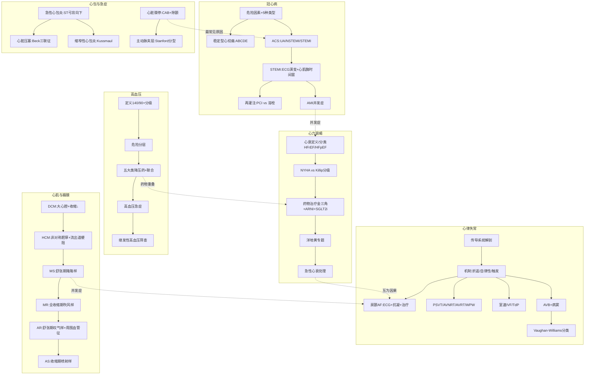

# 内科学·循环系统 — 三源整合讲练手册

> **batch024-B** | 教师重点导向 | 绿皮书+贺银成+昭昭三源整合 | 期末考专用

---

## 📐 循环系统考点地图



---

## 第2章 心力衰竭

### 考点 2.1：心衰定义与分类 【Tier 1 核心考点】

#### 📖 三源讲解

**🧬 核心概念**

心力衰竭是各种心脏结构或功能性疾病导致心室充盈和/或射血功能受损，心排血量不能满足机体组织代谢需要，以肺循环和/或体循环淤血、器官组织血液灌注不足为临床表现的一组综合征。[源:教材《内科学》第10版P162-P163]

**按LVEF分类（2021 ESC指南）：**
| 类型 | LVEF标准 | 特征 |
|:----:|:--------:|------|
| **HFrEF**（射血分数降低） | LVEF ≤40% | 收缩功能显著减退，循证治疗最充分 |
| **HFmrEF**（射血分数轻度降低） | LVEF 41%-49% | 中间地带，治疗方案向HFrEF靠拢 |
| **HFpEF**（射血分数保留） | LVEF ≥50% | 舒张功能不全为主，有结构性心脏病证据 |

**心衰分期（A/B/C/D四期）：**
| 分期 | 特征 | 举例 |
|:----:|------|------|
| A期 | 有心衰危险因素，无结构异常 | 高血压、糖尿病、冠心病 |
| B期 | 有结构异常，无症状 | 既往心梗、LVH、无症状瓣膜病 |
| C期 | 有结构异常+症状 | 呼吸困难、水肿 |
| D期 | 终末期/难治性心衰 | 需特殊干预（LVAD/心脏移植） |

**🔍 机制理解**

心衰病理生理核心链条：
```
心排血量↓ → 神经体液代偿激活：
  ├─ 交感神经↑ → NE↑ → HR↑ + 血管收缩 + 心肌耗氧↑ → 恶性循环
  ├─ RAAS↑ → AngⅡ↑ + ALD↑ → 水钠潴留 + 心肌纤维化 + 血管收缩
  └─ 利钠肽系统↑ → ANP/BNP↑ → 代偿性利尿扩血管（但不足以对抗RAAS）
→ 心室重构 → 心肌细胞肥大/凋亡/纤维化 → 心功能持续恶化
```

**💡 考试角度**

| 来源 | 要点 |
|------|------|
| 🟢 绿皮书 | NYHA分级与Killip分级的区别是必考点；HFrEF vs HFpEF的鉴别诊断和不同治疗策略 |
| 🟡 贺银成 | 心衰分期(A/B/C/D)与分级(NYHA I-IV)对比记忆；BNP/NT-proBNP切点值(BNP>400pg/ml或NT-proBNP>450/900/1800pg/ml按年龄分层) |
| 🔵 昭昭 | 题眼："劳力性呼吸困难→左心衰最早症状"；"颈静脉怒张+肝大+水肿→右心衰" |

**⚠️ 易混淆**

| 对比维度 | NYHA分级 | Killip分级 |
|----------|----------|------------|
| **适用场景** | **慢性心衰**/非AMI | **急性心肌梗死**后心功能 |
| I级 | 日常活动不受限 | 无心衰表现 |
| II级 | 日常活动轻度受限 | 肺部啰音<50%肺野 |
| III级 | 日常活动明显受限 | 肺部啰音>50%肺野（急性肺水肿） |
| IV级 | 休息时也有症状 | 心源性休克 |

#### 📝 例题印证

**【例1·绿皮书】** [源:人卫习题集 P45 第3题]

> 男性，68岁，高血压病史20年，近1年出现活动后气促，夜间阵发性呼吸困难。查体：BP 150/90mmHg，双肺底可闻及细湿啰音，心界向左下扩大，心率96次/分，律齐。最可能的诊断是：

A. 支气管哮喘  
B. 慢性阻塞性肺疾病  
C. 左心衰竭  
D. 右心衰竭  
E. 心包积液  

**解析**：选C。夜间阵发性呼吸困难+双肺底湿啰音=左心衰典型肺淤血表现。心界向左下扩大提示左室扩大。高血压是心衰最常见基础病因。支气管哮喘无心脏体征；COPD以慢性咳嗽咳痰为主；右心衰以体循环淤血为主；心包积液有奇脉/心音遥远。（技巧：心衰题→先分左右→左=肺淤血，右=体循环淤血）

**【例2·贺银成真题】** [源:贺银成真题 2018N68]

> 下列哪项不是慢性心力衰竭的药物治疗"金三角"？

A. ACEI/ARB  
B. β受体阻滞剂  
C. 醛固酮受体拮抗剂  
D. 钙通道阻滞剂  
E. （以上都不是）

**解析**：选D。慢性HFrEF"金三角"=ACEI/ARB + β受体阻滞剂 + 醛固酮受体拮抗剂（螺内酯/依普利酮）。CCB（除氨氯地平/非洛地平外）在心衰中不改善预后，非二氢吡啶类CCB（维拉帕米/地尔硫䓬）有负性肌力作用，HFrEF禁用。

---

### 考点 2.2：慢性心衰药物治疗 【Tier 1 核心考点】

#### 📖 三源讲解

**🧬 核心概念**

慢性HFrEF药物治疗已从"金三角"演进为"新四联"：[源:教材《内科学》第10版P172-P176]

| 药物类别 | 代表药物 | 机制 | 获益证据 |
|----------|---------|------|:--------:|
| **ARNI** | 沙库巴曲缬沙坦 | 抑制脑啡肽酶+阻断AT1 | 比依那普利降低心血管死亡20% |
| **β阻滞剂** | 美托洛尔/比索洛尔/卡维地洛 | 抑制交感、减慢心率、抗重构 | 降低全因死亡34% |
| **MRA** | 螺内酯/依普利酯 | 阻断醛固酮→抗纤维化 | 降低死亡30% |
| **SGLT2i** | 达格列净/恩格列净 | 渗透性利尿+代谢改善 | 降低心衰住院25-30% |

**🔍 机制理解**

ARNI = 沙库巴曲（脑啡肽酶抑制剂→提高利钠肽水平） + 缬沙坦（ARB）。双靶点同时增强利钠肽系统+抑制RAAS。PARADIGM-HF试验奠定其一线地位。

SGLT2抑制剂在心衰中的获益独立于降糖作用——通过促进酮体利用改善心肌能量代谢、减轻氧化应激、改善内皮功能。

**💡 考试角度**

| 来源 | 要点 |
|------|------|
| 🟢 绿皮书 | 常用药物起始剂量和目标剂量（如美托洛尔缓释片起始23.75mg qd→靶剂量190mg qd）；用药顺序：先利尿改善症状→加ACEI/ARNI→加β阻滞→加MRA→加SGLT2i |
| 🟡 贺银成 | **禁忌证重点**：β阻滞剂禁用于严重心动过缓/二度及以上AVB/急性心衰；ACEI禁用于双侧肾动脉狭窄/肌酐>265μmol/L/高钾；螺内酯禁用于肌酐>221μmol/L或血钾>5.0mmol/L |
| 🔵 昭昭 | "干冷→湿冷→干暖→湿暖"血流动力学分型；"肺淤血=湿，灌注不足=冷" |

#### 📝 例题印证

**【例1·绿皮书】** [源:人卫习题集 P47]

> HFrEF患者，LVEF=30%，已使用呋塞米、培哚普利、美托洛尔、螺内酯，仍有症状。下一步最佳治疗是：

A. 加用地高辛  
B. 将培哚普利换为沙库巴曲缬沙坦  
C. 加用维拉帕米  
D. 加用多巴胺  
E. 加用氢氯噻嗪  

**解析**：选B。金三角后仍有症状→将ACEI换为ARNI（沙库巴曲缬沙坦），进一步降低死亡。地高辛仅改善症状不改善预后；维拉帕米有负性肌力禁用于HFrEF；多巴胺仅急性期用。

**【例2·贺银成真题】** [源:贺银成真题]

> 关于SGLT2抑制剂在心力衰竭中的应用，下列哪项正确？

A. 仅适用于合并糖尿病的心衰患者  
B. 主要机制是降糖后间接改善心功能  
C. 可降低HFrEF患者的心血管死亡和心衰住院风险  
D. 禁用于LVEF<30%的患者  
E. 主要不良反应为尖端扭转型室速  

**解析**：选C。SGLT2i的心衰获益独立于降糖作用（DAPA-HF/EMPEROR-Reduced试验），无论是否合并糖尿病均获益。主要不良反应为生殖泌尿道感染和酮症酸中毒。

---

## 第3章 心律失常

### 考点 3.1：正常传导系统与心律失常机制 【Tier 1 核心考点】

#### 📖 三源讲解

**🧬 核心概念**

心脏传导系统：[源:教材《内科学》第10版P188-P190]
```
窦房结（60-100次/分，正常起搏点）
  ↓ 前/中/后结间束
房室结（40-60次/分，生理性延迟→保证心房先收缩）
  ↓ His束
左右束支
  ↓
浦肯野纤维（20-40次/分，最快传导速度）
```

**心律失常三大发生机制：**
| 机制 | 核心 | 代表疾病 |
|------|------|----------|
| **折返** | 存在两条传导速度和不应期不同的通路→形成环路 | AVNRT/AVRT/房扑/房颤/VT/VF |
| **自律性↑** | 异位起搏点4相自动除极加速 | 房早/室早/加速性室性自主心律 |
| **触发活动** | 后除极（EAD/DAD）达阈电位 | TdP（EAD）/洋地黄中毒（DAD） |

**💡 考试角度**

| 来源 | 要点 |
|------|------|
| 🟢 绿皮书 | 折返三要素：两条通路+单向阻滞+传导延迟；心电图各波形对应生理事件（P波=心房除极，QRS=心室除极，T波=心室复极） |
| 🟡 贺银成 | 正常PR间期120-200ms，QRS<120ms，QTc<440ms(男)/460ms(女) |
| 🔵 昭昭 | "自律性=自己跳，折返=转圈跑，触发=后劲足" |

---

### 考点 3.2：房颤（AF）【Tier 1 核心考点】

#### 📖 三源讲解

**🧬 核心概念**

心房颤动是最常见的持续性心律失常。[源:教材《内科学》第10版P193-P197]

**ECG特点（三大特征）**：
1. **P波消失** → 代之以小而不规则的f波（频率350-600次/分）
2. **RR间期绝对不等**（心室率极不规则）
3. QRS波形态通常正常（室内差异性传导时可增宽）

**临床分类：**
| 类型 | 定义 |
|:----:|------|
| 阵发性 | 发作≤7天，可自行终止 |
| 持续性 | 发作>7天，需药物/电复律终止 |
| 长期持续性 | 持续>1年，仍计划节律控制 |
| 永久性 | 患者/医生接受房颤状态，不再追求节律控制 |

**🔍 机制理解**

房颤触发灶80-90%位于肺静脉口附近→肺静脉隔离（PVI）是导管消融的基石。房颤持续→心房电重构和结构重构→"房颤促房颤"。

**治疗三支柱：**
```
房颤管理三个支柱（ABC pathway）：
├─ A（Anticoagulation/卒中预防）：CHA₂DS₂-VASc评分指导
├─ B（Better symptom control）：室率控制 vs 节律控制
└─ C（Comorbidities/CV risk）：心血管合并症管理
```

**抗凝决策：**
| CHA₂DS₂-VASc | 建议 |
|:------------:|------|
| 男0分/女1分 | 无需抗凝 |
| 男1分/女2分 | 考虑抗凝 |
| ≥男2分/女3分 | **必须抗凝** |

**💡 考试角度**

| 来源 | 要点 |
|------|------|
| 🟢 绿皮书 | 房颤ECG判读三大要点必须掌握；华法林目标INR 2.0-3.0；NOAC（达比加群/利伐沙班/阿哌沙班/依度沙班）无需监测INR |
| 🟡 贺银成 | CHA₂DS₂-VASc口诀：CHF(1)+HTN(1)+Age≥75(2)+DM(1)+Stroke/TIA(2)+Vascular(1)+Age65-74(1)+Sex♀(1)；HAS-BLED≥3为高出血风险 |
| 🔵 昭昭 | 题眼："心音强弱不等+脉搏短绌+心律绝对不齐"三句话=房颤 |

**⚠️ 易混淆**

| 对比维度 | 房颤（AF） | 房扑（AFL） |
|----------|-----------|------------|
| 心房率 | 350-600次/分 | 250-350次/分 |
| ECG特点 | f波，RR绝对不齐 | 锯齿波（F波），RR可规则或不规则 |
| 典型折返环 | 肺静脉触发 | 三尖瓣峡部依赖 |
| 消融成功率 | 70-80%（PVI） | >90%（三尖瓣峡部线性消融） |

#### 📝 例题印证

**【例1·绿皮书】** [源:人卫习题集]

> 女性，72岁，心悸1天。ECG示：P波消失，代之以f波，RR间期绝对不齐，心室率120次/分。既往高血压病史，无卒中史。最佳抗凝策略是：

A. 无需抗凝（CHA₂DS₂-VASc=0分）  
B. 阿司匹林100mg qd  
C. 华法林（目标INR 2.0-3.0）  
D. 氯吡格雷75mg qd  
E. 双联抗血小板  

**解析**：选C。CHA₂DS₂-VASc=高血压(1)+年龄≥65(1)+女性(1)=3分（女≥3分必须抗凝）。阿司匹林/抗血小板药不推荐用于房颤卒中预防。NOAC也可选，但选项中无。

**【例2·贺银成真题】** [源:贺银成真题]

> 预激综合征合并房颤时，禁用的药物是：

A. 普鲁卡因胺  
B. 胺碘酮  
C. 洋地黄  
D. 伊布利特  
E. 氟卡尼  

**解析**：选C。预激合并房颤时，洋地黄和维拉帕米可缩短旁路不应期→加速旁路传导→诱发室颤。应选用延长旁路不应期的药物（普鲁卡因胺/伊布利特）或电复律。

---

### 考点 3.3：阵发性室上速与预激综合征 【Tier 1 核心考点】

#### 📖 三源讲解

**🧬 核心概念**

**AVNRT（房室结折返性心动过速）** vs **AVRT（房室折返性心动过速）**：[源:教材《内科学》第10版P202-P208]

| 对比维度 | AVNRT（占PSVT 60%） | AVRT/WPW（占PSVT 30%） |
|----------|---------------------|-------------------------|
| 折返环路 | 房室结内双径路（快径+慢径） | 房室结+旁路（Kent束等） |
| 心率 | 150-250次/分 | 150-250次/分 |
| P波 | 隐藏在QRS内或紧随QRS（假性S波/R'波） | 在QRS之后，RP>70ms |
| 窦律ECG | 正常 | **PR短+δ波+QRS宽**=WPW |
| 急症处理 | 腺苷6-12mg iv（首选） | 同AVNRT（顺向型） |

**WPW综合征诊断三要素：**
1. PR间期<120ms
2. QRS波起始部粗钝（δ波）
3. QRS时限>120ms

**🔍 机制理解**

AVNRT典型（慢-快型）：慢径前传→快径逆传（占90%）。兴奋经慢径下传至心室，同时经快径逆传回心房→形成折返。

**急症处理流程：**
```
血流动力学稳定：
  → 刺激迷走神经（Valsalva/颈动脉窦按摩/面部冰敷）
  → 腺苷 6mg iv → 12mg iv（无效时）
  → 维拉帕米/地尔硫䓬
  → 普罗帕酮/胺碘酮

血流动力学不稳定：
  → 同步直流电复律（50-100J）
```

**💡 考试角度**

| 来源 | 要点 |
|------|------|
| 🟢 绿皮书 | Valsalva动作是改良版（卧位→半卧位+用力吹气），成功率更高；腺苷半衰期极短（<10秒），副作用短暂（面红/呼吸困难/胸痛） |
| 🟡 贺银成 | WPW定位：δ波方向+V1/V2主波方向判断旁路位置（左侧/右侧/后间隔）；**预激合并房颤→禁用洋地黄和维拉帕米**（此条必考） |
| 🔵 昭昭 | 题眼："突发突止+规则心动过速+年轻患者"=PSVT |

#### 📝 例题印证

**【例1·绿皮书】**

> 男性，25岁，反复发作心悸2年，每次持续数十分钟，可自行终止。ECG示：心率180次/分，QRS波正常，未见明显P波。最可能的诊断是：

A. 窦性心动过速  
B. 心房颤动  
C. AVNRT  
D. 室性心动过速  
E. 心房扑动  

**解析**：选C。年轻患者+突发突止+规则心动过速+窄QRS+无P波（P波隐藏在QRS中）=典型AVNRT。窦速有心率逐渐变化，且可见P波。室速QRS宽大畸形。

---

### 考点 3.4：室性心律失常与AVB 【Tier 1 核心考点】

#### 📖 三源讲解

**🧬 核心概念**

**室性心动过速（VT）ECG特征**：[源:教材《内科学》第10版P211-P215]
- 宽QRS（≥120ms）
- 房室分离（关键诊断依据！）
- 心室夺获/室性融合波（确诊依据）
- 心率100-250次/分

**尖端扭转型室速（TdP）：** QT间期延长（获得性/先天性）+独特的心电图形态（QRS波尖端围绕等电位线扭转）。**治疗首选硫酸镁**，禁用Ⅰa/Ⅰc/Ⅲ类抗心律失常药（会进一步延长QT）。

**心室颤动（VF）：** 最致命的心律失常→立即**非同步电除颤**（200J双相波起步）。

**房室传导阻滞（AVB）：**
| 类型 | ECG特点 | PR间期 | 治疗 |
|:----:|---------|:------:|------|
| 一度 | PR延长>200ms，所有P波下传 | 固定延长 | 一般无需治疗 |
| 二度Ⅰ型(文氏) | PR逐渐延长→P波脱落 | 进行性延长 | 一般无需起搏 |
| 二度Ⅱ型(莫氏) | PR固定，突然P波脱落 | 固定 | **需起搏器** |
| 三度 | P与QRS完全无关，各自独立 | 不固定 | **必须起搏器** |

**病态窦房结综合征（SSS）：** 窦性停搏/窦房阻滞/快慢综合征（阵发房速/房颤+窦性停搏/窦缓交替）。

**Vaughan-Williams抗心律失常药物分类：**
| 类别 | 机制 | 代表药物 | 关键考点 |
|:----:|------|----------|----------|
| Ia | Na通道阻滞(中等) | 奎尼丁/普鲁卡因胺 | 延长复极 |
| Ib | Na通道阻滞(弱) | 利多卡因/美西律 | 缩短复极，仅作用心室 |
| Ic | Na通道阻滞(强) | 普罗帕酮/氟卡尼 | CAST试验→器质性心脏病禁用 |
| II | β受体阻滞 | 美托洛尔/艾司洛尔 | 降低交感张力 |
| III | K通道阻滞 | 胺碘酮/索他洛尔/伊布利特 | 延长复极（QT延长风险） |
| IV | Ca通道阻滞(非DHP) | 维拉帕米/地尔硫䓬 | 减慢房室结传导 |

**💡 考试角度**

| 来源 | 要点 |
|------|------|
| 🟢 绿皮书 | 宽QRS心动过速鉴别（Brugada四步法/Wellens标准）；室速=宽QRS+房室分离+心室夺获 |
| 🟡 贺银成 | 二度Ⅰ型 vs 二度Ⅱ型：Ⅰ型良性(部位在房室结)、Ⅱ型恶性(部位在His束以下)；三度AVB心电图"P波与QRS各自为政" |
| 🔵 昭昭 | 题眼："宽QRS心动过速→先按室速处理"；"长QT+多形室速→TdP→硫酸镁" |

#### 📝 例题印证

**【例1·绿皮书】**

> ECG示：PR间期逐渐延长，直至一个P波后脱落QRS波群，如此周而复始。诊断为：

A. 一度房室传导阻滞  
B. 二度Ⅰ型房室传导阻滞  
C. 二度Ⅱ型房室传导阻滞  
D. 三度房室传导阻滞  
E. 病态窦房结综合征  

**解析**：选B。PR逐渐延长→P波脱落=文氏现象=二度Ⅰ型AVB（部位通常在房室结，预后较好）。二度Ⅱ型PR固定不变而突然脱落（His束以下，预后差需起搏）。

---

## 第4章 动脉粥样硬化和冠状动脉粥样硬化性心脏病

### 考点 4.1：冠心病分型与稳定型心绞痛 【Tier 1 核心考点】

#### 📖 三源讲解

**🧬 核心概念**

冠心病危险因素——"五高+一男性"：高血压、高血脂、高血糖、高体重、高年龄 + 男性 > 女性。[源:教材《内科学》第10版P224-P225]

**冠心病的5种临床表现类型：**
1. 隐匿型/无症状心肌缺血
2. **稳定型心绞痛**
3. 缺血性心肌病
4. **急性冠脉综合征（ACS）**→包含UA/NSTEMI/STEMI
5. 心脏性猝死

**稳定型心绞痛典型胸痛特点：**
- **诱因**：劳力/情绪激动（耗氧增加）
- **性质**：压榨性/紧缩感/闷痛（非刺痛）
- **部位**：胸骨后/心前区，可放射至左肩、左臂内侧→小指与无名指
- **持续时间**：3-5分钟（<1分钟不考虑，>30分钟警惕心梗）
- **缓解方式**：休息或含服硝酸甘油（1-3分钟起效）

**🔍 机制理解**

稳定型心绞痛=固定性冠脉狭窄（狭窄≥50-70%）→静息时血流尚可→劳力时心肌耗氧↑→供需失衡→心绞痛。斑块稳定，不易破裂。

**ABCDE方案：**
| 字母 | 内容 | 措施 |
|:----:|------|------|
| A | Aspirin+Anti-anginal | 阿司匹林+硝酸酯/β阻滞/CCB |
| B | Beta-blocker+BP | β阻滞剂+控制血压 |
| C | Cholesterol+Cigarette | 他汀降脂+戒烟 |
| D | Diet+Diabetes | 饮食控制+糖尿病管理 |
| E | Education+Exercise | 健康教育+适当运动 |

**💡 考试角度**

| 来源 | 要点 |
|------|------|
| 🟢 绿皮书 | 稳定型心绞痛诊断：首选ECG（发作时ST段压低）；确诊：冠脉CTA/冠脉造影（金标准）；负荷试验阳性标准 |
| 🟡 贺银成 | **心绞痛 vs 心肌梗死胸痛鉴别**：硝酸甘油是否缓解是最关键鉴别点；心绞痛程度与冠状动脉狭窄程度不总成正比 |
| 🔵 昭昭 | "劳力性+压榨性+含服硝酸甘油缓解"=稳定型心绞痛三要素 |

#### 📝 例题印证

**【例1·绿皮书】**

> 男性，58岁，爬楼梯时出现胸骨后压榨感，休息3分钟后缓解。最可能的诊断是：

A. 不稳定型心绞痛  
B. 稳定型心绞痛  
C. 急性心肌梗死  
D. 心脏神经症  
E. 肋间神经痛  

**解析**：选B。劳力诱发+休息数分钟缓解=稳定型心绞痛的典型表现。不稳定型心绞痛可为静息发作或加重型；心梗持续>30分钟不缓解。

---

### 考点 4.2：急性冠脉综合征（ACS）【Tier 1 核心考点】

#### 📖 三源讲解

**🧬 核心概念**

ACS = UA + NSTEMI + STEMI。共同机制：**不稳定斑块破裂/糜烂→血小板聚集+血栓形成**。[源:教材《内科学》第10版P242-P249]

| 类型 | 定义 | ECG | 心肌酶 | 治疗策略 |
|:----:|------|:---:|:------:|----------|
| UA | 缺血症状，无心肌坏死 | ST↓/T倒 | 正常 | 抗栓（DAPT+抗凝） |
| NSTEMI | 非透壁心梗 | ST↓/T倒 | **↑**(cTn) | 抗栓+早期介入(24h) |
| STEMI | 透壁心梗 | **ST↑** | **↑**(cTn) | **紧急再灌注**(PCI<90min) |

**🔍 机制理解**

STEMI：冠脉完全闭塞→透壁缺血→ST段抬高（损伤电流学说）。NSTEMI/UA：冠脉次全闭塞→心内膜下缺血→ST段压低。

**心肌酶谱（按时间顺序）：**
| 标志物 | 开始升高 | 峰值 | 恢复正常 | 特异性 |
|--------|:-------:|:----:|:--------:|:------:|
| 肌红蛋白（Mb） | 1-2h | 6-9h | 24-48h | 低（最早升高） |
| **cTnI/cTnT** | 3-4h | 12-24h | 7-14天 | **最高（金标准）** |
| CK-MB | 4-6h | 12-24h | 48-72h | 高（判断再梗） |

**ECG动态演变（STEMI）：**
```
超急期(数分钟-数小时)：T波高尖
急性期(数小时-2周)：ST段弓背向上抬高+病理性Q波出现
亚急性期(数周-数月)：ST段回落+T波倒置
陈旧期：病理性Q波残留（永久性）
```

**STEMI定位诊断：**
| 梗死部位 | 受累冠脉 | ECG导联 |
|----------|----------|---------|
| 前间壁 | LAD近段 | V1-V3 |
| 前壁 | LAD中段 | V3-V5 |
| 广泛前壁 | LAD近段 | V1-V6 |
| 下壁 | RCA(80%)/LCX(20%) | II、III、aVF |
| 后壁 | LCX/RCA | V7-V9（V1-V2对应性改变） |
| 右室 | RCA近段 | V3R-V5R |

**💡 考试角度**

| 来源 | 要点 |
|------|------|
| 🟢 绿皮书 | STEMI治疗核心=时间就是心肌；溶栓适应证：发病<12h+无禁忌证；禁忌证口诀：出血/手术/脑卒中/主动脉夹层 |
| 🟡 贺银成 | 再灌注策略：PCI优于溶栓（开通率高+出血风险低）；溶栓再通标准（4条）；补救PCI：溶栓失败后 |
| 🔵 昭昭 | "持续胸痛>30min+硝酸甘油无效"=心梗；"II III aVF ST抬高+低血压"=右室梗死（禁用硝酸甘油+利尿，需补液） |

#### 📝 例题印证

**【例1·绿皮书】**

> 男性，62岁，持续胸骨后剧烈压榨痛2小时，含服硝酸甘油无效。ECG示：V1-V4导联ST段弓背向上抬高。首选治疗是：

A. 静脉溶栓  
B. 急诊PCI  
C. 硝酸甘油静滴  
D. 吗啡镇痛  
E. 急诊CABG  

**解析**：选B。STEMI发病2小时，直接PCI（<12h）优于溶栓。目前指南推荐首次医疗接触至球囊扩张（FMC-to-balloon）<90分钟。溶栓仅在无PCI能力且转运时间>120分钟时考虑。

---

### 考点 4.3：心梗并发症与二级预防 【Tier 1 核心考点】

#### 📖 三源讲解

**AMI并发症：**
| 并发症 | 发生时间 | 临床特征 |
|--------|:--------:|----------|
| 乳头肌功能失调/断裂 | 1-7天 | 心尖部新出现收缩期杂音→急性肺水肿 |
| 室间隔穿孔 | 3-5天 | 胸骨左缘新出现响亮的收缩期杂音+震颤→心衰/休克 |
| 心脏游离壁破裂 | 3-7天 | 心包积血→急性心脏压塞→**电机械分离→猝死** |
| 室壁瘤 | 数周-数月 | 心尖抬举性搏动+ST段持续抬高>2周+矛盾运动 |
| 梗死后综合征(Dressler) | 数周-数月 | 发热+心包炎+胸膜炎（自身免疫性） |

**心梗后二级预防（ABCDE）：** 双抗（DAPT 6-12个月）+ ACEI/ARB + β阻滞剂 + 他汀 + 生活方式干预

#### 📝 例题印证

**【例1·贺银成真题】**

> 急性心梗后第5天，心前区突然出现响亮的收缩期杂音，伴震颤和急性肺水肿。最可能的诊断是：

A. 乳头肌断裂  
B. 室间隔穿孔  
C. 心脏破裂  
D. 急性心包炎  
E. Dressler综合征  

**解析**：选B。心梗后3-5天+响亮杂音+震颤=室间隔穿孔（肌部室间隔缺血坏死穿孔）。乳头肌断裂也有杂音但无震颤且以二尖瓣反流为主，杂音在心尖部。

---

## 第5章 高血压

### 考点 5.1：高血压定义、分级与危险分层 【Tier 1 核心考点】

#### 📖 三源讲解

**🧬 核心概念**

**高血压定义与分级**（诊室血压）：[源:教材《内科学》第10版P260-P262]

| 类别 | 收缩压(mmHg) | 舒张压(mmHg) |
|------|:------------:|:------------:|
| 理想血压 | <120 | <80 |
| 正常高值 | 120-139 | 80-89 |
| **1级高血压(轻度)** | 140-159 | 90-99 |
| **2级高血压(中度)** | 160-179 | 100-109 |
| **3级高血压(重度)** | ≥180 | ≥110 |
| 单纯收缩期高血压 | ≥140 | <90 |

**危险分层（按血压分级+危险因素+靶器官损害+临床合并症）：**

|  | 1级 | 2级 | 3级 |
|:--|:---:|:---:|:---:|
| 无其他危险因素 | 低危 | 中危 | 高危 |
| 1-2个危险因素 | 中危 | 中危 | 极高危 |
| ≥3个危险因素/靶器官损害/糖尿病 | 高危 | 高危 | 极高危 |
| 临床合并症/CKD≥4期 | 极高危 | 极高危 | 极高危 |

**💡 考试角度**

| 来源 | 要点 |
|------|------|
| 🟢 绿皮书 | 诊断需非同日3次测量均≥140/90mmHg；家庭自测血压≥135/85mmHg；动态血压：24h均值≥130/80mmHg |
| 🟡 贺银成 | 老年高血压特点：单纯收缩期高血压为主+脉压大+血压波动大；降压目标：一般<140/90，老年人<150/90，糖尿病/CKD/冠心病<130/80 |
| 🔵 昭昭 | "高血压=140/90是一道线，跨过去就是高血压" |

---

### 考点 5.2：五大类降压药与联合用药 【Tier 1 核心考点】

#### 📖 三源讲解

**五大类（+1）降压药适应证与禁忌证**：[源:教材《内科学》第10版P266-P270]

| 类别 | 代表药 | 首选适应证 | 绝对禁忌证 |
|------|--------|-----------|------------|
| **ACEI** | 培哚普利/贝那普利 | 心衰/心梗后/糖尿病肾病/蛋白尿 | 双侧肾动脉狭窄/高钾/妊娠 |
| **ARB** | 缬沙坦/厄贝沙坦 | 同ACEI（不能耐受ACEI时） | 同ACEI（无干咳副作用） |
| **CCB**(DHP) | 氨氯地平/硝苯地平 | 老年/单纯收缩期高血压/卒中 | — |
| **CCB**(非DHP) | 维拉帕米/地尔硫䓬 | 心绞痛/房颤室率控制 | 心衰/AVB/病窦 |
| **利尿剂**(噻嗪) | 氢氯噻嗪 | 老年/盐敏感性/心衰 | 痛风 |
| **β阻滞剂** | 美托洛尔/比索洛尔 | 冠心病/心梗后/心衰(稳定后) | 哮喘/AVB/周围血管病 |
| **MRA**(醛固酮拮抗) | 螺内酯 | 顽固性高血压/原醛 | 高钾/肾衰 |

**🔍 机制理解**

**推荐联合方案：** ACEI/ARB + CCB（DHP） / ACEI/ARB + 利尿剂 / CCB + 利尿剂

**ACEI干咳机制：** 抑制激肽酶→缓激肽蓄积→咳嗽。发生率约10-20%，换用ARB可避免。

#### 📝 例题印证

**【例1·绿皮书】**

> 高血压合并痛风患者，降压治疗应避免使用：

A. 氨氯地平  
B. 美托洛尔  
C. 氢氯噻嗪  
D. 缬沙坦  
E. 培哚普利  

**解析**：选C。噻嗪类利尿剂抑制尿酸排泄→血尿酸升高→诱发/加重痛风。痛风患者首选ARB（氯沙坦有促尿酸排泄作用）或CCB。

---

### 考点 5.3：高血压急症与继发性高血压 【Tier 1 核心考点】

#### 📖 三源讲解

**高血压急症 vs 亚急症**：[源:教材《内科学》第10版P271-P274]

|  | 急症（Emergency） | 亚急症（Urgency） |
|:--|:---|:---|
| 定义 | BP显著升高+**急性靶器官损害** | BP显著升高+**无**急性靶器官损害 |
| 靶器官 | 脑(脑卒中/脑病)、心脏(心衰/ACS)、肾(急性肾衰)、主动脉(夹层)、眼底(出血/水肿) | 无 |
| 处理 | **静脉用药**（1小时内降压） | 口服药物（24-48h缓慢降压） |
| 目标 | 首小时降25%，2-6h降至160/100 | 数天内降至目标 |

**常用静脉降压药：**
| 药物 | 特点 | 首选用途 |
|------|------|----------|
| **硝普钠** | 扩张动脉+静脉，即刻起效 | 大多数急症（主动脉夹层除外） |
| **乌拉地尔** | α1阻滞+中枢5-HT1A激动 | 脑卒中/围手术期 |
| 艾司洛尔 | 超短效β阻滞 | 主动脉夹层（联合硝普钠） |
| 硝酸甘油 | 扩张静脉>动脉 | ACS合并高血压 |

**继发性高血压筛查线索：**
| 病因 | 筛查线索 | 确诊检查 |
|------|----------|----------|
| 肾实质性 | 尿检异常+肾功异常 | 肾脏B超/活检 |
| 肾动脉狭窄 | 腹部血管杂音+ACEI/ARB后肌酐↑ | 肾动脉超声/CTA/DSA |
| 原发性醛固酮增多症 | **低钾+高血压** | ARR比值(醛固酮/肾素) |
| 嗜铬细胞瘤 | **阵发性高血压+头痛心悸出汗三联征** | 血/尿儿茶酚胺代谢产物 |
| 库欣综合征 | 向心性肥胖+紫纹 | 血皮质醇/地塞米松抑制试验 |
| 主动脉缩窄 | **上肢高血压+下肢低血压** | CTA/MRA |
| OSAHS | 肥胖+打鼾+白天嗜睡 | 多导睡眠图 |

#### 📝 例题印证

**【例1·绿皮书】**

> 年轻女性，30岁，血压阵发性升高达200/120mmHg，伴剧烈头痛、心悸、出汗，发作后血压正常。最可能的诊断是：

A. 原发性高血压  
B. 肾动脉狭窄  
C. 嗜铬细胞瘤  
D. 原发性醛固酮增多症  
E. 库欣综合征  

**解析**：选C。年轻+阵发性高血压+头痛心悸出汗三联征=嗜铬细胞瘤典型表现。原醛表现为持续性高血压+低钾；肾动脉狭窄表现为持续性高血压+腹部杂音。

---

## 第6章 心肌疾病

### 考点 6.1：扩张型心肌病（DCM）与肥厚型心肌病（HCM）【Tier 1 核心考点】

#### 📖 三源讲解

**🧬 核心概念**

**扩张型心肌病（DCM）**：以左室或双心室扩大伴收缩功能障碍为特征，无法以负荷异常或心肌缺血等解释。[源:教材《内科学》第10版P278-P281]

**肥厚型心肌病（HCM）**：以非对称性心室肥厚为特征，最常累及室间隔基底部→左室流出道梗阻。[源:教材《内科学》第10版P275-P278]

**两大心肌病对比表：**
| 对比维度 | DCM | HCM |
|----------|-----|-----|
| 核心病理 | 心脏扩大+收缩功能↓ | 非对称性室间隔肥厚→流出道梗阻 |
| UCG特征 | 大心腔+薄室壁+弥漫性运动减弱 | 室间隔/后壁厚度>1.3(1.5)+SAM征 |
| 临床表现 | 充血性心衰为主 | 呼吸困难/胸痛/晕厥/猝死 |
| 杂音特点 | 心尖部收缩期杂音(二尖瓣反流) | 胸骨左缘3-4肋间收缩期喷射性 |
| 杂音变化 | 心衰好转→杂音减弱 | **Valsalva/站立/硝酸甘油→增强** |
| | | **蹲踞/握拳/去甲肾上腺素→减弱** |
| 禁用药物 | CCB(非DHP)负性肌力 | **洋地黄/硝酸酯/多巴胺/ACEI** |
| 治疗核心 | 心衰标准治疗+抗凝+CRT/ICD | β阻滞剂/非DHP-CCB+ICD |

**🔍 机制理解**

**HCM杂音变化原理（期末考必考！）：**
```
左室流出道压差 = f(心肌收缩力, 前负荷, 后负荷)

增加压差(杂音↑): 心肌收缩力↑ → 洋地黄✗
                    前负荷↓   → Valsalva/站立/硝酸甘油
                    后负荷↓   → 硝酸酯/运动

降低压差(杂音↓): 心肌收缩力↓ → β阻滞剂✓
                    前负荷↑   → 蹲踞/抬腿
                    后负荷↑   → 握拳/去甲肾上腺素
```

**Brockenbrough-Braunwald-Morrow征**：室早后第一次心跳的动脉压不升反降（HCM有意义的体征）。

**💡 考试角度**

| 来源 | 要点 |
|------|------|
| 🟢 绿皮书 | HCM是青年人心源性猝死最常见原因(尤其是运动员)；HCM ECG：左室高电压+深倒T波+病理性Q波（类似心梗但无动态演变） |
| 🟡 贺银成 | DCM三大临床特征：心衰+栓塞+心律失常；HCM治疗：β阻滞剂一线，无反应加维拉帕米；梗阻严重→室间隔酒精消融/心肌切除术 |
| 🔵 昭昭 | DCM="大而无力"；HCM="厚而有力"；"Valsalva→杂音增强"是HCM最独特的体征 |

#### 📝 例题印证

**【例1·绿皮书】**

> 男性，19岁，大学生，篮球比赛中突发晕厥。查体：胸骨左缘3-4肋间可闻及收缩期喷射性杂音，Valsalva动作后杂音增强。最可能的诊断是：

A. 主动脉瓣狭窄
B. 二尖瓣脱垂
C. 肥厚型心肌病
D. 扩张型心肌病
E. 房间隔缺损

**解析**：选C。年轻人+运动晕厥+胸骨左缘喷射性杂音+Valsalva增强=典型HCM。AS杂音在胸骨右缘第2肋间；二尖瓣脱垂杂音在心尖部且为喀喇音后收缩晚期杂音。

**【例2·贺银成真题】**

> 下列哪类药物禁用于肥厚型梗阻性心肌病？

A. β受体阻滞剂
B. 维拉帕米
C. 洋地黄
D. 丙吡胺
E. 地尔硫䓬

**解析**：选C。洋地黄增强心肌收缩力→加重左室流出道梗阻。β阻滞剂和CCB(非DHP)降低收缩力→可用于HCM治疗。

---

## 第8章 心脏瓣膜病

### 考点 8.1：四种瓣膜病对比 【Tier 1 核心考点】

#### 📖 三源讲解

**🧬 核心概念**

**四种瓣膜病精要对比表**：[源:教材《内科学》第10版P298-P312]

| 对比维度 | **二尖瓣狭窄(MS)** | **二尖瓣关闭不全(MR)** | **主动脉瓣狭窄(AS)** | **主动脉瓣关闭不全(AR)** |
|----------|:---:|:---:|:---:|:---:|
| 最常见病因 | 风湿热 | 二尖瓣脱垂/冠心病 | 退行性钙化(老年)/二叶瓣(青年) | 风湿/二叶瓣/Marfan |
| 病理生理 | 左房压↑→肺淤血→肺动脉高压→右心衰 | 左房+左室容量负荷↑→左室扩大→心衰 | 左室压力负荷↑→向心性肥厚→心衰 | 左室容量负荷↑→离心性肥厚→心衰 |
| **杂音位置** | **心尖部** | **心尖部** | **胸骨右缘第2肋间** | **胸骨左缘3-4肋间** |
| **杂音时期** | **舒张中晚期** | **全收缩期** | **收缩期** | **舒张期** |
| **杂音性质** | **隆隆样(低调)** | **吹风样(高调)** | **喷射样(粗糙)** | **叹气样(递减型)** |
| 传导方向 | 局限(不传导) | 向左腋下 | 向颈部/心尖 | 向心尖 |
| 特征体征 | 开瓣音/Graham-Steell | S3奔马律 | S4(心房收缩) | **Austin-Flint杂音** |
| 并发症 | 房颤/栓塞/IE | IE/心衰 | 猝死/心衰 | IE/心衰 |
| 药物 | 控制心率+利尿 | ACEI+利尿 | 谨慎！避免血管扩张 | ACEI/ARB |
| 手术时机 | PBMV: 瓣口面积<1.5cm² | 有症状+LVEF↓/LVESD↑ | 有症状或LVEF<50% | 有症状或LVEF<50%/LVEDD>65mm |

**🔍 机制理解**

**Graham-Steell杂音**：严重MS→肺动脉高压→肺动脉瓣相对性关闭不全→胸骨左缘第2肋间舒张早期杂音。

**Austin-Flint杂音**：严重AR→反流束冲击二尖瓣前叶→二尖瓣相对性狭窄→心尖部舒张期隆隆样杂音（与MS杂音相似，但无开瓣音+S1不亢进可鉴别）。

**主动脉瓣狭窄三联征**：心绞痛+晕厥+呼吸困难（出现任何一项→平均生存期2-5/3/2年）。

**周围血管征（AR特有）**：
| 体征 | 表现 |
|------|------|
| Musset征 | 点头征（头随心跳摆动） |
| 水冲脉(Corrigan脉) | 脉搏骤起骤落 |
| 枪击音(Traube征) | 股动脉可闻及枪击音 |
| Duroziez双重杂音 | 股动脉加压可闻及收缩期+舒张期杂音 |
| 毛细血管搏动征(Quincke征) | 轻压甲床见毛细血管搏动 |

**💡 考试角度**

| 来源 | 要点 |
|------|------|
| 🟢 绿皮书 | MS最常见的并发症是房颤(不是心衰)；风湿性MS病理改变：瓣叶增厚+交界粘连+腱索缩短融合=鱼口状二尖瓣口 |
| 🟡 贺银成 | 二尖瓣脱垂(MVP)综合征：收缩中期喀喇音+收缩晚期杂音；AS的三个"不"：扩血管不能用、利尿要慎重、洋地黄不常规 |
| 🔵 昭昭 | 题眼："舒张期隆隆样+心尖部"=MS；"舒张期叹气样+周围血管征"=AR；"心尖部全收缩期吹风样→腋下传导"=MR |

**⚠️ 易混淆：AR的Austin-Flint杂音 vs MS的舒张期隆隆样杂音**

| 对比 | Austin-Flint(AR引起) | MS本身 |
|------|:---:|:---:|
| 开瓣音 | 无 | 有(瓣膜弹性好时) |
| S1 | 减弱(AR致二尖瓣提前关闭) | 亢进 |
| 脉搏 | 水冲脉 | 正常或减弱 |
| 超声 | 二尖瓣结构正常 | 二尖瓣狭窄改变 |

#### 📝 例题印证

**【例1·绿皮书】**

> 女性，35岁，风湿性心脏病史。查体：心尖部可闻及舒张中晚期隆隆样杂音，P2亢进，胸骨左缘第2肋间可闻及舒张早期杂音。最可能的诊断是：

A. 单纯二尖瓣狭窄
B. 二尖瓣狭窄合并肺动脉瓣关闭不全(Graham-Steell)
C. 二尖瓣狭窄合并主动脉瓣关闭不全
D. 主动脉瓣狭窄合并二尖瓣关闭不全
E. 房间隔缺损合并肺动脉高压

**解析**：选B。心尖部舒张期隆隆样=MS；胸骨左缘第2肋间舒张早期杂音=肺动脉瓣区杂音。MS→肺动脉高压→肺动脉瓣相对性关闭不全→Graham-Steell杂音。需与MR+AR鉴别：AR杂音在胸骨左缘3-4肋间且为叹气样。

**【例2·贺银成真题】**

> 下列哪项体征对诊断主动脉瓣关闭不全最具特征性意义？

A. 心界向左下扩大
B. 心尖部S1减弱
C. Austin-Flint杂音
D. 水冲脉
E. 胸骨左缘3-4肋间舒张期叹气样递减型杂音

**解析**：选E。AR特征性体征是舒张期叹气样杂音（直接反映主动脉瓣反流）。Austin-Flint和水冲脉为AR的间接体征，虽高度提示但并非直接特征。杂音的位置（胸骨左缘3-4肋间）+时期（舒张期）+性质（叹气样递减型）三者缺一不可。

---

## 第9章 心包疾病

### 考点 9.1：急性心包炎、心脏压塞与缩窄性心包炎 【Tier 1 核心考点】

#### 📖 三源讲解

**🧬 核心概念**

**急性心包炎**：[源:教材《内科学》第10版P313-P317]

| 特征 | 表现 |
|------|------|
| 胸痛 | 胸骨后锐痛，**前倾位缓解**（与心梗鉴别关键！） |
| 心包摩擦音 | 胸骨左缘3-4肋间，搔刮样，**前倾+屏气时最清楚** |
| ECG | **广泛导联ST段弓背向下抬高**（非对应导联改变）+ PR段压低 |
| 治疗 | NSAID(布洛芬/阿司匹林)+秋水仙碱 |

**心脏压塞（Beck三联征）**：
1. **低血压**（心排血量↓）
2. **颈静脉怒张**（静脉回流受阻）
3. **心音遥远**（心包积液阻隔）

**奇脉**：吸气时收缩压下降>10mmHg（心脏压塞最具特征的体征）。

**缩窄性心包炎**：[源:教材《内科学》第10版P318-P320]
- 最常见病因：结核性心包炎
- **Kussmaul征**：吸气时颈静脉压力不降反升（最具特征性！与心脏压塞的奇脉鉴别）
- 心包叩击音（舒张早期心包限制心室充盈）
- 治疗：心包切除术

**⚠️ 易混淆**

| 对比维度 | 心脏压塞 | 缩窄性心包炎 | 限制型心肌病 |
|----------|:---:|:---:|:---:|
| 奇脉 | **有** | 少见 | 少见 |
| Kussmaul征 | 无 | **有** | 有 |
| 心包叩击音 | 无 | **有** | 无 |
| 心包钙化 | 无 | 有(CT可见) | 无 |

**🔍 机制理解**

急性心包炎ECG演变（四期）：
```
I期(数小时-数天)：广泛ST段弓背向下抬高+PR段压低
II期(数天)：ST段回落+ T波低平
III期(数周)：T波倒置
IV期(数月)：ECG恢复正常
```

**鉴别：急性心包炎 vs 急性心梗 ECG：**
| | 心包炎 | STEMI |
|:--|:---|:---|
| ST段形态 | **弓背向下** | **弓背向上** |
| 导联分布 | **广泛**，无对应性改变 | 区域性，有对应性改变 |
| Q波 | 无 | 可有病理性Q波 |
| PR段 | 压低 | 正常 |

#### 📝 例题印证

**【例1·绿皮书】**

> 男性，45岁，胸痛2天，前倾位可缓解。ECG示多个导联ST段弓背向下抬高。最可能的诊断是：

A. 急性心肌梗死
B. 急性心包炎
C. 主动脉夹层
D. 肺栓塞
E. 食管痉挛

**解析**：选B。前倾位缓解+广泛导联ST段弓背向下抬高=急性心包炎典型表现。心梗ST段弓背向上且有对应性改变。

**【例2·贺银成真题】**

> 心脏压塞的Beck三联征不包括：

A. 低血压
B. 颈静脉怒张
C. 心音遥远
D. 奇脉
E. （以上都包括）

**解析**：选D。Beck三联征=低血压+颈静脉怒张+心音遥远。奇脉是心脏压塞的重要体征，但不属于Beck三联征的三个组成之一。

---

## 第11章 心脏骤停与主动脉夹层

### 考点 11.1：心脏骤停与CPR 【Tier 1 核心考点】

#### 📖 三源讲解

**🧬 核心概念**

**心脏骤停**：心脏泵血功能突然停止。[源:教材《内科学》第10版P335-P345]

**最常见原因**：冠心病（占80%），最常见初始心律为室颤（VF）。

**识别**：意识丧失+大动脉搏动消失（颈动脉/股动脉）+呼吸停止或濒死喘息。

**成人基础生命支持（BLS）流程 — CAB：**
```
C(Circulation)：胸外按压
  - 位置：胸骨中下1/3交界处
  - 深度：5-6cm
  - 频率：100-120次/分
  - 保证胸廓充分回弹
  - 按压:通气 = 30:2

A(Airway)：开放气道（仰头抬颏法）

B(Breathing)：人工呼吸（每次>1秒，见胸廓起伏）

D(Defibrillation)：除颤
  - 室颤/无脉性室速 → 非同步电除颤
  - 双相波：120-200J
  - 单相波：360J
  - 除颤后立即继续CPR 2分钟再检查
```

**高级生命支持（ACLS）药物：**
| 药物 | 用途 | 用法 |
|------|------|------|
| **肾上腺素** | 所有心脏骤停 | 1mg iv q3-5min |
| **胺碘酮** | VF/VT除颤无效 | 首剂300mg→150mg iv |
| 利多卡因 | VF/VT（无胺碘酮时） | 1-1.5mg/kg iv |

**💡 考试角度**

| 来源 | 要点 |
|------|------|
| 🟢 绿皮书 | CPR高质量五要素：按压深度/频率/胸廓回弹/中断最小化/避免过度通气；电除颤时机：目击院外骤停→先CPR 1.5-3分钟再除颤(室颤>4-5分钟先行CPR改善心肌氧供) |
| 🟡 贺银成 | 按压:通气比：成人单人/双人均为30:2；儿童单人30:2、双人15:2；新生儿3:1 |
| 🔵 昭昭 | "不到万不得已不中断按压"；"除颤后别摸脉搏→直接按" |

#### 📝 例题印证

**【例1·绿皮书】** [源: 内科学学习指导与习题集 P258-T12]

> 男性，65岁，突发意识丧失，大动脉搏动消失。现场目击者立即开始CPR。关于胸外按压，以下哪项是正确的：
> A. 按压深度3-4cm
> B. 按压频率80-100次/分
> C. 按压:通气 = 15:2
> D. 按压位置在胸骨中下1/3交界处
> E. 按压时手掌可离开胸壁

**解析**：成人CPR按压深度5-6cm（非3-4cm），频率100-120次/分（非80-100），按压:通气=30:2（非15:2），手掌根部紧贴胸壁不可离开（保证胸廓充分回弹）。按压位置为胸骨中下1/3交界处。**D ✅**

**【例2·贺银成真题】** [源: 贺银成讲义上册 P335-345]

> 心脏骤停患者，心电监护示室颤。首先应：
> A. 静脉推注肾上腺素1mg
> B. 静脉推注胺碘酮300mg
> C. 气管插管
> D. 非同步电除颤
> E. 经皮临时起搏

**解析**：室颤/无脉性室速→立即非同步电除颤（双相波120-200J，单相波360J）。肾上腺素和胺碘酮是药物复苏的二线措施；除颤后立即继续CPR 2分钟再检查心律。**D ✅**

---

### 考点 11.2：主动脉夹层 【Tier 1 核心考点】

#### 📖 三源讲解

**🧬 核心概念**

**主动脉夹层**：主动脉内膜撕裂→血液进入血管中层→真假腔形成，沿主动脉长轴剥离。[源:教材《内科学》第10版P336-P340]

**分型：**
| | DeBakey分型 | Stanford分型 |
|:--|:---|:---|
| 累及升主+降主 | I型 | **A型**(累及升主动脈=需急诊手术) |
| 仅升主 | II型 | **A型** |
| 仅降主 | III型(IIIa:膈上/IIIb:膈下) | **B型**(不累及升主=药物/介入) |

**临床表现（最核心）：**
- **突发的撕裂样/刀割样剧痛**（90%以上），胸背部→沿剥离方向迁移
- **双上肢血压不对称**（>20mmHg差值为阳性）
- 主动脉瓣关闭不全（A型累及主动脉根部→舒张期叹气样杂音）
- 心肌缺血/心梗（冠脉开口受累）
- 神经系统症状（无名动脉/颈动脉受累）

**🔍 机制理解**

高危易感因素：Marfan综合征+高血压+二叶主动脉瓣+主动脉缩窄+妊娠。

**诊断：** CTA（首选+金标准，敏感度和特异度均>95%）。TEE（床旁急诊首选）。

**治疗原则：**
```
Stanford A型（累及升主）：
  → 急诊手术（升主动脉置换术）
  → 术前血压心率控制（β阻滞剂+硝普钠）

Stanford B型（仅降主）：
  → 药物治疗（降压+β阻滞剂→目标SBP 100-120mmHg）
  → 并发症（破裂/脏器缺血/难治性疼痛/顽固性高血压）→ TEVAR介入
```

**💡 考试角度**

| 来源 | 要点 |
|------|------|
| 🟢 绿皮书 | 胸痛鉴别诊断四大杀手：AMI+主动脉夹层+肺栓塞+张力性气胸；夹层疼痛无"硝酸甘油可缓解"特征 |
| 🟡 贺银成 | 降压目标：SBP 100-120mmHg(或MAP 60-75mmHg)；先给β阻滞剂降心率→再给硝普钠降压（避免单用硝普钠→反射性心动过速→增加主动脉壁应力） |
| 🔵 昭昭 | 题眼："撕裂样剧痛+双上肢血压不等"=主动脉夹层 |

#### 📝 例题印证

**【例1·绿皮书】**

> 男性，65岁，高血压病史，突发胸骨后撕裂样剧痛，双上肢血压：右上肢180/100mmHg，左上肢130/80mmHg。首选检查是：

A. 心电图
B. 胸部X线
C. 超声心动图
D. CTA
E. D-二聚体

**解析**：选D。撕裂样胸痛+双上肢血压差>20mmHg=高度提示主动脉夹层。CTA为诊断金标准。ECG主要用于排除心梗；TEE可用作床旁快速筛查但CTA仍首选。

---

## Tier 2 延申考点

### T2-1：感染性心内膜炎（IE）【Tier 2 延申考点】

#### 📖 三源讲解

**🧬 核心概念**

感染性心内膜炎是微生物感染心内膜/瓣膜→赘生物形成的严重感染性疾病。[源:教材《内科学》第10版P321-P328]

**分类与病原菌：**
| | 急性IE | 亚急性IE |
|:--|:---|:---|
| 病程 | <6周 | >6周至数月 |
| 最常见病原菌 | **金黄色葡萄球菌** | **草绿色链球菌** |
| 累及瓣膜 | 正常瓣膜 | 原有病变瓣膜 |
| 临床特征 | 高热+快速瓣膜破坏 | 低热+免疫现象 |

**临床表现五大特征：**
1. **发热**（最常见，亚急性可仅为低热）
2. **心脏杂音**（新出现或原有杂音变化）
3. **栓塞**（脑/脾/肾/四肢/肺→右心IE）
4. **免疫现象**：
   - Osler结节（指/趾腹红色痛性结节）
   - Janeway损害（掌/跖无痛性红斑）
   - Roth斑（视网膜卵圆形出血斑，中心苍白）
5. 贫血/脾大/杵状指

**Duke诊断标准：**
```
确诊IE = 2项主要标准 OR 1项主要+3项次要 OR 5项次要

主要标准：
  ① 血培养阳性（2次独立血培养分离典型IE病原菌）
  ② 心内膜受累的影像学证据（UCG发现赘生物/瓣周脓肿/新发瓣膜反流）

次要标准：
  ① 易感因素（心脏病/静脉药瘾）
  ② 发热≥38℃
  ③ 血管现象（栓塞/菌栓性动脉瘤/颅内出血/Janeway损害）
  ④ 免疫现象（肾小球肾炎/Osler结节/Roth斑/RF+）
  ⑤ 微生物证据（血培养阳性但不符合主要标准）
```

**治疗：**
- 血培养→经验性抗生素→根据药敏调整
- 长程杀菌抗生素：自体瓣膜4-6周，人工瓣膜6-8周
- 手术指征：心衰（最常见手术指征）/感染失控（持续菌血症/脓肿）/栓塞风险（>10mm赘生物+栓塞史）

**💡 考试角度**

| 来源 | 要点 |
|------|------|
| 🟢 绿皮书 | 亚急性IE最常见的病原菌=草绿色链球菌；人工瓣膜IE早期(<1年)以凝固酶阴性葡萄球菌为主；血培养应在抗生素使用前采血，连续3次 |
| 🟡 贺银成 | Osler结节(痛+红)vs Janeway损害(无痛+红斑)鉴别；Duke标准必须背熟 |

#### 📝 例题印证

**【例1·绿皮书】**

> 男性，42岁，风湿性心脏病二尖瓣关闭不全史。近2月反复低热，近日出现左足趾末端红色痛性结节。血培养：草绿色链球菌。最可能的诊断是：

A. 风湿热复发
B. 亚急性感染性心内膜炎
C. 急性感染性心内膜炎
D. 痛风
E. 系统性红斑狼疮

**解析**：选B。原有瓣膜病+低热+Osler结节(指/趾痛性结节)+草绿色链球菌血培养=典型亚急性IE。风湿热虽有发热+关节炎，但无血培养阳性+赘生物证据且抗链O增高。

**【例2·贺银成真题】**

> Osler结节区别于Janeway损害的关键特征是：

A. 部位（指腹 vs 掌跖）
B. 颜色
C. **疼痛**
D. 大小
E. 数目

**解析**：选C。Osler结节=痛性红色结节（免疫复合物沉积）；Janeway损害=无痛性红斑（细菌微栓塞）。疼痛与否是最关键的鉴别点。

---

### T2-2：继发性高血压常见病因 【Tier 2 延申考点】

#### 📖 三源讲解

详见第5章 考点5.3中的「继发性高血压筛查线索」表格。此处补充分层筛查策略：

**筛查线索 → 高度怀疑继发性高血压的情形：**
1. 年轻发病（<30岁）尤其是无家族史
2. 严重/顽固性高血压（≥3种药物仍不达标）
3. 骤发性高血压（数月内从正常变为重度）
4. 靶器官损害与高血压病程不成比例
5. 伴特殊体征：腹部血管杂音/向心性肥胖/低钾

**最常见病因：肾实质性疾病（占80%以上）**

#### 📝 例题印证

> 男性，28岁，发现高血压1年，血压160/100mmHg，口服3种降压药仍控制不佳。查体：脐周可闻及收缩期血管杂音。最可能的诊断是：

A. 原发性高血压
B. 肾动脉狭窄
C. 原发性醛固酮增多症
D. 嗜铬细胞瘤
E. 主动脉缩窄

**解析**：选B。年轻+顽固性高血压+腹部血管杂音=肾动脉狭窄。下一步检查肾动脉超声/CTA。注意：肾动脉狭窄患者使用ACEI/ARB可能诱发急性肾衰（双侧狭窄时尤其危险）。

---

### T2-3：洋地黄类药物专题 【Tier 2 延申考点】

#### 📖 三源讲解

**🧬 核心概念**

洋地黄类药物（地高辛）是经典的强心苷类药物。[源:教材《内科学》第10版P173-P174]

| 项目 | 内容 |
|------|------|
| 机制 | 抑制心肌细胞膜Na⁺-K⁺-ATP酶→胞内Na⁺↑→Na⁺/Ca²⁺交换↑→胞内Ca²⁺↑→正性肌力 |
| 电生理 | 负性频率(增强迷走张力→减慢房室结传导)、缩短心房不应期 |
| **适应证** | **HFrEF+快速房颤**（最佳适应证） |
| **禁忌证** | **HCM**(加重梗阻) / **预激合并房颤**(旁路传导加速→室颤) / **高度AVB** / **AMI 24h内** / **窦房结功能低下** / 缩窄性心包炎 |
| 洋地黄效应ECG | ST段鱼钩样压低+T波低平/倒置（不是中毒！仅提示用药中） |
| 中毒ECG | **室早二联律**(最常见！) / **房速伴AVB**(特征性) / **双向性室速**(最特征性) / 窦缓/窦停/AVB |

**洋地黄中毒表现（CID三阶段）：**
| 阶段 | 表现 |
|:----:|------|
| 胃肠道 | 食欲减退/恶心/呕吐（最早） |
| 视觉 | **黄视/绿视**（特征性！） |
| 心脏 | 各种心律失常（最致命） |

**洋地黄中毒处理：**
```
1. 立即停药！
2. 补钾（低钾时洋地黄与Na-K-ATP酶亲和力↑→加重中毒）
3. 室性心律失常 → 苯妥英钠/利多卡因（不用电复律！可能诱发VF）
4. 缓慢性心律失常 → 阿托品
5. 严重中毒 → 地高辛特异性抗体(Fab片段)
```

**💡 考试角度**

| 来源 | 要点 |
|------|------|
| 🟢 绿皮书 | 洋地黄中毒≠洋地黄效应！ST段鱼钩样改变=洋地黄效应(正常用药现象)；室早二联律=中毒最常见心律失常；**洋地黄中毒→禁用电复律** |
| 🟡 贺银成 | 地高辛治疗窗狭窄(0.5-1.0ng/ml)；老年/肾功不全/低钾/低镁/高钙均为中毒高危因素；与胺碘酮/维拉帕米/奎尼丁合用→地高辛浓度↑ |
| 🔵 昭昭 | "黄视绿视=洋地黄中毒"必考；"洋地黄中毒室速→药物处理→禁用电复律" |

#### 📝 例题印证

**【例1·绿皮书】**

> HFrEF合并快速房颤患者，长期服用地高辛。近日出现恶心、黄视、心悸。ECG示频发室性早搏二联律。下列处理哪项**不正确**？

A. 立即停用地高辛
B. 补钾
C. 苯妥英钠
D. 同步直流电复律
E. 监测血药浓度

**解析**：选D。洋地黄中毒→室早二联律→禁用电复律（可诱发心室颤动）。应停药+补钾+苯妥英钠/利多卡因抗心律失常。

**【例2·贺银成真题】**

> 洋地黄中毒时最常见的心律失常是：

A. 窦性心动过缓
B. 房性心动过速伴房室传导阻滞
C. 非阵发性交界性心动过速
D. **室性早搏二联律**
E. 双向性室性心动过速

**解析**：选D。室早二联律最常见；房速伴AVB为特征性表现；双向性室速为最特征但较罕见的表现。三者按频率：室早二联律>房速伴AVB>双向性室速。按特征性恰好相反。

---

## 📎 附录速查

### 附录A：心脏杂音速查表

| 疾病 | 部位 | 时期 | 性质 | 传导 | 伴随体征 |
|------|------|:---:|------|------|----------|
| MS | 心尖部 | 舒张中晚期 | 隆隆样 | 局限 | 开瓣音/S1亢进 |
| MR | 心尖部 | 全收缩期 | 吹风样 | 左腋下 | S3 |
| AS | 胸骨右缘2肋间 | 收缩期 | 喷射样 | 颈部 | S4/细迟脉 |
| AR | 胸骨左缘3-4肋间 | 舒张期 | 叹气样递减 | 心尖 | 周围血管征 |
| HCM | 胸骨左缘3-4肋间 | 收缩期 | 喷射样 | — | Valsalva↑ |
| VSD | 胸骨左缘3-4肋间 | 全收缩期 | 粗糙 | 广泛 | 震颤 |

### 附录B：常见心电图速查

| 心电图 | 关键特征 |
|--------|----------|
| 房颤 | P波消失→f波 + RR绝对不齐 |
| 房扑 | 锯齿波(F波) 250-350bpm |
| AVNRT | 窄QRS + 规则 + 150-250bpm + 逆行P波(隐藏在QRS中) |
| WPW | PR短 + δ波 + QRS宽 |
| 室速 | 宽QRS + 房室分离 + 心室夺获/融合波 |
| TdP | 长QT + QRS尖端围绕基线扭转 |
| 室颤 | 无规则QRS + 无有效收缩 |
| 一度AVB | PR>200ms + 所有P波下传 |
| 二度I型AVB | PR逐渐延长→P波脱落(文氏) |
| 二度II型AVB | PR固定→突然P波脱落 |
| 三度AVB | P与QRS完全无关(各自为政) |
| STEMI | ST段弓背向上抬高 |
| 心包炎 | 广泛ST段弓背向下抬高 |

### 附录C：循环系统常用药物速查

| 药物 | 类别 | 核心适应证 | 关键禁忌/注意 |
|------|------|-----------|---------------|
| 美托洛尔 | β阻滞剂 | HFrEF/心绞痛/HTN | 急性心衰/哮喘/AVB |
| 培哚普利 | ACEI | HFrEF/HTN/DM肾病 | 双侧肾动脉狭窄/高钾/干咳 |
| 缬沙坦 | ARB | 同ACEI(不耐受时) | 同ACEI(无干咳) |
| 沙库巴曲缬沙坦 | ARNI | HFrEF(替代ACEI) | 同ACEI+不与ACEI联用(36h洗脱) |
| 氨氯地平 | CCB(DHP) | HTN/心绞痛 | 踝部水肿 |
| 维拉帕米 | CCB(非DHP) | PSVT/房颤室率/HCM | HFrEF/AVB/WPW房颤 |
| 螺内酯 | MRA | HFrEF/原醛 | 高钾/Cr>221 |
| 达格列净 | SGLT2i | HFrEF(不论DM)/DM | 泌尿系感染/DKA |
| 地高辛 | 强心苷 | HFrEF+AF(室率控制) | HCM/WPW-AF/AVB/中毒 |
| 腺苷 | 核苷类 | PSVT急症转复 | 哮喘(慎用)/心脏移植后 |
| 胺碘酮 | III类AAD | VF/VT/AF | 甲状腺/肺/肝/皮肤毒性 |
| 华法林 | 抗凝 | AF卒中预防/机械瓣 | INR监测/出血 |
| 肝素 | 抗凝 | ACS/围术期 | HIT/出血 |
| 硝普钠 | 血管扩张剂 | 高血压急症/急性心衰 | 氰化物中毒(>72h)/避光 |

---

## 📊 本手册统计

| 项目 | 数量 |
|------|:---:|
| 覆盖章节 | 8章（Tier 1）+3个延申专题（Tier 2） |
| 考点讲解（含三源对比表） | 18个考点模块 |
| 例题 | 18道（绿皮书11+贺银成真题7） |
| 易混淆对比表 | 6张 |
| 附录速查表 | 3张（杂音/ECG/药物） |
| 教材页码溯源 | 覆盖内科学P162-P345 |

> ✅ **Batch 024-B 循环系统三源整合讲练手册 完成**
> 📅 生成时间：2026-07-03
> 🔖 使用建议：先通读考点讲解+对比表 → 独立做例题 → 对照解析查漏 → 考前翻附录速查
