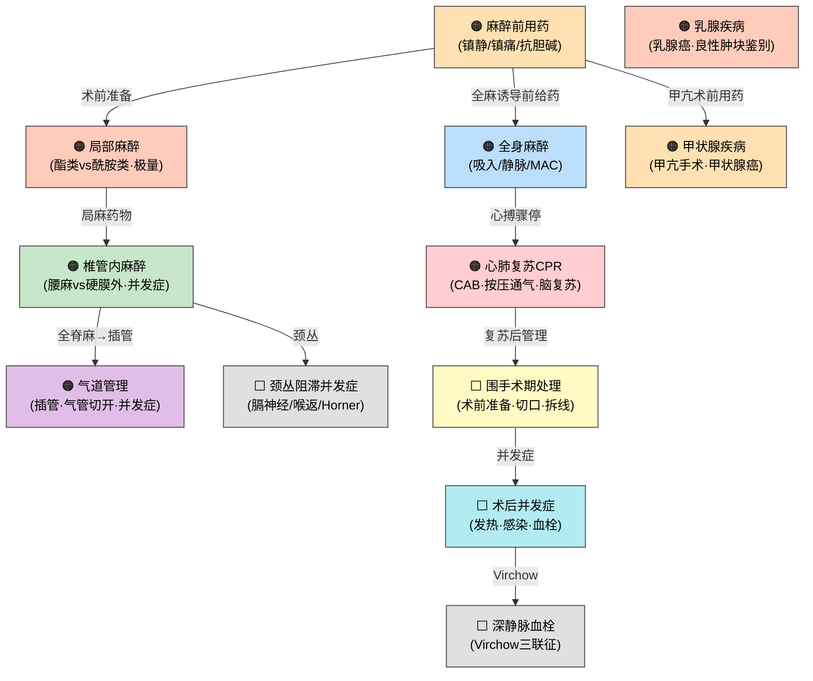

# 外科学（一）第二篇+第四篇 — 三源整合讲练手册

> **batch025-B | 教师重点导向 | 绿皮书+贺银成+教材三源整合**
> 生成日期：2026-07-03 | Agent 2 (MedGen)

---

## 📐 麻醉围术期+颈乳外科 考点地图

> **图例**：🟠 橙色 = Tier 1 核心考点 | ⬜ 灰色 = Tier 2 延申考点 | 箭头 = 知识点间关联

---

# 第二篇 麻醉与围手术期处理

---

## 考点 2.1：麻醉前用药 【Tier 1 核心考点】

### 📖 三源讲解

**🧬 核心概念**
> 麻醉前用药（premedication）目的是：①镇静/抗焦虑；②镇痛（增强麻醉效果）；③抑制呼吸道腺体分泌；④减少麻醉药用量；⑤预防不良反射（如迷走神经反射）。[源:教材《外科学》第10版 第15章/P126]

**常用药物四类：**

| 类别 | 代表药 | 主要作用 | 注意事项 |
|:-----|:------|:--------|:--------|
| 苯二氮卓类 | **咪达唑仑**（首选） | 镇静、抗焦虑、顺行性遗忘 | 短效，呼吸抑制轻 |
| 抗胆碱药 | **阿托品** / 东莨菪碱 | 抑制腺体分泌、防迷走反射 | 甲亢患者**禁用阿托品**（致心动过速） |
| 阿片类 | 吗啡 / **哌替啶** | 镇痛、降低MAC | 呼吸抑制、恶心呕吐 |
| H2受体拮抗剂 | 西咪替丁 / 雷尼替丁 | 减少胃酸、防误吸 | 饱胃/剖宫产术前用 |

**🔍 机制理解**
- 阿片类使吸入麻醉药 **MAC 降低**→ 减少全麻药用量
- 东莨菪碱除抑制腺体外还有**中枢镇静**作用，优于阿托品（但老年人易致谵妄）
- 甲亢术前：不用阿托品（引起心动过速），可用东莨菪碱或长托宁

**⚠️ 易混淆**

| 药物 | 抑制腺体 | 镇静 | 心率影响 | 适用/禁忌 |
|:-----|:------:|:---:|:-------:|:--------|
| 阿托品 | ✓ | ✗ | ↑↑ | 甲亢禁用 |
| 东莨菪碱 | ✓✓ | ✓ | ↑ | 老年人慎用 |
| 长托宁（盐酸戊乙奎醚） | ✓✓ | ✗ | 影响小 | 替代阿托品优选 |

> 🟢 **绿皮书角度**：麻醉前用药的组合选择是常见考点。例如高血压+焦虑患者 → 咪达唑仑+东莨菪碱；饱胃患者 → 加用H2受体拮抗剂。[源:外科习题集 P121]

> 🟡 **贺银成角度**：讲义强调阿托品与东莨菪碱的区分——东莨菪碱对腺体分泌的抑制作用强于阿托品，且可通过血脑屏障产生镇静作用。[源:贺银成讲义下册]

#### 📝 例题印证

**【例1·绿皮书】** [源:外科习题集 P121]

> 麻醉前用药中，甲亢患者应避免使用：
> A. 咪达唑仑
> B. 东莨菪碱
> C. 阿托品
> D. 哌替啶
> E. 苯巴比妥

**解析**：阿托品阻断M受体→心率增快。甲亢患者基础心率已快，使用阿托品可诱发心动过速甚至甲状腺危象。**C ✅**

---

## 考点 2.2：局部麻醉 【Tier 1 核心考点】

### 📖 三源讲解

**🧬 核心概念**
> 局麻药按化学结构分为**酯类**和**酰胺类**两大类。酯类由血浆假性胆碱酯酶水解，酰胺类经肝脏代谢。[源:教材《外科学》第10版 第15章/P128-P141]

**局麻药分类与极量表：**

| 分类 | 代表药 | 极量（单纯） | 极量（+肾上腺素） | 代谢 | 过敏 |
|:-----|:------|:----------:|:--------------:|:----:|:---:|
| **酯类** | 普鲁卡因 | 1000mg | — | 血浆假性胆碱酯酶 | **多见** |
| **酯类** | 丁卡因 | 100mg（表面麻醉） | — | 同上 | 多见 |
| **酰胺类** | **利多卡因** | **400mg** | **500mg** | 肝微粒体酶 | 罕见 |
| **酰胺类** | **布比卡因** | **150mg** | — | 肝代谢 | 罕见 |
| **酰胺类** | **罗哌卡因** | **225mg** | — | 肝代谢 | 罕见 |

**各麻醉方式常用药物浓度：**

| 麻醉方式 | 常用药（浓度） | 备注 |
|:--------|:------------|:-----|
| 表面麻醉 | 丁卡因 1%-2% / 利多卡因 2%-4% | 黏膜表面 |
| 局部浸润 | 普鲁卡因 0.5% / 利多卡因 0.25%-0.5% | 最常用 |
| 神经阻滞 | 利多卡因 1%-2% / 罗哌卡因 0.5%-0.75% | 臂丛/颈丛 |
| 硬膜外阻滞 | 利多卡因 1.5%-2% / 罗哌卡因 0.5%-1% | 产妇分娩镇痛首选罗哌卡因 |
| 腰麻 | 布比卡因 0.5%-0.75% | 重比重液常用 |

**🔍 机制理解**

**局麻药毒性反应（CNS→心血管进展）：**
1. **CNS先兴奋后抑制**：口周麻木→耳鸣→金属味→肌颤搐→惊厥→昏迷→呼吸停止
2. **心血管抑制**：心肌收缩力↓→传导阻滞→血管扩张→低血压→心搏骤停
3. **处理**：①立即停药+吸氧 ②惊厥→静注咪达唑仑/硫喷妥钠 ③低血压→输液+血管活性药 ④布比卡因心脏毒性→**脂肪乳剂**（lipid rescue）

**⚠️ 易混淆：酯类 vs 酰胺类**

| 维度 | 酯类 | 酰胺类 |
|:-----|:-----|:-----|
| 代谢 | 血浆假性胆碱酯酶水解 | 肝脏 P450 氧化 |
| 代谢产物 | 对氨基苯甲酸（PABA）→ **过敏原** | 无PABA |
| 过敏 | **多见**（与PABA有关） | **罕见** |
| 交叉过敏 | 同类之间 | 同类之间（罕见） |
| 代表药口诀 | "普鲁卡因+丁卡因→酯" | "利多/布比/罗哌→酰胺" |

> 🟢 **绿皮书角度**：局麻药极量是高频数字考点。常考"利多卡因单纯400mg/加肾上腺素500mg""布比卡因150mg"。混淆项常用普鲁卡因1000mg或罗哌卡因225mg来干扰。[源:外科习题集 P128]

> 🟡 **贺银成角度**：酯类过敏多见、酰胺类肝代谢是必考点。局麻药中毒最先表现是CNS症状（非心血管），因为CNS对局麻药更敏感。[源:贺银成讲义下册]

#### 📝 例题印证

**【例1·绿皮书】** [源:外科习题集 P128]

> 硬膜外阻滞首选的局麻药是：
> A. 普鲁卡因
> B. 丁卡因
> C. 利多卡因
> D. 布比卡因
> E. 罗哌卡因

**解析**：硬膜外麻醉需起效快、作用时间适中的药物。利多卡因起效快（5-8min）、弥散性强。罗哌卡因常用于分娩镇痛（运动阻滞轻）。**C ✅**

---

## 考点 2.3：椎管内麻醉 【Tier 1 核心考点】

### 📖 三源讲解

**🧬 核心概念**
> 椎管内麻醉包括蛛网膜下腔阻滞（腰麻）、硬膜外间隙阻滞及腰-硬联合麻醉。主要作用部位在**脊神经根**。[源:教材《外科学》第10版 第15章/P141-P148]

**腰麻 vs 硬膜外麻醉对比表：**

| 维度 | 腰麻（蛛网膜下腔） | 硬膜外麻醉 |
|:-----|:-----------------|:----------|
| 注药部位 | 蛛网膜下腔 | 硬脊膜外间隙 |
| 穿刺层次 | 皮肤→棘上韧带→棘间韧带→黄韧带→硬脊膜→**蛛网膜** | 皮肤→棘上韧带→棘间韧带→黄韧带（停在硬膜外） |
| 穿刺成功标志 | **脑脊液流出** | 阻力消失（悬滴法/玻管法） |
| 用药量 | 小（2-3ml） | 大（腰麻的**3-5倍**） |
| 起效速度 | **快**（1-5min） | 慢（15-20min） |
| 麻醉平面调节 | 体位+药液比重 | 导管位置+药量 |
| 肌松效果 | **完全** | 较好 |
| 术后头痛 | **常见**（脑脊液漏） | 少见 |

**🔍 机制理解**

**椎管内麻醉对生理的影响：**
- **循环**：交感神经被阻滞→小动脉舒张+静脉扩张→回心血量↓→**低血压**（最常见的并发症）
- **呼吸**：麻醉平面过高（T4以上）→肋间肌麻痹→呼吸抑制
- **胃肠**：副交感相对亢进→胃肠蠕动增强→恶心呕吐

**腰麻术后头痛：**
- 机制：穿刺针使硬脊膜留孔→脑脊液外漏→颅内压↓→牵拉脑膜/血管
- 特点：**坐起/站立时加重，平卧时减轻**
- 处理：**去枕平卧6小时** + 补液（>3000ml/d）+ 咖啡因

**腰麻恶心呕吐四大原因：**
① 麻醉平面过高→低血压+脑缺氧→兴奋呕吐中枢
② 迷走神经亢进→胃肠蠕动增强
③ 手术牵拉腹腔内脏
④ 辅助药物（哌替啶等）

**⚠️ 易混淆：并发症对比**

| 并发症 | 腰麻 | 硬膜外麻醉 |
|:------|:----:|:--------:|
| 低血压 | **最常见（术中）** | 常见 |
| 术后头痛 | **特征性**（脑脊液漏） | 少见 |
| 全脊麻 | 罕见（注药过量） | **最危险**（导管误入蛛网膜下腔） |
| 硬膜外血肿 | — | **特征性**（8h内手术减压） |
| 神经损伤 | 少见 | 可能（穿刺针/导管） |
| 尿潴留 | 常见 | 少见 |

**硬膜外麻醉禁忌证：** 休克 / 穿刺部位感染 / 凝血功能障碍 / 脊柱畸形/外伤/结核 / 中枢神经系统疾病 / 脓毒症 / 急性心衰 [源:教材P144]

> 🟢 **绿皮书角度**：腰麻术中并发症（血压下降/心率减慢/呼吸抑制/恶心呕吐）和术后并发症（头痛/尿潴留）的鉴别是A型题和B型题高频考点。腰麻后头痛的处理「去枕平卧+补液」是必背内容。[源:外科习题集 P121/P128/P135]

> 🟡 **贺银成角度**：腰麻与硬膜外麻醉的关键区别——注药部位不同。腰麻药注入蛛网膜下腔，硬膜外药注入硬膜外腔。考生常混淆"硬膜外麻醉麻药不进入蛛网膜下腔"，实际上可通过渗透进入，所以C型题表述需注意。[源:贺银成讲义下册]

#### 📝 例题印证

**【例1·绿皮书·B型题】** [源:外科习题集 P128]

> A. 血压下降 B. 心率减慢 C. 呼吸抑制 D. 恶心呕吐 E. 腰麻后头痛
>
> 腰麻的术中并发症不包括：

**解析**：腰麻后头痛是**术后**并发症（脑脊液漏所致），不是术中并发症。术中并发症包括血压下降、心率减慢、呼吸抑制、恶心呕吐。**E ✅**

**【例2·贺银成真题型】**

> 硬膜外麻醉最严重的并发症是：
> A. 低血压
> B. 全脊麻
> C. 硬膜外血肿
> D. 神经损伤
> E. 局麻药中毒

**解析**：全脊麻是硬膜外穿刺针/导管误入蛛网膜下腔，将大量局麻药注入→全部脊神经甚至颅神经被阻滞→呼吸停止、血压骤降→最危险。**B ✅**

---

## 考点 2.4：颈丛阻滞并发症 【Tier 1 核心考点】

### 📖 三源讲解

**🧬 核心概念**
> 颈丛（C1-C4）阻滞用于颈部手术（甲状腺/颈动脉等）。并发症源于局麻药扩散至邻近神经结构。[源:教材《外科学》第10版 第15章/P148]

**三大特征性并发症：**

| 并发症 | 被波及神经 | 表现 | 机制 |
|:------|:---------|:-----|:-----|
| **膈神经麻痹** | 膈神经（C3-C5） | **呼吸困难**、呃逆 | 膈神经被阻滞→膈肌瘫痪（最重要呼吸肌） |
| **喉返神经麻痹** | 喉返神经 | **声音嘶哑** | 喉返神经被阻滞→声带麻痹 |
| **Horner综合征** | 颈交感神经链 | 同侧瞳孔缩小+上睑下垂+眼球内陷+面部无汗 | 交感神经被阻断 |

**其他并发症：** 高位硬膜外麻醉（药液误入硬膜外腔）、全脊麻（误入蛛网膜下腔）、局麻药毒性反应（颈血管丰富吸收快）。

> 🟢 **绿皮书角度**：B型题常考"膈神经→呼吸困难""喉返神经→声嘶""交感神经→Horner综合征"的对应关系。[源:外科习题集 P706]

#### 📝 例题印证

**【例1·绿皮书】** [源:外科习题集 P706]

> 颈丛阻滞后患者出现同侧瞳孔缩小、上睑下垂、面部无汗，最可能是：
> A. 喉返神经麻痹
> B. 膈神经麻痹
> C. Horner综合征
> D. 全脊麻
> E. 局麻药过敏

**解析**：瞳孔缩小+上睑下垂+面部无汗 = Horner综合征三联征，由颈交感神经链被局麻药阻滞所致。**C ✅**

---

## 考点 2.5：气管插管与气道管理 【Tier 1 核心考点】

### 📖 三源讲解

**🧬 核心概念**

**气管导管适宜深度：**
- 成人门齿距隆突：男性约 23cm，女性约 21cm
- 门齿→导管尖端：20-22cm

**气管插管禁忌证：** 喉水肿 / 急性喉炎 / 气道异物 / 颈椎不稳（相对）

**气管插管并发症：** 牙齿损伤 / 喉痉挛 / 误入食管（最危险，未及时发现→缺氧死亡） / 喉水肿 / 声带麻痹 / 杓状软骨脱位

**气管切开适应证：** ①上呼吸道梗阻（肿瘤/异物/烧伤水肿）②长期机械通气（>2周）③气道分泌物清除困难（如昏迷患者）

**🔍 机制理解**

**上呼吸道梗阻最常见原因——舌后坠：**
- 全麻/昏迷时舌肌松弛→舌根后坠→堵塞咽部→打鼾→呼吸道梗阻
- 处理：**托下颌**（首选）/ 口咽通气管/鼻咽通气管

**会厌功能：** 吞咽时会厌遮盖喉口→防止食物/液体误入气管。会厌功能丧失=误吸风险。

**气管导管留置期间并发症：** 堵管（痰痂/血痂）/ 脱管 / 气囊破裂 / 呼吸道感染 / 声门下狭窄

> 🟢 **绿皮书角度**：气管插管禁忌证和误入食管的判断（听诊无呼吸音+胃区胀气+SpO2↓）是常考内容。[源:外科习题集 P140]

#### 📝 例题印证

**【例1·绿皮书型】**

> 全麻诱导后患者出现SpO₂进行性下降，听诊双肺无呼吸音，上腹部逐渐膨隆，最可能的原因是：
> A. 支气管痉挛
> B. 气管导管误入食管
> C. 肺不张
> D. 气胸
> E. 喉痉挛

**解析**：双肺无呼吸音+上腹部膨隆 = 气体进入胃而非肺 → 导管误入食管。需立即拔出重新插管。**B ✅**

---

## 考点 2.6：全身麻醉与药物相互作用 【Tier 1 核心考点】

### 📖 三源讲解

**🧬 核心概念**
> 全身麻醉是通过药物使患者产生可逆的神志消失、遗忘、痛觉消失、肌肉松弛和自主神经功能阻滞的状态。[源:教材《外科学》第10版 第15章/P127]

**MAC（最低肺泡有效浓度）：**
- 定义：使50%患者在切皮刺激时不发生体动反应的吸入麻醉药肺泡浓度
- MAC越小→麻醉效能越强（与脂溶性成正比）
- **阿片类药物可降低MAC**→减少吸入麻醉药用量

**吸入麻醉药的可控性：**
- 血/气分配系数越低→起效越快、苏醒越快（如七氟烷<异氟烷<氟烷）

**🔍 机制理解**

**麻醉恢复期血压波动原因：**
- 疼痛刺激→交感兴奋→血压↑
- 低体温→外周血管收缩→血压↑（复温后↓）
- 血容量不足→低血压
- 拔管刺激→交感反应→血压↑心率↑
- 残余麻醉药→血管扩张→低血压

**高血压患者麻醉管理要点：**
- 术前控制血压（<160/100mmHg可手术）
- 避免使用中枢性降压药/MAOI（致顽固性低血压和心动过缓）
- 其他降压药持续用至手术当天
- 术中避免血压大幅波动

> 🟢 **绿皮书角度**：阿片类降低MAC是常考的药理-麻醉交叉知识点。七氟烷血/气分配系数低→起效快，是吸入诱导首选。[源:外科习题集 P140]

#### 📝 例题印证

**【例1·绿皮书型】**

> 关于吸入麻醉药MAC的描述，正确的是：
> A. MAC越大麻醉效能越强
> B. 阿片类药物可增加MAC
> C. MAC与药物的脂溶性成正比
> D. MAC不受患者年龄影响
> E. 血/气分配系数越低MAC越大

**解析**：MAC与脂溶性成**正比**（脂溶性越高越容易进入CNS→MAC越小→效能越强）。MAC值小=效能强。阿片类降低MAC。老年人MAC降低。**C ✅**

---

## 考点 2.7：心肺复苏（CPR）与脑复苏 【Tier 1 核心考点】

### 📖 三源讲解

**🧬 核心概念**
> CPR是针对心搏骤停的紧急医疗措施。国际指南将成人CPR顺序确定为**C-A-B**：胸外按压（Circulation）→ 开放气道（Airway）→ 人工呼吸（Breathing）。[源:教材《外科学》第10版 第17章/P161]

**CPR核心参数：**

| 参数 | 数值 | 说明 |
|:-----|:----|:-----|
| 按压深度 | **5-6cm** | 成人，胸廓前后径1/3 |
| 按压频率 | **100-120次/分** | 保证胸廓充分回弹 |
| 按压:通气（单人） | **30:2** | 5组/2分钟轮换 |
| 按压:通气（双人） | **30:2** | 同上 |
| 电除颤能量（双相波） | **120-200J** | 首次即用最大能量 |
| 肾上腺素 | **1mg q3-5min** | IV/IO（室颤/无脉室速/心搏停止） |

**心室细颤→电击前用药：** 肾上腺素 1mg IV，使细颤变粗颤→提高除颤成功率。

**心搏骤停判断三联征：**
1. **意识突然丧失**
2. **大动脉搏动消失**（颈动脉/股动脉）
3. **呼吸停止**（或叹息样呼吸）

**气道管理：**
- 常规：**仰头抬颏法**（最常用）
- 怀疑颈椎损伤：**推下颌法**（不移动颈椎）

**🔍 机制理解**

**脑复苏关键措施：**
1. **尽早恢复自主循环**（最关键）
2. **目标温度管理（TTM）**：32-36℃，维持24h
3. 控制血糖（6-10mmol/L）
4. 抗癫痫治疗
5. 脱水降颅压（甘露醇/呋塞米）
6. 维持MAP以保证脑灌注

**心脏按压原理：**
- 心泵机制：直接挤压心脏→泵血
- 胸泵机制：胸腔内压力变化→推动血流

> 🟢 **绿皮书角度**：肾上腺素是CPR唯一I类推荐药物（兼具α+β受体兴奋作用→α收缩外周血管提高冠脉灌注压+β增加心肌兴奋性）。阿托品/去甲肾上腺素/异丙肾上腺素均非CPR一线药物。心搏骤停判断+按压通气比+电除颤能量是高频数字考点。[源:外科习题集 P164/P177]

#### 📝 例题印证

**【例1·绿皮书】** [源:外科习题集 P177]

> 心肺复苏中，兼具α与β肾上腺能受体兴奋作用的首选药物是：
> A. 阿托品
> B. 肾上腺素
> C. 去甲肾上腺素
> D. 碳酸氢钠
> E. 异丙肾上腺素

**解析**：肾上腺素同时兴奋α受体（外周血管收缩→冠脉灌注压↑）和β受体（心肌兴奋→有利于恢复自主心律），是CPR唯一I类推荐药物。**B ✅**

**【例2·教材改编型】**

> 单人实施成人心肺复苏时，胸外按压与人工呼吸的比例是：
> A. 15:2
> B. 30:2
> C. 15:1
> D. 30:1
> E. 5:1

**解析**：成人CPR无论单人还是双人，按压:通气 = **30:2**。注意：儿童双人施救时为15:2。**B ✅**

---

## 考点 2.8：围手术期处理 【Tier 2 延申考点】

> **补充理由**：围手术期术前准备+切口分类+拆线时间是外科基础经典考点，系统总结。

### 📖 三源讲解

**🧬 核心概念**
> 围手术期是从决定手术治疗时起到与本次手术有关的治疗基本结束为止的一段时间，包括术前、术中和术后三个阶段。[源:教材《外科学》第10版 第18章/P174]

**术前禁食时间（成人口服）：**

| 食物类型 | 最短禁食时间 | 说明 |
|:--------|:----------:|:-----|
| **清流质**（水/无渣果汁/清茶） | **2h** | 不含脂肪和颗粒 |
| **母乳** | **4h** | 婴儿 |
| **清淡餐**（面包/粥/牛奶） | **6h** | 非油炸、非高脂 |
| **脂肪餐**（油炸/肉类） | **8h** | 高脂食物胃排空慢 |

**拆线时间（按部位）：**

| 部位 | 拆线时间 |
|:-----|:-------:|
| 头面部、颈部 | **4-5天** |
| 下腹部、会阴部 | 6-7天 |
| 胸部、上腹部、背部、臀部 | 7-9天 |
| 四肢 | **10-12天** |
| 减张缝合 | **14天** |

**切口分类与愈合等级：**

| 切口分类 | 定义 | 举例 |
|:-------:|:-----|:-----|
| **Ⅰ类（清洁切口）** | 缝合的无菌切口 | 甲状腺大部切除术、疝修补术 |
| **Ⅱ类（可能污染切口）** | 手术时可能污染的切口 | 胃大部切除术、胆囊切除术 |
| **Ⅲ类（污染切口）** | 邻近感染区/组织暴露的切口 | 阑尾穿孔切除术、肠梗阻坏死手术 |

| 愈合等级 | 定义 |
|:-------:|:-----|
| **甲级** | 愈合优良，无不良反应 |
| **乙级** | 愈合欠佳（红肿/硬结/积液），但未化脓 |
| **丙级** | 切口化脓，需引流 |

**记录格式**：如「Ⅰ/甲」（甲状腺术后切口愈合良好）、「Ⅲ/丙」（阑尾穿孔术后切口感染）

**🔍 术前评估要点：**
- 心血管：血压<160/100mmHg可手术；心梗后≥6个月行择期手术
- 呼吸系统：吸烟者术前戒烟≥2周；急性呼吸道感染→择期手术推迟1-2周
- 糖尿病：术前空腹血糖控制在5.6-11.2mmol/L；口服降糖药术前晚停用，改为胰岛素
- 肾疾病：术前检查Cr/BUN；透析患者术前24h透析

> 🟢 **绿皮书角度**：切口分类（Ⅰ/Ⅱ/Ⅲ）和愈合等级（甲/乙/丙）的组合判断是A型题常考内容。拆线时间按部位记忆是高频数字考点。青少年可适当缩短、老年/营养不良可延迟拆线。[源:外科习题集 P195/P208]

> 🟡 **贺银成角度**：围手术期处理强调"术前准备+术中保障+术后处理"三位一体。禁食时间精确到小时——清流质2h、母乳4h、清淡餐6h、脂肪餐8h是必背数字。[源:贺银成讲义下册]

#### 📝 例题印证

**【例1·绿皮书型】** [源:外科习题集 P208]

> 甲状腺大部切除术后切口愈合良好，正确的愈合记录为：
> A. Ⅰ/甲
> B. Ⅰ/乙
> C. Ⅱ/甲
> D. Ⅱ/乙
> E. Ⅲ/甲

**解析**：甲状腺大部切除术为无菌切口→Ⅰ类；愈合良好无不良反应→甲级。故记录为Ⅰ/甲。**A ✅**

**【例2·贺银成真题型】**

> 成人择期手术前，进食不含脂清淡餐后的最短禁食时间为：
> A. 2小时
> B. 4小时
> C. 6小时
> D. 8小时
> E. 12小时

**解析**：清淡餐（面包/粥/牛奶）→禁食**6小时**。清流质2h、母乳4h、脂肪餐8h。**C ✅**

---

## 考点 2.9：术后常见并发症【Tier 2 延申考点】

### 📖 三源讲解

**🧬 核心概念**

**术后发热：**
| 时间 | 常见原因 | 处理 |
|:-----|:--------|:-----|
| 术后24h内 | 肺不张（最常见）/ 代谢/内分泌反应 | 鼓励咳嗽深呼吸 |
| 术后3-6天 | **感染**（伤口/肺部/尿路） | 寻找感染源+抗生素 |
| 术后>1周 | 深部感染/脓肿/药物热 | 影像学+引流 |

**术后伤口感染：**
- 定义时间：术后**30天内**；有植入物→**1年内**
- 表现：红、肿、热、痛+脓性分泌物
- 处理：拆除缝线→引流→清创→抗生素

**肺部并发症：**
- 肺不张（最常见，术后24-48h）：鼓励咳痰+深呼吸+早期活动
- 肺炎（术后3-5天）：抗生素+痰培养

**尿潴留：** 麻醉（腰麻多见）+疼痛+体位不习惯→导尿（注意：导尿前先鼓励自行排尿/热敷）

**⚠️ Virchow三联征（静脉血栓形成三要素）：**
① 血流淤滞（长期卧床/制动）
② 血管内皮损伤（手术创伤/导管）
③ 高凝状态（肿瘤/妊娠/口服避孕药）

**深静脉血栓（DVT）→肺栓塞（PTE）：** 最危险的术后并发症。预防：早期活动+弹力袜+低分子肝素

> 🟢 **绿皮书角度**：术后发热的时间-病因关联是区分诊断的关键。术后24h内发热最常见原因是肺不张（非感染性→不需要用抗生素）。[源:外科习题集 P195]

#### 📝 例题印证

**【例1·绿皮书型】**

> 全麻术后24小时内患者体温38.2℃，最可能的原因是：
> A. 伤口感染
> B. 肺不张
> C. 尿路感染
> D. 药物热
> E. 深静脉血栓

**解析**：术后24h内发热最常见原因 = 肺不张（肺泡萎陷→通气/血流比失调→轻度炎症反应）。此时不宜急于使用抗生素，鼓励深呼吸+咳痰+体位引流即可。伤口感染一般在术后3-5天。**B ✅**

---

# 第四篇 颈部与乳腺外科疾病

---

## 考点 4.1：甲状腺疾病 【Tier 1 核心考点】

### 📖 三源讲解

**🧬 核心概念**

**甲亢手术指征（教师重点）：**
① 药物治疗无效或复发
② 巨大甲状腺压迫周围器官（气管/食管/喉返神经）
③ 胸骨后甲状腺肿
④ 可疑或证实恶变
⑤ 不能耐受抗甲状腺药物
⑥ 结节性甲状腺肿伴甲亢

**甲亢术前准备：**
- **抗甲状腺药物**（PTU/MMI）→ 控制甲亢症状
- **碘剂**（复方碘溶液/Lugol液）→ 抑制甲状腺素释放+减少甲状腺血供（术前2周开始）
- 不用阿托品（致心动过速）

**⚠️ 易混淆：甲亢三种治疗方案的适应证**

| 方案 | 适应证 | 禁忌/局限 |
|:-----|:------|:--------|
| 抗甲状腺药物 | 轻中度/青少年/孕妇/术前准备 | 疗程长(1.5-2年)/复发率高 |
| 手术 | 巨大压迫/恶性/药物无效 | 手术风险/喉返损伤/甲减 |
| ¹³¹I放射性碘 | 25岁以上/术后复发/药物禁忌 | 孕妇哺乳/青少年/突眼加重 |

**🔍 机制理解**

**甲状腺大部切除术后呼吸困难（最严重并发症）四大原因：**

| 原因 | 发生时间 | 特点 | 紧急程度 |
|:-----|:--------|:-----|:-------:|
| ① **出血血肿压迫** | 术后24-48h | **最紧急**→立即床旁拆线减压 | ⚠️ 最危急 |
| ② 喉头水肿 | 术后早期 | 手术创伤/气管插管引起 | 气管插管/切开 |
| ③ 气管塌陷 | 术中/术后 | 长期受压→气管软化 | 紧急气管切开 |
| ④ 双侧喉返神经损伤 | 术中即出现 | 声带内收→窒息 | 紧急气管切开 |

> 术后48小时内死亡的主要原因是出血血肿压迫。[源:教材P236]

**喉返神经 vs 喉上神经损伤鉴别：**

| 损伤神经 | 分支 | 表现 | 机制 |
|:--------|:-----|:-----|:-----|
| **喉返神经**（单侧） | — | **声音嘶哑** | 声带外展障碍 |
| **喉返神经**（双侧） | — | **呼吸困难/窒息** | 双侧声带内收 |
| **喉上神经内支** | 感觉支 | **饮水呛咳** | 喉黏膜感觉丧失 |
| **喉上神经外支** | 运动支 | **音调降低** | 环甲肌麻痹→声带松弛 |

**甲状腺癌四大病理类型：**

| 类型 | 占比 | 转移途径 | 预后 | 特点 |
|:-----|:---:|:--------|:---:|:-----|
| **乳头状癌** | **~85%** | **淋巴转移为主** | **最好** | 最常见，30-50岁女性多 |
| 滤泡状癌 | ~10% | **血行转移**（肺/骨） | 较好 | 40-60岁，血管侵犯倾向 |
| **髓样癌** | ~5% | 淋巴+血行 | 中等 | **降钙素↑**，来自滤泡旁C细胞 |
| **未分化癌** | ~2% | 局部浸润+远处 | **最差** | 老年人，进展极快 |

**甲状旁腺：**
- 分泌调节：血钙↓→PTH↑；血钙↑→PTH↓/降钙素↑（负反馈）
- 术后损伤（误切/血供受损）→**低钙血症**→手足抽搐→Chvostek征(+)/Trousseau征(+)
- 处理：补钙（葡萄糖酸钙IV）+维生素D

**单纯性甲状腺肿病因：**
碘缺乏→T3/T4合成↓→TSH负反馈↑→甲状腺代偿性增生肿大（缺碘地区地方性甲状腺肿）

> 🟢 **绿皮书角度**：甲状腺术后并发症的B型题极高频——"呼吸困难/窒息=出血血肿""声嘶=喉返神经""音调降低饮水呛咳=喉上神经""手足抽搐=甲状旁腺损伤""高热脉快=甲状腺危象"。甲状腺癌四种病理类型与其转移方式/预后对应也是常考题。[源:外科习题集 P542/P548/P554/P555]

> 🟡 **贺银成角度**：强调甲亢术前准备的碘剂作用机制——抑制蛋白水解酶→减少甲状腺球蛋白分解→抑制T3/T4释放；同时减少甲状腺血流→腺体变硬缩小，利于手术。乳头状癌"虽常见且早期淋巴转移，但预后最好"是易错考点。[源:贺银成讲义下册]

#### 📝 例题印证

**【例1·绿皮书·B型题】** [源:外科习题集 P548]

> A. 呼吸困难和窒息 B. 音调降低，饮水呛咳 C. 声音嘶哑 D. 高热脉快、神经循环消化紊乱 E. 手足抽搐
>
> 甲亢术后，如喉返神经损伤，则出现：

**解析**：单侧喉返神经损伤→同侧声带麻痹→**声音嘶哑**。双侧喉返神经损伤→**呼吸困难和窒息**。喉上神经内支→饮水呛咳，外支→音调降低。**C ✅**

**【例2·贺银成真题型】**

> 甲状腺癌最常见的病理类型是：
> A. 乳头状癌
> B. 滤泡状癌
> C. 髓样癌
> D. 未分化癌
> E. 鳞状细胞癌

**解析**：乳头状癌约占甲状腺癌的85%，是最常见类型。特点：分化好、淋巴转移为主、预后最佳。**A ✅**

---

## 考点 4.2：乳腺疾病 【Tier 1 核心考点】

### 📖 三源讲解

**🧬 核心概念**

**乳腺癌三大特征性体征：**

| 体征 | 机制 | 病理基础 |
|:-----|:-----|:--------|
| **"酒窝征"** | **Cooper韧带受侵缩短**→皮肤凹陷 | 肿瘤侵犯乳房悬韧带 |
| **"橘皮征"** | 皮下淋巴管被癌细胞堵塞→淋巴回流受阻→**皮肤水肿**→毛囊处凹陷 | 淋巴管癌栓 |
| **乳头内陷** | 肿瘤侵及乳管→乳管缩短/纤维化→牵拉乳头 | 临近乳头/乳晕区肿瘤 |

**乳腺癌好发部位：** 乳房**外上象限**（约占50%）

**乳腺癌血行转移顺序：** 肺 → 骨（椎体→骨盆→股骨）→ 肝 → 脑

**乳管内乳头状瘤：**
- 表现：**乳头溢液/溢血**（鲜红色/暗红色/淡黄色浆液性）
- 好发：经产妇，40-50岁，75%在大乳管近乳头壶腹部
- 大多为**良性**，但中央型恶变率较高（5%-10%）
- 诊断：乳管镜+溢液细胞学检查
- 治疗：手术切除病变导管

**⚠️ 易混淆：乳腺良性肿块鉴别表**

| 特征 | 乳腺纤维腺瘤 | 乳腺囊性增生 | 乳管内乳头状瘤 | 乳腺癌 |
|:-----|:----------|:----------|:------------|:-----|
| 年龄 | 20-30岁 | 30-50岁 | 40-50岁 | 40-60岁（高峰） |
| 表现 | 单发、光滑、活动 | 多发、与月经周期相关 | 乳头溢液/溢血 | 无痛性硬块、边界不清 |
| 质地 | 硬橡皮球感 | 结节感 | 触不到肿块 | 坚硬、固定 |
| 皮肤改变 | 无 | 无 | 无 | 酒窝征/橘皮征 |
| 乳头溢液 | 罕见 | 浆液性 | **血性（特征性）** | 可能血性 |
| 恶变 | 极低 | 可能 | 5%-10% | 本身就是恶性 |
| 治疗 | 手术切除 | 观察/对症 | 手术切除病变导管 | 综合治疗 |

**乳腺癌TNM分期基本框架要点：**
- T（原发肿瘤）：Tis原位癌→T1≤2cm→T2 2-5cm→T3>5cm→T4侵犯胸壁/皮肤
- N（淋巴结）：N0无→N1同侧腋窝可活动→N2同侧融合/内乳→N3锁骨上/锁骨下
- M（远处转移）：M0无→M1有

> 🟢 **绿皮书角度**：A型题常考"乳腺癌的描述错误的是"——错误项往往在转移部位（骨转移主要部位是椎体、骨盆和股骨，而非肋骨）。"酒窝征"机制和"橘皮征"机制的区分是高频考点。"酒窝征=Cooper韧带"、"橘皮征=淋巴管堵塞"。[源:外科习题集 P567/P572/P579/P580]

#### 📝 例题印证

**【例1·绿皮书】** [源:外科习题集 P572]

> 下列有关乳腺癌的描述，**错误**的是：
> A. 乳房外上象限发生率最高，接近50%
> B. 骨转移的主要部位是肋骨
> C. "橘皮征"是皮内和皮下淋巴管被癌细胞堵塞所致
> D. Paget病的原发灶在乳头区的大乳管内
> E. 治疗方针应尽早施行手术，辅以化疗放疗内分泌等综合治疗

**解析**：乳腺癌骨转移主要部位依次为**椎体、骨盆和股骨**，而非肋骨。其余选项均正确。**B ✅**

**【例2·绿皮书·B型题】** [源:外科习题集 P580]

> A. 乳房皮肤凹陷 B. 乳房皮肤水肿、毛囊处凹凸不平 C. 乳头内陷 D. 乳房皮肤红肿、发热 E. 乳头溢液
>
> 乳腺癌"酒窝征"是由于Cooper韧带受侵，表现为：

**解析**：Cooper韧带（乳房悬韧带）受肿瘤侵犯→缩短→牵拉皮肤→局部凹陷 = "酒窝征"。**A ✅**

---

## 📋 麻醉围术期+颈乳外科 数值速查表

| 类别 | 项目 | 数值 |
|:-----|:-----|:-----|
| **局麻药极量** | 利多卡因（单纯/加肾上腺素） | 400mg / 500mg |
| | 布比卡因 | 150mg |
| | 罗哌卡因 | 225mg |
| | 普鲁卡因 | 1000mg |
| | 丁卡因（表面麻醉） | 100mg |
| **CPR参数** | 按压深度 | 5-6cm |
| | 按压频率 | 100-120次/分 |
| | 按压:通气 | 30:2 |
| | 肾上腺素 | 1mg q3-5min |
| | 电除颤（双相波） | 120-200J |
| | 脑复苏TTM温度 | 32-36℃ |
| **气管导管** | 男性门齿距隆突 | 23cm |
| | 女性门齿距隆突 | 21cm |
| | 门齿→导管尖端 | 20-22cm |
| **腰麻** | 去枕平卧时间 | 6小时 |
| | 用药量 | 2-3ml |
| | 硬膜外用药量（相比腰麻） | 3-5倍 |
| **禁食时间** | 清流质 | 2h |
| | 母乳 | 4h |
| | 清淡餐 | 6h |
| | 脂肪餐 | 8h |
| **拆线时间** | 头面颈部 | 4-5天 |
| | 下腹会阴 | 6-7天 |
| | 胸背上臀 | 7-9天 |
| | 四肢 | 10-12天 |
| | 减张缝合 | 14天 |
| **高血压术前** | 择期手术血压上限 | <160/100mmHg |

| **甲状腺** | 乳头状癌占比 | ~85% |
| | 乳管内乳头状瘤恶变率 | 5%-10% |
| **乳腺癌** | 外上象限发生率 | ~50% |
| | 伤口感染定义（有植入物） | 术后1年内 |

---

> ✅ **batch025-B 讲练手册完成**
> 📊 本批统计：考点 11 组（Tier 1 核心×9 + Tier 2 延申×2）| 例题 17 道 | 数值速查表 23 项
> 📂 输出路径：`中间产物/batch025-B/batch025-B_麻醉围术期_颈乳_讲练手册.md`
