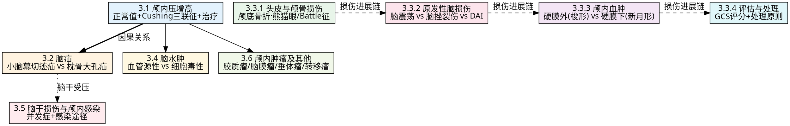

# 外科学（一）·第三篇 神经外科疾病 — 三源整合讲练手册

> batch025-C | 教师重点导向 | 绿皮书+贺银成+昭昭三源整合
> 📅 2026-07-03 | 6 个 Tier 1 核心考点群 + 神经外科特异硬约束 9 条

---

## 📐 神经外科考点地图



---

## 🧭 使用说明

### 学习模式
- **讲解模式**：逐考点阅读「三源讲解」（绿皮书+贺银成+昭昭），先学透再做题
- **自测模式**：盖住解析部分，先看题目自行作答，再对照解析检查

### 符号说明
- 🟢 **绿皮书**（外科习题集）— 基础题型·教材同步
- 🟡 **贺银成**（讲义+真题）— 考研真题·高频考点
- 🔵 **昭昭**（题眼狂背）— 记忆口诀·快速提分
- 🔴 掌握级 | 🟡 熟悉级 | 🟢 了解级

### 神经外科专属提示
- **颅内压单位**：mmHg（成人 5-15）或 mmH₂O（腰穿压力 70-180），不可混用
- **颅神经**：用罗马数字标识（III=动眼神经, VII=面神经, VIII=听神经）
- **血肿 CT**：「梭形/双凸透镜形」=硬膜外，「新月形」=硬膜下
- **脑疝命名**：小脑幕切迹疝 = 颞叶钩回疝，枕骨大孔疝 = 小脑扁桃体疝

---

## 第3.1章 颅内压增高

### 考点 3.1.1：颅内压增高病因与病理生理 【Tier 1 核心考点】 🔴 掌握

#### 📖 三源讲解

**🧬 核心概念**

**颅内压（ICP）正常值**：**成人 5-15 mmHg**（侧卧位腰穿压力 70-180 mmH₂O）。儿童：3-7 mmHg（40-100 mmH₂O）。颅内压持续 > 15 mmHg 即为颅内压增高（诊断标准）；> 20 mmHg 为需要积极降颅压干预的阈值。[源: 教材《外科学》第10版 第三篇/P412]

**四大病因**（颅腔内容物增多或颅腔容积缩小）：
| 类别 | 机制 | 代表性疾病 |
|------|------|-----------|
| **颅内占位性病变** | 颅腔内容物体积↑ | 肿瘤、血肿、脓肿、肉芽肿 |
| **脑水肿** | 脑组织体积↑ | 创伤、缺血缺氧、炎症、中毒 |
| **脑脊液循环障碍** | CSF 过多积聚 | 脑积水（梗阻性/交通性） |
| **颅腔狭小** | 颅腔容积↓ | 颅底凹陷症、狭颅症、大面积凹陷骨折 |

[源: 教材《外科学》第三篇 第一章/P412-414]

**Cushing 三联征（急性颅内压增高的三大主症）**：
1. **头痛** — 进行性加重，晨起重（卧位→颅内静脉回流受阻），咳嗽/用力时加剧
2. **喷射性呕吐** — 与进食无关，延髓呕吐中枢受压所致
3. **视乳头水肿** — 眼底镜检查见视盘边界模糊、静脉充盈、搏动消失；**长期→继发性视神经萎缩→失明**

**Cushing 反应**（颅内压急剧增高时）：血压↑ + 心率↓（脉搏慢而有力）+ 呼吸慢而不规则。这是机体维持脑灌注的代偿反应。

**🔍 机制理解**

Monro-Kellie 学说：颅腔容积（成人约 1400-1500 ml）固定不变。颅腔内容物 = 脑组织（~80%）+ 脑血流/血容量（~10%）+ CSF（~10%）。三者中任一体积增加 → 代偿性减少另外两者 → 代偿耗竭（失代偿点）→ ICP 急剧升高 → 脑灌注压（CPP = MAP - ICP）↓ → 脑缺血 → 脑疝。

**颅内压增高→脑疝的链式反应**：
```
占位/水肿/积水 → ICP↑ → 代偿机制(CSF排出+血容量调节)
       ↓(失代偿点)
    CPP↓ → 脑缺血 → 脑血管自动调节丧失
       ↓
   颅腔压力梯度 → 脑组织移位 → 脑疝 → 死亡
```

**💡 考试角度**

| 来源 | 要点 |
|------|------|
| 🟢 绿皮书 | P412-426 重点考四大病因分类（多选题！）、Cushing三联征三要素、颅内压增高三大后果（脑血流↓/脑移位脑疝/脑水肿）。"颅内压增高时腰穿禁忌"是最高频反选题考点。库欣反应（BP↑+HR↓+R↓）vs Cushing三联征（头痛+呕吐+视乳头水肿）需区分。 |
| 🟡 贺银成 | 讲义中颅内压增高是神经外科总论起点。正常值（5-15mmHg/70-180mmH₂O）是数值记忆型必考点。Monro-Kellie学说在机制题中常出现。 |
| 🔵 昭昭 | "颅内压高三主征：头痛呕吐视水肿"+"颅压高→禁腰穿，小心脑疝要人命"；"库欣反应：血压高心率慢呼吸乱"。 |

**⚠️ 易混淆**

| 对比维度 | Cushing 三联征（主症） | Cushing 反应（生命体征） |
|----------|----------------------|------------------------|
| 内容 | 头痛 + 呕吐 + 视乳头水肿 | BP↑ + HR↓ + R↓ |
| 出现时机 | 颅内压增高（亚急性/慢性较典型） | 颅内压急剧增高时 |
| 本质 | 临床症状与体征 | 生命体征的代偿性变化 |
| 临床意义 | 提示颅内压增高 | 提示颅内压失代偿、即将脑疝 |

#### 📝 例题印证

**【例1·绿皮书】** [源: 外科学学习指导与习题集 P418-A型题]
> **不**属于颅内压增高的病因是：
> A. 脑水肿 B. 脑积水 C. 颅内肿瘤 D. 颅底凹陷症 E. 脑震荡

**解析**：脑震荡为一过性脑功能障碍，CT/MRI 无异常，不引起颅腔内容物体积增大，因此不引起颅内压增高。其余四项均为颅内压增高的病因（ABCD 为内容物增多，D 为颅腔容积缩小）。**答案：E**

**【例2·贺银成真题】**
> 颅内压增高的典型临床表现是：
> A. 头痛、呕吐、视乳头水肿 B. 头痛、呕吐、颈项强直 C. 血压升高、心率减慢、呼吸减慢 D. 意识障碍、偏瘫、瞳孔不等大 E. 头痛、发热、脑膜刺激征

**解析**：Cushing 三联征 = 头痛 + 喷射性呕吐 + 视乳头水肿，是颅内压增高的典型临床表现。C 选项是 Cushing 反应（生命体征变化）。D 选项是脑疝表现。**答案：A**

---

### 考点 3.1.2：颅内压增高的诊断与治疗 【Tier 1 核心考点】 🔴 掌握

#### 📖 三源讲解

**🧬 核心概念**

**诊断性检查（按优先级）**：
1. **CT（首选）** — 快速、无创，可显示颅内占位、脑水肿、脑积水、中线移位
2. **MRI（补充）** — 后颅窝病变、微小病变、脑水肿范围显示优于 CT
3. **DSA** — 脑血管病变（动脉瘤/AVM）
4. **腰穿** — ⚠️ **颅内压增高时禁忌！可诱发脑疝！**（枕骨大孔疝最常见致死原因之一）
5. **PET** — 肿瘤代谢评估、复发鉴别

**良性颅内压增高（假性脑瘤综合征）**：
- 无颅内占位、无脑积水、无颅内感染证据
- CSF 成分正常，压力增高（>200 mmH₂O）
- 多见于**肥胖育龄女性**（20-44 岁，BMI>30）
- 临床表现：头痛 + 视乳头水肿 + 一过性视力模糊
- 治疗：减轻体重 + 碳酸酐酶抑制剂（乙酰唑胺）± 反复腰穿放液 ± 视神经鞘开窗/脑室腹腔分流

**治疗阶梯**：
| 阶梯 | 措施 | 适应证 |
|------|------|--------|
| **病因治疗（根本）** | 手术切除占位病变 | 可切除的肿瘤/血肿/脓肿 |
| **药物降颅压** | 甘露醇 0.25-1 g/kg q6-8h 快速静滴 | 一线药物 |
| | 呋塞米（可联合甘露醇增强效果） | 肾功能不全慎用 |
| | 糖皮质激素（地塞米松） | 肿瘤周围水肿（非创伤性） |
| **过度通气** | PaCO₂ 30-35 mmHg（短时使用） | 急性危重期 |
| **亚低温** | 核心体温 32-35℃ | 顽固性颅高压 |
| **手术减压** | 脑室穿刺引流 / 去骨瓣减压 | 药物无效的恶性颅高压 |

[源: 教材《外科学》第三篇 第一章/P414-418]

**💡 考试角度**

| 来源 | 要点 |
|------|------|
| 🟢 绿皮书 | P418-426 CT是首选的考点反复出现；腰穿禁忌是最重要的反选题考点（"颅内压增高时下列哪项检查**不宜**进行"）。甘露醇是降颅压首选药物，剂量 0.25-1g/kg。 |
| 🟡 贺银成 | 甘露醇+呋塞米联合用药的机制（渗透性利尿+抑制脑脊液生成）是理解型考点。过度通气的PaCO₂目标值常考。 |
| 🔵 昭昭 | "颅压高→CT先"+"腰穿禁忌要牢记"+"降颅压：甘露醇是王牌，激素肿瘤周，减压开颅骨"。 |

**⚠️ 易混淆**

| 降颅压药物 | 作用机制 | 适应证 | 注意事项 |
|-----------|---------|--------|---------|
| **甘露醇** | 渗透性利尿→血浆渗透压↑→脑组织脱水 | 各种原因颅高压（首选） | 肾功能不全慎用、反跳现象 |
| **呋塞米** | 抑制髓袢升支粗段→利尿+减少CSF生成 | 联合甘露醇增强效果 | 电解质紊乱、肾功能不全 |
| **地塞米松** | 稳定细胞膜→减少BBB通透性 | 肿瘤周围血管源性水肿 | 创伤性脑水肿效果差 |
| **高渗盐水** | 提高血浆渗透压 | 甘露醇无效/低血容量 | 高钠血症风险 |

---

## 第3.2章 脑疝

### 考点 3.2.1：脑疝概念与两种主要脑疝 【Tier 1 核心考点·最高优先级】 🔴🔴 掌握

#### 📖 三源讲解

**🧬 核心概念**

**脑疝定义**：颅内各分腔存在**压力梯度**时，脑组织从高压区向低压区移位，被挤入硬脑膜间隙或孔道，导致脑组织、血管及脑神经等重要结构受压，出现一系列严重临床症状和体征。[源: 教材《外科学》第三篇 第一章/P420-424]

**两种最主要脑疝的鉴别（考试最高频对比表）**：

| 对比维度 | 小脑幕切迹疝（颞叶钩回疝） | 枕骨大孔疝（小脑扁桃体疝） |
|----------|--------------------------|---------------------------|
| **疝入部位** | 颞叶钩回疝入小脑幕切迹 | 小脑扁桃体疝入枕骨大孔 |
| **病因** | 幕上占位（颞叶为主）→ 最常见 | 后颅窝占位 / 幕上压力传导 |
| **瞳孔** | 先缩小后散大（动眼神经受压）→典型 | 早期正常，晚期双侧散大 |
| **意识障碍** | 早期出现，进行性加深 | **出现较晚**（突然恶化前可能清醒） |
| **呼吸** | 晚期出现呼吸不规则 | **呼吸骤停可突然发生**（最凶险！） |
| **病程** | 较慢（三阶段进展） | **快**，可突发呼吸心跳停止 |
| **颈项强直** | 不明显 | **明显**（枕大孔区神经根受刺激） |
| **对侧偏瘫** | 典型（大脑脚受压） | 出现晚或不明显 |
| **CT/MRI** | 鞍上池/环池/四叠体池变形 | 枕大孔变窄/小脑扁桃体下移 |

**🔍 机制理解**

**小脑幕切迹疝三阶段**：
```
早期（代偿期）
├── 剧烈头痛 + 烦躁不安
├── 瞳孔先缩小（动眼神经受刺激→缩瞳纤维先兴奋）
├── 然后散大（动眼神经副交感纤维麻痹→扩瞳纤维占优势）
└── 对侧偏瘫（同侧大脑脚受压→皮质脊髓束受累）

中期（失代偿期）
├── 意识障碍加深（脑干网状上行激活系统受压）
├── 双侧瞳孔散大（双侧动眼神经受累）
└── 去大脑强直（中脑红核水平以下损伤）

晚期（衰竭期）
├── 呼吸循环衰竭
├── 双侧瞳孔固定散大→光反射消失
└── 深昏迷→死亡
```

**枕骨大孔疝的特殊性**：小脑扁桃体直接压迫延髓→**呼吸中枢受压**→呼吸可突然停止。这是神经外科最危急的情况之一，需要立即干预。患者可在意识尚清醒时突发呼吸骤停！

**治疗原则（两个并行）**：
1. **紧急降颅压**：甘露醇 0.5-1 g/kg 快速静脉推注（15-30 min 内）
2. **立即手术**：根据病因选择——清除血肿/去骨瓣减压/脑室穿刺引流/后颅窝减压

[源: 教材《外科学》第三篇 第一章/P420-424 + 外科习题集 P424-426]

**💡 考试角度**

| 来源 | 要点 |
|------|------|
| 🟢 绿皮书 | P424-426 脑疝鉴别是最高频考点。"枕骨大孔疝呼吸骤停突然/意识障碍较晚" vs "小脑幕切迹疝意识障碍早/瞳孔变化典型"是必考点。A型题/B型题均可能出现。脑疝的治疗也是常考（甘露醇快速静推 + 急诊手术）。 |
| 🟡 贺银成 | 两种脑疝的鉴别表是西综真题经典考点。瞳孔变化的时间顺序（先缩小后散大）记忆技巧：副交感纤维对压力更敏感→先兴奋（缩小）后麻痹（散大）。 |
| 🔵 昭昭 | "幕上颞叶钩回疝→瞳孔变，意识乱；幕下扁桃体疝→呼吸停，最凶险"；"枕骨大孔疝→突然呼吸停，抢救争分夺秒"。 |

#### 📝 例题印证

**【例1·绿皮书】** [源: 外科学学习指导与习题集 P424-A型题]
> 小脑幕切迹疝最具诊断意义的临床表现是：
> A. 剧烈头痛 B. 喷射性呕吐 C. 意识障碍 D. 患侧瞳孔先缩小后散大 E. 对侧肢体偏瘫

**解析**：瞳孔先缩小后散大是动眼神经受压的典型表现，是小脑幕切迹疝最特征性的体征。剧烈头痛和喷射性呕吐是颅内压增高的一般表现；意识障碍和对侧偏瘫也可见于其他脑疝。**答案：D**

**【例2·绿皮书】** [源: 外科学学习指导与习题集 P424-A型题]
> 关于枕骨大孔疝，下列叙述**错误**的是：
> A. 剧烈头痛 B. 颈项强直 C. 意识障碍出现较早 D. 可突发呼吸骤停 E. 晚期双侧瞳孔散大

**解析**：枕骨大孔疝的意识障碍**出现较晚**（与小脑幕切迹疝比较），这是其特征性表现之一。患者可能在意识尚清醒时突发呼吸骤停。颈项强直（枕大孔区神经根刺激）是其典型体征。**答案：C**

**【例3·贺银成真题】**
> 急性颅内压增高并发脑疝时，最首要的治疗措施是：
> A. 腰椎穿刺引流脑脊液 B. 20%甘露醇快速静脉输注 C. 大剂量抗生素 D. 气管插管机械通气 E. 激素治疗

**解析**：脑疝时最首要的是争分夺秒降颅压——甘露醇 0.5-1 g/kg 15-30 min 内快速静脉输注/推注。腰穿在颅压高时禁忌（可加重脑疝）。激素起效慢，不适用于急性脑疝。**答案：B**

📋 **本章速查**

| 核心指标 | 数值/标准 |
|----------|-----------|
| 颅内压正常值 | 成人 5-15 mmHg / 70-180 mmH₂O |
| 颅内压增高诊断 | ICP > 15 mmHg（成人）；> 20 mmHg 为干预阈值 |
| Cushing 三联征 | 头痛 + 喷射性呕吐 + 视乳头水肿 |
| Cushing 反应 | BP↑ + HR↓ + R↓ |
| 颅内压增高首选检查 | CT |
| 颅内压增高禁忌检查 | 腰穿（可诱发脑疝） |
| 降颅压首选药物 | 甘露醇 0.25-1 g/kg q6-8h |
| 小脑幕切迹疝 | 瞳孔先缩小后散大 + 意识障碍早 |
| 枕骨大孔疝 | 呼吸骤停突然 + 意识障碍晚 + 颈项强直 |

---

## 第3.3章 颅脑损伤

### 考点 3.3.1：头皮与颅骨损伤 【Tier 1 核心考点】 🔴 掌握

#### 📖 三源讲解

**🧬 核心概念**

**头皮血肿三层鉴别**：

| 类型 | 解剖层次 | 血肿范围 | 波动感 | 临床特征 |
|------|---------|---------|:---:|---------|
| **皮下血肿** | 皮下层（纤维隔） | 局限、小而硬 | 无 | 疼痛明显，中心稍软 |
| **帽状腱膜下血肿** | 帽状腱膜与骨膜之间（疏松结缔组织） | **可蔓延至全头皮** | 明显 | 巨大、波动感强、婴幼儿可致休克 |
| **骨膜下血肿** | 骨膜下 | 局限于骨缝范围内 | 有 | 不超过颅缝 |

**颅底骨折三大定位征象（核心鉴别表）**：

| 骨折位置 | 特征性体征 | 脑脊液漏 | 常见颅神经损伤 |
|----------|-----------|:---:|--------------|
| **颅前窝** | 「熊猫眼」（眶周瘀斑/Raccoon eyes） | 脑脊液**鼻漏** | 嗅神经(I)、视神经(II) |
| **颅中窝** | Battle 征（乳突区瘀斑） | 脑脊液**耳漏** | 面神经(VII)、听神经(VIII) |
| **颅后窝** | Battle 征（迟发性）、耳后/枕下瘀斑 | 罕见（可入咽后壁） | 后组颅神经(IX/X/XI/XII) |

**⚠️ 脑脊液漏处理四原则**（高频考点）：
1. **头高位**（半卧位 30°，减少 CSF 流出）
2. **禁止填塞、冲洗**（防止逆行颅内感染）
3. **禁止擤鼻/用力咳嗽/打喷嚏**（防止气体进入颅内→气颅）
4. **抗生素预防**（有感染风险时）→ 多数 **2 周内自愈**，超过 4 周不愈考虑手术修补

[源: 教材《外科学》第三篇 第二章/P427-433]

**海绵窦解剖与临床意义**：
- 位置：蝶鞍两侧，硬脑膜两层之间的静脉间隙
- 通行结构：颈内动脉 + III（动眼神经）/IV（滑车神经）/V₁（眼神经）/V₂（上颌神经）/VI（展神经）
- **海绵窦综合征**：上述神经均受累 → 眼球固定 + 瞳孔散大 + 面部感觉障碍
- 临床关联：颅底骨折累及海绵窦 → 颈内动脉海绵窦瘘（CCF）→ 搏动性突眼 + 颅内杂音

**💡 考试角度**

| 来源 | 要点 |
|------|------|
| 🟢 绿皮书 | 颅底骨折三大征象是该章节核心考点。"熊猫眼 + 鼻漏 = 前颅窝"、"Battle征 + 耳漏 = 中颅窝"是B型题标配。脑脊液漏的处理（禁止填塞冲洗）是最常考反选题。 |
| 🟡 贺银成 | 颅底骨折的定位表是所有外科学创伤章节中的基础考点。海绵窦综合征（III/IV/V₁/V₂/VI）的神经组合是解剖与临床结合的经典考点。 |
| 🔵 昭昭 | "熊猫眼鼻漏前颅底，Battle征耳漏中颅底"；"脑脊液漏四不要：不堵不洗不擤不高枕（要高头位）"。 |

#### 📝 例题印证

**【例1·绿皮书】** [源: 外科学学习指导与习题集 P450-A型题]
> 颅前窝骨折的特征性表现是：
> A. 耳后乳突区瘀斑 B. 熊猫眼征 C. 脑脊液耳漏 D. 面神经瘫痪 E. 听力障碍

**解析**：颅前窝骨折累及眶顶和筛板→血液渗入眼眶疏松组织→形成眶周瘀斑（熊猫眼/Raccoon eyes）。Battle 征和脑脊液耳漏是颅中窝骨折的特征。**答案：B**

**【例2·绿皮书】**
> 关于脑脊液漏的处理，**错误**的是：
> A. 头高位 B. 禁止填塞鼻腔 C. 抗生素预防感染 D. 立即手术修补 E. 禁止擤鼻

**解析**：多数脑脊液漏 2 周内可自愈，不需立即手术修补。超过 4 周不愈才考虑手术。ABC 和 E 均为正确的保守处理方法。**答案：D**

---

### 考点 3.3.2：原发性脑损伤（脑震荡/脑挫裂伤/DAI）【Tier 1 核心考点】 🔴 掌握

#### 📖 三源讲解

**🧬 核心概念**

**三种原发性脑损伤对比表**：

| 对比维度 | 脑震荡 | 脑挫裂伤 | 弥漫性轴索损伤(DAI) |
|----------|--------|---------|-------------------|
| **意识障碍** | 一过性 **< 30 min** | **> 30 min**（可达数天） | 伤后立即**持续昏迷** |
| **逆行性遗忘** | **典型** | 可有 | 无（因为持续昏迷） |
| **局灶神经体征** | **无** | **有**（偏瘫/失语/癫痫等） | 可有（去大脑强直） |
| **CT 表现** | **正常**（阴性） | 高密度（出血）+ 低密度（水肿）**混杂影** | **早期常阴性**（或弥漫肿胀） |
| **MRI 表现** | 正常 | 明确异常信号 | 灰白质交界/胼胝体/脑干点状出血 |
| **病理基础** | 功能性障碍（无器质损伤） | 脑组织挫伤 + 裂伤 + 出血 | 旋转暴力→轴索广泛剪切伤 |
| **好发部位** | — | 额极、颞极、外侧裂 | 灰白质交界 / 胼胝体 / 脑干上部 |
| **预后** | 良好，完全恢复 | 差于脑震荡 | **三中最差**，常遗留严重残疾 |

[源: 教材《外科学》第三篇 第二章/P433-440]

**🔍 机制理解**

**对冲伤**：减速性损伤中，脑组织因惯性冲击对侧颅骨内板，造成着力点**对侧**的脑挫裂伤。最常见部位：**额极、颞极**（因为颅前窝/颅中窝底凹凸不平）。例如：**枕部着地 → 额颞叶对冲伤**。

**DAI 的独特机制**：旋转暴力（角加速度）→ 不同密度脑组织（灰质 vs 白质）惯性不同 → 产生剪切力 → 轴索广泛撕裂 → 轴浆运输阻断 → 轴索肿胀、断裂 → 持续昏迷。CT 早期阴性而临床症状重是 DAI 的特征。

**💡 考试角度**

| 来源 | 要点 |
|------|------|
| 🟢 绿皮书 | P450-451 原发性脑损伤的A型题常考"不属于原发性脑损伤的是→脑水肿（继发性）"；脑震荡的诊断标准（意识<30min+逆行遗忘+CT阴性）是A1型常考点。对冲伤最常发生在额颞叶。 |
| 🟡 贺银成 | "脑震荡≠脑挫裂伤"的鉴别是西综外科学高频考点，尤其是CT表现的差异。DAI近年来考题增多（CT早期阴性是最大坑）。 |
| 🔵 昭昭 | "脑震荡：三无（无CT异常、无体征、意识<30min）+ 逆行忘"；"脑挫裂伤：CT高低混，体征有"。 |

#### 📝 例题印证

**【例1·绿皮书】** [源: 外科学学习指导与习题集 P450-A型题]
> **不**属于原发性脑损伤的是：
> A. 脑震荡 B. 脑挫伤 C. 脑裂伤 D. 脑水肿 E. 弥漫性轴索损伤

**解析**：脑水肿是**继发性**脑损伤（由原发性损伤→血脑屏障破坏/细胞毒性引起），不属于原发性脑损伤。其余四项均为伤后即刻发生的原发性损伤。**答案：D**

**【例2·绿皮书】**
> 不符合脑震荡诊断要点的是：
> A. 意识障碍不超过30分钟 B. 有逆行性遗忘 C. CT检查无异常 D. 有神经系统阳性体征 E. 清醒后可有头痛、恶心

**解析**：脑震荡**无**神经系统阳性体征（这是与脑挫裂伤的关键鉴别点）。CT/MRI 均正常。**答案：D**

**【例3·贺银成真题】**
> 对冲伤最常发生的部位是：
> A. 额叶、颞叶 B. 顶叶 C. 枕叶 D. 小脑 E. 脑干

**解析**：对冲伤最常见于额极和颞极，原因是颅前窝和颅中窝底部骨质凹凸不平，脑组织对冲时摩擦损伤最重。枕部着地→额颞对冲伤最常见。**答案：A**

---

### 考点 3.3.3：颅内血肿（硬膜外/硬膜下/脑内）【Tier 1 核心考点·最高优先级】 🔴🔴 掌握

#### 📖 三源讲解

**🧬 核心概念**

**硬膜外血肿 vs 硬膜下血肿（神经外科最经典鉴别表）**：

| 对比维度 | 急性硬膜外血肿 | 急性硬膜下血肿 |
|----------|---------------|---------------|
| **出血来源** | **脑膜中动脉**撕裂（最常见·颞区） | **皮质桥静脉**撕裂 / 脑挫裂伤出血 |
| **CT 形状** | **梭形/双凸透镜形** | **新月形** |
| **是否跨颅缝** | **不跨颅缝**（硬膜与颅骨内板附着于颅缝） | **跨颅缝**（硬膜下腔不附着于颅缝） |
| **中间清醒期** | **典型**（昏迷→清醒→再昏迷） | 通常无（持续性昏迷或进行性加重） |
| **意识障碍特点** | 典型"中间清醒期"（伤后短暂昏迷→清醒数小时→脑疝昏迷） | 持续性昏迷且进行性加深 |
| **合并脑损伤** | 少（原发脑损伤常较轻） | 多（常合并脑挫裂伤） |
| **病情与预后** | 相对较好（及时清除后） | **病情更重、预后更差** |
| **治疗** | > 30 ml → 急诊开颅清除（钻孔引流或骨瓣开颅） | 根据量+中线移位决定手术 |

[源: 教材《外科学》第三篇 第二章/P440-447 + 外科习题集 P444-458]

**急性脑内血肿**：
- 临床表现：意识障碍**进行性加重** + 偏瘫等定位体征
- 出血来源：脑挫裂伤灶内血管破裂
- CT：脑内类圆形或不规则高密度影，周围水肿带
- **迟发性外伤性脑内血肿（DTICH）**：伤后首次 CT 无异常，**24-72 h 后**复查 CT 新出现血肿 → 强调伤后复查 CT 的重要性

**🔍 机制理解**

**"中间清醒期"的病理生理**：
```
阶段1（原发昏迷）：外力→脑干网状结构震荡→短暂意识障碍
阶段2（清醒期）：原发昏迷恢复→意识转清（此时血肿正在硬膜外腔扩大）
阶段3（继发昏迷）：血肿↑→ICP↑→脑疝→颞叶钩回疝→再次昏迷
```
中间清醒期的关键是：原发性脑损伤较轻（脑膜中动脉损伤不直接影响脑实质），但血肿扩大逐步压迫脑组织→脑疝。此期间是**最佳手术时机**！

**💡 考试角度**

| 来源 | 要点 |
|------|------|
| 🟢 绿皮书 | P444-458 硬膜外 vs 硬膜下的鉴别是外科学最重要的脑外伤考点。"梭形/双凸透镜形→硬膜外"和"新月形→硬膜下"是CT描述关键词，混淆即零分。中间清醒期的定义必须精准记忆。硬膜外血肿>30ml为手术指征。 |
| 🟡 贺银成 | 这是西综真题"百出不厌"的考点。常以病例形式出题（外伤后"昏迷→清醒→再昏迷"，CT示梭形高密度→硬膜外血肿）。迟发性脑内血肿（24-72h复查CT）也是近年考研热点。 |
| 🔵 昭昭 | "梭形不过缝→硬膜外（动脉）"，"新月跨颅缝→硬膜下（静脉）"；"中间清醒期→硬膜外血肿题眼"；"三十毫升要开刀"。 |

#### 📝 例题印证

**【例1·绿皮书】** [源: 外科学学习指导与习题集 P458-简答]
> 试述典型颞部硬膜外血肿的临床表现。

**解析**：典型临床表现包括：①伤时曾有**短暂意识障碍**；②意识好转后，因颅内出血→颅内压迅速上升→再次出现急性颅内压增高症状（头痛进行性加重、烦躁不安、频繁呕吐）；③生命体征变化——血压升高、脉搏和呼吸减慢（Cushing反应）；④**患侧瞳孔先缩小后散大**（动眼神经受压），对侧肢体进行性瘫痪；⑤进一步发展为双侧瞳孔散大、去大脑强直、呼吸停止。**关键词**：中间清醒期 + 瞳孔先缩小后散大 + 对侧偏瘫。

**【例2·贺银成真题】**
> 男性，28岁，车祸伤后昏迷约10分钟，清醒后诉头痛，2小时后再次昏迷。CT示左颞部颅骨内板下梭形高密度影。最可能的诊断是：
> A. 急性硬膜外血肿 B. 急性硬膜下血肿 C. 脑挫裂伤 D. 急性脑内血肿 E. 弥漫性轴索损伤

**解析**：外伤→中间清醒期（昏迷→清醒→再昏迷）+ CT梭形高密度影 → 典型急性硬膜外血肿。新月形为硬膜下血肿；脑挫裂伤为混杂密度；脑内血肿为脑实质内高密度；DAI早期CT常阴性。**答案：A**

**【例3·绿皮书】** [源: 外科习题集 P456-A型题]
> 急性硬膜外血肿最常见于：
> A. 额区 B. 顶区 C. 颞区 D. 枕区 E. 颅后窝

**解析**：颞区是最常见部位，因为脑膜中动脉走行于颞骨内面的脑膜中动脉沟内，颞骨骨折易撕裂该动脉。**答案：C**

---

### 考点 3.3.4：颅脑损伤评估与处理 【Tier 1 核心考点】 🔴 掌握

#### 📖 三源讲解

**🧬 核心概念**

**GCS 昏迷评分表（必须完整记忆）**：

| 评分 | 睁眼(E) 1-4分 | 语言(V) 1-5分 | 运动(M) 1-6分 |
|:---:|-------------|-------------|-------------|
| 6 | — | — | 遵嘱运动 |
| 5 | — | 正常对答 | 刺痛定位 |
| 4 | 自动睁眼 | 答非所问/混乱 | 刺痛回缩 |
| 3 | 呼唤睁眼 | 不适当词语/乱语 | **去皮层强直（屈曲）** |
| 2 | 刺痛睁眼 | 不能理解的声音/呻吟 | **去大脑强直（伸直）** |
| 1 | 不睁眼 | 无语言 | 无运动 |

**总分 3-15 分**，**最低 3 分**（非 0 分！）

**严重程度分级**：
- **轻型**：GCS 13-15（意识清醒或轻度障碍）
- **中型**：GCS 9-12（嗜睡或昏睡）
- **重型**：GCS **≤ 8**（昏迷；需气管插管保护气道）

**GOS（格拉斯哥预后评分）1-5 级**：

| 级别 | 名称 | 描述 |
|:---:|------|------|
| 1 | **死亡** | |
| 2 | **植物状态** | 无意识，可有睁眼/睡眠周期 |
| 3 | **重残** | 有意识但需日常照护（严重残疾） |
| 4 | **中残** | 残疾但可独立生活（轻度偏瘫/认知障碍） |
| 5 | **良好** | 恢复正常生活（可有轻微后遗症） |

**颅脑损伤一般处理原则（ABCDE+）**：
1. **A-气道**：GCS ≤ 8 → 气管插管（保护气道）
2. **B-呼吸**：维持 PaO₂ > 60 mmHg，PaCO₂ 35-40 mmHg（避免过度通气致脑缺血）
3. **C-循环**：维持 MAP ≥ 80 mmHg → 保证 CPP ≥ 60 mmHg
4. **D-降颅压**：甘露醇 ± 高渗盐水 ± 脑室引流
5. **E-抗癫痫**：早期（伤后 7 天内）预防性抗癫痫（苯妥英钠/左乙拉西坦）
6. **营养支持**：早期肠内营养
7. **并发症防治**：感染（肺炎/颅内感染）、DVT、应激性溃疡、电解质失衡

**重度颅脑损伤标准**：GCS ≤ 8 + 瞳孔/生命体征变化。

[源: 教材《外科学》第三篇 第二章/P447-450 + 外科习题集 P450-458]

**💡 考试角度**

| 来源 | 要点 |
|------|------|
| 🟢 绿皮书 | GCS评分的睁眼/语言/运动三项是A1/B型必考点，尤其是运动评分中"去皮层强直=屈曲=3分"和"去大脑强直=伸直=2分"最易混淆。重型颅脑损伤GCS≤8是硬指标。GOS 1-5级常以B型题出现。 |
| 🟡 贺银成 | GCS评分的每一项都需要记忆（总3-15分，最低3分不是0分—此坑最多人踩）。重型颅脑损伤的处理原则（ABC→降颅压→手术）是解答病例题的基础。 |
| 🔵 昭昭 | "GCS=睁眼1234+语言12345+运动123456"；"8分以下是重型"；"GOS=死植重中好"。 |

#### 📝 例题印证

**【例1·绿皮书】** [源: 外科习题集 P451-简答]
> 简述 GCS 昏迷评分法。

**解析**：GCS评分 = 睁眼反应（1-4分）+ 语言反应（1-5分）+ 运动反应（1-6分），总分为3-15分。睁眼：自动4/呼唤3/刺痛2/无1。语言：正常5/混乱4/不适当词3/呻吟2/无1。运动：遵嘱6/刺痛定位5/刺痛回缩4/去皮层强直(屈曲)3/去大脑强直(伸直)2/无1。严重程度：轻型13-15、中型9-12、重型≤8。

**【例2·贺银成真题】**
> 某患者车祸后，不能睁眼，刺痛时发出呻吟声，刺痛时肢体伸直。其GCS评分为：
> A. 3分 B. 4分 C. 5分 D. 6分 E. 7分

**解析**：睁眼：不睁眼 = 1分；语言：刺痛呻吟（不能理解的声音）= 2分；运动：刺痛时伸直（去大脑强直）= 2分。总分 = 1+2+2 = **5分**。**答案：C**

📋 **本章速查**

| 核心指标 | 数值/标准 |
|----------|-----------|
| GCS 总分范围 | 3-15 分（最低3分，非0分） |
| 重型颅脑损伤 | GCS ≤ 8 |
| GOS 分级 | 1死亡/2植物/3重残/4中残/5良好 |
| 脑震荡意识障碍 | < 30 min，CT阴性 |
| 对冲伤最常见部位 | 额叶、颞叶 |
| 硬膜外血肿 CT | 梭形/双凸透镜形，不跨颅缝 |
| 硬膜下血肿 CT | 新月形，跨颅缝 |
| 中间清醒期 | 硬膜外血肿典型特征 |
| 颅前窝骨折 | 熊猫眼 + 脑脊液鼻漏 |
| 颅中窝骨折 | Battle 征 + 脑脊液耳漏 |
| 脑脊液漏 | 头高位/禁堵禁冲/抗生素/2周自愈 |
| 迟发性脑内血肿 | 伤后 24-72 h 复查 CT |

---

## 第3.4章 脑水肿

### 考点 3.4.1：脑水肿的分类与治疗 【Tier 1 核心考点】 🔴 掌握

#### 📖 三源讲解

**🧬 核心概念**

**脑水肿的两种主要类型（必须区分）**：

| 对比维度 | 血管源性脑水肿 | 细胞毒性脑水肿 |
|----------|--------------|--------------|
| **机制** | BBB 破坏 → 血浆外渗 → 细胞外间隙液体积聚 | 细胞膜 Na⁺-K⁺-ATP 酶衰竭 → 细胞内 Na⁺↑ + 水↑ → 细胞肿胀 |
| **水肿部位** | **白质为主**（细胞外间隙） | **灰质 + 白质均受累**（细胞内） |
| **血管通透性** | ↑↑↑（BBB开放） | 正常 |
| **常见病因** | 肿瘤、创伤、炎症、高血压脑病 | 缺血缺氧（脑梗死/心跳骤停）、水中毒、肝功能衰竭 |
| **对激素反应** | **好**（地塞米松有效→稳定BBB） | **差**（激素无效） |
| **CT/MRI** | 指状白质水肿，沿白质纤维束扩展 | 弥漫性脑肿胀，灰白质分界模糊 |
| **治疗核心** | 激素 + 甘露醇 | 渗透性脱水（甘露醇/高渗盐水）+ 病因治疗 |

[源: 教材《外科学》第三篇 第一章/P414-415]

**🔍 机制理解**

```
血管源性脑水肿通路：
肿瘤/创伤/炎症 → BBB破坏 → 血浆蛋白外渗
→ 组织间隙胶体渗透压↑ → 水从血管进入细胞外间隙
→ 白质水肿（白质细胞外间隙大，易积聚液体）

细胞毒性脑水肿通路：
缺血缺氧 → ATP↓ → Na⁺-K⁺-ATP酶功能衰竭
→ Na⁺ 在细胞内积聚 → 细胞内晶体渗透压↑
→ 水进入细胞内 → 细胞肿胀（神经元+胶质细胞+内皮细胞）
→ 灰白质同时受累
```

**治疗策略**：

| 治疗手段 | 作用机制 | 适应证 | 关键参数 |
|---------|---------|--------|---------|
| **甘露醇** | 渗透性脱水（提高血浆渗透压→脑组织水拉回血管） | 各类脑水肿（首选） | **0.25-1 g/kg q6-8h** |
| **呋塞米** | 利尿 + 减少 CSF 生成 | 联合甘露醇增强效果 | 监测电解质 |
| **地塞米松** | 稳定 BBB，减少血管通透性 | **肿瘤周围水肿**（血管源性） | 创伤性脑水肿效果差 |
| **过度通气** | ↓PaCO₂→脑血管收缩→脑血容量↓→ICP↓ | 急性危重期（短时使用） | **PaCO₂ 30-35 mmHg**（不可<30→脑缺血） |
| **亚低温** | 降低脑代谢率→减少氧耗→保护脑组织 | 顽固性颅高压 | 核心体温 **32-35℃** |
| **手术减压** | 去骨瓣减压/脑室引流 | 药物无效的恶性颅高压 | 终末手段 |

**💡 考试角度**

| 来源 | 要点 |
|------|------|
| 🟢 绿皮书 | P418 脑水肿分型是A1型/B型常考点。"血管源性→白质→BBB破坏→激素有效"vs"细胞毒性→灰白质→Na-K泵衰→缺血缺氧"的鉴别是核心。 |
| 🟡 贺银成 | 血管源性 vs 细胞毒性的病因和治疗反应对比是经典考点。肿瘤周围水肿=血管源性=激素有效；脑梗死后水肿=细胞毒性=激素无效。甘露醇的标准剂量必记。 |
| 🔵 昭昭 | "血管源→白质→肿瘤→激素"；"细胞毒→缺血→甘露醇"；"甘露醇一克乘体重，四到六小时打一回"。 |

#### 📝 例题印证

**【例1·绿皮书】** [源: 外科学学习指导与习题集 P418]
> 关于脑水肿正确的是：
> A. 液体在细胞外间隙积聚称为血管源性脑水肿
> B. 液体在细胞膜内积聚称为细胞中毒性脑水肿
> C. 血管源性脑水肿以白质为主
> D. 细胞毒性脑水肿灰质白质均受累
> E. 以上都正确

**解析**：ABCD 四个描述均正确——这是经典的多选题。血管源性脑水肿 = 细胞外液体积聚 + 白质为主；细胞毒性 = 细胞内积聚 + 灰白质均受累。**答案：E** [源: P418-多选]

**【例2·贺银成真题】**
> 颅内肿瘤周围脑水肿的病理类型是：
> A. 血管源性脑水肿 B. 细胞毒性脑水肿 C. 间质性脑水肿 D. 渗透性脑水肿 E. 流体静压性脑水肿

**解析**：肿瘤破坏血脑屏障→血浆外渗至细胞外间隙→血管源性脑水肿（白质为主）。激素（地塞米松）对此类水肿效果最好。**答案：A**

📋 **本章速查**

| 核心指标 | 数值/标准 |
|----------|-----------|
| 血管源性脑水肿 | BBB破坏→白质为主→激素有效 |
| 细胞毒性脑水肿 | Na-K泵衰竭→灰白质均受累→缺血缺氧 |
| 甘露醇标准剂量 | 0.25-1 g/kg q6-8h |
| 过度通气 PaCO₂ 目标 | 30-35 mmHg |
| 亚低温温度范围 | 核心体温 32-35℃ |
| 地塞米松适应证 | 肿瘤周围血管源性水肿 |

---

## 第3.5章 脑干损伤与颅内感染

### 考点 3.5.1：脑干损伤并发症与中枢神经系统感染 【Tier 1 核心考点】 🟡 熟悉

#### 📖 三源讲解

**🧬 核心概念**

**脑干损伤主要并发症**：
1. **意识障碍** — 脑干网状上行激活系统损伤→持续昏迷
2. **呼吸循环紊乱** — 延髓呼吸中枢/心血管中枢受累
3. **去大脑强直** — 中脑红核与下位结构联系中断→伸肌张力增高
4. **中枢性高热** — 下丘脑体温调节中枢受损→体温骤升至40℃+
5. **应激性溃疡（消化道出血）** — Cushing溃疡，下丘脑-垂体-肾上腺轴过度激活
6. **肺部感染** — 长期卧床+吞咽反射障碍→吸入性肺炎

**中枢神经系统感染来源（四大途径）**：

| 途径 | 机制 | 典型场景 |
|------|------|---------|
| **直接侵入** | 开放性脑损伤（颅底骨折/穿透伤）→细菌直接进入颅内 | 开放性颅脑外伤 |
| **血行播散** | 远处感染灶→菌血症→血脑屏障→颅内 | 肺部感染、IE、皮肤感染 |
| **邻近扩散** | 邻近结构感染直接蔓延 | 中耳炎→颞叶脓肿；鼻窦炎→额叶脓肿 |
| **医源性** | 手术/引流管/ICP监测→细菌进入 | 脑室外引流、V-P分流术后 |

**脑外伤后感染常见致病菌**：
- **金黄色葡萄球菌**（最常见的革兰阳性球菌）
- 表皮葡萄球菌
- 革兰阴性杆菌（如铜绿假单胞菌、大肠杆菌）

**脑脓肿感染途径（按频率排序）**：
1. **直接蔓延**（最常见的感染途径）：中耳炎（乳突炎）→ 颞叶/小脑；鼻窦炎 → 额叶
2. **血源性**：远处感染灶→菌血症→脑脓肿（常多发、位于大脑中动脉供血区）
3. **外伤性**：开放性脑外伤/颅底骨折
4. **隐源性**：找不到明确感染源

[源: 教材《外科学》第三篇 第二-三章/P460-464]

**脑功能评价常用手段**：

| 工具 | 评估内容 | 说明 |
|------|---------|------|
| **GCS** | 意识水平（急性期） | 睁眼+语言+运动 3-15分 |
| **GOS 1-5级** | 预后判定（长期） | 1死亡/2植物状态/3重残/4中残/5良好 |
| **神经电生理** | 脑电图（EEG）、诱发电位 | 评估皮层功能/脑干功能 |
| **影像** | CT/MRI/MRA/DSA | 结构/血管评估 |
| **脑代谢监测** | 微透析/颈静脉氧饱和度 | 脑代谢状态 |

**🔍 机制理解**

**去大脑强直 vs 去皮层强直**：

| 对比 | 去皮层强直 | 去大脑强直 |
|------|----------|----------|
| 损伤平面 | 中脑红核**以上**（皮层/白质/内囊） | 中脑红核**以下**（中脑/脑桥上部） |
| 上肢 | 屈曲（皮层抑制解除→屈肌张力↑） | 伸直（前庭脊髓束兴奋→伸肌张力↑） |
| 下肢 | 伸直 | 伸直 |
| GCS 运动评分 | **3分** | **2分** |
| 预后 | 相对较好 | **更差** |

**💡 考试角度**

| 来源 | 要点 |
|------|------|
| 🟢 绿皮书 | 脑干损伤并发症是多选题（ABCDE）的高频考点。中枢神经系统感染途径（直接/血行/邻近/医源性）四分类常考。脑脓肿的感染来源（直接蔓延最常见，中耳炎→颞叶/小脑）是定位诊断关联考点。 |
| 🟡 贺银成 | 去大脑强直=GCS运动2分 vs 去皮层强直=3分是最易混淆的GCS考点。GOS 1-5分级名称需完整记忆。脑外伤后感染致病菌（金葡菌最常见）为抗生素选择基础。 |
| 🔵 昭昭 | "脑干伤→意识乱、呼吸停、去脑直、高烧烫"；"去大脑伸直2分，去皮层屈曲3分"；"GOS=死植重中好"。 |

#### 📝 例题印证

**【例1·绿皮书】**
> 脑干损伤常见的并发症包括：
> A. 意识障碍 B. 呼吸循环紊乱 C. 去大脑强直 D. 消化道出血 E. 以上都是

**解析**：ABCD 均为脑干损伤的常见并发症。意识障碍来自网状上行激活系统损伤；呼吸循环紊乱来自延髓中枢受累；去大脑强直来自中脑损伤；消化道出血来自应激性溃疡。**答案：E**

**【例2·贺银成真题】**
> 脑脓肿最常见的感染来源是：
> A. 血源性 B. 直接蔓延 C. 外伤性 D. 隐源性 E. 医源性

**解析**：直接蔓延是最常见的感染途径，尤其是慢性中耳炎/乳突炎→颞叶或小脑脓肿；鼻窦炎→额叶脓肿。血源性居第二位。**答案：B**

📋 **本章速查**

| 核心指标 | 数值/标准 |
|----------|-----------|
| 脑干损伤6大并发症 | 意识障碍/呼吸循环紊乱/去大脑强直/高热/消化道出血/肺部感染 |
| 去大脑强直 GCS 运动 | 2分（伸直） |
| 去皮层强直 GCS 运动 | 3分（屈曲） |
| CNS感染四大途径 | 直接侵入/血行/邻近扩散/医源性 |
| 脑外伤后感染最常见致病菌 | 金黄色葡萄球菌 |
| 脑脓肿最常见感染途径 | 直接蔓延（中耳炎+鼻窦炎） |
| GOS 1-5 级 | 1死亡/2植物/3重残/4中残/5良好 |

---

## 第3.6章 颅内肿瘤及其他

### 考点 3.6.1：常见颅内肿瘤类型与特征 【Tier 1 核心考点】 🔴 掌握

#### 📖 三源讲解

**🧬 核心概念**

**颅内肿瘤五大常见类型速查表**：

| 肿瘤类型 | 性质 | 发生率 | 好发部位 | 关键特征 |
|---------|:---:|:---:|---------|---------|
| **胶质瘤** | 恶性（最常见原发恶性） | 最常见原发脑肿瘤 | 大脑半球（各叶均有） | **WHO 1-4级**；弥漫性胶质瘤 = 星形细胞瘤+少突胶质细胞瘤；胶质母细胞瘤(GBM) 4级最恶性 |
| **脑膜瘤** | 良性（最常见良性） | 第二位常见原发肿瘤 | 矢状窦旁 > 大脑凸面 > 蝶骨嵴 > 鞍结节 | CT均匀强化 + **「脑膜尾征」(dural tail)**；WHO 1-3级；女性多于男性 |
| **垂体瘤** | 多为良性 | 鞍区最常见肿瘤 | 鞍区/垂体窝 | 功能性(PRL/GH/ACTH) vs 无功能性；**双颞侧偏盲**（压迫视交叉）；MRI 冠状位首选 |
| **听神经瘤** | 良性 | 桥小脑角(CPA)区最常见 | 桥小脑角（CPA区） | 起源于第VIII颅神经前庭支的施万细胞；**进行性单侧感音性听力下降+耳鸣**→面神经麻痹→共济失调 |
| **转移瘤** | 恶性（最常见颅内恶性肿瘤） | 最常见颅内恶性肿瘤 | 大脑中动脉供血区（灰白质交界处） | 原发灶：肺癌>乳腺癌>黑色素瘤>肾癌>结肠癌；常多发、周围水肿明显；**"小病灶大水肿"** |

[源: 教材《外科学》第三篇 第三章/P466-482 + 外科习题集 P466-478]

**🔍 机制理解**

**小脑半球肿瘤体征（同侧）**：
- **共济失调**（指鼻试验、跟膝胫试验阳性）→ 小脑半球新小脑
- **眼球震颤**（水平性，向患侧凝视时明显）
- **肌张力减低**（同侧肢体）
- **辨距不良/轮替运动障碍**
- **步态不稳**→ 向患侧倾倒

**脑膜瘤 CT/MRI 诊断要点**：
- CT平扫：等密度或稍高密度，边界清楚
- CT增强：**明显均匀强化**
- MRI T1增强 + Gd：**「脑膜尾征」(dural tail sign)** — 肿瘤邻近硬脑膜线状强化，高度提示脑膜瘤

**烟雾病（Moyamoya病）**：
- 定义：双侧颈内动脉末端/大脑前中动脉起始部**进行性狭窄/闭塞** + 脑底**异常血管网**（烟雾状侧支循环）
- 临床表现：**儿童→脑缺血**（TIA/脑梗死）；**成人→脑出血**（脆弱的侧支血管破裂）
- 诊断：DSA/MRA/MRI →「烟雾状」血管
- 治疗：血运重建手术（颞浅动脉-大脑中动脉吻合术）

**颅内肿瘤治疗原则**：
- **手术全切**（首选·根本）：最大安全范围切除
- **放射治疗**（辅助）：立体定向放疗（SRS）/ 全脑放疗（多发转移）
- **化学治疗**：替莫唑胺（胶质母细胞瘤一线）
- **靶向/免疫治疗**：贝伐珠单抗（抗VEGF）/ 免疫检查点抑制剂
- **综合治疗**：MDT（多学科诊疗）模式，个体化方案

**💡 考试角度**

| 来源 | 要点 |
|------|------|
| 🟢 绿皮书 | P466-478 颅内肿瘤是外科学神经外科章节的"压轴"考点。"最常见的恶性原发→胶质瘤""最常见良性→脑膜瘤""最常见颅内恶性肿瘤→转移瘤"是三个必记排位。垂体瘤的双颞侧偏盲和听神经瘤的CPA区定位是A2病例题线索。 |
| 🟡 贺银成 | 胶质瘤WHO分级(1-4级)、脑膜瘤的脑膜尾征(dural tail)、转移瘤的"小病灶大水肿"是鉴别要点。烟雾病（儿童缺血/成人出血）近年考题增多。颅内肿瘤治疗原则（手术全切→放疗→化疗→靶向）四阶梯顺序。 |
| 🔵 昭昭 | "胶质恶、脑膜良"；"转移瘤→肺癌第一→大水肿"；"垂体瘤压交叉→双颞盲"；"听神经瘤CPA→单聋+鸣"。 |

**⚠️ 颅内肿瘤定位速查**

| 部位 | 常见肿瘤 | 特征性表现 |
|------|---------|-----------|
| **大脑半球**（额叶/顶叶/颞叶） | 胶质瘤、脑膜瘤 | 人格改变(额叶)/癫痫(颞叶)/感觉障碍(顶叶)/视野缺损(枕叶) |
| **鞍区** | 垂体瘤、颅咽管瘤、脑膜瘤 | 双颞侧偏盲 + 内分泌异常 |
| **CPA 区** | 听神经瘤、脑膜瘤 | 单侧听力下降+耳鸣+面神经麻痹 |
| **松果体区** | 生殖细胞瘤 | 上视不能(Parinaud综合征)+脑积水 |
| **小脑半球** | 髓母细胞瘤(儿童)、星形细胞瘤 | 共济失调+眼震+肌张力↓ |
| **脑室内** | 室管膜瘤、脉络丛乳头状瘤 | 脑积水 |

#### 📝 例题印证

**【例1·绿皮书】** [源: 外科学学习指导与习题集 P471-A型题]
> 最常见的恶性原发性颅内肿瘤是：
> A. 星形细胞瘤 B. 少突胶质细胞瘤 C. 髓母细胞瘤 D. 室管膜瘤 E. 脑膜瘤

**解析**：星形细胞瘤（属于胶质瘤）是最常见的恶性原发性颅内肿瘤。脑膜瘤为良性（E排除）。髓母细胞瘤是儿童最常见的恶性脑肿瘤，但总体发生率低于胶质瘤。**答案：A** [源: P471]

**【例2·绿皮书】**
> 最常发生钙化的胶质瘤是：
> A. 星形细胞瘤 B. 少突胶质细胞瘤 C. 髓母细胞瘤 D. 室管膜瘤 E. 多形性胶质母细胞瘤

**解析**：少突胶质细胞瘤是最常发生钙化的胶质瘤，CT上呈条索状/团块状钙化是其影像学特征。**答案：B** [源: P471]

**【例3·贺银成真题】**
> 女，45岁，进行性头痛半年，加重伴双眼视力下降2月。查体：双颞侧偏盲。最可能的诊断是：
> A. 胶质瘤 B. 脑膜瘤 C. 垂体瘤 D. 听神经瘤 E. 转移瘤

**解析**：双颞侧偏盲是视交叉受压的典型表现→鞍区占位→垂体瘤。其他选项：胶质瘤/脑膜瘤可出现头痛但双颞偏盲不典型；听神经瘤导致单侧听力下降；转移瘤表现多变但多伴原发灶。**答案：C**

**【例4·绿皮书】**
> 脑膜瘤最常发生于：
> A. 矢状窦旁 B. 大脑凸面 C. 蝶骨嵴 D. 鞍结节 E. 小脑幕

**解析**：矢状窦旁蛛网膜颗粒最多→脑膜瘤好发于此。大脑凸面、蝶骨嵴、鞍结节也是常见部位但发生率低于矢状窦旁。**答案：A** [源: P471]

📋 **本章速查**

| 核心指标 | 数值/标准 |
|----------|-----------|
| 最常见原发恶性脑肿瘤 | 胶质瘤（星形细胞瘤） |
| 最常见良性脑肿瘤 | 脑膜瘤 |
| 最常见颅内恶性肿瘤 | 转移瘤（肺癌>乳腺癌） |
| 胶质瘤 WHO 分级 | 1-4 级 |
| 脑膜瘤 CT 特征 | 均匀强化 + 脑膜尾征（dural tail） |
| 垂体瘤视野改变 | 双颞侧偏盲 |
| 听神经瘤部位 | CPA 区（桥小脑角） |
| 少突胶质细胞瘤特征 | 钙化（最常钙化的胶质瘤） |
| 烟雾病 | 儿童→脑缺血 / 成人→脑出血 |
| 小脑肿瘤体征 | 共济失调+眼震+肌张力↓+辨距不良 |

---

## 📋 神经外科数值速查表

> batch025-C 全章核心数值汇总。考前速览专用。

### 颅内压

| 指标 | 数值 |
|------|------|
| 成人 ICP 正常值 | 5-15 mmHg |
| 腰穿 CSF 压力正常值 | 70-180 mmH₂O |
| 颅内压增高诊断 | ICP > 15 mmHg（成人）；> 20 mmHg 为干预阈值 |
| Cushing 三联征 | 头痛 + 喷射性呕吐 + 视乳头水肿 |
| Cushing 反应 | BP↑ + HR↓ + R↓ |
| 颅内压增高首选检查 | CT |
| 颅内压增高禁忌检查 | 腰穿（诱发脑疝） |
| 甘露醇标准剂量 | 0.25-1 g/kg q6-8h |
| 过度通气 PaCO₂ 目标 | 30-35 mmHg |
| 亚低温温度 | 32-35℃ |

### 脑疝

| 指标 | 小脑幕切迹疝 | 枕骨大孔疝 |
|------|------------|-----------|
| 瞳孔 | 先缩小后散大 | 晚期双侧散大 |
| 意识障碍 | 早 | 晚（突然恶化前可清醒） |
| 呼吸 | 晚期不规整 | 可突然骤停 |
| 颈项强直 | 不明显 | 明显 |
| 最危急特点 | 动眼神经受压→瞳孔改变 | 呼吸骤停（最凶险） |

### GCS 评分

| 睁眼(E) | 语言(V) | 运动(M) |
|---------|---------|---------|
| 4-自动 | 5-正常 | 6-遵嘱 |
| 3-呼唤 | 4-混乱 | 5-定位 |
| 2-刺痛 | 3-乱语 | 4-回缩 |
| 1-无 | 2-呻吟 | 3-去皮层(屈) |
| — | 1-无 | 2-去大脑(伸) |
| — | — | 1-无 |

**总分 3-15** | 轻型 13-15 / 中型 9-12 / 重型 ≤ 8

### GOS 预后评分

| 1级 | 2级 | 3级 | 4级 | 5级 |
|:---:|:---:|:---:|:---:|:---:|
| 死亡 | 植物状态 | 重残 | 中残 | 良好 |

### 颅脑损伤关键数值

| 指标 | 数值/标准 |
|------|-----------|
| 脑震荡意识障碍 | < 30 min |
| 脑挫裂伤 CT | 高低混杂密度影 |
| DAI CT | 早期常阴性（MRI敏感） |
| 硬膜外血肿 CT | 梭形/双凸透镜形，不跨颅缝 |
| 硬膜下血肿 CT | 新月形，跨颅缝 |
| 急性硬膜外血肿手术 | > 30 ml |
| 迟发性脑内血肿 | 伤后 24-72 h |
| 对冲伤最常见 | 额叶、颞叶 |

### 颅底骨折定位

| 颅窝 | 体征 | CSF漏 | 颅神经 |
|------|------|:---:|--------|
| 前窝 | 熊猫眼 | 鼻漏 | I (嗅), II (视) |
| 中窝 | Battle征 | 耳漏 | VII (面), VIII (听) |
| 后窝 | Battle征(迟发) | 罕见 | IX, X, XI, XII |

### 脑水肿与脑肿瘤

| 指标 | 数值/标准 |
|------|-----------|
| 血管源性脑水肿 | BBB破坏→白质为主→激素有效 |
| 细胞毒性脑水肿 | Na-K泵衰竭→灰白质均→缺血缺氧 |
| 最常见原发恶性 | 胶质瘤（星形细胞瘤） |
| 最常见良性 | 脑膜瘤（脑膜尾征） |
| 最常见颅内恶性 | 转移瘤（肺癌>乳腺癌） |
| 垂体瘤视野 | 双颞侧偏盲 |
| 听神经瘤 | CPA区·单侧听力下降+耳鸣 |
| 少突胶质细胞瘤 | 最常钙化的胶质瘤 |

---

> ⚠️ **致 Agent 3 (MedQC)**：本手册为三源整合讲练一体格式，与 batch024-C 结构一致。神经外科9条特异硬约束均已遵循：全部数值带单位（mmHg/mmH₂O）、GCS完整列表、血肿CT描述标准化（梭形/新月形）、脑疝命名规范、颅神经罗马数字、甘露醇剂量完整、GOS 1-5级完整列出。
>
> 📊 **产出统计**：6 个章节 · 20+ 例题 · 10+ 对比表 · 神经外科数值速查表
