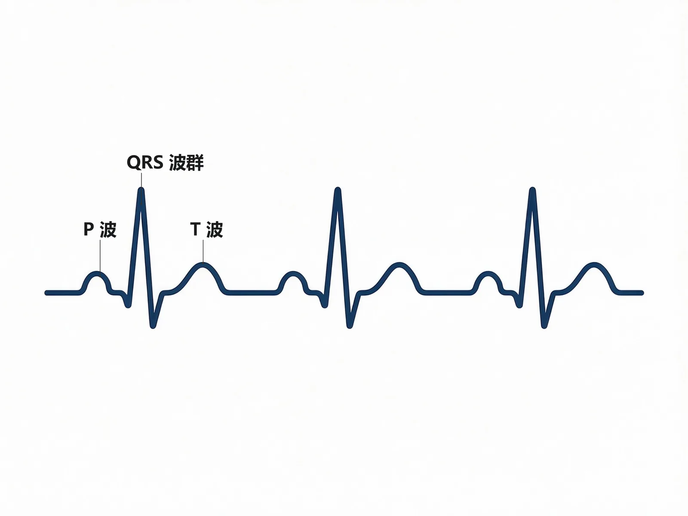

# 急诊与灾难医学 高效复习手册（教材浓缩型 v5.1）

> 教学计划 2026 | 11 模块 · 教材浓缩型 v5.1 五维深度体系（D1-D5）
> 来源：《急诊与灾难医学（第4版）》人民卫生出版社 + 贺银成讲义补充（中册·内科学/诊断学；下册·外科学）+ 教学计划
> 版本：急诊与灾难医学_v1 | 目标：临床医学大四上期末/执医/考研基础
> v5 升级：第一性原理（D1）+ 因果链（D2）+ 谱系梯度（D3）+ 决策树（D4）+ 概念地图（D5）

---

## 科目导航：急诊与灾难医学怎么学？

<b>一句话核心逻辑链</b>：急诊与灾难医学 = 把「时间窗」当作第一战场——所有急危重症（休克、中毒、CPR、创伤、灾难救援）都在同一条主线之上：<b>识别威胁生命的问题 → 立即干预（抢时间）→ 稳定生命体征 → 再求病因与确定性治疗</b>；而「先抢后救」「ABC 优先」「分级分拣」就是这套思维的操作层。

- <b>命题规律（对应全篇 11 模块）</b>：M1 绪论考「概念+分诊时限+急救特点」（A1/B1 数字题）；M2 急性中毒是绝对主战场（有机磷 M/N/分级/解毒剂）；M3 呼吸困难以「危重识别与即刻处理」为主线（哮喘危重、张力性气胸、ARDS）；M4 意识障碍与抽搐考「评分+鉴别+急症处治」（GCS、糖尿病急症、癫痫持续状态）；M5 休克考「分类+监测+复苏路径」；M6 环境理化考「数值+处理顺序」（九分法、热射病降温、毒蛇咬伤）；M7 MODS 考「SIRS 标准+脓毒症定义+器官支持」；M8 心肺脑复苏考「BLS 参数+ACLS 药物+脑复苏」；M9-M11 灾难三章考「四色分拣+分级救治+伦理与防护」。
- <b>题型结构</b>：A1（数值阈值/诊断标准/分拣颜色）、A2/A3（病例组：接触史→症状→诊断→处置一条线）、B1（共用选项：M/N 症状、解毒剂、检伤分级）、X（机制多选）。
- <b>复习路径</b>：先把 M1 的「急诊思维五步」装进脑子 → M8 CPR（人人必会的参数）→ M2 中毒（把"清除+解毒剂+分级"用到极致）→ M5 休克 → M7 MODS（休克/感染的上游与下游）→ M3/M4 症状急症 → M6 环境 → M9 创伤 → M10/M11 灾难。前两步搭框架，中间吃透细节，最后理解"现场—医院—灾难"三层场景。
- <b>避坑提示</b>：① 数值题逐字背（CPR 频率深度、GCS、九分法、ChE 三档）；② 病例题先读「接触史/现场环境」再回推诊断；③ 「先救命后治病」「先分流后救治」是贯穿全篇的价值观，做任何处置题前先问"这步是否抢时间"；④ 指南数值（如 2020 AHA：胸外按压 100-120 次/分、5-6cm）以教材为准，教材与指南冲突时以教材为主。

> [!TIP] 本科目 90% 的题都在考「同一个底层能力」
> 即 <b>抢时-分级-支持</b> 三件套：什么威胁生命（ABC 评估）→ 多严重（评分/分级：GCS、ChE、九分法、四色检伤）→ 怎么抢（复苏/清除毒物/解药/固定搬运/降颅压）。对每个急症主动回答这三问，即可覆盖绝大多数考点。

---

## 使用指南

<b>分层阅读策略</b>：
- 🔴 <b>掌握级</b>（逐字精度）：CPR 参数与药物、有机磷分级与解毒剂、GCS 评分、休克复苏路径、烧伤九分法、检伤四色分拣——考前必背，配合 D1 理解记忆。
- 🟡 <b>熟悉级</b>（能复述机制与鉴别）：微循环三期、SIRS/脓毒症定义、各中毒毒物-解毒剂对应、环境中暑分型、创伤 ABCDE。
- 🟢 <b>了解级</b>（眼熟即可）：急诊医学发展史、灾难救援组织体制、灾后防疫、心理救援。

<b>主动回忆法</b>：每模块「🔄 主动回忆区」的填空（答案用《》包裹）先遮住答案自测，再展开核对；「🌳 鉴别诊断决策树」要求自己从"主诉+体征"口述完整路径，而不是只看图。

<b>三遍刷法</b>：第 1 遍只读 D1 第一性原理 + D2 因果链（建立直觉）→ 第 2 遍背表格数值 → 第 3 遍用决策树和回忆区输出检验。

---

## 📐 急诊与灾难医学疾病谱系总览（D3：从轻到危）

```
机体代偿良好（无生命威胁，可门诊/观察）
  ↓ ← 转折点1: 出现生命体征异常（T/HR/RR/BP 任一不稳）
存在生命威胁的急症（需立即评估与处理：意识障碍、呼吸困难、休克初期）
  ↓ ← 转折点2: 出现器官功能障碍（SIRS 达成 2 项 / 单器官衰竭）
危重症（休克失代偿、脓毒症、ARDS、MODS、重度中毒、张力性气胸、脑疝）
  ↓ ← 转折点3: 心搏骤停 / 循环呼吸停止（ROSC 窗口期）
心搏骤停 → BLS/ACLS → ROSC → 复苏后综合征（脑损伤/心功能障碍/全身缺血再灌注）
  ↓ ← 转折点4: 多系统序贯衰竭（MODS）且不可逆
终末期（MOF / 脑死亡判定 / 灾难现场黑色分拣）
```

<b>关键转折点识别</b>：
- 转折点1（无威胁→有威胁）：生命体征四项（T/HR/RR/BP）任一异常，即进入"有生命威胁"——急诊分诊 Ⅰ/Ⅱ 类。
- 转折点2（急症→危症）：SIRS ≥2 项或单器官衰竭（如 ARDS、AKI、肝衰竭），休克进入失代偿期（乳酸升高、尿量↓）。
- 转折点3（危症→骤停）：室颤/无脉室速、PEA、心室停搏——此时成败在 4-6 分钟窗口（脑氧债）。
- 转折点4（骤停后→MODS/终末）：复苏后综合征未控 → 多器官序贯功能障碍，病死率随衰竭器官数上升；灾难现场「黑标」即此不可逆终末。
- 每越过一个转折点，抢救难度与预后均呈非线性恶化；急诊思维"先抢后救"的本质就是在转折点 1-3 之间把资源倾注下去。

---

## 模块速览地图

| 模块 | 名称 | 谱系位置 | 与其他模块关键连接 |
|------|------|---------|-------------------|
| M1 | 绪论 | 全谱系总纲（思维/分诊/体系） | →M2-M11 提供"抢时-分级"框架 |
| M2 | 急性中毒 | 从代偿到危重的可逆特例 | 前=M1；→M7（中毒性 MODS） |
| M3 | 呼吸困难 | 转折1-2 的呼吸侧 | →M7（ARDS）、M8（窒息性骤停） |
| M4 | 意识障碍与抽搐 | 转折1-3 的神经侧 | →M8（脑疝骤停）、M5（脓毒症） |
| M5 | 休克 | 转折1-3 的循环侧 | →M7（休克→MODS）、M6（烧伤休克） |
| M6 | 环境及理化因素损伤 | 急性损伤谱（可逆性强） | →M5（烧伤休克）、M8（淹溺/电击 CPR） |
| M7 | 多器官功能障碍综合征 | 转折2-4（序贯衰竭） | 汇合=M2/M3/M5/M8 |
| M8 | 心肺脑复苏 | 转折3（骤停窗口） | 下游=M7；上游=M3/M4/M6 |
| M9 | 创伤急救 | 转折1-3 的机械侧 | 前=M1；→M5（失血性休克）、M11 |
| M10 | 灾难医学 | 宏观组织层（灾前/灾中/灾后） | →M9（伤员）、M11（现场） |
| M11 | 灾难现场医学救援 | 现场执行层（分拣-救治-转运-防护） | 汇合=M9/M10 |

## 模块1：绪论

> [!INFO] 模块信息
> <b>重点等级</b>：🔴掌握3个（急诊医学/EMSS三位一体、医院急诊5类分诊、黄金时间） / 🟡熟悉5个（灾难医学、院前急救技术指标、EICU、我国急诊医学发展年表、专业特点） / 🟢了解2个（教学特点、急诊思维）
> <b>预计题型</b>：A1 / B1（仅标注，不出题）
> <b>关联模块</b>：与模块5 休克、模块8 心肺脑复苏（后续应用），模块9 创伤急救（灾难救援衔接）
> <b>谱系位置</b>：绪论是急危重症谱系的"总入口"，无严重度梯度，但确立"先救后诊"的时限思维
> <b>预计阅读</b>：约 12 分钟

---

### 🧩 前置知识检查

- 明白"某病人病情危重"与"某病人尚未明确诊断"哪个应优先处理——急诊的第一原则。
- A-B-C（气道、呼吸、循环）的评估先后顺序。
- 三级医院急诊科"分诊"的大致含义。

---

### 🎯 高收益摘要

一个是<b>概念体系</b>：急诊医学 vs 灾难医学（"救人治病" vs "先抢后救"）；一个是<b>体系结构</b>：院前急救-医院急诊-危重症监护三位一体的 EMSS；一个是<b>时间概念</b>：黄金时间与急诊分诊的 5 类时限。记住三个数字串：院前急救反应时间<b>5～10 分钟</b>、分诊<b>10/30/60/120 分钟</b>、急诊留观<b>≤72 小时</b>（P1-P5）。

---

### 📋 结构化笔记

#### 🔴 考点1：急诊医学与灾难医学的概念（教材P1）

<b>定义句</b>：急诊医学是涉及院前急救、院内急诊、急危重症监护、现场急救、创伤急救、急病（症）救治、心肺复苏、急性中毒、理化及环境因素损伤及相关学科理论与技能的一门临床医学专业（教材P1）。

💡<b>为什么重要</b>：这是全书的"总纲定义"，可类比记忆——急诊处理的不是"某某系统疾病"，而是"某个突发危重状态"。

🧬<b>第一性原理段</b>：急诊医学关心的不是器官，而是"氧供—灌注—意识"这条生命线。它把"稳定生命体征"放在"明确诊断"之前，是因为一旦脑、心低灌注过久，机体代偿会从可逆转向不可逆。灾难医学则把"使伤员脱离危险环境"放在"分拣急救"之前，本质是环境安全优先。

<b>机制要点</b>：急诊医学核心=早期判断+迅速有效救治+保护脏器功能和生命安全。急救的内涵更强调"急救反应能力"（人员/车辆/通信调动、现场急救、安全转运、初期抢救）。灾难医学是面对大规模伤亡的医疗救援分支，含预见、预防、准备、现场解救与急救、卫生防疫、心理危机干预。

> [!TIP] 一句话记"救人治病" vs "先抢后救"
> 急诊医学讲"救人治病"：救命优先，稳定生命体征后才能确定诊断（教材P4）；灾难医学讲"先抢后救"：先脱离危险环境，再分拣急救（教材P4）。二者都指向"先处理最威胁生命的问题"。

#### 展开：急诊 vs 灾难·核心差异速览

| 维度 | 急诊医学 | 灾难医学 |
|------|---------|---------|
| 核心原则 | 救人治病 | 先抢后救 |
| 处理对象 | 单个急危重症/创伤 | 大规模批量伤员 |
| 首要动作 | 评估风险、稳定生命体征 | 环境安全评估、现场分拣 |
| 时间观 | 黄金时间窗 | 大规模资源调度与分级救治 |


#### 🔴 考点2：院前急救的任务与技术指标（教材P1-2）

<b>定义句</b>：院前急救是到达医院前急救人员对急症、创伤病人开展的现场或转运途中的医疗救治（教材P1）。

💡<b>为什么重要</b>：院前急救质量直接决定入院前存活率，其技术指标是考"分数-时间"常客。

🧬<b>第一性原理段</b>：死亡风险随时间按指数增长，院前阶段是所有急危重症共用的"起点"，所以用"反应时间""现场抢救时间""转运时间"三个时间段来衡量。其中急救反应时间是评价系统运行效率的硬指标，国际目标为 <b>5～10 分钟</b>。

<b>机制要点</b>（技术指标三块）：
1. 院前急救时间：急救反应时间（接电话→救护车抵达伤病现场，国际目标 <b>5～10 分钟</b>）、现场抢救时间（视伤病情是否允许安全转运）、转运时间（现场→医院，取决于交通与医院分布）。
2. 院前急救效果：<b>院前心脏骤停的复苏成功率</b>是评价急救效果的重要客观指标。
3. 院前急救需求：受救护车数量/分布、急救电话应答指导、人员反应能力制约；突发事件应急救援能力是重要指标。

> [!WARNING] 别把"急救反应时间"与"现场抢救时间"混了
> 急救反应时间=接求救电话→救护车抵达<b>现场</b>的时间（国际目标 5～10 分钟）；现场抢救时间=急救人员在<b>现场</b>救治的时间。前者考时长数字，后者考"是否允许转运"的临床判断。

#### 展开：院前急救四大任务与效果评价

- 四大任务：①对急症、创伤病人进行现场生命支持与紧急处理，稳定病情、安全转运；②对突发公共卫生事件/灾难事故实施应急医学救援；③在特殊重大集会、重要会议、赛事及重要人物活动中承担意外救护准备；④承担急救通信指挥，作为联络急救中心（站）、医院和上级行政部门的信息枢纽。
- 效果评价：院前心脏骤停复苏成功率是评价急救效果的重要客观指标；熟练实施标准化急救流程可提高效果。
- 需求满足度受救护车数量/分布、急救电话应答指导、人员反应能力制约，突发公共卫生事件应急救援能力亦是重要衡量指标。


#### 🔴 考点3：医院急诊的5类分诊与急诊科任务（教材P2）

<b>定义句</b>：急诊分诊根据病情的轻重缓急将急诊病人分为 5 类（Ⅰ～Ⅴ类）（教材P2）。

💡<b>为什么重要</b>：这是分诊时限的"数字题"核心，也是统考常考。

🧬<b>第一性原理段</b>：分诊本质是"把有限的急诊资源匹配给最急需的生命救援"，所以按"能否立即致命"排序，时限呈倍数放大（立即→10→30→60→120 分钟）。

<b>机制要点</b>（5类分诊时限）：
- Ⅰ类：生命垂危病人，<b>立即</b>抢救。
- Ⅱ类：随时危及生命，<b>10 分钟内</b>评估治疗。
- Ⅲ类：存在危及生命状况，<b>30 分钟内</b>评估治疗。
- Ⅳ类：潜在危重状况，<b>1 小时内</b>急诊处理。
- Ⅴ类：非紧急病人，一般<b>2 小时内</b>处理。

> [!SUCCESS] 数字记忆锚
> Ⅰ立即、Ⅱ10min、Ⅲ30min、Ⅳ1h、Ⅴ2h。可顺口溜："立、十、三、一、二"。急诊科任务还包括：观察床留观时间原则上不超过 <b>72 小时</b>。


#### 展开：急诊科软硬件要点

- 急诊科（ED）是医院急症、创伤救治的首诊场所，全年每天 24h 开放，需独立区域、布局合理、设施齐备、人员相对固定。
- 处理去向：急诊手术、入院、危重症监护、急诊留观、转专科门诊或离院。
- 2009《急诊科建设与管理指南（试行）》：留观时间原则上不超过 72 小时。


#### 🟡 考点4：危重症监护与 EICU（教材P3）

4-6 行：危重症监护指在急诊抢救和观察区域内实现完备监护与抢救的医疗功能；基本特征：①在"黄金时间"内恰当救治，避免死亡伤残；②经监护培训的医护人员更有效处理危重症。现阶段三级综合型医院急诊科普遍建立<b>急诊危重症监护室（EICU）</b>。EICU 收治的 4 类病人：①心肺复苏后生命体征不稳、需持续循环呼吸支持；②病情垂危不宜搬运转运；③只需短时间监护救治即可治愈、无需住院；④为其他专科难以收住院的复杂危重病人。

#### 🟡 考点5：我国急诊医学发展年表（教材P3）

4-6 行：1980《卫生部关于加强城市急救工作的意见》促学术交流；1986《中华人民共和国急救医疗法（草案）》规定"市、县以上地区成立急救医疗指挥系统，实行三级急救医疗体制"；<b>1987 年 5 月成立急诊医学学会</b>，1997 年更名为<b>中华医学会急诊医学分会</b>；2009 年 5 月《急诊科建设与管理指南（试行）》；2011 年新修订《突发公共卫生事件应急条例》。发展三阶段：①三级医院成立急诊科、以分诊+专科支援为主；②急诊科自主型发展、能完成初期评估与监护但人员多非急诊专业出身；③急诊医学专业完善、纳入本科研究生教学、建立住培基地与专科医师培训准入。

#### 🟡 考点6：急诊医学专业特点（教材P4）

4-6 行：①危重复杂性（易发 SIRS→MODS→MOF）；②时限急迫性（强调"时间窗"、实现早期目标治疗）；③机制可逆性（早期纠正功能紊乱，在病理可逆阶段控制损害）；④综合关联性（需跨专科综合分析、寻找影响生命体征稳定的根源）；⑤处置简捷性（制定固定临床路径、循证、简捷有效）。急诊思维的本质是"评估风险→抢救生命→边救治边观察边诊断边评估边调整"。

> [!NOTE] 急诊思维顺序（教材P5）
> 先问：有无生命危险？→ 有无器官功能障碍及可能原因？→ 原发疾病及其解剖部位？教学流程"评价A-B-C（气道呼吸循环）→评估病情严重程度→采取措施→重复评估确认反应"。灾难场景还须加"环境安全评估+快速分拣"。

---

### 📊 对比速查

<b>表1-1 院前急救、医院急诊、危重症监护（EMSS三位一体）对比</b>

| 环节 | 核心任务 | 关键指标 | 时间观 |
|------|---------|---------|--------|
| 院前急救 | 现场生命支持、安全转运、应急医学救援、急救通信指挥 | 急救反应时间 5～10 分钟；心脏骤停复苏成功率 | 黄金时间起点 |
| 医院急诊 | 急诊伤病员早期救治+部分危重症监护、合理分流病员 | 5 类分诊时限；留观≤72h | 分诊台/抢救室 |
| 危重症监护 | 完备监护、生命/器官功能支持（EICU/ICU） | 监护治疗时长、救治质量 | 黄金时间内持续救治 |

<b>表1-2 医院急诊5类分诊时限对比</b>

| 类别 | 状态 | 时限 |
|------|------|------|
| Ⅰ类 | 生命垂危 | 立即抢救 |
| Ⅱ类 | 随时危及生命 | 10 分钟内 |
| Ⅲ类 | 存在危及生命状况 | 30 分钟内 |
| Ⅳ类 | 潜在危重状况 | 1 小时内 |
| Ⅴ类 | 非紧急 | 2 小时内 |

---

### 🔗 因果链流程图（D2）

```
急危重症/创伤/意外伤害突然发生
        │
        ▼
  [黄金时间窗口打开]──> 死亡风险随时间指数上升
        │
        ▼
  EMSS 三位一体介入
   ├── 院前急救：5-10min 反应 + 现场抢救 + 安全转运
   │        └──> 稳定生命体征、降低入院前死亡率
   ├── 医院急诊：5类分诊(立即/10/30/60/120min)
   │        └──> 资源匹配给最急需者、留观≤72h
   └── 危重症监护(EICU)：黄金时间内生命/器官支持
            └──> 防止 SIRS→MODS→MOF
        │
        ▼
  早期有效救治(时间窗+早期目标治疗)
        │
        ▼
  降低死亡率、减少功能伤残、提高存活率和预后
```

---

### 🌳 鉴别诊断决策树（D4）

```
急诊接诊任一急危重症
   │
   ├─ 问：有无生命危险？(A-B-C：气道、呼吸、循环)
   │     ├─ 是 → 立即抢救(稳定生命体征优先) [救人治病]
   │     └─ 否 → 评估病情严重程度
   │
   ├─ 问：有无器官功能障碍及可能原因？
   │     ├─ 单器官 → 按系统病因处理
   │     └─ 多器官(SIRS↑) → 警惕 MODS→MOF，按危重监护
   │
   └─ 问：原发疾病及其解剖部位？
         ├─ 能确诊 → 病因治疗
         └─ 不能确诊 → 边救治/边观察/边诊断/边调整
```

---

### 🔄 主动回忆区

- 院前急救国际目标反应时间为《5～10 分钟》分钟。
- 急诊分诊 Ⅱ 类（随时危及生命）应在《10 分钟》内评估治疗；Ⅲ类为《30 分钟》；Ⅳ类为《1 小时》。
- 急诊留观时间原则上不超过《72 小时》。
- EMSS 三位一体指《院前急救、医院急诊、危重症监护》。
- 急诊医学与灾难医学的原则分别是《救人治病》与《先抢后救》。
- 1987 年成立的学会后来更名为《中华医学会急诊医学分会》。

---

### ⚠️ 常见陷阱

- 易混"急诊医学"与"急救"：急诊医学是学科，急救更强调应急反应与组织管理能力；不要把急救反应时间当成现场抢救时间。
- 分诊时限记成"5 类都 10 分钟"是常见错，正确为阶梯式递增。
- 误以为急诊必须先明确诊断再抢救——恰恰相反，急诊强调救命优先、先稳定生命体征。
- 把黄金时间理解为"到达医院的时间"，实为从致伤/发病起计时的时间窗。

---

### 💡 记忆口诀

- 三位一体：<b>院（院前）——院（院内急诊）——监（危重症监护）</b>。
- 分诊时限：<b>"立、十、三、一、二"</b>。
- 急诊原则：<b>"救人治病先救命，脱离险境再分拣"</b>。

---

### 📌 本章小结

> [!INFO] 本章小结
> 本章搭建急诊医学的"体系—时间—原则"框架：EMSS 三位一体、分诊 5 类时限、黄金时间窗、EICU 监护、"救人治病/先抢后救"两大原则。掌握这些"骨架数字"是后续各模块的公共前提——几乎所有急症的抢救流程都从"评估 A-B-C、判断有无生命危险"开始。

<b>🧬 本章核心洞察</b>：急诊的核心不是"诊断"，而是"在不可逆之前给出足量时间的有效支持"——所以抢救顺序永远是"先稳定，后诊断"。

---

### 🔗 深度链接

- 与<b>模块2 急性中毒</b>：中毒的处理同样遵循"先稳定生命体征（评估A-B-C）→清除毒物→特效解毒药"的顺序。
- 与<b>模块5 休克</b>：院前急救"维持灌注"正是休克复苏的起点。
- 与<b>模块8 心肺脑复苏</b>：院前心脏骤停复苏成功率是院前急救效果的关键指标。

---

## 模块2：急性中毒

> [!INFO] 模块信息
> <b>重点等级</b>：🔴掌握5个（有机磷中毒机制与分级、阿托品化/阿托品中毒、洗胃禁忌与特殊洗胃液、血液净化选择、特效解毒药） / 🟡熟悉5个（百草枯、杀鼠剂、食物中毒、药物中毒、CO中毒） / 🟢了解3个（除草剂、酒精中毒、气体中毒分型）
> <b>预计题型</b>：A1 / B1 / 病例相关（仅标注，不出题）
> <b>关联模块</b>：与模块1 绪论（先稳定后诊断）、模块4 意识障碍与抽搐（中毒性昏迷瞳孔/呼吸鉴别）、模块8 心肺脑复苏（中毒性心跳骤停）
> <b>谱系位置</b>：中毒是"外源性毒物攻击内环境"的急症，按毒物类别横向展开，严重度由器官衰竭数目决定
> <b>预计阅读</b>：约 25 分钟

---

### 🧩 前置知识检查

- 胆碱能神经（副交感/交感节前/运动终板）的递质是乙酰胆碱；乙酰胆碱酯酶水解乙酰胆碱。
- 阿托品阻断 M 受体（瞳孔散大、口干、心率加快）——这是"阿托品化"的对照点。
- 血液净化三方式（透析/灌流/置换）对分子量与蛋白结合率的不同要求。

---

### 🎯 高收益摘要

急性中毒总论抓"一条原则+四步清除+一套解毒药"。要点记忆：洗胃<b>4～6 小时</b>内最佳；<b>敌百虫忌碳酸氢钠、对硫磷忌高锰酸钾</b>；血液净化"<b>小分子水溶→透析、大分子脂溶/高结合→灌流、高蛋白大分子→置换</b>"。有机磷是重中之重：M 样（最早）/N 样/中枢三组症状，血胆碱酯酶 <b>50-70/30-50/<30</b> 分级，解毒"<b>阿托品(解M样)+氯解磷定(解N样)</b>"联合、达到阿托品化即减量、阿托品中毒立即停药。

---

### 📋 结构化笔记

#### 🔴 考点1：急性中毒的解救总原则（教材P157）

<b>定义句</b>：急性中毒是短时间内吸收大量毒物导致躯体损害、起病急骤的疾病，治疗原则为立即脱离中毒现场、稳定生命体征、清除体内毒物、尽早用特效解毒药、对症支持（教材P157）。

💡<b>为什么重要</b>：总论的五步原则是统帅，也是"先救后诊"在中毒里的具体化。

🧬<b>第一性原理段</b>：中毒的危险在于"毒物持续进入并损害关键器官"；只要切断毒源、清除已吸收/未吸收毒物、用特异性拮抗剂解除分子层面的结合，就能在不可逆损害前中止病程。

<b>机制要点</b>（吸收/代谢/排出）：经呼吸道、消化道、皮肤黏膜吸收；主要在肝脏代谢（少数增毒，如<b>对硫磷→对氧磷</b>，毒性增强）；主要由肾脏排出，气体/易挥发性物经呼吸道排出，重金属（铅汞锰砷）经消化道和乳汁排出。中毒机制六类：局部腐蚀刺激、缺氧、麻醉作用、抑制酶活力（有机磷抑 ChE、氰化物抑细胞色素氧化酶、重金属抑含巯基酶）、干扰细胞/细胞器生理（四氯化碳→脂质过氧化）、受体竞争（阿托品）。

> [!NOTE] "通吃"的六大中毒机制
> 腐蚀刺激 / 缺氧 / 麻醉 / 抑酶 / 干扰细胞器 / 受体竞争——所有中毒都能归入这六类，遇到"机制"题先往这 6 个框里套。

#### 展开：各类毒物"一票"线索（教材P158-159）

- 皮肤黏膜：灼伤（强酸强碱、甲醛、苯酚、百草枯）；发绀（麻醉药、有机溶剂、亚硝酸盐、苯胺、硝基苯）；<b>樱桃红（CO、氰化物）</b>；颜面潮红（阿托品、乙醇）。
- 瞳孔：<b>缩小（有机磷、阿片类、镇静催眠药、氨基甲酸酯）</b>；扩大（阿托品、莨菪碱、甲醇、乙醇、氰化物）。
- 呼出气味：<b>氰化物=苦杏仁味；有机磷/黄磷/铊=大蒜味</b>；苯酚类=苯酚味。
- 呼吸：加快/深大（CO2、呼吸兴奋剂、水杨酸类）；减慢（催眠药、吗啡、海洛因）。
- 实验室：全血胆碱酯酶下降→有机磷/氨基甲酸酯；COHb 升高→CO；高铁血红蛋白血症→亚硝酸盐/苯胺/硝基苯；凝血异常→抗凝血灭鼠药/蛇毒/毒蕈。


#### 🔴 考点2：清除毒物四法 + 血液净化选择（教材P159-161）

<b>定义句</b>：清除体内毒物分"清除未吸收"（催吐、洗胃、导泻、全肠道灌洗）与"促进已吸收排出"（强化利尿及改变尿pH、高压氧、血液净化）（教材P159-161）。

💡<b>为什么重要</b>：洗胃禁忌、特殊洗胃液、血液净化三方式对照是高频考点。

🧬<b>第一性原理段</b>：清除未吸收毒物的关键窗口是"毒物还在消化道内"；毒物分子要穿过胃肠黏膜才入血，所以洗胃越早越有效。已吸收毒物则根据其<b>分子量、水溶性、蛋白结合率</b>选择清除手段——水溶小分子交透析，脂溶/高结合/大分子交灌流，高蛋白大分子交置换。

<b>机制要点</b>：
- 催吐：适用于神志清楚能配合者；<b>昏迷、惊厥、吞服腐蚀性毒物者禁忌</b>。
- 洗胃：一般<b>服毒后 4～6 小时</b>内效果最好，超过 6 小时若毒物残留仍可洗；<b>吞服腐蚀性毒物不宜</b>；昏迷/惊厥者注意呼吸道保护防误吸。一次总量至少 2～5L，有机磷需反复多次洗胃。
- 导泻：洗胃后注入泻药，<b>一般不用油脂类</b>（防促进脂溶性毒物吸收），常用硫酸钠/硫酸镁 15g 溶于 200ml 水。
- 全肠道灌洗：4～6h 清空肠道，用于<b>中毒超 6 小时或导泻无效</b>者；高分子聚乙二醇等渗电解质液，2L/h。
- 血液净化：
  - <b>血液透析</b>：清除<b>分子量<500Da、水溶性强、蛋白结合率低</b>的毒物（醇类、水杨酸、苯巴比妥、茶碱）；对短效巴比妥、有机磷（脂溶性）作用差。<b>氯酸盐、重铬酸盐中毒易致急性肾衰，应首选血液透析</b>。
  - <b>血液灌流</b>：对分子量 500～40000Da 的水溶/脂溶性毒物均有清除作用（镇静催眠药、解热镇痛药、洋地黄、有机磷、毒鼠强），对脂溶性强/蛋白结合率高/分子量大的清除力远大于透析，<b>常作急性中毒首选净化方式</b>。
  - <b>血浆置换</b>：清除蛋白结合率高、分布容积小的大分子，对<b>蛇毒、毒蕈、砷化氢（溶血性）</b>疗效最佳，还可补充活性胆碱酯酶等有益成分。

> [!WARNING] 洗胃"两忌"必须背（教材P163）
> ①敌百虫中毒<b>禁用碳酸氢钠</b>洗胃（碱→敌敌畏，毒性增强）；②对硫磷中毒<b>禁用高锰酸钾</b>洗胃（氧化→对氧磷，毒性增强数百倍）。对不明原因中毒用<b>清水</b>洗胃。另外强酸中毒禁碳酸氢钠（产气致穿孔）。

#### 展开：特殊解毒药一览（教材P160-161）

| 中毒 | 特效解毒药 | 备注 |
|------|-----------|------|
| 铅 | 依地酸钙钠（CaNa2-EDTA） | 最常用氨羧螯合剂 |
| 砷/汞/锑/铜 | 二巯丙醇、二巯丙磺钠、二巯丁二钠 | 巯基螯合剂 |
| 亚硝酸盐/苯胺/硝基苯（高铁血红蛋白） | 亚甲蓝（1～2mg/kg） | 小剂量还原 |
| 氰化物 | 亚硝酸盐-硫代硫酸钠 | 联合疗法 |
| 有机磷 | 阿托品、盐酸戊乙奎醚、碘解磷定/氯解磷定 | 详见考点4 |
| 阿片类/阿片类及酒精/镇静催眠 | 纳洛酮 0.4～0.8mg（总量可达 10～20mg） | 阿片受体拮抗剂 |
| 苯二氮䓬 | 氟马西尼 0.2mg（总量可达 2mg） | 特异性拮抗 |


#### 🔴 考点3：有机磷中毒的机制与分级（教材P161-163）

<b>定义句</b>：急性有机磷杀虫剂中毒系有机磷抑制乙酰胆碱酯酶，乙酰胆碱蓄积，使胆碱能神经持续冲动，产生毒蕈碱样、烟碱样和中枢神经系统症状（教材P161）。

💡<b>为什么重要</b>：这是中毒章节分量最重、最常考的内容。

🧬<b>第一性原理段</b>：有机磷与胆碱酯酶酯解部位结合成稳定的<b>磷酰化胆碱酯酶</b>，丧失水解乙酰胆碱能力→乙酰胆碱在突触大量蓄积→副交感（M）过度兴奋、横纹肌神经肌肉接头（N）持续受刺激、中枢兴奋后抑制。神经末梢胆碱酯酶恢复较快（次日多基本恢复），但<b>红细胞胆碱酯酶不能自行恢复，须待数月红细胞再生</b>。

<b>机制要点</b>（三种症状）：
- <b>M 样（毒蕈碱样，出现最早）</b>：副交感末梢兴奋、平滑肌痉挛、腺体分泌增加——恶心呕吐、腹痛腹泻、尿频大小便失禁、多汗、全身湿冷、流泪、流涎、<b>瞳孔缩小（针尖样）</b>、心率减慢、气道分泌物增加、支气管痉挛、严重可肺水肿。
- <b>N 样（烟碱样）</b>：横纹肌神经肌肉接头处乙酰胆碱蓄积，<b>肌纤维颤动→强直性痉挛</b>，后期肌力减退、瘫痪，<b>并发呼吸肌麻痹→周围性呼吸衰竭</b>。
- <b>中枢神经</b>：头晕头痛、疲乏、共济失调、烦躁、谵妄、抽搐、昏迷。

<b>中毒程度分级</b>：
- 轻度：以 M 样症状为主，胆碱酯酶活力 <b>50%～70%</b>。
- 中度：M 样加重 + 出现 N 样症状，胆碱酯酶活力 <b>30%～50%</b>。
- 重度：合并脑水肿、肺水肿、呼吸衰竭、抽搐、昏迷，胆碱酯酶活力 <b><30%</b>。

> [!TIP] 三个"特殊综合征"别混淆（教材P162-163）
> <b>反跳</b>：乐果/马拉硫磷口服者，症状好转达稳定期数天至一周后突然恶化（皮肤毛发胃肠道残留毒物再吸收、解毒药减量太快）。<b>中间型综合征(IMS)</b>：急性中毒后 <b>1～4 日</b>，颈屈肌/四肢近端/第Ⅲ~Ⅶ、Ⅸ~Ⅻ脑神经肌力减退，累及呼吸肌→呼吸肌麻痹、呼吸衰竭。<b>迟发性多发性神经病</b>：急性重度中毒症状消失后 <b>2～3 周</b>，肢体末端烧灼疼痛麻木、下肢无力瘫痪（非胆碱酯酶受抑，而是抑制并老化神经靶酯酶 NTE）。


#### 展开：有机磷毒物分类与代谢增毒（教材P161-162）

- 按 LD50 分四类：剧毒 <10mg/kg、高毒 10～100mg/kg、中度毒 100～1000mg/kg、低毒 1000～5000mg/kg。
- 代谢特点："先氧化增毒、后水解减毒"。对硫磷、内吸磷先氧化为对氧磷、亚砜（毒性分别增强约 300 倍、5 倍），再水解减毒；<b>敌百虫先脱氯化氢转化为敌敌畏（毒性成倍增加），再降解失活</b>——这就是"敌百虫忌碱、对硫磷忌高锰酸钾"的化学基础。
- 排泄：代谢物主要经肾脏排出，少量经肺，48h 可基本排尽，体内一般不蓄积。


#### 🔴 考点4：有机磷的治疗——阿托品化与胆碱酯酶复活剂（教材P163-164）

<b>定义句</b>：有机磷特效解毒药应用原则为"早期、足量、联合、重复用药"；抗胆碱药（阿托品/戊乙奎醚）解 M 样症状，胆碱酯酶复活剂（氯解磷定/碘解磷定/双复磷）解 N 样症状（教材P163-164）。

💡<b>为什么重要</b>：阿托品化 vs 阿托品中毒的判定是"分数题"，联合用药逻辑是"机制题"。

🧬<b>第一性原理段</b>：阿托品只拮抗 <b>M 受体</b>（副交感+中枢毒蕈碱受体），能解 M 样症状及呼吸中枢抑制，<b>对 N 受体无效</b>，故对肌颤/呼吸肌麻痹无效；胆碱酯酶复活剂（肟类）含季胺基（吸引到阴离子部位）+肟基（与磷结合），使磷酰化胆碱酯酶分离、恢复活力，<b>能解 N 样症状、迅速控制肌纤维颤动</b>。因而中重度须两者联合。

<b>机制要点</b>：
- <b>阿托品化</b>：瞳孔较前扩大、口渴、皮肤干燥、颜面潮红、心率加快、<b>肺部啰音消失</b>——此时应逐步减量。
- <b>阿托品中毒</b>：瞳孔明显扩大、意识模糊、烦躁不安、谵妄、惊厥、昏迷、尿潴留——<b>立即停用阿托品</b>，酌情毛果芸香碱对抗，必要时血液净化。阿托品中毒是导致有机磷中毒者死亡的重要因素。
- <b>盐酸戊乙奎醚</b>：新型抗胆碱药，拮抗中枢+外周 M、N 受体，选择性作用于脑/腺体/平滑肌的 M1、M3 受体，对心脏 M2 无明显作用→<b>不引起心动过速</b>、半衰期长、中枢作用强。<b>目前推荐替代阿托品作为首选抗胆碱药</b>（其阿托品化判定标准与阿托品相似，但<b>心率增快不作判断标准</b>）。
- <b>洗胃液</b>：清水、2% 碳酸氢钠（<b>敌百虫忌</b>）或 1:5000 高锰酸钾（<b>对硫磷忌</b>）。

> [!SUCCESS] "阿托品化=阿托品中毒"对照
> 阿托品化 = 瞳孔扩大+口干+皮肤干燥+颜面潮红+心率加快+肺部啰音消失（好转待减量）；阿托品中毒 = 瞳孔明显扩大+意识模糊+躁动谵妄+惊厥昏迷+尿潴留（立即停药）。口诀：<b>"化"在兴奋、"毒"在妄动</b>。

#### 展开：其他杀虫剂中毒的处理（教材P165）

- <b>氨基甲酸酯类</b>（呋喃丹/西维因/叶蝉散/涕灭威）：毒理同有机磷，但胆碱酯酶能在体内水解恢复（2～4h）。治疗用<b>阿托品，忌用胆碱酯酶复活剂</b>。
- <b>拟除虫菊酯类</b>（溴氰菊酯/氰戊菊酯/氯氰菊酯）：抑制神经细胞膜钠离子通道"M"闸门关闭，肌肉持续收缩、抽搐、角弓反张。治疗<b>控制抽搐</b>（地西泮、苯妥英钠）。
- <b>有机氮类（杀虫脒）</b>：代谢产物苯胺活性基团使血红蛋白氧化成高铁血红蛋白→发绀、出血性膀胱炎。治疗<b>小剂量亚甲蓝</b>。


#### 🟡 考点5：百草枯中毒（教材P166-167）

4-6 行：百草枯经消化道/皮肤/呼吸道吸收，4h 血药浓度高峰，<b>在肺组织主动蓄积</b>（含量为血液数十倍），通过过氧化损伤+炎症致多器官功能不全；<b>呼吸衰竭是主要死因</b>。<b>无特效解毒药</b>，尽早排毒+血液净化+免疫抑制剂是救治关键。肺损伤最突出：大剂量 24～48h 出现进行性呼吸困难、口唇发绀、肺水肿或肺出血；存活者可于 1～2 周后发生肺间质纤维化→顽固性低氧血症→呼衰。治疗：洗胃（1%～2% 碳酸氢钠/温清水，量≥5L）后注入 15% 漂白土或活性炭；尽早血液灌流（有肾损者联合透析）；早期适量短疗程免疫抑制剂（甲泼尼龙+环磷酰胺）；抗氧化剂（维生素C/E、谷胱甘肽）。<b>高浓度氧气吸入可加重肺损害</b>，仅当 PaO2<40mmHg 或出现 ARDS 时才用 >21% 氧。

> [!WARNING] 百草枯"限氧"是重点
> 百草枯中毒的肺是"氧气越多越糟糕"——氧自由基加重过氧化损伤。只有在 PaO2<40mmHg 或急性呼吸窘迫综合征时才允许吸 >21% 氧。这与 CO 中毒"高压氧特效"正好相反，是易考点。

#### 🟡 考点6：杀鼠剂中毒（教材P167-168）

4-6 行：抗凝血类（溴鼠隆、敌鼠钠）：结构与维生素 K 相似，干扰维生素 K 利用、抑制凝血因子/凝血酶原合成，且代谢产物损伤毛细血管→严重内出血。特效<b>维生素 K1 10～20mg iv，q3～4h，24h 总量 120mg，疗程 1 周</b>+输新鲜血。毒鼠强（四亚甲基二砜四胺）：拮抗 GABA 受体→中枢过度兴奋→阵挛性惊厥、癫痫大发作；治以清除毒物/血液净化/抗惊厥（地西泮、苯巴比妥、二巯丙磺钠），<b>禁用阿片类</b>。氟乙酰胺：生成氟柠檬酸抑制乌头酸酶→三羧酸循环受阻；特效<b>乙酰胺 2.5～5.0g im 每日 3 次，疗程 5～7 天</b>，石灰水洗胃，尽早高压氧。磷化锌：胃酸下分解产生磷化氢（抑制细胞色素氧化酶、阻断电子传递）+氯化锌（腐蚀胃黏膜）；<b>硫酸铜洗胃</b>，禁牛奶/蛋清/油类/高脂食物。

#### 🟡 考点7：食物中毒与肉毒中毒（教材P168-170）

4-6 行：急性食物中毒潜伏期短、急性发病、群体发病、有季节性（夏季多）。①细菌性食物中毒：沙门菌属、副溶血弧菌、变形杆菌、产肠毒素性大肠埃希菌，<b>有传染性</b>；葡萄球菌、<b>肉毒杆菌</b>由<b>毒素</b>引起，<b>不具传染性</b>。②非细菌性：化学污染与有毒动植物。常见细菌性食物中毒特点：<b>沙门菌</b>潜伏期 4～24h（发热+便水样）；<b>副溶血弧菌</b> 6～20h（海鲜腌渍品、血水样便）；<b>金黄色葡萄球菌</b> 0.5～5h（剧烈呕吐）；<b>肉毒杆菌</b>潜伏期 1～2 天（罐头/豆制品，眼肌麻痹、吞咽言语困难）。肉毒中毒治疗：尽早<b>肉毒抗毒血清</b>（发病 24h 内最有效，5 万～8 万 U），洗胃（清水或 1:4000 高锰酸钾）、灌肠，呼吸困难者气管插管/呼吸机。胃肠炎为主者多数不需抗生素，对症补液、654-2 解痉。

#### 🟡 考点8：药物中毒（教材P170-172）

4-6 行：①苯二氮䓬类：增强 GABA 与受体亲和力、放大突触后抑制，表现为嗜睡言语不清共济失调，很少深昏迷/休克。②巴比妥类：主要抑制网状结构上行激活系统，剂量-效应（镇静→催眠→麻醉→延髓中枢麻痹）；轻中重度按催眠剂量 2-5/5-10/10-20 倍区分。③吩噻嗪类：抑制中枢多巴胺受体+锥体外系反应（帕金森综合征、静坐不能、急性肌张力障碍）。④吗啡/海洛因：抑制中枢和延髓、兴奋缩瞳核；<b>吗啡中毒"三联征"=昏迷、瞳孔针尖样缩小、呼吸抑制</b>。⑤哌替啶：与吗啡不同，<b>瞳孔扩大+中枢兴奋（烦躁谵妄抽搐惊厥）</b>。解毒：<b>氟马西尼</b>（苯二氮䓬拮抗剂 0.2mg 缓慢静注→总量 2mg）；<b>纳洛酮/烯丙吗啡</b>（吗啡）；巴比妥类和吩噻嗪类<b>目前无特效解毒药</b>，哌替啶中毒可加地西泮控制惊厥。

> [!TIP] 吗啡"三联征"做鉴别锚点
> 昏迷+针尖样瞳孔+呼吸抑制 = 吗啡/阿片类中毒（也见于海洛因）；若改为<b>瞳孔扩大</b>+中枢兴奋（谵妄抽搐）则提示<b>哌替啶</b>中毒。瞳孔大小是鉴别药物中毒的快速抓手。

#### 🟡 考点9：酒精中毒与急性CO中毒（教材P172-176）

4-6 行：①急性酒精中毒按血乙醇浓度分三期：<b>兴奋期 >500～1500mg/L</b>、<b>共济失调期 >1500～2500mg/L</b>、<b>昏迷期 >2500mg/L</b>。乙醇 90% 肝代谢（生成大量 NADH→乳酸增多、酮体蓄积→代谢性酸中毒+糖异生受阻→<b>低血糖</b>），10% 以原型从肺肾排出。治疗：纳洛酮 0.4～0.8mg 促醒，小剂量地西泮（<b>禁用吗啡、氯丙嗪、巴比妥类</b>），葡萄糖+维生素B1/B6，血乙醇>5000mg/L 伴酸中毒或合并其他药者尽早血液透析/腹膜透析。②急性 CO 中毒：血 COHb 浓度分级——轻 10%～20%（头晕头痛恶心呕吐）、中 20%～30%（<b>樱桃红</b>+兴奋判断力降低意识模糊浅昏迷）、重 30%～50%（抽搐深昏迷低血压心律失常呼衰）。CO 中毒是"内窒息"，CO 与血红蛋白亲和力远大于 O2，碳氧血红蛋白不能携氧。<b>高压氧治疗是特效抢救措施</b>（COHb 解离较常压快 4～5 倍、缩短昏迷时间、预防迟发性脑病），适应于中重度、出现神经精神/心血管症状、COHb≥25%，老年妊娠首选；一般每次 1～2h，1 日 1～2 次。严重者 24～48h 脑水肿达高峰，予甘露醇+地塞米松+地西泮控制抽搐。

---

### 📊 对比速查

<b>表2-1 血液净化三种方式的选择对照</b>

| 方式 | 清除对象 | 典型毒物 | 地位 |
|------|---------|---------|------|
| 血液透析 | 分子量<500Da、水溶性强、蛋白结合率低 | 醇类、水杨酸、苯巴比妥、茶碱；氯酸盐/重铬酸盐 | 后者致急性肾衰首选 |
| 血液灌流 | 分子量 500～40000Da，水溶+脂溶性 | 镇静催眠药、解热镇痛药、洋地黄、有机磷、毒鼠强、百草枯 | 急性中毒首选 |
| 血浆置换 | 蛋白结合率高、分布容积小的大分子 | 蛇毒、毒蕈、砷化氢（溶血性） | 生物毒/溶血毒最佳 |

<b>表2-2 有机磷中毒分级对照</b>

| 分级 | 表现 | 胆碱酯酶活力 |
|------|------|-------------|
| 轻度 | 仅 M 样症状为主 | 50%～70% |
| 中度 | M 样加重 + N 样症状 | 30%～50% |
| 重度 | M+N 样 + 脑水肿/肺水肿/呼衰/抽搐/昏迷 | <30% |

<b>表2-3 阿托品化 vs 阿托品中毒</b>

| 指标 | 阿托品化（减量） | 阿托品中毒（停药） |
|------|-----------------|-------------------|
| 瞳孔 | 较前扩大 | 明显扩大 |
| 意识 | 清楚/改善 | 模糊、烦躁、谵妄、惊厥、昏迷 |
| 皮肤黏膜 | 干燥、颜面潮红 | — |
| 心率 | 加快 | — |
| 肺啰音 | 消失 | — |
| 其他 | — | 尿潴留 |

---

### 🔗 因果链流程图（D2）

```
毒物接触/吸收
   │
   ▼
[进入体内→肝胆代谢(多数解毒，少数增毒如对硫磷→对氧磷)]
   │
   ▼
[中毒机制6类：腐蚀/缺氧/麻醉/抑酶/干扰细胞器/受体竞争]
   │
   ▼
[乙酰胆碱酯酶被抑制(有机磷)→乙酰胆碱蓄积]
   ├── M样症状(最早)：平滑肌痉挛、腺体分泌↑、瞳孔缩小(针尖)
   ├── N样症状：肌纤维颤动→肌强直→呼吸肌麻痹
   └── 中枢症状：谵妄、抽搐、昏迷
   │
   ▼
[抢救五步]  ①脱离现场 ②稳生命体征 ③清毒物 ④特效解毒 ⑤对症支持
   │
   ├── 未吸收：催吐/洗胃(敌百虫忌碱/对硫磷忌高锰/4-6h最佳)/导泻/全肠道灌洗
   ├── 已吸收：强化利尿+改尿pH → 高压氧(CO特效) → 血液净化
   │        (小分子水溶→透析 / 大分子脂溶高结合→灌流 / 高蛋白大分子→置换)
   └── 特效解毒药：阿托品(解M) + 氯解磷定(解N) → 达阿托品化即减量，中毒即停药
   │
   ▼
[早期足量联合重复用药 → 降低肺水肿/呼衰/脑死亡风险]
```

---

### 🌳 鉴别诊断决策树（D4）

```
不明原因急症/昏迷
   │
   ├─ 瞳孔变化？
   │     ├─ 缩小(针尖) → 有机磷、阿片类、镇静催眠药、氨基甲酸酯；呼吸慢→阿片/巴比妥
   │     ├─ 扩大   → 阿托品/莨菪碱、甲醇、乙醇、氰化物；伴中枢兴奋→哌替啶、摇头丸
   │     └─ 正常/不等 → 心源性/代谢性/脑血管病
   │
   ├─ 呼出气味？
   │     ├─ 大蒜味 → 有机磷、黄磷、铊
   │     ├─ 苦杏仁味 → 氰化物
   │     ├─ 烂苹果味 → 糖尿病酮症酸中毒
   │     └─ 酒味 → 酒精中毒
   │
   └─ 皮肤黏膜/多系统？
         ├─ 樱桃红 → CO中毒 → 高压氧特效(有COHb证据)
         ├─ 发绀(高铁血红蛋白) → 亚硝酸盐/苯胺/硝基苯 → 亚甲蓝
         └─ 广泛出血 → 抗凝血类灭鼠药 → 维生素K1
```

---

### 🔄 主动回忆区

- 洗胃效果最好一般在服毒后《4～6 小时》内；吞服《腐蚀性毒物》不宜洗胃。
- 敌百虫中毒禁用《碳酸氢钠(碱)》洗胃；对硫磷中毒禁用《高锰酸钾》洗胃。
- 血液透析针对分子量《<500Da》、水溶性强、蛋白结合率低者；血液灌流常作为急性中毒《首选》净化方式。
- 有机磷中毒（血胆碱酯酶）分级阈值：轻度《50%～70%》、中度《30%～50%》、重度《<30%》。
- 阿托品能解《M(毒蕈碱)样》症状，对《N(烟碱)样》无效；氯解磷定能解《N样》症状（肌纤维颤动）。
- 吗啡中毒"三联征"为《昏迷、瞳孔针尖样缩小、呼吸抑制》。
- 中间型综合征发生于中毒后《1～4 日》；迟发性多发性神经病发生于《2～3 周》。
- 百草枯中毒肺损伤治疗须《限制氧疗》，仅当 PaO2<40mmHg 或 ARDS 时才用>21% 氧。
- CO 中毒的特效抢救措施是《高压氧治疗》。

---

### ⚠️ 常见陷阱

- 把"阿托品化"误当成"好转即可停药"——正确是<b>减量</b>；把"阿托品中毒"误当成"必死/加强"——正确是<b>立即停药</b>。
- 以为阿托品能解所有症状——它只解 M 样，<b>N 样（肌颤、呼吸肌麻痹）靠胆碱酯酶复活剂（氯解磷定）</b>。
- 混淆反跳、中间型综合征、迟发性神经病的时机：数天-1周 / 1-4日 / 2-3周。
- 以为洗胃液对任何有机磷都通用——敌百虫忌碱、对硫磷忌高锰酸钾。
- 以为百草枯吸氧越多越好——恰恰相反，高浓度氧加重肺损伤。
- 以为血液透析能清除有机磷（脂溶性）——不能，应选血液灌流；血透主要用于氯酸盐/重铬酸盐等。

---

### 💡 记忆口诀

- 清除毒物四法：<b>"吐、洗、泻、灌（全肠道）"</b>——催吐、洗胃、导泻、全肠道灌洗。
- 血液净化三选：<b>"小水透、大病灌、蛋白置换"</b>。
- 有机磷解毒：<b>"阿托品管 M、氯磷定管 N，早足联重、化即减毒即停"</b>。
- 洗胃两忌：<b>"敌百虫怕碱、对硫磷怕高锰"</b>。
- CO 记忆：<b>"樱桃红、高压氧、27 天王"</b>（COHb≥25% 高压氧、迟发脑病 24-48h 高峰）。

---

### 📌 本章小结

> [!INFO] 本章小结
> 急性中毒是"外源毒物攻击内环境"的急症，遵循"先稳定、后诊治"五步原则。总论抓六大机制+四步清除+血液净化三选+特效解毒；分论重点是有机磷（M/N/中枢三症状+分级+阿托品化/中毒+氯解磷定）、百草枯（限氧+血液灌流+免疫抑制）、灭鼠药（维生素K1/乙酰胺）、CO（高压氧特效）。记忆轴是"瞳孔、气味、皮肤黏膜"三种快速线索。

<b>🧬 本章核心洞察</b>：中毒抢救的本质是"在分子层面的结合被化疗救回之前，抢时间把毒物从体内移走、并对其效应做拮抗"——时间窗和特异性拮抗剂是两条主线。

---

### 🔗 深度链接

- 与<b>模块4 意识障碍与抽搐</b>：中毒所致的昏迷需用瞳孔、呼吸、皮肤黏膜线索鉴别（CO 樱桃红、有机磷针尖瞳孔）。
- 与<b>模块8 心肺脑复苏</b>：中毒性心跳骤停需延长复苏时间。
- 与<b>模块1 绪论</b>：先稳定生命体征（A-B-C）是中毒抢救第一步。

---

## 模块3：呼吸困难

> [!INFO] 模块信息
> <b>重点等级</b>：🔴掌握4个（呼吸困难分型、支气管哮喘急性发作分级与治疗、自发性气胸、ARDS 柏林标准） / 🟡熟悉4个（急性心力衰竭、急性肺栓塞、ARDS 机械通气、哮喘-心源性哮喘鉴别） / 🟢了解2个（病因分类、伴随症状线索）
> <b>预计题型</b>：A1 / A2 / B1（仅标注，不出题）
> <b>关联模块</b>：与模块4 意识障碍（呼吸困难伴意识障碍）、模块2 急性中毒（中毒性呼吸困难）、模块5 休克
> <b>谱系位置</b>：呼吸困难是急危重症的"肺部表现总入口"，严重度从肺源性到心源性、栓塞、ARDS 递升
> <b>预计阅读</b>：约 30 分钟

---

### 🧩 前置知识检查

- 吸气性/呼气性/混合性呼吸困难的机制差异（上气道梗阻 vs 小支气管痉挛 vs 肺换气面积减少）。
- 左心衰肺淤血/肺水肿的血流动力学基础。
- 通气/血流比例失调与低氧血症的关系。

---

### 🎯 高收益摘要

呼吸困难按病因分<b>肺源性/心源性/中毒性/血源性/神经精神性</b>，按类型分<b>吸气性/呼气性/混合性</b>。抓四个"数字"：哮喘分级把<b>PEF、PaO2、PaCO2、SaO2、pH</b>五组数据记牢；<b>发绀+沉默肺（哮鸣音消失）= 哮喘危重</b>；气胸患侧<b>叩诊鼓音+呼吸音消失</b>，张力性气胸为最急；ARDS 按 <b>PaO2/FiO2 ≤300/≤200/≤100</b> 分轻中重（<b>PEEP≥5cmH2O</b> 时测定）。治疗主线：哮喘=β2 激动剂+糖皮质激素+吸氧；气胸=胸膜腔排气；急性心衰=端坐+吗啡+利尿+扩血管+强心；肺栓塞=D-二聚体+抗凝/溶栓；ARDS=原发病+肺保护性通气（<b>6～8ml/kg</b> +PEEP）。

---

### 📋 结构化笔记

#### 🔴 考点1：呼吸困难的分类与分型（教材P47-48）

<b>定义句</b>：呼吸困难是病人不同程度的空气不足、呼吸不畅、呼吸费力及窒息等呼吸不适的主观感觉，伴或不伴呼吸费力表现（教材P47）。

💡<b>为什么重要</b>：分型是"听症状判部位"的起点，也是鉴别诊断的第一层。

🧬<b>第一性原理段</b>：吸气靠主动用力对抗上气道阻力，呼气靠肺弹性回缩；上气道梗阻→吸气费力（三凹征），小支气管痉挛/肺弹性减退→呼气费力，肺换气面积减少/换气障碍→吸呼均费力。

<b>机制要点</b>：
- 按病程：急性（<3 周）vs 慢性（≥3 周）；按程度：轻/中/重。
- 按病因：肺源性、心源性、中毒性、血源性、神经精神性、其他。
- <b>肺源性</b>：①吸气性（喉、气管狭窄——炎症/水肿/异物/肿物压迫）：<b>干咳或高调吸气性喘鸣 + 三凹征（胸骨上窝、锁骨上窝、肋间隙凹陷）</b>；②呼气性（支气管哮喘、COPD）：呼气费力、延长，伴呼气期喘鸣音；③混合性（重症肺炎、肺间质纤维化、大量胸腔积液、气胸）：吸呼气均费力、频率快、幅度小。
- 特殊类型：<b>潮式呼吸（Cheyne-Stokes）和间停呼吸（Biot）</b>——见于中枢神经系统疾病、糖尿病酮症酸中毒、急性中毒。

> [!NOTE] 伴随症状快速定位（教材P48）
> 高热→感染；端坐呼吸→急性心衰/急性肺水肿；咯血→肺癌/肺栓塞/支扩/肺结核；胸痛→气胸/胸膜炎/肺栓塞/心梗/主动脉夹层；颈静脉扩张→心衰/呼衰/心脏压塞/急性肺栓塞；奇脉→心衰/肺栓塞/心脏压塞/哮喘。这些"伴随征"是高收益线索。

#### 展开：呼吸困难病因的机制分类（教材P47）

| 机制 | 内容 |
|------|------|
| 通气功能障碍 | 胸部巨大肿块、支气管哮喘/肺气肿/支气管炎、肺间质纤维化、脊柱畸形、肥胖、胸膜肥厚、胸腔积液、气胸、气管喉头水肿/狭窄、腹内压增高 |
| 呼吸泵功能减退 | 神经肌肉疾病、胸壁及膈肌扩展受限、膈肌麻痹/损伤 |
| 呼吸驱动增加 | 心输出量减少、有效血红蛋白减少（中毒等）、低氧血症、肾脏疾病、肺内呼吸感受器兴奋 |
| 无效通气 | 肺毛细血管毁损、肺大血管阻塞 |
| 心理异常 | 焦虑、躯体化障碍、抑郁、诈病 |


#### 🔴 考点2：支气管哮喘急性发作的严重程度分级（教材P50-51）

<b>定义句</b>：支气管哮喘是以慢性气道炎症和气道高反应性为特征的异质性疾病；急性发作指喘息、气急、胸闷或咳嗽突然发生或加重，以呼气流量降低为特征（教材P50）。

💡<b>为什么重要</b>：分级表是"数字题"重镇，危重度判定更是临床救命分水岭。

🧬<b>第一性原理段</b>：哮喘恶化是"气道痉挛+炎症水肿+黏液栓"三重叠加，导致通气量骤降；当呼吸肌疲劳、通气不足时 PaCO2 反升（本应下降）——<b>"高碳酸血症提示病情恶化、需机械通气"</b>，危重时唑鸣音反而减弱（气道几乎完全闭塞，无气可流动）。

<b>机制要点</b>（分级梯次）：
- 轻度：步行上楼气短、可平卧、连续成句、散在哮鸣音（呼吸末期）、脉率<100、PEF>80%、PaO2 正常、PaCO2<45。
- 中度：稍事活动气短、喜坐位、讲话常有中断、响亮弥散哮鸣音、脉率 100～120、PEF 60%～80%、PaO2≥60、PaCO2≤45。
- 重度：休息时气短、端坐呼吸、只能讲单个字、常有大汗、呼吸频率常>30、<b>常有三凹征+辅助呼吸肌活动+奇脉</b>、脉率>120、PEF<60% 或绝对值<100L/min、PaO2<60、PaCO2>45。
- <b>危重度</b>：<b>不能讲话、嗜睡或意识模糊、端坐呼吸、大汗淋漓、胸腹矛盾呼吸、哮鸣音渐弱乃至无（"沉默肺"）、呼吸过缓或不规则、脉率变慢、无奇脉（提示呼吸肌疲劳）、PaCO2>45</b>。

> [!WARNING] "沉默肺"= 危重的危险信号
> 危重时哮鸣音、双侧呼吸音反而<b>消失</b>（气道几近完全闭塞），此时病人反而取<b>卧位、呼吸过缓</b>——这是"即将窒息"的征象，经验不足者易误判为"好转"。"哮鸣音由响变弱"要高度警惕恶化，而非缓解。

#### 展开：哮喘急性发作的主要治疗（教材P52-53）

- <b>吸氧</b>：大流量面罩，保持 SaO2≥92%（儿童≥95%），但<b>不宜给纯氧</b>（会使 PaCO2 升高）。
- <b>SABA（短效 β2 激动剂）</b>：沙丁胺醇、特布他林，缓解轻中度以上急性症状的<b>首选</b>，第 1 小时内 20 分钟重复 1 次；SABA+SAMA（短效抗胆碱药）联合舒张更佳。
- <b>糖皮质激素</b>："3Ls 原则"——不要太晚、不要太低剂量、不要太长时限。布地奈德雾化起效快；中重度口服泼尼松/泼尼松龙 0.5～1mg/kg；严重者静注（琥珀酸氢化可的松 100～400mg/d 或甲泼尼龙 80～160mg/d）。<b>避免使用地塞米松</b>（半衰期长、抑制下丘脑-垂体-肾上腺轴）。
- <b>其他</b>：脱离过敏原、坐位休息、<b>禁用镇静药</b>、建通道补液、监护。重症/危重者经治疗无改善、PaCO2≥45mmHg、呼吸肌疲劳、意识改变→及早气管插管机械通气。


#### 🔴 考点3：自发性气胸（教材P54-55）

<b>定义句</b>：自发性气胸是指无创伤或医源性损伤因素，自行发生的气体进入胸膜腔（教材P54）。

💡<b>为什么重要</b>：气胸是"突发呼吸困难+一侧胸痛+患侧体征"的快速诊断模型，张力性是急诊最急。

🧬<b>第一性原理段</b>：胸膜腔本是密闭负压腔；气体进入后失去负压牵引，肺被压缩、限制性通气障碍；气量继续增多或呈单向活瓣（张力性）时，胸膜腔内压持续升高，压迫肺、纵隔向健侧移位、阻碍静脉回心，可致循环障碍甚至窒息死亡。

<b>机制要点</b>：
- 分型：①<b>原发性自发性气胸</b>：原无明确肺部疾病，多由<b>胸膜下肺大疱破裂</b>，多见于瘦高体型青年男性；②<b>继发性</b>：在肺疾病基础上并发，最常见 COPD、肺囊性纤维化、坏死性肺炎、肺结核；③<b>张力性气胸</b>：单向活瓣，气体只进不出，<b>很快危及生命，需紧急处理、立即抽气减压</b>。
- 临床：突发呼吸困难、<b>胸膜炎性胸痛（尖锐/刀刺样）</b>，放射到同侧肩部，偶干咳。体征：<b>患侧胸壁呼吸运动减弱、叩诊过清音/鼓音、语音震颤减弱、呼吸音减低</b>；<b>患侧叩诊鼓音、呼吸音消失+肝肺浊音界消失</b>是诊断要点。
- 诊断：胸部 X 线（<b>直立位</b>）确立；气胸线外透亮无肺纹理。危重不能拍片者可在体征最明显处<b>诊断性穿刺</b>。
- 治疗：①<b>少量气胸</b>（肺和胸壁间距 ≤2～3cm）可观察+面罩给氧；②<b>大量气胸</b>（气体边缘 ≥3cm）或明显呼吸困难、低氧、剧痛→<b>穿刺排气</b>；原发性大量者针刺抽气，不稳定者置胸腔导管/闭式引流；继发性优选胸膜腔造口术+导管；复发性原发性→胸腔闭式引流后手术（VATS 微创首选）。<b>张力性气胸→立即穿刺抽气减压（最急）</b>。

> [!SUCCESS] 气胸治疗的"量"判定
> 气体边缘 ≤2～3cm=少量（观察），≥3cm=大量（穿刺/引流）。记"<b>3cm 是分水岭</b>"。

#### 展开：自发性气胸的分型与体征要点（教材P54-55）

- <b>分型</b>：原发性（无基础肺病、胸膜下肺大疱破裂、瘦高青年男性）；继发性（肺基础病上并发，最常见 COPD）；张力性（单向活瓣、气体只进不出、很快危及生命）。
- <b>体征</b>：患侧胸壁呼吸运动减弱、呼吸音减低、叩诊过清音/鼓音、语音震颤减弱；患侧叩诊鼓音+呼吸音消失+肝肺浊音界消失为诊断要点；可有皮下气肿伴捻发音。
- <b>治疗选择</b>：少量（≤2～3cm）观察+面罩给氧；大量（≥3cm）或明显呼吸困难/低氧/剧痛→穿刺排气；临床表现稳定的原发性大量气胸→针刺抽气，不稳定者→置胸腔导管/闭式引流；继发性→优选胸膜腔造口+导管；复发性原发性→闭式引流后手术（VATS 微创首选）。张力性气胸→立即抽气减压。


#### 🟡 考点4：急性心力衰竭（急性左心衰/急性肺水肿）（教材P55-57）

4-6 行：急性心衰为心衰症状体征突然发作或恶化，可数分钟内危及生命；以<b>急性左心衰最常见</b>（急性右心衰约占 1/10）。急性肺水肿是最严重表现：病人<b>端坐呼吸、极度烦躁、口唇发绀、大汗淋漓、濒死感，咳大量泡沫样稀薄痰或粉红色泡沫痰</b>。较早期为端坐呼吸与<b>夜间阵发性呼吸困难</b>（平卧回心血量增多+膈肌上抬+呼吸中枢对纤维信号敏感性减弱）。体征：两肺湿啰音或哮鸣音，<b>心尖部舒张期奔马律、P2 亢进</b>，随加重可及<b>交替脉</b>。治疗：①<b>体位——端坐位、双下肢下垂</b>（减少静脉回流、降低前负荷）；②吸氧（SaO2≥95%，COPD>90%）；③<b>镇静——首选吗啡</b>（抑制交感、扩静脉减回心血量；<b>伴明显低血压/休克/意识障碍/COPD 者禁用</b>）；④<b>利尿——首选呋塞米 20～40mg 静注</b>；⑤<b>血管扩张剂</b>：硝酸甘油（ACS 伴心衰），硝普钠（严重心衰/后负荷/心源性休克，收缩压降至 100mmHg）；⑥<b>正性肌力药</b>：洋地黄（房颤伴室率快、心脏扩大伴左室收缩功能不全；<b>急性心梗最初 24h 尽量不用</b>；重度二尖瓣狭窄伴窦性心律的急性肺水肿禁用），低血压用多巴胺，顽固性用多巴酚丁胺/米力农/左西孟旦；⑦出入量管理：入量<2000ml/d、负平衡约 500ml。

> [!TIP] 心源性哮喘 vs 支气管哮喘（贺银成讲义·中册·支气管哮喘）
> 心源性哮喘：40 岁以上、高血压/冠心病/二尖瓣狭窄病史，夜间发病、混合性呼吸困难、咳<b>粉红色泡沫痰</b>、双肺湿啰音+哮鸣音、心界扩大+奔马律、洋地黄有效；支气管哮喘：儿童/青少年、过敏史家族史、夜间及凌晨发作、呼气性呼吸困难、双肺满布哮鸣音、支气管解痉剂有效。<b>BNP/NT-proBNP</b> 升高支持心源性。

#### 🟡 考点5：急性肺栓塞（PTE）（教材P58-59）

4-6 行：肺血栓栓塞症（PTE）由静脉系统或右心血栓阻塞肺动脉及其分支所致，是肺栓塞最常见类型；血栓主要来源于<b>下肢/骨盆深静脉（DVT）</b>，两者合称静脉血栓栓塞症（VTE）。危险因素（Virchow 三要素）：<b>血流淤滞、血管壁损伤、高凝状态</b>。临床"<b>三联征=呼吸困难+胸痛+咯血</b>"（仅约 20%）。分型：猝死型、急性肺源性心脏病（栓 2 个以上肺叶）、急性心源性休克（阻塞>50%）、肺梗死、<b>不可解释的呼吸困难（最常见）</b>。诊断"三步走"：①临床可能性（<b>Wells/Geneva 评分</b>）；②初始危险分层（<b>高危=血流动力学不稳定</b>；中危=血流动力学稳定但有右心功能不全 RVD 影像和/或心脏生物学标志物升高；低危=均无）；③明确诊断——高危/中高危首选 <b>CT 肺动脉造影（CTPA）</b>；低危/中低危查 <b>血浆 D-二聚体</b>、心电图、血气、床旁超声、凝血等。<b>D-二聚体<500μg/L 基本可排除</b>；心电图可呈 <b>SⅠQⅢTⅢ</b> 征（Ⅰ导 S 波加深，Ⅲ导 Q 波及 T 波倒置）+右心负荷。治疗：①<b>抗凝</b>（初始 5～14 天：肝素、低分子量肝素、磺达肝癸钠、华法林、利伐沙班、阿哌沙班；溶栓前首选肝素）；②<b>溶栓</b>（rt-PA 替奈普酶/瑞替普酶/阿替普酶，尿激酶/链激酶）；③外科血栓清除术或导管介入。

> [!WARNING] 溶栓/抗凝的"三角"
> 抗凝用于预防早期死亡和 VTE 复发；溶栓针对血流动力学不稳定（高危）病人，可迅速恢复肺灌注、降低病死率；但溶栓会增加出血风险，须严格评估禁忌。D-二聚体敏感性高（92%～100%）但特异性差，主要<b>用于排除</b>而非确诊。

#### 🔴 考点6：急性呼吸窘迫综合征（ARDS）（教材P60-61）

<b>定义句</b>：ARDS 是危及生命的急性弥漫性炎症性肺损伤，导致肺血管通透性与肺重量增加、肺含气组织减少，临床呈低氧血症，影像为双肺致密影，急性期形态学主要为弥漫性肺泡损伤（教材P60）。

💡<b>为什么重要</b>：柏林标准（P/F 比值）是硬核数字考点，肺保护性通气是机制题。

🧬<b>第一性原理段</b>：ARDS 的根本问题是"肺泡-毛细血管屏障炎症性破坏"→富含蛋白液体渗入肺泡→肺泡塌陷、肺内分流、通气/血流比例失调→<b>顽固性低氧血症（吸氧难以纠正）</b>。呼气末正压（PEEP）能把萎陷肺泡撑开，复张肺泡、减少分流、改善氧合——这正是"PEEP 是 ARDS 机械通气核心"的原理。

<b>机制要点</b>（柏林标准）：
- 诊断：①呼吸症状在临床发病后 1 周内出现，或过去 1 周内出现新症状或加重；②胸片/CT 存在符合肺水肿的双肺阴影；③呼吸衰竭不能完全用<b>心衰或液体过负荷</b>解释；④有中至重度氧合障碍，以 <b>PaO2/FiO2</b> 定义（在 PEEP 或 CPAP≥5cmH2O 时测定）：
  - <b>轻度</b>：200 < PaO2/FiO2 ≤ 300 mmHg；
  - <b>中度</b>：100 < PaO2/FiO2 ≤ 200 mmHg；
  - <b>重度</b>：PaO2/FiO2 ≤ 100 mmHg。
- 发病：诱因后 <b>6～72h</b> 内出现并迅速加重，呼吸急促、发绀、弥漫性湿啰音，常伴呼吸性碱中毒、肺泡-动脉氧梯度增加。
- 治疗：①<b>氧疗</b>：鼻导管→高浓度面罩，使 SpO2≥90%、PaO2≥60mmHg；②<b>机械通气（主要方法）</b>：应用 <b>PEEP</b>，保留自主呼吸，<b>30°～45° 半卧位</b>；<b>潮气量 6～8ml/kg（理想体重）</b>，目标 SpO2>90%、FiO2<60%、气道平台压<30cmH2O，预防机械通气相关性肺损伤（VALI）；③<b>液体管理</b>：限制液体、入量<2000ml/d、适度负平衡（-500～-1000ml），维持 PCWP 14～16cmH2O；④糖皮质激素：<b>早期大剂量无益</b>，仅纤维化期（5～10 日）或嗜酸性粒细胞增多时短期足量；⑤肺外器官功能与营养支持（主要死因是继发多器官功能衰竭）。

> [!WARNING] ARDS 吸氧无效 ≠ 心衰
> ARDS 的顽固低氧血症对单纯吸氧反应差，需要<b>PEEP/机械通气</b>；而心源性肺水肿用利尿/扩血管/正性肌力药明显改善。二者影像均可双肺阴影，鉴别靠<b>能否用心衰/液体过负荷完全解释 + BNP/超声心功能</b>。

---

#### 展开：ARDS 治疗要点与心源性肺水肿鉴别（教材P61）

- <b>治疗主线</b>：积极治疗原发病 + 氧疗 + 机械通气（给 PEEP）+ 调节液体平衡 + 肺外器官功能与营养支持。
- <b>液体管理</b>：限制液体、入量<2000ml/d、允许适度负平衡（-1000～-500ml）、维持 PCWP 14～16cmH2O，必要时呋塞米 40～60mg/d。
- <b>与心源性肺水肿鉴别</b>：心源性肺水肿有基础心脏病、右心充盈压增高、BNP 升高、对利尿/扩血管/正性肌力有效；ARDS 为弥漫性炎症性肺损伤，低氧血症对单纯吸氧反应差、需 PEEP。影像均可双肺阴影，故不能仅靠胸片鉴别。


### 📊 对比速查

<b>表3-1 支气管哮喘急性发作严重程度分级（教材P50-51）</b>

| 指标 | 轻度 | 中度 | 重度 | 危重度 |
|------|------|------|------|--------|
| 气短 | 步行上楼 | 稍事活动 | 休息时 | 休息时 |
| 体位 | 可平卧 | 喜坐位 | 端坐呼吸 | 端坐/卧位 |
| 讲话 | 连续成句 | 讲单个词语 | 讲单个字 | 不能说话 |
| 精神 | 可焦虑尚安静 | 时有焦虑 | 常焦虑烦躁 | 嗜睡/意识模糊 |
| 呼吸频率 | 轻增 | 增加 | 常>30 | 过缓/不规则 |
| 哮鸣音 | 散在(末期) | 响亮弥散 | 响亮弥散 | 渐弱乃至无(沉默肺) |
| 脉率 | <100 | 100～120 | >120 | 变慢/不规则 |
| 奇脉 | 无 | 可有 | 常有 | 无(呼吸肌疲劳) |
| PEF | >80% | 60%～80% | <60% | — |
| PaO2 | 正常 | ≥60 | <60 | <60 |
| PaCO2 | <45 | ≤45 | >45 | >45 |
| SaO2 | >95% | 91%～95% | ≤90% | ≤90% |
| pH | 正常 | 正常 | 正常或降 | 降低 |

<b>表3-2 吸气性/呼气性/混合性呼吸困难对照</b>

| 类型 | 机制 | 表现 | 疾病 |
|------|------|------|------|
| 吸气性 | 上气道梗阻 | 吸气费力、三凹征、高调吸气性喘鸣 | 喉、气管狭窄（炎症/水肿/异物/肿物） |
| 呼气性 | 小支气管痉挛/肺弹性减退 | 呼气费力延长、呼气期喘鸣音 | 支气管哮喘、COPD |
| 混合性 | 肺换气面积减少、换气障碍 | 吸呼均费力、频率快幅度小 | 重症肺炎、肺间质纤维化、大量胸腔积液、气胸 |

<b>表3-3 ARDS 柏林分级（PEEP/CPAP≥5cmH2O 时）</b>

| 分级 | PaO2/FiO2 | 补充 |
|------|----------|------|
| 轻度 | 200 < P/F ≤ 300 | — |
| 中度 | 100 < P/F ≤ 200 | — |
| 重度 | P/F ≤ 100 | — |

---

### 🔗 因果链流程图（D2）

```
突发呼吸困难
   │
   ├─[肺源性] 支气管痉挛/肺泡弹性减退/肺换气面积减少
   │      └─> 通气量↓或换气障碍 → 低氧血症 → 代偿性呼吸频率↑
   │              └─ 哮喘：气道炎症+高反应 → 气道痉挛+黏液栓 → 通气骤降
   │                   → 呼吸肌疲劳 → PaCO2 反升(恶化信号) → 危重/沉默肺
   ├─[心源性] 左心收缩力↓ → 心排血量↓ → 肺静脉压↑ → 肺毛细血管压↑
   │      └─> 液体渗入肺间质/肺泡 → 急性肺水肿 → 端坐呼吸+粉红色泡沫痰
   ├─[栓塞性] 深静脉血栓脱落 → 阻塞肺动脉 → 肺血管阻力↑ + 右心功能不全
   │      └─> 低氧血症 + 右心负荷(SⅠQⅢTⅢ) → 呼吸困难+胸痛+咯血三联征
   └─[ARDS] 严重炎症/创伤 → 弥漫性肺泡损伤 → 肺水肿+肺泡塌陷+分流
          └─> 顽固性低氧血症(吸氧无效) → PEEP 复张肺泡 → 肺保护性通气(6-8ml/kg)
   │
   ▼
[处理主线] 排除高危(张力性气胸/心源性肺水肿/肺栓塞) → 病因治疗 → 呼吸/循环支持
```

---

### 🌳 鉴别诊断决策树（D4）

```
突发呼吸困难
   │
   ├─ 一侧呼吸音消失/叩诊鼓音? ──> 是：自发性气胸(胸片确诊；张力性立即穿刺排气)
   │
   ├─ 端坐呼吸+粉红色泡沫痰+奔马律? ──> 是：急性左心衰/肺水肿(端坐+吗啡+利尿+扩血管+强心)
   │
   ├─ 术后/制动/下肢肿胀+突然胸痛+咯血? ──> 是：急性肺栓塞(查 D-二聚体/CTPA；抗凝或溶栓)
   │
   ├─ 呼气性哮鸣音+弥漫性+夜间凌晨发作? ──> 是：哮喘急性发作(按分级；沉默肺=危重)
   │
   ├─ 严重感染/创伤/休克后 6-72h 顽固低氧? ──> 是：ARDS(柏林 P/F≤300；PEEP+肺保护性通气)
   │
   └─ 其他：中毒性(CO/亚硝酸盐)、血源性(重度贫血)、神经精神性(脑出血/癔症)
```

---

### 🔄 主动回忆区

- 吸气性呼吸困难的特征体征是《三凹征》（胸骨上窝、锁骨上窝、肋间隙凹陷）。
- 哮喘急性发作治疗首选《吸入短效 β2 受体激动剂(SABA)》，并联合《糖皮质激素》；急性重症维持 SaO2≥92%，但《不宜给纯氧》。
- 哮喘危重度"沉默肺"指《哮鸣音渐弱乃至消失》，常伴《不能讲话、嗜睡或意识模糊、胸腹矛盾呼吸、呼吸过缓》。
- 自发性气胸患侧叩诊《鼓音》、听诊《呼吸音减弱/消失》；张力性气胸需《立即穿刺抽气减压》。
- 大量气胸判定：气体边缘《≥3cm》。
- 急性左心衰最严重表现为《急性肺水肿（咳粉红色泡沫痰）》；镇静首选《吗啡》，利尿首选《呋塞米》。
- 急性肺栓塞"三联征"为《呼吸困难+胸痛+咯血》；D-二聚体<500μg/L《基本可排除》；心电图典型征象《SⅠQⅢTⅢ》。
- ARDS 柏林标准（PEEP≥5cmH2O）：轻度 PaO2/FiO2《200< P/F ≤300》、中度《100< P/F ≤200》、重度《P/F ≤100》。
- ARDS 机械通气潮气量《6～8ml/kg（理想体重）》，并用《呼气末正压(PEEP)》。

---

### ⚠️ 常见陷阱

- 把哮喘"哮鸣音变弱"当好转——<b>变弱乃至消失提示气道近乎完全闭塞，是危重标志</b>。
- 心源性哮喘与支气管哮喘混为一谈——心源性者咳<b>粉红色泡沫痰</b>、有奔马律、洋地黄/利尿有效；哮喘者呼气性哮鸣音、支气管解痉剂有效。BNP 升支持心源性。
- 以为哮喘需给纯氧——反而致 PaCO2 升高。
- 气胸少量/大量混淆——以<b>距胸壁 3cm</b> 为界。
- 肺栓塞靠 D-二聚体"确诊"——它敏感性高但特异性差，只能<b>排除</b>；确诊靠 CTPA。
- 以为 ARDS 单纯吸氧可纠正——顽固性低氧、需 PEEP+肺保护性通气（6～8ml/kg）。

---

### 💡 记忆口诀

- 呼吸困难分型：<b>"吸上呼下混合面"</b>（吸气性上气道、呼气性小支气、混合性换气面）。
- 三凹征：<b>"胸骨上、锁骨上、肋间隙"</b>。
- 哮喘分级关键：<b>"PEF 降、PaO2 低、PaCO2 升即恶化"</b>。
- 气胸：<b>"一侧鼓音呼吸消、3cm 分水岭、张力最急抽气早"</b>。
- 心衰治则：<b>"坐、吗、利、扩、强"</b>（端坐、吗啡、利尿、扩血管、强心）。
- ARDS：<b>"PEEP 撑肺泡、6-8 潮气量、P/F 300"</b>。

---

### 📌 本章小结

> [!INFO] 本章小结
> 呼吸困难是急危重症最常见的肺部表现入口。按病因分五类，按类型分三型（吸/呼/混合）。四个病各有"数字锚"：哮喘看 PEF/PaO2/PaCO2/SaO2/pH 分级并识别"沉默肺"；气胸看患侧鼓音、3cm 分水岭；ARDS 看 P/F≤300/200/100 + PEEP + 6-8ml/kg；急性肺栓塞看三联征 + D-二聚体 + CTPA。

<b>🧬 本章核心洞察</b>：呼吸困难的共同终点是"换气-氧合-循环"三者的失衡；治疗逻辑永远是"先排除高危（气胸/肺水肿/肺栓塞），再针对原发病做通气与循环支持"。

---

### 🔗 深度链接

- 与<b>模块4 意识障碍与抽搐</b>：呼吸困难伴意识障碍见于肺性脑病、水电解质紊乱、DKA。
- 与<b>模块2 急性中毒</b>：中毒性呼吸困难（CO、氰化物、亚硝酸盐、有机磷）。
- 与<b>模块7 MODS</b>：ARDS 是 MODS 的肺表现，主要死因是继发多器官功能衰竭。

---

## 模块4：意识障碍与抽搐

> [!INFO] 模块信息
> <b>重点等级</b>：🔴掌握5个（GCS 评分、晕厥/昏迷鉴别、脑卒中缺血vs出血与时间窗、低血糖 Whipple 三联征、DKA vs HHS） / 🟡熟悉5个（眩晕周围/中枢鉴别、高血压脑出血、脑梗死溶栓、糖尿病急症处理、癫痫持续状态） / 🟢了解3个（抽搐急症、低钙性抽搐、蛛网膜下腔出血）
> <b>预计题型</b>：A1 / A2 / B1（仅标注，不出题）
> <b>关联模块</b>：与模块2 急性中毒（中毒性昏迷/瞳孔/呼吸）、模块3 呼吸困难（伴意识障碍）、模块8 心肺脑复苏
> <b>谱系位置</b>：意识障碍是"中枢功能衰竭"的上游信号，从晕厥、昏迷到脑卒中、代谢性脑病梯度递升
> <b>预计阅读</b>：约 32 分钟

---

### 🧩 前置知识检查

- 大脑的意识维持依赖上行网状激活系统+丘脑+丘脑下部激活系统+大脑皮质。
- 瞳孔、眼球运动、呼吸节律的神经定位意义（脑干/小脑层面）。
- 脑卒中缺血与出血的截然不同的治疗方向。

---

### 🎯 高收益摘要

意识障碍与抽搐的核心是"用瞳孔、呼吸、血糖、CT 四张牌做快速定位"。<b>GCS：睁眼4 + 言语5 + 运动6 = 最高15 分，最低3 分，≤8 分提示需气道管理</b>；脑疝警示<b>双侧瞳孔不等大</b>。脑卒中要分<b>缺血（需溶栓/取栓，CT 24h 内正常，时间窗 rt-PA 3～4.5h/取栓 6h）vs 出血（CT 即刻高密度，高血压脑出血降颅压但慎降压）</b>。代谢性脑病靠<b>血糖 <2.8（或 <3.9）</b>抓低血糖，<b>DKA 高血糖+高血酮+阴离子增大+烂苹果味 vs HHS 血糖≥33.3+渗透压≥320+无酮症</b>。抽搐看"真性痫性 vs 假性（癔症）"，<b>地西泮是止抽首选</b>。

---

### 📋 结构化笔记

#### 🔴 考点1：晕厥与昏迷、GCS 评分（教材P14-20）

<b>定义句</b>：晕厥是一过性全脑低灌注导致的短暂性意识丧失，特点为突然、短暂、自行完全恢复，典型发作多不超过 20 秒；昏迷是最严重的意识障碍，意识完全丧失、各种强刺激不能使其觉醒（教材P14、P17）。

💡<b>为什么重要</b>：GCS 是量化意识障碍的通用"分数"，晕厥/昏迷鉴别是"短暂 vs 持续"的第一课。

🧬<b>第一性原理段</b>：意识维持依赖上行网状激活系统+丘脑+丘脑下部+大脑皮质的完整性；晕厥是"全脑一过性低灌注"（血管迷走、心源性、体位性等），而昏迷是这些结构发生器质性或可逆性病变。

<b>机制要点</b>：
- <b>晕厥分类</b>：反射性（血管迷走性=青年女性、直立倾斜试验阳性；直立性低血压性=卧位起立试验、青年直立性低血压；颈动脉窦性=转头/衣领过紧刺激、按摩试验阳性；情景性=排尿/咳嗽/排便；舌咽神经痛性）、心源性（心律失常：<b>心室率<40 或房性/室性快速>130</b>；器质性心脏病：瓣膜病、急性心肌缺血、心梗、肥厚型心肌病、左房黏液瘤、心脏压塞）、脑源性（脑血管闭塞、多发性大动脉炎、高血压脑病、基底动脉型偏头痛）、其他（哭泣性=幼童屏气、过度通气=呼吸性碱中毒、低血糖性、严重贫血性）。
- <b>晕厥三时期</b>：前驱期（头晕、视物模糊、耳鸣、面色苍白、出汗）→发作期（意识丧失，个别有阵挛性抽搐、瞳孔散大、流涎）→恢复期（定向力、行为恢复）。
- <b>昏迷病因</b>（表3-2）：低氧血症、血糖异常（低/高）、脑低灌注（低血容量性休克、心源性、感染性休克、高血压脑病）、代谢辅因子缺乏（维生素B1/B6/叶酸）、电解质酸碱紊乱、内分泌疾病、内源/外源性毒物（含有机磷）、环境体温调节障碍、中枢神经系统炎症/浸润、原发性神经或胶质疾病、中枢局灶性损伤。
- <b>GCS 评分</b>：睁眼反应（E）自动 4/语言 3/疼痛 2/不睁 1；言语反应（V）正常 5/答错 4/不连贯 3/难理解 2/不能言语 1；运动反应（M）按指令 6/能定位 5/逃避 4/屈曲 3/过伸 2/无活动 1。<b>最高 15 分（无昏迷），最低 3 分</b>；8 分以上恢复机会较大，7 分以下预后不良，3～5 分有潜在死亡危险。<b>GCS≤8 分持续昏迷须气道管理</b>。局限：眼肌麻痹/眼睑肿胀不能评睁眼；气管插管不能评言语；肢体瘫痪不能评运动。

> [!WARNING] GCS 的三大局限
> ①眼肌麻痹/眼睑肿胀→不能评睁眼反应(E)；②气管插管/切开→不能评言语反应(V)；③肢体瘫痪→不能评运动反应(M)。且总分相同但单项不同者，意识障碍程度可能不同，需灵活掌握。

#### 展开：昏迷的特殊体征（教材P18-20、M2/M3 横联）

- <b>生命体征</b>：高热≥39℃→脑干/脑室出血；<b>Kussmaul 深大呼吸（烂苹果味）→糖尿病酮症酸中毒、尿毒症</b>；浅慢呼吸→镇静催眠药/成瘾性药中毒；鼾式呼吸→脑出血；<b>潮式/间停（Biot）呼吸+间停者预后差→中枢神经系统疾病</b>。
- <b>皮肤黏膜</b>：巩膜黄染→肝性脑病；发绀→窒息/肺性脑病；樱桃红→CO 中毒；皮肤湿冷→休克/低血糖/吗啡中毒。
- <b>特殊姿势（横联）</b>：<b>去皮质强直</b>（双上肢屈曲内收、双下肢伸直）提示大脑皮质广泛损害；<b>去大脑强直</b>（四肢去伸强直、角弓反张）提示脑干/中脑受损，预后更差；严重颅脑外伤昏迷伴高热、抽搐、去大脑强直者可用人工冬眠疗法。<b>脑疝警示：双侧瞳孔不等大、对光反射不对称</b>是脑疝/脑干受压的重要线索（如基底动脉尖综合征、脑桥出血、小脑扁桃体疝）。


#### 🔴 考点2：眩晕——周围性 vs 中枢性（教材P20-23）

<b>定义句</b>：眩晕是机体在没有自我运动的情况下，对空间定位障碍而产生的一种运动性或位置性错觉，多伴恶心呕吐（教材P20）。

💡<b>为什么重要</b>：周围/中枢鉴别的"眼震方向与类型"是鉴别金标准，且中枢性可致命（后循环梗死）。

🧬<b>第一性原理段</b>：周围性由前庭感受器及前庭神经颅外段病变（迷路/中耳/前庭神经）引起，功能局限→症状重、持续时间短、伴自主神经反应强、常有耳鸣听力下降；中枢性由前庭神经颅内段、前庭神经核、小脑、脑干、大脑皮质病变引起→症状轻、持续时间长、常伴中枢神经系统体征、意识障碍。

<b>机制要点</b>（鉴别要点）：
- 眼震方向与类型：<b>周围性——幅度小、水平或略带旋转性，方向不随注视方向改变</b>；<b>中枢性——幅度大、形式多变，方向随注视方向改变</b>（垂直性、旋转性眼震、幅度大、持久不缓解多属中枢性）。
- 起病：周围性多为急性发作性；中枢性可为急性、发作性或慢性。
- 迷走神经反应：周围性恶心呕吐出汗面色苍白明显；中枢性不明显。
- 听力下降/耳鸣：周围性常有；中枢性常无。
- 意识障碍：周围性常无；中枢性可有。
- 前庭功能试验：周围性无反应/减弱；中枢性反应正常。
- 常见病因：周围性（迷路卒中、迷路炎、前庭神经元炎、中耳炎、梅尼埃病、外耳道耵聍）；中枢性（椎-基底动脉供血不足、小脑卒中、颈椎病、颅内肿瘤、脑干病变、中枢神经系统感染、脱髓鞘病）。
- 急诊处理：前庭抑制剂（苯海拉明、异丙嗪）短期止晕止吐；糖皮质激素（前庭神经炎/突发性聋/梅尼埃）；改善循环（倍他司汀）；病因治疗——后循环梗死争取窗口内溶栓/介入取栓；BPPV 复位治疗。<b>中枢性眩晕一旦怀疑应及时专科评估</b>。

> [!TIP] 眼震是"方向字"
> 周围性眼震"幅度小、方向不随注视变、多水平或略带旋转"；中枢性眼震"幅度大、形式多变、方向随注视改变、可为垂直/旋转"。一句话：<b>"周围稳、中轴变"</b>。

#### 展开：眩晕的分类与急诊处理（教材P22-23）

- <b>系统性眩晕</b>（前庭系统病变，眩晕的主要病因）又分周围性/中枢性；<b>非系统性眩晕</b>多表现为头晕、视物模糊、站立不稳，无位置性错觉，少伴恶心呕吐，见于眼部疾病、心血管疾病、内分泌疾病（糖尿病/低血糖）、血液病、肾脏病、精神疾病、中毒。
- 急诊处理：①<b>对症</b>：前庭抑制剂（苯海拉明、异丙嗪）短期止晕止吐；糖皮质激素（前庭神经炎/突发性聋/梅尼埃）；改善循环（倍他司汀、银杏叶制剂）；支持（吸氧、补液、纠正电解质、控制血压、防跌倒）。②<b>病因</b>：后循环梗死争取时间窗内静脉溶栓/介入取栓，超窗者抗血小板+调脂；BPPV 复位治疗为<b>首选</b>；中枢神经系统感染经验性抗感染+腰穿；小脑出血/颅内占位请专科评估手术。③<b>前庭康复训练</b>（凝视稳定、习服、平衡步态训练）。


#### 🔴 考点3：脑卒中——出血 vs 缺血（教材P24-31）

<b>定义句</b>：脑卒中分为出血性（脑出血，实质/脑室内出血）和缺血性（脑梗死，约占全部脑卒中 80%）（教材P24、P28）。

💡<b>为什么重要</b>：缺血/出血的治疗方向截然相反，CT 是分水岭，时间窗是救命关键。

🧬<b>第一性原理段</b>：出血是血管破裂、血肿压迫+颅内压增高（多在活动中、血压高等诱因下）；缺血是血供中断、脑组织缺血缺氧坏死（多与粥样硬化、房颤栓塞相关）。治疗上，出血要控制血压防再出血、脱水降颅压；缺血要尽早再通（溶栓/取栓），但溶栓有出血风险——所以必须先靠 CT 区分。

<b>机制要点</b>（脑出血——高血压性脑出血）：
- <b>最常见病因</b>：高血压合并细小动脉硬化；绝大多数发生于<b>基底核的壳核及内囊区（约 70%）</b>，脑叶/脑干/小脑齿状核各约 10%。
- <b>壳核-内囊出血</b>：对侧"<b>三偏综合征</b>"（偏瘫、偏侧感觉障碍、偏盲），双眼向病灶侧凝视（"凝视病灶"），优势半球可失语。
- <b>丘脑出血</b>：几乎都有眼球运动障碍（下视麻痹、双眼内收下视鼻尖、上视障碍）为典型体征。
- <b>小脑出血</b>：突发枕部头痛、眩晕、呕吐、共济失调、眼震，可因小脑扁桃体疝突然死亡。
- <b>脑桥出血</b>：深昏迷、瞳孔明显缩小呈针尖样但对光反射存在、四肢瘫、双侧锥体束征阳性、高热、呼吸不规则、血压不稳。
- <b>CT</b>：诊断率几乎 100%，为急性期首选；MRI 对亚急性/慢性血肿更敏感。
- <b>治疗</b>（急性期血压）：<b>收缩压>200 或平均压>150 → 持续静脉降压；收缩压>180 或平均压>130 且疑颅内压增高 → 监测颅内压、间断/持续静脉降压，保持脑灌注压>60～80mmHg；无颅内压增高证据则降压目标 160/90 或平均压 110</b>。<b>降血压不能过快</b>，防脑低灌注。控制脑水肿：抬高床头 30°、3% 高渗盐水或甘露醇 0.25～0.5g/kg 每 6h。手术指征：壳核出血>30ml、丘脑>15ml、小脑半球>10ml 或直径≥3cm、重度脑室出血。

> [!WARNING] 高血压脑出血"降压三档"
> ①SBP>200 或 MAP>150→积极降压；②SBP>180 或 MAP>130 且有颅内压增高→监测颅内压+适度降压（保灌注压>60-80）；③无颅压增高→降至 160/90 或 MAP110。关键是"<b>降颅压 vs 降压</b>"的平衡——出血病人怕"降压过低致脑低灌注"，与缺血溶栓前"降压至<180/110"目标不同。

<b>机制要点</b>（脑梗死——缺血性卒中）：
- 最常见脑血管病急症（约 80%）；包括脑血栓形成（动脉粥样硬化）、腔隙性脑梗死、脑栓塞。
- <b>脑血栓形成</b>：颈内动脉系统（对侧偏瘫、偏身感觉障碍、同向偏盲、双眼向病灶侧凝视、失语）；椎-基底动脉系统（<b>交叉瘫</b>：Weber/ Millard-Gubler）。
- <b>影像</b>：<b>颅脑 CT 发病 24h 内不能显示梗死灶</b>（可除外脑出血及肿瘤），24h 后见低密度灶（底朝外楔形）；<b>MRI 发病 1h 即可发现新病灶</b>（T1 低、T2 高）。
- <b>特异性治疗——早期溶栓</b>：适应证（急性脑梗死致神经功能缺损；<b>rt-PA 发病 3～4.5h、尿激酶 6h 内</b>；年龄≥18；知情同意）。禁忌证含出血/出血倾向、近 3 个月脑卒中或脑外伤、SBP≥180 或 DBP≥110、颅脑 CT 大片低密度等。<b>rt-PA 0.9mg/kg（最大 90mg），10% 1min 内静注，余 60min 滴注</b>；尿激酶 100 万～150 万 IU。
- <b>急性期血压</b>：准备溶栓/再灌注干预者降压至 SBP<180、DBP<110；不准备溶栓的急性缺血性卒中 24h 内降压需谨慎。
- <b>脑栓塞</b>：心源性最多（约占一半以上，房颤），起病数秒内达高峰（所有脑血管病中发病最快），可有癫痫发作较常见；出血性梗死、亚急性细菌性心内膜炎及癌性栓塞者<b>禁用抗凝及溶栓</b>。

> [!SUCCESS] 缺血/出血的 CT 分水岭
> 出血：CT 即刻高密度、诊断率近 100%；缺血：CT 24h 内正常（不能显示梗死灶）、24h 后低密度。<b>急性突发神经系统症状→首查 CT 区分</b>。

#### 展开：脑梗死溶栓与抗栓要点（教材P29-30）

- <b>早期溶栓</b>：适应证——急性脑梗死致神经功能缺损、发病 3～4.5h 内用 rt-PA、6h 内用尿激酶、年龄≥18、知情同意。禁忌证——出血或出血倾向、近 3 个月脑卒中/脑外伤、3 周内胃肠或泌尿出血、2 周内大手术、1 周内无法压迫部位动脉穿刺、SBP≥180 或 DBP≥110、CT 大片低密度、严重心肝肾功能障碍、既往颅内出血史。
- 用法：rt-PA 0.9mg/kg（最大 90mg），10% 于 1min 内静注、余 60min 滴注；尿激酶 100 万～150 万 IU 30min 滴注。
- <b>抗血小板</b>：发病 24～48h 内阿司匹林可降死亡复发率，但溶栓 24h 内不得使用；不耐受者用氯吡格雷。
- 学栓（脑栓塞）总体：急性期抗血小板、稳定期抗凝；<b>出血性梗死、亚急性细菌性心内膜炎、癌性栓塞者禁用抗凝及溶栓</b>。


#### 🟡 考点4：蛛网膜下腔出血（教材P31-34）

4-6 行：蛛网膜下腔出血是脑底部或脑表面血管破裂、血液直接或间接流入蛛网膜下腔，<b>最常见病因为先天性动脉瘤和动静脉畸形破裂（75%～80%）</b>。临床以<b>突发剧烈头痛（劈裂样）、呕吐、意识障碍、脑膜刺激征、血性脑脊液</b>为特点；约 1/3 出血前有头痛先兆。诊断：<b>CT 见大脑外侧裂池、前纵裂池、鞍上池等高密度出血征象</b>，越快越阳性；<b>脑血管造影是最重要检查手段</b>；血性脑脊液是最重要的诊断依据。并发症：再出血（20% 动脉瘤病后 10～14 天）、脑血管痉挛（30%～50%）、急性脑积水、正常颅压脑积水。治疗：绝对卧床 4～6 周、抗纤溶（6-氨基己酸、氨甲苯酸）、降压（MAP>125 或 SBP>180 时、目标 SBP<160）、降颅压（甘露醇）、<b>尼莫地平防治脑血管痉挛</b>、脑室外引流。

#### 🔴 考点5：低血糖症（Whipple 三联征）（教材P34-36）

<b>定义句</b>：低血糖症指正常人血葡萄糖<2.8mmol/L 或糖尿病病人<3.9mmol/L，以自主神经兴奋和脑细胞缺糖为特征的综合征（教材P34）。

💡<b>为什么重要</b>：低血糖是可快速纠正的昏迷原因，"先查血糖"是昏迷处理的前提。

🧬<b>第一性原理段</b>：脑细胞几乎完全依赖葡萄糖供能、且不能储存糖原；血糖下降时先出现自主神经（交感+副交感）应激，若持续则脑细胞缺糖→功能障碍（癫痫、昏迷），严重且持久可致脑水肿、出血、不可逆损害。

<b>机制要点</b>：
- <b>Whipple 三联征</b>：①与低血糖一致的症状；②症状发生时精确测得血糖偏低；③血糖水平升高时症状缓解。
- 自主神经症状：儿茶酚胺介导（心悸、焦虑、震颤）+ 胆碱能介导（饥饿、出汗、颜面手足感觉异常）；面色苍白、皮肤湿冷、心动过速、脉压增大。
- 中枢神经症状：大汗、头晕、头痛、视物模糊、注意力不集中、行为异常、嗜睡、意识模糊、癫痫、昏迷。
- 特殊表现：<b>无症状性低血糖（危险，可迅速惊厥昏迷死亡）</b>；<b>Somogyi 现象（黎明前低血糖→胰岛素拮抗激素→反跳性高血糖）</b>；低血糖昏迷（血糖恢复正常维持 30 分钟以上仍不清醒→可能存在脑水肿）。
- 诊断：Whipple 三联征 + 血糖 <2.8（糖尿病<3.9）+ 静脉补糖后症状迅速缓解。鉴别：脑血管疾病、DKA、HHS。
- 治疗：<b>昏迷者首剂 50% 葡萄糖 40～60ml 静脉注射</b>，继以 5%～10% 葡萄糖滴注持续数小时（中枢缺糖恢复滞后）；<b>胰高血糖素 1mg</b>（对糖原缺乏、<b>酒精性低血糖无效</b>）；脑水肿用甘露醇/地塞米松；补糖 15 分钟后复测血糖。

> [!WARNING] 低血糖昏迷"补糖不可停"
> 中枢神经系统血糖恢复滞后于其他组织，需持续输注葡萄糖数小时以防再复发；过量口服降糖药（如磺脲类）所致者<b>补糖时间应延长并连续监测</b>。酒精性低血糖用<b>胰高血糖素无效</b>。

#### 展开：低血糖症的病因分类（教材P34-35）

| 分类 | 病因 |
|------|------|
| 空腹低血糖 | 胰腺/性（胰岛细胞瘤、类癌）、内分泌（Addisons 病、垂体前叶功能减退等）、危重疾病（脓毒症、肝硬化、心衰肝淤血、慢性肾病）、代谢性酶缺陷、营养物不足（营养不良、妊娠后期）、药物性（胰岛素、口服降糖药、酒精、喹诺酮类、水杨酸类、ACEI 等） |
| 餐后低血糖 | 早期糖尿病、特发性（功能性）低血糖、胃大部切除术后、胃空肠吻合术后、胰岛素自身免疫性抗体形成 |
| 其他 | Somogyi 效应、亮氨酸过敏、遗传性果糖不耐受、半乳糖血症 |

- 识别要点：昏迷的老年人/危重症病人应特别注意鉴别低血糖；低血糖昏迷易误诊为脑血管疾病，对癫痫、意识障碍、药物过量、酒精中毒、脓毒症者应常规测血糖。


#### 🔴 考点6：糖尿病急症——DKA 与 HHS（教材P36-40）

<b>定义句</b>：糖尿病酮症酸中毒（DKA）是胰岛素缺乏、升糖激素增多引起的糖/脂肪/蛋白代谢严重紊乱，以高血糖、高血酮、酮尿、脱水、电解质紊乱、代谢性酸中毒为特征；高渗性高血糖状态（HHS）以严重高血糖、血浆高渗、严重脱水、进行性意识障碍为特征，但无明显酮症（教材P36、P38）。

💡<b>为什么重要</b>：DKA/HHS 是"代谢性脑病所致昏迷"的常考鉴别，两者治疗侧重不同。

🧬<b>第一性原理段</b>：胰岛素绝对/相对缺乏→糖利用障碍+脂肪动员→酮体生成（β-羟丁酸、乙酰乙酸）→代谢性酸中毒+渗透性利尿→脱水、电解质紊乱、脑细胞脱水→意识障碍。HHS 则是严重高血糖→渗透性利尿→血液浓缩高渗（>320mOsm）→脑细胞脱水→意识障碍，但酮体生成相对少。

<b>机制要点</b>（DKA）：
- 多发生于 1 型糖尿病（部分首发，约 25%）；血糖一般 <b>16.7～33.3mmol/L</b>，≥33.3 时多伴 HHS 或肾功能障碍；血 pH<7.3、HCO3-<15；<b>阴离子间隙增大</b>；血酮>1.0 为高血酮，>3.0 提示酸中毒。呼吸深快（<b>Kussmaul</b>）、呼气烂苹果味、口唇樱红。
- 病情危重指征：①重度脱水、酸中毒呼吸和昏迷；②血 pH<7.1、HCO3-<5；③血糖≥33.3、渗透压≥320mOsm；④血钾过高或过低；⑤血尿素氮持续升高。
- 治疗：补液（<b>先快后慢</b>），第 1～2 小时生理盐水 1000～2000ml，前 4 小时补失水 1/3；<b>小剂量胰岛素 0.1U/(kg·h)</b> 静脉泵入（血糖以每小时下降 3.9～6.1mmol/L 为宜，降至 13.9 改为葡萄糖+胰岛素）；<b>补钾</b>（血钾<3.3 先补钾再胰岛素，每升液加氯化钾 1.5～3.0g，维持血钾 4～5）；<b>纠酸</b>（pH<7.1、HCO3-<5 时补碱，5% 碳酸氢钠 1～2ml/kg 缓慢静注，不宜过多过快，防脑脊液反常酸中毒）；去除诱因、防治并发症。

<b>机制要点</b>（HHS）：
- 多见于老年 2 型糖尿病，<b>超过 2/3 的病人既往无糖尿病病史</b>；血糖≥33.3、<b>血浆渗透压≥320mOsm/kg·H2O</b>、血钠升高>155；pH 正常或轻度下降；尿酮体阴性或弱阳性。当渗透压>320 出现淡漠嗜睡，>350 出现幻觉、偏盲、眼球震颤、定向障碍甚至昏迷。
- 治疗：液体复苏（<b>失水比 DKA 更重</b>，24h 总补液 100～200ml/kg；第 1h 等渗盐水 1.0～1.5L；每小时测渗透压，下降速度 3～8mOsm/（kg·h））；小剂量胰岛素（大剂量易致低血糖、低血钾、促发脑水肿）；补钾（尿量>40ml/h、血钾≤5.5）；<b>HHS 癫痫禁用苯妥英钠</b>（不利反而损害内源性胰岛素释放）；可考虑 CRRT。

> [!TIP] DKA vs HHS 鉴别锚点
> DKA：血糖≥11.1（重度可达 33.3）、血 pH<7.3、HCO3-<15、尿/血酮体阳性、渗透压不定、血气酸中毒、烂苹果味；HHS：血糖≥33.3、<b>pH≥7.3</b>、HCO3-≥18、<b>尿酮 ±</b>、渗透压≥320、无酸中毒/轻度。一句话：<b>"DKA 酸、HHS 渗"</b>。

表3-9（教材P40）DKA 与 HHS 鉴别汇总：

| 指标 | DKA | HHS |
|------|-----|-----|
| 血糖 | ≥11.1（重度可达 33.3） | ≥33.3 |
| 动脉血 pH | <7.3（越重越低） | ≥7.3 |
| HCO3- | <15（重者<5） | ≥18 |
| 尿/血酮 | 阳性/升高 | ± |
| 血浆渗透压 | 不定 | ≥320 |
| 神志 | 清→木僵/昏迷 | 木僵/昏迷 |

#### 展开：DKA 与 HHS 的治疗要点（教材P37-40）

- <b>DKA</b>：①补液——先快后慢，第 1～2 小时生理盐水 1000～2000ml，前 4h 补失水 1/3，24h 补足预估脱水；②小剂量胰岛素 0.1U/(kg·h) 静脉泵入，血糖以每小时降 3.9～6.1mmol/L 为宜，降至 13.9 改为葡萄糖+胰岛素；③补钾——血钾<3.3 先补钾再胰岛素，每升液加氯化钾 1.5～3.0g，维持血钾 4～5；④纠酸——仅 pH<7.1、HCO3-<5 时补碱（5% 碳酸氢钠 1～2ml/kg 缓慢静注），不宜过多过快，防脑脊液反常酸中毒；⑤去除诱因、防治并发症。
- <b>HHS</b>：①液体复苏——失水比 DKA 更重，24h 总补液 100～200ml/kg，第 1h 等渗盐水 1.0～1.5L，每小时测渗透压、下降 3～8mOsm/（kg·h）；②小剂量胰岛素；③补钾——肾功能正常、尿量>40ml/h、血钾≤5.5 时开始；④HHS 癫痫<b>禁用苯妥英钠</b>；⑤可考虑 CRRT。
- <b>二者共同点</b>：均需补液+小剂量胰岛素+补钾，但 HHS 补液量更大、更需防渗透压下降过快致脑水肿。


#### 🟡 考点7：常见抽搐急症（教材P40-46）

4-6 行：抽搐指骨骼肌痉挛性痫性发作及其他不自主骨骼肌发作性痉挛；急诊约 1% 以抽搐为主诉，其中<b>痫性抽搐约 80%、高热抽搐 8%～10%、低钙性抽搐 3%～5%</b>。抽搐特征：突然发作、持续短暂（一般不超过 120 秒）、多伴意识改变、无目的性活动、<b>不能被唤醒</b>（但儿童高热、成人停药戒断除外）、发作后有急性意识状态改变。分类：强直-阵挛性抽搐（突然意识丧失+头后仰+四肢强直 10～20s→全身阵挛 1～2min）、局限阵挛性（一般无意识障碍）、抽搐持续状态。<b>抽搐持续状态需紧急在 2 小时内控制</b>。鉴别：真性 vs 假性（癔症——无意识丧失、无大小便失禁咬舌跌伤、经劝导或镇静可终止；晕厥；精神性疾病），主要靠<b>脑电图</b>。处理：<b>地西泮 10～20mg 静脉注射（首选）</b>，苯巴比妥钠，持续状态（地西泮/异戊巴比妥钠/苯妥英钠/利多卡因/咪达唑仑/丙泊酚/硫喷妥钠），脑水肿用甘露醇，血氧<80% 应气管插管。病因治疗：颅内感染抗感染、脑出血脱水降颅压、先天性畸形手术。

- <b>高热抽搐（热性惊厥）</b>：伴随呼吸道/消化道感染体温>38℃出现全身抽搐，好发 <b>4 月龄至 4 岁</b>；单纯性（6 月-3 岁、发热 24h 内、<10 分钟、24h 内一次、热退 1 周脑电图正常）、复杂性（<6 月或>6 岁、>15 分钟、局限性/不对称、24h 内多次、脑电图异常、有遗传倾向）。处理：首选<b>地西泮 0.3～0.5mg/kg 缓慢静注（<1ml/min）</b>，无效 15～30 分钟重复或 10% 水合氯醛保留灌肠；苯巴比妥维持；降温、吸氧、降颅压。
- <b>低钙性抽搐</b>：血清总钙<2.25mmol/L（须经白蛋白校正），神经肌肉兴奋性增高；<b>Chvostek 征阳性</b>（敲击耳屏前方 2cm 处面神经→口角及眼鼻面肌抽搐）、<b>Trousseau 征阳性</b>（血压袖带膨胀至收缩压→手腕肌痉挛）、<b>"助产士手"（手足搐搦）</b>；喉喘鸣。治疗：<b>10% 葡萄糖酸钙或 5% 氯化钙静脉注射（10 分钟以上，速度<1.25mmol/min，<50mg/min）</b>，监测心率防心律失常；口服钙+维生素D。
- <b>癫痫持续状态</b>：发作连续 30 分钟以上不能自行停止或连续反复发作之间意识不完全恢复，可致不可逆脑损伤、致残致死率高，<b>大发作持续状态最严重、是内科急症</b>。处理：<b>地西泮为首选</b>（成人 10～20mg，2～5mg/min 静注，15～20 分钟可重复，或 100mg+5% 葡萄糖 500ml 以 40ml/h 滴注，总量不超 100～200mg；注意呼吸抑制）；依次可选用氯硝西泮、苯妥英钠（速度<25mg/min）、利多卡因、异戊巴比妥钠、<b>咪达唑仑、丙泊酚</b>、水合氯醛、苯巴比妥、丙戊酸钠；同时治疗脑水肿（甘露醇/地塞米松）、维持呼吸循环、纠正水电解质酸碱紊乱、控高热抗感染。
- <b>真性/假性抽搐（癔症）</b>：癔症发作以情绪激动为诱因，<b>无意识丧失、无大小便失禁/咬舌/跌伤</b>，过度换气、长时间屏气，神经系统检查无异常，经劝导或镇静药可终止——与痫性抽搐主要靠脑电图鉴别。另需注意子痫（妊娠期高血压-子痫发作是特殊抽搐原因，需镇静止抽+降压+终止妊娠）、破伤风（横纹肌强直，处理气道、必要时气管切开，因插管困难所致气道狭窄）。

> [!NOTE] 抽搐"四'不'"特征
> 突然发作、持续短暂（<120s）、多伴意识改变、<b>不能被唤醒</b>——这是识别痫性抽搐的"四不"口诀。儿童高热抽搐和成人停药戒断所致抽搐可被唤醒，属例外。

---

### 📊 对比速查

<b>表4-1 晕厥 vs 昏迷 vs 眩晕 vs 癫痫（教材P14-44）</b>

| 项目 | 晕厥 | 昏迷 | 眩晕 | 癫痫(痫性抽搐) |
|------|------|------|------|----------------|
| 本质 | 一过性全脑低灌注 | 持续意识完全丧失 | 空间定位运动性错觉 | 脑神经元异常放电 |
| 意识 | 短暂丧失、自行完全恢复 | 不能觉醒 | 常无(中枢性可有) | 多伴改变(除部分性) |
| 时间 | 多<20 秒 | 持续 | 可急可慢 | 发作多<120 秒 |
| 恢复 | 自行恢复 | 需治疗 | 视病因 | 发作后有意识状态改变 |
| 典型体征 | 面色苍白/出汗 | 强刺激无反应、GCS 低 | 眼震+恶心呕吐 | 强直-阵挛/失神/自动症 |

<b>表4-2 周围性眩晕 vs 中枢性眩晕（教材P21）</b>

| 鉴别要点 | 周围性 | 中枢性 |
|---------|--------|--------|
| 病变部位 | 前庭感受器+前庭神经颅外段 | 前庭神经颅内段/核/核上/小脑/脑干/大脑皮质 |
| 起病/持续 | 多发急性、症状重、时间短 | 可急可慢、症状轻、时间久 |
| 迷走神经反应 | 明显(恶心呕吐大汗) | 不明显 |
| 听力下降/耳鸣 | 常有 | 常无 |
| 意识障碍 | 常无 | 可有 |
| <b>眼球震颤</b> | <b>幅度小、水平或略带旋转、方向不随注视改变</b> | <b>幅度大、形式多变、方向随注视改变(可垂直/旋转)</b> |
| 前庭功能试验 | 无反应/减弱 | 反应正常 |
| 常见病因 | 迷路卒中、迷路炎、前庭神经元炎、梅尼埃病 | 椎-基底动脉供血不足、小脑卒中、脑干病变、颅内肿瘤 |

<b>表4-3 低血糖 vs DKA vs HHS（教材P34-40）</b>

| 项目 | 低血糖 | DKA | HHS |
|------|--------|-----|-----|
| 血糖 | <2.8(<3.9 糖尿病) | ≥11.1(常 16.7-33.3) | ≥33.3 |
| 血 pH | 正常 | <7.3 | ≥7.3 |
| 血酮 | 无 | 阳性升高 | ± |
| 呼气 | — | 烂苹果味 | — |
| 渗透压 | 正常 | 不定 | ≥320 |
| 神志 | 兴奋→嗜睡→昏迷 | 清→木僵/昏迷 | 木僵/昏迷 |
| 处理 | 50% 葡萄糖静注 | 小剂量胰岛素+补液+补钾 | 大量补液+小剂量胰岛素 |

---

### 🔗 因果链流程图（D2）

```
意识障碍发生
   │
   ├─[晕厥] 一过性全脑低灌注
   │     └─ 血管迷走/体位性/心源性/脑源性 → 短暂意识丧失(<20s) → 自行完全恢复
   ├─[昏迷] 结构或代谢损伤(上行网状激活/丘脑/丘脑下部/大脑皮质)
   │     └─ 低氧/低血糖/脑卒中/中毒/电解质/内分泌 → 持续意识丧失 → GCS 评分(E4+V5+M6)
   │           └─ GCS≤8 → 气道管理；脑疝(双侧瞳孔不等大) → 急降颅压/处理
   └─[抽搐] 脑神经元异常放电
         └─ 痫性(强直-阵挛/失神/复杂部分) vs 假性(癔症) → 脑电图鉴别
               └─ 癫痫持续状态(>30min) → 地西泮/丙泊酚 → 2h 内控制
   │
   ▼
[关键分诊]
   ├─ 快速测血糖 → 低血糖(Whipple) → 50%葡萄糖静注
   ├─ 首查 CT（区分出血 vs 缺血）
   │     ├─ 出血：高密度 → 高血压脑出血→降颅压但慎降压(>200/>150/>180/130 三档)
   │     └─ 缺血：24h 内正常 → 溶栓(rt-PA 3-4.5h/尿激酶6h)/取栓(6h)
   └─ 代谢性脑病：DKA(高血糖+高酮+阴离子增大) vs HHS(血糖≥33.3+渗透压≥320)
```

---

### 🌳 鉴别诊断决策树（D4）

```
突发意识障碍/抽搐
   │
   ├─ 是短暂(<20s)且自行完全恢复? ──> 晕厥 → 区分血管迷走/心源性/体位性/脑源性
   │
   ├─ 持续意识丧失+强刺激不醒? ──> 昏迷 → GCS 评分+生命体征+血糖+CT
   │     ├─ 先测血糖：<2.8 → 低血糖 → 50%葡萄糖
   │     ├─ CT 高密度 → 脑出血/蛛网膜下腔出血(脑膜刺激征+血性脑脊液)
   │     ├─ CT 24h 内正常+局灶 → 脑梗死 → 溶栓/取栓(限时间窗)
   │     └─ 代谢性(烂苹果味/Kussmaul) → DKA；高渗无酮 → HHS
   │
   ├─ 伴眼震/恶心呕吐/无意识丧失? ──> 眩晕 → 周围(眼震方向固定) vs 中枢(方向多变)
   │
   └─ 强直-阵挛/失神/自动症? ──> 抽搐 → 真性痫性(脑电图异常) vs 假性癔症(无意识丧失/无咬舌)
         └─ 持续>30min → 癫痫持续状态 → 地西泮/丙泊酚 → 2h 内控制
```

---

### 🔄 主动回忆区

- GCS 评分三项为《睁眼反应(E)、言语反应(V)、运动反应(M)》，最高《15 分》、最低《3 分》；评分《≤8 分》持续昏迷需气道管理。
- 脑疝/脑干受压的重要警示体征为《双侧瞳孔不等大、对光反射不对称》。
- 周围性眩晕眼震《幅度小、方向不随注视改变》，中枢性《幅度大、方向随注视改变》。
- 脑卒中急性期首查《颅脑 CT》；缺血性梗死 CT 发病《24 小时》内通常不能显示病灶。
- 缺血性卒中静脉溶栓时间窗：rt-PA《3～4.5 小时》内、尿激酶《6 小时》内；机械取栓一般《6 小时》内。
- 高血压脑出血降压目标：无颅内压增高时降至《160/90 mmHg 或平均动脉压 110mmHg》，且《不能过快》。
- 低血糖症 Whipple 三联征为《低血糖一致症状、发作时血糖精确偏低、血糖升高症状缓解》。
- 低血糖昏迷首剂静脉注射《50% 葡萄糖 40～60ml》。
- DKA 关键为《高血糖+高血酮+阴离子间隙增大+代谢性酸中毒》；HHS 关键为《血糖≥33.3+血浆渗透压≥320+无酮症》。
- 抽搐持续状态（癫痫持续状态）应《2 小时内》控制发作，首选《地西泮》。

---

### ⚠️ 常见陷阱

- 把"晕厥伴短暂抽搐"当成癫痫——晕厥是一过性全脑低灌注、自行恢复，个别可伴阵挛性抽搐；癫痫是神经元异常放电发作。
- 用 GCS 总分判断一切——总分相同但单项不同者意识障碍程度不同；且眼肌麻痹/气管插管/肢体瘫痪者不能评相应项。
- 高血压脑出血"一味降压"，致脑灌注不足——降压要保脑灌注压>60-80，降颅压与降压需平衡。
- 认为脑梗死 CT 即刻可确诊——24h 内通常正常，首查 CT 主要为了<b>除外出血</b>。
- 把 DKA 与 HHS 混为一谈——DKA 有酸中毒+烂苹果味，HHS 高渗+无酮，补液量 HHS 更大、更需防渗透压下降过快。
- 以为低血糖只测一次即可——中枢恢复滞后、且磺脲类过量所致者需延长补糖、连续监测。
- 抽搐首选苯巴比妥/丙泊酚而非地西泮——<b>地西泮(首选的起始药)</b>，苯巴比妥/丙泊酚依次选用。

---

### 💡 记忆口诀

- GCS：<b>"睁言动，4+5+6=15 分"</b>。
- 晕厥三型：<b>"反射、心源、脑源"</b>（其它=哭泣/过度通气/低血糖/贫血）。
- 周围/中枢眼震：<b>"周围稳、中轴变"</b>。
- 缺血溶栓：<b>"rt-PA 3-4.5、尿激酶 6、取栓 6"</b>。
- 高血压脑出血降压：<b>"二零零降、一八零慎、无颅压降 160/90"</b>。
- 代谢性脑病：<b>"DKA 酸、HHS 渗、低血糖快补糖"</b>。
- 止抽：<b>"地西泮为首、2 小时内控制"</b>。

---

### 📌 本章小结

> [!INFO] 本章小结
> 意识障碍与抽搐的识别核心是"用瞳孔、呼吸、血糖、CT 四张牌做快速定位"。晕厥是一过性低灌注、昏迷是持续意识丧失（GCS≤8 气道管理、脑疝看双侧瞳孔不等大），眩晕区分周围/中枢（看眼震方向），脑卒中靠 CT 分流（出血治降压/降颅压、缺血限时间窗溶栓/取栓），代谢性脑病抓血糖（低血糖补糖、DKA 酸/HHS 渗），痫性 vs 假性抽搐靠脑电图、癫痫持续状态 2h 内用抗癫痫药控制。

<b>🧬 本章核心洞察</b>：意识障碍的病理本质是"维持意识的神经结构/代谢供能受损"；识别顺序永远是"先排可逆的致命原因（低血糖、中毒、脑疝、大血管闭塞），再针对病因做时间窗内处理"。

---

### 🔗 深度链接

- 与<b>模块2 急性中毒</b>：中毒性昏迷需用瞳孔、呼吸、皮肤黏膜线索鉴别（CO 樱桃红、有机磷针尖瞳孔）。
- 与<b>模块3 呼吸困难</b>：呼吸困难伴意识障碍见于肺性脑病、DKA、急性中毒。
- 与<b>模块8 心肺脑复苏</b>：突发意识丧失/心跳骤停需立即 A-B-C 评估与心肺复苏。

## 模块5：休克

> [!INFO] 模块信息
> <b>重点等级</b>：🔴掌握 8 / 🟡熟悉 3 / 🟢了解 2
> <b>预计题型</b>：A1 / A2 / B1 / 病例分析（仅标注，不出题）
> <b>关联模块</b>：与模块4（意识障碍与抽搐）、模块7（多器官功能障碍综合征）、模块9（创伤急救）相关；是急危重症谱系的中心枢纽
> <b>谱系位置</b>：休克走"代偿期→失代偿期→不可逆期"谱系，向上可进展为 MODS；脓毒症休克是感染谱系的急危端点
> <b>预计阅读</b>：约 24 分钟

---

### 🧩 前置知识检查

> [!NOTE] 前置知识回顾
> - 微循环占总循环血量的《20%》，由动静脉短路、直捷通路与真毛细血管网构成（贺银成讲义·下册·外科休克）。
> - 血压 = 心输出量 × 周围血管阻力；心输出量 = 心率 × 每搏量。
> - 中心静脉压（CVP）反映《右心房（或胸腔段腔静脉）》压力，其价值在于反映全身血容量与右心功能的关系。

### 🎯 高收益摘要

> [!SUCCESS] 高收益摘要
> 休克 = 有效循环血容量不足 → 组织灌注障碍 → 细胞缺氧损伤。<b>五条主线</b>：①无论何种休克，救治首先《补充血容量》（贺银成讲义·下册·外科休克）；②"三低一高"（血压低、心输出量低、中心静脉压低、周围血管阻力高）指向冷休克；③微循环三期（缺血性缺氧期→淤血性缺氧期→DIC 期）；④补液选《乳酸林格/平衡盐》等渗晶体液，血管活性药一线为《去甲肾上腺素》（感染性休克最理想为去甲肾上腺素 + 多巴酚丁胺）；⑤感染性休克用《1 小时 / 6 小时》集束化治疗（bundle）管理。

### 📋 结构化笔记

#### 🔴 考点1：休克定义与病因分类

<b>定义（教材P148）</b>：休克是由各种致病因素作用引起的《有效循环血容量急剧减少》，导致器官和组织微循环灌注不足，致使组织缺氧、细胞代谢紊乱、器官功能受损乃至结构破坏的综合征。治疗关键是迅速改善组织灌注、恢复细胞氧供。

> 💡 为什么重要：这一定义把焦点从"血压"移到"组织灌注"，是理解"血压正常也可能有休克（代偿期）"与"为什么先补液而非先升压"的钥匙。

> 🧬 第一性原理：有效循环血量 ≠ 总血量。它指单位时间内通过心血管系统循环的血量，不含储存于肝、脾及淋巴血窦或停滞于毛细血管中的血量（贺银成讲义·下册·外科休克）。灌注不足 → 细胞缺氧 → 无氧糖酵解 → 乳酸堆积 → 线粒体损伤 → 细胞死亡，形成恶性循环；休克的本质即组织细胞氧供给不足与需求增加，产炎症介质是其特征（贺银成讲义·下册·外科休克）。

<b>病因分类（教材P148）</b>：
- <b>低血容量性</b>：失血（创伤、消化道大出血、异位妊娠破裂、动脉瘤破裂）、脱水（中暑、严重吐泻、肠梗阻）、血浆丢失（大面积烧伤、化学烧伤）。
- <b>心源性</b>：心肌收缩力降低（大面积心肌梗死、急性心肌炎、心脏病终末期）、心脏射血功能障碍（大面积肺栓塞、乳头肌/腱索断裂、瓣膜穿孔）、心室充盈障碍（急性心脏压塞、快速性心律失常、主动脉夹层）。
- <b>感染性（脓毒性）</b>：G⁻杆菌（大肠埃希菌、铜绿假单胞菌、变形杆菌、痢疾杆菌）、G⁺球菌（金黄葡萄球菌、肺炎球菌）、病毒及其他（汉坦病毒、乙脑病毒、立克次体、衣原体）。
- <b>过敏性</b>：Ⅰ型超敏反应；抗原为异种蛋白（胰岛素、抗血清、青霉素酶、蛋清、牛奶、海味）、药物（抗生素类、局麻药、化学试剂）、昆虫毒液（蜂毒、蛇毒、蝎毒）。
- <b>神经源性</b>：剧烈神经刺激（剧痛、脊髓损伤、药物麻醉）→ 动脉调节功能障碍、外周血管扩张。

> [!NOTE] 复合性休克
> 不同类型休克病因并不互斥，一个循环衰竭病人可同时存在数种休克。如感染性休克可同时合并低血容量性（呕吐、腹泻、摄入减少）与心源性（脓毒性心肌病）（教材P148）。

#### 要点折叠：休克分类速记
- 低血容量性 = 血少了（失血 / 脱水 / 血浆丢失）
- 心源性 = 泵坏了（心肌 / 射血 / 充盈）
- 感染性 = 炎症失调（菌血症 / 脓毒症）
- 过敏性 = Ⅰ型速发超敏
- 神经源性 = 神经刺激
- <b>外科最常见 = 低血容量性 + 感染性</b>（贺银成讲义·下册·外科休克）

#### 🔴 考点2：微循环三期与病理生理机制

<b>微循环变化（教材P149-150）</b>：
1. <b>缺血性缺氧期（代偿期）</b>：有效循环血容量减少 → 交感-肾上腺髓质兴奋 → 心率加快、心肌收缩力增强、小血管收缩、周围血管阻力增加，以维持血压；毛细血管网血流减少使毛细血管内流体静压降低，利于液体进入血管增加回心血量。微循环"只出不进"（贺银成讲义·下册·外科休克）。
2. <b>淤血性缺氧期（失代偿期）</b>：代偿未控制 → 毛细血管前阻力显著增加、大量真毛细血管网关闭 → 组织严重缺血缺氧 → 微循环淤血加重、回心血量减少、血压下降 → 达到不可逆状态。微循环"只进不出"（贺银成讲义·下册·外科休克）。
3. <b>DIC 期（衰竭期）</b>：微循环淤血、缺氧激活凝血因子Ⅻ → 启动内源性凝血系统 → 弥散性血管内凝血（DIC）→ 形成微血栓；DIC 早期消耗大量凝血因子与血小板，后继发出血。一旦发生 DIC，预后较差。

<b>体液代谢改变（教材P149）</b>：儿茶酚胺促进胰高血糖素生成 → 血糖升高；肝脏灌注不良 → 乳酸不能正常代谢 → 酸中毒；蛋白分解增加 → 血尿素、肌酐、尿酸增加；血容量与肾血流减少 → 醛固酮、抗利尿激素分泌增加保水；细胞缺氧 → 钠泵障碍 → 细胞肿胀；ATP 生成减少、代谢性酸中毒 → 组织蛋白分解为缓激肽、心肌抑制因子、前列腺素等扩血管物质，使微循环障碍更显著；线粒体膜破坏 → 细胞呼吸中断 → 细胞死亡。

<b>炎症介质释放与再灌注损伤（教材P150）</b>：严重创伤、感染、休克刺激机体过度释放炎症介质，产生"瀑布效应（cascade）"，是 MODS 与再灌注损伤的基础（参见模块7）。

<b>重要器官继发损害（教材P150）</b>：心脏（冠脉血流减少、心肌缺血）、肺（肺泡表面活性物质减少 → 肺泡塌陷肺不张 → 通气血流比失衡 → <b>ARDS</b>）、脑（收缩压＜60mmHg 时脑灌注严重不足 → 脑水肿）、肾（功能性少尿 → 急性肾小管坏死 → 急性肾损伤）、肝、胃肠道（急性胃黏膜病变、出血性肠炎、肠坏死）、晚期 <b>MODS</b>。

> 💡 为什么重要：微循环三期是休克从可逆走向不可逆的分子—组织学"阶梯"，理解它才能解释为什么休克要"早识别、早补液"。

> 🧬 第一性原理：微循环是唯一同时承载"血管阻力、血流量、氧交换"的单元。缺氧使凝血因子Ⅻ与酸中毒成为 DIC 的扳机，DIC 反噬组织灌注，形成"缺氧→DIC→再缺氧"的自我强化回路。

> [!TIP] 记忆锚点："只出不进→只进不出→堵死"
> 缺血期 = 只出不进（代偿、血容量"漏"向重要器官）；淤血期 = 只进不出（血瘀在毛细血管网）；衰竭期 = 堵死（DIC 微血栓）。

#### 要点折叠：微循环三期对照
- <b>缺血期</b>：儿茶酚胺↑，血管收缩，维持血压 → 代偿
- <b>淤血期</b>：毛细血管前阻力↑，真毛细血管网关闭，回心血量↓ → 失代偿
- <b>DIC 期</b>：凝血因子Ⅻ激活 → 内源性凝血 → 微血栓 → 不可逆
- 微循环血占总循环量 20%（贺银成讲义·下册·外科休克）


#### 🔴 考点3：临床分期与表10-1

<b>临床分期（教材P150）</b>：
- <b>休克代偿期（早期）</b>：精神紧张、兴奋或烦躁不安，皮肤苍白，心率正常或加快，呼吸加快，尿量减少。处理及时得当可较快纠正。
- <b>休克失代偿期（休克期）</b>：神情淡漠、反应迟钝，甚至意识模糊或昏迷；出冷汗、口唇肢端发绀；脉搏细速、血压进行性下降。严重时全身皮肤黏膜明显发绀、四肢厥冷、脉搏摸不清、血压测不出、少尿甚至无尿。皮肤黏膜出现瘀斑或消化道出血 → 提示已至 DIC 阶段；进行性呼吸困难、脉速、烦躁、发绀且常规吸氧不能改善 → 应考虑并发 ARDS。

<b>表10-1 休克临床表现和程度（教材P150-151）</b>：

| 分期 | 程度 | 神志 | 皮肤 | 脉搏 | 血压 | 尿量 | 估计失血量 |
|------|------|------|------|------|------|------|-----------|
| 代偿期 | 轻度 | 清楚、痛苦表情、紧张 | 开始苍白、正常发凉 | ＜100 次/分、尚有力 | 收缩正常或稍升、舒张增高、脉压缩小 | 正常或减少 | ＜20%（＜800ml） |
| 失代偿期 | 中度 | 清楚、表情淡漠 | 苍白、发冷 | 100～200 次/分 | 收缩 70～90、脉压小 | 少尿 | 20%～40%（800～1600ml） |
| 失代偿期 | 重度 | 模糊、甚至昏迷 | 显著苍白、肢端青紫、厥冷 | 速而细弱或摸不清 | 收缩＜70 或测不到 | 少尿或无尿 | ＞40%（＞1600ml） |

> 💡 为什么重要：表10-1 把失血量与表现量化，指导急诊"先分级、后处理"，也是理解"脉压缩小"为何是早期敏感信号的关键。脉压缩小 = 收缩压尚可而舒张压增高，提示周围血管阻力增大（贺银成讲义·下册·外科休克）。

> 🧬 第一性原理：脉压缩小是"交感代偿、外周阻力↑"的窗口——收缩压反映心泵输出，舒张压反映外周阻力，两者之差收窄提示外周血管过度收缩而非真正灌注充足。

#### 要点折叠：休克的"四量一察"诊断要点
- 一看（神志、面色）、二摸（脉搏快而弱）、三测（血压）、四量（尿量）——贺银成讲义·下册·外科休克
- 发病过程分为代偿期与失代偿期；代偿期失血量＜20%（贺银成讲义·下册·外科休克）
- 休克指数 = 脉率 / 收缩压：0.5 血容量正常或失血≤10%；1.0 失血 20%～30%；1.5 失血 30%～50%（教材P154）


#### 🔴 考点4：休克诊断与鉴别诊断

<b>诊断（教材P152-153）</b>：关键是早期发现并准确分期：
- 凡遇到严重损伤、大量出血、重度感染、过敏病人及有心脏病史者，应想到并发休克。
- 临床出现出汗、兴奋、心率加快、脉压小或尿少者，应疑有休克。
- 出现神志淡漠、反应迟钝、皮肤苍白、呼吸加快、收缩压降至 90mmHg 以下及尿少或无尿者，标志已进入失代偿期。

<b>注意事项（教材P152）</b>：应警惕早期表现（脉细速、心音低钝、心率增快、奔马律、呼吸急促、肢端湿冷、尿量减少，少数病人血压可升高——这些表现常发生在微循环障碍或血压下降前）；应早识别重要器官功能障碍，监测 CVP、PCWP、尿素氮、肌酐、乳酸、胆红素、心肌酶、血糖、肌钙蛋白、血小板、凝血因子、FDP 等。乳酸升高与预后不良相关（教材P151/152）。

<b>鉴别诊断（教材P152-153）</b>：
1. <b>低血压 ≠ 休克</b>：正常成人肱动脉血压＜90/60mmHg 为低血压，是一种没有休克病理变化的良性生理状态；休克代偿期血压也未必降低。常见体质性低血压（原发性）与直立性低血压——这类病人多无器质性病变、无心率增快、微循环充盈良好、无面色苍白冷汗、尿量正常。
2. <b>不同类型休克鉴别</b>：各型休克病理机制、表现、一般处理大致相同，但治疗重点不同，需在急诊处理同时积极治疗原发病。

<b>血流动力学监测（教材P151-152）</b>：
- <b>中心静脉压（CVP）</b>：助于鉴别休克病因——低血容量性休克降低，心源性休克通常增高。CVP 正常 5～10cmH₂O，＜5 提示血容量不足，＞15 提示心功能不全/静脉血管床过度收缩/肺循环阻力增高，＞20 提示充血性心衰（贺银成讲义·下册·外科休克）。CVP 明显＞12cmH₂O 应警惕肺水肿（教材P153）。
- <b>肺动脉楔压（PAWP/PCWP）</b>：反映左心室充盈压，指导补液；心源性休克常升高（＞18mmHg）。
- <b>心输出量（CO）与心脏指数（CI）</b>：CO 正常 4～8L/min；CI 正常 2.5～4.0L/(min·m²)；CI＜2.0 提示心功能不全，＜1.3 伴周围循环血容量不足提示心源性休克。
- <b>PiCCO</b>：适用于感染性休克，容量指标（ITBVI、EVLWI）可更准确反映容量状态。
- <b>微循环</b>：甲皱微血管管袢减少、血流变为缓慢、微血栓、血细胞聚集；压迫指甲后放松血管充盈时间＞2 秒。

> 💡 为什么重要：CVP + 血压的组合解读是"补液决策"的经典思维框架（见下方×表）。

> 🧬 第一性原理：监测的本质是回答"前负荷够不够、泵卖不卖力、外周阻力多少"，三者决定灌注。CVP 低血压低 = 容量不足，CVP 高血压低 = 心功能不全。

> [!WARNING] CVP/血压"四格"解读（制表要点）
> CVP 低 + 血压低 = 血容量严重不足 → 充分补液；CVP 低 + 血压正常 = 血容量不足 → 适当补液；CVP 高 + 血压低 = 心功能不全或血容量相对过多 → 强心、纠酸、舒血管；CVP 高 + 血压正常 = 容量血管过度收缩 → 舒血管；CVP 正常 + 血压低 = 心功能不全或血容量不足 → 补液试验（贺银成讲义·下册·外科休克）。

#### 要点折叠：诊断重点与鉴别
- 诊断"三想到、三疑似、一标志"
- 低血压是休克表现之一，但低血压者未必休克
- 特殊监测中最重要 = CVP；一般监测中最重要 = 尿量（贺银成讲义·下册·外科休克）
- 乳酸持续升高提示预后不良

#### 🔴 考点5：治疗原则

<b>总体原则（教材P153-154）</b>：稳定生命体征、保持重要器官微循环灌注、改善细胞代谢，并在此前提下作病因治疗。

1. <b>一般处理</b>：处理原发伤病（创伤制动、大出血止血、保证气道通畅）；建立静脉通道（大量补液、长期用血管活性药者考虑中心静脉通道）；体位：头躯干抬高 20°～30°、下肢抬高 15°～20°（有心衰或肺水肿者半卧位/端坐位）；监护生命体征、留置尿管、注意保暖。
2. <b>补充血容量</b>：除心源性休克外，补液是抗休克的基本治疗。尽快建立大静脉通道或双通路，以等渗晶体液为主，大量液体复苏联合胶体，必要时成分输血。根据监护指标调整；<b>补液首选平衡盐/乳酸林格</b>（教材P153，贺银成讲义·下册·外科休克）。
3. <b>纠正酸中毒</b>：休克常合并代谢性酸中毒，通常<b>不主张早期使用碱性药物</b>；机械通气与液体复苏后仍无效时适当给碳酸氢钠并据血气调整。原则"宁酸毋碱"（贺银成讲义·下册·外科休克）。
4. <b>改善低氧血症</b>：保持气道通畅；选吸氧面罩或无创正压给氧使血氧饱和度≥95%；必要时气管插管机械通气；择广谱抗生素控制感染。
5. <b>血管活性药物（教材P153）</b>：适用于补足血容量后血压仍不稳定或继续下降的严重休克。
   - 血管收缩药：多巴胺（最常用，兴奋 α、β₁ 和多巴胺受体，作用与剂量相关，抗休克取其强心扩内脏血管作用，宜小剂量）、多巴酚丁胺（正性肌力比多巴胺强，增心输出量、降 PCWP）、间羟胺（间接兴奋 α、β 受体，作用弱、维持约 30 分钟）、去甲肾上腺素（以兴奋 α 为主、轻度兴奋 β，升高血压、增加冠脉血流）。
   - <b>去甲肾上腺素与多巴酚丁胺联合应用是治疗感染性休克最理想的血管活性药物方案</b>（教材P153）。
   - 强心药：多巴胺、多巴酚丁胺、去乙酰毛花苷（在输液量已充分但动脉压仍低、CVP 提示前负荷已够时使用）。
6. <b>其他药物</b>：糖皮质激素（适用于感染性休克、过敏性休克；氢化可的松 300～500mg/d、疗程 3～5 天，或地塞米松每次 2～20mg、1～3 天）；纳洛酮（阿片受体拮抗剂，阻断 β-内啡肽，0.4～0.8mg 静注、2～4 小时可重复）。
7. <b>防治并发症与重要器官功能障碍</b>：急性肾损伤（纠正水电酸碱失衡、补足容量后利尿剂、必要血液净化）；急性呼吸衰竭（保持气道、持续吸氧、呼吸兴奋剂、呼吸机）；脑水肿（20% 甘露醇 250ml 快滴、利尿剂、糖皮质激素，镇静，脑代谢活化剂）；DIC（抗血小板聚集、改善微循环；高凝状态用肝素；补凝血因子；纤溶低下栓塞者溶栓）。
8. <b>原发病治疗</b>：按病因针对性治疗。

> 💡 为什么重要：感染性休克/神经源性休克等也要先补液，而非先抗感染或先镇痛——这是历次考试的"容易错"点（贺银成讲义·下册·外科休克）。

> 🧬 第一性原理：休克是"血池干涸"与"泵/阻力失衡"两类问题的叠加。晶体液 + 平衡盐恢复血管内容量、纠正酸中毒解除儿茶酚胺抵抗、血管活性药改善灌注，三者协同而非替代。

> [!NOTE] 血管活性药选择思路（制表要点）
> 首选去甲肾上腺素（感染性休克升压一线）；需要强心加升压且兼顾肾功能时可考虑小剂量多巴胺；多巴酚丁胺侧重正性肌力；临床常"去甲肾上腺素 + 多巴酚丁胺"联合（教材P153，贺银成讲义·下册·外科休克）。

#### 要点折叠：治疗顺序速记"先扩容、后纠酸、再升压、重病因"
- 先补液（晶体首选平衡盐/乳酸林格）
- 再纠酸（宁酸毋碱，不早期用碱）
- 然后血管活性药（去甲肾上腺素一线）
- 全程病因治疗（止血、抗感染、抗过敏、解除梗阻）

#### 🔴 考点6：各类休克特点（对比表）

<b>低血容量性休克（教材P154）</b>：常为大量失血或体液丢失、或液体积存于第三间隙引起有效循环血容量减少。失血性休克（大血管破裂/脏器出血）；创伤性休克（损伤或大手术后同时失血及血浆丢失）。主要特点：①创伤/胃肠道出血/大量体液丢失证据；②外周静脉塌陷、脉压缩小；③血压早期正常晚期下降；④血流动力学：CVP 降低、回心血量减少、CO 下降、外周阻力增加、心率加快；⑤微循环障碍致器官功能不全。治疗：及时补血容量、针对病因、制止继续失血失液。失血量估计：休克指数 0.5（正常或≤10%）；1.0（20%～30%）；1.5（30%～50%）。收缩压＜80mmHg 失血约 1500ml 以上。治疗：快速建立补液通路（尤其中心静脉），以平衡盐溶液为主；Hb＞100g/L 不必输血，＜70g/L 输浓缩红细胞，70～100g/L 酌情。对初始充分补液反应差 → 考虑活动性出血，尽快手术止血。创伤性休克更易发生 MODS 与全身炎症反应；重点控制全身炎症反应，镇痛镇静、制动固定、处理危及生命创伤（开放/张力性气胸、连枷胸）、抗生素。

<b>心源性休克（教材P155）</b>：由心脏收缩、舒张功能障碍及心律失常导致 CO 不足、组织灌注减少。原有高血压者收缩压未低于 90 但比基础下降 40mmHg 以上伴脉压缩小应警惕。多有基础心脏病、中老年、急性发作（尤其急性心肌梗死），持续胸痛、冷汗、头晕、乏力、心律失常、心功能不全；查体心音低钝、奔马律、双肺底湿啰音。CI＜2.2L/(m²·min)、PAWP＞18mmHg。死亡率极高。急救：半卧位、吸氧、镇静、抗心律失常、血管活性药、限补液量、管理出入量；积极治疗原发病（急性心肌梗死行 PCI）；必要时机械辅助（IABP、ECMO）。

<b>感染性休克（教材P155）</b>：常有严重感染病史（急性感染、近期手术、创伤、器械检查、传染病流行史）。分冷休克与暖休克（表10-2）。

<b>过敏性休克（教材P156）</b>：接触过敏原后迅速发病，常 15 分钟内严重反应，少数 30 分钟甚至数小时后（"迟发性反应"）。早期全身不适、皮疹风团、口唇舌手足发麻、喉部发痒、头晕心悸胸闷恶心呕吐烦躁；严重者喉头阻塞、呼吸困难、昏迷、大小便失禁。急救：立即去除过敏原（药物过敏立即停药）、反复测血压脉搏、观察呼吸、保持气道通畅、吸氧、<b>立即注射肾上腺素（首选肌内注射）</b>、糖皮质激素、升压药、抗组胺药；呼吸心跳停止立即心肺复苏。

<b>神经源性休克（教材P156）</b>：强烈神经刺激（创伤、剧痛），表现低血压和心动过缓，部分快速性心律失常，四肢温暖干燥。急救：纠正诱因、停用血管扩张药（巴比妥类、神经节阻滞降压药）、监测 ABC、剧痛可给吗啡、盐酸哌替啶；皮下注射肾上腺素必要时重复。

> 💡 为什么重要：各型休克治疗重点不同——低血容量靠扩容止血，心源性靠强心/减负荷/再灌注，感染性靠抗感染+复苏，过敏性靠肾上腺素，神经源性靠纠因+支持。分辨类型对急诊处理很重要（教材P153）。

> 🧬 第一性原理：分型的本质是定位"失衡环节"——容量（低血容量）、泵（心源）、阻力/巨噬细胞-内皮轴（感染-过敏）、神经-血管张力（神经源）。

#### 要点折叠：五型休克"一表抓取"
- 低血容量：CVP↓、回心血量↓、CO↓、外周阻力↑ → 扩容+止血
- 心源性：CI＜2.2、PAWP＞18 → 强心/减负荷/再灌注（PCI/IABP/ECMO）
- 感染性：分冷/暖 → 抗感染 + 6h/bundle 复苏
- 过敏性：10 分钟内可死亡 → 立即肾上腺素（肌注首选）
- 神经源性：低血压+心动过缓、四肢温暖干燥 → 纠因+支持

#### 🔴 考点7：感染性休克与脓毒症集束化治疗

<b>冷休克 / 暖休克（表10-2，教材P155）</b>：

| 临床表现 | 暖休克 | 冷休克 |
|---------|--------|--------|
| 意识 | 清醒 | 躁动、淡漠、嗜睡、昏迷 |
| 皮肤色泽 | 潮红或粉红 | 苍白、发绀或花斑 |
| 皮肤温度 | 不湿、不凉 | 湿凉或冷汗 |
| 脉搏 | 乏力、慢、可触及 | 细速或不清 |
| 脉压 | ＞30mmHg | ＜30mmHg |
| 毛细血管充盈 | ＜2 秒 | 延长 |
| 尿量 | ＞30ml/h | 0～30ml/h |
| 病因 | 多见于 G⁺球菌感染 | 多见于 G⁻杆菌感染 |

> [!WARNING] "三低一高"与冷/暖休克考点
> 冷休克 = 低血压 + 低心输出量 + 低中心静脉压 + 周围血管高阻力（"三低一高"），表现湿冷；暖休克为高排低阻、四肢温暖。冷休克源于 G⁻杆菌内毒素，暖休克源于部分 G⁺球菌（教材P155，贺银成讲义·下册·外科休克）。

<b>急救处理（教材P155-156）</b>：
- 使用抗生素前获取血培养标本；尽早广谱抗生素经验性抗感染。
- 尽早完善血清乳酸检测。
- 低血压（MAP＜65mmHg）或血乳酸≥4mmol/L 者按 30ml/kg 进行液体复苏，其他病人酌情补液。
- 最初 6 小时目标：①CVP 8～12mmHg；②MAP≥65mmHg；③尿量≥0.5ml/(kg·h)；④中心静脉或混合静脉氧饱和度（ScvO₂/SvO₂）≥70%。
- 必要时血管活性药、正性肌力药、输血；据病情用糖皮质激素。

> [!TIP] 脓毒症定义与 qSOFA / SOFA（贺银成讲义·下册·脓毒症）
> - qSOFA：呼吸≥22 次/分（1 分）、意识状态改变（1 分）、收缩压≤100mmHg（1 分）；≥2 分再用 SOFA 评估。
> - 脓毒症 = 感染 + SOFA 较基线高 2 分以上。
> - 脓毒症休克 = 脓毒症病人充分液体复苏后仍需血管活性药维持 MAP≥65mmHg 且乳酸＞2mmol/L。
> - 2018 年版"1 小时集束化治疗"：测乳酸→血培养→广谱抗生素→低血压/乳酸≥4 补晶体 30ml/kg→补液后仍低血压用血管加压药维持 MAP≥65。
> - SIRS 诊断标准：体温＞38 或＜36℃；心率＞90 次/分；呼吸＞20 次/分或 PaCO₂＜32.3mmHg；WBC＞12×10⁹/L 或＜4×10⁹/L 或未成熟＞10%（贺银成讲义·下册·外科休克）。

#### 要点折叠：感染性休克复苏"6 小时目标"
- CVP 8～12 mmHg
- MAP ≥ 65 mmHg
- 尿量 ≥ 0.5 ml/(kg·h)
- ScvO₂ ≥ 70%
- 前 3 小时：乳酸≥4 或低血压者 30ml/kg 晶体液（贺银成讲义·下册·脓毒症）

> [!NOTE] 与 MOdS/跨模块横联
> 严重休克与大量液体复苏病人可发生腹腔间室综合征（ACS）：腹内压≥20mmHg 伴器官功能障碍即可诊断，影响回心血量、加重休克，需膀胱测压，腹内压持续＞25mmHg 且危及生命时行腹腔开放（贺银成讲义·下册·腹腔间室综合征）。

---

### 📊 对比速查

<b>表A 休克分类与血流动力学对比（教材P151-156）</b>

| 类型 | 病因 | CVP | CO/CI | 外周阻力 | 血压 |
|------|------|-----|-------|----------|------|
| 低血容量性 | 失血/脱水/血浆丢失 | 降低 | CO 下降 | 增加 | 早正常晚降 |
| 心源性 | 心肌梗死/肺栓塞/压塞 | 常增高 | CI＜2.2 | 增加 | 下降 |
| 感染性（冷） | G⁻杆菌内毒素 | 低 | 低 | 高（三低一高） | 下降 |
| 感染性（暖） | G⁺球菌 | 可正常 | 高 | 低 | 下降 |
| 过敏性 | Ⅰ型超敏 | 低 | 低 | 低 | 下降 |
| 神经源性 | 剧痛/脊髓损伤 | 低 | 低 | 低 | 下降 |

<b>表B 冷/暖休克对比（教材P155）（同表10-2，见考点7）</b>

---

### 🔗 因果链流程图（D2）

```
致休克因素（大出血/感染/过敏/心梗/剧痛）
            │
            ▼
有效循环血容量减少 ──► 交感-肾上腺髓质兴奋（儿茶酚胺↑）
            │                        │
            │                        ▼
            │       心率↑ 心肌收缩力↑ 小血管收缩 ──► 周围血管阻力↑ ──► 代偿维持血压
            │                          │
            │                          ▼
            │    〔期A·缺血缺氧期〕微循环"只出不进"（器官仍低灌注）
            │                          │
            └────────────► 代偿失败 ────┘
                                │
                                ▼
             毛细血管前阻力↑ 真毛细血管网关闭
                                │
                                ▼
   〔期B·淤血缺氧期〕微循环"只进不出" → 回心血量↓、血压↓、组织缺氧加重
                                │
                                ▼
                       激活凝血因子Ⅻ
                                │
                                ▼
         〔期C·DIC期〕内源性凝血 → 微血栓 → 组织坏死
                                │
                                ▼
          重要器官衰竭 → MODS（心/肺/脑/肾/肝） → 死亡
```

---

### 🌳 鉴别诊断决策树（D4）

<b>题目：面对"血压低"的病人，鉴别休克还是低血压 → 进一步分哪型？</b>

```
血压低于 90/60 mmHg 或疑休克
        │
        ├── 心率不快、微循环充盈好、无苍白冷汗、尿量正常
        │       → 《低血压》（体质性/直立性），非休克
        │
        └── 组织灌注不足（脉细速、肢端湿冷、尿少、苍白）
                │
                ├─ 外伤/失血/呕血黑便/大面积烧伤 → 低血容量性休克
                │
                ├─ 基础心脏病/胸痛/心音低钝/奔马律 → 心源性休克（CI<2.2,PAWP>18）
                │
                ├─ 感染史/发热/近期手术与导管 → 感染性休克
                │       ├─ 四肢湿冷、脉压<30 → 冷休克（三低一高）
                │       └─ 四肢温暖、脉压>30 → 暖休克
                │
                ├─ 接触过敏原（药/食物/蜂毒）→ 过敏性休克（立即肾上腺素肌注）
                │
                └─ 剧烈疼痛/脊髓损伤/药物麻醉 → 神经源性休克（低血压+心动过缓、四肢温暖干燥）
```

---

### 🔄 主动回忆区

1. 休克 = 《有效循环血容量》急剧减少 → 组织微循环灌注不足 → 细胞缺氧损伤（教材P148）。
2. 外科最常见休克类型：《低血容量性》和《感染性》（贺银成讲义·下册·外科休克）。
3. 微循环三期：《缺血性缺氧期》→《淤血性缺氧期》→《DIC 期》。
4. 冷休克"三低一高"：血压低、《心输出量》低、《中心静脉压》低、《周围血管阻力》高。
5. 休克指数 = 《脉率》/《收缩压》，1.0 提示失血约《20%～30%》（教材P154）。
6. 补液首选：《平衡盐》/乳酸林格等渗晶体液；血管活性药一线《去甲肾上腺素》（教材P153）。
7. 感染性休克 6 小时目标：CVP《8～12mmHg》；MAP《≥65mmHg》；尿量《≥0.5ml/(kg·h)》；ScvO₂《≥70%》。
8. 过敏性休克立即首选药物：《肾上腺素》（首选肌内注射）。
9. 低血压与休克鉴别的核心是：有无《组织灌注不足》表现（心率、皮肤、尿量、神志）。
10. CVP＞《12cmH₂O》应警惕肺水肿（教材P153）。

---

### ⚠️ 常见陷阱

> [!WARNING] 常见陷阱
> - <b>陷阱1</b>：把"血压低"等同于"休克"。血压＜90/60mmHg 只是低血压，无组织灌注障碍就不是休克；休克代偿期血压可正常甚至升高。
> - <b>陷阱2</b>：感染性休克只想到"先抗感染"。无论何种休克，救治首先要补充血容量（贺银成讲义·下册·外科休克）。
> - <b>陷阱3</b>：把脓毒症当成单纯"菌血症"。脓毒症 = 感染 + 器官功能障碍（SOFA 较基线≥2）；菌血症只是脓毒症的表现之一（贺银成讲义·下册·脓毒症）。
> - <b>陷阱4</b>：误认为"补液越多越好"。CVP＞12cmH₂O 应警惕肺水肿；CVP 高血压低提示心功能不全，应强心而非继续扩容（教材P153，贺银成讲义·下册·外科休克）。
> - <b>陷阱5</b>：用大剂量多巴胺为升压。多巴胺抗休克应取小剂量以强心扩内脏血管；提升血压宜与其他血管收缩药合用（教材P153）。
> - <b>陷阱6</b>：糖尿病等病人脓毒症休克时体温可正常、白细胞不高，老年人心梗可无胸痛——不能因"不典型"而漏诊（教材P152）。

---

### 💡 记忆口诀

- <b>分类五型</b>："贫（低血容量）心感过神" —— 低血容量、心源、感染、过敏、神经源。
- <b>冷休克三低一高</b>："血压心排中心压，一高外围阻力大"。
- <b>微循环三期</b>："先只出不进（缺血），后只进不出（淤血），最后堵死（DIC）"。
- <b>治疗顺序</b>："先扩容，后纠酸，再升压，重病因；宁酸毋碱，先晶后胶，先快后慢"（贺银成讲义·下册·外科休克）。
- <b>脓毒症复苏 6 目标</b>："CVP 8 到 12，MAP 65，尿半克每小时，ScvO₂ 七十一"。

---

### 📌 本章小结

> [!SUCCESS] 本章小结
> 休克是有效循环血容量锐减导致组织灌注不足的综合征，病理核心是微循环的"缺血→淤血→DIC"三级演变与炎症/再灌注损伤。诊断靠"三想到/三疑似/一标志"结合血流动力学监测（CVP/CO/CI/乳酸/ScvO₂）；治疗以"补充血容量"为首要，遵循"先扩容、后纠酸、再升压、重病因"，晶体首选平衡盐，血管活性药一线为去甲肾上腺素（与多巴酚丁胺联合是感染性休克最优组合）。识别冷/暖休克、落实脓毒症 1 小时/6 小时 bundle，是决定预后的关键；过敏性休克务必立即肌注肾上腺素。

> <b>🧬 本章核心洞察</b>：休克的本质不是"血压掉下来"，而是"灌注上不去"——治疗的每一步都是在重建氧供需平衡，而不是简单地把血压数字顶上去。

---

### 🔗 深度链接

- <b>前导</b>：模块4 意识障碍与抽搐（休克可致脑水肿、意识障碍）；模块1/模块2/模块3 中因"呼吸困难""急性中毒""过敏"均可诱发休克。
- <b>同轴</b>：模块7 多器官功能障碍综合征（MODS）——休克晚期 MODS 是其直接后果；模块8 心肺脑复苏——休克进展为心跳骤停时按此处理。
- <b>横联</b>：感染性休克 → 脓毒症（贺银成讲义·下册·脓毒症）+ 腹腔间室综合征（贺银成讲义·下册·腹腔间室综合征）；肺水肿/ARDS 见贺银成讲义·中册·ARDS。呼吸衰竭、ARDS 与休克互为因果。
- <b>后续</b>：模块9 创伤急救（创伤性休克、失血性休克在创伤场景中的处理）。

---

## 模块6：环境及理化因素损伤

> [!INFO] 模块信息
> <b>重点等级</b>：🔴掌握 9 / 🟡熟悉 4 / 🟢了解 3
> <b>预计题型</b>：A1 / A2 / B1 / 病例分析（仅标注，不出题）
> <b>关联模块</b>：与模块5（休克——淹溺、热射病、烧伤均可致休克）、模块7（MODS）、模块9（创伤急救）相关；属"户外/环境急症"谱系
> <b>谱系位置</b>：环境损伤从轻度（先兆中暑/轻度淹溺）到危重（热射病、重度淹溺、IV度冻伤、HACE）形成梯度，可进展为休克、MODS
> <b>预计阅读</b>：约 30 分钟

---

### 🧩 前置知识检查

> [!NOTE] 前置知识回顾
> - 体表面积估算：中国九分法（头颈 9%、双上肢 18%、躯干 27%、双下肢+臀 46%、会阴 1%）。
> - 血浆渗透压：低渗（淡水）/ 高渗（海水）会影响细胞内外液体移动与溶血。
> - 热射病/淹溺等可诱发 DIC、ARDS、急性肾损伤，与模块5休克、模块7 MODS 密切相关。

### 🎯 高收益摘要

> [!SUCCESS] 高收益摘要
> 环境及理化因素损伤的<b>核心处理逻辑</b>：①淹溺与电击伤关键是"脱离危险环境 + 心肺复苏"；②热射病是"快速降温 + 补含钠液"；③冻伤是"快速复温（37～39℃温水）+ 严禁火烤/雪搓/搓擦"；④高原病是"下撤 + 吸氧 + 休息"；⑤烧伤是"六分法估算 + 三度四分法 + 补液抗休克"；⑥毒蛇咬伤是"近心端绑扎 + 排毒 + 尽快送医用抗蛇毒血清"。

### 📋 结构化笔记

#### 🔴 考点1：淹溺（淡水 vs 海水）

<b>定义（教材P177）</b>：淹溺（drowning）指淹没或沉浸在水或其他液性介质中引起呼吸系统损伤，导致窒息和缺氧的过程；引起的窒息死亡称溺亡（drowned）。机体突然接触比体温低 5℃及以下液体时可致心律失常、晕厥，进而继发性淹溺，称《浸渍综合征》（immersion syndrome）。全球每年约 36 万人溺亡，老年人、儿童风险最大，男孩居多。

<b>临床特点（教材P177-178）</b>：
- <b>最主要表现</b>是窒息导致的全身缺氧，可引起心脏、呼吸骤停及脑水肿；肺部吸入污水可引起肺感染、肺损伤；随之低氧血症、DIC、急性肾损伤、MODS，甚至死亡。
- <b>迟发性淹溺</b>：以胃进水为主、肺进水不多者，初期表现轻或缺如；随消化道大量低渗淡水或高渗海水吸收，机体出现低渗或高渗状态甚至死亡。
- <b>分度</b>：轻度（落水片刻，少量吸入，反射性呼吸暂停，意识清楚，血压升高，心率快，肤色正常或稍苍白）；中度（溺水 1～2 分钟，剧烈呛咳呕吐，意识模糊烦躁，呼吸不规则或表浅，血压下降，心率减慢，反射减弱）；重度（溺水 3～4 分钟，昏迷，发绀/苍白、肿胀，眼球突出，四肢厥冷，血压测不到，口腔鼻腔血性泡沫，胃扩张，抽搐，呼吸心搏微弱或停止）。

<b>实验室检查（教材P178）</b>：白细胞和中性粒细胞增高，尿蛋白阳性；<b>淡水淹溺</b> → 低钠血症、低氯血症、低蛋白血症、溶血；<b>海水淹溺</b> → 短暂血液浓缩、高钠/高氯血症。胸 X 线/CT 呈肺纹理增粗、斑片状/棉絮状影（两肺下叶）、肺水肿及肺不张并存；ECG 窦性心动过速、ST-T 改变、室性心律失常、传导阻滞；动脉血气混合性酸中毒伴不同程度低氧血症。

> 💡 为什么重要：淡水—稀释溶血低渗、海水—浓缩失水高渗，两者补液策略相反，直接决定预后。

> 🧬 第一性原理：淹溺的病理是"缺氧 + 液体-电解质跨膜移动"。淡水低渗使水进入细胞（红细胞溶血、钠氯稀释）；海水高渗把水拉出肺循环（血液浓缩、血容量进一步低下）。

<b>现场急救（教材P178）</b>：决定淹溺预后最重要的因素是缺氧持续时间和程度。最重要的现场急救措施是使淹溺者<b>尽早脱离淹溺环境，立即通气供氧</b>——清除口鼻内水、泥沙污物及分泌物，恢复呼吸道通畅；对心脏骤停或无呼吸者立即行心肺复苏（CPR）。

> [!WARNING] 现场急救优先顺序（不控水，先通气）
> 不把时间耗在"控水/倒水"上——淹溺的核心死因是缺氧。先脱离水环境，立即开放气道、通气、供氧，然后 CPR（教材P178）。注意低体温：溺水后体温一般低于 30℃。

<b>急诊处理（教材P178）</b>：
- <b>氧疗</b>：鼻导管/面罩/经鼻高流量；意识不清、呼吸急促、全身发绀、咳粉红色泡沫痰、血压下降、血氧饱和度＜90%（或 PaO₂＜55mmHg）→ 气管插管机械通气；原则维持合适氧供及尽可能低的气道压。
- <b>补充血容量，维持水电解质酸碱平衡</b>：淡水 → 适当限制入水量、补充氯化钠、血浆、白蛋白，纠正低钠低氯；海水 → 血容量偏低，及时补液（葡萄糖、右旋糖酐 40、血浆），<b>严格控制氯化钠</b>；注意纠正高钾血症及酸中毒。
- <b>防治急性肺损伤</b>：早期、短程、足量糖皮质激素，防治淹溺后急性肺损伤或 ARDS。
- <b>防治脑缺氧</b>：甘露醇、甘油果糖、白蛋白、呋塞米、地塞米松/氢化可的松，头部低温保护中枢。
- <b>防治低体温</b>：溺水后体温一般低于 30℃，需复温；建议初始复温到 34℃，再经 24 小时温和低温治疗，后恢复正常体温（减少脑及肺再灌注损伤）。
- <b>对症</b>：血红蛋白尿/少尿无尿 → 防急性肾衰；溶血 → 碱化尿液、糖皮质激素、适当输血；防 MODS 及感染。

#### 要点折叠：淡水 vs 海水淹溺对比
- 淡水：血容量↑、血液稀释、低钠低氯低蛋白、溶血 → 限水、补钠/血浆/白蛋白
- 海水：血容量↓、血液浓缩、高钠高氯 → 补液（葡萄糖、右旋糖酐、血浆）、严控氯化钠
- 共同：纠正酸中毒、防 AKI、防 ARDS、防低体温、防 MODS

#### 🔴 考点2：中暑与重症中暑（热痉挛/热衰竭/热射病）

<b>定义（教材P178）</b>：中暑（heat illness）指人体在高温和/或高湿环境下，由水和电解质丢失过多、散热功能衰竭引起的以中枢神经系统和心血管系统功能障碍为主要表现的热损伤疾病。致病因素：高温环境作业，或室温＞32℃、湿度＞60%、通风不良环境中长时间或强体力劳动。易感：老年、体弱、产妇、肥胖、甲亢、应用某些药物（苯丙胺、阿托品）、汗腺功能障碍（硬皮病、先天性汗腺缺乏症、广泛皮肤烧伤瘢痕）。

<b>分度（教材P179）</b>：
- <b>先兆中暑</b>：口渴、乏力、多汗、头晕、目眩、耳鸣、头痛、恶心、胸闷、心悸、注意力不集中；体温正常或略高、不超过 38℃。
- <b>轻症中暑</b>：早期循环功能紊乱，面色潮红/苍白、烦躁、表情淡漠、恶心呕吐、大汗淋漓、皮肤湿冷、脉搏细数、血压偏低、心率快；体温一般＞38℃，及时处理数小时内恢复。
- <b>重症中暑</b>：出现痉挛、惊厥、昏迷等神经系统表现，或高热、休克。分三型：
  - <b>热痉挛</b>（热射病早期表现，高温强体力作业/运动的年轻人）：出汗后水盐丢失、仅补水和低张液 → 低钠低氯血症 → 四肢、腹部、背部肌肉痉挛和疼痛（常发生于腓肠肌，对称性、阵发性），也可肠痉挛剧痛；意识清楚，体温一般正常；横纹肌溶解是罕见并发症（长时间肌肉痉挛引起）。
  - <b>热衰竭</b>：高热致脱水、电解质紊乱、外周血管扩张 → 周围循环容量不足等休克征象；头晕头痛、恶心呕吐、面色苍白、皮肤湿冷、大汗淋漓、呼吸增快、脉搏细数、心律失常、晕厥、肌痉挛、血压下降；体温正常或升高、一般不超过 40℃；中枢神经损害不明显、病情轻而短暂者称<b>热晕厥</b>，可发展为热射病；常见老年、儿童、慢性病者。
  - <b>热射病</b>：最严重类型，也称中暑高热。劳力性（高温高湿/强烈日照下作业或运动数小时）；非劳力性/经典型（老年、体弱、慢性病者在高温通风不良环境维持数日）。热应激失代偿 → 中心体温骤升 → 中枢神经与循环功能障碍。表现：高热、无汗、意识障碍，体温超过《40.5℃》；皮肤干燥、灼热、谵妄、昏迷、抽搐、呼吸急促、心动过速、瞳孔缩小、脑膜刺激征；严重者休克、心力衰竭、脑水肿、ARDS、急性肾损伤、DIC、MODS 甚至死亡。

> 💡 为什么重要：热射病死亡率高，而<b>快速降温是治疗核心</b>，降温延迟病死率明显增高。

> 🧬 第一性原理：热射病的本质是体温调节中枢失代偿 + 细胞蛋白变性/炎症因子风暴，核心是"中心体温骤升"；因此治疗的靶点不是血压，而是体温。

<b>辅助检查（教材P179）</b>：白细胞总数增加、中性粒增高、血小板减少、凝血异常、尿常规异常；转氨酶、肌酐、尿素、LDH、CK 升高；血液浓缩、电解质紊乱、呼吸性+代谢性酸中毒；心电图改变多样。

<b>诊断与鉴别诊断（教材P179-180）</b>：高温高湿环境重体力作业/剧烈运动过程中或之后出现相应表现。须鉴别：流行性乙型脑炎、细菌性脑膜炎、中毒性细菌性痢疾、脑型疟疾、脑血管意外、脓毒症、甲状腺危象、伤寒、抗胆碱药中毒等引起的高温综合征。

<b>急诊处理（教材P180）</b>：立即脱离高温/高湿环境，转移至阴凉通风处。
- <b>先兆/轻症</b>：口服淡盐水或含盐清凉饮料、休息；循环功能紊乱者静滴 5% 葡萄糖盐水。
- <b>热痉挛</b>：补充氯化钠，静滴 5% 葡萄糖盐水或生理盐水 1000～2000ml。
- <b>热衰竭</b>：补足血容量、防血压下降；5% 葡萄糖盐水或生理盐水静滴、适当补血浆，必要时监测 CVP 指导补液。
- <b>热射病</b>：
  1. <b>降温（首要）</b>：脱离高温环境立即开始，持续监测体温；目标核心体温 10～40 分钟内降至 39℃以下、2 小时内降至 38.5℃以下，达正常即停、避免过低。物理降温（体外：冷水浸泡约 0.2℃/min、喷洒凉水+扇风、冰毯、冰袋覆盖、冰帽；体内：4℃盐水 200ml 灌胃/直肠灌洗、4℃ 5% 葡萄糖盐水 1000～2000ml 静滴）；药物降温（氯丙嗪 25～50mg 静滴、纳洛酮 0.8～1.2mg）。物理降温配合药物降温同时使用。
  2. <b>液体复苏</b>：首选含钠液体（生理盐水或林格液），目标维持尿量 100～200ml/h；第 1 小时总量可达 1.5～2L；<b>避免早期大量输注葡萄糖</b>（以免血钠快速下降加重神经损伤）。
  3. <b>血液净化</b>：体温持续＞40℃、持续无尿、高血钾、尿毒症、严重感染、MODS → 床旁血液透析。
  4. <b>综合对症</b>：镇静、保持气道通畅，意识障碍/深度镇静/呼吸衰竭者气管插管机械通气；脑水肿脱水、糖皮质激素、头部低温；防 MODS；PPI 预防消化道出血；抗生素预防感染。

> [!NOTE] 关键区分：热射病 vs 高温应激/先兆中暑
> 热射病核心 = 中心体温＞40℃（教材）或＞40.5℃ + 中枢神经障碍（昏迷/谵妄/抽搐）+ 无汗；先兆/轻症中暑仅轻度不适、无中枢障碍、体温不高。患者"高热伴神志改变"即应按热射病快速降温。

#### 要点折叠：重症中暑三型对比
| 型别 | 体温 | 神志 | 主要表现 | 治疗 |
|------|------|------|---------|------|
| 热痉挛 | 一般正常 | 清醒 | 肌肉痉挛（腓肠肌）、低钠低氯 | 补氯化钠 |
| 热衰竭 | 正常或<40℃ | 可晕厥 | 循环容量不足、大汗、血压降 | 补足容量 |
| 热射病 | >40.5℃ | 昏迷/谵妄 | 无汗、高热、抽搐、多器官 | 快速降温+补液 |


#### 🔴 考点3：冻伤及冻僵（四度分法）

<b>定义（教材P181）</b>：冻伤（frostbite）即冷损伤，是低温作用于机体引起的局部乃至全身的损伤。轻重与低温强度、作用时间、空气湿度、风速相关；手足、耳鼻、面颊最常见。易患因素：慢性疾病、营养不良、饥饿、疲劳、老年、神志不清、痴呆、醉酒、休克、创伤。暴露于 0℃以上称<b>非冻结性冻伤</b>，0℃以下称<b>冻结性冻伤</b>。冻僵（意外低体温）指中心体温低于《35℃》，伴神经和心血管系统损伤的全身性疾病。

<b>非冻结性冻伤（教材P181，0～10℃潮湿环境，无冻结性病理改变）</b>：<b>冻疮</b>（最常见，反复低温暴露引起慢性真皮血管炎，毛细血管功能障碍；好发手指、手背、足趾、足跟、耳郭、面颊；红斑、水肿、结节、感觉异常、灼痒、胀痛、水疱、浅溃疡）；<b>战壕足</b>（长时间潮湿寒冷站立不动或少动，因陆军战壕中多发得名）；<b>浸泡足</b>（长期浸渍于寒冷水中，海员、海军官兵多见）。

<b>冻结性冻伤（教材P181）</b>：包括局部冻伤和全身冻伤（冻僵）；组织温度降至冰点以下（皮肤暴露温度降至 -5℃以下）形成冰晶体，是区别非冻结性的病理特点。局部冻伤分三期：反应前期（冻伤后到复温融化前，冰凉、苍白、坚硬、麻木或丧失，范围程度难判定）、反应期（复温融化过程及之后，程度渐明显）、反应后期（Ⅰ/Ⅱ度愈合后与 Ⅲ/Ⅳ度坏死组织脱落后肉芽创面形成）。

<b>表12-1 冻结性冻伤分度（教材P181）</b>：

| 分度 | 病理损害 | 临床表现 | 预后 |
|------|---------|---------|------|
| Ⅰ度 | 表层红斑性冻伤 | 早期苍白，复温后红/紫红，充血水肿，无水疱 | 1 周后脱屑愈合，不留瘢痕 |
| Ⅱ度 | 真皮层水疱性冻伤 | 复温后红/暗红、水肿明显、灼热、有水疱（橙黄/红透明浆液），疱底鲜红 | 2～3 周无感染可痂下愈合，少有瘢痕 |
| Ⅲ度 | 全层及皮下坏死性 | 紫红/青紫、皮温低、水肿明显、散在厚壁血性水疱、疱底暗红、血性渗出 | 4～6 周坏死组织脱落形成肉芽创面，愈合缓慢、留瘢痕或功能障碍 |
| Ⅳ度 | 涉及肌肉、骨髓的深层坏死 | 感觉丧失、肢体痛；复温后紫蓝/青灰、皮温低、水肿、厚壁血性水疱（疱液咖啡色、疱底污秽），严重无水肿 | 约 3 周冻区干燥变黑、干性坏死、脱落后形成残端或需截肢；感染则湿性坏疽甚至气性坏疽 |

<b>冻僵分期分度（表12-2，教材P181-182）</b>：

| 分期 | 临床表现 | 预计中心温度（℃） |
|------|---------|------------------|
| Ⅰ期（轻度） | 意识清醒，颤抖 | 32～35 |
| Ⅱ期（中度） | 意识不清，颤抖/不颤抖 | 28～32 |
| Ⅲ期（重度） | 无意识，生命体征存在 | ＜28 |
| Ⅳ期（重度） | 死亡，生命体征消失 | 通常＜24 |

> 💡 为什么重要：冻伤分度直接决定"复温目标、是否截肢、预防感染强度"，Ⅳ度涉及肌肉骨髓、易坏疽；冻僵需按中心温度分级，重度要中心复温。

> 🧬 第一性原理：冻伤的分子基础是冰晶形成 + 复温再灌注损伤。冰晶导致细胞机械损伤与微循环障碍，复温时血流再通、氧自由基释放加重损伤，故"退而复温"过猛反而更伤，因此复温要温和（37～39℃）、严禁过高温（＞42℃额外损伤）。

<b>诊断（教材P181-182）</b>：根据受冻史、接触湿冷史、保暖情况、局部或全身低温症状体征诊断。有受冻史且中心体温＜35℃诊断为冻僵；肺动脉测温最准确，常用直肠、膀胱、鼓膜、食管测温。

<b>急诊处理（教材P181-182）</b>：
- <b>冻僵</b>：①迅速恢复中心体温（移入温暖环境、脱衣、全身保暖，如棉毛毯、热水袋放腋下及腹股沟[勿直接放皮肤防烫伤]、电毯、红外线/短波透热；也可浸入 37～39℃温浴至肛温升至 34℃伴规则呼吸心跳；严重者中心复温：静脉泵入加热液体 40～42℃、体外循环血液加温、气道复温、腹膜透析、透热疗法）；②防治并发症（监测器官功能，处理低血容量、低血糖、应激性溃疡、心肌梗死、脑血管意外、深部静脉血栓、肺不张、肺水肿、肺炎；特别注意 MODS）。
- <b>冻结性冻伤</b>：治疗原则（迅速脱离寒冷环境、保暖尽早快速复温、涂敷冻伤膏、改善局部微循环、固定肢体减少伤残、抗休克、预防感染）。
  - <b>快速复温</b>：除去肢体首饰及束缚衣物，立即温水快速复温，水温《37～39℃》；水温＞39℃不缩短复温时间反而加重疼痛，＞42℃造成额外损伤；复温后保持干燥。复温至冻区皮肤转红、指甲床潮红、组织变软即止，时间不宜过长。颜面冻伤用温湿毛巾热敷。<b>严禁火烤、雪搓、冷水浸泡或猛力捶打冻伤部</b>。
  - <b>改善微循环</b>：右旋糖酐 40 静滴 500～1000ml/d，维持 7～14 天；必要时肝素、伊洛前列素、酚苄明、罂粟碱。
  - <b>局部处理</b>：复温后涂冻伤外用药膏、无菌敷料包扎、每日换药 1～2 次；水疱无菌抽出或低位切口引流；感染创面引流防痂下积脓；坏死痂皮及时清除、肉芽新鲜后尽早植皮；截肢持慎重态度，尽量保留有活力组织。
  - <b>对症</b>：非甾体抗炎药（布洛芬）抗炎镇痛、抬高患肢至心脏以上防水肿、防静脉血栓。
  - <b>预防感染</b>：严重冻伤口服或注射抗生素、常规预防性注射破伤风抗毒素。
- <b>非冻结性冻伤</b>：冻疮（脱离潮湿寒冷环境、每日 42℃温水浸泡 20 分钟；破溃感染涂冻疮膏）；战壕足、浸泡足（早期治疗同冻疮）。

> [!WARNING] 冻伤复温金科玉律"三禁三可"
> 禁火烤、禁雪搓、禁冷水浸泡/猛力捶打；可温水 37～39℃快速复温、可无菌包扎、可药物改善微循环。水温＞42℃会加重损伤（教材P181）。

#### 要点折叠：冻伤复温与急救要点
- 水温 37～39℃（介于 40～42℃则造成额外损伤）
- 复温标志：皮肤转红、甲床潮红、组织变软
- 冻僵中心复温：静脉泵入 40～42℃ 加热液体、体外循环、气道复温、腹膜透析
- 截肢持慎重态度，尽量保留有活力组织

#### 🔴 考点4：急性高原病（AMS / HAPE / HACE）

<b>定义（教材P182-183）</b>：高原病（high-altitude illness）指到达一定海拔高度（2500m 以上）后身体不能适应引起的一系列代谢变化和症状。气候特点：低气压、低氧分压、寒冷干燥、辐射强、温差大。海拔分级：中等（1500～2500m）、高海拔（2500～4500m）、特高海拔（4500～5500m）、极高海拔（＞5500m）。高原病的发生率与严重程度和海拔上升速度、高度直接相关；从平原快速到达 2500m 以上时 50%～75% 会出现急性高原病。分急性与慢性；慢性（慢性高原反应、高原红细胞增多症、高原血压改变、高原心脏病）少见，不赘述。急性高原病包括：<b>急性高原反应（AMS）</b>、<b>高原肺水肿（HAPE）</b>、<b>高原脑水肿（HACE）</b>。

> 💡 为什么重要：HAPE 是高原死亡的主要原因；HACE 最少见但预后最差。二者是高原病处置的"急危"两端。

> 🧬 第一性原理：低氧 → 肺动脉收缩/肺毛细血管压力↑ → HAPE（肺泡-间质水肿）；低氧 → 脑血流及血容量↑（血管源性脑水肿）+ 炎症因子/自由基 → HACE。二者均可进展为昏迷与死亡，故"下撤 + 吸氧"是共同的关键干预。

<b>临床表现（教材P183）</b>：快速进入高原数小时或 1～2 天发病。
- <b>AMS</b>：头痛、头晕、恶心、呕吐、心悸、气短、胸闷、胸痛、失眠、嗜睡、食欲减退、腹胀及手足麻木；休息时轻、活动后加重，脉搏增快、血压改变、口唇手指发绀、眼睑面部水肿。
- <b>HAPE</b>：安静状态下呼吸困难、咳嗽、咳痰、头痛、食欲减退、发绀、肺部啰音、呼吸急促、心动过速；特点为<b>夜间加重、休息后不缓解</b>。
- <b>HACE</b>：共济失调、剧烈头痛、恶心呕吐、精神状态改变、癫痫发作、昏迷；<b>意识改变和小脑共济失调是最早出现的特异性症状</b>。严重 HAPE/HACE 可眼底镜发现视网膜出血。

<b>辅助检查（教材P183）</b>：血细胞计数和血细胞比容增加、氧饱和度降低；胸 X 线/CT 判断 HAPE 严重程度；心电图/超声心动显示心动过速及心脏负荷加重；颅脑 CT/MRI 判断 HACE。

<b>诊断与鉴别诊断（教材P183-184）</b>：根据病史及临床特点诊断，同时判断有无 HAPE/HACE。主要与病毒性疾病鉴别（流感有咽喉痛、打喷嚏、鼻塞、流涕、发热、头痛、全身肌痛，而 AMS 一般无发热和肌痛）。HAPE 要与高原肺炎、急性肺栓塞鉴别（急性高原病因血细胞比容增高和脱水呈高凝状态，易形成深静脉血栓，血栓脱落致肺栓塞——肺栓塞发作更迅速、胸痛更明显）。HACE 要与病毒性/细菌性脑炎、脑膜炎、脑出血鉴别。

<b>急诊处理（教材P184）</b>：基本原则：停止活动、休息、吸氧、转运至低海拔地区，避免发展为严重高原病。轻型多数在 12～36 小时休息适应后症状减轻或消失。
- <b>症状持续/恶化</b>：①休息（最重要，过度活动增加耗氧、降氧饱和度、加重症状）；②氧疗（鼻导管/面罩 1～2L/min，间断小量）；③镇静止痛（地西泮 5mg，口服或肌注）；④<b>利尿剂</b>（乙酰唑胺、螺内酯、呋塞米——治疗的重要手段）；⑤糖皮质激素（抑制炎症反应、减少脑血流、缓解脑水肿）；⑥高压氧；⑦中药/藏药（人参、黄芪、红景天）。
- <b>HAPE</b>：确诊后立即转低海拔；转运避免寒冷和过度活动；尽早吸氧或面罩吸氧（6～12L/min），甚至高压氧；用利尿剂、硝苯地平、糖皮质激素降低肺动脉压、肺血管阻力并处理其他并发症。
- <b>HACE</b>：确诊后立即转低海拔；避免寒冷和过度活动；高流量吸氧（6～12L/min）；利尿剂及高渗溶液降颅内压；糖皮质激素预防神经损伤；严重意识障碍者气管插管、机械性过度通气；高压氧舱有效。<b>早期诊断、早期治疗很关键</b>，昏迷后再治疗死亡率将超过 60%。用飞机返航时机舱压力相当于 2500m 海拔，建议转运前增加氧疗时间或机上备吸氧装置。

> [!WARNING] 高原病"两忌一戒"
> 忌继续上升/剧烈活动（加重缺氧）；忌单纯靠"忍"（HAPE/HACE 进展快，HACE 昏迷后死亡率＞60%）；戒把高原病当感冒误诊（AMS 无发热和肌痛）。

#### 要点折叠：高原病三型对比与下撤原则
- AMS：头痛头晕 + 活动后加重 → 休息、吸氧、利尿剂（乙酰唑胺）
- HAPE：夜间加重、静息不缓解 + 发绀啰音 → 下撤 + 吸氧 + 降肺动脉压（硝苯地平）
- HACE：共济失调 + 意识改变（最早特异）→ 下撤 + 高流量吸氧 + 降颅压 + 糖皮质激素
- 下撤是治疗关键；预防：缓慢上升、乙酰唑胺、红景天；地塞米松预防 AMS 但不常规使用（教材P184）

#### 🔴 考点5：烧烫伤（九分法 + 三度四分法）

<b>定义（教材P186）</b>：烧烫伤（burn）指各种热源、光电、放射线等因素所致人体组织损伤，本质是<b>蛋白质变性</b>。热源包括热水、热液、热蒸气、热固体或火焰。烧烫伤是急诊常见意外损伤；小面积浅度烧伤体液渗出有限、经代偿不影响有效循环血量；大面积或深度烧伤因大量渗出、休克、感染，易并发脓毒症和 MODS。

<b>烧伤面积估算（教材P186）</b>：用中国九分法（表12-4）或手掌法。手掌法：不论年龄性别，五指并拢，其手掌面积估算为 1% 体表面积（医师手掌接近可用医师手掌估算）；小面积烧伤用手掌法，大面积与九分法联合使用。

<b>表12-4 中国九分法估算烧伤面积（教材P186）</b>：

| 部位 | 成人 | 小儿 |
|------|------|------|
| 头颈 | 9×1=9（发部3，面部3，颈部3） | 9+(12-年龄) |
| 双上肢 | 9×2=18（双手5，双前臂6，双上臂7） | 9×2 |
| 躯干 | 9×3=27（腹侧13，背侧13，会阴1） | 9×3 |
| 双下肢 | 9×5+1=46（双臀男5/女6，双大腿21，双小腿13，双足男7/女6） | 46-(12-年龄) |

> [!NOTE] 九分法记忆诀（贺银成讲义·下册·创伤与烧伤）
> "3、3、3，5、6、7；前后 13，会阴 1；小腿 13 双足 7，臀 5 大腿 21；成年女性双足及臀部各 6%"。会阴部 1% 计入躯干部；12 岁以下儿童头颈部及双下肢需校正。

<b>烧伤深度三度四分法（教材P186）</b>：Ⅰ度（仅伤及表皮浅层）；Ⅱ度（浅Ⅱ度伤及表皮的生发层与真皮乳头层=真皮浅层；深Ⅱ度伤及真皮乳头层及部分真皮网状层）；Ⅲ度（全皮层烧伤，甚至达到皮下、肌肉或骨骼）。

<b>表12-5 烧伤深度分级（教材P186）</b>：

| 分度 | 皮损性状 | 状态 | 感觉 | 预后 |
|------|---------|------|------|------|
| Ⅰ度 | 粉红或红色 | 干燥 | 疼痛 | 数日愈合，不留瘢痕 |
| 浅Ⅱ度 | 粉红、大水疱 | 潮湿 | 疼痛 | 10 天～2 周，不留瘢痕，常有色素改变 |
| 深Ⅱ度 | 粉红、出血性水疱 | 潮湿 | 疼痛 | 数周，或发展为Ⅲ度，需植皮 |
| Ⅲ度 | 白色、褐色 | 干燥、似皮革 | 无感觉 | 需切痂皮、植皮、皮瓣移植或截肢 |


<b>伤情分类（教材P186-187）</b>：轻度（总面积 9% 以下Ⅱ度烧伤）；中度（Ⅱ度总面积 10%～29%，或Ⅲ度面积 9% 以下）；重度（总面积 30%～49%；Ⅲ度 10%～19%；或面积虽不足 30% 但全身情况较重、已有休克、复合伤、呼吸道吸入性损伤或化学中毒等并发症）；特重度（总面积 50% 及以上；Ⅲ度 20% 及以上；已有严重并发症）。

> 💡 为什么重要：九分法 + 三度四分法是烧伤补液量与植皮决策的基础；大面积/深度烧伤的重点是"补液抗休克 + 防感染"。

> 🧬 第一性原理：烧伤的本质是热致蛋白变性 + 创面大量渗出失液（小面积渗出有限、大面积达失液性休克级）；同时肠源性感染与创面感染可放大为脓毒症、MODS，故补液与防感染是两大支柱（贺银成讲义·下册·创伤与烧伤）。

<b>现场急救（教材P187）</b>：迅速脱离热源、脱去烧烫衣物（切忌粗暴剥脱以免水疱脱皮）；初步估计伤情（大出血、窒息、开放性气胸、严重中毒应迅速组织抢救）；<b>特别警惕呼吸道吸入性损伤</b>，保持呼吸道通畅、必要时气管切开；心肺骤停立即心肺复苏；轻度烧伤（尤其四肢）立即用冷水连续冲洗或浸泡；大面积严重烧伤立即建立静脉通道、补液抗休克；转运遵循就近原则，严重烧伤早期切忌长途转运。

<b>急诊治疗（教材P187）</b>：
- <b>轻度</b>：处理创面（剃净创面周围毛发、清洁健康皮肤、去除异物）；Ⅰ度创面无须处理、外敷清凉药物；小面积浅Ⅱ度水疱完整者保存、水疱大者无菌注射器抽液消毒包扎；面颈部与会阴部可暴露；关节部位 Ⅱ/Ⅲ度用夹板固定；酌情镇痛镇静、破伤风抗毒素。
- <b>中度以上</b>：转运至烧伤专科医院。吸氧、呼吸支持、建立输液通道、留置尿管（观察每小时尿量、尿比重、pH，注意有无血红蛋白尿、肌红蛋白尿）；估算面积深度；<b>液体复苏抗休克</b>（林格液、生理盐水、葡萄糖液及胶体）；创面处理（清创、覆盖物、环状焦痂切开减压、植皮）；镇静止痛；创面污染重或深度烧伤注射破伤风抗毒血清；抗感染防烧伤脓毒症；肠内/肠外营养（尽可能肠内）；减少瘢痕挛缩、功能康复；心理治疗。

> [!WARNING] 烧伤现场"三不"
> 不粗暴剥脱衣裤（防撕脱水疱皮肤）；不盲目长途转运（严重烧伤早期就近）；不忽视吸入性损伤（密闭环境烧伤、口鼻周围烧灼、鼻毛烧焦、声嘶——应尽早气管插管/切开）。烧伤本质是蛋白变性，轻度（四肢）应立即冷水冲洗降温。


#### 要点折叠：烧伤补液"先晶后胶、前 8 小时一半"
- 成人第 1 个 24 小时失液量 = Ⅱ、Ⅲ度烧伤总面积 × 体重 × 1.5（平衡盐 1.0 + 胶体 0.5）；再加基础水分 2000ml（5% 葡萄糖）（贺银成讲义·下册·创伤与烧伤）。
- 伤后 8 小时内补入失液量的一半，后 16 小时补另一半；第 2 个 24 小时失液量减半、基础水分不变。
- 举例：60% 面积、50kg → 第 1 个 24 小时总量 60×50×1.5+2000=6500ml（胶体 1500、平衡盐 3000、水分 2000）。
- 补液依据：每小时尿量、周围循环、CVP 监测（教材P187）。

#### 🔴 考点6：电击伤

<b>定义（教材P187-188）</b>：电击伤（electrical injury）也称触电，由电源直接接触人体引起机体损伤和功能障碍；电流能量转化为热量还可造成电烧伤。雷电（闪电）击伤是瞬间超高压直流电造成的特殊损伤。损伤程度与电流强度、电流种类、电压高低、通电时间、人体电阻、电流途径有关。身体各组织对电流阻力自小而大依次为：<b>血管、神经、肌肉、皮肤、脂肪、肌腱、骨组织</b>。电流通过心脏易致心脏骤停，通过脑干则中枢神经麻痹、呼吸暂停。

<b>全身表现（教材P188）</b>：轻者痛性肌肉收缩、惊恐、面色苍白、头痛头晕心悸；重者意识丧失、休克、心跳呼吸骤停。电击后可出现严重室性心律失常、肺水肿、胃肠道出血、凝血功能障碍、急性肾损伤。有些严重电击病人当时症状不重、1 小时后却可突然恶化。应特别重视多重损伤并存（肌肉损伤、内脏器官损伤、体内外烧伤）；幸存者可有心脏和神经系统后遗症。

<b>局部表现（教材P188）</b>：低电压烧伤常见于电流进入点与流出点，创面小（直径 0.5～2cm）、椭圆形或圆形、焦黄或灰白色、干燥、边缘整齐、与健康皮肤分界清晰，一般不伤及内脏、致残率低。高压电击严重烧伤常见于电流进出部位，皮肤入口灼伤比出口严重，进出口可能不止一个，组织焦化或炭化。触电肢体因屈肌收缩关节处于屈曲位，肘、腋下、腘窝、腹股沟近关节皮肤可因电流经过产生间断性创面。<b>电击创面最突出特点：皮肤创面很小，而皮下深度组织损伤却很广泛</b>。口腔电击伤（儿童咀嚼吸吮电线）可迟发出血甚至 5 天以上。血管病变为多发性栓塞、坏死；胸壁电击伤可深达肋骨肋间肌并致气胸；腹壁损伤致内脏坏死穿孔；肌群强直性收缩致骨折/关节脱位；肌肉损伤水肿坏死 → 筋膜下组织压力增加 → <b>间隙综合征（compartment syndrome）</b>。闪电损伤：皮肤微红树枝样/细条状条纹（Ⅰ/Ⅱ度烧伤）；佩戴指环、手表、项链、腰带处较深烧伤；约半数电击者单侧或双侧鼓膜破裂、视力障碍、单/双侧白内障；孕妇可胎死宫内或流产。

<b>并发症与后遗症（教材P189）</b>：大量组织损伤和溶血 → 高钾血症；低血压、液体电解质紊乱、严重肌球蛋白尿 → 急性肾损伤；失明、耳聋、周围神经病变、上升/横断性脊髓病变、侧索硬化；肢体瘫痪/偏瘫；高压电伤者可胃肠道功能紊乱、胆囊局部坏死、胰腺灶性坏死、肝损害凝血障碍甚至性格改变。

<b>辅助检查（教材P189）</b>：ECG 房室传导阻滞、房/室性期前收缩、急性心肌损伤、非特异性 ST-T 改变；X 线骨折；生化心肌酶升高、血淀粉酶升高、血肌酐尿素升高、高血钾、LDH 升高、肌红蛋白尿/血红蛋白尿；血气酸中毒、低氧血症；CT/MRI 显示内脏及中枢神经系统损伤。

<b>急救处理（教材P189）</b>：
- <b>现场急救</b>：①脱离电源——首先确保救助者自身安全，第一时间切断电源，或用绝缘物使触电者与电源分离，或保护措施搬离危险区；②心肺复苏——心脏、呼吸骤停者立即行心肺复苏。
- <b>急诊治疗</b>：①补液——对低血容量性休克和组织严重电烧伤者迅速静脉补液，<b>补液量较同等面积烧伤者要多</b>；依据每小时尿量、周围循环情况、CVP 监测决定。②对症——监测防治高钾血症、纠正心功能不全、防治脑水肿、治疗急性肾功能不全、维持酸碱平衡。③创面及烧伤综合处理——清除坏死组织；抗生素预防创面感染、减少继续释放肌红蛋白；深部组织损伤坏死伤口开放治疗；广泛组织烧伤、器官创伤、骨折由专业医师处置（清创、间隙综合征筋膜切开减压、截肢严格掌握指征、注射破伤风免疫球蛋白、内脏穿透伤手术、创面分期处理）。

> [!WARNING] 电击伤"两要两防"
> 要确保救助者自身安全再断电；要警惕"当时症状轻、1 小时后突然恶化"（迟发恶化）。防误判烧伤面积——电击伤皮肤创面小、深部组织损伤广泛，补液量要较同面积烧伤更多；防漏诊间隙综合征（筋膜切开减压）。

#### 要点折叠：电击伤核心要点
- 组织电阻由小到大：血管、神经、肌肉、皮肤、脂肪、肌腱、骨
- 电流过心脏→骤停；过脑干→中枢麻痹、呼吸暂停
- 局部特点：创面小、深部损伤广泛（"外轻内重"）
- 现场：先断电安全、后 CPR；补液量较同面积烧伤多
- 需关注高钾血症、AKI、间隙综合征、迟发恶化

#### 🔴 考点7：强酸、强碱损伤

<b>定义（教材P190）</b>：强酸、强碱损伤指强酸或强碱类物质接触皮肤、黏膜等组织后造成的腐蚀性烧伤，以及进入血液后引起的全身中毒损伤，多为意外经体表接触或口服所致。强酸损伤机制是游离氢离子使组织坏死、炭化（<b>凝固性坏死</b>）；强碱损伤机制是氢氧根离子作用——迅速吸收水分致细胞脱水、与脂肪结合致脂肪皂化产热、引起深层组织坏死（<b>液化性坏死</b>），更易致组织溶化、穿孔，故<b>碱损伤更重</b>。

> 💡 为什么重要：强酸/强碱是"口服中毒"与"眼化学伤"的急诊重点；碱比酸伤得更重（液化性坏死、易穿孔）。处理核心是清水冲洗 + 中和 + 禁忌催吐/洗胃。

> 🧬 第一性原理：酸性坏死形成结痂可"阻止创面继续受损"，相对"自限"；碱性液化性坏死无自限、持续溶化组织并易穿孔，因此碱损伤更需彻底冲洗与监护。

<b>常见强酸特点（教材P190）</b>：浓硫酸（吸水性强使有机物炭化；含三氧化硫吸入后刺激腐蚀肺组织 → 严重肺水肿）；硝酸（吸收入血代谢为亚硝酸盐/硝酸盐，前者使血红蛋白 → 高铁血红蛋白 → 中毒性肾病；硝酸烟雾释出二氧化氮刺激支气管黏膜肺泡细胞 → 肺水肿）；浓盐酸（白色烟雾剧烈刺激，口腔鼻腔支气管黏膜充血水肿坏死溃疡、眼睑痉挛/角膜溃疡）；氢氟酸（溶解脂肪和脱钙，持久局部坏死、深达骨膜甚至骨骼坏死；高浓度伴急性氟中毒，氟离子与钙镁结合 → 低钙低镁血症、抑制三羧酸循环和 Na-K-ATP 酶 → 高钾血症）；草酸（结合钙质 → 低血钙、手足搐搦；皮肤黏膜粉白色顽固溃烂）；铬酸（溃烂水疱，铬离子创面吸收 → 全身中毒；铬酸雾吸入接触 → 鼻中隔穿孔）。

<b>常见强碱特点（教材P190-191）</b>：氢氧化钠/氢氧化钾（强烈刺激腐蚀，与组织蛋白结合成复合物、脂肪皂化产热继续损伤；疼痛剧烈、创面较深、愈合慢）；生石灰（遇水产生氢氧化钙并释放大量热量 → 热烧伤+化学烧伤双重作用；创面较干燥、烧伤程度较重）；氨水（挥发释放氨，对呼吸道强烈刺激，粘膜充血水肿分泌物增多，严重者喉头水肿、支气管肺炎、肺水肿）。

<b>各部位表现（教材P190-191）</b>：皮肤（强酸：创面干燥、边界分明、坏死深入皮下、暗褐色、迅速结痂、一般不起水疱；痂皮色泽——硫酸黑色/棕黑色、硝酸黄色、盐酸灰棕色、氢氟酸灰白色；大面积可致休克。强碱：充血水肿糜烂溃疡起水疱、白色痂皮、周围红肿红斑丘疹、可达Ⅱ度以上）。眼部（强酸：眼睑水肿、结膜炎、角膜混浊穿孔、全眼炎、失明；强碱：结膜充血水肿、角膜溃疡混浊穿孔、失明）。吸入（强酸喉或支气管痉挛、喉头水肿、ARDS；强碱尤其氨气 → 喉头水肿痉挛、窒息、肺水肿、迅速休克昏迷）。口服（强酸：烧灼样剧痛、口腔咽喉黏膜充血糜烂溃疡、呕吐物含血和黏膜组织、重者胃穿孔休克；吸收入血代谢性酸中毒、肝肾功能受损、昏迷、呼吸抑制；幸存者食管胃瘢痕狭窄。强碱：口腔咽部食管剧烈灼痛、腹部绞痛、恶心呕吐、消化道出血、呕出血性黏液和黏膜坏死碎片、血性腹泻；固体碱颗粒黏附口咽食管致环形烧伤可局部穿孔；液体碱快速严重液化性腐蚀；吸收入血代谢性碱中毒、手足痉挛、肝肾功能损伤、重者昏迷休克；幸存者常遗留食管狭窄）。

<b>诊断与鉴别诊断（教材P191）</b>：根据损伤史和表现诊断；了解化学物种类、接触途径、浓度剂量、接触时间；痂皮等损伤特征有助分析损伤物种类；注意损伤面积大小；现场收集呕吐物、排泄物作化学毒物分析。

<b>急诊处理（教材P191-192）</b>：
- <b>局部处理</b>：抢救者做好自身防护（防护衣、手套、眼镜、面罩）；立即救离现场。皮肤损伤：迅速脱除污染衣物、清洗毛发皮肤。强酸 → 大量清水冲洗 10～30 分钟，再用 2%～4% 碳酸氢钠冲洗 10～20 分钟，或 1% 氨水、肥皂水、石灰水冲洗，然后用 0.1% 苯扎溴铵、生理盐水或清水冲洗至干净。强碱 → 大量清水反复持续冲洗 1 小时以上至创面无滑腻感，再用 1% 醋酸、3% 硼酸、5% 氯化钠或 10% 枸橼酸钠中和，或 2% 醋酸湿敷。
- <b>眼损伤</b>：立即清水持续冲洗眼部 10 分钟，再生理盐水冲洗 10 分钟，边冲洗边眨眼，受影响眼低于未受影响眼；可滴 1% 阿托品、可的松和抗生素滴眼液。<b>生石灰烧伤禁用生理盐水冲洗</b>（以免产生更强氢氧化钠）；强碱眼损伤勿用酸性液体冲眼（以免产热造成热力烧伤）；眼内石灰粒用 1%～2% 氯化铵溶液冲洗溶解、禁用酸性液中和；眼部剧痛用 2% 丁卡因滴眼。
- <b>吸入性损伤</b>：异丙肾上腺素、麻黄碱、普鲁卡因、地塞米松类激素及抗生素气管内间断滴入或雾化吸入；镇咳、吸氧；肺水肿呼吸困难尽快气管切开、呼吸机辅助呼吸、保持呼吸道通畅、防坏死黏膜脱落窒息。
- <b>口服损伤</b>：抢救原则——迅速清除、稀释、中和腐蚀剂，保护食管胃肠黏膜；减轻炎症、防瘢痕；止痛抗休克对症。<b>一般禁忌催吐和洗胃</b>（避免消化道穿孔或反流胃液再度腐蚀食管黏膜）。可立即口服清水 1000～1500ml 稀释。口服强酸：<b>禁服碳酸氢钠、碳酸钠等碳酸盐类中和</b>（以免产生大量二氧化碳致胃肠胀气、穿孔）；可先口服蛋清、牛奶或豆浆 200ml 稀释，继之口服氢氧化铝凝胶、2.5% 氧化镁或 7.5% 氢氧化镁 60ml，或石灰水 200ml 中和。口服强碱：先口服生牛奶 200ml，之后口服食醋、1%～5% 醋酸或柠檬水；但碳酸盐（碳酸钠、碳酸钾）中毒时改用口服硫酸镁（避免产过多二氧化碳致胃肠胀气、穿孔）。
- <b>对症及综合</b>：疼痛剧烈镇痛药；昏迷抽搐呼吸困难危重病人立即给氧、建立静脉通道、组织抢救、防治肺水肿和休克；维持酸碱水电解质平衡；保护肝肾功能、防治 MODS。

> [!WARNING] 强酸强碱"四禁一冲"
> 禁催吐、禁洗胃、禁口服碳酸氢钠/碳酸钠中和强酸（口服强碱时碳酸盐也改硫酸镁）、禁生石灰用水/酸液冲眼；核心是<b>大量清水冲洗</b>（皮肤 10～30 分钟～1 小时以上、眼部 10 分钟以上）。碱损伤更重、易穿孔。

#### 要点折叠：强酸/强碱关键点
- 强酸：凝固性坏死（结痂自限）、痂皮色泽硫黑/硝黄/盐灰棕/氢氟酸灰白
- 强碱：液化性坏死（易溶化穿孔）、更重
- 眼部：清水持续冲洗 + 生石灰禁生理盐水、强碱禁酸液中和
- 口服：清水稀释 + 蛋清/牛奶/豆浆 + 中和剂；禁催吐洗胃；强酸禁碳酸盐中和

#### 🔴 考点8：动物咬伤与狂犬病暴露分级

<b>定义（教材P192）</b>：自然界能攻击人类的动物数万种，经牙、爪、角、刺等造成咬伤（bite）、螫伤（sting）和其他损伤（过敏、中毒、继发感染、传染病等）。常见犬、猫、鼠咬伤，部位以下肢、上肢、头面部、颈部多见。动物口腔牙缝、唾液内常含多种致病菌或病毒（尤其厌氧菌：破伤风梭菌、产气荚膜梭菌、其他梭状芽胞杆菌、螺旋体）→ 伤口迅速感染；伤口深、组织破坏多，适合厌氧菌繁殖，易发展成气性坏疽等危险状态。

<b>临床特点（教材P192）</b>：局部利牙撕咬形成牙痕和伤口，周围组织水肿、皮下出血血肿、局部疼痛；部分 8～24 小时后出现伤口感染表现（疼痛加剧、红肿、脓性分泌物、异常气味、引流淋巴结肿大）；全身症状一般较轻，感染严重 → 淋巴管炎、头痛头晕发热、脓毒症、化脓性关节炎、骨髓炎。

<b>狂犬病（教材P192-193）</b>：被犬咬伤易感染狂犬病毒；病毒在犬唾液腺繁殖，咬人后通过伤口残留唾液使人感染。潜伏期多数 20～90 天（短至 10 天，长达 10 年以上），与年龄、伤口部位、深浅、入侵病毒数量和毒力相关。3 期：①前驱期（1 天～1 周，非特异性，伤口麻痒、低热恶心呕吐头痛肌痛咽喉痛流涕乏力）；②急性神经症状期（80% 狂躁型——烦躁不安、恐慌、恐水、意识改变、易激怒、过度兴奋；20% 麻痹型——少有意识改变，四肢无力发热、继而肢体软弱腹胀共济失调肌肉瘫痪大小便失禁）；③麻痹期（痉挛停止、渐趋安静、弛缓性瘫痪以肢体为主；呼吸微弱、脉搏细数、血压下降、反射消失、瞳孔散大、昏迷；多昏迷 2～3 天后死亡，死因多为咽肌痉挛导致的窒息或呼吸循环衰竭）。狂犬病无特效药，病死率近乎 100%。

<b>犬咬伤急诊处理（教材P193）</b>：
- <b>伤口处理</b>：①如伤口流血、只要不过多不要急于止血（流出的血液带走狂犬唾液起消毒作用）；②流血不多者从近心端向伤口挤压出血排毒，2 小时内及早彻底清洗减少感染机会；③干净刷子蘸浓肥皂水反复刷洗伤口尤其深部、即时清水冲洗，刷洗至少 30 分钟；④冲洗后用 70% 乙醇或 50%～70% 白酒涂搽数次、不包扎、保持伤口裸露。犬抓伤、舔吮、唾液污染伤口均按咬伤处理；伤口深大放引流条；未伤及大血管一般不包扎、不作一期缝合、不将油剂或粉剂置入伤口；延误处理已结痂者去除结痂后按原则处理；伤及大动脉、气管等重要部位需生命支持。
- <b>免疫预防</b>（免疫球蛋白被动免疫 + 疫苗主动免疫，表12-6）：
  - Ⅰ级暴露：接触/喂养动物；完整皮肤被舔舐；完好皮肤接触狂犬病动物或人狂犬病病例分泌物/排泄物。无暴露 → 确认接触方式可靠则不需处置。
  - Ⅱ级暴露：裸露皮肤被轻咬、无明显出血；无出血的轻微抓伤或擦伤。轻度 → 处理伤口 + 注射狂犬病疫苗。
  - Ⅲ级暴露：单处或多处贯穿皮肤的咬伤/抓伤；破损皮肤被舔舐；开放性伤口或黏膜被唾液污染；暴露于蝙蝠。重度 → 处理伤口 + 伤口浸润/肌内注射狂犬病被动免疫制剂（抗狂犬病血清/狂犬病人免疫球蛋白）+ 注射狂犬病疫苗。
  - 接种程序：5 针法（第 0、3、7、14、28 天各 1 剂，共 5 剂）；"2-1-1"程序（第 0 天 2 剂[左右上臂三角肌各 1 剂]、第 7 天和第 21 天各 1 剂，共 4 剂，仅适用我国已批准产品）。肌内注射；2 岁及以上儿童、成人在上臂三角肌，2 岁以下在大腿前外侧肌。
- <b>抗感染治疗</b>：尤其抗厌氧菌。

<b>鼠咬伤（教材P193）</b>：老鼠喜咬带奶味的婴儿嫩肉，熟睡婴儿突然啼哭需仔细检查；伤口小易忽视。老鼠传播鼠咬热、钩端螺旋体病、鼠斑疹伤寒、鼠疫。处理：流动水和肥皂水冲洗伤口、挤出污血、过氧化氢消毒；尽快医院按犬咬伤处理、口服抗生素。

<b>猫咬伤（教材P193）</b>：伤口局部红肿疼痛易感染，严重 → 淋巴管炎、淋巴结炎、蜂窝织炎；猫染狂犬病后果更严重。处理：清水、生理盐水或 1:2000 高锰酸钾溶液冲洗伤口，碘酒（1% 活力碘）或 5% 苯酚局部烧灼；伤势严重送医院；狂犬病流行区猫咬伤参照犬咬伤预防狂犬病。

> 💡 为什么重要：狂犬病近乎 100% 死亡、无特效药，因此<b>暴露后分级处置（Ⅰ/Ⅱ/Ⅲ级）与规范接种是唯一防线</b>；伤口清洗（肥皂水刷洗≥30 分钟）是第一道屏障。

> 🧬 第一性原理：狂犬病毒经伤口唾液侵入后沿神经上行至中枢，潜伏期长、发作后不可逆，故"越早清创 + 主动/被动免疫"越能阻断病毒进入神经。清洗时间足够（≥30 分钟）直接决定病毒负荷清除效率。

> [!WARNING] 犬咬伤"三不一要"
> 流血不过多不急止血；一般不包扎、不作一期缝合、不置油剂/粉剂；要尽早（2 小时内）肥皂水刷洗≥30 分钟并接种疫苗。

#### 要点折叠：狂犬病暴露分级处置
- Ⅰ级：接触/完整皮肤被舔/完好皮肤接触分泌物排泄物 → 不需处置
- Ⅱ级：裸露皮肤轻咬无出血、无出血抓伤擦伤 → 处理伤口 + 疫苗
- Ⅲ级：贯穿皮肤咬抓伤、破损皮肤被舔、开放伤口/黏膜被唾液污染、暴露于蝙蝠 → 处理伤口 + 被动免疫（抗狂犬病血清/免疫球蛋白）+ 疫苗
- 接种：5 针法（0、3、7、14、28 天）或"2-1-1"（0 天 2 剂、7、21 天）

#### 🔴 考点9：节肢动物螫伤（蜂/蜘蛛/蝎/蜈蚣）

<b>概述（教材P194）</b>：节肢动物具毒腺（毒囊）、螫针、毒毛或毒性体液，可螫伤和毒害人类；常见蜜蜂、黄蜂、蚂蚁、蝗虫、松毛虫、蜘蛛、蝎子、螨、蜱、蜈蚣。螫伤后可发生局部伤口损害、毒液注入所致局部和全身中毒/过敏性损伤、毒毛接触毒性损伤及严重过敏反应。

<b>蜂螫伤（教材P194）</b>：常见蜜蜂和黄蜂（马蜂）。蜂尾有毒腺及尾刺，雌蜂、工蜂螫人时尾刺刺入皮肤并注入毒液。雌蜂尾刺钩状、螫刺后尾刺断留在人体内、毒囊附着继续注毒，螫人后蜜蜂死亡；雄蜂一般不螫人。蜂毒具神经毒性并可致溶血、出血、肝/肾损害，也可引起过敏反应。
- 临床特点：暴露部位（头面、颈项、手背、小腿）；轻者局部疼痛灼热红肿瘙痒、少数水疱、数小时消退；黄蜂或群蜂多次螫伤伤情较重（局部肿痛明显、螫痕点、皮肤坏死；全身头晕头痛恶心呕吐腹痛腹泻烦躁胸闷四肢麻木；严重者肌肉痉挛、晕厥、嗜睡、昏迷、溶血、休克、MODS）；蜂毒过敏者即使单一蜂螫也可严重全身反应（荨麻疹、喉头水肿、支气管痉挛、窒息、肺水肿、过敏性休克）。
- 急救处理：四肢严重螫伤立即绑扎被刺肢体近心端、总时间不超过 2 小时、每 15 分钟放松 1 分钟、冷毛巾湿敷；检查伤口，尾刺在伤口内可见小黑点用针尖挑出（野外可用嘴吸出）；<b>不可挤压伤口</b>（防毒液扩散）、不能用汞溴红、碘酒涂搽（加重肿胀）。确定蜂类：<b>蜜蜂毒液酸性</b> → 用肥皂水、5% 碳酸氢钠、3% 淡氨水等弱碱液洗敷；<b>黄蜂毒液碱性</b> → 用 1% 醋酸、食醋等弱酸性液体洗敷。局部红肿涂炉甘石洗剂/白色洗剂，抗组胺药、镇痛药、糖皮质激素软膏外敷；红肿严重有水疱渗液用 3% 硼酸水溶液湿敷。症状严重口服/局部应用蛇药；疼痛严重镇痛药；过敏反应用抗组胺药、糖皮质激素、肾上腺素；肌肉痉挛用 10% 葡萄糖酸钙 20ml 静脉注射；全身严重中毒对应急救对症。

<b>蜘蛛螫伤（教材P195）</b>：螯肢（毒牙）是头胸部最前一对角质附肢，毒腺分泌毒液经毒牙注入伤口；<b>黑寡妇蜘蛛</b>（红斑黑毒蛛）毒性最强。蜘蛛毒液成分主要为胶原酶、蛋白酶、磷脂酶、透明质酸酶，具神经毒、组织溶解、溶血、致敏等作用。局部伤口常 2 个小红点，疼痛红肿水疱瘀斑、严重组织坏死溃疡继发感染；全身反应：寒战发热皮疹瘙痒乏力麻木头痛头晕肌肉痉挛恶心呕吐出汗流涎眼睑下垂视物模糊呼吸困难心肌损害，严重昏迷、休克、呼吸窘迫、AKI、DIC 甚至死亡；腹肌痉挛疼痛可类似急腹症；儿童全身症状较重，致死多为较低体重儿童。急救：四肢近心端绑扎（同蜂螫伤）；5% 碳酸氢钠、3% 淡氨水弱碱性溶液或清水冲洗、局部冷敷；严重者以伤口为中心十字切开、1:5000 高锰酸钾或 3% 过氧化氢冲洗、负压吸引排毒；0.25%～0.5% 普鲁卡因环形封闭；局部或口服蛇药、特异性抗毒血清；伤口深污染严重给破伤风抗毒素；全身对症（补液、抗组胺药、糖皮质激素、10% 葡萄糖酸钙、地西泮、阿托品、镇痛药、必要时血液净化、防感染溶血 AKI DIC）。

<b>蝎螫伤（教材P195）</b>：蝎毒素呈酸性，主要具神经毒以及类似蛇毒的血循毒（溶血毒素、心脏毒素、出血毒素、凝血毒素）；毒力强弱不一，强毒与眼镜蛇毒相当。局部迅速剧痛、红肿麻木水疱出血、淋巴管炎淋巴结炎、严重组织坏死；全身多见于大蝎子/儿童，头晕头痛呼吸加快流泪流涎出汗恶心呕吐、进展迅速，重症舌和肌肉强直、视力障碍、抽搐、心律失常、低血压、休克、昏迷、呼吸窘迫、DIC、急性心力衰竭、肺水肿，甚至呼吸中枢麻痹死亡。急救：近心端绑扎、尽早拔除尾刺、必要切开取出、负压吸引；弱碱性溶液或 1:5000 高锰酸钾冲洗、涂抗组胺药镇痛药糖皮质激素软膏；疼痛 0.25%～0.5% 普鲁卡因环形封闭；局部或口服蛇药、特异性抗蝎毒血清/抗蛇毒血清；对症（给氧、输液、糖皮质激素、镇痛药、阿托品、防治感染）；肌肉痉挛 10% 葡萄糖酸钙 20ml 或地西泮 5～10mg 静脉注射；<b>休克用多巴胺 + 间羟胺 + 糖皮质激素合用</b>（毒素能拮抗多巴胺受体，单独用多无效）。

<b>蜈蚣螫伤（教材P195）</b>：蜈蚣第 1 对足为毒颚，毒液含类似蜂毒成分（组胺类物质及溶血蛋白质）并含蚁酸，毒液酸性，有神经毒、溶血、致敏作用。伤口为一对小的出血点，局部红肿刺痛瘙痒、严重水疱红斑组织坏死淋巴管炎淋巴结肿痛；全身一般轻微（畏寒发热头痛头晕恶心呕吐），严重烦躁谵妄抽搐全身麻木昏迷；过敏反应严重可出现过敏性休克；严重者以儿童多见可危及生命。急救：毒液酸性用碱性液体中和，5%～10% 碳酸氢钠、肥皂水、石灰水冲洗、涂较浓碱水或 3% 氨水；蛇药片水调糊状敷伤口周围；疼痛 0.25%～0.5% 普鲁卡因环形封闭；过敏反应抗过敏；症状严重参考蛇咬伤或蜂螫伤治疗。

> [!NOTE] 蜂螫伤"酸碱性中和"考点（教材P194）
> 蜜蜂毒液酸性 → 弱碱（肥皂水、5% 碳酸氢钠、3% 淡氨水）；黄蜂毒液碱性 → 弱酸（1% 醋酸、食醋）。这是节肢动物螫伤最常考的中和方向。

#### 要点折叠：节肢动物螫伤对比
- 蜂：蜜蜂酸性（碱中和）、黄蜂碱性（酸中和）；钠—碱性，挑尾刺、忌挤压
- 蜘蛛：局部两点小红点、十字切开排毒、负压吸引
- 蝎：神经毒+血循毒、强毒似眼镜蛇、休克需多巴胺+间羟胺+激素（毒素拮抗多巴胺受体）
- 蜈蚣：酸性（碱中和）、一对小出血点
- 共同：近心端绑扎（≤2 小时、每 15 分钟松 1 分钟）、清洗、抗过敏、防感染

#### 🔴 考点10：毒蛇咬伤（神经毒 / 血循毒 / 混合毒）

<b>定义（教材P195）</b>：毒蛇口腔内有毒腺，由排毒管与毒牙基部牙鞘相连；蛇毒毒性化学成分主要是具酶活性的多肽和蛋白质。我国已发现毒蛇约 60 种，剧毒危害大的主要有：眼镜蛇科（眼镜蛇、眼镜王蛇、金环蛇、银环蛇）、蝰蛇科蝰亚科（蝰蛇）、蝮亚科（五步蛇=尖吻蝮蛇、竹叶青、蝮蛇、烙铁头）、海蛇科（海蛇）。适宜温度 25～35℃，我国南方和沿海（两广最严重）常见，夏秋两季，咬伤部位多为四肢。全球每年蛇咬伤 180 万～270 万，死亡 8 万～14 万。

<b>毒蛇分类（教材P195-196）</b>：神经毒为主（金环蛇、银环蛇、海蛇——麻痹感觉神经末梢引起肢体麻木，阻断运动神经与横纹肌之间神经传导，引起横纹肌弛缓性麻痹）；血循毒为主（竹叶青、响尾蛇、蝰蛇、原矛头蝮——影响血液及心血管系统，溶血、出血、凝血、心脏衰竭）；兼有神经毒和血循毒（蝮蛇、眼镜王蛇、眼镜蛇）。

<b>蛇毒作用成分（教材P196）</b>：磷脂酶 A（神经毒、细胞毒、心脏毒、溶血、出血、促凝、抗凝）；蛋白水解酶（溶解破坏肌肉组织、血管壁、细胞间基质，出血、局部肌肉坏死、水肿，加速蛇毒吸收扩散）；透明质酸酶（水解透明质酸、组织通透性增加、局部炎症扩散、促使蛇毒扩散吸收）；部分成分凝血酶样作用（促凝活性常不能被肝素抑制）；有些具抗凝血活酶和纤维蛋白溶解作用。

<b>临床特点（教材P196）</b>：
- <b>神经毒损伤</b>：蛇毒吸收快、伤口反应较轻，局部症状不明显、不易引起重视，但一旦出现全身中毒症状则病情进展迅速且危重。局部：微痒轻微麻木、无明显红肿、疼痛轻或感觉消失、出血少、牙痕小且不渗液。全身：约 1～3 小时后出现，视物模糊、四肢无力、头晕、恶心、胸闷、呼吸困难、晕厥、眼睑下垂、流涎、声音嘶哑、牙关紧闭、语言吞咽困难、惊厥、昏迷；重者迅速呼吸衰竭和循环衰竭。<b>呼吸衰竭是主要死因</b>，病程较短，危险期 1～2 天，幸存者常无后遗症。骨骼肌弛缓性麻痹以头颈部为先、逐渐扩展至胸部、最后到膈肌，好转时反方向恢复。
- <b>血循毒损伤</b>：局部明显肿胀、伤口剧痛、水疱、出血、咬痕斑、局部组织坏死；肿胀迅速向肢体近端蔓延，引起淋巴管炎/淋巴结炎、淋巴结肿痛，伤口不易愈合。全身：多在咬伤后 2～3 小时出现，头晕恶心呕吐胸闷气促心悸口干出汗发热；重者皮肤巩膜内脏广泛出血、溶血、贫血、血红蛋白尿、心肌损害、心律失常，甚至急性心衰、肝衰、AKI、休克、DIC。局部症状出现较早、救治较及时；但发病急、病程持久、危险期较长；<b>脏器出血、循环衰竭是主要死因</b>；幸存者常留有局部及相关系统后遗症。
- <b>肌肉毒损伤</b>：海蛇咬伤除神经毒表现外，还可引起横纹肌瘫痪和肌红蛋白尿；肌肉大量坏死 → 高钾血症、肌红蛋白尿、急性肾损伤；幸存者肌力恢复较慢。
- <b>混合毒素损伤</b>：眼镜蛇、眼镜王蛇、蝮蛇等咬伤常同时出现神经毒、血循毒表现；发病急，局部与全身症状均明显。

> 💡 为什么重要：神经毒"外轻内重"易漏诊，血循毒"外重内凶"，两者死因不同（神经毒→呼吸衰竭；血循毒→脏器出血/循环衰竭），急救侧重不同。

> 🧬 第一性原理：蛇毒是多酶复合物，按"靶向"分三类——神经毒阻断神经肌肉接头（呼吸肌麻痹）、血循毒打击凝血与血管内皮（出血-DIC-休克）、混合毒兼有。因此治疗既要中和毒（抗蛇毒血清），又要对症支撑呼吸/循环。

<b>诊断与鉴别诊断（教材P196-197）</b>：
1. 是否为蛇咬伤：其他动物致伤（蜈蚣咬伤局部横行排列的两个点状牙痕、黄蜂或蝎子螫伤单个散在伤痕）；蜈蚣等致伤伤口较小且无明显全身症状。
2. 是否为毒蛇咬伤：毒蛇咬伤伤口表皮常有一对大而深的牙痕，或两列小牙痕上方有一对大牙痕，牙痕里甚至留有断牙，伤口周围明显肿胀疼痛麻木感、局部瘀斑水疱血疱；全身症状明显。无毒蛇咬伤无牙痕或有两列对称细小牙痕。无法辨识则必须按毒蛇咬伤处理。表12-7。
3. 哪一种毒蛇咬伤：从局部伤口特点可初步区别神经毒蛇伤和血循毒蛇伤。<b>眼镜蛇咬伤瞳孔常缩小</b>；蝰蛇咬伤半小时后出现血尿；蝮蛇咬伤后可出现复视。

<b>表12-7 毒蛇与无毒蛇咬伤区别（教材P197）</b>：

| 比较项目 | 有毒蛇 | 无毒蛇 |
|---------|--------|--------|
| 头型 | 多数呈三角形，亦可椭圆形 | 多数椭圆形，少数三角形 |
| 体背、斑纹 | 特殊斑纹，粗短、不匀称 | 多呈暗色，无斑纹，较均匀 |
| 尾 | 尾短钝或侧扁 | 长、细 |
| 牙痕 | 一对，深浅粗细依蛇种不同 | 锯齿状，浅小、密集成排 |
| 疼痛 | 剧痛、灼痛，渐加重，伴麻木感 | 疼痛不明显，不加剧 |
| 出血 | 可见出血不止 | 出血少或不出血 |
| 肿胀 | 瘀斑、血疱、变黑坏死、进行性肿胀 | 无肿胀 |
| 淋巴结 | 附近淋巴结肿痛 | 无 |
| 全身症状 | 较快出现 | 除紧张外无症状 |
| 血、尿检查 | 早期异常 | 无异常 |

<b>急诊处理（教材P197-198）</b>：
- <b>现场急救</b>：①将伤者与蛇隔离防再次咬伤（木棍、专业器具移开，必要时杀死蛇）；②减慢毒液扩散——绑扎法（最短时间结扎伤口近心端，阻断毒液经静脉和淋巴回流入心、不妨碍动脉血供应；绑扎无需过紧，松紧度以被绑扎肢体下部动脉搏动稍减弱为宜；每隔 30 分钟松解一次、每次 1～2 分钟；医院内开始有效治疗 10～20 分钟后可去除绑扎）；③伤肢制动（不惊慌奔跑走动、否则促使毒液快速全身扩散；伤肢临时制动于低位、尽早送医；可适量镇静药）；④减轻毒液负荷——拔火罐（茶杯点燃小团纸扣在伤口上负压吸出毒液）；⑤条件允许对毒蛇识别、照相，或将蛇与受害人一起送医；⑥尽早医疗干预（镇痛、心电监护、静脉输液、吸氧、血液样品采集；意识丧失、呼吸心跳停止立即 CPR）。
- <b>急诊处理</b>：①伤口处理——1:5000 高锰酸钾、3% 过氧化氢、生理盐水、肥皂水或 1:5000 呋喃西林冲洗（冲洗时负压吸引）、局部温敷；局部皮肤切开排毒（以牙痕为中心"十"字形或纵形切口，长约 2～3cm、深达皮下不伤及肌膜，使淋巴液及血液外渗）；伤口深污染或组织坏死及时切开清创。②局部解毒——胰蛋白酶 2000～4000U 以 0.5% 普鲁卡因稀释伤口及周围皮下浸润/环形封闭（宜早用可重复、可用糜蛋白酶代替）；2%～5% 依地酸钙钠注射液 25ml 冲洗伤口或加 1% 普鲁卡因浸润；相应抗蛇毒血清 1/4～1/2 支 + 地塞米松 5～10mg + 2% 利多卡因 5ml 加入 0.9% 氯化钠 20ml 伤口周围环形浸润封闭；蛇药制剂溶化涂伤口周围。③<b>抗蛇毒血清</b>——能中和蛇毒的首选特效解毒药，及早或伤口处理时静脉注射、剂量要足；要求在咬伤后 24 小时内（最好 6～8 小时）应用；病情进行性加重应重复应用或重新评估蛇种，必要时联用多种抗蛇毒血清。④中医中药——清热解毒，口服剂量首次加倍、以后每 4～6 小时再服、3～5 天一疗程。⑤对症支持——神经毒性蛇伤肌无力给新斯的明；呋塞米/甘露醇利尿、必要时血液净化加速蛇毒排出；气管插管/气管切开、正确用呼吸机抢救呼吸衰竭；常规注射破伤风抗毒素 1500～3000U；糖皮质激素大剂量短疗程（抗毒血症、组织损伤、炎症反应、过敏反应、溶血）；控制重要脏器出血、纠正低血压抗休克、输液输血补血容量、纠正酸中毒和高钾血症、抗心律失常；防治 AKI、心衰、肝衰、DIC。

> [!WARNING] 毒蛇咬伤"三步 + 禁忌"
> <b>三步</b>：近心端绑扎（松紧适度、每小时松 1～2 分钟）→ 排毒（伤口切开/拔火罐/负压吸引）→ 尽快送医用抗蛇毒血清（24 小时内、最好 6～8 小时）。<b>禁忌</b>：忌奔跑（促扩散）、忌结扎过紧/过久（缺血坏死）、忌局部切开吮吸（需规范排毒）、忌单纯依赖蛇药（抗蛇毒血清才是特效首选）。

#### 要点折叠：毒蛇咬伤核心要点
- 三种毒：神经毒（银环/金环/海蛇→呼吸衰竭为主）、血循毒（竹叶青/蝰蛇→出血·DIC·休克）、混合毒（蝮蛇/眼镜蛇/眼镜王蛇）
- 鉴别：毒蛇=三角形头+一对大牙痕+出血不止+进行性肿胀+全身症状；无毒蛇=椭圆形头+两列细牙痕
- 局部识别：眼镜蛇瞳孔缩小、蝰蛇半小时血尿、蝮蛇复视
- 治疗：绑扎→排毒→抗蛇毒血清（首选特效）→对症支持（新斯的明、呼吸机、破伤风抗毒素、糖皮质激素）
- 预防：棍棒驱赶、穿长袖长裤、防蛇药


---

### 📊 对比速查

<b>表A 环境损伤的"主攻方向"对比</b>

| 损伤 | 核心死因/病理 | 首要干预 | 共性原则 |
|------|--------------|---------|---------|
| 淹溺 | 窒息缺氧 | 脱离水环境+通气供氧+CPR | 防低体温、防肺损伤 |
| 热射病 | 中心体温骤升 | 快速降温（冷水浸泡）+补含钠液 | 防脑水肿、DIC、MODS |
| 冻结性冻伤 | 冰晶+复温再灌注 | 37～39℃快速复温 | 禁火烤/雪搓/冷水 |
| 高原病 | 低氧 → 肺/脑水肿 | 下撤+吸氧+休息 | 防 HAPE/HACE 昏迷 |
| 烧伤休克 | 大量渗出失液 | 补液抗休克（前 8h 一半） | 防吸入性损伤、感染 |
| 电击伤 | 心律失常/深部损伤 | 先断电+CPR | 外轻内重、防迟发恶化 |
| 强酸强碱 | 腐蚀性坏死 | 大量清水冲洗 | 禁催吐洗胃、碱更重 |
| 毒蛇咬伤 | 神经/血循/混合毒 | 绑扎+排毒+抗蛇毒血清 | 忌奔跑、忌吮吸 |

<b>表B 热射病 vs 高原脑水肿 vs 烧烫伤（鉴别要点）</b>

| 项目 | 热射病 | 高原脑水肿（HACE） | 烧烫伤（深度） |
|------|--------|--------------------|----------------|
| 诱因 | 高温/高湿 | 快速进入高原 | 热/光电/放射 |
| 核心表现 | 高热无汗+中枢障碍 | 共济失调+意识改变+头痛 | 皮肤蛋白变性、水疱/焦痂 |
| 关键量化 | 体温＞40.5℃ | 血氧低、共济失调 | 九分法面积、三度四分法 |
| 首要治疗 | 快速降温 | 下撤+高流量吸氧+降颅压 | 补液抗休克+创面处理 |

---

### 🔗 因果链流程图（D2）

```
高温/高湿环境 + 散热功能衰竭（出汗减少、产热不散）
            │
            ▼
       中心体温骤升（＞40.5℃）
            │
            ├──────► 细胞蛋白变性、神经元损伤 ──► 中枢障碍（谵妄/昏迷/抽搐）
            │
            ├──────► 血管内皮损伤 + 炎症因子风暴 ──► DIC → 出血
            │
            ├──────► 血液浓缩 + 细胞膜损伤 ──► 高钾/肾小管坏死 ──► AKI
            │
            ├──────► 心肌损伤 + 循环低灌注 ──► 心衰/休克
            │
            └──────► 肺血管内皮损伤 ──► 肺水肿/ARDS
                           │
                           ▼
                 多器官功能障碍（MODS）→ 死亡
                           ▲
       血流动力学失稳、各器官缺血缺氧反复加重（"高温-缺血-DIC"回路）
```

> 说明：以热射病为主线演示"高温-缺血-DIC-MODS"因果链；淹溺、中暑、烧伤在此链上只是"启动因素不同、落点相近"。（教材P179-180）

---

### 🌳 鉴别诊断决策树（D4）

<b>题目：面对"意识障碍 + 发热"或"皮肤损伤 + 全身反应"，判断是哪一类环境损伤？</b>

```
意识障碍 + 高热/中枢症状
        │
        ├─ 有高温/高湿暴露史 + 体温>40.5℃ + 无汗 → 热射病（快速降温）
        │
        ├─ 快速进入高原 + 共济失调 + 意识改变 → 高原脑水肿（HACE）（下撤+高流量吸氧）
        │
        ├─ 溺水史 + 缺氧 + 血性泡沫痰 → 淹溺（重度）（通气供氧+CPR）
        │
        └─ 低体温 + 中心温度<35℃ + 颤抖/意识不清 → 冻僵（复温）

皮肤/局部损伤 + 全身症状
        │
        ├─ 吸入/接触腐蚀物 + 痂皮/水疱 → 强酸强碱损伤（大量清水冲洗）
        │
        ├─ 电流接触 + 创面小、深部损伤广 → 电击伤（先断电+CPR）
        │
        ├─ 一/两处牙痕 + 出血 + 进行性肿胀 → 毒蛇咬伤（绑扎+排毒+抗蛇毒血清）
        │
        ├─ 小猫犬咬/抓伤 + 牙痕 → 动物咬伤（伤口处理+狂犬病分级接种）
        │
        └─ 蜇伤 + 单个散在伤痕/两点痕 → 蜂/蜘蛛/蝎/蜈蚣螫伤（碱或酸中和）
```

---

### 🔄 主动回忆区

1. 淹溺现场急救最重要、决定预后的因素是：《缺氧持续时间和程度》，应尽早脱离淹溺环境、立即《通气供氧》（教材P178）。
2. 淡水淹溺致《低钠/低氯/溶血》；海水淹溺致血液《浓缩》、高钠高氯（教材P178）。
3. 热射病核心体温＞《40.5℃》，伴《中枢神经系统》障碍与无汗；治疗核心是《快速降温》（教材P179-180）。
4. 冻伤快速复温水温《37～39℃》；禁《火烤、雪搓、冷水浸泡、猛力捶打》（教材P181）。
5. 中国九分法：头颈《9%》、双上肢《18%》、躯干《27%》、双下肢+臀《46%》、会阴《1%》（教材P186）。
6. 烧伤三度四分法：《Ⅰ度、浅Ⅱ度、深Ⅱ度、Ⅲ度》；Ⅲ度烧伤痛觉《消失》、需植皮（教材P186）。
7. 电击伤创面最突出特点：皮肤创面《很小》，而皮下《深度组织》损伤很广泛（教材P188）。
8. 强碱损伤比强酸更重，因为造成《液化性》坏死、易穿孔（教材P190）；口服腐蚀剂《禁忌催吐和洗胃》（教材P192）。
9. 犬咬伤伤口用浓肥皂水刷洗，时间≥《30 分钟》；狂犬病暴露Ⅲ级（贯穿皮肤咬伤）需处理伤口+《被动免疫》（抗狂犬病血清/免疫球蛋白）+《疫苗》（教材P193）。
10. 毒蛇咬伤应《近心端》（近端）绑扎；治疗首选《抗蛇毒血清》（特效），最好在咬伤后《24 小时内（6～8 小时）》应用（教材P197-198）。

---

### ⚠️ 常见陷阱

> [!WARNING] 常见陷阱
> - <b>陷阱1（淹溺）</b>：把时间耗在"控水/倒水"上。淹溺死因是缺氧，要先开放气道、通气供氧、CPR（教材P178）。
> - <b>陷阱2（海水/淡水）</b>：一律补生理盐水。淡水淹溺要限水补钠、海水淹溺要严控氯化钠补液，方向相反（教材P178）。
> - <b>陷阱3（中暑）</b>：把热射病当"发烧"退热处理，或只补葡萄糖。热射病核心是快速降温 + 补含钠液（首小时 1.5～2L、维持尿量 100～200ml/h）；避免早期大量输葡萄糖（血钠骤降加重神经损伤）（教材P180）。
> - <b>陷阱4（冻伤）</b>：用火烤、雪搓、或水温＞42℃复温——反而加重损伤。正确是 37～39℃温水快速复温（教材P181）。
> - <b>陷阱5（烧伤）</b>：只顾创面不补液。大面积/深度烧伤休克致死较早，补液抗休克（前 8h 一半）优先于创面处理；且勿拖久长途转运（教材P187）。
> - <b>陷阱6（电击/强酸碱）</b>：低估"外轻内重"或盲目催吐洗胃。电击创面小、深部损伤广需多用补液；强酸强碱口服禁催吐、禁洗胃（教材P189/192）。
> - <b>陷阱7（高原病）</b>：把高原病当感冒（AMS 一般无发热和肌痛），或延误下撤——HACE 昏迷后死亡率＞60%（教材P183/184）。
> - <b>陷阱8（蛇咬伤）</b>：局部贸然切开吸吮、或把无毒蛇当毒蛇、或只靠蛇药。应规范绑扎+排毒+尽早抗蛇毒血清（教材P197-198）。

---

### 💡 记忆口诀

- <b>淹溺</b>："淡水稀（稀释溶血）、海水浓（浓缩失水）；先通气、后心肺"。
- <b>热射病</b>："高热无汗神志乱，快速降温是核心"。
- <b>冻伤复温</b>："三七三十九（37～39℃），禁烤禁搓禁冰水"。
- <b>中国九分法</b>："3、3、3；5、6、7；前后 13 会阴 1；小腿 13 双足 7，臀 5 大腿 21；女足女臀各 6%"（贺银成讲义·下册·创伤与烧伤）。
- <b>烧伤深度</b>："Ⅰ红Ⅱ疱Ⅲ焦痂，深层Ⅲ度无痛觉"。
- <b>毒蛇三步</b>："一绑近端、二排毒、三送医用抗血清；忌跑忌紧忌吮吸"。
- <b>蜂蜇中和</b>："蜜蜂酸→用碱、黄蜂碱→用酸"。

---

### 📌 本章小结

> [!SUCCESS] 本章小结
> 环境及理化因素损伤涵盖淹溺、中暑、冻伤、高原病、烧烫伤、电击伤、强酸强碱损伤、动物与节肢动物咬螫伤、毒蛇咬伤。共性逻辑是"先脱离危险环境，再针对核心病理"：淹溺先通气供氧、热射病快速降温、冻伤 37～39℃ 快速复温（禁火烤雪搓）、高原病下撤+吸氧、烧伤补液抗休克（前 8h 一半）、电击先断电后 CPR（外轻内重）、强酸强碱大量清水冲洗（碱更重、禁催吐洗胃）、毒蛇咬伤绑扎+排毒+抗蛇毒血清。各类损伤可迅速进展为休克、DIC、ARDS、AKI、MODS，须与模块5休克、模块7 MODS 联动处置。

> <b>🧬 本章核心洞察</b>：环境损伤的"主题"虽各不相同，但都遵循同一因果律——初始致损 → 组织/细胞直接损伤 → 微循环与炎症失衡 → 多器官衰竭；治疗的着力点是"阻断初始致损环节（降温/复温/冲洗/下撤/中和）+ 维持稳态（氧、容量、电解质）"，而不是单点对症。

---

### 🔗 深度链接

- <b>前导</b>：模块5 休克（淹溺/热射病/烧伤/电击均可致休克）；模块4 意识障碍与抽搐（中暑、淹溺、HACE、蛇毒神经毒均可致意识障碍）。
- <b>同轴</b>：模块7 多器官功能障碍综合征（重者 DIC、ARDS、AKI、MODS）；模块8 心肺脑复苏（淹溺、电击、蛇毒致心跳骤停）；模块9 创伤急救（烧伤创面、动物咬伤、复合伤、开放性气胸）。
- <b>横联</b>：吸入性损伤与 ARDS（贺银成讲义·中册·ARDS）；烧伤脓毒症与脓毒症（贺银成讲义·下册·脓毒症）；大面积烧伤大量补液后注意腹腔间室综合征（贺银成讲义·下册·腹腔间室综合征）。
- <b>后续</b>：模块1/2/3（急性中毒、呼吸困难——强酸强碱吸入/口服、过敏与呼吸困难相鉴别）。

## 模块7：多器官功能障碍综合征

> [!INFO] 模块信息
> <b>重点等级</b>：🔴掌握8个（MODS概念与特点/病因与发病机制/SIRS与CARS/分类分型/诊断标准（Fry·Marshall·SOFA）/脓毒症诊断（Sepsis-3·qSOFA）/器官功能支持/治疗原则） / 🟡熟悉4个（各器官监护/脓毒症急诊处理/营养支持/预后） / 🟢了解2个（MARS/临床分期细节）
> <b>预计题型</b>：A1（诊断标准数值、SIRS/SOFA阈值）、B1（SIRS/脓毒症/感染性休克共用选项）、X（MODS特点、发病机制学说多选）、A2（诱因→器官障碍顺序）
> <b>关联模块</b>：与模块5（休克——MODS的下游）、模块8（心肺脑复苏——复苏后MODS）紧密相连；上承模块1（急诊思维）；下启模块9-11（创伤/灾难——多发伤的MODS风险）
> <b>谱系位置</b>：急危重症谱系的最下游——把「某一器官被打」升级为「全身性失控」，是休克、感染、创伤共同的"终末通路"，严重度最高、病死率随衰竭器官数飙升
> <b>预计阅读</b>：约 22 分钟

---

### 🧩 前置知识检查

- <b>前导</b>：莫忘模块5（休克）——MODS 是休克的"器官池"，两者共享"微循环障碍+缺血再灌注+炎症失控"的底层；莫忘模块1（绪论）的"ABC/先救命后治病"。
- <b>自身检验</b>：能说出"全身炎症反应综合征（SIRS）"与"脓毒症（sepsis）"是同一类反应的两个层级吗？能解释为何"2 个器官衰竭病死率 52%～65%，4 个以上近乎 100%"？
- <b>名词对表</b>：MODS（多器官功能障碍综合征）≠ MOF（多器官功能衰竭）——前者是可逆的连续过程，后者是终末阶段。

---

### 🎯 高收益摘要

- <b>一句话定义</b>：MODS = 在多种急性致病因素导致机体原发病变的基础上，<b>相继（或同时）出现 2 个以上器官的可逆性功能障碍</b>（教材P209）。它强调"远隔器官受累""序贯性""可逆性"，是<b>全身性炎症反应综合征（SIRS）+ 多个器官功能障碍</b>。
- <b>概念红线</b>：MODS 与（原发病直接伤害的）单一器官并发症不同——衰竭的往往是被"牵连"的<b>远隔器官</b>；发病前器官基本正常，发病后病理缺乏特异性。
- <b>机制核心</b>：<b>炎症反应失控</b>是基石（SIRS/CARS 失衡）；组织缺血再灌注 + 二次打击（双相预激）+ 肠道屏障破坏（肠源性感染）是三大支柱。
- <b>诊断两大系统</b>：①修正的 <b>Fry 标准</b>（含 8 系统，器官"衰竭"判据）；② <b>Marshall 计分</b>（0-4 分打分，动态量化严重度）。脓毒症另用 <b>Sepsis-3（感染 + SOFA≥2）</b> 与 <b>qSOFA（≥2 项）</b>。
- <b>治疗主线</b>：<b>控制原发病</b>（最关键）→ 器官功能支持（氧供氧耗）→ 免疫炎症调节 → CRRT 清介质 → 早期肠内营养。
- <b>预后铁律</b>：预防重于治疗；病死率随衰竭器官数而升（2 个 52%～65%，3 个以上 84%，4 个以上近乎 100%），总病死率约 40%（教材P209）。

---

### 📋 结构化笔记

#### 🔴 考点1：MODS 概念与特点（鉴别性定义）

<b>定义句</b>：多器官功能障碍综合征（MODS）是指在多种急性致病因素所致机体原发病变的基础上，相继引发 2 个或 2 个以上器官同时或序贯出现的<b>可逆性</b>功能障碍的临床综合征（教材P209）。

> 💡 <b>为什么重要</b>：这是被"按字面较真"最多的概念题——MODS 强调<b>可逆、远隔、序贯、有时间间隔</b>，正是靠这些描述与"单一器官并发症（肝肾综合征等）""慢性病晚期多器官受累""肿瘤/SLE 终末期"三者鉴别。

> 🧬 <b>第一性原理</b>：MODS 的本质是<b>机体对"原发病"的免疫炎症反应失控</b>，而非原发病直接打击的简单叠加。所以"被打的不一定是坏的那一个"，肺和胃肠道往往最先被牵连。

<b>机制要点</b>：
- 1992 年 ACCP/SCCM 正式提出 MODS 概念，将 MOF 更名为 MODS，以强调"进行性、可逆性"；<b>MOF 是 MODS 的终末阶段</b>（教材P209）。
- 7 大特点浓缩：①发病前器官功能基本正常；②衰竭的是远隔器官；③初次打击到功能障碍间隔常 >24h；④序贯发生，最先受累为<b>肺、消化系统</b>；⑤病理缺乏特异性；⑥病情发展快、一般抗感染/支持治疗差、死亡率高；⑦<b>可逆</b>，治愈后多不遗留并发症；⑧约 30% 以上死亡病例尸检无病理改变；⑨SIRS 可能是远隔器官序贯障碍的<b>始动环节</b>（教材P209-210）。

> [!NOTE] 考点1 与"排除情况"的鉴别
> 教材明确指出 MODS 需排除：①相邻器官并发症（肝肾综合征、肝性脑病、肺性脑病、心源性肺水肿——有明确单一病理生理、无 SIRS 表现）；②多种病因致多器官障碍的<b>简单相加</b>（老年多发慢性病晚期）；③恶性肿瘤、SLE 等<b>全身性疾病终末期</b>（受损器官有原发病特征性病理）（教材P210）。

#### 点击展开：MODS 特点 · 记忆锚点

- <b>三个"远"</b>：远隔器官、远隔时间（>24h）、远隔病灶（原发病不一定直接打到衰竭器官）。
- <b>一个"非特异"</b>：病理无特异性（水肿、炎性细胞浸润、微血栓），30% 以上尸检无病变。
- <b>一个"可逆"</b>：与慢性器质性器官（坏死/增生/纤维化/萎缩）形成鲜明对比。
- 易记口诀：<b>"肺肠先行、远隔序贯、可逆非特异"</b>。

---

#### 🔴 考点2：病因与发病机制（学说层）

<b>定义句</b>：MODS 常见病因包括严重感染、休克、心肺复苏后、严重创伤、大手术、严重烧烫伤或冻伤、挤压综合征、重症胰腺炎、急性药物或毒物中毒等；原有慢性心/肾/肝功能不全、COPD、糖尿病者更易发生（教材P210）。

> 💡 <b>为什么重要</b>：病因是"诱因"，机制是"为什么"。考题爱把"感染（脓毒症）是否为最常见诱因"与"哪些属诱发高危因素"并列考。

> 🧬 <b>第一性原理</b>：MODS 的机制不是"病直接打坏器官"，而是<b>机体过度/失衡的炎症风暴</b>。原发病 → 激活单核巨噬细胞 → 释放 TNF-α、IL-1β 等促炎介质 → 介质网络级联放大 → 若抗炎代偿失衡 → 系统性的自我损害 → 远隔器官。

<b>机制要点</b>（教材P210-211）：
- 学说六大类：①组织缺血再灌注损伤；②炎症反应失控（最重要）；③肠道屏障功能破坏；④细菌毒素；⑤二次打击/双相预激；⑥基因调控。
- <b>炎症反应学说 = 基石</b>。促炎介质：TNF-α、IL-1β；次级：IL-6、IL-8、PAF、NO。
- <b>SIRS</b>：促炎过度，形成"瀑布效应"。
- <b>CARS</b>（代偿性抗炎反应综合征）：抗炎介质（IL-4、IL-10、IL-11、IL-13、TGF-α、IL-1Rα、sTNFr）释放过多，HLA-DR 表达降低，<b>"免疫麻痹"</b>，感染扩散。
- <b>MARS</b>（混合性抗炎反应综合征）：炎症与抗炎共存、交叉重叠、引起症状。
- 结局：SIRS/CARS 失衡 → 炎症反应失控，由防御转损害 → 累及远隔器官 → MODS。

> [!WARNING] 双相预激（二次打击学说）务必理解
> "二次打击"指：机体先受一次"弱打击"被致敏，随后再次打击（可为轻微）即引发<b>不成比例的</b>炎症放大。临床对应：一次创伤/休克后，若并发院内感染或二次手术，容易"引爆"全身失控——这正是"预防继发打击、保护黏膜屏障"的机制依据（教材P210）。

#### 点击展开：MODS 发病机制 · 六学说速记

| 学说 | 一句话机制 |
|------|-----------|
| 缺血再灌注损伤 | 缺血→再灌注，产生自由基/钙超载 |
| 炎症反应失控（基石） | SIRS/CARS/MARS 失衡，介质级联 |
| 肠道屏障破坏 | 肠黏膜通透↑、细菌/内毒素移位（肠源性感染） |
| 细菌毒素 | 内毒素激活免疫放大 |
| 二次打击/双相预激 | 首次致敏+再次引爆 |
| 基因调控 | 炎症相关基因多态性决定易感性 |


---

#### 🔴 考点3：SIRS 标准（背景概念）

<b>定义句</b>：全身炎症反应综合征（SIRS）是 MODS 认识深化的标志；经典 <b>ACCP/SCCM（1992）</b> 的 SIRS 诊断标准为满足 ≥2 项：体温 >38℃ 或 <36℃；心率 >90 次/分；呼吸频率 >20 次/分或 PaCO2 <32mmHg；白细胞计数 >12×10⁹/L 或 <4×10⁹/L，或幼稚粒细胞 >10%（对中性粒细胞的该类表述）。

> 🧬 <b>第一性原理</b>：SIRS 是机体对"任何一种打击"（感染、创伤、烧伤、休克、胰腺炎）的通用的<b>炎症应答底线</b>——只要有应激，单核巨噬细胞就会释放 TNF-α、IL-1β 等促炎介质。所以它的判据盯"全身反应"（体温、心率、呼吸、白细胞）而非"感染"本身，这正解释了"无感染也能 SIRS"。

> [!NOTE] 教材口径提示
> 本教材（第4版）<b>以 Sepsis-3（SOFA≥2）为诊断主线</b>，对 SIRS 仅作概念性引用（教材P210、P213），未列出上述四项数值；上述标准为经典 ACCP/SCCM 标准，作为理解背景（贺银成讲义·下册·脓毒症侧重点为 qSOFA/SOFA）。<b>考试时若题干给"满足几项"，按经典 SIRS 四项≥2 项处理</b>，但要看清题干是问"SIRS"还是"脓毒症"。

#### 点击展开：SIRS 数值记忆板

- 四项各自成对：<b>热/凉</b>（>38 / <36）、<b>快心率</b>（>90）、<b>快呼吸/低PaCO2</b>（>20 或 <32）、<b>白高/白低/幼稚</b>（>12 或 <4 或幼稚 >10%）。
- 满足 <b>≥2 项</b> 即诊断 SIRS。
- 记忆口诀：<b>"一热一快一心率快，白（12/4）分两半"</b>。

---

#### 🔴 考点4：MODS 分类与分型

<b>定义句</b>：按发生机制分<b>原发性</b>（严重创伤、大量多次输血等明确的生理打击直接作用，损伤早期即出现多器官障碍，SIRS 未起主导）与<b>继发性</b>（非损伤直接后果，而是机体异常反应——原发损伤引起 SIRS 进而自身破坏，与原发损伤之间有<b>时间间隔</b>，多并发脓毒症）（教材P212）。

> 💡 <b>为什么重要</b>：原发性/继发性的区分决定了"何时启动 SIRS 思路"。继发性 MODS 是考试最爱考的"脓毒症型"。
> 按临床特点另分<b>三型</b>：单相速发型、双相迟发型、反复型（教材P212）。

> 🧬 <b>第一性原理</b>：原发 vs 继发的分水岭是"<b>是否经过 SIRS 这一中转站</b>"。原发性=病灶即病灶（外伤/大量输血直接把多个器官"打"坏，SIRS 未主导）；继发性=病灶只是"点火"，真正造成远隔器官损伤的是由它引发的<b>免疫炎症自我破坏</b>。所以继发性有时间间隔、多并发脓毒症——这是"炎症失控"学说的临床投影。

#### 点击展开：原发/继发 MODS 一句话对照

- <b>原发性</b>：打击→直接打坏多个器官（创伤、大量输血）；SIRS 不作为主因；无时间间隔感。
- <b>继发性</b>：打击→SIRS→免疫自我破坏→远隔器官；<b>有时间间隔、多并发脓毒症</b>；是典型"SIRS→MODS"路径。
- 注意：原发性若存活，其 SIRS 可进一步加重，使其<b>转变为继发性</b>（教材P212）。

---

#### 🔴 考点5：MODS 诊断标准（Fry + Marshall + SOFA）

<b>定义句</b>：MODS 目前无公认统一标准；常用的有<b>1997 修正的 Fry 诊断标准</b>、<b>Marshall 多器官功能障碍综合征计分系统</b>，以及 <b>SOFA/ISS</b> 等（教材P213）。

<b>需求判断</b>：具有严重创伤、感染、休克等诱因，存在 SIRS 或脓毒症临床表现，发生<b>2 个或 2 个以上器官序贯功能障碍</b>时，应考虑 MODS（教材P213）。

> 💡 <b>为什么重要</b>：Fry 给"定性"（哪一系统达标算衰竭），Marshall 给"定量"（0-4 分动态评估，与病死率正相关），SOFA 给"脓毒症"定量。三类工具各管一段，不要混。

> 🧬 <b>第一性原理</b>：MODS 的器官功能障碍是一条<b>连续的、动态的曲线</b>（代偿→失代偿→衰竭），并非"有/无"的开关。所以诊断工具必须能"在曲线上取点"——Fry 用二分法（是否达到衰竭阈值，定性），Marshall/SOFA 用量分法（每个系统打 0-4 分，定量），这正是"早期识别、动态评估"理念的工具化。

<b>机制要点</b>：
- <b>Fry 诊断标准</b>（教材P213，表14-3）：循环——收缩压 <90mmHg 持续 >1h 或需药物维持；呼吸——急性起病、氧合指数 ≤200mmHg（已用或未用 PEEP）、胸部 X 线双肺浸润、PCWP ≤18mmHg；肾脏——血肌酐 >177μmol/L 伴少尿/多尿或需血液透析；肝脏——总胆红素 >34.2μmol/L、转氨酶 >正常上限 2 倍或有肝性脑病；胃肠道——上消化道出血 24h >400ml，或不能耐受食物，或坏死/穿孔；血液——血小板 <50×10⁹/L 或减少 ≥25%，或出现 DIC；代谢——糖耐量降低需胰岛素，或骨骼肌萎缩无力；中枢——GCS <7 分。
- <b>Marshall 计分</b>（教材P213-214，表14-4）：呼吸（氧合指数）、肾（血肌酐）、肝（血胆红素）、心血管（PAR=心率×[CVP/平均血压]）、血液（血小板）、中枢（GCS）各 0-4 分；分数与病死率呈显著正相关。

> [!TIP] 三套"器官计分"怎么记
> <b>Fry=定性</b>（"衰竭"判据，记住：血压<90、氧合≤200、肌酐>177、胆红素>34.2、血小板<50、GCS<7）；<b>Marshall=定量</b>（0-4 分，含"心血管用 PAR"这个特殊参数）；<b>SOFA=脓毒症定量</b>（六系统 0-4 分，含"心血管看血管活性药剂量"）。先记 Fry 的 7 个数值，再记 Marshall/SOFA 的分档。

#### 点击展开：Fry 标准 · 7 个关键数值

- 循环：收缩压 <b><90</b> mmHg 且持续 <b>>1h</b>
- 呼吸：氧合指数 <b>≤200</b> mmHg（伴或未伴 PEEP）
- 肾：肌酐 <b>>177</b> μmol/L
- 肝：总胆红素 <b>>34.2</b> μmol/L 或转氨酶 >2 倍
- 胃肠道：24h 上消化道出血 <b>>400</b> ml
- 血液：血小板 <b><50</b> ×10⁹/L 或减少 ≥25% 或 DIC
- 中枢：GCS <b><7</b> 分

---

#### 🔴 考点6：脓毒症（Sepsis）定义与诊断（Sepsis-3 + qSOFA）

<b>定义句</b>：全身性感染（systemic infection）是人体对侵入的病原微生物产生的<b>失控性全身反应</b>，如伴危及生命的器官功能障碍，又称<b>脓毒症（sepsis）</b>；严重时发展为感染性休克和多器官功能障碍综合征（教材P213）。

> 💡 <b>为什么重要</b>：这是 Sepsis-3 的核心考点——脓毒症 = <b>感染 + 器官功能障碍</b>，不再以 SIRS 为准。诊断金标准是 <b>SOFA ≥2</b>，现场/快速初筛用 <b>qSOFA</b>。

> 🧬 <b>第一性原理</b>：脓毒症的第一性原理是"<b>宿主对感染的反应失调所致器官损伤</b>"，而非"毒力直接打坏器官"。所以诊断必须满足<b>双条件</b>——既要有感染，又要出现器官功能障碍（SOFA≥2）；而 qSOFA 只是用"呼吸快、意识变、血压低"这三个无需化验的床边代理，去快速提示"这个感染可能已失控"。因此 qSOFA 是代理/初筛，SOFA 是实体/确诊。

<b>机制要点</b>：
- <b>诊断标准</b>：有细菌学证据或高度可疑感染灶，同时 <b>SOFA ≥2 分</b>（教材P214）。数据不全时先做 <b>qSOFA</b>，≥2 项即考虑脓毒症并进一步 SOFA 确认。
- <b>qSOFA</b>（教材P215，表14-6）：呼吸频率 ≥22 次/分；意识改变；收缩压 ≤100mmHg——满足 <b>≥2 项</b>。
- <b>感染性休克</b>：经充分液体复苏，仍需升压药维持 MAP ≥65mmHg，且血乳酸 >2mmol/L 的脓毒症（教材P214）。
- <b>病因</b>：细菌最常见；医院获得性感染以<b>革兰氏阴性杆菌</b>多见且耐药株多，社区获得性以<b>革兰氏阳性菌</b>常见；真菌多见于免疫低下或长期用广谱抗菌药物/免疫抑制剂者（念珠菌最常见）；病毒（SARS、H1N1 等）也是重要病原（教材P213-214）。
- <b>发病机制</b>：LPS→与脂多糖结合蛋白结合→CD14→激活 TLR（尤其 TLR4）→TLR4-MAPK-NF-κB 通路→促炎（TNF-α、IL-1、IL-6）与抗炎（IL-4、IL-10）失衡→组织器官损害；<b>损害主要由失控性机体反应所致，而非微生物/毒素直接损害</b>（教材P214）。

> [!WARNING] qSOFA 与 SOFA 别混
> - <b>qSOFA</b>：床边 3 项（RR≥22、意识改变、收缩压≤100），<b>不做化验</b>，用于快速初筛，≥2 项提示脓毒症。
> - <b>SOFA</b>：需化验（氧合、血小板、胆红素、肌酐/尿量等），六系统 0-4 分，用于确诊与动态评估，感染 + <b>SOFA≥2</b> 即脓毒症。
> - 核心差别：qSOFA <b>简单快</b>（初筛），SOFA <b>严格全</b>（确诊），两者是"初筛→确认"关系，不是同一张表。

#### 点击展开：SOFA 六系统（表14-5，教材P215）

| 系统 | 监测指标 | 计分（≥1 分起） |
|------|---------|----------------|
| 呼吸 | 氧合指数 PaO2/FiO2（mmHg） | <400（1）→<300→<200（呼吸机）→<100（呼吸机） |
| 凝血 | 血小板（×10⁹/L） | <150（1）→<100→<50→<20 |
| 肝 | 胆红素（mg/dl） | 1.2～1.9（1）→2.0～5.9→6.0～11.9→≥12.0 |
| 循环（心血管） | MAP / 血管活性药剂量 | MAP<70（1）→多巴胺<5（2）→肾上腺素≤0.1（3）→>0.1（4） |
| 中枢 | GCS | 13～14（1）→10～12→6～9→<6 |
| 肾 | 肌酐（mg/dl）或尿量 | 1.2～1.9（1）→2.0～3.4→3.5～4.9 或尿量200~500→>5.0 或尿量<200 |


---

#### 🔴 考点7：各器官（系统）功能障碍表现与支持

<b>定义句</b>：MODS 中受累器官功能不断叠加，临床以<b>肺、肾、肝、循环、中枢、凝血/胃肠道</b>为主体；对每个系统采取针对性支持是治疗主体（教材P219-226、P228-229）。

> 💡 <b>为什么重要</b>：考题爱用"某器官出某表现→选某支持手段"的配对，尤其肺（ARDS→肺保护通气）、肾（AKI→CRRT）、循环（→血管活性药）。

> 🧬 <b>第一性原理</b>：器官支持的底层是<b>氧供（DO2）与氧耗的供需失衡</b>——这是 MODS 的共同特征（高代谢、能源利用障碍、内脏缺血缺氧）。所以要"增氧供"（氧疗/机械通气、提 Hb、维持 CI）与"降氧耗"（降温、镇静镇痛、控惊厥、机械通气降呼吸做功）两手抓，先保证"供"跟上"耗"，再谈单个器官的对症处理。

<b>机制要点</b>（各系统支持要点，教材P216-229）：
- <b>肺（ARDS）</b>：呼吸急促→低氧血症→ARDS（氧合指数 <200）；支持=小潮气量+适当 PEEP+允许性高碳酸血症的<b>肺保护性通气</b>（教材P216、P233）。
- <b>肾（AKI）</b>：少尿、肌酐清除率↓、氮质血症；重症合并急性肾损伤尽早血液净化，血流动力学不稳定者用<b>持续性肾脏替代治疗（CRRT）</b>（教材P216）。
- <b>肝</b>：高胆红素血症、转氨酶↑、凝血酶原时间（PT）延长；警惕"酶-胆分离"提示预后不良（教材P225）。
- <b>循环</b>：高排低阻高动力→休克、心输出量↓、依赖血管活性药；支持=维持 MAP≥65、正性肌力药、纠正低血容量（教材P212、P216）。
- <b>中枢</b>：意识模糊→嗜睡→昏迷（GCS 下降）；支持=脑灌注、镇静、防治癫痫（教材P216、P229）。
- <b>凝血</b>：血小板↓、凝血障碍、可致 DIC；支持=监测血小板/PT/APTT/FIB，处理原发病（教材P225-226）。
- <b>胃肠道</b>：腹胀、不能耐受食物、应激性溃疡、肠梗阻；支持=早期胃肠减压/肠内营养、H2 受体拮抗剂或 PPI、微生态制剂、中药大黄（教材P229）。

> [!TIP] 器官支持"优先次序"记忆
> 呼吸（通气保护）→ 循环（氧供）→ 肾（净化/CRRT）→ 代谢（营养）→ 中枢（灌注/镇静）→ 凝血/胃肠（防 DIC、防应激溃疡）。<b>先保氧供氧耗，再清介质（CRRT）</b>。

#### 点击展开：肺保护通气关键数值（教材P216、P229）

- ARDS：氧合指数 <b><200</b> mmHg；ALI：<b><300</b> mmHg（氧合指数正常 400～500）。
- 肺保护通气：小潮气量、适当 PEEP、允许性高碳酸血症（PaCO2 不超过 <b>80</b> mmHg，pH 不低于 <b>7.20</b>）。
- 氧合维持：SaO2 维持 <b>>90%</b>；PaO2 提到 <b>>60</b> mmHg；严重低氧（PaO2<45）氧疗无效改机械通气。
- DO2 = 1.38 × Hb × SaO2 × CO；MODS 时维持 <b>DO2 >550 ml/(min·m²)</b>。

---

#### 🔴 考点8：治疗原则（控制原发病为核心）

<b>定义句</b>：MODS 缺乏特效治疗，对器官功能<b>监测与支持</b>仍是主要治疗，<b>预防其发生发展是降低病死率最重要的方法</b>。治疗原则：①控制原发病、去除诱因；②合理应用抗生素；③加强器官功能支持与保护；④改善氧代谢、纠正组织缺氧；⑤重视营养和代谢支持；⑥免疫和炎症反应调节；⑦中医药治疗（教材P228）。

> 💡 <b>为什么重要</b>：治疗原则是"选顺序/选措施"的母题——"控制原发病"永远第一，"器官支持"是主体，"免疫调理/CRRT"是特色。

> 🧬 <b>第一性原理</b>：MODS 是"<b>可控但不可逆地走向衰竭</b>"的动态过程，所以治疗的逻辑是"<b>掐断失控源头 + 在可逆期维持器官功能</b>"。控制原发病=掐源头（阻断炎症介质/毒素的产生释放）；器官支持/改善氧代谢=在可逆期托住功能；免疫调理与 CRRT=下调过度反应、清除介质。正因如此，"预防发生发展"比"再治疗"更重要。

<b>机制要点</b>（教材P228-230）：
- <b>控制原发病</b>（关键）：彻底清创、清除感染灶/坏死组织/烧伤焦痂、有效抗生素、胃肠减压恢复肠道、休克充分液体复苏（保黏膜屏障）。
- <b>器官功能支持</b>：增强氧供（氧疗/机械通气、维持 CI>2.5、Hb>100g/L、血细胞比容>30%）+ 降低氧耗（降温、镇静镇痛、控制惊厥、机械通气降呼吸做功）。
- <b>易受损器官保护</b>：去甲肾上腺素 + 多巴酚丁胺改善内脏灌注；术后补足血容量后用袢利尿剂，6h 无尿停用；预防应激性溃疡（胃黏膜保护剂、H2 受体拮抗剂/PPI、早期肠内营养、氧自由基清除剂、微生态制剂、中药大黄）。
- <b>代谢支持调理</b>：热氮比 100:1；能量中蛋白脂肪糖 ≈3:4:3；中长链脂肪酸；吲哚美辛（降分解代谢）、重组生长激素（促蛋白合成）。
- <b>抗生素</b>：尽早明确病原、<b>降阶梯治疗</b>，防菌群失调与真菌感染。
- <b>免疫调理</b>：恢复 SIRS/CARS 平衡；乌司他丁、自由基清除剂；注意 TNF-α 抗体、IL-1 受体拮抗剂等<b>均未取得满意疗效</b>（教材P229-230）。
- <b>CRRT</b>：CVVH、CVVHD、CVVHDF；优点=精确调液体平衡、血流动力学稳定、直接<b>清除炎症介质</b>、减轻肺间质水肿、改善微循环；但在 MODS 中临床效果<b>有待进一步评价</b>（教材P230）。
- <b>中医药</b>：清热解毒、活血化瘀、扶正养阴；用大黄、当归、黄芪（教材P230）。

> [!SUCCESS] 一句话治疗观
> <b>"救原发病 + 保器官 + 调免疫/净介质"</b>三项并重；对 MODS 而言，<b>预防永远重于治疗</b>（教材P228）。

#### 点击展开：MODS 治疗原则（7 条）速记

1. 控制原发病、去除诱因（<b>第一位</b>）
2. 合理应用抗生素（降阶梯）
3. 加强器官功能支持与保护
4. 改善氧代谢、纠正组织缺氧
5. 重视营养和代谢支持（早期肠内）
6. 免疫和炎症反应调节
7. 中医药治疗

口诀：<b>"原发为首、器官为主、氧代并重、免疫中医药"</b>。

---

#### 🟡 考点9：MODS/脓毒症 各器官监护要点

- <b>循环监护</b>：MAP = 1/3 收缩压 + 2/3 舒张压，需维持 <b>>65mmHg</b>；CVP 正常 <b>5～12cmH2O</b>；PAWP（≈PCWP）正常 <b>5～12mmHg</b>（教材P216-218，表14-7）。
- <b>呼吸监测</b>：氧合指数正常 400～500；SpO2 在 >90%～94% 区段对 PaO2 不敏感；PaCO2 目标 30～50mmHg；呼气末 CO2 波形判断插管位置与复苏效果（教材P219-221）。
- <b>脑功能监护</b>：GCS（满 15 分）；颅内压正常 <b>70～200mmH2O</b>，脑室内置管测压为金标准；EEG 用于昏迷/复苏后/脑死亡判断；SjvO2/rScO2 反映脑氧摄取（教材P221-222）。
- <b>肾功能监护</b>：少尿 <400ml/24h（或 <17ml/h），无尿 <100ml/24h；FENa 正常约 1%（肾前性 <1%，肾性 >1%）；RFI（肾性 <1，肾后性 >2）（教材P222-225）。
- <b>营养评估</b>：白蛋白下降是预后不佳的重要指标；营养支持以<b>早期肠内营养</b>首选（48～72h 达标），绝对禁忌：肠穿孔、麻痹性小肠梗阻、完全性机械性肠梗阻、肠系膜缺血（教材P226-228，表14-14/15）。

---

### 📊 对比速查

<b>表1 · CT／感染三级谱递进（SIRS → 脓毒症 → 感染性休克）</b>

| 项目 | SIRS（全身炎症反应综合征） | 脓毒症（Sepsis-3） | 感染性休克 |
|------|---------------------------|--------------------|-----------|
| 核心定义 | 机体对各类打击的炎症反应，<b>不特指感染</b> | 感染 + 器官功能障碍 | 脓毒症 + 循环障碍 |
| 诊断门槛 | 满足 ≥2/4 项 | 感染 + <b>SOFA≥2</b>（qSOFA≥2 初筛） | 液体复苏后仍需升压药 MAP≥65 + 乳酸>2 |
| 是否需感染 | 不一定 | <b>必须</b>有感染证据/高度可疑 | 必须在脓毒症基础上 |
| 临床用途 | 概念背景（本教材仅概念性引用） | 确诊主线 | 最重阶段 |
| 出处 | 经典 ACCP/SCCM（1992） | 教材P214 | 教材P214 |

<b>表2 · 三套"多器官量化"工具对比（Fry / Marshall / SOFA）</b>

| 工具 | 性质 | 用途 | 特殊参数 | 记忆锚点 |
|------|------|------|---------|---------|
| 修正 Fry 标准 | 定性（"衰竭"判据） | 传统 MOF 诊断 | 8 系统、7 个数值 | 血压<90、氧合≤200、肌酐>177、胆红素>34.2、血小板<50、GCS<7 |
| Marshall 计分 | 定量 0-4 分 | MODS 严重度/动态 | 心血管用 <b>PAR</b> | 与病死率显著正相关 |
| SOFA | 定量 0-4 分 | 脓毒症确诊 | 心血管看<b>血管活性药剂量</b> | 感染+SOFA≥2=脓毒症 |

<b>表3 · MODS 各器官支持手段对照</b>

| 受累系统 | 典型表现 | 主要支持手段 |
|---------|---------|-------------|
| 肺（ARDS） | 氧合指数<200、双肺浸润 | 小潮气量+PEEP+允许性高碳酸血症 |
| 肾（AKI） | 少尿、肌酐↑、氮质血症 | 早期血液净化、不稳定者 CRRT |
| 循环 | 高排低阻→休克、需升压药 | 维持 MAP≥65、正性肌力药、补液 |
| 肝 | 胆红素↑、PT 延长、酶-胆分离 | 保肝、警惕肝性脑病 |
| 凝血 | 血小板↓、DIC | 监测、处理原发病、防微血栓 |
| 中枢 | 嗜睡→昏迷（GCS↓） | 脑灌注、镇静、抗癫痫 |
| 胃肠道 | 腹胀、应激性溃疡 | 减压、H2 受体拮抗剂/PPI、早期肠内营养 |

<b>表4 · MODS 分类分型对照</b>

| 维度 | 类型 | 机制要点 |
|------|------|---------|
| 机制 | 原发性 MODS | 明确生理打击直接致多个器官障碍，SIRS 未主导 |
| 机制 | 继发性 MODS | 打击→SIRS→免疫自我破坏→远隔器官，<b>多并发脓毒症</b> |
| 病程 | 单相速发型 | 先单一器官障碍，短时内序贯多器官 |
| 病程 | 双相迟发型 | 单相速发基础上，短暂恢复后再序贯 |
| 病程 | 反复型 | 双相迟发基础上反复发作 |

---

### 🔗 因果链流程图（D2）

```
[原发病/急性打击]
  (严重感染、创伤、休克、大手术、重症胰腺炎、心肺复苏后)
         |
         v
[组织缺血-再灌注  +  单核巨噬细胞激活]
         |                |
         |                v
         |       释放TNF-α / IL-1β(促炎介质)
         |                |
         v                v
[肠道屏障破坏] -------> (炎症介质网络级联放大)
(细菌/内毒素移位+ 　　　　  |
 肠源性感染)              v
                         |      促炎过度 =====> SIRS(瀑布效应)
                         |                     |
                         |        (失衡:)        v
                         |    SIRS / CARS <---- CARS(抗炎过度 = 免疫麻痹)
                         v             |
                   [炎症反应失控]        |
                         |             |
                         +------<------+
                         |
                         v
  [远隔器官序贯功能障碍] ---> [MODS *可逆*]
                         |
                         v
   [器官序贯叠加/治疗不力] ---> [MOF(终末阶段) 病死率:2个52%~65%
                                    3个84% | 4个近乎100%]
```

---

### 🌳 鉴别诊断决策树（D4）

<b>决策树：感染/疑似感染的"分级与去处"路径</b>

```
[有感染证据 or 高度可疑感染灶]
          |
          v
[ qSOFA?: 呼吸≥22 或 意识改变 或 收缩压≤100 ]
   满足≥2项           满足0~1项
      |                  |
      v                  v
[拟为脓毒症]        [非脓毒症高风险]
      |              定期复查qSOFA/评估
      v                          |
[SOFA≥2 ?]                       |
 是 |  否                         |
    |  |                          |
    v  v                          |
[确诊脓毒症]         [仅感染，无器官障碍]
            |              <-- 仍按感染处理
            v
[充分液体复苏后 仍需升压药 MAP≥65 且 乳酸>2 ?]
    是                    否
      |                     |
      v                     v
[感染性休克]          [脓毒症（未达休克）]
```

---

### 🔄 主动回忆区

1. MODS 是指多种急性致病因素基础上，相继出现《2 个或 2 个以上》器官同时或序贯的《可逆性》功能障碍。
2. MODS 衰竭的器官往往是原发病的《远隔》器官；从初次打击到功能障碍常超过《24》小时。
3. MODS 总病死率约《40%》；2 个器官衰竭《52%～65%》，3 个以上《84%》，4 个以上近乎《100%》。
4. 按机制分：原发性 MODS 由《明确生理打击直接》造成（SIRS 未主导）；继发性 MODS 由《机体异常反应（SIRS）》造成、多并发《脓毒症》且有时间间隔。
5. MODS 发病机制六学说：缺血再灌注损伤、《炎症反应失控》、《肠道屏障破坏》、细菌毒素、二次打击/双相预激、基因调控。
6. 抗炎介质过度释放致免疫抑制称为《CARS（代偿性抗炎反应综合征）》，特点为《免疫麻痹》、HLA-DR 表达降低。
7. SIRS 诊断满足《≥2》项；经典标准温度>《38》或<《36》℃、心率>《90》、呼吸>《20》或 PaCO2<《32》、白细胞>《12》或<《4》（×10⁹/L）或幼稚>《10%》。
8. 证候用 Fry 标准：循环收缩压<《90》mmHg 持续>《1》h；呼吸氧合指数≤《200》；肾肌酐>《177》μmol/L；肝总胆红素>《34.2》μmol/L；血小板<《50》×10⁹/L；中枢 GCS<《7》。
9. 脓毒症（Sepsis-3）诊断 = 《感染》+ 《SOFA≥2 分》。
10. qSOFA 三项：《呼吸频率≥22》、《意识改变》、《收缩压≤100mm》Hg，满足≥2 项。
11. 感染性休克 = 充分液体复苏后仍需升压药维持 MAP≥《65》mmHg 且血乳酸>《2》mmol/L。
12. ARDS 肺保护性通气采用《小潮气量 + 适当 PEEP + 允许性高碳酸血症》；允许 PaCO2 不超过《80》mmHg、pH 不低于《7.20》。
13. MODS 主要治疗原则第一位是《控制原发病》；免疫调理目的为恢复《SIRS/CARS 平衡》；中医药主方药有《大黄、当归、黄芪》。
14. CRRT 主要优势是能直接《清除炎症介质》、减轻《肺间质水肿》，方法包括 CVVH、CVVHD、CVVHDF。

---

### ⚠️ 常见陷阱

- <b>陷阱1</b>：把 MODS 与"单一器官并发症"混淆。肝肾综合征、肝性脑病、心源性肺水肿有明确单一病理生理、无 SIRS，<b>不是</b> MODS（教材P210）。
- <b>陷阱2</b>：把"多器官简单相加"当 MODS——老年多发慢性病晚期、肿瘤/SLE 终末期属<b>需排除</b>情况。
- <b>陷阱3</b>：误以为 MOF = MODS。MOF 是 MODS 的<b>终末阶段</b>；MODS 强调可逆/进行性/连续性。考试问"概念辨析"要答"MODS≠MOF"。
- <b>陷阱4</b>：SIRS 与脓毒症混为一谈。SIRS <b>不必然有感染</b>（创伤/烧伤/胰腺炎也可触发）；Sepsis-3 要求<b>感染 + SOFA≥2</b>。
- <b>陷阱5</b>：把 qSOFA 当确诊工具。qSOFA 仅<b>初筛</b>（≥2 项提示），须再用 SOFA 确认；两者不是同一张表。
- <b>陷阱6</b>：数值张冠李戴。Fry 的"氧合≤200、肌酐>177、胆红素>34.2"与 SOFA"感染+≥2 分"分属不同标准，别串联。
- <b>陷阱7</b>：误以为 MODS 治疗有特效。教材明确"<b>缺乏特效治疗</b>""免疫调理（TNF-α 抗体等）<b>均未取得满意疗效</b>"；核心是预防+器官支持（教材P228-230）。
- <b>陷阱8</b>：忽视"酶-胆分离"。"肝细胞大量坏死时胆红素升高而酶活性仅轻度升高/进行性下降"提示预后不良（教材P225）。

---

### 💡 记忆口诀

- <b>MODS 特点</b>：<b>"肺肠先行、远隔序贯、可逆非特异"</b>。
- <b>MODS 机制基石</b>：<b>"免疫失控三支柱——再灌注、肠屏障、二次打击"</b>。
- <b>SIRS 四项</b>：<b>"一热一快一心率快，白（12/4）分两半"</b>（热/凉、快呼吸、快心率、白细胞 12/4）。
- <b>Fry 七数</b>：<b>"压 90 氧 200 肌 177 胆 34.2 血 50 GCS 7"</b>。
- <b>Sepsis-3</b>：<b>"感染 + SOFA≥2；床边 qSOFA 三项(22/意识/100)"</b>。
- <b>治疗顺</b>：<b>"原发为首、器官为主、氧代并重、免疫中医药"</b>。

---

### 📌 本章小结

> [!INFO] 本章小结
> MODS 是急危重症的<b>共同终末通路</b>——休克、感染、创伤、重症胰腺炎、心肺复苏后皆可指向它。核心认识 = <b>"病不是直接打坏的，是免疫炎症失控牵连远隔器官"</b>；诊断靠"诱因+器官序贯障碍+（Fry/Marshall/SOFA 工具）"；治疗靠"控制原发病 + 器官支持 + 免疫调理 + CRRT + 早期肠内营养"。<b>预防重于治疗、病死率随衰竭器官数飙升</b>（2 个 52%～65% → 4 个近乎 100%）。

> <b>🧬 本章核心洞察</b>：MODS 的"可逆性"与"远隔性"是理解一切的关键——正因为可逆，才要争分夺秒防其向 MOF 演进；正因为远隔，才要把防线布在"机体反应"而非"原发病灶"本身。

---

### 🔗 深度链接

- <b>向前</b>：模块5（休克）——休克是 MODS 最常见的上游之一；"微循环障碍→缺血再灌注→炎症放大"两者共用底层机制。
- <b>向后</b>：模块8（心肺脑复苏）——复苏后综合征（PCAS）以全身缺血再灌注为特征，易进展为 MODS；M7 的器官支持与 M8 的复苏后治疗直接衔接。
- <b>跨章</b>：莫忘"二次打击"——先创伤/休克再院内感染易引爆 MODS，故要"保护黏膜屏障、预防院内感染"，与模块9-11（创伤/灾难）呼应。
- <b>贺银成横联</b>：ARDS 是 MODS 最早受累/最常见的器官表现，详见（贺银成讲义·中册·ARDS 与呼吸衰竭），其"肺外因素（脓毒症、胰腺炎）→SIRS 是 ARDS 本质"与本章一致。

---

## 模块8：心肺脑复苏

> [!INFO] 模块信息
> <b>重点等级</b>：🔴掌握9个（SCA/SCD定义与病因/心搏骤停ECG三类/病理生理与心脏骤停后综合征/生存链与BLS/胸外按压要点/开放气道与人工通气/电除颤/ACLS药物） / 🟡熟悉5个（小儿BLS/气道异物梗阻处理/特殊情况CPR/脑复苏治疗/复苏有效性监测） / 🟢了解2个（植物状态诊断/复苏终止指征）
> <b>预计题型</b>：A1（CPR 参数/药物剂量/除颤能量）、A2/A3（心脏骤停识别→BLS/ACLS→药物一线选择）、B1（药物-适应证）、X（可逆病因/特殊情况处理多选）
> <b>关联模块</b>：与模块7（MODS）互为上下游——复苏后综合征（PCAS）可致 MODS；前导模块5（休克，血管活性药复用）、模块3（呼吸困难/氧合指标复用）
> <b>谱系位置</b>：急诊医学<b>最前哨、最重</b>——"人人皆会"的抢救单元，是"时间窗"理念的极端体现，严重度为最高级别（无此即无后续一切）
> <b>预计阅读</b>：约 25 分钟

---

### 🧩 前置知识检查

- <b>前导</b>：会看三种致死性心律（室颤/无脉室速、无脉电活动、心室停搏）吗？能背出胸外按压的频率与深度吗？知道为什么"先按压、再除颤"吗？
- <b>自身检验</b>：能把"生命链"六个环节按顺序默出来吗？成人 vs 小儿在按压/通气比例上差在哪（30:2 vs 15:2 双人）？
- <b>名词对表</b>：心脏骤停（SCA，射血功能停止）≠ 心脏性猝死（SCD，由心脏原因所致突然死亡）。SCA 是事件，SCD 是结局。

---

### 🎯 高收益摘要

- <b>一句话定义</b>：心肺复苏（CPR）是用徒手和/或辅助设备<b>维持心脏骤停病人人工呼吸与循环</b>的最基本抢救方法（开放气道、人工通气、胸外按压、电除颤、药物），目的是恢复自主循环（ROSC）；脑复苏（cerebral resuscitation）是为减轻全脑缺血再灌注损伤的脑保护救治（教材P231）。
- <b>心搏骤停"三联征"</b>：突发意识丧失、呼吸停止、大动脉搏动消失（教材P233）。
- <b>三大致死心律</b>：室颤（VF）/无脉性室速、无脉性电活动（PEA）、心室静止（VA）。
- <b>BLS 三要素</b>：识别+呼救、立即胸外按压、尽早电除颤（生命链前 3 环）。
- <b>ACLS 一线药</b>：肾上腺素（1mg，3-5min 重复）为首选；胺碘酮（300mg）为抗心律失常首选；碳酸氢钠<b>仅限特殊情形</b>；阿托品<b>不常规用于</b>心室静止/PEA。
- <b>脑复苏钥匙</b>：低温治疗 32～34℃、12～24 小时（ILCOR 2003）+ 血糖控制 + 抗癫痫；核心是"尽快恢复脑血流、缩短无/低灌注时间"。
- <b>预后铁律</b>：心脏骤停 4 分钟脑细胞不可逆缺血损害、10 分钟神经功能极少恢复；除颤每延迟 1 分钟存活率下降 7%～10%（教材P232-236）。

---

### 📋 结构化笔记

#### 🔴 考点1：心脏骤停与骤死定义、病因（五 H 五 T）

<b>定义句</b>：心脏骤停（SCA）是各种原因所致心脏射血功能停止，以致意识丧失、脉搏消失、呼吸停止；心脏性猝死（SCD）是由心脏原因所致突然死亡，可发生于一过性/慢性心脏病人，常无前驱表现，<b>急性症状出现后 1 小时内死亡</b>，属非外伤性自然死亡（教材P231）。

> 💡 <b>为什么重要</b>：SCA 是"可救治的事件"，SCD 是"已发生的死亡结局"。病因题要把"心脏、呼吸、循环、代谢、环境"五类牢记，并能在卒死病人的体征表里找线索（表15-2，教材P233）。

> 🧬 <b>第一性原理</b>：心脏骤停的本质是"<b>心脏这个泵突然停止射血</b>"，全身组织（尤其脑）瞬间失去血流。任何病因都要落到"泵停"或"血流受阻/血不够"上——所以病因可以按"心脏（泵本身）→ 呼吸（血氧不足）→ 循环（泵的前/后负荷崩塌）→ 代谢（泵的"燃料"混乱）→ 环境（电/热/水）"五类去记，而 5H5T 正是把其中<b>可逆</b>的那批抽出来，作为 ACLS 最值得去纠正的对象。

<b>机制要点</b>（教材P232）：
- 病因分类：<b>心脏</b>（心肌损伤：冠心病、心肌病；电生理紊乱：窦房结病变、预激、长 QT、Brugada；结构异常：主动脉瓣病变、二尖瓣脱垂等）；<b>呼吸</b>（通气不足：中枢/神经肌肉/中毒；上呼吸道梗阻；呼吸衰竭：哮喘、COPD、肺栓塞）；<b>循环</b>（机械性梗阻：张力性气胸、心脏压塞、肺栓塞；有效循环血量过低：出血、脓毒症、神经源性休克）；<b>代谢</b>（电解质紊乱：低/高钾、低/高镁、低钙；中毒：抗心律失常药、洋地黄、三环类；毒品：可卡因、海洛因；气体：CO、氰化物、硫化氢）；<b>环境</b>（雷击、触电、低/高温、淹溺）。

> [!TIP] 用"5H5T"桥接记忆
> 可逆病因记忆（与教材病因表呼应）：<b>5H</b>＝Hypovolemia（低血容量）、Hypoxia（缺氧）、Hydrogen ion-acidosis（酸中毒）、Hypo/Hyper-kalemia（低/高钾）、Hypothermia（低温）；<b>5T</b>＝Tension pneumothorax（张力性气胸）、Tamponade（心脏压塞）、Toxins（毒物/中毒）、Thrombosis-pulmonary（肺栓塞）、Thrombosis-coronary（心肌梗死）。<b>这是 ACLS"鉴别诊断（D）"环节的核心</b>（教材P240，ACLS 的 D 即 differential diagnosis）。

#### 点击展开：5H5T 速记板

- <b>5H</b>：低血容量(Hypovolemia)、缺氧(Hypoxia)、酸中毒(Hydrogen ion)、低/高钾(Hypo/Hyperkalemia)、低温(Hypothermia)。
- <b>5T</b>：张力性气胸(Tension)、心脏压塞(Tamponade)、毒物(Toxins)、肺栓塞(Thrombosis-pulmonary)、心肌血栓/梗死(Thrombosis-coronary)。
- 记忆口诀：<b>"血氧酸钾温，气心毒肺心"</b>。

---

#### 🔴 考点2：病理生理与四阶段、心脏骤停后综合征（PCAS）

<b>定义句</b>：心脏骤停导致全身血流中断；心脏骤停 <b>4 分钟</b>后脑细胞开始发生不可逆缺血损害，<b>10 分钟内</b>未行 CPR 神经功能极少恢复到发病前水平；与复苏相关的缺血再灌注损伤按时间分<b>骤停前期、骤停期、复苏期、复苏后期</b>四阶段（教材P232）。

> 💡 <b>为什么重要</b>：这段解释"为什么要抢时间"——大脑是最易受缺血损害的器官（其次心脏、肾、胃肠道、骨骼肌）。"4 分钟/10 分钟"是时间窗的铁尺。

> 🧬 <b>第一性原理</b>：大脑对缺血高度不耐受，其根本原因是<b>氧供的"储备"几乎为零</b>——脑停止血流后，最初的氧只能支撑极短时间，4 分钟就开始不可逆。而复苏本身又带来"缺血→再灌注"这对矛盾：补给血流能救活细胞，却也通过自由基、钙超载、微血管阻塞（无复流）等"再灌注损伤"杀死幸存的细胞。这就是 PCAS（脑/心肌/全身）的共同第一性原理——<b>缺血与再灌注是一枚硬币的两面</b>。

<b>机制要点</b>：
- <b>心泵理论</b>：按压时心脏受胸骨与胸椎挤压，心室与大动脉间形成压力梯度驱使血流；随复苏时间延长，除主动脉瓣外其他瓣膜功能渐弱（教材P233）。
- <b>胸泵理论</b>：按压时胸腔内压增高，在胸腔内外血管间形成压力梯度；右心室与肺动脉间无压力梯度，其作用仅为被动通道（教材P233）。
- <b>PCAS（心脏骤停后综合征）</b>：严重全身缺血后多器官功能障碍和衰竭，特征=持续缺血诱发的代谢紊乱 + 再灌注启动的级联反应（教材P233）：
  - <b>脑损害</b>：再灌注性充血→脑水肿、微循环障碍→持续缺血、灶性梗死。
  - <b>心肌损害</b>：心输出量↓、低血压、心律失常；机制含<b>心肌功能不全（心肌顿抑）</b>、血管内容量减少、血管自身调节失常——<b>心肌顿抑是可逆、可治的</b>。
  - <b>全身性缺血/再灌注损伤</b>：免疫与凝血系统活化→SIRS、高凝、肾上腺功能抑制、感染易感性↑、酸碱失衡、高血糖、多器官衰竭（→衔接模块7 MODS）。

> [!WARNING] 别把"心肌顿抑"当成不可逆心衰
> 复苏后心肌功能障碍主要来自<b>弥漫性心肌运动减弱（心肌顿抑）</b>，是<b>可逆、可治</b>的（教材P233）。题目若给"复苏后心输出量↓、可逆"，选"心肌顿抑"，不要选"不可逆心肌坏死"。

#### 点击展开：缺血耐受性 · 时间链

| 器官 | 对缺血损害耐受 |
|------|---------------|
| 脑 | 最易受损 |
| 心脏、肾脏、胃肠道、骨骼肌 | 依次递减 |

脑时间链：脑血流停止 <b>15 秒</b>→昏迷；<b>1 分钟</b>→脑干功能停止；<b>2～4 分钟</b>→无氧代谢停止、不再产生 ATP；<b>4～6 分钟</b>→ATP 耗竭、不可逆脑损伤。

---

#### 🔴 考点3：心搏骤停三联征与心电图三大类型

<b>定义句</b>：心脏骤停"三联征"= <b>突发意识丧失、呼吸停止、大动脉搏动消失</b>（临床：突然摔倒、面色苍白/青紫、叹息样呼吸后停止、颈/股动脉搏动消失、心音消失、双侧瞳孔散大对光反射消失、可伴抽搐与大小便失禁、心电图示 VF/无脉室速/VA/PEA）（教材P233）。

> 💡 <b>为什么重要</b>：识别三种致死心律是 BLS/ACLS 分流的起点——<b>可除颤心律（VF/无脉室速）</b> 与 <b>不可除颤心律（PEA/心室静止）</b> 的处理完全不同。

> 🧬 <b>第一性原理</b>：三种致死心律的本质区别是"<b>心肌还有没有协调的电活动去泵血</b>"。室颤/无脉室速=电活动存在但极其紊乱（无法有效收缩），这种紊乱可以用一次高压电击"一键清零"（除颤）后让起搏点重建秩序，故"可除颤"；无脉电活动/心室静止=虽有电活动或近乎无，心脏无有效泵血，电击无法让其恢复，只能靠胸外按压+药物+纠病因。<b>判断标准就是"能否用一次电击救回来"</b>。

<b>机制要点</b>（教材P233）：
- <b>心室颤动（VF）/ 无脉性室性心动过速</b>：可除颤，是 80%～90% 心脏骤停的初始心律；处理=立即电击除颤 + CPR。


- <b>无脉性电活动（PEA）</b>：心电图有电活动但无有效泵血（无脉搏）；处理=CPR + 肾上腺素，查找可逆病因（5H5T）。
- <b>心室静止（VA，心室停搏）</b>：无电活动、无脉搏；处理=CPR + 肾上腺素，查找可逆病因。


> [!NOTE] 分类依据：看有没有"可除颤心律"
> 教材与指南把三种致死心律归为两大类：<b>可除颤（VF/无脉室速——需电击）</b> vs <b>不可除颤（PEA/心室静止——无需电击，靠 CPR+药物+纠正病因）</b>。这是 BLS/ACLS 流程图的第一个分叉。

#### 点击展开：心搏骤停 ECG 判读要点

- VF：心室肌不协调颤动，无 QRS、无脉搏。
- 无脉性室速：宽 QRS 室速，但摸不到大动脉搏动。
- PEA：可见电活动（可为宽 QRS 或相对正常），但无有效收缩、无脉搏。
- 心室静止（asystole）：几乎等电位线，无电活动、无脉搏。
- 一句话：<b>"看有无可除颤心律 → 决定是否电击"</b>。



---

#### 🔴 考点4：生存链与 BLS（含 C-A-B 顺序）

<b>定义句</b>：院外/院内心脏骤停的连续抢救环节称"生存链"，包括 <b>6 环节</b>：识别心脏骤停和启动急救服务系统；立即心肺复苏；尽早电除颤；进行高级生命支持；复苏后监护；幸存者康复（前 3 个环节构成<b>基本生命支持 BLS</b>）（教材P234）。

> 💡 <b>为什么重要</b>：生存链的顺序就是抢时间的顺序；"先按压再通气"（C-A-B）是 2015/2020 版的核心——因为心脏骤停最初数分钟血中仍有氧合血红蛋白，心脑氧供更依赖血流而非新氧气。

> 🧬 <b>第一性原理</b>：C-A-B 本质上是对"<b>氧供的两个维度——血流量与血氧含量——谁更重要</b>"的权衡。骤停最初数分钟，血中已有的氧合血红蛋白足够维持一定氧含量，真正坍缩的是<b>血流量</b>；所以把有限而宝贵的时间优先用于"制造血流"（胸外按压）与"恢复泵射血"（除颤），通气则相对后置——这与"先救命（循环）后治本"同构。

<b>机制要点</b>（教材P235-237）：
- <b>C-A-B</b>：<b>共识推荐先胸外按压为序</b>（C—A—B），以便当难以确定骤停时间时立即建立辅助血液循环。
- <b>识别与呼救</b>：拍肩呼叫判断意识；检查呼吸/脉搏（5～10 秒）；无反应→平卧位（疑颈椎伤须保持头颈躯干同一轴面翻转）→呼救 EMSS。
- <b>生存链 6 环</b>：①识别+启动 EMS；②立即 CPR；③尽早电除颤；④高级生命支持；⑤复苏后监护；⑥幸存者康复。

> [!SUCCESS] BLS 为什么"先按压"
> 心脏骤停最初数分钟，血中氧合血红蛋白仍保持一定水平，心、脑氧供<b>更取决于血流量</b>而非通气；故应<b>尽可能避免中断胸外按压</b>，把通气相对后置（"先 C、后 A/B"）。这是 2015 版把 A-B-C 改为 C-A-B 的机制依据（教材P235-236）。

#### 点击展开：成人 BLS 全流程速览

1. 确认现场安全 → 2. 判断意识（拍肩呼叫，疑颈椎伤同轴翻转）→ 3. 呼救 EMSS → 4. 检查呼吸/脉搏（5～10s，无呼吸或无正常呼吸、无脉搏即开始 CPR）→ 5. 胸外按压（100～120 次/分、5～6cm、中断<10s）→ 6. 开放气道（仰头抬颏/双手托颌）→ 7. 人工通气（每次 1s、见胸廓起伏）→ 8. 电除颤（AED/除颤器，尽早）。


---

#### 🔴 考点5：成人胸外按压（质量参数）

<b>定义句</b>：高质量胸外按压=按压频率 <b>100～120 次/分</b>；按压幅度 <b>5～6cm</b>；按压后放松期胸廓完全回弹；尽量减少中断，<b>中断时间 <10 秒</b>；按压部位为<b>胸骨中下 1/3 或两乳头连线与胸骨交界点中央</b>（教材P235）。

> 💡 <b>为什么重要</b>：这是 A1/B1 必考的"数字题"——频率、深度、部位、中断时间、按压-通气比、轮换频率全要背。

> 🧬 <b>第一性原理</b>：胸外按压的本质是"<b>用外力替代心脏泵血</b>"，它的产出是<b>冠脉灌注压（CPP）</b>，而 CPP 又决定心肌能否复跳、脑能否存活。按压越深（够 5cm 以上）、频率恰在 100-120、不间断（每次停顿都让 CPP 掉回零），产生的 CPP/脑灌注压才越有"质量"。所以"质量参数"不是教条，而是直接对应"能否打出足够 CPP"这一物理量。

<b>机制要点</b>：
- 有效按压可产生 60～80mmHg 动脉压；标准 CPR 产生的心输出量仅约正常的 <b>30%</b>，并随开始延迟与按压时间延长而下降（教材P233、P235）。
- <b>按压与通气比 30∶2</b>；每 5 组 30∶2 为 1 个周期（约 2 分钟）；2 人以上每 <b>2 分钟</b>轮换一次以免疲劳。
- 手法：一只手掌根置按压点，另一手掌根叠放其上，双手指紧扣；身体前倾使肩肘腕同轴、与病人体表垂直；用上身重力按压，按压与放松时间相等，放松时手掌不离开胸壁、让胸廓完全回弹、不倚靠在病人胸部。
- <b>除颤器/AED 到达前先按压</b>——对室颤（VF）可改善心肌氧供、提高除颤成功率；对 VF >4 分钟者电击前按压尤为重要；电击终止 VF 后心脏常无/低灌注，<b>电击后立即按压 2 分钟</b>助心律恢复。

> [!TIP] 至少/避免过头
> 按压深度<b>至少 5cm、避免超过 6cm</b>；频率<b>100～120</b>；中断<b><10 秒</b>（指南把"过多中断"列为影响复苏成功率的关键，故"分析心律/查脉搏/其他措施"都应尽量缩短中断）。（贺银成讲义·中册·心脏骤停与心脏性猝死亦讲"按压幅度至少 5cm、频率 100～120"。）

#### 点击展开：成人胸外按压 · 关键数值

- 频率：<b>100～120 次/分</b>
- 深度：<b>5～6cm</b>（至少 5cm，避免 >6cm）
- 部位：<b>胸骨中下 1/3（两乳头连线与胸骨交界）</b>
- 按压-通气比：<b>30∶2</b>（建立高级气道后改为：按压 100～120 不变 + 通气 10 次/分）
- 中断：<b><10 秒</b>；轮换：<b>每 2 分钟</b>
- 5 组 30∶2 ≈ <b>2 分钟</b> 为一个周期

---

#### 🔴 考点6：开放气道与人工通气

<b>定义句</b>：病人无意识时舌根后坠、软腭下垂阻塞气道，故检查呼吸或人工通气前须开放气道。<b>仰头抬颏法</b>用于无明显头颈受伤者；<b>双手托颌法</b>用于怀疑颈椎受伤者（教材P236）。

> 💡 <b>为什么重要</b>：开放气道"选对方法"是常考点——有无颈椎伤决定用仰头抬颏还是双手托颌。人工通气的"每次 1 秒、见胸廓起伏、避免过度通气"是重点。

> 🧬 <b>第一性原理</b>：意识丧失后<b>舌根后坠、软腭下垂</b>会直接堵住气道——这是"人不通、气不进"的机械原因，所以必须先开放气道。而"通气"要有效，核心是<b>在合适压力下把气体送进肺泡而不是胃</b>：每次 1 秒、见胸廓起伏、潮气量 6-7ml/kg、避免过度通气，就是"既不撑伤肺、又不把气压进胃"的平衡点。

<b>机制要点</b>：
- <b>仰头抬颏法</b>：一手放前额用力使头后仰，另一手示指中指放颏部向上抬颏，使下颏尖、耳垂连线与地面垂直。
- <b>双手托颌法</b>：双手拇指置口角旁，余四指托下颌，保证头颈固定前提下用力将下颌向上抬起，使下牙高于上牙。（贺银成讲义·中册·心脏骤停与心脏性猝死亦强调"疑颈椎伤用托下颌法"。）
- <b>人工通气</b>：每次吹气持续 <b>1 秒</b>，应见胸廓起伏，潮气量 <b>6～7ml/kg</b>，避免过度通气；方法包括口对口、口对鼻（口唇受伤/牙关紧闭）、口对导管、口对面罩。
- <b>频率</b>：建立人工气道后，按压 100～120 不变，呼吸频率 <b>10 次/分</b>（每 6 秒通气 1 次），不再用 30∶2；有自主循环（有脉搏）无自主呼吸者，人工呼吸 <b>10 次/分</b>，每 2 分钟复检脉搏。
- <b>注意</b>：维持相对低的通气血流比，避免急速、过大潮气量（CPR 时经肺血流仅约正常 25%～33%），可减少胃胀气与误吸。

> [!WARNING] "每次呼吸 1 秒"而非"吹气越久越好"
> 教材明确人工通气<b>每次吹气 1 秒、见胸廓起伏、潮气量 6～7ml/kg</b>；<b>避免过度通气</b>（通气频率过高或量大），否则升高胸腔内压、降低静脉回流与冠脉灌注、增加胃胀气与误吸风险。这正呼应"先保证按压不中断"。

#### 点击展开：开放气道 + 人工通气要点

- 开放气道两法：<b>仰头抬颏</b>（无颈椎伤）/ <b>双手托颌</b>（疑颈椎伤）。
- 人工通气：每次 <b>1 秒</b>、见胸廓起伏、潮气量 <b>6～7ml/kg</b>；避免过度通气。
- 高级气道建立后：按压不变 + 通气 <b>10 次/分</b>（每 6 秒 1 次）。
- 有脉搏无自主呼吸：通气 <b>10 次/分</b>，每 2 分钟复检脉搏。

---

#### 🔴 考点7：电除颤（BLS）

<b>定义句</b>：80%～90% 的心脏骤停由心室颤动所致；单纯胸外按压不能终止 VF，<b>电击除颤是终止 VF 最有效的方法</b>；早期除颤是决定存活的关键，除颤每延迟 <b>1 分钟</b>，病人存活率下降 <b>7%～10%</b>（教材P236）。

> 💡 <b>为什么重要</b>：能量的选择（双相波 120～200J、单相波 360J）与"何时除颤"（被目击立即除颤 / 未被目击超 5 分钟先 5 组 CPR 再分析除颤）都是高频考点。

> 🧬 <b>第一性原理</b>：电除颤的精髓是"<b>让整个心肌同时除极，取消一切异常折返/异位兴奋灶，给窦房结一个重建秩序的机会</b>"。所以对 VF/无脉室速最有效。能量太高会损伤心肌，太低不足以"一键清零"，因此双相波用较低能量（120-200J）也能高效转复、且更安全；单相波需更高能量（360J）。而"除颤前先按压"（尤其 VF>4 分钟者）是为了让心肌多活一会儿、提高"能一次击活"的概率。

<b>机制要点</b>（教材P236）：
- <b>除颤能量</b>：双相波 <b>120～200J</b>，后续可用首次能量或增加能量；单相波 <b>360J</b>。
- <b>电极位置</b>：右侧电极置右锁骨下区，左侧电极置左乳头侧腋中线处；电击前警告所有人不要接触病人身体，放电时电极板贴紧皮肤。
- <b>时机</b>：①院外被目击/院内发生，有 AED 或手动除颤器→立即 CPR + 尽早除颤；②院外未被目击、呼救至到达 >5 分钟→先 30 次按压+2 次通气×5 组（约 2 分钟），分析心律后再除颤；③发现 VF/无脉室速→先电击 1 次，后立即 5 组 CPR（约 2 分钟），再查心律脉搏，必要时再除颤。
- <b>除颤与按压关系</b>：除颤器/AED 到达前先按压（改善心肌氧供、提高除颤成功率）；除颤终止 VF 后心脏常处于无/低灌注，<b>电击后立即按压 2 分钟</b>助心律恢复。

> [!TIP] 除颤能量"双 360"别混
> 双相波 <b>120～200J</b>（低能量），单相波 <b>360J</b>（高能量）。贺银成也写"初始双相波最大 200J，单相波最大 360J"（贺银成讲义·中册·心脏骤停与心脏性猝死）。记住：<b>双相看 120/200，单相 360</b>。

#### 点击展开：除颤参数一览

- 双相波：<b>120～200J</b>（后续可加大）。
- 单相波：<b>360J</b>。
- 除颤有效性：每延迟 1 分钟存活率下降 <b>7%～10%</b>。
- 电极位置：右锁骨下区 + 左乳头侧腋中线。
- 顺序：<b>先按压（改善氧供）→ 电击 → 立即 5 组 CPR → 复查</b>。

---

#### 🔴 考点8：气道异物梗阻（FBAO）与处理

<b>定义句</b>：气道异物梗阻（FBAO）是导致窒息的紧急情况，如不及时解除数分钟内可致死亡；成人多在进食时发生（<b>肉类是最常见原因</b>），有意识障碍/吞咽困难的老人与儿童发生概率较高（教材P238）。

> 💡 <b>为什么重要</b>：Heimlich 法的部位（剑突与脐间腹中线）、妊娠末期/过度肥胖改用胸部冲击法、婴儿用<b>拍背+冲胸</b>是常考配对。

> 🧬 <b>第一性原理</b>：解除气道异物靠"<b>把一个瞬时的高压从气道内往外顶</b>"，模拟一次"人为的咳嗽"。腹部冲击（Heimlich）利用肺内残留气体被骤然压缩形成向上的气流；妊娠末期/肥胖腹部无法环抱时就改从胸部挤压；婴儿胸廓小、用力过猛易伤，故用轻柔的"拍背+冲胸"。<b>椎间盘之所以选不同部位，只因"要找一个能有效产生气道高压又相对安全的受压点"</b>。

<b>机制要点</b>（教材P238-240）：
- <b>部分阻塞</b>：病人能用力咳嗽→鼓励其自主咳嗽并守护，不能自行解除即呼救 EMSS；若出现乏力、无效咳嗽、吸气高调噪声、呼吸困难加重、发绀→<b>按完全阻塞处理</b>。
- <b>完全阻塞</b>：不能讲话、呼吸/咳嗽时双手抓颈、无法通气→立即施救；意识丧失、猝然倒地→立即 CPR。
- <b>解除方法</b>：
  - <b>Heimlich 法（腹部冲击法）</b>：有意识站立/坐位病人；施救者站其后，双臂环抱腰部，一手握拳、拇指侧顶住<b>剑突与脐间腹中线</b>，另一手握紧拳，快速<b>向内、向上</b>冲击，反复至排出；意识丧失即开始 CPR。注意并发症（胃内容物反流误吸、腹/胸腔脏器破裂）。
  - <b>自行腹部冲击法</b>：自我冲击或把上腹抵压于椅背/桌沿、护栏。
  - <b>胸部冲击法</b>：用于妊娠末期或过度肥胖（无法环抱腰部）。
  - <b>意识丧失者</b>：立即 CPR，30∶2；可手指清除口咽异物；通气无胸廓起伏→重摆头位、再通气；仍无效→Kelly 钳/Magilla 镊/环甲膜穿刺或切开开通气道。
- <b>小儿</b>：婴儿用<b>拍背/冲胸法</b>（俯卧位拍背 5 次，翻转后胸部冲压 5 次）；1 岁以上儿童用 <b>Heimlich 法</b>及卧位腹部冲击法（教材P240）。

> [!WARNING] 婴儿不用 Heimlich、用"拍背冲胸"
> 婴儿（<1 岁）气道异物<b>推荐拍背/冲胸法</b>（背部肩胛区叩击 5 次 + 翻身后快速胸部冲压 5 次，头低位）；Heimlich 腹部冲击法用于 <b>1 岁以上儿童及成人</b>。妊娠末期/过度肥胖者改用<b>胸部冲击法</b>。（贺银成讲义·中册无特殊区分，以教材第4版为准确认。）

#### 点击展开：FBAO 处理速记

- 成人/年长儿（有意识）：<b>Heimlich 腹部冲击</b>（剑突-脐腹中线，向内向上）。
- 妊娠末期/过度肥胖：<b>胸部冲击法</b>。
- 婴儿（<1 岁）：<b>拍背 5 次 + 冲胸 5 次</b>。
- 意识丧失/猝倒：<b>立即 CPR（30∶2）</b>，可手指清除、必要时环甲膜穿刺/切开。

---

#### 🔴 考点9：ACLS 与复苏药物

<b>定义句</b>：高级心血管生命支持（ACLS）在 BLS 基础上进行，归纳为<b>高级 A、B、C、D</b>：A（airway）人工气道，B（breathing）机械通气，C（circulation）建立液体通道+血管升压药+抗心律失常药，D（differential diagnosis）<b>寻找心脏骤停原因</b>（即 5H5T）（教材P240）。

> 💡 <b>为什么重要</b>：药物是 A1/B1 重灾区——肾上腺素为首选；胺碘酮为抗心律失常首选；碳酸氢钠仅限特殊情形；阿托品不常规用于心室静止/PEA。每个"首选/例外"都盯着看。

> 🧬 <b>第一性原理</b>：ACLS 药物的逻辑是"<b>重建泵血 + 稳定电活动 + 纠可逆病因</b>"：肾上腺素靠激动 α 受体收缩外周血管、把血流尽量挤向心脏和脑（提高 CPP），是"宏观灌注"；胺碘酮/利多卡因是"电活动"层，把 VF/VT 的紊乱折返压下去；碳酸氢钠只用来纠正特定的酸/高钾/中毒引起的"内环境失常"，常规 CPR 时反会带来高钠高渗与 CO2 蓄积；阿托品阻断迷走，故只用于迷走张力过高的心动过缓——<b>这些都是"对症——因果关系"的一一对应</b>。

<b>机制要点</b>（教材P241-242）：
- <b>给药途径</b>：静脉（首选，外周静注后推 20ml 液体促中心循环）；气管（剂量为静脉的 <b>2～2.5 倍</b>）；骨髓（效果相当于中心静脉）。
- <b>肾上腺素（首选血管升压药）</b>：激动 <b>α 受体</b>，提高心脏与脑灌注压；成人 <b>1mg 静推，每 3～5 分钟重复</b>。
- <b>胺碘酮（首选抗心律失常药）</b>：对 CPR+除颤+血管升压药无反应的 VF/VT 首选；<b>初始 300mg（或 5mg/kg）</b> 静注，无效加用 150mg；可提高入院存活率与除颤成功率。
- <b>利多卡因</b>：无胺碘酮时的替代；初始 <b>1～1.5mg/kg</b> 静推，必要时 <b>0.5～0.75mg/kg</b> 每 5～10 分钟，最大 <b>3mg/kg</b>。
- <b>镁剂</b>：能有效中止<b>尖端扭转型室速</b>；1～2g 硫酸镁缓慢静注。
- <b>阿托品</b>：应用对心室静止/PEA 有益，但因可致迷走神经张力过高而<b>加剧心室静止</b>，故<b>不常规推荐</b>用于心室静止/PEA；用于心动过缓一线治疗（心脏移植病人除外），静注 1mg 可重复至总量 3mg。
- <b>碳酸氢钠</b>：仅特定情况——心脏骤停前代谢性酸中毒、<b>高钾血症</b>、<b>三环类抗抑郁药过量</b>；初始 1mmol/kg，尽可能在血气分析指导下应用。
- <b>小儿用药</b>：肾上腺素 <b>0.01mg/kg</b>（最大 1mg）每 3～5 分钟；气管 0.1mg/kg；碳酸氢钠用于 pH<7.20、严重肺动脉高压、高钾血症（教材P242）。

> [!WARNING] "碳酸氢钠别乱打"
> 教材明确碳酸氢钠<b>只在特定情况考虑</b>：心脏骤停前代谢性酸中毒、<b>高钾血症</b>、<b>三环类抗抑郁药过量</b>，初始 1mmol/kg，应在<b>血气分析监测</b>指导下应用。绝大多数 CPR 早期不需用（过多的碳酸氢钠反而加重高钠、高渗、CO2 蓄积）。这是 ACIS 药物题的"例外"考点。

#### 点击展开：CPR 主要药物一览（教材P241-242）

| 药物 | 剂量 | 主要适应证 / 备注 |
|------|------|------------------|
| 肾上腺素 | 1mg 静推，每 3～5 分钟 | 首选；激动 α 受体提压 |
| 胺碘酮 | 300mg（5mg/kg），无效加 150mg | VF/VT 首选抗心律失常药 |
| 利多卡因 | 1～1.5mg/kg，可 0.5～0.75mg/kg/q5-10min，最大 3mg/kg | 无胺碘酮时替代 |
| 硫酸镁 | 1～2g 缓慢静注 | 尖端扭转型室速 |
| 阿托品 | 1mg 静注，可重复至 3mg | 心动过缓一线；<b>不常规用于心室静止/PEA</b> |
| 碳酸氢钠 | 1mmol/kg | 仅高钾、三环类中毒、代酸，血气指导下 |

---

#### 🟡 考点10：小儿基本生命支持（PCPR）

- <b>年龄分段</b>：1 个月内新生儿；1 岁内婴儿；1～8 岁小儿；8 岁以上同成人（教材P237）。
- <b>骤停特点</b>：小儿多为<b>呼吸功能障碍继发</b>（非原发心脏），初始心律以<b>心室静止最多（约 78%）</b>，其次心动过缓/PEA，室性心律 <10%；故复苏早期更重呼吸支持、复苏时间较成人长（教材P237-238）。
- <b>生存链顺序</b>：①预防心脏停搏；②快速求救 EMSS；③早期有效 CPR；④早期高级生命支持；⑤复苏后监护；⑥幸存者康复（教材P238）。
- <b>单人现场（<8 岁）</b>：先 BLS 2 分钟再求救（先急救、再求救）；8 岁以上同成人先求救。
- <b>胸外按压</b>：婴幼儿部位两乳头连线下方；深度 ≥胸廓前后径 1/3；频率 <b>100～120 次/分</b>；按压-通气比<b>单人 30∶2、双人 15∶2</b>（教材P238）。
- <b>人工呼吸</b>：先吹气 2 次，每次约 1 秒（稍短于成人）；有脉搏无呼吸者每 2～3 秒通气 1 次（20～30 次/分）；婴儿用口对口鼻或面罩-球囊。

---

#### 🟡 考点11：特殊情况心肺复苏（电击、淹溺、低温、创伤、妊娠）

<b>定义句</b>：特殊情况（淹溺、低温、雷/电击、创伤、妊娠）下心脏骤停各具特点，需适当调整复苏方法（教材P243）。

- <b>淹溺</b>：最重要的复苏措施是<b>尽快恢复通气和氧供</b>（缺氧时间长短决定预后）；人工通气是淹溺复苏最重要的措施；检查颈动脉搏动<b>不能超过 10 秒</b>；按压-通气比 30∶2；多伴低体温按低温处理（教材P243）。
- <b>雷/电击</b>：首先<b>确认现场安全</b>；电流致室颤/室静止是死亡首位原因；无心脏基础病者立即 CPR <b>存活可能性大、甚至需超过常规 CPR 时间</b>；可致复合伤（头颈脊柱损伤须制动）；颌面颈前烧伤尽早气管插管（教材P243）。
- <b>低温</b>：<b>复温</b>（被动/主动体外/主动体内）；有灌注心律的轻度低体温→被动复温，中度→主动体外，重度/无灌注心律→主动体内；中心体温 <30℃ 电除颤往往无效；低温 CPR 时电除颤效能下降，体温 ≥30℃ 再考虑再次除颤；低温时间 >45～60 分钟复温时血管扩张需补液（教材P243）。
- <b>创伤</b>：复苏成功率<b>极低</b>；疑颈椎伤者开放气道用<b>双手托颌法</b>并装颈托；注意张力性气胸/血胸（教材P243-244）。
- <b>妊娠</b>：心输出量、血容量增加 50%；妊娠 20 周后仰卧位子宫压迫内脏血管、心输出量下降 25%；预防措施（左侧卧位、吸纯氧、建静脉通道补液、处理可逆因素）；无意识人工通气持续压环状软骨；胸外按压取<b>胸骨中间稍上</b>（膈肌抬高位），可垫枕向左倾斜 15°～30°；气管导管内径较非妊娠小 0.5～1.0mm；<b>剖宫产</b>：<20 周不考，20～23 周对复苏母有利，≥24～25 周对母胎均有利，尽量在骤停 <b>5 分钟内</b>实施（教材P244）。

---

#### 🔴 考点12：脑复苏（脑保护）

<b>定义句</b>：脑复苏是以减轻心脏骤停后全脑缺血损伤、保护神经功能为目标的救治措施；核心原则=<b>尽快恢复脑血流、缩短无/低灌注时间、维持合适脑代谢、中断细胞损伤级联反应</b>（教材P245-246）。

> 💡 <b>为什么重要</b>：脑复苏的病理生理（无复流、迟发性低灌注、钙超载、兴奋性氨基酸谷氨酸-NMDA）与治疗（低温、血糖、抗癫痫）是难点；"32～34℃、12～24 小时（ILCOR 2003）"是 A1 数字题。

> 🧬 <b>第一性原理</b>：脑复苏的两大敌人是"<b>缺血后的再灌注损伤</b>"与"<b>细胞自身能量-离子稳态崩溃</b>"。恢复血流虽必要，但会带来自由基、钙超载、兴奋性氨基酸（谷氨酸）介导的级联损伤；而能量（ATP）耗竭则让细胞无法泵回钠/钙离子。脑保护因此围绕"打断这条级联"展开——低温（降代谢、抑谷氨酸与自由基释放）、控血糖（避免高血糖加重代谢/水肿）、抗癫痫（癫痫使脑代谢激增 300%～400%）。<b>其第一性原理是"在可逆期给脑细胞留出修复的余地"</b>。

<b>机制要点</b>（教材P245-246）：
- <b>脑失调节阈值</b>：MAP <60mmHg 时脑失自身调节、CBF 开始下降；CBF 降至基础值 35% 氧供不能维持，降至 20% 以下无氧酵解、代谢依赖低效糖酵解。
- <b>再灌注</b>：反应性充血期（CBF 较正常高）→<b>迟发性低灌注期（持续 2～12 小时，是脑缺血损伤最重要阶段）</b>；可出现<b>无复流现象</b>（与内皮素释放致血管痉挛、中性粒细胞聚集、微血栓致微血管阻塞有关）。
- <b>脑水肿</b>：细胞性（细胞肿胀、ICP 变化小）vs 血管源性（ICP 升高、BBB 破坏，<b>两个高峰</b>：再灌注后数小时、24～72 小时）。
- <b>神经细胞损伤级联</b>：能量代谢障碍（ATP 减少，启动环节）→ 谷氨酸兴奋性毒性（激活 NMDA 受体，另一启动环节）→ 钙超载（<b>最重要中间环节</b>）、NO 增加、蛋白激酶/基因激活 → 坏死/炎症/凋亡（最终环节）。
- <b>缺血易损区</b>：海马、皮质、丘脑；细胞敏感性：神经元 > 星形胶质细胞 > 少突胶质细胞 > 内皮细胞；损伤具<b>延迟性、选择性</b>。
- <b>治疗</b>：
  - <b>尽快恢复自主循环</b>：胸外按压可产生正常心输出量 <b>20%～30%</b> 的供血。
  - <b>低灌注与缺氧处理</b>：积极处理低血压、必要时补容+血管活性药；<b>舒张压 <120mmHg 一般不需处理</b>（一定高血压利于 CBF），过高则伤 BBB、加重水肿；维持 <b>PaCO2 35～40mmHg</b>，<b>避免过度通气</b>（颅内压不高时过度通气显著减少 CBF）。
  - <b>体温调节</b>：监测中心体温；过高/发热用退热药或物理降温；<b>低温治疗：ILCOR 2003 提议院外骤停+初始心律为室颤的意识丧失成人，予 32～34℃ 12～24 小时</b>；其他初始心律/院内心脏骤停亦有益（教材P246-247）。
  - <b>血糖控制</b>：ROSC 后高血糖加重脑血流/代谢紊乱、促脑水肿；<b>除非有低血糖，避免输注含糖液体</b>。
  - <b>抗癫痫</b>：癫痫使脑代谢增加 300%～400%、加重缺血损伤；常用<b>苯二氮䓬类、苯妥英钠、巴比妥类</b>（教材P247）。<b>注意</b>：教材未列丙泊酚/咪达唑仑/地西泮为脑复苏特异药，课程内容以此为准。
  - <b>其他</b>：深低温、头部选择性降温（研究前景）（教材P247）。
- <b>植物状态诊断标准</b>（教材P246）：认知功能丧失、无意识活动、不能执行指令；保持自主呼吸和血压；有睡眠-觉醒周期；不能理解和表达语言；能自动睁眼或刺激下睁眼；可有无目的性眼球跟踪运动；下丘脑及脑干功能基本保存。<b>持续性植物状态</b>：任何原因所致植物状态持续 <b>1 个月以上</b>。

> [!WARNING] 脑死亡≠植物状态（作为预后判定）
> 教材在脑复苏章重点给了<b>植物状态的诊断标准</b>及"持续性植物状态（>1 个月）"，用于<b>预后判定</b>；"脑死亡"是本章相关但<b>细则不超纲</b>的内容（脑功能监护一章提及 EEG 有助于脑死亡判断，教材P219）。考试若问"脑死亡/植物状态"，记住：<b>植物状态保留自主呼吸与血压、有睡眠-觉醒周期</b>；脑死亡则无脑干反射、无自主呼吸（判定须权威标准），两者都属"预后不可逆"的严重结局，但机制/判据不同。<b>不要把脑死亡当植物状态</b>。

#### 点击展开：脑复苏 · 时间与数值速记

| 项目 | 数值 |
|------|------|
| 脑失调节 | MAP <<b>60</b> mmHg |
| CBF 功能阈值 | 降至 <b>35%</b>（氧供不能维持）→ <b>20%</b>（无氧酵解） |
| 迟发性低灌注 | <b>2～12 小时</b>（最重要阶段） |
| 血管源性脑水肿高峰 | 再灌注后数小时 + <b>24～72 小时</b> |
| 低温治疗（ILCOR 2003） | <b>32～34℃</b>、<b>12～24 小时</b>（院外+初始室颤者） |
| PaCO2 目标 | <b>35～40 mmHg</b>（避免过度通气） |
| 抗癫痫药 | 苯二氮䓬类、苯妥英钠、巴比妥类 |
| 胸外按压供血 | 正常心输出量 <b>20%～30%</b> |
| 持续性植物状态 | 植物状态持续 <b>1 个月以上</b> |

---

### 📊 对比速查

<b>表1 · BLS 关键操作参数（成人）</b>

| 项目 | 参数 |
|------|------|
| 按压频率 | 100～120 次/分 |
| 按压深度 | 5～6 cm（至少 5cm，避免 >6cm） |
| 按压部位 | 胸骨中下 1/3（两乳头连线与胸骨交界） |
| 按压-通气比 | 30∶2（5 组≈2 分钟） |
| 中断时间 | <10 秒；轮换每 2 分钟 |
| 人工通气 | 每次 1 秒、见胸廓起伏、潮气量 6～7ml/kg |
| 除颤能量 | 双相波 120～200J；单相波 360J |
| 有效率 | 除颤每延迟 1 分钟存活率下降 7%～10% |

<b>表2 · 心搏骤停三大心律处理对比</b>

| 心律 | 是否可除颤 | 首要处理 | 补充 |
|------|-----------|---------|------|
| 室颤/无脉室速 | ✅ 可除颤 | 立即电击除颤 + CPR | 电击后立即 5 组 CPR，再复查 |
| 无脉电活动（PEA） | ❌ 不可除颤 | CPR + 肾上腺素 1mg/3-5min | 查找并纠正 5H5T |
| 心室静止（VA） | ❌ 不可除颤 | CPR + 肾上腺素 1mg/3-5min | 查找并纠正 5H5T；阿托品不常规推荐 |

<b>表3 · 成人 vs 小儿 CPR 对比</b>

| 项目 | 成人 | 小儿（<8 岁） |
|------|------|--------------|
| 最常见初始心律 | 室颤/无脉室速 | 心室静止（约 78%） |
| 骤停原因 | 多原发心脏 | 多继发于呼吸障碍 |
| 按压-通气比 | 30∶2（双人同级） | 单人 30∶2、双人 15∶2 |
| 按压深度 | 5～6cm | ≥胸廓前后径 1/3 |
| 现场求救顺序 | 先求救、再急救 | <8 岁先急救 2 分钟再求救 |
| 复苏理念 | 强调胸外按压 | 强调呼吸支持（继发缺氧） |

<b>表4 · 特殊情况 CPR 处理对比</b>

| 情况 | 关键点 |
|------|--------|
| 淹溺 | 尽快恢复通气/氧供；查颈动脉搏动 ≤10 秒；30∶2；按低温处理 |
| 雷/电击 | 确认现场安全；无心脏基础病者 CPR 存活可能大、甚至超常规时长；警惕复合伤 |
| 低温 | 复温选择（被动/主动体外/主动体内）；中心体温 <30℃ 除颤无效；先 CPR 边复温 |
| 创伤 | 成功率极低；疑颈椎伤用双手托颌+颈托；注意张力性气胸/血胸 |
| 妊娠 | 左侧卧位、左倾 15°～30°；胸骨中间稍上按压；压环状软骨；剖宫产尽量 5 分钟内 |

<b>表5 · 复苏药物选择</b>

| 药物 | 首选/替代 | 适应证 | 剂量 |
|------|-----------|--------|------|
| 肾上腺素 | 首选 | 一切致死心律；激动 α 受体 | 1mg/3-5min 静推 |
| 胺碘酮 | 首选抗心律失常 | VF/VT 对 CPR+除颤+加压药无效者 | 300mg，无效加 150mg |
| 利多卡因 | 替代 | 无胺碘酮时的 VF/VT | 1～1.5mg/kg，最大 3mg/kg |
| 硫酸镁 | 特例 | 尖端扭转型室速 | 1～2g 缓慢静注 |
| 阿托品 | 例外 | 心动过缓一线（心脏移植除外）；<b>不常规用于心室静止/PEA</b> | 1mg 重复至 3mg |
| 碳酸氢钠 | 特例 | 高钾、三环类中毒、代酸 | 1mmol/kg（血气指导下） |

---

### 🔗 因果链流程图（D2）

```
[心脏骤停(SCA)]  —— 三联征:意识丧失/呼吸停止/大动脉搏动消失
       |
       v  (时间窗:4分钟脑不可逆,10分钟神经功能极少恢复)
[立即识别 + 呼救 EMSS]
       |
       v
[开始 CPR: C→A→B]
       |  |   |
       |  |   +--> 开放气道(仰头抬颏/双手托颌) + 人工通气(1s/胸廓起伏)
       |  +-----> (B)
       +--------> 胸外按压(100~120/min, 5~6cm, 30:2, 中断<10s)
                    |
                    v   (产生正常心输出量30%, 维持CPP/脑灌注)
         [尽早电除颤(可除颤心律: VF/无脉室速)]
                    |
                    +----------+
                    |          |
（可除颤）VF/无脉室速   （不可除颤）PEA/心室静止
  立即电击+5组CPR         CPR + 肾上腺素1mg/3-5min
                    |          |
                    +----+-----+
                         |
                         v
        [ACLS: 高级A/B/C/D  + 纠正5H5T可逆病因]
                         |
                         v
        [ROSC 自主循环恢复]
                         |
                         v
   [心脏骤停后综合征(PCAS): 脑损害/心肌顿抑(可逆)/全身缺血再灌注]
                         |
                         v
   [脑复苏: 恢复脑血流 + 低温32~34℃12~24h + 血糖控制 + 抗癫痫]
                         |
                         v
   [神经功能良好存活] 或  [植物状态/脑死亡(预后不可逆)]
```

---

### 🌳 鉴别诊断决策树（D4）

<b>决策树：心搏骤停时"心电图类型处理"（可除颤 vs 不可除颤）</b>

```
[病人无反应、无呼吸/异常呼吸、无大动脉搏动 → 拟心搏骤停]
                      |
                      v
[立即 CPR(胸外按压) + 连接监护/AED]
                      |
                      v
[心电图/心律判读: 有无"可除颤心律"?]
                      |
         +------------+------------+
         |                         |
   [VF 或 无脉性室速]      [无脉电活动(PEA) 或 心室静止(VA)]
   (可除颤)                 (不可除颤)
         |                         |
         v                         v
[立即电击除颤 1次]        [继续 CPR 不电击]
(双相120~200J,单相360J)         |
         |                         |
         v                         v
[立即 5 组 CPR(约2min)]      [肾上腺素 1mg 静注, 每3~5分钟]
         |                         |
         v                         v
[复查心律/脉搏]             [继续CPR+肾上腺素, 寻找并纠正5H5T]
   仍为VF/VT?否----------------+  (若无搏动则返回继续)
          |
          |(是)→再次电击+5组CPR → 若反复，加载胺碘酮300mg(首选)/利多卡因 → 镁(尖端扭转)
          |
          +------------>[若出现自主循环/脉搏 → ROSC → 复苏后监护+脑复苏]
```

---

### 🔄 主动回忆区

1. 心脏骤停"三联征"＝《突发意识丧失》、《呼吸停止》、《大动脉搏动消失》。
2. 心搏骤停后脑细胞开始不可逆缺血损害是《4》分钟后；若无 CPR，《10》分钟内神经功能极少恢复。
3. 可逆病因"5H5T"：5H 含低血容量、缺氧、酸中毒、低/高钾、低温；5T 含《张力性气胸》、《心脏压塞》、《毒物》、《肺栓塞》、《心肌梗死(冠状动脉血栓)》。
4. 生存链 6 环节前 3 个构成《基本生命支持(BLS)》：识别+启动《EMS》、立即《心肺复苏》、尽早《电除颤》。
5. 成人胸外按压频率《100～120》次/分、深度《5～6》cm、部位《胸骨中下 1/3（两乳头连线与胸骨交界）》、中断《<10》秒。
6. 按压-通气比《30∶2》每《5》组为一个周期（约《2》分钟）；双人以上每《2》分钟轮换。
7. 开放气道：无明显头颈伤用《仰头抬颏法》；怀疑颈椎伤用《双手托颌法》。
8. 人工通气每次吹气《1》秒、见《胸廓起伏》、潮气量《6～7》ml/kg；建立高级气道后通气《10》次/分。
9. 除颤能量：双相波《120～200》J，单相波《360》J；除颤每延迟 1 分钟存活率下降《7%～10%》。
10. 气道异物梗阻成人用《Heimlich 腹部冲击法》（剑突与脐间腹中线）；婴儿用《拍背+冲胸》法；妊娠末期/肥胖用《胸部冲击法》。
11. 复苏首选血管升压药《肾上腺素》1mg（每 3～5 分钟）；VF/VT 首选抗心律失常药《胺碘酮》300mg。
12. 碳酸氢钠仅用于《高钾血症》、《三环类抗抑郁药过量》、心脏骤停前代谢性酸中毒；阿托品《不常规》用于心室静止/PEA。
13. 心脏骤停后综合征（PCAS）包含《脑损害》、《心肌顿抑（可逆）》、《全身性缺血再灌注损伤》。
14. 脑复苏低温治疗（ILCOR 2003）：院外骤停+初始心律为室颤者，予《32～34℃》低温《12～24》小时。
15. 脑复苏 PaCO2 目标《35～40》mmHg（避免过度通气）；舒张压《<120》mmHg 一般不需处理。
16. 脑血管失调节阈值：MAP《<60》mmHg；迟发性低灌注期可持续《2～12》小时。
17. 持续性植物状态＝任何原因所致植物状态持续《1 个月》以上。

---

### ⚠️ 常见陷阱

- <b>陷阱1</b>：把"心脏骤停"与"心脏性猝死"混为一谈。SCA 是"射血功能停止"事件，SCD 是"心脏原因致突然死亡"结局（急性症状后 1 小时内）。SCA 可救治，SCD 是终点。
- <b>陷阱2</b>：把 A-B-C 当成人 CPR 顺序。成人共识为 <b>C-A-B</b>（先按压）；只有小儿 (<1 岁/或无反应呼吸障碍婴儿) 才是先通气 2 次再按压。题干给"成人 C-A-B"选它，给"A-B-C"不选。
- <b>陷阱3</b>：胸外按压深度写"5cm"就对、"6cm"就对，但<b>"至少 5cm、避免超过 6cm"</b>才是完整答案；频率"100～120"，不是"不低于 100"。
- <b>陷阱4</b>：把"心室静止/PEA 用阿托品"当真。教材明确<b>阿托品不常规推荐用于心室静止或 PEA</b>（高迷走张力反加重停搏）；阿托品用于<b>心动过缓</b>（心脏移植除外）。
- <b>陷阱5</b>：把碳酸氢钠当 CPR 常规药。它<b>仅限特殊情形</b>（高钾、三环类中毒、代酸）并在血气指导下用。
- <b>陷阱6</b>：把"电击后立即继续按压"漏掉。除颤终止 VF 后心脏常处无/低灌注，<b>电击后立即 5 组 CPR（约 2 分钟）再复查</b>，不能电击完就停。
- <b>陷阱7</b>：把"心脏骤停后心肌功能障碍"当不可逆。它是<b>心肌顿抑</b>，可逆、可治（教材P233）。
- <b>陷阱8</b>：把脑死亡当植物状态。植物状态<b>保留自主呼吸与血压、有睡眠-觉醒周期</b>；脑死亡无脑干反射、无自主呼吸。两者都属预后不可逆，但判据不同。
- <b>陷阱9</b>：脑复苏"过度通气"有害。在颅内压不高时，过度通气显著减少 CBF、产生有害作用；<b>PaCO2 目标 35～40mmHg</b>，只有颅内压增高时过度通气才有短暂降颅压价值。
- <b>陷阱10</b>：特殊 CPR 忽略"先保自身安全"。雷/电击先确认现场安全；淹溺施救者须注意自身安全。这是"现场思维"的必踩点。

---

### 💡 记忆口诀

- <b>心搏骤停三联征</b>：<b>"意识、呼吸、动脉搏（动）——三者皆无"</b>。
- <b>成人 BLS 顺序</b>：<b>"C-A-B，先按压再通气"</b>。
- <b>胸外按压质量</b>：<b>"一百到一百二，五到六公分；中断不过十，两组换一次"</b>。
- <b>可逆病因（5H5T）</b>：<b>"血氧酸钾温，气心毒肺心"</b>。
- <b>除颤能量</b>：<b>"双相 120/200，单相 360"</b>。
- <b>ACLS 药物</b>：<b>"肾上 1mg 三到五分，胺碘酮 300，碳酸氢钠只（三环/高钾/代酸），阿托品心动过缓"</b>。
- <b>脑复苏低温</b>：<b>"32 到 34，12 到 24 时；PaCO2 35 到 40"</b>。

---

### 📌 本章小结

> [!INFO] 本章小结
> 心肺脑复苏是急诊医学的<b>一号主战场</b>——一切以"抢时间"为核心：识别（三联征+三种致死心律）→ BLS（C-A-B：按压 100-120/5-6cm/30:2 + 开放气道 + 1 秒通气 + 尽早除颤 120~200J）→ ACLS（肾上腺素 1mg/3-5min、胺碘酮 300mg、碳酸氢钠仅特殊情形、阿托品不用于停搏/PEA）+ 纠正 5H5T → ROSC 后处理 PCAS（脑/心肌/全身缺血再灌注）→ 脑复苏（恢复脑血流、低温 32~34℃/12~24h、控血糖、抗癫痫）。<b>心脏骤停 4 分钟脑不可逆，除颤延迟 1 分钟存活率降 7%～10%——每一步都在跟时间赛跑</b>。

> <b>🧬 本章核心洞察</b>：CPR 的"先按压再通气"（C-A-B）与"尽快除颤"，其第一性原理是<b>心脑的氧供在最初数分钟里更多地取决于血流量而非氧合</b>，所以把有限的复苏资源最先押在"制造血流（按压+除颤）"上；脑复苏的核心同样是"尽快恢复脑血流 + 打断再灌注损伤级联（低温/控糖/抗癫痫）"。

---

### 🔗 深度链接

- <b>向前</b>：模块5（休克）——复苏所用血管活性药（去甲肾上腺素/多巴胺）、监测指标（MAP/CVP/乳酸）与休克复用；CPR 是休克的"终极抢救"。
- <b>向后</b>：模块7（MODS）——PCAS 以全身缺血再灌注为特征，易进展为 MODS，两者共享"炎症失控+器官支持"；M7 的器官支持治疗直接承接复苏后治疗。
- <b>横联</b>：模块3（呼吸困难/氧合指标）——氧合指数、PaO2/PaCO2、允许性高碳酸血症等概念在 CPR 与呼吸支持中复用。
- <b>贺银成横联</b>：（贺银成讲义·中册·心脏骤停与心脏性猝死）——其讲 SCA/SCD 病因、冠心病占 80%、初级/高级 CPR、药物选择，与本章可互相印证；教材口径（胸外按压 100-120 次/分、5-6cm）与贺银成（10 版内科学 100-120 次/分）一致，指出版本差异时以教材第4版为准。

## 模块9：创伤急救

> [!INFO] 模块信息
> <b>重点等级</b>：🔴掌握6个 / 🟡熟悉5个 / 🟢了解4个
> <b>预计题型</b>：A1 / A2 / B1 型（创伤评分、止血带、多发伤三高峰、DCS、PTSD 均往年为高频）
> <b>关联模块</b>：与模块5（休克）、模块7（MODS）、模块8（心肺脑复苏）串联；向前承接模块2（意外伤害），向后衍生灾难医学（模块10-11）
> <b>谱系位置</b>：急危重症谱系的「创伤」主线——从院前急救 → 特殊/多发/复合伤 → 挤压综合征 → 创伤后心理应激，是截肢、失血性休克、MODS 的重要上游
> <b>预计阅读</b>：约 30 分钟

---

### 🧩 前置知识检查

- 应能复述创伤指数（TI）/ CRMAS / 创伤评分（TS）三种院前评分的分值范围与分级界值
- 应能列出创伤急救「四大基本生命支持」及其关键器械与禁忌
- 应能指出多发伤「三个死亡高峰」的出现时间与「黄金时间」所在（教材P255）
- 应能理顺损伤控制外科（DCS）三阶段的顺序与目标
- 应能记住挤压综合征「现场三大绝不」

### 🎯 高收益摘要

- <b>创伤定义</b>＝机械性致伤因素作用下组织结构完整性破坏或功能障碍（教材P248）。致伤因素分机械、物理、化学、生物性，皮肤完整性决定开/闭合伤。
- <b>院前评分</b>：TI（5～30分）、CRMAS（9～10轻/7～8重/≤6极重）、TS（14～16分存活率96%，1～3分死亡率96%）；批量伤员用红/黄/绿/黑四色分拣（教材P248-249）。
- <b>BTLS 五项</b>：现场心肺复苏、止血、包扎、固定、搬运（教材P250-254）。
- <b>多发伤三高峰</b>：数分钟（即时死亡）、6～8小时（黄金时间）、数天至数周（感染/器官衰竭）；急诊「CRASHPLAN」检伤顺序（教材P255-256）。
- <b>DCS</b>：救命手术→ICU复苏→确定性再手术，规避「死亡三联征」（低体温、代谢性酸中毒、凝血功能障碍）（教材P258）。
- <b>挤压综合征/骨筋膜隔室综合征</b>：肌红蛋白尿＋高钾血症＋急性肾衰竭，现场三大「绝不」（教材P262-263）。
- <b>PTSD</b>：四大核心症状群（闪回/持续回避/认知心境负性变化/警觉性增高）；SSRIs＋心理＋物理治疗（教材P264-266）。

### 📋 结构化笔记

<b>🔴 创伤的概念与分类</b>（教材P248）
> 定义句：创伤是机械性致伤因素作用于人体所造成的组织结构完整性的破坏或功能障碍（教材P248）。

💡 <b>为什么重要</b>：创伤分型直接决定院前处理优先级、污染/感染风险研判，是全章逻辑起点。

🧬 <b>第一性原理</b>：损伤 = 致伤因素 × 机体反应。致伤因素（机械/物理/化学/生物）决定是否穿透体表；皮肤黏膜的完整性决定「开放—闭合」两极，进而决定污染、出血与感染风险。

机制要点：按致伤因素分机械性/物理性/化学性/生物性；按皮肤黏膜完整性分开放伤（贯通伤有入口+出口、盲管伤有入口无出口）与闭合伤（挫伤、挤压伤、扭伤、震荡伤、关节脱位、闭合性骨折）；按受伤部位与伤情轻重分（轻/中/重度）。

#### 创伤分类速查（教材P248 / 贺银成讲义·下册·创伤与烧伤）
- 闭合伤：皮肤黏膜完整无伤口——挫伤、挤压伤、扭伤、震荡伤、关节脱位、闭合性骨折
- 开放伤：皮肤黏膜破损——擦伤、撕裂伤、切割伤、砍伤、刺伤
  - 贯通伤：有入口又有出口
  - 盲管伤：只有入口没有出口
- 按伤情轻重：轻度伤（无生命危险）、中度伤（有生命危险）、重度伤（危及生命，预后差）

> [!INFO] 创伤三要素记忆：因素—部位—完整性，三轴定位即可快速完成分型（对应开/闭合、伤情轻重、是否需要手术）。

<b>🔴 创伤早期评估与检伤分拣</b>（教材P248-249、P255-256）
> 定义句：创伤早期评估以「保持生命、判定伤情、决定后送」为目标，用 ABCDE 顺序快速排查；批量伤员则以「抢救尽可能多的人」为原则分拣（教材P249、P255）。

💡 <b>为什么重要</b>：评估顺序一旦错误或拖延，延误的可逆性致命伤会转为不可逆死亡。

🧬 <b>第一性原理</b>：创伤死亡集中在发病初期，是可预防性死亡的主要来源；评估顺序应优先攻击「最快速致命」的环节（气道→呼吸→循环），而非按解剖部位随意翻动。

机制要点：ABCDE——A气道(airway)先评估是否通畅；B呼吸(breathing)暴露颈胸看颈静脉/气管/胸廓起伏；C循环(circulation)止血是关键；D残疾(disability)评估意识水平、瞳孔对光反射、有无偏瘫；E暴露/环境(exposure/environment)充分暴露全面评估。（贺银成讲义·下册·创伤与烧伤）多发伤检伤按「CRASHPLAN」记忆，但实际按头→颈→胸→腹→肢体→脊柱顺序，从上到下、从近到远，减少翻动、缩短检伤时间（教材P256）。

#### 批量伤员四色分拣标签（教材P249）
- 红（第一优先）：危重、随时危及生命——呼吸/心脏骤停、气道阻塞、中毒窒息、活动性外出血、严重多发伤、大面积烧烫伤、重度休克
- 黄（第二优先）：重伤、应尽早抢救——各种创伤、复杂多处骨折、中度烧烫伤、昏迷、休克
- 绿（第三优先）：轻伤、神志清、可稍后处理——等待转送
- 黑：濒死伤、确认死亡或无法救活——不作抢救
- 分拣后立即配置对应颜色标签（伤票），标明伤势与获救/转运先后顺序

> [!TIP] 四色分拣口诀「红黄绿黑」＝「一急二缓三等四弃」；分拣结论随伤情动态变化，需反复进行（教材P249）。

<b>🔴 基本创伤生命支持（BTLS）与止血</b>（教材P250-252）
> 定义句：BTLS 包括现场心肺复苏、止血、包扎、固定、搬运（教材P250）；止血是处理活动性出血、预防创伤可预防性死亡的首要措施。

💡 <b>为什么重要</b>：四肢/体表活动性出血处理不当可迅速转为失血性休克；止血带使用错误可致肢体坏死。

🧬 <b>第一性原理</b>：出血的「二律背反」——压力/阻断必须足以止血，但过度或过久又会阻断侧支循环导致缺血坏死。故止血方法的选择是「最小损伤、最快有效」的权衡。

机制要点：止血五种方法——①指压法（短暂应急，压近心端动脉至骨面，用于头面四肢动脉出血）；②加压包扎止血法（覆盖敷料后加压，力度以能止血而肢体远端仍有血液循环为宜）；③填塞止血法（用于颈、臀等深大伤口）；④止血带止血法（四肢大动脉出血、肢体离断）；⑤钳夹止血法（伤口内夹住血管断端，不可盲目钳夹）。

#### 止血带使用要点（教材P251-252）
- 部位：上臂大出血扎在上臂上1/3（中下1/3有神经紧贴骨面，忌扎）；下肢扎在大腿中上1/3
- 时间：＜1小时为宜；须延长时在1小时左右放松1次（约1～2分钟）——但无绝对安全标准，危急情况（预计松开即无法止血、肢体离断）不松
- 松紧度：以刚好使创面出血停止、远端动脉搏动不能扪及为度（肢体阻断压力）
- 标识：显著标识注明时间；垫衬垫防勒伤皮肤；旋压式止血带可绑于衣服外、便于携带，为战场野外首选

> [!WARNING] 止血带两大坑：①上臂中下1/3、上肢小腿中部有神经贴近骨面，不可扎此区以免神经损伤；②压力过小只阻断静脉回流，反而让出血更严重——「宁紧勿松但勿过久」。

<b>🔴 多发伤</b>（教材P255-256）
> 定义句：多发伤是人体在单一机械致伤因素作用下，同时或相继累及两个或两个以上解剖部位的损伤（教材P255）。

💡 <b>为什么重要</b>：多发伤具「加重效应」（总伤情重于各脏器伤之和），是第一死亡高峰与第二死亡高峰的主要来源。

🧬 <b>第一性原理</b>：单一致伤因子→多部位损伤→生理功能失衡、微循环紊乱、严重缺氧→创伤性休克与MODS。死亡高峰的出现源于「初始不可逆损伤」与「继发性可逆损伤」在时间轴上的分离——后者正是救治窗口。

机制要点：三高峰——①伤后数分钟（即时死亡，脑/脑干/高位脊髓/心脏大血管撕裂，来不及抢救）；②伤后6～8小时（「黄金时间」，颅内血肿、血气胸、肝脾破裂、骨盆股骨骨折大出血）；③数天至数周（严重感染、器官功能衰竭）。多发伤特点：致伤机制复杂、伤情重变化快、生理功能紊乱、易漏诊误诊、处理顺序矛盾、并发症多（感染/脓毒症）。

#### 多发伤急诊救治要点（教材P256-258）
- 生命支持：呼吸管理（昏迷者口咽通气道、紧急环甲膜穿刺后气管切开，最可靠为气管插管）、心肺复苏、抗休克
- 抗休克：建立两条以上静脉通道；乳酸林格液/5%GS 1000～2000ml 于15～20分钟输入；7.5%氯化钠200ml 高渗液；全血为最佳胶体液；晶体:胶体=2∶1（严重大出血1∶1）；平均动脉压<65mmHg 用小剂量多巴胺/酚妥拉明
- 急救原则：治疗与诊断同时进行；颅脑损伤先甘露醇降颅压；失血为主者早期「限制性液体复苏」；以整体观救治理念
- 辅助检查：诊断性穿刺（准确率90%）、腹腔灌洗（阳性率95%）、X线（骨关节首选）、B超（腹部实质脏器/心脏压塞）、CT（实质性脏器）、MRI（脑脊髓）、血管造影、内镜
- 手术顺序：颅脑伤并脏器伤—先重后轻；胸腹联合伤—先闭式引流再剖腹；腹部实质脏器大血管伤—抗休克同时剖腹；四肢骨折—开放性急诊、闭合性择期；多发性骨折—尽早复位内固定

> [!SUCCESS] 多发伤三高峰即「黄金时间」所在：院内复苏＋确定性手术须在第二高峰（伤后6～8小时）前完成，这是降低死亡率的关键。


<b>🔴 致命性/特殊胸部创伤急救</b>（教材P258；贺银成讲义·下册·创伤与烧伤）
> 定义句：张力性气胸、开放性气胸、连枷胸、大量血胸、心脏压塞均为「致命性胸部创伤」，需现场即刻干预，否则数分钟内致命。

💡 <b>为什么重要</b>：胸部创伤是除颅脑外最常见的院前死亡原因；每类致命伤的处理方式是「教科书级」的即时决策。

🧬 <b>第一性原理</b>：致命性胸部创伤致死源于两大机制——①气体进出失衡（张力性气胸→纵隔移位/压迫腔静脉；开放性气胸→患侧肺萎陷）与②血液丢失/机械性灾难（大量血胸→失血性休克；连枷胸→反常呼吸/肺挫伤；心脏压塞→舒张期充盈受限→心排量骤降）。

机制要点：①张力性气胸——9～16号针头在锁骨中线第二肋间或腋中线第四、五肋间刺入胸膜腔紧急排气，高流量吸氧（教材P258，贺银成「需立即减压」）；②开放性气胸——用5～6层凡士林油纱布封闭伤口（贺银成：无菌敷料封闭），使开放性变闭合性；③连枷胸——充分通气＋液体复苏，必要时加压固定/机械通气（贺银成）；④大量血胸——补液输血抗休克＋胸腔闭式引流，置管后一次性引流>1000～1500ml 或3小时>200ml/h 应开胸探查（教材P258）；⑤心脏压塞——床旁B超诊断，心包穿刺减压或心包开窗（教材P256、P252）。

#### 致命胸部创伤处理速查（教材P258 / 贺银成讲义·下册·创伤与烧伤）
- 张力性气胸：粗针（9～16号）锁骨中线第2肋间或腋中线第4/5肋间穿刺排气→机械通气多需转诊
- 开放性气胸：凡士林油纱布/无菌敷料密封→变为闭合性
- 连枷胸：通气支持＋液体复苏（合并心大血管损伤时争分夺秒手术止血）
- 大量血胸：补液输血抗休克＋闭式引流；引流>1000～1500ml 或3h>200ml/h→开胸探查
- 心脏压塞：床旁超声确诊→心包穿刺/心包开窗；心脏破裂可开胸心脏按压（教材P257）

> [!NOTE] 胸部创伤「先救命不再搬动」：张力性气胸与开放性气胸常并存，处理张力性气胸先于转运；血流动力学不稳者用创伤重点超声评估（eFAST）更优（教材P256）。


<b>🔴 损伤控制外科（DCS）</b>（教材P258-259）
> 定义句：DCS 是针对严重创伤者进行阶段性修复的外科策略，旨在避免严重创伤者生理潜能耗竭与「死亡三联征」（低体温、代谢性酸中毒、凝血功能障碍）出现造成不可逆病理过程，降低死亡率（教材P258）。

💡 <b>为什么重要</b>：严重多发伤救治成败不取决于恢复解剖关系，而取决于快速纠正内环境紊乱——DCS 是这一认知的外科化。

🧬 <b>第一性原理</b>：创伤-失血→酸中毒→低体温→凝血障碍四者互为因果形成「致死性漩涡」；传统一次性的确定性手术会放大生理耗竭。故把手术拆为「先救命、再复苏、后重建」三阶段，把整体手术看作复苏的一个环节而非终点。

机制要点：三阶段——①救命手术（控制出血：填塞/结扎/侧壁修补/血管腔外气囊压迫/血管栓塞/暂时性腔内转流；控制污染：快速修补/残端封闭/简单结扎/置管引流；快速关腹：巾钳/单层皮缝/人工材料/真空包裹）；②ICU复苏（复温、纠正凝血、呼吸机通气、纠正酸中毒、全面体检避免漏诊）；③确定性再手术（取出填塞物、全面探查、解剖重建）。

#### DCS 三阶段框架（教材P258-259）
阶段1 救命手术：控制出血＋控制污染＋快速关腹（强调有效、快速、简单）
阶段2 ICU 复苏：复温（电热毯/暖水袋/湿热气体/温盐水腹腔灌洗/加热输液）+纠正凝血障碍+呼吸机+纠正酸中毒+全身体检
阶段3 确定性再手术：取出填塞物+全面探查+解剖重建

> [!SUCCESS] DCS 三大关键词——「先救命、再复苏、后重建」；手术是复苏整体的一个部分，而非治疗的终结（教材P259）。

<b>🔴 挤压综合征与骨筋膜隔室综合征</b>（教材P262-263）
> 定义句：挤压综合征是四肢或躯干肌肉丰富部位被外部重物长时间挤压，解除压迫后出现以肢体肿胀、肌红蛋白尿、高钾血症为特点的急性肾衰竭（教材P262脊）；骨筋膜隔室综合征是隔室内压力增高致该处血液循环与组织功能受影响，最终肌肉缺血坏死、神经麻痹（教材P262）。

💡 <b>为什么重要</b>：地震/房屋倒塌等灾难中高发；死亡率可达40%；现场处理错误（抬高/按摩/热敷）会加速毒性物质吸收入血。

🧬 <b>第一性原理</b>：肌肉挤压→缺血坏死释放肌红蛋白＋细胞内钾→解除压迫后缺血再灌注→肌红蛋白在肾小管沉积（肾毒性）＋高钾血症→急性肾衰竭；骨筋膜隔室压力↑→静脉回流受阻→动脉供血不足→「缺血-水肿」恶性循环→肌肉坏死。

机制要点：<b>现场三大「绝不」</b>——绝不抬高伤肢、绝不按摩、绝不对患处热敷（会加快毒性物质吸收并严重损伤肾功能）；处理为及时解除重压、伤肢制动、暴露凉爽处或冷水降温、止血固定。全身治疗：充分容量复苏（成人早期可达6L/d）、碱化尿液（碳酸氢钠）、利尿脱水、抗感染、注射破伤风抗毒素。局部治疗：筋膜隔室切开术——适应证为肢体明显肿胀张力高/瘀斑水疱、尿肌红蛋白持续阳性、隔室内压>40mmHg 或高于舒张压-30mmHg；沿肢体长轴切开所有受累隔室、彻底清创、隔日检视不作一期缝合；必要时截肢；高压氧辅助。AKI 按少尿/多尿/恢复三期处理。

#### 挤压综合征关键处理（教材P263）
- 现场：及时解除重压＋伤肢制动＋降温；绝不抬高、按摩、热敷
- 全身：抗休克大量补液、碱化尿液（碳酸氢钠）、利尿脱水、抗感染、破伤风抗毒素
- 局部：筋膜隔室切开术（沿长轴、累及所有隔室、隔日检视、不作一期缝合）；严重无功能/气性坏疽者截肢；高压氧
- 诊断依据：尿肌红蛋白定性/定量、血肌酸激酶（判断肌肉损伤）、血电解质（高钾）、血肌酐、尿比重、血气分析、DIC 筛查、心电图（高钾低钾心律失常）、X线

> [!WARNING] 挤压综合征「现场三大绝不」：绝不抬高伤肢、绝不按摩、绝不热敷——否则加速毒性物质吸收、严重损伤肾功能。


<b>🔴 创伤后急性心理应激障碍（PTSD）</b>（教材P264-266）
> 定义句：PTSD 是严重伤害事件引起的个体延迟出现或长期持续存在的精神障碍；严重创伤后发生率可达60%（教材P264）。

💡 <b>为什么重要</b>：创伤存活者的长期心身负担，增加自杀自伤风险；预警、识别、诊治已成为创伤研究不可或缺的部分。

🧬 <b>第一性原理</b>：PTSD 生物学机制为创伤诱发下丘脑-垂体-肾上腺轴（HPA）分泌功能紊乱、儿茶酚胺类递质异常；神经影像示前额叶皮质、海马、岛叶皮质、杏仁核功能连接障碍。创伤-应激-记忆异常固化为闪回是核心。

机制要点：四大核心症状群——①闪回（重新体验，最具特征性）；②持续回避；③认知与心境的负性变化（麻木、冷漠、负罪感、病耻感）；④警觉性和反应性异常增高（易受惊吓、激惹、失眠）。DSM-5 诊断：遭遇灾难性事件＋持续重新体验＋持续回避＋认知心境消极改变＋警觉性增高＋症状≥1个月＋明显痛苦或社会功能障碍。PTSD 症状核查量表（4分量表20项，0～80分）评分>31分即可诊断。治疗：SSRIs（帕罗西汀、舍曲林）+心理治疗+物理治疗（电休克、经颅直流电刺激、深部脑刺激）+康复；中医按「惊、恐伤肾、肝失疏泄、脑神失调」辨证。

#### PTSD 诊断与治疗（教材P264-266）
- 诊断：DSM-5 标准（症状≥1个月、明显痛苦或社会功能障碍）；量表>31分
- 药物：SSRIs（帕罗西汀、舍曲林）调节 HPA 轴、增加海马体积；40%～50% 无反应，半年复发率>20%
- 心理：认知行为、支持性心理治疗；物理：电休克/经颅直流电刺激/深部脑刺激
- 中医：镇惊安神、补虚泄实、解郁泄热（肝失疏泄、脑神失调、惊恐伤肾）

> [!TIP] PTSD 记忆锚点「四大症状群——闪回、回避、负性心境、警觉增高」；DSM-5 七条要全中、且症状持续≥一个月才可诊断。

### 📊 对比速查

<b>表9-1 三种院前创伤评分对比</b>（教材P248-249）

| 评分法 | 指标 | 分级界值 | 用途要点 |
|-------|------|----------|---------|
| 创伤指数（TI） | 部位/类型/循环/意识/呼吸（1、3、5、6分） | 5～7轻；8～17中重；>17极重（死亡率≈50%） | TI>10 送创伤中心 |
| CRMAS | 循环/呼吸/胸腹/运动/语言（0～2分） | 9～10轻；7～8重；≤6极重 | 现场快速分级 |
| 创伤评分（TS） | GCS/呼吸频率/呼吸困难/收缩压/毛细血管充盈（0～5分） | 14～16轻(存活96%)；4～13经治可存活；1～3重(死亡96%) | 含 GCS，生理紊乱判定 |

<b>表9-2 止血方法对比</b>（教材P250-252）

| 方法 | 适用 | 要点 | 禁忌/注意 |
|------|------|------|----------|
| 指压法 | 头面、四肢动脉出血 | 压近心端动脉至骨面 | 仅临时应急 |
| 加压包扎 | 四肢、头颈、躯干体表出血 | 敷料+绷带加压 | 力度以远端仍有血运为宜 |
| 填塞止血 | 颈、臀等深大伤口 | 无菌纱布填塞+包扎 | 防深部感染 |
| 止血带止血 | 四肢大动脉出血、离断 | 上臂上1/3、大腿中上1/3 | <1小时；勿扎神经贴骨处 |
| 钳夹止血 | 伤口内血管断端 | 夹住断端连同钳包扎 | 不可盲目钳夹 |

<b>表9-3 多发伤三死亡高峰</b>（教材P255）

| 高峰 | 时间 | 死亡原因 | 救治窗口 |
|------|------|---------|----------|
| 第一 | 伤后数分钟内 | 脑/脑干/高位脊髓/心脏大血管撕裂 | 来不及抢救 |
| 第二 | 伤后6～8小时 | 颅内血肿、血气胸、肝脾破裂、骨盆及股骨骨折大出血 | 「黄金时间」，院内复苏+手术 |
| 第三 | 伤后数天至数周 | 严重感染、器官功能衰竭 | 防治感染与器官功能 |

<b>表9-4 挤压伤与骨筋膜隔室综合征</b>（教材P262-263）

| 项目 | 挤压伤/挤压综合征 | 骨筋膜隔室综合征 |
|------|------------------|----------------|
| 核心 | 肌红蛋白尿+高钾+急性肾衰竭 | 隔室压力↑→缺血坏死 |
| 诱因 | 重物长时间挤压、自压 | 重物挤压、包扎过紧、血肿、肌肉过度活动 |
| 现场 | 解压+制动+降温；绝不抬高/按摩/热敷 | 松解外固定、制动、忌按摩热敷 |
| 治疗 | 大量补液、碱化尿液、利尿、抗感染、透析 | 隔室切开术、必要时截肢、高压氧 |

### 🔗 因果链流程图（D2）

```text
创伤机械致伤因素
   │
   ├─▶ 组织破坏 + 血管断裂 ─▶ 活动性出血 ─▶ 低血容量休克
   │                                    └▶ 组织低灌注 + 缺氧
   │
   ├─▶ 细菌污染（开放伤） ─▶ 感染 ─▶ 脓毒症
   │
   └─▶ 细胞坏死释放（肌红蛋白/K+） ─▶ 挤压综合征(高钾+急性肾衰)
                                              │
                                       (死亡三联征)
        低体温 ◀─ 失血/暴露     代谢性酸中毒 ◀─ 低灌注
              ↘      ↙
           凝血功能障碍 ─▶ 出血加重 ─▶ 生理耗竭 ─▶ MODS/死亡
              〔损伤控制外科(DCS) 在此打断：先救命→复苏→再重建〕
```

### 🌳 鉴别诊断 / 处置决策树（D4）

```text
批量创伤伤员（先确认环境安全）
   │
   ├─ 有呼吸/心跳骤停、气道阻塞、活动性大出血、重度休克 ─▶ 红色（第一优先）→ 立即救治转运
   │
   ├─ 各种创伤、复杂多发骨折、中重度烧烫伤、昏迷、休克 ─▶ 黄色（第二优先）→ 尽早救治
   │
   ├─ 神志清、伤势不重、可步行 ─▶ 绿色（第三优先）→ 等待转送
   │
   └─ 确认死亡/无法救活 ─▶ 黑色 → 不作抢救（有限资源最大化）
             │
             ▼（单名多发伤伤员，判断手术优先级）
   颅脑损伤并脏器伤 ─▶ 先重后轻
   胸腹联合伤 ─▶ 先胸腔闭式引流，再剖腹
   腹部实质脏器/大血管伤 ─▶ 抗休克同时剖腹
   四肢骨折 ─▶ 开放性急诊、闭合性择期
```

### 🔄 主动回忆区

1. 创伤是《机械性致伤因素》作用于人体所造成的组织结构完整性的《破坏或功能障碍》。
2. 开放伤中「有入口又有出口」称《贯通伤》，「有入口无出口」称《盲管伤》。
3. 创伤指数 TI 值 >《10》分的伤员应送往创伤中心；TI 值《>17》分为极重伤。
4. CRMAS 总分《9～10》分为轻伤，《7～8》为重伤，《≤6》为极重度伤。
5. 批量伤员四色标签中「红色」表示《第一优先/危重》，「黑色」表示《濒死伤/不抢救》。
6. 止血带扎在上臂《上1/3》、下肢《大腿中上1/3》；每《1》小时左右放松一次约《1～2》分钟；通常以《<1小时》为宜。
7. 多发伤「黄金时间」是伤后《6～8》小时；「死亡三联征」指《低体温、代谢性酸中毒、凝血功能障碍》。
8. 张力性气胸紧急排气：用《9～16》号针头在《锁骨中线第2肋间》或《腋中线第4/5肋间》穿刺。
9. DCS 三阶段：先《救命手术》、再《ICU复苏》、后《确定性再手术》。
10. 挤压综合征现场「三大绝不」：《不抬高伤肢、不按摩、不热敷》；筋膜隔室切开术指征为隔室内压《>40mmHg》或高于舒张压-30mmHg。
11. PTSD 四大核心症状群：《闪回、持续回避、认知心境负性变化、警觉性反应性异常增高》；治疗首选《SSRIs（帕罗西汀、舍曲林）》。

### ⚠️ 常见陷阱

- <b>止血带时间两个教材说法不一致</b>：本教材第16章（P251）主张「<1小时、1小时左右放松」；第18章（P283）主张「最长不超过4小时、每小时放松」。（贺银成讲义无明显时限）——考试看题干情境：创伤急救常规为<1h，灾难现场为<4h，均须显著标识时间。
- 上臂止血带切忌扎中下1/3（神经贴骨，易损伤烧神经）；小腿中部亦忌扎止血带。
- 多发伤「处理顺序矛盾」：颅脑伤需脱水（甘露醇），腹部大出血需扩容——先处理致命性、以整体观决策，不可孤立处理各部位。
- 开放性骨折伴大出血：先止血再固定，切勿将外露骨折断端推回伤口内；若已自行滑回，到医院后须告知医师。
- 创伤性窒息（同属胸部钝性伤）预后常较好，多为非手术治疗（贺银成讲义·下册·创伤性窒息）；需与张力性气胸、血胸等需手术/穿刺者鉴别。
- 复合伤并发颅脑/呼吸抑制者<b>禁用吗啡、哌替啶</b>镇痛（教材P259）。

### 💡 记忆口诀

- <b>创伤评分</b>：「TI 三档、CRMAS 二分、TS 含 GCS」；「TI>10 去创伤中心」。
- <b>止血方法</b>：「指压临时、加压包扎最常用、深大填塞、大动脉止血带、血管钳夹」。
- <b>四色分拣</b>：「红黄绿黑一急二缓三等四弃」。
- <b>多发伤</b>：「一分钟即时亡，六小时黄金窗，三五日感染衰」。
- <b>DCS</b>：「救命-复苏-重建，打破死亡三联征」。
- <b>挤压综合征</b>：「不高不按不热敷，碱化利尿防肾衰；肌红蛋白高钾尿，筋膜切开早一步」。
- <b>PTSD</b>：「闪回避、负心境、警觉高，SSRI 为主，症状一月为界」。

### 📌 本章小结

> [!INFO] 本章小结
> 创伤急救以「环境安全 → 评伤分拣 → BTLS 生命支持 → 特殊/多发/复合伤处理 → 尽快后送」为主轴。核心是抓住多发伤「黄金时间（6～8h）」与「可预防性死亡」——止血、气道管理与早期复苏。DCS 与挤压综合征体现了「先救命、再复苏、后重建」的生理整体观；PTSD 提示创伤救治不忘心身并重。

<b>🧬 本章核心洞察</b>：创伤的致死性不在「损伤本身」而在「继发性生理耗竭」——救治的胜负手是在耗竭前打断出血—酸中毒—低体温—凝血障碍的死亡螺旋。

### 🔗 深度链接

- <b>模块5（休克）</b>：创伤性休克＝低血容量休克，限制性液体复苏/损伤控制复苏的概念在模块5深化。
- <b>模块7（MODS）</b>：多发伤/挤压综合征是 MODS 的上游诱因，见第十四章。
- <b>模块8（心肺脑复苏）</b>：现场心肺复苏与气道管理见第十五章。
- <b>模块10（灾难医学）</b>：批量伤员四色分拣、分级救治与灾难伦理在模块10-11再强化。

---

## 模块10：灾难医学

> [!INFO] 模块信息
> <b>重点等级</b>：🔴掌握4个 / 🟡熟悉4个 / 🟢了解3个
> <b>预计题型</b>：B1 / A2 型（灾难概念与分期、突发公共卫生事件分级、灾后防疫、伦理 3R）
> <b>关联模块</b>：承接模块9（创伤急救）的批量分拣；衍生模块11（灾难现场救援）；与公共卫生、流行病学交叉
> <b>谱系位置</b>：从「个体急危重症」上升到「群体突发公共事件」的主线，覆盖灾难救援的「组织—伦理—疫病」三轴
> <b>预计阅读</b>：约 28 分钟

---

### 🧩 前置知识检查

- 应能复述 WHO 对「灾难」的定义与「超过当地承受限度才叫灾难」的边界
- 应能说出灾难救援「三七分」理念与「黄金72小时」的含义
- 应能记住突发公共卫生事件四级划分（Ⅰ～Ⅳ）与甲类传染病的宣布主体
- 应能列举灾后易暴发传染病的七条机制（供水/食物/燃料/水源/居住/迁徙/媒介）
- 应能识别灾难伦理的「3R」（责任/限制/资源）与生命伦理四原则

### 🎯 高收益摘要

- <b>灾难定义</b>：任何引起设施破坏、经济严重损失、人员伤亡、健康状况及社会卫生服务条件恶化的事件，规模超过事发地区所能承受限度、须向事发区外求援时才称灾难（教材P267）。
- <b>灾难医学理念</b>：「始于灾前、重于灾中、延于灾后」；救援分期为紧急救援期（灾后1周，重视黄金72小时）→持续救援期（1周～1月）→恢复重建期（1月后）（教材P267-268）。
- <b>三七分理念</b>（王一镗教授）：三分救援七分自救、三分急救七分预防、三分业务七分管理、三分战时七分平时、三分提高七分普及、三分研究七分教育（教材P268）。
- <b>灾难救援组织体系</b>：国务院为最高行政机构，政府应急管理部门统一指挥；已组建国际应急医疗队（WHO认证5支）、国家及省市级紧急医学救援队（教材P272-273）。
- <b>灾难伦理</b>：生命伦理四原则（尊重/自主/不伤害/公正）＋灾难特有「3R」（责任 responsibility、限制 restriction、资源 resource）（教材P273-274）。
- <b>突发公共卫生事件</b>：突然发生、造成或可能造成公众健康严重损害的事件；分特别重大（Ⅰ）/重大（Ⅱ）/较大（Ⅲ）/一般（Ⅳ）四级（教材P274-275）。
- <b>灾后防疫</b>：传染病是灾后最主要疾病；分备灾期、应灾期、恢复期、后效应期四时期（教材P278-280）。

### 📋 结构化笔记

<b>🔴 灾难与灾难医学的概念</b>（教材P267）
> 定义句：灾难（disaster）是任何引起设施破坏、经济严重损失、人员伤亡、健康及社会卫生服务条件恶化的事件，其规模超过事发地区承受限度、须向事发区以外寻求援助时才称灾难；灾难医学是研究各种灾难情况下实施紧急医学救援和医学准备的学科（教材P267）。

💡 <b>为什么重要</b>：灾难与「大量伤病员」的区别在于资源-需求失衡；只有超限才升级为灾难，决定救援启动级别与是否跨区求援。

🧬 <b>第一性原理</b>：灾难的本质是「需求与资源的矛盾」。一个地区自身的医疗、交通、给养越脆弱，同一事件越容易演变为灾难。故灾难医学的核心不是「单个伤员救多好」，而是「如何在资源极有限时让群体收益最大化」。

机制要点：灾难医学理念「始于灾前、重于灾中、延于灾后」；学科特点为历史短暂、理论体系尚待成熟，呈交叉性、社会协作性、国际合作性，重视群体效应并以群体利益最大化为目标。灾难救援的基本原则：人道救援、快速反应、安全救援及自救互救、科学及专业救援、区域救援、检伤分类及分级救援、备灾。

#### 灾难医学核心概念（教材P267-268）
- 灾难医学：研究各灾难情况下紧急医学救援与医学准备的学科（交叉边缘学科）
- 灾害医学救援：通过伤病员救护组织管理实施救援活动，需预案/体系/队伍/区域与国际合作
- 防灾→减灾：完全避免损失不可能时转为「减灾」，最小化社会脆弱性
- 备灾：灾前计划与行动（管理体系建设、预案、避难设施、宣传培训演练）
- 灾难救人基本原则：人道/快速反应/安全+自救互救/科学专业/区域/检伤分级/备灾

> [!INFO] 灾难医学「4 个特点」：历史短暂、学科交叉性与社会协作及国际合作、重视群体效应——记「交叉、协作、群体、尚待成熟」。

<b>🔴 灾难救援分期与「三七分」</b>（教材P268）
> 定义句：灾难救援分3期——紧急救援期（灾后1周，重视<b>黄金72小时</b>，针对创伤为主）、持续救援期（灾后1周至1月，针对高发疾病，降低致残率）、恢复重建期（灾后1月以后，针对常见病及传染病防治，恢复功能齐全医疗机构）（教材P268）。

💡 <b>为什么重要</b>：分期决定各阶段医疗资源配置与工作重点——早期抢创伤、中期降致残、后期防疫与重建。

🧬 <b>第一性原理</b>：灾难后致伤、致病模式随时间轴演替：初期以机械性创伤为主（黄金72h内生存概率最高），中期以高发疾病/感染为主，后期以传染病与社会功能恢复为主。救援资源配置须「阶段匹配」。

机制要点：「三七分」理念（王一镗教授）——三分救援七分自救；三分急救七分预防；三分业务七分管理；三分战时七分平时；三分提高七分普及；三分研究七分教育。强调「救人与自救、急救与预防、业务与管理、平时与战时、提高与普及、研究与教育」六对重心向后者倾斜。

#### 灾难救援三期（教材P268）
- 紧急救援期：灾后1周内，重视黄金72小时，以创伤急救为主
- 持续救援期：灾后1周至1个月，针对高发疾病，降低致残率/减少伤亡
- 恢复重建期：灾后1个月以后，针对常见病及传染病防治，重建各级医疗机构

> [!TIP] 「黄金72小时」记忆：震后72h 内被救者存活概率最高，故紧急救援期须靠前配置、抢时间救「可救之人」。


<b>🔴 灾难救援的伦理问题</b>（教材P273-274）
> 定义句：灾难伦理学是医学伦理学在灾难医学救援中的延伸，遵循生命伦理学四原则（尊重、自主、不伤害、公正）；并面临灾难特有的「3R」问题——责任、限制、资源（教材P273）。

💡 <b>为什么重要</b>：灾难中「群体利益最大化」可能牺牲个体自主性；资源匮乏下的检伤分类与配给是持续的道德两难。

🧬 <b>第一性原理</b>：平时伦理以个体自主性为中心；灾难伦理以群体收益为中心。公正原则在灾难中的含义是「均衡（非平均）分配」；检伤分拣必须「以平等为基础、以社会结果最大化为目标」——这正是「最好资源用于最大多数」的伦理根基。

机制要点：①<b>责任（responsibility）</b>：即便有个人风险，医务人员仍应履行治疗责任；但责任是有限的，取决于伤情与可提供资源；社会须为医务人员提供个人防护、伤亡补偿、法律保护与责任免除。②<b>限制（restriction）</b>：为群体利益可采取限制个体自由的措施（检疫隔离、关闭公共聚集区、宵禁）；应遵循宣传沟通、正当合法、必要、透明、无歧视、最少限制原则并形成决策问责机制。③<b>资源（resource）</b>：无绝对配给方案，原则是「拯救最多数量生命、高质量拯救生命」；轻伤员救治安排在重伤员之后；同优先级以发现时间先后为准；资源稀缺时医疗标准可「合理降级」，须公平、公正、公开、合法。

#### 灾难伦理「3R」速记（教材P273-274）
- 责任（responsibility）：有个人风险仍须承担救治责任；责任有限、社会须保障医务人员权益
- 限制（restriction）：群体利益优先时可行检疫隔离、暂停聚集、宵禁；须正当/合法/必要/透明/无歧视/最少限制
- 资源（resource）：无绝对配给方案；拯救最多生命、高质量拯救生命；轻伤后于重伤；同优先按发现先后；医疗标准可合理降级

> [!WARNING] 灾难检伤伦理两难：个体生存机会同等重要（平等），但为让社会结果最大化，重伤员优先于轻伤员、濒死者可能被「放弃」——这是伦理的「创伤性切割」，须公开透明并形成决策问责机制（教材P274）。

<b>🔴 突发公共卫生事件</b>（教材P274-276）
> 定义句：突发公共卫生事件是突然发生、造成或可能造成社会公众健康严重损害的重大传染病疫情、群体性不明原因疾病、重大食物和职业中毒以及其他严重影响公众健康的事件（教材P274）；按性质、危害程度、涉及范围分特别重大（Ⅰ级）、重大（Ⅱ级）、较大（Ⅲ级）、一般（Ⅳ级）四级（教材P275）。

💡 <b>为什么重要</b>：分级决定应急响应等级与资源调度；甲类传染病与新发传染病是应急重点。

🧬 <b>第一性原理</b>：突发公共卫生事件遵循「预防为主、常备不懈」方针与「统一领导、分级负责、反应及时、措施果断、依靠科学、加强合作」原则。其突发性、严重危害性决定了「监测→预警→报告→响应」的信息流必须快速闭环。

机制要点：特点——突发性（无预兆、难预测）、严重危害性（病人多、传播快、威胁全社会）。分级——特别重大（Ⅰ级）、重大（Ⅱ级）、较大（Ⅲ级）、一般（Ⅳ级）。特别重大事件包括：肺鼠疫/肺炭疽在大中城市发生并有扩散趋势或波及2个以上省份；SARS、人感染高致病性禽流感并扩散；多省份群体性不明原因疾病；新传染病传入或已消灭传染病重新流行；烈性病菌株/毒株/致病因子丢失；周边及通航国家特大疫情并出现输入性病例；国务院卫生行政部门认定的其他。应急处理——全国/地方应急处理指挥部总指挥（国务院主管领导人/省政府主要领导人）；甲类传染病由国务院决定宣布；医疗机构对传染病早发现、早报告、早隔离、早治疗；传染病病人与疑似病人应就地隔离、观察、治疗。

#### 突发公共卫生事件处置要点（教材P275-276）
- 监测：各级医疗机构/疾控/卫生监督/出入境检疫机构日常监测；省级主动监测
- 预警：卫生行政部门基于监测信息及时分析作出预警
- 报告与发布：重大紧急疫情立即报国务院；信息发布及时、准确、全面
- 应急处理：全国/地方指挥部统一领导；医疗机构对传染病早发现早报告早隔离早治疗；疑似/确诊病人就地隔离观察治疗；甲类传染病由国务院宣布
- 急诊科防控：标准预防+手卫生、隔离特殊感染、预检分诊、引导发热/呼吸道症状患者至发热门诊、设隔离诊疗区

> [!TIP] 甲类传染病（鼠疫、霍乱）「由国务院决定宣布」；按甲类管理的乙类传染病（如 SARS、肺炭疽、人感染高致病性禽流感）在急诊须落实预检分诊、避免院内感染（教材P276）。


<b>🔴 灾后疾病预防与卫生保障</b>（教材P276-280）
> 定义句：传染病是灾后最主要的疾病；通过灾区卫生防疫改善环境卫生、防止传染病暴发流行，实现「大灾之后无大疫」（教材P277）。

💡 <b>为什么重要</b>：灾后「次生灾难」即传染病流行，其防控是抗灾工作的重中之重——「后效应」长期存在。

🧬 <b>第一性原理</b>：灾难破坏人-环境生态平衡与公共卫生系统，为传染病流行创造条件；灾害的「后效应」使传染病防治呈现新的时间维特征（直接后果消退后，后效应仍持续），须分阶段策略。

机制要点：<b>灾难造成传染病流行的机制（7条）</b>——①饮用水供应系统破坏（灾后早期肠道病暴发）；②食物短缺与霉变（食物中毒/食源性疾病）；③燃料短缺（生水/生冷、冬季居住拥挤致体表寄生虫与斑疹伤寒复燃）；④水源污染（水源性疾病、血吸虫、钩端螺旋体病）；⑤居住环境破坏（露宿/拥挤→虫媒病、密切接触传播病、呼吸道病）；⑥人口迁徙（地方病传播、免疫空白致相关疾病升高）；⑦对媒介的影响（蝇类滋生、鼠类增多）。<b>灾区卫生评估</b>：确定主要公共卫生问题→评估灾难危害性及传染病风险→评估医疗重建能力。<b>灾后防疫三期</b>：应急响应（消毒杀菌、疫情巡视报告）、现场救援（培训当地防疫力量）、持续发展（风险评估、调整方案）。<b>传染病防治四时期</b>：备灾期（积累资料、制订预案、机动防疫队、人员培训）、应灾期（环境消毒、饮水消毒、尸体消毒）、恢复期（重建疾病监测与安全饮水、卫生运动、防吸血昆虫、处理传染源、对外流人群检诊）、后效应期（返乡人群检诊与免疫、重新调查地方病）。<b>消毒浓度</b>：尸体/粪便污染处消毒剂有效氯5000～10000mg/L；外环境地面1000～2000mg/L（≥60分钟）；饮水余氯0.3～0.5mg/L（家庭）、0.7mg/L（自备水井）。

#### 灾后防疫关键数据（教材P278-279）
- 尸体/粪便消毒：有效氯5000～10000mg/L 喷洒；安置点外环境地面1000～2000mg/L、≥60分钟
- 饮水消毒：煮沸最有效；漂白精片/含氯泡腾片；加入后30分钟，家庭水余氯0.3～0.5mg/L、自备水井约0.7mg/L
- 尸体消毒：动物尸体深埋或焚烧；遇难者遗体5000～10000mg/L 表面湿润、尽快火化
- 重灾后传染病：血吸虫、钩体、流行性出血热等常在重建期需重新调查

> [!NOTE] 灾后防疫四时期「备、应、恢、后」——前两期以<b>外援防疫力量为主</b>，后两期以<b>灾区当地力量为主</b>；饮水安全是最优先恢复的环节（教材P278-279）。

### 📊 对比速查

<b>表10-1 灾难救援三期对比</b>（教材P268）

| 分期 | 时间 | 重点 | 资源配置 |
|------|------|------|----------|
| 紧急救援期 | 灾后1周内 | 创伤为主，黄金72小时 | 靠前配置、抢时间 |
| 持续救援期 | 灾后1周～1月 | 高发疾病，降致残率 | 医疗资源集中 |
| 恢复重建期 | 灾后1月以后 | 常见病/传染病防治，重建医疗机构 | 功能恢复、防疫 |

<b>表10-2 突发公共卫生事件分级</b>（教材P275）

| 级别 | 名称 | 典型（特别重大） | 响应 |
|------|------|-----------------|------|
| Ⅰ级 | 特别重大 | 肺鼠疫/肺炭疽波及≥2省份、SARS/禽流感并扩散、多省不明原因疾病、新发传染病 | 国务院统一领导 |
| Ⅱ级 | 重大 | 较大范围疫情、省级内扩散 | 省级指挥部 |
| Ⅲ级 | 较大 | 局部暴发流行 | 市（地）级 |
| Ⅳ级 | 一般 | 小范围、对健康影响较小 | 县级 |

<b>表10-3 灾难分类</b>（教材P267、P270 归纳；贺银成讲义·下册·创伤与烧伤）

| 大类 | 子类 | 典型伤情 |
|------|------|----------|
| 自然灾害 | 地震 | 挤压伤、多发伤、骨折（什邡120 震后救治大量伤员） |
| 自然灾害 | 洪水/台风/泥石流 | 溺水、呼吸道病、水源性疾病（血吸虫、钩体） |
| 人为灾难 | 交通事故 | 多发伤（撞击、挤压多机制） |
| 人为灾难 | 火灾/爆炸 | 烧伤、冲击伤、吸入性损伤 |
| 人为灾难 | 化学危险品事故 | 灼伤、化学性复合伤（毒剂中毒/伤口染毒） |
| 人为灾难 | 核事故/战争 | 放射性复合伤、枪伤、爆炸伤 |

<b>表10-4 灾后传染病防治四时期</b>（教材P278-280）

| 时期 | 主体 | 主要工作 |
|------|------|----------|
| 备灾期 | 平时 | 积累人口/疾病/媒介资料、制订控制预案、机动防疫队、人员培训 |
| 应灾期 | 外援 | 环境消毒、饮水消毒、尸体消毒 |
| 恢复期 | 外援+当地 | 重建监测与安全饮水、卫生运动、防吸血昆虫、处理传染源、对外流检诊 |
| 后效应期 | 当地 | 返乡检诊与免疫、重新调查地方病 |

### 🔗 因果链流程图（D2）

```text
灾难发生
   │  破坏生态平衡 + 公共卫生系统受损
   ├─▶ 饮用水/食物/燃料短缺 ─▶ 肠道传染病、食物中毒暴发
   ├─▶ 水源污染 + 居住拥挤/露宿 ─▶ 水媒病、虫媒病、呼吸道病
   ├─▶ 人口迁徙 ─▶ 地方病扩散 + 计划免疫空白
   └─▶ 媒介(蝇/鼠)滋生 ─▶ 媒介传染病
                │
                ▼
       传染源—传播途径—易感人群 链条接通
                │
   灾后防疫 ===> 消毒(环境/饮水/尸体) + 隔离 + 免疫 + 监测
                │
                ▼
     大灾之后无大疫（预防「次生灾难」）
```

### 🌳 鉴别诊断 / 处置决策树（D4）

```text
突发公共卫生事件 / 灾难救助判断
   │
   ├─ 规模小、本地资源足以应对 ─▶ 常规应急（Ⅳ/Ⅲ级）→ 当地处置
   │
   ├─ 规模大、波及多地、有扩散趋势 ─▶ Ⅱ级（重大）→ 省级指挥部 + 跨区支援
   │
   ├─ 波及多省、肺鼠疫/肺炭疽/SARS/禽流感、新发传染病 ─▶ Ⅰ级（特别重大）→ 国务院统一领导、跨区救援
   │
   └─ 需跨区求援、大量伤亡 ─▶ 判定为「灾难」→ 启动灾难医学救援（三七分：靠前配置、自救互救）
             │
             ▼（救援资源分配决策）
   检伤分拣(四色) → 群体利益最大化：重伤优先于轻伤、同优先按发现先后
   医疗标准合理降级（公平/公正/公开/合法）＋ 灾害伦理「3R」监督
```

### 🔄 主动回忆区

1. WHO 定义的灾难是任何引起《设施破坏、经济严重损失、人员伤亡、健康状况及社会卫生服务条件恶化》的事件，其规模超过事发地区承受限度、须向《事发区以外》求援时才称灾难。
2. 灾难医学理念「《始于灾前、重于灾中、延于灾后》」。
3. 灾难救援「三七分」共六条，例如《三分救援七分自救、三分急救七分预防、三分业务七分管理》。
4. 灾难救援三期：紧急救援期（灾后《1周》、重视《黄金72小时》）、持续救援期（《1周～1个月》）、恢复重建期（《1个月以后》）。
5. 灾难伦理「3R」指《责任、限制、资源》；遵循生命伦理四原则《尊重、自主、不伤害、公正》。
6. 突发公共卫生事件分《特别重大（Ⅰ）、重大（Ⅱ）、较大（Ⅲ）、一般（Ⅳ）》四级；甲类传染病由《国务院》决定宣布。
7. 灾后传染病防治四个时期：《备灾期、应灾期、恢复期、后效应期》。
8. 尸体/粪便消毒用有效氯《5000～10000》mg/L；安置点外环境地面《1000～2000》mg/L、≥60分钟。
9. 家用水消毒后余氯为《0.3～0.5》mg/L，自备水井约《0.7》mg/L。
10. 灾难「三七分」重心在于《自救、预防、管理、平时、普及、教育》端倾斜。

### ⚠️ 常见陷阱

- 灾难定义有「超过本地承受限度、须向区外求援」的<b>限定</b>——并非所有重大伤亡事件都算「灾难」。
- 灾害与灾难医学救援强调<b>群体利益最大化</b>，与平时「最好资源用于最重伤员」相反——检伤分拣是两难伦理集中点。
- 突发公共卫生事件四级的<b>甲类/特殊传染病</b>由国务院宣布，医疗机构对传染病须「早发现、早报告、早隔离、早治疗」。
- 灾后传染病流行机制多达7条，常考<b>饮用水破坏</b>（最早、最常见）与<b>媒介滋生</b>（恢复期重点）。
- 急诊科防控：发热/呼吸道症状且无法排除感染者须引导至<b>发热门诊或肠道门诊</b>，避免院内感染（教材P276）。
- 灾难救援「黄金72h」属<b>紧急救援期</b>；「黄金时间（6-8h）」是多发伤第二高峰时段，二者不可混淆。

### 💡 记忆口诀

- <b>灾难理念</b>：「始灾前、重灾中、延灾后」。
- <b>三七分</b>：「救自、急预、业管、战平、提普、研教」——都向七分一端倾斜。
- <b>救援分期</b>：「一周创伤黄金，一月降残，一月之后防疫重建」。
- <b>伦理 3R</b>：「责任、限制、资源——救最多生命、公正分配」。
- <b>四级</b>：「特大、重大、较大、一般；甲类国务院宣布」。
- <b>灾后防疫四期</b>：「备、应、恢、后」；前两期靠外援、后两期靠地方。

### 📌 本章小结

> [!INFO] 本章小结
> 灾难医学从「群体资源—需求失衡」出发，依「始于灾前、重于灾中、延于灾后」理念组织救援。核心是灾难救援分期（紧急/持续/恢复）、「三七分」理念、灾难救援组织体系（国务院统一领导＋国家/省市级紧急医学救援队＋国际应急医疗队）、灾难伦理「3R」、突发公共卫生事件分级响应，以及灾后防疫（四时期）防止「次生灾难」。

<b>🧬 本章核心洞察</b>：灾难的本质是「需求与资源的矛盾」；灾难医学的成功不在单兵技术，而在<b>组织、伦理与防疫的系统工程</b>——用有限资源在错误时间代价最小化地救最多的人。

### 🔗 深度链接

- <b>模块9（创伤急救）</b>：批量伤员四色分拣、分级救治的实践基础。
- <b>模块11（灾难现场医学救援）</b>：现场分拣、分级救治、灾后预防的执行层面。
- <b>模块2（急性中毒）/模块6（环境损伤）</b>：化学复合伤、核辐射复合伤的病因学。
- <b>MODS/呼吸窘迫（模块7）</b>：灾后「次生灾难」与多器官功能障碍的交叉。

---

## 模块11：灾难现场医学救援

> [!INFO] 模块信息
> <b>重点等级</b>：🔴掌握6个 / 🟡熟悉5个 / 🟢了解3个
> <b>预计题型</b>：B1 / A2 型（现场初次评估、分拣 START 四色、分级救治、转运原则、个体防护分级）
> <b>关联模块</b>：承接模块9-10（创伤急救与灾难医学），是「理论与现场」的落地；与公共卫生（灾后防疫）交叉
> <b>谱系位置</b>：灾难医学的执行层——现场「识别→分拣→急救→转运→分级救治→自我防护」全链条
> <b>预计阅读</b>：约 30 分钟

---

### 🧩 前置知识检查

- 应能说出灾难现场医学救援与临床急诊的 5 点区别
- 应能掌握 START 分拣「30-2-可以-做」四色判断
- 应能记住分级救治三原则（及时合理/连续继承/治送结合）与三级救治分工
- 应能复述院前转运 NEWS 原则的四个词
- 应能区分个体防护 A/B/C/D 四级的分级对象与装备差异

### 🎯 高收益摘要

- <b>现场 5 特点</b>：搜救-分拣-急救-转运流程、任务紧迫组织松散、伤员多伤情复杂环境不安全、巨大精神刺激需心理干预、现场卫生防疫（教材P281）。
- <b>现场初次评估</b>：基本生命支持（C 维持循环/心肺复苏/控制出血、A 气道、B 通气）＋高级生命支持（建立气道、呼吸支持、液体复苏、髓腔内输液）（教材P281-282）。
- <b>现场分拣</b>：分拣目的（识别急重/分开轻中重/判耐受与紧迫性）；START 法「30-2-可以-做」在 30～60s 内识别；四色标签（教材P285-287）。
- <b>分级救治</b>：阶梯治疗，原则为及时合理、连续继承、治送结合；分一、二、三级救治（教材P287-289）。
- <b>转运</b>：院前转运（安全快速）＋院间转运（前接为主）；NEWS 原则评估；工具含救护车、卫生列车、直升机、救护艇（教材P290-292）。
- <b>自我防护</b>：个体防护 A/B/C/D 级；环境安全评估三分类（可见/无形/潜在危险）；继发性创伤应激三级应对（教材P293-296）。

### 📋 结构化笔记

<b>🔴 灾难现场医学救援的特点与初次评估</b>（教材P281-282）
> 定义句：灾难现场医学救援不同于临床急诊，具有5个特点——现场救援流程（搜寻营救、检伤分类、现场急救、转运）、任务紧迫组织松散需高度统一指挥、短时间内大量伤员且环境不安全、巨大精神刺激需早期心理干预、为防疫情需现场卫生防疫（教材P281）；现场初次评估以基本/高级生命支持为核心（教材P281-282）。

💡 <b>为什么重要</b>：灾难现场与急诊环境差异巨大，「先救命后治伤」与「保证救援人员自身安全」是现场第一原则。

🧬 <b>第一性原理</b>：灾难现场的核心矛盾是「时间窗口极短、资源与环境极差」。故评估必须「快而有序」，把有限的现场力量用于「可逆性致命伤」；同时每个救援人员自身安全受损会成为新的被救对象，进一步挤占资源。

机制要点：<b>现场初次评估</b>——进入现场前先快速全面评估风险，现场不安全需待消防等专业人员确保安全后方进入；认识已存危险、继发危险、潜在危险，穿戴个人防护装备，划定区域、拉警戒线、安置警示标志；核生化现场区分热区、温区、冷区。<b>基本生命支持</b>——①维持循环（C）：心肺复苏（意识丧失、呼吸停止、颈/股动脉搏动消失、瞳孔散大、皮肤黏膜灰/发绀）+控制致命性外出血（止血带）；②保持气道（A）：气道阻塞可数分钟致死，颌面/头部/颈椎/胸部创伤须重点评估；③维持通气（B）：排除通气障碍、吸氧、无自主呼吸口对口人工呼吸。如存在致命性外出血，须<b>先控制出血再进行其他步骤</b>（教材P281）。<b>高级生命支持</b>——建立气道（气管插管/环甲膜切开<12岁以下不推荐/气管切开/双腔管）、呼吸功能维持（气囊活瓣面罩、机械通气；张力性气胸粗针穿刺；开放性气胸密封）、液体复苏（出血未控制时限制性复苏，控制后充分补液；成人尿量>30ml/h示复苏有效；避免低体温「冷利尿」误判）、补液途径（外周静脉，3次失败或90秒未成功→骨髓腔内通路）。

#### 现场初次评估与急救流程（教材P281-282）
- 进入前：评估风险、确认安全、穿戴防护、划区警戒；核生化分热/温/冷区
- 生命支持顺序（有致命性外出血先止血）：
  1. C 维持循环：心肺复苏；止血带控制外出血
  2. A 保持气道：窒息数分钟致死，优先评估；颈椎固定若与气道矛盾则优先气道
  3. B 维持通气：吸氧；无自主呼吸口对口人工呼吸
- 高级生命支持：建立气道4法；呼吸维持（气囊面罩/插管/张力性气胸穿刺/开放气胸密封）；限制性→充分液体复苏（尿量>30ml/h）；外周静脉失败→骨髓腔内通路
- 其他内脏损伤判断：颅脑（神志/瞳孔/肢体）、胸部（心包/胸腔积血）、腹部（腹膜刺激征/移动性浊音）

> [!WARNING] 现场生命支持<b>顺序</b>：致命性外出血必须先于其他步骤处理；且基本生命支持各步骤应「同时进行」而非串行——这是灾难现场与普通急救的最大差别（教材P281）。


<b>🔴 现场分拣（START 四色）</b>（教材P285-287）
> 定义句：分拣（triage，检伤分类）是基于伤员生理体征、明显解剖损伤、致伤机制及一般情况，对伤情做出判断分类，以明确现场救治与转运先后顺序；「最好的医疗资源用于最大多数的伤员」（教材P285）。

💡 <b>为什么重要</b>：伤员数量超过救治能力时，救治前提是分拣——分拣错误会直接把有限资源投给「救不活的人」。

🧬 <b>第一性原理</b>：批量伤员分拣的哲学是「群体幸存最大化」而非「个体最优」。须在极短时间内（30～60s）识别出「能救的危重」（第一优先）与「救不活的」（黑色期待救治），避免把资源耗在无望者身上。

机制要点：分拣目的3个——①识别需立刻抢救者并将危害环境他人者分开；②将轻中重伤员分开确定救治优先权；③判定耐受能力与转运紧迫性。分拣种类：收容分拣、救治分拣、转运分拣。<b>START（simple triage and rapid treatment）</b>：「30-2-可以-做」——「30」呼吸频率30次/分、「2」毛细血管再充盈时间2秒、「可以-做」遵从指挥行走。呼吸频率<30、充盈时间<2s、能行走→轻伤；满足「30-2」但无法行走→「延迟救治」（黄）；无意识、呼吸急促、充盈延迟、桡动脉脉搏缺失→「立即救治」（红）。分拣依据4类：生命体征（脉<60或>100、呼吸<12或>20、收缩压<90、GCS<14、RTS<12）、解剖损伤（头颈躯干四肢近端穿透伤、浮动胸壁、两处以上近侧长骨骨折、>15%体表面积或面呼吸道烧伤、骨盆骨折、瘫痪、肢体毁损）、致伤机制（高能量交通伤等）、伤前状态（<5岁或>55岁、心/肺疾病、糖尿病、肝硬化、肥胖、出血史）及其他（长时间掩埋/封闭/饥饿）。四色标签：红色优先（伤势严重、威胁生命，维持呼吸循环稳定）、黄色延迟（伤重但暂无生命危险，明确控制病理生理紊乱）、绿色等待（轻伤、可走动，处理隐匿低氧/酸中毒）、黑色期待（存活可能性极小）。分拣要点：分拣应反复进行（伤情动态变化），不应由低年资医师承担；过度分拣>50%或分拣不足10%可接受。

#### START 四色分拣（教材P285-287）
红色（第一优先/立即救治）：伤势严重威胁生命——立即救治转运；维持呼吸循环稳定
黄色（第二优先/延迟救治）：伤重但暂无生命危险——明确并控制病理生理紊乱
绿色（第三优先/等待救治）：轻伤、可走动——处理隐匿低氧血症/代谢性酸中毒
黑色（零优先/期待救治）：存活可能性极小、无法救治——有限资源最大化
START 法「30-2-可以-做」：呼吸<30次/分、毛细血管充盈<2s、能遵从指令行走

> [!SUCCESS] START 四色口诀「红黄绿黑＝立即、延迟、等待、期待」；分拣依据「生命体征＋解剖损伤＋致伤机制＋伤前状态」四维，30～60 秒完成初判（教材P286）。


<b>🔴 分级救治</b>（教材P287-289）
> 定义句：分级救治（阶梯治疗）是分阶段、分层次救治伤病员的组织形式与工作制度，目的是充分利用有限资源、及时救治危重者、降低死亡率（教材P287）；分一、二、三级救治（教材P289）。

💡 <b>为什么重要</b>：地震等灾难中灾区及邻近医疗资源被摧毁，伤员以多发伤为主，只能在黄金时间内分级完成救治，是决定伤员存活的制度保障。

🧬 <b>第一性原理</b>：伤员自然存活时间有限，只有尽快后送并接受确定性治疗才可能挽救生命；分级救治把「完整救治过程」拆解为各级、各阶段接力，避免重复与超范围，保证连续性。

机制要点：<b>原则三条</b>——①及时合理（救治机构尽量靠前配置、勿使伤员现场滞留过久）；②连续继承（前一级为后一级做准备，后一级在前一级基础上补充；各级不重复、不间断；按规定填写统一格式医疗后送文书）；③治送结合（救治与后送辩证结合，不能强调治疗延误后送，也不能一味后送不治疗，防止途中医情恶化）。<b>救援模式</b>——二级救援模式（灾区内基层医院-灾区内三级医院）与三级救援模式（灾区内基层医院-灾区内三级医院-灾区外医院）。<b>三级救治分工</b>——一级（现场急救，紧急处理危及生命损伤，技术范围：通气、止血、包扎、固定、搬运、基本生命支持）；二级（灾区附近医院，紧急与早期救治，3～6小时内手术：截肢、大血管修补/结扎、开放气胸封闭引流、张力性气胸闭式引流、开胸/剖腹止血、开颅减压、较完善清创）；三级（后方医院专科治疗，确定性手术、并发症综合治疗、康复）。

#### 三级救治分工（教材P289）
一级救治（现场急救）：通气、止血、包扎、固定、搬运、基本生命支持（抗休克）
二级救治（灾区附近医院）：3～6h 内紧急/早期手术——截肢、大血管修补/吻合/结扎、开放性气胸封闭+闭式引流、张力性气胸闭式引流、开胸/剖腹探查止血、开颅减压、完善清创
三级救治（后方医院/专科）：确定性手术、并发症综合治疗、康复治疗；及时空床、制定入院分类与治疗顺序

> [!NOTE] 严格遵循任务分工是关键——汶川地震二级救治中出现「超范围治疗」（闭合性骨折早期切开复位内固定）侵占有限资源、增加感染与再手术率；前一级不得越级、后一级不得重复（教材P289）。

<b>🔴 伤员转运</b>（教材P290-292）
> 定义句：伤员转运包括院前转运（现场→医院，安全快速）与院间转运（基层→上级医院，以实现分级救治为前提）；转运原则强调「安全、快速」，院间转运更强调安全性（教材P290）。

💡 <b>为什么重要</b>：转运途中是伤情恶化的高危时段；转运工具须具备血流动力学监护与生命支持能力。

🧬 <b>第一性原理</b>：转运的距离与时间延长会把伤员从「确定性治疗」推远，故须以「最快安全抵达」为决策目标；但转运本身（颠簸、体位、温度）也构成新风险，须在「越快越好」与「保证途中稳定」之间平衡。

机制要点：<b>转运分类</b>——院前转运（最大限度缩短运送时间，专业转运组按优先级别送至最近最合适医院或创伤中心，途中与医院保持联系）；院间转运（灾区医院作为「后送医院」将需进一步治疗者转运至上一级；应「以前接为主」避免占用前方资源；伤员少时仅选择性后送严重者成为「选择性后送医院」）。<b>院间转运适应证</b>（伤情需要、基层医院不能提供确定性治疗或出现并发症；伤病员及家属要求且评估后）；禁忌证（休克未纠正/血流动力学不稳定、颅脑伤疑颅内高压可能脑疝、颈髓损伤呼吸功能障碍、胸腹术后不稳定随时危及生命、转运人或家属依从性差、转运队伍缺乏相应设备与能力）。<b>转运原则</b>：顺序（立即治疗者优先→需急诊救治者→需医学观察者→不需要医疗帮助或已死亡者）、通信畅通、安全评估（<b>NEWS 原则</b>：Necessary 必要、Enough 充分、Working 有效、Secure 安全——气道、呼吸、心血管、中枢神经系统分项评估）、知情同意。<b>转运方式</b>：陆地（救护车、卫生列车，我国主要方式，监护型救护车配备）、空中（直升机，速度快灵活便于护理，适用于偏僻山区/岛屿/交通阻塞，飞行高度2000～2500m，机头朝向减轻加速度影响）、水上（救护艇，影响因素多，严格把握适应证）。

#### NEWS 转运安全评估（教材P291）
- Necessary：每一步骤是否必要？
- Enough：治疗是否充分？
- Working：治疗是否有效？
- Secure：转运是否安全？
- 分项：气道（是否气管插管）、呼吸（记录呼吸状态、鼻胃管防误吸、检查导管固定）、心血管（心率脉氧血压、控出血绷带、固定静脉导管、危重者监护下转运、有创监测连监护仪）、中枢神经（记录神经检查与GCS、适当镇静）

> [!TIP] NEWS 英文记忆「N-E-W-S 十字路口要 N 次确认」；院前转运原则「安全、快速」，院间转运更强调「安全」；直升机血气胸伤员易呼吸困难，取「头朝前卧位」。

<b>🔴 救援人员自我防护</b>（教材P293-295）
> 定义句：灾难现场救援前提是确保救援人员、被救人员和旁观者安全；个体防护利用装备的物理/化学阻隔作用，使进入或接触人体的有害物质水平符合安全要求（教材P293-294）。

💡 <b>为什么重要</b>：救援人员一旦受到损害即成为新的被救对象，不仅完不成任务、还占用最宝贵的社会资源。

🧬 <b>第一性原理</b>：创伤是能量（动能/势能/热能/电能/化学能）释放至人体组织所致；环境风险分可见、无形（毒气/生物/核辐射）、潜在（高速路/化学品失火/静电火花）3类。防护等级 A/B/C/D 由「有害物毒性、浓度、是否经皮肤吸收、是否低氧」逐级递增防护强度。

机制要点：<b>环境安全评估</b>——识别能量（动能、势能、热能、电能、化学能）；三分类：可见的危险（确认无可视风险才进入）、无形的危险（毒气/生物/核辐射，穿戴防护服手套口罩护目镜、站上风口、快进快出、缩短停留）、潜在的危险（高速公路、化学物失火、成群燃烧汽车等，禁吸烟、关手机、不用对讲机、不穿钉掌鞋、不拉电源开关、禁产生静电火花）。<b>个体防护分级</b>：A级（接触高压蒸气/可经皮肤吸收气体液体、致癌高毒、高浓度泼溅、未知化学物、达IDLH浓度、低氧；装备：全面罩正压空气呼吸器＋全封闭气密化学防护服＋抗化学手套靴＋安全帽）、B级（种类明确气态毒物不经皮肤吸收、达危险浓度、低氧；全面罩正压空气呼吸器＋头罩式非气密化学防护服）、C级（非皮肤吸收气态毒物、种类浓度已知、非致命浓度、非低氧；空气过滤式呼吸防护＋隔离颗粒物防护服）、D级（非挥发性固态/液态、低毒低传染；相应防护服手套靴）。救援人员一般配备C级，院前急救/急诊需设洗消专区并配少量B级。<b>防护与洗消</b>：穿戴一般先呼吸器→防护服→眼面护具→手套→鞋靴，摘除相反；受污染装备及时洗消；不明性质时以最严格等级防护。

#### 个体防护 A/B/C/D 分级要点（教材P294-295）
A级：全面罩正压空气呼吸器+全封闭气密化学防护服——接触可经皮肤吸收/高毒/IDLH/低氧/未知化学物
B级：全面罩正压空气呼吸器+头罩式化学防护服（非气密）——种类明确、不经皮肤吸收的气态毒物、低氧
C级：空气过滤式呼吸防护+隔离颗粒物防护服——非皮肤吸收、种类浓度已知、非致命浓度、非低氧
D级：相应防护服/手套/靴——非挥发性固态液态、低毒低传染

> [!SUCCESS] 防护分级口诀「A 全密闭、B 全罩正压、C 过滤式、D 常规」；「A/B 用空气呼吸器，C/D 视毒物；不明情况一律最高等级」。

### 📊 对比速查

<b>表11-1 检伤分拣四色（START）</b>（教材P285-287）

| 颜色 | 优先 | 伤情 | 处理 |
|------|------|------|------|
| 红 | 第一优先（立即救治） | 伤势严重、威胁生命 | 立即救治与转运，维持呼吸循环稳定 |
| 黄 | 第二优先（延迟救治） | 伤重但暂无生命危险 | 早日查明并控制病理生理紊乱 |
| 绿 | 第三优先（等待救治） | 轻伤、可走动 | 处理隐匿低氧/代谢性酸中毒 |
| 黑 | 零优先（期待救治） | 存活可能性极小 | 放弃/无法救治，有限资源最大化 |

<b>表11-2 个体防护分级</b>（教材P294-295）

| 级别 | 适用对象 | 装备 | 特点 |
|------|----------|------|------|
| A | 可经皮吸收/高毒/IDLH/未知化学物/低氧 | 全面罩正压空气呼吸器+全封闭气密防护服 | 最严格、重型 |
| B | 明确气态毒物、不经皮吸收、低氧 | 全面罩正压空气呼吸器+头罩式防护服 | 非气密 |
| C | 非皮吸收、种类浓度已知、非致命 | 空气过滤式呼吸防护+隔离颗粒物防护服 | 过滤式 |
| D | 非挥发性固态液态、低毒低传染 | 相应防护服/手套/靴 | 常规 |

<b>表11-3 分级救治（三级）</b>（教材P289）

| 级 | 承担 | 技术范围 | 目标 |
|----|------|----------|------|
| 一级 | 现场 | 通气、止血、包扎、固定、搬运、基础生命支持 | 紧急处理危及生命损伤，安全后送 |
| 二级 | 灾区附近医院 | 3～6h 内紧急/早期手术（截肢、血管修补、气胸引流、开胸/剖腹、开颅减压、清创） | 处理危及生命损伤、防治并发症 |
| 三级 | 后方医院/专科 | 确定性手术、并发症综合治疗、康复 | 综合治疗、功能恢复 |

<b>表11-4 院前/院间转运对比</b>（教材P290-291）

| 项 | 院前转运 | 院间转运 |
|----|----------|----------|
| 定义 | 现场→医院 | 基层→上级医院 |
| 原则 | 安全、快速 | 更强调安全、前接为主 |
| 目的 | 缩短运送时间 | 实现分级救治（后送医院/选择性后送医院） |
| 启动 | 现场稳定后 | 基层稳定或紧急手术后 |
| 评价 | NEWS 评估 | 适应证/禁忌证严格 |

### 🔗 因果链流程图（D2）

```text
灾难发生（多人伤亡、环境不安全）
   │
   ├─▶ 到达现场：评估风险/确认安全/穿戴防护
   │        │（核生化热/温/冷区；可见/无形/潜在危险）
   │        ▼
   │   初次评估(基础+高级生命支持)：止血→气道→通气→液体复苏
   │
   ├─▶ 现场分拣（START 30-2-可以-做 四色）
   │       红→立即 / 黄→延迟 / 绿→等待 / 黑→期待
   │        │
   │        ▼
   │   分级救治（一/二/三级阶梯治疗：及时合理、连续继承、治送结合）
   │        │
   │        ▼
   │   转运（安全快速；院前→院间；NEWS 评估；救护车/直升机/救护艇）
   │        │
   │        ▼
   │   后方专科/确定性手术 ─▶ 存活率提高、致残率降低
   │
   └─▶ 救援人员自我防护（防护分级 A/B/C/D + 洗消）
            │
            ▼
      继发性创伤应激（救援前/中/后应对 ─▶ 保持救援力）
```

### 🌳 鉴别诊断 / 处置决策树（D4）

```text
灾难现场批量伤员 → 先确认现场安全 + 自我防护
   │
   ├─ 呼吸停止/心跳骤停/无意识/桡动脉无脉 ─▶ 红色（立即救治）→ 控制出血、气道、转运
   │
   ├─ 呼吸<30、充盈<2s 但无法行走 ─▶ 黄色（延迟救治）→ 明确控制病理生理紊乱
   │
   ├─ 呼吸<30、充盈<2s、能遵令行走 ─▶ 绿色（等待救治）→ 处理隐匿低氧/酸中毒
   │
   └─ 存活可能性极小/无法救治 ─▶ 黑色（期待救治）→ 有限资源最大化
             │
             ▼（单伤员：判断致命伤处理优先级）
   致命性外出血 ─▶ 先止血带/加压包扎
   气道阻塞 ─▶ 保持气道通畅（优先）
   张力性气胸 ─▶ 粗针穿刺减压；开放性气胸 ─▶ 密封
   颅脑/脊髓损伤 ─▶ 平托搬运、颈托保护、防脊柱弯曲
   骨盆/四肢骨折 ─▶ 固定（越过上下两关节）后搬运
```

### 🔄 主动回忆区

1. 灾难现场医学救援与临床急诊的5个不同：现场救援流程（《搜寻营救、检伤分类、现场急救、转运》）、任务紧迫组织松散、大量伤员且环境不安全、巨大精神刺激需《心理干预》、为防疫情需《现场卫生防疫》。
2. 现场基本生命支持若有致命性外出血，应先《控制出血》再进行其他步骤；各步骤应《同时进行》。
3. 高级生命支持液体复苏：出血未控制时实施《限制性液体复苏》，控制出血后《充分、足量补液》；成人尿量《>30ml/h》提示复苏有效。
4. START 分拣「30-2-可以-做」：「30」指《呼吸频率30次/分》，「2」指《毛细血管再充盈时间2秒》。
5. 四色标签：《红》立即救治、《黄》延迟救治、《绿》等待救治、《黑》期待救治。
6. 分级救治三原则：《及时合理、连续继承、治送结合》。
7. 二级救治要求在《3～6小时》内实施紧急手术。
8. 转运 NEWS 原则：《Necessary（必要）、Enough（充分）、Working（有效）、Secure（安全）》。
9. 个体防护分《A、B、C、D》四级；救援人员一般配备《C》级，医院急诊应配少量《B》级。
10. 直升机转运海拔《2000～2500m》，血气胸伤员易出现呼吸困难，取《头朝前卧位（朝向机头）》以减轻加速度影响。

### ⚠️ 常见陷阱

- <b>止血带时限与模块9不一致</b>：本模块（教材P283）主张「最长不超过4小时、每小时放松1次」；模块9（P251）为「<1小时」。考试以题干情境为准，均须显著标识时间。
- 分拣<b>不是一次性</b>：伤情动态变化，复苏无效者可被归入「期待救治」；分拣不应由低年资医师承担，过度分拣>50%或分拣不足10%可接受（教材P287）。
- 现场「先救命后治伤」——生命支持顺序中<b>颈部固定与气道管理矛盾时优先气道</b>（教材P281）。
- 脊柱骨折搬运<b>严禁「一人抬胸、一人抬腿」的拉车式</b>；须保持躯体成一直线、颈下垫垫、两侧沙袋/颈托固定（教材P284、P249）。
- 低体温导致的「冷利尿」（肾脏钠水重吸收减少）在液体复苏评估中须避免误判（教材P282）。
- 个体防护<b>A/B 级用空气呼吸器、C/D 级视毒物</b>；不明事件性质/浓度时一律「最严格等级」防护（教材P295）。
- 化学灾难现场进入染毒区须选<b>上风/侧风方向</b>，离开后尽快洗消（教材P295）。

### 💡 记忆口诀

- <b>现场5特点</b>：「搜检急转、迫切组织、多杂乱、心神干、防疫」。
- <b>分拣</b>：「30-2-可以-做；红黄绿黑立即、延迟、等待、期待；最佳资源用于最多数」。
- <b>分级救治</b>：「及时合理、连续继承、治送结合；一级现场、二级早手术、三级专科」。
- <b>转运</b>：「安全快速；NEWS 必要-充分-有效-安全；院间前接为主」。
- <b>防护</b>：「A 全密、B 正压罩、C 滤、D 常规；不明从严」。
- <b>脊柱搬运</b>：「平托滚动、头颈一条线、颈托沙袋、禁拉车式」。

### 📌 本章小结

> [!INFO] 本章小结
> 灾难现场医学救援是灾难医学的「执行层」，以「先救命后治伤、保障救援人员安全」为纲。核心链条为「评估安全→初次评估（基础/高级生命支持）→现场分拣（START 四色）→分级救治（一级现场/二级早手术/三级专科）→转运（安全快速＋NEWS）→自我防护（A/B/C/D）」。分拣（四色）与分级救治把有限的资源精确投给「最能获益者」，防护则保证救援力可持续。

<b>🧬 本章核心洞察</b>：灾难现场救援成败的关键不是单兵技术，而是「<b>分拣-分级-后送</b>」这条制度链与「<b>救援人员自我防护</b>」这条保底链——前者决定群体幸存率，后者决定救援体系能否持续运转。

### 🔗 深度链接

- <b>模块9（创伤急救）</b>：止血带、气道管理、固定搬运、挤压综合征的处理原则在本模块现场落地。
- <b>模块10（灾难医学）</b>：分级救治（阶梯治疗）是灾难伦理「资源有限救最多人」的组织化体现。
- <b>模块5（休克）/模块7（MODS）</b>：现场液体复苏、限制性复苏与创伤性休克、MODS 的病理生理。
- <b>公共卫生</b>：现场卫生防疫、继发性创伤应激（类 PTSD）与灾后心理危机干预交叉。

## 🗺️ 急诊与灾难医学跨模块概念地图（D5）

```
【链1 · 急危重症总发动机】 任何打击（休克/中毒/创伤/淹溺）
  ↓ 微循环障碍 + 全身炎症反应失控（SIRS）
  ↓ 氧债↑ → 乳酸↑ → 细胞代谢衰竭
  MODS（器官序贯衰竭）→ 病死率↑    ← M7 收拢一切急危重症的下游
  临床意义: 任一急危重症都要"边救边防 MODS"（氧疗/循环/感染源控制）

【链2 · 循环-氧供核心链】 休克（M5）→ 组织灌注↓ → 缺氧+乳酸 ↑
  ↓ 失代偿 → 心搏骤停（M8）→ BLS/ACLS → ROSC → 复苏后综合征（脑/心/全身）
  临床意义: 循环是"先抢"的第一目标；乳酸/尿量/MAP 是全程监测锚点

【链3 · 呼吸-氧合链】 呼吸困难（M3：哮喘/气胸/PE/ARDS）→ 低氧血症
  ↓ 氧疗无效（ARDS P/F<300）→ 肺保护性通气 + PEEP
  ↓ 严重低氧 → 心搏骤停（溺死/窒息性骤停，M8）
  临床意义: 气道（A）→ 呼吸（B）在 ABC 中永远先行

【链4 · 神经-意识链】 意识障碍与抽搐（M4：GCS ↓/脑疝/糖尿病急症/癫痫持续）
  ↓ 脑疝 → 呼吸骤停 → 心搏骤停
  临床意义: 瞳孔不对称+意识恶化 = 脑疝警钟，立即降颅压（甘露醇/过度通气/手术）争时间窗

【链5 · 毒物-解毒链】 急性中毒（M2）→ 毒物接触史 → 症状三联
  ↓ 清除毒物（洗胃/血液净化）+ 特效解毒剂（阿托品/纳洛酮/氟马西尼/亚甲蓝）
  ↓ 中毒性器官损伤 → 器官衰竭（MODS）
  临床意义: 中毒是"可逆性最强的急危重症"——时间窗内诊断+解毒=完全逆转

【链6 · 理化-现场链】 环境及理化因素损伤（M6：中暑/冻伤/淹溺/电击/烧烫伤/毒蛇咬伤）
  ↓ 现场处置（脱离环境/复温降温/止血/绑扎）→ 转运 → 院内确定性治疗
  ↓ 大面积烧伤 → 烧伤休克（失血性休克特例）→ 补液复苏
  临床意义: 环境损伤 "现场措施决定预后"——教科书的处置顺序必须背清

【链7 · 创伤-救援链】 创伤急救（M9：ABCDE/止血/固定/搬运）→ 失血性休克
  ↓ 多发伤 → 损伤控制外科（DCS）→ 复苏（血液制品/止血带）
  ↓ 灾难场景 → 四色分拣（红黄绿黑, M11）→ 分级救治 → 转运
  临床意义: 灾难救援 = 创伤急救 × 规模；检伤分类是资源分配的"道德决策树"

【链8 · 宏观-微观桥】 灾难医学（M10：组织/管理/伦理/公共卫生事件）→ 灾难现场医学救援（M11）
  → 现场执行（检伤/急救/转运/防护）→ 医院端（M9 创伤 ABCDE 落地）
  临床意义: 灾难不是"更多急症"，而是"有限资源下的优先级管理"——四色检伤即其操作化
```

> [!INFO] 跨模块概念地图解读：链1-4 是"院内四条主线"（循环/呼吸/神经/全身炎症），链5-6 是"可逆性最强的两大急症类"，链7-8 是"现场-医院-灾难"三层场景；M7（MODS）与 M8（CPR）是全部急危重症的共同下游与终极战场。

---

## 附录一：教材知识点页码索引（HC-10 · 真实页码）

> 页码取自《急诊与灾难医学（第4版）》（人民卫生出版社 2024），对应 201 个（考点·页码）条目，均由正文引文机器提取，无占位符。

| 知识点（考点标题） | 教材页码 |
|--------|:---:|
| 🔴 考点1：急诊医学与灾难医学的概念（教材P1） | P1 |
| 🔴 考点1：急诊医学与灾难医学的概念（教材P1） | P4 |
| 🔴 考点2：院前急救的任务与技术指标（教材P1-2） | P1 |
| 🔴 考点3：医院急诊的5类分诊与急诊科任务（教材P2） | P2 |
| 🟡 考点6：急诊医学专业特点（教材P4） | P5 |
| 🔴 考点1：急性中毒的解救总原则（教材P157） | P157 |
| 🔴 考点1：急性中毒的解救总原则（教材P157） | P158 |
| 🔴 考点2：清除毒物四法 + 血液净化选择（教材P159-161） | P159 |
| 🔴 考点2：清除毒物四法 + 血液净化选择（教材P159-161） | P163 |
| 🔴 考点2：清除毒物四法 + 血液净化选择（教材P159-161） | P160 |
| 🔴 考点3：有机磷中毒的机制与分级（教材P161-163） | P161 |
| 🔴 考点3：有机磷中毒的机制与分级（教材P161-163） | P162 |
| 🔴 考点4：有机磷的治疗——阿托品化与胆碱酯酶复活剂（教材P163-164） | P163 |
| 🔴 考点4：有机磷的治疗——阿托品化与胆碱酯酶复活剂（教材P163-164） | P165 |
| 🔴 考点1：呼吸困难的分类与分型（教材P47-48） | P47 |
| 🔴 考点1：呼吸困难的分类与分型（教材P47-48） | P48 |
| 🔴 考点2：支气管哮喘急性发作的严重程度分级（教材P50-51） | P50 |
| 🔴 考点2：支气管哮喘急性发作的严重程度分级（教材P50-51） | P52 |
| 🔴 考点3：自发性气胸（教材P54-55） | P54 |
| 🔴 考点6：急性呼吸窘迫综合征（ARDS）（教材P60-61） | P60 |
| 🔴 考点6：急性呼吸窘迫综合征（ARDS）（教材P60-61） | P61 |
| 📊 对比速查 | P50 |
| 🔴 考点2：眩晕——周围性 vs 中枢性（教材P20-23） | P20 |
| 🔴 考点2：眩晕——周围性 vs 中枢性（教材P20-23） | P22 |
| 🔴 考点3：脑卒中——出血 vs 缺血（教材P24-31） | P29 |
| 🔴 考点5：低血糖症（Whipple 三联征）（教材P34-36） | P34 |
| 🔴 考点6：糖尿病急症——DKA 与 HHS（教材P36-40） | P40 |
| 🔴 考点6：糖尿病急症——DKA 与 HHS（教材P36-40） | P37 |
| 📊 对比速查 | P14 |
| 📊 对比速查 | P21 |
| 📊 对比速查 | P34 |
| 🔴 考点1：休克定义与病因分类 | P148 |
| 🔴 考点2：微循环三期与病理生理机制 | P149 |
| 🔴 考点2：微循环三期与病理生理机制 | P150 |
| 🔴 考点3：临床分期与表10-1 | P150 |
| 🔴 考点3：临床分期与表10-1 | P154 |
| 🔴 考点4：休克诊断与鉴别诊断 | P152 |
| 🔴 考点4：休克诊断与鉴别诊断 | P151 |
| 🔴 考点4：休克诊断与鉴别诊断 | P153 |
| 🔴 考点5：治疗原则 | P153 |
| 🔴 考点6：各类休克特点（对比表） | P154 |
| 🔴 考点6：各类休克特点（对比表） | P155 |
| 🔴 考点6：各类休克特点（对比表） | P156 |
| 🔴 考点6：各类休克特点（对比表） | P153 |
| 🔴 考点7：感染性休克与脓毒症集束化治疗 | P155 |
| 📊 对比速查 | P151 |
| 📊 对比速查 | P155 |
| 🔄 主动回忆区 | P148 |
| 🔄 主动回忆区 | P154 |
| 🔄 主动回忆区 | P153 |
| ⚠️ 常见陷阱 | P153 |
| ⚠️ 常见陷阱 | P152 |
| 🔴 考点1：淹溺（淡水 vs 海水） | P177 |
| 🔴 考点1：淹溺（淡水 vs 海水） | P178 |
| 🔴 考点2：中暑与重症中暑（热痉挛/热衰竭/热射病） | P178 |
| 🔴 考点2：中暑与重症中暑（热痉挛/热衰竭/热射病） | P179 |
| 🔴 考点2：中暑与重症中暑（热痉挛/热衰竭/热射病） | P180 |
| 🔴 考点3：冻伤及冻僵（四度分法） | P181 |
| 🔴 考点4：急性高原病（AMS / HAPE / HACE） | P182 |
| 🔴 考点4：急性高原病（AMS / HAPE / HACE） | P183 |
| 🔴 考点4：急性高原病（AMS / HAPE / HACE） | P184 |
| 🔴 考点5：烧烫伤（九分法 + 三度四分法） | P186 |
| 🔴 考点5：烧烫伤（九分法 + 三度四分法） | P187 |
| 🔴 考点6：电击伤 | P187 |
| 🔴 考点6：电击伤 | P188 |
| 🔴 考点6：电击伤 | P189 |
| 🔴 考点7：强酸、强碱损伤 | P190 |
| 🔴 考点7：强酸、强碱损伤 | P191 |
| 🔴 考点8：动物咬伤与狂犬病暴露分级 | P192 |
| 🔴 考点8：动物咬伤与狂犬病暴露分级 | P193 |
| 🔴 考点9：节肢动物螫伤（蜂/蜘蛛/蝎/蜈蚣） | P194 |
| 🔴 考点9：节肢动物螫伤（蜂/蜘蛛/蝎/蜈蚣） | P195 |
| 🔴 考点10：毒蛇咬伤（神经毒 / 血循毒 / 混合毒） | P195 |
| 🔴 考点10：毒蛇咬伤（神经毒 / 血循毒 / 混合毒） | P196 |
| 🔴 考点10：毒蛇咬伤（神经毒 / 血循毒 / 混合毒） | P197 |
| 🔗 因果链流程图（D2） | P179 |
| 🔄 主动回忆区 | P178 |
| 🔄 主动回忆区 | P179 |
| 🔄 主动回忆区 | P181 |
| 🔄 主动回忆区 | P186 |
| 🔄 主动回忆区 | P188 |
| 🔄 主动回忆区 | P190 |
| 🔄 主动回忆区 | P192 |
| 🔄 主动回忆区 | P193 |
| 🔄 主动回忆区 | P197 |
| ⚠️ 常见陷阱 | P178 |
| ⚠️ 常见陷阱 | P180 |
| ⚠️ 常见陷阱 | P181 |
| ⚠️ 常见陷阱 | P187 |
| ⚠️ 常见陷阱 | P197 |
| 🎯 高收益摘要 | P209 |
| 🔴 考点1：MODS 概念与特点（鉴别性定义） | P209 |
| 🔴 考点1：MODS 概念与特点（鉴别性定义） | P210 |
| 🔴 考点2：病因与发病机制（学说层） | P210 |
| 🔴 考点4：MODS 分类与分型 | P212 |
| 🔴 考点5：MODS 诊断标准（Fry + Marshall + SOFA） | P213 |
| 🔴 考点6：脓毒症（Sepsis）定义与诊断（Sepsis-3 + qSOFA） | P213 |
| 🔴 考点6：脓毒症（Sepsis）定义与诊断（Sepsis-3 + qSOFA） | P214 |
| 🔴 考点7：各器官（系统）功能障碍表现与支持 | P216 |
| 🔴 考点7：各器官（系统）功能障碍表现与支持 | P225 |
| 🔴 考点7：各器官（系统）功能障碍表现与支持 | P229 |
| 🔴 考点8：治疗原则（控制原发病为核心） | P228 |
| 🔴 考点8：治疗原则（控制原发病为核心） | P229 |
| 🔴 考点8：治疗原则（控制原发病为核心） | P230 |
| 🟡 考点9：MODS/脓毒症 各器官监护要点 | P219 |
| 🟡 考点9：MODS/脓毒症 各器官监护要点 | P221 |
| 🟡 考点9：MODS/脓毒症 各器官监护要点 | P222 |
| ⚠️ 常见陷阱 | P210 |
| ⚠️ 常见陷阱 | P228 |
| ⚠️ 常见陷阱 | P225 |
| 🎯 高收益摘要 | P231 |
| 🎯 高收益摘要 | P233 |
| 🎯 高收益摘要 | P232 |
| 🔴 考点1：心脏骤停与骤死定义、病因（五 H 五 T） | P231 |
| 🔴 考点1：心脏骤停与骤死定义、病因（五 H 五 T） | P232 |
| 🔴 考点2：病理生理与四阶段、心脏骤停后综合征（PCAS） | P232 |
| 🔴 考点2：病理生理与四阶段、心脏骤停后综合征（PCAS） | P233 |
| 🔴 考点3：心搏骤停三联征与心电图三大类型 | P233 |
| 🔴 考点4：生存链与 BLS（含 C-A-B 顺序） | P234 |
| 🔴 考点4：生存链与 BLS（含 C-A-B 顺序） | P235 |
| 🔴 考点5：成人胸外按压（质量参数） | P235 |
| 🔴 考点6：开放气道与人工通气 | P236 |
| 🔴 考点7：电除颤（BLS） | P236 |
| 🔴 考点8：气道异物梗阻（FBAO）与处理 | P238 |
| 🔴 考点8：气道异物梗阻（FBAO）与处理 | P240 |
| 🔴 考点9：ACLS 与复苏药物 | P240 |
| 🔴 考点9：ACLS 与复苏药物 | P241 |
| 🔴 考点9：ACLS 与复苏药物 | P242 |
| 🟡 考点10：小儿基本生命支持（PCPR） | P237 |
| 🟡 考点10：小儿基本生命支持（PCPR） | P238 |
| 🟡 考点11：特殊情况心肺复苏（电击、淹溺、低温、创伤、妊娠） | P243 |
| 🟡 考点11：特殊情况心肺复苏（电击、淹溺、低温、创伤、妊娠） | P244 |
| 🔴 考点12：脑复苏（脑保护） | P245 |
| 🔴 考点12：脑复苏（脑保护） | P246 |
| 🔴 考点12：脑复苏（脑保护） | P247 |
| ⚠️ 常见陷阱 | P233 |
| 🧩 前置知识检查 | P255 |
| 🎯 高收益摘要 | P248 |
| 🎯 高收益摘要 | P250 |
| 🎯 高收益摘要 | P255 |
| 🎯 高收益摘要 | P258 |
| 🎯 高收益摘要 | P262 |
| 🎯 高收益摘要 | P264 |
| 📋 结构化笔记 | P248 |
| 📋 结构化笔记 | P256 |
| 📋 结构化笔记 | P249 |
| 📋 结构化笔记 | P250 |
| 📋 结构化笔记 | P251 |
| 📋 结构化笔记 | P255 |
| 📋 结构化笔记 | P258 |
| 📋 结构化笔记 | P257 |
| 📋 结构化笔记 | P259 |
| 📋 结构化笔记 | P262 |
| 📋 结构化笔记 | P263 |
| 📋 结构化笔记 | P264 |
| 📊 对比速查 | P248 |
| 📊 对比速查 | P250 |
| 📊 对比速查 | P255 |
| 📊 对比速查 | P262 |
| ⚠️ 常见陷阱 | P259 |
| 🎯 高收益摘要 | P267 |
| 🎯 高收益摘要 | P268 |
| 🎯 高收益摘要 | P272 |
| 🎯 高收益摘要 | P273 |
| 🎯 高收益摘要 | P274 |
| 🎯 高收益摘要 | P278 |
| 📋 结构化笔记 | P267 |
| 📋 结构化笔记 | P268 |
| 📋 结构化笔记 | P273 |
| 📋 结构化笔记 | P274 |
| 📋 结构化笔记 | P275 |
| 📋 结构化笔记 | P276 |
| 📋 结构化笔记 | P277 |
| 📋 结构化笔记 | P278 |
| 📊 对比速查 | P268 |
| 📊 对比速查 | P275 |
| 📊 对比速查 | P278 |
| ⚠️ 常见陷阱 | P276 |
| 🎯 高收益摘要 | P281 |
| 🎯 高收益摘要 | P285 |
| 🎯 高收益摘要 | P287 |
| 🎯 高收益摘要 | P290 |
| 🎯 高收益摘要 | P293 |
| 📋 结构化笔记 | P281 |
| 📋 结构化笔记 | P285 |
| 📋 结构化笔记 | P286 |
| 📋 结构化笔记 | P287 |
| 📋 结构化笔记 | P289 |
| 📋 结构化笔记 | P290 |
| 📋 结构化笔记 | P291 |
| 📋 结构化笔记 | P293 |
| 📋 结构化笔记 | P294 |
| 📊 对比速查 | P285 |
| 📊 对比速查 | P294 |
| 📊 对比速查 | P289 |
| 📊 对比速查 | P290 |
| ⚠️ 常见陷阱 | P283 |
| ⚠️ 常见陷阱 | P287 |
| ⚠️ 常见陷阱 | P281 |
| ⚠️ 常见陷阱 | P282 |
| ⚠️ 常见陷阱 | P295 |

---

## 附录二：术语同意异名对照表（HC-9）

| 术语 | 同意异名/缩写 | 说明 |
|------|--------------|------|
| 急救医疗服务体系 | EMSS | 院前急救+医院急诊+危重症监护三位一体 |
| 急诊科 | ED | 24 小时开放的首诊场所 |
| 危重症监护室 | EICU | 急诊内监护 |
| 黄金时间 | 时间窗 | 从致伤/发病起计的救治窗口 |
| 全身炎症反应综合征 | SIRS | ≥2 项标准 |
| 多器官功能障碍综合征 | MODS | 器官序贯障碍 |
| 多器官功能衰竭 | MOF | MODS 终末期 |
| 序贯器官衰竭评估 | SOFA | 脓毒症评分基线 |
| 格拉斯哥昏迷量表 | GCS | 睁眼/语言/运动 4-5-6 分 |
| 基础生命支持 | BLS | CAB 三步骤 |
| 高级心血管生命支持 | ACLS | 药物+气道+除颤 |
| 自主循环恢复 | ROSC | 复苏成功标志 |
| 急性呼吸窘迫综合征 | ARDS | P/F<300 |
| 心搏骤停 | CA | 心脏泵血功能骤停 |
| 急性肾损伤 | AKI | 少尿/肌酐升标准 |
| 乙酰胆碱 | ACh | 胆碱能递质 |
| 胆碱酯酶 | ChE | 有机磷靶酶 |
| M样症状 | 毒蕈碱样症状 | 副交感亢进 |
| N样症状 | 烟碱样症状 | 骨骼肌/神经节 |
| 中间型综合征 | IMS | 24-96h 呼吸肌无力 |
| 迟发性多发神经病 | OPIDP | 2-3 周 NTE 老化 |
| 伤害控制外科 | DCS | 简化手术+复苏 |
| 创伤评分 | ISS | 多发伤严重度 |
| 大规模伤亡事件 | MCI | 灾害救援场景 |
| 突发公共卫生事件 | PHE | Ⅰ-Ⅳ 级响应 |
| 检伤分类 | 分拣/分诊 | 四色系统 |
| 检伤分类标签 | 伤情卡 | 红黄绿黑四色 |
| 高原肺水肿 | HAPE | 急性高原病 |
| 高原脑水肿 | HACE | 急性高原病 |

---

## 附录三：必背记忆口诀汇总

1. <b>ACLS 药物</b>：<b>"肾上 1mg 三到五分，胺碘酮 300，碳酸氢钠只（三环/高钾/代酸），阿托品心动过缓"</b>。
2. <b>DCS</b>：「救命-复苏-重建，打破死亡三联征」。
3. <b>Fry 七数</b>：<b>"压 90 氧 200 肌 177 胆 34.2 血 50 GCS 7"</b>。
4. <b>MODS 机制基石</b>：<b>"免疫失控三支柱——再灌注、肠屏障、二次打击"</b>。
5. <b>MODS 特点</b>：<b>"肺肠先行、远隔序贯、可逆非特异"</b>。
6. <b>PTSD</b>：「闪回避、负心境、警觉高，SSRI 为主，症状一月为界」。
7. <b>SIRS 四项</b>：<b>"一热一快一心率快，白（12/4）分两半"</b>（热/凉、快呼吸、快心率、白细胞 12/4）。
8. <b>Sepsis-3</b>：<b>"感染 + SOFA≥2；床边 qSOFA 三项(22/意识/100)"</b>。
9. <b>三七分</b>：「救自、急预、业管、战平、提普、研教」——都向七分一端倾斜。
10. <b>中国九分法</b>："3、3、3；5、6、7；前后 13 会阴 1；小腿 13 双足 7，臀 5 大腿 21；女足女臀各 6%"（贺银成讲义·下册·创伤与烧伤）。
11. <b>伦理 3R</b>：「责任、限制、资源——救最多生命、公正分配」。
12. <b>冷休克三低一高</b>："血压心排中心压，一高外围阻力大"。
13. <b>冻伤复温</b>："三七三十九（37～39℃），禁烤禁搓禁冰水"。
14. <b>分拣</b>：「30-2-可以-做；红黄绿黑立即、延迟、等待、期待；最佳资源用于最多数」。
15. <b>分类五型</b>："贫（低血容量）心感过神" —— 低血容量、心源、感染、过敏、神经源。
16. <b>分级救治</b>：「及时合理、连续继承、治送结合；一级现场、二级早手术、三级专科」。
17. <b>创伤评分</b>：「TI 三档、CRMAS 二分、TS 含 GCS」；「TI>10 去创伤中心」。
18. <b>可逆病因（5H5T）</b>：<b>"血氧酸钾温，气心毒肺心"</b>。
19. <b>四级</b>：「特大、重大、较大、一般；甲类国务院宣布」。
20. <b>四色分拣</b>：「红黄绿黑一急二缓三等四弃」。
21. <b>多发伤</b>：「一分钟即时亡，六小时黄金窗，三五日感染衰」。
22. <b>微循环三期</b>："先只出不进（缺血），后只进不出（淤血），最后堵死（DIC）"。
23. <b>心搏骤停三联征</b>：<b>"意识、呼吸、动脉搏（动）——三者皆无"</b>。
24. <b>成人 BLS 顺序</b>：<b>"C-A-B，先按压再通气"</b>。
25. <b>挤压综合征</b>：「不高不按不热敷，碱化利尿防肾衰；肌红蛋白高钾尿，筋膜切开早一步」。
26. <b>救援分期</b>：「一周创伤黄金，一月降残，一月之后防疫重建」。
27. <b>止血方法</b>：「指压临时、加压包扎最常用、深大填塞、大动脉止血带、血管钳夹」。
28. <b>毒蛇三步</b>："一绑近端、二排毒、三送医用抗血清；忌跑忌紧忌吮吸"。
29. <b>治疗顺</b>：<b>"原发为首、器官为主、氧代并重、免疫中医药"</b>。
30. <b>治疗顺序</b>："先扩容，后纠酸，再升压，重病因；宁酸毋碱，先晶后胶，先快后慢"（贺银成讲义·下册·外科休克）。
31. <b>淹溺</b>："淡水稀（稀释溶血）、海水浓（浓缩失水）；先通气、后心肺"。
32. <b>灾后防疫四期</b>：「备、应、恢、后」；前两期靠外援、后两期靠地方。
33. <b>灾难理念</b>：「始灾前、重灾中、延灾后」。
34. <b>烧伤深度</b>："Ⅰ红Ⅱ疱Ⅲ焦痂，深层Ⅲ度无痛觉"。
35. <b>热射病</b>："高热无汗神志乱，快速降温是核心"。
36. <b>现场5特点</b>：「搜检急转、迫切组织、多杂乱、心神干、防疫」。
37. <b>胸外按压质量</b>：<b>"一百到一百二，五到六公分；中断不过十，两组换一次"</b>。
38. <b>脊柱搬运</b>：「平托滚动、头颈一条线、颈托沙袋、禁拉车式」。
39. <b>脑复苏低温</b>：<b>"32 到 34，12 到 24 时；PaCO2 35 到 40"</b>。
40. <b>脓毒症复苏 6 目标</b>："CVP 8 到 12，MAP 65，尿半克每小时，ScvO₂ 七十一"。
41. <b>蜂蜇中和</b>："蜜蜂酸→用碱、黄蜂碱→用酸"。
42. <b>转运</b>：「安全快速；NEWS 必要-充分-有效-安全；院间前接为主」。
43. <b>防护</b>：「A 全密、B 正压罩、C 滤、D 常规；不明从严」。
44. <b>除颤能量</b>：<b>"双相 120/200，单相 360"</b>。
45. ARDS：<b>"PEEP 撑肺泡、6-8 潮气量、P/F 300"</b>。
46. CO 记忆：<b>"樱桃红、高压氧、27 天王"</b>（COHb≥25% 高压氧、迟发脑病 24-48h 高峰）。
47. GCS：<b>"睁言动，4+5+6=15 分"</b>。
48. 三位一体：<b>院（院前）——院（院内急诊）——监（危重症监护）</b>。
49. 三凹征：<b>"胸骨上、锁骨上、肋间隙"</b>。
50. 代谢性脑病：<b>"DKA 酸、HHS 渗、低血糖快补糖"</b>。
51. 分诊时限：<b>"立、十、三、一、二"</b>。
52. 周围/中枢眼震：<b>"周围稳、中轴变"</b>。
53. 呼吸困难分型：<b>"吸上呼下混合面"</b>（吸气性上气道、呼气性小支气、混合性换气面）。
54. 哮喘分级关键：<b>"PEF 降、PaO2 低、PaCO2 升即恶化"</b>。
55. 心衰治则：<b>"坐、吗、利、扩、强"</b>（端坐、吗啡、利尿、扩血管、强心）。
56. 急诊原则：<b>"救人治病先救命，脱离险境再分拣"</b>。
57. 晕厥三型：<b>"反射、心源、脑源"</b>（其它=哭泣/过度通气/低血糖/贫血）。
58. 有机磷解毒：<b>"阿托品管 M、氯磷定管 N，早足联重、化即减毒即停"</b>。
59. 止抽：<b>"地西泮为首、2 小时内控制"</b>。
60. 气胸：<b>"一侧鼓音呼吸消、3cm 分水岭、张力最急抽气早"</b>。
61. 洗胃两忌：<b>"敌百虫怕碱、对硫磷怕高锰"</b>。
62. 清除毒物四法：<b>"吐、洗、泻、灌（全肠道）"</b>——催吐、洗胃、导泻、全肠道灌洗。
63. 缺血溶栓：<b>"rt-PA 3-4.5、尿激酶 6、取栓 6"</b>。
64. 血液净化三选：<b>"小水透、大病灌、蛋白置换"</b>。
65. 高血压脑出血降压：<b>"二零零降、一八零慎、无颅压降 160/90"</b>。
